# RichEditor

The **RichEditor** is a component that supports interactive text editing and mixture of text and imagery.

>  **NOTE**
>
>  This component is supported since API version 10. Updates will be marked with a superscript to indicate their earliest API version.


## Child Components

Not supported


## APIs

RichEditor(value: RichEditorOptions)

**Atomic service API**: This API can be used in atomic services since API version 11.

**Parameters**

| Name  | Type                                   | Mandatory  | Description       |
| ----- | --------------------------------------- | ---- | ----------- |
| value | [RichEditorOptions](#richeditoroptions) | Yes   | Options for initializing the component. |

RichEditor(options: RichEditorStyledStringOptions)<sup>12+</sup>


**Parameters**

| Name  | Type                                   | Mandatory  | Description       |
| ----- | --------------------------------------- | ---- | ----------- |
| options | [RichEditorStyledStringOptions](#richeditorstyledstringoptions12) | Yes   | Options for initializing the component. |

## Attributes

In addition to the [universal attributes](ts-universal-attributes-size.md), the following attributes are supported.

>  **NOTE**
>
>  The **align** attribute supports only the start, center, and end options.

### customKeyboard

customKeyboard(value: CustomBuilder, options?: KeyboardOptions)

Sets a custom keyboard.

When a custom keyboard is set, activating the text box opens the specified custom component, instead of the system input method.

The custom keyboard's height can be set through the **height** attribute of the custom component's root node, and its width is fixed at the default value.

The custom keyboard is displayed on top of the current page, without compressing or raising the page.

The custom keyboard cannot obtain focus, but it blocks gesture events.

By default, the custom keyboard is closed when the input component loses the focus.

When a custom keyboard is set, the text box does not support camera input, even when the device supports.

**Atomic service API**: This API can be used in atomic services since API version 11.

**System capability**: SystemCapability.ArkUI.ArkUI.Full

**Parameters** 

| Name               | Type                                       | Mandatory | Description                            |
| --------------------- | ------------------------------------------- | ---- | -------------------------------- |
| value                 | [CustomBuilder](ts-types.md#custombuilder8) | Yes  | Custom keyboard.<br>**Atomic service API**: This API can be used in atomic services since API version 11.|
| options<sup>12+</sup> | [KeyboardOptions](#keyboardoptions12)       | No  | Whether to support keyboard avoidance. |

### bindSelectionMenu

bindSelectionMenu(spanType: RichEditorSpanType, content: CustomBuilder, responseType: ResponseType | RichEditorResponseType,
    options?: SelectionMenuOptions)

Sets the custom context menu on text selection. If the custom menu is too long, embed a [Scroll](./ts-container-scroll.md) component to prevent the keyboard from being blocked.

**Atomic service API**: This API can be used in atomic services since API version 11.

**System capability**: SystemCapability.ArkUI.ArkUI.Full

**Parameters** 

| Name      | Type                                                        | Mandatory | Description                                                     |
| ------------ | ------------------------------------------------------------ | ---- | --------------------------------------------------------- |
| spanType     | [RichEditorSpanType](#richeditorspantype)                    | Yes  | Menu type.<br> Default value:<br>RichEditorSpanType.TEXT    |
| content      | [CustomBuilder](ts-types.md#custombuilder8)                  | Yes  | Menu content.                                             |
| responseType |  [ResponseType](ts-appendix-enums.md#responsetype8) \| [RichEditorResponseType<sup>11+</sup>](ts-appendix-enums.md#richeditorresponsetype11) | Yes  | Response type of the menu.<br> Default value:<br>ResponseType.LongPress |
| options      | [SelectionMenuOptions](#selectionmenuoptions11)              | No  | Menu options.                                             |

### copyOptions

copyOptions(value: CopyOptions)

Specifies whether copy and paste is allowed for text content.

If **copyOptions** is not set to **CopyOptions.None**, long-pressing the text content displays the context menu. If a custom context menu is defined through **bindSelectionMenu** or other approaches, it will be displayed.

If **copyOptions** is set to **CopyOptions.None**, copy and paste is not allowed.

**Atomic service API**: This API can be used in atomic services since API version 11.

**System capability**: SystemCapability.ArkUI.ArkUI.Full

**Parameters** 

| Name | Type                                            | Mandatory | Description                                                        |
| ------ | ------------------------------------------------ | ---- | ------------------------------------------------------------ |
| value  | [CopyOptions](ts-appendix-enums.md#copyoptions9) | Yes  | Whether copy and paste is allowed for text content.<br>Default value: **CopyOptions.LocalDevice** |

### enableDataDetector<sup>11+</sup>

enableDataDetector(enable: boolean)

Enables text recognition.

The recognized entity is in the following style settings:<br>fontColor: Color.Blue<br>decoration: {<br>type: TextDecorationType.Underline,<br>color: Color.Blue<br>}

For this API to work, the target device must provide the text recognition capability.

When **enableDataDetector** is set to **true** and **dataDetectorConfig** is not set, all types of entities are recognized by default.

When **copyOptions** is set to **CopyOptions.None**, the menu displayed after an entity is clicked does not provide text selection.

This API does not work for the node text of **addBuilderSpan**.

**Atomic service API**: This API can be used in atomic services since API version 12.

**System capability**: SystemCapability.ArkUI.ArkUI.Full

**Parameters** 

| Name | Type   | Mandatory | Description                             |
| ------ | ------- | ---- | --------------------------------- |
| enable  | boolean | Yes  | Whether to enable text recognition.<br>Default value: **false** |

### dataDetectorConfig<sup>11+</sup>

dataDetectorConfig(config: TextDataDetectorConfig)

Configures text recognition settings. This API must be used together with [enableDataDetector](#enabledatadetector11). It takes effect only when **enableDataDetector** is set to **true**.

**Atomic service API**: This API can be used in atomic services since API version 12.

**System capability**: SystemCapability.ArkUI.ArkUI.Full

**Parameters** 

| Name | Type                                               | Mandatory | Description                                                        |
| ------ | --------------------------------------------------- | ---- | ------------------------------------------------------------ |
| config | [TextDataDetectorConfig](#textdatadetectorconfig11) | Yes  | Text recognition configuration.<br>Default value: {<br>types: [ ],<br>onDetectResultUpdate: null<br>} |

### enablePreviewText<sup>12+</sup>

enablePreviewText(enable: boolean)

Sets whether to enable preview text.

**Atomic service API**: This API can be used in atomic services since API version 12.

**System capability**: SystemCapability.ArkUI.ArkUI.Full

**Parameters** 

| Name | Type   | Mandatory | Description                             |
| ------ | ------- | ---- | --------------------------------- |
| enable  | boolean | Yes  | Whether to enable preview text.<br>Default value: **true** |

### placeholder<sup>12+</sup>

placeholder(value: ResourceStr, style?: PlaceholderStyle)

Sets the placeholder text, which is displayed when there is no input.

**Atomic service API**: This API can be used in atomic services since API version 12.

**System capability**: SystemCapability.ArkUI.ArkUI.Full

**Parameters** 

| Name | Type                                   | Mandatory | Description                                                   |
| ------ | --------------------------------------- | ---- | ------------------------------------------------------- |
| value  | [ResourceStr](ts-types.md#resourcestr)  | Yes  | Placeholder text.                                   |
| style  | [PlaceholderStyle](#placeholderstyle12) | No  | Style of the placeholder text.<br>By default, the style follows the theme. |

### caretColor<sup>12+</sup>

caretColor(value: ResourceColor)

Sets the color of the caret and selection handle in the text box.

**Atomic service API**: This API can be used in atomic services since API version 12.

**System capability**: SystemCapability.ArkUI.ArkUI.Full

**Parameters** 

| Name | Type                                      | Mandatory | Description                                  |
| ------ | ------------------------------------------ | ---- | -------------------------------------- |
| value  | [ResourceColor](ts-types.md#resourcecolor) | Yes  | Color of the cursor and selection handle in the text box.<br>Default value: **'#007DFF'** |

### selectedBackgroundColor<sup>12+</sup>

selectedBackgroundColor(value: ResourceColor)

Sets the background color of the selected text. If the opacity is not set, a 20% opacity will be used.

**Atomic service API**: This API can be used in atomic services since API version 12.

**System capability**: SystemCapability.ArkUI.ArkUI.Full

**Parameters** 

| Name | Type                                      | Mandatory | Description                                      |
| ------ | ------------------------------------------ | ---- | ------------------------------------------ |
| value  | [ResourceColor](ts-types.md#resourcecolor) | Yes  | Background color of the selected text.<br>By default, a 20% opacity is applied. |

### editMenuOptions<sup>12+</sup>

editMenuOptions(editMenu: EditMenuOptions)

Sets the extended options of the custom context menu on selection, including the text content, icon, and callback.

**Atomic service API**: This API can be used in atomic services since API version 12.

**System capability**: SystemCapability.ArkUI.ArkUI.Full

**Parameters** 

| Name | Type                                         | Mandatory | Description                                         |
| ------ | --------------------------------------------- | ---- | --------------------------------------------- |
| editMenu  | [EditMenuOptions](ts-text-common.md#editmenuoptions) | No  | Extended options of the custom context menu on selection. |

### enterKeyType<sup>12+</sup>

enterKeyType(value: EnterKeyType)

Sets the Enter key type of the soft keyboard.

**Atomic service API**: This API can be used in atomic services since API version 12.

**System capability**: SystemCapability.ArkUI.ArkUI.Full

**Parameters** 

| Name | Type  | Mandatory | Description                               |
| ------ | ------ | ---- | ----------------------------------- |
| value  | [EnterKeyType](ts-types.md#enterkeytype) | Yes  | Type of the Enter key.<br>Default value: **EnterKeyType.NEW_LINE** |

### enableKeyboardOnFocus<sup>13+</sup>

enableKeyboardOnFocus(isEnabled: boolean)

Sets whether to enable the input method when the **RichEditor** component obtains focus in a way other than clicking.


**Atomic service API**: This API can be used in atomic services since API version 13.

**System capability**: SystemCapability.ArkUI.ArkUI.Full

**Parameters** 

| Name | Type | Mandatory | Description |
| ------ | ------- | ---- | ----------------------------------------------------------- |
| isEnabled  | boolean | Yes  | Whether to enable the input method when the component obtains focus in a way other than clicking.<br>Default value: **true** |

## Events

In addition to the [universal events](ts-universal-events-click.md), the following events are supported.

### onReady

onReady(callback:Callback\<void\>)

Triggered when initialization of the component is completed.

**Atomic service API**: This API can be used in atomic services since API version 11.

**System capability**: SystemCapability.ArkUI.ArkUI.Full

**Parameters** 

| Name  | Type                                   | Mandatory  | Description       |
| ----- | --------------------------------------- | ---- | ----------- |
| callback |Callback\<void\> | Yes   | Invoked when initialization of the **RichEditor** component is complete. |

### onSelect

onSelect(callback:Callback\<[RichEditorSelection](#richeditorselection)\>)

Invoked when content is selected.

If a mouse device is used for selection, this callback is invoked when the mouse button is released. If a finger is used for selection, this callback is invoked when the finger is released.

This callback is not supported when the **RichEditor** component constructed with [RichEditorStyledStringOptions](#richeditorstyledstringoptions12) is used.

**Atomic service API**: This API can be used in atomic services since API version 11.

**System capability**: SystemCapability.ArkUI.ArkUI.Full

**Parameters** 

| Name | Type                                       | Mandatory | Description                |
| ------ | ------------------------------------------- | ---- | -------------------- |
| callback | Callback\<[RichEditorSelection](#richeditorselection)\> | Yes  | Callback invoked when content is selected.<br>[RichEditorSelection](#richeditorselection) indicates information about all the selected spans. |

### aboutToIMEInput

aboutToIMEInput(callback:Callback\<[RichEditorInsertValue](#richeditorinsertvalue), boolean\>)

Invoked when content is about to be entered in the input method.

This callback is not supported when the **RichEditor** component constructed with [RichEditorStyledStringOptions](#richeditorstyledstringoptions12) is used.

**Atomic service API**: This API can be used in atomic services since API version 11.

**System capability**: SystemCapability.ArkUI.ArkUI.Full

**Parameters** 

| Name | Type                                       | Mandatory | Description                |
| ------ | ------------------------------------------- | ---- | -------------------- |
| callback | Callback\<[RichEditorInsertValue](#richeditorinsertvalue), boolean\> | Yes  | Callback invoked when content is about to be entered in the input method.<br/>[RichEditorInsertValue](#richeditorinsertvalue) indicates whether content will be entered in the input method.<br>**true**: Content is inserted.<br>**false**: Content is not inserted. |

### onIMEInputComplete

onIMEInputComplete(callback:Callback\<[RichEditorTextSpanResult](#richeditortextspanresult)\>)

Invoked when text input in the input method is complete.

This callback is not supported when the **RichEditor** component constructed with [RichEditorStyledStringOptions](#richeditorstyledstringoptions12) is used.

**Atomic service API**: This API can be used in atomic services since API version 11.

**System capability**: SystemCapability.ArkUI.ArkUI.Full

**Parameters** 

| Name | Type                                       | Mandatory | Description                |
| ------ | ------------------------------------------- | ---- | -------------------- |
| callback | Callback\<[RichEditorTextSpanResult](#richeditortextspanresult)\> | Yes | Callback invoked when text input in the input method is complete.<br/>[RichEditorTextSpanResult](#richeditortextspanresult) indicates the text span information after text input is complete. |

### aboutToDelete

aboutToDelete(callback:Callback\<[RichEditorDeleteValue](#richeditordeletevalue), boolean\>)

Invoked when content is about to be deleted in the input method.

This callback is not supported when the **RichEditor** component constructed with [RichEditorStyledStringOptions](#richeditorstyledstringoptions12) is used.

**Atomic service API**: This API can be used in atomic services since API version 11.

**System capability**: SystemCapability.ArkUI.ArkUI.Full

**Parameters** 

| Name | Type                                       | Mandatory | Description                |
| ------ | ------------------------------------------- | ---- | -------------------- |
| callback | Callback\<[RichEditorDeleteValue](#richeditordeletevalue), boolean\> | Yes | Callback invoked when content is about to be deleted in the input method.<br/>[RichEditorDeleteValue](#richeditordeletevalue) indicates the text or image span where the content to be deleted is located.<br>**true**: Content is deleted.<br>**false**: Content is not deleted. |

### onDeleteComplete

onDeleteComplete(callback:Callback\<void\>)

Invoked when deletion in the input method is completed.

This callback is not supported when the **RichEditor** component constructed with [RichEditorStyledStringOptions](#richeditorstyledstringoptions12) is used.

**Atomic service API**: This API can be used in atomic services since API version 11.

**System capability**: SystemCapability.ArkUI.ArkUI.Full

**Parameters** 

| Name  | Type                                   | Mandatory  | Description       |
| ----- | --------------------------------------- | ---- | ----------- |
| callback |Callback\<void\> | Yes   | Callback invoked when deletion in the input method is completed. |

### onPaste<sup>11+</sup>

onPaste(callback: [PasteEventCallback](#pasteeventcallback12) )

Invoked when the paste is about to be completed. By default, only plain text can be pasted. You can use this API to overwrite the default system behavior so that both images and text can be pasted.

**Atomic service API**: This API can be used in atomic services since API version 12.

**System capability**: SystemCapability.ArkUI.ArkUI.Full

**Parameters** 

| Name | Type   | Mandatory | Description                         |
| ------ | ------- | ---- | ----------------------------- |
| callback | [PasteEventCallback](#pasteeventcallback12) | Yes  | Callback invoked when the paste is about to be completed. |

### onSelectionChange<sup>12+</sup>

onSelectionChange(callback:Callback\<[RichEditorRange](#richeditorrange)\>)

Invoked when the content selection area changes or the caret position changes in the editing state. In the case of caret position changes, the start position of the content selection area is equal to the end position.

**Atomic service API**: This API can be used in atomic services since API version 12.

**System capability**: SystemCapability.ArkUI.ArkUI.Full

**Parameters** 

| Name  | Type                                   | Mandatory  | Description       |
| ----- | --------------------------------------- | ---- | ----------- |
| callback |Callback\<[RichEditorRange](#richeditorrange)\> | Yes   | Callback invoked when the content selection area changes or the caret position changes in the editing state.<br/>[RichEditorRange](#richeditorrange) indicates the start and end positions of the content selection area. |

### onEditingChange<sup>12+</sup>

onEditingChange(callback: Callback\<boolean\>)

Invoked when the editing state of all content in the component changes.

**Atomic service API**: This API can be used in atomic services since API version 12.

**System capability**: SystemCapability.ArkUI.ArkUI.Full

**Parameters** 

| Name  | Type                                   | Mandatory  | Description       |
| ----- | --------------------------------------- | ---- | ----------- |
| callback | Callback\<boolean\> | Yes   | Callback invoked when the editing state of all content in the component changes. The value **true** indicates the editing state, and **false** indicates the non-editing state. |

### onSubmit<sup>12+</sup>

onSubmit(callback: SubmitCallback)

Invoked when the Enter key on the soft keyboard is pressed.

**Atomic service API**: This API can be used in atomic services since API version 12.

**System capability**: SystemCapability.ArkUI.ArkUI.Full

**Parameters** 

| Name | Type   | Mandatory | Description                         |
| ------ | ------- | ---- | ----------------------------- |
| callback | [SubmitCallback](#submitcallback12) | Yes  | Callback used to return the result. |

### onWillChange<sup>12+</sup>

onWillChange(callback: Callback\<RichEditorChangeValue, boolean\>)

Invoked when the text or image in the component is about to change.

This callback is not supported when the **RichEditor** component constructed with [RichEditorStyledStringOptions](#richeditorstyledstringoptions12) is used.

**Atomic service API**: This API can be used in atomic services since API version 12.

**System capability**: SystemCapability.ArkUI.ArkUI.Full

**Parameters** 

| Name | Type | Mandatory | Description |
| -- | -- | -- | -- |
| callback | Callback\<[RichEditorChangeValue](#richeditorchangevalue12) , boolean\> | Yes   | [RichEditorChangeValue](#richeditorchangevalue12) indicates the text and image change information. **boolean** indicates whether the current text and images are allowed to be changed. The value **true** means that the text and images are allowed to be changed, and **false** means the opposite. |

### onDidChange<sup>12+</sup>

onDidChange(callback: OnDidChangeCallback)

Invoked after the text or image in the component changes.

This callback is not supported when the **RichEditor** component constructed with [RichEditorStyledStringOptions](#richeditorstyledstringoptions12) is used.

**Atomic service API**: This API can be used in atomic services since API version 12.

**System capability**: SystemCapability.ArkUI.ArkUI.Full

**Parameters** 

| Name | Type | Mandatory | Description |
| -- | -- | -- | -- |
| callback | [OnDidChangeCallback](#ondidchangecallback12) | Yes | Content range before and after the text and image change. |

### onCut<sup>12+</sup>

onCut(callback: Callback\<CutEvent\>)

Invoked when text is about to be cut. By default, only plain text can be cut. You can use this method to override the system's default behavior and implement the cutting of text and images.

**Atomic service API**: This API can be used in atomic services since API version 12.

**System capability**: SystemCapability.ArkUI.ArkUI.Full

**Parameters** 

| Name  | Type                                   | Mandatory  | Description       |
| ----- | --------------------------------------- | ---- | ----------- |
| callback |Callback\<[CutEvent](#cutevent12)\> | Yes   | Defines a custom cut event. |

### onCopy<sup>12+</sup>

onCopy(callback: Callback\<CopyEvent\>)

Invoked when text is about to be copied. By default, only plain text can be copied. You can use this method to override the system's default behavior and implement the copying of text and images.

**Atomic service API**: This API can be used in atomic services since API version 12.

**System capability**: SystemCapability.ArkUI.ArkUI.Full

**Parameters** 

| Name  | Type                                   | Mandatory  | Description       |
| ----- | --------------------------------------- | ---- | ----------- |
| callback |Callback\<[CopyEvent](#copyevent12)\> | Yes   | User copy event. |

## RichEditorInsertValue

Describes the text to be inserted.


**System capability**: SystemCapability.ArkUI.ArkUI.Full

| Name          | Type    | Mandatory  | Description        |
| ------------ | ------ | ---- | ---------- |
| insertOffset | number | Yes   | Offset of the text to be inserted.<br>**Atomic service API**: This API can be used in atomic services since API version 11.|
| insertValue  | string | Yes   | Content of the text to be inserted.<br>**Atomic service API**: This API can be used in atomic services since API version 11. |
| previewText<sup>12+</sup> | string | No   | Content of the preview text to be inserted.<br> **Atomic service API**: This API can be used in atomic services since API version 12.|


## RichEditorDeleteValue

Provides information about the delete operation and the deleted content.

**Atomic service API**: This API can be used in atomic services since API version 11.

**System capability**: SystemCapability.ArkUI.ArkUI.Full

| Name                   | Type                                      | Mandatory  | Description                 |
| --------------------- | ---------------------------------------- | ---- | ------------------- |
| offset                | number                                   | Yes   | Offset of the deleted content.         |
| direction             | [RichEditorDeleteDirection](#richeditordeletedirection) | Yes   | Direction of the delete operation.           |
| length                | number                                   | Yes   | Length of the deleted content.            |
| richEditorDeleteSpans | Array<[RichEditorTextSpanResult](#richeditortextspanresult) \| [RichEditorImageSpanResult](#richeditorimagespanresult)> | Yes   | Information about the deleted text or image span. |


## RichEditorDeleteDirection

Enumerates the directions of the delete operation.

**Atomic service API**: This API can be used in atomic services since API version 11.

**System capability**: SystemCapability.ArkUI.ArkUI.Full

| Name      | Description   |
| -------- | ----- |
| BACKWARD | Backward. |
| FORWARD  | Forward. |


## RichEditorTextSpanResult

Provides the text span information.

**System capability**: SystemCapability.ArkUI.ArkUI.Full

| Name                           | Type                                      | Mandatory  | Description                    |
| ----------------------------- | ---------------------------------------- | ---- | ---------------------- |
| spanPosition                  | [RichEditorSpanPosition](#richeditorspanposition) | Yes   | Span position.<br>**Atomic service API**: This API can be used in atomic services since API version 11.|
| value                         | string                                   | Yes   | Text span content.<br>**Atomic service API**: This API can be used in atomic services since API version 11.|
| textStyle                     | [RichEditorTextStyleResult](#richeditortextstyleresult) | Yes   | Text span style.<br>**Atomic service API**: This API can be used in atomic services since API version 11.|
| offsetInSpan                  | [number, number]                         | Yes   | Start and end positions of the valid content in the text span.<br>**Atomic service API**: This API can be used in atomic services since API version 11.|
| valueResource<sup>11+</sup>   | [Resource](ts-types.md#resource)         | No   | Content of the **\<SymbolSpan>** component.<br>**Atomic service API**: This API can be used in atomic services since API version 12.       |
| SymbolSpanStyle<sup>11+</sup> | [RichEditorSymbolSpanStyle](#richeditorsymbolspanstyle11) | No   | Style of the **\<SymbolSpan>** component.<br>**Atomic service API**: This API can be used in atomic services since API version 12.|
| paragraphStyle<sup>12+</sup>  | [RichEditorParagraphStyle](#richeditorparagraphstyle11)  | No  | Paragraph style.<br>**Atomic service API**: This API can be used in atomic services since API version 12.|
| previewText<sup>12+</sup>      | string                                   | No   | Content of the preview text.<br>**Atomic service API**: This API can be used in atomic services since API version 12.|


## RichEditorSpanPosition

Provides the span position information.

**Atomic service API**: This API can be used in atomic services since API version 11.

**System capability**: SystemCapability.ArkUI.ArkUI.Full

| Name       | Type              | Mandatory  | Description                         |
| --------- | ---------------- | ---- | --------------------------- |
| spanIndex | number           | Yes   | Span index.                   |
| spanRange | [number, number] | Yes   | Start and end positions of the span content in the **RichEditor** component. |

## RichEditorSpanType

Provides the span type information.

**Atomic service API**: This API can be used in atomic services since API version 11.

**System capability**: SystemCapability.ArkUI.ArkUI.Full

| Name   | Value    | Description          |
| ----- | ---- | ------------ |
| TEXT  | 0 | Text span.  |
| IMAGE | 1 | Image span.  |
| MIXED | 2 | Mixed span, which contains both text and imagery. |

## RichEditorTextStyleResult

Provides the text span style information returned by the backend.

**System capability**: SystemCapability.ArkUI.ArkUI.Full

| Name        | Type                                      | Mandatory  | Description          |
| ---------- | ---------------------------------------- | ---- | ------------ |
| fontColor  | [ResourceColor](ts-types.md#resourcecolor) | Yes   | Font color.<br>**Atomic service API**: This API can be used in atomic services since API version 11.|
| fontSize   | number                                   | Yes   | Font size. The default unit is fp.<br>**Atomic service API**: This API can be used in atomic services since API version 11.|
| fontStyle  | [FontStyle](ts-appendix-enums.md#fontstyle) | Yes   | Font style.<br>**Atomic service API**: This API can be used in atomic services since API version 11.|
| fontWeight | number                                   | Yes   | Font weight.<br>**Atomic service API**: This API can be used in atomic services since API version 11.|
| fontFamily | string                                   | Yes   | Font family.<br>**Atomic service API**: This API can be used in atomic services since API version 11.|
| decoration | [DecorationStyleResult](ts-universal-styled-string.md#decorationstyleresult) | Yes   | Text decorative line.<br>**Atomic service API**: This API can be used in atomic services since API version 11.|
| lineHeight<sup>12+</sup> | number       | No   | Line height. The default unit is fp.<br>**Atomic service API**: This API can be used in atomic services since API version 12.|
| letterSpacing<sup>12+</sup>| number       | No   | Letter spacing. The default unit is fp.<br>**Atomic service API**: This API can be used in atomic services since API version 12.|
| fontFeature<sup>12+</sup> | string | No | Font feature.<br>**Atomic service API**: This API can be used in atomic services since API version 12.|

>  **NOTE**
>
>  While **fontWeight** in **RichEditorTextStyle** sets the font weight,
>  **fontWeight** in **RichEditorTextStyleResult** returns the set font weight after conversion to digits.
>  The table below lists the conversion mappings.
>
>  | fontWeight in RichEditorTextStyle | fontWeight in RichEditorTextStyleResult |
>  | ---- | ----------------------------------- |
>  | 100   | 0 |
>  | 200   | 1 |
>  | 300   | 2 |
>  | 400   | 3 |
>  | 500   | 4 |
>  | 600   | 5 |
>  | 700   | 6 |
>  | 800   | 7 |
>  | 900   | 8 |
>  | Lighter   | 12 |
>  | Normal   | 10 |
>  | Regular   | 14 |
>  | Medium   | 13 |
>  | Bold   | 9 |
>  | Bolder   | 11 |
>
>  The conversion mappings between the **fontWeight** parameters in **RichEditorSymbolSpanStyle** and **RichEditorSymbolSpanStyleResult**
>  are the same as those between the **fontWeight** parameters in **RichEditorTextStyle** and **RichEditorTextStyleResult**.

## RichEditorSymbolSpanStyleResult<sup>11+</sup>

Provides the symbol span style information returned by the backend.

**Atomic service API**: This API can be used in atomic services since API version 12.

**System capability**: SystemCapability.ArkUI.ArkUI.Full

| Name | Type | Mandatory | Description                              |
| ------ | -------- | ---- | -------------------------------------- |
| fontColor | Array\<[ResourceColor](ts-types.md#resourcecolor)\> | No | Color of the symbol span.<br> Default value: depending on the rendering strategy |
| fontSize | number \| string \| [Resource](ts-types.md#resource) | No | Size of the symbol span. The default unit is fp.<br>The default value follows the theme.|
| fontWeight | [FontWeight](ts-appendix-enums.md#fontweight) \| number \| string | No | Weight of the symbol span.<br>For the number type, the value ranges from 100 to 900, at an interval of 100. A larger value indicates a heavier font weight. The default value is **400**.<br>For the string type, only strings of the number type are supported, for example, **"400"**, **"bold"**, **"bolder"**, **"lighter"**, **"regular"**, and **"medium"**, which correspond to the enumerated values in **FontWeight**.<br>Default value: **FontWeight.Normal**|
| renderingStrategy | [SymbolRenderingStrategy](ts-appendix-enums.md#symbolrenderingstrategy11)	| No | Rendering strategy of the symbol span.<br>Default value: **SymbolRenderingStrategy.SINGLE**<br>**NOTE**<br>For the resources referenced in **$r('sys.symbol.ohos_*')**, only **ohos_folder_badge_plus** supports the **MULTIPLE_COLOR** and **MULTIPLE_OPACITY** modes.|
| effectStrategy | [SymbolEffectStrategy](ts-appendix-enums.md#symboleffectstrategy11)	| No | Effect strategy of the symbol span.<br>Default value: **SymbolEffectStrategy.NONE**<br>**NOTE**<br>For the resources referenced in **$r('sys.symbol.ohos_*')**, only **ohos_wifi** supports the hierarchical effect.|

## RichEditorImageSpanResult

Provides the image information returned by the backend.

**Atomic service API**: This API can be used in atomic services since API version 11.

**System capability**: SystemCapability.ArkUI.ArkUI.Full

| Name              | Type                                                               | Mandatory | Description              |
|------------------|-------------------------------------------------------------------|-----|------------------|
| spanPosition     | [RichEditorSpanPosition](#richeditorspanposition)                 | Yes  | Span position.|
| valuePixelMap    | [PixelMap](../../apis-image-kit/js-apis-image.md#pixelmap7)                    | No  | Image content.|
| valueResourceStr | [ResourceStr](ts-types.md#resourcestr)                            | No  | Image resource ID.|
| imageStyle       | [RichEditorImageSpanStyleResult](#richeditorimagespanstyleresult) | Yes | Image style.|
| offsetInSpan     | [number, number] | Yes | Start and end positions of the image in the span.|

## RichEditorImageSpanStyleResult

Provides the image span style information returned by the backend.

**System capability**: SystemCapability.ArkUI.ArkUI.Full

| Name           | Type                                      | Mandatory  | Description       |
| ------------- | ---------------------------------------- | ---- | --------- |
| size          | [number, number]                         | Yes   | Width and height of the image, in px. Default value: varies by the value of **objectFit**. If the value of **objectFit** is **Cover**, the image height is the component height minus the top and bottom paddings, and the image width is the component width minus the left and right paddings.<br>**Atomic service API**: This API can be used in atomic services since API version 11.|
| verticalAlign | [ImageSpanAlignment](ts-basic-components-imagespan.md#imagespanalignment) | Yes   | Vertical alignment mode of the image.<br>**Atomic service API**: This API can be used in atomic services since API version 11.|
| objectFit     | [ImageFit](ts-appendix-enums.md#imagefit) | Yes   | Scale mode of the image.<br>**Atomic service API**: This API can be used in atomic services since API version 11.|
| layoutStyle<sup>12+</sup> | [RichEditorLayoutStyle](#richeditorlayoutstyle11)     | No  | Image layout style. |

## RichEditorLayoutStyle<sup>11+</sup> 

**Atomic service API**: This API can be used in atomic services since API version 12.

**System capability**: SystemCapability.ArkUI.ArkUI.Full

|Name	|Type	|Mandatory|	Description|
| -------------  | -----------------------            | ---- | ------------------------------------------------------------ |
|margin	         |  [Dimension](ts-types.md#dimension10) \| [Margin](ts-types.md#margin)	                       |  No |	Margins in different directions of the component.<br>When the parameter is of the **Dimension** type, the four margins take effect.|
|borderRadius	   |  [Dimension](ts-types.md#dimension10) \| [BorderRadiuses](ts-types.md#borderradiuses9)  |  No |	Radius of the rounded corners of the component.<br>If of the **Dimension** type, this parameter cannot be set in percentage.|

## RichEditorOptions

Defines the options for initializing the **RichEditor** component.

**Atomic service API**: This API can be used in atomic services since API version 11.

**System capability**: SystemCapability.ArkUI.ArkUI.Full

| Name        | Type                                      | Mandatory  | Description     |
| ---------- | ---------------------------------------- | ---- | ------- |
| controller | [RichEditorController](#richeditorcontroller) | Yes   | Controller for the **RichEditor** component. |

## RichEditorStyledStringOptions<sup>12+</sup>

Defines the options for initializing the **RichEditor** component.

**Atomic service API**: This API can be used in atomic services since API version 12.

**System capability**: SystemCapability.ArkUI.ArkUI.Full

| Name        | Type                                      | Mandatory  | Description     |
| ---------- | ---------------------------------------- | ---- | ------- |
| controller | [RichEditorStyledStringController](#richeditorstyledstringcontroller12) | Yes   | Controller for the **RichEditor** component. |

## SelectionOptions<sup>12+</sup>

Defines options for **setSelection**.

**Atomic service API**: This API can be used in atomic services since API version 12.

**System capability**: SystemCapability.ArkUI.ArkUI.Full

| Name        | Type                                      | Mandatory  | Description     |
| ---------- | ---------------------------------------- | ---- | ------- |
| menuPolicy | [MenuPolicy](ts-appendix-enums.md#menupolicy12) | No   | Menu display policy. |

## TextDataDetectorConfig<sup>11+</sup>

Provides the text recognition configuration.

**System capability**: SystemCapability.ArkUI.ArkUI.Full

| Name        | Type                                                                   | Mandatory  | Description     |
| ---------- |-----------------------------------------------------------------------| ---- | ------- |
| types | [TextDataDetectorType](ts-appendix-enums.md#textdatadetectortype11)[] | Yes   | Entity types for text recognition. Values **null** and **[]** indicate that all types of entities can be recognized. |
| onDetectResultUpdate | (result: string) =&gt; void                            | No   | Callback invoked when text recognition succeeds.<br>**result**: text recognition result, in JSON format. |

## RichEditorChangeValue<sup>12+</sup>

**Atomic service API**: This API can be used in atomic services since API version 12.

| Name                   | Type                                      | Mandatory  | Description                 |
| --------------------- | ---------------------------------------- | ---- | ------------------- |
| rangeBefore | [TextRange](ts-text-common.md#textrange12) | Yes   | Information about the text span before the change. |
| replacedSpans | Array<[RichEditorTextSpanResult](#richeditortextspanresult)> | Yes   | Information about the text span after the change. |
| replacedImageSpans | Array<[RichEditorImageSpanResult](#richeditorimagespanresult)> | Yes   | Information about the image span after the change. |
| replacedSymbolSpans | Array<[RichEditorTextSpanResult](#richeditortextspanresult)> | Yes   | Information about the symbol span after the change. |

## RichEditorBaseController<sup>12+</sup>

Represents the base class of the **RichEditor** component controller.

### getCaretOffset<sup>12+</sup>

getCaretOffset(): number

Obtains the current cursor position.

**Atomic service API**: This API can be used in atomic services since API version 11.

**System capability**: SystemCapability.ArkUI.ArkUI.Full

**Return value**

| Type    | Description       |
| ------ | --------- |
| number | Cursor position. |

### setCaretOffset<sup>12+</sup>

setCaretOffset(offset: number): boolean

Sets the cursor position.

**Atomic service API**: This API can be used in atomic services since API version 11.

**System capability**: SystemCapability.ArkUI.ArkUI.Full

**Parameters**

| Name   | Type  | Mandatory  | Description                |
| ------ | ------ | ---- | -------------------- |
| offset | number | Yes   | Offset of the cursor. If it exceeds the range of all content, the setting will fail. |

**Return value**

| Type     | Description       |
| ------- | --------- |
| boolean | Whether the cursor position is set successfully. |

### closeSelectionMenu<sup>12+</sup>

closeSelectionMenu(): void

Closes the custom or default context menu on selection.

**System capability**: SystemCapability.ArkUI.ArkUI.Full


### getTypingStyle<sup>12+</sup>

getTypingStyle(): RichEditorTextStyle

Obtains the preset typing style.

**Atomic service API**: This API can be used in atomic services since API version 12.

**System capability**: SystemCapability.ArkUI.ArkUI.Full

**Return value**

| Type                                      | Description     |
| ---------------------------------------- | ------- |
| [RichEditorTextStyle](#richeditortextstyle) | Preset typing style. |

### setTypingStyle<sup>12+</sup>

setTypingStyle(value: RichEditorTextStyle): void

Sets the typing style.

**Atomic service API**: This API can be used in atomic services since API version 12.

**System capability**: SystemCapability.ArkUI.ArkUI.Full

**Parameters**

| Name  | Type                                    | Mandatory  | Description |
| ----- | ---------------------------------------- | ---- | ----- |
| value | [RichEditorTextStyle](#richeditortextstyle) | Yes   | Typing style to set. |

### setSelection<sup>12+</sup>

setSelection(selectionStart: number, selectionEnd: number, options?: SelectionOptions): void

Sets the range of content selection. The selected content is highlighted.

If both **selectionStart** and **selectionEnd** are set to **-1**, all text is selected.

If this API is called when the text box is not focused, the selected effect is not displayed.

Since API version 12, on 2-in-1 devices, regardless of the value of **options**, calling the **setSelection** API will not display the menu. In addition, if there is already a menu present within the component, calling the **setSelection** API will close the menu.

On non-2-in-1 devices, when **options** is set to **MenuPolicy.DEFAULT**, the following rules apply:

1. If the component has a selection handle menu, calling the API will not close the menu, and the menu position will be adjusted.

2. If the component has a menu without a selection handle, calling the API will not close the menu, and the menu position will remain unchanged.

3. If there is no menu within the component, calling the API will not display the menu.

**Atomic service API**: This API can be used in atomic services since API version 12.

**System capability**: SystemCapability.ArkUI.ArkUI.Full

**Parameters**

| Name           | Type  | Mandatory  | Description   |
| -------------- | ------ | ---- | ------- |
| selectionStart | number | Yes   | Start position of the text selection. |
| selectionEnd   | number | Yes   | End position of the text selection. |
| options<sup>12+</sup>   | [SelectionOptions](#selectionoptions12) | No   | Configuration of options. |

### isEditing<sup>12+</sup>

isEditing(): boolean

Obtains the editing state of this **RichEditor** component.

**Atomic service API**: This API can be used in atomic services since API version 12.

**System capability**: SystemCapability.ArkUI.ArkUI.Full

**Return value**

| Type   | Description                         |
| ------- | ----------------------------- |
| boolean | Editing state. The value **true** indicates the editing state, and **false** indicates the non-editing state. |

### stopEditing<sup>12+</sup>

stopEditing(): void

Exits the editing state.

**Atomic service API**: This API can be used in atomic services since API version 12.

**System capability**: SystemCapability.ArkUI.ArkUI.Full

### getLayoutManager<sup>12+</sup>

getLayoutManager(): LayoutManager

Obtains a **LayoutManager** object.

**System capability**: SystemCapability.ArkUI.ArkUI.Full

**Return value**

| Type                                      | Description     |
| ---------------------------------------- | ------- |
| [LayoutManager](ts-text-common.md#LayoutManager12) | **LayoutManager** object. |

### getPreviewText<sup>12+</sup>

getPreviewText(): PreviewText

Obtains the preview text.

**System capability**: SystemCapability.ArkUI.ArkUI.Full

**Return value**

| Type                                      | Description     |
| ---------------------------------------- | ------- |
| [PreviewText](#previewtext12) | Preview text. |

## RichEditorController

Implements the **RichEditor** component controller. Inherits from [RichEditorBaseController](#richeditorbasecontroller12).

### Objects to Import

```
controller: RichEditorController = new RichEditorController()
```

### getCaretOffset

getCaretOffset(): number

Obtains the current cursor position.

**Atomic service API**: This API can be used in atomic services since API version 11.

**System capability**: SystemCapability.ArkUI.ArkUI.Full

**Return value**

| Type    | Description       |
| ------ | --------- |
| number | Cursor position. |

### setCaretOffset

setCaretOffset(offset: number): boolean

Sets the cursor position.

**Atomic service API**: This API can be used in atomic services since API version 11.

**System capability**: SystemCapability.ArkUI.ArkUI.Full

**Parameters**

| Name   | Type  | Mandatory  | Description                |
| ------ | ------ | ---- | -------------------- |
| offset | number | Yes   | Offset of the cursor. If the value is out of the text range, the setting fails. |

**Return value**

| Type     | Description       |
| ------- | --------- |
| boolean | Whether the cursor position is set successfully. |

### addTextSpan

addTextSpan(value: string, options?: RichEditorTextSpanOptions): number

Adds a text span. If the cursor in the component is blinking, the cursor position is updated to be after the inserted text span.

**Atomic service API**: This API can be used in atomic services since API version 11.

**System capability**: SystemCapability.ArkUI.ArkUI.Full

**Parameters**

| Name    | Type                                    | Mandatory  | Description |
| ------- | ---------------------------------------- | ---- | ----- |
| value   | string                                   | Yes   | Text content. |
| options | [RichEditorTextSpanOptions](#richeditortextspanoptions) | No   | Text options. |

**Return value**

| Type    | Description                  |
| ------ | -------------------- |
| number | Position of the added text span. |

### addImageSpan

addImageSpan(value: PixelMap | ResourceStr, options?: RichEditorImageSpanOptions): number

Adds an image span. If the cursor in the component is blinking, the cursor position is updated to be after the inserted image span.

**Atomic service API**: This API can be used in atomic services since API version 11.

**System capability**: SystemCapability.ArkUI.ArkUI.Full

**Parameters**

| Name    | Type                                    | Mandatory  | Description |
| ------- | ---------------------------------------- | ---- | ----- |
| value   | [PixelMap](../../apis-image-kit/js-apis-image.md#pixelmap7)\|[ResourceStr](ts-types.md#resourcestr) | Yes   | Image content. |
| options | [RichEditorImageSpanOptions](#richeditorimagespanoptions) | No   | Image options. |

**Return value**

| Type    | Description                  |
| ------ | -------------------- |
| number | Position of the added image span. |

### addBuilderSpan<sup>11+</sup>

addBuilderSpan(value: CustomBuilder, options?: RichEditorBuilderSpanOptions): number

> **NOTE**
>
> - This API adds a builder span to take up space in the layout. It calls the system **measure** method to calculate the actual length, width, and position.
> - You can use [RichEditorBuilderSpanOptions](#richeditorbuilderspanoptions11) to set the index of the builder in the **RichEditor** component (with one character as the unit).
> - This builder span is not focusable. It supports dragging and some universal attributes. Its capabilities regarding placeholder and deletion are equivalent to the image span, and its length is considered as one character.
> - The builder span does not allow for custom menus set through [bindSelectionMenu](#attributes).
> - The information about the builder span cannot be obtained through [getSpans](#getspans), [getSelection](#getselection11), [onSelect](#events), or [aboutToDelete](#events).
> - The builder span cannot be updated using [updateSpanStyle](#updatespanstyle) or [updateParagraphStyle](#updateparagraphstyle11).
> - Copying or pasting the builder span does not take effect.
> - The layout constraints of the builder span are passed in from the **RichEditor** component. If the size of the outermost component in the builder span is not set, the size of the **RichEditor** is used as the value of **maxSize**.
> - The gesture event mechanism of the builder span is the same as the universal gesture event mechanism. If transparent transmission is not set in the builder, only the child components in the builder respond.
> - If the cursor in the component is blinking, the cursor position is updated to be after the inserted image span.

The following universal attributes are supported: [size](ts-universal-attributes-size.md#size), [padding](ts-universal-attributes-size.md#padding), [margin](ts-universal-attributes-size.md#margin), [aspectRatio](ts-universal-attributes-layout-constraints.md#aspectratio), [borderStyle](ts-universal-attributes-border.md#borderstyle), [borderWidth](ts-universal-attributes-border.md#borderwidth), [borderColor](ts-universal-attributes-border.md#bordercolor), [borderRadius](ts-universal-attributes-border.md#borderradius), [backgroundColor](ts-universal-attributes-background.md#backgroundcolor), [backgroundBlurStyle](ts-universal-attributes-background.md#backgroundblurstyle9), [opacity](ts-universal-attributes-opacity.md), [blur](ts-universal-attributes-image-effect.md#blur), [backdropBlur](ts-universal-attributes-image-effect.md#backdropblur), [shadow](ts-universal-attributes-image-effect.md#shadow), [grayscale](ts-universal-attributes-image-effect.md#grayscale), [brightness](ts-universal-attributes-image-effect.md#brightness), [saturate](ts-universal-attributes-image-effect.md#saturate),
[contrast](ts-universal-attributes-image-effect.md#contrast), [invert](ts-universal-attributes-image-effect.md#invert), [sepia](ts-universal-attributes-image-effect.md#sepia), [hueRotate](ts-universal-attributes-image-effect.md#huerotate), [colorBlend](ts-universal-attributes-image-effect.md#colorblend7), [linearGradientBlur](ts-universal-attributes-image-effect.md#lineargradientblur12), [clip](ts-universal-attributes-sharp-clipping.md#clip), [mask](ts-universal-attributes-sharp-clipping.md#mask), [foregroundBlurStyle](ts-universal-attributes-foreground-blur-style.md#foregroundblurstyle), [accessibilityGroup](ts-universal-attributes-accessibility.md#accessibilitygroup), [accessibilityText](ts-universal-attributes-accessibility.md#accessibilitytext), [accessibilityDescription](ts-universal-attributes-accessibility.md#accessibilitydescription), [accessibilityLevel](ts-universal-attributes-accessibility.md#accessibilitylevel), [sphericalEffect](ts-universal-attributes-image-effect.md#sphericaleffect12), [lightUpEffect](ts-universal-attributes-image-effect.md#lightupeffect12), [pixelStretchEffect](ts-universal-attributes-image-effect.md#pixelstretcheffect12)

**Atomic service API**: This API can be used in atomic services since API version 12.

**System capability**: SystemCapability.ArkUI.ArkUI.Full

**Parameters**

| Name    | Type                                    | Mandatory  | Description      |
| ------- | ---------------------------------------- | ---- | ---------- |
| value   | [CustomBuilder](ts-types.md#custombuilder8) | Yes   | Custom component.    |
| options | [RichEditorBuilderSpanOptions](#richeditorbuilderspanoptions11) | No   | Builder options. |

**Return value**

| Type    | Description                    |
| ------ | ---------------------- |
| number | Position of the added builder span. |

### addSymbolSpan<sup>11+</sup>

addSymbolSpan(value: Resource, options?: RichEditorSymbolSpanOptions ): number

Adds a symbol image. If the cursor in the component is blinking, the cursor position is updated to be after the inserted symbol span.

Currently, gestures, copying, and dragging are not supported.

**Atomic service API**: This API can be used in atomic services since API version 12.

**System capability**: SystemCapability.ArkUI.ArkUI.Full

**Parameters**

| Name    | Type                                    | Mandatory  | Description |
| ------- | ---------------------------------------- | ---- | ----- |
| value   | [Resource](ts-types.md#resource)         | Yes   | Content of the symbol span. |
| options | [RichEditorSymbolSpanOptions](#richeditorsymbolspanoptions11) | No   | Options of the symbol span. |

**Return value**

| Type    | Description                   |
| ------ | --------------------- |
| number | Position of the added symbol span. |

### getTypingStyle<sup>11+</sup>

getTypingStyle(): RichEditorTextStyle

Obtains the preset typing style.

**Atomic service API**: This API can be used in atomic services since API version 12.

**System capability**: SystemCapability.ArkUI.ArkUI.Full

**Return value**

| Type                                      | Description     |
| ---------------------------------------- | ------- |
| [RichEditorTextStyle](#richeditortextstyle) | Preset typing style. |

### setTypingStyle<sup>11+</sup>

setTypingStyle(value: RichEditorTextStyle): void

Sets the typing style.

When the default value (**undefined**/**null**) is used or this API is not called:<br>
- When users type into a **RichEditor** component with no text content using the keyboard, the typed text is displayed in the default style. For the default style, see [RichEditorTextStyle](#richeditortextstyle).<br>
- When users type into a **RichEditor** component with existing text content using the keyboard, the typed text follows the style of the preceding text and is not displayed in the default style.

When a non-default value is used:<br>
- When users type into the **RichEditor** component using the keyboard, the text is displayed in the style set by you. If there are attributes in the preset style that have not been set, they use default values of [RichEditorTextStyle](#richeditortextstyle).

**Atomic service API**: This API can be used in atomic services since API version 12.

**System capability**: SystemCapability.ArkUI.ArkUI.Full

**Parameters**

| Name  | Type                                    | Mandatory  | Description |
| ----- | ---------------------------------------- | ---- | ----- |
| value | [RichEditorTextStyle](#richeditortextstyle) | Yes   | Typing style to set. |

### updateSpanStyle

updateSpanStyle(value: RichEditorUpdateTextSpanStyleOptions | RichEditorUpdateImageSpanStyleOptions | RichEditorUpdateSymbolSpanStyleOptions): void

Updates the text, image, or symbol span style.<br>If only part of a span is updated, the span is split into multiple spans based on the updated part and the non-updated part.

Calling this API will not close the custom context menu on selection by default.

**Atomic service API**: This API can be used in atomic services since API version 11.

**System capability**: SystemCapability.ArkUI.ArkUI.Full

**Parameters**

| Name | Type | Mandatory | Description                              |
| ------ | -------- | ---- | -------------------------------------- |
| value | [RichEditorUpdateTextSpanStyleOptions](#richeditorupdatetextspanstyleoptions) \| [RichEditorUpdateImageSpanStyleOptions](#richeditorupdateimagespanstyleoptions) \| [RichEditorUpdateSymbolSpanStyleOptions](#richeditorupdatesymbolspanstyleoptions11)<sup>11+</sup> | Yes | Style options of the text, image, or symbol span. |

### updateParagraphStyle<sup>11+</sup>

updateParagraphStyle(value: RichEditorParagraphStyleOptions): void

Updates the paragraph style.

**Atomic service API**: This API can be used in atomic services since API version 12.

**System capability**: SystemCapability.ArkUI.ArkUI.Full

**Parameters**

| Name   | Type                                      | Mandatory  | Description        |
| ----- | ---------------------------------------- | ---- | ---------- |
| value | [RichEditorParagraphStyleOptions](#richeditorparagraphstyleoptions11) | Yes   | Information about the paragraph style. |

### getSpans

getSpans(value?: RichEditorRange): Array<RichEditorTextSpanResult| RichEditorImageSpanResult>

Obtains span information.

**Atomic service API**: This API can be used in atomic services since API version 11.

**System capability**: SystemCapability.ArkUI.ArkUI.Full

**Parameters**

| Name  | Type                               | Mandatory  | Description       |
| ----- | ----------------------------------- | ---- | ----------- |
| value | [RichEditorRange](#richeditorrange) | No   | Range of the target span. |

**Return value**

| Type                                      | Description          |
| ---------------------------------------- | ------------ |
| Array<[RichEditorTextSpanResult](#richeditortextspanresult) \| [RichEditorImageSpanResult](#richeditorimagespanresult)> | Text and image span information. |

### deleteSpans

deleteSpans(value?: RichEditorRange): void

Deletes the text and image spans in a specified range.

**Atomic service API**: This API can be used in atomic services since API version 11.

**System capability**: SystemCapability.ArkUI.ArkUI.Full

**Parameters**

| Name  | Type                               | Mandatory  | Description               |
| ----- | ----------------------------------- | ---- | ------------------- |
| value | [RichEditorRange](#richeditorrange) | No   | Range of the target spans. If this parameter is left empty, all text and image spans will be deleted. |

### getParagraphs<sup>11+</sup>

getParagraphs(value?: RichEditorRange): Array\<RichEditorParagraphResult>

Obtains the specified paragraphs.

**Atomic service API**: This API can be used in atomic services since API version 12.

**System capability**: SystemCapability.ArkUI.ArkUI.Full

**Parameters**

| Name  | Type                               | Mandatory  | Description      |
| ----- | ----------------------------------- | ---- | ---------- |
| value | [RichEditorRange](#richeditorrange) | No   | Range of the paragraphs to obtain. |

**Return value**

| Type                                      | Description      |
| ---------------------------------------- | -------- |
| Array\<[RichEditorParagraphResult](#richeditorparagraphresult11)> | Information about the selected paragraphs. |

### closeSelectionMenu

closeSelectionMenu(): void

Closes the custom or default context menu on selection.

**Atomic service API**: This API can be used in atomic services since API version 11.

**System capability**: SystemCapability.ArkUI.ArkUI.Full

### setSelection<sup>11+</sup>

setSelection(selectionStart: number, selectionEnd: number, options?: SelectionOptions): void

Sets the range of the current text selection. The selected text is highlighted.

If both **selectionStart** and **selectionEnd** are set to **-1**, all text is selected.

If this API is called when the text box is not focused, the selected effect is not displayed.

Since API version 12, on 2-in-1 devices, regardless of the value of **options**, calling the **setSelection** API will not display the menu. In addition, if there is already a menu present within the component, calling the **setSelection** API will close the menu.

On non-2-in-1 devices, when **options** is set to **MenuPolicy.DEFAULT**, the following rules apply:

1. If the component has a selection handle menu, calling the API will not close the menu, and the menu position will be adjusted.

2. If the component has a menu without a selection handle, calling the API will not close the menu, and the menu position will remain unchanged.

3. If there is no menu within the component, calling the API will not display the menu.

For details, see [Example](ohos-arkui-advanced-SelectionMenu.md#example).

**Atomic service API**: This API can be used in atomic services since API version 12.

**System capability**: SystemCapability.ArkUI.ArkUI.Full

**Parameters**

| Name           | Type  | Mandatory  | Description   |
| -------------- | ------ | ---- | ------- |
| selectionStart | number | Yes   | Start position of the text selection. |
| selectionEnd   | number | Yes   | End position of the text selection. |
| options<sup>12+</sup>   | [SelectionOptions](#selectionoptions12) | No   | Configuration of options. |

### getSelection<sup>11+</sup>

getSelection(): RichEditorSelection

Obtains the selected content. If no text is selected, the information about the span where the caret is located is returned.

**Atomic service API**: This API can be used in atomic services since API version 12.

**System capability**: SystemCapability.ArkUI.ArkUI.Full

**Return value**

| Type                                      | Description     |
| ---------------------------------------- | ------- |
| [RichEditorSelection](#richeditorselection) | Provides information about the selected content. |

### fromStyledString<sup>12+</sup>

fromStyledString(value: StyledString): Array\<RichEditorSpan>

Converts a styled string into a span.

**Atomic service API**: This API can be used in atomic services since API version 12.

**System capability**: SystemCapability.ArkUI.ArkUI.Full

**Parameters**

| Name  | Type                               | Mandatory  | Description      |
| ----- | ----------------------------------- | ---- | ---------- |
| value | [RichEditorRange](#richeditorrange) | No   | Source range. |

**Return value**

| Type                                      | Description     |
| ---------------------------------------- | ------- |
| Array<[RichEditorSpan](#richeditorspan12)>  | Text and image span information. |

### toStyledString<sup>12+</sup>

toStyledString(value: RichEditorRange): StyledString

Converts the component content within the given range into a styled string.

**Atomic service API**: This API can be used in atomic services since API version 12.

**System capability**: SystemCapability.ArkUI.ArkUI.Full

**Parameters**

| Name  | Type                               | Mandatory  | Description      |
| ----- | ----------------------------------- | ---- | ---------- |
| value | [RichEditorRange](#richeditorrange) | No   | Source range. |

**Return value**

| Type                                      | Description      |
| ---------------------------------------- | -------- |
| [StyledString](ts-universal-styled-string.md#styledstring) | Styled string after conversion. |

## RichEditorStyledStringController<sup>12+</sup>

Represents the controller of the **RichEditor** component constructed using the styled string. Inherits from [RichEditorBaseController](#richeditorbasecontroller12).

### Objects to Import

```
controller: RichEditorStyledStringController = new RichEditorStyledStringController()
```

### getSelection<sup>12+</sup>

getSelection(): RichEditorRange

Obtains the current selection range of the **RichEditor** component.

**Atomic service API**: This API can be used in atomic services since API version 12.

**System capability**: SystemCapability.ArkUI.ArkUI.Full

**Return value**

| Type                                      | Description     |
| ---------------------------------------- | ------- |
| [RichEditorRange](#richeditorrange) | Selection range. |

### setStyledString<sup>12+</sup>

setStyledString(styledString: StyledString): void

Sets the styled string displayed in the **RichEditor** component.

**Atomic service API**: This API can be used in atomic services since API version 12.

**System capability**: SystemCapability.ArkUI.ArkUI.Full

**Parameters**

| Name  | Type  | Mandatory  | Description               |
| ----- | ------ | ---- | ------------------- |
| value | [StyledString](ts-universal-styled-string.md#styledstring) | Yes   | Styled string.<br>**NOTE**<br>The child class [MutableStyledString](ts-universal-styled-string.md#mutablestyledstring) of **StyledString** can also serve as the argument. |

### getStyledString<sup>12+</sup>

getStyledString(): MutableStyledString;

Obtains the styled string displayed in the **RichEditor** component.

**Atomic service API**: This API can be used in atomic services since API version 12.

**System capability**: SystemCapability.ArkUI.ArkUI.Full

**Return value**

| Type   | Description                         |
| ------- | ----------------------------- |
| [MutableStyledString](ts-universal-styled-string.md#mutablestyledstring) | Styled string displayed in the **RichEditor** component. |

### onContentChanged<sup>12+</sup>

onContentChanged(listener: StyledStringChangedListener): void

Register a callback for text content changes, which will be invoked when the text content is changed by the backend program.

**Atomic service API**: This API can be used in atomic services since API version 12.

**System capability**: SystemCapability.ArkUI.ArkUI.Full

**Parameters**

| Name  | Type  | Mandatory  | Description               |
| ----- | ------ | ---- | ------------------- |
| listener | [StyledStringChangedListener](#styledstringchangedlistener12) | Yes   | Callback listener for text content changes. |

## RichEditorSelection

Provides information about the selected content.

**Atomic service API**: This API can be used in atomic services since API version 11.

**System capability**: SystemCapability.ArkUI.ArkUI.Full

| Name       | Type                                      | Mandatory  | Description     |
| --------- | ---------------------------------------- | ---- | ------- |
| selection | [number, number]                         | Yes   | Range of the selected.  |
| spans     | Array<[RichEditorTextSpanResult](#richeditortextspanresult)\| [RichEditorImageSpanResult](#richeditorimagespanresult)> | Yes   | Span information. |


## RichEditorUpdateTextSpanStyleOptions

Defines the text span style options.

**Atomic service API**: This API can be used in atomic services since API version 11.

**System capability**: SystemCapability.ArkUI.ArkUI.Full

| Name       | Type                                      | Mandatory  | Description                             |
| --------- | ---------------------------------------- | ---- | ------------------------------- |
| start     | number                                   | No   | Start position of the span whose style needs to be updated. If this parameter is left empty or set to a negative value, the value **0** will be used. |
| end       | number                                   | No   | End position of the span whose style needs to be updated. If this parameter is left empty or set to a value beyond the range, it indicates infinity. |
| textStyle | [RichEditorTextStyle](#richeditortextstyle) | Yes   | Text style.                          |

>  **NOTE**
>
>  If the value of **start** is greater than that of **end**, the value **0** will be used as **start** and infinity as **end**.

## RichEditorUpdateImageSpanStyleOptions

Defines the image span style options.

**Atomic service API**: This API can be used in atomic services since API version 11.

**System capability**: SystemCapability.ArkUI.ArkUI.Full

| Name        | Type                                      | Mandatory  | Description                             |
| ---------- | ---------------------------------------- | ---- | ------------------------------- |
| start      | number                                   | No   | Start position of the span whose style needs to be updated. If this parameter is left empty or set to a negative value, the value **0** will be used. |
| end        | number                                   | No   | End position of the span whose style needs to be updated. If this parameter is left empty or set to a value beyond the range, it indicates infinity. |
| imageStyle | [RichEditorImageSpanStyle](#richeditorimagespanstyle) | Yes   | Image style.                          |

>  **NOTE**
>
>  If the value of **start** is greater than that of **end**, the value **0** will be used as **start** and infinity as **end**.

## RichEditorUpdateSymbolSpanStyleOptions<sup>11+</sup>

Defines the symbol span style options.

**Atomic service API**: This API can be used in atomic services since API version 12.

**System capability**: SystemCapability.ArkUI.ArkUI.Full

| Name         | Type                                      | Mandatory  | Description                             |
| ----------- | ---------------------------------------- | ---- | ------------------------------- |
| start       | number                                   | No   | Start position of the span whose style needs to be updated. If this parameter is left empty or set to a negative value, the value **0** will be used. |
| end         | number                                   | No   | End position of the span whose style needs to be updated. If this parameter is left empty or set to a value beyond the range, it indicates infinity. |
| symbolStyle | [RichEditorSymbolSpanStyle](#richeditorsymbolspanstyle11) | Yes   | Style of the symbol span.                          |

>  **NOTE**
>
>  If the value of **start** is greater than that of **end**, the value **0** will be used as **start** and infinity as **end**.

## RichEditorParagraphStyleOptions<sup>11+</sup>

Describes the paragraph style options.

**Atomic service API**: This API can be used in atomic services since API version 12.

**System capability**: SystemCapability.ArkUI.ArkUI.Full

| Name   | Type                                      | Mandatory  | Description                                |
| ----- | ---------------------------------------- | ---- | ---------------------------------- |
| start | number                                   | No   | Start position of the paragraph whose style needs to be updated. If this parameter is left empty or set to a negative value, the value **0** will be used.    |
| end   | number                                   | No   | End position of the span whose style needs to be updated. If this parameter is left empty or set to a negative value or a value beyond the range, it indicates infinity. |
| style | [RichEditorParagraphStyle](#richeditorparagraphstyle11) | Yes   | Paragraph style.                             |

>  **NOTE**
>
>  Applicable scope of the API: spans involved in the specified range.
>  If the value of **start** is greater than that of **end**, the value **0** will be used as **start** and infinity as **end**.


## RichEditorParagraphStyle<sup>11+</sup>

Describes the paragraph style.

**Atomic service API**: This API can be used in atomic services since API version 12.

**System capability**: SystemCapability.ArkUI.ArkUI.Full

| Name           | Type                                      | Mandatory  | Description                |
| ------------- | ---------------------------------------- | ---- | ------------------ |
| textAlign     | [TextAlign](ts-appendix-enums.md#textalign) | No   | Horizontal alignment mode of the text. <br>Default value: **TextAlign.START**<br>**Atomic service API**: This API can be used in atomic services since API version 12.|
| leadingMargin | [Dimension](ts-types.md#dimension10) \| [LeadingMarginPlaceholder](#leadingmarginplaceholder11) | No   | Indent of the paragraph. It has no effect if the paragraph starts with an image or builder span. If of the **Dimension** type, this parameter cannot be set in percentage. Default value: **{"size":["0.00px","0.00px"]}**<br>**Atomic service API**: This API can be used in atomic services since API version 12.|
| wordBreak<sup>12+</sup> |  [WordBreak](ts-appendix-enums.md#wordbreak11) | No   | Word break rule.<br>Default value: **WordBreak.BREAK_WORD** |
| lineBreakStrategy<sup>12+</sup> | [LineBreakStrategy](ts-appendix-enums.md#linebreakstrategy12) | No | Line break rule.<br>Default value: **LineBreakStrategy.GREEDY**<br>This parameter takes effect when **wordBreak** is not set to **breakAll**. Hyphens are not supported. |

## LeadingMarginPlaceholder<sup>11+</sup>

Describes the leading margin placeholder, which dictates the distance between the left edges of the paragraph and the component.

**System capability**: SystemCapability.ArkUI.ArkUI.Full

| Name      | Type                                      | Mandatory  | Description            |
| -------- | ---------------------------------------- | ---- | -------------- |
| pixelMap | [PixelMap](../../apis-image-kit/js-apis-image.md#pixelmap7) | Yes   | Image content.<br>**Atomic service API**: This API can be used in atomic services since API version 11.|
| size     | \[[Dimension](ts-types.md#dimension10), [Dimension](ts-types.md#dimension10)\] | Yes   | Image size. This parameter cannot be set in percentage. |

## RichEditorParagraphResult<sup>11+</sup>

Describes the returned paragraph information.

**Atomic service API**: This API can be used in atomic services since API version 12.

**System capability**: SystemCapability.ArkUI.ArkUI.Full

| Name   | Type                                      | Mandatory  | Description     |
| ----- | ---------------------------------------- | ---- | ------- |
| style | [RichEditorParagraphStyle](#richeditorparagraphstyle11) | Yes   | Paragraph style.  |
| range | \[number, number\]                       | Yes   | Start and end positions of the paragraph. |

## RichEditorTextSpanOptions

Describes the options for adding a text span.

**System capability**: SystemCapability.ArkUI.ArkUI.Full

| Name                          | Type                                      | Mandatory  | Description                        |
| ---------------------------- | ---------------------------------------- | ---- | -------------------------- |
| offset                       | number                                   | No   | Position of the text span to be added. If this parameter is omitted, the paragraph is added to the end of all content.<br>If the value specified is less than 0, the paragraph is placed at the beginning of all content. If the value is greater than the length of all content, the paragraph is placed at the end of all content.<br>**Atomic service API**: This API can be used in atomic services since API version 11.|
| style                        | [RichEditorTextStyle](#richeditortextstyle) | No   | Style of the text span to be added. If this parameter is left empty, the default text style will be used.<br>**Atomic service API**: This API can be used in atomic services since API version 11.|
| paragraphStyle<sup>11+</sup> | [RichEditorParagraphStyle](#richeditorparagraphstyle11) | No   | Paragraph style.<br>**Atomic service API**: This API can be used in atomic services since API version 12. |
| gesture<sup>11+</sup>        | [RichEditorGesture](#richeditorgesture11) | No   | Behavior-triggered callback. If this parameter is left empty, only the default system behavior is supported.<br>**Atomic service API**: This API can be used in atomic services since API version 12.|

## RichEditorTextStyle

Provides the text style information.

**System capability**: SystemCapability.ArkUI.ArkUI.Full

| Name                      | Type                                      | Mandatory  | Description                                      |
| ------------------------ | ---------------------------------------- | ---- | ---------------------------------------- |
| fontColor                | [ResourceColor](ts-types.md#resourcecolor) | No   | Font color.<br> Default value: **$r('sys.color.font_primary')**<br>**Atomic service API**: This API can be used in atomic services since API version 11.|
| fontSize                 | [Length](ts-types.md#length) \| number            | No   | Font size. If **Length** is of the number type, the unit fp is used. The default value is **16**. The value cannot be a percentage. If the font size is set to 0, the default font size is used.<br>**Widget capability**: This API can be used in ArkTS widgets since API version 9.<br>**Atomic service API**: This API can be used in atomic services since API version 11.|
| fontStyle                | [FontStyle](ts-appendix-enums.md#fontstyle) | No   | Font style.<br>Default value: **FontStyle.Normal**<br>**Atomic service API**: This API can be used in atomic services since API version 11.|
| fontWeight               | [FontWeight](ts-appendix-enums.md#fontweight) \| number \| string | No   | Font weight.<br>For the number type, the value ranges from 100 to 900, at an interval of 100. A larger value indicates a heavier font weight. The default value is **400**.<br>For the string type, only strings of the number type are supported, for example, **"400"**, **"bold"**, **"bolder"**, **"lighter"**, **"regular"**, and **"medium"**, which correspond to the enumerated values in **FontWeight**.<br>Default value: **FontWeight.Normal**<br>**Atomic service API**: This API can be used in atomic services since API version 11.|
| fontFamily               | [ResourceStr](ts-types.md#resourcestr) | No   | Font family. The HarmonyOS Sans font and [register custom fonts](../js-apis-font.md) are supported.<br>Default font: **'HarmonyOS Sans'**<br>**Atomic service API**: This API can be used in atomic services since API version 11.|
| decoration               | [DecorationStyleInterface](ts-universal-styled-string.md#decorationstyleinterface) | No   | Style and color of the text decorative line.<br>Default value of **type**: **TextDecorationType.None**<br>Default value of **color**: same as the font color<br>Default value of **style**: **TextDecorationStyle.SOLID**<br>**Atomic service API**: This API can be used in atomic services since API version 11.|
| textShadow<sup>11+</sup> | [ShadowOptions](ts-universal-attributes-image-effect.md#shadowoptions) \| Array&lt;[ShadowOptions](ts-universal-attributes-image-effect.md#shadowoptions)>  | No   | Text shadow. It supports input parameters in an array to implement multiple text shadows.<br>**NOTE**<br>Only the shadow blur radius, shadow color, and shadow offset can be set.<br>**Atomic service API**: This API can be used in atomic services since API version 12.|
| lineHeight<sup>12+</sup>    | number \| string \| [Resource](ts-types.md#resource) | No    |Text line height. If the value is less than or equal to 0, the line height is not limited and the font size is adaptive. If the value is of the number type, the unit fp is used. The value cannot be a percentage.<br>**Atomic service API**: This API can be used in atomic services since API version 12.|
| letterSpacing<sup>12+</sup> | number \| string             | No    | Letter spacing. If the value is negative, the text is compressed. A negative value too small may result in the text being compressed to 0 and no content being displayed. If the value is of the number type, the unit fp is used. The value cannot be a percentage.<br>**Atomic service API**: This API can be used in atomic services since API version 12.|
| fontFeature<sup>12+</sup> | string | No | Font feature, for example, monospaced digits. If this parameter is not set, monospaced digits are used as the default value. If invalid characters are set, the default value is retrained.<br>Format: normal \| \<feature-tag-value\><br>Syntax for \<feature-tag-value\>: \<string\> \[ \<integer\> \| on \| off ]<br>There can be multiple **\<feature-tag-value\>** values, which are separated by commas (,).<br>For example, the input format for monospaced clock fonts is "ss01" on.<br>For details about the supported font features, see [Font Feature List](ts-basic-components-text.md#fontfeature12).<br>Font features are advanced typographic features, such as ligatures and monospace, for OpenType fonts. They are typically used in custom fonts and require the support of the font itself.<br>For more information about the font features, see [Low-level font feature settings control: the font-feature-settings property](https://www.w3.org/TR/css-fonts-3/#font-feature-settings-prop) and [The Complete CSS Demo for OpenType Features](https://sparanoid.com/lab/opentype-features/).<br>**Atomic service API**: This API can be used in atomic services since API version 12.|

## PlaceholderStyle<sup>12+</sup>

Defines the style of the placeholder text.

**Atomic service API**: This API can be used in atomic services since API version 12.

**System capability**: SystemCapability.ArkUI.ArkUI.Full

| Name                          | Type                                      | Mandatory  | Description                        |
| ---------------------------- | ---------------------------------------- | ---- | -------------------------- |
| font                         | [Font](ts-types.md#font)                    | No   | Style of the placeholder text.<br>The default value follows the theme.|
| fontColor                    | [ResourceColor](ts-types.md#resourcecolor)  | No   | Color of the placeholder text.<br>The default value follows the theme.|

## RichEditorImageSpanOptions

Defines the options for adding an image span.

**System capability**: SystemCapability.ArkUI.ArkUI.Full

| Name                   | Type                                      | Mandatory  | Description                        |
| --------------------- | ---------------------------------------- | ---- | -------------------------- |
| offset                | number                                   | No   | Position of the image span to be added. If this parameter is omitted, the paragraph is added to the end of all content.<br>If the value specified is less than 0, the paragraph is placed at the beginning of all content. If the value is greater than the length of all content, the paragraph is placed at the end of all content.<br>**Atomic service API**: This API can be used in atomic services since API version 11.|
| imageStyle            | [RichEditorImageSpanStyle](#richeditorimagespanstyle) | No   | Image style. If this parameter is left empty, the default image style will be used.<br>**Atomic service API**: This API can be used in atomic services since API version 11.|
| gesture<sup>11+</sup> | [RichEditorGesture](#richeditorgesture11) | No   | Behavior-triggered callback. If this parameter is left empty, only the default system behavior is supported.<br>**Atomic service API**: This API can be used in atomic services since API version 12.|

## RichEditorImageSpanStyle

Provides the image span style information.

**System capability**: SystemCapability.ArkUI.ArkUI.Full

| Name                       | Type                                      | Mandatory  | Description                                      |
| ------------------------- | ---------------------------------------- | ---- | ---------------------------------------- |
| size                      | [[Dimension](ts-types.md#dimension10), [Dimension](ts-types.md#dimension10)] | No   | Width and height of the image. Default value: varies by the value of **objectFit**. If the value of **objectFit** is **Cover**, the image height is the component height minus the top and bottom paddings, and the image width is the component width minus the left and right paddings.<br>**Atomic service API**: This API can be used in atomic services since API version 11.                              |
| verticalAlign             | [ImageSpanAlignment](ts-basic-components-imagespan.md#imagespanalignment) | No   | Vertical alignment mode of the image.<br>Default value: **ImageSpanAlignment.BASELINE**<br>**Atomic service API**: This API can be used in atomic services since API version 11.|
| objectFit                 | [ImageFit](ts-appendix-enums.md#imagefit) | No   | Scale mode of the image.<br> Default value: **ImageFit.Cover**<br>**Atomic service API**: This API can be used in atomic services since API version 11.      |
| layoutStyle<sup>11+</sup> | [RichEditorLayoutStyle](#richeditorlayoutstyle11) | No   | Image layout style. Default value: **{"borderRadius":"","margin":""}**<br><br>**Atomic service API**: This API can be used in atomic services since API version 12.                         |

## RichEditorSymbolSpanOptions<sup>11+</sup>

Defines offset position for adding the symbol span and the symbol span style.

**Atomic service API**: This API can be used in atomic services since API version 12.

**System capability**: SystemCapability.ArkUI.ArkUI.Full

| Name    | Type                                      | Mandatory  | Description                        |
| ------ | ---------------------------------------- | ---- | -------------------------- |
| offset | number                                   | No   | Position of the symbol span to be added. If this parameter is omitted, the span is added to the end of all content.<br>If the value specified is less than 0, the paragraph is placed at the beginning of all content. If the value is greater than the length of all content, the paragraph is placed at the end of all content. |
| style  | [RichEditorSymbolSpanStyle](#richeditorsymbolspanstyle11) | No   | Style of the symbol span to be added. If this parameter is left empty, the default style will be used.    |

## RichEditorSymbolSpanStyle<sup>11+</sup>

Provides the symbol span style information.

**Atomic service API**: This API can be used in atomic services since API version 12.

**System capability**: SystemCapability.ArkUI.ArkUI.Full

| Name | Type | Mandatory | Description                              |
| ------ | -------- | ---- | -------------------------------------- |
| fontColor | Array\<[ResourceColor](ts-types.md#resourcecolor)\> | No | Color of the symbol span.<br> Default value: varies depending on the rendering strategy. |
| fontSize | number \| string \| [Resource](ts-types.md#resource) | No | Size of the symbol span. The default unit is fp.<br>The default value follows the theme. |
| fontWeight | [FontWeight](ts-appendix-enums.md#fontweight) \| number \| string | No | Font weight of the symbol span.<br>For the number type, the value ranges from 100 to 900, at an interval of 100. A larger value indicates a heavier font weight. The default value is **400**.<br>For the string type, only strings of the number type are supported, for example, **"400"**, **"bold"**, **"bolder"**, **"lighter"**, **"regular"**, and **"medium"**, which correspond to the enumerated values in **FontWeight**.<br>Default value: **FontWeight.Normal** |
| renderingStrategy | [SymbolRenderingStrategy](ts-appendix-enums.md#symbolrenderingstrategy11)	| No | Rendering strategy of the symbol span.<br>Default value: **SymbolRenderingStrategy.SINGLE**<br>**NOTE**<br>For the resources referenced in **$r('sys.symbol.ohos_*')**, only **ohos_trash_circle**, **ohos_folder_badge_plus**, and **ohos_lungs** support the **MULTIPLE_COLOR** and **MULTIPLE_OPACITY** modes. |
| effectStrategy | [SymbolEffectStrategy](ts-appendix-enums.md#symboleffectstrategy11)	| No | Effect strategy of the symbol span.<br>Default value: **SymbolEffectStrategy.NONE**<br>**NOTE**<br>For the resources referenced in **$r('sys.symbol.ohos_*')**, only **ohos_wifi** supports the hierarchical effect. |

## RichEditorBuilderSpanOptions<sup>11+</sup>

Defines the options for adding an image span.

**Atomic service API**: This API can be used in atomic services since API version 12.

**System capability**: SystemCapability.ArkUI.ArkUI.Full

| Name    | Type    | Mandatory  | Description                                   |
| ------ | ------ | ---- | ------------------------------------- |
| offset | number | No   | Position of the builder span to be added. If this parameter is omitted or set to an invalid value, the span is added to the end of all content. |

## RichEditorSpan<sup>12+</sup>

type RichEditorSpan = RichEditorTextStyleResult | RichEditorImageSpanResult

Provides the span information of the **RichEditor** component.

**Atomic service API**: This API can be used in atomic services since API version 11.

**System capability**: SystemCapability.ArkUI.ArkUI.Full

| Type  | Description      |
| ------ | ---------- |
| [RichEditorTextStyleResult](#richeditortextstyleresult) | Provides the text span style information returned by the backend. |
| [RichEditorImageSpanResult](#richeditorimagespanresult) | Provides the image information returned by the backend. |

## RichEditorRange

Provides the span range information.

**Atomic service API**: This API can be used in atomic services since API version 11.

**System capability**: SystemCapability.ArkUI.ArkUI.Full

| Name   | Type    | Mandatory  | Description                    |
| ----- | ------ | ---- | ---------------------- |
| start | number | No   | Start position. If this parameter is left empty or set to a negative value, the value **0** will be used. |
| end   | number | No   | End position. If this parameter is left empty or set to a negative value or any value beyond the range, it indicates infinity. |

## SelectionMenuOptions<sup>11+</sup>

Provides the selection range information.

**Atomic service API**: This API can be used in atomic services since API version 11.

**System capability**: SystemCapability.ArkUI.ArkUI.Full

| Name         | Type        | Mandatory  | Description           |
| ----------- | ---------- | ---- | ------------- |
| onAppear    | [MenuOnAppearCallback<sup>12+</sup>](#menuonappearcallback12) | No   | Callback invoked when the custom context menu on selection is displayed. |
| onDisappear | Callback\<void\>  | No   | Callback invoked when the custom context menu on selection is closed. |

## PasteEvent<sup>11+</sup>

Defines a custom paste event.

**Atomic service API**: This API can be used in atomic services since API version 11.

**System capability**: SystemCapability.ArkUI.ArkUI.Full

| Name            | Type         | Mandatory  | Description                           |
| -------------- | ----------- | ---- | ----------------------------- |
| preventDefault | Callback\<void\> | No   | Prevents the default paste event. |

## CutEvent<sup>12+</sup>

Defines a custom cut event.

**Atomic service API**: This API can be used in atomic services since API version 12.

**System capability**: SystemCapability.ArkUI.ArkUI.Full

| Name            | Type         | Mandatory  | Description                           |
| -------------- | ----------- | ---- | ----------------------------- |
| preventDefault | Callback\<void\>  | No   | Prevents the default cut event. |

## CopyEvent<sup>12+</sup>

Defines a custom copy event.

**Atomic service API**: This API can be used in atomic services since API version 12.

**System capability**: SystemCapability.ArkUI.ArkUI.Full

| Name            | Type         | Mandatory  | Description                           |
| -------------- | ----------- | ---- | ----------------------------- |
| preventDefault | Callback\<void\>  | No   | Prevents the default copy event. |

## RichEditorGesture<sup>11+</sup>

Defines the behavior-triggered callbacks.

**Atomic service API**: This API can be used in atomic services since API version 12.

**System capability**: SystemCapability.ArkUI.ArkUI.Full

| Name         | Type        | Mandatory  | Description           |
| ----------- | ---------- | ---- | ------------- |
| onClick    | Callback\<[ClickEvent](ts-universal-events-click.md#clickevent)\> | No   | [ClickEvent](ts-universal-events-click.md#clickevent) indicates a user click event.<br>Called when a click is complete.<br>In the case of a double-click, this API is called upon the first click.|
| onLongPress | Callback\<[GestureEvent](ts-gesture-settings.md#gestureevent)\>  | No   | [GestureEvent](ts-gesture-settings.md#gestureevent object description) indicates a long press event.<br>Called when a long press is complete. |

## KeyboardOptions<sup>12+</sup>

Whether to support keyboard avoidance.

**System capability**: SystemCapability.ArkUI.ArkUI.Full

| Name           | Type             | Mandatory  | Description                              |
| --------------- | ---------------  |---- | ------------------------------------  |
| supportAvoidance |  boolean      | No | Whether to support keyboard avoidance. The value **true** means to support keyboard avoidance, and **false** (default) means the opposite. |

## SubmitCallback<sup>12+</sup>

Represents the callback invoked when the Enter key on the soft keyboard is pressed.

**Atomic service API**: This API can be used in atomic services since API version 12.

**System capability**: SystemCapability.ArkUI.ArkUI.Full

| Name    | Type                                            | Mandatory | Description                                                    |
| -------- | ------------------------------------------------ | ---- | -------------------------------------------------------- |
| enterKey | [EnterKeyType](ts-types.md#enterkeytype) | Yes  | Type of the Enter key. For details, see **EnterKeyType**. |
| event    | [SubmitEvent](ts-types.md#submitevent11)         | Yes  | Submit event, which provides a method to keep the text box in editing state.        |

## MenuOnAppearCallback<sup>12+</sup>

Represents the callback invoked when the custom context menu on selection is displayed.

**System capability**: SystemCapability.ArkUI.ArkUI.Full

| Name    | Type                                            | Mandatory | Description                                                    |
| -------- | ------------------------------------------------ | ---- | -------------------------------------------------------- |
| start | number | Yes  | Start position of the selected content. |
| end    | number         | Yes  | End position of the selected content.        |

## PasteEventCallback<sup>12+</sup>

Triggered when the paste is about to be completed.<br>
type PasteEventCallback = (event?: PasteEvent) => void

**System capability**: SystemCapability.ArkUI.ArkUI.Full

| Name    | Type                                            | Mandatory | Description                                                    |
| -------- | ------------------------------------------------ | ---- | -------------------------------------------------------- |
| event  | [PasteEvent](#pasteevent11) | No  | Defines the custom paste event. |

## OnDidChangeCallback<sup>12+</sup>

type OnDidChangeCallback = (rangeBefore: TextRange, rangeAfter: TextRange) => void

Represents the callback invoked after text changes.

**Parameters**

| Name | Type | Mandatory | Description |
| -- | -- | -- | -- |
| rangeBefore | [TextRange](ts-text-common.md#textrange12) | Yes | Range of the text to be changed. |
| rangeAfter | [TextRange](ts-text-common.md#textrange12) | Yes | Range of the text added. |

## StyledStringChangedListener<sup>12+</sup>
Defines the listener for changes of the styled string text content.
| Name | Type | Mandatory | Description |
| -- | -- | -- | -- |
| onWillChange | Callback<[StyledStringChangeValue](#styledstringchangevalue12), boolean> | No | Callback invoked when text is about to change. |
| onDidChange | [OnDidChangeCallback](#ondidchangecallback12) | No | Callback invoked when text is changed. |

## StyledStringChangeValue<sup>12+</sup>
Describes the text changes of the styled string.

| Name | Type | Mandatory | Description |
| -- | -- | -- | -- |
| range | [TextRange](ts-text-common.md#textrange12) | Yes | Range of the styled string to be replaced in the original string. |
| replacementString | [StyledString](ts-universal-styled-string.md#styledstring) | Yes | Styled string used for replacement. |


## PreviewText<sup>12+</sup>

Preview text.

**System capability**: SystemCapability.ArkUI.ArkUI.Full

| Name    | Type                                            | Mandatory | Description                                                    |
| -------- | ------------------------------------------------ | ---- | -------------------------------------------------------- |
| offset | number | Yes  | Start position of the preview text. |
| value    | string         | Yes  | Content of the preview text.        |

## Example

### Example 1

```ts
// xxx.ets
@Entry
@Component
struct Index {
  controller: RichEditorController = new RichEditorController();
  options: RichEditorOptions = { controller: this.controller };
  private start: number = -1;
  private end: number = -1;
  @State message: string = "[-1, -1]"
  @State content: string = ""

  build() {
    Column() {
      Column() {
        Text("selection range:").width("100%")
        Text() {
          Span(this.message)
        }.width("100%")
        Text("selection content:").width("100%")
        Text() {
          Span(this.content)
        }.width("100%")
      }
      .borderWidth(1)
      .borderColor(Color.Red)
      .width("100%")
      .height("20%")

      Row() {
        Button ("Update Style: Bold").onClick(() => {
          this.controller.updateSpanStyle({
            start: this.start,
            end: this.end,
            textStyle:
            {
              fontWeight: FontWeight.Bolder
            }
          })
        })
        Button("Obtain Selection").onClick(() => {
          this.content = "";
          this.controller.getSpans({
            start: this.start,
            end: this.end
          }).forEach(item => {
            if(typeof(item as RichEditorImageSpanResult)['imageStyle'] != 'undefined'){
              this.content += (item as RichEditorImageSpanResult).valueResourceStr;
              this.content += "\n"
            } else {
              if(typeof(item as RichEditorTextSpanResult)['symbolSpanStyle'] != 'undefined') {
                this.content += (item as RichEditorTextSpanResult).symbolSpanStyle?.fontSize;
                this.content += "\n"
              }else {
                this.content += (item as RichEditorTextSpanResult).value;
                this.content += "\n"
              }
            }
          })
        })
        Button("Delete Selection").onClick(() => {
          this.controller.deleteSpans({
            start: this.start,
            end: this.end
          })
          this.start = -1;
          this.end = -1;
          this.message = "[" + this.start + ", " + this.end + "]"
        })
      }
      .borderWidth(1)
      .borderColor(Color.Red)
      .width("100%")
      .height("10%")

      Column() {
        RichEditor(this.options)
          .onReady(() => {
            this.controller.addTextSpan("012345",
              {
                style:
                {
                  fontColor: Color.Orange,
                  fontSize: 30
                }
              })
            this.controller.addSymbolSpan($r("sys.symbol.ohos_trash"),
              {
                style:
                {
                  fontSize: 30
                }
              })
            this.controller.addImageSpan($r("app.media.icon"),
              {
                imageStyle:
                {
                  size: ["57px", "57px"]
                }
              })
            this.controller.addTextSpan("56789",
              {
                style:
                {
                  fontColor: Color.Black,
                  fontSize: 30
                }
              })
          })
          .onSelect((value: RichEditorSelection) => {
            this.start = value.selection[0];
            this.end = value.selection[1];
            this.message = "[" + this.start + ", " + this.end + "]"
          })
          .aboutToIMEInput((value: RichEditorInsertValue) => {
            console.log("---------------------- aboutToIMEInput ----------------------")
            console.log("insertOffset:" + value.insertOffset)
            console.log("insertValue:" + value.insertValue)
            return true;
          })
          .onIMEInputComplete((value: RichEditorTextSpanResult) => {
            console.log("---------------------- onIMEInputComplete ---------------------")
            console.log("spanIndex:" + value.spanPosition.spanIndex)
            console.log("spanRange:[" + value.spanPosition.spanRange[0] + "," + value.spanPosition.spanRange[1] + "]")
            console.log("offsetInSpan:[" + value.offsetInSpan[0] + "," + value.offsetInSpan[1] + "]")
            console.log("value:" + value.value)
          })
          .aboutToDelete((value: RichEditorDeleteValue) => {
            console.log("---------------------- aboutToDelete --------------------------")
            console.log("offset:" + value.offset)
            console.log("direction:" + value.direction)
            console.log("length:" + value.length)
            value.richEditorDeleteSpans.forEach(item => {
              console.log("---------------------- item --------------------------")
              console.log("spanIndex:" + item.spanPosition.spanIndex)
              console.log("spanRange:[" + item.spanPosition.spanRange[0] + "," + item.spanPosition.spanRange[1] + "]")
              console.log("offsetInSpan:[" + item.offsetInSpan[0] + "," + item.offsetInSpan[1] + "]")
              if (typeof(item as RichEditorImageSpanResult)['imageStyle'] != 'undefined') {
                console.log("image:" + (item as RichEditorImageSpanResult).valueResourceStr)
              } else {
                console.log("text:" + (item as RichEditorTextSpanResult).value)
              }
            })
            return true;
          })
          .onDeleteComplete(() => {
            console.log("---------------------- onDeleteComplete ------------------------")
          })
          .placeholder("input...", {
            fontColor: Color.Gray,
            font: {
              size: 16,
              weight: FontWeight.Normal,
              family: "HarmonyOS Sans",
              style: FontStyle.Normal
            }
          })
          .borderWidth(1)
          .borderColor(Color.Green)
          .width("100%")
          .height("30%")
      }
      .borderWidth(1)
      .borderColor(Color.Red)
      .width("100%")
      .height("70%")
    }
  }
}
```
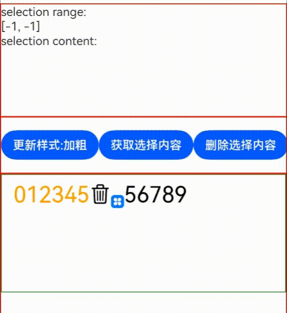

### Example 2

```ts
// xxx.ets
@Entry
@Component
struct RichEditorExample {
  controller: RichEditorController = new RichEditorController()

  // Create a custom keyboard component.
  @Builder CustomKeyboardBuilder() {
    Column() {
      Grid() {
        ForEach([1, 2, 3, 4, 5, 6, 7, 8, 9, '*', 0, '#'], (item: number | string) => {
          GridItem() {
            Button(item + "")
              .width(110).onClick(() => {
              this.controller.addTextSpan(item + '', {
                offset: this.controller.getCaretOffset(),
                style:
                {
                  fontColor: Color.Orange,
                  fontSize: 30
                }
              })
              this.controller.setCaretOffset(this.controller.getCaretOffset() + item.toString().length)
            })
          }
        })
      }.maxCount(3).columnsGap(10).rowsGap(10).padding(5)
    }.backgroundColor(Color.Gray)
  }

  build() {
    Column() {
      RichEditor({ controller: this.controller })
        // Bind the custom keyboard.
        .customKeyboard(this.CustomKeyboardBuilder()).margin(10).border({ width: 1 })
        .height(200)
        .borderWidth(1)
        .borderColor(Color.Red)
        .width("100%")
    }
  }
}
```

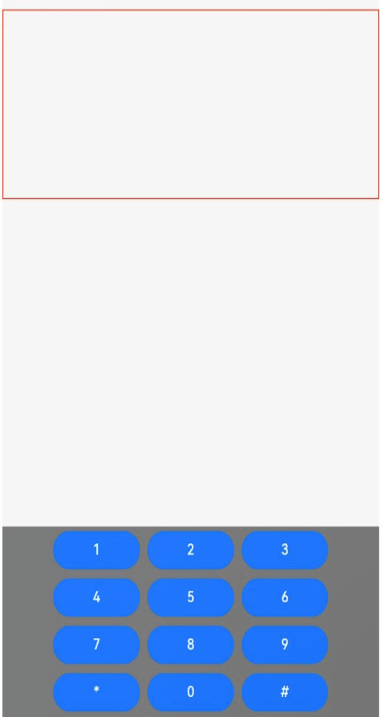

### Example 3

```ts
// xxx.ets
import { BusinessError, pasteboard } from '@kit.BasicServicesKit';

export interface SelectionMenuTheme {
  imageSize: number;
  buttonSize: number;
  menuSpacing: number;
  editorOptionMargin: number;
  expandedOptionPadding: number;
  defaultMenuWidth: number;
  imageFillColor: Resource;
  backGroundColor: Resource;
  iconBorderRadius: Resource;
  containerBorderRadius: Resource;
  cutIcon: Resource;
  copyIcon: Resource;
  pasteIcon: Resource;
  selectAllIcon: Resource;
  shareIcon: Resource;
  translateIcon: Resource;
  searchIcon: Resource;
  arrowDownIcon: Resource;
  iconPanelShadowStyle: ShadowStyle;
  iconFocusBorderColor: Resource;
}

export const defaultTheme: SelectionMenuTheme = {
  imageSize: 24,
  buttonSize: 48,
  menuSpacing: 8,
  editorOptionMargin: 1,
  expandedOptionPadding: 3,
  defaultMenuWidth: 256,
  imageFillColor: $r('sys.color.ohos_id_color_primary'),
  backGroundColor: $r('sys.color.ohos_id_color_dialog_bg'),
  iconBorderRadius: $r('sys.float.ohos_id_corner_radius_default_m'),
  containerBorderRadius: $r('sys.float.ohos_id_corner_radius_card'),
  cutIcon: $r("sys.media.ohos_ic_public_cut"),
  copyIcon: $r("sys.media.ohos_ic_public_copy"),
  pasteIcon: $r("sys.media.ohos_ic_public_paste"),
  selectAllIcon: $r("sys.media.ohos_ic_public_select_all"),
  shareIcon: $r("sys.media.ohos_ic_public_share"),
  translateIcon: $r("sys.media.ohos_ic_public_translate_c2e"),
  searchIcon: $r("sys.media.ohos_ic_public_search_filled"),
  arrowDownIcon: $r("sys.media.ohos_ic_public_arrow_down"),
  iconPanelShadowStyle: ShadowStyle.OUTER_DEFAULT_MD,
  iconFocusBorderColor: $r('sys.color.ohos_id_color_focused_outline'),
}

@Entry
@Component
struct SelectionMenu {
  @State message: string = 'Hello World'
  @State textSize: number = 40
  @State sliderShow: boolean = false
  @State start: number = -1
  @State end: number = -1
  @State colorTransparent: Color = Color.Transparent
  controller: RichEditorController = new RichEditorController();
  options: RichEditorOptions = { controller: this.controller }
  private iconArr: Array<Resource> =
    [$r('app.media.icon'), $r("app.media.icon"), $r('app.media.icon'),
    $r("app.media.icon"), $r('app.media.icon')]
  @State iconBgColor: ResourceColor[] = new Array(this.iconArr.length).fill(this.colorTransparent)
  @State pasteEnable: boolean = false
  @State visibilityValue: Visibility = Visibility.Visible
  @State textStyle: RichEditorTextStyle = {}
  private fontWeightTable: string[] = ["100", "200", "300", "400", "500", "600", "700", "800", "900", "bold", "normal", "bolder", "lighter", "medium", "regular"]
  private theme: SelectionMenuTheme = defaultTheme;

  aboutToAppear() {
    if (this.controller) {
      let richEditorSelection = this.controller.getSelection()
      if (richEditorSelection) {
        let start = richEditorSelection.selection[0]
        let end = richEditorSelection.selection[1]
        if (start === 0 && this.controller.getSpans({ start: end + 1, end: end + 1 }).length === 0) {
          this.visibilityValue = Visibility.None
        } else {
          this.visibilityValue = Visibility.Visible
        }
      }
    }
    let sysBoard = pasteboard.getSystemPasteboard()
    if (sysBoard && sysBoard.hasDataSync()) {
      this.pasteEnable = true
    } else {
      this.pasteEnable = false
    }
  }

  build() {
    Column() {
      Column() {
        RichEditor(this.options)
          .onReady(() => {
            this.controller.addTextSpan(this.message, { style: { fontColor: Color.Orange, fontSize: 30 } })
          })
          .onSelect((value: RichEditorSelection) => {
            if (value.selection[0] == -1 && value.selection[1] == -1) {
              return
            }
            this.start = value.selection[0]
            this.end = value.selection[1]
          })
          .bindSelectionMenu(RichEditorSpanType.TEXT, this.panel, ResponseType.LongPress, { onDisappear: () => {
            this.sliderShow = false
          }})
          .bindSelectionMenu(RichEditorSpanType.TEXT, this.panel, ResponseType.RightClick, { onDisappear: () => {
            this.sliderShow = false
          }})
          .borderWidth(1)
          .borderColor(Color.Red)
          .width(200)
          .height(200)
      }.width('100%').backgroundColor(Color.White)
    }.height('100%')
  }

  PushDataToPasteboard(richEditorSelection: RichEditorSelection) {
    let sysBoard = pasteboard.getSystemPasteboard()
    let pasteData = pasteboard.createData(pasteboard.MIMETYPE_TEXT_PLAIN, '')
    if (richEditorSelection.spans && richEditorSelection.spans.length > 0) {
      let count = richEditorSelection.spans.length
      for (let i = count - 1; i >= 0; i--) {
        let item = richEditorSelection.spans[i]
        if ((item as RichEditorTextSpanResult)?.textStyle) {
          let span = item as RichEditorTextSpanResult
          let style = span.textStyle
          let data = pasteboard.createRecord(pasteboard.MIMETYPE_TEXT_PLAIN, span.value.substring(span.offsetInSpan[0], span.offsetInSpan[1]))
          let prop = pasteData.getProperty()
          let temp: Record<string, Object> = {
            'color': style.fontColor,
            'size': style.fontSize,
            'style': style.fontStyle,
            'weight': this.fontWeightTable[style.fontWeight],
            'fontFamily': style.fontFamily,
            'decorationType': style.decoration.type,
            'decorationColor': style.decoration.color
          }
          prop.additions[i] = temp;
          pasteData.addRecord(data)
          pasteData.setProperty(prop)
        }
      }
    }
    sysBoard.clearData()
    sysBoard.setData(pasteData).then(() => {
      console.info('SelectionMenu copy option, Succeeded in setting PasteData.');
      this.pasteEnable = true;
    }).catch((err: BusinessError) => {
      console.error('SelectionMenu copy option, Failed to set PasteData. Cause:' + err.message);
    })
  }

  PopDataFromPasteboard(richEditorSelection: RichEditorSelection) {
    let start = richEditorSelection.selection[0]
    let end = richEditorSelection.selection[1]
    if (start == end && this.controller) {
      start = this.controller.getCaretOffset()
      end = this.controller.getCaretOffset()
    }
    let moveOffset = 0
    let sysBoard = pasteboard.getSystemPasteboard()
    sysBoard.getData((err, data) => {
      if (err) {
        return
      }
      let count = data.getRecordCount()
      for (let i = 0; i < count; i++) {
        const element = data.getRecord(i);
        let tex: RichEditorTextStyle = {
          fontSize: 16,
          fontColor: Color.Black,
          fontWeight: FontWeight.Normal,
          fontFamily: "HarmonyOS Sans",
          fontStyle: FontStyle.Normal,
          decoration: { type: TextDecorationType.None, color: "#FF000000", style: TextDecorationStyle.SOLID }
        }
        if (data.getProperty() && data.getProperty().additions[i]) {
          const tmp = data.getProperty().additions[i] as Record<string, Object | undefined>;
          if (tmp.color) {
            tex.fontColor = tmp.color as ResourceColor;
          }
          if (tmp.size) {
            tex.fontSize = tmp.size as Length | number;
          }
          if (tmp.style) {
            tex.fontStyle = tmp.style as FontStyle;
          }
          if (tmp.weight) {
            tex.fontWeight = tmp.weight as number | FontWeight | string;
          }
          if (tmp.fontFamily) {
            tex.fontFamily = tmp.fontFamily as ResourceStr;
          }
          if (tmp.decorationType && tex.decoration) {
            tex.decoration.type = tmp.decorationType as TextDecorationType;
          }
          if (tmp.decorationColor && tex.decoration) {
            tex.decoration.color = tmp.decorationColor as ResourceColor;
          }
          if (tex.decoration) {
            tex.decoration = { type: tex.decoration.type, color: tex.decoration.color }
          }
        }
        if (element && element.plainText && element.mimeType === pasteboard.MIMETYPE_TEXT_PLAIN && this.controller) {
          this.controller.addTextSpan(element.plainText,
            {
              style: tex,
              offset: start + moveOffset
            }
          )
          moveOffset += element.plainText.length
        }
      }
      if (this.controller) {
        this.controller.setCaretOffset(start + moveOffset)
        this.controller.closeSelectionMenu()
      }
      if (start != end && this.controller) {
        this.controller.deleteSpans({ start: start + moveOffset, end: end + moveOffset })
      }
    })
  }

  @Builder
  panel() {
    Column() {
      this.iconPanel()
      if (!this.sliderShow) {
        this.SystemMenu()
      } else {
        this.sliderPanel()
      }
    }.width(256)
  }

  @Builder iconPanel() {
    Column() {
      Row({ space: 2 }) {
        ForEach(this.iconArr, (item:Resource, index ?: number) => {
          Flex({ justifyContent: FlexAlign.Center, alignItems: ItemAlign.Center }) {
            Image(item).fillColor(this.theme.imageFillColor).width(24).height(24).focusable(true).draggable(false)
          }
          .borderRadius(this.theme.iconBorderRadius)
          .width(this.theme.buttonSize)
          .height(this.theme.buttonSize)
          .onClick(() => {
            if (index as number == 0) {
              this.sliderShow = false
              if (this.controller) {
                let selection = this.controller.getSelection();
                let spans = selection.spans
                spans.forEach((item: RichEditorTextSpanResult | RichEditorImageSpanResult, index) => {
                  if (typeof (item as RichEditorTextSpanResult)['textStyle'] != 'undefined') {
                    let span = item as RichEditorTextSpanResult
                    this.textStyle = span.textStyle
                    let start = span.offsetInSpan[0]
                    let end = span.offsetInSpan[1]
                    let offset = span.spanPosition.spanRange[0]
                    if (this.textStyle.fontWeight != 11) {
                      this.textStyle.fontWeight = FontWeight.Bolder
                    } else {
                      this.textStyle.fontWeight = FontWeight.Normal
                    }
                    this.controller.updateSpanStyle({
                      start: offset + start,
                      end: offset + end,
                      textStyle: this.textStyle
                    })
                  }
                })
              }
            } else if (index as number == 1) {
              this.sliderShow = false
              if (this.controller) {
                let selection = this.controller.getSelection();
                let spans = selection.spans
                spans.forEach((item: RichEditorTextSpanResult | RichEditorImageSpanResult, index) => {
                  if (typeof (item as RichEditorTextSpanResult)['textStyle'] != 'undefined') {
                    let span = item as RichEditorTextSpanResult
                    this.textStyle = span.textStyle
                    let start = span.offsetInSpan[0]
                    let end = span.offsetInSpan[1]
                    let offset = span.spanPosition.spanRange[0]
                    if (this.textStyle.fontStyle == FontStyle.Italic) {
                      this.textStyle.fontStyle = FontStyle.Normal
                    } else {
                      this.textStyle.fontStyle = FontStyle.Italic
                    }
                    this.controller.updateSpanStyle({
                      start: offset + start,
                      end: offset + end,
                      textStyle: this.textStyle
                    })
                  }
                })
              }
            } else if (index as number == 2) {
              this.sliderShow = false
              if (this.controller) {
                let selection = this.controller.getSelection();
                let spans = selection.spans
                spans.forEach((item: RichEditorTextSpanResult | RichEditorImageSpanResult, index) => {
                  if (typeof (item as RichEditorTextSpanResult)['textStyle'] != 'undefined') {
                    let span = item as RichEditorTextSpanResult
                    this.textStyle = span.textStyle
                    let start = span.offsetInSpan[0]
                    let end = span.offsetInSpan[1]
                    let offset = span.spanPosition.spanRange[0]
                    if (this.textStyle.decoration) {
                      if (this.textStyle.decoration.type == TextDecorationType.Underline) {
                        this.textStyle.decoration.type = TextDecorationType.None
                      } else {
                        this.textStyle.decoration.type = TextDecorationType.Underline
                      }
                    } else {
                      this.textStyle.decoration = { type: TextDecorationType.Underline, color: Color.Black, style: TextDecorationStyle.SOLID }
                    }
                    this.controller.updateSpanStyle({
                      start: offset + start,
                      end: offset + end,
                      textStyle: this.textStyle
                    })
                  }
                })
              }
            } else if (index as number == 3) {
              this.sliderShow = !this.sliderShow
            } else if (index as number == 4) {
              this.sliderShow = false
              if (this.controller) {
                let selection = this.controller.getSelection();
                let spans = selection.spans
                spans.forEach((item: RichEditorTextSpanResult | RichEditorImageSpanResult, index) => {
                  if (typeof (item as RichEditorTextSpanResult)['textStyle'] != 'undefined') {
                    let span = item as RichEditorTextSpanResult
                    this.textStyle = span.textStyle
                    let start = span.offsetInSpan[0]
                    let end = span.offsetInSpan[1]
                    let offset = span.spanPosition.spanRange[0]
                    if (this.textStyle.fontColor == Color.Orange || this.textStyle.fontColor == '#FFFFA500') {
                      this.textStyle.fontColor = Color.Black
                    } else {
                      this.textStyle.fontColor = Color.Orange
                    }
                    this.controller.updateSpanStyle({
                      start: offset + start,
                      end: offset + end,
                      textStyle: this.textStyle
                    })
                  }
                })
              }
            }
          })
          .onTouch((event?: TouchEvent | undefined) => {
            if(event != undefined){
              if (event.type === TouchType.Down) {
                this.iconBgColor[index as number] = $r('sys.color.ohos_id_color_click_effect')
              }
              if (event.type === TouchType.Up) {
                this.iconBgColor[index as number] = this.colorTransparent
              }
            }
          })
          .onHover((isHover?: boolean, event?: HoverEvent) => {
            this.iconBgColor.forEach((icon:ResourceColor, index1) => {
              this.iconBgColor[index1] = this.colorTransparent
            })
            if(isHover != undefined) {
              this.iconBgColor[index as number] = $r('sys.color.ohos_id_color_hover')
            }
          })
          .backgroundColor(this.iconBgColor[index as number])
        })
      }
    }
    .clip(true)
    .width(this.theme.defaultMenuWidth)
    .padding(this.theme.expandedOptionPadding)
    .borderRadius(this.theme.containerBorderRadius)
    .margin({ bottom: this.theme.menuSpacing })
    .backgroundColor(this.theme.backGroundColor)
    .shadow(this.theme.iconPanelShadowStyle)
  }

  @Builder
  SystemMenu() {
    Column() {
      Menu() {
        if (this.controller) {
          MenuItemGroup() {
            MenuItem({ startIcon: this.theme.cutIcon, content: "Cut", labelInfo: "Ctrl+X" })
              .onClick(() => {
                if (!this.controller) {
                  return
                }
                let richEditorSelection = this.controller.getSelection()
                this.PushDataToPasteboard(richEditorSelection);
                this.controller.deleteSpans({
                  start: richEditorSelection.selection[0],
                  end: richEditorSelection.selection[1]
                })
              })
            MenuItem({ startIcon: this.theme.copyIcon, content: "Copy", labelInfo: "Ctrl+C" })
              .onClick(() => {
                if (!this.controller) {
                  return
                }
                let richEditorSelection = this.controller.getSelection()
                this.PushDataToPasteboard(richEditorSelection);
                this.controller.closeSelectionMenu()
              })
            MenuItem({ startIcon: this.theme.pasteIcon, content: "Paste", labelInfo: "Ctrl+V" })
              .enabled(this.pasteEnable)
              .onClick(() => {
                if (!this.controller) {
                  return
                }
                let richEditorSelection = this.controller.getSelection()
                this.PopDataFromPasteboard(richEditorSelection)
              })
            MenuItem({ startIcon: this.theme.selectAllIcon, content: "Select all", labelInfo: "Ctrl+A" })
              .visibility(this.visibilityValue)
              .onClick(() => {
                if (!this.controller) {
                  return
                }
                this.controller.setSelection(-1, -1)
                this.visibilityValue = Visibility.None
              })
            MenuItem({ startIcon: this.theme.shareIcon, content: "Share", labelInfo: "" })
              .enabled(false)
            MenuItem({ startIcon: this.theme.translateIcon, content: "Translate", labelInfo: "" })
              .enabled(false)
            MenuItem({ startIcon: this.theme.searchIcon, content: "Search", labelInfo: "" })
              .enabled(false)
          }
        }
      }
      .onVisibleAreaChange([0.0, 1.0], () => {
        if (!this.controller) {
          return
        }
        let richEditorSelection = this.controller.getSelection()
        let start = richEditorSelection.selection[0]
        let end = richEditorSelection.selection[1]
        if (start === 0 && this.controller.getSpans({ start: end + 1, end: end + 1 }).length === 0) {
          this.visibilityValue = Visibility.None
        } else {
          this.visibilityValue = Visibility.Visible
        }
      })
      .radius(this.theme.containerBorderRadius)
      .clip(true)
      .backgroundColor(Color.White)
      .width(this.theme.defaultMenuWidth)
    }
    .width(this.theme.defaultMenuWidth)
  }

  @Builder sliderPanel() {
    Column() {
      Flex({ justifyContent: FlexAlign.SpaceBetween, alignItems: ItemAlign.Center }) {
        Text('A').fontSize(15)
        Slider({ value: this.textSize, step: 10, style: SliderStyle.InSet })
          .width(210)
          .onChange((value: number, mode: SliderChangeMode) => {
            if (this.controller) {
              let selection = this.controller.getSelection();
              if (mode == SliderChangeMode.End) {
                if (this.textSize == undefined) {
                  this.textSize = 0
                }
                let spans = selection.spans
                spans.forEach((item: RichEditorTextSpanResult | RichEditorImageSpanResult, index) => {
                  if (typeof (item as RichEditorTextSpanResult)['textStyle'] != 'undefined') {
                    this.textSize = Math.max(this.textSize, (item as RichEditorTextSpanResult).textStyle.fontSize)
                  }
                })
              }
              if (mode == SliderChangeMode.Moving || mode == SliderChangeMode.Click) {
                this.start = selection.selection[0]
                this.end = selection.selection[1]
                this.textSize = value
                this.controller.updateSpanStyle({
                  start: this.start,
                  end: this.end,
                  textStyle: { fontSize: this.textSize }
                })
              }
            }
          })
        Text('A').fontSize(20).fontWeight(FontWeight.Medium)
      }.borderRadius(this.theme.containerBorderRadius)
    }
    .shadow(ShadowStyle.OUTER_DEFAULT_MD)
    .backgroundColor(Color.White)
    .borderRadius(this.theme.containerBorderRadius)
    .padding(15)
    .height(48)
  }
}
```
> **NOTE**
>
> Icons in bold and italics are not preset in the system. The sample code uses the default icons. You need to replace the icons in **iconArr** with the desired icons.

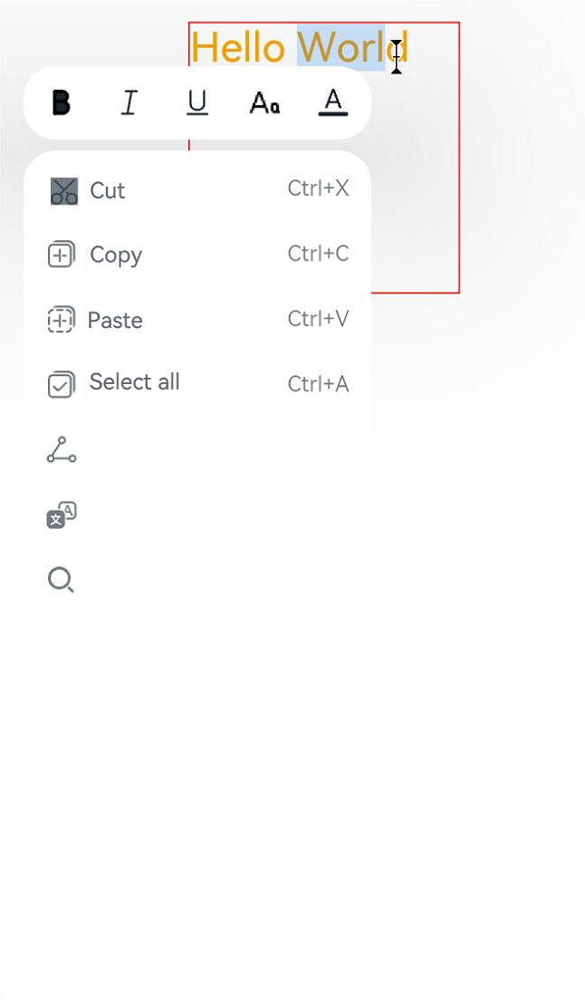

### Example 4

```ts
// xxx.ets
@Entry
@Component
struct Index {
  controller: RichEditorController = new RichEditorController();
  options: RichEditorOptions = { controller: this.controller };
  private start: number = -1;
  private end: number = -1;
  @State message: string = "[-1, -1]"
  @State content: string = ""
  @State paddingVal: number = 5
  @State borderRad: number = 4

  build() {
    Column() {
      Column() {
        Text("selection range:").width("100%")
        Text() {
          Span(this.message)
        }.width("100%")
        Text("selection content:").width("100%")
        Text() {
          Span(this.content)
        }.width("100%")
      }
      .borderWidth(1)
      .borderColor(Color.Red)
      .width("100%")
      .height("20%")

      Row() {
        Button("updateSpanStyle1")
          .fontSize(12)
          .onClick(() => {
            this.controller.updateSpanStyle({
              start: this.start,
              textStyle:
              {
                fontWeight: FontWeight.Bolder
              },
              imageStyle: {
                size: ["80px", "80px"],
                layoutStyle: {
                  borderRadius: undefined,
                  margin: undefined
                }
              }
            })
          })

        Button("updateSpanStyle2")
          .fontSize(12)
          .onClick(() => {
            this.controller.updateSpanStyle({
              start: this.start,
              textStyle:
              {
                fontWeight: FontWeight.Bolder
              },
              imageStyle: {
                size: ["70px", "70px"],
                layoutStyle: {
                  borderRadius: { topLeft: '100px', topRight: '20px', bottomLeft: '100px', bottomRight: '20px' },
                  margin: { left: '30px', top: '20px', right: '20px', bottom: '20px' }
                }
              }
            })
          })

        Button("updateSpanStyle3")
          .fontSize(12)
          .onClick(() => {
            this.controller.updateSpanStyle({
              start: this.start,
              textStyle:
              {
                fontWeight: FontWeight.Bolder
              },
              imageStyle: {
                size: ["60px", "60px"],
                layoutStyle: {
                  borderRadius: '-10px',
                  margin: '-10px'
                }
              }
            })
          })
      }
      .borderWidth(1)
      .borderColor(Color.Red)
      .width("100%")
      .height("10%")

      Row() {
        Button('addImageSpan1')
          .fontSize(12)
          .onClick(() => {
            this.controller.addImageSpan($r('app.media.app_icon'), {
              imageStyle: {
                size: ["80px", "80px"],
                layoutStyle: {
                  borderRadius: '50px',
                  margin: '40px'
                }
              }
            })
          })

        Button('addImageSpan2')
          .fontSize(12)
          .onClick(() => {
            this.controller.addImageSpan($r('app.media.app_icon'), {
              imageStyle: {
                size: ["100px", "100px"],
                verticalAlign: ImageSpanAlignment.BOTTOM,
                layoutStyle: {
                  borderRadius: undefined,
                  margin: undefined
                }
              }
            })
          })

        Button('addImageSpan3')
          .fontSize(12)
          .onClick(() => {
            this.controller.addImageSpan($r('app.media.app_icon'), {
              imageStyle: {
                size: ["60px", "60px"],
                verticalAlign: ImageSpanAlignment.BOTTOM,
                layoutStyle: {
                  borderRadius: { topLeft: '10px', topRight: '20px', bottomLeft: '30px', bottomRight: '40px' },
                  margin: { left: '10px', top: '20px', right: '30px', bottom: '40px' }
                }
              }
            })
          })
      }
      .borderWidth(1)
      .borderColor(Color.Red)
      .width("100%")
      .height("10%")

      Column() {
        RichEditor(this.options)
          .onReady(() => {
            this.controller.addTextSpan("0123456789",
              {
                style:
                {
                  fontColor: Color.Orange,
                  fontSize: 30
                }
              })

            this.controller.addImageSpan($r("app.media.app_icon"),
              {
                imageStyle:
                {
                  size: ["60px", "60px"],
                  verticalAlign: ImageSpanAlignment.BOTTOM,
                  layoutStyle: {
                    borderRadius: { topLeft: '10px', topRight: '20px', bottomLeft: '30px', bottomRight: '40px' },
                    margin: { left: '10px', top: '20px', right: '30px', bottom: '40px' }
                  }
                }
              })

            this.controller.addTextSpan("0123456789",
              {
                style:
                {
                  fontColor: Color.Black,
                  fontSize: 30
                }
              })
          })
          .onSelect((value: RichEditorSelection) => {
            this.start = value.selection[0];
            this.end = value.selection[1];
            this.message = "[" + this.start + ", " + this.end + "]"
          })
          .aboutToIMEInput((value: RichEditorInsertValue) => {
            console.log("---------------------- aboutToIMEInput ----------------------")
            console.log("insertOffset:" + value.insertOffset)
            console.log("insertValue:" + value.insertValue)
            return true;
          })
          .onIMEInputComplete((value: RichEditorTextSpanResult) => {
            console.log("---------------------- onIMEInputComplete ---------------------")
            console.log("spanIndex:" + value.spanPosition.spanIndex)
            console.log("spanRange:[" + value.spanPosition.spanRange[0] + "," + value.spanPosition.spanRange[1] + "]")
            console.log("offsetInSpan:[" + value.offsetInSpan[0] + "," + value.offsetInSpan[1] + "]")
            console.log("value:" + value.value)
          })
          .aboutToDelete((value: RichEditorDeleteValue) => {
            console.log("---------------------- aboutToDelete --------------------------")
            console.log("offset:" + value.offset)
            console.log("direction:" + value.direction)
            console.log("length:" + value.length)
            value.richEditorDeleteSpans.forEach(item => {
              console.log("---------------------- item --------------------------")
              console.log("spanIndex:" + item.spanPosition.spanIndex)
              console.log("spanRange:[" + item.spanPosition.spanRange[0] + "," + item.spanPosition.spanRange[1] + "]")
              console.log("offsetInSpan:[" + item.offsetInSpan[0] + "," + item.offsetInSpan[1] + "]")
              if (typeof (item as RichEditorImageSpanResult)['imageStyle'] != 'undefined') {
                console.log("image:" + (item as RichEditorImageSpanResult).valueResourceStr)
              } else {
                console.log("text:" + (item as RichEditorTextSpanResult).value)
              }
            })
            return true;
          })
          .onDeleteComplete(() => {
            console.log("---------------------- onDeleteComplete ------------------------")
          })
          .borderWidth(1)
          .borderColor(Color.Green)
          .width("100%")
          .height('80.00%')
      }
      .borderWidth(1)
      .borderColor(Color.Red)
      .width("100%")
      .height("70%")
    }
  }
}
```


### Example 5

```ts
// xxx.ets
@Entry
@Component
struct Index {
  controller: RichEditorController = new RichEditorController()
  options: RichEditorOptions = { controller: this.controller };
  @State textFlag: string = "TextFlag";

  build() {
    Column() {
      Column() {
        Text(this.textFlag)
          .copyOption(CopyOptions.InApp)
          .fontSize(50)
      }
      Divider()
      Column() {
        RichEditor(this.options)
          .onReady(() => {
            this.controller.addTextSpan('Area1\n', {
              style:
              {
                fontColor: Color.Orange,
                fontSize: 50
              },
              gesture:
              {
                onClick: () => {
                  this.textFlag = "Area1 is onClick."
                },
                onLongPress: () => {
                  this.textFlag = "Area1 is onLongPress."
                }
              }
            })

            this.controller.addTextSpan('Area2\n', {
              style:
              {
                fontColor: Color.Blue,
                fontSize: 50
              },
              gesture:
              {
                onClick: () => {
                  this.textFlag = "Area2 is onClick."
                },
                onLongPress: () => {
                  this.textFlag = "Area2 is onLongPress."
                }
              }
            })

            this.controller.addImageSpan($r("app.media.icon"),
              {
                imageStyle:
                {
                  size: ["100px", "100px"],
                  layoutStyle: {
                    margin: 5,
                    borderRadius: 15
                  }
                },
                gesture:
                {
                  onClick: () => {
                    this.textFlag = "ImageSpan is onClick."
                  },
                  onLongPress: () => {
                    this.textFlag = "ImageSpan is onLongPress."
                  }
                }
              })
          })
      }
      .borderWidth(1)
      .borderColor(Color.Red)
      .width("100%")
      .height("70%")
    }
  }
}
```
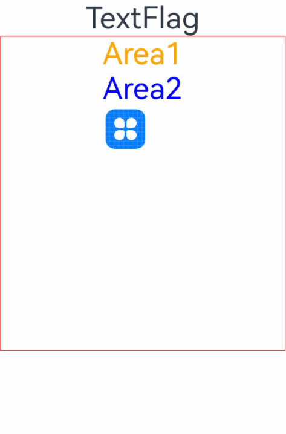

### Example 6

```ts
// xxx.ets
@Entry
@Component
struct Index {
  controller: RichEditorController = new RichEditorController();
  private spanParagraphs: RichEditorParagraphResult[] = [];

  build() {
    Column() {
      RichEditor({ controller: this.controller })
        .onReady(() => {
          this.controller.addTextSpan("0123456789\n", {
            style: {
              fontColor: Color.Pink,
              fontSize: "32",
            },
            paragraphStyle: {
              textAlign: TextAlign.Start,
              leadingMargin: 16
            }
          })
          this.controller.addTextSpan("0123456789")
        })
        .width("80%")
        .height("30%")
        .border({ width: 1, radius: 5 })
        .draggable(false)

      Column({ space: 5 }) {
        Button ("Align left").onClick () => {
          this.controller.updateParagraphStyle({ start: -1, end: -1,
            style: {
              textAlign: TextAlign.Start,
            }
          })
        })

        Button ("Align right").onClick(() => {
          this.controller.updateParagraphStyle({ start: -1, end: -1,
            style: {
              textAlign: TextAlign.End,
            }
          })
        })

        Button ("Center").onClick ((). => {
          this.controller.updateParagraphStyle({ start: -1, end: -1,
            style: {
              textAlign: TextAlign.Center,
            }
          })
        })
        Divider()
        Button("getParagraphs").onClick(() => {
          this.spanParagraphs = this.controller.getParagraphs({ start: -1, end: -1 })
          console.log("RichEditor getParagraphs:" + JSON.stringify(this.spanParagraphs))
        })

        Button("UpdateSpanStyle1").onClick(() => {
          this.controller.updateSpanStyle({ start: -1, end: -1,
            textStyle: {
              fontColor: Color.Brown,
              fontSize: 20
            }
          })
        })

        Button("UpdateSpanStyle2").onClick(() => {
          this.controller.updateSpanStyle({ start: -1, end: -1,
            textStyle: {
              fontColor: Color.Green,
              fontSize: 30
            }
          })
        })
      }
    }
  }
}
```


### Example 7

```ts
// xxx.ets
import { font } from '@kit.ArkUI'

const canvasWidth = 1000
const canvasHeight = 100
const Indentation = 40
class LeadingMarginCreator {
  private settings: RenderingContextSettings = new RenderingContextSettings(true)
  private offscreenCanvas: OffscreenCanvas = new OffscreenCanvas(canvasWidth, canvasHeight)
  private offContext: OffscreenCanvasRenderingContext2D = this.offscreenCanvas.getContext("2d", this.settings)
  public static instance: LeadingMarginCreator = new LeadingMarginCreator()

  // Obtain the font size level, which ranges from 0 to 4.
  public getFontSizeLevel(fontSize: number) {
    const fontScaled: number = Number(fontSize) / 16

    enum FontSizeScaleThreshold {
      SMALL = 0.9,
      NORMAL = 1.1,
      LEVEL_1_LARGE = 1.2,
      LEVEL_2_LARGE = 1.4,
      LEVEL_3_LARGE = 1.5
    }

    let fontSizeLevel: number = 1

    if (fontScaled < FontSizeScaleThreshold.SMALL) {
      fontSizeLevel = 0
    } else if (fontScaled < FontSizeScaleThreshold.NORMAL) {
      fontSizeLevel = 1
    } else if (fontScaled < FontSizeScaleThreshold.LEVEL_1_LARGE) {
      fontSizeLevel = 2
    } else if (fontScaled < FontSizeScaleThreshold.LEVEL_2_LARGE) {
      fontSizeLevel = 3
    } else if (fontScaled < FontSizeScaleThreshold.LEVEL_3_LARGE) {
      fontSizeLevel = 4
    } else {
      fontSizeLevel = 1
    }

    return fontSizeLevel
  }
  // Obtain the font size level, which ranges from 0 to 4.
  public getmarginLevel(Width: number) {
    let marginlevel: number = 1
    if (Width == 40) {
      marginlevel = 2.0
    } else if (Width == 80) {
      marginlevel = 1.0
    } else if (Width == 120) {
      marginlevel = 2/3
    } else if (Width == 160) {
      marginlevel = 0.5
    } else if (Width == 200) {
      marginlevel = 0.4
    }
    return marginlevel
  }

  public genStrMark(fontSize: number, str: string): PixelMap {
    this.offContext = this.offscreenCanvas.getContext("2d", this.settings)
    this.clearCanvas()
    this.offContext.font = fontSize + 'vp sans-serif'
    this.offContext.fillText(str + '.', 0, fontSize * 0.9)
    return this.offContext.getPixelMap(0, 0, fontSize * (str.length + 1) / 1.75, fontSize)
  }

  public genSquareMark(fontSize: number): PixelMap {
    this.offContext = this.offscreenCanvas.getContext("2d", this.settings)
    this.clearCanvas()
    const coordinate = fontSize * (1 - 1 / 1.5) / 2
    const sideLength = fontSize / 1.5
    this.offContext.fillRect(coordinate, coordinate, sideLength, sideLength)
    return this.offContext.getPixelMap(0, 0, fontSize, fontSize)
  }

  // Generate a circle symbol.
  public genCircleMark(fontSize: number, width: number, level?: number ): PixelMap {
    const indentLevel = level ?? 1
    const offsetLevel = [22, 28, 32, 34, 38]
    const fontSizeLevel = this.getFontSizeLevel(fontSize)
    const marginlevel = this.getmarginLevel(width)
    const newCanvas = new OffscreenCanvas(canvasWidth, canvasHeight)
    const newOffContext: OffscreenCanvasRenderingContext2D = newCanvas.getContext("2d", this.settings)
    const centerCoordinate = 50
    const radius = 10
    this.clearCanvas()
    newOffContext.ellipse(100 * (indentLevel + 1) - centerCoordinate * marginlevel, offsetLevel[fontSizeLevel], radius * marginlevel, radius, 0, 0, 2 * Math.PI)
    newOffContext.fillStyle = '66FF0000'
    newOffContext.fill()
    return newOffContext.getPixelMap(0, 0, 100 + 100 * indentLevel, 100)
  }

  private clearCanvas() {
    this.offContext.clearRect(0, 0, canvasWidth, canvasHeight)
  }
}

@Entry
@Component
struct Index {
  controller: RichEditorController = new RichEditorController()
  options: RichEditorOptions = { controller: this.controller }
  private leadingMarkCreatorInstance = LeadingMarginCreator.instance
  private fontNameRawFile: string = 'MiSans-Bold'
  @State fs: number = 30
  @State cl: number = Color.Black
  private leftMargin: Dimension = 0
  private richEditorTextStyle: RichEditorTextStyle = {}

  aboutToAppear() {
    font.registerFont({
      familyName: 'MiSans-Bold',
      familySrc: '/font/MiSans-Bold.ttf'
    })
  }

  build() {
    Scroll() {
      Column() {
        RichEditor(this.options)
          .onReady(() => {
            this.controller.addTextSpan("0123456789\n",
              {
                style:
                {
                  fontWeight: 'medium',
                  fontFamily: this.fontNameRawFile,
                  fontColor: Color.Red,
                  fontSize: 50,
                  fontStyle: FontStyle.Italic,
                  decoration: { type: TextDecorationType.Underline, color: Color.Green }
                }
              })

            this.controller.addTextSpan("abcdefg",
              {
                style:
                {
                  fontWeight: FontWeight.Lighter,
                  fontFamily: 'HarmonyOS Sans',
                  fontColor: 'rgba(0,128,0,0.5)',
                  fontSize: 30,
                  fontStyle: FontStyle.Normal,
                  decoration: { type: TextDecorationType.Overline, color: 'rgba(169, 26, 246, 0.50)' }
                }
              })
          })
          .borderWidth(1)
          .borderColor(Color.Green)
          .width("100%")
          .height("50%")

        Row({ space: 5 }) {
          Button('setTypingStyle1')
            .fontSize(10)
            .onClick(() => {
              this.controller.setTypingStyle(
                {
                  fontWeight: 'medium',
                  fontFamily: this.fontNameRawFile,
                  fontColor: Color.Blue,
                  fontSize: 50,
                  fontStyle: FontStyle.Italic,
                  decoration: { type: TextDecorationType.Underline, color: Color.Green }
                })
            })

          Button('setTypingStyle2')
            .fontSize(10)
            .onClick(() => {
              this.controller.setTypingStyle(
                {
                  fontWeight: FontWeight.Lighter,
                  fontFamily: 'HarmonyOS Sans',
                  fontColor: Color.Green,
                  fontSize: '30',
                  fontStyle: FontStyle.Normal,
                  decoration: { type: TextDecorationType.Overline, color: 'rgba(169, 26, 246, 0.50)' }
                })
            })
        }
        Divider()
        Button("getTypingStyle").onClick(() => {
          this.richEditorTextStyle = this.controller.getTypingStyle()
          console.log("RichEditor getTypingStyle:" + JSON.stringify(this.richEditorTextStyle))
        })
        Divider()
        Row({ space: 5 }) {
          Button ("Increase Bullet Indent").onClick(() => {
            let margin = Number(this.leftMargin)
            if (margin < 200) {
              margin += Indentation
              this.leftMargin = margin
            }
            this.controller.updateParagraphStyle({
              start: -10,
              end: -10,
              style: {
                leadingMargin : {
                  pixelMap : this.leadingMarkCreatorInstance.genCircleMark(100, margin, 1),
                  size: [margin, 40]
                }
              }
            })
          })

          Button("Decrease Bullet Indent").onClick(() => {
            let margin = Number(this.leftMargin)
            if (margin > 0) {
              margin -= Indentation
              this.leftMargin = margin
            }
            this.controller.updateParagraphStyle({
              start: -10,
              end: -10,
              style: {
                leadingMargin : {
                  pixelMap : this.leadingMarkCreatorInstance.genCircleMark(100, margin, 1),
                  size: [margin, 40]
                }
              }
            })
          })
        }
        Divider()
        Row({ space: 5 }) {
          Button ("Increase Indent").onClick(() => {
            let margin = Number(this.leftMargin)
            if (margin < 200) {
              margin += Indentation
              this.leftMargin = margin
            }
            this.controller.updateParagraphStyle({
              start: -10,
              end: -10,
              style: {
                leadingMargin: margin
              }
            })
          })

          Button("Decrease Indent").onClick(() => {
            let margin = Number(this.leftMargin)
            if (margin > 0) {
              margin -= Indentation
              this.leftMargin = margin
            }
            this.controller.updateParagraphStyle({
              start: -10,
              end: -10,
              style: {
                leadingMargin: margin
              }
            })
          })
        }
      }.borderWidth(1).borderColor(Color.Red)
    }
  }
}
```
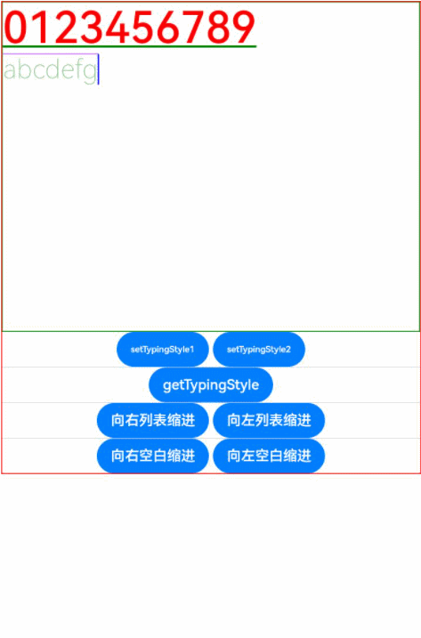

### Example 8
``` ts
@Entry
@Component
struct Index {
  controller: RichEditorController = new RichEditorController();
  options: RichEditorOptions = { controller: this.controller };
  private start: number = -1;
  private end: number = -1;
  @State message: string = "[-1, -1]"
  @State content: string = ""
  @State visable :number = 0;
  @State index:number = 0;
  @State offsetx: number = 0;
  @State textShadows : (ShadowOptions | Array<ShadowOptions> ) =
    [{ radius: 10, color: Color.Red, offsetX: 10, offsetY: 0 },{ radius: 10, color: Color.Black, offsetX: 20, offsetY: 0 },
      { radius: 10, color: Color.Brown, offsetX: 30, offsetY: 0 },{ radius: 10, color: Color.Green, offsetX: 40, offsetY: 0 },
      { radius: 10, color: Color.Yellow, offsetX: 100, offsetY: 0 }]
  @State textshadowOf : ShadowOptions[] = []
  build() {
    Column() {
      Column() {
        Text("selection range:").width("100%")
        Text() {
          Span(this.message)
        }.width("100%")
        Text("selection content:").width("100%")
        Text() {
          Span(this.content)
        }.width("100%")
      }
      .borderWidth(1)
      .borderColor(Color.Red)
      .width("100%")
      .height("20%")
      Row() {
        Button("Update Style: Bold & Text Shadow").onClick(() => {
          this.controller.updateSpanStyle({
            start: this.start,
            end: this.end,
            textStyle:
            {
              fontWeight: FontWeight.Bolder,
              textShadow: this.textShadows
            }
          })
        })
      }
      .borderWidth(1)
      .borderColor(Color.Red)
      .width("100%")
      .height("10%")
      Column() {
        RichEditor(this.options)
          .onReady(() => {
            this.controller.addTextSpan("0123456789",
              {
                style:
                {
                  fontColor: Color.Orange,
                  fontSize: 30,
                  textShadow: { radius: 10, color: Color.Blue, offsetX: 10, offsetY: 0 }
                }
              })
          })
          .borderWidth(1)
          .borderColor(Color.Green)
          .width("100%")
          .height("30%")
      }
      .borderWidth(1)
      .borderColor(Color.Red)
      .width("100%")
      .height("70%")
    }
  }
}
```

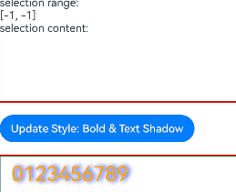

### Example 9
``` ts
@Builder
function placeholderBuilder2() {
  Row({ space: 2 }) {
    Image($r("app.media.icon")).width(24).height(24).margin({ left: -5 })
    Text('okokokok').fontSize(10)
  }.width('20%').height(50).padding(10).backgroundColor(Color.Red)
}

// xxx.ets
@Entry
@Component
struct Index {
  controller: RichEditorController = new RichEditorController();
  option: RichEditorOptions = { controller: this.controller };
  private start: number = 2;
  private end: number = 4;
  @State message: string = "[-1, -1]"
  @State content: string = ""
  private my_offset: number | undefined = undefined
  private my_builder: CustomBuilder = undefined

  @Builder
  placeholderBuilder() {
    Row({ space: 2 }) {
      Image($r("app.media.icon")).width(24).height(24).margin({ left: -5 })
      Text('Custom Popup').fontSize(10)
    }.width(100).height(50).padding(5)
  }

  @Builder
  placeholderBuilder3() {
    Text("hello").padding('20').borderWidth(1).width('100%')
  }

  @Builder
  placeholderBuilder4() {
    Column() {
      Column({ space: 5 }) {
        Text('direction:Row').fontSize(9).fontColor(0xCCCCCC).width('90%')
        Flex({ direction: FlexDirection.Row }) { // The child components are arranged in the same direction as the main axis runs along the rows.
          Text('1').width('20%').height(50).backgroundColor(0xF5DEB3)
          Text('1').width('20%').height(50).backgroundColor(0xD2B48C)
          Text('1').width('20%').height(50).backgroundColor(0xF5DEB3)
          Text('1').width('20%').height(50).backgroundColor(0xD2B48C)
        }
        .height(70)
        .width('90%')
        .padding(10)
        .backgroundColor(0xAFEEEE)

        Text('direction:RowReverse').fontSize(9).fontColor(0xCCCCCC).width('90%')
        Flex({ direction: FlexDirection.RowReverse }) { // The child components are arranged opposite to the Row direction.
          Text('1').width('20%').height(50).backgroundColor(0xF5DEB3)
          Text('1').width('20%').height(50).backgroundColor(0xD2B48C)
          Text('1').width('20%').height(50).backgroundColor(0xF5DEB3)
          Text('1').width('20%').height(50).backgroundColor(0xD2B48C)
        }
        .height(70)
        .width('90%')
        .padding(10)
        .backgroundColor(0xAFEEEE)

        Text('direction:Column').fontSize(9).fontColor(0xCCCCCC).width('90%')
        Flex({ direction: FlexDirection.Column }) { // The child components are arranged in the same direction as the main axis runs down the columns.
          Text('1').width('20%').height(40).backgroundColor(0xF5DEB3)
          Text('1').width('20%').height(40).backgroundColor(0xD2B48C)
          Text('1').width('20%').height(40).backgroundColor(0xF5DEB3)
          Text('1').width('20%').height(40).backgroundColor(0xD2B48C)
        }
        .height(160)
        .width('90%')
        .padding(10)
        .backgroundColor(0xAFEEEE)

        Text('direction:ColumnReverse').fontSize(9).fontColor(0xCCCCCC).width('90%')
        Flex({ direction: FlexDirection.ColumnReverse }) { // The child components are arranged opposite to the Column direction.
          Text('1').width('20%').height(40).backgroundColor(0xF5DEB3)
          Text('1').width('20%').height(40).backgroundColor(0xD2B48C)
          Text('1').width('20%').height(40).backgroundColor(0xF5DEB3)
          Text('1').width('20%').height(40).backgroundColor(0xD2B48C)
        }
        .height(160)
        .width('90%')
        .padding(10)
        .backgroundColor(0xAFEEEE)
      }.width('100%').margin({ top: 5 })
    }.width('100%')
  }

  @Builder
  MyMenu() {
    Menu() {
      MenuItem({ startIcon: $r("app.media.icon"), content: "Menu option 1" })
      MenuItem({ startIcon: $r("app.media.icon"), content: "Menu option 2" })
        .enabled(false)
    }
  }

  build() {
    Column() {
      Column() {
        Text("selection range:").width("100%")
        Text() {
          Span(this.message)
        }.width("100%")

        Text("selection content:").width("100%")
        Text() {
          Span(this.content)
        }.width("100%")
      }
      .borderWidth(1)
      .borderColor(Color.Red)
      .width("100%")
      .height("20%")

      Row() {
        Button ("Get Span Info").onClick () => {
          console.info('getSpans='+JSON.stringify(this.controller.getSpans({ start:1, end:5 })))
          console.info('getParagraphs='+JSON.stringify(this.controller.getParagraphs({ start:1, end:5 })))
          this.content = ""
          this.controller.getSpans({
            start: this.start,
            end: this.end
          }).forEach(item => {
            if (typeof (item as RichEditorImageSpanResult)['imageStyle'] != 'undefined') {
              if ((item as RichEditorImageSpanResult).valueResourceStr == "") {
                console.info("builder span index " + (item as RichEditorImageSpanResult).spanPosition.spanIndex + ", range : " + (item as RichEditorImageSpanResult).offsetInSpan[0] + ", " +
                  (item as RichEditorImageSpanResult).offsetInSpan[1] + ", size : " + (item as RichEditorImageSpanResult).imageStyle[0] + ", " + (item as RichEditorImageSpanResult).imageStyle[1])
              } else {
                console.info("image span " + (item as RichEditorImageSpanResult).valueResourceStr + ", index : " + (item as RichEditorImageSpanResult).spanPosition.spanIndex + ", range: " +
                  (item as RichEditorImageSpanResult).offsetInSpan[0] + ", " + (item as RichEditorImageSpanResult).offsetInSpan[1] + ", size : " +
                  (item as RichEditorImageSpanResult).imageStyle.size[0] + ", " + (item as RichEditorImageSpanResult).imageStyle.size[1])
              }
            } else {
              this.content += (item as RichEditorTextSpanResult).value;
              this.content += "\n"
              console.info("text span: " + (item as RichEditorTextSpanResult).value)
            }
          })
        })
        Button ("Get Selection").onClick () => {
          this.content = "";
          let select = this.controller.getSelection()
          console.info("selection start " + select.selection[0] + " end " + select.selection[1])
          select.spans.forEach(item => {
            if (typeof (item as RichEditorImageSpanResult)['imageStyle'] != 'undefined') {
              if ((item as RichEditorImageSpanResult).valueResourceStr == "") {
                console.info("builder span index " + (item as RichEditorImageSpanResult).spanPosition.spanIndex + ", range : " + (item as RichEditorImageSpanResult).offsetInSpan[0] + ", " +
                  (item as RichEditorImageSpanResult).offsetInSpan[1] + ", size : " + (item as RichEditorImageSpanResult).imageStyle[0] + ", " + (item as RichEditorImageSpanResult).imageStyle[1])
              } else {
                console.info("image span " + (item as RichEditorImageSpanResult).valueResourceStr + ", index : " + (item as RichEditorImageSpanResult).spanPosition.spanIndex + ", range: " +
                  (item as RichEditorImageSpanResult).offsetInSpan[0] + ", " + (item as RichEditorImageSpanResult).offsetInSpan[1] + ", size : " +
                  (item as RichEditorImageSpanResult).imageStyle.size[0] + ", " + (item as RichEditorImageSpanResult).imageStyle.size[1])
              }
            } else {
              this.content += (item as RichEditorTextSpanResult).value;
              this.content += "\n"
              console.info("text span: " + (item as RichEditorTextSpanResult).value)
            }
          })
        })
        Button("Delete Selection").onClick(() => {
          this.controller.deleteSpans({
            start: this.start,
            end: this.end
          })
        })
      }
      .borderWidth(1)
      .borderColor(Color.Red)
      .width("100%")
      .height("10%")

      Column() {
        RichEditor(this.option)
          .onReady(() => {
            this.controller.addTextSpan("0123456789",
              {
                style:
                {
                  fontColor: Color.Orange,
                  fontSize: 30
                }
              })
            this.controller.addImageSpan($r("app.media.icon"),
              {
                imageStyle:
                {
                  size: ["57px", "57px"]
                }
              })
          })
          .onSelect((value: RichEditorSelection) => {
            this.start = value.selection[0];
            this.end = value.selection[1];
            this.message = "[" + this.start + ", " + this.end + "]"
            console.info("onSelect="+JSON.stringify(value))
          })
          .aboutToIMEInput((value: RichEditorInsertValue) => {
            console.log("---------------------- aboutToIMEInput --------------------")
            console.info("aboutToIMEInput="+JSON.stringify(value))
            console.log("insertOffset:" + value.insertOffset)
            console.log("insertValue:" + value.insertValue)
            return true;
          })
          .onIMEInputComplete((value: RichEditorTextSpanResult) => {
            console.log("---------------------- onIMEInputComplete --------------------")
            console.info("onIMEInputComplete="+JSON.stringify(value))
            console.log("spanIndex:" + value.spanPosition.spanIndex)
            console.log("spanRange:[" + value.spanPosition.spanRange[0] + "," + value.spanPosition.spanRange[1] + "]")
            console.log("offsetInSpan:[" + value.offsetInSpan[0] + "," + value.offsetInSpan[1] + "]")
            console.log("value:" + value.value)
          })
          .aboutToDelete((value: RichEditorDeleteValue) => {
            value.richEditorDeleteSpans.forEach(item => {
              console.log("---------------------- item --------------------")
              console.info("spanIndex=" + item.spanPosition.spanIndex)
              console.log("spanRange:[" + item.spanPosition.spanRange[0] + "," + item.spanPosition.spanRange[1] + "]")
              console.log("offsetInSpan:[" + item.offsetInSpan[0] + "," + item.offsetInSpan[1] + "]")
              if (typeof (item as RichEditorImageSpanResult)['imageStyle'] != 'undefined') {
                if ((item as RichEditorImageSpanResult).valueResourceStr == "") {
                  console.info("builder span index " + (item as RichEditorImageSpanResult).spanPosition.spanIndex + ", range : " + (item as RichEditorImageSpanResult).offsetInSpan[0] + ", " +
                  (item as RichEditorImageSpanResult).offsetInSpan[1] + ", size : " + (item as RichEditorImageSpanResult).imageStyle[0] + ", " + (item as RichEditorImageSpanResult).imageStyle[1])
                } else {
                  console.info("image span " + (item as RichEditorImageSpanResult).valueResourceStr + ", index : " + (item as RichEditorImageSpanResult).spanPosition.spanIndex + ", range: " +
                  (item as RichEditorImageSpanResult).offsetInSpan[0] + ", " + (item as RichEditorImageSpanResult).offsetInSpan[1] + ", size : " +
                  (item as RichEditorImageSpanResult).imageStyle.size[0] + ", " + (item as RichEditorImageSpanResult).imageStyle.size[1])
                }
              } else {
                console.info("delete text: " + (item as RichEditorTextSpanResult).value)
              }
            })
            return true;
          })
          .borderWidth(1)
          .borderColor(Color.Green)
          .width("100%")
          .height("30%")

        Button("add span")
          .onClick(() => {
            let num = this.controller.addBuilderSpan(this.my_builder, { offset: this.my_offset })
            console.info('addBuilderSpan return ' + num)
          })
        Button("add image")
          .onClick(() => {
            let num = this.controller.addImageSpan($r("app.media.icon"), {
              imageStyle: {
                size: ["50px", "50px"],
                verticalAlign: ImageSpanAlignment.BOTTOM,
                layoutStyle: {
                  borderRadius: undefined,
                  margin: undefined
                }
              }
            })
            console.info('addImageSpan return' + num)
          })
        Row() {
          Button('builder1').onClick(() => {
            this.my_builder = () => {
              this.placeholderBuilder()
            }
          })
          Button('builder2').onClick(() => {
            this.my_builder = placeholderBuilder2.bind(this)
          })
          Button('builder3').onClick(() => {
            this.my_builder = () => {
              this.placeholderBuilder3()
            }
          })
          Button('builder4').onClick(() => {
            this.my_builder = () => {
              this.placeholderBuilder4()
            }
          })
        }
      }
      .borderWidth(1)
      .borderColor(Color.Red)
      .width("100%")
      .height("70%")
    }
  }
}
```


### Example 10
Example of using **enableDataDetector** and **dataDetectorConfig**

```ts
@Entry
@Component
struct TextExample7 {
  controller: RichEditorController = new RichEditorController();
  options: RichEditorOptions = { controller: this.controller };
  @State phoneNumber: string = '(86) (755) ********';
  @State url: string = 'www.********.com';
  @State email: string = '***@example.com';
  @State address: string = 'Street A, city B, state C';
  @State enableDataDetector: boolean = true;
  @State enablePreviewText: boolean = false;
  @State types: TextDataDetectorType[] = [];

  build() {
    Row() {
      Column() {
        RichEditor(this.options)
          .onReady(() => {
            this.controller.addTextSpan('Phone number:' + this.phoneNumber + '\n',
              {
                style:
                {
                  fontSize: 30
                }
              })
            this.controller.addTextSpan('URL:' + this.url + '\n',
              {
                style:
                {
                  fontSize: 30
                }
              })
            this.controller.addTextSpan('Email:' + this.email + '\n',
              {
                style:
                {
                  fontSize: 30
                }
              })
            this.controller.addTextSpan('Address:' + this.address,
              {
                style:
                {
                  fontSize: 30
                }
              })
          })
          .copyOptions(CopyOptions.InApp)
          .enableDataDetector(this.enableDataDetector)
          .dataDetectorConfig({types : this.types, onDetectResultUpdate: (result: string)=>{}})
          .enablePreviewText(this.enablePreviewText)
          .borderWidth(1)
          .padding(10)
          .width('100%')
      }
      .width('100%')
    }
  }
}
```
### Example 11
This example shows how to use **caretColor** and **selectedBackgroundColor**.
``` ts
@Entry
@Component
struct RichEditorDemo {
  @State color: Color|string = ""
  controller: RichEditorController = new RichEditorController();
  build() {
    Column() {
      Row(){
        Button("Change to Red").onClick(() => {
          this.color = Color.Red
        })
      }.margin({top:50})
      RichEditor({ controller: this.controller })
        .onReady(()=>{
          this.controller.addTextSpan('This is for testing')
        })
        .width("100%")
        .border({ width: 1, radius: 5 })
        .key('RichEditor')
        .caretColor(this.color) // Caret color
        .selectedBackgroundColor(this.color) // Background color of the selected content.
        .margin({top:50})
    }
    .width('100%')
  }
}
```
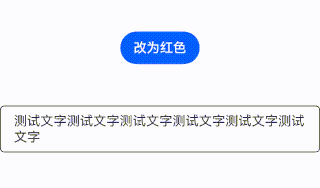

### Example 12
This example shows the usage of **lineHeight** and **letterSpacing**.
```ts
@Entry
@Component
struct RichEditorDemo03 {
  controller: RichEditorController = new RichEditorController();
  options: RichEditorOptions = { controller: this.controller };
  @State start: number = -1;
  @State end: number = -1;
  @State LH:number = 50
  @State LS:number = 20

  build() {
    Column() {
      Scroll(){
        Column(){
          Row() {
            Button("Line Height ++").onClick(()=>{
              this.LH = this.LH + 5
              this.controller.updateSpanStyle({
                start: this.start,
                end: this.end,
                textStyle:
                {
                  lineHeight: this.LH
                }
              })
            })
            Button("Line Height --").onClick(()=>{
              this.LH = this.LH - 5
              this.controller.updateSpanStyle({
                start: this.start,
                end: this.end,
                textStyle:
                {
                  lineHeight: this.LH
                }
              })
            })
            Button("Letter Spacing ++").onClick (()=>{
              this.LS = this.LS + 5
              this.controller.updateSpanStyle({
                start: this.start,
                end: this.end,
                textStyle:
                {
                  letterSpacing: this.LS
                }
              })
            })
            Button("Letter Spacing --").onClick (()=>{
              this.LS = this.LS - 5
              this.controller.updateSpanStyle({
                start: this.start,
                end: this.end,
                textStyle:
                {
                  letterSpacing: this.LS
                }
              })
            })
          }
        }
      }.borderWidth(1)
      .borderColor(Color.Red)
      .width("100%")
      .height("20%")
      .margin({top: 20})

      Scroll(){
        Column() {
          Text("LineHeight:" + this.LH).width("100%")
          Text("LetterSpacing:" + this.LS).width("100%")
        }
      }
      .borderWidth(1)
      .borderColor(Color.Red)
      .width("100%")
      .height("20%")
      .margin({bottom: 20})

      Column() {
        RichEditor(this.options).clip(true).padding(10)
          .onReady(() => {
            this.controller.addTextSpan("012345",
              {
                style:
                {
                  fontColor: Color.Orange,
                  fontSize: 30,
                  lineHeight: this.LH,
                  letterSpacing: this.LS
                }
              })
            this.controller.addTextSpan("6789",
              {
                style:
                {
                  fontColor: Color.Black,
                  fontSize: 30,
                  lineHeight: this.LH,
                  letterSpacing: this.LS
                }
              })
          })
          .borderWidth(1)
          .borderColor(Color.Green)
          .width(400)
          .height(400)
      }
      .borderWidth(1)
      .borderColor(Color.Red)
      .width("100%")
      .height("60%")
    }
  }
}
```


### Example 13
This example shows the usage of **preventDefault**.
```ts
@Entry
@Component
struct RichEditorDemo {
  controller: RichEditorController = new RichEditorController();
  options: RichEditorOptions = { controller: this.controller };

  build() {
    Column({ space: 2 }) {
      RichEditor(this.options)
        .onReady(() => {
          this.controller.addTextSpan('RichEditor preventDefault')
        })
        .onPaste((event?: PasteEvent) => {
          if (event != undefined && event.preventDefault) {
            event.preventDefault();
          }
        })
        .borderWidth(1)
        .borderColor(Color.Green)
        .width('100%')
        .height('40%')
    }
  }
}
```
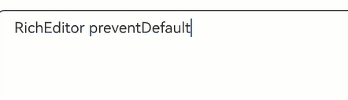

### Example 14

This example sets the **FontFeature** attribute to **ss01**, which changes the digit "0" from its original oval shape to a shape with rounded corners.

```ts
@Entry
@Component
struct RichEditorExample {
  controller: RichEditorController = new RichEditorController();
  options: RichEditorOptions = { controller: this.controller };
  @State enableDataDetector: boolean = true;
  @State types: TextDataDetectorType[] = [];
  build() {
    Row() {
      Column() {
        RichEditor(this.options)
          .onReady(() => {
            this.controller.addTextSpan('This is ss01 off :' + '0000' + '\n',
              {
                style:
                {
                  fontSize: 30
                }
              })
            this.controller.addTextSpan('This is ss01 on :' + '0000' + '\n',
              {
                style:
                {
                  fontSize: 30,
                  fontFeature: "\"ss01\" 1"
                }
              })
          })
          .copyOptions(CopyOptions.InApp)
          .enableDataDetector(this.enableDataDetector)
          .dataDetectorConfig({types : this.types, onDetectResultUpdate: (result: string)=>{}})
          .borderWidth(1)
          .padding(10)
          .width('100%')
      }
      .width('100%')
      .margin({top:150})
    }
  }
}
```
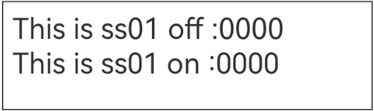

### Example 15

This example shows how to support custom keyboard avoidance.

```ts
@Entry
@Component
struct RichEditorExample {
  controller: RichEditorController = new RichEditorController()
  @State height1:string|number = '80%'
  @State height2:number = 100
  @State supportAvoidance:boolean = true;

  // Create a custom keyboard component.
  @Builder CustomKeyboardBuilder() {
    Column() {
      Row(){
        Button('Add Emoticon').onClick(() => {
          this.controller.addTextSpan("\uD83D\uDE0A",
            {
              style:
              {
                fontColor: Color.Orange,
              }
            })
        })
      }
      Grid() {
        ForEach([1, 2, 3, 4, 5, 6, 7, 8, 9, '*', 0, '#'], (item: number | string) => {
          GridItem() {
            Button(item + "")
              .width(110).onClick(() => {
              this.controller.addTextSpan(item + '', {
                offset: this.controller.getCaretOffset(),
                style:
                {
                  fontColor: Color.Orange,
                  fontSize: 30
                }
              })
              this.controller.setCaretOffset(this.controller.getCaretOffset() + item.toString().length)
            })
          }
        })
      }.maxCount(3).columnsGap(10).rowsGap(10).padding(5)
    }.backgroundColor(Color.Gray)
  }

  build() {
    Column() {
      Row(){
        Button("20%")
          .fontSize(24)
          .onClick(()=>{
            this.height1 = "20%"
          })
        Button("80%")
          .fontSize(24)
          .margin({left:20})
          .onClick(()=>{
            this.height1 = "80%"
          })
      }
      .justifyContent(FlexAlign.Center)
      .alignItems(VerticalAlign.Bottom)
      .height(this.height1)
      .width("100%")
      .padding({bottom:50})
      RichEditor({ controller: this.controller })
        // Bind the custom keyboard.
        .customKeyboard(this.CustomKeyboardBuilder(),{ supportAvoidance: this.supportAvoidance }).margin(10).border({ width: 1 })
        .borderWidth(1)
        .borderColor(Color.Red)
        .width("100%")
    }
  }
}
```
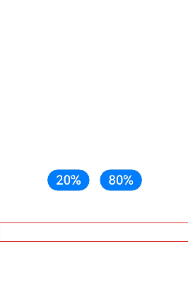

### Example 16

This example shows the usage of **onEditingChange** and **isEditing**.

```ts
@Entry
@Component
struct RichEditor_onEditingChange {
  controller: RichEditorController = new RichEditorController()
  @State controllerIsEditing: boolean = false
  @Builder

  build() {
    Column() {
      Row() {
        Button("View Editing State: isEditing():").onClick(() => {
          this.controllerIsEditing = this.controller.isEditing()
        })
          .padding(5)
        Text('' + this.controllerIsEditing)
          .width('100%')
          .padding(5)
          .fontColor(Color.Orange)
          .fontSize(20)
      }
      RichEditor({ controller: this.controller })
        .onEditingChange((isEditing: boolean) => {
          console.log("Current Editing Status:" + isEditing)
        })
        .height(400)
        .borderWidth(1)
        .borderColor(Color.Red)
        .width("100%")
    }
  }
}
```

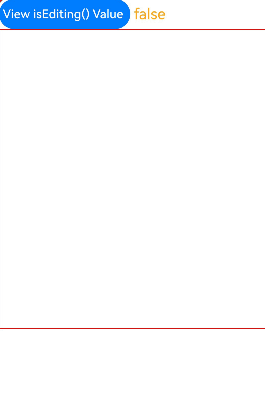

### Example 17

This example shows the usage of **onWillChange**, **onDidChange**, **onCut**, and **onCopy**.

```ts
@Entry
@Component
struct RichEditorExample {
  controller: RichEditorController = new RichEditorController()
  build() {
    Column() {
      RichEditor({ controller: this.controller })
        .height(200)
        .borderWidth(1)
        .borderColor(Color.Red)
        .width("100%")
        .onReady(() => {
          this.controller.addTextSpan('TestWord', { style: { fontColor: Color.Orange, fontSize: 30 } })
          this.controller.updateSpanStyle({
            start: -1,
            end: -1,
            textStyle:
            {
              fontWeight: FontWeight.Bolder
            }
          })
        })
        .onWillChange((value: RichEditorChangeValue) => {
          console.log('Test log: onWillChange')
          console.log('rangeBefore: ' + JSON.stringify(value.rangeBefore))
          console.log('print replacedSpans')
          value.replacedSpans.forEach((item: RichEditorTextSpanResult) => {
            console.log('spanPosition:' + JSON.stringify(item.spanPosition))
            console.log('value:' + item.value)
            console.log('textStyle:' + JSON.stringify(item.textStyle))
            console.log('offsetInSpan:' + item.offsetInSpan)
            console.log('valueResource:' + item.valueResource)
            console.log('paragraphStyle:' + JSON.stringify(item.paragraphStyle))
          })
          console.log('print replacedImageSpans')
          value.replacedImageSpans.forEach((item: RichEditorImageSpanResult) => {
            console.log('spanPosition:' + JSON.stringify(item.spanPosition))
            console.log('valuePixelMap:' + JSON.stringify(item.valuePixelMap))
            console.log('valueResourceStr:' + item.valueResourceStr)
            console.log('imageStyle:' + JSON.stringify(item.imageStyle))
            console.log('offsetInSpan:' + item.offsetInSpan)
          })
          console.log('print replacedSymbolSpans')
          value.replacedSymbolSpans.forEach((item: RichEditorTextSpanResult) => {
            console.log('spanPosition:' + JSON.stringify(item.spanPosition))
            console.log('value:' + item.value)
            console.log('offsetInSpan:' + item.offsetInSpan)
            console.log('symbolSpanStyle:' + JSON.stringify(item.symbolSpanStyle))
            console.log('valueResource:' + item.valueResource)
            console.log('paragraphStyle:' + JSON.stringify(item.paragraphStyle))
          })
          return true
        })
        .onDidChange((rangeBefore: TextRange, rangeAfter: TextRange) => {
          console.log('Test log: onDidChange')
          console.log('rangeBefore:' + JSON.stringify(rangeBefore))
          console.log('rangeAfter:' + JSON.stringify(rangeAfter))
        })
        .onCut((event:CutEvent) => {
          event.preventDefault!()
          console.log('Test log: onCut')
        })
        .onCopy((event:CopyEvent) => {
          event.preventDefault!()
          console.log('Test log: onCopy')
        })
        .onPaste(()=>{
          console.log('Test log: onPaste')
        })
      Text ('Test text Hello')
        .lineHeight(50)
        .fontSize(24)
        .draggable(true)
        .onDragStart(()=>{})
      TextInput({text:'Test text NiHao'})
        .draggable(true)
        .margin(20)
    }
  }
}
```
### Example 18

This example shows the usage of **enterKeyType**, **onSubmit**, and **stopEditing**.

```ts
@Entry
@Component
struct SoftKeyboardEnterTypeExample {
  controller: RichEditorController = new RichEditorController()

    build() {
    Column() {
      Button("Stop Editing").onClick(()=>{
        this.controller.stopEditing()
      })
      RichEditor({ controller: this.controller })
        .margin(10)
        .border({ width: 1 })
        .height(200)
        .borderWidth(1)
        .borderColor(Color.Red)
        .width("100%")
        .enterKeyType(EnterKeyType.Search)
        .onSubmit((enterKey: EnterKeyType, event: SubmitEvent) => {
          console.log("trigger richeditor onsubmit" + enterKey);
          this.controller.addTextSpan(" type["+ enterKey +"] triggerred")
          event.keepEditableState();
        })
    }.height("100%").justifyContent(FlexAlign.Center)
  }
}
```

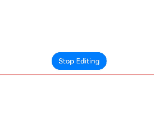

### Example 19
This example demonstrates how to set, update, and query the value of **lineBreakStrategy**.

```ts
@Entry
@Component
struct LineBreakStrategyExample {
  controller: RichEditorController = new RichEditorController();
  private spanParagraphs: RichEditorParagraphResult[] = [];
  @State lineBreakOptionStr: string[] = ['GREEDY', 'HIGH_QUALITY', 'BALANCED']
  @State attributeValue: string = ""
  @State testStr: string = "0123456789,0123456789,0123456789,0123456789,0123456789."
  build() {
    Column() {
      RichEditor({ controller: this.controller })
        .onReady(() => {
          this.controller.addTextSpan(this.testStr, {
            style: {
              fontColor: Color.Black,
              fontSize: "32",
            },
            paragraphStyle: {
              textAlign: TextAlign.Start,
              lineBreakStrategy: LineBreakStrategy.GREEDY
            }
          })
        })
        .width(400)
        .height(300)
        .margin({bottom:20})
        .draggable(false)
      Column(){
        Text('linebreak value: ' + this.attributeValue).fontSize(20).fontColor(Color.Black)
      }.margin({bottom: 10})
      Column({ space: 10 }) {
        Button("Set LineBreakStrategy to GREEDY").onClick(() => {
          this.controller.updateParagraphStyle({ start: -1, end: -1,
            style: {
              lineBreakStrategy: LineBreakStrategy.GREEDY,
            }
          })
        })
        Button("Set LineBreakStrategy to HIGH_QUALITY").onClick(() => {
          this.controller.updateParagraphStyle({ start: -1, end: -1,
            style: {
              lineBreakStrategy: LineBreakStrategy.HIGH_QUALITY,
            }
          })
        })
        Button("Set LineBreakStrategy to BALANCED").onClick(() => {
          this.controller.updateParagraphStyle({ start: -1, end: -1,
            style: {
              lineBreakStrategy: LineBreakStrategy.BALANCED,
            }
          })
        })
        Divider()
        Row(){
          Button("Get LineBreakStrategy Value").onClick(() => {
            this.spanParagraphs = this.controller.getParagraphs({ start: -1, end: -1 })
            console.log("RichEditor getParagraphs:" + JSON.stringify(this.spanParagraphs))
            this.spanParagraphs.forEach(item => {
              if(typeof(item as RichEditorParagraphResult)['style'] != 'undefined'){
                this.attributeValue = ""
                console.info('lineBreakStrategy:'+ JSON.stringify((item as RichEditorParagraphResult)['style']))
                this.attributeValue += this.lineBreakOptionStr[Number((item as RichEditorParagraphResult)['style'].lineBreakStrategy)];
              }
            })
          })
        }
      }
    }
  }
}
```

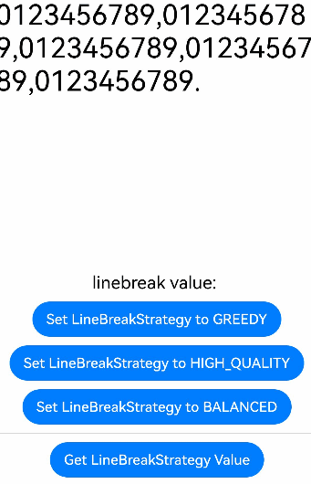

### Example: 20
This example shows the usage of a styled string.

```ts
import { LengthMetrics } from '@kit.ArkUI'
import { image } from '@kit.ImageKit'

@Entry
@Component
struct Index {
  stringLength: number = 0;
  imagePixelMap: image.PixelMap | undefined = undefined;
  @State selection: string = "";
  @State content: string = "";
  @State range: string = "";
  @State replaceString: string = "";
  @State rangeBefore: string = "";
  @State rangeAfter: string = "";
  richEditorStyledString: MutableStyledString = new MutableStyledString("");
  textStyle: TextStyle = new TextStyle({
    fontWeight: FontWeight.Lighter,
    fontFamily: 'HarmonyOS Sans',
    fontColor: Color.Green,
    fontSize: LengthMetrics.vp(30),
    fontStyle: FontStyle.Normal
  })
  fontStyle1: TextStyle = new TextStyle({ fontColor: Color.Blue });
  fontStyle2: TextStyle = new TextStyle({
    fontWeight: FontWeight.Bolder,
    fontFamily: 'Arial',
    fontColor: Color.Orange,
    fontSize: LengthMetrics.vp(30),
    fontStyle: FontStyle.Italic
  })
  // Create a styled string object.
  mutableStyledString: MutableStyledString = new MutableStyledString("Initial styled string",
    [{ start: 0, length: 5, styledKey: StyledStringKey.FONT, styledValue: this.fontStyle1 }]);
  styledString: StyledString = new StyledString("Styled string to insert",
    [{ start: 2, length: 4, styledKey: StyledStringKey.FONT, styledValue: this.fontStyle2 }]);
  controller: RichEditorStyledStringController = new RichEditorStyledStringController();
  options: RichEditorStyledStringOptions = {controller: this.controller};
  // Text content change callback
  contentChangedListener: StyledStringChangedListener = {
    onWillChange: (value: StyledStringChangeValue) => {
      this.range = '[ ' + value.range.start + ' , ' + value.range.end + ' ]';
      this.replaceString = value.replacementString.getString();
      return true;
    },
    onDidChange: (rangeBefore, rangeAfter) => {
      this.rangeBefore = '[ ' + rangeBefore.start + ' , ' + rangeBefore.end + ' ]';
      this.rangeAfter = '[ ' + rangeAfter.start + ' , ' + rangeAfter.end + ' ]';
    }
  }

  async aboutToAppear() {
    console.info("aboutToAppear initial imagePixelMap");
    this.imagePixelMap = await this.getPixmapFromMedia($r('app.media.icon'));
  }

  private async getPixmapFromMedia(resource: Resource) {
    let unit8Array = await getContext(this)?.resourceManager?.getMediaContent({
      bundleName: resource.bundleName,
      moduleName: resource.moduleName,
      id: resource.id
    })
    let imageSource = image.createImageSource(unit8Array.buffer.slice(0, unit8Array.buffer.byteLength))
    let createPixelMap: image.PixelMap = await imageSource.createPixelMap({
      desiredPixelFormat: image.PixelMapFormat.RGBA_8888
    })
    await imageSource.release()
    return createPixelMap
  }


  build() {
    Column() {
      Column() {
        Text("Selection information")
          .fontSize(20)
          .width("100%")
        Text("selection range: " + this.selection).width("100%")
        Text("selection content: " + this.content).width("100%")
      }
      .borderWidth(1)
      .borderColor(Color.Black)
      .width("100%")
      .height("10%")

      Column() {
        Text("onWillChange callback")
          .fontSize(20)
          .width("100%")
        Text("range: " + this.range).width("100%")
        Text("replacementString: " + this.replaceString).width("100%")
        Tex ("onWillChange callback")
          .fontSize(20)
          .width("100%")
        Text("rangeBefore: " + this.rangeBefore).width("100%")
        Text("rangeAfter: " + this.rangeAfter).width("100%")
      }
      .borderWidth(1)
      .borderColor(Color.Black)
      .width("100%")
      .height("20%")

      RichEditor(this.options)
        .onReady(() => {
          // Register a text change callback.
          this.controller.onContentChanged(this.contentChangedListener);
          // Set the styled string displayed in the component.
          this.controller.setStyledString(this.mutableStyledString);
        })
        .height("20%")
        .width("100%")
        .borderWidth(1)
        .borderColor(Color.Black)

      Column() {
        Row() {
          Button("Insert Image").onClick () => {
            if (this.imagePixelMap !== undefined) {
              let imageStyledString = new MutableStyledString(new ImageAttachment({
                value: this.imagePixelMap,
                size: { width: 50, height: 50 },
                layoutStyle: { borderRadius: LengthMetrics.vp(10) },
                verticalAlign: ImageSpanAlignment.BASELINE,
                objectFit: ImageFit.Contain
              }))
              // Obtain the styled string displayed in the component.
              this.richEditorStyledString = this.controller.getStyledString();
              this.richEditorStyledString.appendStyledString(imageStyledString);
              // Display the styled string after the image is inserted on the component.
              this.controller.setStyledString(this.richEditorStyledString);
              this.controller.setCaretOffset(this.richEditorStyledString.length);
            }
          })
          Button("Insert Text").onClick () => {
              // Obtain the styled string displayed in the component.
              this.richEditorStyledString = this.controller.getStyledString();
              this.richEditorStyledString.appendStyledString(this.styledString);
              // Display the styled string after the text is inserted on the component.
              this.controller.setStyledString(this.richEditorStyledString);
              this.controller.setCaretOffset(this.richEditorStyledString.length);
          })
        }
        Row() {
          Button("Get Selection").onClick(() => {
            // Obtain the selection.
            let richEditorSelection = this.controller.getSelection();
            let start = richEditorSelection.start ? richEditorSelection.start : 0;
            let end = richEditorSelection.end ? richEditorSelection.end : 0;
            // Obtain the styled string displayed in the component.
            this.richEditorStyledString = this.controller.getStyledString();
            this.selection = '[ ' + start + ' , ' + end + ' ]';
            if (start == end) {
              this.content = "";
            } else {
              this.content = this.richEditorStyledString.subStyledString(start, end - start).getString();
            }
          })
          Button("Update Selection Style").onClick () => {
            // Obtain the selection.
            let richEditorSelection = this.controller.getSelection();
            let start = richEditorSelection.start ? richEditorSelection.start : 0;
            let end = richEditorSelection.end ? richEditorSelection.end : 0;
            // Obtain the styled string displayed in the component.
            this.richEditorStyledString = this.controller.getStyledString();
            this.richEditorStyledString.setStyle({
              start: start,
              length: end - start,
              styledKey: StyledStringKey.FONT,
              styledValue: this.textStyle
            })
            // Display the styled string after the style change on the component.
            this.controller.setStyledString(this.richEditorStyledString);
          })
          Button("Delete Selected").onClick(() => {
            // Obtain the selection.
            let richEditorSelection = this.controller.getSelection();
            let start = richEditorSelection.start ? richEditorSelection.start : 0;
            let end = richEditorSelection.end ? richEditorSelection.end : 0;
            // Obtain the styled string displayed in the component.
            this.richEditorStyledString = this.controller.getStyledString();
            this.richEditorStyledString.removeString(start, end - start);
            // Display the styled string after the content is deleted on the component.
            this.controller.setStyledString(this.richEditorStyledString);
          })
        }
      }
      .width("100%")
    }
  }
}
```

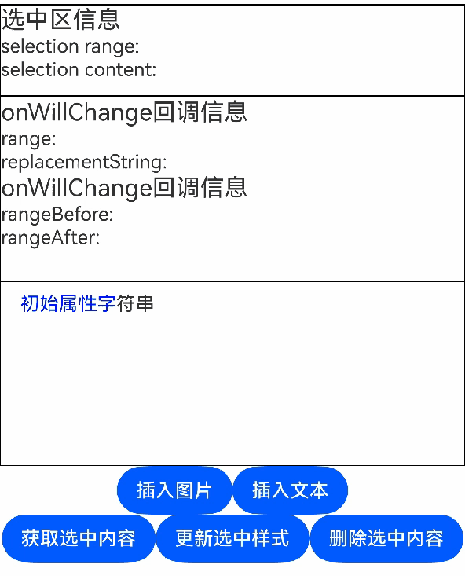

### Example 21
This example shows the usage of **NodeAdapter**.

```ts
@Entry
@Component
export struct Index {
  @State lineCount: string = ""
  @State glyphPositionAtCoordinate: string = ""
  @State lineMetrics: string = ""
  controller: RichEditorController = new RichEditorController();
  @State textStr: string =
    'Hello World!'

  build() {
    Scroll() {
      Column() {
        Text('getLayoutManager obtains the layout information relative to the component')
          .fontSize(9)
          .fontColor(0xCCCCCC)
          .width('90%')
          .padding(10)
        RichEditor({ controller: this.controller })
          .borderColor(Color.Red)
          .borderWidth(1)
          .onReady(() => {
            this.controller.addTextSpan(this.textStr)
          })
          .onAreaChange(() => {
            let layoutManager = this.controller.getLayoutManager();
            this.lineCount = "LineCount: " + layoutManager.getLineCount()
          })

        Text('LineCount').fontSize(9).fontColor(0xCCCCCC).width('90%').padding(10)
        Text(this.lineCount)

        Text('GlyphPositionAtCoordinate').fontSize(9).fontColor(0xCCCCCC).width('90%').padding(10)
        Button("Glyph info of relative component coordinates [150, 50]")
          .onClick(() => {
            let layoutManager: LayoutManager = this.controller.getLayoutManager()
            let position = layoutManager.getGlyphPositionAtCoordinate(150, 50)
            this.glyphPositionAtCoordinate =
            "Relative component coordinates [150, 50] glyphPositionAtCoordinate position: " + position.position + " affinity: " +
            position.affinity
          })
          .margin({ bottom: 20, top: 10 })
        Text(this.glyphPositionAtCoordinate)

        Text('LineMetrics').fontSize(9).fontColor(0xCCCCCC).width('90%').padding(10)
        Button("Line Metrics")
          .onClick(() => {
            let layoutManager: LayoutManager = this.controller.getLayoutManager()
            let lineMetrics = layoutManager.getLineMetrics(0)
            this.lineMetrics = "lineMetrics is " + JSON.stringify(lineMetrics) + '\n\n'
            let runMetrics = lineMetrics.runMetrics
            runMetrics.forEach((value, key) => {
              this.lineMetrics += "runMetrics key is " + key + " " + JSON.stringify(value) + "\n\n"
            });
          })
          .margin({ bottom: 20, top: 10 })
        Text(this.lineMetrics)
      }
      .margin({ top: 100, left: 8, right: 8 })
    }
  }
}
```

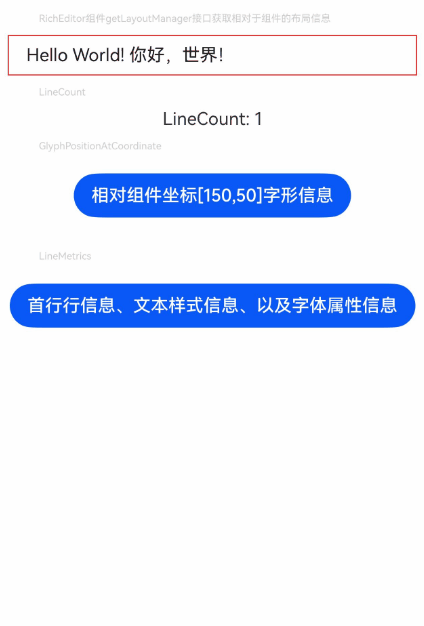

### Example: 22

This example shows how to set **editMenuOptions**.

```ts
// xxx.ets
@Entry
@Component
struct RichEditorExample {
  controller: RichEditorController = new RichEditorController();
  options: RichEditorOptions = { controller: this.controller }

  onCreateMenu(menuItems: Array<TextMenuItem>) {
    console.log('menuItems size=' + menuItems.length);
    menuItems.forEach((value, index) => {
      console.log('menuItem' + index + ', id=' + JSON.stringify(value));
    })
    let extensionMenuItems: Array<TextMenuItem> = [
      {
        content: 'Extended RichEditor 1', icon: $r('app.media.startIcon'), id: TextMenuItemId.of('extension1')
      },
      {
        content: 'Extended RichEditor 2', icon: $r('app.media.startIcon'), id: TextMenuItemId.of('extension2')
      },
      {
        content: 'Extended RichEditor 3', icon: $r('app.media.startIcon'), id: TextMenuItemId.of('extension3')
      },
      {
        content: 'Extended RichEditor 4', icon: $r('app.media.startIcon'), id: TextMenuItemId.of('extension4')
      }
    ]
    return menuItems.concat(extensionMenuItems)
  }
  onMenuItemClicked(menuItem: TextMenuItem, textRange: TextRange) {
    if (menuItem.id.equals(TextMenuItemId.of('extension1'))) {
      console.log('click' + menuItem.content + ', textRange=' + JSON.stringify(textRange))
      return true;
    }
    return false;
  }

  build() {
    Row() {
      RichEditor(this.options)
        .onReady(() => {
          this.controller.addTextSpan("Extended RichEditor")
        })
        .editMenuOptions({
          onCreateMenu: (menuItems: Array<TextMenuItem>) => {
            return this.onCreateMenu(menuItems)
          },
          onMenuItemClick: (menuItem: TextMenuItem, textRange: TextRange) => {
            return this.onMenuItemClicked(menuItem, textRange)
          }
        })
        .height(200)
        .borderWidth(1)
        .borderColor(Color.Red)
    }
  }
}
```

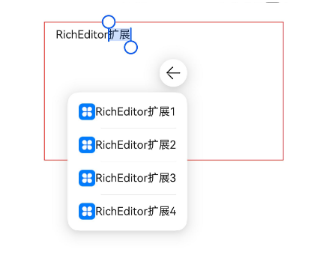

<!--no_check-->