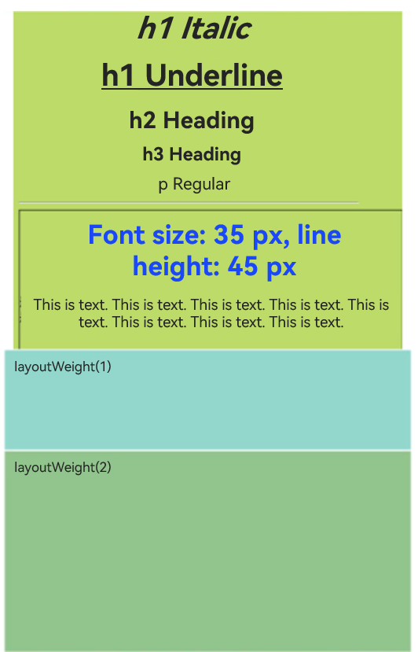

# RichText

The **RichText** component parses and displays HTML text.

- Applicable scenarios:

  The **RichText** component is suitable for loading and displaying segments of HTML strings in scenarios where extensive customization of the display effect is not required. The component supports only a limited set of universal attributes and events. For details, see [Attributes](#attributes) and [Events](#events).

  The underlying layer of the **RichText** component uses the **Web** component to provide basic capabilities, including but not limited to HTML page parsing and rendering. Therefore, the use of the **RichText** component needs to follow **Web** component constraints. Common typical constraints are as follows:

  The default viewport size of a mobile device is 980 px, which can ensure that most web pages can be viewed correctly on mobile devices. If the width of the **RichText** component is lower than this value, the HTML inside the content may generate a scrollable page wrapped by the **RichText** component. If you want to replace the default value, add the following tags to **content**:

  ```html
  <meta name="viewport" content="width=device-width">
  ```

- Inapplicable scenarios:

  The **RichText** component is not suitable for scenarios where there is a need for extensive customization of the display effect of the HTML string. For example, the **RichText** component does not allow for changing the background color, font color, font size, or content by setting attributes and events. Under such scenarios, the [Web](../../apis-arkweb/ts-basic-components-web.md) component is recommended.

  The **RichText** component can be memory-intensive. If it is reused in scenarios such as lists where multiple instances are created, slow scrolling or rendering may result. Under such scenarios, you may want to use the [RichEditor](../arkui-ts/ts-basic-components-richeditor.md#richeditor) component.

>  **NOTE**
>
> - This component is supported since API version 8. Updates will be marked with a superscript to indicate their earliest API version.
> - This component is not able to auto-adapt its width and height to the content. Therefore, you must set the layout when using this component.


## Child Components

Not supported

## APIs

RichText(content:string)

**System capability**: SystemCapability.ArkUI.ArkUI.Full

**Parameters**

| Name| Type| Mandatory | Description|
| ------- | -------- | ------------- | -------- |
| content | string | Yes  | String in HTML format.|


## Events

### onStart

onStart(callback: () => void)

Triggered when web page loading starts.

**System capability**: SystemCapability.ArkUI.ArkUI.Full

### onComplete

onComplete(callback: () => void)

Triggered when web page loading is completed.

**System capability**: SystemCapability.ArkUI.ArkUI.Full

## Attributes

Among the [universal attributes](ts-universal-attributes-size.md), only the **width**, **height**, **size**, and **layoutWeight** attributes are supported.  

## Supported Tags

| Name| Description| Example|
| -------- | -------- | -------- |
| \<h1>--\<h6> | Defines six levels of headings in the HTML document. \<h1> defines the most important heading, and \<h6> defines the least important heading.| \<h1>This is an H1 heading\</h1> \<h2>This is an H2 heading\</h2>|
| \<p>\</p> | Defines a paragraph.| \<p>This is a paragraph\</p>|
| \<br/> | Inserts a newline character.| \<p>This is a paragraph\<br/>This is a new paragraph\</p>|
| \<font/> | Defines the font style for the text contained within it, including the font face, size, and color. In the <font/> tag, the font size can be set only to a number ranging from 1 to 7, with the default value being **3**. This tag is deprecated in HTML 4.01 and not supported in XHTML1.0 Strict DTD. Use the CSS font properties to style text instead. CSS syntax: \<p style="font-size: 35px; font-family: verdana; color: rgb(24,78,228)"> | \<font size="3" face="arial" color="red">This is in red\</font> |
| \<hr/> | Defines a thematic break (such as a shift of topic) on an HTML page and creates a horizontal line.| \<p>This is text\</p>\<hr/>\<p>This is text\</p> |
| \<image>\</image> | Defines an image.| \<image src="resource://rawfile/icon.png">\</image> |
| \<div>\</div> | Defines a generic container that is generally used to group block-level elements. It allows you to apply CSS styles to multiple elements at the same time.| \<div style='color:#0000FF'>\<h3>This is the heading in a div element\</h3>\</div> |
| \<i>\</i> | Displays text in italic style.| \<i>This is in italic style\</i>|
| \<u>\</u> | Defines text that should be styled differently or have a non-textual annotation, such as misspelt words or a proper name in Chinese text. It is recommended that you avoid using the \<u> tag where it could be confused with a hyperlink.| \<p>\<u>This is an underlined paragraph\</u>\</p> |
| \<style>\</style> | Used to embed CSS within an HTML document.| \<style>h1{color:red;}p{color:blue;}\</style> |
| style | Defines the inline style of an element and is placed inside the tag. Use quotation marks (') to separate the styling text and use semicolons (;) to separate styles, for example, **style='width: 500px;height: 500px;border: 1px solid;margin: 0 auto;'**.| \<h1 style='color:blue;text-align:center'>This is a heading\</h1>\<p style='color:green'>This is text\</p> |
| \<script>\</script> | Embeds or references a client-side script, such as JavaScript.| \<script>document.write("Hello World!")\</script> |

## Example

You can preview how this component looks on a real device, but not in DevEco Studio Previewer.

```ts
// xxx.ets
@Entry
@Component
struct RichTextExample {
  @State data: string = '<h1 style="text-align: center;">h1 heading</h1>' +
  '<h1 style="text-align: center;"><i>h1 italic</i></h1>' +
  '<h1 style="text-align: center;"><u>h1 underlined</u></h1>' +
  '<h2 style="text-align: center;">h2 heading</h2>' +
  '<h3 style="text-align: center;">h3 heading</h3>' +
  '<p style="text-align: center;">Regular paragraph</p><hr/>' +
  '<div style="width: 500px;height: 500px;border: 1px solid;margin: 0 auto;">' +
  '<p style="font-size: 35px;text-align: center;font-weight: bold; color: rgb(24,78,228)">Font size: 35px; line height: 45px</p>' +
  '<p style="background-color: #e5e5e5;line-height: 45px;font-size: 35px;text-indent: 2em;">' +
  '<p>This is text. This is text. This is text. This is text. This is text. This is text. This is text. This is text. This is text.</p>';

  build() {
    Flex({ direction: FlexDirection.Column, alignItems: ItemAlign.Center,
      justifyContent: FlexAlign.Center }) {
      RichText(this.data)
        .onStart(() => {
          console.info('RichText onStart');
        })
        .onComplete(() => {
          console.info('RichText onComplete');
        })
        .width(500)
        .height(500)
        .backgroundColor(0XBDDB69)
      RichText('layoutWeight(1)')
        .onStart(() => {
          console.info('RichText onStart');
        })
        .onComplete(() => {
          console.info('RichText onComplete');
        })
        .size({ width: '100%', height: 110 })
        .backgroundColor(0X92D6CC)
        .layoutWeight(1)
      RichText('layoutWeight(2)')
        .onStart(() => {
          console.info('RichText onStart');
        })
        .onComplete(() => {
          console.info('RichText onComplete');
        })
        .size({ width: '100%', height: 110 })
        .backgroundColor(0X92C48D)
        .layoutWeight(2)
    }
  }
}
```

 
