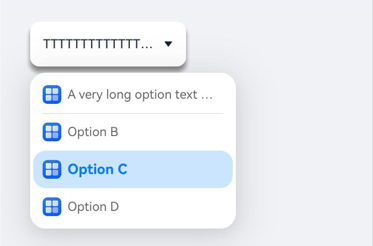
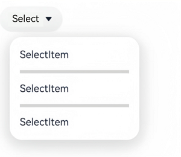
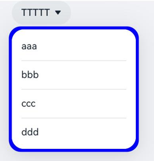

#  Select

The **Select** component provides a drop-down menu that allows users to select among multiple options.

>  **NOTE**
>
>  This component is supported since API version 8. Updates will be marked with a superscript to indicate their earliest API version.

## Child Components

Not supported

## APIs

Select(options: Array\<SelectOption>)

**Atomic service API**: This API can be used in atomic services since API version 11.

**System capability**: SystemCapability.ArkUI.ArkUI.Full

**Parameters**

| Name | Type                                          | Mandatory| Description          |
| ------- | ---------------------------------------------- | ---- | -------------- |
| options | Array\<[SelectOption](#selectoption)\> | Yes  | Options of the drop-down menu.|

## SelectOption

Provides information about the drop-down menu options.

**System capability**: SystemCapability.ArkUI.ArkUI.Full

| Name| Type                           | Mandatory| Description      |
| ------ | ----------------------------------- | ---- | -------------- |
| value  | [ResourceStr](ts-types.md#resourcestr) | Yes  | Value of the drop-down menu option.<br>**Atomic service API**: This API can be used in atomic services since API version 11.|
| icon   | [ResourceStr](ts-types.md#resourcestr) | No  | Icon of the drop-down menu option.<br>**Atomic service API**: This API can be used in atomic services since API version 11.|
| symbolIcon<sup>12+</sup>  | [SymbolGlyphModifier](ts-universal-attributes-attribute-modifier.md) | No  | Symbol icon of drop-down menu option.<br>**symbolIcon** takes precedence over **icon**.<br>**Atomic service API**: This API can be used in atomic services since API version 12.|

## Attributes

In addition to the [universal attributes](ts-component-general-attributes.md), the following attributes are supported.

### selected

selected(value: number | Resource)

Sets the index of the initially selected option in the drop-down menu, where the first option has an index of 0. When **selected** is set to an invalid value or is not set, the default default **-1** is used, which indicates no selection. When **selected** is set to **undefined** or **null**, the first option is selected.

Since API version 10, this attribute supports two-way binding through [$$](../../../ui/state-management/arkts-two-way-sync.md).
Since API version 18, this attribute supports two-way binding through [!!](../../../ui/state-management/arkts-new-binding.md#two-way-binding-between-built-in-component-parameters).

**Atomic service API**: This API can be used in atomic services since API version 11.

**System capability**: SystemCapability.ArkUI.ArkUI.Full

**Parameters**

| Name| Type                                                        | Mandatory| Description                    |
| ------ | ------------------------------------------------------------ | ---- | ------------------------ |
| value  | number \| [Resource](ts-types.md#resource)<sup>11+</sup> | Yes  | Index of the initially selected option. The index is zero-based.|

### selected<sup>18+</sup>

selected(numCount: Optional<number | Resource>)

Sets the index of the initially selected option in the drop-down menu, where the first option has an index of 0. When **selected** is set to an invalid value or is not set, the default default **-1** is used, which indicates no selection. When **selected** is set to **undefined** or **null**, the first option is selected.

This attribute supports two-way binding through [$$](../../../ui/state-management/arkts-two-way-sync.md) and [!!](../../../ui/state-management/arkts-new-binding.md#two-way-binding-between-built-in-component-parameters).

**Atomic service API**: This API can be used in atomic services since API version 18.

**System capability**: SystemCapability.ArkUI.ArkUI.Full

**Parameters**

| Name  | Type                                                        | Mandatory| Description                                                        |
| -------- | ------------------------------------------------------------ | ---- | ------------------------------------------------------------ |
| numCount | [Optional](ts-universal-attributes-custom-property.md#optionalt12)\<number \| [Resource](ts-types.md#resource)> | Yes  | Index of the initially selected option.<br>When **numCount** is set to **undefined**, the first option is selected.|

### value

value(value: ResourceStr)

Sets the text content of drop-down button. After a menu option is selected, the button text will automatically update to display the selected option's text.

Since API version 10, this attribute supports two-way binding through [$$](../../../ui/state-management/arkts-two-way-sync.md).
Since API version 18, this attribute supports two-way binding through [!!](../../../ui/state-management/arkts-new-binding.md#two-way-binding-between-built-in-component-parameters).

**Atomic service API**: This API can be used in atomic services since API version 11.

**System capability**: SystemCapability.ArkUI.ArkUI.Full

**Parameters**

| Name| Type                                                | Mandatory| Description                    |
| ------ | ---------------------------------------------------- | ---- | ------------------------ |
| value  | [ResourceStr](ts-types.md#resourcestr)<sup>11+</sup> | Yes  | Text of the drop-down button.<br>**NOTE**<br>If the text exceeds the column width, it will be truncated.|

### value<sup>18+</sup>

value(resStr: Optional\<ResourceStr>)

Sets the text content of drop-down button. After a menu option is selected, the button text will automatically update to display the selected option's text. Compared with [value](#value), this API supports the **undefined** type for the **resStr** parameter.

This attribute supports two-way binding through [$$](../../../ui/state-management/arkts-two-way-sync.md) and [!!](../../../ui/state-management/arkts-new-binding.md#two-way-binding-between-built-in-component-parameters).

**Atomic service API**: This API can be used in atomic services since API version 18.

**System capability**: SystemCapability.ArkUI.ArkUI.Full

**Parameters**

| Name| Type                                                        | Mandatory| Description                                                        |
| ------ | ------------------------------------------------------------ | ---- | ------------------------------------------------------------ |
| resStr | [Optional](ts-universal-attributes-custom-property.md#optionalt12)\<[ResourceStr](ts-types.md#resourcestr)> | Yes  | Text of the drop-down button.<br>If **resStr** is set to **undefined**, the previous value is retained.|

### controlSize<sup>12+</sup>

controlSize(value: ControlSize)

Sets the size of the **Select** component.

**Atomic service API**: This API can be used in atomic services since API version 12.

**System capability**: SystemCapability.ArkUI.ArkUI.Full

**Parameters**

| Name| Type                                                        | Mandatory| Description                                             |
| ------ | ------------------------------------------------------------ | ---- | ------------------------------------------------- |
| value  | [ControlSize](ts-basic-components-button.md#controlsize11)<sup>11+</sup> | Yes  | Size of the **Select** component.<br>Default value: **ControlSize.NORMAL**.|

The priorities of **controlSize**, **width**, and **height** are as follows:

   1. If only **width** and **height** are set and the text is too large to fit in the component, the text exceeds the component size and overflow text is displayed as an ellipsis (...).

   2. If **controlSize** is set but **width** and **height** are not set, the component size automatically adapts to the text content. The text will not exceed the component, and the **minWidth** and **minHeight** settings are automatically applied.

   3. If **controlSize**, **width**, and **height** are all set, the values of **width** and **height** take effect. However, if the values of **width** and **height** are less than the values of **minWidth** and **minHeight** set by **controlSize**, they will not take effect. In this case, the minimum width (**minWidth**) and minimum height (**minHeight**) settings will be enforced instead.

### controlSize<sup>18+</sup>

controlSize(size: Optional\<ControlSize>)

Sets the size of the **Select** component. Compared with [controlSize](#controlsize12)<sup>12+</sup>, this API supports the **undefined** type for **size** parameter.

**Atomic service API**: This API can be used in atomic services since API version 18.

**System capability**: SystemCapability.ArkUI.ArkUI.Full

**Parameters**

| Name| Type                                                        | Mandatory| Description                                                        |
| ------ | ------------------------------------------------------------ | ---- | ------------------------------------------------------------ |
| size   | [Optional](ts-universal-attributes-custom-property.md#optionalt12)\<[ControlSize](ts-basic-components-button.md#controlsize11)> | Yes  | Size of the **Select** component.<br>If **size** is set to **undefined**, the default value **ControlSize.NORMAL** is used.|

The priorities of **controlSize**, **width**, and **height** are as follows:

   1. If only **width** and **height** are set and the text is too large to fit in the component, the text exceeds the component size and overflow text is displayed as an ellipsis (...).

   2. If **controlSize** is set but **width** and **height** are not set, the component size automatically adapts to the text content. The text will not exceed the component, and the **minWidth** and **minHeight** settings are automatically applied.

   3. If **controlSize**, **width**, and **height** are all set, the values of **width** and **height** take effect. However, if the values of **width** and **height** are less than the values of **minWidth** and **minHeight** set by **controlSize**, they will not take effect. In this case, the minimum width (**minWidth**) and minimum height (**minHeight**) settings will be enforced instead.

### menuItemContentModifier<sup>12+</sup>

menuItemContentModifier(modifier: ContentModifier\<MenuItemConfiguration>)

Creates a content modifier for the drop-down menu. After **menuItemContentModifier** is applied, the drop-down menu content will be completely customized by the developer, and the **Select** component's attributes, including the divider, option color, and drop-down menu font color, will not take effect.

**Atomic service API**: This API can be used in atomic services since API version 12.

**System capability**: SystemCapability.ArkUI.ArkUI.Full

**Parameters**

| Name| Type                                         | Mandatory| Description                                            |
| ------ | --------------------------------------------- | ---- | ------------------------------------------------ |
| modifier  | [ContentModifier\<MenuItemConfiguration>](#menuitemconfiguration12) | Yes  | Content modifier to apply to the drop-down menu.<br>**modifier**: content modifier. You need a custom class to implement the **ContentModifier** API.|

### menuItemContentModifier<sup>18+</sup>

menuItemContentModifier(modifier: Optional\<ContentModifier\<MenuItemConfiguration>>)

Creates a content modifier for the drop-down menu. Compared with [menuItemContentModifier](#menuitemcontentmodifier12)<sup>12+</sup>, this API supports the **undefined** type for **modifier** parameter. After **menuItemContentModifier** is applied, the drop-down menu content will be completely customized by the developer, and the **Select** component's attributes, including the divider, option color, and drop-down menu font color, will not take effect.

**Atomic service API**: This API can be used in atomic services since API version 18.

**System capability**: SystemCapability.ArkUI.ArkUI.Full

**Parameters**

| Name  | Type                                                        | Mandatory| Description                                                        |
| -------- | ------------------------------------------------------------ | ---- | ------------------------------------------------------------ |
| modifier | [Optional](ts-universal-attributes-custom-property.md#optionalt12)\<[ContentModifier\<MenuItemConfiguration>](#menuitemconfiguration12)> | Yes  | Content modifier to apply to the drop-down menu.<br>**modifier**: content modifier. You need a custom class to implement the **ContentModifier** API.<br>If **modifier** is set to **undefined**, no content modifier is used.|

### divider<sup>12+</sup>

divider(options: Optional\<DividerOptions> | null)

Sets the divider style. If this attribute is not set, the divider is displayed based on the default value.

**Atomic service API**: This API can be used in atomic services since API version 12.

**System capability**: SystemCapability.ArkUI.ArkUI.Full

**Parameters**

| Name| Type   | Mandatory| Description                                                                 |
| ------ | ------- | ---- | --------------------------------------------------------------------- |
| options  | Optional\<[DividerOptions](ts-basic-components-textpicker.md#divideroptions12)> \| null | Yes  | Divider options.<br>1. If **DividerOptions** is set, the divider is displayed in the configured style.<br>Default value:<br>{<br>strokeWidth: '1px' , <br>color: '#33182431'<br>}<br>2. If this parameter is set to **null**, the divider is not displayed.<br>3. If the value of **strokeWidth** is too larger, the divider may overlap the text. The divider extends both upwards and downwards from the bottom of each item.<br>4. The default values for **startMargin** and **endMargin** are consistent with the style of the divider when the **divider** attribute is not set. If the sum of **startMargin** and **endMargin** is equal to the value of **optionWidth**, the divider is not displayed. If the sum of **startMargin** and **endMargin** exceeds the value of **optionWidth**, the divider line is displayed in the default style.|

### dividerStyle<sup>19+</sup>

dividerStyle(style: Optional\<DividerStyleOptions>)

Sets the divider style. If this attribute is not set, the divider is displayed based on the default value. This attribute cannot be used together with the **divider** attribute. The last one called will take effect.

**Atomic service API**: This API can be used in atomic services since API version 19.

**System capability**: SystemCapability.ArkUI.ArkUI.Full

**Parameters**

| Name| Type   | Mandatory| Description                                                                 |
| ------ | ------- | ---- | --------------------------------------------------------------------- |
| style  | Optional\<[DividerStyleOptions](ts-types.md#dividerstyleoptions12)>  | Yes  | Divider options.<br>1. If **DividerOptions** is set, the divider is displayed in the configured style.<br>Default value:<br>{<br>strokeWidth: '1px' , <br>color: '#33182431'<br>}<br>2. If this parameter is set to **null** or **undefined**, the default divider is displayed.<br>3. When **mode** is set to **FLOAT_ABOVE_MENU**, be careful with the **strokeWidth** settings to avoid covering text. The divider extends both upwards and downwards from the bottom of each item. When **mode** is **EMBEDDED_IN_MENU**, the divider expands to fill its own space within the menu.<br>4. The default values for **startMargin** and **endMargin** are consistent with the style of the divider when the **divider** attribute is not set. If the sum of **startMargin** and **endMargin** is equal to the value of **optionWidth**, the divider is not displayed. If the sum of **startMargin** and **endMargin** exceeds the value of **optionWidth**, the divider line is displayed in the default style.|

### font

font(value: Font)

Sets the text style of the drop-down button. When **size** is set to **0**, the text is not displayed. When **size** is set to a negative value, the text is displayed at its default size.

**Atomic service API**: This API can be used in atomic services since API version 11.

**System capability**: SystemCapability.ArkUI.ArkUI.Full

**Parameters**

| Name| Type                    | Mandatory| Description                                                        |
| ------ | ------------------------ | ---- | ------------------------------------------------------------ |
| value  | [Font](ts-types.md#font) | Yes  | Text style of the drop-down list button.<br>Default value:<br>API version 11 and earlier versions:<br>{<br>size: `$r('sys.float.ohos_id_text_size_button1')`,<br>weight: FontWeight.Medium<br>} <br>Since API version 12: The default value of **size** is **$r('sys.float.ohos_id_text_size_button2')** in the case of **controlSize.SMALL** and **$r('sys.float.ohos_id_text_size_button1')** in other cases.|

### font<sup>18+</sup>

font(selectFont: Optional\<Font>)

Sets the text style of the drop-down button. When **size** is set to **0**, the text is not displayed. When **size** is set to a negative value, the text is displayed at its default size. Compared with [font](#font), this API supports the **undefined** type for the **selectFont** parameter.

**Atomic service API**: This API can be used in atomic services since API version 18.

**System capability**: SystemCapability.ArkUI.ArkUI.Full

**Parameters**

| Name    | Type                                                        | Mandatory| Description                                                        |
| ---------- | ------------------------------------------------------------ | ---- | ------------------------------------------------------------ |
| selectFont | [Optional](ts-universal-attributes-custom-property.md#optionalt12)\<[Font](ts-types.md#font)> | Yes  | Text style of the drop-down list button.<br>If **controlSize** is set to **controlSize.SMALL**, the default value of **size** is **$r('sys.float.ohos_id_text_size_button2')**. Otherwise, the default value is **$r('sys.float.ohos_id_text_size_button1')**.<br>If **selectFont** is set to **undefined**, the default font style is used.|

### fontColor

fontColor(value: ResourceColor)

Sets the font color of the drop-down button.

**Atomic service API**: This API can be used in atomic services since API version 11.

**System capability**: SystemCapability.ArkUI.ArkUI.Full

**Parameters**

| Name| Type                                      | Mandatory| Description                                                        |
| ------ | ------------------------------------------ | ---- | ------------------------------------------------------------ |
| value  | [ResourceColor](ts-types.md#resourcecolor) | Yes  | Font color of the drop-down button.<br>Default value: **$r('sys.color.ohos_id_color_text_primary')** with the opacity of **$r('sys.color.ohos_id_alpha_content_primary')**|

### fontColor<sup>18+</sup>

fontColor(resColor: Optional\<ResourceColor>)

Sets the font color of the drop-down button. Compared with [fontColor](#fontcolor), this API supports the **undefined** type for the **resColor** parameter.

**Atomic service API**: This API can be used in atomic services since API version 18.

**System capability**: SystemCapability.ArkUI.ArkUI.Full

**Parameters**

| Name  | Type                                                        | Mandatory| Description                                                        |
| -------- | ------------------------------------------------------------ | ---- | ------------------------------------------------------------ |
| resColor | [Optional](ts-universal-attributes-custom-property.md#optionalt12)\<[ResourceColor](ts-types.md#resourcecolor)> | Yes  | Font color of the drop-down button.<br>When **resColor** is set to **undefined**, the default value is a blend of **$r('sys.color.ohos_id_color_text_primary')** with the opacity of **$r('sys.color.ohos_id_alpha_content_primary')**.<br>If **value** is set to **undefined**, the previous value is retained.|

### selectedOptionBgColor

selectedOptionBgColor(value: ResourceColor)

Sets the background color of the selected option in the drop-down menu.

**Atomic service API**: This API can be used in atomic services since API version 11.

**System capability**: SystemCapability.ArkUI.ArkUI.Full

**Parameters**

| Name| Type                                      | Mandatory| Description                                                        |
| ------ | ------------------------------------------ | ---- | ------------------------------------------------------------ |
| value  | [ResourceColor](ts-types.md#resourcecolor) | Yes  | Background color of the selected option in the drop-down menu.<br>Default value: **$r('sys.color.ohos_id_color_component_activated')** with the opacity of **$r('sys.color.ohos_id_alpha_highlight_bg')**|

### selectedOptionBgColor<sup>18+</sup>

selectedOptionBgColor(resColor: Optional\<ResourceColor>)

Sets the background color of the selected option in the drop-down menu. Compared with [selectedOptionBgColor](#selectedoptionbgcolor), this API supports the **undefined** type for the **resColor** parameter.

**Atomic service API**: This API can be used in atomic services since API version 18.

**System capability**: SystemCapability.ArkUI.ArkUI.Full

**Parameters**

| Name  | Type                                                        | Mandatory| Description                                                        |
| -------- | ------------------------------------------------------------ | ---- | ------------------------------------------------------------ |
| resColor | [Optional](ts-universal-attributes-custom-property.md#optionalt12)\<[ResourceColor](ts-types.md#resourcecolor)> | Yes  | Background color of the selected option in the drop-down menu.<br>When **resColor** is set to **undefined**, the default value is a blend of **$r('sys.color.ohos_id_color_component_activated')** with the opacity of **$r('sys.color.ohos_id_alpha_highlight_bg')**.|

### selectedOptionFont

selectedOptionFont(value: Font)

Sets the text font of the selected option in the drop-down menu. When **size** is set to **0**, the text is not displayed. When **size** is set to a negative value, the text is displayed at its default size.

**Atomic service API**: This API can be used in atomic services since API version 11.

**System capability**: SystemCapability.ArkUI.ArkUI.Full

**Parameters**

| Name| Type                    | Mandatory| Description                                                        |
| ------ | ------------------------ | ---- | ------------------------------------------------------------ |
| value  | [Font](ts-types.md#font) | Yes  | Text font of the selected option in the drop-down menu.<br>Default value:<br>{<br>size: $r('sys.float.ohos_id_text_size_body1'),<br>weight: FontWeight.Regular<br>} |

### selectedOptionFont<sup>18+</sup>

selectedOptionFont(selectFont: Optional\<Font>)

Sets the text font of the selected option in the drop-down menu. When **size** is set to **0**, the text is not displayed. When **size** is set to a negative value, the text is displayed at its default size. Compared with [selectedOptionFont](#selectedoptionfont), this API supports the **undefined** type for the **selectFont** parameter.

**Atomic service API**: This API can be used in atomic services since API version 18.

**System capability**: SystemCapability.ArkUI.ArkUI.Full

**Parameters**

| Name    | Type                                                        | Mandatory| Description                                                        |
| ---------- | ------------------------------------------------------------ | ---- | ------------------------------------------------------------ |
| selectFont | [Optional](ts-universal-attributes-custom-property.md#optionalt12)\<[Font](ts-types.md#font)> | Yes  | Text font of the selected option in the drop-down menu.<br>If **selectFont** is set to **undefined**, the default value is used:<br>{<br>size: $r('sys.float.ohos_id_text_size_body1'),<br>weight: FontWeight.Regular<br>} |

### selectedOptionFontColor

selectedOptionFontColor(value: ResourceColor)

Sets the font color of the selected option in the drop-down menu.

**Atomic service API**: This API can be used in atomic services since API version 11.

**System capability**: SystemCapability.ArkUI.ArkUI.Full

**Parameters**

| Name| Type                                      | Mandatory| Description                                                        |
| ------ | ------------------------------------------ | ---- | ------------------------------------------------------------ |
| value  | [ResourceColor](ts-types.md#resourcecolor) | Yes  | Font color of the selected option in the drop-down menu.<br>Default value: **$r('sys.color.ohos_id_color_text_primary_activated')**|

### selectedOptionFontColor<sup>18+</sup>

selectedOptionFontColor(resColor: Optional\<ResourceColor>)

Sets the font color of the selected option in the drop-down menu. Compared with [selectedOptionFontColor](#selectedoptionfontcolor), this API supports the **undefined** type for the **resColor** parameter.

**Atomic service API**: This API can be used in atomic services since API version 18.

**System capability**: SystemCapability.ArkUI.ArkUI.Full

**Parameters**

| Name  | Type                                                        | Mandatory| Description                                                        |
| -------- | ------------------------------------------------------------ | ---- | ------------------------------------------------------------ |
| resColor | [Optional](ts-universal-attributes-custom-property.md#optionalt12)\<[ResourceColor](ts-types.md#resourcecolor)> | Yes  | Font color of the selected option in the drop-down menu.<br>If **resColor** is set to **undefined**, the default value **$r('sys.color.ohos_id_color_text_primary_activated')** is used.|

### optionBgColor

optionBgColor(value: ResourceColor)

Sets the background color of options in the drop-down menu.

**Atomic service API**: This API can be used in atomic services since API version 11.

**System capability**: SystemCapability.ArkUI.ArkUI.Full

**Parameters**

| Name| Type                                      | Mandatory| Description                                                        |
| ------ | ------------------------------------------ | ---- | ------------------------------------------------------------ |
| value  | [ResourceColor](ts-types.md#resourcecolor) | Yes  | Background color of options in the drop-down menu.<br>Default value:<br>Versions earlier than API version 11: **Color.White**<br>Since API version 11: **Color.Transparent**|

### optionBgColor<sup>18+</sup>

optionBgColor(resColor: Optional\<ResourceColor>)

Sets the background color of options in the drop-down menu. Compared with [optionBgColor](#optionbgcolor), this API supports the **undefined** type for the **resColor** parameter.

**Atomic service API**: This API can be used in atomic services since API version 18.

**System capability**: SystemCapability.ArkUI.ArkUI.Full

**Parameters**

| Name  | Type                                                        | Mandatory| Description                                                        |
| -------- | ------------------------------------------------------------ | ---- | ------------------------------------------------------------ |
| resColor | [Optional](ts-universal-attributes-custom-property.md#optionalt12)\<[ResourceColor](ts-types.md#resourcecolor)> | Yes  | Background color of options in the drop-down menu.<br>If **resColor** is set to **undefined**, the default value **Color.Transparent** is used.|

### optionFont

optionFont(value: Font)

Sets the text font of options in the drop-down menu. When **size** is set to **0**, the text is not displayed. When **size** is set to a negative value, the text is displayed at its default size.

**Atomic service API**: This API can be used in atomic services since API version 11.

**System capability**: SystemCapability.ArkUI.ArkUI.Full

**Parameters**

| Name| Type                    | Mandatory| Description                                                        |
| ------ | ------------------------ | ---- | ------------------------------------------------------------ |
| value  | [Font](ts-types.md#font) | Yes  | Text font of options in the drop-down menu.<br>Default value:<br>{<br>size: $r('sys.float.ohos_id_text_size_body1'),<br>weight: FontWeight.Regular<br>} |

### optionFont<sup>18+</sup>

optionFont(selectFont: Optional\<Font>)

Sets the text font of options in the drop-down menu. When **size** is set to **0**, the text is not displayed. When **size** is set to a negative value, the text is displayed at its default size.

Compared with [optionFont](#optionfont), this API supports the **undefined** type for the **selectFont** parameter.

**Atomic service API**: This API can be used in atomic services since API version 18.

**System capability**: SystemCapability.ArkUI.ArkUI.Full

**Parameters**

| Name    | Type                                                        | Mandatory| Description                                                        |
| ---------- | ------------------------------------------------------------ | ---- | ------------------------------------------------------------ |
| selectFont | [Optional](ts-universal-attributes-custom-property.md#optionalt12)\<[Font](ts-types.md#font)> | Yes  | Text font of options in the drop-down menu.<br>If **selectFont** is set to **undefined**, the default value is used:<br>{<br>size: $r('sys.float.ohos_id_text_size_body1'),<br>weight: FontWeight.Regular<br>} |

### optionFontColor

optionFontColor(value: ResourceColor)

Sets the font color of options in the drop-down menu.

**Atomic service API**: This API can be used in atomic services since API version 11.

**System capability**: SystemCapability.ArkUI.ArkUI.Full

**Parameters**

| Name| Type                                      | Mandatory| Description                                                        |
| ------ | ------------------------------------------ | ---- | ------------------------------------------------------------ |
| value  | [ResourceColor](ts-types.md#resourcecolor) | Yes  | Font color of options in the drop-down menu.<br>Default value: **$r('sys.color.ohos_id_color_text_primary')**|

### optionFontColor<sup>18+</sup>

optionFontColor(resColor: Optional\<ResourceColor>)

Sets the font color of options in the drop-down menu. Compared with [optionFontColor](#optionfontcolor), this API supports the **undefined** type for the **resColor** parameter.

**Atomic service API**: This API can be used in atomic services since API version 18.

**System capability**: SystemCapability.ArkUI.ArkUI.Full

**Parameters**

| Name  | Type                                                        | Mandatory| Description                                                        |
| -------- | ------------------------------------------------------------ | ---- | ------------------------------------------------------------ |
| resColor | [Optional](ts-universal-attributes-custom-property.md#optionalt12)\<[ResourceColor](ts-types.md#resourcecolor)> | Yes  | Font color of options in the drop-down menu.<br>If **resColor** is set to **undefined**, the default value **$r('sys.color.ohos_id_color_text_primary')** is used.|

### space<sup>10+</sup>

space(value: Length)

Sets the spacing between the text and arrow of a drop-down menu option. This attribute cannot be set in percentage. If the value specified is **null**, **undefined**, or less than or equal to 8, the default value is used.

**Atomic service API**: This API can be used in atomic services since API version 11.

**System capability**: SystemCapability.ArkUI.ArkUI.Full

**Parameters**

| Name| Type                        | Mandatory| Description                                            |
| ------ | ---------------------------- | ---- | ------------------------------------------------ |
| value  | [Length](ts-types.md#length) | Yes  | Spacing between the text and arrow of a drop-down menu option.<br>Default value: **8**<br>**NOTE**<br>For the string type, percentage values are not supported.|

### space<sup>18+</sup>

space(spaceLength: Optional\<Length>)

Sets the spacing between the text and arrow of a drop-down menu option. This attribute cannot be set in percentage. If the value specified is **null**, **undefined**, or less than or equal to 8, the default value is used.

**Atomic service API**: This API can be used in atomic services since API version 18.

**System capability**: SystemCapability.ArkUI.ArkUI.Full

**Parameters**

| Name     | Type                                                        | Mandatory| Description                                                        |
| ----------- | ------------------------------------------------------------ | ---- | ------------------------------------------------------------ |
| spaceLength | [Optional](ts-universal-attributes-custom-property.md#optionalt12)\<[Length](ts-types.md#length)> | Yes  | Spacing between the text and arrow of an option.<br>If **spaceLength** is set to **undefined**, the default value **8** is used.|

### arrowPosition<sup>10+</sup>

arrowPosition(value: ArrowPosition)

Sets the alignment between the text and arrow of an option.

**Atomic service API**: This API can be used in atomic services since API version 11.

**System capability**: SystemCapability.ArkUI.ArkUI.Full

**Parameters**

| Name| Type                                     | Mandatory| Description                                                        |
| ------ | ----------------------------------------- | ---- | ------------------------------------------------------------ |
| value  | [ArrowPosition](#arrowposition10) | Yes  | Alignment between the text and arrow of an option.<br>Default value: **ArrowPosition.END**|

### arrowPosition<sup>18+</sup>

arrowPosition(position: Optional\<ArrowPosition>)

Sets the alignment between the text and arrow of an option. Compared with [arrowPosition](#arrowposition10), this API supports the **undefined** type for the **position** parameter.

**Atomic service API**: This API can be used in atomic services since API version 18.

**System capability**: SystemCapability.ArkUI.ArkUI.Full

**Parameters**

| Name  | Type                                                        | Mandatory| Description                                                        |
| -------- | ------------------------------------------------------------ | ---- | ------------------------------------------------------------ |
| position | [Optional](ts-universal-attributes-custom-property.md#optionalt12)\<[ArrowPosition](#arrowposition10)> | Yes  | Alignment between the text and arrow of an option.<br>If **position** is set to **undefined**, the default value **ArrowPosition.END** is used.|

### menuAlign<sup>10+</sup>

menuAlign(alignType: MenuAlignType, offset?: Offset)

Sets the alignment between the drop-down button and the drop-down menu.

**Atomic service API**: This API can be used in atomic services since API version 11.

**System capability**: SystemCapability.ArkUI.ArkUI.Full

**Parameters**

| Name   | Type                                     | Mandatory| Description                                                        |
| --------- | ----------------------------------------- | ---- | ------------------------------------------------------------ |
| alignType | [MenuAlignType](#menualigntype10) | Yes  | Alignment type.<br>Default value: **MenuAlignType.START**              |
| offset    | [Offset](ts-types.md#offset)              | No  | Offset of the drop-down menu relative to the drop-down button after alignment based on the alignment type.<br> Default value: **{dx: 0, dy: 0}**|

### menuAlign<sup>18+</sup>

menuAlign(alignType: Optional\<MenuAlignType>, offset?: Offset)

Sets the alignment between the drop-down button and the drop-down menu. Compared with [menuAlign](#menualign10)<sup>10+</sup>, this API supports the **undefined** type for the **alignType** parameter.

**Atomic service API**: This API can be used in atomic services since API version 18.

**System capability**: SystemCapability.ArkUI.ArkUI.Full

**Parameters**

| Name   | Type                                                        | Mandatory| Description                                                        |
| --------- | ------------------------------------------------------------ | ---- | ------------------------------------------------------------ |
| alignType | [Optional](ts-universal-attributes-custom-property.md#optionalt12)\<[MenuAlignType](#menualigntype10)> | Yes  | Alignment type.<br>If **alignType** is set to **undefined**, the default value **MenuAlignType.START** is used.|
| offset    | [Offset](ts-types.md#offset)                                 | No  | Offset of the drop-down menu relative to the drop-down button after alignment based on the alignment type.<br> Default value: **{dx: 0, dy: 0}**|

### optionWidth<sup>11+</sup>

optionWidth(value: Dimension | OptionWidthMode )

Sets the width for the drop-down menu option. Percentage values not supported. **OptionWidthMode** specifies whether to inherit the width of the drop-down button.

If an invalid value or a value less than the minimum width of 56 vp is set, the attribute has no effect. In this case, the option width uses the default value, which is the width of two columns.

The **Select** component maintains 16 vp spacing from both left and right screen edges by default. This creates a 32 vp total horizontal margin (16 vp x 2). To prevent horizontal shifting when the drop-down menu is displayed, set the width of the component itself and its menu options to a value less than or equal to **calc(100% - 32 vp)**.

**Atomic service API**: This API can be used in atomic services since API version 12.

**System capability**: SystemCapability.ArkUI.ArkUI.Full

**Parameters**

| Name| Type                                                        | Mandatory| Description              |
| ------ | ------------------------------------------------------------ | ---- | ------------------ |
| value  | [Dimension](ts-types.md#dimension10) \| [OptionWidthMode](ts-appendix-enums.md#optionwidthmode11) | Yes  | Width of the drop-down menu option.|

### optionWidth<sup>18+</sup>

optionWidth(width: Optional\<Dimension | OptionWidthMode> )

Sets the width for the drop-down menu option. Percentage values not supported. **OptionWidthMode** specifies whether to inherit the width of the drop-down button. Compared with [optionWidth](#optionwidth11)<sup>11+</sup>, this API supports the **undefined** type for the **width** parameter.

If an invalid value or a value less than the minimum width of 56 vp is set, the attribute has no effect. In this case, the option width uses the default value, which is the width of two columns.

The **Select** component maintains 16 vp spacing from both left and right screen edges by default. This creates a 32 vp total horizontal margin (16 vp x 2). To prevent horizontal shifting when the drop-down menu is displayed, set the width of the component itself and its menu options to a value less than or equal to **calc(100% - 32 vp)**.

**Atomic service API**: This API can be used in atomic services since API version 18.

**System capability**: SystemCapability.ArkUI.ArkUI.Full

**Parameters**

| Name| Type                                                        | Mandatory| Description                                                        |
| ------ | ------------------------------------------------------------ | ---- | ------------------------------------------------------------ |
| width  | [Optional](ts-universal-attributes-custom-property.md#optionalt12)\<[Dimension](ts-types.md#dimension10) \| [OptionWidthMode](ts-appendix-enums.md#optionwidthmode11)> | Yes  | Width of the drop-down menu option.<br>If **width** is set to **undefined**, it has no effect. In this case, the option width uses the default value, which is the width of two columns.|

### optionHeight<sup>11+</sup>

optionHeight(value: Dimension)

Sets the maximum height for the drop-down menu. Percentage values not supported. The default maximum height is 80% of the available screen height, and any custom maximum height setting must not exceed this limit.

This attribute has no effect when set to abnormal values or zero.

If the actual height of all drop-down menu options is less than the set height, the menu will automatically adjust to the actual content height.

**Atomic service API**: This API can be used in atomic services since API version 12.

**System capability**: SystemCapability.ArkUI.ArkUI.Full

**Parameters**

| Name| Type                                | Mandatory| Description                    |
| ------ | ------------------------------------ | ---- | ------------------------ |
| value  | [Dimension](ts-types.md#dimension10) | Yes  | Maximum height of the drop-down menu.|

### optionHeight<sup>18+</sup>

optionHeight(height: Optional\<Dimension>)

Sets the maximum height for the drop-down menu. Percentage values not supported. The default maximum height is 80% of the available screen height, and any custom maximum height setting must not exceed this limit. Compared with [optionHeight](#optionheight11)<sup>11+</sup>, this API supports the **undefined** type for the **height** parameter.

This attribute has no effect when set to abnormal values or zero.

If the actual height of all drop-down menu options is less than the set height, the menu will automatically adjust to the actual content height.

**Atomic service API**: This API can be used in atomic services since API version 18.

**System capability**: SystemCapability.ArkUI.ArkUI.Full

**Parameters**

| Name| Type                                                        | Mandatory| Description                                                        |
| ------ | ------------------------------------------------------------ | ---- | ------------------------------------------------------------ |
| height | [Optional](ts-universal-attributes-custom-property.md#optionalt12)\<[Dimension](ts-types.md#dimension10)> | Yes  | Maximum height of the drop-down menu.<br>If **height** is set to **undefined**, the default value, which is 80% of the available screen height, is used.|

### menuBackgroundColor<sup>11+</sup>

menuBackgroundColor(value: ResourceColor)

Sets the background color of the drop-down menu.

**Atomic service API**: This API can be used in atomic services since API version 12.

**System capability**: SystemCapability.ArkUI.ArkUI.Full

**Parameters**

| Name| Type                                      | Mandatory| Description                                                        |
| ------ | ------------------------------------------ | ---- | ------------------------------------------------------------ |
| value  | [ResourceColor](ts-types.md#resourcecolor) | Yes  | Background color of the drop-down menu.<br>Default value:<br>Versions earlier than API version 11: **$r('sys.color.ohos_id_color_card_bg')**<br>Since API version 11: **Color.Transparent**|

### menuBackgroundColor<sup>18+</sup>

menuBackgroundColor(resColor: Optional\<ResourceColor>)

Sets the background color of the drop-down menu. Compared with [menuBackgroundColor](#menubackgroundcolor11)<sup>11+</sup>, this API supports the **undefined** type for the **resColor** parameter.

**Atomic service API**: This API can be used in atomic services since API version 18.

**System capability**: SystemCapability.ArkUI.ArkUI.Full

**Parameters**

| Name  | Type                                                        | Mandatory| Description                                                        |
| -------- | ------------------------------------------------------------ | ---- | ------------------------------------------------------------ |
| resColor | [Optional](ts-universal-attributes-custom-property.md#optionalt12)\<[ResourceColor](ts-types.md#resourcecolor)> | Yes  | Background color of the drop-down menu.<br>If **resColor** is set to **undefined**, the default value **Color.Transparent** is used.|

### menuBackgroundBlurStyle<sup>11+</sup>

menuBackgroundBlurStyle(value: BlurStyle)

Sets the background blur style of the drop-down menu.

**Atomic service API**: This API can be used in atomic services since API version 12.

**System capability**: SystemCapability.ArkUI.ArkUI.Full

**Parameters**

| Name| Type                                                        | Mandatory| Description                                                        |
| ------ | ------------------------------------------------------------ | ---- | ------------------------------------------------------------ |
| value  | [BlurStyle](ts-universal-attributes-background.md#blurstyle9) | Yes  | Background blur style of the drop-down menu.<br>Default value: **BlurStyle.COMPONENT_ULTRA_THICK**.|

### menuBackgroundBlurStyle<sup>18+</sup>

menuBackgroundBlurStyle(style: Optional\<BlurStyle>)

Sets the background blur style of the drop-down menu. Compared with [menuBackgroundBlurStyle](#menubackgroundblurstyle11)<sup>11+</sup>, this API supports the **undefined** type for the **style** parameter.

**Atomic service API**: This API can be used in atomic services since API version 18.

**System capability**: SystemCapability.ArkUI.ArkUI.Full

**Parameters**

| Name| Type                                                        | Mandatory| Description                                                        |
| ------ | ------------------------------------------------------------ | ---- | ------------------------------------------------------------ |
| style  | [Optional](ts-universal-attributes-custom-property.md#optionalt12)\<[BlurStyle](ts-universal-attributes-background.md#blurstyle9)> | Yes  | Background blur style of the drop-down menu.<br>If **style** is set to **undefined**, the default value **BlurStyle.COMPONENT_ULTRA_THICK** is used.|

### avoidance<sup>19+</sup>

avoidance(mode: AvoidanceMode)

Sets the avoidance mode for the drop-down menu.

**Atomic service API**: This API can be used in atomic services since API version 19.

**System capability**: SystemCapability.ArkUI.ArkUI.Full

**Parameters**

| Name   | Type                                     | Mandatory| Description                                                        |
| --------- | ----------------------------------------- | ---- | ------------------------------------------------------------ |
| mode      | [AvoidanceMode](#avoidancemode19)  | Yes  | Avoidance mode for the drop-down menu.<br>Default value: **AvoidanceMode.COVER_TARGET**.|

### menuOutline<sup>20+</sup>

menuOutline(outline: MenuOutlineOptions)

Sets the outline style for the drop-down menu.

**Atomic service API**: This API can be used in atomic services since API version 20.

**System capability**: SystemCapability.ArkUI.ArkUI.Full

**Parameters**

| Name| Type                                                        | Mandatory| Description                                                        |
| ------ | ------------------------------------------------------------ | ---- | ------------------------------------------------------------ |
| outline  | [MenuOutlineOptions](#menuoutlineoptions20) | Yes  | Outline style of the drop-down menu.|

### showDefaultSelectedIcon<sup>20+</sup>

showDefaultSelectedIcon(show: boolean)

Sets whether to display the default selection icon.

**Atomic service API**: This API can be used in atomic services since API version 20.

**System capability**: SystemCapability.ArkUI.ArkUI.Full

**Parameters**

| Name| Type                                                        | Mandatory| Description                                                        |
| ------ | ------------------------------------------------------------ | ---- | ------------------------------------------------------------ |
| show  | boolean | Yes  | Whether to display the default selection icon.<br>Default value: **false**.<br>**true**: Display the default selection icon.<br>**false**: Hide the default selection icon.<br>When **show** is **true** and **selectedOptionBgColor** is set, both the set background color and default selection icon will be displayed. When **show** is **true** but **selectedOptionBgColor** is not set, only the default selection icon will be displayed (with no background highlight). When **show** is **false**, only the background highlight is used to indicate selection.|

### textModifier<sup>20+</sup>

textModifier(modifier: Optional\<[TextModifier](ts-universal-attributes-attribute-modifier.md)>)

Creates a text modifier to customize the text style of the **Select** button. After **textModifier** is applied, the text style of the **Select** button will be completely customized by the developer.

**Atomic service API**: This API can be used in atomic services since API version 20.

**System capability**: SystemCapability.ArkUI.ArkUI.Full

**Parameters**

| Name  | Type                                                        | Mandatory| Description                                                        |
| ------ | ------------------------------------------------------------ | ---- | ------------------------------------------------------------ |
| modifier  | [Optional](ts-universal-attributes-custom-property.md#optionalt12)\<[TextModifier](ts-universal-attributes-attribute-modifier.md)> | Yes  | Text modifier to apply to the **Select** button for customizing the text style.|

### arrowModifier<sup>20+</sup>

arrowModifier(modifier: Optional\<[SymbolGlyphModifier](ts-universal-attributes-attribute-modifier.md)>)

Creates an arrow modifier to customize the drop-down arrow icon style of the **Select** button. After **arrowModifier** is applied, the drop-down arrow icon style of the **Select** button will be completely customized by the developer.

**Atomic service API**: This API can be used in atomic services since API version 20.

**System capability**: SystemCapability.ArkUI.ArkUI.Full

**Parameters**

| Name  | Type                                                        | Mandatory| Description                                                        |
| ------ | ------------------------------------------------------------ | ---- | ------------------------------------------------------------ |
| modifier  | [Optional](ts-universal-attributes-custom-property.md#optionalt12)\<[SymbolGlyphModifier](ts-universal-attributes-attribute-modifier.md)> | Yes  | Arrow modifier to apply to the **Select** button for customizing the drop-down arrow icon style.|

### optionTextModifier<sup>20+</sup>

optionTextModifier(modifier: Optional\<[TextModifier](ts-universal-attributes-attribute-modifier.md)>)

Creates an option text modifier to customize the text style of unselected options in the drop-down menu. After **optionTextModifier** is applied, the unselected option text style will be completely customized by the developer.

If both [optionFont](#optionfont) and **Font** of **optionTextModifier** are set, [optionFont](#optionfont) takes precedence. Any unspecified attributes in **optionFont** will use default values.

**Atomic service API**: This API can be used in atomic services since API version 20.

**System capability**: SystemCapability.ArkUI.ArkUI.Full

**Parameters**

| Name  | Type                                                        | Mandatory| Description                                                        |
| ------ | ------------------------------------------------------------ | ---- | ------------------------------------------------------------ |
| modifier  | [Optional](ts-universal-attributes-custom-property.md#optionalt12)\<[TextModifier](ts-universal-attributes-attribute-modifier.md)> | Yes  | Option text modifier to apply to the **Select** component for customizing the text style of unselected options in the drop-down menu.|

### selectedOptionTextModifier<sup>20+</sup>

selectedOptionTextModifier(modifier: Optional\<[TextModifier](ts-universal-attributes-attribute-modifier.md)>)

Creates a selected-option text modifier to customize the text style of selected options in the drop-down menu. After **selectedOptionTextModifier** is applied, the selected-option text style will be completely customized by the developer.

If both [selectedOptionFont](#selectedoptionfont) and **Font** of **selectedOptionTextModifier** are set, [selectedOptionFont](#selectedoptionfont) takes precedence. If **selectedOptionFont** is not set, [optionFont](#optionfont) settings are applied. Any unspecified attributes in **selectedOptionFont** or **optionFont** will use default values.

**Atomic service API**: This API can be used in atomic services since API version 20.

**System capability**: SystemCapability.ArkUI.ArkUI.Full

**Parameters**

| Name  | Type                                                        | Mandatory| Description                                                        |
| ------ | ------------------------------------------------------------ | ---- | ------------------------------------------------------------ |
| modifier  | [Optional](ts-universal-attributes-custom-property.md#optionalt12)\<[TextModifier](ts-universal-attributes-attribute-modifier.md)> | Yes  | Selected-option text modifier to apply to the **Select** component for customizing the text style of selected options in the drop-down menu.<br>You can manage and maintain the text style as needed.|

### showInSubWindow<sup>20+</sup>

showInSubWindow(showInSubWindow:Optional\<boolean>)

Sets whether the menu of the **Select** component is displayed in a subwindow.

**Atomic service API**: This API can be used in atomic services since API version 20.

**System capability**: SystemCapability.ArkUI.ArkUI.Full

**Parameters**

| Name| Type  | Mandatory| Description          |
| ------ | ------ | ---- | -------------- |
| showInSubWindow  | [Optional](ts-universal-attributes-custom-property.md#optionalt12)\<boolean> | Yes  | Whether the menu of the **Select** component is displayed in a subwindow.<br>**true**: The menu of the **Select** component is displayed in a subwindow. This is effective only for 2-in-1 devices.<br>**false**: The menu of the **Select** component is not displayed in a subwindow.<br>Default value: **true** for 2-in-1 devices and **false** for other devices|

## ArrowPosition<sup>10+</sup>

Enumerates arrow positions.

**Atomic service API**: This API can be used in atomic services since API version 11.

**System capability**: SystemCapability.ArkUI.ArkUI.Full

| Name               | Value              | Description            |
| ------------------- | ------------------ | ------------------ |
| END | 0 | The text is in front of the arrow.|
| START | 1 | The arrow is in front of the text.|

## MenuAlignType<sup>10+</sup>

Enumerates drop-down menu alignment modes.

**Atomic service API**: This API can be used in atomic services since API version 11.

**System capability**: SystemCapability.ArkUI.ArkUI.Full

| Name               | Value| Description            |
| ------------------- | --- | ------------------ |
| START               | 0 |Aligned with the start edge in the same direction as the language in use.|
| CENTER              | 1 |Aligned with the center.|
| END                 | 2 |Aligned with the end edge in the same direction as the language in use.|

## AvoidanceMode<sup>19+</sup>

Enumerates the drop-down menu avoidance modes.

**Atomic service API**: This API can be used in atomic services since API version 19.

**System capability**: SystemCapability.ArkUI.ArkUI.Full

| Name               | Description            |
| ------------------- | ------------------ |
| COVER_TARGET        | If there is not enough space below the target component, cover the target component.|
| AVOID_AROUND_TARGET | If there is not enough space around the target component, compress and display in the largest available space (scrollable).|

## MenuItemConfiguration<sup>12+</sup>

You need a custom class to implement the **ContentModifier** API.

**Atomic service API**: This API can be used in atomic services since API version 12.

**System capability**: SystemCapability.ArkUI.ArkUI.Full

| Name| Type                                        | Mandatory| Description                                                        |
| ------ | -------------------------------------------- | ---- | ------------------------------------------------------------ |
| value  | [ResourceStr](ts-types.md#resourcestr) | Yes  | Text content of the drop-down menu option.<br>**NOTE**<br>If the text exceeds the width of the menu text area, it is truncated.|
| icon  | [ResourceStr](ts-types.md#resourcestr) | No  | Icon of the drop-down menu option.<br>**NOTE**<br>The string type can be used to load network images and local images.|
| symbolIcon<sup>12+</sup>  | [SymbolGlyphModifier](ts-universal-attributes-attribute-modifier.md) | No  | Symbol icon of the drop-down menu option.|
| selected  | boolean | Yes  | Whether the drop-down menu option is selected. The value **true** means that the option is selected, and **false** means the opposite.<br>Default value: **false**.|
| index  | number | Yes  | Index of the drop-down menu option. The index is zero-based.|
| triggerSelect  | (index: number, value: string) :void | Yes  | Invoked when a drop-down menu option is selected.<br>**index**: index of the selected option.<br>**value**: text of the selected option.<br>**NOTE**<br>The value of **index** will be assigned to the **index** parameter in the [onSelect](#onselect) callback; the value of **value** will be returned to the **Select** component for display and will also be assigned to the **value** parameter in the [onSelect](#onselect) callback.|

## MenuOutlineOptions<sup>20+</sup>

Defines the outline of the drop-down menu.

**Atomic service API**: This API can be used in atomic services since API version 20.

**System capability**: SystemCapability.ArkUI.ArkUI.Full

| Name  | Type                  |Mandatory                                     | Description                                                        |
| ------ | ----------------------|-------------------------------------- | ------------------------------------------------------------ |
| width  | [Dimension](ts-types.md#dimension10) \| [EdgeOutlineWidths](ts-universal-attributes-outline.md#edgeoutlinewidths)| No| Width of the outline. Percentage values are not supported.<br>Default value: **0**|
| color  | [ResourceColor](ts-types.md#resourcecolor) \| [EdgeColors](ts-universal-attributes-outline.md#edgecolors)|No| Color of the outline.<br>Default value: **#19ffffff**|

## Events

### onSelect

onSelect(callback: (index: number, value: string) => void)

Invoked when a drop-down menu option is selected.

**Atomic service API**: This API can be used in atomic services since API version 11.

**System capability**: SystemCapability.ArkUI.ArkUI.Full

**Parameters**

| Name| Type  | Mandatory| Description                         |
| ------ | ------ | ---- | ----------------------------- |
| index  | number | Yes  | Index of the selected option. The index is zero-based.|
| value  | string | Yes  | Value of the selected option.                 |

### onSelect<sup>18+</sup>

onSelect(callback: Optional\<OnSelectCallback> )

Invoked when a drop-down menu option is selected. Compared with [onSelect](#onselect), this API supports the **undefined** type for the **callback** parameter.

**Atomic service API**: This API can be used in atomic services since API version 18.

**System capability**: SystemCapability.ArkUI.ArkUI.Full

**Parameters**

| Name  | Type                                                        | Mandatory| Description                                                        |
| -------- | ------------------------------------------------------------ | ---- | ------------------------------------------------------------ |
| callback | [Optional](ts-universal-attributes-custom-property.md#optionalt12)\<[OnSelectCallback](#onselectcallback18)> | Yes  | Callback invoked when a drop-down menu option is selected.<br>If **callback** is set to **undefined**, the callback function is not used.|

## OnSelectCallback<sup>18+</sup>

type OnSelectCallback = (index: number, selectStr: string) => void

Defines the callback invoked when a drop-down menu option is selected.

**Atomic service API**: This API can be used in atomic services since API version 18.

**System capability**: SystemCapability.ArkUI.ArkUI.Full

**Parameters**

| Name| Type  | Mandatory| Description          |
| ------ | ------ | ---- | -------------- |
| index  | number | Yes  | Index of the selected option. The index is zero-based.|
| selectStr | string | Yes  | Value of the selected option.  |

##  Example 1: Creating a Drop-down Menu

This example demonstrates how to create a drop-down menu by configuring **SelectOptions**.

```ts
// xxx.ets
@Entry
@Component
struct SelectExample {
  @State text: string = "TTTTT";
  @State index: number = 2;
  @State space: number = 8;
  @State arrowPosition: ArrowPosition = ArrowPosition.END;

  build() {
    Column() {
      Select([{ value: 'aaa', icon: $r("app.media.selection") },
        { value: 'bbb', icon: $r("app.media.selection") },
        { value: 'ccc', icon: $r("app.media.selection") },
        { value: 'ddd', icon: $r("app.media.selection") }])
        .selected(this.index)
        .value(this.text)
        .font({ size: 16, weight: 500 })
        .fontColor('#182431')
        .selectedOptionFont({ size: 16, weight: 400 })
        .optionFont({ size: 16, weight: 400 })
        .space(this.space)
        .arrowPosition(this.arrowPosition)
        .menuAlign(MenuAlignType.START, { dx: 0, dy: 0 })
        .optionWidth(200)
        .optionHeight(300)
        .onSelect((index: number, text?: string | undefined) => {
          console.info('Select:' + index);
          this.index = index;
          if (text) {
            this.text = text;
          }
        })
        .avoidance(AvoidanceMode.COVER_TARGET);
    }.width('100%')
  }
}
```


##  Example 2: Setting the Symbol Icon
This example implements a drop-down menu, each option of which uses a symbol as its image.

```ts
// xxx.ets
import { SymbolGlyphModifier } from '@kit.ArkUI';

@Entry
@Component
struct SelectExample {
  @State text: string = "TTTTT";
  @State index: number = 2;
  @State space: number = 8;
  @State arrowPosition: ArrowPosition = ArrowPosition.END;
  @State symbolModifier1: SymbolGlyphModifier =
    new SymbolGlyphModifier($r('sys.symbol.ohos_wifi')).fontColor([Color.Green]);
  @State symbolModifier2: SymbolGlyphModifier =
    new SymbolGlyphModifier($r('sys.symbol.ohos_star')).fontColor([Color.Red]);
  @State symbolModifier3: SymbolGlyphModifier =
    new SymbolGlyphModifier($r('sys.symbol.ohos_trash')).fontColor([Color.Gray]);
  @State symbolModifier4: SymbolGlyphModifier =
    new SymbolGlyphModifier($r('sys.symbol.exposure')).fontColor([Color.Gray]);

  build() {
    Column() {
      Select([{ value: 'aaa', symbolIcon: this.symbolModifier1 },
        { value: 'bbb', symbolIcon: this.symbolModifier2 },
        { value: 'ccc', symbolIcon: this.symbolModifier3 },
        { value: 'ddd', symbolIcon: this.symbolModifier4 }])
        .selected(this.index)
        .value(this.text)
        .font({ size: 16, weight: 500 })
        .fontColor('#182431')
        .selectedOptionFont({ size: 16, weight: 400 })
        .optionFont({ size: 16, weight: 400 })
        .space(this.space)
        .arrowPosition(this.arrowPosition)
        .menuAlign(MenuAlignType.START, { dx: 0, dy: 0 })
        .onSelect((index: number, text?: string | undefined) => {
          console.info('Select:' + index);
          this.index = index;
          if (text) {
            this.text = text;
          }
        })
        .avoidance(AvoidanceMode.COVER_TARGET);
    }.width('100%')
  }
}
```


##  Example 3: Implementing a Custom Drop-down Menu
This example implements a custom drop-down menu, each option of which consists of text + symbol + blank area + text + drawn triangle. After a menu option is clicked, the text content of the menu option is displayed.

```ts
import { SymbolGlyphModifier } from '@kit.ArkUI';

class MyMenuItemContentModifier implements ContentModifier<MenuItemConfiguration> {
  modifierText: string = "";

  constructor(text: string) {
    this.modifierText = text;
  }

  applyContent(): WrappedBuilder<[MenuItemConfiguration]> {
    return wrapBuilder(MenuItemBuilder);
  }
}

@Builder
function MenuItemBuilder(configuration: MenuItemConfiguration) {
  Row() {
    Text(configuration.value)
    Blank()
    if (configuration.symbolIcon) {
      SymbolGlyph().attributeModifier(configuration.symbolIcon).fontSize(24)
    } else if (configuration.icon) {
      Image(configuration.icon).size({ width: 24, height: 24 })
    }
    Blank(30)
    Text((configuration.contentModifier as MyMenuItemContentModifier).modifierText)
    Blank(30)
    Path()
      .width('100px')
      .height('150px')
      .commands('M40 0 L80 100 L0 100 Z')
      .fillOpacity(0)
      .stroke(Color.Black)
      .strokeWidth(3)
  }
  .onClick(() => {
    configuration.triggerSelect(configuration.index, configuration.value.valueOf().toString());
  })
}

@Entry
@Component
struct SelectExample {
  @State text: string = "Content Modifier Select";
  @State symbolModifier1: SymbolGlyphModifier =
    new SymbolGlyphModifier($r('sys.symbol.ohos_trash')).fontColor([Color.Gray]);
  @State symbolModifier2: SymbolGlyphModifier =
    new SymbolGlyphModifier($r('sys.symbol.exposure')).fontColor([Color.Gray]);

  build() {
    Column() {
      Row() {
        Select([{ value: 'item1', icon: $r('app.media.icon'), symbolIcon: this.symbolModifier1 },
          { value: 'item1', icon: $r('app.media.icon'), symbolIcon: this.symbolModifier2 }])
          .value(this.text)
          .onSelect((index: number, text?: string) => {
            console.info('Select index:' + index);
            console.info('Select text:' + text);
          })
          .menuItemContentModifier(new MyMenuItemContentModifier("Content Modifier"))

      }.alignItems(VerticalAlign.Center).height('50%')
    }
  }
}
```


##  Example 4: Using the Divider Style
This example demonstrates how to configure a drop-down menu with a custom divider style by setting **divider** with **DividerOptions**.

```ts
// xxx.ets
@Entry
@Component
struct SelectExample {
  @State text: string = "TTTTT";
  @State index: number = -1;
  @State arrowPosition: ArrowPosition = ArrowPosition.END;

  build() {
    Column() {
      Select([{ value: 'aaa', icon: $r("app.media.icon") },
        { value: 'bbb', icon: $r("app.media.icon") },
        { value: 'ccc', icon: $r("app.media.icon") },
        { value: 'ddd', icon: $r("app.media.icon") }])
        .selected(this.index)
        .value(this.text)
        .font({ size: 16, weight: 500 })
        .fontColor('#182431')
        .selectedOptionFont({ size: 16, weight: 400 })
        .optionFont({ size: 16, weight: 400 })
        .arrowPosition(this.arrowPosition)
        .menuAlign(MenuAlignType.START, { dx: 0, dy: 0 })
        .optionWidth(200)
        .optionHeight(300)
        .divider({
          strokeWidth: 5,
          color: Color.Blue,
          startMargin: 10,
          endMargin: 10
        })
        .onSelect((index: number, text?: string | undefined) => {
          console.info('Select:' + index);
          this.index = index;
          if (text) {
            this.text = text;
          }
        })
        .avoidance(AvoidanceMode.COVER_TARGET);
    }.width('100%')
  }
}
```


##  Example 5: Using the No-Divider Style
This example demonstrates how to create a drop-down menu with no divider by setting **divider** to **null**.

```ts
// xxx.ets
@Entry
@Component
struct SelectExample {
  @State text: string = "TTTTT";
  @State index: number = -1;
  @State arrowPosition: ArrowPosition = ArrowPosition.END;

  build() {
    Column() {
      Select([{ value: 'aaa', icon: $r("app.media.icon") },
        { value: 'bbb', icon: $r("app.media.icon") },
        { value: 'ccc', icon: $r("app.media.icon") },
        { value: 'ddd', icon: $r("app.media.icon") }])
        .selected(this.index)
        .value(this.text)
        .font({ size: 16, weight: 500 })
        .fontColor('#182431')
        .selectedOptionFont({ size: 16, weight: 400 })
        .optionFont({ size: 16, weight: 400 })
        .arrowPosition(this.arrowPosition)
        .menuAlign(MenuAlignType.START, { dx: 0, dy: 0 })
        .optionWidth(200)
        .optionHeight(300)
        .divider(null)
        .onSelect((index: number, text?: string | undefined) => {
          console.info('Select:' + index);
          this.index = index;
          if (text) {
            this.text = text;
          }
        })
        .avoidance(AvoidanceMode.COVER_TARGET);
    }.width('100%')
  }
}
```


##  Example 6: Setting the Text and Arrow Styles of the Select Component
This example shows how to set the text and arrow styles of the **Select** component using **textModifier** and **arrowModifier**.

```ts
import { TextModifier, SymbolGlyphModifier } from "@kit.ArkUI";

@Entry
@Component
struct SelectExample {
  @State text: string = "TTTTTTTTTT".repeat(3);
  @State index: number = 2;
  textModifier: TextModifier = new TextModifier();
  symbolGlyphModifier: SymbolGlyphModifier = new SymbolGlyphModifier();

  aboutToAppear(): void {
    this.textModifier
      .maxLines(2)
      .fontSize(18)
      .textAlign(TextAlign.Center)
      .fontColor('#333333')
      .fontWeight(FontWeight.Medium)
      .textOverflow({overflow:TextOverflow.Clip})

    this.symbolGlyphModifier
      .fontSize(25)
      .fontColor(['#999999'])
  }

  build() {
    Column() {
      Select([
        { value: 'A very long option text that should be truncated nicely'.repeat(3), icon: $r("app.media.startIcon") },
        { value: 'Option B', icon: $r("app.media.startIcon") },
        { value: 'Option C', icon: $r("app.media.startIcon") },
        { value: 'Option D', icon: $r("app.media.startIcon") }
      ])
        .selected(this.index)
        .value(this.text)
        .textModifier(this.textModifier)
        .arrowModifier(this.symbolGlyphModifier)
        .onSelect((index: number, text?: string) => {
          console.info('Select:' + index);
          this.index = index;
          if (text) {
            this.text = text;
          }
        })
        .width('90%')
        .margin({ top: 20,left:30 })
        .borderRadius(12)
        .width(200)
        .padding(9)
        .backgroundColor(Color.White)
        .shadow({ radius: 10, color: '#888888', offsetX: 0, offsetY: 10 })
    }
    .alignItems(HorizontalAlign.Start)
    .padding(10)
    .backgroundColor('#F0F2F5')
    .width('100%')
    .height('100%')
  }
}

```


##  Example 7: Setting the Text Styles of Selected and Unselected Drop-Down Menu Options
This example shows how to set the text styles of both selected and unselected drop-down menu options using **optionTextModifier** and **selectedOptionTextModifier**.

```ts
import { TextModifier } from "@kit.ArkUI";

@Entry
@Component
struct SelectExample {
  @State text: string = "TTTTTTTTTT".repeat(3);
  @State index: number = 2;
  optiontextModifier: TextModifier = new TextModifier();
  selectedOptiontextModifier: TextModifier = new TextModifier();
  aboutToAppear(): void {
    this.optiontextModifier
      .maxLines(1)
      .fontSize(16)
      .textAlign(TextAlign.Start)
      .fontColor('#666666')
      .fontWeight(FontWeight.Normal)
      .width(200)

    this.selectedOptiontextModifier
      .maxLines(1)
      .fontSize(18)
      .textAlign(TextAlign.Start)
      .fontColor('#007BFF')
      .fontWeight(FontWeight.Bold)
      .width(200)
  }

  build() {
    Column() {
      Select([
        { value: 'A very long option text that should be truncated nicely'.repeat(3), icon: $r("app.media.startIcon") },
        { value: 'Option B', icon: $r("app.media.startIcon") },
        { value: 'Option C', icon: $r("app.media.startIcon") },
        { value: 'Option D', icon: $r("app.media.startIcon") }
      ])
        .selected(this.index)
        .value(this.text)
        .onSelect((index: number, text?: string) => {
          console.info('Select:' + index);
          this.index = index;
          if (text) {
            this.text = text;
          }
        })
        .optionTextModifier(this.optiontextModifier)
        .selectedOptionTextModifier(this.selectedOptiontextModifier)
        .width('90%')
        .margin({ top: 20,left:30 })
        .borderRadius(12)
        .width(200)
        .padding(9)
        .backgroundColor(Color.White)
        .shadow({ radius: 10, color: '#888888', offsetX: 0, offsetY: 10 })
    }
    .alignItems(HorizontalAlign.Start)
    .padding(10)
    .backgroundColor('#F0F2F5')
    .width('100%')
    .height('100%')
  }
}

```


## Example 8: Setting the Divider Mode

This example demonstrates how to set the divider mode using the **mode** property of **dividerStyle**.

```ts
import { LengthMetrics } from '@kit.ArkUI'

@Entry
@Component
struct Index {
  build() {
    RelativeContainer() {
      Select([{ value: "SelectItem" }, { value: "SelectItem" }, { value: "SelectItem" },])
        .value("Select")
        .dividerStyle({
          strokeWidth: LengthMetrics.vp(5),
          color: '#d5d5d5',
          mode: DividerMode.EMBEDDED_IN_MENU
        })
    }
    .height('100%')
    .width('100%')
  }
}
```



## Example 9: Setting the Outline Style of the Drop-Down Menu

This example shows how to set the outline style of the drop-down menu using the **width** and **color** properties of **menuOutline**.

```ts
// xxx.ets
@Entry
@Component
struct SelectExample {
  @State text: string = "TTTTT";
  @State index: number = -1;
  @State arrowPosition: ArrowPosition = ArrowPosition.END;

  build() {
    Column() {
      Select([{ value: 'aaa' },
        { value: 'bbb' },
        { value: 'ccc' },
        { value: 'ddd' }])
        .selected(this.index)
        .value(this.text)
        .font({ size: 16, weight: 500 })
        .fontColor('#182431')
        .selectedOptionFont({ size: 16, weight: 400 })
        .optionFont({ size: 16, weight: 400 })
        .arrowPosition(this.arrowPosition)
        .menuAlign(MenuAlignType.START, { dx: 0, dy: 0 })
        .optionWidth(200)
        .optionHeight(300)
        .menuOutline({
          width: '5vp',
          color: Color.Blue
        })
        .onSelect((index: number, text?: string | undefined) => {
          console.info('Select:' + index);
          this.index = index;
          if (text) {
            this.text = text;
          }
        })
    }
    .width('100%')
    .height('100%')
    .backgroundColor('#F0F2F5')
  }
}
```


