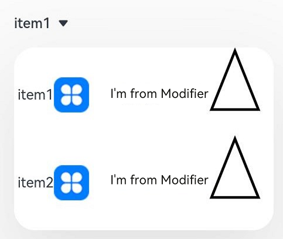

#  Select

The **Select** component provides a drop-down list box that allows users to select among multiple options.

>  **NOTE**
>
>  This component is supported since API version 8. Updates will be marked with a superscript to indicate their earliest API version.

## Child Components

Not supported

## APIs

Select(options: Array\<[SelectOption](#selectoption)\>)

**Atomic service API**: This API can be used in atomic services since API version 11.

**System capability**: SystemCapability.ArkUI.ArkUI.Full

**Parameters**

| Name | Type                                          | Mandatory| Description          |
| ------- | ---------------------------------------------- | ---- | -------------- |
| options | Array\<[SelectOption](#selectoption)\> | Yes  | Options in the drop-down list box.|

## SelectOption

**System capability**: SystemCapability.ArkUI.ArkUI.Full

| Name| Type                           | Mandatory| Description      |
| ------ | ----------------------------------- | ---- | -------------- |
| value  | [ResourceStr](ts-types.md#resourcestr) | Yes  | Value of an option in the drop-down list box.<br>**Atomic service API**: This API can be used in atomic services since API version 11.|
| icon   | [ResourceStr](ts-types.md#resourcestr) | No  | Icon of an option in the drop-down list box.<br>**Atomic service API**: This API can be used in atomic services since API version 11.|
| symbolIcon<sup>12+</sup>  | [SymbolGlyphModifier](ts-universal-attributes-attribute-modifier.md) | No  | Symbol icon of an option in the drop-down menu.<br>**symbolIcon** is at a higher priority than **icon**.<br>**Atomic service API**: This API can be used in atomic services since API version 12.|

## Attributes

In addition to the [universal attributes](ts-universal-attributes-size.md), the following attributes are supported.

### selected

selected(value: number | Resource)

Sets the index of the initial selected option in the drop-down list box. The index of the first option is **0**. If this attribute is set to an invalid value or is not set, the default value **-1** will be used, which means that no option will be selected. If this attribute is set to **undefined** or **null**, the first option will be selected.

Since API version 10, this attribute supports two-way binding through [$$](../../../quick-start/arkts-two-way-sync.md).

**Atomic service API**: This API can be used in atomic services since API version 11.

**System capability**: SystemCapability.ArkUI.ArkUI.Full

**Parameters**

| Name| Type                                                        | Mandatory| Description                    |
| ------ | ------------------------------------------------------------ | ---- | ------------------------ |
| value  | number \| [Resource](ts-types.md#resource)<sup>11+</sup> | Yes  | Index of the initial selected option in the drop-down list box.|

### value

value(value: ResourceStr)

Sets the text of the drop-down button. By default, it will be replaced by the content of the selected option, if any.

Since API version 10, this attribute supports two-way binding through [$$](../../../quick-start/arkts-two-way-sync.md).

**Atomic service API**: This API can be used in atomic services since API version 11.

**System capability**: SystemCapability.ArkUI.ArkUI.Full

**Parameters**

| Name| Type                                                | Mandatory| Description                    |
| ------ | ---------------------------------------------------- | ---- | ------------------------ |
| value  | [ResourceStr](ts-types.md#resourcestr)<sup>11+</sup> | Yes  | Text of the drop-down button.|

### controlSize<sup>12+</sup>

controlSize(value: ControlSize)

Sets the size of the **Select** component.

**Atomic service API**: This API can be used in atomic services since API version 12.

**System capability**: SystemCapability.ArkUI.ArkUI.Full

**Parameters**

| Name| Type                                         | Mandatory| Description                                            |
| ------ | --------------------------------------------- | ---- | ------------------------------------------------ |
| value  | [ControlSize](ts-basic-components-button.md#controlsize11)<sup>11+</sup> | Yes  | Size of the **Select** component.<br>Default value: **ControlSize.NORMAL**|

The priorities of **controlSize**, **width**, and **height** are as follows:

   1. If only **width** and **height** are set and the text is too large to fit in the component the text exceeds the component size and is displayed as an ellipsis (...).

   2. If only controlSize is set but width and height are not set, the width and height of the component adapt to the text. The text cannot exceed the component, and minWidth and minHeight are set.

   3) If controlSize, width, and height are set, the values of width and height take effect. If the values of width and height are less than the values of minWidth and minHeight set by controlSize, the values of width and height do not take effect, the width and height are the same as the minimum width minWidth and minimum height minHeight configured by controlSize.

### menuItemContentModifier<sup>12+</sup>

menuItemContentModifier(modifier: ContentModifier\<MenuItemConfiguration>)

Creates a content modifier for the drop-down list box.

**Atomic service API**: This API can be used in atomic services since API version 12.

**System capability**: SystemCapability.ArkUI.ArkUI.Full

**Parameters**

| Name| Type                                         | Mandatory| Description                                            |
| ------ | --------------------------------------------- | ---- | ------------------------------------------------ |
| modifier  | [ContentModifier\<MenuItemConfiguration>](#menuitemconfiguration12) | Yes  | Content modifier to apply to the drop-down list box.<br>**modifier**: content modifier. You need a custom class to implement the **ContentModifier** API.|

### divider<sup>12+</sup>

divider(options: Optional\<DividerOptions> | null)

Sets the divider style. If this attribute is not set, the divider is displayed based on the default value.

**Atomic service API**: This API can be used in atomic services since API version 12.

**System capability**: SystemCapability.ArkUI.ArkUI.Full

**Parameters**
| Name| Type   | Mandatory| Description                                                                 |
| ------ | ------- | ---- | --------------------------------------------------------------------- |
| options  | Optional\<[DividerOptions](ts-basic-components-textpicker.md#divideroptions12)> \| null | Yes  | Divider options.<br>1. If **DividerOptions** is set, the divider is displayed in the configured style.<br>Default value:<br>{<br>strokeWidth: '1px' , <br>color: '#33182431'<br>}<br>2. If this parameter is set to **null**, the divider is not displayed.<br>3. If the value of **strokeWidth** is too larger, the divider may overlap the text. The divider extends both upwards and downwards from the bottom of each item.<br>4. The default values for **startMargin** and **endMargin** are consistent with the style of the divider when the **divider** attribute is not set. If the sum of **startMargin** and **endMargin** is equal to the value of **optionWidth**, the divider is not displayed. If the sum of **startMargin** and **endMargin** exceeds the value of **optionWidth**, the divider line is displayed in the default style.|

### font

font(value: Font)

Sets the text font of the drop-down button. If **size** is set to **0**, the text is not displayed. If **size** is set to a negative value, the text is displayed at its default size.

**Atomic service API**: This API can be used in atomic services since API version 11.

**System capability**: SystemCapability.ArkUI.ArkUI.Full

**Parameters**

| Name| Type                    | Mandatory| Description                                                        |
| ------ | ------------------------ | ---- | ------------------------------------------------------------ |
| value  | [Font](ts-types.md#font) | Yes  | Text font of the drop-down button.<br>Default value:<br>API version 11 and earlier versions:<br>{<br>size: $r('sys.float.ohos_id_text_size_button1'),<br>weight: FontWeight.Medium<br>} <br>Since API version 12: The default value of **size** is **$r('sys.float.ohos_id_text_size_button2')** in the case of **controlSize.SMALL** and **$r('sys.float.ohos_id_text_size_button1')** in other cases.|

### fontColor

fontColor(value: ResourceColor)

Sets the font color of the drop-down button.

**Atomic service API**: This API can be used in atomic services since API version 11.

**System capability**: SystemCapability.ArkUI.ArkUI.Full

**Parameters**

| Name| Type                                      | Mandatory| Description                                                        |
| ------ | ------------------------------------------ | ---- | ------------------------------------------------------------ |
| value  | [ResourceColor](ts-types.md#resourcecolor) | Yes  | Font color of the drop-down button.<br>Default value: **$r('sys.color.ohos_id_color_text_primary')** with the opacity of **$r('sys.color.ohos_id_alpha_content_primary')**|

### selectedOptionBgColor

selectedOptionBgColor(value: ResourceColor)

Sets the background color of the selected option in the drop-down list box.

**Atomic service API**: This API can be used in atomic services since API version 11.

**System capability**: SystemCapability.ArkUI.ArkUI.Full

**Parameters**

| Name| Type                                      | Mandatory| Description                                                        |
| ------ | ------------------------------------------ | ---- | ------------------------------------------------------------ |
| value  | [ResourceColor](ts-types.md#resourcecolor) | Yes  | Background color of the selected option in the drop-down list box.<br>Default value: **$r('sys.color.ohos_id_color_component_activated')** with the opacity of **$r('sys.color.ohos_id_alpha_highlight_bg')**|

### selectedOptionFont

selectedOptionFont(value: Font)

Sets the text font of the selected option in the drop-down list box. When **size** is set to **0**, the text is not displayed. When **size** is set to a negative value, the text is displayed at its default size.

**Atomic service API**: This API can be used in atomic services since API version 11.

**System capability**: SystemCapability.ArkUI.ArkUI.Full

**Parameters**

| Name| Type                    | Mandatory| Description                                                        |
| ------ | ------------------------ | ---- | ------------------------------------------------------------ |
| value  | [Font](ts-types.md#font) | Yes  | Text font of the selected option in the drop-down list box.<br>Default value:<br>{<br>size: $r('sys.color.ohos_id_text_size_body1'),<br>weight: FontWeight.Regular<br>} |

### selectedOptionFontColor

selectedOptionFontColor(value: ResourceColor)

Sets the font color of the selected option in the drop-down list box.

**Atomic service API**: This API can be used in atomic services since API version 11.

**System capability**: SystemCapability.ArkUI.ArkUI.Full

**Parameters**

| Name| Type                                      | Mandatory| Description                                                        |
| ------ | ------------------------------------------ | ---- | ------------------------------------------------------------ |
| value  | [ResourceColor](ts-types.md#resourcecolor) | Yes  | Font color of the selected option in the drop-down list box.<br>Default value: **$r('sys.color.ohos_id_color_text_primary_activated')**|

### optionBgColor

optionBgColor(value: ResourceColor)

Sets the background color of options in the drop-down list box.

**Atomic service API**: This API can be used in atomic services since API version 11.

**System capability**: SystemCapability.ArkUI.ArkUI.Full

**Parameters**

| Name| Type                                      | Mandatory| Description                                                        |
| ------ | ------------------------------------------ | ---- | ------------------------------------------------------------ |
| value  | [ResourceColor](ts-types.md#resourcecolor) | Yes  | Background color of an option in the drop-down list box.<br>Default value:<br>Versions earlier than API version 11: **Color.White**<br>Since API version 11: **Color.Transparent**|

### optionFont

optionFont(value: Font)

Sets the text font of options in the drop-down list box. When **size** is set to **0**, the text is not displayed. When **size** is set to a negative value, the text is displayed at its default size.

**Atomic service API**: This API can be used in atomic services since API version 11.

**System capability**: SystemCapability.ArkUI.ArkUI.Full

**Parameters**

| Name| Type                    | Mandatory| Description                                                        |
| ------ | ------------------------ | ---- | ------------------------------------------------------------ |
| value  | [Font](ts-types.md#font) | Yes  | Text font of options in the drop-down list box.<br>Default value:<br>{<br>size: $r('sys.float.ohos_id_text_size_body1'),<br>weight: FontWeight.Regular<br>} |

### optionFontColor

optionFontColor(value: ResourceColor)

Sets the font color of options in the drop-down list box.

**Atomic service API**: This API can be used in atomic services since API version 11.

**System capability**: SystemCapability.ArkUI.ArkUI.Full

**Parameters**

| Name| Type                                      | Mandatory| Description                                                        |
| ------ | ------------------------------------------ | ---- | ------------------------------------------------------------ |
| value  | [ResourceColor](ts-types.md#resourcecolor) | Yes  | Font color of options in the drop-down list box.<br>Default value: **$r('sys.color.ohos_id_color_text_primary')**|

### space<sup>10+</sup>

space(value: Length)

Sets the spacing between the text and arrow of an option. This attribute cannot be set in percentage. If the value specified is **null**, **undefined**, or a value less than or equal to 8, the default value is used.

**Atomic service API**: This API can be used in atomic services since API version 11.

**System capability**: SystemCapability.ArkUI.ArkUI.Full

**Parameters**

| Name| Type                        | Mandatory| Description                                            |
| ------ | ---------------------------- | ---- | ------------------------------------------------ |
| value  | [Length](ts-types.md#length) | Yes  | Spacing between the text and arrow of an option.<br>Default value: **8**|

### arrowPosition<sup>10+</sup>

arrowPosition(value: ArrowPosition)

Sets the alignment between the text and arrow of an option.

**Atomic service API**: This API can be used in atomic services since API version 11.

**System capability**: SystemCapability.ArkUI.ArkUI.Full

**Parameters**

| Name| Type                                     | Mandatory| Description                                                        |
| ------ | ----------------------------------------- | ---- | ------------------------------------------------------------ |
| value  | [ArrowPosition](#arrowposition10) | Yes  | Alignment between the text and arrow of an option.<br>Default value: **ArrowPosition.END**|

### menuAlign<sup>10+</sup>

menuAlign(alignType: MenuAlignType, offset?: Offset)

Sets the alignment between the drop-down button and the drop-down menu.

**Atomic service API**: This API can be used in atomic services since API version 11.

**System capability**: SystemCapability.ArkUI.ArkUI.Full

**Parameters**

| Name   | Type                                     | Mandatory| Description                                                        |
| --------- | ----------------------------------------- | ---- | ------------------------------------------------------------ |
| alignType | [MenuAlignType](#menualigntype10) | Yes  | Alignment type.<br>Default value: **MenuAlignType.START**              |
| offset    | [Offset](ts-types.md#offset)              | No  | Offset of the drop-down menu relative to the drop-down button after alignment based on the alignment type.<br> Default value: **{dx: 0, dy: 0}**|

### optionWidth<sup>11+</sup>

optionWidth(value: Dimension | OptionWidthMode )

Sets the width for the option in the drop-down list box. This attribute cannot be set in percentage. **OptionWidthMode** specifies whether to inherit the width of the drop-down list button.

If an invalid value or a value less than the minimum width of 56 vp is set, the attribute does not take effect, and the option width uses the default value, which is two columns.

**Atomic service API**: This API can be used in atomic services since API version 12.

**System capability**: SystemCapability.ArkUI.ArkUI.Full

**Parameters**

| Name| Type                                                        | Mandatory| Description              |
| ------ | ------------------------------------------------------------ | ---- | ------------------ |
| value  | [Dimension](ts-types.md#dimension10) \| [OptionWidthMode](ts-appendix-enums.md#optionwidthmode11) | Yes  | Width of the option in the drop-down list box.|

### optionHeight<sup>11+</sup>

optionHeight(value: Dimension)

Sets the maximum height for the option in the drop-down list box. This attribute cannot be set in percentage. The default and maximum value is 80% of the available height of the screen.

If set to an invalid value or 0, this attribute does not take effect. In this case, the default value is used.

If the actual height of all options in the drop-down list box is less than the preset height, the options are displayed at their actual height.

**Atomic service API**: This API can be used in atomic services since API version 12.

**System capability**: SystemCapability.ArkUI.ArkUI.Full

**Parameters**

| Name| Type                                | Mandatory| Description                    |
| ------ | ------------------------------------ | ---- | ------------------------ |
| value  | [Dimension](ts-types.md#dimension10) | Yes  | Maximum height of the option in the drop-down list box.|

### menuBackgroundColor<sup>11+</sup>

menuBackgroundColor(value: ResourceColor)

Sets the background color of the drop-down list box.

**Atomic service API**: This API can be used in atomic services since API version 12.

**System capability**: SystemCapability.ArkUI.ArkUI.Full

**Parameters**

| Name| Type                                      | Mandatory| Description                                                        |
| ------ | ------------------------------------------ | ---- | ------------------------------------------------------------ |
| value  | [ResourceColor](ts-types.md#resourcecolor) | Yes  | Background color of the drop-down list box.<br>Default value:<br>Versions earlier than API version 11: **$r('sys.color.ohos_id_color_card_bg')**<br>Since API version 11: **Color.Transparent**|

### menuBackgroundBlurStyle<sup>11+</sup>

menuBackgroundBlurStyle(value: BlurStyle)

Sets the background blur style of the drop-down list box.

**Atomic service API**: This API can be used in atomic services since API version 12.

**System capability**: SystemCapability.ArkUI.ArkUI.Full

**Parameters**

| Name| Type                                        | Mandatory| Description                                                        |
| ------ | -------------------------------------------- | ---- | ------------------------------------------------------------ |
| value  | [BlurStyle](ts-universal-attributes-background.md#blurstyle9) | Yes  | Background blur style of the drop-down list box.<br>Default value: **BlurStyle.COMPONENT_ULTRA_THICK**|

## ArrowPosition<sup>10+</sup>

**Atomic service API**: This API can be used in atomic services since API version 11.

**System capability**: SystemCapability.ArkUI.ArkUI.Full

| Name               | Description            |
| ------------------- | ------------------ |
| END<sup>10+</sup>   | The text is in front of the arrow.|
| START<sup>10+</sup> | The arrow is in front of the text.|

## MenuAlignType<sup>10+</sup>

**Atomic service API**: This API can be used in atomic services since API version 11.

**System capability**: SystemCapability.ArkUI.ArkUI.Full

| Name               | Description            |
| ------------------- | ------------------ |
| START               | Aligned with the start edge in the same direction as the language in use.|
| CENTER              | Aligned with the center.|
| END                 | Aligned with the end edge in the same direction as the language in use.|

## MenuItemConfiguration<sup>12+</sup>

**Atomic service API**: This API can be used in atomic services since API version 12.

**System capability**: SystemCapability.ArkUI.ArkUI.Full

| Name| Type                                        | Mandatory| Description                                                        |
| ------ | -------------------------------------------- | ---- | ------------------------------------------------------------ |
| value  | [ResourceStr](ts-types.md#resourcestr) | Yes  | Text content of the option in the drop-down list box.|
| icon  | [ResourceStr](ts-types.md#resourcestr) | No  | Icon of the option in the drop-down list box.|
| symbolIcon<sup>12+</sup>  | [SymbolGlyphModifier](ts-universal-attributes-attribute-modifier.md) | No  | Symbol icon of the option in the drop-down list box.|
| selected  | boolean | Yes  | Whether the option in the drop-down list box is selected.<br>Default value: **false**|
| index  | number | Yes  | Index of the option in the drop-down list box.|
| triggerSelect  | (index: number, value: string) :void | Yes  | Invoked when an option in the drop-down list box is selected.<br>**index**: index of the selected option.<br>**value**: text of the selected option.<br>**NOTE**<br>The value of **index** will be assigned to the **index** parameter in the [onSelect](#onselect) callback; the value of **value** will be returned to the **Select** component for display and will also be assigned to the **value** parameter in the [onSelect](#onselect) callback.|

## Events

### onSelect

onSelect(callback: (index: number, value: string) => void)

Invoked when an option in the drop-down list box is selected.

**Atomic service API**: This API can be used in atomic services since API version 11.

**System capability**: SystemCapability.ArkUI.ArkUI.Full

**Parameters**

| Name| Type  | Mandatory| Description          |
| ------ | ------ | ---- | -------------- |
| index  | number | Yes  | Index of the selected option.|
| value  | string | Yes  | Value of the selected option.  |

##  Example 1

```ts
// xxx.ets
@Entry
@Component
struct SelectExample {
  @State text: string = "TTTTT"
  @State index: number = 2
  @State space: number = 8
  @State arrowPosition: ArrowPosition = ArrowPosition.END
  build() {
    Column() {
      Select([{ value: 'aaa', icon: $r("app.media.selection") },
        { value: 'bbb', icon: $r("app.media.selection") },
        { value: 'ccc', icon: $r("app.media.selection") },
        { value: 'ddd', icon: $r("app.media.selection") }])
        .selected(this.index)
        .value(this.text)
        .font({ size: 16, weight: 500 })
        .fontColor('#182431')
        .selectedOptionFont({ size: 16, weight: 400 })
        .optionFont({ size: 16, weight: 400 })
        .space(this.space)
        .arrowPosition(this.arrowPosition)
        .menuAlign(MenuAlignType.START, {dx:0, dy:0})
        .optionWidth(200)
        .optionHeight(300)
        .onSelect((index:number, text?: string | undefined)=>{
          console.info('Select:' + index)
          this.index = index;
          if(text){
            this.text = text;
          }
        })
    }.width('100%')
  }
}
```


##  Example 2
This example implements a custom drop-down list box, each option of which consists of text + image + blank area + text + drawn triangle. After a menu option is clicked, the text content of the menu option is displayed.

```ts
import { MenuItemModifier } from '@kit.ArkUI'

class MyMenuItemContentModifier implements ContentModifier<MenuItemConfiguration> {
  modifierText: string = ""
  constructor(text: string) {
    this.modifierText = text;
  }
  applyContent(): WrappedBuilder<[MenuItemConfiguration]> {
    return wrapBuilder(MenuItemBuilder)
  }
}

@Builder
function MenuItemBuilder(configuration: MenuItemConfiguration) {
  Row() {
    Text(configuration.value)
    Blank()
    Image(configuration.icon).size({ width: 40, height: 40 })
    Blank(30)
    Text((configuration.contentModifier as MyMenuItemContentModifier).modifierText)
    Path()
      .width('100px')
      .height('150px')
      .commands('M40 0 L80 100 L0 100 Z')
      .fillOpacity(0)
      .stroke(Color.Black)
      .strokeWidth(3)
  }
  .onClick(() => {
    configuration.triggerSelect(configuration.index, configuration.value.valueOf().toString())
  })
}

@Entry
@Component
struct SelectExample {
  @State text: string = "With modifier"
  build() {
    Column() {
      Row() {
        Select([{ value: 'item1', icon: $r("app.media.icon") },
          { value: 'item2', icon: $r("app.media.icon") }])
          .value(this.text)
          .onSelect((index:number, text?: string)=>{
            console.info('Select index:' + index)
            console.info('Select text:' + text)
          })
          .menuItemContentModifier(new MyMenuItemContentModifier("I'm from Modifier"))

      }.alignItems(VerticalAlign.Center).height("50%")
    }
  }
}
```


##  Example 3
This example implements a drop-down list box, each option of which uses a symbol as its image.

```ts
// xxx.ets
import { SymbolGlyphModifier } from '@kit.ArkUI'

@Entry
@Component
struct SelectExample {
  @State text: string = "TTTTT"
  @State index: number = 2
  @State space: number = 8
  @State arrowPosition: ArrowPosition = ArrowPosition.END
  @State symbolModifier1: SymbolGlyphModifier = new SymbolGlyphModifier($r('sys.symbol.ohos_wifi')).fontColor([Color.Green]);
  @State symbolModifier2: SymbolGlyphModifier = new SymbolGlyphModifier($r('sys.symbol.ohos_star')).fontColor([Color.Red]);
  @State symbolModifier3: SymbolGlyphModifier = new SymbolGlyphModifier($r('sys.symbol.ohos_trash')).fontColor([Color.Gray]);
  @State symbolModifier4: SymbolGlyphModifier = new SymbolGlyphModifier($r('sys.symbol.exposure')).fontColor([Color.Gray]);
  build() {
    Column() {
      Select([{ value: 'aaa', symbolIcon: this.symbolModifier1 },
        { value: 'bbb', symbolIcon: this.symbolModifier2 },
        { value: 'ccc', symbolIcon: this.symbolModifier3 },
        { value: 'ddd', symbolIcon: this.symbolModifier4 }])
        .selected(this.index)
        .value(this.text)
        .font({ size: 16, weight: 500 })
        .fontColor('#182431')
        .selectedOptionFont({ size: 16, weight: 400 })
        .optionFont({ size: 16, weight: 400 })
        .space(this.space)
        .arrowPosition(this.arrowPosition)
        .menuAlign(MenuAlignType.START, {dx:0, dy:0})
        .onSelect((index:number, text?: string | undefined)=>{
          console.info('Select:' + index)
          this.index = index;
          if(text){
            this.text = text;
          }
        })
    }.width('100%')
  }
}
```


##  Example 4
This example implements a custom drop-down list box, each option of which consists of text + symbol + blank area + text + drawn triangle. After a menu option is clicked, the text content of the menu option is displayed.

```ts
import { MenuItemModifier, SymbolGlyphModifier } from '@kit.ArkUI'

class MyMenuItemContentModifier implements ContentModifier<MenuItemConfiguration> {
  modifierText: string = ""
  constructor(text: string) {
    this.modifierText = text;
  }
  applyContent(): WrappedBuilder<[MenuItemConfiguration]> {
    return wrapBuilder(MenuItemBuilder)
  }
}

@Builder
function MenuItemBuilder(configuration: MenuItemConfiguration) {
  Row() {
    Text(configuration.value)
    Blank()
    if (configuration.symbolIcon) {
      SymbolGlyph().attributeModifier(configuration.symbolIcon).fontSize(24)
    } else if (configuration.icon) {
      Image(configuration.icon).size({ width: 24, height: 24 })
    }
    Blank(30)
    Text((configuration.contentModifier as MyMenuItemContentModifier).modifierText)
    Blank(30)
    Path()
      .width('100px')
      .height('150px')
      .commands('M40 0 L80 100 L0 100 Z')
      .fillOpacity(0)
      .stroke(Color.Black)
      .strokeWidth(3)
  }
  .onClick(() => {
    configuration.triggerSelect(configuration.index, configuration.value.valueOf().toString())
  })
}

@Entry
@Component
struct SelectExample {
  @State text: string = "Content Modifier Select"
  @State symbolModifier1: SymbolGlyphModifier = new SymbolGlyphModifier($r('sys.symbol.ohos_trash')).fontColor([Color.Gray]);
  @State symbolModifier2: SymbolGlyphModifier = new SymbolGlyphModifier($r('sys.symbol.exposure')).fontColor([Color.Gray]);
  build() {
    Column() {
      Row() {
        Select([{ value: 'item1', icon: $r('app.media.icon'), symbolIcon: this.symbolModifier1 },
          { value: 'item1', icon: $r('app.media.icon'), symbolIcon: this.symbolModifier2 }])
          .value(this.text)
          .onSelect((index:number, text?: string)=>{
            console.info('Select index:' + index)
            console.info('Select text:' + text)
          })
          .menuItemContentModifier(new MyMenuItemContentModifier("Content Modifier"))

      }.alignItems(VerticalAlign.Center).height('50%')
    }
  }
}
```


##  Example 5
This example implements a drop-down list box with custom dividers.

```ts
// xxx.ets
@Entry
@Component
struct SelectExample {
  @State text: string = "TTTTT"
  @State index: number = -1
  @State arrowPosition: ArrowPosition = ArrowPosition.END
  build() {
    Column() {
      Select([{ value: 'aaa', icon: $r("app.media.icon") },
        { value: 'bbb', icon: $r("app.media.icon") },
        { value: 'ccc', icon: $r("app.media.icon") },
        { value: 'ddd', icon: $r("app.media.icon") }])
        .selected(this.index)
        .value(this.text)
        .font({ size: 16, weight: 500 })
        .fontColor('#182431')
        .selectedOptionFont({ size: 16, weight: 400 })
        .optionFont({ size: 16, weight: 400 })
        .arrowPosition(this.arrowPosition)
        .menuAlign(MenuAlignType.START, {dx:0, dy:0})
        .optionWidth(200)
        .optionHeight(300)
        .divider( { strokeWidth: 5, color: Color.Blue, startMargin: 10, endMargin: 10 })
        .onSelect((index:number, text?: string | undefined)=>{
          console.info('Select:' + index)
          this.index = index;
          if(text){
            this.text = text;
          }
        })
    }.width('100%')
  }
}
```


##  Example 6
This example implements a drop-down list box where the dividers are hidden.

```ts
// xxx.ets
@Entry
@Component
struct SelectExample {
  @State text: string = "TTTTT"
  @State index: number = -1
  @State arrowPosition: ArrowPosition = ArrowPosition.END
  build() {
    Column() {
      Select([{ value: 'aaa', icon: $r("app.media.icon") },
        { value: 'bbb', icon: $r("app.media.icon") },
        { value: 'ccc', icon: $r("app.media.icon") },
        { value: 'ddd', icon: $r("app.media.icon") }])
        .selected(this.index)
        .value(this.text)
        .font({ size: 16, weight: 500 })
        .fontColor('#182431')
        .selectedOptionFont({ size: 16, weight: 400 })
        .optionFont({ size: 16, weight: 400 })
        .arrowPosition(this.arrowPosition)
        .menuAlign(MenuAlignType.START, {dx:0, dy:0})
        .optionWidth(200)
        .optionHeight(300)
        .divider( null )
        .onSelect((index:number, text?: string | undefined)=>{
          console.info('Select:' + index)
          this.index = index;
          if(text){
            this.text = text;
          }
        })
    }.width('100%')
  }
}
```

