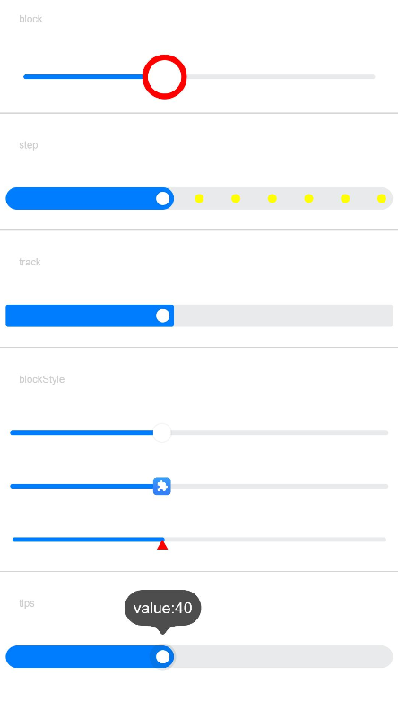
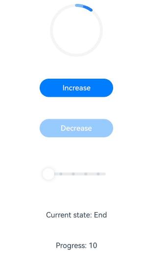
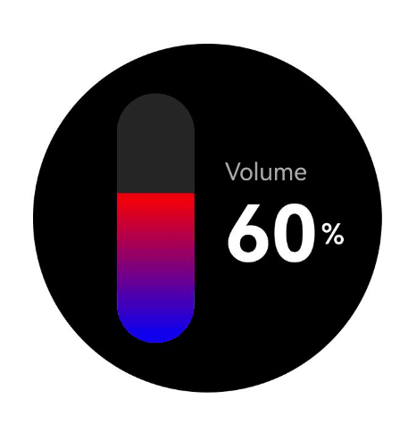

# Slider

The **Slider** component is used to quickly adjust settings, such as the volume and brightness.

>  **NOTE**
>
>  This component is supported since API version 7. Updates will be marked with a superscript to indicate their earliest API version.


## Child Components

Not supported


## APIs

Slider(options?: SliderOptions)

**Widget capability**: This API can be used in ArkTS widgets since API version 9.

**Atomic service API**: This API can be used in atomic services since API version 11.

**System capability**: SystemCapability.ArkUI.ArkUI.Full

**Parameters**

| Name | Type                                   | Mandatory| Description              |
| ------- | --------------------------------------- | ---- | ------------------ |
| options | [SliderOptions](#slideroptions) | No  | Parameters of the slider.|

## SliderOptions

Provides information about the slider.

**Widget capability**: This API can be used in ArkTS widgets since API version 9.

**Atomic service API**: This API can be used in atomic services since API version 11.

**System capability**: SystemCapability.ArkUI.ArkUI.Full

| Name| Type| Mandatory| Description|
| -------- | -------- | -------- | -------- |
| value | number | No| Current progress.<br>Default value: same as the value of **min**<br>Since API version 10, this parameter supports two-way binding through [$$](../../../ui/state-management/arkts-two-way-sync.md).<br>This parameter supports two-way binding through the [!! syntax](../../../ui/state-management/arkts-new-binding.md#two-way-binding-between-built-in-component-parameters).<br>Value range: [min, max]<br>Values less than the value of **min** are adjusted to the value of **min**, and values greater than the value of **max** are capped at the value of **max**.|
| min | number | No| Minimum value.<br>Default value: **0**|
| max | number | No| Maximum value.<br>Default value: **100**<br>**NOTE**<br>If the value of **min** is greater than or equal to the value of **max**, the **min** value defaults to **0**, and the **max** value defaults to **100**.<br>If the value is not within the [min, max] range, the value of **min** or **max** is used, whichever is closer.|
| step | number | No| Step of the slider.<br>Default value: **1**<br>Value range: [0.01, max - min]<br>**NOTE**<br>If this parameter is set to a value less than 0 or greater than the value of **max**, the default value is used.|
| style | [SliderStyle](#sliderstyle) | No| Style of the slider thumb and track.<br>Default value: **SliderStyle.OutSet**|
| direction<sup>8+</sup> | [Axis](ts-appendix-enums.md#axis) | No| Whether the slider moves horizontally or vertically.<br>Default value: **Axis.Horizontal**|
| reverse<sup>8+</sup> | boolean | No| Whether the slider values are reversed.<br>Default value: **false**.<br>**true**: Horizontal sliders slide from right to left, while vertical sliders slide from bottom to top.<br>**false**: Horizontal sliders slide from left to right, while vertical sliders slide from top to bottom.|

## SliderStyle

Enumerates the display styles of the slider thumb relative to the track.

**System capability**: SystemCapability.ArkUI.ArkUI.Full

| Name| Description|
| -------- | -------- |
| OutSet | The thumb is on the track.<br>**Widget capability**: This API can be used in ArkTS widgets since API version 9.<br>**Atomic service API**: This API can be used in atomic services since API version 11.|
| InSet | The thumb is in the track.<br>**Widget capability**: This API can be used in ArkTS widgets since API version 9.<br>**Atomic service API**: This API can be used in atomic services since API version 11.|
| NONE<sup>12+</sup> | There is no thumb.<br>**Widget capability**: This API can be used in ArkTS widgets since API version 12.<br>**Atomic service API**: This API can be used in atomic services since API version 12.|

>  **NOTE**
>
>  - By default, the slider has no padding.
>  - For horizontal sliders, the default height is 40 vp, the width matches the parent container's width, and the track maintains center alignment. When **SliderStyle.OutSet** is used, it applies 9 vp (half of the [blockSize](#blocksize10) value) margins on both left and right sides. When **SliderStyle.InSet** is used, it enforces 6 vp margins on both left and right sides. Custom padding values will be applied in addition to these default margins and will not override them.
>  - For vertical sliders, the default width is 40 vp, the height matches the parent container's height, and the track maintains center alignment. When **SliderStyle.OutSet** is used, it applies 10 vp margins on both top and bottom sides. When **SliderStyle.InSet** is used, it enforces 6 vp margins on both top and bottom sides. Custom padding values will be applied in addition to these default margins and will not override them.

## Attributes

All the [universal attributes](ts-component-general-attributes.md) except **responseRegion** are supported.

### blockColor

blockColor(value: ResourceColor)

Sets the color of the thumb.

When **SliderBlockType.DEFAULT** is used, **blockColor** sets the color of the round thumb.

When **SliderBlockType.IMAGE** is used, **blockColor** does not work as the thumb has no fill color.

When **SliderBlockType.SHAPE** is used, **blockColor** sets the color of the thumb in a custom shape.

**Widget capability**: This API can be used in ArkTS widgets since API version 9.

**Atomic service API**: This API can be used in atomic services since API version 11.

**System capability**: SystemCapability.ArkUI.ArkUI.Full

**Parameters**

| Name| Type                                      | Mandatory| Description                               |
| ------ | ------------------------------------------ | ---- | ----------------------------------- |
| value  | [ResourceColor](ts-types.md#resourcecolor) | Yes  | Color of the thumb.<br>Default value: **$r('sys.color.ohos_id_color_foreground_contrary')**|

### trackColor

trackColor(value: ResourceColor | LinearGradient)

Sets the background color of the track.

Since API version 12, **LinearGradient** can be used to create a gradient effect for the track.

**Widget capability**: This API can be used in ArkTS widgets since API version 9.

**Atomic service API**: This API can be used in atomic services since API version 11.

**System capability**: SystemCapability.ArkUI.ArkUI.Full

**Parameters**

| Name| Type                                                        | Mandatory| Description                                                        |
| ------ | ------------------------------------------------------------ | ---- | ------------------------------------------------------------ |
| value  | [ResourceColor](ts-types.md#resourcecolor) \| [LinearGradient<sup>12+</sup>](ts-basic-components-datapanel.md#lineargradient10) | Yes  | Background color of the track.<br>**NOTE**<br>With gradient color settings, if the color stop values are invalid or if the color stops are empty, the gradient effect will not be applied. Default value: **$r('sys.color.ohos_id_color_component_normal')**. The **LinearGradient** type cannot be used in atomic services.|

### selectedColor

selectedColor(value: ResourceColor)

Sets the color of the portion of the track between the minimum value and the thumb, representing the selected portion.

**Widget capability**: This API can be used in ArkTS widgets since API version 9.

**Atomic service API**: This API can be used in atomic services since API version 11.

**System capability**: SystemCapability.ArkUI.ArkUI.Full

**Parameters**

| Name| Type                                      | Mandatory| Description                                                        |
| ------ | ------------------------------------------ | ---- | ------------------------------------------------------------ |
| value  | [ResourceColor](ts-types.md#resourcecolor) | Yes  | Color of the portion of the track between the minimum value and the thumb.<br>**NOTE**<br>With gradient color settings, if the color stop values are invalid or if the color stops are empty, the gradient effect will not be applied.<br>Default value: **$r('sys.color.ohos_id_color_emphasize')**|

### selectedColor<sup>18+</sup>

selectedColor(selectedColor: ResourceColor | LinearGradient)

Sets the color of the portion of the track between the minimum value and the thumb, representing the selected portion. Compared with [selectedColor](#selectedcolor), this API supports the **LinearGradient** type.

Since API version 18, **LinearGradient** can be used to create a gradient effect for the selected portion.

**Widget capability**: This API can be used in ArkTS widgets since API version 18.

**Atomic service API**: This API can be used in atomic services since API version 18.

**System capability**: SystemCapability.ArkUI.ArkUI.Full

**Parameters**

| Name       | Type                                                        | Mandatory| Description                                                        |
| ------------- | ------------------------------------------------------------ | ---- | ------------------------------------------------------------ |
| selectedColor | [ResourceColor](ts-types.md#resourcecolor) \| [LinearGradient<sup>18+</sup>](ts-basic-components-datapanel.md#lineargradient10) | Yes  | Color of the portion of the track between the minimum value and the thumb.<br>**NOTE**<br>With gradient color settings, if the color stop values are invalid or if the color stops are empty, the gradient effect will not be applied.<br>Default value: **$r('sys.color.ohos_id_color_emphasize')**|

### showSteps

showSteps(value: boolean)

Sets whether to display the step markers along the slider track.

**Widget capability**: This API can be used in ArkTS widgets since API version 9.

**Atomic service API**: This API can be used in atomic services since API version 11.

**System capability**: SystemCapability.ArkUI.ArkUI.Full

**Parameters**

| Name| Type   | Mandatory| Description                                      |
| ------ | ------- | ---- | ------------------------------------------ |
| value  | boolean | Yes  | Whether to display the step markers along the slider track. <br>**true**: Display the step markers.<br>**false**: Hide the step markers.<br>Default value: **false**.|

### showTips

showTips(value: boolean, content?: ResourceStr)

Sets whether to display a tooltip when the user drags the slider.

When **direction** is set to **Axis.Horizontal**, the tooltip is displayed right above the slider; if there is insufficient space above, it will be displayed below. When **direction** is set to **Axis.Vertical**, the tooltip is displayed on the left of the slider; if there is insufficient space on the left, it will be displayed on the right. If the margins are not set or are set to small values, the tooltip may be clipped.

The drawing area of the tooltip is the overlay of the slider.

**Widget capability**: This API can be used in ArkTS widgets since API version 9.

**Atomic service API**: This API can be used in atomic services since API version 11.

**System capability**: SystemCapability.ArkUI.ArkUI.Full

**Parameters**

| Name               | Type                                  | Mandatory| Description                                      |
| --------------------- | -------------------------------------- | ---- | ------------------------------------------ |
| value                 | boolean                                | Yes  | Whether to display a tooltip when the user drags the slider. The value **true** means to display a tooltip, and **false** means the opposite.<br>Default value: **false**.|
| content<sup>10+</sup> | [ResourceStr](ts-types.md#resourcestr) | No  | Content of the tooltip. By default, the tooltip shows the current percentage value.  |

### trackThickness<sup>8+</sup>

trackThickness(value: Length)

Sets the thickness of the track. If the value is less than or equal to 0, the default value is used.

To ensure [SliderStyle](#sliderstyle) works as expected for the thumb and track, [blockSize](#blocksize10) should increase or decrease proportionally with **trackThickness**.

Specially, when **style** is **[SliderStyle](#sliderstyle).OutSet**, trackThickness: [blockSize](#blocksize10) = 1:4; when **style** is **[SliderStyle](#sliderstyle).InSet**, trackThickness: [blockSize](#blocksize10) = 5:3.

If the value of **trackThickness** or [blockSize](#blocksize10) exceeds the width or height of the **Slider** component, the default value is used.

When [SliderStyle](#sliderstyle) is set to **OutSet**, if the specified value of [blockSize](#blocksize10) exceeds the width or height of the **Slider** component, the default value is used, regardless of whether the value of **trackThickness** is valid or not.

**Widget capability**: This API can be used in ArkTS widgets since API version 9.

**Atomic service API**: This API can be used in atomic services since API version 11.

**System capability**: SystemCapability.ArkUI.ArkUI.Full

**Parameters**

| Name| Type                        | Mandatory| Description                                                        |
| ------ | ---------------------------- | ---- | ------------------------------------------------------------ |
| value  | [Length](ts-types.md#length) | Yes  | Thickness of the track.<br>Default value: 4.0vp when **style** is set to **[SliderStyle](#sliderstyle).OutSet**; 20.0vp when **style** is set to **[SliderStyle](#sliderstyle).InSet**|

### blockBorderColor<sup>10+</sup>

blockBorderColor(value: ResourceColor)

Sets the border color of the slider in the block direction.

When **SliderBlockType.DEFAULT** is used, **blockBorderColor** sets the border color of the round slider.

When **SliderBlockType.IMAGE** is used, **blockBorderColor** does not work as the slider has no border.

When **SliderBlockType.SHAPE** is used, **blockBorderColor** sets the border color of the slider in a custom shape.

**Atomic service API**: This API can be used in atomic services since API version 11.

**System capability**: SystemCapability.ArkUI.ArkUI.Full

**Parameters**

| Name| Type                                      | Mandatory| Description                                  |
| ------ | ------------------------------------------ | ---- | -------------------------------------- |
| value  | [ResourceColor](ts-types.md#resourcecolor) | Yes  | Border color of the slider in the block direction.<br>Default value: **'#00000000'**|

### blockBorderWidth<sup>10+</sup>

blockBorderWidth(value: Length)

Sets the border width of the slider in the block direction.

When **SliderBlockType.DEFAULT** is used, **blockBorderWidth** sets the border width of the round slider.

When **SliderBlockType.IMAGE** is used, **blockBorderWidth** does not work as the slider has no border.

When **SliderBlockType.SHAPE** is used, **blockBorderWidth** sets the border width of the slider in a custom shape.

**Atomic service API**: This API can be used in atomic services since API version 11.

**System capability**: SystemCapability.ArkUI.ArkUI.Full

**Parameters**

| Name| Type                        | Mandatory| Description          |
| ------ | ---------------------------- | ---- | -------------- |
| value  | [Length](ts-types.md#length) | Yes  | Border width of the slider in the block direction.<br>**NOTE**<br>For the string type, percentage values are not supported.|

### stepColor<sup>10+</sup>

stepColor(value: ResourceColor)

Sets the step color.

**Atomic service API**: This API can be used in atomic services since API version 11.

**System capability**: SystemCapability.ArkUI.ArkUI.Full

**Parameters**

| Name| Type                                      | Mandatory| Description                              |
| ------ | ------------------------------------------ | ---- | ---------------------------------- |
| value  | [ResourceColor](ts-types.md#resourcecolor) | Yes  | Step color.<br>Default value:<br>**$r('sys.color.ohos_id_color_foreground')** mixed with<br>**$r('sys.color.ohos_id_alpha_normal_bg')** transparency|

### trackBorderRadius<sup>10+</sup>

trackBorderRadius(value: Length)

Sets the radius of the rounded corner of the track.

**Atomic service API**: This API can be used in atomic services since API version 11.

**System capability**: SystemCapability.ArkUI.ArkUI.Full

**Parameters**

| Name| Type                        | Mandatory| Description                            |
| ------ | ---------------------------- | ---- | -------------------------------- |
| value  | [Length](ts-types.md#length) | Yes  | Radius of the rounded corner of the track.<br>Default value:<br>**'2vp'** when **style** is **SliderStyle.OutSet**<br>**'10vp'** when **style** is **SliderStyle.InSet**<br>**NOTE**<br>For the string type, percentage values are not supported. If the value is less than 0, the default value is used.|

### selectedBorderRadius<sup>12+</sup>

selectedBorderRadius(value: Dimension)

Set the corner radius of the selected (highlighted) part of the slider.

**Atomic service API**: This API can be used in atomic services since API version 12.

**System capability**: SystemCapability.ArkUI.ArkUI.Full

**Parameters**

| Name| Type                        | Mandatory| Description                            |
| ------ | ---------------------------- | ---- | -------------------------------- |
| value  | [Dimension](ts-types.md#dimension10)| Yes  | Corner radius of the selected part of the slider.<br>Default value:<br>- For **SliderStyle.InSet** or **SliderStyle.OutSet**: same as the corner radius of the background<br>- **SliderStyle.NONE**: **0**<br>**NOTE**<br>Percentage values are not supported. If the value is less than 0, the default value is used.|

### blockSize<sup>10+</sup>

blockSize(value: SizeOptions)

Sets the size of the slider in the block direction.

When the slider type is set to **SliderBlockType.DEFAULT**, the smaller of the width and height values is used as the radius of the circle.

When the slider type is set to **SliderBlockType.IMAGE**, this API sets the size of the image, which is scaled using the **ObjectFit.Cover** strategy.

When the slider type is set to **SliderBlockType.SHAPE**, this API sets the size of the custom shape, which is also scaled using the **ObjectFit.Cover** strategy.

**Atomic service API**: This API can be used in atomic services since API version 11.

**System capability**: SystemCapability.ArkUI.ArkUI.Full

**Parameters**

| Name| Type                                  | Mandatory| Description                                                        |
| ------ | -------------------------------------- | ---- | ------------------------------------------------------------ |
| value  | [SizeOptions](ts-types.md#sizeoptions) | Yes  | Size of the slider in the block direction.<br>Default value:<br>For [SliderStyle](#sliderstyle).OutSet: **{width: 18, height: 18}**<br/>- For [SliderStyle](#sliderstyle).InSet: **{width: 12, height: 12}**<br/>- For [SliderStyle](#sliderstyle).NONE: This parameter is not effective.<br>If the set **blockSize** has different width and height values, the smaller value is taken. If one or both of the width and height values are less than or equal to 0, the default value is used instead.|

### blockStyle<sup>10+</sup>

blockStyle(value: SliderBlockStyle)

Sets the style of the slider in the block direction.

**Atomic service API**: This API can be used in atomic services since API version 11.

**System capability**: SystemCapability.ArkUI.ArkUI.Full

**Parameters**

| Name| Type                                           | Mandatory| Description                                                        |
| ------ | ----------------------------------------------- | ---- | ------------------------------------------------------------ |
| value  | [SliderBlockStyle](#sliderblockstyle10) | Yes  | Style of the slider in the block direction.<br>Default value: **SliderBlockType.DEFAULT**, indicating the round slider.|

### stepSize<sup>10+</sup>

stepSize(value: Length)

Sets the step size (diameter). If the value is 0, the step size is not displayed. If the value is less than 0, the default value is used.

**Atomic service API**: This API can be used in atomic services since API version 11.

**System capability**: SystemCapability.ArkUI.ArkUI.Full

**Parameters**

| Name| Type                        | Mandatory| Description                                 |
| ------ | ---------------------------- | ---- | ------------------------------------- |
| value  | [Length](ts-types.md#length) | Yes  | Step size (diameter).<br>Default value: **'4vp'**<br>Value range: [0, [trackThickness](#trackthickness8))|

### minLabel<sup>(deprecated)</sup>

minLabel(value: string)

Sets the minimum value.

This API is deprecated since API version 9. You are advised to use **min** instead.

**System capability**: SystemCapability.ArkUI.ArkUI.Full

**Parameters**

| Name| Type  | Mandatory| Description    |
| ------ | ------ | ---- | -------- |
| value  | string | Yes  | Minimum value.|

### maxLabel<sup>(deprecated)</sup>

maxLabel(value: string)

Sets the maximum value.

This API is deprecated since API version 9. You are advised to use **max** instead.

**System capability**: SystemCapability.ArkUI.ArkUI.Full

**Parameters**

| Name| Type  | Mandatory| Description    |
| ------ | ------ | ---- | -------- |
| value  | string | Yes  | Maximum value.|

### sliderInteractionMode<sup>12+</sup>

sliderInteractionMode(value: SliderInteraction)

Sets the interaction mode between the user and the slider.

**Atomic service API**: This API can be used in atomic services since API version 12.

**System capability**: SystemCapability.ArkUI.ArkUI.Full

**Parameters**

| Name| Type                                             | Mandatory| Description                                                        |
| ------ | ------------------------------------------------- | ---- | ------------------------------------------------------------ |
| value  | [SliderInteraction](#sliderinteraction12)| Yes  | Interaction mode between the user and the slider.<br> Default value: **SliderInteraction.SLIDE_AND_CLICK**|

### minResponsiveDistance<sup>12+</sup>

minResponsiveDistance(value: number)

Sets the minimum distance required for the slider to respond.

**Atomic service API**: This API can be used in atomic services since API version 12.

**System capability**: SystemCapability.ArkUI.ArkUI.Full

**Parameters**

| Name| Type   | Mandatory| Description                                      |
| ------ | ------- | ---- | ------------------------------------------ |
| value  | number | Yes  | Minimum distance required for the slider to respond. The slider will only move when the sliding distance exceeds this threshold.<br>**NOTE**<br>The unit is the same as that of [min](#slideroptions) and [max](#slideroptions).<br>If the value is less than 0, greater than the result of (max - min), or invalid, the default value is used.<br>Default value: **0** |

### contentModifier<sup>12+</sup>

contentModifier(modifier: ContentModifier\<SliderConfiguration>)

Creates a content modifier.

**Atomic service API**: This API can be used in atomic services since API version 12.

**System capability**: SystemCapability.ArkUI.ArkUI.Full

**Parameters**

| Name| Type                                         | Mandatory| Description                                            |
| ------ | --------------------------------------------- | ---- | ------------------------------------------------ |
| modifier  | [ContentModifier\<SliderConfiguration>](#sliderconfiguration12)| Yes  | Content modifier to apply to the slider.<br>**modifier**: content modifier. You need a custom class to implement the **ContentModifier** API.|

>  **NOTE**
>
>  - If **contentModifier** is set, then clicks and gestures within the custom area will not trigger the **onChange** event of the original slider.
>  - The **onChange** event of the original slider can only be triggered when the **triggerChange** API is called with valid parameter values.

### slideRange<sup>12+</sup>

slideRange(value: SlideRange)

Sets the slide range.

**Atomic service API**: This API can be used in atomic services since API version 12.

**System capability**: SystemCapability.ArkUI.ArkUI.Full

**Parameters**

| Name| Type                               | Mandatory| Description            |
| ------ | ----------------------------------- | ---- | ---------------- |
| value  | [SlideRange](#sliderange12) | Yes  | Slide range.|

### enableHapticFeedback<sup>18+</sup>

enableHapticFeedback(enabled: boolean)

Specifies whether to enable haptic feedback.

To enable haptic feedback, you must declare the ohos.permission.VIBRATE permission under **requestPermissions** in the **module.json5** file of the project.

```json
"requestPermissions": [
  {
    "name": "ohos.permission.VIBRATE",
  }
 ]
```

**Atomic service API**: This API can be used in atomic services since API version 18.

**System capability**: SystemCapability.ArkUI.ArkUI.Full

| Name| Type                                         | Mandatory | Description                                                                                 |
| ------ | --------------------------------------------- |-----|-------------------------------------------------------------------------------------|
| enabled  | boolean | Yes  | Whether to enable haptic feedback.<br>**true** (default): Haptic feedback is enabled.<br>**false**: Haptic feedback is disabled.|

### digitalCrownSensitivity<sup>18+</sup>

digitalCrownSensitivity(sensitivity: Optional\<CrownSensitivity>)

Sets the sensitivity to the digital crown rotation.

**Atomic service API**: This API can be used in atomic services since API version 18.

**System capability**: SystemCapability.ArkUI.ArkUI.Full

**Parameters**

| Name     | Type                                                        | Mandatory| Description                                                   |
| ----------- | ------------------------------------------------------------ | ---- | ------------------------------------------------------- |
| sensitivity | [Optional\<CrownSensitivity>](ts-appendix-enums.md#crownsensitivity18) | Yes  | Sensitivity to the digital crown rotation.<br>Default value: **CrownSensitivity.MEDIUM**|

### prefix<sup>20+</sup>

prefix(content: ComponentContent, options?: SliderPrefixOptions)

Sets the prefix of the slider.

**Atomic service API**: This API can be used in atomic services since API version 20.

**System capability**: SystemCapability.ArkUI.ArkUI.Full

**Parameters**

| Name     | Type                                                        | Mandatory| Description                                                   |
| ----------- | ------------------------------------------------------------ | ---- | ------------------------------------------------------- |
| content | [ComponentContent](../js-apis-arkui-ComponentContent.md) | Yes  | Visual content of the slider prefix, which will be displayed at the start of the slider.|
| options | [SliderPrefixOptions](#sliderprefixoptions20) | No  | Accessibility configuration of the slider prefix.|

### suffix<sup>20+</sup>

suffix(content: ComponentContent, options?: SliderSuffixOptions)

Sets the suffix of the slider.

**Atomic service API**: This API can be used in atomic services since API version 20.

**System capability**: SystemCapability.ArkUI.ArkUI.Full

**Parameters**

| Name     | Type                                                        | Mandatory| Description                                                   |
| ----------- | ------------------------------------------------------------ | ---- | ------------------------------------------------------- |
| content | [ComponentContent](../js-apis-arkui-ComponentContent.md)    | Yes  | Visual content of the slider suffix, which will be displayed at the end of the slider.|
| options | [SliderSuffixOptions](#slidersuffixoptions20) | No  | Accessibility configuration of the slider suffix.|

### showSteps<sup>20+</sup>

showSteps(value: boolean, options?: SliderShowStepOptions)

Sets whether to display the step markers along the slider track.

You can set custom accessibility text for each step value. If no accessibility text is provided, the numeric values are used.

The accessibility text settings take effect only when the step markers are displayed.

**Widget capability**: This API can be used in ArkTS widgets since API version 20.

**Atomic service API**: This API can be used in atomic services since API version 20.

**System capability**: SystemCapability.ArkUI.ArkUI.Full

**Parameters**

| Name     | Type                                                        | Mandatory| Description                                                   |
| ----------- | ------------------------------------------------------------ | ---- | ------------------------------------------------------- |
| value | boolean | Yes| Whether to display the step markers along the slider track. <br>**true**: Display the step markers.<br>**false**: Hide the step markers.<br>Default value: **false**.|
| options | [SliderShowStepOptions](#slidershowstepoptions20) | No| Accessibility configuration of step markers.<br>Default value: **null**.|

## SliderCustomContentOptions<sup>20+</sup>

Provides accessibility configuration of the slider prefix and suffix.

**Atomic service API**: This API can be used in atomic services since API version 20.

**System capability**: SystemCapability.ArkUI.ArkUI.Full

| Name                    | Type       | Mandatory| Description                                                        |
| ------------------------ | ----------- | ---- | ------------------------------------------------------------ |
| accessibilityText        | [ResourceStr](ts-types.md#resourcestr) | No  | Text for assistive technologies (for example, screen readers).<br>Default value: **""**.|
| accessibilityDescription | [ResourceStr](ts-types.md#resourcestr) | No  | Detailed functional description for assistive technologies.<br>Default value: **"Double-tap to activate"**.|
| accessibilityLevel       | string      | No  | Whether the component can be recognized by accessibility services.<br>The options are as follows:<br>**"auto"**: It is treated as "yes" by the system.<br>**"yes"**: The component can be recognized by accessibility services.<br>**"no"**: The component cannot be recognized by accessibility services.<br>**"no-hide-descendants"**: Neither the component nor its child components can be recognized by accessibility services.<br>Default value: **"auto"**.|
| accessibilityGroup       | boolean     | No  | Whether to enable accessibility grouping. The value **true** means to enable accessibility grouping, and **false** means the opposite. When accessibility grouping is enabled, the component and all its children are treated as a single selectable unit, and the accessibility service will no longer focus on the individual child components.<br>Default value: **false**.|

## SliderPrefixOptions<sup>20+</sup>

Provides accessibility configuration of the slider prefix. Inherits from [SliderCustomContentOptions](#slidercustomcontentoptions20).

**Atomic service API**: This API can be used in atomic services since API version 20.

**System capability**: SystemCapability.ArkUI.ArkUI.Full

## SliderSuffixOptions<sup>20+</sup>

Provides accessibility configuration of the slider suffix. Inherits from [SliderCustomContentOptions](#slidercustomcontentoptions20).

**Atomic service API**: This API can be used in atomic services since API version 20.

**System capability**: SystemCapability.ArkUI.ArkUI.Full

## SliderStepItemAccessibility<sup>20+</sup>

Provides accessibility configuration of the slider step markers.

**Atomic service API**: This API can be used in atomic services since API version 20.

**System capability**: SystemCapability.ArkUI.ArkUI.Full

| Name                    | Type       | Mandatory| Description                                                        |
| ------------------------ | ----------- | ---- | ------------------------------------------------------------ |
| text | [ResourceStr](ts-types.md#resourcestr) | No| Text for assistive technologies (for example, screen readers).<br>Default value: **""**.|

## SliderShowStepOptions<sup>20+</sup>

Provides accessibility text mapping for the slider step markers.

**Atomic service API**: This API can be used in atomic services since API version 20.

**System capability**: SystemCapability.ArkUI.ArkUI.Full

| Name                    | Type       | Mandatory| Description                                                        |
| ------------------------ | ----------- | ---- | ------------------------------------------------------------ |
| stepsAccessibility | Map<number, [SliderStepItemAccessibility](#sliderstepitemaccessibility20)> | No| Step value-to-text mappings for assistive technologies (for example, screen readers).<br>Value range for **Key**: [0, INT32_MAX].<br>If **Key** is set to a negative number or a decimal, the setting does not take effect.<br>Default value: **{}**.|

## SliderBlockStyle<sup>10+</sup>

Describes the style of the slider in the block direction.

**Atomic service API**: This API can be used in atomic services since API version 11.

**System capability**: SystemCapability.ArkUI.ArkUI.Full

| Name | Type                                                        | Mandatory| Description                                                        |
| ----- | ------------------------------------------------------------ | ---- | ------------------------------------------------------------ |
| type  | [SliderBlockType](#sliderblocktype10)                | Yes  | Type of the slider in the block direction.<br>Default value: **SliderBlockType.DEFAULT**, indicating the round slider.|
| image | [ResourceStr](ts-types.md#resourcestr)                       | No  | Image resource of the slider.<br>The area size for displaying the image is subject to the **blockSize** attribute. Be mindful of the image size when selecting an image.|
| shape | [Circle](ts-drawing-components-circle.md) \| [Ellipse](ts-drawing-components-ellipse.md) \| [Path](ts-drawing-components-path.md) \| [Rect](ts-drawing-components-rect.md)  | No  | Custom shape of the slider.                                  |

## SliderBlockType<sup>10+</sup>

Enumerates the types of the slider in the block direction.

**Atomic service API**: This API can be used in atomic services since API version 11.

**System capability**: SystemCapability.ArkUI.ArkUI.Full

| Name   | Value| Description                |
| ------- | -- | ---------------------- |
| DEFAULT | 0 | Round slider.  |
| IMAGE   | 1 | Slider with an image background.  |
| SHAPE   | 2 | Slider in a custom shape.|

## SliderInteraction<sup>12+</sup>

Enumerates the interaction modes between the user and the slider.

**Atomic service API**: This API can be used in atomic services since API version 12.

**System capability**: SystemCapability.ArkUI.ArkUI.Full

| Name    | Value|Description                         |
| ------ | -- | ----------------------------- |
| SLIDE_AND_CLICK | 0 | Users can drag the slider or touch the track to move the slider. The slider moves as soon as the mouse or finger is pressed.|
| SLIDE_ONLY | 1 | Users are not allowed to move the slider by touching the slider.|
| SLIDE_AND_CLICK_UP | 2 |Users can drag the slider or touch the track to move the slider. The slider moves when the mouse is released or finger is lifted, if the release/lift position coincides with the screen press position.|

## SlideRange<sup>12+</sup>

Defines the callback type used in **SlideRange**.

**Atomic service API**: This API can be used in atomic services since API version 12.

**System capability**: SystemCapability.ArkUI.ArkUI.Full

| Name| Type    | Mandatory| Description          |
|----|--------| ---- |--------------|
| from | number | No| Start of the slide range.|
| to | number | No| End of the slide range.|

>  **NOTE**
>
>  - Currently, this API takes effect only when **MIN** ≤ **from** ≤ **to** ≤ **MAX** (the values of **MIN** and **MAX** do not depend on the values set, but on the actual values that take effect).
>  - You can set either **from** or **to**, or you can set both **from** and **to**.
>  - When the API is effective, if the set **from** value is between the adjacent multiples of **step**, then **from** takes the value of the left interval multiple of **step** or **MIN** as the corrected value.
>  - When the API is effective, if the set **to** value is between the adjacent multiples of **step**, then **to** takes the value of the right interval multiple of **step** or **MAX** as the corrected value.
>  - After **from** and **to** have taken their corrected values, when **value** is **undefined** or **null**, it takes the same value as **from**; when **value** is a number type, and if **value** ≤ **from**, then it takes **from**; if **value** > **to**, then it takes **to**.

## Events

In addition to the [universal events](ts-component-general-events.md), the following events are supported.

### onChange

onChange(callback: (value: number, mode: SliderChangeMode) =&gt; void)

Triggered when the slider is dragged or clicked.

The **Begin** and **End** states are triggered when the slider is clicked with a gesture. The **Moving** and **Click** states are triggered when the value of **value** changes.

If the coherent action is a drag action, the **Click** state will not be triggered.

**Widget capability**: This API can be used in ArkTS widgets since API version 9.

**Atomic service API**: This API can be used in atomic services since API version 11.

**System capability**: SystemCapability.ArkUI.ArkUI.Full

**Parameters**

| Name| Type                                         | Mandatory| Description                                                        |
| ------ | --------------------------------------------- | ---- | ------------------------------------------------------------ |
| value  | number                                        | Yes  | Current sliding progress. Its range of changes corresponds to the array of step sizes. If the return value contains decimals, you can use the **number.toFixed()** API to process the data to the expected precision.|
| mode   | [SliderChangeMode](#sliderchangemode)| Yes  | State triggered by the event.                                      |

## SliderChangeMode

Enumerates the slider states.

**Widget capability**: This API can be used in ArkTS widgets since API version 9.

**Atomic service API**: This API can be used in atomic services since API version 11.

**System capability**: SystemCapability.ArkUI.ArkUI.Full

| Name| Value| Description|
| -------- | -------- | -------- |
| Begin | 0 | The user touches or clicks the thumb.|
| Moving | 1 | The user is dragging the slider.|
| End | 2 | The user stops dragging the slider by lifting their finger or releasing the mouse device.<br>**NOTE**<br>The trigger occurs when an invalid value is restored to the default value, that is, when the value is set to less than **min** or greater than **max**.|
| Click<sup>8+</sup> | 3    | The user moves the thumb by touching or clicking the track.|

## SliderConfiguration<sup>12+</sup>

You need a custom class to implement the **ContentModifier** API.

**Atomic service API**: This API can be used in atomic services since API version 12.

**System capability**: SystemCapability.ArkUI.ArkUI.Full

| Name | Type   | Read Only | Optional | Description             |
| ------ | ------ | ---------------- | ---------------- | ---------------- |
| value | number | No| No| Current progress.|
| min | number | No| No| Minimum value.|
| max | number | No| No| Maximum value.|
| step | number | No| No| Step of the slider.|
| triggerChange | [SliderTriggerChangeCallback](#slidertriggerchangecallback12) | No| No| Triggers slider changes.|

## SliderTriggerChangeCallback<sup>12+</sup>

type SliderTriggerChangeCallback = (value: number, mode: SliderChangeMode) => void

Defines the callback type used in **SliderConfiguration**.

**Atomic service API**: This API can be used in atomic services since API version 12.

**System capability**: SystemCapability.ArkUI.ArkUI.Full

**Parameters**

| Name| Type   | Mandatory| Description             |
| ------ | ------ | ---------------- | ---------------- |
| value | number | Yes| Current progress.<br>Value range: [[min](#slideroptions), [max](#slideroptions)]|
| mode | [SliderChangeMode](#sliderchangemode)| Yes| State triggered by the event.|

## Example

### Example 1: Using Basic Slider Styles

This example demonstrates how to control the display of the tooltip, current step, and slider thumb and track by configuring **style**, **showTips**, and **showSteps**.

```ts
// xxx.ets
@Entry
@Component
struct SliderExample {
  @State outSetValueOne: number = 40;
  @State inSetValueOne: number = 40;
  @State noneValueOne: number = 40;
  @State outSetValueTwo: number = 40;
  @State inSetValueTwo: number = 40;
  @State vOutSetValueOne: number = 40;
  @State vInSetValueOne: number = 40;
  @State vOutSetValueTwo: number = 40;
  @State vInSetValueTwo: number = 40;

  build() {
    Column({ space: 8 }) {
      Text('outset slider').fontSize(9).fontColor(0xCCCCCC).width('90%').margin(15)
      Row() {
        Slider({
          value: this.outSetValueOne,
          min: 0,
          max: 100,
          style: SliderStyle.OutSet
        })
          .showTips(true)
          .onChange((value: number, mode: SliderChangeMode) => {
            this.outSetValueOne = value;
            console.info('value:' + value + 'mode:' + mode.toString());
          })
        // toFixed(0) converts the return value of the slider to an integer.
        Text(this.outSetValueOne.toFixed(0)).fontSize(12)
      }
      .width('80%')
      Row() {
        Slider({
          value: this.outSetValueTwo,
          step: 10,
          style: SliderStyle.OutSet
        })
          .showSteps(true)
          .onChange((value: number, mode: SliderChangeMode) => {
            this.outSetValueTwo = value;
            console.info('value:' + value + 'mode:' + mode.toString());
          })
        Text(this.outSetValueTwo.toFixed(0)).fontSize(12)
      }
      .width('80%')

      Text('inset slider').fontSize(9).fontColor(0xCCCCCC).width('90%').margin(15)
      Row() {
        Slider({
          value: this.inSetValueOne,
          min: 0,
          max: 100,
          style: SliderStyle.InSet
        })
          .blockColor('#191970')
          .trackColor('#ADD8E6')
          .selectedColor('#4169E1')
          .showTips(true)
          .onChange((value: number, mode: SliderChangeMode) => {
            this.inSetValueOne = value;
            console.info('value:' + value + 'mode:' + mode.toString());
          })
        Text(this.inSetValueOne.toFixed(0)).fontSize(12)
      }
      .width('80%')
      Row() {
        Slider({
          value: this.inSetValueTwo,
          step: 10,
          style: SliderStyle.InSet
        })
          .blockColor('#191970')
          .trackColor('#ADD8E6')
          .selectedColor('#4169E1')
          .showSteps(true)
          .onChange((value: number, mode: SliderChangeMode) => {
            this.inSetValueTwo = value;
            console.info('value:' + value + 'mode:' + mode.toString());
          })
        Text(this.inSetValueTwo.toFixed(0)).fontSize(12)
      }
      .width('80%')

      Text('none slider').fontSize(9).fontColor(0xCCCCCC).width('90%').margin(15)
      Row() {
        Slider({
          value: this.noneValueOne,
          min: 0,
          max: 100,
          style: SliderStyle.NONE
        })
          .blockColor('#191970')
          .trackColor('#ADD8E6')
          .selectedColor('#4169E1')
          .showTips(true)
          .onChange((value: number, mode: SliderChangeMode) => {
            this.noneValueOne = value;
            console.info('value:' + value + 'mode:' + mode.toString());
          })
        Text(this.noneValueOne.toFixed(0)).fontSize(12)
      }
      .width('80%')

      Row() {
        Column() {
          Text('vertical outset slider').fontSize(9).fontColor(0xCCCCCC).width('50%').margin(15)
          Row() {
            Text().width('10%')
            Slider({
              value: this.vOutSetValueOne,
              style: SliderStyle.OutSet,
              direction: Axis.Vertical
            })
              .blockColor('#191970')
              .trackColor('#ADD8E6')
              .selectedColor('#4169E1')
              .showTips(true)
              .onChange((value: number, mode: SliderChangeMode) => {
                this.vOutSetValueOne = value;
                console.info('value:' + value + 'mode:' + mode.toString());
              })
            Slider({
              value: this.vOutSetValueTwo,
              step: 10,
              style: SliderStyle.OutSet,
              direction: Axis.Vertical
            })
              .blockColor('#191970')
              .trackColor('#ADD8E6')
              .selectedColor('#4169E1')
              .showSteps(true)
              .onChange((value: number, mode: SliderChangeMode) => {
                this.vOutSetValueTwo = value;
                console.info('value:' + value + 'mode:' + mode.toString());
              })
          }
        }.width('50%').height(300)

        Column() {
          Text('vertical inset slider').fontSize(9).fontColor(0xCCCCCC).width('50%').margin(15)
          Row() {
            Slider({
              value: this.vInSetValueOne,
              style: SliderStyle.InSet,
              direction: Axis.Vertical,
              reverse: true // By default, at the top of the vertical slider is the min value and at the bottom is the max value. Therefore, if you want to slide from bottom to top, set reverse to true.
            })
              .showTips(true)
              .onChange((value: number, mode: SliderChangeMode) => {
                this.vInSetValueOne = value;
                console.info('value:' + value + 'mode:' + mode.toString());
              })
            Slider({
              value: this.vInSetValueTwo,
              step: 10,
              style: SliderStyle.InSet,
              direction: Axis.Vertical,
              reverse: true
            })
              .showSteps(true)
              .onChange((value: number, mode: SliderChangeMode) => {
                this.vInSetValueTwo = value;
                console.info('value:' + value + 'mode:' + mode.toString());
              })
          }
        }.width('50%').height(300)
      }
    }.width('100%')
  }
}
```


### Example 2: Using Custom Slider Styles

This example demonstrates how to customize the slider styles by setting **blockBorderColor**, **blockSize**, **blockBorderWidth**, and **blockStyle** for the slider block, **stepSize** and **stepColor** for the step, **trackBorderRadius** for the track's corner radius, and **selectedBorderRadius** for the selected part's corner radius.

```ts
@Entry
@Component
struct SliderExample {
  @State tipsValue: number = 40;

  build() {
    Column({ space: 8 }) {
      Text('block').fontSize(9).fontColor(0xCCCCCC).margin(15).width('90%')
      Slider({ style: SliderStyle.OutSet, value: 40 })
        .blockSize({ width: 40, height: 40 })
        .blockBorderColor(Color.Red)
        .blockBorderWidth(5)
      Divider()
      Text('step').fontSize(9).fontColor(0xCCCCCC).margin(15).width('90%')
      Slider({ style: SliderStyle.InSet, value: 40, step: 10 })
        .showSteps(true)
        .stepSize(8)
        .stepColor(Color.Yellow)
      Divider()
      Text('track').fontSize(9).fontColor(0xCCCCCC).margin(15).width('90%')
      Slider({ style: SliderStyle.InSet, value: 40 })
        .trackBorderRadius(2)
      Divider()
      Text('selected').fontSize(9).fontColor(0xCCCCCC).margin(15).width('90%')
      Slider({ style: SliderStyle.InSet, value: 40 })
        .selectedBorderRadius(2)
      Divider()
      Text('blockStyle').fontSize(9).fontColor(0xCCCCCC).margin(15).width('90%')
      Slider({ style: SliderStyle.OutSet, value: 40 })
        .blockStyle({ type: SliderBlockType.DEFAULT })
      Slider({ style: SliderStyle.OutSet, value: 40 })
        .blockStyle({ type: SliderBlockType.IMAGE, image: $r('sys.media.ohos_app_icon') })
      Slider({ style: SliderStyle.OutSet, value: 40 })
        .blockSize({ width: '60px', height: '60px' })
        .blockColor(Color.Red)
        .blockStyle({ type: SliderBlockType.SHAPE, shape: new Path({ commands: 'M60 60 M30 30 L15 56 L45 56 Z' }) })
      Divider()
      Text('tips').fontSize(9).fontColor(0xCCCCCC).margin(15).width('90%')
      Slider({ style: SliderStyle.InSet, value: this.tipsValue })
        .showTips(true, this.tipsValue.toFixed())
        .onChange(value => {
          this.tipsValue = value;
        })
    }
  }
}
```




### Example 3: Customizing the Slider

This example demonstrates how to customize the **Slider** component using a style builder to define the content area. Clicking the increase button will increment the progress bar by the step size set in the original **Slider** component, and clicking the decrease button will decrement the progress bar, triggering the **onChange** event of the original component.

```ts
// xxx.ets

@Builder
function buildSlider(config: SliderConfiguration) {
  Row() {
    Column({ space: 30 }) {
      Progress({ value: config.value, total: config.max, type: ProgressType.Ring })
        .margin({ top: 20 })

      Button('Increase')
        .onClick(() => {
          config.value = config.value + config.step;
          config.triggerChange(config.value, SliderChangeMode.Click);
        })
        .width(100)
        .height(25)
        .fontSize(10)
        .enabled(config.value < config.max)

      Button('Decrease')
        .onClick(() => {
          config.value = config.value - config.step;
          config.triggerChange(config.value, SliderChangeMode.Click);
        })
        .width(100)
        .height(25)
        .fontSize(10)
        .enabled(config.value > config.min)

      Slider({
        value: config.value,
        min: config.min,
        max: config.max,
        step: config.step,
      })
        .width(config.max)
        .visibility((config.contentModifier as MySliderStyle).showSlider ? Visibility.Visible : Visibility.Hidden)
        .showSteps(true)
        .onChange((value: number, mode: SliderChangeMode) => {
          config.triggerChange(value, mode);
        })
      Text('Current state: ' + ((config.contentModifier as MySliderStyle).sliderChangeMode == 0 ? "Begin"
        : ((config.contentModifier as MySliderStyle).sliderChangeMode == 1 ? "Moving"
          : ((config.contentModifier as MySliderStyle).sliderChangeMode == 2 ? "End"
            : ((config.contentModifier as MySliderStyle).sliderChangeMode == 3 ? "Click" : "None")))))
        .fontSize(10)
      Text('Progress: ' + config.value)
        .fontSize(10)
      Text('Min: ' + config.min)
        .fontSize(10)
      Text('Max: ' + config.max)
        .fontSize(10)
      Text('Step: ' + config.step)
        .fontSize(10)
    }
    .width('80%')

  }
  .width('100%')
}

class MySliderStyle implements ContentModifier<SliderConfiguration> {
  showSlider: boolean = true;
  sliderChangeMode: number = 0;

  constructor(showSlider: boolean, sliderChangeMode: number) {
    this.showSlider = showSlider;
    this.sliderChangeMode = sliderChangeMode;
  }

  applyContent(): WrappedBuilder<[SliderConfiguration]> {
    return wrapBuilder(buildSlider);
  }
}


@Entry
@Component
struct SliderExample {
  @State showSlider: boolean = true;
  @State sliderValue: number = 0;
  @State sliderMin: number = 10;
  @State sliderMax: number = 100;
  @State sliderStep: number = 20;
  @State sliderChangeMode: number = 0;

  build() {
    Column({ space: 8 }) {

      Row() {
        Slider({
          value: this.sliderValue,
          min: this.sliderMin,
          max: this.sliderMax,
          step: this.sliderStep,
        })
          .showSteps(true)
          .onChange((value: number, mode: SliderChangeMode) => {
            this.sliderValue = value;
            this.sliderChangeMode = mode;
            console.info('[SliderLog] value:' + value + 'mode:' + mode.toString());
          })
          .contentModifier(new MySliderStyle(this.showSlider, this.sliderChangeMode))

      }
      .width('100%')

    }.width('100%')
  }
}
```



### Example 4: Applying a Color Gradient Effect and Implementing Support for Digital Crown Interactions

This example demonstrates how to a color gradient effect to the slider using **colorGradient** and implement support for digital crown interactions through **focusable**, **defaultFocus**, and **focusOnTouch**.

```ts
// xxx.ets
@Entry
@Component
struct SliderExample {
  @State inSetValueOne: number = 60
  @State colorGradient: LinearGradient = new LinearGradient([{ color: "#FF0000FF", offset: 0 }, { color: "#FFFF0000", offset: 1 }])
  @State sensitivity: CrownSensitivity | undefined | null = CrownSensitivity.MEDIUM
  scroller: Scroller = new Scroller()

  getIntegerDigits(num: number): string {
    let numRound = Math.round(num);
    return numRound.toString();
  }

  build() {
    Column() {
      Scroll(this.scroller){
        Column() {
          Row() {
            Stack({ alignContent: Alignment.Top }) {
              Slider({
                value: this.inSetValueOne,
                min: 0,
                max: 100,
                style: SliderStyle.NONE,
                direction: Axis.Vertical,
                reverse: true
              })
                .focusable(true)
                .defaultFocus(true)
                .focusOnTouch(true)
                .digitalCrownSensitivity(this.sensitivity)
                .trackColor("#26FFFFFF")
                .trackThickness(52)
                .selectedColor(this.colorGradient)
                .onChange((value: number, mode: SliderChangeMode) => {
                  this.inSetValueOne = value
                })
            }
            .height(233 - 66)
            .width(52)
            .margin({ top: 33, bottom: 33, left: 56 })
            Column() {
              Text('Volume')
                .fontSize(19)
                .fontColor("#A9FFFFFF")
                .fontWeight(500)
                .textAlign(TextAlign.Start)
                .margin({ left: 20 })
              Row() {
                Text(this.getIntegerDigits(this.inSetValueOne))
                  .fontSize(52)
                  .fontColor("#FFFFFFFF")
                  .fontWeight(700)
                  .textAlign(TextAlign.Start)
                  .margin({ left: 20 })
                Text('%')
                  .fontSize(19)
                  .fontColor("#FFFFFFFF")
                  .fontWeight(500)
                  .textAlign(TextAlign.Start)
                  .margin({ left: 2 })
              }
            }.alignItems(HorizontalAlign.Start)
          }
          .width(233)
          .height(233)
          .borderRadius(116.5)
          .backgroundColor(Color.Black)
        }
      }
    }.width('100%')
  }
}
```




### Example 5: Setting the Slider Prefix and Suffix

This example demonstrates how to set the prefix and suffix of the slider using **prefix** and **suffix**, defining their custom content and accessibility configuration. After the accessibility configuration is specified, the screen reader announces the accessibility text accordingly.

```ts
// xxx.ets
import { ComponentContent } from '@kit.ArkUI';

class NodeParams {
  param: ResourceStr = ""

  constructor(param: ResourceStr) {
    this.param = param;
  }
}

@Builder
function textBuilder(params: NodeParams) {
  Text(params.param)
    .fontSize($r('sys.float.Caption_L'))
    .clip(true)
    .textAlign(TextAlign.Center)
    .fontColor(Color.Black)
}

@Entry
@Component
struct SliderExample {
  private pre: string = 'Low';
  private suf: string = 'High';
  private uiContext: UIContext = this.getUIContext();

  private preNode1: ComponentContent<NodeParams> = new ComponentContent(this.uiContext, wrapBuilder(textBuilder), new NodeParams(this.pre));
  private sufNode1: ComponentContent<NodeParams> = new ComponentContent(this.uiContext, wrapBuilder(textBuilder), new NodeParams(this.suf));
  private preNode2: ComponentContent<NodeParams> = new ComponentContent(this.uiContext, wrapBuilder(textBuilder), new NodeParams(this.pre));
  private sufNode2: ComponentContent<NodeParams> = new ComponentContent(this.uiContext, wrapBuilder(textBuilder), new NodeParams(this.suf));
  private preNode3: ComponentContent<NodeParams> = new ComponentContent(this.uiContext, wrapBuilder(textBuilder), new NodeParams(this.pre));
  private sufNode3: ComponentContent<NodeParams> = new ComponentContent(this.uiContext, wrapBuilder(textBuilder), new NodeParams(this.suf));
  private preNode4: ComponentContent<NodeParams> = new ComponentContent(this.uiContext, wrapBuilder(textBuilder), new NodeParams(this.pre));
  private sufNode4: ComponentContent<NodeParams> = new ComponentContent(this.uiContext, wrapBuilder(textBuilder), new NodeParams(this.suf));
  private preNode5: ComponentContent<NodeParams> = new ComponentContent(this.uiContext, wrapBuilder(textBuilder), new NodeParams(this.pre));
  private sufNode5: ComponentContent<NodeParams> = new ComponentContent(this.uiContext, wrapBuilder(textBuilder), new NodeParams(this.suf));
  private preNode6: ComponentContent<NodeParams> = new ComponentContent(this.uiContext, wrapBuilder(textBuilder), new NodeParams(this.pre));
  private sufNode6: ComponentContent<NodeParams> = new ComponentContent(this.uiContext, wrapBuilder(textBuilder), new NodeParams(this.suf));

  build() {
    Column({ space: 8 }) {
      Text('outset slider').fontSize(9).fontColor(0xCCCCCC).width('90%').margin(15)
      Row() {
        Slider({
          value: 50,
          min: 0,
          max: 100,
          style: SliderStyle.OutSet
        })
          .showTips(true)
          .prefix(this.preNode1)
          .suffix(this.sufNode1)
      }
      .width('80%')

      Row() {
        Slider({
          value: 50,
          min: 0,
          max: 100,
          style: SliderStyle.OutSet
        })
          .showTips(true)
          .prefix(this.preNode3)
      }
      .width('80%')

      Row() {
        Slider({
          value: 50,
          min: 0,
          max: 100,
          style: SliderStyle.OutSet
        })
          .showTips(true)
          .suffix(this.sufNode3)
      }
      .width('80%')

      Text('inset slider').fontSize(9).fontColor(0xCCCCCC).width('90%').margin(15)
      Row() {
        Slider({
          value: 50,
          min: 0,
          max: 100,
          style: SliderStyle.InSet
        })
          .blockColor('#191970')
          .trackColor('#ADD8E6')
          .selectedColor('#4169E1')
          .showTips(true)
          .trackThickness(36)
          .prefix(this.preNode2)
          .suffix(this.sufNode2)
      }
      .width('80%')

      Row() {
        Slider({
          value: 50,
          min: 0,
          max: 100,
          style: SliderStyle.InSet
        })
          .blockColor('#191970')
          .trackColor('#ADD8E6')
          .selectedColor('#4169E1')
          .showTips(true)
          .trackThickness(36)
          .prefix(this.preNode4)
      }
      .width('80%')

      Row() {
        Slider({
          value: 50,
          min: 0,
          max: 100,
          style: SliderStyle.InSet
        })
          .blockColor('#191970')
          .trackColor('#ADD8E6')
          .selectedColor('#4169E1')
          .showTips(true)
          .trackThickness(36)
          .suffix(this.sufNode4)
      }
      .width('80%')

      Text('slider Show Step').fontSize(9).fontColor(0xCCCCCC).width('90%').margin(15)
      Row() {
        Slider({
          value: 50,
          min: 0,
          max: 100,
          step:10,
          style: SliderStyle.InSet
        })
          .blockColor('#191970')
          .trackColor('#ADD8E6')
          .selectedColor('#4169E1')
          .showTips(true)
          .trackThickness(36)
          .showSteps(true)
          .prefix(this.preNode5, {
            accessibilityText: 'prefixText',
            accessibilityDescription: 'prefixDescription',
            accessibilityLevel: 'auto',
            accessibilityGroup: true
          })
          .suffix(this.sufNode5, {
            accessibilityText: 'suffixText',
            accessibilityDescription: 'suffixDescription',
            accessibilityLevel: 'auto',
            accessibilityGroup: true
          })
      }
      .width('80%')

      Row() {
        Slider({
          value: 50,
          min: 0,
          max: 100,
          step:10,
          style: SliderStyle.InSet
        })
          .blockColor('#191970')
          .trackColor('#ADD8E6')
          .selectedColor('#4169E1')
          .showTips(true)
          .trackThickness(36)
          .showSteps(true)
          .prefix(this.preNode6, {
            accessibilityText: 'prefixText',
            accessibilityDescription: 'prefixDescription',
            accessibilityLevel: 'auto',
            accessibilityGroup: true
          })
      }
      .width('80%')
      
      Row() {
        Slider({
          value: 50,
          min: 0,
          max: 100,
          step:10,
          style: SliderStyle.InSet
        })
          .blockColor('#191970')
          .trackColor('#ADD8E6')
          .selectedColor('#4169E1')
          .showTips(true)
          .trackThickness(36)
          .showSteps(true)
          .suffix(this.sufNode6, {
            accessibilityText: 'suffixText',
            accessibilityDescription: 'suffixDescription',
            accessibilityLevel: 'auto',
            accessibilityGroup: true
          })
      }
      .width('80%')
    }.width('100%')
  }
}
```


### Example 6: Setting Accessibility Text for Slider Step Markers

This example demonstrates how to set accessibility text for step markers in a **Slider** component using **showSteps**. The screen reader announces the set accessibility text accordingly.

```ts

class SliderBlockBorderColorModifier1 implements AttributeModifier<SliderAttribute>{
  optionMaps:Map<number, SliderStepItemAccessibility> = new Map()
    .set(1, {text : "123123"})
    .set(2, {text : "Slider accessibility text"})
    .set(3, {text : $r('app.string.stepItemText')})
    .set(4, {text : "!@#$%^&*()"});
  applyNormalAttribute(instance: SliderAttribute): void {
    instance.showSteps(true, {stepsAccessibility: this.optionMaps})
  }
}
@Entry
@Component
struct SliderExample {
  @State show: boolean = true;
  @State optionMaps:Map<number, SliderStepItemAccessibility> = new Map();
  private  sliderModifier: SliderBlockBorderColorModifier1 =new SliderBlockBorderColorModifier1()
  aboutToAppear(){
    this.optionMaps.set(1, {text : "123123"})
    this.optionMaps.set(2, {text : "Slider accessibility text"})
    this.optionMaps.set(3, {text : $r('app.string.app_name')})
    this.optionMaps.set(4, {text : "!@#$%^&*()"})
    this.show = true;
  }
  build() {
    Column({ space: 8 }) {
      Text("show steps").fontSize(12).fontColor(0xCCCCCC).margin(15).width('90%')
      Row() {
        Slider({
          style: SliderStyle.InSet,
          value: 20,
          step: 10,
          max: 50,
          min: 0,
          direction: Axis.Horizontal
        })
          .stepSize(8)
          .stepColor(Color.Yellow)
          .showSteps(true, {stepsAccessibility: this.optionMaps})
      } .width('80%').height(300)
      Divider()
      Text("modifier").fontSize(12).fontColor(0xCCCCCC).margin(15).width('90%')
      Row() {
        Slider({
          style: SliderStyle.InSet,
          value: 20,
          step: 10,
          max: 50,
          min: 0,
          direction: Axis.Horizontal
        })
          .stepSize(8)
          .stepColor(Color.Yellow)
          .attributeModifier(this.sliderModifier)
      } .width('80%').height(300)
      Divider()
    }
  }
}

```

