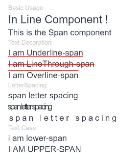
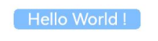

# Span

As a child of the [Text](ts-basic-components-text.md) and [ContainerSpan](ts-basic-components-containerspan.md) components, the Span component is used to display inline text.

>  **NOTE**
>
>  This component is supported since API version 7. Updates will be marked with a superscript to indicate their earliest API version.
>
>  Since API version 10, this component can inherit the attributes of the **Text** parent component. That is, if no attribute is set for this component, it inherits the attributes (if set) of its parent component. Only the following attributes can be inherited: **fontColor**, **fontSize**, **fontStyle**, **fontWeight**, **decoration**, **letterSpacing**, **textCase**, **fontfamily**, and **textShadow**.


## Child Components

Not supported


## APIs

Span(value: string | Resource)

**Widget capability**: This API can be used in ArkTS widgets since API version 9.

**Atomic service API**: This API can be used in atomic services since API version 11.

**System capability**: SystemCapability.ArkUI.ArkUI.Full

**Parameters**

| Name| Type| Mandatory| Description|
| -------- | -------- | -------- | -------- |
| value | string \| [Resource](ts-types.md#resource) | Yes| Plain text.|


## Attributes

Inherited from [BaseSpan](#basespan).

### decoration

decoration(value: DecorationStyleInterface)

Style and color of the text decorative line.

**Widget capability**: This API can be used in ArkTS widgets since API version 9.

**Atomic service API**: This API can be used in atomic services since API version 11.

**System capability**: SystemCapability.ArkUI.ArkUI.Full

**Parameters**

| Name| Type     | Mandatory| Description    |
| ------ | -------- | ---- | -------------- |
| value  | [DecorationStyleInterface<sup>12+</sup>](ts-universal-styled-string.md#decorationstyleinterface) | Yes  | Style of the text decorative line.<br>Default value:<br>{<br> type: TextDecorationType.None,<br> color: Color.Black,<br> style: TextDecorationStyle.SOLID <br>}<br>**NOTE**<br>The **style** parameter cannot be used in widgets.|

### letterSpacing

letterSpacing(value: number | string)

Letter spacing. A negative value tightens the spacing; a positive value loosens the spacing, and the letters are spread farther apart with the value.

**Widget capability**: This API can be used in ArkTS widgets since API version 9.

**Atomic service API**: This API can be used in atomic services since API version 11.

**System capability**: SystemCapability.ArkUI.ArkUI.Full

**Parameters**

| Name| Type    | Mandatory|  Description  |
| ------ | ------- | ---- | -------------- |
| value  | number \| string | Yes  | Letter spacing.|

### textCase

textCase(value: TextCase)

Text case.

**Widget capability**: This API can be used in ArkTS widgets since API version 9.

**Atomic service API**: This API can be used in atomic services since API version 11.

**System capability**: SystemCapability.ArkUI.ArkUI.Full

**Parameters**

| Name| Type  | Mandatory| Description  |
| ------ | ------- | ---- | ------- |
| value  | [TextCase](ts-appendix-enums.md#textcase) | Yes  | Text case.<br>Default value: **TextCase.Normal**|

### fontColor

fontColor(value: ResourceColor)

Sets the font color.

**Widget capability**: This API can be used in ArkTS widgets since API version 9.

**Atomic service API**: This API can be used in atomic services since API version 11.

**System capability**: SystemCapability.ArkUI.ArkUI.Full

**Parameters**

| Name| Type                                      | Mandatory| Description      |
| ------ | ------------------------------------------ | ---- | ---------- |
| value  | [ResourceColor](ts-types.md#resourcecolor) | Yes  | Font color.|

### fontSize

fontSize(value: number | string | Resource)

Sets the font size.

**Widget capability**: This API can be used in ArkTS widgets since API version 9.

**Atomic service API**: This API can be used in atomic services since API version 11.

**System capability**: SystemCapability.ArkUI.ArkUI.Full

**Parameters**

| Name| Type                                                        | Mandatory| Description                                                        |
| ------ | ------------------------------------------------------------ | ---- | ------------------------------------------------------------ |
| value  | number \|  string\| [Resource](ts-types.md#resource) | Yes  | Font size. If **fontSize** is of the number type, the unit fp is used. The default font size is 16 fp. The value cannot be a percentage.|

### fontStyle

fontStyle(value: FontStyle)

Sets the font style.

**Widget capability**: This API can be used in ArkTS widgets since API version 9.

**Atomic service API**: This API can be used in atomic services since API version 11.

**System capability**: SystemCapability.ArkUI.ArkUI.Full

**Parameters**

| Name| Type                                       | Mandatory| Description                                   |
| ------ | ------------------------------------------- | ---- | --------------------------------------- |
| value  | [FontStyle](ts-appendix-enums.md#fontstyle) | Yes  | Font style.<br>Default value: **FontStyle.Normal**|

### fontWeight

fontWeight(value: number | FontWeight | string)

Sets the font weight. If the value is too large, the text may be clipped depending on the font.

**Widget capability**: This API can be used in ArkTS widgets since API version 9.

**Atomic service API**: This API can be used in atomic services since API version 11.

**System capability**: SystemCapability.ArkUI.ArkUI.Full

**Parameters**

| Name| Type                                                        | Mandatory| Description                                                        |
| ------ | ------------------------------------------------------------ | ---- | ------------------------------------------------------------ |
| value  | number \| [FontWeight](ts-appendix-enums.md#fontweight) \| string | Yes  | Font weight. For the number type, the value range is [100, 900], at an interval of 100. The default value is **400**. A larger value indicates a heavier font weight. For the string type, only strings of the number type are supported, for example, **400**, **"bold"**, **"bolder"**, **"lighter"**, **"regular"**, and **"medium"**, which correspond to the enumerated values in **FontWeight**.<br>Default value: **FontWeight.Normal**|

### fontFamily

fontFamily(value: string | Resource)

Sets the font family.

**Widget capability**: This API can be used in ArkTS widgets since API version 9.

**Atomic service API**: This API can be used in atomic services since API version 11.

**System capability**: SystemCapability.ArkUI.ArkUI.Full

**Parameters**

| Name| Type                                                | Mandatory| Description                                                        |
| ------ | ---------------------------------------------------- | ---- | ------------------------------------------------------------ |
| value  | string \| [Resource](ts-types.md#resource) | Yes  | Font family. Default font: **'HarmonyOS Sans'**<br>The 'HarmonyOS Sans' font and [registered custom fonts](../js-apis-font.md) are supported for applications.<br>Only the 'HarmonyOS Sans' font is supported for widgets.|

### lineHeight<sup>10+</sup>

lineHeight(value: Length)

Sets the line height for the text.

**Atomic service API**: This API can be used in atomic services since API version 11.

**System capability**: SystemCapability.ArkUI.ArkUI.Full

**Parameters**

| Name| Type   | Mandatory| Description |
| ------ | ------ | ---- | ---- |
| value  | [Length](ts-types.md#length) | Yes  | Line height of the text.|

### font<sup>10+</sup>

font(value: Font)

Sets the text style, covering the font size, font width, Font family, and font style.

**Atomic service API**: This API can be used in atomic services since API version 11.

**System capability**: SystemCapability.ArkUI.ArkUI.Full

**Parameters**

| Name| Type                    | Mandatory| Description      |
| ------ | ------------------------ | ---- | ---------- |
| value  | [Font](ts-types.md#font) | Yes  | Text style.|

### textShadow<sup>11+</sup>

textShadow(value: ShadowOptions | Array&lt;ShadowOptions&gt;)

Text shadow. It supports input parameters in an array to implement multiple text shadows. This API does not work with the **fill** attribute or coloring strategy.

**Atomic service API**: This API can be used in atomic services since API version 12.

**System capability**: SystemCapability.ArkUI.ArkUI.Full

**Parameters**

| Name| Type| Mandatory| Description|
| ------ | ----- | ---- | --- |
| value  | [ShadowOptions](ts-universal-attributes-image-effect.md#shadowoptions) \|  Array&lt;[ShadowOptions](ts-universal-attributes-image-effect.md#shadowoptions)>| Yes  | Text shadow.|

## Events

Among all the universal events, only the [click event](ts-universal-events-click.md) is supported.

>  **NOTE**
>
>  As the **Span** component does not include size information, the **target** attribute of the **ClickEvent** object returned by the click event is invalid.

## BaseSpan

Defines the **BaseSpan** base class, including the common attributes of the span.

**System capability**: SystemCapability.ArkUI.ArkUI.Full

**Atomic service API**: This API can be used in atomic services since API version 12.

### textBackgroundStyle<sup>11+</sup>

textBackgroundStyle(style: TextBackgroundStyle): T

Background style. This attribute prioritizes the value separately set for the component. If it is not set, the component can inherit the settings from its parent [ContainerSpan](ts-basic-components-containerspan.md).

**Atomic service API**: This API can be used in atomic services since API version 12.

**System capability**: SystemCapability.ArkUI.ArkUI.Full

**Parameters**

| Name| Type | Mandatory| Description|
| ----- | ---- | ---- | ---- |
| style  | [TextBackgroundStyle](#textbackgroundstyle11) | Yes  | Background style.<br>Default value:<br>{<br>  color: Color.Transparent,<br>  radius: 0<br>} |

**Return value**

| Type                                      | Description     |
| ---------------------------------------- | ------- |
| T | Attributes of the span.|

### baselineOffset<sup>12+</sup>

baselineOffset(value: LengthMetrics): T

Sets the offset of the baseline. This attribute coexists with the **baselineOffset** attribute of the parent component.

**Atomic service API**: This API can be used in atomic services since API version 12.

**System capability**: SystemCapability.ArkUI.ArkUI.Full

**Parameters**

| Name| Type| Mandatory| Description |
| ----- | ---- | ---- | ---- |
| value  | [LengthMetrics](../js-apis-arkui-graphics.md#lengthmetrics12) | Yes  | Offset of the baseline. If the value specified is a percentage, the default value is used.<br>A positive number is offset upwards, and a negative number is offset downwards.<br>Default value: **0**<br>In an image span, setting this parameter to a non-zero value will cause **verticalAlign** to become ineffective.|

**Return value**

| Type                                      | Description     |
| ---------------------------------------- | ------- |
| T | Attributes of the span.|

## TextBackgroundStyle<sup>11+</sup>

**Atomic service API**: This API can be used in atomic services since API version 12.

**System capability**: SystemCapability.ArkUI.ArkUI.Full

| Name  | Type    | Mandatory| Description        |
| ------ | ------- | ---- | ------------ |
| color  | [ResourceColor](ts-types.md#resourcecolor)                                  | No  | Text background color.|
| radius | [Dimension](ts-types.md#dimension10) \| [BorderRadiuses](ts-universal-attributes-border.md#borderradiuses9) | No  | Rounded corner radius of the text background.|

## Example
### Example 1: Setting the Text Style

This example showcases various text styles by using the **decoration**, **letterSpacing**, and **textCase** attributes.

```ts
// xxx.ets
@Entry
@Component
struct SpanExample {
  build() {
    Flex({ direction: FlexDirection.Column, alignItems: ItemAlign.Start, justifyContent: FlexAlign.SpaceBetween }) {
      Text('Basic Usage').fontSize(9).fontColor(0xCCCCCC)
      Text() {
        Span('In Line')
        Span(' Component')
        Span(' !')
      }

      Text() {
        Span('This is the Span component').fontSize(12).textCase(TextCase.Normal)
          .decoration({ type: TextDecorationType.None, color: Color.Red })
      }

      // Add a line under the text.
      Text('Text Decoration').fontSize(9).fontColor(0xCCCCCC)
      Text() {
        Span('I am Underline-WAVY-span').decoration({ type: TextDecorationType.Underline, color: Color.Red, style: TextDecorationStyle.WAVY }).fontSize(12)
      }

      Text() {
        Span('I am LineThrough-DOTTED-span')
          .decoration({ type: TextDecorationType.LineThrough, color: Color.Red, style: TextDecorationStyle.DOTTED })
          .fontSize(12)
      }

      Text() {
        Span('I am Overline-DASHED-span').decoration({ type: TextDecorationType.Overline, color: Color.Red, style: TextDecorationStyle.DASHED }).fontSize(12)
      }

      // Set the letter spacing.
      Text('LetterSpacing').fontSize(9).fontColor(0xCCCCCC)
      Text() {
        Span('span letter spacing')
          .letterSpacing(0)
          .fontSize(12)
      }

      Text() {
        Span('span letter spacing')
          .letterSpacing(-2)
          .fontSize(12)
      }

      Text() {
        Span('span letter spacing')
          .letterSpacing(3)
          .fontSize(12)
      }


      // Set the text case.
      Text('Text Case').fontSize(9).fontColor(0xCCCCCC)
      Text() {
        Span('I am Lower-span').fontSize(12)
          .textCase(TextCase.LowerCase)
          .decoration({ type: TextDecorationType.None })
      }

      Text() {
        Span('I am Upper-span').fontSize(12)
          .textCase(TextCase.UpperCase)
          .decoration({ type: TextDecorationType.None })
      }
    }.width('100%').height(250).padding({ left: 35, right: 35, top: 35 })
  }
}
```



### Example 2: Setting the Text Shadow

This example demonstrates the effect of setting a shadow for text using the **textShadow** attributes.

``` ts
// xxx.ets
@Entry
@Component
struct SpanExample {
  @State textShadows : ShadowOptions | Array<ShadowOptions> = [{ radius: 10, color: Color.Red, offsetX: 10, offsetY: 0 },{ radius: 10, color: Color.Black, offsetX: 20, offsetY: 0 },
      { radius: 10, color: Color.Brown, offsetX: 30, offsetY: 0 },{ radius: 10, color: Color.Green, offsetX: 40, offsetY: 0 },
      { radius: 10, color: Color.Yellow, offsetX: 100, offsetY: 0 }]

  build() {
    Column({ space: 8 }) {
      Text() {
        Span('123456789').fontSize(50).textShadow(this.textShadows)
      }
      Text() {
        Span('123456789') // span can inherit text shadow & font size from outer text
      }.fontSize(50).textShadow(this.textShadows)
    }
  }
}
```


### Example 3: Setting the Background Style

This example demonstrates the effect of setting a background style for text using the **textBackgroundStyle** attribute.

``` ts
// xxx.ets
@Component
@Entry
struct SpanExample {
  build() {
    Column() {
      Text() {
        Span('   Hello World !   ')
          .fontSize('20fp')
          .textBackgroundStyle({color: "#7F007DFF", radius: "5vp"})
          .fontColor(Color.White)
      }
    }.width('100%').margin({bottom: '5vp'}).alignItems(HorizontalAlign.Center)
  }
}
```


### Example 4: Setting the Text Baseline Offset

This example demonstrates the effect of setting different baseline offsets for text using the **baselineOffset** attribute.

```ts
import { LengthUnit, LengthMetrics } from '@kit.ArkUI';

@Entry
@Component
struct SpanExample {
  build() {
    Row() {
      Column() {
        Text(){
          Span('word1')
            .baselineOffset(new LengthMetrics(20,LengthUnit.VP))
          Span('word2')
            .baselineOffset(new LengthMetrics(0,LengthUnit.VP))
          ImageSpan($r("app.media.icon"))
            .width('45px')
            .baselineOffset(new LengthMetrics(-20,LengthUnit.VP))
        }
        .backgroundColor(Color.Gray)
      }
      .width('100%')
    }
    .height('100%')
  }
}
```


