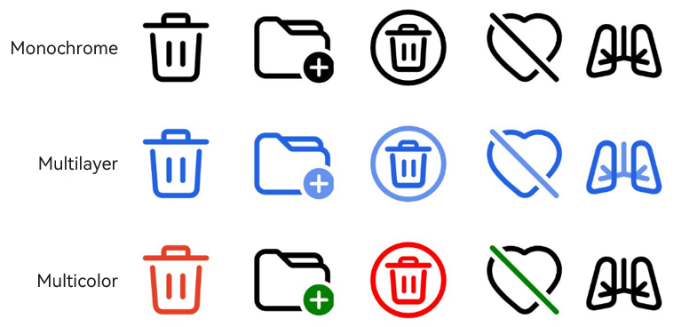
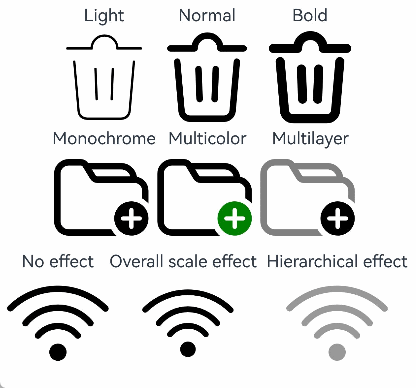

# SymbolGlyph

The **SymbolGlyph** component represents a symbol glyph.

>  **NOTE**
>
>  This component is supported since API version 11. Updates will be marked with a superscript to indicate their earliest API version.

## Child Components

Not supported

## APIs

SymbolGlyph(value?: Resource)

**Widget capability**: This API can be used in ArkTS widgets since API version 12.

**Atomic service API**: This API can be used in atomic services since API version 12.

**System capability**: SystemCapability.ArkUI.ArkUI.Full

**Parameters**

| Name| Type| Mandatory| Description|
| -------- | -------- | -------- | -------- |
| value | [Resource](ts-types.md#resource)| No| Resource of the **SymbolGlyph** component, for example, **$r('sys.symbol.ohos_wifi')**.|

>  **NOTE**
>
>  The resources referenced in **$r('sys.symbol.ohos_wifi')** are preset in the system. The **SymbolGlyph** component supports only the preset symbol resources. If unsupported resources are referenced, an exception occurs.

## Attributes

The [universal attributes](ts-component-general-attributes.md) are supported. With regard to text attributes, only the following attributes are supported.

### fontColor

fontColor(value: Array&lt;ResourceColor&gt;)

Sets the color of the **SymbolGlyph** component.

**Widget capability**: This API can be used in ArkTS widgets since API version 12.

**Atomic service API**: This API can be used in atomic services since API version 12.

**System capability**: SystemCapability.ArkUI.ArkUI.Full

**Parameters**

| Name| Type| Mandatory| Description |
| ------ | ---- | ---- | ----- |
| value  | Array\<[ResourceColor](ts-types.md#resourcecolor)\> | Yes  | Color of the **SymbolGlyph** component.<br> Default value: depending on the rendering strategy|

### fontSize

fontSize(value: number | string | Resource)

Sets the size of the **SymbolGlyph** component. When using the string type, numeric string values with optional units, for example, **"10"** or **"10fp"**, are supported.

The display size of the symbol glyph is controlled by the **fontSize** setting. Once **width** or **height** is specified, other universal attributes will only affect the size of the component's placeholder, not the symbol glyph itself.

**Widget capability**: This API can be used in ArkTS widgets since API version 12.

**Atomic service API**: This API can be used in atomic services since API version 12.

**System capability**: SystemCapability.ArkUI.ArkUI.Full

**Parameters**

| Name| Type| Mandatory| Description |
| ------ | ---- | ---- | ----- |
| value  | number \| string \| [Resource](ts-types.md#resource) | Yes  | Size of the **SymbolGlyph** component.<br>Default value: **16fp**<br>Unit: fp<br>Percentage strings are not supported.|

### fontWeight

fontWeight(value: number | FontWeight | string)

Sets the font weight of the **SymbolGlyph** component. For the number type, the value ranges from 100 to 900, at an interval of 100. A larger value indicates a heavier font weight. The default value is **400**. For the string type, only strings of the number type are supported, for example, **"400"**, **"bold"**, **"bolder"**, **"lighter"**, **"regular"**, and **"medium"**, which correspond to the enumerated values in **FontWeight**.

The **sys.symbol.ohos_lungs** icon does not support font weight setting.

**Widget capability**: This API can be used in ArkTS widgets since API version 12.

**Atomic service API**: This API can be used in atomic services since API version 12.

**System capability**: SystemCapability.ArkUI.ArkUI.Full

**Parameters**

| Name| Type                                                        | Mandatory| Description                                               |
| ------ | ------------------------------------------------------------ | ---- | --------------------------------------------------- |
| value  | number \| [FontWeight](ts-appendix-enums.md#fontweight) \| string | Yes  | Font weight of the **SymbolGlyph** component.<br>Default value: **FontWeight.Normal**|

### renderingStrategy

renderingStrategy(value: SymbolRenderingStrategy)

Sets the rendering strategy of the **SymbolGlyph** component.

**Widget capability**: This API can be used in ArkTS widgets since API version 12.

**Atomic service API**: This API can be used in atomic services since API version 12.

**System capability**: SystemCapability.ArkUI.ArkUI.Full

**Parameters**

| Name| Type| Mandatory| Description |
| ------ | ---- | ---- | ----- |
| value  | [SymbolRenderingStrategy](#symbolrenderingstrategy11) | Yes  | Rendering strategy of the **SymbolGlyph** component.<br>Default value: **SymbolRenderingStrategy.SINGLE**|

The figure below shows the effects of different rendering strategies.



### effectStrategy

effectStrategy(value: SymbolEffectStrategy)

Sets the effect strategy of the **SymbolGlyph** component.

**Widget capability**: This API can be used in ArkTS widgets since API version 12.

**Atomic service API**: This API can be used in atomic services since API version 12.

**System capability**: SystemCapability.ArkUI.ArkUI.Full

**Parameters**

| Name| Type| Mandatory| Description |
| ------ | ---- | ---- | ----- |
| value  | [SymbolEffectStrategy](#symboleffectstrategy11) | Yes  | Effect strategy of the **SymbolGlyph** component.<br>Default value: **SymbolEffectStrategy.NONE**|

### symbolEffect<sup>12+</sup>

symbolEffect(symbolEffect: SymbolEffect, isActive?: boolean)

Sets the symbol effect and effect state for the **SymbolGlyph** component.

**Widget capability**: This API can be used in ArkTS widgets since API version 12.

**Atomic service API**: This API can be used in atomic services since API version 12.

**System capability**: SystemCapability.ArkUI.ArkUI.Full

**Parameters**

| Name| Type| Mandatory| Description |
| ------ | ---- | ---- | ----- |
| symbolEffect  | [SymbolEffect](#symboleffect12) | Yes  | Symbol effect of the **SymbolGlyph** component.<br>Default value: [SymbolEffect](#symboleffect12) |
| isActive  | boolean | No  | Whether the effect is active.<br>Default value: **false**|

### symbolEffect<sup>12+</sup>

symbolEffect(symbolEffect: SymbolEffect, triggerValue?: number)

Sets the symbol effect and effect trigger for the **SymbolGlyph** component.

**Widget capability**: This API can be used in ArkTS widgets since API version 12.

**Atomic service API**: This API can be used in atomic services since API version 12.

**System capability**: SystemCapability.ArkUI.ArkUI.Full

**Parameters**

| Name| Type| Mandatory| Description |
| ------ | ---- | ---- | ----- |
| symbolEffect | [SymbolEffect](#symboleffect12) | Yes  | Symbol effect of the **SymbolGlyph** component.<br>Default value: [SymbolEffect](#symboleffect12) |
| triggerValue | number | No  | Value that, when changed, initiates the animation of the **SymbolGlyph** component.<br>To prevent the motion effect from triggering initially, set it to **-1**.|

>  **NOTE**
>
>  When configuring the symbol effect, use the **effectStrategy** attribute or a single **symbolEffect** attribute. Mixing multiple effect attributes is not allowed.

### minFontScale<sup>18+</sup>

minFontScale(scale: Optional\<number | Resource>)

Sets the minimum font scale factor for the **SymbolGlyph** component.

**Atomic service API**: This API can be used in atomic services since API version 18.

**System capability**: SystemCapability.ArkUI.ArkUI.Full

**Parameters**

| Name| Type| Mandatory| Description |
| ------ | ---- | ---- | ----- |
| scale  |[Optional](ts-universal-attributes-custom-property.md#optional12)\<number \| [Resource](ts-types.md#resource)>  | Yes  | Minimum font scale factor for the **SymbolGlyph** component.<br>Value range: [0, 1]<br>The value **0** results in the minimum scaling.<br>**NOTE**<br>A value less than 0 is handled as 0. A value greater than 1 is handled as 1. Abnormal values are ineffective by default.  |

### maxFontScale<sup>18+</sup>

maxFontScale(scale: Optional\<number | Resource>)

Sets the maximum font scale factor for the **SymbolGlyph** component.

**Atomic service API**: This API can be used in atomic services since API version 18.

**System capability**: SystemCapability.ArkUI.ArkUI.Full

**Parameters**

| Name| Type| Mandatory| Description |
| ------ | ---- | ---- | ----- |
| scale  |[Optional](ts-universal-attributes-custom-property.md#optional12)\<number \| [Resource](ts-types.md#resource)>  | Yes  | Maximum font scale factor for the **SymbolGlyph** component.<br>Value range: [1, +∞)<br>**NOTE**<br>A value less than 1 is handled as **1**. Abnormal values are ineffective by default.|

## ScaleSymbolEffect<sup>12+</sup>

Inherits from **SymbolEffect**.

**Widget capability**: This API can be used in ArkTS widgets since API version 12.

**Atomic service API**: This API can be used in atomic services since API version 12.

**System capability**: SystemCapability.ArkUI.ArkUI.Full

### Attributes

| Name| Type| Mandatory| Description |
| ---- | ---- | ---- | ---- |
| scope     | [EffectScope](#effectscope12)  |  No  | Effect scope.<br>Default value: **EffectScope.LAYER**   |
| direction | [EffectDirection](#effectdirection12) |  No  | Effect direction.<br>Default value: **EffectDirection.DOWN**|

### constructor<sup>12+</sup>

constructor(scope?: EffectScope, direction?: EffectDirection)

A constructor used to create a **ScaleSymbolEffect** instance, which comes with a scaling animation effect.

**Widget capability**: This API can be used in ArkTS widgets since API version 12.

**Atomic service API**: This API can be used in atomic services since API version 12.

**System capability**: SystemCapability.ArkUI.ArkUI.Full

**Parameters**

| Name| Type| Mandatory| Description |
| ---- | ---- | ---- | ---- |
| scope     | [EffectScope](#effectscope12)         | No  | Effect scope.<br>Default value: **EffectScope.LAYER**   |
| direction | [EffectDirection](#effectdirection12) | No  | Effect direction.<br>Default value: **EffectDirection.DOWN**|

## HierarchicalSymbolEffect<sup>12+</sup>

Inherits from **SymbolEffect**.

**Widget capability**: This API can be used in ArkTS widgets since API version 12.

**Atomic service API**: This API can be used in atomic services since API version 12.

**System capability**: SystemCapability.ArkUI.ArkUI.Full

### Attributes

| Name| Type| Mandatory| Description |
| ---- | ---- | ---- | ---- |
| fillStyle | [EffectFillStyle](#effectfillstyle12) | No  | Effect fill style.<br>Default value: **EffectFillStyle.CUMULATIVE**|

### constructor<sup>12+</sup>

constructor(fillStyle?: EffectFillStyle)

A constructor used to create a **HierarchicalSymbolEffect** instance, which comes with a hierarchical animation effect.

**Widget capability**: This API can be used in ArkTS widgets since API version 12.

**Atomic service API**: This API can be used in atomic services since API version 12.

**System capability**: SystemCapability.ArkUI.ArkUI.Full

**Parameters**

| Name| Type| Mandatory| Description |
| ---- | ---- | ---- | ---- |
| fillStyle | [EffectFillStyle](#effectfillstyle12) | No  | Effect fill style.<br>Default value: **EffectFillStyle.CUMULATIVE**|

## AppearSymbolEffect<sup>12+</sup>

Inherits from **SymbolEffect**.

**Widget capability**: This API can be used in ArkTS widgets since API version 12.

**Atomic service API**: This API can be used in atomic services since API version 12.

**System capability**: SystemCapability.ArkUI.ArkUI.Full

### Attributes

| Name| Type| Mandatory| Description |
| ---- | ---- | ---- | ---- |
| scope | [EffectScope](#effectscope12) | No  | Effect scope.<br>Default value: **EffectScope.LAYER**|

### constructor<sup>12+</sup>

constructor(scope?: EffectScope)

A constructor used to create an **AppearSymbolEffect** instance, which comes with an appear animation effect.

**Widget capability**: This API can be used in ArkTS widgets since API version 12.

**Atomic service API**: This API can be used in atomic services since API version 12.

**System capability**: SystemCapability.ArkUI.ArkUI.Full

**Parameters**

| Name| Type| Mandatory| Description |
| ---- | ---- | ---- | ---- |
| scope  | [EffectScope](#effectscope12) | No  | Effect scope.<br>Default value: **EffectScope.LAYER**|

## DisappearSymbolEffect<sup>12+</sup>

Inherits from **SymbolEffect**.

**Widget capability**: This API can be used in ArkTS widgets since API version 12.

**Atomic service API**: This API can be used in atomic services since API version 12.

**System capability**: SystemCapability.ArkUI.ArkUI.Full

### Attributes

| Name| Type| Mandatory| Description |
| ---- | ---- | ---- | ---- |
| scope | [EffectScope](#effectscope12) | No  | Effect scope.<br>Default value: **EffectScope.LAYER**|

### constructor<sup>12+</sup>

constructor(scope?: EffectScope)

A constructor used to create a **DisappearSymbolEffect** instance, which comes with a disappear animation effect.

**Widget capability**: This API can be used in ArkTS widgets since API version 12.

**Atomic service API**: This API can be used in atomic services since API version 12.

**System capability**: SystemCapability.ArkUI.ArkUI.Full

**Parameters**

| Name| Type| Mandatory| Description |
| ---- | ---- | ---- | ---- |
| scope  | [EffectScope](#effectscope12) | No  | Effect scope.<br>Default value: **EffectScope.LAYER**|

## BounceSymbolEffect<sup>12+</sup>

Inherits from **SymbolEffect**.

**Widget capability**: This API can be used in ArkTS widgets since API version 12.

**Atomic service API**: This API can be used in atomic services since API version 12.

**System capability**: SystemCapability.ArkUI.ArkUI.Full

### Attributes

| Name| Type| Mandatory| Description |
| ---- | ---- | ---- | ---- |
| scope     | [EffectScope](#effectscope12)         | No  | Effect scope.<br>Default value: **EffectScope.LAYER**   |
| direction | [EffectDirection](#effectdirection12) | No  | Effect direction.<br>Default value: **EffectDirection.DOWN**|

### constructor<sup>12+</sup>

constructor(scope?: EffectScope, direction?: EffectDirection)

A constructor used to create a **BounceSymbolEffect** instance, which comes with a bounce animation effect.

**Widget capability**: This API can be used in ArkTS widgets since API version 12.

**Atomic service API**: This API can be used in atomic services since API version 12.

**System capability**: SystemCapability.ArkUI.ArkUI.Full

**Parameters**

| Name| Type| Mandatory| Description |
| ---- | ---- | ---- | ---- |
| scope     | [EffectScope](#effectscope12)         | No  | Effect scope.<br>Default value: **EffectScope.LAYER**   |
| direction | [EffectDirection](#effectdirection12) | No  | Effect direction.<br>Default value: **EffectDirection.DOWN**|

## ReplaceSymbolEffect<sup>12+</sup>

Inherits from **SymbolEffect**.

**Widget capability**: This API can be used in ArkTS widgets since API version 12.

**Atomic service API**: This API can be used in atomic services since API version 12.

**System capability**: SystemCapability.ArkUI.ArkUI.Full

### Attributes

| Name| Type| Mandatory| Description |
| ---- | ---- | ---- | ---- |
| scope | [EffectScope](#effectscope12) | No  | Effect scope.<br>Default value: **EffectScope.LAYER**|

### constructor<sup>12+</sup>

constructor(scope?: EffectScope)

A constructor used to create a **ReplaceSymbolEffect** instance, which comes with a replace animation effect.

**Widget capability**: This API can be used in ArkTS widgets since API version 12.

**Atomic service API**: This API can be used in atomic services since API version 12.

**System capability**: SystemCapability.ArkUI.ArkUI.Full

**Parameters**

| Name| Type| Mandatory| Description |
| ---- | ---- | ---- | ---- |
| scope  | [EffectScope](#effectscope12) | No  | Effect scope.<br>Default value: **EffectScope.LAYER**|

## SymbolEffectStrategy<sup>11+</sup>

Enumerates symbol effect types. Once applied, the symbol effect becomes active instantly, eliminating the need for triggering.

**Widget capability**: This API can be used in ArkTS widgets since API version 12.

**Atomic service API**: This API can be used in atomic services since API version 12.

**System capability**: SystemCapability.ArkUI.ArkUI.Full

| Name    | Value| Description                         |
| ------ | --- | ----------------------------- |
| NONE | 0 | No effect (default value).|
| SCALE | 1 | Scale effect as a whole.                |
|  HIERARCHICAL  | 2 | Hierarchical effect. |

## SymbolRenderingStrategy<sup>11+</sup>

Enumerates the rendering modes.

**Widget capability**: This API can be used in ArkTS widgets since API version 12.

**Atomic service API**: This API can be used in atomic services since API version 12.

**System capability**: SystemCapability.ArkUI.ArkUI.Full

| Name    | Value| Description                         |
| ------ | --- | ----------------------------- |
| SINGLE  | 0 | Single-color mode (default value).<br> The default color is black.<br> You can set one or multiple colors, but only the first color will be applied.|
| MULTIPLE_COLOR  | 1 | Multi-color mode.<br> A maximum of three colors can be set. If only one color is set, it updates the color of the first layer, leaving other colors at their default values.<br> The sequence of color settings matches the layering order of the symbol; any colors beyond the number of symbol layers will not take effect.<br> Only color values are accepted. Opacity settings do not take effect.|
|  MULTIPLE_OPACITY   | 2 | Layered mode.<br> The default color is black. You can set one or multiple colors, but only the first color will be applied.<br>Opacity is predefined for the layers: 100% for the first layer, 50% for the second layer, and 20% for the third layer. |

## SymbolEffect<sup>12+</sup>

Defines the **SymbolEffect** class.

**Widget capability**: This API can be used in ArkTS widgets since API version 12.

**Atomic service API**: This API can be used in atomic services since API version 12.

**System capability**: SystemCapability.ArkUI.ArkUI.Full

## PulseSymbolEffect<sup>12+</sup>

A constructor used to create a **PulseSymbolEffect** instance, which comes with a pulse animation effect.

**Widget capability**: This API can be used in ArkTS widgets since API version 12.

**Atomic service API**: This API can be used in atomic services since API version 12.

**System capability**: SystemCapability.ArkUI.ArkUI.Full

## EffectDirection<sup>12+</sup>

**Widget capability**: This API can be used in ArkTS widgets since API version 12.

**Atomic service API**: This API can be used in atomic services since API version 12.

**System capability**: SystemCapability.ArkUI.ArkUI.Full

| Name| Value  | Description            |
| ---- | ---- | ---------------- |
| DOWN | 0    | The symbol scales down and then returns to its original size.|
| UP   | 1    | The symbol scales up and then returns to its original size.|

## EffectScope<sup>12+</sup>

**Widget capability**: This API can be used in ArkTS widgets since API version 12.

**Atomic service API**: This API can be used in atomic services since API version 12.

**System capability**: SystemCapability.ArkUI.ArkUI.Full

| Name | Value  | Description      |
| ----- | ---- | ---------- |
| LAYER | 0    | Layered mode.|
| WHOLE | 1    | Whole mode.|

## EffectFillStyle<sup>12+</sup>

**Widget capability**: This API can be used in ArkTS widgets since API version 12.

**Atomic service API**: This API can be used in atomic services since API version 12.

**System capability**: SystemCapability.ArkUI.ArkUI.Full

| Name      | Value  | Description      |
| ---------- | ---- | ---------- |
| CUMULATIVE | 0    | Cumulative style.|
| ITERATIVE  | 1    | Iterative style.|

## Events

The [universal events](ts-component-general-events.md) are supported.

## Example

###  Example 1: Setting Rendering and Effect Strategies

This example demonstrates different rendering and effect strategies using **renderingStrategy** and **effectStrategy**.

```ts
// xxx.ets
@Entry
@Component
struct Index {
  build() {
    Column() {
      Row() {
        Column() {
          Text("Light")
          SymbolGlyph($r('sys.symbol.ohos_trash'))
            .fontWeight(FontWeight.Lighter)
            .fontSize(96)
        }

        Column() {
          Text("Normal")
          SymbolGlyph($r('sys.symbol.ohos_trash'))
            .fontWeight(FontWeight.Normal)
            .fontSize(96)
        }

        Column() {
          Text("Bold")
          SymbolGlyph($r('sys.symbol.ohos_trash'))
            .fontWeight(FontWeight.Bold)
            .fontSize(96)
        }
      }

      Row() {
        Column() {
          Text("Single-color mode")
          SymbolGlyph($r('sys.symbol.ohos_folder_badge_plus'))
            .fontSize(96)
            .renderingStrategy(SymbolRenderingStrategy.SINGLE)
            .fontColor([Color.Black, Color.Green, Color.White])
        }

        Column() {
          Text("Multi-color mode")
          SymbolGlyph($r('sys.symbol.ohos_folder_badge_plus'))
            .fontSize(96)
            .renderingStrategy(SymbolRenderingStrategy.MULTIPLE_COLOR)
            .fontColor([Color.Black, Color.Green, Color.White])
        }

        Column() {
          Text ("Layered mode")
          SymbolGlyph($r('sys.symbol.ohos_folder_badge_plus'))
            .fontSize(96)
            .renderingStrategy(SymbolRenderingStrategy.MULTIPLE_OPACITY)
            .fontColor([Color.Black, Color.Green, Color.White])
        }
      }

      Row() {
        Column() {
          Text("No effect")
          SymbolGlyph($r('sys.symbol.ohos_wifi'))
            .fontSize(96)
            .effectStrategy(SymbolEffectStrategy.NONE)
        }

        Column() {
          Text("Overall scale effect")
          SymbolGlyph($r('sys.symbol.ohos_wifi'))
            .fontSize(96)
            .effectStrategy(1)
        }

        Column() {
          Text("Hierarchical effect")
          SymbolGlyph($r('sys.symbol.ohos_wifi'))
            .fontSize(96)
            .effectStrategy(2)
        }
      }
    }
  }
}
```


###  Example 2: Setting Effects

This example demonstrates the effects of variable color animation and replacement animation using **symbolEffect**.

```ts
// xxx.ets
@Entry
@Component
struct Index {
  @State isActive: boolean = true;
  @State triggerValueReplace: number = 0;
  replaceFlag: boolean = true;

  build() {
    Column() {
      Row() {
        Column() {
          Text("Variable color animation")
          SymbolGlyph($r('sys.symbol.ohos_wifi'))
            .fontSize(96)
            .symbolEffect(new HierarchicalSymbolEffect(EffectFillStyle.ITERATIVE), this.isActive)
          Button(this.isActive ? 'Off' : 'Play').onClick(() => {
            this.isActive = !this.isActive;
          })
        }.margin({ right: 20 })

        Column() {
          Text("Replacement animation")
          SymbolGlyph(this.replaceFlag ? $r('sys.symbol.checkmark_circle') : $r('sys.symbol.repeat_1'))
            .fontSize(96)
            .symbolEffect(new ReplaceSymbolEffect(EffectScope.WHOLE), this.triggerValueReplace)
          Button('Trigger').onClick(() => {
            this.replaceFlag = !this.replaceFlag;
            this.triggerValueReplace = this.triggerValueReplace + 1;
          })
        }
      }
    }.margin({
      left: 30,
      top: 50
    })
  }
}
```

