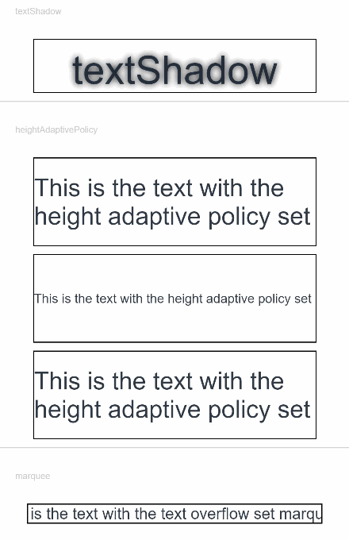
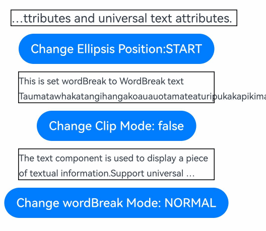
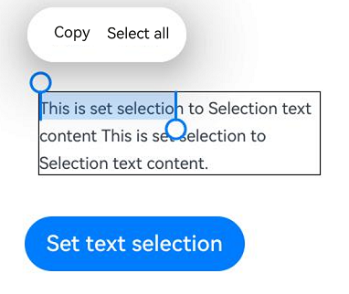
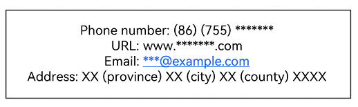
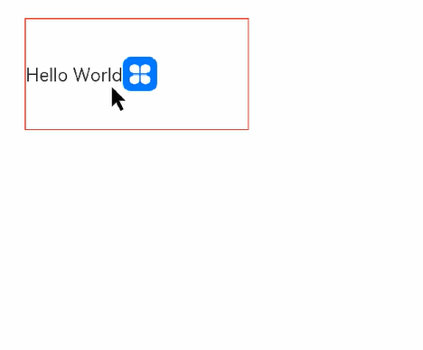
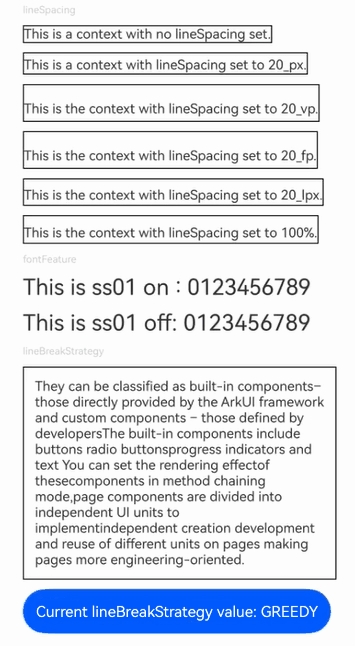
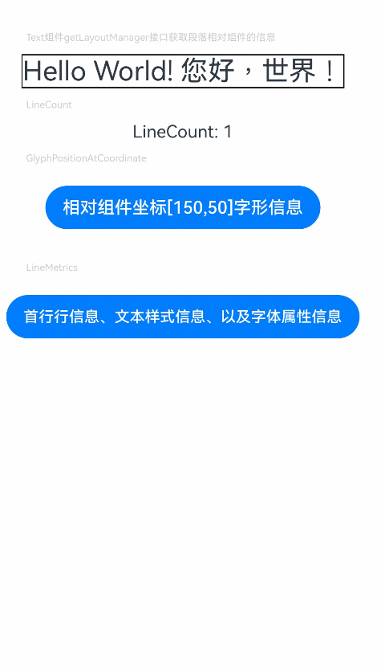
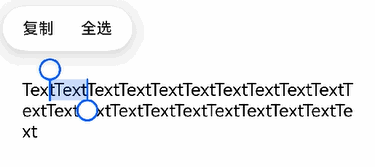
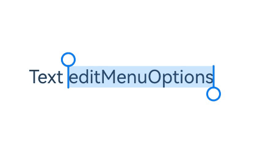
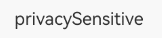

# Text

The **Text** component is used to display a piece of textual information.

>  **NOTE**
>
>  This component is supported since API version 7. Updates will be marked with a superscript to indicate their earliest API version.


## Child Components

This component can contain the [Span](ts-basic-components-span.md), [ImageSpan](ts-basic-components-imagespan.md), [SymbolSpan](ts-basic-components-symbolSpan.md), and [ContainerSpan](ts-basic-components-containerspan.md) child components.

## APIs

Text(content?: string | Resource , value?: TextOptions)

**Widget capability**: This API can be used in ArkTS widgets since API version 9.

**Atomic service API**: This API can be used in atomic services since API version 11.

**System capability**: SystemCapability.ArkUI.ArkUI.Full

**Parameters**

| Name | Type | Mandatory | Description |
| -------- | -------- | -------- | -------- |
| content | string \| [Resource](ts-types.md#resource) | No | Text content. This parameter does not take effect if the component contains a **Span** child component and does not have any [styled string](ts-universal-styled-string.md#styled-string) configured. In this case, the span content is displayed, and the style of the component does not take effect.<br>Default value: **' '** |
| value<sup>11+</sup> | [TextOptions](#textoptions11) | No | Initialization options of the component.|

## Attributes

In addition to the [universal attributes](ts-universal-attributes-size.md), the following attributes are supported.

### textAlign

textAlign(value: TextAlign)

Sets the horizontal alignment mode of the text.

The text takes up the full width of the **Text** component.

To set vertical alignment for the text, use the [align](ts-universal-attributes-location.md) attribute. The **align** attribute alone does not control the horizontal position of the text. In other words, **Alignment.TopStart**, **Alignment.Top**, and **Alignment.TopEnd** produce the same effect, top-aligning the text; **Alignment.Start**, **Alignment.Center**, and **Alignment.End** produce the same effect, centered-aligning the text vertically; **Alignment.BottomStart**, **Alignment.Bottom**, and **Alignment.BottomEnd** produce the same effect, bottom-aligning the text. Yet, it can work with the **textAlign** attribute to jointly determine the horizontal position of the text.

When **textAlign** is set to **TextAlign.JUSTIFY**, you must set the [wordBreak](#wordbreak11) attribute, and the text in the last line is horizontally aligned with the start edge.

**Widget capability**: This API can be used in ArkTS widgets since API version 9.

**Atomic service API**: This API can be used in atomic services since API version 11.

**System capability**: SystemCapability.ArkUI.ArkUI.Full

**Parameters** 

| Name | Type                                       | Mandatory | Description                                                      |
| ------ | ------------------------------------------- | ---- | ---------------------------------------------------------- |
| value  | [TextAlign](ts-appendix-enums.md#textalign) | Yes  | Horizontal alignment of the text.<br>Default value: **TextAlign.Start** |

### textOverflow

textOverflow(value: { overflow: TextOverflow })

Sets the display mode when the text is too long.

Text is clipped at the transition between words. To clip text in the middle of a word, add **\u200B** between characters. Since API version 11, preferably set the **wordBreak** attribute to **WordBreak.BREAK_ALL** to achieve the same purpose. For details, see [Example](#example-4).

If **overflow** is set to **TextOverflow.None**, **TextOverflow.Clip**, or **TextOverflow.Ellipsis**, this attribute must be used with **maxLines** for the settings to take effect. **TextOverflow.None** produces the same effect as **TextOverflow.Clip**.

If **overflow** is set to **TextOverflow.MARQUEE**, the text scrolls in a line, and neither **maxLines** nor **copyOption** takes effect. The **textAlign** attribute takes effect only when the text is not scrollable. With **overflow** set to **TextOverflow.MARQUEE**, the **clip** attribute is set to **true** by default. **TextOverflow.MARQUEE** is not available for [CustomSpan](ts-universal-styled-string.md#customspan) of the styled string.

Since API version 12, **TextOverflow.MARQUEE** is available for the **ImageSpan** component, where the text and images are displayed in scrolling mode in a line.

**Widget capability**: This API can be used in ArkTS widgets since API version 9.

**Atomic service API**: This API can be used in atomic services since API version 11.

**System capability**: SystemCapability.ArkUI.ArkUI.Full

**Parameters** 

| Name | Type                                                        | Mandatory | Description                                                        |
| ------ | ------------------------------------------------------------ | ---- | ------------------------------------------------------------ |
| value  | {overflow: [TextOverflow](ts-appendix-enums.md#textoverflow)} | Yes  | Display mode when the text is too long.<br>Default value: **{overflow: TextOverflow.Clip}** |

### maxLines

maxLines(value: number)

Sets the maximum number of lines in the text. By default, text is automatically folded. If this attribute is specified, the text will not exceed the specified number of lines. If there is extra text, you can use [textOverflow](#textoverflow) to specify how it is displayed.

**Widget capability**: This API can be used in ArkTS widgets since API version 9.

**Atomic service API**: This API can be used in atomic services since API version 11.

**System capability**: SystemCapability.ArkUI.ArkUI.Full

**Parameters** 

| Name | Type  | Mandatory | Description            |
| ------ | ------ | ---- | ---------------- |
| value  | number | Yes  | Maximum number of lines in the text. |

### lineHeight

lineHeight(value: number | string | Resource)

Sets the text line height. If the value is less than or equal to **0**, the line height is not limited and the font size is adaptive. If the value is of the number type, the unit fp is used.

**Widget capability**: This API can be used in ArkTS widgets since API version 9.

**Atomic service API**: This API can be used in atomic services since API version 11.

**System capability**: SystemCapability.ArkUI.ArkUI.Full

**Parameters** 

| Name | Type                                                        | Mandatory | Description            |
| ------ | ------------------------------------------------------------ | ---- | ---------------- |
| value  | number \| string \| [Resource](ts-types.md#resource) | Yes  | Text line height. |

### decoration

decoration(value: DecorationStyleInterface)

Sets the color, type, and style of the text decorative line.

**Widget capability**: This API can be used in ArkTS widgets since API version 9.

**Atomic service API**: This API can be used in atomic services since API version 11.

**System capability**: SystemCapability.ArkUI.ArkUI.Full

**Parameters** 

| Name | Type                                                        | Mandatory | Description                                                        |
| ------ | ------------------------------------------------------------ | ---- | ------------------------------------------------------------ |
| value  | [DecorationStyleInterface<sup>12+</sup>](ts-universal-styled-string.md#decorationstyleinterface)  | Yes  | Style of the text decorative line.<br>Default value:<br>{<br> type: TextDecorationType.None,<br> color: Color.Black,<br> style: TextDecorationStyle.SOLID <br>}<br>**NOTE**<br>The **style** parameter cannot be used in widgets. |

### baselineOffset

baselineOffset(value: number | string)

Sets the offset of the text baseline. If the value specified is a percentage, the default value is used.

Positive values shift the content upwards, while negative values shift it downwards.

**Widget capability**: This API can be used in ArkTS widgets since API version 9.

**Atomic service API**: This API can be used in atomic services since API version 11.

**System capability**: SystemCapability.ArkUI.ArkUI.Full

**Parameters** 

| Name | Type                      | Mandatory | Description                            |
| ------ | -------------------------- | ---- | -------------------------------- |
| value  | number \| string | Yes  | Offset of the text baseline.<br>Default value: **0** |

### letterSpacing

letterSpacing(value: number | string)

Sets the letter spacing for a text style. If the value specified is a percentage or 0, the default value is used.

If the value specified is a negative value, the text is compressed. A negative value too small may result in the text being compressed to 0 and no content being displayed.

**Widget capability**: This API can be used in ArkTS widgets since API version 9.

**Atomic service API**: This API can be used in atomic services since API version 11.

**System capability**: SystemCapability.ArkUI.ArkUI.Full

**Parameters** 

| Name | Type                      | Mandatory | Description          |
| ------ | -------------------------- | ---- | -------------- |
| value  | number \| string | Yes  | Letter spacing. |

### minFontSize

minFontSize(value: number | string | Resource)

Sets the minimum font size.

For the setting to take effect, this attribute must be used together with [maxFontSize](#maxfontsize) and [maxlines](#maxlines), or layout constraint settings. In addition, it does not take effect for child components or styled strings.

When the adaptive font size is used, the **fontSize** settings do not take effect.

If the value of **minFontSize** is less than or equal to 0, the adaptive font size does not take effect.

**Widget capability**: This API can be used in ArkTS widgets since API version 9.

**Atomic service API**: This API can be used in atomic services since API version 11.

**System capability**: SystemCapability.ArkUI.ArkUI.Full

**Parameters** 

| Name | Type                                                        | Mandatory | Description              |
| ------ | ------------------------------------------------------------ | ---- | ------------------ |
| value  | number \| string \| [Resource](ts-types.md#resource) | Yes  | Minimum font size. |

### maxFontSize

maxFontSize(value: number | string | Resource)

Sets the maximum font size.

For the setting to take effect, this attribute must be used together with [minFontSize](#minfontsize) and [maxlines](#maxlines), or layout constraint settings. In addition, it does not take effect for child components or styled strings.

When the adaptive font size is used, the **fontSize** settings do not take effect.

**Widget capability**: This API can be used in ArkTS widgets since API version 9.

**Atomic service API**: This API can be used in atomic services since API version 11.

**System capability**: SystemCapability.ArkUI.ArkUI.Full

**Parameters** 

| Name | Type                                                        | Mandatory | Description              |
| ------ | ------------------------------------------------------------ | ---- | ------------------ |
| value  | number \| string \| [Resource](ts-types.md#resource) | Yes  | Maximum font size. |

### textCase

textCase(value: TextCase)

Sets the text case.

**Widget capability**: This API can be used in ArkTS widgets since API version 9.

**Atomic service API**: This API can be used in atomic services since API version 11.

**System capability**: SystemCapability.ArkUI.ArkUI.Full

**Parameters** 

| Name | Type                                     | Mandatory | Description                                     |
| ------ | ----------------------------------------- | ---- | ----------------------------------------- |
| value  | [TextCase](ts-appendix-enums.md#textcase) | Yes  | Text case.<br>Default value: **TextCase.Normal** |

### fontColor

fontColor(value: ResourceColor)

Sets the font color.

**Widget capability**: This API can be used in ArkTS widgets since API version 9.

**Atomic service API**: This API can be used in atomic services since API version 11.

**System capability**: SystemCapability.ArkUI.ArkUI.Full

**Parameters**

| Name| Type                                      | Mandatory| Description      |
| ------ | ------------------------------------------ | ---- | ---------- |
| value  | [ResourceColor](ts-types.md#resourcecolor) | Yes  | Font color.|

### fontSize

fontSize(value: number | string | Resource)

Sets the text size.

**Widget capability**: This API can be used in ArkTS widgets since API version 9.

**Atomic service API**: This API can be used in atomic services since API version 11.

**System capability**: SystemCapability.ArkUI.ArkUI.Full

**Parameters**

| Name| Type                                                        | Mandatory| Description                                                        |
| ------ | ------------------------------------------------------------ | ---- | ------------------------------------------------------------ |
| value  | number \| string \| [Resource](ts-types.md#resource) | Yes  | Font size. If **fontSize** is of the number type, the unit fp is used. The default font size is 16 fp. This parameter cannot be set in percentage.|

### fontStyle

fontStyle(value: FontStyle)

Sets the font style.

**Widget capability**: This API can be used in ArkTS widgets since API version 9.

**Atomic service API**: This API can be used in atomic services since API version 11.

**System capability**: SystemCapability.ArkUI.ArkUI.Full

**Parameters**

| Name| Type                                       | Mandatory| Description                                   |
| ------ | ------------------------------------------- | ---- | --------------------------------------- |
| value  | [FontStyle](ts-appendix-enums.md#fontstyle) | Yes  | Font style.<br>Default value: **FontStyle.Normal**|

### fontWeight

fontWeight(value: number | FontWeight | string)

Sets the font weight. If the value is too large, the text may be clipped depending on the font.

**Widget capability**: This API can be used in ArkTS widgets since API version 9.

**Atomic service API**: This API can be used in atomic services since API version 11.

**System capability**: SystemCapability.ArkUI.ArkUI.Full

**Parameters**

| Name| Type                                                        | Mandatory| Description                                                        |
| ------ | ------------------------------------------------------------ | ---- | ------------------------------------------------------------ |
| value  | number \| [FontWeight](ts-appendix-enums.md#fontweight) \| string | Yes  | Font weight. For the number type, the value range is [100, 900], at an interval of 100. The default value is **400**. A larger value indicates a heavier font weight. For the string type, only strings that represent a number, for example, **"400"**, and the following enumerated values of **FontWeight** are supported: **"bold"**, **"bolder"**, **"lighter"**, **"regular"**, and **"medium"**.<br>Default value: **FontWeight.Normal**|

### fontFamily

fontFamily(value: string | Resource)

Sets the font family.

**Widget capability**: This API can be used in ArkTS widgets since API version 9.

**Atomic service API**: This API can be used in atomic services since API version 11.

**System capability**: SystemCapability.ArkUI.ArkUI.Full

**Parameters**

| Name| Type                                                | Mandatory| Description                                                        |
| ------ | ---------------------------------------------------- | ---- | ------------------------------------------------------------ |
| value  | string \| [Resource](ts-types.md#resource) | Yes  | Font family. Default font: **'HarmonyOS Sans'**<br>The 'HarmonyOS Sans' font and [registered custom fonts](../js-apis-font.md) are supported for applications.<br>Only the 'HarmonyOS Sans' font is supported for widgets.|

### copyOption<sup>9+</sup>

copyOption(value: CopyOptions)

Sets whether copy and paste is allowed. If this attribute is set to **CopyOptions.InApp** or **CopyOptions.LocalDevice**, a long press on the text will display a context menu that offers the copy and select-all options.

Because widgets do not have the long press event, the context menu will not be displayed when users long press text.

**Widget capability**: This API can be used in ArkTS widgets since API version 9.

**Atomic service API**: This API can be used in atomic services since API version 11.

**System capability**: SystemCapability.ArkUI.ArkUI.Full

**Parameters** 

| Name | Type                                            | Mandatory | Description                                                      |
| ------ | ------------------------------------------------ | ---- | ---------------------------------------------------------- |
| value  | [CopyOptions](ts-appendix-enums.md#copyoptions9) | Yes  | Whether copy and paste is allowed.<br>Default value: **CopyOptions.None** |

### draggable<sup>9+</sup>

draggable(value: boolean)

Sets the drag effect of the selected text.

This attribute cannot be used together with the [onDragStart](ts-universal-events-drag-drop.md) event.

It must be used together with [CopyOptions](ts-appendix-enums.md#copyoptions9). When it is set to **true** and **copyOptions** is set to **CopyOptions.InApp** or **CopyOptions.LocalDevice**, the selected text can be dragged and copied to the text box.

**Atomic service API**: This API can be used in atomic services since API version 11.

**System capability**: SystemCapability.ArkUI.ArkUI.Full

**Parameters** 

| Name | Type   | Mandatory | Description                                |
| ------ | ------- | ---- | ------------------------------------ |
| value  | boolean | Yes  | Drag effect of the selected text.<br>Default value: **false** |

### font<sup>10+</sup>

font(value: Font)

Sets the text style, covering the font size, font width, font family, and font style.

**Atomic service API**: This API can be used in atomic services since API version 11.

**System capability**: SystemCapability.ArkUI.ArkUI.Full

**Parameters** 

| Name | Type   | Mandatory | Description      |
| ------ | ------- | ---- | ---------- |
| value  | [Font](ts-types.md#font) | Yes  | Text style. |

### textShadow<sup>10+</sup>

textShadow(value: ShadowOptions | Array&lt;ShadowOptions&gt;)

Sets the text shadow.

This API does not work with the **fill** attribute or coloring strategy.

Since API version 11, this API supports input parameters in an array to implement multiple text shadows.

**Widget capability**: This API can be used in ArkTS widgets since API version 10.

**Atomic service API**: This API can be used in atomic services since API version 11.

**System capability**: SystemCapability.ArkUI.ArkUI.Full

**Parameters** 

| Name | Type                                                        | Mandatory | Description          |
| ------ | ------------------------------------------------------------ | ---- | -------------- |
| value  | [ShadowOptions](ts-universal-attributes-image-effect.md#shadowoptions) \|  Array&lt;[ShadowOptions](ts-universal-attributes-image-effect.md#shadowoptions)&gt;<sup>11+</sup>  | Yes  | Text shadow. |

### heightAdaptivePolicy<sup>10+</sup>

heightAdaptivePolicy(value: TextHeightAdaptivePolicy)

Sets how the adaptive height is determined for the text.

When this attribute is set to **TextHeightAdaptivePolicy.MAX_LINES_FIRST**, the [maxlines](#maxlines) attribute takes precedence for adjusting the text height. If the **maxLines** setting results in a layout beyond the layout constraints, the text will shrink to a font size between [minFontSize](#minfontsize) and [maxFontSize](#maxfontsize) to allow for more content to be shown.

If this attribute is set to **TextHeightAdaptivePolicy.MIN_FONT_SIZE_FIRST**, the **minFontSize** attribute takes precedence for adjusting the text height. If the text can fit in one line with the **minFontSize** setting, the text will enlarge to the largest possible font size between **minFontSize** and **maxFontSize**.

If this attribute is set to **TextHeightAdaptivePolicy.LAYOUT_CONSTRAINT_FIRST**, the layout constraints take precedence for adjusting the text height. If the resultant layout is beyond the layout constraints, the text will shrink to a font size between **minFontSize** and **maxFontSize** to respect the layout constraints. If the text still extends beyond the layout constraints after shrinking to **minFontSize**, the lines that exceed the constraints are deleted.

**Atomic service API**: This API can be used in atomic services since API version 11.

**System capability**: SystemCapability.ArkUI.ArkUI.Full

**Parameters** 

| Name | Type                                                        | Mandatory | Description                                                        |
| ------ | ------------------------------------------------------------ | ---- | ------------------------------------------------------------ |
| value  | [TextHeightAdaptivePolicy](ts-appendix-enums.md#textheightadaptivepolicy10) | Yes  | How the adaptive height is determined for the text.<br>Default value: **TextHeightAdaptivePolicy.MAX_LINES_FIRST** |

### textIndent<sup>10+</sup>

textIndent(value: Length)

Sets the indent of the first line text.

**Atomic service API**: This API can be used in atomic services since API version 11.

**System capability**: SystemCapability.ArkUI.ArkUI.Full

**Parameters** 

| Name | Type                        | Mandatory | Description                        |
| ------ | ---------------------------- | ---- | ---------------------------- |
| value  | [Length](ts-types.md#length) | Yes  | Indent of the first line text.<br>Default value: **0** |

### wordBreak<sup>11+</sup>

wordBreak(value: WordBreak)

Sets the word break rule. When used with **{overflow: TextOverflow.Ellipsis}** and **maxLines**, **WordBreak.BREAK_ALL** can insert line breaks between letters when overflow occurs and display excess content with an ellipsis (...).

**Atomic service API**: This API can be used in atomic services since API version 11.

**System capability**: SystemCapability.ArkUI.ArkUI.Full

**Parameters** 

| Name | Type                                         | Mandatory | Description                                         |
| ------ | --------------------------------------------- | ---- | --------------------------------------------- |
| value  | [WordBreak](ts-appendix-enums.md#wordbreak11) | Yes  | Word break rule.<br>Default value: **WordBreak.BREAK_WORD** |

### selection<sup>11+</sup>

selection(selectionStart: number, selectionEnd: number)

Sets text selection. The selected text is highlighted, and a selection handle is displayed together with a menu of available actions.

When **copyOption** is set to **CopyOptions.None**, the **selection** attribute is not effective.

When **overflow** is set to **TextOverflow.MARQUEE**, the **selection** attribute is not effective.

If the value of **selectionStart** is greater than or equal to that of **selectionEnd**, no text will be selected. The value range is [0, textSize], where **textSize** indicates the maximum number of characters in the text content. If the value is less than 0, the value **0** will be used. If the value is greater than **textSize**, **textSize** will be used.

If the value of **selectionStart** or **selectionEnd** falls within the invisible area, no text will be selected. If clipping is disabled, the text selection outside of the parent component takes effect.

**Atomic service API**: This API can be used in atomic services since API version 11.

**System capability**: SystemCapability.ArkUI.ArkUI.Full

**Parameters** 

| Name        | Type  | Mandatory | Description                                |
| -------------- | ------ | ---- | ------------------------------------ |
| selectionStart | number | Yes  | Start position of the selected text.<br>Default value: **-1** |
| selectionEnd   | number | Yes  | End position of the selected text.<br>Default value: **-1** |

### ellipsisMode<sup>11+</sup>

ellipsisMode(value: EllipsisMode)

Sets the ellipsis position. For the settings to work, **overflow** must be set to **TextOverflow.Ellipsis** and **maxLines** must be specified. Setting **ellipsisMode** alone does not take effect.

**EllipsisMode.START** and **EllipsisMode.CENTER** take effect only when text overflows in a single line.

**Atomic service API**: This API can be used in atomic services since API version 12.

**System capability**: SystemCapability.ArkUI.ArkUI.Full

**Parameters** 

| Name | Type                                               | Mandatory | Description                                     |
| ------ | --------------------------------------------------- | ---- | ----------------------------------------- |
| value  | [EllipsisMode](ts-appendix-enums.md#ellipsismode11) | Yes  | Ellipsis position.<br>Default value: **EllipsisMode.END** |

### enableDataDetector<sup>11+</sup>

enableDataDetector(enable: boolean)

Enables recognition for special entities within the text.

This API only works on devices that provide text recognition.

When **enableDataDetector** is set to **true**, and the **dataDetectorConfig** attribute is not set, all types of entities are recognized by default, and the **color** and **decoration** of the recognized entities will be changed to the following styles:

```ts
color: '#ff007dff'
decoration:{
  type: TextDecorationType.Underline,
  color: '#ff007dff',
  style: TextDecorationStyle.SOLID
}
```

Touching and right-clicking an entity with the mouse will pop up the corresponding entity operation menu based on the type of entity, while left-clicking an entity with the mouse will directly respond to the first option of the menu.

This API does not work when **overflow** is set to **TextOverflow.MARQUEE**.

When **copyOption** is set to **CopyOptions.None**, the menu displayed after an entity is clicked does not provide the text selection or copy functionality. When **copyOption** is not set to **CopyOptions.None**, and **textSelectable** is set to **TextSelectableMode.UNSELECTABLE**, the entity still has the copy functionality but does not have the text selection feature.

**Atomic service API**: This API can be used in atomic services since API version 12.

**System capability**: SystemCapability.ArkUI.ArkUI.Full

**Parameters** 

| Name | Type   | Mandatory | Description                             |
| ------ | ------- | ---- | --------------------------------- |
| enable  | boolean | Yes  | Whether to enable text recognition.<br>Default value: **false** |

### dataDetectorConfig<sup>11+</sup>

dataDetectorConfig(config: TextDataDetectorConfig)

Configures text recognition settings.

This API must be used together with [enableDataDetector](#enabledatadetector11). It takes effect only when **enableDataDetector** is set to **true**.

When entities A and B overlap, the following rules are followed:

1. If A is a subset of B (A ⊂ B), then B is retained; otherwise, A is retained.

2. If A is not a subset of B (A ⊄ B) and B is not a subset of A (B ⊄ A), and if the starting point of A is earlier than that of B (A.start < B.start), then A is retained; otherwise, B is retained.

**Atomic service API**: This API can be used in atomic services since API version 12.

**System capability**: SystemCapability.ArkUI.ArkUI.Full

**Parameters**

| Name| Type                                                       | Mandatory| Description                                                        |
| ------ | ----------------------------------------------------------- | ---- | ------------------------------------------------------------ |
| config | [TextDataDetectorConfig](ts-text-common.md#textdatadetectorconfig11) | Yes  | Text recognition configuration.|

### bindSelectionMenu<sup>11+</sup>

bindSelectionMenu(spanType: TextSpanType, content: CustomBuilder, responseType: TextResponseType,
    options?: SelectionMenuOptions)

Sets the custom context menu on text selection.

The duration required for a long-press gesture is 600 ms for **bindSelectionMenu** and 800 ms for **bindContextMenu**. When both **bindSelectionMenu** and **bindContextMenu** are set and both are configured to be triggered by a long-press gesture, **bindSelectionMenu** is triggered first.

If the custom menu is too long, embed a [Scroll](./ts-container-scroll.md) component to prevent the keyboard from being blocked.

**Atomic service API**: This API can be used in atomic services since API version 12.

**System capability**: SystemCapability.ArkUI.ArkUI.Full

**Parameters**

| Name      | Type                                                        | Mandatory| Description                                                        |
| ------------ | ------------------------------------------------------------ | ---- | ------------------------------------------------------------ |
| spanType     | [TextSpanType](#textspantype11)          | Yes  | Span type of the menu.<br>Default value: **TextSpanType.TEXT**              |
| content      | [CustomBuilder](ts-types.md#custombuilder8)                  | Yes  | Content of the menu.                                            |
| responseType | [TextResponseType](#textresponsetype11)  | Yes  | Response type of the menu.<br>Default value: **TextResponseType.LONG_PRESS**|
| options      | [SelectionMenuOptions](ts-basic-components-richeditor.md#selectionmenuoptions10) | No  | Options of the menu.                                            |

### fontFeature<sup>12+</sup>

fontFeature(value: string)

Sets the font feature, for example, monospaced digits.

Format: normal \| \<feature-tag-value\>

Format of **\<feature-tag-value\>**: \<string\> \[ \<integer\> \| on \| off ]

There can be multiple **\<feature-tag-value\>** values, which are separated by commas (,).

For example, the input format for monospaced clock fonts is "ss01" on.

**Widget capability**: This API can be used in ArkTS widgets since API version 12.

**Atomic service API**: This API can be used in atomic services since API version 12.

**System capability**: SystemCapability.ArkUI.ArkUI.Full

**Parameters**

| Name| Type  | Mandatory| Description          |
| ------ | ------ | ---- | -------------- |
| value  | string | Yes  | Font feature.|

Font feature list<br>


Font features are advanced typographic features, such as ligatures and monospace, for OpenType fonts. They are typically used in custom fonts and require the support of the font itself.
For more information about the font features, see [Low-level font feature settings control: the font-feature-settings property](https://www.w3.org/TR/css-fonts-3/#font-feature-settings-prop) and [The Complete CSS Demo for OpenType Features](https://sparanoid.com/lab/opentype-features/).

>  **NOTE**<br/>
>
>  The **Text** component cannot contain both text and the child component **Span** or **ImageSpan**. If both of them exist, only the content in **Span** or **ImageSpan** is displayed.
>
>  The typesetting engine rounds down the value of [width](ts-universal-attributes-size.md#width) to ensure that the value is an integer. If the typesetting engine rounds up the value instead, the right side of the text may be clipped.
>
>  When multiple **Text** components are placed in the [Row](ts-container-row.md) container with no specific layout or space allocation settings configured, the components are laid out based on the maximum size of the container. To make sure the sum of the components' main axis sizes does not exceed the main axis size of the container, you can set [layoutWeight](ts-universal-attributes-size.md#layoutweight) or use the [flex layout](ts-universal-attributes-flex-layout.md).

### lineSpacing<sup>12+</sup>

lineSpacing(value: LengthMetrics)

Sets the line spacing of the text. If the value specified is less than or equal to 0, the default value **0** is used.

**Atomic service API**: This API can be used in atomic services since API version 12.

**System capability**: SystemCapability.ArkUI.ArkUI.Full

**Parameters**

| Name| Type                                                        | Mandatory| Description            |
| ------ | ------------------------------------------------------------ | ---- | ---------------- |
| value  | [LengthMetrics](../js-apis-arkui-graphics.md#lengthmetrics12) | Yes  | Line spacing. Default value: **0**|

### privacySensitive<sup>12+</sup>

privacySensitive(supported: boolean)

Sets whether to enable privacy mode on widgets.

**Widget capability**: This API can be used in ArkTS widgets since API version 12.

**Atomic service API**: This API can be used in atomic services since API version 12.

**System capability**: SystemCapability.ArkUI.ArkUI.Full

**Parameters**

| Name   | Type   | Mandatory| Description                                                        |
| --------- | ------- | ---- | ------------------------------------------------------------ |
| supported | boolean | Yes  | Whether to enable privacy mode on widgets.<br>The value **true** means to enable privacy mode, in which case text is obscured as hyphens (-).<br>Default value: **false**<br>**NOTE**<br>If this parameter is set to **null**, privacy mode is disabled.<br>Enabling privacy mode requires [widget framework support](./ts-universal-attributes-obscured.md).|

### lineBreakStrategy<sup>12+</sup>

lineBreakStrategy(strategy: LineBreakStrategy)

Sets the line break rule. This attribute takes effect when **wordBreak** is not set to **breakAll**. Hyphens are not supported.

**Atomic service API**: This API can be used in atomic services since API version 12.

**System capability**: SystemCapability.ArkUI.ArkUI.Full

**Parameters**

| Name  | Type                                                        | Mandatory| Description                                                   |
| -------- | ------------------------------------------------------------ | ---- | ------------------------------------------------------- |
| strategy | [LineBreakStrategy](ts-appendix-enums.md#linebreakstrategy12) | Yes  | Line break rule.<br>Default value: **LineBreakStrategy.GREEDY**|

### textSelectable<sup>12+</sup>

textSelectable(mode: TextSelectableMode)

Sets whether the text is selectable and focusable.

**Atomic service API**: This API can be used in atomic services since API version 12.

**System capability**: SystemCapability.ArkUI.ArkUI.Full

**Parameters**

| Name| Type                                         | Mandatory| Description                                         |
| ------ | --------------------------------------------- | ---- | --------------------------------------------- |
| mode  | [TextSelectableMode](ts-appendix-enums.md#textselectablemode12) | Yes  | Whether the text is selectable and focusable.<br>Default value: **TextSelectableMode.SELECTABLE_UNFOCUSABLE**|

### editMenuOptions<sup>12+</sup>

editMenuOptions(editMenu: EditMenuOptions)

Sets the extended options of the custom context menu on selection, including the text content, icon, and callback.

**Atomic service API**: This API can be used in atomic services since API version 12.

**System capability**: SystemCapability.ArkUI.ArkUI.Full

**Parameters**

| Name| Type                                         | Mandatory| Description                                         |
| ------ | --------------------------------------------- | ---- | --------------------------------------------- |
| editMenu  | [EditMenuOptions](ts-text-common.md#editmenuoptions) | Yes  | Extended options of the custom context menu on selection.|

### minFontScale<sup>12+</sup>

minFontScale(scale: number | Resource)

Sets the minimum font scale factor for text.

**Atomic service API**: This API can be used in atomic services since API version 12.

**System capability**: SystemCapability.ArkUI.ArkUI.Full

**Parameters**

| Name| Type                                         | Mandatory| Description                                         |
| ------ | --------------------------------------------- | ---- | --------------------------------------------- |
| scale  | number \| [Resource](ts-types.md#resource) | Yes  | Minimum font scale factor for text.<br>Value range: (0, 1]<br>**NOTE**<br>A value less than 0 is handed as **0**. A value greater than 1 is handed as **1**. Abnormal values are ineffective by default.|

### maxFontScale<sup>12+</sup>

maxFontScale(scale: number | Resource)

Sets the maximum font scale factor for text.

**Atomic service API**: This API can be used in atomic services since API version 12.

**System capability**: SystemCapability.ArkUI.ArkUI.Full

**Parameters**

| Name| Type                                         | Mandatory| Description                                         |
| ------ | --------------------------------------------- | ---- | --------------------------------------------- |
| scale  | number \| [Resource](ts-types.md#resource) | Yes  | Maximum font scale factor for text.<br>Value range: [1, +∞)<br>**NOTE**<br>A value less than 1 is handed as **1**. Abnormal values are ineffective by default.|

### halfLeading<sup>12+</sup>

halfLeading(halfLeading: boolean)

Sets whether half leading is enabled.

The **halfLeading** settings configured within the component take precedence over those in **module.json5**.

**Atomic service API**: This API can be used in atomic services since API version 12.

**System capability**: SystemCapability.ArkUI.ArkUI.Full

**Parameters**

| Name| Type                                         | Mandatory| Description                                         |
| ------ | --------------------------------------------- | ---- | --------------------------------------------- |
| halfLeading | boolean | Yes | Whether half leading is enabled.<br>Half leading is the leading split in half and applied equally to the top and bottom edges. The value **true** means that half leading is enabled, and **false** means the opposite.<br>Default value: **false**|

### font<sup>12+</sup>

font(fontValue: Font, options?: FontSettingOptions)

Sets the font style, with support for font settings.

It is only effective for the **Text** component, not for its child components.

**Widget capability**: This API can be used in ArkTS widgets since API version 12.

**Atomic service API**: This API can be used in atomic services since API version 12.

**System capability**: SystemCapability.ArkUI.ArkUI.Full

**Parameters**

| Name| Type                                         | Mandatory| Description                                         |
| ------ | --------------------------------------------- | ---- | --------------------------------------------- |
| fontValue | [Font](ts-types.md#font) | Yes | Sets the text style,|
| options | [FontSettingOptions](ts-text-common.md#fontsettingoptions12) | No | Font settings.|

### fontWeight<sup>12+</sup>

fontWeight(weight: number | FontWeight | string, options?: FontSettingOptions)

Sets the text font weight, with support for font settings.

It is only effective for the **Text** component, not for its child components.

**Widget capability**: This API can be used in ArkTS widgets since API version 12.

**Atomic service API**: This API can be used in atomic services since API version 12.

**System capability**: SystemCapability.ArkUI.ArkUI.Full

**Parameters**

| Name| Type                                         | Mandatory| Description                                         |
| ------ | --------------------------------------------- | ---- | --------------------------------------------- |
| weight | number \| [FontWeight](ts-appendix-enums.md#fontweight) \| string | Yes | Font weight.|
| options | [FontSettingOptions](ts-text-common.md#fontsettingoptions12) | No | Font settings.|

### enableHapticFeedback<sup>13+</sup>

enableHapticFeedback(isEnabled: boolean)

Specifies whether to enable haptic feedback.

**Atomic service API**: This API can be used in atomic services since API version 13.

**System capability**: SystemCapability.ArkUI.ArkUI.Full

**Parameters**

| Name| Type   | Mandatory| Description                              |
| ------ | ------- | ---- | ---------------------------------- |
| isEnabled | boolean | Yes  | Whether to enable haptic feedback.<br>Default value: **true**|

>  **NOTE**
>
>  To enable haptic feedback, you must declare the ohos.permission.VIBRATE permission under **requestPermissions** in the **module.json5** file of the project.
> ```json
> "requestPermissions": [
>  {
>     "name": "ohos.permission.VIBRATE",
>  }
> ]
> ```

## TextSpanType<sup>11+</sup>

Provides the [span](ts-basic-components-span.md) type information.

**Atomic service API**: This API can be used in atomic services since API version 12.

**System capability**: SystemCapability.ArkUI.ArkUI.Full

| Name| Description|
| -------- | -------- |
| TEXT | Text span.|
| IMAGE | Image span.|
| MIXED | Mixed span, which contains both text and imagery.|

## TextResponseType<sup>11+</sup>

**Atomic service API**: This API can be used in atomic services since API version 12.

**System capability**: SystemCapability.ArkUI.ArkUI.Full

| Name        | Description         |
| ---------- | ------------- |
| RIGHT_CLICK | The menu is displayed when the component is right-clicked.|
| LONG_PRESS  | The menu is displayed when the component is long-pressed.  |
| SELECT | The menu is displayed when the component is selected.|

## Events

In addition to the [universal events](ts-universal-events-click.md), the following events are supported.

### onCopy<sup>11+</sup>

onCopy(callback:(value: string) =&gt; void)

Called when data is copied to the pasteboard, which is displayed when the text box is long pressed. Currently, only text can be copied.

**Atomic service API**: This API can be used in atomic services since API version 11.

**System capability**: SystemCapability.ArkUI.ArkUI.Full

**Parameters** 

| Name | Type  | Mandatory | Description            |
| ------ | ------ | ---- | ---------------- |
| value  | string | Yes  | Text that is copied. |

### onTextSelectionChange<sup>11+</sup>

onTextSelectionChange(callback: (selectionStart: number, selectionEnd: number) => void)

Called when the text selection position changes.

**Atomic service API**: This API can be used in atomic services since API version 12.

**System capability**: SystemCapability.ArkUI.ArkUI.Full

**Parameters** 

| Name        | Type  | Mandatory | Description                |
| -------------- | ------ | ---- | -------------------- |
| selectionStart | number | Yes  | Start position of the selected text. |
| selectionEnd   | number | Yes  | End position of the selected text. |

## TextOptions<sup>11+</sup>

Describes the initialization options of the **Text** component.

**Atomic service API**: This API can be used in atomic services since API version 12.

**System capability**: SystemCapability.ArkUI.ArkUI.Full

| Name| Type| Mandatory| Description|
| -------- | -------- | -------- | -------- |
| controller | [TextController](#textcontroller11)  | Yes | Text controller. |

## TextController<sup>11+</sup>

Defines the controller of the **Text** component.

**Atomic service API**: This API can be used in atomic services since API version 12.

**System capability**: SystemCapability.ArkUI.ArkUI.Full

### Objects to Import

```
controller: TextController = new TextController()
```

### closeSelectionMenu

closeSelectionMenu(): void

Closes the custom or default context menu on selection.

**Atomic service API**: This API can be used in atomic services since API version 12.

**System capability**: SystemCapability.ArkUI.ArkUI.Full

### setStyledString<sup>12+</sup>

setStyledString(value: StyledString): void

Binds to or updates the specified styled string.

**Atomic service API**: This API can be used in atomic services since API version 12.

**System capability**: SystemCapability.ArkUI.ArkUI.Full

**Parameters**

| Name  | Type  | Mandatory  | Description               |
| ----- | ------ | ---- | ------------------- |
| value | [StyledString](ts-universal-styled-string.md#styledstring) | Yes   | Styled string.<br>**NOTE**<br>The child class [MutableStyledString](ts-universal-styled-string.md#mutablestyledstring) of **StyledString** can also serve as the argument. |

### getLayoutManager<sup>12+</sup>

getLayoutManager(): LayoutManager

Obtains the **LayoutManager** object.

**Atomic service API**: This API can be used in atomic services since API version 12.

**System capability**: SystemCapability.ArkUI.ArkUI.Full

**Return value**

| Type                                      | Description     |
| ---------------------------------------- | ------- |
| [LayoutManager](ts-text-common.md#layoutmanager12) | **LayoutManager** object.|

## Example

### Example 1

This example shows how to set the **textAlign**, **maxLines**, **textOverflow**, and **lineHeight** attributes.

```ts
// xxx.ets
@Extend(Text)
function style(TextAlign: TextAlign) {
  .textAlign(TextAlign)
  .fontSize(12)
  .border({ width: 1 })
  .padding(10)
  .width('100%')
}

@Entry
@Component
struct TextExample1 {
  build() {
    Flex({ direction: FlexDirection.Column, alignItems: ItemAlign.Start, justifyContent: FlexAlign.SpaceBetween }) {
      // Set the horizontal alignment for the text.
      // Single-line text
      Text('textAlign').fontSize(9).fontColor(0xCCCCCC)
      Text('TextAlign set to Center.')
        .style(TextAlign.Center)
      Text('TextAlign set to Start.')
        .style(TextAlign.Start)
      Text('TextAlign set to End.')
        .style(TextAlign.End)

      // Multi-line text
      Text('This is the text content with textAlign set to Center.')
        .style(TextAlign.Center)
      Text('This is the text content with textAlign set to Start.')
        .style(TextAlign.Start)
      Text('This is the text content with textAlign set to End.')
        .style(TextAlign.End)


      // Set the display mode when the text is too long.
      Text('TextOverflow+maxLines').fontSize(9).fontColor(0xCCCCCC)
      // Clip the text when the value of maxLines is exceeded.
      Text('This is the setting of textOverflow to Clip text content This is the setting of textOverflow to None text content. This is the setting of textOverflow to Clip text content This is the setting of textOverflow to None text content.')
        .textOverflow({ overflow: TextOverflow.Clip })
        .maxLines(1)
        .style(TextAlign.Start)

      // Show an ellipsis (...) when the value of maxLines is exceeded.
      Text('This is set textOverflow to Ellipsis text content This is set textOverflow to Ellipsis text content.')
        .textOverflow({ overflow: TextOverflow.Ellipsis })
        .maxLines(1)
        .style(TextAlign.Start)

      Text('lineHeight').fontSize(9).fontColor(0xCCCCCC)
      Text('This is the text with the line height set. This is the text with the line height set.')
        .style(TextAlign.Start)
      Text('This is the text with the line height set. This is the text with the line height set.')
        .style(TextAlign.Start)
        .lineHeight(20)
    }.height(600).width(340).padding({ left: 35, right: 35, top: 35 })
  }
}
```


### Example 2

This example shows how to set the **decoration**, **baselineOffset**, **letterSpacing**, and **textCase** attributes.

```ts
@Extend(Text)
function style() {
  .fontSize(12)
  .border({ width: 1 })
  .padding(10)
  .width('100%')
}

@Entry
@Component
struct TextExample2 {
  build() {
    Flex({ direction: FlexDirection.Column, alignItems: ItemAlign.Start, justifyContent: FlexAlign.SpaceBetween }) {
      Text('decoration').fontSize(9).fontColor(0xCCCCCC)
      Text('This is the text content with the decoration set to LineThrough and the color set to Red.')
        .decoration({
          type: TextDecorationType.LineThrough,
          color: Color.Red
        })
        .style()

      Text('This is the text content with the decoration set to Overline and the color set to Red.')
        .decoration({
          type: TextDecorationType.Overline,
          color: Color.Red,
          style: TextDecorationStyle.DOTTED
        })
        .style()

      Text('This is the text content with the decoration set to Underline and the color set to Red.')
        .decoration({
          type: TextDecorationType.Underline,
          color: Color.Red,
          style: TextDecorationStyle.WAVY
        })
        .style()

      // Set the offset of the text baseline.
      Text('baselineOffset').fontSize(9).fontColor(0xCCCCCC)
      Text('This is the text content with baselineOffset 0.')
        .baselineOffset(0)
        .style()
      Text('This is the text content with baselineOffset 30.')
        .baselineOffset(30)
        .style()
      Text('This is the text content with baselineOffset -20.')
        .baselineOffset(-20)
        .style()

      // Set the letter spacing.
      Text('letterSpacing').fontSize(9).fontColor(0xCCCCCC)
      Text('This is the text content with letterSpacing 0.')
        .letterSpacing(0)
        .style()
      Text('This is the text content with letterSpacing 3.')
        .letterSpacing(3)
        .style()
      Text('This is the text content with letterSpacing -1.')
        .letterSpacing(-1)
        .style()

      Text('textCase').fontSize(9).fontColor(0xCCCCCC)
      Text('This is the text content with textCase set to Normal.')
        .textCase(TextCase.Normal)
        .style()
      // Display the text in lowercase.
      Text('This is the text content with textCase set to LowerCase.')
        .textCase(TextCase.LowerCase)
        .style()
      // Display the text in uppercase.
      Text('This is the text content with textCase set to UpperCase.')
        .textCase(TextCase.UpperCase)
        .style()

    }.height(700).width(350).padding({ left: 35, right: 35, top: 35 })
  }
}
```


### Example 3

This example shows how to use **textShadow**, **heightAdaptivePolicy**, and **TextOverflow.MARQUEE**.

```ts
@Extend(Text)
function style(HeightAdaptivePolicy: TextHeightAdaptivePolicy) {
  .width('80%')
  .height(90)
  .borderWidth(1)
  .minFontSize(10)
  .maxFontSize(30)
  .maxLines(2)
  .textOverflow({ overflow: TextOverflow.Ellipsis })
  .heightAdaptivePolicy(HeightAdaptivePolicy)
}

@Entry
@Component
struct TextExample3 {
  build() {
    Column() {
      Text('textShadow').fontSize(9).fontColor(0xCCCCCC).margin(15).width('90%')
      // Set the text shadow.
      Text('textShadow')
        .width('80%')
        .height(55)
        .fontSize(40)
        .lineHeight(55)
        .textAlign(TextAlign.Center)
        .textShadow({
          radius: 10,
          color: Color.Black,
          offsetX: 0,
          offsetY: 0
        })
        .borderWidth(1)
      Divider()
      // Set how the adaptive height is determined for the text.
      Text('heightAdaptivePolicy').fontSize(9).fontColor(0xCCCCCC).margin(15).width('90%')
      Text('This is the text with the height adaptive policy set')
        .style(TextHeightAdaptivePolicy.MAX_LINES_FIRST)
      Text('This is the text with the height adaptive policy set')
        .style(TextHeightAdaptivePolicy.MIN_FONT_SIZE_FIRST)
      Text('This is the text with the height adaptive policy set')
        .style(TextHeightAdaptivePolicy.LAYOUT_CONSTRAINT_FIRST)
      Divider()
      Text('marquee').fontSize(9).fontColor(0xCCCCCC).margin(15).width('90%')
      // Set the text to continuously scroll when text overflow occurs.
      Text('This is the text with the text overflow set marquee')
        .width(300)
        .borderWidth(1)
        .textOverflow({ overflow: TextOverflow.MARQUEE })
    }
  }
}
```



### Example 4
This example shows how to use **ellipsisMode** and **wordBreak**.

```ts
// xxx.ets
@Entry
@Component
struct TextExample4 {
  @State text: string =
    'The text component is used to display a piece of textual information.Support universal attributes and universal text attributes.'
  @State ellipsisModeIndex: number = 0;
  @State ellipsisMode: EllipsisMode[] = [EllipsisMode.START, EllipsisMode.CENTER, EllipsisMode.END]
  @State ellipsisModeStr: string[] = ['START', 'CENTER', 'END']
  @State wordBreakIndex: number = 0;
  @State wordBreak: WordBreak[] = [WordBreak.NORMAL, WordBreak.BREAK_ALL, WordBreak.BREAK_WORD]
  @State wordBreakStr: string[] = ['NORMAL', 'BREAK_ALL', 'BREAK_WORD']
  @State textClip: boolean = false

  build() {
    Column({ space: 10 }) {
      Text(this.text)
        .fontSize(16)
        .border({ width: 1 })
        .lineHeight(20)
        .maxLines(1)
        .textOverflow({ overflow: TextOverflow.Ellipsis })
        .ellipsisMode(this.ellipsisMode[this.ellipsisModeIndex])
        .width(300)
        .margin({ left: 20, top: 20 })

      Row() {
        Button('Change Ellipsis Position:' + this.ellipsisModeStr[this.ellipsisModeIndex]).onClick (() => {
          this.ellipsisModeIndex++
          if (this.ellipsisModeIndex > (this.ellipsisModeStr.length - 1)) {
            this.ellipsisModeIndex = 0
          }
        })
      }

      Text('This is set wordBreak to WordBreak text Taumatawhakatangihangakoauauotamateaturipukakapikimaungahoronukupokaiwhenuakitanatahu.')
        .fontSize(12)
        .border({ width: 1 })
        .wordBreak(WordBreak.NORMAL)
        .lineHeight(20)
        .maxLines(2)
        .clip(this.textClip)
        .width(260)
      Row() {
        Button('Change Clip Mode: ' + this.textClip).onClick(() => {
          this.textClip = !this.textClip
        })
      }

      Text(this.text)
        .fontSize(12)
        .border({ width: 1 })
        .maxLines(2)
        .textOverflow({ overflow: TextOverflow.Ellipsis })
        .wordBreak(this.wordBreak[this.wordBreakIndex])
        .lineHeight(20)
        .width(260)
      Row() {
        Button('Change wordBreak Mode: ' + this.wordBreakStr[this.wordBreakIndex]).onClick(() => {
          this.wordBreakIndex++
          if (this.wordBreakIndex > (this.wordBreakStr.length - 1)) {
            this.wordBreakIndex = 0
          }
        })
      }
    }
  }
}
```



### Example 5
This example shows how to use **selection** and **onCopy**.

```ts
@Entry
@Component
struct TextExample5 {
  @State onCopy: string = ''
  @State text: string = 'This is set selection to Selection text content This is set selection to Selection text content.'
  @State start: number = 0
  @State end: number = 20

  build() {
    Flex({ direction: FlexDirection.Column, alignItems: ItemAlign.Start, justifyContent: FlexAlign.Start }) {
      Text(this.text)
        .fontSize(12)
        .border({ width: 1 })
        .lineHeight(20)
        .margin(30)
        .copyOption(CopyOptions.InApp)
        .selection(this.start, this.end)
        .onCopy((value: string) => {
          this.onCopy = value
        })
      Button('Set text selection')
        .margin({left:20})
        .onClick(() => {
          // Change the start point and end point of the text selection.
          this.start = 10
          this.end = 30
        })
      Text(this.onCopy).fontSize(12).margin(10).key('copy')
    }.height(600).width(335).padding({ left: 35, right: 35, top: 35 })
  }
}
```


### Example 6
This example shows how to use **enableDataDetector** and **dataDetectorConfig**.

```ts
@Entry
@Component
struct TextExample6 {
  @State phoneNumber: string = '(86) (755) ********';
  @State url: string = 'www.********.com';
  @State email: string = '***@example.com';
  @State address: string = 'XX (province) XX (city) XX (county) XXXX';
  @State datetime: string = 'XX-XX-XX XXXX';
  @State enableDataDetector: boolean = true;
  @State types: TextDataDetectorType[] = [];

  build() {
    Row() {
      Column() {
        Text(
          'Phone number:' + this.phoneNumber + '\n' +
          'URL:' + this.url + '\n' +
          'Email:' + this.email + '\n' +
          'Address:' + this.address + '\n' +
          'Time:' + this.datetime
        )
          .fontSize(16)
          .copyOption(CopyOptions.InApp)
          .enableDataDetector(this.enableDataDetector)
          .dataDetectorConfig({types : this.types, onDetectResultUpdate: (result: string)=>{}})
          .textAlign(TextAlign.Center)
          .borderWidth(1)
          .padding(10)
          .width('100%')
      }
      .width('100%')
    }
    .height('100%')
  }
}
```



### Example 7

This example shows how to use **bindSelectionMenu**, **onTextSelectionChange**, and **closeSelectionMenu**.

```ts
@Entry
@Component
struct TextExample7 {
  controller: TextController = new TextController();
  options: TextOptions = { controller: this.controller };

  build() {
    Column() {
      Column() {
        Text(undefined, this.options) {
          Span('Hello World')
          ImageSpan($r('app.media.icon'))
            .width('100px')
            .height('100px')
            .objectFit(ImageFit.Fill)
            .verticalAlign(ImageSpanAlignment.CENTER)
        }
        .copyOption(CopyOptions.InApp)
        .bindSelectionMenu(TextSpanType.IMAGE, this.LongPressImageCustomMenu, TextResponseType.LONG_PRESS, {
          onDisappear: () => {
            console.info(`Triggered when the custom context menu on selection is closed.`);
          },
          onAppear: () => {
            console.info(`Triggered when the custom context menu on selection is displayed`);
          }
        })
        .bindSelectionMenu(TextSpanType.TEXT, this.RightClickTextCustomMenu, TextResponseType.RIGHT_CLICK)
        .bindSelectionMenu(TextSpanType.MIXED, this.SelectMixCustomMenu, TextResponseType.SELECT)
        .onTextSelectionChange((selectionStart: number, selectionEnd: number) => {
          console.info(`Triggered when the text selection position changes, selectionStart: ${selectionStart}, selectionEnd: ${selectionEnd}`);
        })
        .borderWidth(1)
        .borderColor(Color.Red)
        .width(200)
        .height(100)
      }
      .width('100%')
      .backgroundColor(Color.White)
      .alignItems(HorizontalAlign.Start)
      .padding(25)
    }
    .height('100%')
  }

  @Builder
  RightClickTextCustomMenu() {
    Column() {
      Menu() {
        MenuItemGroup() {
          MenuItem({ startIcon: $r('app.media.app_icon'), content: "Right Click Menu 1", labelInfo: "" })
            .onClick((event) => {
              this.controller.closeSelectionMenu();
            })
          MenuItem({ startIcon: $r('app.media.app_icon'), content: "Right Click Menu 2", labelInfo: "" })
          MenuItem({ startIcon: $r('app.media.app_icon'), content: "Right Click Menu 3", labelInfo: "" })
        }
      }
      .MenuStyles()
    }
  }

  @Builder
  LongPressImageCustomMenu() {
    Column() {
      Menu() {
        MenuItemGroup() {
          MenuItem({ startIcon: $r('app.media.app_icon'), content: "Long Press Image Menu 1", labelInfo: "" })
            .onClick((event) => {
              this.controller.closeSelectionMenu();
            })
          MenuItem({ startIcon: $r('app.media.app_icon'), content: "Long Press Image Menu 2", labelInfo: "" })
          MenuItem({ startIcon: $r('app.media.app_icon'), content: "Long Press Image Menu 3", labelInfo: "" })
        }
      }
      .MenuStyles()
    }
  }

  @Builder
  SelectMixCustomMenu() {
    Column() {
      Menu() {
        MenuItemGroup() {
          MenuItem({ startIcon: $r('app.media.app_icon'), content: "Select Mixed Menu 1", labelInfo: "" })
            .onClick((event) => {
              this.controller.closeSelectionMenu();
            })
          MenuItem({ startIcon: $r('app.media.app_icon'), content: "Select Mixed Menu 2", labelInfo: "" })
          MenuItem({ startIcon: $r('app.media.app_icon'), content: "Select Mixed Menu 3", labelInfo: "" })
        }
      }
      .MenuStyles()
    }
  }
}

@Extend(Menu)
function MenuStyles() {
  .radius($r('sys.float.ohos_id_corner_radius_card'))
  .clip(true)
  .backgroundColor('#F0F0F0')
}
```



### Example 8
This example shows how to use **fontFeature**, **lineSpacing**, and **lineBreakStrategy**.

```ts
import { LengthMetrics } from '@kit.ArkUI'

@Extend(Text) function lineSpacingValue(LineSpacing: LengthMetrics|undefined) {
  .lineSpacing(LineSpacing)
  .fontSize(12)
  .border({ width: 1 })
}
@Entry
@Component
struct TextExample8 {
  @State message1: string = "They can be classified as built-in components–those directly provided by the ArkUI framework and custom components – those defined by developers" +
    "The built-in components include buttons radio buttonsprogress indicators and text You can set the rendering effectof thesecomponents in method chaining mode," +
    "page components are divided into independent UI units to implementindependent creation development and reuse of different units on pages making pages more engineering-oriented.";
  @State lineBreakStrategyIndex: number = 0;
  @State lineBreakStrategy: LineBreakStrategy[] = [LineBreakStrategy.GREEDY, LineBreakStrategy.HIGH_QUALITY, LineBreakStrategy.BALANCED]
  @State lineBreakStrategyStr: string[] = ['GREEDY', 'HIGH_QUALITY', 'BALANCED']
  build() {
    Flex({ direction: FlexDirection.Column, alignItems: ItemAlign.Start, justifyContent: FlexAlign.SpaceBetween }) {
      Text('lineSpacing').fontSize(9).fontColor(0xCCCCCC)
      Text('This is a context with no lineSpacing set.')
        .lineSpacingValue(undefined)
      Text( 'This is a context with lineSpacing set to 20_px.')
        .lineSpacingValue(LengthMetrics.px(20))
      Text('This is the context with lineSpacing set to 20_vp.')
        .lineSpacingValue(LengthMetrics.vp(20))
      Text('This is the context with lineSpacing set to 20_fp.')
        .lineSpacingValue(LengthMetrics.fp(20))
      Text('This is the context with lineSpacing set to 20_lpx.')
        .lineSpacingValue(LengthMetrics.lpx(20))
      Text('This is the context with lineSpacing set to 100%.')
        .lineSpacingValue(LengthMetrics.percent(1))
      Text('fontFeature').fontSize(9).fontColor(0xCCCCCC)
      Text('This is ss01 on : 0123456789')
        .fontSize(20)
        .fontFeature("\"ss01\" on")
      Text('This is ss01 off: 0123456789')
        .fontSize(20)
        .fontFeature("\"ss01\" off")
      Text('lineBreakStrategy').fontSize(9).fontColor(0xCCCCCC)
      Text(this.message1)
        .fontSize(12)
        .border({ width: 1 })
        .padding(10)
        .width('100%')
        .lineBreakStrategy(this.lineBreakStrategy[this.lineBreakStrategyIndex])
      Row() {
        Button('Current lineBreakStrategy value: ' + this.lineBreakStrategyStr[this.lineBreakStrategyIndex]).onClick(() => {
          this.lineBreakStrategyIndex++
          if(this.lineBreakStrategyIndex > (this.lineBreakStrategyStr.length - 1)) {
            this.lineBreakStrategyIndex = 0
          }
        })
      }
    }.height(600).width(350).padding({ left: 35, right: 35, top: 35 })
  }
}
```



### Example 9
This example shows how to use **getLayoutManager**.

```ts
@Entry
@Component
struct TextExample9 {
  @State lineCount: string = ""
  @State glyphPositionAtCoordinate: string = ""
  @State lineMetrics: string = ""
  controller: TextController = new TextController()
  @State textStr: string =
    'Hello World!'

  build() {
    Scroll() {
      Column() {
        Text('Use getLayoutManager to get layout information')
          .fontSize(9)
          .fontColor(0xCCCCCC)
          .width('90%')
          .padding(10)
        Text(this.textStr, { controller: this.controller })
          .fontSize(25)
          .borderWidth(1)
          .onAreaChange(() => {
            let layoutManager: LayoutManager = this.controller.getLayoutManager()
            this.lineCount = "LineCount: " + layoutManager.getLineCount()
          })

        Text('LineCount').fontSize(9).fontColor(0xCCCCCC).width('90%').padding(10)
        Text(this.lineCount)

        Text('GlyphPositionAtCoordinate').fontSize(9).fontColor(0xCCCCCC).width('90%').padding(10)
        Button("Relative Component Coordinates [150,50]")
          .onClick(() => {
            let layoutManager: LayoutManager = this.controller.getLayoutManager()
            let position: PositionWithAffinity = layoutManager.getGlyphPositionAtCoordinate(150, 50)
            this.glyphPositionAtCoordinate =
              "Relative component coordinates [150,50] glyphPositionAtCoordinate position: " + position.position + " affinity: " +
              position.affinity
          })
          .margin({ bottom: 20, top: 10 })
        Text(this.glyphPositionAtCoordinate)

        Text('LineMetrics').fontSize(9).fontColor(0xCCCCCC).width('90%').padding(10)
        Button("Line Metrics")
          .onClick(() => {
            let layoutManager: LayoutManager = this.controller.getLayoutManager()
            let lineMetrics: LineMetrics = layoutManager.getLineMetrics(0)
            this.lineMetrics = "lineMetrics is " + JSON.stringify(lineMetrics) + '\n\n'
            let runMetrics = lineMetrics.runMetrics
            runMetrics.forEach((value, key) => {
              this.lineMetrics += "runMetrics key is " + key + " " + JSON.stringify(value) + "\n\n"
            });
          })
          .margin({ bottom: 20, top: 10 })
        Text(this.lineMetrics)
      }
      .margin({ top: 100, left: 8, right: 8 })
    }
  }
}
```



### Example 10
This example shows how to use **textSelectable**: With **TextSelectMode.SELECTABLE_FOCUSABLE** set, the text can be selected with the keyboard.

```ts
@Entry
@Component
struct TextExample10 {
  @State message: string = 'TextTextTextTextTextTextTextText' + 'TextTextTextTextTextTextTextTextTextTextTextTextTextTextTextText';
  
  build() {
    Column() {
      Text(this.message)
        .width(300)
        .height(100)
        .maxLines(5)
        .fontColor(Color.Black)
        .copyOption(CopyOptions.InApp)
        .selection(3, 8)
        .textSelectable(TextSelectableMode.SELECTABLE_FOCUSABLE)
    }.width('100%').margin({ top: 100 })
  }
}
```



### Example 11

This example shows how to set **editMenuOptions**.

```ts
// xxx.ets
@Entry
@Component
struct TextExample11 {
  @State text: string = 'Text editMenuOptions'

  onCreateMenu(menuItems: Array<TextMenuItem>) {
    menuItems.forEach((value, index) => {
      value.icon = $r('app.media.startIcon')
      if (value.id.equals(TextMenuItemId.COPY)) {
        value.content = "Copy_custom"
      }
      if (value.id.equals(TextMenuItemId.SELECT_ALL)) {
        value.content = "Select all_custom"
      }
    })
    let item1: TextMenuItem = {
      content: 'custom1',
      icon: $r('app.media.startIcon'),
      id: TextMenuItemId.of('custom1'),
    }
    let item2: TextMenuItem = {
      content: 'custom2',
      id: TextMenuItemId.of('custom2'),
      icon: $r('app.media.startIcon'),
    }
    menuItems.push(item1)
    menuItems.unshift(item2)
    return menuItems
  }

  build() {
    Column() {
      Text(this.text)
        .fontSize(20)
        .copyOption(CopyOptions.LocalDevice)
        .editMenuOptions({
          onCreateMenu: this.onCreateMenu, onMenuItemClick: (menuItem: TextMenuItem, textRange: TextRange) => {
            if (menuItem.id.equals(TextMenuItemId.of("custom2"))) {
              console.log("Intercept id: custom2 start:" + textRange.start + "; end:" + textRange.end)
              return true;
            }
            if (menuItem.id.equals(TextMenuItemId.COPY)) {
              console.log("Intercept COPY start:" + textRange.start + "; end:" + textRange.end)
              return true;
            }
            if (menuItem.id.equals(TextMenuItemId.SELECT_ALL)) {
              console.log("Do not intercept SELECT_ALL start:" + textRange.start + "; end:" + textRange.end)
              return false;
            }
            return false;
          }
        })
        .margin({ top: 100 })
    }
    .width("90%")
    .margin("5%")
  }
}
```



### Example 12

This example shows how to use **halfLeading**.

```ts
// xxx.ets
@Entry
@Component
struct TextExample12 {
  build() {
    Column({ space: 10 }) {
      // Set whether half leading is enabled.
      Text('halfLeading').fontSize(9).fontColor(0xCCCCCC).margin(15).width('90%')
      Text("This is the text with the halfLeading set.")
        .lineHeight(60)
        .halfLeading(true)
        .borderWidth(1)
        .width('80%')
      Text("This is the text without the halfLeading set.")
        .lineHeight(60)
        .halfLeading(false)
        .borderWidth(1)
        .width('80%')
    }
  }
}
```


### Example 13

This example shows how to enable privacy mode, which requires widget framework support.

```ts
@Entry
@Component
struct ImageExample {
  build() {
    Column({ space: 10 }) {
      Text("privacySensitive")
        .privacySensitive(true)
        .margin({top :30})
    }
    .alignItems(HorizontalAlign.Center)
    .width("100%")
  }
}
```


