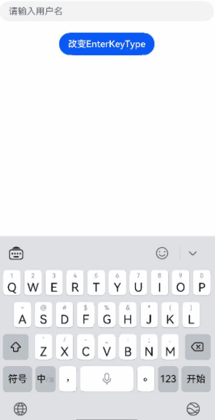
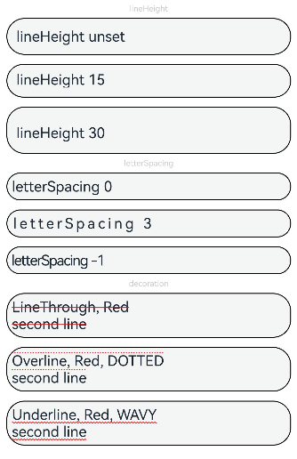
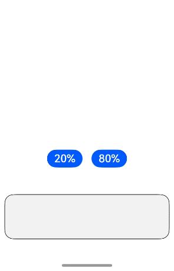
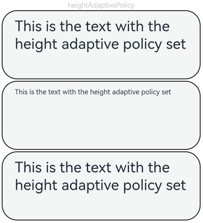
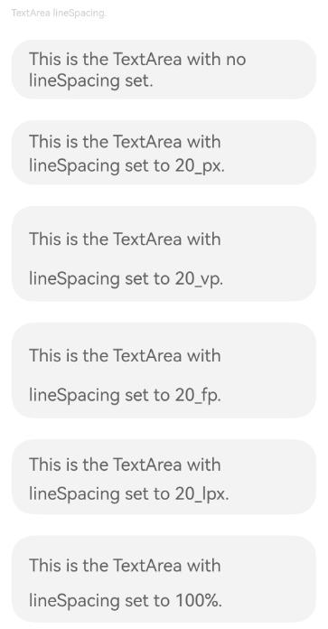
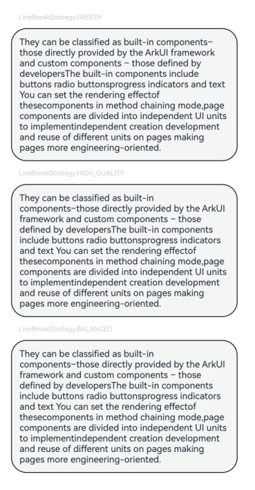
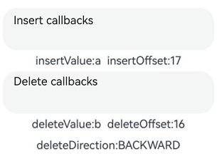
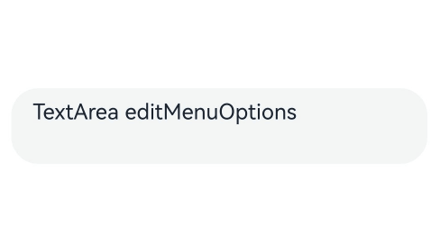

# TextArea

The **TextArea** component provides multi-line text input and automatically wraps text so that each line does not have more than the width of the component.

If the component does not have its height set, it adapts its height to the content. If the component does not have its width set, it takes the maximum available width.

>  **NOTE**
>
>  This component is supported since API version 7. Updates will be marked with a superscript to indicate their earliest API version.


## Child Components

Not supported


## APIs

TextArea(value?: TextAreaOptions)

**Atomic service API**: This API can be used in atomic services since API version 11.

**System capability**: SystemCapability.ArkUI.ArkUI.Full

**Parameters**

| Name| Type| Mandatory| Description|
| ----- | ----- | ---- | ---- |
| value | [TextAreaOptions](#textareaoptions) | No | Parameters of the **TextArea** component.|

## TextAreaOptions

**Atomic service API**: This API can be used in atomic services since API version 11.

**System capability**: SystemCapability.ArkUI.ArkUI.Full

| Name| Type | Mandatory  | Description|
| ---- | ----- | ---- | ---- |
| placeholder      | [ResourceStr](ts-types.md#resourcestr)  | No   | Text displayed when there is no input.  <br>When only the **placeholder** attribute is set, the text selection handle is still available; the caret stays at the beginning of the placeholder text when the handle is released.    |
| text             | [ResourceStr](ts-types.md#resourcestr)  | No   | Current text input.<br>You are advised to bind the state variable to the text in real time through the **onChange** event,<br>so as to prevent display errors when the component is updated.<br>Since API version 10, this parameter supports two-way binding through [$$](../../../quick-start/arkts-two-way-sync.md).|
| controller<sup>8+</sup> | [TextAreaController](#textareacontroller8) | No   | Text area controller.|


## Attributes

In addition to the [universal attributes](ts-universal-attributes-size.md), the following attributes are supported.

>  **NOTE**
>
>  The default value of the universal attribute [padding](ts-universal-attributes-size.md#padding) is as follows:<br>{<br> top: '8vp',<br> right: '16vp',<br> bottom: '8vp',<br> left: '16vp'<br> }
>
>  Since API version 11, **.width('auto')** can be set for the **TextArea** component. Under this setting, the component auto-adapts its width to the text width, while respecting the **constraintSize** configuration and the maximum and minimum width restrictions received by the parent container. For details, see [Size](ts-universal-attributes-size.md).

### placeholderColor

placeholderColor(value: ResourceColor)

Sets the placeholder text color.

**Atomic service API**: This API can be used in atomic services since API version 11.

**System capability**: SystemCapability.ArkUI.ArkUI.Full

**Parameters**

| Name| Type                                      | Mandatory| Description                                        |
| ------ | ------------------------------------------ | ---- | -------------------------------------------- |
| value  | [ResourceColor](ts-types.md#resourcecolor) | Yes  | Placeholder text color.<br>The default value follows the theme.|

### placeholderFont

placeholderFont(value: Font)

Sets the placeholder text style, including the font size, font width, font family, and font style. Currently, only the default font family is supported.

**Atomic service API**: This API can be used in atomic services since API version 11.

**System capability**: SystemCapability.ArkUI.ArkUI.Full

**Parameters**

| Name| Type                    | Mandatory| Description                 |
| ------ | ------------------------ | ---- | --------------------- |
| value  | [Font](ts-types.md#font) | Yes  | Placeholder text style.|

### textAlign

textAlign(value: TextAlign)

Sets the horizontal alignment of the text.

Available options are **TextAlign.Start**, **TextAlign.Center**, and **TextAlign.End**.

To set vertical alignment for the text, use the [align](ts-universal-attributes-location.md) attribute. The **align** attribute alone does not control the horizontal position of the text. In other words, **Alignment.TopStart**, **Alignment.Top**, and **Alignment.TopEnd** produce the same effect, top-aligning the text; **Alignment.Start**, **Alignment.Center**, and **Alignment.End** produce the same effect, centered-aligning the text vertically; **Alignment.BottomStart**, **Alignment.Bottom**, and **Alignment.BottomEnd** produce the same effect, bottom-aligning the text.

When **textAlign** is set to **TextAlign.JUSTIFY**, the text in the last line is horizontally aligned with the start edge.

Since API version 11, **textAlign** can be set to **TextAlign.JUSTIFY**.

**Atomic service API**: This API can be used in atomic services since API version 11.

**System capability**: SystemCapability.ArkUI.ArkUI.Full

**Parameters**

| Name| Type                                       | Mandatory| Description                                                      |
| ------ | ------------------------------------------- | ---- | ---------------------------------------------------------- |
| value  | [TextAlign](ts-appendix-enums.md#textalign) | Yes  | Horizontal alignment of the text.<br>Default value: **TextAlign.Start**|

### caretColor

caretColor(value: ResourceColor)

Sets the color of the caret in the text box.

**Atomic service API**: This API can be used in atomic services since API version 11.

**System capability**: SystemCapability.ArkUI.ArkUI.Full

**Parameters**

| Name| Type                                      | Mandatory| Description                                  |
| ------ | ------------------------------------------ | ---- | -------------------------------------- |
| value  | [ResourceColor](ts-types.md#resourcecolor) | Yes  | Color of the caret in the text box.<br>Default value: **'#007DFF'**|

>  **NOTE**    
>   Since API version 12, this API can be used to set the text handle color, which is the same as the caret color.

### fontColor

fontColor(value: ResourceColor)

Sets the font color.

**Widget capability**: This API can be used in ArkTS widgets since API version 9.

**Atomic service API**: This API can be used in atomic services since API version 11.

**System capability**: SystemCapability.ArkUI.ArkUI.Full

**Parameters**

| Name| Type                                      | Mandatory| Description      |
| ------ | ------------------------------------------ | ---- | ---------- |
| value  | [ResourceColor](ts-types.md#resourcecolor) | Yes  | Font color.|

### fontSize

fontSize(value: number | string | Resource)

Sets the text size.

**Widget capability**: This API can be used in ArkTS widgets since API version 9.

**Atomic service API**: This API can be used in atomic services since API version 11.

**System capability**: SystemCapability.ArkUI.ArkUI.Full

**Parameters**

| Name| Type                                                        | Mandatory| Description                                                        |
| ------ | ------------------------------------------------------------ | ---- | ------------------------------------------------------------ |
| value  | [Resource](ts-types.md#resource) \| number \| string | Yes  | Font size. If **fontSize** is of the number type, the unit fp is used. The default font size is 16 fp. This parameter cannot be set in percentage.|

### fontStyle

fontStyle(value: FontStyle)

Sets the font style.

**Widget capability**: This API can be used in ArkTS widgets since API version 9.

**Atomic service API**: This API can be used in atomic services since API version 11.

**System capability**: SystemCapability.ArkUI.ArkUI.Full

**Parameters**

| Name| Type                                       | Mandatory| Description                                   |
| ------ | ------------------------------------------- | ---- | --------------------------------------- |
| value  | [FontStyle](ts-appendix-enums.md#fontstyle) | Yes  | Font style.<br>Default value: **FontStyle.Normal**|

### fontWeight

fontWeight(value: number | FontWeight | string)

Sets the font weight. If the value is too large, the text may be clipped depending on the font.

**Widget capability**: This API can be used in ArkTS widgets since API version 9.

**Atomic service API**: This API can be used in atomic services since API version 11.

**System capability**: SystemCapability.ArkUI.ArkUI.Full

**Parameters**

| Name| Type                                                        | Mandatory| Description                                                        |
| ------ | ------------------------------------------------------------ | ---- | ------------------------------------------------------------ |
| value  | [FontWeight](ts-appendix-enums.md#fontweight) \| number \| string | Yes  | Font weight. For the number type, the value range is [100, 900], at an interval of 100. The default value is **400**. A larger value indicates a heavier font weight. For the string type, only strings that represent a number, for example, **"400"**, and the following enumerated values of **FontWeight** are supported: **"bold"**, **"bolder"**, **"lighter"**, **"regular"**, and **"medium"**.<br>Default value: **FontWeight.Normal**|

### fontFamily

fontFamily(value: string | Resource)

Sets the font family.

**Widget capability**: This API can be used in ArkTS widgets since API version 9.

**Atomic service API**: This API can be used in atomic services since API version 11.

**System capability**: SystemCapability.ArkUI.ArkUI.Full

**Parameters**

| Name| Type                                                | Mandatory| Description                                                        |
| ------ | ---------------------------------------------------- | ---- | ------------------------------------------------------------ |
| value  | [Resource](ts-types.md#resource) \| string | Yes  | Font family. Default font: **'HarmonyOS Sans'**<br>The 'HarmonyOS Sans' font and [registered custom fonts](../js-apis-font.md) are supported for applications.<br>Only the 'HarmonyOS Sans' font is supported for widgets.|

### inputFilter<sup>8+</sup>

inputFilter(value: ResourceStr, error?: (value: string) => void)

Sets the regular expression for input filtering. Only inputs that comply with the regular expression can be displayed. Other inputs are filtered out. The specified regular expression can match single characters, but not strings.

**Atomic service API**: This API can be used in atomic services since API version 11.

**System capability**: SystemCapability.ArkUI.ArkUI.Full

**Parameters**

| Name| Type                                  | Mandatory| Description                              |
| ------ | -------------------------------------- | ---- | ---------------------------------- |
| value  | [ResourceStr](ts-types.md#resourcestr) | Yes  | Regular expression.                      |
| error  | (value: string) => void                | No  | Filtered-out content to return when regular expression matching fails.|

### copyOption<sup>9+</sup>

copyOption(value: CopyOptions)

Sets whether copy and paste is allowed. If this attribute is set to **CopyOptions.None**, the paste operation is allowed, but the copy and cut operations are not.

Dragging is not allowed when **CopyOptions.None** is set.

**Atomic service API**: This API can be used in atomic services since API version 11.

**System capability**: SystemCapability.ArkUI.ArkUI.Full

**Parameters**

| Name| Type                                            | Mandatory| Description                                                        |
| ------ | ------------------------------------------------ | ---- | ------------------------------------------------------------ |
| value  | [CopyOptions](ts-appendix-enums.md#copyoptions9) | Yes  | Whether copy and paste is allowed.<br>Default value: **CopyOptions.LocalDevice**|

### maxLength<sup>10+</sup>

maxLength(value: number)

Sets the maximum number of characters for text input. By default, there is no maximum number of characters. When the maximum number of characters is reached, no more characters can be entered, and the border turns red.

**Atomic service API**: This API can be used in atomic services since API version 11.

**System capability**: SystemCapability.ArkUI.ArkUI.Full

**Parameters**

| Name| Type  | Mandatory| Description                  |
| ------ | ------ | ---- | ---------------------- |
| value  | number | Yes  | Maximum number of characters for text input.|

### showCounter<sup>10+</sup>

showCounter(value: boolean, options?: InputCounterOptions)

Sets the character counter displayed when the number of characters entered exceeds the threshold.

**options** can be set only when **value** is set to **true**, in which case a character counter is displayed below the text box. This attribute must be used together with **maxlength**. The character counter is displayed in this format: Number of characters entered/Character limit.

It is visible when the number of characters entered is greater than the character limit multiplied by the threshold percentage value. If **options** is not set, the text box border and character counter subscript turn red when the number of characters entered reaches the limit. If **value** is set to **true** and **options** is set, the text box border and character counter subscript turn red and the text box shakes when the number of characters entered reaches the limit, provided that the value of **thresholdPercentage** is valid. If **highlightBorder** is set to **false**, the text box border does not turn red. By default, **highlightBorder** is set to **true**. The character counter is not displayed for text boxes in inline input style.

**Atomic service API**: This API can be used in atomic services since API version 11.

**System capability**: SystemCapability.ArkUI.ArkUI.Full

**Parameters**

| Name               | Type                                                        | Mandatory| Description            |
| --------------------- | ------------------------------------------------------------ | ---- | ---------------- |
| value                 | boolean                                                      | Yes  | Whether to display the character counter.|
| options<sup>11+</sup> | [InputCounterOptions](ts-types.md#inputcounteroptions11) | No  | Threshold percentage of the character counter.|

### style<sup>10+</sup>

style(value: TextContentStyle)

Sets the polymorphic style of the text box. The inline input style is only available for the **TextAreaType.Normal** type.

**Atomic service API**: This API can be used in atomic services since API version 11.

**System capability**: SystemCapability.ArkUI.ArkUI.Full

**Parameters**

| Name| Type                                                       | Mandatory| Description                                                 |
| ------ | ----------------------------------------------------------- | ---- | ----------------------------------------------------- |
| value  | [TextContentStyle](ts-appendix-enums.md#textcontentstyle10) | Yes  | Polymorphic style of the text box.<br>Default value: **TextContentStyle.DEFAULT**|

### enableKeyboardOnFocus<sup>10+</sup>

enableKeyboardOnFocus(value: boolean)

Sets whether to enable the input method when the component obtains focus in a way other than clicking.

 

**Atomic service API**: This API can be used in atomic services since API version 11.

**System capability**: SystemCapability.ArkUI.ArkUI.Full

**Parameters**

| Name| Type   | Mandatory| Description                                                       |
| ------ | ------- | ---- | ----------------------------------------------------------- |
| value  | boolean | Yes  | Whether to enable the input method when the component obtains focus in a way other than clicking.<br>Default value: **true**|

### selectionMenuHidden<sup>10+</sup>

selectionMenuHidden(value: boolean)

Sets whether to hide the system text selection menu.

**Atomic service API**: This API can be used in atomic services since API version 11.

**System capability**: SystemCapability.ArkUI.ArkUI.Full

**Parameters**

| Name| Type   | Mandatory| Description                                                        |
| ------ | ------- | ---- | ------------------------------------------------------------ |
| value  | boolean | Yes  | Whether to hide the system text selection menu.<br>**true**: Tapping, long-pressing, double-tapping, triple-tapping, or right-clicking the text box will not trigger the system text selection menu.<br>**false**: Tapping, long-pressing, double-tapping, triple-tapping, or right-clicking the text box will trigger the system text selection menu.<br>Default value: **false**|

### barState<sup>10+</sup>

barState(value: BarState)

Sets the scrollbar display mode when the text box is editable.

**Atomic service API**: This API can be used in atomic services since API version 11.

**System capability**: SystemCapability.ArkUI.ArkUI.Full

**Parameters**

| Name| Type                                     | Mandatory| Description                                                        |
| ------ | ----------------------------------------- | ---- | ------------------------------------------------------------ |
| value  | [BarState](ts-appendix-enums.md#barstate) | Yes  | Scrollbar display mode when the text box is editable.<br>Default value: **BarState.Auto**|

### maxLines<sup>10+</sup>

maxLines(value: number)

Sets the maximum number of lines that can be displayed. When **textOverflow** is set, text is truncated if the content exceeds this limit. When **textOverflow** is not set, in inline style, the text is scrollable if the content exceeds the limit while the text box is focused; **maxLines** does not apply when the text box is not focused. In non-inline style, the text is truncated according to the number of lines.

**Atomic service API**: This API can be used in atomic services since API version 11.

**System capability**: SystemCapability.ArkUI.ArkUI.Full

**Parameters**

| Name| Type                                     | Mandatory| Description                                                        |
| ------ | ----------------------------------------- | ---- | ------------------------------------------------------------ |
| value  | number | Yes  | Maximum number of lines that can be displayed with the inline style in the editing state or with the non-inline style.<br>Default value: **3** with the inline style; **+∞** with the non-inline style, indicating that there is no maximum number of lines<br>Value range: (0, +∞)|

### customKeyboard<sup>10+</sup>

customKeyboard(value: CustomBuilder, options?: KeyboardOptions)

Custom keyboard.

When a custom keyboard is set, activating the text box opens the specified custom component, instead of the system input method.

The custom keyboard's height can be set through the **height** attribute of the custom component's root node, and its width is fixed at the default value.

The custom keyboard is presented by overlaying the original screen, which is not compressed or lifted if avoid mode is not enabled or avoidance is not needed for the text box.

The custom keyboard cannot obtain the focus, but it blocks gesture events.

By default, the custom keyboard is closed when the input component loses the focus. You can also use the [TextAreaController](#textareacontroller8).[stopEditing](#stopediting10) API to close the keyboard.

When a custom keyboard is set, the text box does not support camera input, even when the device supports.

**Atomic service API**: This API can be used in atomic services since API version 11.

**System capability**: SystemCapability.ArkUI.ArkUI.Full

**Parameters**

| Name               | Type                                       | Mandatory| Description                                                        |
| --------------------- | ------------------------------------------- | ---- | ------------------------------------------------------------ |
| value                 | [CustomBuilder](ts-types.md#custombuilder8) | Yes  | Custom keyboard.<br>**Atomic service API**: This API can be used in atomic services since API version 11.|
| options<sup>12+</sup> | [KeyboardOptions](ts-basic-components-richeditor.md#keyboardoptions12)       | No  | Whether to support keyboard avoidance.                            |

### type<sup>11+</sup>

type(value: TextAreaType)

Sets the text box type.

**Atomic service API**: This API can be used in atomic services since API version 12.

**System capability**: SystemCapability.ArkUI.ArkUI.Full

**Parameters**

| Name| Type                                   | Mandatory| Description                                        |
| ------ | --------------------------------------- | ---- | -------------------------------------------- |
| value  | [TextAreaType](#textareatype11) | Yes  | Text box type.<br>Default value: **TextAreaType.Normal**|

### enterKeyType<sup>11+</sup>

enterKeyType(value: EnterKeyType)

Sets the type of the Enter key.

**Atomic service API**: This API can be used in atomic services since API version 12.

**System capability**: SystemCapability.ArkUI.ArkUI.Full

**Parameters**

| Name| Type                                            | Mandatory| Description                                                |
| ------ | ------------------------------------------------ | ---- | ---------------------------------------------------- |
| value  | [EnterKeyType](ts-types.md#enterkeytype) | Yes  | Type of the Enter key.<br>Default value: **EnterKeyType.NEW_LINE**|

### enableAutoFill<sup>12+</sup>

enableAutoFill(value: boolean)

Sets whether to enable autofill.

**Atomic service API**: This API can be used in atomic services since API version 12.

**System capability**: SystemCapability.ArkUI.ArkUI.Full

**Parameters**

| Name| Type   | Mandatory| Description                                                        |
| ------ | ------- | ---- | ------------------------------------------------------------ |
| value  | boolean | Yes  | Whether to enable autofill.<br>**true**: enable<br>**false**: disable<br><br>Default value: **true**|

### contentType<sup>12+</sup>

contentType(contentType: ContentType)

Sets the content type for autofill.

**Atomic service API**: This API can be used in atomic services since API version 12.

**System capability**: SystemCapability.ArkUI.ArkUI.Full

**Parameters**

| Name     | Type                                 | Mandatory| Description          |
| ----------- | ------------------------------------- | ---- | -------------- |
| contentType | [ContentType](#contenttype12) | Yes  | Content type for autofill.|

### lineHeight<sup>12+</sup>

lineHeight(value: number | string | Resource)

Sets the text line height. If the value is less than or equal to **0**, the line height is not limited and the font size is adaptive. If the value is of the number type, the unit fp is used.

**Atomic service API**: This API can be used in atomic services since API version 12.

**System capability**: SystemCapability.ArkUI.ArkUI.Full

**Parameters**

| Name| Type                                                        | Mandatory| Description            |
| ------ | ------------------------------------------------------------ | ---- | ---------------- |
| value  | number \| string \| [Resource](ts-types.md#resource) | Yes  | Text line height.|

### decoration<sup>12+</sup>

decoration(value: TextDecorationOptions)

Sets the color, type, and style of the text decorative line.

**Atomic service API**: This API can be used in atomic services since API version 12.

**System capability**: SystemCapability.ArkUI.ArkUI.Full

**Parameters**

| Name| Type                                                        | Mandatory| Description                                                        |
| ------ | ------------------------------------------------------------ | ---- | ------------------------------------------------------------ |
| value  | [TextDecorationOptions](ts-types.md#textdecorationoptions12) | Yes  | Text decorative line options.<br>Default value: {<br> type: TextDecorationType.None,<br> color: Color.Black,<br> style: TextDecorationStyle.SOLID <br>} |

### letterSpacing<sup>12+</sup>

letterSpacing(value: number | string | Resource)

Sets the letter spacing for a text style. If the value specified is a percentage or 0, the default value is used.

If the value specified is a negative value, the text is compressed. A negative value too small may result in the text being compressed to 0 and no content being displayed.

**Atomic service API**: This API can be used in atomic services since API version 12.

**System capability**: SystemCapability.ArkUI.ArkUI.Full

**Parameters**

| Name| Type                      | Mandatory| Description          |
| ------ | -------------------------- | ---- | -------------- |
| value  | number \| string \| [Resource](ts-types.md#resource) | Yes  | Letter spacing.|

### fontFeature<sup>12+</sup>

fontFeature(value: string)

Sets the font feature, for example, monospaced digits.

Format: normal \| \<feature-tag-value\>

Format of **\<feature-tag-value\>**: \<string\> \[ \<integer\> \| on \| off ]

There can be multiple **\<feature-tag-value\>** values, which are separated by commas (,).

For example, the input format for monospaced clock fonts is "ss01" on.

**Atomic service API**: This API can be used in atomic services since API version 12.

**System capability**: SystemCapability.ArkUI.ArkUI.Full

**Parameters**

| Name| Type  | Mandatory| Description          |
| ------ | ------ | ---- | -------------- |
| value  | string | Yes  | Font feature.|

For details about the supported font features, see [Font Feature List](ts-basic-components-text.md#fontfeature12).
Font features are advanced typographic features, such as ligatures and monospace, for OpenType fonts. They are typically used in custom fonts and require the support of the font itself.
For more information about the font features, see [Low-level font feature settings control: the font-feature-settings property](https://www.w3.org/TR/css-fonts-3/#font-feature-settings-prop) and [The Complete CSS Demo for OpenType Features](https://sparanoid.com/lab/opentype-features/).
### wordBreak<sup>12+</sup>

wordBreak(value: WordBreak)

Sets the word break rule. This attribute does not take effect for the placeholder text.

**Atomic service API**: This API can be used in atomic services since API version 12.

**System capability**: SystemCapability.ArkUI.ArkUI.Full

**Parameters**

| Name| Type                                         | Mandatory| Description                                         |
| ------ | --------------------------------------------- | ---- | --------------------------------------------- |
| value  | [WordBreak](ts-appendix-enums.md#wordbreak11) | Yes  | Word break rule.<br>Default value: **WordBreak.BREAK_WORD**|

>  **NOTE**
>
>  The component does not support the **clip** attribute. Therefore, setting this attribute does not affect text clipping.

### selectedBackgroundColor<sup>12+</sup>

selectedBackgroundColor(value: ResourceColor)

Sets the background color of the selected text. If the opacity is not set, a 20% opacity will be used.

**Atomic service API**: This API can be used in atomic services since API version 12.

**System capability**: SystemCapability.ArkUI.ArkUI.Full

**Parameters**

| Name| Type                                      | Mandatory| Description                                      |
| ------ | ------------------------------------------ | ---- | ------------------------------------------ |
| value  | [ResourceColor](ts-types.md#resourcecolor) | Yes  | Background color of the selected text.<br>By default, a 20% opacity is applied.|

### caretStyle<sup>12+</sup>

caretStyle(value: CaretStyle)

Sets the caret style.

**Atomic service API**: This API can be used in atomic services since API version 12.

**System capability**: SystemCapability.ArkUI.ArkUI.Full

**Parameters**

| Name| Type                               | Mandatory| Description        |
| ------ | ----------------------------------- | ---- | ------------ |
| value  | [CaretStyle](ts-text-common.md#caretstyle10) | Yes  | Caret style.|

### textIndent<sup>12+</sup>

textIndent(value: Dimension)

Sets the indent of the first line text.

**Atomic service API**: This API can be used in atomic services since API version 12.

**System capability**: SystemCapability.ArkUI.ArkUI.Full

**Parameters**

| Name| Type                                | Mandatory| Description                        |
| ------ | ----------------------------------- | ---- | ---------------------------- |
| value  | [Dimension](ts-types.md#dimension10)| Yes  | Indent of the first line text.<br>Default value: **0**|

### textOverflow<sup>12+</sup>

textOverflow(value: TextOverflow)

Sets the display mode when the text is too long.

In inline style, the effect of truncating text according to **maxLines** only applies when **textOverflow** is set.

Text is clipped at the transition between words. To clip text in the middle of a word, set **wordBreak** to **WordBreak.BREAK_ALL**.

If **overflow** is set to **TextOverflow.None**, **TextOverflow.Clip**, or **TextOverflow.Ellipsis**, this attribute must be used with **maxLines** for the settings to take effect. **TextOverflow.None** produces the same effect as **TextOverflow.Clip**.

**Widget capability**: This API can be used in ArkTS widgets.

**Atomic service API**: This API can be used in atomic services since API version 12.

**System capability**: SystemCapability.ArkUI.ArkUI.Full

**Parameters**

| Name| Type                                                         | Mandatory| Description                                                        |
| ------ | ------------------------------------------------------------ | ---- | ------------------------------------------------------------ |
| value  | [TextOverflow](ts-appendix-enums.md#textoverflow)            | Yes  | Display mode when the text is too long.<br>Default value: **TextOverflow.Clip**          |

>  **NOTE**    
>   The **TextArea** component does not support the **TextOverflow.MARQUEE** mode. If this attribute is set to **TextOverflow.MARQUEE**, **TextOverflow.Clip** is used instead.

### minFontSize<sup>12+</sup>

minFontSize(value: number | string | Resource)

Sets the minimum font size.

For the setting to take effect, this attribute must be used together with [maxFontSize](#maxfontsize12) and [maxLines](#maxlines10), or layout constraint settings.

When the adaptive font size is used, the **fontSize** settings do not take effect.

**Atomic service API**: This API can be used in atomic services since API version 12.

**System capability**: SystemCapability.ArkUI.ArkUI.Full

**Parameters**

| Name| Type                                                        | Mandatory| Description              |
| ------ | ------------------------------------------------------------ | ---- | ------------------ |
| value  | number \| string \| [Resource](ts-types.md#resource) | Yes  | Minimum font size.|

### maxFontSize<sup>12+</sup>

maxFontSize(value: number | string | Resource)

Sets the maximum font size.

For the setting to take effect, this attribute must be used together with [minFontSize](#minfontsize12) and [maxLines](#maxlines10), or layout constraint settings.

When the adaptive font size is used, the **fontSize** settings do not take effect.

**Atomic service API**: This API can be used in atomic services since API version 12.

**System capability**: SystemCapability.ArkUI.ArkUI.Full

**Parameters**

| Name| Type                                                        | Mandatory| Description              |
| ------ | ------------------------------------------------------------ | ---- | ------------------ |
| value  | number \| string \| [Resource](ts-types.md#resource) | Yes  | Maximum font size.|

### heightAdaptivePolicy<sup>12+</sup>

heightAdaptivePolicy(value: TextHeightAdaptivePolicy)

Sets how the adaptive height is determined for the text.

When this attribute is set to **TextHeightAdaptivePolicy.MAX_LINES_FIRST**, the [maxLines](#maxlines10) attribute takes precedence for adjusting the text height. If the **maxLines** setting results in a layout beyond the layout constraints, the text will shrink to a font size between [minFontSize](#minfontsize12) and [maxFontSize](#maxfontsize12) to allow for more content to be shown.
If the text box is in inline input style, the font size in the editing state is different from that in the non-editing state.

If this attribute is set to **TextHeightAdaptivePolicy.MIN_FONT_SIZE_FIRST**, the **minFontSize** attribute takes precedence for adjusting the text height. If the text can fit in one line with the **minFontSize** setting, the text will enlarge to the largest possible font size between **minFontSize** and **maxFontSize**.

If this attribute is set to **TextHeightAdaptivePolicy.LAYOUT_CONSTRAINT_FIRST**, the layout constraints take precedence for adjusting the text height. If the resultant layout is beyond the layout constraints, the text will shrink to a font size between **minFontSize** and **maxFontSize** to respect the layout constraints.

**Atomic service API**: This API can be used in atomic services since API version 12.

**System capability**: SystemCapability.ArkUI.ArkUI.Full

**Parameters**

| Name| Type                                                        | Mandatory| Description                                                        |
| ------ | ------------------------------------------------------------ | ---- | ------------------------------------------------------------ |
| value  | [TextHeightAdaptivePolicy](ts-appendix-enums.md#textheightadaptivepolicy10) | Yes  | How the adaptive height is determined for the text.<br>Default value: **TextHeightAdaptivePolicy.MAX_LINES_FIRST**|

### lineSpacing<sup>12+</sup>

lineSpacing(value: LengthMetrics)

Sets the line spacing of the text. If the value specified is less than or equal to 0, the default value **0** is used.

**Atomic service API**: This API can be used in atomic services since API version 12.

**System capability**: SystemCapability.ArkUI.ArkUI.Full

**Parameters**

| Name| Type                                                        | Mandatory| Description            |
| ------ | ------------------------------------------------------------ | ---- | ---------------- |
| value  | [LengthMetrics](../js-apis-arkui-graphics.md#lengthmetrics12) | Yes  | Line spacing. Default value: **0**|

### lineBreakStrategy<sup>12+</sup>

lineBreakStrategy(strategy: LineBreakStrategy)

Sets the line break rule. This attribute takes effect when **wordBreak** is not set to **breakAll**. Hyphens are not supported.

**Atomic service API**: This API can be used in atomic services since API version 12.

**System capability**: SystemCapability.ArkUI.ArkUI.Full

**Parameters**

| Name  | Type                                                        | Mandatory| Description                                                   |
| -------- | ------------------------------------------------------------ | ---- | ------------------------------------------------------- |
| strategy | [LineBreakStrategy](ts-appendix-enums.md#linebreakstrategy12) | Yes  | Line break rule.<br>Default value: **LineBreakStrategy.GREEDY**|

### editMenuOptions<sup>12+</sup>

editMenuOptions(editMenu: EditMenuOptions)

Sets the extended options of the custom context menu on selection, including the text content, icon, and callback.

**Atomic service API**: This API can be used in atomic services since API version 12.

**System capability**: SystemCapability.ArkUI.ArkUI.Full

**Parameters**

| Name| Type                                         | Mandatory| Description                                         |
| ------ | --------------------------------------------- | ---- | --------------------------------------------- |
| editMenu  | [EditMenuOptions](ts-text-common.md#editmenuoptions) | Yes  | Extended options of the custom context menu on selection.|

### enablePreviewText<sup>12+</sup>

enablePreviewText(enable: boolean)

Sets whether to enable preview text.

Preview text is in a temporary state and does not support text interception. As such, it does not trigger **onWillInsert**, **onDidInsert**, **onWillDelete**, or **onDidDelete** callbacks.

**Atomic service API**: This API can be used in atomic services since API version 12.

**System capability**: SystemCapability.ArkUI.ArkUI.Full

**Parameters**

| Name| Type   | Mandatory| Description                              |
| ------ | ------- | ---- | ---------------------------------- |
| enable | boolean | Yes  | Whether to enable preview text.<br>Default value: **true**|

## Events

In addition to the [universal events](ts-universal-events-click.md), the following events are supported.

### onChange

onChange(callback: EditableTextOnChangeCallback)

Called when the input in the text box changes.

**Atomic service API**: This API can be used in atomic services since API version 11.

**System capability**: SystemCapability.ArkUI.ArkUI.Full

**Parameters**

| Name| Type  | Mandatory| Description                |
| ------ | ------ | ---- | -------------------- |
| callback  | [EditableTextOnChangeCallback](ts-text-common.md#editabletextonchangecallback12) | Yes  | Callback invoked when the input in the text box changes.|

### onEditChange<sup>10+</sup>

onEditChange(callback: (isEditing: boolean) =&gt; void)

Called when the input status changes. The text box is in the editing state when it has the caret placed in it, and is in the non-editing state otherwise. If the value of **isEditing** is **true**, the text box is in the editing state.

**Atomic service API**: This API can be used in atomic services since API version 11.

**System capability**: SystemCapability.ArkUI.ArkUI.Full

**Parameters**

| Name   | Type   | Mandatory| Description                |
| --------- | ------- | ---- | -------------------- |
| isEditing | boolean | Yes  | Whether the text box is in the editing state. The value **true** indicates that the text box is in the editing state.|

### onCopy<sup>8+</sup>

onCopy(callback: (value: string) =&gt; void)

Invoked when a copy operation is performed.

**Atomic service API**: This API can be used in atomic services since API version 11.

**System capability**: SystemCapability.ArkUI.ArkUI.Full

**Parameters**

| Name| Type  | Mandatory| Description            |
| ------ | ------ | ---- | ---------------- |
| value  | string | Yes  | Text that is copied.|

### onCut<sup>8+</sup>

onCut(callback: (value: string) =&gt; void)

Invoked when a cut operation is performed.

**Atomic service API**: This API can be used in atomic services since API version 11.

**System capability**: SystemCapability.ArkUI.ArkUI.Full

**Parameters**

| Name| Type  | Mandatory| Description            |
| ------ | ------ | ---- | ---------------- |
| value  | string | Yes  | Text that is cut.|

### onPaste

onPaste(callback: (value: string, event: PasteEvent) =&gt; void)

Invoked when a paste operation is performed.

**Atomic service API**: This API can be used in atomic services since API version 11.

**System capability**: SystemCapability.ArkUI.ArkUI.Full

**Parameters**

| Name             | Type                                                        | Mandatory| Description                  |
| ------------------- | ------------------------------------------------------------ | ---- | ---------------------- |
| value               | string                                                       | Yes  | Text to be pasted.      |
| event<sup>11+</sup> | [PasteEvent](ts-basic-components-richeditor.md#pasteevent11) | Yes  | Custom paste event.|

### onTextSelectionChange<sup>10+</sup>

onTextSelectionChange(callback: (selectionStart: number, selectionEnd: number) => void)

Invoked when the position of the text selection changes or when the cursor position changes during the editing state.

**Atomic service API**: This API can be used in atomic services since API version 11.

**System capability**: SystemCapability.ArkUI.ArkUI.Full

**Parameters**

| Name        | Type  | Mandatory| Description                                   |
| -------------- | ------ | ---- | --------------------------------------- |
| selectionStart | number | Yes  | Start position of the selected text. The start position of text is **0**.|
| selectionEnd   | number | Yes  | End position of the selected text.                   |

### onContentScroll<sup>10+</sup>

onContentScroll(callback: (totalOffsetX: number, totalOffsetY: number) => void)

Called when the text content is scrolled.

**Atomic service API**: This API can be used in atomic services since API version 11.

**System capability**: SystemCapability.ArkUI.ArkUI.Full

**Parameters**

| Name      | Type  | Mandatory| Description                              |
| ------------ | ------ | ---- | ---------------------------------- |
| totalOffsetX | number | Yes  | Offset in the X coordinate of the text in the content area, in px.|
| totalOffsetY | number | Yes  | Offset in the Y coordinate of the text in the content area, in px.|

### onSubmit<sup>11+</sup>

onSubmit(callback: (enterKey: EnterKeyType) =&gt; void)

Called when the Enter key on the keyboard is pressed.

**Atomic service API**: This API can be used in atomic services since API version 12.

**System capability**: SystemCapability.ArkUI.ArkUI.Full

**Parameters**

| Name  | Type                                            | Mandatory| Description                                                        |
| -------- | ------------------------------------------------ | ---- | ------------------------------------------------------------ |
| enterKey | [EnterKeyType](ts-types.md#enterkeytype) | Yes  | Type of the Enter key. If it is **EnterKeyType.NEW_LINE** and the text box is in inline input style, **onSubmit** is not triggered.|

### onWillInsert<sup>12+</sup>

onWillInsert(callback: Callback\<InsertValue, boolean>)

Called when text is about to be inserted.

**Atomic service API**: This API can be used in atomic services since API version 12.

**System capability**: SystemCapability.ArkUI.ArkUI.Full

**Parameters**

| Name| Type                                                        | Mandatory| Description              |
| ------ | ------------------------------------------------------------ | ---- | ------------------ |
| callback  | Callback\<[InsertValue](ts-text-common.md#insertvalue12), boolean> | Yes  | Callback triggered when text is about to be inserted.<br>It returns **true** if the text is inserted; returns **false** otherwise.<br>This callback is not called for text preview.<br>It is available only for system input methods.|

### onDidInsert<sup>12+</sup>

onDidInsert(callback: Callback\<InsertValue>)

Called when text is inserted.

**Atomic service API**: This API can be used in atomic services since API version 12.

**System capability**: SystemCapability.ArkUI.ArkUI.Full

**Parameters**

| Name| Type                                                        | Mandatory| Description              |
| ------ | ------------------------------------------------------------ | ---- | ------------------ |
| callback  | Callback\<[InsertValue](ts-text-common.md#insertvalue12)> | Yes  | Callback triggered when text is inserted.<br>It is available only for system input methods.|

### onWillDelete<sup>12+</sup>

onWillDelete(callback: Callback\<DeleteValue, boolean>)

Called when text is about to be deleted.

**Atomic service API**: This API can be used in atomic services since API version 12.

**System capability**: SystemCapability.ArkUI.ArkUI.Full

**Parameters**

| Name| Type                                                        | Mandatory| Description              |
| ------ | ------------------------------------------------------------ | ---- | ------------------ |
| callback  | Callback\<[DeleteValue](ts-text-common.md#deletevalue12), boolean> | Yes  | Callback triggered when text is about to be deleted.<br>It returns **true** if the text is deleted; returns **false** otherwise.<br>This callback is not called for text preview.<br>It is available only for system input methods.|

### onDidDelete<sup>12+</sup>

onDidDelete(callback: Callback\<DeleteValue>)

Called when text is deleted.

**Atomic service API**: This API can be used in atomic services since API version 12.

**System capability**: SystemCapability.ArkUI.ArkUI.Full

**Parameters**

| Name| Type                                                        | Mandatory| Description              |
| ------ | ------------------------------------------------------------ | ---- | ------------------ |
| callback  | Callback\<[DeleteValue](ts-text-common.md#deletevalue12)> | Yes  | Callback triggered when text is deleted.<br>It is available only for system input methods.|

## TextAreaController<sup>8+</sup>

Inherits from [TextContentControllerBase](ts-types.md#textcontentcontrollerbase10).

**Atomic service API**: This API can be used in atomic services since API version 11.

**System capability**: SystemCapability.ArkUI.ArkUI.Full

### Objects to Import

```
controller: TextAreaController = new TextAreaController()
```

### constructor<sup>8+</sup>

constructor()

A constructor used to create a **TextAreaController** object.

**Atomic service API**: This API can be used in atomic services since API version 11.

**System capability**: SystemCapability.ArkUI.ArkUI.Full

### caretPosition<sup>8+</sup>

caretPosition(value: number): void

Sets the position of the caret.

**Atomic service API**: This API can be used in atomic services since API version 11.

**System capability**: SystemCapability.ArkUI.ArkUI.Full

**Parameters**

| Name| Type| Mandatory| Description |
| ------ | ---- | ---- | ---- |
| value  | number   | Yes  | Length from the start of the string to the position where the caret is located.|

### setTextSelection<sup>10+</sup>

setTextSelection(selectionStart: number, selectionEnd: number, options?: SelectionOptions): void

Sets the text selection range and highlights the selected text when the component is focused. This API works only when the value of **selectionStart** is less than that of **selectionEnd**.

**Atomic service API**: This API can be used in atomic services since API version 11.

**System capability**: SystemCapability.ArkUI.ArkUI.Full

**Parameters**

| Name| Type| Mandatory| Description |
| ------ | ---- | ---- | ---- |
| selectionStart | number   | Yes  | Start position of the text selection range. The start position of text in the text box is 0.<br>A value less than 0 is handled as **0**. A value greater than the maximum text length is handled as the maximum text length.<br>**Atomic service API**: This API can be used in atomic services since API version 11.|
| selectionEnd   | number   | Yes  | End position of the text selection range.<br>A value less than 0 is handled as the value **0**. A value greater than the maximum text length is handled as the maximum text length.<br>**Atomic service API**: This API can be used in atomic services since API version 11.|
| options<sup>12+</sup>   | [SelectionOptions](ts-types.md#selectionoptions12) | No   | Configuration options for text selection.<br>Default value: **MenuPolicy.DEFAULT**<br>**Atomic service API**: This API can be used in atomic services since API version 12.|

>  **NOTE**
>
>  If **selectionMenuHidden** is set to **true** or a 2-in-1 device is used, calling **setTextSelection** does not display the context menu even when **options** is set to **MenuPolicy.SHOW**.
>
>  If the selected text contains an emoji, the emoji is selected when its start position is within the text selection range.

### stopEditing<sup>10+</sup>

stopEditing(): void

Exits the editing state.

**Atomic service API**: This API can be used in atomic services since API version 11.

**System capability**: SystemCapability.ArkUI.ArkUI.Full

## TextAreaType<sup>11+</sup>

**Atomic service API**: This API can be used in atomic services since API version 12.

**System capability**: SystemCapability.ArkUI.ArkUI.Full

| Name  | Value | Description|
| ------ | ----- | ------ |
| NORMAL   | 0 | Normal input mode.<br>The value can contain digits, letters, underscores (_), spaces, and special characters.|
| NUMBER   | 2 | Digit input mode.     |
| PHONE_NUMBER | 3 | Phone number input mode.<br>In this mode, the following are allowed: digits, spaces, plus signs (+), hyphens (-), asterisks (*), and number signs (#); the length is not limited.|
| EMAIL    | 5 | Email address input mode.<br>This mode accepts only digits, letters, underscores (_), dots (.), and the following special characters: ! # $ % & ' * + - / = ? ^ ` \{ \| \} ~ @ (which can only appear once)|
| NUMBER_DECIMAL<sup>12+</sup>  | 12 | Number input mode with a decimal point.<br>The value can contain digits and one decimal point.|
| URL<sup>12+</sup>  | 13 | URL input mode.|

## ContentType<sup>12+</sup>

Enumerates the content types for autofill.

**Atomic service API**: This API can be used in atomic services since API version 12.

**System capability**: SystemCapability.ArkUI.ArkUI.Full

| Name                      | Value  | Description                                                        |
| -------------------------- | ---- | ------------------------------------------------------------ |
| USER_NAME                  | 0    | Username. Password Vault, when enabled, can automatically save and fill in usernames.|
| PASSWORD                   | 1    | Password. Password Vault, when enabled, can automatically save and fill in passwords.|
| NEW_PASSWORD               | 2    | New password. Password Vault, when enabled, can automatically generate a new password.  |
| FULL_STREET_ADDRESS        | 3    | Full street address. The scenario-based autofill feature, when enabled, can automatically save and fill in full street addresses.|
| HOUSE_NUMBER               | 4    | House number. The scenario-based autofill feature, when enabled, can automatically save and fill in house numbers.|
| DISTRICT_ADDRESS           | 5    | District and county. The scenario-based autofill feature, when enabled, can automatically save and fill in districts and counties.|
| CITY_ADDRESS               | 6    | City. The scenario-based autofill feature, when enabled, can automatically save and fill in cities.|
| PROVINCE_ADDRESS           | 7    | Province. The scenario-based autofill feature, when enabled, can automatically save and fill in provinces.|
| COUNTRY_ADDRESS            | 8    | Country. The scenario-based autofill feature, when enabled, can automatically save and fill in countries.|
| PERSON_FULL_NAME           | 9    | Full name. The scenario-based autofill feature, when enabled, can automatically save and fill in full names.|
| PERSON_LAST_NAME           | 10   | Last name. The scenario-based autofill feature, when enabled, can automatically save and fill in last names.|
| PERSON_FIRST_NAME          | 11   | First name. The scenario-based autofill feature, when enabled, can automatically save and fill in first names.|
| PHONE_NUMBER               | 12   | Phone number. The scenario-based autofill feature, when enabled, can automatically save and fill in phone numbers.|
| PHONE_COUNTRY_CODE         | 13   | Country code. The scenario-based autofill feature, when enabled, can automatically save and fill in country codes.|
| FULL_PHONE_NUMBER          | 14   | Phone number with country code. The scenario-based autofill feature, when enabled, can automatically save and fill in phone numbers with country codes.|
| EMAIL_ADDRESS              | 15   | Email address. The scenario-based autofill feature, when enabled, can automatically save and fill in email addresses.|
| BANK_CARD_NUMBER           | 16   | Bank card number. The scenario-based autofill feature, when enabled, can automatically save and fill in bank card numbers.|
| ID_CARD_NUMBER             | 17   | ID card number. The scenario-based autofill feature, when enabled, can automatically save and fill in ID card numbers.|
| NICKNAME                   | 23   | Nickname. The scenario-based autofill feature, when enabled, can automatically save and fill in nicknames.|
| DETAIL_INFO_WITHOUT_STREET | 24   | Address information without street address. The scenario-based autofill feature, when enabled, can automatically save and fill in address information without street addresses.|
| FORMAT_ADDRESS             | 25   | Standard address. The scenario-based autofill feature, when enabled, can automatically save and fill in standard addresses.|

## Example

### Example 1
This example demonstrates the basic usage of **TextArea**.
```ts
// xxx.ets
@Entry
@Component
struct TextAreaExample {
  @State text: string = ''
  @State positionInfo: CaretOffset = { index: 0, x: 0, y: 0 }
  controller: TextAreaController = new TextAreaController()

  build() {
    Column() {
      TextArea({
        text: this.text,
        placeholder: 'The text area can hold an unlimited amount of text. input your word...',
        controller: this.controller
      })
        .placeholderFont({ size: 16, weight: 400 })
        .width(336)
        .height(56)
        .margin(20)
        .fontSize(16)
        .fontColor('#182431')
        .backgroundColor('#FFFFFF')
        .onChange((value: string) => {
          this.text = value
        })
      Text(this.text)
      Button('Set caretPosition 1')
        .backgroundColor('#007DFF')
        .margin(15)
        .onClick(() => {
          // Move the caret to after the first entered character.
          this.controller.caretPosition(1)
        })
      Button('Get CaretOffset')
        .backgroundColor('#007DFF')
        .margin(15)
        .onClick(() => {
          this.positionInfo = this.controller.getCaretOffset()
        })
    }.width('100%').height('100%').backgroundColor('#F1F3F5')
  }
}
```


### Example 2
This example shows how to set the **maxLength** and **showCounter** attributes.
```ts
// xxx.ets
@Entry
@Component
struct TextAreaExample {
  @State text: string = 'test'
  @State counterVisible: boolean = false
  @State maxNumber: number = -1
  controller: TextAreaController = new TextAreaController()

  build() {
    Column() {
      TextArea({
        text: this.text,
        placeholder: 'The text area can hold an unlimited amount of text. input your word...',
        controller: this.controller
      })
        .placeholderFont({ size: 16, weight: 400 })
        .width(336)
        .height(56)
        .margin(20)
        .fontSize(16)
        .fontColor('#182431')
        .maxLength(4)
        .showCounter(true)
        .backgroundColor('#FFFFFF')
        .onChange((value: string) => {
          this.text = value
        })
    }.width('100%').height('100%').backgroundColor('#F1F3F5')
  }
}
```


### Example 3
This example illustrates how to bind a custom keyboard to the **TextArea** component.
```ts
// xxx.ets
@Entry
@Component
struct TextAreaExample {
  controller: TextAreaController = new TextAreaController()
  @State inputValue: string = ""

  // Create a custom keyboard component.
  @Builder CustomKeyboardBuilder() {
    Column() {
      Button('x').onClick(() => {
        // Disable the custom keyboard.
        this.controller.stopEditing()
      })
      Grid() {
        ForEach([1, 2, 3, 4, 5, 6, 7, 8, 9, '*', 0, '#'], (item: number | string) => {
          GridItem() {
            Button(item + "")
              .width(110).onClick(() => {
              this.inputValue += item
            })
          }
        })
      }.maxCount(3).columnsGap(10).rowsGap(10).padding(5)
    }.backgroundColor(Color.Gray)
  }

  build() {
    Column() {
      TextArea({ controller: this.controller, text: this.inputValue})
        // Bind the custom keyboard.
        .customKeyboard(this.CustomKeyboardBuilder()).margin(10).border({ width: 1 })
        .height(200)
    }
  }
}
```


### Example 4
This example illustrates the use of a character counter with the **TextArea** component.
```ts
// xxx.ets
@Entry
@Component
struct TextAreaExample {
  @State text: string = ''
  controller: TextAreaController = new TextAreaController()

  build() {
    Column() {
      TextArea({ text: this.text, controller: this.controller })
        .placeholderFont({ size: 16, weight: 400 })
        .width(336)
        .height(56)
        .maxLength(6)
		.showCounter(true, { thresholdPercentage: 50, highlightBorder: true })
		// The character counter is in this format: Number of characters that have been entered/Maximum number of characters allowed, which is specified by maxLength().
        // The character counter is displayed when the number of characters that have been entered is greater than the maximum number of characters multiplied by 50% (threshold percentage).
        // When highlightBorder is set to false, the text box border turns red when the number of entered characters reaches the maximum. The default value is true.
        .onChange((value: string) => {
          this.text = value
        })
    }.width('100%').height('100%').backgroundColor('#F1F3F5')
  }
}
```


### Example 5
This example shows how to set the **enterKeyType** attribute.
```ts
// xxx.ets
@Entry
@Component
struct TextInputExample {
  @State Text: string = ''
  @State enterTypes: Array<EnterKeyType> = [EnterKeyType.Go, EnterKeyType.Search, EnterKeyType.Send, EnterKeyType.Done, EnterKeyType.Next, EnterKeyType.PREVIOUS, EnterKeyType.NEW_LINE]
  @State index: number = 0
  build() {
    Column({ space: 20 }) {
      TextArea({ placeholder: 'Enter user name', text: this.Text })
        .width(380)
        .enterKeyType(this.enterTypes[this.index])
        .onChange((value: string) => {
          this.Text = value
        })
        .onSubmit((enterKey: EnterKeyType) => {
          console.log("trigger area onsubmit" + enterKey);
        })
      Button ('Change EnterKeyType').onClick () => {
        this.index = (this.index + 1) % this.enterTypes.length;
      })

    }.width('100%')
  }
}
```




### Example 6
This example shows how to set the **wordBreak** attribute for the **TextArea** component.

```ts
// xxx.ets
@Entry
@Component
struct TextAreaExample {
  build() {
    Column() {
      Text("WordBreakType as NORMAL: ").fontSize(16).fontColor(0xFF0000)
      TextArea({
        text: 'This is set wordBreak to WordBreak text Taumatawhakatangihangakoauauotamateaturipukakapikimaungahoronukupokaiwhenuakitanatahu.'
      })
        .fontSize(16)
        .border({ width: 1 })
        .wordBreak(WordBreak.NORMAL)
      Text ("WordBreakType as BREAK_ALL") .fontSize (16).fontColor (0xFF0000)
      TextArea({
        text: 'This is set wordBreak to WordBreak text Taumatawhakatangihangakoauauotamateaturipukakapikimaungahoronukupokaiwhenuakitanatahu.'
      })
        .fontSize(16)
        .border({ width: 1 })
        .wordBreak(WordBreak.BREAK_ALL)    
      Text("WordBreakType as BREAK_WORD: ").fontSize(16).fontColor(0xFF0000)
      TextArea({
        text: 'This is set wordBreak to WordBreak text Taumatawhakatangihangakoauauotamateaturipukakapikimaungahoronukupokaiwhenuakitanatahu.'
      })
        .fontSize(16)
        .border({ width: 1 })
        .wordBreak(WordBreak.BREAK_WORD)
    }
  }
}
```


### Example 7

This example shows how to use the **lineHeight**, **letterSpacing**, and **decoration** attributes.

```ts
// xxx.ets
@Entry
@Component
struct TextAreaExample {
  build() {
    Row() {
      Column() {
        Text('lineHeight').fontSize(9).fontColor(0xCCCCCC)
        TextArea({text: 'lineHeight unset'})
          .border({ width: 1 }).padding(10).margin(5)
        TextArea({text: 'lineHeight 15'})
          .border({ width: 1 }).padding(10).margin(5).lineHeight(15)
        TextArea({text: 'lineHeight 30'})
          .border({ width: 1 }).padding(10).margin(5).lineHeight(30)

        Text('letterSpacing').fontSize(9).fontColor(0xCCCCCC)
        TextArea({text: 'letterSpacing 0'})
          .border({ width: 1 }).padding(5).margin(5).letterSpacing(0)
        TextArea({text: 'letterSpacing 3'})
          .border({ width: 1 }).padding(5).margin(5).letterSpacing(3)
        TextArea({text: 'letterSpacing -1'})
          .border({ width: 1 }).padding(5).margin(5).letterSpacing(-1)

        Text('decoration').fontSize(9).fontColor(0xCCCCCC)
        TextArea({text: 'LineThrough, Red\nsecond line'})
          .border({ width: 1 }).padding(5).margin(5)
          .decoration({type: TextDecorationType.LineThrough, color: Color.Red})
        TextArea({text: 'Overline, Red, DOTTED\nsecond line'})
          .border({ width: 1 }).padding(5).margin(5)
          .decoration({type: TextDecorationType.Overline, color: Color.Red, style: TextDecorationStyle.DOTTED})
        TextArea({text: 'Underline, Red, WAVY\nsecond line'})
          .border({ width: 1 }).padding(5).margin(5)
          .decoration({type: TextDecorationType.Underline, color: Color.Red, style: TextDecorationStyle.WAVY})
      }.height('90%')
    }
    .width('90%')
    .margin(10)
  }
}
```



### Example 8
This example shows how to set the **fontFeature** attribute, with a comparison between the ss01-enabled and ss01-disabled effects.

```ts
@Entry
@Component
struct textArea {
  @State text1: string = 'This is ss01 on: 0123456789'
  @State text2: string = 'This is ss01 off: 0123456789'

  build() {
    Column(){
      TextArea({text: this.text1})
        .fontSize(20)
        .margin({top:200})
        .fontFeature("\"ss01\" on")
      TextArea({text : this.text2})
        .margin({top:10})
        .fontSize(20)
        .fontFeature("\"ss01\" off")
    }
    .width("90%")
    .margin("5%")
  }
}
```


### Example 9

This example shows how to support custom keyboard avoidance.

```ts
@Entry
@Component
struct TextAreaExample {
  controller: TextAreaController = new TextAreaController()
  @State inputValue: string = ""
  @State height1:string|number = '80%'
  @State height2:number = 100
  @State supportAvoidance:boolean = true;

  // Create a custom keyboard component.
  @Builder CustomKeyboardBuilder() {
    Column() {
      Row(){
        Button('x').onClick(() => {
          // Disable the custom keyboard.
          this.controller.stopEditing()
        }).margin(10)
      }
      Grid() {
        ForEach([1, 2, 3, 4, 5, 6, 7, 8, 9, '*', 0, '#'], (item: number | string) => {
          GridItem() {
            Button(item + "")
              .width(110).onClick(() => {
              this.inputValue += item
            })
          }
        })
      }.maxCount(3).columnsGap(10).rowsGap(10).padding(5)
    }.backgroundColor(Color.Gray)
  }

  build() {
    Column() {
      Row(){
        Button("20%")
          .fontSize(24)
          .onClick(()=>{
            this.height1 = "20%"
          })
        Button("80%")
          .fontSize(24)
          .margin({left:20})
          .onClick(()=>{
            this.height1 = "80%"
          })
      }
      .justifyContent(FlexAlign.Center)
      .alignItems(VerticalAlign.Bottom)
      .height(this.height1)
      .width("100%")
      .padding({bottom:50})
      TextArea({ controller: this.controller, text: this.inputValue})
        .height(100)
        // Bind the custom keyboard.
        .customKeyboard(this.CustomKeyboardBuilder(),{ supportAvoidance: this.supportAvoidance }).margin(10).border({ width: 1 })
        // .height(200)
    }
  }
}
```


### Example 10

This example shows how to set **minFontSize**, **maxFontSize**, and **heightAdaptivePolicy**.

```ts
// xxx.ets
@Entry
@Component
struct TextAreaExample {
  build() {
    Row() {
      Column() {
        Text('heightAdaptivePolicy').fontSize(9).fontColor(0xCCCCCC)
        TextArea({text: 'This is the text with the height adaptive policy set'})
          .width('80%').height(90).borderWidth(1).margin(1)
          .minFontSize(4)
          .maxFontSize(40)
          .maxLines(3)
          .heightAdaptivePolicy(TextHeightAdaptivePolicy.MAX_LINES_FIRST)
        TextArea({text: 'This is the text with the height adaptive policy set'})
          .width('80%').height(90).borderWidth(1).margin(1)
          .minFontSize(4)
          .maxFontSize(40)
          .maxLines(3)
          .heightAdaptivePolicy(TextHeightAdaptivePolicy.MIN_FONT_SIZE_FIRST)
        TextArea({text: 'This is the text with the height adaptive policy set'})
          .width('80%').height(90).borderWidth(1).margin(1)
          .minFontSize(4)
          .maxFontSize(40)
          .maxLines(3)
          .heightAdaptivePolicy(TextHeightAdaptivePolicy.LAYOUT_CONSTRAINT_FIRST)
      }.height('90%')
    }
    .width('90%')
    .margin(10)
  }
}
```



### Example 11

This example shows how to set the **lineSpacing** attribute, with a comparison of line spacing effects.

```ts
import { LengthMetrics } from '@kit.ArkUI'

@Entry
@Component
struct LineSpacingExample {
  build() {
      Flex({ direction: FlexDirection.Column, alignItems: ItemAlign.Start, justifyContent: FlexAlign.SpaceBetween }) {
        Text('TextArea lineSpacing.').fontSize(9).fontColor(0xCCCCCC)
        TextArea({ placeholder: 'This is the TextArea with no lineSpacing set.' })
          .fontSize(12)
        TextArea({ placeholder: 'This is the TextArea with lineSpacing set to 20_px.' })
          .fontSize(12)
          .lineSpacing(LengthMetrics.px(20))
        TextArea({ placeholder: 'This is the TextArea with lineSpacing set to 20_vp.' })
          .fontSize(12)
          .lineSpacing(LengthMetrics.vp(20))
        TextArea({ placeholder: 'This is the TextArea with lineSpacing set to 20_fp.' })
          .fontSize(12)
          .lineSpacing(LengthMetrics.fp(20))
        TextArea({ placeholder: 'This is the TextArea with lineSpacing set to 20_lpx.' })
          .fontSize(12)
          .lineSpacing(LengthMetrics.lpx(20))
        TextArea({ placeholder: 'This is the TextArea with lineSpacing set to 100%.' })
          .fontSize(12)
          .lineSpacing(LengthMetrics.percent(1))
      }.height(600).width(350).padding({ left: 35, right: 35, top: 35 })
  }
}
```



### Example 12

This example shows how to use autofill.

```ts
// xxx.ets
@Entry
@Component
struct TextAreaExample {
  @State text: string = ''

  build() {
    Column() {
      // Email address autofill.
      TextArea({ placeholder: 'input your email...' })
        .width('95%')
        .height(40)
        .margin(20)
        .contentType(ContentType.EMAIL_ADDRESS)
        .enableAutoFill(true)
        .maxLength(20)
      // Full street address autofill.
      TextArea({ placeholder: 'input your street address...' })
        .width('95%')
        .height(40)
        .margin(20)
        .contentType(ContentType.FULL_STREET_ADDRESS)
        .enableAutoFill(true)
        .maxLength(20)
    }.width('100%').height('100%').backgroundColor('#F1F3F5')
  }
}
```


### Example 13

This example shows how to set the **lineBreakStrategy** attribute, with a comparison of line break rules.

```ts
@Entry
@Component
struct TextExample1 {
  @State message1: string = "They can be classified as built-in components–those directly provided by the ArkUI framework and custom components – those defined by developers" +
    "The built-in components include buttons radio buttonsprogress indicators and text You can set the rendering effectof thesecomponents in method chaining mode," +
    "page components are divided into independent UI units to implementindependent creation development and reuse of different units on pages making pages more engineering-oriented.";

  build() {
    Flex({ direction: FlexDirection.Column, alignItems: ItemAlign.Start }) {
      Text('LineBreakStrategy.GREEDY').fontSize(9).fontColor(0xCCCCCC).width('90%').padding(10)
      TextArea({text: this.message1})
        .fontSize(12)
        .border({ width: 1 })
        .padding(10)
        .width('100%')
        .lineBreakStrategy(LineBreakStrategy.GREEDY)
      Text('LineBreakStrategy.HIGH_QUALITY').fontSize(9).fontColor(0xCCCCCC).width('90%').padding(10)
      TextArea({text: this.message1})
        .fontSize(12)
        .border({ width: 1 })
        .padding(10)
        .width('100%')
        .lineBreakStrategy(LineBreakStrategy.HIGH_QUALITY)
      Text('LineBreakStrategy.BALANCED').fontSize(9).fontColor(0xCCCCCC).width('90%').padding(10)
      TextArea({text: this.message1})
        .fontSize(12)
        .border({ width: 1 })
        .padding(10)
        .width('100%')
        .lineBreakStrategy(LineBreakStrategy.BALANCED)
    }.height(700).width(370).padding({ left: 35, right: 35, top: 35 })
  }
}
```



### Example 14

This example shows how to use the insert and delete callbacks.

```ts
// xxx.ets
@Entry
@Component
struct TextAreaExample {
  @State insertValue: string = ""
  @State deleteValue: string = ""
  @State insertOffset: number = 0
  @State deleteOffset: number = 0
  @State deleteDirection: number = 0

  build() {
    Row() {
      Column() {
        TextArea({ text: "Insert callbacks" })
          .width(300)
          .height(60)
          .onWillInsert((info: InsertValue) => {
            this.insertValue = info.insertValue
            return true;
          })
          .onDidInsert((info: InsertValue) => {
            this.insertOffset = info.insertOffset
          })

        Text("insertValue:" + this.insertValue + "  insertOffset:" + this.insertOffset).height(30)

        TextArea({ text: "Delete callbacks" })
          .width(300)
          .height(60)
          .onWillDelete((info: DeleteValue) => {
            this.deleteValue = info.deleteValue
            info.direction
            return true;
          })
          .onDidDelete((info: DeleteValue) => {
            this.deleteOffset = info.deleteOffset
            this.deleteDirection = info.direction
          })

        Text("deleteValue:" + this.deleteValue + "  deleteOffset:" + this.deleteOffset).height(30)
        Text("deleteDirection:" + (this.deleteDirection == 0 ? "BACKWARD" : "FORWARD")).height(30)

      }.width('100%')
    }
    .height('100%')
  }
}
```



### Example 15

This example shows how to set **editMenuOptions**.

```ts
// xxx.ets
@Entry
@Component
struct TextAreaExample {
  @State text: string = 'TextArea editMenuOptions'

  onCreateMenu(menuItems: Array<TextMenuItem>) {
    menuItems.forEach((value, index) => {
      value.icon = $r('app.media.startIcon')
      if (value.id.equals(TextMenuItemId.COPY)) {
        value.content = "Copy"
      }
      if (value.id.equals(TextMenuItemId.SELECT_ALL)) {
        value.content = "Select All"
      }
    })
    let item1: TextMenuItem = {
      content: 'Custom 1',
      icon: $r('app.media.startIcon'),
      id: TextMenuItemId.of('Custom 1'),
    }
    let item2: TextMenuItem = {
      content: 'Custom 2',
      id: TextMenuItemId.of('Custom 2'),
      icon: $r('app.media.startIcon'),
    }
    menuItems.push(item1)
    menuItems.unshift(item2)
    return menuItems
  }

  build() {
    Column() {
      TextArea({ text: this.text })
        .width('95%')
        .height(56)
        .editMenuOptions({
          onCreateMenu: this.onCreateMenu, onMenuItemClick: (menuItem: TextMenuItem, textRange: TextRange) => {
            if (menuItem.id.equals(TextMenuItemId.of("custom2"))) {
              console.log("Intercept id: custom2 start:" + textRange.start + "; end:" + textRange.end)
              return true;
            }
            if (menuItem.id.equals(TextMenuItemId.COPY)) {
              console.log("Intercept COPY start:" + textRange.start + "; end:" + textRange.end)
              return true;
            }
            if (menuItem.id.equals(TextMenuItemId.SELECT_ALL)) {
              console.log("Do not intercept SELECT_ALL start:" + textRange.start + "; end:" + textRange.end)
              return false;
            }
            return false;
          }
        })
        .margin({ top: 100 })
    }
    .width("90%")
    .margin("5%")
  }
}
```


