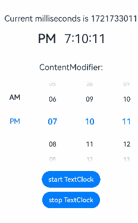
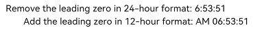

# TextClock

The **TextClock** component displays the current system time in text format for different time zones. The time is accurate to seconds.

The time updates stop when the component is invisible. The component's visibility is determined by the value of **ratios** in the [onVisibleAreaChange](./ts-universal-component-visible-area-change-event.md#onvisibleareachange) event callback: If the value is greater than 0, the component is visible.

>**NOTE**
>
>This component is supported since API version 8. Updates will be marked with a superscript to indicate their earliest API version.
>

## Child Components

Not supported

## APIs

TextClock(options?: TextClockOptions)

**Widget capability**: Since API version 11, this feature is supported in ArkTS widgets.

**Atomic service API**: This API can be used in atomic services since API version 11.

**System capability**: SystemCapability.ArkUI.ArkUI.Full

**Parameters**

| Name| Type| Mandatory| Description|
| -------- | -------- | -------- | -------- |
| options |  [TextClockOptions](#textclockoptions14)| No| Options of the text clock.|

## TextClockOptions<sup>14+</sup>

**Widget capability**: This API can be used in ArkTS widgets since API version 14.

**Atomic service API**: This API can be used in atomic services since API version 14.

**System capability**: SystemCapability.ArkUI.ArkUI.Full

| Name           | Type     | Mandatory    | Description                                                    |
| -------------- | -------- | ------ | --------------------------------------------------------------------------- |
| timeZoneOffset | number   | No    | Time zone offset.<br>The value range is [-14, 12], indicating UTC+12 to UTC-12. A negative value indicates Eastern Standard Time, and a positive value indicates Western Standard Time. For example, **-8** indicates UTC+8. If the value is a floating point number within the value range, it is rounded off, with the decimal portion discarded.<br>For countries or regions crossing the International Date Line, use -13 (UTC+13) and -14 (UTC+14) to ensure time consistency across the country or region. If the set value is not within the valid range, the time zone offset of the current system will be used.<br>Default value: time zone offset of the current system<br>The value is not rounded when it is a floating point number in the { 9.5, 3.5, -3.5, -4.5, -5.5, -5.75, -6.5, -9.5, -10.5, -12.75 } set.|
| controller     | [TextClockController](#textclockcontroller) | No     | Controller to control the status of the **<TextClock\>** component.|

## Attributes

In addition to the [universal attributes](ts-universal-attributes-size.md), the following attributes are supported.

### format

format(value: string)

Sets the time format, for example, **yyyy/MM/dd** or **yyyy-MM-dd**.

**y**: year (yyyy indicates the complete year, and yy indicates the last two digits of the year.)<br>**M**: month (To display 01 for January, use **MM** instead.)<br>**d**: day (To display 01 for the first day, use **dd** instead.)<br>**E**: day of week (To display the full name, use **EEEE**; to display the abbreviation, use **E**, **EE**, or **EEE**.)<b>**H**: hour (24-hour format)<b>**h**: hour (12-hour format)<br>**m**: minute<br>**s**: second<br>**SS**: centisecond (If the number of the uppercase letter S is less than 3, the part is processed as centiseconds.)<br>**SSS**: millisecond (If the number of the uppercase letter S is greater than or equal to 3, the part is processed as milliseconds.)<br>**a**: morning/afternoon (This parameter does not take effect when the hour part is set to **H**.)

Separators: slashes (/), hyphens (-), dots (.), or any custom characters (which cannot be letters) used to separate the parts of the date

The parts of the date can be used alone or combined with each other as needed. The time can be updated as frequent as once per second. As such, whenever possible, avoid setting the centisecond and millisecond parts separately.

When an invalid letter is set, the letter is ignored. If all letters in **format** are invalid, the display format follows the system's language and hour format settings.  

If **format** is left empty or set to **undefined**, the default value will be used.

Default value outside of widgets: 12-hour format: aa hh:mm:ss; 24-hour format: HH:mm:ss.<br>Default value in widgets: 12-hour format: hh:mm, 24-hour format: HH:mm.<br>When used in widgets, the minimum time unit is minute. In this case, if the format contains seconds or centiseconds, the default value will be used.

**Widget capability**: Since API version 11, this feature is supported in ArkTS widgets.

**Atomic service API**: This API can be used in atomic services since API version 11.

**System capability**: SystemCapability.ArkUI.ArkUI.Full

**Parameters**

| Name| Type  | Mandatory| Description          |
| ------ | ------ | ---- | -------------- |
| value  | string | Yes  | Time format to set.|

The following table shows how different settings of **format** work out.

| Input Format               | Display Effect           |
| ----------------------- | ------------------- |
| EEEE, M, d, yyyy      | Saturday, February 4, 2023|
| MMM d, yyyy           | February 4, 2023       |
| EEEE, M, d            | Saturday, February 4      |
| MMM dd                 | February 4             |
| MM/dd/yyyy              | 02/04/2023          |
| EEEE MM dd          | Saturday February 04    |
| yyyy       | 2023             |
| yy       | 23               |
| MM         | February               |
| M              | February                |
| dd (complete date)         | 04               |
| d               | 4                |
| EEEE (full name)       | Saturday             |
| E, EE, EEE (abbreviation) | Sat               |
| MMM d, yyyy           | February 4, 2023       |
| yyyy/M/d                | 2023/2/4            |
| yyyy-M-d                | 2023-2-4            |
| yyyy.M.d                | 2023.2.4            |
| HH:mm:ss   | 17:00:04            |
| aa hh:mm:ss| 5:00:04 AM       |
| hh:mm:ss   | 5:00:04             |
| HH:mm         | 17:00               |
| aa hh:mm      | 5:00 AM          |
| hh:mm         | 5:00                |
| mm:ss         | 00:04               |
| mm:ss.SS | 00:04.91            |
| mm:ss.SSS| 00:04.536           |
| hh:mm:ss aa             | 5:00:04 AM       |
| HH                      | 17                  |

### fontColor

fontColor(value: ResourceColor)

Sets the font color.

**Widget capability**: Since API version 11, this feature is supported in ArkTS widgets.

**Atomic service API**: This API can be used in atomic services since API version 11.

**System capability**: SystemCapability.ArkUI.ArkUI.Full

**Parameters**

| Name| Type                                      | Mandatory| Description      |
| ------ | ------------------------------------------ | ---- | ---------- |
| value  | [ResourceColor](ts-types.md#resourcecolor) | Yes  | Font color.|

### fontSize

fontSize(value: Length)

Sets the font size.

**Widget capability**: Since API version 11, this feature is supported in ArkTS widgets.

**Atomic service API**: This API can be used in atomic services since API version 11.

**System capability**: SystemCapability.ArkUI.ArkUI.Full

**Parameters**

| Name| Type                        | Mandatory| Description                                                        |
| ------ | ---------------------------- | ---- | ------------------------------------------------------------ |
| value  | [Length](ts-types.md#length) | Yes  | Font size. If **fontSize** is of the number type, the unit fp is used. The default font size is 16 fp. This parameter cannot be set in percentage.|

### fontStyle

fontStyle(value: FontStyle)

Sets the font style.

**Widget capability**: Since API version 11, this feature is supported in ArkTS widgets.

**Atomic service API**: This API can be used in atomic services since API version 11.

**System capability**: SystemCapability.ArkUI.ArkUI.Full

**Parameters**

| Name| Type                                       | Mandatory| Description                                   |
| ------ | ------------------------------------------- | ---- | --------------------------------------- |
| value  | [FontStyle](ts-appendix-enums.md#fontstyle) | Yes  | Font style.<br>Default value: **FontStyle.Normal**|

### fontWeight

fontWeight(value: number | FontWeight | string)

Sets the font weight. If the value is too large, the text may be clipped depending on the font.

**Widget capability**: Since API version 11, this feature is supported in ArkTS widgets.

**Atomic service API**: This API can be used in atomic services since API version 11.

**System capability**: SystemCapability.ArkUI.ArkUI.Full

**Parameters**

| Name| Type                                                        | Mandatory| Description                                                        |
| ------ | ------------------------------------------------------------ | ---- | ------------------------------------------------------------ |
| value  | number \| [FontWeight](ts-appendix-enums.md#fontweight) \| string | Yes  | Font weight. For the number type, the value range is [100, 900], at an interval of 100. The default value is **400**. A larger value indicates a heavier font weight. For the string type, only strings that represent a number, for example, **"400"**, and the following enumerated values of **FontWeight** are supported: **"bold"**, **"bolder"**, **"lighter"**, **"regular"**, and **"medium"**.<br>Default value: **FontWeight.Normal**|

### fontFamily

fontFamily(value: ResourceStr)

Sets the font family.

**Widget capability**: Since API version 11, this feature is supported in ArkTS widgets.

**Atomic service API**: This API can be used in atomic services since API version 11.

**System capability**: SystemCapability.ArkUI.ArkUI.Full

**Parameters**

| Name| Type                                  | Mandatory| Description                                                        |
| ------ | -------------------------------------- | ---- | ------------------------------------------------------------ |
| value  | [ResourceStr](ts-types.md#resourcestr) | Yes  | Font family. Default font: **'HarmonyOS Sans'**<br>The 'HarmonyOS Sans' font and [registered custom fonts](../js-apis-font.md) are supported for applications.<br>Only the 'HarmonyOS Sans' font is supported for widgets.|

### textShadow<sup>11+</sup>

textShadow(value: ShadowOptions | Array&lt;ShadowOptions&gt;)

Sets the text shadow. It supports input parameters in an array to implement multiple text shadows. This API does not work with the **fill** attribute or coloring strategy.

**Widget capability**: Since API version 11, this feature is supported in ArkTS widgets.

**Atomic service API**: This API can be used in atomic services since API version 12.

**System capability**: SystemCapability.ArkUI.ArkUI.Full

**Parameters**

| Name| Type                                                        | Mandatory| Description          |
| ------ | ------------------------------------------------------------ | ---- | -------------- |
| value  | [ShadowOptions](ts-universal-attributes-image-effect.md#shadowoptions) \| Array&lt;[ShadowOptions](ts-universal-attributes-image-effect.md#shadowoptions)> | Yes  | Text shadow.|

### fontFeature<sup>11+</sup>

fontFeature(value: string)

Sets the font feature, for example, monospaced digits.

Format: normal \| \<feature-tag-value\>

Format of **\<feature-tag-value\>**: \<string\> \[ \<integer\> \| on \| off ]

There can be multiple **\<feature-tag-value\>** values, which are separated by commas (,).

For example, the input format for monospaced clock fonts is "ss01" on.

**Widget capability**: Since API version 11, this feature is supported in ArkTS widgets.

**Atomic service API**: This API can be used in atomic services since API version 12.

**System capability**: SystemCapability.ArkUI.ArkUI.Full

**Parameters**

| Name| Type  | Mandatory| Description          |
| ------ | ------ | ---- | -------------- |
| value  | string | Yes  | Font feature.|

### contentModifier<sup>12+</sup>

contentModifier(modifier: ContentModifier\<TextClockConfiguration>)

Creates a content modifier.

**Atomic service API**: This API can be used in atomic services since API version 12.

**System capability**: SystemCapability.ArkUI.ArkUI.Full

**Parameters**

| Name| Type                                         | Mandatory| Description                                            |
| ------ | --------------------------------------------- | ---- | ------------------------------------------------ |
| modifier  | [ContentModifier\<TextClockConfiguration>](#textclockconfiguration12)| Yes  | Content modifier to apply to the text clock.<br>**modifier**: content modifier. You need a custom class to implement the **ContentModifier** API.|

### dateTimeOptions<sup>12+</sup>

dateTimeOptions(dateTimeOptions: Optional\<DateTimeOptions>)

Sets whether to display a leading zero for the hour.

**Widget capability**: This API can be used in ArkTS widgets since API version 12.

**Atomic service API**: This API can be used in atomic services since API version 12.

**System capability**: SystemCapability.ArkUI.ArkUI.Full

**Parameters**

| Name| Type                                                        | Mandatory| Description                                                        |
| ------ | ------------------------------------------------------------ | ---- | ------------------------------------------------------------ |
| dateTimeOptions  | Optional<[DateTimeOptions](../../apis-localization-kit/js-apis-intl.md#datetimeoptions)> | Yes  | Whether to display leading zeros in the hour. It only supports setting the **hour** parameter. When the parameter value is **{hour: "2-digit"}**, a leading zero is displayed. When the parameter value is **{hour: "numeric"}**, no leading zero is displayed.<br>Default value: **undefined**, indicating that the component decides whether to display a leading zero based on the format settings configured in the application.|

## Events

In addition to the [universal events](ts-universal-events-click.md), the following events are supported.

### onDateChange

onDateChange(event: (value: number) => void)

Triggered when the time changes.

This event does not take effect when the component is invisible.

If the event is not used in a widget, it is triggered when the change occurs in seconds.

If the event is used in a widget, it is triggered when the change occurs in minutes.

**Widget capability**: Since API version 11, this feature is supported in ArkTS widgets.

**Atomic service API**: This API can be used in atomic services since API version 11.

**System capability**: SystemCapability.ArkUI.ArkUI.Full

**Parameters**

| Name| Type  | Mandatory| Description                                                  |
| ------ | ------ | ---- | ------------------------------------------------------ |
| value  | number | Yes  | Unix time stamp, which is the number of seconds that have elapsed since the Unix epoch.|

## TextClockController

Implements the controller of the **TextClock** component. You can bind the controller to the component to control its start and stop. A **TextClock** component can be bound to only one controller.

**Widget capability**: Since API version 11, this feature is supported in ArkTS widgets.

**Atomic service API**: This API can be used in atomic services since API version 11.

**System capability**: SystemCapability.ArkUI.ArkUI.Full

### Objects to Import

```ts
controller: TextClockController = new TextClockController();
```

### constructor

constructor()

A constructor used to create a **TextClockController** instance.

**Widget capability**: Since API version 11, this feature is supported in ArkTS widgets.

**Atomic service API**: This API can be used in atomic services since API version 11.

**System capability**: SystemCapability.ArkUI.ArkUI.Full

### start

start()

Starts the **<TextClock\>** component.

**Widget capability**: Since API version 11, this feature is supported in ArkTS widgets.

**Atomic service API**: This API can be used in atomic services since API version 11.

**System capability**: SystemCapability.ArkUI.ArkUI.Full

### stop

stop()

Stops the **<TextClock\>** component.

**Widget capability**: Since API version 11, this feature is supported in ArkTS widgets.

**Atomic service API**: This API can be used in atomic services since API version 11.

**System capability**: SystemCapability.ArkUI.ArkUI.Full

## TextClockConfiguration<sup>12+</sup>

You need a custom class to implement the **ContentModifier** API.

**Atomic service API**: This API can be used in atomic services since API version 12.

**System capability**: SystemCapability.ArkUI.ArkUI.Full

| Name| Type   |    Mandatory     |  Description             |
| ------ | ------ | ------ |-------------------------------- |
| timeZoneOffset | number | Yes| Time zone offset of the text clock.|
| started | boolean | Yes| Whether the text clock is started.<br>Default value: **true**|
| timeValue | number | Yes| Time zone offset of the text clock in seconds from UTC.|

## Example
### Example 1
```ts
@Entry
@Component
struct Second {
  @State accumulateTime: number = 0
  // Objects to import
  controller: TextClockController = new TextClockController()
  build() {
    Flex({ direction: FlexDirection.Column, alignItems: ItemAlign.Center, justifyContent: FlexAlign.Center }) {
      Text('Current milliseconds is ' + this.accumulateTime)
        .fontSize(20)
      // Display the system time in 12-hour format for the UTC+8 time zone, accurate to seconds.
      TextClock({ timeZoneOffset: -8, controller: this.controller })
        .format('aa hh:mm:ss')
        .onDateChange((value: number) => {
          this.accumulateTime = value
        })
        .margin(20)
        .fontSize(30)
      Button("start TextClock")
        .margin({ bottom: 10 })
        .onClick(() => {
          // Start the text clock.
          this.controller.start()
        })
      Button("stop TextClock")
        .onClick(() => {
          // Stop the text clock.
          this.controller.stop()
        })
    }
    .width('100%')
    .height('100%')
  }
}
```


### Example 2
``` ts
@Entry
@Component
struct TextClockExample {
  @State textShadows : ShadowOptions | Array<ShadowOptions> = [{ radius: 10, color: Color.Red, offsetX: 10, offsetY: 0 },{ radius: 10, color: Color.Black, offsetX: 20, offsetY: 0 },
      { radius: 10, color: Color.Brown, offsetX: 30, offsetY: 0 },{ radius: 10, color: Color.Green, offsetX: 40, offsetY: 0 },
      { radius: 10, color: Color.Yellow, offsetX: 100, offsetY: 0 }]
  build() {
    Column({ space: 8 }) {
      TextClock().fontSize(50).textShadow(this.textShadows)
    }
  }
}
```


### Example 3
This example implements the functionality of customizing the style of a text clock, creating a time picker component with a custom style: The time picker dynamically adjusts its selected value based on the text clock's timezone offset and the time zone offset in seconds from UTC, creating a clock effect; depending on whether the text clock is started, the time picker toggles between a 12-hour and a 24-hour format display.

``` ts
class MyTextClockStyle implements ContentModifier<TextClockConfiguration> {
  currentTimeZoneOffset: number = new Date().getTimezoneOffset() / 60
  title: string = ''

  constructor(title: string) {
    this.title = title
  }

  applyContent(): WrappedBuilder<[TextClockConfiguration]> {
    return wrapBuilder(buildTextClock)
  }
}

@Builder
function buildTextClock(config: TextClockConfiguration) {
  Row() {
    Column() {
      Text((config.contentModifier as MyTextClockStyle).title)
        .fontSize(20)
        .margin(20)
      TimePicker({
        selected: (new Date(config.timeValue * 1000 + ((config.contentModifier as MyTextClockStyle).currentTimeZoneOffset - config.timeZoneOffset) * 60 * 60 * 1000)),
        format: TimePickerFormat.HOUR_MINUTE_SECOND
      })
        .useMilitaryTime(!config.started)
    }
  }
}

@Entry
@Component
struct TextClockExample {
  @State accumulateTime1: number = 0
  @State timeZoneOffset: number = -8
  controller1: TextClockController = new TextClockController()
  controller2: TextClockController = new TextClockController()

  build() {
    Flex({ direction: FlexDirection.Column, alignItems: ItemAlign.Center, justifyContent: FlexAlign.Center }) {
      Text('Current milliseconds is ' + this.accumulateTime1)
        .fontSize(20)
        .margin({ top: 20 })
      TextClock({ timeZoneOffset: this.timeZoneOffset, controller: this.controller1 })
        .format('aa hh:mm:ss')
        .onDateChange((value: number) => {
          this.accumulateTime1 = value
        })
        .margin(20)
        .fontSize(30)
      TextClock({ timeZoneOffset: this.timeZoneOffset, controller: this.controller2 })
        .format('aa hh:mm:ss')
        .fontSize(30)
        .contentModifier(new MyTextClockStyle('ContentModifier:'))
      Button("start TextClock")
        .margin({ top: 20, bottom: 10 })
        .onClick(() => {
          // Start the text clock.
          this.controller1.start()
          this.controller2.start()
        })
      Button("stop TextClock")
        .margin({ bottom: 30 })
        .onClick(() => {
          // Stop the text clock.
          this.controller1.stop()
          this.controller2.stop()
        })

    }
    .width('100%')
    .height('100%')
  }
}
```


### Example 4
This example demonstrates how to use the **dateTimeOptions** attribute to add or remove the leading zero for the hour field. By default, the hour field in the 24-hour format includes a leading zero. In the 12-hour format, the hour field typically does not include a leading zero.
``` ts
@Entry
@Component
struct TextClockExample {
  build() {
    Column({ space: 8 }) {
      Row() {
        Text("Remove the leading zero in 24-hour format: ")
          .fontSize(20)
        TextClock()
          .fontSize(20)
          .format("HH:mm:ss")
          .dateTimeOptions({hour: "numeric"})
      }
      Row() {
        Text("Add the leading zero in 12-hour format: ")
          .fontSize(20)
        TextClock()
          .fontSize(20)
          .format("aa hh:mm:ss")
          .dateTimeOptions({hour: "2-digit"})
      }
    }
    .alignItems(HorizontalAlign.Start)
  }
}
```

