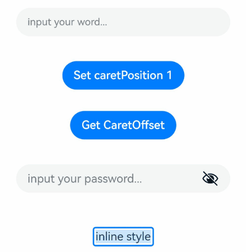
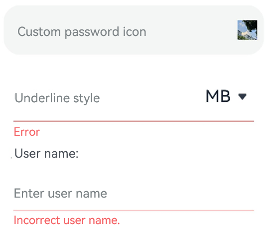
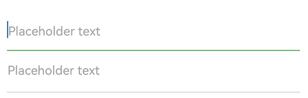
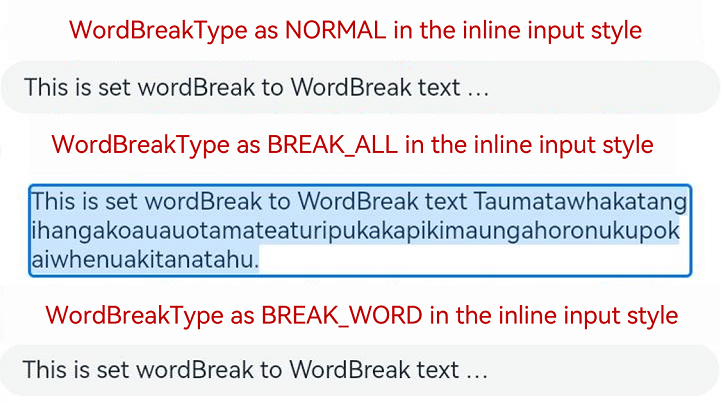

# TextInput

The **TextInput** component provides single-line text input.

>  **NOTE**
>
>  This component is supported since API version 7. Updates will be marked with a superscript to indicate their earliest API version.


## Child Components

Not supported


## APIs

TextInput(value?: TextInputOptions)

**Atomic service API**: This API can be used in atomic services since API version 11.

**System capability**: SystemCapability.ArkUI.ArkUI.Full

**Parameters**

| Name|Type|Mandatory|Description|
|-----|-----|----|----|
| value | [TextInputOptions](#textinputoptions) | No | Parameters of the **TextInput** component.|

## TextInputOptions

**Atomic service API**: This API can be used in atomic services since API version 11.

**System capability**: SystemCapability.ArkUI.ArkUI.Full

| Name                    | Type                                    | Mandatory  | Description                                    |
| ----------------------- | ---------------------------------------- | ---- | ---------------------------------------- |
| placeholder             | [ResourceStr](ts-types.md#resourcestr)   | No   | Text displayed when there is no input.                            |
| text                    | [ResourceStr](ts-types.md#resourcestr)   | No   | Current text input.<br>You are advised to bind the state variable to the text in real time through the **onChange** event,<br>so as to prevent display errors when the component is updated.<br>Since API version 10, this parameter supports two-way binding through [$$](../../../quick-start/arkts-two-way-sync.md).|
| controller<sup>8+</sup> | [TextInputController](#textinputcontroller8) | No   | Text input controller.                         |

## Attributes

Among the [universal attributes](ts-universal-attributes-size.md) and [universal text attributes](ts-universal-attributes-text-style.md), **fontColor**, **fontSize**, **fontStyle**, **fontWeight**, and **fontFamily** are supported. In addition, the following attributes are supported.

### type

type(value: InputType)

Sets the text box type.

**Atomic service API**: This API can be used in atomic services since API version 11.

**System capability**: SystemCapability.ArkUI.ArkUI.Full

**Parameters**

| Name| Type                           | Mandatory| Description                                     |
| ------ | ------------------------------- | ---- | ----------------------------------------- |
| value  | [InputType](#inputtype) | Yes  | Text box type.<br>Default value: **InputType.Normal**|

### contentType<sup>12+</sup>

contentType(value: ContentType)

Sets the content type for autofill.

**Atomic service API**: This API can be used in atomic services since API version 12.

**System capability**: SystemCapability.ArkUI.ArkUI.Full

**Parameters**

| Name| Type                                 | Mandatory| Description          |
| ------ | ------------------------------------- | ---- | -------------- |
| value  | [ContentType](#contenttype12) | Yes  | Content type for autofill.|

### placeholderColor

placeholderColor(value: ResourceColor)

Sets the placeholder text color.

**Atomic service API**: This API can be used in atomic services since API version 11.

**System capability**: SystemCapability.ArkUI.ArkUI.Full

**Parameters**

| Name| Type                                      | Mandatory| Description                                        |
| ------ | ------------------------------------------ | ---- | -------------------------------------------- |
| value  | [ResourceColor](ts-types.md#resourcecolor) | Yes  | Placeholder text color.<br>The default value follows the theme.|

### placeholderFont

placeholderFont(value?: Font)

Sets the placeholder text style, including the font size, font width, font family, and font style. Currently, only the default font family is supported.

**Atomic service API**: This API can be used in atomic services since API version 11.

**System capability**: SystemCapability.ArkUI.ArkUI.Full

**Parameters**

| Name| Type                    | Mandatory| Description                 |
| ------ | ------------------------ | ---- | --------------------- |
| value  | [Font](ts-types.md#font) | No  | Placeholder text style.|

### enterKeyType

enterKeyType(value: EnterKeyType)

Sets the type of the Enter key.

**Atomic service API**: This API can be used in atomic services since API version 11.

**System capability**: SystemCapability.ArkUI.ArkUI.Full

**Parameters**

| Name| Type                                            | Mandatory| Description                                            |
| ------ | ------------------------------------------------ | ---- | ------------------------------------------------ |
| value  | [EnterKeyType](ts-types.md#enterkeytype) | Yes  | Type of the Enter key.<br>Default value: **EnterKeyType.Done**|

### caretColor

caretColor(value: ResourceColor)

Sets the color of the caret in the text box.

**Atomic service API**: This API can be used in atomic services since API version 11.

**System capability**: SystemCapability.ArkUI.ArkUI.Full

**Parameters**

| Name| Type                                      | Mandatory| Description                                  |
| ------ | ------------------------------------------ | ---- | -------------------------------------- |
| value  | [ResourceColor](ts-types.md#resourcecolor) | Yes  | Color of the caret in the text box.<br>Default value: **'#007DFF'**|

>  **NOTE**
>
>  Since API version 12, this API can be used to set the text selection handle color, which is the same as the caret color.

### maxLength

maxLength(value: number)

Sets the maximum number of characters for text input.

**Atomic service API**: This API can be used in atomic services since API version 11.

**System capability**: SystemCapability.ArkUI.ArkUI.Full

**Parameters**

| Name| Type  | Mandatory| Description                                                        |
| ------ | ------ | ---- | ------------------------------------------------------------ |
| value  | number | Yes  | Maximum number of characters for text input.<br>Default value: **Infinity**, indicating that there is no maximum number.<br>**NOTE**<br>If this attribute is not set or is set to an invalid value, the default value is used. If a decimal number is specified, the integer part is used.|

### inputFilter<sup>8+</sup>

inputFilter(value: ResourceStr, error?: (value: string) => void)

Sets the regular expression for input filtering. Only inputs that comply with the regular expression can be displayed. Other inputs are filtered out. The specified regular expression can match single characters, but not strings.

Since API version 11, if **inputFilter** is set and the entered characters are not null, the filtering effect attached to the text box type (specified through the **type** attribute) does not take effect.

**Atomic service API**: This API can be used in atomic services since API version 11.

**System capability**: SystemCapability.ArkUI.ArkUI.Full

**Parameters**

| Name| Type                                  | Mandatory| Description                              |
| ------ | -------------------------------------- | ---- | ---------------------------------- |
| value  | [ResourceStr](ts-types.md#resourcestr) | Yes  | Regular expression.                      |
| error  | (value: string) => void                | No  | Filtered-out content to return when regular expression matching fails.|

### copyOption<sup>9+</sup>

copyOption(value: CopyOptions)

Sets whether copy and paste is allowed. If this attribute is set to **CopyOptions.None**, the paste operation is allowed, but not the copy or cut operation.

For dragging, **copyOption** only restricts whether text is selected and does not involve the dragging scope.

**Atomic service API**: This API can be used in atomic services since API version 11.

**System capability**: SystemCapability.ArkUI.ArkUI.Full

**Parameters**

| Name| Type                                            | Mandatory| Description                                                        |
| ------ | ------------------------------------------------ | ---- | ------------------------------------------------------------ |
| value  | [CopyOptions](ts-appendix-enums.md#copyoptions9) | Yes  | Whether copy and paste is allowed.<br>Default value: **CopyOptions.LocalDevice**|

### showPasswordIcon<sup>9+</sup>

showPasswordIcon(value: boolean)

Sets whether to display the password icon at the end of the password text box.

**Atomic service API**: This API can be used in atomic services since API version 11.

**System capability**: SystemCapability.ArkUI.ArkUI.Full

**Parameters**

| Name| Type   | Mandatory| Description                                                       |
| ------ | ------- | ---- | ----------------------------------------------------------- |
| value  | boolean | Yes  | Whether to display the password icon at the end of the password text box.<br>Default value: **true**|

### style<sup>9+</sup>

style(value: TextInputStyle  | TextContentStyle)

Sets the text input style. The inline input style only supports  **InputType.Normal**.

**Atomic service API**: This API can be used in atomic services since API version 11.

**System capability**: SystemCapability.ArkUI.ArkUI.Full

**Parameters**

| Name| Type                                                        | Mandatory| Description                                                        |
| ------ | ------------------------------------------------------------ | ---- | ------------------------------------------------------------ |
| value  | [TextInputStyle](#textinputstyle9) \| [TextContentStyle](ts-appendix-enums.md#textcontentstyle10) | Yes  | Text input style.<br>Default value: **TextInputStyle.Default**|

### textAlign<sup>9+</sup>

textAlign(value: TextAlign)

Sets the horizontal alignment of the text.

Available options are **TextAlign.Start**, **TextAlign.Center**, and **TextAlign.End**.

To set vertical alignment for the text, use the [align](ts-universal-attributes-location.md) attribute. The **align** attribute alone does not control the horizontal position of the text. In other words, **Alignment.TopStart**, **Alignment.Top**, and **Alignment.TopEnd** produce the same effect, top-aligning the text; **Alignment.Start**, **Alignment.Center**, and **Alignment.End** produce the same effect, centered-aligning the text vertically; **Alignment.BottomStart**, **Alignment.Bottom**, and **Alignment.BottomEnd** produce the same effect, bottom-aligning the text.

**Atomic service API**: This API can be used in atomic services since API version 11.

**System capability**: SystemCapability.ArkUI.ArkUI.Full

**Parameters**

| Name| Type                                       | Mandatory| Description                                                      |
| ------ | ------------------------------------------- | ---- | ---------------------------------------------------------- |
| value  | [TextAlign](ts-appendix-enums.md#textalign) | Yes  | Horizontal alignment of the text.<br>Default value: **TextAlign.Start**|

### selectedBackgroundColor<sup>10+</sup>

selectedBackgroundColor(value: ResourceColor)

Sets the background color of the selected text. If the opacity is not set, a 20% opacity will be used.

**Atomic service API**: This API can be used in atomic services since API version 11.

**System capability**: SystemCapability.ArkUI.ArkUI.Full

**Parameters**

| Name| Type                                      | Mandatory| Description                                      |
| ------ | ------------------------------------------ | ---- | ------------------------------------------ |
| value  | [ResourceColor](ts-types.md#resourcecolor) | Yes  | Background color of the selected text.<br>By default, a 20% opacity is applied.|

### caretStyle<sup>10+</sup>

caretStyle(value: CaretStyle)

Sets the caret style.

**Atomic service API**: This API can be used in atomic services since API version 11.

**System capability**: SystemCapability.ArkUI.ArkUI.Full

**Parameters**

| Name| Type                               | Mandatory| Description        |
| ------ | ----------------------------------- | ---- | ------------ |
| value  | [CaretStyle](ts-text-common.md#caretstyle10) | Yes  | Caret style.|

### caretPosition<sup>10+</sup>

caretPosition(value: number)

Sets the caret position.

**Atomic service API**: This API can be used in atomic services since API version 11.

**System capability**: SystemCapability.ArkUI.ArkUI.Full

**Parameters**

| Name| Type  | Mandatory| Description        |
| ------ | ------ | ---- | ------------ |
| value  | number | Yes  | Caret position.|

### showUnit<sup>10+</sup>

showUnit(value: CustomBuilder)

Sets the unit for content in the component. This attribute takes effect only when [showUnderline](#showunderline10) is set to **true**.

**Atomic service API**: This API can be used in atomic services since API version 11.

**System capability**: SystemCapability.ArkUI.ArkUI.Full

**Parameters**

| Name| Type                                       | Mandatory| Description                          |
| ------ | ------------------------------------------- | ---- | ------------------------------ |
| value  | [CustomBuilder](ts-types.md#custombuilder8) | Yes  | Unit to display as content in the text input.|

### showError<sup>10+</sup>

showError(value?: ResourceStr | undefined)

Sets the error message displayed when an error occurs.

If the data type is **ResourceStr** and the input content does not comply with specifications, the error message is displayed. If the error message does not fit in one line, an ellipsis (…) is displayed to represent clipped text. If the data type is **undefined**, no error message is displayed. See [Example 2](#example-2).

**Atomic service API**: This API can be used in atomic services since API version 11.

**System capability**: SystemCapability.ArkUI.ArkUI.Full

**Parameters**

| Name| Type                         | Mandatory| Description                                                        |
| ------ | ----------------------------- | ---- | ------------------------------------------------------------ |
| value  | [ResourceStr](ts-types.md#resourcestr) \| undefined | No  | Error message displayed when an error occurs.<br>By default, no error message is displayed.<br>**NOTE**<br>The Resource type is supported since API version 12.|

### showUnderline<sup>10+</sup>

showUnderline(value: boolean)

Sets whether to show an underline. By default, the underline comes in the color of **'#33182431'**, thickness of 1 px, and text box size of 48 vp. The underline is only available for the **InputType.Normal** type.

**Atomic service API**: This API can be used in atomic services since API version 11.

**System capability**: SystemCapability.ArkUI.ArkUI.Full

**Parameters**

| Name| Type   | Mandatory| Description                              |
| ------ | ------- | ---- | ---------------------------------- |
| value  | boolean | Yes  | Whether to show an underline.<br>Default value: **false**|

### underlineColor<sup>12+</sup>

underlineColor(value: ResourceColor|UnderlineColor|undefined)

Sets the color of the underline when it is shown.

**System capability**: SystemCapability.ArkUI.ArkUI.Full

| Name| Type                                                        | Mandatory| Description                                                        |
| ------ | ------------------------------------------------------------ | ---- | ------------------------------------------------------------ |
| value  | [ResourceColor](ts-types.md#resourcecolor) \| [UnderlineColor](#underlinecolor12) \| undefined | Yes  | Color of the underline.<br>The underline color changes with the underline mode. If the underline color is only set for the normal state, you can directly enter a value of the ResourceColor type. If the value specified is **undefined**, **null**, or invalid, all underlines are restored to the default value.<br>Default value: underline color configured for the theme, which is **#33182431** by default|

### passwordIcon<sup>10+</sup>

passwordIcon(value: PasswordIcon)

Sets the password icon to display at the end of the password text box.

**Atomic service API**: This API can be used in atomic services since API version 11.

**System capability**: SystemCapability.ArkUI.ArkUI.Full

**Parameters**

| Name| Type                                   | Mandatory| Description                                                        |
| ------ | --------------------------------------- | ---- | ------------------------------------------------------------ |
| value  | [PasswordIcon](#passwordicon10) | Yes  | Password icon to display at the end of the password text box.<br>By default, the system-provided icon is used.|

### enableKeyboardOnFocus<sup>10+</sup>

enableKeyboardOnFocus(value: boolean)

Sets whether to enable the input method when the component obtains focus in a way other than clicking.

 

**Atomic service API**: This API can be used in atomic services since API version 11.

**System capability**: SystemCapability.ArkUI.ArkUI.Full

**Parameters**

| Name| Type   | Mandatory| Description                                                       |
| ------ | ------- | ---- | ----------------------------------------------------------- |
| value  | boolean | Yes  | Whether to enable the input method when the component obtains focus in a way other than clicking.<br>Default value: **true**|

### selectionMenuHidden<sup>10+</sup>

selectionMenuHidden(value: boolean)

Sets whether to hide the text selection menu when the text box is long-pressed, double-touched, or right-clicked.

**Atomic service API**: This API can be used in atomic services since API version 11.

**System capability**: SystemCapability.ArkUI.ArkUI.Full

**Parameters**

| Name| Type   | Mandatory| Description                                                        |
| ------ | ------- | ---- | ------------------------------------------------------------ |
| value  | boolean | Yes  | Whether to hide the text selection menu when the text box is long-pressed, double-touched, or right-clicked.<br>Default value: **false**|

### barState<sup>10+</sup>

barState(value: BarState)

Sets the scrollbar state when the inline input style is used.

**Atomic service API**: This API can be used in atomic services since API version 11.

**System capability**: SystemCapability.ArkUI.ArkUI.Full

**Parameters**

| Name| Type                                     | Mandatory| Description                                                        |
| ------ | ----------------------------------------- | ---- | ------------------------------------------------------------ |
| value  | [BarState](ts-appendix-enums.md#barstate) | Yes  | Scrollbar state when the inline input style is used.<br>Default value: **BarState.Auto**|

### maxLines<sup>10+</sup>

maxLines(value: number)

Sets the maximum number of lines that can be displayed when the inline input style is used.

**Atomic service API**: This API can be used in atomic services since API version 11.

**System capability**: SystemCapability.ArkUI.ArkUI.Full

**Parameters**

| Name| Type                                     | Mandatory| Description                                                        |
| ------ | ----------------------------------------- | ---- | ------------------------------------------------------------ |
| value  | number | Yes  | Maximum number of lines that can be displayed with the inline style in the editing state or with the non-inline style.<br>Default value: **3**<br>Value range: (0, +∞)|

### customKeyboard<sup>10+</sup>

customKeyboard(value: CustomBuilder, options?: KeyboardOptions)

Sets a custom keyboard.

When a custom keyboard is set, activating the text box opens the specified custom component, instead of the system input method.

The custom keyboard's height can be set through the **height** attribute of the custom component's root node, and its width is fixed at the default value.

The custom keyboard is displayed on top of the current page, without compressing or raising the page.

The custom keyboard cannot obtain the focus, but it blocks gesture events.

By default, the custom keyboard is closed when the input component loses the focus. You can also use the [TextInputController](#textinputcontroller8).[stopEditing](#stopediting10) API to close the keyboard.

When a custom keyboard is set, the text box does not support camera input, even when the device supports.

**System capability**: SystemCapability.ArkUI.ArkUI.Full

**Parameters**

| Name               | Type                                       | Mandatory| Description                                                        |
| --------------------- | ------------------------------------------- | ---- | ------------------------------------------------------------ |
| value                 | [CustomBuilder](ts-types.md#custombuilder8) | Yes  | Custom keyboard.<br>**Atomic service API**: This API can be used in atomic services since API version 11.|
| options<sup>12+</sup> | [KeyboardOptions](#keyboardoptions12)       | No  | Whether to support keyboard avoidance.                            |

### enableAutoFill<sup>11+</sup>

enableAutoFill(value: boolean)

Sets whether to enable autofill.

**Atomic service API**: This API can be used in atomic services since API version 12.

**System capability**: SystemCapability.ArkUI.ArkUI.Full

**Parameters**

| Name| Type   | Mandatory| Description                                                        |
| ------ | ------- | ---- | ------------------------------------------------------------ |
| value  | boolean | Yes  | Whether to enable autofill.<br>**true**: enable<br>**false**: disable<br><br>Default value: **true**|

### passwordRules<sup>11+</sup>

passwordRules(value: string)

Rules for generating passwords. When autofill is used, these rules are transparently transmitted to Password Vault for generating a new password.

**Atomic service API**: This API can be used in atomic services since API version 12.

**System capability**: SystemCapability.ArkUI.ArkUI.Full

**Parameters**

| Name| Type  | Mandatory| Description                |
| ------ | ------ | ---- | -------------------- |
| value  | string | Yes  | Rules for generating passwords.|

### cancelButton<sup>11+</sup>

cancelButton(value: { style?: CancelButtonStyle, icon?: IconOptions })

Sets the style of the Cancel button on the right. This attribute is not available for the inline input style.

**Atomic service API**: This API can be used in atomic services since API version 11.

**System capability**: SystemCapability.ArkUI.ArkUI.Full

**Parameters**

| Name| Type                                                        | Mandatory| Description                                                        |
| ------ | ------------------------------------------------------------ | ---- | ------------------------------------------------------------ |
| value  | {<br>style? : [CancelButtonStyle](ts-basic-components-search.md#cancelbuttonstyle10)<br>icon?: [IconOptions](ts-basic-components-search.md#iconoptions10) <br>} | Yes  | Style of the Cancel button on the right.<br>Default value:<br>{<br>style: CancelButtonStyle.INPUT<br>} |

### selectAll<sup>11+</sup>

selectAll(value: boolean)

Sets whether to select all text in the initial state. This attribute is not available for the inline input style.

**Atomic service API**: This API can be used in atomic services since API version 12.

**System capability**: SystemCapability.ArkUI.ArkUI.Full

**Parameters**

| Name| Type   | Mandatory| Description                             |
| ------ | ------- | ---- | --------------------------------- |
| value  | boolean | Yes  | Whether to select all text in the initial state.<br>Default value: **false**|

### showCounter<sup>11+</sup>

showCounter(value: boolean, options?: InputCounterOptions)

Sets the character counter displayed when the number of characters entered exceeds the threshold.

**options** can be set only when **value** is set to **true**, in which case a character counter is displayed below the text box. This attribute must be used together with **maxLength**. The character counter is displayed in this format: Number of characters entered/Character limit.

It is visible when the number of characters entered is greater than the character limit multiplied by the threshold percentage value. If **options** is not set, the text box border and character counter subscript turn red when the number of characters entered exceeds the limit. If **value** is set to **true** and **options** is set, the text box border and character counter subscript turn red and the text box shakes when the number of characters entered reaches the limit, provided that the value of **thresholdPercentage** is valid. If **highlightBorder** is set to **false**, the text box border does not turn red. By default, **highlightBorder** is set to **true**.

The character counter is not displayed for text boxes in inline or password input style.

**Atomic service API**: This API can be used in atomic services since API version 11.

**System capability**: SystemCapability.ArkUI.ArkUI.Full

**Parameters**

| Name               | Type                                                 | Mandatory| Description            |
| --------------------- | ----------------------------------------------------- | ---- | ---------------- |
| value                 | boolean                                               | Yes  | Whether to display the character counter.|
| options<sup>11+</sup> | [InputCounterOptions](#inputcounteroptions11) | No  | Threshold percentage of the character counter.|

### lineHeight<sup>12+</sup>

lineHeight(value: number | string | Resource)

Sets the text line height. If the value is less than or equal to **0**, the line height is not limited and the font size is adaptive. If the value is of the number type, the unit fp is used.

**System capability**: SystemCapability.ArkUI.ArkUI.Full

**Parameters**

| Name| Type                                                        | Mandatory| Description            |
| ------ | ------------------------------------------------------------ | ---- | ---------------- |
| value  | number \| string \| [Resource](ts-types.md#resource) | Yes  | Text line height.|

### decoration<sup>12+</sup>

decoration(value: TextDecorationOptions)

Sets the color, type, and style of the text decorative line. This attribute does not take effect for the password input mode.

**System capability**: SystemCapability.ArkUI.ArkUI.Full

**Parameters**

| Name| Type                                                        | Mandatory| Description                                                        |
| ------ | ------------------------------------------------------------ | ---- | ------------------------------------------------------------ |
| value  | [TextDecorationOptions](#textdecorationoptions12) | Yes  | Text decorative line options.<br>Default value: {<br> type: TextDecorationType.None,<br> color: Color.Black,<br> style: TextDecorationStyle.SOLID <br>} |

### letterSpacing<sup>12+</sup>

letterSpacing(value: number | string | Resource)

Sets the letter spacing for a text style. If the value specified is a percentage or 0, the default value is used.

If the value specified is a negative value, the text is compressed. A negative value too small may result in the text being compressed to 0 and no content being displayed.

**System capability**: SystemCapability.ArkUI.ArkUI.Full

**Parameters**

| Name| Type                      | Mandatory| Description          |
| ------ | -------------------------- | ---- | -------------- |
| value  | number \| string \| [Resource](ts-types.md#resource) | Yes  | Letter spacing.|

### fontFeature<sup>12+</sup>

fontFeature(value: string)

Sets the font feature, for example, monospaced digits.

Format: normal \| \<feature-tag-value\>

Format of **\<feature-tag-value\>**: \<string\> \[ \<integer\> \| on \| off ]

There can be multiple **\<feature-tag-value\>** values, which are separated by commas (,).

For example, the input format for monospaced clock fonts is "ss01" on.

**System capability**: SystemCapability.ArkUI.ArkUI.Full

**Parameters**

| Name| Type  | Mandatory| Description          |
| ------ | ------ | ---- | -------------- |
| value  | string | Yes  | Font feature.|

Font features are advanced typographic features, such as ligatures and monospace, for OpenType fonts. They are typically used in custom fonts and require the support of the font itself.
For more information about the font features, see [Low-level font feature settings control: the font-feature-settings property](https://www.w3.org/TR/css-fonts-3/#font-feature-settings-prop) and [The Complete CSS Demo for OpenType Features](https://sparanoid.com/lab/opentype-features/).

>  **NOTE**
>
>  This attribute is not available when **type** is set to an enum value that indicates the password input mode, such as Password, **NEW_PASSWORD**, or **NUMBER_PASSWORD**.

### wordBreak<sup>12+</sup>

wordBreak(value: WordBreak)

Sets the word break rule. This attribute is available for the inline input style., but does not apply to the placeholder text.

**System capability**: SystemCapability.ArkUI.ArkUI.Full

**Parameters**

| Name| Type                                         | Mandatory| Description                                         |
| ------ | --------------------------------------------- | ---- | --------------------------------------------- |
| value  | [WordBreak](ts-appendix-enums.md#wordbreak11) | Yes  | Word break rule in the inline input style.<br>Default value: **WordBreak.BREAK_WORD**|

>  **NOTE**
>
>  The component does not support the **clip** attribute. Therefore, setting this attribute does not affect text clipping.

### textOverflow<sup>12+</sup>

textOverflow(value: TextOverflow)

Sets the display mode when the text is too long. This attribute is only available for the inline input style.

Text is clipped at the transition between words. To clip text in the middle of a word, set **wordBreak** to **WordBreak.BREAK_ALL**.

**TextOverflow.None** produces the same effect as **TextOverflow.Clip**.

**System capability**: SystemCapability.ArkUI.ArkUI.Full

**Parameters**

| Name| Type                                                         | Mandatory| Description                                                                                               |
| ------ | ------------------------------------------------------------ | ---- | -------------------------------------------------------------------------------------------------- |
| value  | [TextOverflow](ts-appendix-enums.md#textoverflow)            | Yes  | Display mode when the text is too long.<br>Default value in non-editing state in the inline input style: **TextOverflow.Ellipsis**<br>Default value in editing state in the inline input style: **TextOverflow.Clip**                    |

>  **NOTE**
>
>  The **TextInput** component does not support the **TextOverflow.MARQUEE** mode. If this attribute is set to **TextOverflow.MARQUEE**, **TextOverflow.Ellipsis** is used instead for the non-editing state in the inline input style and **TextOverflow.Clip** for the non-inline input style and the editing state in the inline input style.

### textIndent<sup>12+</sup>

textIndent(value: Dimension)

Sets the indent of the first line text.

**System capability**: SystemCapability.ArkUI.ArkUI.Full

**Parameters**

| Name| Type                                 | Mandatory| Description                        |
| ------ | ------------------------------------ | ---- | ---------------------------- |
| value  | [Dimension](ts-types.md#dimension10) | Yes  | Indent of the first line text.<br>Default value: **0**|

### minFontSize<sup>12+</sup>

minFontSize(value: number | string | Resource)

Sets the minimum font size.

For the setting to take effect, this attribute must be used together with [maxFontSize](#maxfontsize12) and [maxLines](#maxlines10) (when the component is in editing state in the inline input style), or layout constraint settings.

When the adaptive font size is used, the **fontSize** settings do not take effect.

**System capability**: SystemCapability.ArkUI.ArkUI.Full

**Parameters**

| Name| Type                                                        | Mandatory| Description              |
| ------ | ------------------------------------------------------------ | ---- | ------------------ |
| value  | number \| string \| [Resource](ts-types.md#resource) | Yes  | Minimum font size.|

### maxFontSize<sup>12+</sup>

maxFontSize(value: number | string | Resource)

Sets the maximum font size.

For the setting to take effect, this attribute must be used together with [minFontSize](#minfontsize12) and [maxLines](#maxlines10) (when the component is in editing state in the inline input style), or layout constraint settings.

When the adaptive font size is used, the **fontSize** settings do not take effect.

**System capability**: SystemCapability.ArkUI.ArkUI.Full

**Parameters**

| Name| Type                                                        | Mandatory| Description              |
| ------ | ------------------------------------------------------------ | ---- | ------------------ |
| value  | number \| string \| [Resource](ts-types.md#resource) | Yes  | Maximum font size.|

### heightAdaptivePolicy<sup>12+</sup>

heightAdaptivePolicy(value: TextHeightAdaptivePolicy)

Sets how the adaptive height is determined for the text in the inline input style.

When this attribute is set to **TextHeightAdaptivePolicy.MAX_LINES_FIRST**, the [maxLines](#maxlines10) attribute takes precedence for adjusting the text height. If the **maxLines** setting results in a layout beyond the layout constraints, the text will shrink to a font size between [minFontSize](#minfontsize12) and [maxFontSize](#maxfontsize12) to allow for more content to be shown.

If this attribute is set to **TextHeightAdaptivePolicy.MIN_FONT_SIZE_FIRST**, the **minFontSize** attribute takes precedence for adjusting the text height. If the text can fit in one line with the **minFontSize** setting, the text will enlarge to the largest possible font size between **minFontSize** and **maxFontSize**.

**TextHeightAdaptivePolicy.LAYOUT_CONSTRAINT_FIRST** produces the same effect as **TextHeightAdaptivePolicy.MIN_FONT_SIZE_FIRST**.

When the component is in the non-inline input style, the three values of **TextHeightAdaptivePolicy** have the same effect, that is, the text will shrink to a font size between **minFontSize** and **maxFontSize** to allow for more content to be shown.

>  **NOTE**
>
>  If the text box is in inline input style, the font size in the editing state is different from that in the non-editing state.

**System capability**: SystemCapability.ArkUI.ArkUI.Full

**Parameters**

| Name| Type                                                        | Mandatory| Description                                                        |
| ------ | ------------------------------------------------------------ | ---- | ------------------------------------------------------------ |
| value  | [TextHeightAdaptivePolicy](ts-appendix-enums.md#textheightadaptivepolicy10) | Yes  | How the adaptive height is determined for the text.<br>Default value: **TextHeightAdaptivePolicy.MAX_LINES_FIRST**|

### showPassword<sup>12+</sup>

showPassword(visible: boolean)

Sets whether to show the password.

This attribute takes effect only in password input mode.

As the password icon has a built-in state for updating the password mode, you are advised to add state synchronization to [onSecurityStateChange](#onsecuritystatechange12).

**System capability**: SystemCapability.ArkUI.ArkUI.Full

**Parameters**

| Name| Type                                                        | Mandatory| Description                                                        |
| ------ | ------------------------------------------------------------ | ---- | ------------------------------------------------------------ |
| visible  | boolean | Yes | Whether to show the password.<br>Default value: **false**|

### lineBreakStrategy<sup>12+</sup>

lineBreakStrategy(strategy: LineBreakStrategy)

Sets the line break rule. This attribute takes effect when **wordBreak** is not set to **breakAll**. Hyphens are not supported.

**Atomic service API**: This API can be used in atomic services since API version 12.

**System capability**: SystemCapability.ArkUI.ArkUI.Full

**Parameters**

| Name  | Type                                                        | Mandatory| Description                                                        |
| -------- | ------------------------------------------------------------ | ---- | ------------------------------------------------------------ |
| strategy | [LineBreakStrategy](ts-appendix-enums.md#linebreakstrategy12) | Yes  | Line break rule.<br>Default value: **LineBreakStrategy.GREEDY**<br>**NOTE**<br> This attribute does not take effect for the non-inline input style.|

>  **NOTE**   
>  When no underline is set, the default value of the universal attribute [padding](ts-universal-attributes-size.md#padding) is as follows:<br>{<br> top: '8vp',<br> right: '16vp',<br> bottom: '8vp',<br> left: '16vp'<br> } 
>  
>  When an underline is set, the default value of **padding** is as follows:<br>{<br> top: '12vp',<br> right: '0vp',<br> bottom: '12vp',<br> left: '0vp'<br> }
>
>   Since API version 10, **.width('auto')** can be set for the **TextInput** component. Under this setting, the component auto-adapts its width to the text width, while respecting the **constraintSize** configuration and the maximum and minimum width restrictions received by the parent container. For details, see [Size](ts-universal-attributes-size.md#size).

## TextDecorationOptions<sup>12+</sup>

**System capability**: SystemCapability.ArkUI.ArkUI.Full

| Name   | Type                                                   | Mandatory| Description                                                        |
| ------- | ----------------------------------------------------------- | ---- | ------------------------------------------------------------ |
| type  | [TextDecorationType](ts-appendix-enums.md#textdecorationtype) | Yes  | Type of the text decorative line.|
| color  |  [ResourceColor](ts-types.md#resourcecolor) | No  | Color of the text decorative line.|
| style | [TextDecorationStyle](ts-appendix-enums.md#textdecorationstyle12) | No  | Style of the text decorative line.|

## InputType

**System capability**: SystemCapability.ArkUI.ArkUI.Full

| Name                         | Description                                                        |
| ----------------------------- | ------------------------------------------------------------ |
| Normal                        | Normal input mode. In this mode, there is no special restriction on the input characters.<br>**Atomic service API**: This API can be used in atomic services since API version 11.|
| Password                      | Password input mode.<br>The value can contain digits, letters, underscores (_), spaces, and special characters. An eye icon is used to show or hide the password. By default, the entered characters are temporarily shown before being obscured by dots; they are directly obscured by dots since API version 12 on certain devices. The password input mode does not support underlines. If Password Vault is enabled, autofill is available for the username and password.<br>**Atomic service API**: This API can be used in atomic services since API version 11.|
| Email                         | Email address input mode.<br>This mode accepts only digits, letters, underscores (_), dots (.), and one at sign (@).<br>**Atomic service API**: This API can be used in atomic services since API version 11.|
| Number                        | Digit input mode.<br>**Atomic service API**: This API can be used in atomic services since API version 11.|
| PhoneNumber<sup>9+</sup>      | Phone number input mode.<br>In this mode, the following are allowed: digits, spaces, plus signs (+), hyphens (-), asterisks (*), and number signs (#); the length is not limited.<br>**Atomic service API**: This API can be used in atomic services since API version 11.|
| USER_NAME<sup>11+</sup>       | Username input mode.<br>If Password Vault is enabled, autofill is available for the username and password.<br>**Atomic service API**: This API can be used in atomic services since API version 12.|
| NEW_PASSWORD<sup>11+</sup>    | New password input mode.<br>An eye icon is used to show or hide the password. By default, the entered characters are temporarily shown before being obscured by dots; they are directly obscured by dots since API version 12 on certain devices. If Password Vault is enabled, a new password can be automatically generated.<br>**Atomic service API**: This API can be used in atomic services since API version 12.|
| NUMBER_PASSWORD<sup>11+</sup> | Numeric password input mode.<br>An eye icon is used to show or hide the password. By default, the entered characters are temporarily shown before being obscured by dots; they are directly obscured by dots since API version 12 on certain devices. The password input mode does not support underlines.<br>**Atomic service API**: This API can be used in atomic services since API version 11.|
| NUMBER_DECIMAL<sup>11+</sup>  | Number input mode with a decimal point.<br>The value can contain digits and one decimal point.<br>**Atomic service API**: This API can be used in atomic services since API version 12.|

## ContentType<sup>12+</sup>

Content type for autofill.

**Atomic service API**: This API can be used in atomic services since API version 12.

**System capability**: SystemCapability.ArkUI.ArkUI.Full

| Name                      | Value  | Description                                                        |
| -------------------------- | ---- | ------------------------------------------------------------ |
| USER_NAME                  | 0    | Username. Password Vault, when enabled, can automatically save and fill in usernames.|
| PASSWORD                   | 1    | Password. Password Vault, when enabled, can automatically save and fill in passwords.|
| NEW_PASSWORD               | 2    | New password. Password Vault, when enabled, can automatically generate a new password.  |
| FULL_STREET_ADDRESS        | 3    | Full street address. The scenario-based autofill feature, when enabled, can automatically save and fill in full street addresses.|
| HOUSE_NUMBER               | 4    | House number. The scenario-based autofill feature, when enabled, can automatically save and fill in house numbers.|
| DISTRICT_ADDRESS           | 5    | District and county. The scenario-based autofill feature, when enabled, can automatically save and fill in districts and counties.|
| CITY_ADDRESS               | 6    | City. The scenario-based autofill feature, when enabled, can automatically save and fill in cities.|
| PROVINCE_ADDRESS           | 7    | Province. The scenario-based autofill feature, when enabled, can automatically save and fill in provinces.|
| COUNTRY_ADDRESS            | 8    | Country. The scenario-based autofill feature, when enabled, can automatically save and fill in countries.|
| PERSON_FULL_NAME           | 9    | Full name. The scenario-based autofill feature, when enabled, can automatically save and fill in full names.|
| PERSON_LAST_NAME           | 10   | Last name. The scenario-based autofill feature, when enabled, can automatically save and fill in last names.|
| PERSON_FIRST_NAME          | 11   | First name. The scenario-based autofill feature, when enabled, can automatically save and fill in first names.|
| PHONE_NUMBER               | 12   | Phone number. The scenario-based autofill feature, when enabled, can automatically save and fill in phone numbers.|
| PHONE_COUNTRY_CODE         | 13   | Country code. The scenario-based autofill feature, when enabled, can automatically save and fill in country codes.|
| FULL_PHONE_NUMBER          | 14   | Phone number with country code. The scenario-based autofill feature, when enabled, can automatically save and fill in phone numbers with country codes.|
| EMAIL_ADDRESS              | 15   | Email address. The scenario-based autofill feature, when enabled, can automatically save and fill in email addresses.|
| BANK_CARD_NUMBER           | 16   | Bank card number. The scenario-based autofill feature, when enabled, can automatically save and fill in bank card numbers.|
| ID_CARD_NUMBER             | 17   | ID card number. The scenario-based autofill feature, when enabled, can automatically save and fill in ID card numbers.|
| NICKNAME                   | 23   | Nickname. The scenario-based autofill feature, when enabled, can automatically save and fill in nicknames.|
| DETAIL_INFO_WITHOUT_STREET | 24   | Address information without street address. The scenario-based autofill feature, when enabled, can automatically save and fill in address information without street addresses.|
| FORMAT_ADDRESS             | 25   | Standard address. The scenario-based autofill feature, when enabled, can automatically save and fill in standard addresses.|

## TextInputStyle<sup>9+</sup>

**Atomic service API**: This API can be used in atomic services since API version 11.

**System capability**: SystemCapability.ArkUI.ArkUI.Full

| Name     | Description                                      |
| ------- | ---------------------------------------- |
| Default | Default style. The caret width is fixed at 1.5 vp, and the caret height is subject to the background height and font size of the selected text.     |
| Inline  | Inline input style. The background height of the selected text is the same as the height of the text box.<br>This style is used in scenarios where editing and non-editing states are obvious, for example, renaming in the file list view.<br>The **showError** attribute is not supported for this style.|

## PasswordIcon<sup>10+</sup>

**Atomic service API**: This API can be used in atomic services since API version 11.

**System capability**: SystemCapability.ArkUI.ArkUI.Full

| Name        | Type                                      | Mandatory  | Description                       |
| ---------- | ---------------------------------------- | ---- | ------------------------- |
| onIconSrc  | string \| [Resource](ts-types.md#resource) | No   | Icon that can be used to hide the password in password input mode.|
| offIconSrc | string \| [Resource](ts-types.md#resource) | No   | Icon that can be used to show the password in password input mode.|

## Events

In addition to the [universal events](ts-universal-events-click.md), the following events are supported.

### onChange

onChange(callback: (value: string) =&gt; void)

Called when the input in the text box changes.

This event is triggered when any of the following conditions is met:

1. Keyboard input is received.

2. Paste and cut is performed.

3. Ctrl+V is pressed.

**Atomic service API**: This API can be used in atomic services since API version 11.

**System capability**: SystemCapability.ArkUI.ArkUI.Full

**Parameters**

| Name| Type  | Mandatory| Description                |
| ------ | ------ | ---- | -------------------- |
| value  | string | Yes  | Text entered.|

### onSubmit

onSubmit(callback: (enterKey: EnterKeyType, event: SubmitEvent =&gt; void))

Called when the Enter key on the keyboard is pressed.

**Atomic service API**: This API can be used in atomic services since API version 11.

**System capability**: SystemCapability.ArkUI.ArkUI.Full

**Parameters**

| Name             | Type                                            | Mandatory| Description                                                        |
| ------------------- | ------------------------------------------------ | ---- | ------------------------------------------------------------ |
| enterKey            | [EnterKeyType](ts-types.md#enterkeytype) | Yes  | Type of the Enter key. If it is **EnterKeyType.NEW_LINE** and the text box is in inline input style, **onSubmit** is not triggered.|
| event<sup>11+</sup> | [SubmitEvent](ts-types.md#submitevent11)         | Yes  | Submit event.                                                  |

### onEditChanged<sup>(deprecated)</sup>

onEditChanged(callback: (isEditing: boolean) =&gt; void)

Called when the input status changes.

This API is deprecated since API version 8. You are advised to use **onEditChange** instead.

**System capability**: SystemCapability.ArkUI.ArkUI.Full

**Parameters**

| Name   | Type   | Mandatory| Description                |
| --------- | ------- | ---- | -------------------- |
| isEditing | boolean | Yes  | Whether the text box is in the editing state. The value **true** indicates that the text box is in the editing state.|

### onEditChange<sup>8+</sup>

onEditChange(callback: (isEditing: boolean) =&gt; void)

Called when the input status changes. The text box is in the editing state when it has the caret placed in it, and is in the non-editing state otherwise. If the value of **isEditing** is **true**, the text box is in the editing state.

**Atomic service API**: This API can be used in atomic services since API version 11.

**System capability**: SystemCapability.ArkUI.ArkUI.Full

**Parameters**

| Name   | Type   | Mandatory| Description                |
| --------- | ------- | ---- | -------------------- |
| isEditing | boolean | Yes  | Whether the text box is in the editing state. The value **true** indicates that the text box is in the editing state.|

### onCopy<sup>8+</sup>

onCopy(callback:(value: string) =&gt; void)

Called when the copy button on the pasteboard, which displays when the text box is long pressed, is clicked.

**Atomic service API**: This API can be used in atomic services since API version 11.

**System capability**: SystemCapability.ArkUI.ArkUI.Full

**Parameters**

| Name   | Type   | Mandatory| Description            |
| --------- | ------- | ---- | ---------------- |
| value | string | Yes  | Text that is copied.|

### onCut<sup>8+</sup>

onCut(callback:(value: string) =&gt; void)

Called when the cut button on the pasteboard, which displays when the text box is long pressed, is clicked.

**Atomic service API**: This API can be used in atomic services since API version 11.

**System capability**: SystemCapability.ArkUI.ArkUI.Full

**Parameters**

| Name   | Type   | Mandatory| Description            |
| --------- | ------- | ---- | ---------------- |
| value | string | Yes  | Text that is cut.|

### onPaste

onPaste(callback:(value: string, event: PasteEvent) =&gt; void)

Called when the paste button on the pasteboard, which displays when the text box is long pressed, is clicked.

**Atomic service API**: This API can be used in atomic services since API version 11.

**System capability**: SystemCapability.ArkUI.ArkUI.Full

**Parameters**

| Name             | Type                                                        | Mandatory| Description                  |
| ------------------- | ------------------------------------------------------------ | ---- | ---------------------- |
| value               | string                                                       | Yes  | Text to be pasted.      |
| event<sup>11+</sup> | [PasteEvent](ts-basic-components-richeditor.md#pasteevent11) | No  | Custom paste event.|

### onTextSelectionChange<sup>10+</sup>

onTextSelectionChange(callback: (selectionStart: number, selectionEnd: number) => void)

Called when the text selection changes.

**Atomic service API**: This API can be used in atomic services since API version 11.

**System capability**: SystemCapability.ArkUI.ArkUI.Full

**Parameters**

| Name        | Type  | Mandatory| Description                                   |
| -------------- | ------ | ---- | --------------------------------------- |
| selectionStart | number | Yes  | Start position of the selected text. The start position of text is **0**.|
| selectionEnd   | number | Yes  | End position of the selected text.                   |

### onContentScroll<sup>10+</sup>

onContentScroll(callback: (totalOffsetX: number, totalOffsetY: number) => void)

Called when the text content is scrolled.

**Atomic service API**: This API can be used in atomic services since API version 11.

**System capability**: SystemCapability.ArkUI.ArkUI.Full

**Parameters**

| Name      | Type  | Mandatory| Description                              |
| ------------ | ------ | ---- | ---------------------------------- |
| totalOffsetX | number | Yes  | Offset in the X coordinate of the text in the content area, in px.|
| totalOffsetY | number | Yes  | Offset in the Y coordinate of the text in the content area, in px.|

### onSecurityStateChange<sup>12+</sup>

onSecurityStateChange(callback: Callback\<boolean>)

Called when the password visibility changes.

**System capability**: SystemCapability.ArkUI.ArkUI.Full

**Parameters**

| Name      | Type  | Mandatory| Description                              |
| ------------ | ------ | ---- | ---------------------------------- |
| callback | Callback\<boolean> | Yes  | Callback used to return the result.|

## TextInputController<sup>8+</sup>

Inherits from [TextContentControllerBase](ts-types.md#textcontentcontrollerbase10).

**Atomic service API**: This API can be used in atomic services since API version 11.

**System capability**: SystemCapability.ArkUI.ArkUI.Full

### Objects to Import
```
controller: TextInputController = new TextInputController()
```
### caretPosition<sup>8+</sup>

caretPosition(value: number): void

Sets the position of the caret.

**Atomic service API**: This API can be used in atomic services since API version 11.

**System capability**: SystemCapability.ArkUI.ArkUI.Full

**Parameters**

| Name  | Type  | Mandatory  | Description               |
| ----- | ------ | ---- | ------------------- |
| value | number | Yes   | Length from the start of the string to the position where the caret is located.|

### setTextSelection<sup>10+</sup>

setTextSelection(selectionStart: number, selectionEnd: number, options?: SelectionOptions): void

Sets the text selection area, which will be highlighted.

**Atomic service API**: This API can be used in atomic services since API version 11.

**System capability**: SystemCapability.ArkUI.ArkUI.Full

**Parameters**

| Name           | Type  | Mandatory  | Description                     |
| -------------- | ------ | ---- | ------------------------- |
| selectionStart | number | Yes   | Start position of the text selection range. The start position of text in the text box is 0.|
| selectionEnd   | number | Yes   | End position of the text selection range.|
| options<sup>12+</sup>   | [SelectionOptions](#selectionoptions12) | No   | Configuration options for text selection.<br>Default value: **MenuPolicy.DEFAULT**<br>This API can be used in atomic services since API version 12.|

>  **NOTE**
>
>  If **selectionStart** or **selectionEnd** is set to **undefined**, the value **0** will be used.
>
>  If **selectionMenuHidden** is set to **true** or a 2-in-1 device is used, calling **setTextSelection** does not display the context menu even when **options** is set to **MenuPolicy.SHOW**.
>
>  If the selected text contains an emoji, the emoji is selected when its start position is within the text selection range.

### stopEditing<sup>10+</sup>

stopEditing(): void

Exits the editing state.

**Atomic service API**: This API can be used in atomic services since API version 11.

**System capability**: SystemCapability.ArkUI.ArkUI.Full

## CaretOffset<sup>11+</sup>

**Atomic service API**: This API can be used in atomic services since API version 12.

**System capability**: SystemCapability.ArkUI.ArkUI.Full

| Name  | Type    | Description            |
| ----- | ------ | -------------- |
| index | number | Index of the caret position.   |
| x     | number | X coordinate of the caret relative to the text box, in px.|
| y     | number | Y coordinate of the caret relative to the text box, in px.|

## InputCounterOptions<sup>11+</sup>

**Atomic service API**: This API can be used in atomic services since API version 12.

**System capability**: SystemCapability.ArkUI.ArkUI.Full

| Name             | Type   | Description                                                        |
| ------------------- | ------- | ------------------------------------------------------------ |
| thresholdPercentage | number  | Threshold percentage for displaying the character counter. The character counter is displayed when the number of characters that have been entered is greater than the maximum number of characters multiplied by the threshold percentage value. When displayed, the character counter is in the following format: Number of characters that have been entered/Maximum number of characters allowed. It is visible when the number of characters entered is greater than the character limit multiplied by the threshold percentage value. Value range: [1, 100]<br>If the value is not an integer, it is rounded down to the nearest integer. If the value exceeds the valid value range, the character counter is not displayed. If the value is **undefined**, the character counter is displayed, but this parameter has no effect.|
| highlightBorder     | boolean | Whether to highlight the text box border and character counter subscript in red. If **options** is not set, the text box border and character counter subscript turn red when the number of characters entered reaches the limit. If the character counter is displayed and **thresholdPercentage** is set to a valid value, the text box border and character counter subscript turn red when the number of entered characters exceeds the limit. The value **true** (default) means to highlight the text box border and character counter subscript in red.|

## SelectionOptions<sup>12+</sup>

Provides the configuration options for text selection.

**System capability**: SystemCapability.ArkUI.ArkUI.Full

| Name      | Type                                           | Mandatory| Description            |
| ---------- | ----------------------------------------------- | ---- | ---------------- |
| menuPolicy | [MenuPolicy](ts-appendix-enums.md#menupolicy12) | No  | Menu display policy.|

## UnderlineColor<sup>12+</sup>

**System capability**: SystemCapability.ArkUI.ArkUI.Full

| Name | Type                                                        | Mandatory| Description                                                        |
| ------- | ------------------------------------------------------------ | ---- | ------------------------------------------------------------ |
| typing  | [ResourceColor](ts-types.md#resourcecolor) \| undefined | No  | Underline color in the typing state. If no value is specified or if the value specified is **undefined**, **null**, or invalid, the default value is used.|
| normal  | [ResourceColor](ts-types.md#resourcecolor) \| undefined | No  | Underline color in the normal state. If no value is specified or if the value specified is **undefined**, **null**, or invalid, the default value is used.|
| error   | [ResourceColor](ts-types.md#resourcecolor) \| undefined | No  | Underline color when an error occurs. If no value is specified or if the value specified is **undefined**, **null**, or invalid, the default value is used. This option changes the color used in the **showCounter** attribute when the maximum number of characters is reached.|
| disable | [ResourceColor](ts-types.md#resourcecolor) \| undefined | No  | Underline color in the disabled state. If no value is specified or if the value specified is **undefined**, **null**, or invalid, the default value is used.|

## KeyboardOptions<sup>12+</sup>

Whether to support keyboard avoidance.

**System capability**: SystemCapability.ArkUI.ArkUI.Full

| Name           | Type             | Mandatory  | Description                              |
| --------------- | ---------------  |---- | ------------------------------------  |
| supportAvoidance |  boolean      | No| Whether to support keyboard avoidance. The value **true** means to support keyboard avoidance, and **false** (default) means the opposite.|

## Example

### Example 1

```ts
// xxx.ets
@Entry
@Component
struct TextInputExample {
  @State text: string = ''
  @State positionInfo: CaretOffset = { index: 0, x: 0, y: 0 }
  @State passwordState: boolean = false
  controller: TextInputController = new TextInputController()

  build() {
    Column() {
      TextInput({ text: this.text, placeholder: 'input your word...', controller: this.controller })
        .placeholderColor(Color.Grey)
        .placeholderFont({ size: 14, weight: 400 })
        .caretColor(Color.Blue)
        .width('95%')
        .height(40)
        .margin(20)
        .fontSize(14)
        .fontColor(Color.Black)
        .inputFilter('[a-z]', (e) => {
          console.log(JSON.stringify(e))
        })
        .onChange((value: string) => {
          this.text = value
        })
      Text(this.text)
      Button('Set caretPosition 1')
        .margin(15)
        .onClick(() => {
          // Move the caret to after the first entered character.
          this.controller.caretPosition(1)
        })
      Button('Get CaretOffset')
        .margin(15)
        .onClick(() => {
          this.positionInfo = this.controller.getCaretOffset()
        })
      // Password text box.
      TextInput({ placeholder: 'input your password...' })
        .width('95%')
        .height(40)
        .margin(20)
        .type(InputType.Password)
        .maxLength(9)
        .showPasswordIcon(true)
        .showPassword(this.passwordState)
        .onSecurityStateChange(((isShowPassword: boolean) => {
          // Update the password visibility.
          console.info('isShowPassword',isShowPassword)
          this.passwordState = isShowPassword
        }))
      // Email address autofill.
      TextInput({ placeholder: 'input your email...' })
        .width('95%')
        .height(40)
        .margin(20)
        .contentType(ContentType.EMAIL_ADDRESS)
        .maxLength(9)
      // Inline-style text box.
      TextInput({ text: 'inline style' })
        .width('95%')
        .height(50)
        .margin(20)
        .borderRadius(0)
        .style(TextInputStyle.Inline)
    }.width('100%')
  }
}
```



### Example 2

```ts
@Entry
@Component
struct TextInputExample {
  @State PassWordSrc1: Resource = $r('app.media.onIcon')
  @State PassWordSrc2: Resource = $r('app.media.offIcon')
  @State TextError: string = ''
  @State Text: string = ''
  @State NameText: string = 'test'

  @Builder itemEnd() {
    Select([{ value: 'KB' },
      { value: 'MB' },
      { value: 'GB' },
      { value: 'TB', }])
      .height("48vp")
      .borderRadius(0)
      .selected(2)
      .align(Alignment.Center)
      .value('MB')
      .font({ size: 20, weight: 500 })
      .fontColor('#182431')
      .selectedOptionFont({ size: 20, weight: 400 })
      .optionFont({ size: 20, weight: 400 })
      .backgroundColor(Color.Transparent)
      .responseRegion({ height: "40vp", width: "80%", x: '10%', y: '6vp' })
      .onSelect((index: number) => {
        console.info('Select:' + index)
      })
  }

  build() {
    Column({ space: 20 }) {
      // Customize the password icon.
      TextInput({ placeholder: 'Custom password icon' })
        .type(InputType.Password)
        .width(380)
        .height(60)
        .passwordIcon({ onIconSrc: this.PassWordSrc1, offIconSrc: this.PassWordSrc2 })
      // Show an underline.
      TextInput({ placeholder: 'Underline style' })
        .showUnderline(true)
        .width(380)
        .height(60)
        .showError('Error')
        .showUnit(this.itemEnd)

      Text (`User name: ${this.Text}`)
        .width('95%')
      TextInput({ placeholder: 'Enter user name', text: this.Text })
        .showUnderline(true)
        .width(380)
        .showError(this.TextError)
        .onChange((value: string) => {
          this.Text = value
        })
        .onSubmit(() => {// If the entered user name is incorrect, the text box will be cleared and the error message will be displayed.
          if (this.Text == this.NameText) {
            this.TextError = ''
          } else {
            this.TextError ='Incorrect user name.'
            this.Text = ''
          }
        })

    }.width('100%')
  }
}
```



### Example 3

```ts
// xxx.ets
@Entry
@Component
struct TextInputExample {
  controller: TextInputController = new TextInputController()
  @State inputValue: string = ""

  // Create a custom keyboard component.
  @Builder CustomKeyboardBuilder() {
    Column() {
      Button('x').onClick(() => {
        // Disable the custom keyboard.
        this.controller.stopEditing()
      })
      Grid() {
        ForEach([1, 2, 3, 4, 5, 6, 7, 8, 9, '*', 0, '#'], (item:number|string) => {
          GridItem() {
            Button(item + "")
              .width(110).onClick(() => {
              this.inputValue += item
            })
          }
        })
      }.maxCount(3).columnsGap(10).rowsGap(10).padding(5)
    }.backgroundColor(Color.Gray)
  }

  build() {
    Column() {
      TextInput({ controller: this.controller, text: this.inputValue })
        // Bind the custom keyboard.
        .customKeyboard(this.CustomKeyboardBuilder()).margin(10).border({ width: 1 }).height('48vp')
    }
  }
}
```


### Example 4

```ts
// xxx.ets
@Entry
@Component
struct ClearNodeExample {
  @State text: string = ''
  controller: TextInputController = new TextInputController()

  build() {
    Column() {
      TextInput({ placeholder: 'input ...', controller: this.controller })
        .width(380)
        .height(60)
        .cancelButton({
          style: CancelButtonStyle.CONSTANT,
          icon: {
            size: 45,
            src: $r('app.media.icon'),
            color: Color.Blue
          }
        })
        .onChange((value: string) => {
          this.text = value
        })
    }
  }
}
```


### Example 5

```ts
// xxx.ets
@Entry
@Component
struct TextInputExample {
  @State text: string = ''
  controller: TextInputController = new TextInputController()

  build() {
    Column() {
      TextInput({ text: this.text, controller: this.controller })
        .placeholderFont({ size: 16, weight: 400 })
        .width(336)
        .height(56)
        .maxLength(6)
        .showUnderline(true)
		.showCounter(true, { thresholdPercentage: 50, highlightBorder: true })
		// The character counter is in this format: Number of characters that have been entered/Maximum number of characters allowed, which is specified by maxLength().
        // The character counter is displayed when the number of characters that have been entered is greater than the maximum number of characters multiplied by 50% (threshold percentage).
        // When highlightBorder is set to false, the text box border turns red when the number of entered characters reaches the maximum. The default value is true.
        .onChange((value: string) => {
          this.text = value
        })
    }.width('100%').height('100%').backgroundColor('#F1F3F5')
  }
}
```


### Example 6
This example shows how to format a phone number to XXX XXXX XXXX in the **TextInput** component.

```ts
@Entry
@Component
struct phone_example {
  @State submitValue: string = ''
  @State text: string = ''
  public readonly NUM_TEXT_MAXSIZE_LENGTH = 13;

  isEmpty(str?: string): boolean {
    return str == 'undefined' || !str || !new RegExp("[^\\s]").test(str);
  }

  checkNeedNumberSpace(numText: string) {
    let isSpace: RegExp = new RegExp('[\\+;,#\\*]', 'g');
    let isRule: RegExp = new RegExp('^\\+.*');

    if (isSpace.test(numText)) {
      // If the phone number contains special characters, no space is added.
      if (isRule.test(numText)) {
        return true;
      } else {
        return false;
      }
    }
    return true;
  }

  removeSpace(str: string): string {
    if (this.isEmpty(str)) {
      return '';
    }
    return str.replace(new RegExp("[\\s]", "g"), '');
  }

  build() {
    Column() {
      Row() {
        TextInput({ text: `${this.text}` }).type(InputType.PhoneNumber).height('48vp')
          .onChange((number: string) => {
            let teleNumberNoSpace: string = this.removeSpace(number);
            if (teleNumberNoSpace.length > this.NUM_TEXT_MAXSIZE_LENGTH - 2) {
              this.text = teleNumberNoSpace;
            } else if (this.checkNeedNumberSpace(number)) {
              if (teleNumberNoSpace.length <= 3) {
                this.text = teleNumberNoSpace;
              } else {
                let split1: string = teleNumberNoSpace.substring(0, 3);
                let split2: string = teleNumberNoSpace.substring(3);
                this.text = split1 + ' ' + split2;
                if (teleNumberNoSpace.length > 7) {
                  split2 = teleNumberNoSpace.substring(3, 7);
                  let split3: string = teleNumberNoSpace.substring(7);
                  this.text = split1 + ' ' + split2 + ' ' + split3;
                }
              }
            } else {
              this.text = number;
            }
          })
      }
    }
    .width('100%')
    .height("100%")
  }
}
```


### Example 7

This example shows how to set the color of the underline when it is shown.

```ts
@Entry
@Component
struct Index {

  build() {
    Row() {
      Column() {
        TextInput({placeholder:'Placeholder text'})
          .showUnderline(true)
          .underlineColor({normal:Color.Orange,typing:Color.Green,error:Color.Red,disable:Color.Gray});
        TextInput({placeholder:'Placeholder text'})
          .showUnderline(true)
          .underlineColor(Color.Gray);
      }
      .width('100%')
    }
    .height('100%')
  }
}
```




### Example 8
This example shows how to set the **wordBreak** attribute for the **TextInput** component.

```ts
// xxx.ets
@Entry
@Component
struct TextInputExample {
  build() {
    Column() {
      Text("WordBreakType as NORMAL in the inline input style:").fontSize(16).fontColor(0xFF0000)
      TextInput({
        text: 'This is set wordBreak to WordBreak text Taumatawhakatangihangakoauauotamateaturipukakapikimaungahoronukupokaiwhenuakitanatahu.'
      })
        .fontSize(16)
        .style(TextInputStyle.Inline) // Inline input style
        .wordBreak(WordBreak.NORMAL) // This attribute does not take effect for the non-inline input style.

      Text("WordBreakType as BREAK_ALL in the inline input style:").fontSize(16).fontColor(0xFF0000)
      TextInput({
        text: 'This is set wordBreak to WordBreak text Taumatawhakatangihangakoauauotamateaturipukakapikimaungahoronukupokaiwhenuakitanatahu.'
      })
        .fontSize(16)
        .style(TextInputStyle.Inline)
        .wordBreak(WordBreak.BREAK_ALL)

      Text("WordBreakType as BREAK_WORD in the inline input style:").fontSize(16).fontColor(0xFF0000)
      TextInput({
        text: 'This is set wordBreak to WordBreak text Taumatawhakatangihangakoauauotamateaturipukakapikimaungahoronukupokaiwhenuakitanatahu.'
      })
        .fontSize(16)
        .style(TextInputStyle.Inline)
        .wordBreak(WordBreak.BREAK_WORD)
    }
  }
}
```


### Example 9

This example shows how to use the **lineHeight**, **letterSpacing**, and **decoration** attributes.

```ts
@Entry
@Component
struct TextInputExample {
  build() {
    Row() {
      Column() {
        Text('lineHeight').fontSize(9).fontColor(0xCCCCCC)
        TextInput({text: 'lineHeight unset'})
          .border({ width: 1 }).padding(10).margin(5)
        TextInput({text: 'lineHeight 15'})
          .border({ width: 1 }).padding(10).margin(5).lineHeight(15)
        TextInput({text: 'lineHeight 30'})
          .border({ width: 1 }).padding(10).margin(5).lineHeight(30)

        Text('letterSpacing').fontSize(9).fontColor(0xCCCCCC)
        TextInput({text: 'letterSpacing 0'})
          .border({ width: 1 }).padding(5).margin(5).letterSpacing(0)
        TextInput({text: 'letterSpacing 3'})
          .border({ width: 1 }).padding(5).margin(5).letterSpacing(3)
        TextInput({text: 'letterSpacing -1'})
          .border({ width: 1 }).padding(5).margin(5).letterSpacing(-1)

        Text('decoration').fontSize(9).fontColor(0xCCCCCC)
        TextInput({text: 'LineThrough, Red'})
          .border({ width: 1 }).padding(5).margin(5)
          .decoration({type: TextDecorationType.LineThrough, color: Color.Red})
        TextInput({text: 'Overline, Red, DASHED'})
          .border({ width: 1 }).padding(5).margin(5)
          .decoration({type: TextDecorationType.Overline, color: Color.Red, style: TextDecorationStyle.DASHED})
        TextInput({text: 'Underline, Red, WAVY'})
          .border({ width: 1 }).padding(5).margin(5)
          .decoration({type: TextDecorationType.Underline, color: Color.Red, style: TextDecorationStyle.WAVY})
      }.height('90%')
    }
    .width('90%')
    .margin(10)
  }
}
```


### Example 10

This example shows how to set the **fontFeature** attribute, with a comparison between the ss01-enabled and ss01-disabled effects.

```ts
@Entry
@Component
struct textInput {
  @State text1: string = 'This is ss01 on: 0123456789'
  @State text2: string = 'This is ss01 off: 0123456789'


  build() {
    Column(){
      TextInput({text: this.text1})
        .fontSize(20)
        .margin({top:200})
        .fontFeature("\"ss01\" on")
      TextInput({text : this.text2})
        .margin({top:10})
        .fontSize(20)
        .fontFeature("\"ss01\" off")
    }
    .width("90%")
    .margin("5%")
  }
}
```


### Example 11

This example shows how to support custom keyboard avoidance.

```ts
@Entry
@Component
struct Input {
  controller: TextInputController = new TextInputController()
  @State inputValue: string = ""
  @State height1:string|number = '80%'
  @State supportAvoidance:boolean = true;
  // Create a custom keyboard component.
  @Builder CustomKeyboardBuilder() {
    Column() {
      Row(){
        Button('x').onClick(() => {
          // Disable the custom keyboard.
          this.controller.stopEditing()
        }).margin(10)
      }
      Grid() {
        ForEach([1, 2, 3, 4, 5, 6, 7, 8, 9, '*', 0, '#'], (item:number|string) => {
          GridItem() {
            Button(item + "")
              .width(110).onClick(() => {
              this.inputValue += item
            })
          }
        })
      }.maxCount(3).columnsGap(10).rowsGap(10).padding(5)
    }.backgroundColor(Color.Gray)
  }
  build() {
    Column() {
      Row(){
        Button("20%")
          .fontSize(24)
          .onClick(()=>{
            this.height1 = "20%"
          })
        Button("80%")
          .fontSize(24)
          .margin({left:20})
          .onClick(()=>{
            this.height1 = "80%"
          })
      }
      .justifyContent(FlexAlign.Center)
      .alignItems(VerticalAlign.Bottom)
      .height(this.height1)
      .width("100%")
      .padding({bottom:50})
      TextInput({ controller: this.controller, text: this.inputValue })
        // Bind the custom keyboard.
        .customKeyboard(this.CustomKeyboardBuilder(),{ supportAvoidance: this.supportAvoidance }).margin(10).border({ width: 1 })

    }
  }
}
```


### Example 12

This example shows how to set **minFontSize**, **maxFontSize**, and **heightAdaptivePolicy**.

```ts
@Entry
@Component
struct TextInputExample {
  build() {
    Row() {
      Column() {
        Text('heightAdaptivePolicy').fontSize(9).fontColor(0xCCCCCC)
        TextInput({text: 'This is the text without the height adaptive policy set'})
          .width('80%').height(50).borderWidth(1).margin(1)
        TextInput({text: 'This is the text with the height adaptive policy set'})
          .width('80%').height(50).borderWidth(1).margin(1)
          .minFontSize(4)
          .maxFontSize(40)
          .maxLines(3)
          .heightAdaptivePolicy(TextHeightAdaptivePolicy.MAX_LINES_FIRST)
        TextInput({text: 'This is the text with the height adaptive policy set'})
          .width('80%').height(50).borderWidth(1).margin(1)
          .minFontSize(4)
          .maxFontSize(40)
          .maxLines(3)
          .heightAdaptivePolicy(TextHeightAdaptivePolicy.MIN_FONT_SIZE_FIRST)
        TextInput({text: 'This is the text with the height adaptive policy set'})
          .width('80%').height(50).borderWidth(1).margin(1)
          .minFontSize(4)
          .maxFontSize(40)
          .maxLines(3)
          .heightAdaptivePolicy(TextHeightAdaptivePolicy.LAYOUT_CONSTRAINT_FIRST)
      }.height('90%')
    }
    .width('90%')
    .margin(10)
  }
}
```


### Example 13
This example shows how to set the **lineBreakStrategy** attribute, with a comparison of line break rules.

```ts
@Entry
@Component
struct TextExample1 {
  @State message1: string = "They can be classified as built-in components–those directly provided by the ArkUI framework and custom components – those defined by developers" +
    "The built-in components include buttons radio buttonsprogress indicators and text You can set the rendering effectof thesecomponents in method chaining mode," +
    "page components are divided into independent UI units to implementindependent creation development and reuse of different units on pages making pages more engineering-oriented.";

  build() {
    Flex({ direction: FlexDirection.Column, alignItems: ItemAlign.Start }) {
      Text('LineBreakStrategy.GREEDY').fontSize(9).fontColor(0xCCCCCC).width('90%').padding(10)
      TextInput({text: this.message1})
        .fontSize(12)
        .border({ width: 1 })
        .padding(10)
        .width('100%')
        .maxLines(5)
        .style(TextInputStyle.Inline)
        .lineBreakStrategy(LineBreakStrategy.GREEDY)
      Text('LineBreakStrategy.HIGH_QUALITY').fontSize(9).fontColor(0xCCCCCC).width('90%').padding(10)
      TextInput({text: this.message1})
        .fontSize(12)
        .border({ width: 1 })
        .padding(10)
        .width('100%')
        .maxLines(5)
        .style(TextInputStyle.Inline)
        .lineBreakStrategy(LineBreakStrategy.HIGH_QUALITY)
      Text('LineBreakStrategy.BALANCED').fontSize(9).fontColor(0xCCCCCC).width('90%').padding(10)
      TextInput({text: this.message1})
        .fontSize(12)
        .border({ width: 1 })
        .padding(10)
        .width('100%')
        .maxLines(5)
        .style(TextInputStyle.Inline)
        .lineBreakStrategy(LineBreakStrategy.BALANCED)
    }.height(700).width(370).padding({ left: 35, right: 35, top: 35 })
  }
}
```


