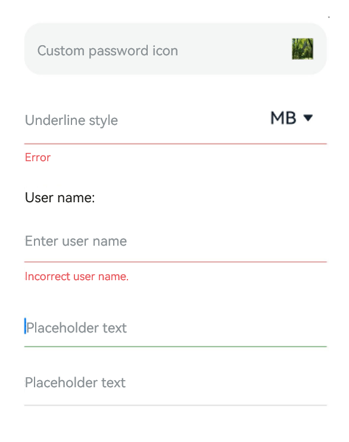
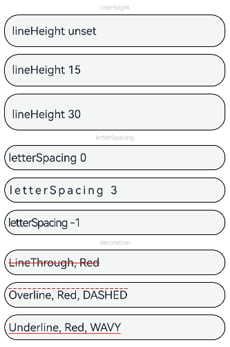
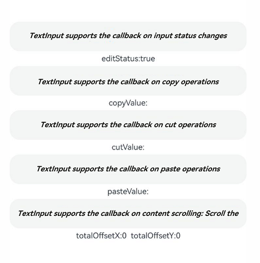

# TextInput
<!--Kit: ArkUI-->
<!--Subsystem: ArkUI-->
<!--Owner: @kangshihui-->
<!--Designer: @xiangyuan6-->
<!--Tester: @jiaoaozihao-->
<!--Adviser: @Brilliantry_Rui-->

The **TextInput** component provides single-line text input.

>  **NOTE**
>
>  This component is supported since API version 7. Updates will be marked with a superscript to indicate their earliest API version.
>
>  This component supports plain text only. For rich text, use the [RichEditor](ts-basic-components-richeditor.md) component.


## Child Components

Not supported


## APIs

TextInput(value?: TextInputOptions)

**Atomic service API**: This API can be used in atomic services since API version 11.

**System capability**: SystemCapability.ArkUI.ArkUI.Full

**Parameters**

| Name| Type| Mandatory| Description|
| ----- | ----- | ---- | ---- |
| value | [TextInputOptions](#textinputoptions) | No | Parameters of the **TextInput** component.|

## TextInputOptions

**TextInput** initialization parameters.

**Atomic service API**: This API can be used in atomic services since API version 11.

**System capability**: SystemCapability.ArkUI.ArkUI.Full

| Name| Type | Read-Only| Optional  | Description|
| ---- | ----- | ---- | ---- | ---- |
| placeholder             | [ResourceStr](ts-types.md#resourcestr)   | No   | Yes| Text displayed when there is no input.                            |
| text                    | [ResourceStr](ts-types.md#resourcestr)   | No   | Yes| Current text input.<br>You are advised to bind the state variable to the text in real time through the **onChange** event, so as to prevent display errors when the component is updated.<br>Since API version 10, this parameter supports two-way binding through [$$](../../../ui/state-management/arkts-two-way-sync.md).<br>Since API version 18, this parameter supports two-way binding through [!!](../../../ui/state-management/arkts-new-binding.md#two-way-binding-between-built-in-component-parameters).|
| controller<sup>8+</sup> | [TextInputController](#textinputcontroller8) | No   | Yes| Text input controller.                         |

## Attributes

In addition to the [universal attributes](ts-component-general-attributes.md), the following attributes are supported.

>  **NOTE**   
>  When no underline is set, the default value of the universal attribute [padding](ts-universal-attributes-size.md#padding) is as follows:<br>{<br>&nbsp;top: '8vp',<br>&nbsp;right: '16vp',<br>&nbsp;bottom: '8vp',<br>&nbsp;left: '16vp'<br> } 
>  
>  When an underline is set, the default value of **padding** is as follows:<br>{<br>&nbsp;top: '12vp',<br>&nbsp;right: '0vp',<br>&nbsp;bottom: '12vp',<br>&nbsp;left: '0vp'<br> }
>
>  When **padding** is set to **0** for the text input box, you can set [borderRadius](ts-universal-attributes-border.md#borderradius) to **0** to prevent the caret from being clipped. If the caret is displayed abnormally at the edge of the text box, check whether it is caused by the **padding** or **borderRadius** attribute.
>
>   Since API version 10, **.width('auto')** can be set for the **TextInput** component. Under this setting, the component auto-adapts its width to the text width, while respecting the **constraintSize** configuration and the maximum and minimum width restrictions received by the parent container. For details, see [Sizing](ts-universal-attributes-size.md).

### type

type(value: InputType)

Sets the text box type.

Different **InputType** values trigger corresponding keyboard types and enforce input restrictions.

**Atomic service API**: This API can be used in atomic services since API version 11.

**System capability**: SystemCapability.ArkUI.ArkUI.Full

**Parameters**

| Name| Type                           | Mandatory| Description                                     |
| ------ | ------------------------------- | ---- | ----------------------------------------- |
| value  | [InputType](#inputtype) | Yes  | Text box type.<br>Default value: **InputType.Normal**|

>  **NOTE**   
>  The password filling service requires a specific input box type.<!--RP2--><!--RP2End-->
>
>  In the [password mode](../../../ui/arkts-common-components-text-input.md#password-mode), the decoration line [decoration](#decoration12) and underline [showUnderline](#showunderline10) have no effect.

### placeholderColor

placeholderColor(value: ResourceColor)

Sets the placeholder text color.

**Atomic service API**: This API can be used in atomic services since API version 11.

**System capability**: SystemCapability.ArkUI.ArkUI.Full

**Parameters**

| Name| Type                                      | Mandatory| Description                                        |
| ------ | ------------------------------------------ | ---- | -------------------------------------------- |
| value  | [ResourceColor](ts-types.md#resourcecolor) | Yes  | Placeholder text color.<br>The default value follows the theme.<br>Default value on wearables: **'#99ffffff'**|

### placeholderFont

placeholderFont(value?: Font)

Sets the placeholder text style, including the font size, font weight, font family, and font style.

**Atomic service API**: This API can be used in atomic services since API version 11.

**System capability**: SystemCapability.ArkUI.ArkUI.Full

**Parameters**

| Name| Type                    | Mandatory| Description                 |
| ------ | ------------------------ | ---- | --------------------- |
| value  | [Font](ts-types.md#font) | No  | Placeholder text style.<br>Default value on wearables: **18fp**|

> **NOTE**
>
> You can use [loadFontSync](../../apis-arkgraphics2d/js-apis-graphics-text.md#loadfontsync) to register custom fonts.

### enterKeyType

enterKeyType(value: EnterKeyType)

Sets the type of the Enter key.

**Atomic service API**: This API can be used in atomic services since API version 11.

**System capability**: SystemCapability.ArkUI.ArkUI.Full

**Parameters**

| Name| Type                                            | Mandatory| Description                                            |
| ------ | ------------------------------------------------ | ---- | ------------------------------------------------ |
| value  | [EnterKeyType](#enterkeytype) | Yes  | Type of the Enter key.<br>Default value: **EnterKeyType.Done**|

### caretColor

caretColor(value: ResourceColor)

Sets the color of the caret in the text box.

**Atomic service API**: This API can be used in atomic services since API version 11.

**System capability**: SystemCapability.ArkUI.ArkUI.Full

**Parameters**

| Name| Type                                      | Mandatory| Description                                  |
| ------ | ------------------------------------------ | ---- | -------------------------------------- |
| value  | [ResourceColor](ts-types.md#resourcecolor) | Yes  | Color of the caret in the text box.<br>Default value: **'#007DFF'**|

>  **NOTE**    
>   Since API version 12, this API can be used to set the text handle color, which is the same as the caret color.

### maxLength

maxLength(value: number)

Sets the maximum number of characters for text input.

**Atomic service API**: This API can be used in atomic services since API version 11.

**System capability**: SystemCapability.ArkUI.ArkUI.Full

**Parameters**

| Name| Type  | Mandatory| Description                                                        |
| ------ | ------ | ---- | ------------------------------------------------------------ |
| value  | number | Yes  | Maximum number of characters for text input.<br>Default value: **Infinity**, indicating that there is no upper limit on the number of characters that can be entered<br>**NOTE**<br>If this attribute is not set or set to an invalid value, the default value is used. If a decimal value is provided, only its integer part is applied. If the value exceeds 2^31-1, exceptions may occur.|

### fontColor

fontColor(value: ResourceColor)

Sets the font color.

**Atomic service API**: This API can be used in atomic services since API version 11.

**System capability**: SystemCapability.ArkUI.ArkUI.Full

**Parameters**

| Name| Type                                      | Mandatory| Description      |
| ------ | ------------------------------------------ | ---- | ---------- |
| value  | [ResourceColor](ts-types.md#resourcecolor) | Yes  | Font color.<br>Default value on wearables: **'#dbffffff' **|

### fontSize

fontSize(value: Length)

Sets the font size.

**Atomic service API**: This API can be used in atomic services since API version 11.

**System capability**: SystemCapability.ArkUI.ArkUI.Full

**Parameters**

| Name| Type                        | Mandatory| Description                                                        |
| ------ | ---------------------------- | ---- | ------------------------------------------------------------ |
| value  | [Length](ts-types.md#length) | Yes  | Font size. If **fontSize** is of the number type, the unit fp is used. The default font size is 16 fp. The value cannot be a percentage.<br>Default value on wearables: **18fp**|

### fontStyle

fontStyle(value: FontStyle)

Sets the font style.

**Atomic service API**: This API can be used in atomic services since API version 11.

**System capability**: SystemCapability.ArkUI.ArkUI.Full

**Parameters**

| Name| Type                                       | Mandatory| Description                                   |
| ------ | ------------------------------------------- | ---- | --------------------------------------- |
| value  | [FontStyle](ts-appendix-enums.md#fontstyle) | Yes  | Font style.<br>Default value: **FontStyle.Normal**|

### fontWeight

fontWeight(value: number | FontWeight | ResourceStr)

Sets the font weight. If the value is too large, the text may be clipped depending on the font.

**Atomic service API**: This API can be used in atomic services since API version 11.

**System capability**: SystemCapability.ArkUI.ArkUI.Full

**Parameters**

| Name| Type                                                        | Mandatory| Description                                                        |
| ------ | ------------------------------------------------------------ | ---- | ------------------------------------------------------------ |
| value  | number&nbsp;\|&nbsp;[FontWeight](ts-appendix-enums.md#fontweight)&nbsp;\|&nbsp;[ResourceStr](ts-types.md#resourcestr) | Yes  | Font weight. For the number type, the value range is [100, 900], at an interval of 100. The default value is **400**. A larger value indicates a heavier font weight. For the string type, only strings that represent a number, for example, **400**, and the following enumerated values of **FontWeight** are supported: **bold**, **bolder**, **lighter**, **regular**, and **medium**.<br>Default value: **FontWeight.Normal**<br>The Resource type is supported since API version 20.|

### fontFamily

fontFamily(value: ResourceStr)

Sets the font family.

**Atomic service API**: This API can be used in atomic services since API version 11.

**System capability**: SystemCapability.ArkUI.ArkUI.Full

**Parameters**

| Name| Type                                  | Mandatory| Description                                                        |
| ------ | -------------------------------------- | ---- | ------------------------------------------------------------ |
| value  | [ResourceStr](ts-types.md#resourcestr) | Yes  | Font family. Default font: **'HarmonyOS Sans'**<br>To specify multiple fonts, separate them with commas (,), and fonts are applied in priority order. Example: **'Arial, HarmonyOS Sans'**.<br>The 'HarmonyOS Sans' font and custom fonts are supported for applications.<br>Only the **'HarmonyOS Sans'** font is supported for widgets.|

> **NOTE**
>
> You are advised to use [loadFontSync](../../apis-arkgraphics2d/js-apis-graphics-text.md#loadfontsync) to register custom fonts.

### inputFilter<sup>8+</sup>

inputFilter(value: ResourceStr, error?: Callback\<string>)

Sets the regular expression for input filtering. Only inputs that comply with the regular expression can be displayed. Other inputs are filtered out.

For single-character input scenarios, only single-character matching is supported; for multi-character input scenarios (such as pasting), string matching is supported.

Since API version 11, setting **inputFilter** with a non-empty string invalidates the text filtering effect attached to the [type](#type) API.

**Atomic service API**: This API can be used in atomic services since API version 11.

**System capability**: SystemCapability.ArkUI.ArkUI.Full

**Parameters**

| Name| Type                                  | Mandatory| Description                              |
| ------ | -------------------------------------- | ---- | ---------------------------------- |
| value  | [ResourceStr](ts-types.md#resourcestr) | Yes  | Regular expression.                      |
| error  | Callback\<string>                | No  | Filtered-out content to return when regular expression matching fails.|

### copyOption<sup>9+</sup>

copyOption(value: CopyOptions)

Sets whether the input text can be copied. If this attribute is set to **CopyOptions.None**, only paste and select all operations are supported.

If this attribute is set to **CopyOptions.None**, drag and drop operations are not supported.

**Atomic service API**: This API can be used in atomic services since API version 11.

**System capability**: SystemCapability.ArkUI.ArkUI.Full

**Parameters**

| Name| Type                                            | Mandatory| Description                                                        |
| ------ | ------------------------------------------------ | ---- | ------------------------------------------------------------ |
| value  | [CopyOptions](ts-appendix-enums.md#copyoptions9) | Yes  | Whether the input text can be copied.<br>Default value: **CopyOptions.LocalDevice**|

### showPasswordIcon<sup>9+</sup>

showPasswordIcon(value: boolean)

Sets whether to display the password icon at the end of the password text box.

**Atomic service API**: This API can be used in atomic services since API version 11.

**System capability**: SystemCapability.ArkUI.ArkUI.Full

**Parameters**

| Name| Type   | Mandatory| Description                                                       |
| ------ | ------- | ---- | ----------------------------------------------------------- |
| value  | boolean | Yes  | Whether to display the password icon at the end of the password text box.<br>**true** to display, **false** otherwise.<br>Default value: **false** for TV devices; **true** for other devices|

### style<sup>9+</sup>

style(value: TextInputStyle &nbsp;|&nbsp;TextContentStyle)

Sets the text input style. The inline style only supports **InputType.Normal**.<br>For details about the text box types, see [type](#type).

**Atomic service API**: This API can be used in atomic services since API version 11.

**System capability**: SystemCapability.ArkUI.ArkUI.Full

**Parameters**

| Name| Type                                                        | Mandatory| Description                                                        |
| ------ | ------------------------------------------------------------ | ---- | ------------------------------------------------------------ |
| value  | [TextInputStyle](#textinputstyle9)&nbsp;\|&nbsp;[TextContentStyle](ts-appendix-enums.md#textcontentstyle10) | Yes  | Text input style.<br>Default value: **TextInputStyle.Default**|

### textAlign<sup>9+</sup>

textAlign(value: TextAlign)

Sets the horizontal alignment of the text.

Available options are **TextAlign.Start**, **TextAlign.Center**, and **TextAlign.End**. **TextAlign.JUSTIFY** behaves the same as **TextAlign.Start**.

You can use the [align](ts-universal-attributes-location.md#align) attribute to control the vertical position of a text paragraph. In this component, the **align** attribute cannot be used to control the horizontal position of a text paragraph.

- **Alignment.TopStart**, **Alignment.Top**, **Alignment.TopEnd**: Content aligns to the top.

- **Alignment.Start**, **Alignment.Center**, **Alignment.End**: Content is centered vertically.

- **Alignment.BottomStart**, **Alignment.Bottom**, **Alignment.BottomEnd:** Content aligns to the bottom.

**Atomic service API**: This API can be used in atomic services since API version 11.

**System capability**: SystemCapability.ArkUI.ArkUI.Full

**Parameters**

| Name| Type                                       | Mandatory| Description                                                      |
| ------ | ------------------------------------------- | ---- | ---------------------------------------------------------- |
| value  | [TextAlign](ts-appendix-enums.md#textalign) | Yes  | Horizontal alignment of the text.<br>Default value: **TextAlign.Start**|

>  **NOTE** 
>
>  **textAlign** only adjusts the overall text layout and does not affect character display order. For character display order adjustment, see [Bidirectional Text Layout and Alignment](../../../ui/arkts-internationalization.md#bidirectional-text-layout-and-alignment).

### textDirection<sup>23+</sup>

textDirection(direction: TextDirection | undefined)

Specifies the text layout direction. If this attribute is not set, the default text layout direction follows the component layout direction.

**Atomic service API**: This API can be used in atomic services since API version 23.

**System capability**: SystemCapability.ArkUI.ArkUI.Full

**Parameters**

| Name| Type                                       | Mandatory| Description                                                      |
| ------ | ------------------------------------------- | ---- | ---------------------------------------------------------- |
| direction  | [TextDirection](ts-text-common.md#textdirection22) \| undefined | Yes  | Text layout direction.<br>If this parameter is set to **undefined**, the text layout direction follows the component layout direction as defined by **TextDirection.DEFAULT**.|

### selectedBackgroundColor<sup>10+</sup>

selectedBackgroundColor(value: ResourceColor)

Sets the background color of the selected text. If the opacity is not set, a 20% opacity will be used.

**Atomic service API**: This API can be used in atomic services since API version 11.

**System capability**: SystemCapability.ArkUI.ArkUI.Full

**Parameters**

| Name| Type                                      | Mandatory| Description                                      |
| ------ | ------------------------------------------ | ---- | ------------------------------------------ |
| value  | [ResourceColor](ts-types.md#resourcecolor) | Yes  | Background color of the selected text.|

### caretStyle<sup>10+</sup>

caretStyle(value: CaretStyle)

Sets the caret style.

**Atomic service API**: This API can be used in atomic services since API version 11.

**System capability**: SystemCapability.ArkUI.ArkUI.Full

**Parameters**

| Name| Type                               | Mandatory| Description        |
| ------ | ----------------------------------- | ---- | ------------ |
| value  | [CaretStyle](ts-text-common.md#caretstyle10) | Yes  | Caret style.|

>  **NOTE**
>
>   When the **color** parameter is configured in both the **caretColor** and **caretStyle** attributes, the later-set value takes precedence.
>     
>   Since API version 12, this API can be used to set the text handle color, which is the same as the caret color.

### caretPosition<sup>10+</sup>

caretPosition(value: number)

Sets the caret position.

**Atomic service API**: This API can be used in atomic services since API version 11.

**System capability**: SystemCapability.ArkUI.ArkUI.Full

**Parameters**

| Name| Type  | Mandatory| Description        |
| ------ | ------ | ---- | ------------ |
| value  | number | Yes  | Caret position.<br>The position before the first character is 0.|

### showUnit<sup>10+</sup>

showUnit(value: CustomBuilder)

Sets the unit displayed with the text box. This attribute effective only when [showUnderline](#showunderline10) is set to **true**.

**Atomic service API**: This API can be used in atomic services since API version 11.

**System capability**: SystemCapability.ArkUI.ArkUI.Full

**Parameters**

| Name| Type                                       | Mandatory| Description                          |
| ------ | ------------------------------------------- | ---- | ------------------------------ |
| value  | [CustomBuilder](ts-types.md#custombuilder8) | Yes  | Unit displayed with the text box.|

### showError<sup>10+</sup>

showError(value?: ResourceStr | undefined)

Sets the error message displayed when an error occurs.

If the data type is **ResourceStr** and the input content does not comply with specifications, the error message is displayed. If the error message does not fit in one line, an ellipsis is displayed to represent clipped text. If the data type is **undefined**, no error message is displayed. For details, see [Example 2](#example-2-setting-underlines).

**Atomic service API**: This API can be used in atomic services since API version 11.

**System capability**: SystemCapability.ArkUI.ArkUI.Full

**Parameters**

| Name| Type                         | Mandatory| Description                                                        |
| ------ | ----------------------------- | ---- | ------------------------------------------------------------ |
| value  | [ResourceStr](ts-types.md#resourcestr)&nbsp;\|&nbsp;undefined | No  | Error message displayed when an error occurs.<br>By default, no error message is displayed.<br>On wearables, the font size is 13 fp and the alignment mode is center alignment.<br>**NOTE**<br>The Resource type is supported since API version 12.|

### showUnderline<sup>10+</sup>

showUnderline(value: boolean)

Sets whether to enable an underline.

**Atomic service API**: This API can be used in atomic services since API version 11.

**System capability**: SystemCapability.ArkUI.ArkUI.Full

**Parameters**

| Name| Type   | Mandatory| Description                              |
| ------ | ------- | ---- | ---------------------------------- |
| value  | boolean | Yes  | Whether to enable an underline.<br>**true** to enable, **false** otherwise.<br>Default value: **false**<br>By default, the underline comes in the color of **'#33182431'**, thickness of 1 px, and text box size of 48 vp. The underline is only available for the **InputType.Normal** type.|

>  **NOTE**
>
>  In the [password mode](../../../ui/arkts-common-components-text-input.md#password-mode), the decoration line [decoration](#decoration12) and underline [showUnderline](#showunderline10) have no effect.

### passwordIcon<sup>10+</sup>

passwordIcon(value: PasswordIcon)

Sets the password icon to display at the end of the password text box.

Images in JPG, PNG, BMP, HEIC, and WEBP formats are supported.

**Atomic service API**: This API can be used in atomic services since API version 11.

**System capability**: SystemCapability.ArkUI.ArkUI.Full

**Parameters**

| Name| Type                                   | Mandatory| Description                                                        |
| ------ | --------------------------------------- | ---- | ------------------------------------------------------------ |
| value  | [PasswordIcon](#passwordicon10) | Yes  | Password icon to display at the end of the password text box.<br>By default, the system-provided icon is used.<br>The icon size is fixed at 24 vp (or 28 vp on wearables), regardless of the source image size.|

### enableKeyboardOnFocus<sup>10+</sup>

enableKeyboardOnFocus(value: boolean)

Sets whether to pop up the soft keyboard when the **TextInput** component obtains focus in a way other than clicking.

Since API version 10, the **TextInput** component is bound to the input method by default when it obtains focus.

**Atomic service API**: This API can be used in atomic services since API version 11.

**System capability**: SystemCapability.ArkUI.ArkUI.Full

**Parameters**

| Name| Type   | Mandatory| Description                                                       |
| ------ | ------- | ---- | ----------------------------------------------------------- |
| value  | boolean | Yes  | Whether to pop up the soft keyboard when the **TextInput** component obtains focus in a way other than clicking.<br>**true**: The soft keyboard pops up. **false**: The soft keyboard does not pop up.<br>Default value: **false** for TV devices; **true** for other devices|

### selectionMenuHidden<sup>10+</sup>

selectionMenuHidden(value: boolean)

Sets whether to hide the system text selection menu.

**Atomic service API**: This API can be used in atomic services since API version 11.

**System capability**: SystemCapability.ArkUI.ArkUI.Full

**Parameters**

| Name| Type   | Mandatory| Description                                                        |
| ------ | ------- | ---- | ------------------------------------------------------------ |
| value  | boolean | Yes  | Whether to hide the system text selection menu.<br>**true**: The system text selection menu is hidden when a user clicks the text box cursor, long-presses the text box, double-taps the text box, triple-taps the text box, or right-clicks the text box.<br>**false**: The system text selection menu is displayed.<br>Default value: **false**|

### barState<sup>10+</sup>

barState(value: BarState)

Sets the scrollbar display mode for the inline style in the editing state.

**Atomic service API**: This API can be used in atomic services since API version 11.

**System capability**: SystemCapability.ArkUI.ArkUI.Full

**Parameters**

| Name| Type                                     | Mandatory| Description                                                        |
| ------ | ----------------------------------------- | ---- | ------------------------------------------------------------ |
| value  | [BarState](ts-appendix-enums.md#barstate) | Yes  | Scrollbar display mode for the inline style in the editing state.<br>Default value: **BarState.Auto**|

### maxLines<sup>10+</sup>

maxLines(value: number)

Sets the maximum number of lines that can be displayed with the inline style in the editing state.

**Atomic service API**: This API can be used in atomic services since API version 11.

**System capability**: SystemCapability.ArkUI.ArkUI.Full

**Parameters**

| Name| Type                                     | Mandatory| Description                                                        |
| ------ | ----------------------------------------- | ---- | ------------------------------------------------------------ |
| value  | number | Yes  | Maximum number of lines that can be displayed with the inline style in the editing state.<br>Default value: **3**<br>Value range: (0, UINT32_MAX]|

### customKeyboard<sup>10+</sup>

customKeyboard(value: CustomBuilder | ComponentContent | undefined, options?: KeyboardOptions)

Sets a custom keyboard.

When a custom keyboard is set, activating the text box opens the specified custom component, instead of the system input method.

The custom keyboard's height can be set through the **height** attribute of the custom component's root node, and its width is fixed at the default value.

The custom keyboard is presented by overlaying the original screen, which is not compressed or lifted if avoid mode is not enabled or avoidance is not needed for the text box.

The custom keyboard cannot obtain the focus, but it blocks gesture events.

By default, the custom keyboard is closed when the input component loses the focus. You can also use the [TextInputController](#textinputcontroller8).[stopEditing](#stopediting10) API to close the keyboard.

When setting a custom keyboard, you can bind the [onKeyPreIme](ts-universal-events-key.md#onkeypreime12) event to prevent input from the physical keyboard.

From API version 23, the [setCustomKeyboardContinueFeature](../arkts-apis-uicontext-uicontext.md#setcustomkeyboardcontinuefeature23) API can be used to enable the continuation feature for custom keyboards. When switching between custom keyboards, the system changes the keyboard directly without triggering the close and open animations.

> **NOTE**
>
> This API cannot be called within [attributeModifier](ts-universal-attributes-attribute-modifier.md#attributemodifier).

**Atomic service API**: This API can be used in atomic services since API version 11.

**System capability**: SystemCapability.ArkUI.ArkUI.Full

**Parameters**

| Name               | Type                                       | Mandatory| Description                                                        |
| --------------------- | ------------------------------------------- | ---- | ------------------------------------------------------------ |
| value                 | [CustomBuilder](ts-types.md#custombuilder8) \| [ComponentContent](../js-apis-arkui-ComponentContent.md#componentcontent-1)<sup>22+</sup> \| undefined<sup>22+</sup> | Yes  | Custom keyboard. If the value is **undefined**, the custom keyboard is closed.|
| options<sup>12+</sup> | [KeyboardOptions](ts-basic-components-richeditor.md#keyboardoptions12)       | No  | Whether to support keyboard avoidance.                            |

### enableAutoFill<sup>11+</sup>

enableAutoFill(value: boolean)

Sets whether to enable autofill.<!--RP6--><!--RP6End-->

**Atomic service API**: This API can be used in atomic services since API version 12.

**System capability**: SystemCapability.ArkUI.ArkUI.Full

**Parameters**

| Name| Type   | Mandatory| Description                                                        |
| ------ | ------- | ---- | ------------------------------------------------------------ |
| value  | boolean | Yes  | Whether to enable autofill.<br>**true** to enable; **false** otherwise.<br>Default value: **true**|

### enableSelectedDataDetector<sup>22+</sup>

enableSelectedDataDetector(enable: boolean | undefined)

Sets whether to enable entity recognition for selected text. This API only works on devices that provide text recognition.

When **enableSelectedDataDetector** is set to **true**, all entity types are recognized by default.

This feature is only effective when [CopyOptions](ts-appendix-enums.md#copyoptions9) is set to **CopyOptions.LocalDevice** or **CopyOptions.CrossDevice**.

**Atomic service API**: This API can be used in atomic services since API version 22.

**System capability**: SystemCapability.ArkUI.ArkUI.Full

**Parameters**

| Name| Type   | Mandatory| Description                             |
| ------ | ------- | ---- | --------------------------------- |
| enable  | boolean \| undefined | Yes  | Whether to enable entity recognition for selected text.<br>**true**: Entity recognition is enabled. **false**: Entity recognition is disabled. Default value: **true**|

### passwordRules<sup>11+</sup>

passwordRules(value: string)

Defines the rules for generating passwords. When autofill is used, these rules are transparently transmitted to Password Vault for generating a new password.<!--RP1--><!--RP1End-->

**Atomic service API**: This API can be used in atomic services since API version 12.

**System capability**: SystemCapability.ArkUI.ArkUI.Full

**Parameters**

| Name| Type  | Mandatory| Description                |
| ------ | ------ | ---- | -------------------- |
| value  | string | Yes  | Rules for generating passwords.|

### cancelButton<sup>11+</sup>

cancelButton(options: CancelButtonOptions)

Sets the style of the cancel button on the right. Only icons of the image type are supported. The inline style is not supported. For details, see [Example 4 Customizing the Cancel Button Style on the Right](#example-4-customizing-the-cancel-button-style-on-the-right).

**Atomic service API**: This API can be used in atomic services since API version 12.

**System capability**: SystemCapability.ArkUI.ArkUI.Full

**Parameters**

| Name| Type                                                        | Mandatory| Description                                                        |
| ------ | ------------------------------------------------------------ | ---- | ------------------------------------------------------------ |
| options  | [CancelButtonOptions](ts-basic-components-search.md#cancelbuttonoptions12) | Yes  | Options of the cancel button on the right.<br>Default value:<br>{<br>style: CancelButtonStyle.INPUT<br>}<br>Default value on wearables: **28vp**|

### selectAll<sup>11+</sup>

selectAll(value: boolean)

Sets whether to select all text in the initial state. The inline style is not supported.

**Atomic service API**: This API can be used in atomic services since API version 12.

**System capability**: SystemCapability.ArkUI.ArkUI.Full

**Parameters**

| Name| Type   | Mandatory| Description                             |
| ------ | ------- | ---- | --------------------------------- |
| value  | boolean | Yes  | Whether to select all text in the initial state.<br>**true**: Selecting all text is enabled. **false**: Selecting all text is disabled.<br>Default value: **false**|

### showCounter<sup>11+</sup>

showCounter(value: boolean, options?: InputCounterOptions)

Sets the character counter displayed when the number of characters entered exceeds the threshold. If the **showCounter** API is not called, the character counter is not displayed by default.

**options** can be set only when **value** is set to **true**, in which case a character counter is displayed below the text box. This attribute must be used together with [maxLength](#maxlength). The character counter is displayed in this format: Number of characters entered/Character limit.

It is visible when the number of characters entered is greater than the character limit multiplied by the threshold percentage value. If **options** is not set, the text box border and character counter subscript turn red when the number of characters entered exceeds the limit. If **value** is set to **true** and [InputCounterOptions](ts-universal-attributes-text-style.md#inputcounteroptions11) is set, the text box border and character counter subscript turn red and the text box shakes when the number of characters entered reaches the limit, provided that the value of **thresholdPercentage** is valid. If **highlightBorder** is set to **false**, the text box border does not turn red. By default, **highlightBorder** is set to **true**.

The character counter is not displayed in the inline style and [password mode](../../../ui/arkts-common-components-text-input.md#password-mode).

[Example 5: Setting a Character Counter](#example-5-setting-a-character-counter) shows the effect of setting **showCounter**.

>**NOTE**
>
> This API can be called within [attributeModifier](ts-universal-attributes-attribute-modifier.md#attributemodifier) since API version 12.

**Atomic service API**: This API can be used in atomic services since API version 11.

**System capability**: SystemCapability.ArkUI.ArkUI.Full

**Parameters**

| Name               | Type                                                 | Mandatory| Description            |
| --------------------- | ----------------------------------------------------- | ---- | ---------------- |
| value                 | boolean                                               | Yes  | Whether to display the character counter.<br>**true**: Character counter is displayed. **false**: Character counter is not displayed.|
| options | [InputCounterOptions](ts-universal-attributes-text-style.md#inputcounteroptions11) | No  | Configuration options for the character counter.|

### contentType<sup>12+</sup>

contentType(value: ContentType)

Sets the content type for autofill.<!--RP7--><!--RP7End-->

**Atomic service API**: This API can be used in atomic services since API version 12.

**System capability**: SystemCapability.ArkUI.ArkUI.Full

**Parameters**

| Name| Type                                 | Mandatory| Description          |
| ------ | ------------------------------------- | ---- | -------------- |
| value  | [ContentType](#contenttype12) | Yes  | Content type for autofill.|

### underlineColor<sup>12+</sup>

underlineColor(value: ResourceColor|UnderlineColor|undefined)

Color of the underline.

When [showUnderline](#showunderline10) is enabled, the underline color can be configured.

**Atomic service API**: This API can be used in atomic services since API version 12.

**System capability**: SystemCapability.ArkUI.ArkUI.Full

**Parameters**

| Name| Type                                                        | Mandatory| Description                                                        |
| ------ | ------------------------------------------------------------ | ---- | ------------------------------------------------------------ |
| value  | [ResourceColor](ts-types.md#resourcecolor) \| [UnderlineColor](#underlinecolor12) \| undefined| Yes  | Color of the underline.<br>The underline color changes with the underline mode. If the underline color is only set for the normal state, you can directly enter a value of the ResourceColor type. If the value specified is **undefined**, **null**, or invalid, all underlines are restored to the default value.<br>Default value: underline color configured for the theme. The default underline color in the theme is **'#33182431'**.|

### lineHeight<sup>12+</sup>

lineHeight(value: number | string | Resource)

Sets the text line height.

If the value is less than or equal to **0**, the line height is unrestricted and adapts to the font size. When the value is a number, the unit is fp. For the string type, numeric string values with optional units, for example, **"10"** or **"10fp"**, are supported.

> **NOTE**
>  
> - If certain characters have significantly taller glyphs than others in the same line, layout anomalies such as clipping, overlapping, or misalignment may occur. In this case, adjust component attributes such as height and line height to ensure proper layout rendering.
> 
> - When the [password mode](../../../ui/arkts-common-components-text-input.md#password-mode) is set, [lineHeight](#lineheight12) set by this API does not take effect.

**Atomic service API**: This API can be used in atomic services since API version 12.

**System capability**: SystemCapability.ArkUI.ArkUI.Full

**Parameters**

| Name| Type                                                        | Mandatory| Description            |
| ------ | ------------------------------------------------------------ | ---- | ---------------- |
| value  | number&nbsp;\|&nbsp;string&nbsp;\|&nbsp;[Resource](ts-types.md#resource) | Yes  | Text line height.|

### decoration<sup>12+</sup>

decoration(value: TextDecorationOptions)

Sets the color, type, and style of the text decorative line.

**Atomic service API**: This API can be used in atomic services since API version 12.

**System capability**: SystemCapability.ArkUI.ArkUI.Full

**Parameters**

| Name| Type                                                        | Mandatory| Description                                                        |
| ------ | ------------------------------------------------------------ | ---- | ------------------------------------------------------------ |
| value  | [TextDecorationOptions](ts-universal-attributes-text-style.md#textdecorationoptions12) | Yes  | Text decorative line options.<br>Default value: {<br>&nbsp;type:&nbsp;TextDecorationType.None,<br>&nbsp;color:&nbsp;Color.Black,<br>&nbsp;style:&nbsp;TextDecorationStyle.SOLID,<br>&nbsp;thicknessScale:&nbsp;1.0<br>} |

>  **NOTE**
>
>  When the bottom contour of a character intersects with the decoration, underline avoidance is triggered, commonly affecting characters like "g", "j", "y", "q", and "p".
>
>  If the decoration color is set to **Color.Transparent**, it inherits the text color of the first character in each line. If the decoration color is set to **"#00FFFFFF"**, the line becomes fully transparent.
> 
>  In the [password mode](../../../ui/arkts-common-components-text-input.md#password-mode), the decoration line [decoration](#decoration12) and underline [showUnderline](#showunderline10) have no effect.

### letterSpacing<sup>12+</sup>

letterSpacing(value: number | string | Resource)

Sets the letter spacing for a text style. If the value specified is a percentage or **0**, the default value is used. For the string type, numeric string values with optional units, for example, **"10"** or **"10fp"**, are supported.

If the value specified is a negative value, the text is compressed. A negative value too small may result in the text being compressed to 0 and no content being displayed.

This setting applies to every character, including those at line endings.

**Atomic service API**: This API can be used in atomic services since API version 12.

**System capability**: SystemCapability.ArkUI.ArkUI.Full

**Parameters**

| Name| Type                      | Mandatory| Description          |
| ------ | -------------------------- | ---- | -------------- |
| value  | number&nbsp;\|&nbsp;string&nbsp;\|&nbsp;[Resource](ts-types.md#resource) | Yes  | Letter spacing.<br>Unit: [fp](ts-pixel-units.md)|

### fontFeature<sup>12+</sup>

fontFeature(value: string)

Sets the font feature, for example, monospaced digits.

Format: normal \| \<feature-tag-value\>

Format of **\<feature-tag-value\>**: \<string\> \[ \<integer\> \| on \| off ]

There can be multiple **\<feature-tag-value\>** values, which are separated by commas (,).

For example, the input format for monospaced clock fonts is "ss01" on.

**Atomic service API**: This API can be used in atomic services since API version 12.

**System capability**: SystemCapability.ArkUI.ArkUI.Full

**Parameters**

| Name| Type  | Mandatory| Description          |
| ------ | ------ | ---- | -------------- |
| value  | string | Yes  | Font feature.|

For details about the supported font features, see the [font feature list](ts-basic-components-text.md#fontfeature12).

Font features are advanced typographic features, such as ligatures and monospace, for OpenType fonts. They are typically used in custom fonts and require the support of the font itself.

For more information about the font features, see [Low-level font feature settings control: the font-feature-settings property](https://www.w3.org/TR/css-fonts-3/#font-feature-settings-prop) and [The Complete CSS Demo for OpenType Features](https://sparanoid.com/lab/opentype-features/).

>  **NOTE**
>
>  When the [password mode](../../../ui/arkts-common-components-text-input.md#password-mode) is set, the **fontFeature** attribute cannot be used to set the text style.

### wordBreak<sup>12+</sup>

wordBreak(value: WordBreak)

Sets the word break rule. This attribute takes effect when the inline style is set for the component, but has no effect on placeholder text.

**Atomic service API**: This API can be used in atomic services since API version 12.

**System capability**: SystemCapability.ArkUI.ArkUI.Full

**Parameters**

| Name| Type                                         | Mandatory| Description                                         |
| ------ | --------------------------------------------- | ---- | --------------------------------------------- |
| value  | [WordBreak](ts-appendix-enums.md#wordbreak11) | Yes  | Word break rule in the inline style.<br>Default value: **WordBreak.BREAK_WORD**|

>  **NOTE**
>
>  The component does not support the **clip** attribute. Therefore, setting this attribute does not affect text clipping.

### textOverflow<sup>12+</sup>

textOverflow(value: TextOverflow)

Sets the display mode for overflowing text. This attribute is supported only in the editing and non-editing states of the inline style.

Chinese text is truncated by character. English text is truncated by word. To truncate English text by letter, set **wordBreak** to **WordBreak.BREAK_ALL**.

When **overflow** is set to **TextOverflow.None**, the effect is the same as **TextOverflow.Clip**.

**Atomic service API**: This API can be used in atomic services since API version 12.

**System capability**: SystemCapability.ArkUI.ArkUI.Full

**Parameters**

| Name| Type                                                         | Mandatory| Description                                                                                               |
| ------ | ------------------------------------------------------------ | ---- | -------------------------------------------------------------------------------------------------- |
| value  | [TextOverflow](ts-appendix-enums.md#textoverflow)            | Yes  | Display mode of overflowing text.<br>Default value for the inline style in the non-editing state: **TextOverflow.Ellipsis**<br>Default value for the inline style in the editing state: **TextOverflow.Clip**                    |

>  **NOTE** 
>   The **TextInput** component does not support the **TextOverflow.MARQUEE** mode. When the **TextOverflow.MARQUEE** mode is set, the **TextOverflow.Ellipsis** mode is used for the non-editing state of the inline style, and **TextOverflow.Clip** mode is used for the editing state of the inline style as well as for the non-inline mode.
>
>  If inline mode is not set, the text displays in the default style, and any **textOverflow** setting will not take effect.

### textIndent<sup>12+</sup>

textIndent(value: Dimension)

Sets the indent of the first line text.

**Atomic service API**: This API can be used in atomic services since API version 12.

**System capability**: SystemCapability.ArkUI.ArkUI.Full

**Parameters**

| Name| Type                                 | Mandatory| Description                        |
| ------ | ------------------------------------ | ---- | ---------------------------- |
| value  | [Dimension](ts-types.md#dimension10) | Yes  | Indent of the first line text.<br>Default value: **0**|

### minFontSize<sup>12+</sup>

minFontSize(value: number | string | Resource)

Sets the minimum font size. For the string type, numeric string values with optional units, for example, **"10"** or **"10fp"**, are supported.

This attribute takes effect only when used together with [maxFontSize](#maxfontsize12) and [maxLines](#maxlines10) (for the editing state of the inline style), or layout constraint settings.

When the adaptive font size is used, the **fontSize** settings do not take effect.

If the value of **minFontSize** is less than or equal to 0, the adaptive font sizing feature is disabled. In such cases, the [fontSize](#fontsize) attribute is used instead. If **fontSize** is not set, the default value will apply.

**Atomic service API**: This API can be used in atomic services since API version 12.

**System capability**: SystemCapability.ArkUI.ArkUI.Full

**Parameters**

| Name| Type                                                        | Mandatory| Description              |
| ------ | ------------------------------------------------------------ | ---- | ------------------ |
| value  | number&nbsp;\|&nbsp;string&nbsp;\|&nbsp;[Resource](ts-types.md#resource) | Yes  | Minimum font size.<br>Unit: [fp](ts-pixel-units.md)|

### maxFontSize<sup>12+</sup>

maxFontSize(value: number | string | Resource)

Sets the maximum font size. For the string type, numeric string values with optional units, for example, **"10"** or **"10fp"**, are supported.

This attribute takes effect only when used together with [minFontSize](#minfontsize12) and [maxLines](#maxlines10) (for the editing state of the inline style), or layout constraint settings.

When the adaptive font size is used, the **fontSize** settings do not take effect.

If the value of **maxFontSize** is less than or equal to 0 or is less than the value of **minFontSize**, the adaptive font sizing feature is disabled. In such cases, the [fontSize](#fontsize) attribute is used instead. If **fontSize** is not set, the default value will apply.

**Atomic service API**: This API can be used in atomic services since API version 12.

**System capability**: SystemCapability.ArkUI.ArkUI.Full

**Parameters**

| Name| Type                                                        | Mandatory| Description              |
| ------ | ------------------------------------------------------------ | ---- | ------------------ |
| value  | number&nbsp;\|&nbsp;string&nbsp;\|&nbsp;[Resource](ts-types.md#resource) | Yes  | Maximum font size.<br>Unit: [fp](ts-pixel-units.md)|

### heightAdaptivePolicy<sup>12+</sup>

heightAdaptivePolicy(value: TextHeightAdaptivePolicy)

Sets how the adaptive height is determined for the text in the inline style.

When this attribute is set to **TextHeightAdaptivePolicy.MAX_LINES_FIRST**, the [maxLines](#maxlines10) attribute takes precedence for adjusting the text height. If the **maxLines** setting results in a layout beyond the layout constraints, the text will shrink to a font size between [minFontSize](#minfontsize12) and [maxFontSize](#maxfontsize12) to allow for more content to be shown.

If this attribute is set to **TextHeightAdaptivePolicy.MIN_FONT_SIZE_FIRST**, the **minFontSize** attribute takes precedence for adjusting the text height. If the text can fit in one line with the **minFontSize** setting, the text will enlarge to the maximum available font size between **minFontSize** and **maxFontSize**.

**TextHeightAdaptivePolicy.LAYOUT_CONSTRAINT_FIRST** produces the same effect as **TextHeightAdaptivePolicy.MIN_FONT_SIZE_FIRST**.

When the component is in the non-inline style, the three values of **TextHeightAdaptivePolicy** have the same effect, that is, the text will shrink to a font size between **minFontSize** and **maxFontSize** to allow for more content to be shown.

>  **NOTE**
>
>  If the text box is in the inline style, the font size in the editing state is different from that in the non-editing state.

**Atomic service API**: This API can be used in atomic services since API version 12.

**System capability**: SystemCapability.ArkUI.ArkUI.Full

**Parameters**

| Name| Type                                                        | Mandatory| Description                                                        |
| ------ | ------------------------------------------------------------ | ---- | ------------------------------------------------------------ |
| value  | [TextHeightAdaptivePolicy](ts-appendix-enums.md#textheightadaptivepolicy10) | Yes  | How the adaptive height is determined for the text.<br>Default value: **TextHeightAdaptivePolicy.MAX_LINES_FIRST**|

### showPassword<sup>12+</sup>

showPassword(visible: boolean)

Sets whether to show the password.

This API has effect only when the [input type](#inputtype) is set to **Password**, **NEWPASSWORD**, or **NUMBERPASSWORD** mode. It does not work in other modes.

In the [password mode](../../../ui/arkts-common-components-text-input.md#password-mode), inconsistencies between the backend state of the text box and the frontend application's state management variables may cause abnormal behavior of the trailing icon. To avoid such issues, use the [onSecurityStateChange](#onsecuritystatechange12) callback to sync the states. For details, see [Example 1: Setting and Obtaining the Caret Position](#example-1-setting-and-obtaining-the-caret-position).

**Atomic service API**: This API can be used in atomic services since API version 12.

**System capability**: SystemCapability.ArkUI.ArkUI.Full

**Parameters**

| Name| Type                                                        | Mandatory| Description                                                        |
| ------ | ------------------------------------------------------------ | ---- | ------------------------------------------------------------ |
| visible  | boolean | Yes | Whether to show the password.<br>**true**: The password is shown. **false**: The password is not shown.<br>Default value: **false**|

### lineBreakStrategy<sup>12+</sup>

lineBreakStrategy(strategy: LineBreakStrategy)

Sets the line break rule. This attribute takes effect when **wordBreak** is not set to **breakAll**. Hyphens are not supported.

**Atomic service API**: This API can be used in atomic services since API version 12.

**System capability**: SystemCapability.ArkUI.ArkUI.Full

**Parameters**

| Name  | Type                                                        | Mandatory| Description                                                        |
| -------- | ------------------------------------------------------------ | ---- | ------------------------------------------------------------ |
| strategy | [LineBreakStrategy](ts-appendix-enums.md#linebreakstrategy12) | Yes  | Line break rule.<br>Default value: **LineBreakStrategy.GREEDY**<br>**NOTE**<br>This attribute takes effect only when the inline style is set.|

### editMenuOptions<sup>12+</sup>

editMenuOptions(editMenu: EditMenuOptions)

Sets the extended options of the custom menu, including the text content, icon, and callback.

When [disableMenuItems](../arkts-apis-uicontext-textmenucontroller.md#disablemenuitems20) or [disableSystemServiceMenuItems](../arkts-apis-uicontext-textmenucontroller.md#disablesystemservicemenuitems20) is used to disable system service menu items in the text selection menu, the disabled menu options will be excluded from the parameter list in the [onCreateMenu](./ts-text-common.md#oncreatemenu12) callback of **editMenuOptions**.

**Atomic service API**: This API can be used in atomic services since API version 12.

**System capability**: SystemCapability.ArkUI.ArkUI.Full

**Parameters**

| Name| Type                                         | Mandatory| Description                                         |
| ------ | --------------------------------------------- | ---- | --------------------------------------------- |
| editMenu  | [EditMenuOptions](ts-text-common.md#editmenuoptions) | Yes  | Extended options of the custom menu.|

### enablePreviewText<sup>12+</sup>

enablePreviewText(enable: boolean)

Sets whether to enable preview text.

The preview content is defined as a temporary, uncommitted input state. Currently, the text interception function is not supported.

**Atomic service API**: This API can be used in atomic services since API version 12.

**System capability**: SystemCapability.ArkUI.ArkUI.Full

**Parameters**

| Name| Type   | Mandatory| Description                              |
| ------ | ------- | ---- | ---------------------------------- |
| enable | boolean | Yes  | Whether to enable preview text.<br>**true**: Preview text is enabled. **false**: Preview text is disabled.<br>Default value: **true**|

>  **NOTE**
>  
>  Preview text represents a temporary, uncommitted input state. This feature requires support from the input method with pre-commit text functionality enabled. During text entry, when candidate words have not been confirmed yet, the text box displays marked text in a provisional state. For example, when users enter Chinese using Pinyin input, the Pinyin letters appear in the input box before a word is selected from the candidate word list. This intermediate state constitutes preview text.

### enableHapticFeedback<sup>13+</sup>

enableHapticFeedback(isEnabled: boolean)

Sets whether to enable haptic feedback.

To enable haptic feedback, you must declare the **ohos.permission.VIBRATE** permission under **requestPermissions** in the [module.json5](../../../quick-start/module-configuration-file.md) file of the project.

```json
"requestPermissions": [
 {
    "name": "ohos.permission.VIBRATE",
 }
]
```

**Atomic service API**: This API can be used in atomic services since API version 13.

**System capability**: SystemCapability.ArkUI.ArkUI.Full

**Parameters**

| Name| Type   | Mandatory| Description                              |
| ------ | ------- | ---- | ---------------------------------- |
| isEnabled | boolean | Yes  | Whether to enable haptic feedback.<br>**true**: Haptic feedback is enabled. **false**: Haptic feedback is disabled.<br>Default value: **true**|

### autoCapitalizationMode<sup>20+</sup>

autoCapitalizationMode(mode: AutoCapitalizationMode)

Sets the auto-capitalization text mode. This API provides the capability, but actual implementation depends on the input method application.

**Atomic service API**: This API can be used in atomic services since API version 20.

**System capability**: SystemCapability.ArkUI.ArkUI.Full

**Parameters**

| Name  | Type                                     | Mandatory| Description                      |
| -------- | ----------------------------------------- | ---- | -------------------------- |
| mode | [AutoCapitalizationMode](ts-text-common.md#autocapitalizationmode20) | Yes  | Auto-capitalization mode. The default state is inactive.|

### keyboardAppearance<sup>15+</sup>

keyboardAppearance(appearance: Optional\<KeyboardAppearance>)

Sets the keyboard appearance for the text box. This setting takes effect only after input method adaptation. For details, see [Immersive Mode of the Input Method Application](../../../inputmethod/inputmethod-immersive-mode-guide.md).

**Atomic service API**: This API can be used in atomic services since API version 15.

**System capability**: SystemCapability.ArkUI.ArkUI.Full

**Parameters**

| Name| Type| Mandatory| Description|
| ------ | ----------------------------------------- | ---- | ------------------------------------------------------ |
| appearance | [Optional](ts-universal-attributes-custom-property.md#optionalt)\<[KeyboardAppearance](ts-text-common.md#keyboardappearance15)> | Yes  | Appearance of the keyboard.<br>Default value: **KeyboardAppearance.NONE_IMMERSIVE**|

### strokeWidth<sup>20+</sup>

strokeWidth(width: Optional\<LengthMetrics>)

Sets the text stroke width.

**Atomic service API**: This API can be used in atomic services since API version 20.

**System capability**: SystemCapability.ArkUI.ArkUI.Full

**Parameters**

| Name| Type                                                        | Mandatory| Description            |
| ------ | ------------------------------------------------------------ | ---- | ---------------- |
| width  | [Optional](ts-universal-attributes-custom-property.md#optionalt)\<[LengthMetrics](../js-apis-arkui-graphics.md#lengthmetrics12)> | Yes  | Text stroke width. When the unit of **LengthMetrics** is **px**:<br>Values < 0: solid text.<br>Values > 0: outlined text.<br>Default value: **0** (no stroke)|

### strokeColor<sup>20+</sup>

strokeColor(color: Optional\<ResourceColor>)

Sets the text stroke color.

**Atomic service API**: This API can be used in atomic services since API version 20.

**System capability**: SystemCapability.ArkUI.ArkUI.Full

**Parameters**

| Name| Type                                      | Mandatory| Description      |
| ------ | ------------------------------------------ | ---- | ---------- |
| color  | [Optional](ts-universal-attributes-custom-property.md#optionalt)\<[ResourceColor](ts-types.md#resourcecolor)> | Yes  | Stroke color. Default value: font color. Invalid values are treated as the default value.|

### stopBackPress<sup>15+</sup>

stopBackPress(isStopped: Optional\<boolean>)

Sets whether to prevent the back key event from being propagated.

**Atomic service API**: This API can be used in atomic services since API version 15.

**System capability**: SystemCapability.ArkUI.ArkUI.Full

**Parameters**

| Name| Type                                               | Mandatory| Description                                     |
| ------ | --------------------------------------------------- | ---- | ----------------------------------------- |
| isStopped  | [Optional](ts-universal-attributes-custom-property.md#optionalt)\<boolean> | Yes  | Whether to prevent the back button press from being propagated to other components or applications.<br>**true**: Propagation is prevented. **false**: Propagation is allowed.<br>Default value: **true** Invalid values are treated as the default value.|

### halfLeading<sup>18+</sup>

halfLeading(halfLeading: Optional\<boolean>)

Enables half leading for text, which splits the leading equally between the top and bottom of the line.

**Atomic service API**: This API can be used in atomic services since API version 18.

**System capability**: SystemCapability.ArkUI.ArkUI.Full

**Parameters**

| Name| Type                                         | Mandatory| Description                                         |
| ------ | --------------------------------------------- | ---- | --------------------------------------------- |
| halfLeading | [Optional](ts-universal-attributes-custom-property.md#optionalt)\<boolean> | Yes | Whether half leading is enabled. Half leading refers to splitting the leading in half and applying it equally to the top and bottom of the line.<br>**true**: Half leading is enabled. **false**: Half leading is not enabled.<br>Default value: **false**|

### minFontScale<sup>18+</sup>

minFontScale(scale: Optional\<number | Resource>)

Sets the minimum font scale factor for text.

**Atomic service API**: This API can be used in atomic services since API version 18.

**System capability**: SystemCapability.ArkUI.ArkUI.Full

**Parameters**

| Name| Type                                         | Mandatory| Description                                         |
| ------ | --------------------------------------------- | ---- | --------------------------------------------- |
| scale  | [Optional](ts-universal-attributes-custom-property.md#optionalt)\<number \| [Resource](ts-types.md#resource)> | Yes  | Minimum font scale factor for text. The **undefined** type is supported.<br>Value range: [0, 1]<br>**NOTE**<br>A value less than 0 is handled as **0**. A value greater than 1 is handled as **1**. Invalid values are not applied by default.<br>Before use, you need to configure the [configuration.json](../../../quick-start/app-configuration-file.md#tags-in-the-configuration-file) and [app.json5](../../../quick-start/app-configuration-file.md) files in the project. For details, see [Example 18: Setting the Minimum and Maximum Font Scale Factors](#example-18-setting-the-minimum-and-maximum-font-scale-factors).|

### maxFontScale<sup>18+</sup>

maxFontScale(scale: Optional\<number | Resource>)

Sets the maximum font scale factor for text.

**Atomic service API**: This API can be used in atomic services since API version 18.

**System capability**: SystemCapability.ArkUI.ArkUI.Full

**Parameters**

| Name| Type                                         | Mandatory| Description                                         |
| ------ | --------------------------------------------- | ---- | --------------------------------------------- |
| scale  | [Optional](ts-universal-attributes-custom-property.md#optionalt)\<number \| [Resource](ts-types.md#resource)> | Yes  | Maximum font scale factor for text. The **undefined** type is supported.<br>Value range: [1, +∞)<br>**NOTE**<br>Values less than 1 are treated as **1**. Invalid values are not applied by default.<br>After the **maxFontScale** attribute is set, the error message set by **showError** can be enlarged to a maximum of twice the original size.<br>Before use, you need to configure the [configuration.json](../../../quick-start/app-configuration-file.md#tags-in-the-configuration-file) and [app.json5](../../../quick-start/app-configuration-file.md) files in the project. For details, see [Example 18: Setting the Minimum and Maximum Font Scale Factors](#example-18-setting-the-minimum-and-maximum-font-scale-factors).|

### cancelButton<sup>18+</sup>

cancelButton(symbolOptions: CancelButtonSymbolOptions)

Sets the style of the cancel button on the right. Only symbol-type icons are supported. The inline style is not supported. For details, see [Example 15: Setting a Symbol-Type Cancel Button](#example-15-setting-a-symbol-type-cancel-button).

**Atomic service API**: This API can be used in atomic services since API version 18.

**System capability**: SystemCapability.ArkUI.ArkUI.Full

**Parameters**

| Name| Type                                                        | Mandatory| Description                                                        |
| ------ | ------------------------------------------------------------ | ---- | ------------------------------------------------------------ |
| symbolOptions  | [CancelButtonSymbolOptions](ts-basic-components-search.md#cancelbuttonsymboloptions12) | Yes  | Style of the cancel button on the right.<br>Default value:<br>{<br>style: CancelButtonStyle.INPUT<br>} |

### ellipsisMode<sup>18+</sup>

ellipsisMode(mode: Optional\<EllipsisMode>)

Sets the ellipsis position. The **ellipsisMode** attribute takes effect only in the inline style. It must be used together with **overflow** set to **TextOverflow.Ellipsis**. The **ellipsisMode** attribute does not take effect if set alone.

This attribute works normally in the non-editing state. In the editing state, **EllipsisMode.START** and **EllipsisMode.CENTER** take effect only when **maxLines** is set to **1**, while **EllipsisMode.END**, **EllipsisMode.MULTILINE_START**, and **EllipsisMode.MULTILINE_CENTER** take effect normally.

**Atomic service API**: This API can be used in atomic services since API version 18.

**System capability**: SystemCapability.ArkUI.ArkUI.Full

**Parameters**

| Name| Type                                               | Mandatory| Description                                     |
| ------ | --------------------------------------------------- | ---- | ----------------------------------------- |
| mode  | [Optional](ts-universal-attributes-custom-property.md#optionalt)\<[EllipsisMode](ts-appendix-enums.md#ellipsismode11)> | Yes  | Ellipsis position.<br>Default value: **EllipsisMode.END**|

### enableAutoFillAnimation<sup>20+</sup>

enableAutoFillAnimation(enabled: Optional\<boolean>)

Sets whether to enable the autofill animation.

**Atomic service API**: This API can be used in atomic services since API version 20.

**System capability**: SystemCapability.ArkUI.ArkUI.Full

**Parameters**

| Name| Type   | Mandatory| Description                                                        |
| ------ | ------- | ---- | ------------------------------------------------------------ |
| enabled  | [Optional](ts-universal-attributes-custom-property.md#optionalt)\<boolean> | Yes  | Whether to enable the autofill animation.<br>**true** to enable; **false** otherwise.<br>Default value: **true**<br>**NOTE**<br>When enabled, the animation takes effect only for text boxes where [InputType](#inputtype) is set to **Password**, **NEW_PASSWORD**, or **NUMBER_PASSWORD**. |

### enableAutoSpacing<sup>20+</sup>

enableAutoSpacing(enabled: Optional\<boolean>)

Sets whether to enable automatic spacing between Chinese and Western characters.

**Atomic service API**: This API can be used in atomic services since API version 20.

**System capability**: SystemCapability.ArkUI.ArkUI.Full

**Parameters**

| Name| Type   | Mandatory| Description                              |
| ------ | ------- | ---- | ---------------------------------- |
| enabled | [Optional](ts-universal-attributes-custom-property.md#optionalt)\<boolean> | Yes  | Whether to enable automatic spacing between Chinese and Western characters.<br>**true** to enable, **false** otherwise.<br>Default value: **false**|

### compressLeadingPunctuation<sup>23+</sup>

compressLeadingPunctuation(enabled: Optional\<boolean>)

Sets whether to enable leading punctuation compression.

> **NOTE**
>
> - Leading punctuation is not compressed by default.
>
> - For the range of punctuation marks that support leading compression, see [ParagraphStyle](../../apis-arkgraphics2d/js-apis-graphics-text.md#paragraphstyle).

**Atomic service API**: This API can be used in atomic services since API version 23.

**System capability**: SystemCapability.ArkUI.ArkUI.Full

**Parameters**

| Name| Type   | Mandatory| Description                              |
| ------ | ------- | ---- | ---------------------------------- |
| enabled | [Optional](ts-universal-attributes-custom-property.md#optionalt)\<boolean> | Yes  | Whether to enable leading punctuation compression.<br>**true**: Leading punctuation compression is enabled. **false**: Leading punctuation compression is disabled.|

### orphanCharOptimization

orphanCharOptimization(enabled: Optional\<boolean>)

Sets whether to enable orphan character optimization during text typesetting. If this attribute is not set, orphan character optimization is disabled by default.

Orphan character optimization improves the text layout by handling the orphan character (the first Chinese character of the last line of a paragraph) more efficiently. When enabled, it adjusts line breaks to avoid orphan characters as much as possible. This feature takes effect only when [wordBreak](#wordbreak12) is not **BREAK_ALL** and [locale](../../apis-arkgraphics2d/js-apis-graphics-text.md#textstyle) of the first [TextStyle](../../apis-arkgraphics2d/js-apis-graphics-text.md#textstyle) of the text to be typeset is either **"zh-Hans"** or **"zh-Hant"**.

**Since**: 26.0.0

**Atomic service API**: This API can be used in atomic services since API version 26.0.0.

**System capability**: SystemCapability.ArkUI.ArkUI.Full

**Parameters**

| Name          | Type            | Mandatory| Description                                           |
| ---------------- | ------- | ---- | ----------------------------------------------- |
| enabled         | [Optional](ts-universal-attributes-custom-property.md#optionalt)\<boolean> | Yes| Whether to enable orphan character optimization for the last line of the paragraph.<br>**true**: Orphan character optimization is enabled. **false**: Orphan character optimization is disabled.<br>When the value is **undefined** or **null**, orphan character optimization is disabled.|

### includeFontPadding<sup>23+</sup>

includeFontPadding(include: Optional\<boolean>)

Sets whether to add spacing to the first and last lines to avoid text truncation. If this attribute is not set, no spacing is added by default.

**Atomic service API**: This API can be used in atomic services since API version 23.

**System capability**: SystemCapability.ArkUI.ArkUI.Full

**Parameters**

| Name | Type                                                        | Mandatory| Description                                                        |
| ------- | ------------------------------------------------------------ | ---- | ------------------------------------------------------------ |
| include | [Optional](ts-universal-attributes-custom-property.md#optionalt)\<boolean> | Yes  | Whether to add spacing to the first and last lines to avoid text truncation.<br>**true**: Spacing is added to the first and last lines. **false**: Spacing is not added to the first and last lines.|

### fallbackLineSpacing<sup>23+</sup>

fallbackLineSpacing(enabled: Optional\<boolean>)

Adapts the line height to the actual text height for overlapped multi-line text. This API takes effect only when the line height is less than the actual text height. If this API is not set, the line height does not adapt to the actual text height by default.

**Atomic service API**: This API can be used in atomic services since API version 23.

**System capability**: SystemCapability.ArkUI.ArkUI.Full

**Parameters**

| Name | Type                                                        | Mandatory| Description                                                        |
| ------- | ------------------------------------------------------------ | ---- | ------------------------------------------------------------ |
| enabled | [Optional](ts-universal-attributes-custom-property.md#optionalt)\<boolean> | Yes  | Whether the line height adapts to the actual text height.<br>**true**: Line height adapts to the actual text height. **false**: Line height does not adapt to the actual text height.|

### selectedDragPreviewStyle<sup>23+</sup>

selectedDragPreviewStyle(value: SelectedDragPreviewStyle | undefined)

Sets the drag preview style for text being dragged in the text box.

**Atomic service API**: This API can be used in atomic services since API version 23.

**System capability**: SystemCapability.ArkUI.ArkUI.Full

**Parameters**

| Name| Type                                            | Mandatory| Description                                                      |
| ------ | ------------------------------------------------ | ---- | ---------------------------------------------------------- |
| value  | [SelectedDragPreviewStyle](ts-text-common.md#selecteddragpreviewstyle23) \| undefined| Yes  | Drag preview style for text being dragged in the text box.<br>If this parameter is set to **undefined**, the drag preview follows the theme: white in light mode and black in dark mode.|

## InputType

Sets the single-line text box type.

**System capability**: SystemCapability.ArkUI.ArkUI.Full

| Name                         |  Value  | Description                      |
| ----------------------------- | ----- | --------------------------- |
| Normal                        | 0 | Normal input mode. In this mode, there is no special restriction on the input characters.<br>The inline style supports only the **InputType.Normal** type.<br>**Atomic service API**: This API can be used in atomic services since API version 11.|
| Number                        | 2 | Digit input mode.<br>Negative numbers and decimals are not supported.<br>**Atomic service API**: This API can be used in atomic services since API version 11.|
| PhoneNumber<sup>9+</sup>      | 3 | Phone number input mode.<br>In this mode, the following characters are allowed: digits, spaces, plus signs (+), hyphens (-), asterisks (*), and number signs (#), opening parentheses ((), and closing parenthesis ()); the length is not limited.<br>**Atomic service API**: This API can be used in atomic services since API version 11.|
| Email                         | 5 | Email address input mode.<br>This mode accepts only digits, letters, underscores (_), dots (.), and the following special characters: ! # $ % & ' " * + - / = ? ^ ` \{ \| \} ~ @. The at sign can appear only once.<br>**Atomic service API**: This API can be used in atomic services since API version 11.|
| Password                      | 7 | Password input mode.<br>The entered text is briefly displayed before turning to dots by default. Since API version 12, the entered text is directly displayed as dots on PCs and 2-in-1 devices.<br>The eye icon at the end of the input box is hidden by default on TV devices, and shown by default on other devices.<br>The [decoration](#decoration12), [showUnderline](#showunderline10), and [lineHeight](#lineheight12) attributes do not take effect in password input mode.<br>If Password Vault is enabled, autofill is available for the username and password.<br>**Atomic service API**: This API can be used in atomic services since API version 11.|
| NUMBER_PASSWORD<sup>11+</sup> | 8 | Numeric password input mode.<br>The entered text is briefly displayed before turning to dots by default. Since API version 12, the entered text is directly displayed as dots on PCs and 2-in-1 devices.<br>The eye icon at the end of the input box is hidden by default on TV devices, and shown by default on other devices.<br>The password input mode does not support underlines. If Password Vault is enabled, autofill is available for the username and password.<br>**Atomic service API**: This API can be used in atomic services since API version 12.|
| USER_NAME<sup>11+</sup>       | 10 | User name input mode with no special restrictions.<br>If Password Vault is enabled, autofill is available for the username and password.<br>**Atomic service API**: This API can be used in atomic services since API version 12.|
| NEW_PASSWORD<sup>11+</sup>    | 11 | New password input mode with no special restrictions.<br>The entered text is briefly displayed before turning to dots by default. Since API version 12, the entered text is directly displayed as dots on PCs and 2-in-1 devices.<br>The eye icon at the end of the input box is hidden by default on TV devices, and shown by default on other devices.<br>If Password Vault is enabled, a new password can be automatically generated.<br>**Atomic service API**: This API can be used in atomic services since API version 12.|
| NUMBER_DECIMAL<sup>11+</sup>  | 12 | Number input mode with a decimal point.<br>The value can contain digits and only one decimal point. Negative decimals are not supported. For the input mode of negative decimals, use **inputFilter**.<br>**Atomic service API**: This API can be used in atomic services since API version 11.|
| URL<sup>12+</sup>  | 13 | URL input mode with no special restrictions.<br>**Atomic service API**: This API can be used in atomic services since API version 12.|
| ONE_TIME_CODE<sup>20+</sup>  | 14 | One-time code (verification code) input mode with no special restrictions.<br>**Atomic service API**: This API can be used in atomic services since API version 20.|

## ContentType<sup>12+</sup>

Enumerates the content types for autofill.

**System capability**: SystemCapability.ArkUI.ArkUI.Full

| Name                      | Value  | Description                                                        |
| -------------------------- | ---- | ------------------------------------------------------------ |
| USER_NAME                  | 0    | Username. Password Vault, when enabled, can automatically save and fill in usernames.<br>**Atomic service API**: This API can be used in atomic services since API version 12.|
| PASSWORD                   | 1    | Password. Password Vault, when enabled, can automatically save and fill in passwords.<br>**Atomic service API**: This API can be used in atomic services since API version 12.|
| NEW_PASSWORD               | 2    | New password. Password Vault, when enabled, can automatically generate a new password.<br>**Atomic service API**: This API can be used in atomic services since API version 12.  |
| FULL_STREET_ADDRESS        | 3    | Full street address. The scenario-based autofill feature, when enabled, can automatically save and fill in full street addresses.<br>**Atomic service API**: This API can be used in atomic services since API version 12.|
| HOUSE_NUMBER               | 4    | House number. The scenario-based autofill feature, when enabled, can automatically save and fill in house numbers.<br>**Atomic service API**: This API can be used in atomic services since API version 12.|
| DISTRICT_ADDRESS           | 5    | District and county. The scenario-based autofill feature, when enabled, can automatically save and fill in districts and counties.<br>**Atomic service API**: This API can be used in atomic services since API version 12.|
| CITY_ADDRESS               | 6    | City. The scenario-based autofill feature, when enabled, can automatically save and fill in cities.<br>**Atomic service API**: This API can be used in atomic services since API version 12.|
| PROVINCE_ADDRESS           | 7    | Province. The scenario-based autofill feature, when enabled, can automatically save and fill in provinces.<br>**Atomic service API**: This API can be used in atomic services since API version 12.|
| COUNTRY_ADDRESS            | 8    | Country. The scenario-based autofill feature, when enabled, can automatically save and fill in countries.<br>**Atomic service API**: This API can be used in atomic services since API version 12.|
| PERSON_FULL_NAME           | 9    | Full name. The scenario-based autofill feature, when enabled, can automatically save and fill in full names.<br>**Atomic service API**: This API can be used in atomic services since API version 12.|
| PERSON_LAST_NAME           | 10   | Last name. The scenario-based autofill feature, when enabled, can automatically save and fill in last names.<br>**Atomic service API**: This API can be used in atomic services since API version 12.|
| PERSON_FIRST_NAME          | 11   | First name. The scenario-based autofill feature, when enabled, can automatically save and fill in first names.<br>**Atomic service API**: This API can be used in atomic services since API version 12.|
| PHONE_NUMBER               | 12   | Phone number. The scenario-based autofill feature, when enabled, can automatically save and fill in phone numbers.<br>**Atomic service API**: This API can be used in atomic services since API version 12.|
| PHONE_COUNTRY_CODE         | 13   | Country code. The scenario-based autofill feature, when enabled, can automatically save and fill in country codes.<br>**Atomic service API**: This API can be used in atomic services since API version 12.|
| FULL_PHONE_NUMBER          | 14   | Phone number with country code. The scenario-based autofill feature, when enabled, can automatically save and fill in phone numbers with country codes.<br>**Atomic service API**: This API can be used in atomic services since API version 12.|
| EMAIL_ADDRESS              | 15   | Email address. The scenario-based autofill feature, when enabled, can automatically save and fill in email addresses.<br>**Atomic service API**: This API can be used in atomic services since API version 12.|
| BANK_CARD_NUMBER           | 16   | Bank card number. The scenario-based autofill feature, when enabled, can automatically save and fill in bank card numbers.<br>**Atomic service API**: This API can be used in atomic services since API version 12.|
| ID_CARD_NUMBER             | 17   | ID card number. The scenario-based autofill feature, when enabled, can automatically save and fill in ID card numbers.<br>**Atomic service API**: This API can be used in atomic services since API version 12.|
| NICKNAME                   | 23   | Nickname. The scenario-based autofill feature, when enabled, can automatically save and fill in nicknames.<br>**Atomic service API**: This API can be used in atomic services since API version 12.|
| DETAIL_INFO_WITHOUT_STREET | 24   | Address information without street address. The scenario-based autofill feature, when enabled, can automatically save and fill in address information without street addresses.<br>**Atomic service API**: This API can be used in atomic services since API version 12.|
| FORMAT_ADDRESS             | 25   | Standard address. The scenario-based autofill feature, when enabled, can automatically save and fill in standard addresses.<br>**Atomic service API**: This API can be used in atomic services since API version 12.|
| PASSPORT_NUMBER<sup>18+</sup>            | 26   | Passport number. The scenario-based autofill feature, when enabled, can automatically save and fill in passport numbers.<br>**Atomic service API**: This API can be used in atomic services since API version 18.|
| VALIDITY<sup>18+</sup>                   | 27   | Passport validity period. The scenario-based autofill feature, when enabled, can automatically save and fill in passport validity periods.<br>**Atomic service API**: This API can be used in atomic services since API version 18.|
| ISSUE_AT<sup>18+</sup>                   | 28   | Passport place of issue. The scenario-based autofill feature, when enabled, can automatically save and fill in the place of issue for passports.<br>**Atomic service API**: This API can be used in atomic services since API version 18.|
| ORGANIZATION<sup>18+</sup>               | 29   | Invoice title. The scenario-based autofill feature, when enabled, can automatically save and fill in invoice titles.<br>**Atomic service API**: This API can be used in atomic services since API version 18.|
| TAX_ID<sup>18+</sup>                     | 30   | Tax ID. The scenario-based autofill feature, when enabled, can automatically save and fill in tax IDs.<br>**Atomic service API**: This API can be used in atomic services since API version 18.|
| ADDRESS_CITY_AND_STATE<sup>18+</sup>     | 31   | Location. The scenario-based autofill feature, when enabled, can automatically save and fill in locations.<br>**Atomic service API**: This API can be used in atomic services since API version 18.|
| FLIGHT_NUMBER<sup>18+</sup>              | 32   | Flight number. Currently not supported for automatic saving and auto-filling.<br>**Atomic service API**: This API can be used in atomic services since API version 18.|
| LICENSE_NUMBER<sup>18+</sup>             | 33   | Driver's license number. Currently not supported for automatic saving and auto-filling.<br>**Atomic service API**: This API can be used in atomic services since API version 18.|
| LICENSE_FILE_NUMBER<sup>18+</sup>        | 34   | Driver's license file number. Currently not supported for automatic saving and auto-filling.<br>**Atomic service API**: This API can be used in atomic services since API version 18.|
| LICENSE_PLATE<sup>18+</sup>              | 35   | License plate number. The scenario-based autofill feature, when enabled, can automatically save and fill in license plate numbers.<br>**Atomic service API**: This API can be used in atomic services since API version 18.|
| ENGINE_NUMBER<sup>18+</sup>              | 36   | Vehicle registration engine number. Currently not supported for automatic saving and auto-filling.<br>**Atomic service API**: This API can be used in atomic services since API version 18.|
| LICENSE_CHASSIS_NUMBER<sup>18+</sup>     | 37   | Chassis number. Currently not supported for automatic saving and auto-filling.<br>**Atomic service API**: This API can be used in atomic services since API version 18.|

## TextInputStyle<sup>9+</sup>

**Atomic service API**: This API can be used in atomic services since API version 11.

**System capability**: SystemCapability.ArkUI.ArkUI.Full

| Name   | Description                                                        |
| ------- | ------------------------------------------------------------ |
| Default | Default style. The caret width is fixed at 1.5 vp, and the caret height is subject to the background height and font size of the selected text.|
| Inline  | Inline style. The background height of the selected text is the same as the height of the text box.<br>This style is used in scenarios where editing and non-editing states are obvious, for example, renaming in the file list view.<br>The **showError** attribute is not supported for this style.<br>In the inline style, text cannot be dragged into the text box.|

## PasswordIcon<sup>10+</sup>

**Atomic service API**: This API can be used in atomic services since API version 11.

**System capability**: SystemCapability.ArkUI.ArkUI.Full

| Name| Type | Read-Only| Optional  | Description|
| ---- | ----- | ---- | ---- |---- |
| onIconSrc  | string&nbsp;\|&nbsp;[Resource](ts-types.md#resource) | No| Yes  | Displays the icon when the password is toggled to visible in the password input mode.<br>The string type can be used to load network images and local images.|
| offIconSrc | string&nbsp;\|&nbsp;[Resource](ts-types.md#resource) | No   | Yes| Displays the icon when the password is toggled to hidden in the password input mode.<br>The string type can be used to load network images and local images.|

## EnterKeyType

Type of the Enter key.

**System capability**: SystemCapability.ArkUI.ArkUI.Full

| Name                  | Value| Description              |
| ---------------------- | --- | ------------------ |
| Go                     | 2 | The Enter key is labeled "Go."<br>**Atomic service API**: This API can be used in atomic services since API version 11.  |
| Search                 | 3 | The Enter key is labeled "Search."<br>**Atomic service API**: This API can be used in atomic services since API version 11. |
| Send                   | 4 | The Enter key is labeled "Send."<br>**Atomic service API**: This API can be used in atomic services since API version 11. |
| Next                   | 5 | The Enter key is labeled "Next."<br>**Atomic service API**: This API can be used in atomic services since API version 11.|
| Done                   | 6 | The Enter key is labeled "Done."<br>**Atomic service API**: This API can be used in atomic services since API version 11. |
| PREVIOUS<sup>11+</sup> | 7 | The Enter key is labeled "Previous."<br>**Atomic service API**: This API can be used in atomic services since API version 12.|
| NEW_LINE<sup>11+</sup> | 8 | The Enter key is labeled "New Line."<br>**Atomic service API**: This API can be used in atomic services since API version 12. |

## Events

In addition to the [universal events](ts-component-general-events.md), the following events are supported.

### onChange

onChange(callback:&nbsp;EditableTextOnChangeCallback)

Triggered when the input in the text box changes.

In this callback, if caret operations are performed, you must adjust the caret logic based on the **previewText** parameter to ensure it works seamlessly within the preview display scenario.

**Atomic service API**: This API can be used in atomic services since API version 11.

**System capability**: SystemCapability.ArkUI.ArkUI.Full

**Parameters**

| Name| Type  | Mandatory| Description                |
| ------ | ------ | ---- | -------------------- |
| callback  | [EditableTextOnChangeCallback](ts-text-common.md#editabletextonchangecallback12) | Yes  | Callback invoked when the input in the text box changes.|

### onSubmit

onSubmit(callback: OnSubmitCallback)

Triggered when the Enter key on the keyboard is pressed for submission.

On non-TV devices, the input box loses focus and the keyboard is dismissed by default when the Enter key is pressed. You can configure whether to dismiss the keyboard in **OnSubmitCallback**. For details, see [Example 2: Setting Underlines](#example-2-setting-underlines).

**Atomic service API**: This API can be used in atomic services since API version 11.

**System capability**: SystemCapability.ArkUI.ArkUI.Full

**Parameters**

| Name             | Type                                            | Mandatory| Description                                                        |
| ------------------- | ------------------------------------------------ | ---- | ------------------------------------------------------------ |
| callback            | [OnSubmitCallback](#onsubmitcallback18) | Yes  | Callback for submission.|

### onEditChanged<sup>(deprecated)</sup>

onEditChanged(callback:&nbsp;(isEditing:&nbsp;boolean)&nbsp;=&gt;&nbsp;void)

Triggered when the input status changes.

> **NOTE**
>
> This API is supported since API version 7 and deprecated since API version 8. You are advised to use [onEditChange](#oneditchange8) instead.

**System capability**: SystemCapability.ArkUI.ArkUI.Full

**Parameters**

| Name   | Type   | Mandatory| Description                |
| --------- | ------- | ---- | -------------------- |
| isEditing | boolean | Yes  | Whether the input is in progress.<br>**true**: Input is in progress. **false**: No input is in progress.|

### onEditChange<sup>8+</sup>

onEditChange(callback: Callback\<boolean>)

Triggered when the input status changes. The text box is in the editing state when it has the caret placed in it, and is in the non-editing state otherwise.

**Atomic service API**: This API can be used in atomic services since API version 11.

**System capability**: SystemCapability.ArkUI.ArkUI.Full

**Parameters**

| Name   | Type   | Mandatory| Description                |
| --------- | ------- | ---- | -------------------- |
| callback | Callback\<boolean> | Yes  | Callback for the input status change. Returns **true** if the input box is in the editing state; returns **false** if the input box is in the non-editing state.|

### onCopy<sup>8+</sup>

onCopy(callback: Callback\<string>)

Triggered when a copy operation is performed.

**Atomic service API**: This API can be used in atomic services since API version 11.

**System capability**: SystemCapability.ArkUI.ArkUI.Full

**Parameters**

| Name   | Type   | Mandatory| Description            |
| --------- | ------- | ---- | ---------------- |
| callback | Callback\<string> | Yes  | Callback used to return the copied text content.|

### onWillCopy

onWillCopy(callback: Callback\<string, boolean>)

Triggered before the copy operation is performed.

**Since**: 26.0.0

**Model restriction**: This API can be used only in the stage model.

**Atomic service API**: This API can be used in atomic services since API version 26.0.0.

**System capability**: SystemCapability.ArkUI.ArkUI.Full

**Parameters**

| Name| Type  | Mandatory| Description            |
| ------ | ------ | ---- | ---------------- |
| callback  | Callback\<string, boolean> | Yes  | Callback invoked before the copy operation. If the callback is the string type, the value indicates the text content to be copied. If the callback is the boolean type, the value indicates whether the selected text is allowed to be copied. **true**: yes. **false**: no.|

### onCut<sup>8+</sup>

onCut(callback: Callback\<string>)

Triggered when a cut operation is performed.

**Atomic service API**: This API can be used in atomic services since API version 11.

**System capability**: SystemCapability.ArkUI.ArkUI.Full

**Parameters**

| Name   | Type   | Mandatory| Description            |
| --------- | ------- | ---- | ---------------- |
| callback | Callback\<string> | Yes  | Callback used to return the cut text content.|

### onWillCut

onWillCut(callback: Callback\<string, boolean>)

Triggered before the cut operation is performed.

**Since**: 26.0.0

**Model restriction**: This API can be used only in the stage model.

**Atomic service API**: This API can be used in atomic services since API version 26.0.0.

**System capability**: SystemCapability.ArkUI.ArkUI.Full

**Parameters**

| Name| Type  | Mandatory| Description            |
| ------ | ------ | ---- | ---------------- |
| callback  | Callback\<string, boolean> | Yes  | Callback invoked before the cut operation. If the callback is the string type, the value indicates the text content to be cut. If the callback is the boolean type, the value indicates whether the selected text is allowed to be cut. **true**: yes. **false**: no.|

### onPaste<sup>8+</sup>

onPaste(callback: OnPasteCallback)

Triggered when a paste operation is performed.

**Atomic service API**: This API can be used in atomic services since API version 11.

**System capability**: SystemCapability.ArkUI.ArkUI.Full

**Parameters**
| Name             | Type                                                        | Mandatory| Description                  |
| ------------------- | ------------------------------------------------------------ | ---- | ---------------------- |
| callback | [OnPasteCallback](#onpastecallback18)       | Yes  | Callback used to return the pasted text content.|

### onTextSelectionChange<sup>10+</sup>

onTextSelectionChange(callback: OnTextSelectionChangeCallback)

Triggered when the text selection changes or the caret position changes during editing.

**Atomic service API**: This API can be used in atomic services since API version 11.

**System capability**: SystemCapability.ArkUI.ArkUI.Full

**Parameters**

| Name        | Type  | Mandatory| Description                                   |
| -------------- | ------ | ---- | --------------------------------------- |
| callback | [OnTextSelectionChangeCallback](#ontextselectionchangecallback18) | Yes  | Callback for text selection changes or caret position changes.|

### onContentScroll<sup>10+</sup>

onContentScroll(callback: OnContentScrollCallback)

Triggered when the text content is scrolled.

**Atomic service API**: This API can be used in atomic services since API version 11.

**System capability**: SystemCapability.ArkUI.ArkUI.Full

**Parameters**

| Name      | Type  | Mandatory| Description                              |
| ------------ | ------ | ---- | ---------------------------------- |
| callback | [OnContentScrollCallback](#oncontentscrollcallback18) | Yes  | Callback for text content scrolling.|

### onSecurityStateChange<sup>12+</sup>

onSecurityStateChange(callback: Callback\<boolean>)

Triggered when the password visibility state is toggled.

>**NOTE**
>
> This API can be called in [attributeModifier](ts-universal-attributes-attribute-modifier.md#attributemodifier) since API version 20.

**Atomic service API**: This API can be used in atomic services since API version 12.

**System capability**: SystemCapability.ArkUI.ArkUI.Full

**Parameters**

| Name      | Type  | Mandatory| Description                              |
| ------------ | ------ | ---- | ---------------------------------- |
| callback | Callback\<boolean> | Yes  | Callback used to return the result.<br>Returns **true** if the state is toggled; returns **false** otherwise.|

### onWillInsert<sup>12+</sup>

onWillInsert(callback: Callback\<InsertValue, boolean>)

Triggered when text is about to be inserted.

**Atomic service API**: This API can be used in atomic services since API version 12.

**System capability**: SystemCapability.ArkUI.ArkUI.Full

**Parameters**

| Name| Type                                                        | Mandatory| Description              |
| ------ | ------------------------------------------------------------ | ---- | ------------------ |
| callback  | Callback\<[InsertValue](ts-text-common.md#insertvalue12), boolean> | Yes  | Callback triggered when text is about to be inserted.<br>It returns **true** if the text is inserted; returns **false** otherwise.<br>This callback is not triggered for pre-edit or candidate word operations.<br>It is available only for system input methods.|

### onDidInsert<sup>12+</sup>

onDidInsert(callback: Callback\<InsertValue>)

Triggered when text is inserted.

**Atomic service API**: This API can be used in atomic services since API version 12.

**System capability**: SystemCapability.ArkUI.ArkUI.Full

**Parameters**

| Name| Type                                                        | Mandatory| Description              |
| ------ | ------------------------------------------------------------ | ---- | ------------------ |
| callback  | Callback\<[InsertValue](ts-text-common.md#insertvalue12)> | Yes  | Callback triggered when text is inserted.<br>It is available only for system input methods.|

### onWillDelete<sup>12+</sup>

onWillDelete(callback: Callback\<DeleteValue, boolean>)

Triggered when text is about to be deleted.

**Atomic service API**: This API can be used in atomic services since API version 12.

**System capability**: SystemCapability.ArkUI.ArkUI.Full

**Parameters**

| Name| Type                                                        | Mandatory| Description              |
| ------ | ------------------------------------------------------------ | ---- | ------------------ |
| callback  | Callback\<[DeleteValue](ts-text-common.md#deletevalue12), boolean> | Yes  | Callback triggered when text is about to be deleted.<br>It returns **true** if the text is deleted; returns **false** otherwise.<br>This callback is not called for text preview.<br>It is available only for system input methods.|

### onDidDelete<sup>12+</sup>

onDidDelete(callback: Callback\<DeleteValue>)

Triggered when text is deleted.

**Atomic service API**: This API can be used in atomic services since API version 12.

**System capability**: SystemCapability.ArkUI.ArkUI.Full

**Parameters**

| Name| Type                                                        | Mandatory| Description              |
| ------ | ------------------------------------------------------------ | ---- | ------------------ |
| callback  | Callback\<[DeleteValue](ts-text-common.md#deletevalue12)> | Yes  | Callback triggered when text is deleted.<br>It is available only for system input methods.|

>  **NOTE**
>
>  Clicking the clear button does not trigger the **onDidDelete** callback.

### onWillChange<sup>15+</sup>

onWillChange(callback: Callback\<EditableTextChangeValue, boolean>)

Triggered when the text content is about to change.

This callback is triggered after **onWillInsert** and **onWillDelete**, but before **onDidInsert** and **onDidDelete**.

**Atomic service API**: This API can be used in atomic services since API version 15.

**System capability**: SystemCapability.ArkUI.ArkUI.Full

**Parameters**

| Name| Type                                                        | Mandatory| Description              |
| ------ | ------------------------------------------------------------ | ---- | ------------------ |
| callback  | Callback\<[EditableTextChangeValue](ts-text-common.md#editabletextchangevalue15), boolean> | Yes  | Callback triggered when the text content is about to change.<br>Returning **true** allows the change to proceed, while returning **false** cancels the change.|

### onWillAttachIME<sup>20+</sup>

onWillAttachIME(callback: Callback\<IMEClient>)

Called when the input box is about to be bound to an input method.

<!--Del-->
Before the input box is bound to an input method, you can use the [setKeyboardAppearanceConfig](../js-apis-arkui-UIContext-sys.md#setkeyboardappearanceconfig20) API of **UIContext** to set the keyboard style.<!--DelEnd-->

From API version 22, the [setExtraConfig](ts-text-common.md#setextraconfig22) method of [IMEClient](ts-text-common.md#imeclient20) can be called to set input method extension information. After the input method is bound, it receives this extension information which can be used to implement custom functionality.

**IMEClient** is valid only during the execution of **onWillAttachIME** and cannot be called asynchronously.

> **NOTE**
>
> This API cannot be called within [attributeModifier](ts-universal-attributes-attribute-modifier.md#attributemodifier).

**Atomic service API**: This API can be used in atomic services since API version 20.

**System capability**: SystemCapability.ArkUI.ArkUI.Full

**Parameters**

| Name| Type                                                        | Mandatory| Description              |
| ------ | ------------------------------------------------------------ | ---- | ------------------ |
| callback  | Callback\<[IMEClient](ts-text-common.md#imeclient20) >| Yes  | Callback invoked when the input box is about to be bound to an input method.|

## TextInputController<sup>8+</sup>

The controller for the **TextInput** component inherits from [TextContentControllerBase](ts-universal-attributes-text-style.md#textcontentcontrollerbase). The APIs involved are as follows:<!--Del--> system API [getText](ts-text-common-sys.md#gettext19) and other APIs like<!--DelEnd--> [getTextContentRect](ts-universal-attributes-text-style.md#gettextcontentrect), [getTextContentLineCount](ts-universal-attributes-text-style.md#gettextcontentlinecount), [getCaretOffset](ts-universal-attributes-text-style.md#getcaretoffset11), [addText](ts-universal-attributes-text-style.md#addtext15), [deleteText](ts-universal-attributes-text-style.md#deletetext15), [getSelection](ts-universal-attributes-text-style.md#getselection15), [clearPreviewText](ts-universal-attributes-text-style.md#clearpreviewtext17), [setStyledPlaceholder](ts-universal-attributes-text-style.md#setstyledplaceholder22), and [deleteBackward](ts-universal-attributes-text-style.md#deletebackward23).

**Atomic service API**: This API can be used in atomic services since API version 11.

**System capability**: SystemCapability.ArkUI.ArkUI.Full

### Objects to Import
```ts
controller: TextInputController = new TextInputController();
```

### constructor<sup>8+</sup>

constructor()

A constructor used to create a **TextInputController** object.

**Atomic service API**: This API can be used in atomic services since API version 11.

**System capability**: SystemCapability.ArkUI.ArkUI.Full

### caretPosition<sup>8+</sup>

caretPosition(value:&nbsp;number): void

Sets the position of the caret. If the value is less than 0, the value **0** is used. If the value exceeds the text length, the caret is placed at the end of the text.

**Atomic service API**: This API can be used in atomic services since API version 11.

**System capability**: SystemCapability.ArkUI.ArkUI.Full

**Parameters**

| Name  | Type  | Mandatory  | Description |
| ----- | ------ | ---- | ------ |
| value | number | Yes   | Length from the start of the string to the position where the caret is located.|
### setTextSelection<sup>10+</sup>

setTextSelection(selectionStart:&nbsp;number, selectionEnd:&nbsp;number, options?:&nbsp;SelectionOptions): void

Sets the text selection area, which will be highlighted.

**Atomic service API**: This API can be used in atomic services since API version 11.

**System capability**: SystemCapability.ArkUI.ArkUI.Full

**Parameters**

| Name | Type  | Mandatory  | Description |
| ------- | ------ | ---- | ----- |
| selectionStart | number | Yes   | Start position of the text selection range. The start position of text in the text box is 0.|
| selectionEnd   | number | Yes   | End position of the text selection range. If **selectionEnd** is less than 0, it is handled as **0**. If **selectionEnd** exceeds the text length, it is clamped to the text length.|
| options<sup>12+</sup>   | [SelectionOptions](ts-universal-attributes-text-style.md#selectionoptions12) | No   | Configuration options for text selection.<br>Default value: **MenuPolicy.DEFAULT**<br>This parameter can be used in atomic services since API version 12.|

>  **NOTE**
>
>  If **selectionStart** or **selectionEnd** is set to **undefined**, the value **0** will be used.
>
>  If **selectionMenuHidden** is set to **true** or a 2-in-1 device is used, calling **setTextSelection** does not display the text selection menu even when **options** is set to **MenuPolicy.SHOW**.
>
>  When an emoji is truncated by the text selection range, it will be selected if its start position lies within the range.

### stopEditing<sup>10+</sup>

stopEditing(): void

Exits the editing state.

**Atomic service API**: This API can be used in atomic services since API version 11.

**System capability**: SystemCapability.ArkUI.ArkUI.Full

## UnderlineColor<sup>12+</sup>

**Atomic service API**: This API can be used in atomic services since API version 12.

**System capability**: SystemCapability.ArkUI.ArkUI.Full

| Name| Type | Read-Only| Optional  | Description|
| ---- | ----- | ---- | ---- | ---- |
| typing  | [ResourceColor](ts-types.md#resourcecolor) \| undefined | No  | Yes| Underline color in the typing state. If no value is specified or if the value specified is **undefined**, **null**, or invalid, the default value is used.|
| normal  | [ResourceColor](ts-types.md#resourcecolor) \| undefined | No  | Yes| Underline color in the normal state. If no value is specified or if the value specified is **undefined**, **null**, or invalid, the default value is used.|
| error   | [ResourceColor](ts-types.md#resourcecolor) \| undefined | No  | Yes| Underline color when an error occurs. If no value is specified or if the value specified is **undefined**, **null**, or invalid, the default value is used. This option changes the color used in the **showCounter** attribute when the maximum number of characters is reached.|
| disable | [ResourceColor](ts-types.md#resourcecolor) \| undefined | No  | Yes| Underline color in the disabled state. If no value is specified or if the value specified is **undefined**, **null**, or invalid, the default value is used.|

## SubmitEvent<sup>11+</sup>

Defines the user submission event.

**Atomic service API**: This API can be used in atomic services since API version 11.

**System capability**: SystemCapability.ArkUI.ArkUI.Full

### Attributes

**Atomic service API**: This API can be used in atomic services since API version 11.

**System capability**: SystemCapability.ArkUI.ArkUI.Full

| Name| Type | Read-Only| Optional  | Description|
| ---- | ----- | ---- | ---- | ---- |
| text              | string     | No  | No| Text in the text box.                                  |

### keepEditableState<sup>11+</sup>

keepEditableState(): void

Maintains the editable state of the text box when called.

**Atomic service API**: This API can be used in atomic services since API version 11.

**System capability**: SystemCapability.ArkUI.ArkUI.Full

## OnPasteCallback<sup>18+</sup>

type OnPasteCallback = (content: string, event: PasteEvent) => void

Defines the callback used to return the pasted text content.

**Atomic service API**: This API can be used in atomic services since API version 18.

**System capability**: SystemCapability.ArkUI.ArkUI.Full

**Parameters**

| Name             | Type                                                        | Mandatory| Description                  |
| ------------------- | ------------------------------------------------------------ | ---- | ---------------------- |
| content               | string                                                       | Yes  | Text to be pasted.      |
| event | [PasteEvent](ts-basic-components-richeditor.md#pasteevent11) | Yes  | Custom paste event.|

## OnSubmitCallback<sup>18+</sup>

type OnSubmitCallback = (enterKey: EnterKeyType, event: SubmitEvent) => void

Defines the callback for submission.

**Atomic service API**: This API can be used in atomic services since API version 18.

**System capability**: SystemCapability.ArkUI.ArkUI.Full

**Parameters**

| Name             | Type                                            | Mandatory| Description                                                        |
| ------------------- | ------------------------------------------------ | ---- | ------------------------------------------------------------ |
| enterKey            | [EnterKeyType](#enterkeytype) | Yes  | Type of the Enter key.|
| event | [SubmitEvent](#submitevent11)         | Yes  | Submit event. It can be used to control whether to dismiss the keyboard.                                                  |

## OnTextSelectionChangeCallback<sup>18+</sup>

type OnTextSelectionChangeCallback = (selectionStart: number, selectionEnd: number) => void

Defines the callback for text selection changes or caret position changes.

**Atomic service API**: This API can be used in atomic services since API version 18.

**System capability**: SystemCapability.ArkUI.ArkUI.Full

**Parameters**

| Name        | Type  | Mandatory| Description                                   |
| -------------- | ------ | ---- | --------------------------------------- |
| selectionStart | number | Yes  | Start position of the selected text. The start position of text is 0.|
| selectionEnd   | number | Yes  | End position of the selected text.                   |

## OnContentScrollCallback<sup>18+</sup>

type OnContentScrollCallback = (totalOffsetX: number, totalOffsetY: number) => void

Defines the callback for text content scrolling.

**Atomic service API**: This API can be used in atomic services since API version 18.

**System capability**: SystemCapability.ArkUI.ArkUI.Full

**Parameters**

| Name      | Type  | Mandatory| Description                              |
| ------------ | ------ | ---- | ---------------------------------- |
| totalOffsetX | number | Yes  | Offset in the X coordinate of the text in the content area, in px.|
| totalOffsetY | number | Yes  | Offset in the Y coordinate of the text in the content area, in px.|

## Example

### Example 1: Setting and Obtaining the Caret Position

This example demonstrates how to set and obtain the caret position using [controller](#textinputcontroller8), available since API version 8. You can use **!!** to implement two-way data binding for the **text** parameter, available since API version 18.

```ts
// xxx.ets
@Entry
@Component
struct TextInputExample {
  @State text: string = '';
  // index: Index of the caret position.
  // x: X coordinate of the caret relative to the text box, in px.
  // y: Y coordinate of the caret relative to the text box, in px.
  @State positionInfo: CaretOffset = { index: 0, x: 0, y: 0 }; 
  @State passwordState: boolean = false;
  controller: TextInputController = new TextInputController();

  build() {
    Column() {
      TextInput({ text: this.text!!, placeholder: 'input your word...', controller: this.controller })
        .placeholderColor(Color.Grey)
        .placeholderFont({ size: 14, weight: 400 })
        .caretColor(Color.Blue)
        .width('95%')
        .height(40)
        .margin(20)
        .fontSize(14)
        .fontColor(Color.Black)
        .inputFilter('[a-z]', (e) => {
          console.info(JSON.stringify(e));
        })
      Text(this.text)
      Button('Set caretPosition 1')
        .margin(15)
        .onClick(() => {
          // Move the caret to after the first entered character.
          this.controller.caretPosition(1);
        })
      Button('Get CaretOffset')
        .margin(15)
        .onClick(() => {
          // Obtain the position of the caret relative to the text box.
          this.positionInfo = this.controller.getCaretOffset();
        })
      // Password text box.
      TextInput({ placeholder: 'input your password...' })
        .width('95%')
        .height(40)
        .margin(20)
        .type(InputType.Password)
        .maxLength(9)
        .showPasswordIcon(true)
        .showPassword(this.passwordState)
        .onSecurityStateChange(((isShowPassword: boolean) => {
          // Update the password visibility.
          console.info('isShowPassword', isShowPassword);
          this.passwordState = isShowPassword;
        }))
      // Email address autofill.
      TextInput({ placeholder: 'input your email...' })
        .width('95%')
        .height(40)
        .margin(20)
        .contentType(ContentType.EMAIL_ADDRESS)
        .maxLength(9)
      // Inline-style text box.
      TextInput({ text: 'inline style' })
        .width('95%')
        .height(50)
        .margin(20)
        .borderRadius(0)
        .style(TextInputStyle.Inline)
    }.width('100%')
  }
}
```


### Example 2: Setting Underlines

This example demonstrates the display effects of underlines in different scenarios through [showUnderline](#showunderline10), [showError](#showerror10), [showUnit](#showunit10), and [passwordIcon](#passwordicon10) attributes, available since API version 10. The [underlineColor](#underlinecolor12) attribute (available since API version 12) can be used to configure the underline color.

```ts
// xxx.ets
@Entry
@Component
struct TextInputExample {
  // Replace $r('app.media.ImageOne') with the image resource file you use.
  @State passWordSrc1: Resource = $r('app.media.ImageOne'); 
  // Replace $r('app.media.ImageTwo') with the image resource file you use.
  @State passWordSrc2: Resource = $r('app.media.ImageTwo'); 
  @State textError: string = '';
  @State text: string = '';
  @State nameText: string = 'test';

  @Builder
  itemEnd() {
    Select([{ value: 'KB' },
      { value: 'MB' },
      { value: 'GB' },
      { value: 'TB', }])
      .height("48vp")
      .borderRadius(0)
      .selected(2)
      .align(Alignment.Center)
      .value('MB')
      .font({ size: 20, weight: 500 })
      .fontColor('#182431')
      .selectedOptionFont({ size: 20, weight: 400 })
      .optionFont({ size: 20, weight: 400 })
      .backgroundColor(Color.Transparent)
      .responseRegion({
        height: "40vp",
        width: "80%",
        x: '10%',
        y: '6vp'
      })
      .onSelect((index: number) => {
        console.info('Select:' + index);
      })
  }

  build() {
    Column({ space: 20 }) {
      // Customize the password icon.
      TextInput({ placeholder: 'user define password icon' })
        .type(InputType.Password)
        .width(350)
        .height(60)
        .passwordIcon({ onIconSrc: this.passWordSrc1, offIconSrc: this.passWordSrc2 })
      // Show an underline.
      TextInput({ placeholder: 'underline style' })
        .showUnderline(true)
        .width(350)
        .height(60)
        .showError('Error')
        .showUnit(this.itemEnd)

      Text(`User name: ${this.text}`)
        .width(350)
      TextInput({ placeholder: 'Enter user name', text: this.text })
        .showUnderline(true)
        .width(350)
        .showError(this.textError)
        .onChange((value: string) => {
          this.text = value;
        })
        .onSubmit((enterKey: EnterKeyType, event: SubmitEvent) => {
          // If the entered user name is incorrect, clear the text box and display an error message.
          if (this.text == this.nameText) {
            this.textError = '';
          } else {
            this.textError = 'Incorrect user name.';
            this.text = '';
            // Call keepEditableState to maintain the editable state of the text box.
            event.keepEditableState();
          }
        })
      // Set the color of the underline.
      TextInput({ placeholder: 'Placeholder text' })
        .width(350)
        .showUnderline(true)
        .underlineColor({
          normal: Color.Orange,
          typing: Color.Green,
          error: Color.Red,
          disable: Color.Gray
        })
      TextInput({ placeholder: 'Placeholder text' })
        .width(350)
        .showUnderline(true)
        .underlineColor(Color.Gray);

    }.width('100%').margin({ top: 10 })
  }
}
```



### Example 3: Implementing a Custom Keyboard

This example implements a custom keyboard using the [customKeyboard](#customkeyboard10) attribute (available since API version 10) to set the input parameter type in **value** to [CustomBuilder](ts-types.md#custombuilder8) and [ComponentContent](../js-apis-arkui-ComponentContent.md#componentcontent-1).

Since API version 22, [ComponentContent](../js-apis-arkui-ComponentContent.md#componentcontent-1) is added to the input parameter type of [customKeyboard](#customkeyboard10).

```ts
// xxx.ets
import { ComponentContent } from '@kit.ArkUI';
class BuilderParams {
  inputValue: string;
  controller: TextInputController;

  constructor(inputValue: string, controller: TextInputController) {
    this.inputValue = inputValue;
    this.controller = controller;
  }
}
@Builder
function CustomKeyboardBuilder(builderParams: BuilderParams) {
  Column() {
    Row() {
      Button('x').onClick(() => {
        // Disable the custom keyboard.
        builderParams.controller.stopEditing();
      }).margin(10)
    }

    Grid() {
      ForEach([1, 2, 3, 4, 5, 6, 7, 8, 9, '*', 0, '#'], (item: number | string) => {
        GridItem() {
          Button(item + "")
            .width(110).onClick(() => {
            builderParams.inputValue += item;
          })
        }
      })
    }.maxCount(3).columnsGap(10).rowsGap(10).padding(5)
  }.backgroundColor(Color.Gray)
}
@Entry
@Component
struct TextInputExample {
  controller: TextInputController = new TextInputController();
  @State inputValue: string = "";
  @State componentContent ?: ComponentContent<BuilderParams> = undefined;
  @State builderParam: BuilderParams = new BuilderParams(this.inputValue, this.controller);
  @State supportAvoidance: boolean = true;

  aboutToAppear(): void {
    // Create a ComponentContent instance.
    this.componentContent = new ComponentContent(this.getUIContext(), wrapBuilder(CustomKeyboardBuilder), this.builderParam);
  }
  build(){
    Column() {
      Text('Builder').margin(10).border({ width: 1 })
      TextInput({ controller: this.builderParam.controller, text: this.builderParam.inputValue })
        .customKeyboard(this.componentContent, { supportAvoidance: this.supportAvoidance })
        .margin(10).border({ width: 1 }).height('48vp')

      Text('ComponentContent').margin(10).border({ width: 1 })
      TextInput({ controller: this.builderParam.controller, text: this.builderParam.inputValue })
        .customKeyboard(CustomKeyboardBuilder(this.builderParam), { supportAvoidance: this.supportAvoidance })
        .margin(10).border({ width: 1 }).height('48vp')
    }
  }
}
```


### Example 4: Customizing the Cancel Button Style on the Right

This example demonstrates how to use the [cancelButton](#cancelbutton11) attribute to customize the style of the cancel button on the right side of the text box.

```ts
// xxx.ets
@Entry
@Component
struct TextInputExample {
  @State text: string = '';
  controller: TextInputController = new TextInputController();

  build() {
    Column() {
      TextInput({ placeholder: 'input ...', controller: this.controller })
        .width(380)
        .height(60)
        .cancelButton({
          style: CancelButtonStyle.CONSTANT,
          icon: {
            size: 45,
            // Replace $r('app.media.startIcon') with the image resource file you use.
            src: $r('app.media.startIcon'),
            color: Color.Blue
          }
        })
        .onChange((value: string) => {
          this.text = value;
        })
    }
  }
}
```


### Example 5: Setting a Character Counter

This example demonstrates how to implement a character counter using the [maxLength](#maxlength), [showCounter](#showcounter11) (available since API version 11), and [showUnderline](#showunderline10) (available since API version 10) attributes.

```ts
// xxx.ets
@Entry
@Component
struct TextInputExample {
  @State text: string = '';
  controller: TextInputController = new TextInputController();

  build() {
    Column() {
      TextInput({ text: this.text, controller: this.controller })
        .placeholderFont({ size: 16, weight: 400 })
        .width(336)
        .height(56)
        .maxLength(6)
        .showUnderline(true)
        .showCounter(true,
          { thresholdPercentage: 50, highlightBorder: true })
          // The character counter is in this format: Number of characters that have been entered/Maximum number of characters allowed, which is specified by maxLength().
          // The character counter is displayed when the number of characters that have been entered is greater than or equal to the maximum number of characters multiplied by 50% (threshold percentage).
          // When highlightBorder is set to false, the text box border does not turn red when the input exceeds the maximum character limit. The default value is true.
        .onChange((value: string) => {
          this.text = value;
        })
    }.width('100%').height('100%').backgroundColor('#F1F3F5')
  }
}
```


### Example 6: Formatting a Phone Number

This example demonstrates how to format a phone number as "XXX XXXX XXXX" through the [onChange](#onchange) callback.

```ts
// xxx.ets
@Entry
@Component
struct TextInputExample {
  @State submitValue: string = '';
  @State text: string = '';
  public readonly NUM_TEXT_MAXSIZE_LENGTH = 13;
  @State telNumberNoSpace: string = "";
  @State nextCaret: number = -1; // Used to record the position for the next caret setting.
  @State actualCh: number = -1; // Used to record the insertion or deletion position relative to the i-th digit of the caret.
  @State lastCaretPosition: number = 0;
  @State lastCaretPositionEnd: number = 0;
  controller: TextInputController = new TextInputController();

  isEmpty(str?: string): boolean {
    return str == 'undefined' || !str || !new RegExp("[^\\s]").test(str);
  }

  checkNeedNumberSpace(numText: string) {
    let isSpace: RegExp = new RegExp('[\\+;,#\\*]', 'g');
    let isRule: RegExp = new RegExp('^\\+.*');

    if (isSpace.test(numText)) {
      // If the phone number contains special characters, no space is added.
      if (isRule.test(numText)) {
        return true;
      } else {
        return false;
      }
    }
    return true;
  }

  removeSpace(str: string): string {
    if (this.isEmpty(str)) {
      return '';
    }
    return str.replace(new RegExp("[\\s]", "g"), '');
  }

  setCaret() {
    if (this.nextCaret != -1) {
      console.info("to keep caret position right, change caret to", this.nextCaret);
      this.controller.caretPosition(this.nextCaret);
      this.nextCaret = -1;
    }
  }

  calcCaretPosition(nextText: string) {
    let befNumberNoSpace: string = this.removeSpace(this.text);
    this.actualCh = 0;
    if (befNumberNoSpace.length < this.telNumberNoSpace.length) { // Insertion scenario
      for (let i = 0; i < this.lastCaretPosition; i++) {
        if (this.text[i] != ' ') {
          this.actualCh += 1;
        }
      }
      this.actualCh += this.telNumberNoSpace.length - befNumberNoSpace.length;
      console.info("actualCh: " + this.actualCh);
      for (let i = 0; i < nextText.length; i++) {
        if (nextText[i] != ' ') {
          this.actualCh -= 1;
          if (this.actualCh <= 0) {
            this.nextCaret = i + 1;
            break;
          }
        }
      }
    } else if (befNumberNoSpace.length > this.telNumberNoSpace.length) { // Deletion scenario
      if (this.lastCaretPosition === this.text.length) {
        console.info("Caret at last, no need to change");
      } else if (this.lastCaretPosition === this.lastCaretPositionEnd) {
        // Scenario where the backspace key on the keyboard is used to delete characters one by one
        for (let i = this.lastCaretPosition; i < this.text.length; i++) {
          if (this.text[i] != ' ') {
            this.actualCh += 1;
          }
        }
        for (let i = nextText.length - 1; i >= 0; i--) {
          if (nextText[i] != ' ') {
            this.actualCh -= 1;
            if (this.actualCh <= 0) {
              this.nextCaret = i;
              break;
            }
          }
        }
      } else {
        // When cutting or selecting text with a handle to delete multiple characters at once
        this.nextCaret = this.lastCaretPosition; // Maintain the caret position.
      }
    }
  }

  build() {
    Column() {
      Row() {
        TextInput({ text: `${this.text}`, controller: this.controller }).type(InputType.PhoneNumber).height('48vp')
          .onChange((value: string) => {
            this.telNumberNoSpace = this.removeSpace(value);
            let nextText: string = "";
            if (this.telNumberNoSpace.length > this.NUM_TEXT_MAXSIZE_LENGTH - 2) {
              nextText = this.telNumberNoSpace;
            } else if (this.checkNeedNumberSpace(value)) {
              if (this.telNumberNoSpace.length <= 3) {
                nextText = this.telNumberNoSpace;
              } else {
                let split1: string = this.telNumberNoSpace.substring(0, 3);
                let split2: string = this.telNumberNoSpace.substring(3);
                nextText = split1 + ' ' + split2;
                if (this.telNumberNoSpace.length > 7) {
                  split2 = this.telNumberNoSpace.substring(3, 7);
                  let split3: string = this.telNumberNoSpace.substring(7);
                  nextText = split1 + ' ' + split2 + ' ' + split3;
                }
              }
            } else {
              nextText = value;
            }
            console.info("onChange Triggered:" + this.text + "|" + nextText + "|" + value);
            if (this.text === nextText && nextText === value) {
              // The number has been formatted. Changing the caret position at this time will not reset the number.
              this.setCaret();
            } else {
              this.calcCaretPosition(nextText);
            }
            this.text = nextText;
          })
          .onTextSelectionChange((selectionStart, selectionEnd) => {
            // Record the caret position.
            console.info("selection change: ", selectionStart, selectionEnd);
            this.lastCaretPosition = selectionStart;
            this.lastCaretPositionEnd = selectionEnd;
          })// Supported since API version 10
      }
    }
    .width('100%')
    .height("100%")
  }
}
```


### Example 7: Setting Text Wrapping Rules

This example demonstrates the effects of different text wrapping rules using the [wordBreak](#wordbreak12) attribute, available since API version 12.

```ts
// xxx.ets
@Entry
@Component
struct TextInputExample {
  @State textStrEn: string =
    'This is set wordBreak to WordBreak text Taumatawhakatangihangakoauauotamateaturipukakapikimaungahoronukupokaiwhenuakitanatahu.';
  @State textStrZn: string =
    '多行文本输入框组件，当输入的文本内容超过组件宽度时会自动换行显示。\n高度未设置时，组件无默认高度，自适应内容高度。宽度未设置时，默认撑满最大宽度。';

  build() {
    Row() {
      Column() {
        Text("WordBreakType as NORMAL in the inline style:").fontSize(16).fontColor(0xCCCCCC)
        TextInput({
          text: this.textStrEn
        })
          .margin(10)
          .fontSize(16)
          .style(TextInputStyle.Inline)// Inline style
          .wordBreak(WordBreak.NORMAL) // This attribute does not take effect for the non-inline style.

        Text("WordBreakType as BREAK_ALL in the inline style, English text:").fontSize(16).fontColor(0xCCCCCC)
        TextInput({
          text: this.textStrEn
        })
          .margin(10)
          .fontSize(16)
          .style(TextInputStyle.Inline)
          .wordBreak(WordBreak.BREAK_ALL)

        Text("WordBreakType as BREAK_ALL in the inline style, Chinese text:").fontSize(16).fontColor(0xCCCCCC)
        TextInput({
          text: this.textStrZn
        })
          .margin(10)
          .fontSize(16)
          .style(TextInputStyle.Inline)
          .wordBreak(WordBreak.BREAK_ALL)

        Text("WordBreakType as BREAK_WORD in the inline style:").fontSize(16).fontColor(0xCCCCCC)
        TextInput({
          text: this.textStrEn
        })
          .margin(10)
          .fontSize(16)
          .style(TextInputStyle.Inline)
          .wordBreak(WordBreak.BREAK_WORD)
      }.width('100%')
    }.height('100%').margin(10)
  }
}
```


### Example 8: Setting the Text Style

This example demonstrates various text styles using the [lineHeight](#lineheight12), [letterSpacing](#letterspacing12), and [decoration](#decoration12) attributes, available since API version 12.

```ts
// xxx.ets
@Entry
@Component
struct TextInputExample {
  build() {
    Row() {
      Column() {
        Text('lineHeight').fontSize(9).fontColor(0xCCCCCC)
        TextInput({ text: 'lineHeight unset' })
          .border({ width: 1 }).padding(10).margin(5)
        TextInput({ text: 'lineHeight 15' })
          .border({ width: 1 }).padding(10).margin(5).lineHeight(15)
        TextInput({ text: 'lineHeight 30' })
          .border({ width: 1 }).padding(10).margin(5).lineHeight(30)

        Text('letterSpacing').fontSize(9).fontColor(0xCCCCCC)
        TextInput({ text: 'letterSpacing 0' })
          .border({ width: 1 }).padding(5).margin(5).letterSpacing(0)
        TextInput({ text: 'letterSpacing 3' })
          .border({ width: 1 }).padding(5).margin(5).letterSpacing(3)
        TextInput({ text: 'letterSpacing -1' })
          .border({ width: 1 }).padding(5).margin(5).letterSpacing(-1)

        Text('decoration').fontSize(9).fontColor(0xCCCCCC)
        TextInput({ text: 'LineThrough, Red' })
          .border({ width: 1 }).padding(5).margin(5)
          .decoration({ type: TextDecorationType.LineThrough, color: Color.Red })
        TextInput({ text: 'Overline, Red, DASHED' })
          .border({ width: 1 }).padding(5).margin(5)
          .decoration({ type: TextDecorationType.Overline, color: Color.Red, style: TextDecorationStyle.DASHED })
        TextInput({ text: 'Underline, Red, WAVY' })
          .border({ width: 1 }).padding(5).margin(5)
          .decoration({ type: TextDecorationType.Underline, color: Color.Red, style: TextDecorationStyle.WAVY })
      }.height('90%')
    }
    .width('90%')
    .margin(10)
  }
}
```



### Example 9: Setting Text Feature Effects

This example demonstrates how to display text with various typographic features using the [fontFeature](#fontfeature12) attribute, available since API version 12.

```ts
// xxx.ets
@Entry
@Component
struct TextInputExample {
  @State text1: string = 'This is ss01 on : 0123456789';
  @State text2: string = 'This is ss01 off: 0123456789';

  build() {
    Column() {
      TextInput({ text: this.text1 })
        .fontSize(20)
        .margin({ top: 200 })
        .fontFeature("\"ss01\" on")
      TextInput({ text: this.text2 })
        .margin({ top: 10 })
        .fontSize(20)
        .fontFeature("\"ss01\" off")
    }
    .width("90%")
    .margin("5%")
  }
}
```


### Example 10: Setting Custom Keyboard Avoidance

This example implements the custom keyboard avoidance effect by configuring the [KeyboardOptions](ts-basic-components-richeditor.md#keyboardoptions12) API (available since API version 12) through the [customKeyboard](#customkeyboard10) attribute (available since API version 10).

```ts
// xxx.ets
@Entry
@Component
struct TextInputExample {
  controller: TextInputController = new TextInputController();
  @State inputValue: string = "";
  @State height1: string | number = '80%';
  @State supportAvoidance: boolean = true;

  // Create a custom keyboard component.
  @Builder
  CustomKeyboardBuilder() {
    Column() {
      Row() {
        Button('x').onClick(() => {
          // Disable the custom keyboard.
          this.controller.stopEditing();
        }).margin(10)
      }

      Grid() {
        ForEach([1, 2, 3, 4, 5, 6, 7, 8, 9, '*', 0, '#'], (item: number | string) => {
          GridItem() {
            Button(item + "")
              .width(110).onClick(() => {
              this.inputValue += item;
            })
          }
        })
      }.maxCount(3).columnsGap(10).rowsGap(10).padding(5)
    }.backgroundColor(Color.Gray)
  }

  build() {
    Column() {
      Row() {
        Button("20%")
          .fontSize(24)
          .onClick(() => {
            this.height1 = "20%";
          })
        Button("80%")
          .fontSize(24)
          .margin({ left: 20 })
          .onClick(() => {
            this.height1 = "80%";
          })
      }
      .justifyContent(FlexAlign.Center)
      .alignItems(VerticalAlign.Bottom)
      .height(this.height1)
      .width("100%")
      .padding({ bottom: 50 })

      TextInput({ controller: this.controller, text: this.inputValue })// Bind a custom keyboard.
        .customKeyboard(this.CustomKeyboardBuilder(), { supportAvoidance: this.supportAvoidance })
        .margin(10)
        .border({ width: 1 })

    }
  }
}
```


### Example 11: Setting Text Auto-Adaptation

This example implements text auto-adaptation using the [minFontSize](#minfontsize12), [maxFontSize](#maxfontsize12), and [heightAdaptivePolicy](#heightadaptivepolicy12) attributes, all available since API version 12.

```ts
// xxx.ets
@Entry
@Component
struct TextInputExample {
  build() {
    Row() {
      Column() {
        Text('heightAdaptivePolicy').fontSize(9).fontColor(0xCCCCCC)
        TextInput({ text: 'This is the text without the height adaptive policy set' })
          .width('80%').height(50).borderWidth(1).margin(1)
        TextInput({ text: 'This is the text with the height adaptive policy set' })
          .width('80%')
          .height(50)
          .borderWidth(1)
          .margin(1)
          .minFontSize(4)
          .maxFontSize(40)
          .maxLines(3)
          .heightAdaptivePolicy(TextHeightAdaptivePolicy.MAX_LINES_FIRST)
        TextInput({ text: 'This is the text with the height adaptive policy set' })
          .width('80%')
          .height(50)
          .borderWidth(1)
          .margin(1)
          .minFontSize(4)
          .maxFontSize(40)
          .maxLines(3)
          .heightAdaptivePolicy(TextHeightAdaptivePolicy.MIN_FONT_SIZE_FIRST)
        TextInput({ text: 'This is the text with the height adaptive policy set' })
          .width('80%')
          .height(50)
          .borderWidth(1)
          .margin(1)
          .minFontSize(4)
          .maxFontSize(40)
          .maxLines(3)
          .heightAdaptivePolicy(TextHeightAdaptivePolicy.LAYOUT_CONSTRAINT_FIRST)
      }.height('90%')
    }
    .width('90%')
    .margin(10)
  }
}
```


### Example 12: Setting Line Break Rules

This example demonstrates the effects of different line break rules using the [lineBreakStrategy](#linebreakstrategy12) attribute, available since API version 12.

```ts
// xxx.ets
@Entry
@Component
struct TextInputExample {
  @State message1: string =
    "They can be classified as built-in components–those directly provided by the ArkUI framework and custom components – those defined by developers" +
      "The built-in components include buttons radio progress indicators and text You can set the rendering effect of these components in method chaining mode," +
      "page components are divided into independent UI units to implementindependent creation development and reuse of different units on pages making pages more engineering-oriented.";
  @State lineBreakStrategyIndex: number = 0;
  @State lineBreakStrategy: LineBreakStrategy[] =
    [LineBreakStrategy.GREEDY, LineBreakStrategy.HIGH_QUALITY, LineBreakStrategy.BALANCED];
  @State lineBreakStrategyStr: string[] = ['GREEDY', 'HIGH_QUALITY', 'BALANCED'];

  build() {
    Flex({ direction: FlexDirection.Column, alignItems: ItemAlign.Center }) {
      Text('lineBreakStrategy').fontSize(16).fontColor(Color.Black)
      TextInput({ text: this.message1 })
        .fontSize(12)
        .border({ width: 1 })
        .padding(10)
        .width('100%')
        .maxLines(12)
        .style(TextInputStyle.Inline)
        .lineBreakStrategy(this.lineBreakStrategy[this.lineBreakStrategyIndex])
      Row() {
        Button('Toggle lineBreakStrategy Value: ' + this.lineBreakStrategyStr[this.lineBreakStrategyIndex]).onClick(() => {
          this.lineBreakStrategyIndex++;
          if (this.lineBreakStrategyIndex > (this.lineBreakStrategyStr.length - 1)) {
            this.lineBreakStrategyIndex = 0;
          }
        })
      }.margin({ top: 20 })
    }.height(700).width(370).padding({ left: 35, right: 35, top: 35 })
  }
}
```


### Example 13: Setting Insert and Delete Callbacks
This example implements the text insertion and deletion effects using the [onWillInsert](#onwillinsert12), [onDidInsert](#ondidinsert12), [onWillDelete](#onwilldelete12), and [onDidDelete](#ondiddelete12) APIs, available since API version 12.
```ts
// xxx.ets
@Entry
@Component
struct TextInputExample {
  @State insertValue: string = "";
  @State deleteValue: string = "";
  @State insertOffset: number = 0;
  @State deleteOffset: number = 0;
  @State deleteDirection: number = 0;
  @State currentValue_1: string = "";
  @State currentValue_2: string = "";

  build() {
    Row() {
      Column() {
        TextInput({ text: "Insert callbacks" })
          .height(60)
          .onWillInsert((info: InsertValue) => {
            this.insertValue = info.insertValue;
            return true;
          })
          .onDidInsert((info: InsertValue) => {
            this.insertOffset = info.insertOffset;
          })
          .onWillChange((info: EditableTextChangeValue) => {
            this.currentValue_1 = info.content
            return true
          })

        Text("insertValue:" + this.insertValue + "  insertOffset:" + this.insertOffset).height(30)
        Text("currentValue_1:" + this.currentValue_1).height(30)

        TextInput({ text: "Delete callbacks" })
          .height(60)
          .onWillDelete((info: DeleteValue) => {
            this.deleteValue = info.deleteValue;
            this.deleteDirection = info.direction;
            return true;
          })
          .onDidDelete((info: DeleteValue) => {
            this.deleteOffset = info.deleteOffset;
            this.deleteDirection = info.direction;
          })
          .onWillChange((info: EditableTextChangeValue) => {
            this.currentValue_2 = info.content
            return true
          })

        Text("deleteValue:" + this.deleteValue + "  deleteOffset:" + this.deleteOffset).height(30)
        Text("deleteDirection:" + (this.deleteDirection == 0 ? "BACKWARD" : "FORWARD")).height(30)
        Text("currentValue_2:" + this.currentValue_2).height(30)

      }.width('100%')
    }
    .height('100%')
  }
}
```


### Example 14: Setting Custom Menu Extensions

This example implements custom menu extension items for text using the [editMenuOptions](#editmenuoptions12) API (available since API version 12), allowing configuration of text content, icons, and callbacks. Menu data can be configured through the [onPrepareMenu](ts-text-common.md#properties-1) callback (available since API version 20).

```ts
// xxx.ets
@Entry
@Component
struct TextInputExample {
  @State text: string = 'TextInput editMenuOptions';
  @State endIndex: number = 0;
  onCreateMenu = (menuItems: Array<TextMenuItem>) => {
    // Replace $r('app.media.startIcon') with the image resource file you use.
    // TextMenuItemId.autoFill is supported since API version 23.
    const idsToFilter: TextMenuItemId[] = [
      TextMenuItemId.autoFill
    ]
    const items = menuItems.filter(item => !idsToFilter.some(id => id.equals(item.id)))
    let item1: TextMenuItem = {
      content: 'create1',
      icon: $r('app.media.startIcon'),
      id: TextMenuItemId.of('create1'),
    };
    let item2: TextMenuItem = {
      content: 'create2',
      id: TextMenuItemId.of('create2'),
      icon: $r('app.media.startIcon'),
    };
    items.push(item1);
    items.unshift(item2);
    return items;
  }
  onMenuItemClick = (menuItem: TextMenuItem, textRange: TextRange) => {
    if (menuItem.id.equals(TextMenuItemId.of("create2"))) {
      console.info("Intercept id: create2 start:" + textRange.start + "; end:" + textRange.end);
      return true;
    }
    if (menuItem.id.equals(TextMenuItemId.of("prepare1"))) {
      console.info("Intercept id: prepare1 start:" + textRange.start + "; end:" + textRange.end);
      return true;
    }
    if (menuItem.id.equals(TextMenuItemId.COPY)) {
      console.info("Intercept COPY start:" + textRange.start + "; end:" + textRange.end);
      return true;
    }
    if (menuItem.id.equals(TextMenuItemId.SELECT_ALL)) {
      console.info("Do not intercept SELECT_ALL start:" + textRange.start + "; end:" + textRange.end);
      return false;
    }
    return false;
  }
  // Replace $r('app.media.startIcon') with the image resource file you use.
  onPrepareMenu = (menuItems: Array<TextMenuItem>) => {
    let item1: TextMenuItem = {
      content: 'prepare1_' + this.endIndex,
      icon: $r('app.media.startIcon'),
      id: TextMenuItemId.of('prepare1'),
    };
    menuItems.unshift(item1);
    return menuItems;
  }
  @State editMenuOptions: EditMenuOptions = {
    onCreateMenu: this.onCreateMenu,
    onMenuItemClick: this.onMenuItemClick,
    onPrepareMenu: this.onPrepareMenu
  };

  build() {
    Column() {
      TextInput({ text: this.text })
        .width('95%')
        .height(50)
        .editMenuOptions(this.editMenuOptions)
        .margin({ top: 100 })
        .onTextSelectionChange((selectionStart: number, selectionEnd: number) => {
          this.endIndex = selectionEnd;
        })
    }
    .width("90%")
    .margin("5%")
  }
}
```

<!--RP4-->

<!--RP4End-->

### Example 15: Setting a Symbol-Type Cancel Button

This example demonstrates how to set the style of the symbol-type cancel button on the right side within the text box using the [cancelButton](#cancelbutton18) attribute, available from API version 18.

```ts
import { SymbolGlyphModifier } from '@kit.ArkUI';

// xxx.ets
@Entry
@Component
struct TextInputExample {
  @State text: string = '';
  symbolModifier: SymbolGlyphModifier =
    new SymbolGlyphModifier($r('sys.symbol.trash')).fontColor([Color.Red]).fontSize(16).fontWeight(FontWeight.Regular);

  build() {
    Column() {
      TextInput({ text: this.text, placeholder: 'input your word...' })
        .cancelButton({
          style: CancelButtonStyle.CONSTANT,
          icon: this.symbolModifier
        })
    }
  }
}
```


### Example 16: Setting Text Overflow

This example demonstrates text ellipsis for overflow content and ellipsis position adjustment using the [textOverflow](#textoverflow12), [ellipsisMode](#ellipsismode18), and [style](#style9) attributes. The **MULTILINE_START** and **MULTILINE_CENTER** types are used to implement ellipsis at the start and middle positions for both single-line and multi-line text scenarios.

The [style](#style9) attribute can be used to set the text box style, available since API version 9.

The [textOverflow](#textoverflow12) attribute can be used to set the display mode for overflow text, available since API version 12.

The [ellipsisMode](#ellipsismode18) attribute can be used to set the ellipsis position, available since API version 18.

The **MULTILINE_START** and **MULTILINE_CENTER** enums are added to the [EllipsisMode](ts-appendix-enums.md#ellipsismode11) attribute since API version 24.

```ts
// xxx.ets
@Entry
@Component
struct EllipsisModeExample {
  @State text: string = "As the sun begins to set, casting a warm golden hue across the sky," +
    "the world seems to slow down and breathe a sigh of relief. The sky is painted with hues of orange, " +
    " pink, and lavender, creating a breath taking tapestry that stretches as far as the eye can see." +
    "The air is filled with the sweet scent of blooming flowers, mingling with the earthy aroma of freshly turned soil.";
  @State ellipsisModeIndex: number = 0;
  @State ellipsisMode: (EllipsisMode | undefined | null)[] =
    [EllipsisMode.END, EllipsisMode.START, EllipsisMode.CENTER, EllipsisMode.MULTILINE_START,
      EllipsisMode.MULTILINE_CENTER]; // MULTILINE_START and MULTILINE_CENTER are added since API version 24.
  @State ellipsisModeStr: string[] = ['END ', 'START', 'CENTER', 'MULTILINE_START', 'MULTILINE_CENTER'];
  @State textOverflowIndex: number = 0;
  @State textOverflow: TextOverflow[] = [TextOverflow.Ellipsis, TextOverflow.Clip];
  @State textOverflowStr: string[] = ['Ellipsis', 'Clip'];
  @State styleInputIndex: number = 0;
  @State styleInput: TextInputStyle[] = [TextInputStyle.Inline, TextInputStyle.Default];
  @State styleInputStr: string[] = ['Inline', 'Default'];

  build() {
    Row() {
      Column({ space: 20 }) {
        TextInput({ text: this.text })
          .textOverflow(this.textOverflow[this.textOverflowIndex])
          .ellipsisMode(this.ellipsisMode[this.ellipsisModeIndex])
          .style(this.styleInput[this.styleInputIndex])
          .fontSize(30)
          .margin(30)
        Button('ellipsisMode Value: ' + this.ellipsisModeStr[this.ellipsisModeIndex]).onClick(() => {
          this.ellipsisModeIndex++;
          if (this.ellipsisModeIndex > (this.ellipsisModeStr.length - 1)) {
            this.ellipsisModeIndex = 0;
          }
        }).fontSize(20)
        Button('textOverflow Value: ' + this.textOverflowStr[this.textOverflowIndex]).onClick(() => {
          this.textOverflowIndex++;
          if (this.textOverflowIndex > (this.textOverflowStr.length - 1)) {
            this.textOverflowIndex = 0;
          }
        }).fontSize(20)
        Button('Style Value: ' + this.styleInputStr[this.styleInputIndex]).onClick(() => {
          this.styleInputIndex++;
          if (this.styleInputIndex > (this.styleInputStr.length - 1)) {
            this.styleInputIndex = 0;
          }
        }).fontSize(20)
      }
    }
  }
}
```

### Example 17: Implementing Callbacks for Input Status Changes and More

This example uses the [onEditChange](#oneditchange8), [onCopy](#oncopy8), [onCut](#oncut8), [onPaste](#onpaste8) (available since API version 8), [onContentScroll](#oncontentscroll10) (available from API version 10), [onWillCopy](#onwillcopy), and [onWillCut](#onwillcut) callbacks to monitor the input status change, implement copy, cut, paste, and content scrolling effects, and disable system copy/cut features. In addition, you can set the [selectAll](#selectall11) (available from API version 11) attribute to select all text in the text box in the initial state.

The [onWillCopy](#onwillcopy) and [onWillCut](#onwillcut) APIs are added since API version 26.0.0.

```ts
// xxx.ets
@Entry
@Component
struct TextInputExample {
  @State editStatus: boolean = false;
  @State copyValue: string = "";
  @State cutValue: string = "";
  @State pasteValue: string = "";
  @State totalOffsetX: number = 0;
  @State totalOffsetY: number = 0;

  build() {
    Row() {
      Column() {
        TextInput({ text: "TextInput supports the callback on input status changes" })
          .height(60)
          .fontStyle(FontStyle.Italic)
          .fontWeight(FontWeight.Bold)
          .fontFamily("HarmonyOS Sans")
          .copyOption(CopyOptions.LocalDevice)
          .textAlign(TextAlign.Center)
          .selectedBackgroundColor(Color.Blue)
          .caretStyle({ width: '4vp' })
          .caretPosition(10)
          .selectionMenuHidden(true)
          .onEditChange((status: boolean) => {
            this.editStatus = status;
          })
          .defaultFocus(true)// Set the TextInput component to obtain focus by default.
          .enableKeyboardOnFocus(false)
          .selectAll(false)

        Text("editStatus:" + this.editStatus).height(30)

        TextInput({ text: "TextInput supports the callback on copy operations" })
          .height(60)
          .fontStyle(FontStyle.Italic)
          .fontWeight(FontWeight.Bold)
          .fontFamily("HarmonyOS Sans")
          .copyOption(CopyOptions.LocalDevice)
          .textAlign(TextAlign.Center)
          .selectedBackgroundColor(Color.Blue)
          .caretStyle({ width: '4vp' })
          .onCopy((copyValue: string) => {
            this.copyValue = copyValue;
          })
          // onWillCopy is supported since API version 26.0.0.
          .onWillCopy((value: string) => {
            console.info(`on will copy ${value}`);
            return false;
          })

        Text("copyValue:" + this.copyValue).height(30)

        TextInput({ text: "TextInput supports the callback on cut operations" })
          .height(60)
          .fontStyle(FontStyle.Italic)
          .fontWeight(FontWeight.Bold)
          .fontFamily("HarmonyOS Sans")
          .copyOption(CopyOptions.LocalDevice)
          .textAlign(TextAlign.Center)
          .selectedBackgroundColor(Color.Blue)
          .caretStyle({ width: '4vp' })
          .onCut((cutValue: string) => {
            this.cutValue = cutValue;
          })
          // onWillCut is supported since API version 26.0.0.
          .onWillCut((value: string) => {
            console.info(`on will cut ${value}`);
            return false;
          })

        Text("cutValue:" + this.cutValue).height(30)

        TextInput({ text: "TextInput supports the callback on paste operations" })
          .height(60)
          .fontStyle(FontStyle.Italic)
          .fontWeight(FontWeight.Bold)
          .fontFamily("HarmonyOS Sans")
          .copyOption(CopyOptions.LocalDevice)
          .textAlign(TextAlign.Center)
          .selectedBackgroundColor(Color.Blue)
          .caretStyle({ width: '4vp' })
          .onPaste((pasteValue: string) => {
            this.pasteValue = pasteValue;
          })

        Text("pasteValue:" + this.pasteValue).height(30)

        TextInput({ text: "TextInput supports the callback on content scrolling: Scroll the text to see offset changes when the text width exceeds the text box width" })
          .height(60)
          .fontStyle(FontStyle.Italic)
          .fontWeight(FontWeight.Bold)
          .fontFamily("HarmonyOS Sans")
          .copyOption(CopyOptions.LocalDevice)
          .textAlign(TextAlign.Center)
          .selectedBackgroundColor(Color.Blue)
          .caretStyle({ width: '4vp' })
          .onContentScroll((totalOffsetX: number, totalOffsetY: number) => {
            this.totalOffsetX = totalOffsetX;
            this.totalOffsetY = totalOffsetY;
          })

        Text("totalOffsetX:" + this.totalOffsetX + "  totalOffsetY:" + this.totalOffsetY).height(30)

      }.width('100%')
    }
    .height('100%')
  }
}
```



### Example 18: Setting the Minimum and Maximum Font Scale Factors

This example demonstrates how to set the minimum and maximum font scale factors using [minFontScale](#minfontscale18) and [maxFontScale](#maxfontscale18), available since API version 18.<!--Del--> (This example uses system APIs. The application type needs to be adjusted to a system application. For details, see [Available APIs](../../../reference/development-intro-api.md#available-apis).)<!--DelEnd-->
<!--code_no_check-->
```json5
// Enable application font scaling to follow system settings.
// Create a new directory named profile in the following path: AppScope/resources/base.
// Inside the newly created profile directory, create a file named configuration.json.
// Add the following code to the configuration.json file:
{
  "configuration": {
    "fontSizeScale": "followSystem",
    "fontSizeMaxScale": "3.2"
  }
}
```
<!--code_no_check-->
```json5
// Modify the app.json5 file in AppScope as follows:
{
  "app": {
    "bundleName": "com.example.myapplication",
    "vendor": "example",
    "versionCode": 1000000,
    "versionName": "1.0.0",
    "icon": "$media:app_icon",
    "label": "$string:app_name",
    "configuration": "$profile:configuration"
  }
}
```
<!--RP3-->
<!--code_no_check-->
```ts
// xxx.ets
import { abilityManager, Configuration } from '@kit.AbilityKit';
import { BusinessError } from '@kit.BasicServicesKit';

@Entry
@Component
struct TextInputExample {
  @State currentFontSizeScale: number = 1;
  @State minFontScale: number = 0.85;
  @State maxFontScale: number = 2;

  // Set the font size.
  async setFontScale(scale: number): Promise<void> {
    let configInit: Configuration = {
      language: 'zh-Ch',
      fontSizeScale: scale,
    };
    // Update system font scaling.
    // Add the ohos.permission.UPDATE_CONFIGURATION permission to the requestPermissions field in the module.json5 file of the project.
    abilityManager.updateConfiguration(configInit, (err: BusinessError) => {
      if (err) {
        console.error(`updateConfiguration fail, err: ${JSON.stringify(err)}`);
      } else {
        this.currentFontSizeScale = scale;
        console.info('updateConfiguration success.');
      }
    });
  }

  build() {
    Column() {
      Column({ space: 30 }) {
        Text("通过minFontScale、maxFontScale调整文本显示的最大和最小字体缩放倍数。")
        TextInput({
          placeholder: 'The text area can hold an unlimited amount of text. input your word...',
          text: '通过minFontScale、maxFontScale调整文本显示的最大和最小字体缩放倍数。'
        })
          .minFontScale(this.minFontScale)// Set the minimum font scale factor. If the parameter is set to undefined, the default scale factor is used.
          .maxFontScale(this.maxFontScale) // Set the maximum font scale factor. If the parameter is set to undefined, the default scale factor is used.
      }.width('100%')

      Column() {
        Row() {
          Button('1倍').onClick(() => {
            this.setFontScale(1)
          }).margin(10)
          Button('1.75倍').onClick(() => {
            this.setFontScale(1.75)
          }).margin(10)
        }

        Row() {
          Button('2倍').onClick(() => {
            this.setFontScale(2)
          }).margin(10)
          Button('3.2倍').onClick(() => {
            this.setFontScale(3.2)
          }).margin(10)
        }
      }.margin({ top: 50 })
    }
  }
}
```
<!--RP3End-->

| System font scale factor: 2x| System font scale factor: 3.2x|
| ---------------------------------- | ------------------------------------ |
|   |   |

### Example 19: Setting Text Selection for a Specified Region

This example demonstrates how to set text selection for a specified region and the display/hide strategy of the menu using the [setTextSelection](#settextselection10) API, available since API version 10.

```ts
// xxx.ets

@Entry
@Component
struct TextInputExample {
  controller: TextInputController = new TextInputController();
  @State startIndex: number = 0;
  @State endIndex: number = 0;

  build() {
    Column({ space: 3 }) {
      Text('Selection start:' + this.startIndex + ' end:' + this.endIndex)
      TextInput({ text: 'Hello World', controller: this.controller })
        .width('95%')
        .height(40)
        .defaultFocus(true)
        .enableKeyboardOnFocus(true)
        .onTextSelectionChange((selectionStart: number, selectionEnd: number) => {
          this.startIndex = selectionStart;
          this.endIndex = selectionEnd;
        })

      Button('setTextSelection [0,3], set menuPolicy is MenuPolicy.SHOW')
        .onClick(() => {
          this.controller.setTextSelection(0, 3, { menuPolicy: MenuPolicy.SHOW });
        })
    }
    .width('100%')
    .height('100%')
  }
}
```


### Example 20: Setting Text Stroke

This example demonstrates how to set the stroke width and color for text using the [strokeWidth](#strokewidth20) and [strokeColor](#strokecolor20) attributes, available since API version 20.

```ts
// xxx.ets
import { LengthMetrics } from '@kit.ArkUI';

@Entry
@Component
struct TextInputExample {
  build() {
    Row() {
      Column() {
        Text('stroke feature').fontSize(9).fontColor(0xCCCCCC)

        TextInput({ text: 'Text without stroke' })
          .width('100%')
          .height(60)
          .borderWidth(1)
          .fontSize(40)
        TextInput({ text: 'Text with stroke' })
          .width('100%')
          .height(60)
          .borderWidth(1)
          .fontSize(40)
          .strokeWidth(LengthMetrics.px(-3.0))
          .strokeColor(Color.Red)
        TextInput({ text: 'Text with stroke' })
          .width('100%')
          .height(60)
          .borderWidth(1)
          .fontSize(40)
          .strokeWidth(LengthMetrics.px(3.0))
          .strokeColor(Color.Red)
      }.height('90%')
    }
    .width('90%')
    .margin(10)
  }
}
```


### Example 21: Configuring Automatic Spacing Between Chinese and Western Text

This example demonstrates how to configure automatic spacing between Chinese and Western characters using the [enableAutoSpacing](#enableautospacing20) attribute, available since API version 20.

```ts
// xxx.ets
@Entry
@Component
struct TextInputExample {
  build() {
    Row() {
      Column() {
        Text('Automatic spacing: Enabled').margin(5)
        TextInput({text: '中文 Text'})
          .enableAutoSpacing(true)
        Text('Automatic spacing: Disabled').margin(5)
        TextInput({text: '中文Text'})
          .enableAutoSpacing(false)
      }.height('100%')
    }
    .width('60%')
  }
}
```


### Example 22: Setting the Normal and Overflow Colors of the Character Counter

This example demonstrates how to set the normal and overflow colors of the character counter using the **counterTextColor** and **counterTextOverflowColor** parameters (available since API version 22) of the [showCounter](#showcounter11) attribute.

```ts
import { ColorMetrics } from '@kit.ArkUI';

// xxx.ets
@Entry
@Component
struct TextInputExample {
  @State text: string = '';
  controller: TextInputController = new TextInputController();

  build() {
    Column() {
      TextInput({ text: this.text, controller: this.controller })
        .placeholderFont({ size: 16, weight: 400 })
        .width(336)
        .height(56)
        .maxLength(6)
        .showCounter(true, {
          thresholdPercentage: 50,
          highlightBorder: true,
          counterTextColor: ColorMetrics.resourceColor(Color.Red),
          counterTextOverflowColor: ColorMetrics.resourceColor(Color.Orange)
        })
        .onChange((value: string) => {
          this.text = value;
        })
    }.width('100%').height('100%').backgroundColor('#F1F3F5')
  }
}
```


### Example 23: Setting the Placeholder Rich Text Style

This example demonstrates how to set the placeholder rich text style using the [setStyledPlaceholder](ts-universal-attributes-text-style.md#setstyledplaceholder22) API, available since API version 22.
```ts
// xxx.ets
import { LengthMetrics } from '@kit.ArkUI';
@Entry
@Component
struct TextInputExample  {
  styledString: MutableStyledString =
    new MutableStyledString("Text box rich text: Text",
      [
        {
          start: 0,
          length: 7,
          styledKey: StyledStringKey.FONT,
          styledValue: new TextStyle({
            fontColor: Color.Orange,
            fontSize: LengthMetrics.fp(24)
          })
        },
        {
          start: 7,
          length: 4,
          styledKey: StyledStringKey.FONT,
          styledValue: new TextStyle({
            fontColor: Color.Gray,
            fontSize: LengthMetrics.fp(20),
            strokeWidth: LengthMetrics.px(-5),
            strokeColor: Color.Black,
          })
        },
        {
          start: 0,
          length: 1,
          styledKey: StyledStringKey.PARAGRAPH_STYLE,
          styledValue: new ParagraphStyle({
            textVerticalAlign: TextVerticalAlign.CENTER
          })
        }
      ]);
  controllerInput: TextInputController = new TextInputController();

  aboutToAppear() {
    this.controllerInput.setStyledPlaceholder(this.styledString)
  }

  build() {
    Scroll() {
      Column() {
        Text("TextInput Placeholder Rich Text")
          .fontSize(8)
        TextInput({
          controller: this.controllerInput
        })
          .fontSize(24)
          .margin(10)
      }
      .width('100%')
    }
  }
}
```


### Example 24: Setting Input Method Extension Information

This example demonstrates how to set input method extension information using the **setExtraConfig** method of [IMEClient](ts-text-common.md#imeclient20), available since API version 22.

```ts
// xxx.ets
@Entry
@Component
struct TextInputExample {
  build() {
    Column() {
      TextInput({ text: 'Execute the onWillAttachIME callback before starting the input method.'})
        .onWillAttachIME((client: IMEClient) => {
          client.setExtraConfig({
            customSettings: {
              name: "TextInput", // Custom property
              id: client.nodeId // Custom Property
            }
          })
        })
    }.height('100%')
  }
}
```

### Example 25: Setting the Scrollbar Display Mode for the Inline Style in the Editing State

This example demonstrates how to set the scrollbar display or hidden state for the inline style in the editing state using the [barState](#barstate10) API, available since API version 10.

```ts
@Entry
@Component
struct demo {
  @State message: string = 'This is a long text. '.repeat(10)

  build() {
    Column({ space: 20 }) {
      TextInput({ text: 'Inline style, set to BarState.On. ' + this.message })
        .style(TextInputStyle.Inline)
        .barState(BarState.On)

      TextInput({ text: 'Inline style, set to BarState.Off. ' + this.message })
        .style(TextInputStyle.Inline)
        .barState(BarState.Off)
    }
    .width('100%')
    .height('100%')
    .padding(20)
    .justifyContent(FlexAlign.Center)
  }
}

```


### Example 26: Setting Leading Punctuation Compression

This example demonstrates how to set leading punctuation compression using the [compressLeadingPunctuation](#compressleadingpunctuation23) API. If a punctuation mark with a leading space appears at the start of a line, the punctuation mark will be compressed to the left boundary.

The **compressLeadingPunctuation** API is supported since API version 23.

```ts
// xxx.ets
@Entry
@Component
struct Index {
  build() {
    Column(){
      TextInput({ text: "\u300CLeading punctuation compression enabled" })
        .compressLeadingPunctuation(true)
        .margin(5)
        .style(TextInputStyle.Inline)
        .fontSize(30)
        .width("90%")
      TextInput({ text: "\u300CLeading punctuation compression disabled" })
        .compressLeadingPunctuation(false)
        .style(TextInputStyle.Inline)
        .fontSize(30)
        .width("90%")
    }
  }
}
```


### Example 27: Setting Adaptative Spacing

This example uses the [includeFontPadding](#includefontpadding23) API to add the spacing of the first and last lines and the [fallbackLineSpacing](#fallbacklinespacing23) API to set adaptive line spacing.

The [includeFontPadding](#includefontpadding23) and [fallbackLineSpacing](#fallbacklinespacing23) APIs are supported since API version 23.

```ts
// xxx.ets

const UYGHUR_TEXT: string = 'ياخشىمۇسەنياخشىمۇسەنياخشىمۇسەنياخشىمۇسەنياخشىمۇسەنياخشىمۇسەنياخشىمۇسەن';
@Entry
@Component
struct Index {
  @State include: boolean | null | undefined = false;
  @State fallback: boolean | null | undefined = false;
  @State displayText: string = UYGHUR_TEXT;

  build() {
    Column() {
      TextInput({
        text: this.displayText,
        placeholder: 'Enter'
      })
        .includeFontPadding(this.include)
        .fallbackLineSpacing(this.fallback)
        .lineHeight(5)
        .width('100%')
        .height(100)
        .backgroundColor('#eee')
        .borderWidth(1)
        .borderColor('#dddddd')

      Scroll() {
        Column() {
          // --- Buttons related to IncludeFontPadding ---
          Button('Set includePadding: ' + this.include)
            .onClick(() => {
              this.include = this.include === false ? true : false;
            })
            .margin({ bottom: 10 })

          // --- Button related to FallbackLineSpacing ---
          Button('Set fallbackLineSpacing: ' + this.fallback)
            .onClick(() => {
              this.fallback = this.fallback === false ? true : false;
            })
            .margin({ bottom: 10 })

        }
        .width('100%')
        .padding(5)
      }
      .height(250)
      .backgroundColor('transparent')
      .scrollBarWidth(2)
      .scrollBarColor('#888')

    }
    .width('100%')
    .height('100%')
    .padding(20)
  }
}
```


### Example 28: Setting the Drag Preview Style for Text Being Dragged

This example demonstrates how to set the drag preview style for text being dragged using the [selectedDragPreviewStyle](#selecteddragpreviewstyle23) API.

The **selectedDragPreviewStyle** API is supported since API version 23.

```ts
@Entry
@Component
struct TextInputTest {
  build() {
    Column() {
      TextInput({ text: 'HelloWorld', placeholder: 'please input words' })
        .copyOption(CopyOptions.InApp)
        .width(200)
        .height(50)
        .margin(150)
        .draggable(true)
        .selectedDragPreviewStyle({color: 'rgba(227, 248, 249, 1)'})
    }
    .height('100%')
  }
}
```


### Example 29: Deleting the Last Character in a Text Box

This example demonstrates how to delete the last character in a text box using the [deleteBackward](ts-universal-attributes-text-style.md#deletebackward23) API.

The [deleteBackward](ts-universal-attributes-text-style.md#deletebackward23) API is added since API version 23.

``` typescript
@Entry
@Component
struct Page {
  controller: TextInputController = new TextInputController();

  build() {
    Column() {
      TextInput({ text: 'Deletebackward example', controller: this.controller })
      Button('Delete backward')
        .onClick(() => {
          this.controller.deleteBackward();
        })
    }
  }
}
```


### Example 30: Setting the Text Layout Direction

This example demonstrates how to set the text layout direction using the [textDirection](#textdirection23) API.

The **textDirection** API is supported since API version 23.

``` ts
// xxx.ets
@Entry
@Component
struct TextInputExample {
  @State text: string = 'TextInput text direction example';

  build() {
    Column() {
      Text('TextInput text direction: RTL, component layout direction: default')
        .fontSize(12).width('90%').margin(5)
      TextInput({ text: this.text })
        .width(336)
        .fontSize(16)
        .textDirection(TextDirection.RTL)
        .showCounter(true)
        .maxLength(50)
      Text('TextInput text direction: RTL, component layout direction: default, horizontal alignment: LEFT')
        .fontSize(12).width('90%').margin(5)
      TextInput({ text: this.text })
        .width(336)
        .fontSize(16)
        .textDirection(TextDirection.RTL)
        .showCounter(true)
        .maxLength(50)
        .textAlign(TextAlign.LEFT)
      Text('TextInput text direction: LTR, component layout direction: Rtl')
        .fontSize(12).width('90%').margin(5)
      TextInput({ text: this.text })
        .width(336)
        .fontSize(16)
        .textDirection(TextDirection.LTR)
        .direction(Direction.Rtl)
        .maxLength(50)
        .showCounter(true)
    }.width('100%').height('100%')
  }
}
```


### Example 31: Scrolling the Text in a Specified Range to the Visible Area

This example demonstrates how to scroll the text in a specified range to the visible area using the [scrollToVisible](./ts-universal-attributes-text-style.md#scrolltovisible23) API.

The **scrollToVisible** API is supported since API version 23.

```ts
// xxx.ets
@Entry
@Component
struct TextInputExample {
  @State text: string = '1234567891234567891234😁😁😁6789123456789123456789012121214521';
  controller: TextInputController = new TextInputController();

  build() {
    Column() {
      TextInput({ text: this.text, controller: this.controller })
        .width(336)
        .height(56)
      Button("Scroll Text to Visible Area").onClick(()=> {
        this.controller.scrollToVisible({ start: 22, end: 30})
      })
    }.width('100%').height('100%').backgroundColor('#F1F3F5')
  }
}
```


### Example 32: Enabling/Disabling Orphan Character Optimization During Text Typesetting

This example demonstrates how to use the [orphanCharOptimization](#orphancharoptimization) API to enable/disable orphan word optimization, ensuring no orphan character appears in the last line of a paragraph.

The **orphanCharOptimization** API is supported since API version 26.0.0.

``` ts
// xxx.ets
@Entry
@Component
struct TextExample {
  @State text: string = 'aaaaaaaaaaaaaaaaaaaaaaaaaaaaaaa文本aaaaaaaaaaaaa';

  build() {
    Column({ space: 3 }) {
      Text('TextInput disables orphan character optimization.')
        .fontSize(12).width('90%').margin(5)
      TextInput({ text: this.text })
        .fontSize(20)
        .width('384')
        .borderWidth(1)
        .style(TextInputStyle.Inline)
      Text('TextInput enables orphan character optimization.')
        .fontSize(12).width('90%').margin(5)
      TextInput({ text: this.text })
        .fontSize(20)
        .width('384')
        .borderWidth(1)
        .orphanCharOptimization(true)
        .style(TextInputStyle.Inline)
    }
    .width('100%')
    .height('100%')
  }
}
```
Disabling orphan character optimization:


Enabling orphan character optimization:


<!--no_check-->