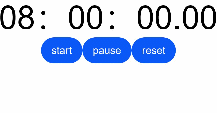
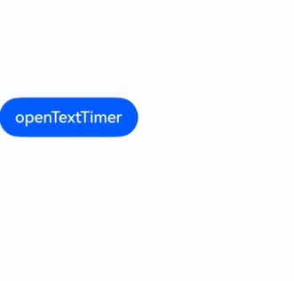

# TextTimer

The **TextTimer** component displays timing information and is controlled in text format.

>  **NOTE**
>
> This component is supported since API version 8. Updates will be marked with a superscript to indicate their earliest API version.

## Child Components

Not supported

## APIs

TextTimer(options?: TextTimerOptions)

**Widget capability**: Since API version 10, this API is supported in ArkTS widgets.

**Atomic service API**: This API can be used in atomic services since API version 11.

**Parameters**

| Name| Type| Mandatory| Description|
| -------- | -------- | -------- | -------- |
| options |  [TextTimerOptions](#texttimeroptions)| No| Parameters of the **TextTimer** component.|

## TextTimerOptions

**Widget capability**: Since API version 10, this API is supported in ArkTS widgets.

**Atomic service API**: This API can be used in atomic services since API version 11.

| Name    | Type    | Mandatory | Description                  |
| ----------- | -------- | -------- | -------- |
| isCountDown | boolean  | No  | Whether to count down.<br>Default value: **false**|
| count       | number   | No  | Countdown time, in milliseconds. This parameter is valid only when **isCountDown** is set to **true**. The maximum value is 86400000 ms (24 hours). In the case of 0 < Value of **count** < 86400000, the value of **count** is used as the initial countdown value. In other cases, the default value is used as the initial countdown value.<br>Default value: **60000**|
| controller  | [TextTimerController](#texttimercontroller) | No | **TextTimer** controller.|

## Attributes

Among the [universal attributes](ts-universal-attributes-size.md) and [universal text attributes](ts-universal-attributes-text-style.md), **fontColor**, **fontSize**, **fontStyle**, **fontWeight**, and **fontFamily** are supported. In addition, the following attributes are supported.

### format

format(value: string)

Sets the custom format. The value must contain at least one of the following keywords: **HH**, mm, **ss**, and **SS**. If the specified date format is yy, MM, or dd, the default value is used instead.

**Widget capability**: Since API version 10, this API is supported in ArkTS widgets.

**Atomic service API**: This API can be used in atomic services since API version 11.

**System capability**: SystemCapability.ArkUI.ArkUI.Full

**Parameters**

| Name| Type  | Mandatory| Description                                  |
| ------ | ------ | ---- | -------------------------------------- |
| value  | string | Yes  | Custom format<br>Default value: **'HH:mm:ss.SS'**|

### textShadow<sup>11+</sup>

textShadow(value: ShadowOptions | Array&lt;ShadowOptions&gt;)

Sets the text shadow. It supports input parameters in an array to implement multiple text shadows. This API does not work with the **fill** attribute or coloring strategy.

**Atomic service API**: This API can be used in atomic services since API version 12.

**System capability**: SystemCapability.ArkUI.ArkUI.Full

**Parameters**

| Name| Type                                                        | Mandatory| Description          |
| ------ | ------------------------------------------------------------ | ---- | -------------- |
| value  | [ShadowOptions](ts-universal-attributes-image-effect.md#shadowoptions) \| Array&lt;[ShadowOptions](ts-universal-attributes-image-effect.md#shadowoptions)> | Yes  | Text shadow.|

### contentModifier<sup>12+</sup>

contentModifier(modifier: ContentModifier\<TextTimerConfiguration>)

Creates a content modifier.

**Atomic service API**: This API can be used in atomic services since API version 12.

**System capability**: SystemCapability.ArkUI.ArkUI.Full

**Parameters**

| Name| Type                                         | Mandatory| Description                                            |
| ------ | --------------------------------------------- | ---- | ------------------------------------------------ |
| modifier  | [ContentModifier\<TextTimerConfiguration>](#texttimerconfiguration12) | Yes  | Content modifier to apply to the **TextTimer** component.<br>**modifier**: content modifier. You need a custom class to implement the **ContentModifier** API.|

## Events

### onTimer

onTimer(event: (utc: number, elapsedTime: number) =&gt; void)

Triggered when the time text changes. This event is not triggered when the screen is locked or the application is running in the background.

**Widget capability**: Since API version 10, this API is supported in ArkTS widgets.

**Atomic service API**: This API can be used in atomic services since API version 11.

**System capability**: SystemCapability.ArkUI.ArkUI.Full

**Parameters**

| Name     | Type  | Mandatory| Description                                                        |
| ----------- | ------ | ---- | ------------------------------------------------------------ |
| utc         | number | Yes  | Linux timestamp, which is the amount of time that has elapsed since January 1, 1970, in the minimum unit of the format.|
| elapsedTime | number | Yes  | Elapsed time of the timer, in the minimum unit of the format.                |

## TextTimerController

Implements a controller for controlling the **TextTimer** component. A **TextTimer** component can only be bound to one controller, and the relevant commands can only be called after the component has been created.

**Widget capability**: Since API version 10, this API is supported in ArkTS widgets.

**Atomic service API**: This API can be used in atomic services since API version 11.

### Objects to Import

```
textTimerController: TextTimerController = new TextTimerController()
```

### start

start()

Starts the timer.

**Widget capability**: Since API version 10, this API is supported in ArkTS widgets.

**Atomic service API**: This API can be used in atomic services since API version 11.

**System capability**: SystemCapability.ArkUI.ArkUI.Full

### pause

pause()

Pauses the timer.

**Widget capability**: Since API version 10, this API is supported in ArkTS widgets.

**Atomic service API**: This API can be used in atomic services since API version 11.

**System capability**: SystemCapability.ArkUI.ArkUI.Full

### reset

reset()

Resets the timer.

**Widget capability**: Since API version 10, this API is supported in ArkTS widgets.

**Atomic service API**: This API can be used in atomic services since API version 11.

**System capability**: SystemCapability.ArkUI.ArkUI.Full

## TextTimerConfiguration<sup>12+</sup>

You need a custom class to implement the **ContentModifier** API.

**Atomic service API**: This API can be used in atomic services since API version 12.

**System capability**: SystemCapability.ArkUI.ArkUI.Full

| Name | Type   |    Default Value     |  Description             |
| ------ | ------ | ------ |-------------------------------- |
| count | number | 60000 | Countdown time, in milliseconds. This parameter is valid only when **isCountDown** is set to **true**. The maximum value is 86400000 ms (24 hours). If the value is between 0 and 86,400,000, it is used as the initial countdown time. Otherwise, the default value is used as the initial countdown time.|
| isCountDown | boolean| false | Whether to count down.|
| started | boolean | - | Whether the countdown has started.|
| elapsedTime | number | - | Elapsed time of the timer, in the minimum unit of the format.|

## Example
### Example 1
```ts
// xxx.ets
@Entry
@Component
struct TextTimerExample {
  textTimerController: TextTimerController = new TextTimerController()
  @State format: string = 'mm:ss.SS'

  build() {
    Column() {
      TextTimer({ isCountDown: true, count: 30000, controller: this.textTimerController })
        .format(this.format)
        .fontColor(Color.Black)
        .fontSize(50)
        .onTimer((utc: number, elapsedTime: number) => {
          console.info('textTimer notCountDown utc is: ' + utc + ', elapsedTime: ' + elapsedTime)
        })
      Row() {
        Button("start").onClick(() => {
          this.textTimerController.start()
        })
        Button("pause").onClick(() => {
          this.textTimerController.pause()
        })
        Button("reset").onClick(() => {
          this.textTimerController.reset()
        })
      }
    }
  }
}
```




### Example 2
``` ts
// xxx.ets
@Entry
@Component
struct TextTimerExample {
  @State textShadows : ShadowOptions | Array<ShadowOptions> = [{ radius: 10, color: Color.Red, offsetX: 10, offsetY: 0 },{ radius: 10, color: Color.Black, offsetX: 20, offsetY: 0 },
      { radius: 10, color: Color.Brown, offsetX: 30, offsetY: 0 },{ radius: 10, color: Color.Green, offsetX: 40, offsetY: 0 },
      { radius: 10, color: Color.Yellow, offsetX: 100, offsetY: 0 }]
  build() {
    Column({ space: 8 }) {
      TextTimer().fontSize(50).textShadow(this.textShadows)
    }
  }
}
```


### Example 3
This example showcases two simple **TextTimer** components set against a light gray background. Once the timers are activated, they display the time progression in real-time. When the countdown timer starts, the background turns black; when the count-up timer starts, the background turns gray.
``` ts
// xxx.ets
class MyTextTimerModifier implements ContentModifier<TextTimerConfiguration> {
  constructor() {
  }
  applyContent() : WrappedBuilder<[TextTimerConfiguration]>
  {
      return wrapBuilder(buildTextTimer)
  }
}

@Builder function buildTextTimer(config: TextTimerConfiguration) {
  Column() {
     Stack({ alignContent: Alignment.Center }) {
       Circle({ width: 150, height: 150 }).fill(config.started ? (config.isCountDown ? 0xFF232323 : 0xFF717171) : 0xFF929292)
       Column(){
         Text(config.isCountDown ? "Countdown" : "Count-up").fontColor(Color.White)
         Text(
           (config.isCountDown ? "Remaining" : "Elapsed") + (config.isCountDown?
             (Math.max(config.count / 1000 - config.elapsedTime / 100,0)).toFixed(1) + "/" + (config.count / 1000).toFixed(0)
             :((config.elapsedTime / 100).toFixed(0))
           ) + "s"
         ).fontColor(Color.White)
       }
     }
  }
}

@Entry
@Component
struct Index {
  @State count: number = 10000
  @State myTimerModifier: MyTextTimerModifier = new MyTextTimerModifier()
  countDownTextTimerController: TextTimerController = new TextTimerController()
  countUpTextTimerController: TextTimerController = new TextTimerController()

  build() {
    Row() {
      Column() {
        TextTimer({isCountDown: true, count: this.count, controller: this.countDownTextTimerController})
          .contentModifier(this.myTimerModifier)
          .onTimer((utc: number, elapsedTime: number) => {
            console.info('textTimer onTimer utc is:' + utc + ', elapsedTime: ' + elapsedTime)
          })
          .margin(10)
        TextTimer({isCountDown: false, controller: this.countUpTextTimerController})
          .contentModifier(this.myTimerModifier)
          .onTimer((utc: number, elapsedTime: number) => {
            console.info('textTimer onTimer utc is:' + utc + ', elapsedTime: ' + elapsedTime)
          })
        Row() {
          Button("start").onClick(()=>{
            this.countDownTextTimerController.start()
            this.countUpTextTimerController.start()
          }).margin(10)
          Button("pause").onClick(()=>{
            this.countDownTextTimerController.pause()
            this.countUpTextTimerController.pause()
          }).margin(10)
          Button("reset").onClick(()=>{
            this.countDownTextTimerController.reset()
            this.countUpTextTimerController.reset()
          }).margin(10)
        }.margin(20)
      }.width('100%')
    }.height('100%')
  }
}
```


### Example 4
In this example, the **TextTimer** component is set to execute immediately after it is created.
``` ts
@Entry
@Component
struct textTimerStart {
  textTimerController: TextTimerController = new TextTimerController()
  @State format: string = 'mm:ss.SS'

  build() {
    Column() {
      Scroll()
        .height('20%')
      TextTimer({ isCountDown: true, count: 30000, controller: this.textTimerController })
        .format(this.format)
        .fontColor(Color.Black)
        .fontSize(50)
        .onTimer((utc: number, elapsedTime: number) => {
          console.info('textTimer notCountDown utc is: ' + utc + ', elapsedTime: ' + elapsedTime)
        })
        .onAppear(()=>{
          this.textTimerController.start()
        })
    }
  }
}
```

