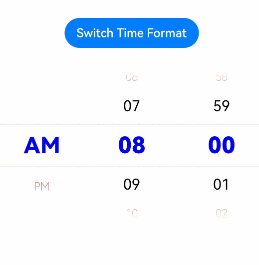

# TimePicker

The **TimePicker** component allows users to select a time (with the hour and minute) from the given range.

>  **NOTE**
>
>  This component is supported since API version 8. Updates will be marked with a superscript to indicate their earliest API version.


## Child Components

Not supported


## APIs

TimePicker(options?: TimePickerOptions)

Creates a time picker, which is in 24-hour format by default.

**Atomic service API**: This API can be used in atomic services since API version 11.

**System capability**: SystemCapability.ArkUI.ArkUI.Full

**Parameters**

| Name | Type                                           | Mandatory| Description                    |
| ------- | ----------------------------------------------- | ---- | ------------------------ |
| options | [TimePickerOptions](#timepickeroptions) | No  | Parameters of the time picker.|

## TimePickerOptions

**System capability**: SystemCapability.ArkUI.ArkUI.Full

| Name                | Type                                           | Mandatory| Description                                                        |
| -------------------- | ----------------------------------------------- | ---- | ------------------------------------------------------------ |
| selected             | Date                                            | No  | Time of the selected item.<br>Default value: current system time<br>Since API version 10, this parameter supports two-way binding through [$$](../../../quick-start/arkts-two-way-sync.md).<br>**Atomic service API**: This API can be used in atomic services since API version 11.|
| format<sup>11+</sup> | [TimePickerFormat](#timepickerformat11)| No  | Time format.<br>Default value: **TimePickerFormat.HOUR_MINUTE**<br>**Atomic service API**: This API can be used in atomic services since API version 12.|

## TimePickerFormat<sup>11+</sup>

**Atomic service API**: This API can be used in atomic services since API version 12.

**System capability**: SystemCapability.ArkUI.ArkUI.Full

| Name              | Description                    |
| ------------------ | ------------------------ |
| HOUR_MINUTE        | Display hours and minutes.      |
| HOUR_MINUTE_SECOND | Display hours, minutes, and seconds.|

## Attributes

In addition to the [universal attributes](ts-universal-attributes-size.md), the following attributes are supported.

### useMilitaryTime

useMilitaryTime(value: boolean)

Sets whether to display time in 24-hour format. When the display time is in 12-hour format, the AM/PM zone does not change depending on the hour portion.

**Atomic service API**: This API can be used in atomic services since API version 11.

**System capability**: SystemCapability.ArkUI.ArkUI.Full

**Parameters**

| Name| Type   | Mandatory| Description                                      |
| ------ | ------- | ---- | ------------------------------------------ |
| value  | boolean | Yes  | Whether the display time is in 24-hour format.<br>Default value: **false**|

### disappearTextStyle<sup>10+</sup>

disappearTextStyle(value: PickerTextStyle)

Sets the font color, font size, and font weight for the top and bottom items.

**Atomic service API**: This API can be used in atomic services since API version 11.

**System capability**: SystemCapability.ArkUI.ArkUI.Full

**Parameters**

| Name| Type                                                        | Mandatory| Description                                                        |
| ------ | ------------------------------------------------------------ | ---- | ------------------------------------------------------------ |
| value  | [PickerTextStyle](ts-basic-components-datepicker.md#pickertextstyle10) | Yes  | Font color, font size, and font weight of the top and bottom items.<br>Default value:<br>{<br>color: '#ff182431',<br>font: {<br>size: '14fp', <br>weight: FontWeight.Regular<br>}<br>} |

### textStyle<sup>10+</sup>

textStyle(value: PickerTextStyle)

Sets the font color, font size, and font weight for all items except the top, bottom, and selected items.

**Atomic service API**: This API can be used in atomic services since API version 11.

**System capability**: SystemCapability.ArkUI.ArkUI.Full

**Parameters**

| Name| Type                                                        | Mandatory| Description                                                        |
| ------ | ------------------------------------------------------------ | ---- | ------------------------------------------------------------ |
| value  | [PickerTextStyle](ts-basic-components-datepicker.md#pickertextstyle10) | Yes  | Font color, font size, and font weight of all items except the top, bottom, and selected items.<br>Default value:<br>{<br>color: '#ff182431',<br>font: {<br>size: '16fp', <br>weight: FontWeight.Regular<br>}<br>} |

### selectedTextStyle<sup>10+</sup>

selectedTextStyle(value: PickerTextStyle)

Sets the font color, font size, and font weight for the selected item.

**Atomic service API**: This API can be used in atomic services since API version 11.

**System capability**: SystemCapability.ArkUI.ArkUI.Full

**Parameters**

| Name| Type                                                        | Mandatory| Description                                                        |
| ------ | ------------------------------------------------------------ | ---- | ------------------------------------------------------------ |
| value  | [PickerTextStyle](ts-basic-components-datepicker.md#pickertextstyle10) | Yes  | Font color, font size, and font weight of the selected item.<br>Default value:<br>{<br>color: '#ff007dff',<br>font: {<br>size: '20vp', <br>weight: FontWeight.Medium<br>}<br>} |

### loop<sup>11+</sup>

loop(value: boolean)

Sets whether to enable the loop mode.

**Atomic service API**: This API can be used in atomic services since API version 12.

**System capability**: SystemCapability.ArkUI.ArkUI.Full

**Parameters**

| Name| Type   | Mandatory| Description                                                        |
| ------ | ------- | ---- | ------------------------------------------------------------ |
| value  | boolean | Yes  | Whether to enable the loop mode.<br>Default value: **true**<br>The value **true** means to enable  loop mode, and **false** means the opposite.|

### dateTimeOptions<sup>12+</sup>

dateTimeOptions(value: DateTimeOptions)

Sets whether to display a leading zero for the hours, minutes, and seconds.

**Atomic service API**: This API can be used in atomic services since API version 12.

**System capability**: SystemCapability.ArkUI.ArkUI.Full

**Parameters**

| Name| Type                                                        | Mandatory| Description                                                        |
| ------ | ------------------------------------------------------------ | ---- | ------------------------------------------------------------ |
| value  | [DateTimeOptions](../../apis-localization-kit/js-apis-intl.md#datetimeoptions) | Yes  | Whether to display a leading zero for the hours, minutes, and seconds. Currently only the configuration of the **hour**, **minute**, and **second** parameters is supported.<br>Default value:<br>**hour**: In the 24-hour format, it defaults to **2-digit**, which means a leading zero is used; In the 12-hour format, it defaults to **numeric**, which means no leading zero is used.<br>**minute**: defaults to **2-digit**, which means a leading zero is used.<br>**second**: defaults to **2-digit**, which means a leading zero is used.<br>|

### enableHapticFeedback<sup>12+</sup>

enableHapticFeedback(enable: boolean)

**Atomic service API**: This API can be used in atomic services since API version 12.

**System capability**: SystemCapability.ArkUI.ArkUI.Full

| Name| Type                                         | Mandatory | Description                                                                                 |
| ------ | --------------------------------------------- |-----|-------------------------------------------------------------------------------------|
| enable  | boolean | Yes  | Whether haptic feedback is enabled.<br>**true** (default): Haptic feedback is enabled.<br>**false**: Haptic feedback is disabled.<br>Whether this parameter takes effect after being set to true depends on hardware support.|

## Events

In addition to the [universal events](ts-universal-events-click.md), the following events are supported.

### onChange

onChange(callback: (value: TimePickerResult ) =&gt; void)

Triggered when a time is selected.

**Atomic service API**: This API can be used in atomic services since API version 11.

**System capability**: SystemCapability.ArkUI.ArkUI.Full

**Parameters**

| Name| Type                                         | Mandatory| Description          |
| ------ | --------------------------------------------- | ---- | -------------- |
| value  | [TimePickerResult](#timepickerresult)| Yes  | Time in 24-hour format.|

## TimePickerResult

Describes a time in 24-hour format.

**Atomic service API**: This API can be used in atomic services since API version 11.

**System capability**: SystemCapability.ArkUI.ArkUI.Full

| Name                | Type  | Read Only| Optional| Description                               |
| -------------------- | ------ | ---- | ---- | ----------------------------------- |
| hour                 | number | No  | No  | Hour portion of the selected time.<br>Value range: [0-23]|
| minute               | number | No  | No  | Minute portion of the selected time.<br>Value range: [0-59]|
| second<sup>11+</sup> | number | No  | No  | Second portion of the selected time.<br>Value range: [0-59]|


## Example

```ts
// xxx.ets
@Entry
@Component
struct TimePickerExample {
  @State isMilitaryTime: boolean = false
  private selectedTime: Date = new Date('2022-07-22T08:00:00')

  build() {
    Column() {
      Button ('Switch Time Format')
        .margin(30)
        .onClick(() => {
          this.isMilitaryTime = !this.isMilitaryTime
        })
      TimePicker({
        selected: this.selectedTime,
      })
        .useMilitaryTime(this.isMilitaryTime)
        .onChange((value: TimePickerResult) => {
          if(value.hour >= 0) {
            this.selectedTime.setHours(value.hour, value.minute)
            console.info('select current date is: ' + JSON.stringify(value))
          }
        })
        .disappearTextStyle({color: Color.Red, font: {size: 15, weight: FontWeight.Lighter}})
        .textStyle({color: Color.Black, font: {size: 20, weight: FontWeight.Normal}})
        .selectedTextStyle({color: Color.Blue, font: {size: 30, weight: FontWeight.Bolder}})
    }.width('100%')
  }
}
```


