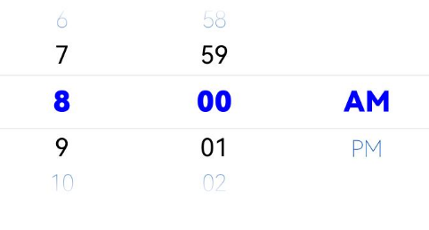
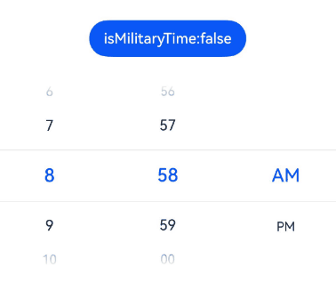
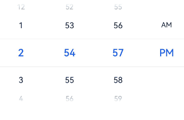
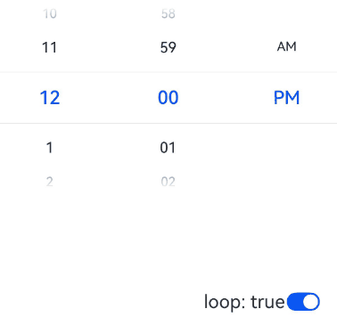
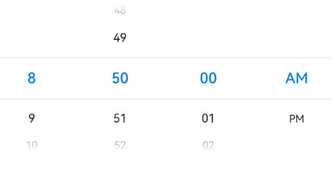
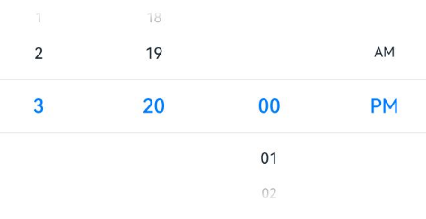
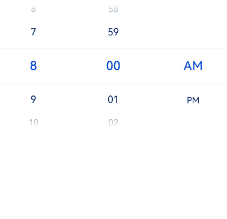

# TimePicker

The **TimePicker** component allows users to select a time (with the hour and minute) from the given range.

>  **NOTE**
>
>  This component is supported since API version 8. Updates will be marked with a superscript to indicate their earliest API version.


## Child Components

Not supported


## APIs

TimePicker(options?: TimePickerOptions)

Creates a time picker, which is in 24-hour format by default.

**Atomic service API**: This API can be used in atomic services since API version 11.

**System capability**: SystemCapability.ArkUI.ArkUI.Full

**Parameters**

| Name | Type                                           | Mandatory| Description                    |
| ------- | ----------------------------------------------- | ---- | ------------------------ |
| options | [TimePickerOptions](#timepickeroptions) | No  | Parameters of the time picker.|

## TimePickerOptions

**System capability**: SystemCapability.ArkUI.ArkUI.Full

| Name                | Type                                           | Mandatory| Description                                                        |
| -------------------- | ----------------------------------------------- | ---- | ------------------------------------------------------------ |
| selected             | Date                                            | No  | Time of the selected item.<br>Default value: current system time<br>Since API version 10, this parameter supports two-way binding through [$$](../../../ui/state-management/arkts-two-way-sync.md).<br>**Atomic service API**: This API can be used in atomic services since API version 11.|
| format<sup>11+</sup> | [TimePickerFormat](#timepickerformat11)| No  | Time format.<br>Default value: **TimePickerFormat.HOUR_MINUTE**<br>**Atomic service API**: This API can be used in atomic services since API version 12.|
| start<sup>18+</sup>  | Date | No  | Start time of the time picker.<br>Default value: **Date(0, 0, 0, 0, 0, 0)**; only the hour and minute settings take effect.<br>If both start and end are set to non-default values, the loop feature is disabled.<br>**Atomic service API**: This API can be used in atomic services since API version 18.|
| end<sup>18+</sup>    | Date | No  | End time of the time picker.<br>Default value: **Date(0, 0, 0, 23, 59, 59)**; only the hour and minute settings take effect.<br>If both start and end are set to non-default values, the loop feature is disabled.<br>**Atomic service API**: This API can be used in atomic services since API version 18.|

>  **NOTE**
>
>  Modifying the **TimePickerOptions** properties, such as **selected**, **start**, or **end**, during the scrolling process of the **TimePicker** component may not take effect. 
>  The **Date** object is used to handle dates and time.
>
>  **Method 1**: new Date ()
>
>  Obtains the current system date and time.
>
>  **Method 2**: new Date(value: number | string)
>
>  | Name | Type | Mandatory | Description |
>  | ------- | ------ | ---- | ------ |
>  | value   | number \| string  | Yes | Date format.<br> **number**: number of milliseconds since 00:00:00 on January 1, 1970.<br> **string**: date string in formats such as 2025-02 2025-02-20 08:00:00 or 2025-02 2025-02-20T08:00:00.|
>
>  **Method 3**: new Date(year: number, monthIndex: number, date?: number, hours?: number, minutes?: number, seconds?: number, ms?: number)
>
>  | Name | Type | Mandatory | Description |
>  | --------| ------ | ---- | ------ |
>  | year        | number | Yes   | Year. Example: **2025**.|
>  | monthIndex  | number | Yes   | Month index, for example, **2** for March.|
>  | date        | number | No   | Day of the month, for example, **10**. (Required if **hours** is set.) |
>  | hours       | number | No   | Hour, for example, **15**. (Required if **minutes** is set.) |
>  | minutes     | number | No   | Minute, for example, **20**. (Required if **seconds** is set.) |
>  | seconds     | number | No   | Second, for example, **20**. (Required if **ms** is set.) |
>  | ms          | number | No   | Millisecond, for example, **10**.|

## TimePickerFormat<sup>11+</sup>

**Atomic service API**: This API can be used in atomic services since API version 12.

**System capability**: SystemCapability.ArkUI.ArkUI.Full

| Name              | Description                    |
| ------------------ | ------------------------ |
| HOUR_MINUTE        | Display hours and minutes.      |
| HOUR_MINUTE_SECOND | Display hours, minutes, and seconds.|

**Handling in the case of exceptions**

| Exception  | Result |
| -------- |  ------------------------------------------------------------ |
| The start time is later than the end time.   | Both start time and end time are set to their default values. |
| The selected time is earlier than the start time.   | The selected time is set to the start time. |
| The selected time is later than the end time.   | The selected time is set to the end time. |
| The start time is later than the current system time, and the selected time is not set.   | The selected time is set to the start time.|
| The end time is earlier than the current system time, and the selected time is not set.   | The selected time is set to the end time. |
| The time format is invalid, such as **'01:61:61'**.  | The default value is used. |

## Attributes

In addition to the [universal attributes](ts-component-general-attributes.md), the following attributes are supported.

### useMilitaryTime

useMilitaryTime(value: boolean)

Sets whether to display time in 24-hour format. When the display time is in 12-hour format, the AM/PM zone does not change depending on the hour portion.

**Atomic service API**: This API can be used in atomic services since API version 11.

**System capability**: SystemCapability.ArkUI.ArkUI.Full

**Parameters**

| Name| Type   | Mandatory| Description                                      |
| ------ | ------- | ---- | ------------------------------------------ |
| value  | boolean | Yes  | Whether the display time is in 24-hour format.<br>Default value: **false**.<br>**true**: The display time is in 24-hour format.<br>**false**: The display time is in 12-hour format.|

### useMilitaryTime<sup>18+</sup>

useMilitaryTime(isMilitaryTime: Optional\<boolean>)

Sets whether to display time in 24-hour format. Compared with [useMilitaryTime](#usemilitarytime), this API supports the **undefined** type for the **isMilitaryTime** parameter.

**Atomic service API**: This API can be used in atomic services since API version 18.

**System capability**: SystemCapability.ArkUI.ArkUI.Full

**Parameters**

| Name| Type   | Mandatory| Description                                      |
| ------ | ------- | ---- | ------------------------------------------ |
| isMilitaryTime | [Optional](ts-universal-attributes-custom-property.md#optionalt12)\<boolean> | Yes  | Whether the display time is in 24-hour format.<br>If **isMilitaryTime** is set to **undefined**, the default value **false** is used.<br>**true**: The display time is in 24-hour format.<br>**false**: The display time is in 12-hour format.|

### disappearTextStyle<sup>10+</sup>

disappearTextStyle(value: PickerTextStyle)

Sets the font color, font size, and font weight for the top and bottom items.

**Atomic service API**: This API can be used in atomic services since API version 11.

**System capability**: SystemCapability.ArkUI.ArkUI.Full

**Parameters**

| Name| Type                                                        | Mandatory| Description                                                        |
| ------ | ------------------------------------------------------------ | ---- | ------------------------------------------------------------ |
| value  | [PickerTextStyle](ts-basic-components-datepicker.md#pickertextstyle10) | Yes  | Font color, font size, and font weight of the top and bottom items.<br>Default value:<br>{<br>color: '#ff182431',<br>font: {<br>size: '14fp', <br>weight: FontWeight.Regular<br>}<br>} |

### disappearTextStyle<sup>18+</sup>

disappearTextStyle(style: Optional\<PickerTextStyle>)

Sets the font color, font size, and font weight for the top and bottom items. Compared with [disappearTextStyle](#disappeartextstyle10)<sup>10+</sup>, this API supports the **undefined** type for the **style** parameter.

**Atomic service API**: This API can be used in atomic services since API version 18.

**System capability**: SystemCapability.ArkUI.ArkUI.Full

**Parameters**

| Name| Type                                                        | Mandatory| Description                                                        |
| ------ | ------------------------------------------------------------ | ---- | ------------------------------------------------------------ |
| style  | [Optional](ts-universal-attributes-custom-property.md#optionalt12)\<[PickerTextStyle](ts-basic-components-datepicker.md#pickertextstyle10)> | Yes  | Font color, font size, and font weight of the top and bottom items.<br>If **style** is set to **undefined**, the default value is used:<br>{<br>color: '#ff182431',<br>font: {<br>size: '14fp', <br>weight: FontWeight.Regular<br>}<br>} |

### textStyle<sup>10+</sup>

textStyle(value: PickerTextStyle)

Sets the font color, font size, and font weight for all items except the top, bottom, and selected items.

**Atomic service API**: This API can be used in atomic services since API version 11.

**System capability**: SystemCapability.ArkUI.ArkUI.Full

**Parameters**

| Name| Type                                                        | Mandatory| Description                                                        |
| ------ | ------------------------------------------------------------ | ---- | ------------------------------------------------------------ |
| value  | [PickerTextStyle](ts-basic-components-datepicker.md#pickertextstyle10) | Yes  | Font color, font size, and font weight of all items except the top, bottom, and selected items.<br>Default value:<br>{<br>color: '#ff182431',<br>font: {<br>size: '16fp', <br>weight: FontWeight.Regular<br>}<br>} |

### textStyle<sup>18+</sup>

textStyle(style: Optional\<PickerTextStyle>)

Sets the font color, font size, and font weight for all items except the top, bottom, and selected items. Compared with [textStyle](#textstyle10)<sup>10+</sup>, this API supports the **undefined** type for the **style** parameter.

**Atomic service API**: This API can be used in atomic services since API version 18.

**System capability**: SystemCapability.ArkUI.ArkUI.Full

**Parameters**

| Name| Type                                                        | Mandatory| Description                                                        |
| ------ | ------------------------------------------------------------ | ---- | ------------------------------------------------------------ |
| style  | [Optional](ts-universal-attributes-custom-property.md#optionalt12)\<[PickerTextStyle](ts-basic-components-datepicker.md#pickertextstyle10)> | Yes  | Font color, font size, and font weight of all items except the top, bottom, and selected items.<br>If **style** is set to **undefined**, the default value is used:<br>{<br>color: '#ff182431',<br>font: {<br>size: '16fp', <br>weight: FontWeight.Regular<br>}<br>} |

### selectedTextStyle<sup>10+</sup>

selectedTextStyle(value: PickerTextStyle)

Sets the font color, font size, and font weight for the selected item.

**Atomic service API**: This API can be used in atomic services since API version 11.

**System capability**: SystemCapability.ArkUI.ArkUI.Full

**Parameters**

| Name| Type                                                        | Mandatory| Description                                                        |
| ------ | ------------------------------------------------------------ | ---- | ------------------------------------------------------------ |
| value  | [PickerTextStyle](ts-basic-components-datepicker.md#pickertextstyle10) | Yes  | Font color, font size, and font weight of the selected item.<br>Default value:<br>{<br>color: '#ff007dff',<br>font: {<br>size: '20fp', <br>weight: FontWeight.Medium<br>}<br>} |

### selectedTextStyle<sup>18+</sup>

selectedTextStyle(style: Optional\<PickerTextStyle>)

Sets the font color, font size, and font weight for the selected item. Compared with [selectedTextStyle](#selectedtextstyle10)<sup>10+</sup>, this API supports the **undefined** type for the **style** parameter.

**Atomic service API**: This API can be used in atomic services since API version 18.

**System capability**: SystemCapability.ArkUI.ArkUI.Full

**Parameters**

| Name| Type                                                        | Mandatory| Description                                                        |
| ------ | ------------------------------------------------------------ | ---- | ------------------------------------------------------------ |
| style  | [Optional](ts-universal-attributes-custom-property.md#optionalt12)\<[PickerTextStyle](ts-basic-components-datepicker.md#pickertextstyle10)> | Yes  | Font color, font size, and font weight of the selected item.<br>If **style** is set to **undefined**, the default value is used:<br>{<br>color: '#ff007dff',<br>font: {<br>size: '20fp', <br>weight: FontWeight.Medium<br>}<br>} |

### loop<sup>11+</sup>

loop(value: boolean)

Sets whether to enable the loop mode.

**Atomic service API**: This API can be used in atomic services since API version 12.

**System capability**: SystemCapability.ArkUI.ArkUI.Full

**Parameters**

| Name| Type   | Mandatory| Description                                                        |
| ------ | ------- | ---- | ------------------------------------------------------------ |
| value  | boolean | Yes  | Whether to enable the loop mode.<br>Default value: **true**.<br>The value **true** means to enable  loop mode, and **false** means the opposite.|

### loop<sup>18+</sup>

loop(isLoop: Optional\<boolean>)

Sets whether to enable the loop mode. Compared with [loop](#loop11)<sup>11+</sup>, this API supports the **undefined** type for the **isLoop** parameter.

**Atomic service API**: This API can be used in atomic services since API version 18.

**System capability**: SystemCapability.ArkUI.ArkUI.Full

**Parameters**

| Name| Type   | Mandatory| Description                                                        |
| ------ | ------- | ---- | ------------------------------------------------------------ |
| isLoop  | [Optional](ts-universal-attributes-custom-property.md#optionalt12)\<boolean> | Yes  | Whether to enable the loop mode.<br>If **isLoop** is set to **undefined**, the default value **true** is used. The value **true** means to enable the loop mode, and false means the opposite.|

### dateTimeOptions<sup>12+</sup>

dateTimeOptions(value: DateTimeOptions)

Sets whether to display a leading zero for the hours, minutes, and seconds.

**Atomic service API**: This API can be used in atomic services since API version 12.

**System capability**: SystemCapability.ArkUI.ArkUI.Full

**Parameters**

| Name| Type                                                        | Mandatory| Description                                                        |
| ------ | ------------------------------------------------------------ | ---- | ------------------------------------------------------------ |
| value  | [DateTimeOptions](../../apis-localization-kit/js-apis-intl.md#datetimeoptionsdeprecated) | Yes  | Whether to display a leading zero for the hours, minutes, and seconds. Currently only the configuration of the **hour**, **minute**, and **second** parameters is supported.<br>Default value:<br>**hour**: In the 24-hour format, it defaults to **"2-digit"**, which means a leading zero is used. In the 12-hour format, it defaults to **"numeric"**, which means no leading zero is used.<br>**minute**: defaults to **"2-digit"**, which means a leading zero is used.|

### dateTimeOptions<sup>18+</sup>

dateTimeOptions(timeFormat: Optional\<DateTimeOptions>)

Sets whether to display a leading zero for the hours, minutes, and seconds. Compared with [dateTimeOptions](#datetimeoptions12)<sup>12+</sup>, this API supports the **undefined** type for the **timeFormat** parameter.

**Atomic service API**: This API can be used in atomic services since API version 18.

**System capability**: SystemCapability.ArkUI.ArkUI.Full

**Parameters**

| Name| Type                                                        | Mandatory| Description                                                        |
| ------ | ------------------------------------------------------------ | ---- | ------------------------------------------------------------ |
| timeFormat  | [Optional](ts-universal-attributes-custom-property.md#optionalt12)\<[DateTimeOptions](../../apis-localization-kit/js-apis-intl.md#datetimeoptionsdeprecated)> | Yes  | Whether to display a leading zero for the hours, minutes, and seconds. Currently only the configuration of the **hour**, **minute**, and **second** parameters is supported.<br>Default value:<br>**hour**: In the 24-hour format, it defaults to **"2-digit"**, which means a leading zero is used; in the 12-hour format, it defaults to **"numeric"**, which means no leading zero is used.<br>**minute**: defaults to **"2-digit"**, which means a leading zero is used.<br>**second**: defaults to **"2-digit"**, which means a leading zero is used.<br> If **hour**, **minute**, or **second** is set to **undefined**, the display follows the default rules.|

### enableHapticFeedback<sup>12+</sup>

enableHapticFeedback(enable: boolean)

Sets whether to enable haptic feedback.

**Atomic service API**: This API can be used in atomic services since API version 12.

**System capability**: SystemCapability.ArkUI.ArkUI.Full

| Name| Type                                         | Mandatory | Description                                                                                 |
| ------ | --------------------------------------------- |-----|-------------------------------------------------------------------------------------|
| enable  | boolean | Yes  | Whether haptic feedback is enabled.<br>**true** (default): Haptic feedback is enabled.<br>**false**: Haptic feedback is disabled.<br>Whether this parameter takes effect after being set to true depends on hardware support.|

### enableHapticFeedback<sup>18+</sup>

enableHapticFeedback(enable: Optional\<boolean>)

Sets whether to enable haptic feedback. Compared with [enableHapticFeedback](#enablehapticfeedback12)<sup>12+</sup>, this API supports the **undefined** type for the **enable** parameter.

**Atomic service API**: This API can be used in atomic services since API version 18.

**System capability**: SystemCapability.ArkUI.ArkUI.Full

| Name| Type                                         | Mandatory | Description                                                                                 |
| ------ | --------------------------------------------- |-----|-------------------------------------------------------------------------------------|
| enable  | [Optional](ts-universal-attributes-custom-property.md#optionalt12)\<boolean> | Yes  | Whether haptic feedback is enabled.<br>If **enable** is set to **undefined**, the default value **true** is used. The value **true** means to enable haptic feedback, and **false** means the opposite.<br>Whether this parameter takes effect after being set to true depends on hardware support.|

>  **NOTE**
>
>  To enable haptic feedback, you must declare the ohos.permission.VIBRATE permission under **requestPermissions** in the **module.json5** file of the project.
>  ```json
>  "requestPermissions": [
>  {
>   "name": "ohos.permission.VIBRATE",
>  }
>  ]
>  ```

### enableCascade<sup>18+</sup>

enableCascade(enable: boolean)

Sets whether the AM/PM indicator automatically switches based on the hour in 12-hour format.

**Atomic service API**: This API can be used in atomic services since API version 18.

**System capability**: SystemCapability.ArkUI.ArkUI.Full

| Name| Type                                         | Mandatory | Description                                                                                 |
| ------ | --------------------------------------------- |-----|-------------------------------------------------------------------------------------|
| enable  | boolean | Yes  | Whether the AM/PM indicator automatically switches based on the hour in 12-hour format.<br>Default value: **false**. The value **true** means that the AM/PM indicator automatically switches based on the hour in 12-hour format, and **false** means the opposite.<br>Setting this parameter to **true** takes effect only when **loop** is also set to **true**.<br>|

### digitalCrownSensitivity<sup>18+</sup>
digitalCrownSensitivity(sensitivity: Optional\<CrownSensitivity>)

Sets the sensitivity to the digital crown rotation.

**Atomic service API**: This API can be used in atomic services since API version 18.

**System capability**: SystemCapability.ArkUI.ArkUI.Full

| Name  | Type                                    | Mandatory  | Description                     |
| ----- | ---------------------------------------- | ---- | ------------------------- |
| sensitivity | [Optional](ts-universal-attributes-custom-property.md#optionalt12)\<[CrownSensitivity](ts-appendix-enums.md#crownsensitivity18)> | Yes   | Sensitivity to the digital crown rotation.<br>Default value: **CrownSensitivity.MEDIUM**                   |

>  **NOTE**
>
>  This API is only available to circular screens on wearable devices. The component needs to obtain focus before responding to the [crown event](ts-universal-events-crown.md).

## Events

In addition to the [universal events](ts-component-general-events.md), the following events are supported.

### onChange

onChange(callback: (value: TimePickerResult ) =&gt; void)

Triggered when a time is selected.

**Atomic service API**: This API can be used in atomic services since API version 11.

**System capability**: SystemCapability.ArkUI.ArkUI.Full

**Parameters**

| Name| Type                                         | Mandatory| Description          |
| ------ | --------------------------------------------- | ---- | -------------- |
| value  | [TimePickerResult](#timepickerresult)| Yes  | Time in 24-hour format.|

### onChange<sup>18+</sup>

onChange(callback: Optional\<OnTimePickerChangeCallback>)

Triggered when the time options in the TimePicker rest on the selected position after scrolling. Compared with [onChange](#onchange), this API supports the **undefined** type for the **callback** parameter.

**Atomic service API**: This API can be used in atomic services since API version 18.

**System capability**: SystemCapability.ArkUI.ArkUI.Full

**Parameters**

| Name  | Type                                                        | Mandatory| Description                                                        |
| -------- | ------------------------------------------------------------ | ---- | ------------------------------------------------------------ |
| callback | [Optional](ts-universal-attributes-custom-property.md#optionalt12)\<[OnTimePickerChangeCallback](#ontimepickerchangecallback18)> | Yes  | Callback invoked when a time option is selected.<br>If **callback** is set to **undefined**, the callback function is not used.|

### onEnterSelectedArea<sup>18+</sup>

onEnterSelectedArea(callback: Callback\<TimePickerResult>)

Triggered during the scrolling of the time picker when an item enters the divider area.

Compared with the **onChange** event, this event is triggered earlier, specifically when the scroll distance of the current column exceeds half the height of the selected item, which indicates that the item has entered the divider area. When **enableCascade** is set to **true**, using this callback is not recommended due to the interdependent relationship between the AM/PM and hour columns. This callback indicates the moment an option enters the divider area during scrolling, and only the value of the currently scrolled column will change. The values of other non-scrolled columns will remain unchanged.

**Atomic service API**: This API can be used in atomic services since API version 18.

**System capability**: SystemCapability.ArkUI.ArkUI.Full

**Parameters**

| Name  | Type                      | Mandatory| Description                                      |
| -------- | -------------------------- | ---- | ------------------------------------------ |
| callback | Callback\<[TimePickerResult](#timepickerresult)> | Yes  | Callback triggered during the scrolling of the time picker when an item enters the divider area.|

## OnTimePickerChangeCallback<sup>18+</sup>

type OnTimePickerChangeCallback = (value: TimePickerResult) => void

Triggered when a time is selected.

**Widget capability**: This API can be used in ArkTS widgets since API version 18.

**Atomic service API**: This API can be used in atomic services since API version 18.

**System capability**: SystemCapability.ArkUI.ArkUI.Full

**Parameters**

| Name| Type                                         | Mandatory| Description          |
| ------ | --------------------------------------------- | ---- | -------------- |
| value  | [TimePickerResult](#timepickerresult)| Yes  | Time in 24-hour format.|

## TimePickerResult

Describes a time in 24-hour format.

**Atomic service API**: This API can be used in atomic services since API version 11.

**System capability**: SystemCapability.ArkUI.ArkUI.Full

| Name                | Type  | Read Only| Optional| Description                               |
| -------------------- | ------ | ---- | ---- | ----------------------------------- |
| hour                 | number | No  | No  | Hour portion of the selected time.<br>Value range: [0-23]|
| minute               | number | No  | No  | Minute portion of the selected time.<br>Value range: [0-59]|
| second<sup>11+</sup> | number | No  | No  | Second portion of the selected time.<br>Value range: [0-59]|

## Example

### Example 1: Setting the Text Style

This example demonstrates how to configure **disappearTextStyle**, **textStyle**, and **selectedTextStyle** to customize the text style in a text picker.

```ts
// xxx.ets
@Entry
@Component
struct TimePickerExample {
  private selectedTime: Date = new Date('2022-07-22T08:00:00')

  build() {
    TimePicker({
      selected: this.selectedTime
    })
      .disappearTextStyle({ color: '#004aaf', font: { size: 24, weight: FontWeight.Lighter } })
      .textStyle({ color: Color.Black, font: { size: 26, weight: FontWeight.Normal } })
      .selectedTextStyle({ color: Color.Blue, font: { size: 30, weight: FontWeight.Bolder } })
      .onChange((value: TimePickerResult) => {
        if (value.hour >= 0) {
          this.selectedTime.setHours(value.hour, value.minute)
          console.info('select current date is: ' + JSON.stringify(value))
        }
      })
  }
}
```



### Example 2: Switching Between 12-Hour and 24-Hour Formats

This example demonstrates how to switch between 12-hour and 24-hour formats using **useMilitaryTime**.

```ts
// xxx.ets
@Entry
@Component
struct TimePickerExample {
  @State isMilitaryTime: boolean = false
  private selectedTime: Date = new Date('2022-07-22T08:00:00')

  build() {
    Column() {
      Button('Switch Time Format')
        .margin(30)
        .onClick(() => {
          this.isMilitaryTime = !this.isMilitaryTime
        })

      TimePicker({
        selected: this.selectedTime
      })
        .useMilitaryTime(this.isMilitaryTime)
        .onChange((value: TimePickerResult) => {
          if (value.hour >= 0) {
            this.selectedTime.setHours(value.hour, value.minute)
            console.info('select current time is: ' + JSON.stringify(value))
          }
        })
        .onEnterSelectedArea((value: TimePickerResult) => {
            console.info('item enter selected area, time is: ' + JSON.stringify(value))
        })
    }.width('100%')
  }
}
```



### Example 3: Setting the Time Format

This example shows how to set the time format using **format** and **dateTimeOptions**.

```ts
// xxx.ets
@Entry
@Component
struct TimePickerExample {
  private selectedTime: Date = new Date('2022-07-22T08:00:00')

  build() {
    Column() {
      TimePicker({
        selected: this.selectedTime,
        format: TimePickerFormat.HOUR_MINUTE_SECOND
      })
        .dateTimeOptions({ hour: "numeric", minute: "2-digit", second: "2-digit" })
        .onChange((value: TimePickerResult) => {
          if (value.hour >= 0) {
            this.selectedTime.setHours(value.hour, value.minute)
            console.info('select current date is: ' + JSON.stringify(value))
          }
        })
    }.width('100%')
  }
}
```



### Example 4: Setting Loopable Scrolling

This example demonstrates how to set whether scrolling is loopable using **loop**.

```ts
// xxx.ets
@Entry
@Component
struct TimePickerExample {
  @State isLoop: boolean = true
  private selectedTime: Date = new Date('2022-07-22T12:00:00')

  build() {
    Column() {
      TimePicker({
        selected: this.selectedTime
      })
        .loop(this.isLoop)
        .onChange((value: TimePickerResult) => {
          if (value.hour >= 0) {
            this.selectedTime.setHours(value.hour, value.minute)
            console.info('select current date is: ' + JSON.stringify(value))
          }
        })

      Row() {
        Text('Loopable scrolling').fontSize(20)

        Toggle({ type: ToggleType.Switch, isOn: true })
          .onChange((isOn: boolean) => {
            this.isLoop = isOn
          })
      }.position({ x: '60%', y: '40%' })

    }.width('100%')
  }
}
```



### Example 5: Setting the Start Time

This example demonstrates how to set the start time for the time picker.

```ts
// xxx.ets
@Entry
@Component
struct TimePickerExample {
  private selectedTime: Date = new Date('2022-07-22T08:50:00')

  build() {
    Column() {
      TimePicker({
        selected: this.selectedTime,
        format: TimePickerFormat.HOUR_MINUTE_SECOND,
        start: new Date('2022-07-22T08:30:00')
      })
        .dateTimeOptions({ hour: "numeric", minute: "2-digit", second: "2-digit" })
        .onChange((value: TimePickerResult) => {
          if (value.hour >= 0) {
            this.selectedTime.setHours(value.hour, value.minute)
            console.info('select current date is: ' + JSON.stringify(value))
          }
        })
    }.width('100%')
  }
}
```


### Example 6: Setting the End Time

This example demonstrates how to set the end time for the time picker.

```ts
// xxx.ets
@Entry
@Component
struct TimePickerExample {
  private selectedTime: Date = new Date('2022-07-22T08:50:00')

  build() {
    Column() {
      TimePicker({
        selected: this.selectedTime,
        format: TimePickerFormat.HOUR_MINUTE_SECOND,
        end: new Date('2022-07-22T15:20:00'),
      })
        .dateTimeOptions({ hour: "numeric", minute: "2-digit", second: "2-digit" })
        .onChange((value: TimePickerResult) => {
          if (value.hour >= 0) {
            this.selectedTime.setHours(value.hour, value.minute)
            console.info('select current date is: ' + JSON.stringify(value))
          }
        })
    }.width('100%')
  }
}
```



### Example 7: Enabling the AM/PM Indicator to Automatically Switch Based on the Hour in 12-hour Format

This example demonstrates how to enable AM/PM indicator to automatically switch based on the hour in 12-hour format using **enableCascade** and **loop**.

```ts
// xxx.ets
@Entry
@Component
struct TimePickerExample {
  private selectedTime: Date = new Date('2022-07-22T08:00:00')

  build() {
    Column() {
      TimePicker({
        selected: this.selectedTime,
      })
        .enableCascade(true)
        .loop(true)
        .onChange((value: TimePickerResult) => {
          if (value.hour >= 0) {
            this.selectedTime.setHours(value.hour, value.minute)
            console.info('select current date is: ' + JSON.stringify(value))
          }
        })
    }.width('100%')
  }
}
```


