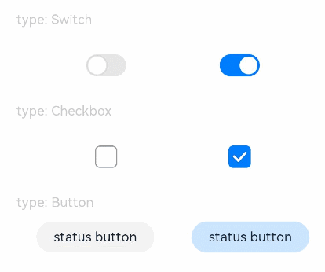
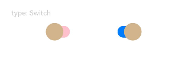
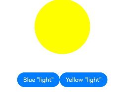

# Toggle

The **Toggle** component provides a clickable element in the check box, button, or switch type.

>  **NOTE**
>
> This component is supported since API version 8. Updates will be marked with a superscript to indicate their earliest API version.

## Child Components

This component can contain child components only when **ToggleType** is set to **Button**.


## APIs

Toggle(options: ToggleOptions)

**Widget capability**: This API can be used in ArkTS widgets since API version 9.

**Atomic service API**: This API can be used in atomic services since API version 11.

**System capability**: SystemCapability.ArkUI.ArkUI.Full

**Parameters**

| Name| Type| Mandatory  | Description          |
| ---- | ---------- | -----| -------------- |
| options | [ToggleOptions](#toggleoptions18) | Yes  | Options of the toggle.|

## ToggleOptions<sup>18+</sup>

**Widget capability**: This API can be used in ArkTS widgets since API version 18.

**Atomic service API**: This API can be used in atomic services since API version 18.

**System capability**: SystemCapability.ArkUI.ArkUI.Full

| Name             | Type                             | Mandatory| Description                                                        |
| ----------------- | --------------------------------- | ---- | ------------------------------------------------------------ |
| type<sup>8+</sup> | [ToggleType](#toggletype) | Yes  | Type of the toggle.<br>Default value: **ToggleType.Switch**<br>**Widget capability**: This API can be used in ArkTS widgets since API version 9.<br>**Atomic service API**: This API can be used in atomic services since API version 11.|
| isOn<sup>8+</sup> | boolean                           | No  | Whether the toggle is turned on. The value **true** means that the toggle is turned on, and **false** means the opposite.<br>Default value: **false**<br>This parameter supports two-way binding through [$$](../../../ui/state-management/arkts-two-way-sync.md).<br>This parameter supports two-way binding through the [!! syntax](../../../ui/state-management/arkts-new-binding.md#two-way-binding-between-built-in-component-parameters).<br>**Widget capability**: This API can be used in ArkTS widgets since API version 9.<br>**Atomic service API**: This API can be used in atomic services since API version 11.|

## ToggleType

**Widget capability**: This API can be used in ArkTS widgets since API version 9.

**Atomic service API**: This API can be used in atomic services since API version 11.

**System capability**: SystemCapability.ArkUI.ArkUI.Full

| Name    | Description                                                        |
| -------- | ------------------------------------------------------------ |
| Checkbox | Check box type.<br>**NOTE**<br>Since API version 11, the default style of the **Checkbox** component is changed from rounded square to circle.<br>The default value of the universal attribute [margin](ts-universal-attributes-size.md#margin) is as follows:<br>{<br> top: '14px',<br> right: '14px',<br> bottom: '14px',<br> left: '14px'<br> }.<br>Default size:<br>{width:'20vp', height:'20vp'}|
| Button   | Button type. The set string, if any, will be displayed inside the button.<br>The default height is 28 vp, and there is no default width.|
| Switch   | Switch type.<br>**NOTE**<br>The default value of the universal attribute [margin](ts-universal-attributes-size.md#margin) is as follows:<br>{<br> top: '6px',<br> right: '14px',<br> bottom: '6px',<br> left: '14px'<br> }.<br>Default size:<br>{width:'36vp', height:'20vp'}|

## Attributes

In addition to the [universal attributes](ts-component-general-attributes.md), the following attributes are supported.

### selectedColor

selectedColor(value: ResourceColor)

Sets the background color of the component when it is turned on.

**Widget capability**: This API can be used in ArkTS widgets since API version 9.

**Atomic service API**: This API can be used in atomic services since API version 11.

**System capability**: SystemCapability.ArkUI.ArkUI.Full

**Parameters**

| Name| Type                                      | Mandatory| Description                                                        |
| ------ | ------------------------------------------ | ---- | ------------------------------------------------------------ |
| value  | [ResourceColor](ts-types.md#resourcecolor) | Yes  | Background color of the component when it is turned on.<br>Default value:<br>When **ToggleType** is set to **Switch**, the default value is **$r('sys.color.ohos_id_color_component_activated')**.<br>When **ToggleType** is set to **Checkbox**, the default value is **$r('sys.color.ohos_id_color_component_activated')**.<br>When **ToggleType** is set to **Button**, the default value is **$r('sys.color.ohos_id_color_component_activated')** with the opacity of **$r('sys.color.ohos_id_color_text_highlight_bg')**.|

### switchPointColor

switchPointColor(color: ResourceColor)

Sets the color of the circular slider when the component is of the **Switch** type. This attribute is valid only when **type** is set to **ToggleType.Switch**.

**Widget capability**: This API can be used in ArkTS widgets since API version 9.

**Atomic service API**: This API can be used in atomic services since API version 11.

**System capability**: SystemCapability.ArkUI.ArkUI.Full

**Parameters**

| Name| Type                                      | Mandatory| Description                      |
| ------ | ------------------------------------------ | ---- | -------------------------- |
| color  | [ResourceColor](ts-types.md#resourcecolor) | Yes  | Color of the circular slider when the component is of the **Switch** type.<br>Default value: **$r('sys.color.ohos_id_color_foreground_contrary')**|

### switchStyle<sup>12+</sup>

switchStyle(value: SwitchStyle)

Sets the style for the component of the **Switch** type. This attribute is valid only when **type** is set to **ToggleType.Switch**.

**Atomic service API**: This API can be used in atomic services since API version 12.

**System capability**: SystemCapability.ArkUI.ArkUI.Full

**Parameters**

| Name| Type                                 | Mandatory| Description            |
| ------ | ------------------------------------- | ---- | ---------------- |
| value  | [SwitchStyle](#switchstyle12) | Yes  | Style of the component of the **Switch** type.|

### contentModifier<sup>12+</sup>

contentModifier(modifier: ContentModifier\<ToggleConfiguration>)

Creates a content modifier.

**Atomic service API**: This API can be used in atomic services since API version 12.

**System capability**: SystemCapability.ArkUI.ArkUI.Full

**Parameters**

| Name| Type                                         | Mandatory| Description                                            |
| ------ | --------------------------------------------- | ---- | ------------------------------------------------ |
| modifier  | [ContentModifier\<ToggleConfiguration>](#toggleconfiguration12) | Yes  | Content modifier to apply to the current component.<br>**modifier**: content modifier. You need a custom class to implement the **ContentModifier** API.|

## SwitchStyle<sup>12+</sup>

**Atomic service API**: This API can be used in atomic services since API version 12.

**System capability**: SystemCapability.ArkUI.ArkUI.Full

| Name             | Type                                       | Mandatory| Description                                                        |
| ----------------- | ------------------------------------------- | ---- | ------------------------------------------------------------ |
| pointRadius       | number \|  [Resource](ts-types.md#resource) | No  | Radius of the circular slider when the component is of the **Switch** type. The unit is vp.<br>**NOTE**<br>This parameter cannot be set in percentage. The value specified is used only when it is greater than or equal to 0.<br>If the value is not specified or the specified one is less than 0, the radius is set using the following formula:<br>(Component height (in vp)/2) - (2 vp x Component height (in vp)/20 vp)|
| unselectedColor   | [ResourceColor](ts-types.md#resourcecolor)  | No  | Background color of the component when it is of the **Switch** type and is disabled.<br>Default value: **0x337F7F7F**|
| pointColor        | [ResourceColor](ts-types.md#resourcecolor)  | No  | Color of the circular slider when the component is of the **Switch** type.<br>Default value: **$r('sys.color.ohos_id_color_foreground_contrary')**|
| trackBorderRadius | number \|  [Resource](ts-types.md#resource) | No  | Radius of the slider track border corners when the component is of the **Switch** type. The unit is vp.<br>**NOTE**<br>This parameter cannot be set in percentage. If the value specified is less than 0, the radius is set using the default value formula. If the value specified is greater than half of the component height, the latter is used. In other cases, the value specified is used.<br>If the value is not specified or the specified one is less than 0, the radius is set using the default value formula.<br>Default value formula: Component height (in vp)/2|

## Events

In addition to the [universal events](ts-component-general-events.md), the following events are supported.

### onChange

onChange(callback: (isOn: boolean) =&gt; void)

Triggered when the toggle status changes.

**Widget capability**: This API can be used in ArkTS widgets since API version 9.

**Atomic service API**: This API can be used in atomic services since API version 11.

**System capability**: SystemCapability.ArkUI.ArkUI.Full

**Parameters**

| Name| Type   | Mandatory| Description                                                        |
| ------ | ------- | ---- | ------------------------------------------------------------ |
| isOn   | boolean | Yes  | Whether the toggle is on.<br>**true**: The toggle is on. **false**: The toggle is off.|

## ToggleConfiguration<sup>12+</sup>

You need a custom class to implement the **ContentModifier** API.

**Atomic service API**: This API can be used in atomic services since API version 12.

**System capability**: SystemCapability.ArkUI.ArkUI.Full

| Name | Type   |    Read-Only   |    Optional   |  Description             |
| ------ | ------ | ------ |-------------------------------- |-------------------------------- |
| isOn   | boolean| No | No| Whether the toggle is turned on.<br>Default value: **false**<br>The value **true** means that the toggle is turned on, and **false** means the opposite.|
| enabled | boolean | No| No| Whether the toggle is enabled. When enabled, the toggle allows state switching.<br>Default value: **true**<br>The value **true** means that the toggle is enabled, and **false** means the opposite.|
| triggerChange |Callback\<boolean>| No| No|Callback invoked when the toggle's state changes.<br>Whether the toggle is on.<br>**true**: The toggle is on. The value **true** means the state changes from off to on, and **false** means the state changes from on to off.|


## Example

### Example 1: Setting the Toggle Style

This example demonstrates how to configure the style for different types of toggles (checkbox, switch, and button) using **ToggleType**.

```ts
// xxx.ets
@Entry
@Component
struct ToggleExample {
  build() {
    Column({ space: 10 }) {
      Text('type: Switch').fontSize(12).fontColor(0xcccccc).width('90%')
      Flex({ justifyContent: FlexAlign.SpaceEvenly, alignItems: ItemAlign.Center }) {
        Toggle({ type: ToggleType.Switch, isOn: false })
          .selectedColor('#007DFF')
          .switchPointColor('#FFFFFF')
          .onChange((isOn: boolean) => {
            console.info('Component status:' + isOn);
          })

        Toggle({ type: ToggleType.Switch, isOn: true })
          .selectedColor('#007DFF')
          .switchPointColor('#FFFFFF')
          .onChange((isOn: boolean) => {
            console.info('Component status:' + isOn);
          })
      }

      Text('type: Checkbox').fontSize(12).fontColor(0xcccccc).width('90%')
      Flex({ justifyContent: FlexAlign.SpaceEvenly, alignItems: ItemAlign.Center }) {
        Toggle({ type: ToggleType.Checkbox, isOn: false })
          .size({ width: 20, height: 20 })
          .selectedColor('#007DFF')
          .onChange((isOn: boolean) => {
            console.info('Component status:' + isOn);
          })

        Toggle({ type: ToggleType.Checkbox, isOn: true })
          .size({ width: 20, height: 20 })
          .selectedColor('#007DFF')
          .onChange((isOn: boolean) => {
            console.info('Component status:' + isOn);
          })
      }

      Text('type: Button').fontSize(12).fontColor(0xcccccc).width('90%')
      Flex({ justifyContent: FlexAlign.SpaceEvenly, alignItems: ItemAlign.Center }) {
        Toggle({ type: ToggleType.Button, isOn: false }) {
          Text('status button').fontColor('#182431').fontSize(12)
        }.width(106)
        .selectedColor('rgba(0,125,255,0.20)')
        .onChange((isOn: boolean) => {
          console.info('Component status:' + isOn);
        })

        Toggle({ type: ToggleType.Button, isOn: true }) {
          Text('status button').fontColor('#182431').fontSize(12)
        }.width(106)
        .selectedColor('rgba(0,125,255,0.20)')
        .onChange((isOn: boolean) => {
          console.info('Component status:' + isOn);
        })
      }
    }.width('100%').padding(24)
  }
}
```



### Example 2: Customizing the Toggle Style

This example implements a toggle of the **Switch** type with custom settings, including the radius and color of the circular slider, background color in the off state, and radius of the slider track border corners.

```ts
// xxx.ets
@Entry
@Component
struct ToggleExample {
  build() {
    Column({ space: 10 }) {
      Text('type: Switch').fontSize(12).fontColor(0xcccccc).width('90%')
      Flex({ justifyContent: FlexAlign.SpaceEvenly, alignItems: ItemAlign.Center }) {
        Toggle({ type: ToggleType.Switch, isOn: false })
          .selectedColor('#007DFF')
          .switchStyle({
            pointRadius: 15,
            trackBorderRadius: 10,
            pointColor: '#D2B48C',
            unselectedColor: Color.Pink })
          .onChange((isOn: boolean) => {
            console.info('Component status:' + isOn);
          })

        Toggle({ type: ToggleType.Switch, isOn: true })
          .selectedColor('#007DFF')
          .switchStyle({
            pointRadius: 15,
            trackBorderRadius: 10,
            pointColor: '#D2B48C',
            unselectedColor: Color.Pink })
          .onChange((isOn: boolean) => {
            console.info('Component status:' + isOn);
          })
      }
    }.width('100%').padding(24)
  }
}
```



### Example 3: Implementing a Custom Toggle Style

This example implements a toggle in a custom style. When you click the **Blue** button, the circle background turns blue. When you click the **Yellow** button, the circle background turns yellow.

```ts
// xxx.ets
class MySwitchStyle implements ContentModifier<ToggleConfiguration> {
  selectedColor: Color = Color.White;
  lamp: string = 'string';

  constructor(selectedColor: Color, lamp: string) {
    this.selectedColor = selectedColor;
    this.lamp = lamp;
  }

  applyContent(): WrappedBuilder<[ToggleConfiguration]> {
    return wrapBuilder(buildSwitch);
  }
}

@Builder
function buildSwitch(config: ToggleConfiguration) {
  Column({ space: 50 }) {
    Circle({ width: 150, height: 150 })
      .fill(config.isOn ? (config.contentModifier as MySwitchStyle).selectedColor : Color.Blue)
    Row() {
      Button('Blue ' + JSON.stringify((config.contentModifier as MySwitchStyle).lamp))
        .onClick(() => {
          config.triggerChange(false);
        })
      Button('Yellow ' + JSON.stringify((config.contentModifier as MySwitchStyle).lamp))
        .onClick(() => {
          config.triggerChange(true);
        })
    }
  }
}

@Entry
@Component
struct Index {
  build() {
    Column({ space: 50 }) {
      Toggle({ type: ToggleType.Switch })
        .enabled(true)
        .contentModifier(new MySwitchStyle(Color.Yellow, 'light'))
        .onChange((isOn: boolean) => {
          console.info('Switch Log:' + isOn);
        })
    }.height('100%').width('100%')
  }
}
```


