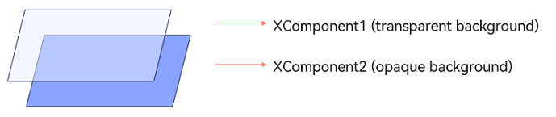
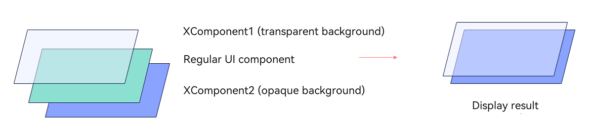
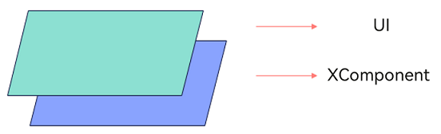

# XComponent

**XComponent** provides a surface for graphics rendering and media data input into your view. You can customize the position and size of the surface as needed.

> **NOTE**
>
> This component is supported since API version 8. Updates will be marked with a superscript to indicate their earliest API version.
>
> This topic describes only system APIs provided by the module. For details about its public APIs, see [XComponent](ts-basic-components-xcomponent.md).

## APIs

### XComponentOptions12+

Defines the options of the **XComponent**.

**System capability**: SystemCapability.ArkUI.ArkUI.Full

**Parameters**

| Name  | Type   | Mandatory| Description                  |
| -------- | ------- | ---- | ---------------------- |
| screenId17+ | number | No| Associated screen ID of the component. The component can display the image of the associated screen. **System API**: This is a system API.|

  > **NOTE**
  >
  > This attribute is effective only when **type** is set to **SURFACE**.
  >
  > It is not supported for **XComponent** components created using the [ArkUI NDK API](../../../ui/ndk-build-ui-overview.md).

## Attributes

### enableTransparentLayer18+

enableTransparentLayer(enabled: boolean)

Enables an independent layer for the **XComponent** component with a semi-transparent background color.

Using this API does not necessarily mean that an independent layer will be set. Due to some reasons such as hardware specifications (for example, lack of hardware support for independent layer compositing) and software specifications (for example, intersection with UI elements that have blur effects), the attempt to set an independent layer may fail.

To use this API effectively and avoid display issues, follow these guidelines:

1. If an **XComponent** with an independent layer overlaps with another **XComponent** below it, the **XComponent** below it should also be configured with an independent layer.

2. Do not place UI components under an **XComponent** with a transparent background and an independent layer. Otherwise, the displayed content of the UI components will disappear during composition.

Ensure that **XComponent** components with independent layers are placed below all intersecting UI elements.

3. Use this API in static layout scenarios, such as non-page transition or static video subtitle display scenarios.

**System API**: This attribute can be used in system APIs since API version 18.

**System capability**: SystemCapability.ArkUI.ArkUI.Full

**Parameters**

| Name  | Type    | Mandatory| Description                  |
| ------- | ------- | ---- | ---------------------- |
| enabled | boolean | Yes  | Whether to enable an independent layer for the **XComponent** component when its background is transparent. The value **true** means to enable an independent layer, and **false** means the opposite. Default value: **false**.|

  > **NOTE**
  >
  > This attribute is effective only when **type** is set to **SURFACE**.
  >
  > It is not supported for **XComponent** components created using the [ArkUI NDK API](../../../ui/ndk-build-ui-overview.md).
