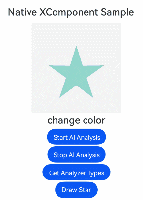

# XComponent

**XComponent** provides a [surface](../../../ui/napi-xcomponent-guidelines.md#how-custom-drawing-works) for graphics rendering and media data input into your view. You can customize the position and size of the surface as needed. For details, see [Native XComponent](../../../ui/napi-xcomponent-guidelines.md).

> **NOTE**
>
> This component is supported since API version 8. Updates will be marked with a superscript to indicate their earliest API version.


## Child Components
Not supported

## APIs

### XComponent<sup>19+</sup>

XComponent(params: NativeXComponentParameters)

Obtains an **XComponent** node instance on the native side, and registers the lifecycle callbacks for the surface held by the **XComponent** and the callbacks for component events, such as touch, mouse, and key events.

**Atomic service API**: This API can be used in atomic services since API version 19.

**System capability**: SystemCapability.ArkUI.ArkUI.Full

**Parameters**

| Name | Type                               | Mandatory| Description                          |
| ------- | --------------------------------------- | ---- | ------------------------------ |
| params | [NativeXComponentParameters](#nativexcomponentparameters19) | Yes  | Options of the **XComponent**.|

### XComponent<sup>12+</sup>

XComponent(options: XComponentOptions)

Creates an **XComponent** component, allowing you to obtain the **SurfaceId** value on the ArkTS side, register the lifecycle callbacks for the surface held by the **XComponent** and the callbacks for component events such as touch, mouse, and key events, and configure the AI analyzer feature.

**Atomic service API**: This API can be used in atomic services since API version 12.

**System capability**: SystemCapability.ArkUI.ArkUI.Full

**Parameters**

| Name | Type                               | Mandatory| Description                          |
| ------- | --------------------------------------- | ---- | ------------------------------ |
| options | [XComponentOptions](#xcomponentoptions12) | Yes  | Options of the **XComponent**.|

### XComponent<sup>10+</sup>

XComponent(value: {id: string, type: XComponentType, libraryname?: string, controller?: XComponentController})

Creates an **XComponent** component, whose lifecycle callbacks can be triggered from the native side.

This API is deprecated since API version 12. You are advised to use [XComponent(options: XComponentOptions)](#xcomponent12) instead.

**Atomic service API**: This API can be used in atomic services since API version 12.

**System capability**: SystemCapability.ArkUI.ArkUI.Full

**Parameters**

| Name     | Type                                     | Mandatory| Description                                                        |
| ----------- | --------------------------------------------- | ---- | ------------------------------------------------------------ |
| id          | string                                        | Yes  | Unique ID of the component. The value can contain a maximum of 128 characters.                   |
| type        | [XComponentType](ts-appendix-enums.md#xcomponenttype10)   | Yes  | Type of the component.                                |
| libraryname | string                                        | No  | Name of the dynamic library compiled and output by the native layer (the corresponding dynamic library does not support cross-module loading). This parameter is effective only when **type** is **SURFACE** or **TEXTURE**.|
| controller  | [XComponentController](#xcomponentcontroller) | No  | Controller bound to the component, which can be used to invoke methods of the component. This parameter is effective only when **type** is **SURFACE** or **TEXTURE**.|

### XComponent<sup>(deprecated)</sup>

XComponent(value: {id: string, type: string, libraryname?: string, controller?: XComponentController})

> **NOTE**
>
> This API is deprecated since API version 12. You are advised to use [XComponent(options: XComponentOptions)](#xcomponent12) instead.

**System capability**: SystemCapability.ArkUI.ArkUI.Full

**Parameters**

| Name     | Type                                     | Mandatory| Description                                                        |
| ----------- | --------------------------------------------- | ---- | ------------------------------------------------------------ |
| id          | string                                        | Yes  | Unique ID of the component. The value can contain a maximum of 128 characters.                   |
| type        | string                                        | Yes  | Type of the component. The options are as follows:<br>- **"surface"**: The custom content is displayed individually on the screen. This option is used for displaying EGL/OpenGL ES and media data.<br>- **"component"**<sup>9+</sup>: The component acts a container where non-UI logic can be executed to dynamically load and display content.<br>Any other value is handled as **"surface"**.|
| libraryname | string                                        | No  | Name of the dynamic library compiled and output by the native layer (the corresponding dynamic library does not support cross-module loading). This parameter is effective only when **type** is **"surface"**.|
| controller  | [XComponentcontroller](#xcomponentcontroller) | No  | Controller bound to the component, which can be used to invoke methods of the component. This parameter is valid only when the component type is **"surface"**.|

## XComponentOptions<sup>12+</sup>

Defines the options of the **XComponent**.

**Atomic service API**: This API can be used in atomic services since API version 12.

**System capability**: SystemCapability.ArkUI.ArkUI.Full

| Name| Type| Read-Only| Optional| Description|
| -------- | -------- | -------- | -------- | -------- |
| type | [XComponentType](ts-appendix-enums.md#xcomponenttype10)         | No| No  | Type of the component.|
| controller | [XComponentController](#xcomponentcontroller) | No| No| Controller bound to the component, which can be used to invoke methods of the component. This parameter is effective only when **type** is **SURFACE** or **TEXTURE**.|
| imageAIOptions | [ImageAIOptions](ts-image-common.md#imageaioptions) | No| Yes| AI image analysis options. You can configure the analysis type or bind an analyzer controller through this parameter.|

## NativeXComponentParameters<sup>19+</sup>

Defines the options of the **XComponent**. This API allows the corresponding [FrameNode](../js-apis-arkui-frameNode.md) to be passed to the native side to use NDK APIs for building UIs, [listening for component events](../../../ui/ndk-listen-to-component-events.md), and managing surface lifecycle settings.

**Atomic service API**: This API can be used in atomic services since API version 19.

**System capability**: SystemCapability.ArkUI.ArkUI.Full

| Name| Type| Read-Only| Optional| Description|
| -------- | -------- | -------- | -------- | -------- |
| type | [XComponentType](ts-appendix-enums.md#xcomponenttype10)         | No| No  | Type of the component.|
| imageAIOptions | [ImageAIOptions](ts-image-common.md#imageaioptions) | No| Yes| AI image analysis options. You can configure the analysis type or bind an analyzer controller through this parameter.|

## Attributes
In addition to universal attributes, the following attributes are supported.
  > 
  > **NOTE**
  >
  > The **foregroundColor**, **obscured**, and **pixelStretchEffect** attributes are not supported. When **type** is set to **SURFACE**, the following are not supported either: attribute modifier, custom drawing, background options (except **backgroundColor**), image effects (except **shadow**), **maskShape**, and **foregroundEffect** attributes.
  >
  > For the **XComponent** component of the TEXTURE or SURFACE type, if the [renderFit](./ts-universal-attributes-renderfit.md) attribute is not set, it defaults to **RenderFit.RESIZE_FILL**.
  > 
  > For the XComponent component of the SURFACE type with an opaque black background color: In versions earlier than API version 18, the [renderFit](./ts-universal-attributes-renderfit.md) attribute only supports RenderFit.RESIZE_FILL; since API version 18, the **renderFit** attribute supports all its available enum values.
  > 
  > For the **XComponent** component created using the [ArkUI NDK API](../../../ui/ndk-access-the-arkts-page.md), the [getAttribute](../_ark_u_i___native_node_a_p_i__1.md#getattribute) function is not supported for obtaining the **renderFit** attribute value.

### enableAnalyzer<sup>12+</sup>

enableAnalyzer(enable: boolean)

Sets whether to enable the AI image analyzer, which supports subject recognition, text recognition, and object lookup.
For the settings to take effect, this attribute must be used together with [StartImageAnalyzer](#startimageanalyzer12) and [StopImageAnalyzer](#stopimageanalyzer12) of **XComponentController**.
This feature cannot be used together with the [overlay](ts-universal-attributes-overlay.md) attribute. If both are set, the **CustomBuilder** attribute in **overlay** has no effect. This feature also depends on device capabilities.

**Atomic service API**: This API can be used in atomic services since API version 12.

**System capability**: SystemCapability.ArkUI.ArkUI.Full

**Parameters**

| Name| Type| Mandatory| Description|
| -------- | -------- | -------- | -------- |
| enable | boolean | Yes| Whether to enable the AI image analyzer.<br>true: Enable the image analysis function. false: Disable the image analysis function.<br>Default value: **false**.|

  > **NOTE**
  >
  > This API has effect only when **type** is set to **SURFACE** or **TEXTURE**.

### enableSecure<sup>13+</sup>

enableSecure(isSecure: boolean)

Sets whether to enable the secure surface to protect the content rendered within the component from being captured or recorded.

**Atomic service API**: This API can be used in atomic services since API version 13.

**System capability**: SystemCapability.ArkUI.ArkUI.Full

**Parameters**

| Name  | Type   | Mandatory| Description                  |
| -------- | ------- | ---- | ---------------------- |
| isSecure | boolean | Yes  | Whether to enable the secure surface.<br>The value **true** means to enable the secure surface, and **false** means the opposite.<br>Default value: **false**.|

  > **NOTE**
  >
  > This attribute is effective only when **type** is set to **SURFACE**.
  >
  > The **XComponent** created using the[ArkUI NDK APIs](../../../ui/ndk-build-ui-overview.md) is not supported.

### hdrBrightness<sup>20+</sup>

hdrBrightness(brightness: number)

Sets the brightness of HDR video playback for the component.

**Atomic service API**: This API can be used in atomic services since API version 20.

**System capability**: SystemCapability.ArkUI.ArkUI.Full

**Parameters**

| Name  | Type   | Mandatory| Description                  |
| -------- | ------- | ---- | ---------------------- |
| brightness | number | Yes  | Brightness of HDR video playback.<br>Value range: 0.0 to 1.0.<br>Values less than 0 are equivalent to 0, and values greater than 1 are equivalent to 1.<br>**0** indicates the brightness of the SDR video, and **1** indicates the brightness of the HDR video.|

  > **NOTE**
  >
  > This attribute is effective only when **type** is set to **SURFACE**.
  >
  > The **XComponent** created using the[ArkUI NDK APIs](../../../ui/ndk-build-ui-overview.md) is not supported.

## Events

Since API version 12, the [universal events](ts-universal-events-click.md) are supported when **type** is set to **SURFACE** or **TEXTURE**.

> **NOTE**
>
> When the **libraryname** parameter is set, [click events](ts-universal-events-click.md), [touch events](ts-universal-events-touch.md), [show/hide events](ts-universal-events-show-hide.md), [key events](ts-universal-events-key.md), [focus events](ts-universal-focus-event.md), and [mouse events](ts-universal-mouse-key.md) only respond to event APIs on the C API side.

The following events are effective only when **type** is set to **SURFACE** or **TEXTURE**.

### onLoad

onLoad(callback: OnNativeLoadCallback )

Triggered when the plugin is loaded.

**Atomic service API**: This API can be used in atomic services since API version 12.

**System capability**: SystemCapability.ArkUI.ArkUI.Full

**Parameters**

| Name  | Type  | Mandatory  | Description                                      |
| ----- | ------ | ---- | ---------------------------------------- |
| callback | [OnNativeLoadCallback](#onnativeloadcallback18) | Yes   | Callback after the surface held by the **XComponent** is created.|

> **NOTE**
> 
> When you create an **XComponent** using a custom component node, the **onLoad** callback is triggered before the [onSurfaceCreated](#onsurfacecreated12) callback. This means that calling [getXComponentSurfaceId](#getxcomponentsurfaceid9) in the **onLoad** callback will not return a valid **surfaceId**. You are advised to obtain the **surfaceId** in the [onSurfaceCreated](#onsurfacecreated12) callback instead.

### onDestroy

onDestroy(event: VoidCallback )

Triggered when the plugin is destroyed.

**Atomic service API**: This API can be used in atomic services since API version 12.

**System capability**: SystemCapability.ArkUI.ArkUI.Full

**Parameters**

| Name  | Type  | Mandatory  | Description                                      |
| ----- | ------ | ---- | ---------------------------------------- |
| event | [VoidCallback](ts-types.md#voidcallback12) | Yes   | Callback after the **XComponent** is destroyed.|

## OnNativeLoadCallback<sup>18+</sup>

type OnNativeLoadCallback = (event?: object) =\> void

Triggered after the surface held by the **XComponent** is created.

**Atomic service API**: This API can be used in atomic services since API version 18.

**System capability**: SystemCapability.ArkUI.ArkUI.Full

**Parameters**

| Name  | Type  | Mandatory  | Description                                      |
| ----- | ------ | ---- | ---------------------------------------- |
| event | object | No   | Context of the **XComponent** object. The APIs contained in the context are defined at the native layer by developers.|

## XComponentController

Defines the controller of the **XComponent**. You can bind the controller to the **XComponent** to call the component APIs through the controller.

**Atomic service API**: This API can be used in atomic services since API version 12.

**System capability**: SystemCapability.ArkUI.ArkUI.Full

### constructor

constructor()

A constructor used to create a **XComponentController** instance.

```ts
xcomponentController: XComponentController = new XComponentController();
```

**Atomic service API**: This API can be used in atomic services since API version 12.

**System capability**: SystemCapability.ArkUI.ArkUI.Full

### getXComponentSurfaceId<sup>9+</sup>

getXComponentSurfaceId(): string

Obtains the ID of the surface held by the **XComponent**, which can then be used for @ohos APIs. For details, see [Camera Management](../../apis-camera-kit/arkts-apis-camera.md). This API works only when **type** of the **XComponent** is set to **SURFACE("surface")** or **TEXTURE**.

**Atomic service API**: This API can be used in atomic services since API version 12.

**System capability**: SystemCapability.ArkUI.ArkUI.Full

**Return value**

| Type    | Description                     |
| ------ | ----------------------- |
| string | ID of the surface held by the **XComponent**.|


### setXComponentSurfaceSize<sup>(deprecated)</sup>

setXComponentSurfaceSize(value: {surfaceWidth: number, surfaceHeight: number}): void

Sets the width and height of the surface held by the **XComponent**. This API works only when **type** of the **XComponent** is set to **SURFACE("surface")** or **TEXTURE**.

This API is deprecated since API version 12. You are advised to use [setXComponentSurfaceRect](#setxcomponentsurfacerect12) instead.

**System capability**: SystemCapability.ArkUI.ArkUI.Full

**Parameters**

| Name          | Type  | Mandatory  | Description                     |
| ------------- | ------ | ---- | ----------------------- |
| surfaceWidth  | number | Yes   | Width of the surface held by the **XComponent**.|
| surfaceHeight | number | Yes   | Height of the surface held by the **XComponent**.|


### getXComponentContext

getXComponentContext(): Object

Obtains the context of an **XComponent** object. This API works only when **type** of the **XComponent** is set to **SURFACE("surface")** or **TEXTURE**.

**Atomic service API**: This API can be used in atomic services since API version 12.

**System capability**: SystemCapability.ArkUI.ArkUI.Full

**Return value**

| Type  | Description                                                        |
| ------ | ------------------------------------------------------------ |
| Object | Context of the **XComponent** object. The APIs contained in the context are defined by developers. The context is passed in as the first parameter of the **onLoad** callback.|

### setXComponentSurfaceRect<sup>12+</sup>

setXComponentSurfaceRect(rect: SurfaceRect): void

Sets the display area for the surface held by the **XComponent**, including the width, height, and position coordinates relative to the upper left corner of the component. This API is only effective when the **XComponent** type is **SURFACE("surface")** or **TEXTURE**.

**Atomic service API**: This API can be used in atomic services since API version 12.

**System capability**: SystemCapability.ArkUI.ArkUI.Full

**Parameters**

| Name| Type                            | Mandatory| Description                             |
| ------ | ------------------------------------ | ---- | --------------------------------- |
| rect   | [SurfaceRect](#surfacerect12) | Yes  | Rectangle of the surface held by the **XComponent**.|

> **NOTE**
>
> If **offsetX** or **offsetY** in the **rect** parameter is not set, the surface rectangle is centered along the x-axis or y-axis relative to the upper left corner of the **XComponent**.
>
> If **surfaceWidth** and **surfaceHeight** in the **rect** parameter are set to **0** or a negative value, this API has no effect.
>
> This API has a higher priority than attributes that can change the content offset and size, such as [border](ts-universal-attributes-border.md#border) and [padding](ts-universal-attributes-size.md#padding).

### getXComponentSurfaceRect<sup>12+</sup>

getXComponentSurfaceRect(): SurfaceRect

Obtains the display area for the surface held by the **XComponent**, including the width, height, and position coordinates relative to the upper left corner of the component. This API is only effective when the **XComponent** type is **SURFACE("surface")** or **TEXTURE**.

**Atomic service API**: This API can be used in atomic services since API version 12.

**System capability**: SystemCapability.ArkUI.ArkUI.Full

**Return value**

| Type                                | Description                                 |
| ------------------------------------ | ------------------------------------- |
| [SurfaceRect](#surfacerect12) | Rectangle of the surface held by the **XComponent**.|

### onSurfaceCreated<sup>12+</sup>

onSurfaceCreated(surfaceId: string): void

Triggered when the surface held by the **XComponent** is created. This API works only when **type** of the **XComponent** is set to **SURFACE("surface")** or **TEXTURE**.

**Atomic service API**: This API can be used in atomic services since API version 12.

**System capability**: SystemCapability.ArkUI.ArkUI.Full

**Parameters**

| Name   | Type| Mandatory| Description                                             |
| --------- | -------- | ---- | ------------------------------------------------- |
| surfaceId | string   | Yes  | ID of the surface held by the **XComponent**.|

> **NOTE**
>
> The callback is triggered only when the **libraryname** parameter is not set for the **XComponent**.

### onSurfaceChanged<sup>12+</sup>

onSurfaceChanged(surfaceId: string, rect: SurfaceRect): void

Triggered when the surface held by the **XComponent** has its size changed (including the time when the **XComponent** is created with the specified size). This API works only when **type** of the **XComponent** is set to **SURFACE** (**"surface"**) or **TEXTURE**.

**Atomic service API**: This API can be used in atomic services since API version 12.

**System capability**: SystemCapability.ArkUI.ArkUI.Full

**Parameters**

| Name   | Type                             | Mandatory| Description                                                   |
| --------- | ------------------------------------- | ---- | ------------------------------------------------------- |
| surfaceId | string                                | Yes  | ID of the surface held by the **XComponent**.      |
| rect      | [SurfaceRect](#surfacerect12) | Yes  | Rectangle for displaying the surface held by the **XComponent**.|

> **NOTE**
>
> The callback is triggered only when the **libraryname** parameter is not set for the **XComponent**.

### onSurfaceDestroyed<sup>12+</sup>

onSurfaceDestroyed(surfaceId: string): void

Triggered when the surface held by the **XComponent** is destroyed. This API works only when **type** of the **XComponent** is set to **SURFACE** (**"surface"**) or **TEXTURE**.

**Atomic service API**: This API can be used in atomic services since API version 12.

**System capability**: SystemCapability.ArkUI.ArkUI.Full

**Parameters**

| Name   | Type| Mandatory| Description                                             |
| --------- | -------- | ---- | ------------------------------------------------- |
| surfaceId | string   | Yes  | ID of the surface held by the **XComponent**.|

> **NOTE**
>
> The callback is triggered only when the **libraryname** parameter is not set for the **XComponent**.

### startImageAnalyzer<sup>12+</sup>

startImageAnalyzer(config: ImageAnalyzerConfig): Promise\<void>

Starts AI image analysis in the given settings. Before calling this API, make sure the AI image analyzer is [enabled](#enableanalyzer12).<br>Because the image frame used for analysis is the one captured when this API is called, pay attention to the invoking time of this API.<br>If this API is repeatedly called before the execution is complete, an error callback is triggered.

> **NOTE**
> 
> The image analysis type cannot be dynamically modified.
> This API depends on device capabilities. If it is called on an incompatible device, an error code is returned.

**Atomic service API**: This API can be used in atomic services since API version 12.

**System capability**: SystemCapability.ArkUI.ArkUI.Full

**Parameters**

| Name| Type     | Mandatory| Description                                                                  |
| ------ | --------- | ---- | ---------------------------------------------------------------------- |
| config   | [ImageAnalyzerConfig](ts-image-common.md#imageanalyzerconfig) | Yes  | Settings of the AI image analyzer.|

**Return value**

| Type             | Description                                |
| ----------------- | ------------------------------------ |
| Promise\<void>  | Promise used to return the result.|

**Error codes**

For details about the error codes, see [AI Image Analyzer Error Codes](errorcode-image-analyzer.md).

| ID| Error Message                                     |
| -------- | -------------------------------------------- |
| 110001 | Image analysis feature is unsupported.               |
| 110002 | Image analysis is currently being executed.  |
| 110003 | Image analysis is stopped.  |

### stopImageAnalyzer<sup>12+</sup>

stopImageAnalyzer(): void

Stops AI image analysis. The content displayed by the AI image analyzer will be destroyed.

> **NOTE**
>
> If this API is called when the **startImageAnalyzer** API has not yet returned any result, an error callback is triggered.
>
> This feature depends on device capabilities.

**Atomic service API**: This API can be used in atomic services since API version 12.

**System capability**: SystemCapability.ArkUI.ArkUI.Full

### setXComponentSurfaceRotation<sup>12+</sup>

setXComponentSurfaceRotation(rotationOptions: SurfaceRotationOptions): void

Sets whether to lock the orientation of the surface held by this **XComponent** when the screen rotates. This API is effective only when the **XComponent** type is **SURFACE** (**"surface"**).

**Atomic service API**: This API can be used in atomic services since API version 12.

**System capability**: SystemCapability.ArkUI.ArkUI.Full

**Parameters**

| Name| Type                            | Mandatory| Description                             |
| ------ | ------------------------------------ | ---- | --------------------------------- |
| rotationOptions   | [SurfaceRotationOptions](#surfacerotationoptions12) | Yes| Whether to lock the orientation of the surface held by the current **XComponent** when the screen rotates.|

> **NOTE**
>
> If **rotationOptions** is not set, the surface held by this **XComponent** rotates with the screen by default.
>
> The orientation lock is only applied during the rotation process and is released once the rotation is complete.
>
> The setting takes effect only when the screen is rotated by 90°, that is, when it switches between landscape and portrait modes.
>
> Make sure the Buffer's width and height remain constant after locking the orientation to prevent distortion.

### getXComponentSurfaceRotation<sup>12+</sup>

getXComponentSurfaceRotation(): Required\<SurfaceRotationOptions>

Obtains whether the orientation of the surface held by this **XComponent** is locked when the screen rotates. This API is effective only when the **XComponent** type is **SURFACE** (**"surface"**).

**Atomic service API**: This API can be used in atomic services since API version 12.

**System capability**: SystemCapability.ArkUI.ArkUI.Full

**Return value**

| Type                                | Description                                 |
| ------------------------------------ | ------------------------------------- |
| Required<[SurfaceRotationOptions](#surfacerotationoptions12)> | Whether the orientation of the surface held by the current **XComponent** is locked when the screen rotates.|

### lockCanvas<sup>20+</sup>

lockCanvas(): DrawingCanvas | null

Obtains a canvas object for drawing content on the **XComponent** component. For details about the drawing methods, see [Canvas](../../apis-arkgraphics2d/arkts-apis-graphics-drawing-Canvas.md).

**Atomic service API**: This API can be used in atomic services since API version 20.

**System capability**: SystemCapability.ArkUI.ArkUI.Full

**Return value**
| Type                                | Description                                 |
| ------------------------------------ | ------------------------------------- |
| [DrawingCanvas](ts-drawingrenderingcontext.md#drawingcanvas12) \| null | Canvas object for drawing on the **XComponent** area, or **null** if it is unavailable.|

> **NOTE**
>
> This API returns **null** if the canvas object cannot be obtained due to the current state of the **XComponent** component. The possible causes are as follows:
>
> 1. The surface held by the **XComponent** has not been created yet (you can determine this by setting the [onLoad](#onload) or [onSurfaceCrearted](#onsurfacecreated12) callback, which is triggered after the surface is created).
>
> 2. A previous canvas object obtained using **lockCanvas()** has not been released with [unlockCanvasAndPost](#unlockcanvasandpost20).
>
> This API is only effective when the **XComponent** type is **TEXTURE** or **SURFACE**.
>
> After using this API, do not simultaneously obtain the **NativeWindow** instance on the NDK side and call related APIs for drawing. Doing so may cause buffer contention and context to occur, leading to rendering exceptions such as visual artifacts.
>
> This API must be used in conjunction with [unlockCanvasAndPost](#unlockcanvasandpost20). For the implementation example, see [Example 3: Drawing Content on the XComponent Using a Canvas Object](#example-3-drawing-content-on-the-xcomponent-using-a-canvas-object).

### unlockCanvasAndPost<sup>20+</sup>

unlockCanvasAndPost(canvas: DrawingCanvas): void

Submits the drawn content from a canvas object to the display area of the **XComponent** component and releases the canvas object.

**Atomic service API**: This API can be used in atomic services since API version 20.

**System capability**: SystemCapability.ArkUI.ArkUI.Full

**Parameters**
| Name| Type| Mandatory| Description|
| -------- | -------- | -------- | -------- |
| canvas | [DrawingCanvas](ts-drawingrenderingcontext.md#drawingcanvas12) | Yes| Canvas object previously obtained using **lockCanvas()**.|

> **NOTE**
>
> 1. Once released using **unlockCanvasAndPost()**, a canvas object becomes immediately unusable.
>
> 2. This API is only effective when the **XComponent** type is **TEXTURE** or **SURFACE**.
>
> 3. After using this API, do not simultaneously obtain the **NativeWindow** instance on the NDK side and call related APIs for drawing. Doing so may cause buffer contention and context to occur, leading to rendering exceptions such as visual artifacts.
>
> 4. This API must be used in conjunction with [lockCanvas](#lockcanvas20). For the implementation example, see [Example 3: Drawing Content on the XComponent Using a Canvas Object](#example-3-drawing-content-on-the-xcomponent-using-a-canvas-object).

## SurfaceRotationOptions<sup>12+</sup>

Defines whether the orientation of the surface held by the current **XComponent** is locked when the screen rotates.

**Atomic service API**: This API can be used in atomic services since API version 12.

**System capability**: SystemCapability.ArkUI.ArkUI.Full

| Name         | Type  | Read-Only| Optional| Description                                                        |
| ------------- | ------ | ------ | ---- | ------------------------------------------------------------ |
| lock       | boolean | No| Yes  | Whether the orientation of the surface is locked when the screen rotates. If this parameter is not set, the default value **false** is used, indicating that the orientation is not locked.<br>**true**: The orientation of the surface is locked when the screen rotates.<br>**false**: The orientation of the surface is not locked when the screen rotates.|

## SurfaceRect<sup>12+</sup>

Describes the rectangle of the surface held by the **XComponent**.

**Atomic service API**: This API can be used in atomic services since API version 12.

**System capability**: SystemCapability.ArkUI.ArkUI.Full

| Name         | Type  | Read-Only| Optional| Description                                                        |
| ------------- | ------ | ------ | ---- | ------------------------------------------------------------ |
| offsetX       | number | No  | Yes  | X coordinate of the surface rectangle relative to the upper left corner of the **XComponent**.<br>Unit: px|
| offsetY       | number | No  | Yes  | Y coordinate of the surface rectangle relative to the upper left corner of the **XComponent**.<br>Unit: px|
| surfaceWidth  | number | No  | No  | Width of the surface rectangle.<br>Unit: px.                           |
| surfaceHeight | number | No  | No  | Height of the surface rectangle.<br>Unit: px.                           |

> **NOTE**
>
> The **surfaceWidth** and **surfaceHeight** attributes default to the size of the **XComponent** if the [setXComponentSurfaceRect](ts-basic-components-xcomponent.md#setxcomponentsurfacerect12) API is not called and neither [border](ts-universal-attributes-border.md#border) nor [padding](ts-universal-attributes-size.md#padding) is set.
> 
> Make sure the values of **surfaceWidth** and **surfaceHeight** do not exceed 8192 px. Exceeding this limit may lead to rendering issues.
>
> In immersive scenarios, the default layout of **SurfaceRect** does not include the safe area. To achieve an immersive effect, you must set the surface display area using the [setXComponentSurfaceRect](ts-basic-components-xcomponent.md#setxcomponentsurfacerect12) API.

## Example

You can preview how this component looks on a real device, but not in DevEco Studio Previewer.


### Example 1: Enabling AI Image Analyzer

This example shows how to use the **enableAnalyzer** attribute to enable AI image analyzer. You can use **XComponentController** to start or stop AI analysis on images.

```ts
// xxx.ets
import { BusinessError } from '@kit.BasicServicesKit';
import nativeRender from 'libnativerender.so';// Your own .so file implementation (see above for details).

class CustomXComponentController extends XComponentController {
  onSurfaceCreated(surfaceId: string): void {
    console.info(`onSurfaceCreated surfaceId: ${surfaceId}`);
    nativeRender.SetSurfaceId(BigInt(surfaceId));
  }

  onSurfaceChanged(surfaceId: string, rect: SurfaceRect): void {
    console.info(`onSurfaceChanged surfaceId: ${surfaceId}, rect: ${JSON.stringify(rect)}}`);
    nativeRender.ChangeSurface(BigInt(surfaceId), rect.surfaceWidth, rect.surfaceHeight);
  }

  onSurfaceDestroyed(surfaceId: string): void {
    console.info(`onSurfaceDestroyed surfaceId: ${surfaceId}`);
    nativeRender.DestroySurface(BigInt(surfaceId));
  }
}

@Entry
@Component
struct XComponentExample {
  xComponentController: XComponentController = new CustomXComponentController();
  private config: ImageAnalyzerConfig = {
    types: [ImageAnalyzerType.SUBJECT, ImageAnalyzerType.TEXT]
  };
  private aiController: ImageAnalyzerController = new ImageAnalyzerController();
  private options: ImageAIOptions = {
    types: [ImageAnalyzerType.SUBJECT, ImageAnalyzerType.TEXT],
    aiController: this.aiController
  };
  @State xcWidth: string = "720px";
  @State xcHeight: string = "720px";
  @State currentStatus: string = "index";

  build() {
    Column({ space: 5 }) {
      Row() {
        Text('Native XComponent Sample')
          .fontSize('24fp')
          .fontWeight(500)
          .margin({
            left: 24,
            top: 12
          })
      }
      .margin({ top: 24 })
      .width('100%')
      .height(56)

      XComponent({
        type: XComponentType.SURFACE,
        controller: this.xComponentController,
        imageAIOptions: this.options
      })
        .width(this.xcWidth)
        .height(this.xcHeight)
        .enableAnalyzer(true)
        .onClick(() => {
          let surfaceId = this.xComponentController.getXComponentSurfaceId();
          nativeRender.ChangeColor(BigInt(surfaceId));
          let hasChangeColor: boolean = false;
          if (nativeRender.GetXComponentStatus(BigInt(surfaceId))) {
            hasChangeColor = nativeRender.GetXComponentStatus(BigInt(surfaceId)).hasChangeColor;
          }
          if (hasChangeColor) {
            this.currentStatus = "change color";
          }
        })
      Text(this.currentStatus)
        .fontSize('24fp')
        .fontWeight(500)
      Column() {
        Button('start AI analyze')
          .onClick(() => {
            this.xComponentController.startImageAnalyzer(this.config)
              .then(() => {
                console.info("analysis complete");
              })
              .catch((error: BusinessError) => {
                console.error("error code: " + error.code);
              })
          })
          .margin(2)
        Button('stop AI analyze')
          .onClick(() => {
            this.xComponentController.stopImageAnalyzer();
          })
          .margin(2)
        Button('get analyzer types')
          .onClick(() => {
            this.aiController.getImageAnalyzerSupportTypes();
          })
          .margin(2)
        Button('Draw Star')
          .fontSize('16fp')
          .fontWeight(500)
          .margin({ bottom: 24 })
          .onClick(() => {
            let surfaceId = this.xComponentController.getXComponentSurfaceId();
            this.xComponentController.getXComponentSurfaceRect();
            nativeRender.DrawPattern(BigInt(surfaceId));
            let hasDraw: boolean = false;
            if (nativeRender.GetXComponentStatus(BigInt(surfaceId))) {
              hasDraw = nativeRender.GetXComponentStatus(BigInt(surfaceId)).hasDraw;
            }
            if (hasDraw) {
              this.currentStatus = "draw star";
            }
          })
          .margin(2)
      }.justifyContent(FlexAlign.Center)
    }
    .width("100%")
  }
}
```



### Example 2: Locking the Surface Orientation During Screen Rotation

This example shows how to use **setXComponentSurfaceRotation** to lock the surface orientation during screen rotation so that the surface does not rotate with the screen.

```ts
// xxx.ets
import nativeRender from 'libnativerender.so';

class MyXComponentController extends XComponentController {
  onSurfaceCreated(surfaceId: string): void {
    console.log(`onSurfaceCreated surfaceId: ${surfaceId}`);
    nativeRender.SetSurfaceId(BigInt(surfaceId));
  }

  onSurfaceChanged(surfaceId: string, rect: SurfaceRect): void {
    console.log(`onSurfaceChanged surfaceId: ${surfaceId}, rect: ${JSON.stringify(rect)}}`);
    nativeRender.ChangeSurface(BigInt(surfaceId), rect.surfaceWidth, rect.surfaceHeight);
  }

  onSurfaceDestroyed(surfaceId: string): void {
    console.log(`onSurfaceDestroyed surfaceId: ${surfaceId}`);
    nativeRender.DestroySurface(BigInt(surfaceId));
  }
}

@Entry
@Component
struct Index {
  @State isLock: boolean = true;
  @State xc_width: number = 500;
  @State xc_height: number = 700;
  myXComponentController: XComponentController = new MyXComponentController();

  build() {
    Flex({ direction: FlexDirection.Column, alignItems: ItemAlign.Center, justifyContent: FlexAlign.Start }) {
      XComponent({
        id: "XComponent",
        type: XComponentType.SURFACE,
        controller: this.myXComponentController
      })
        .onLoad(() => {
          let surfaceRotation: SurfaceRotationOptions = { lock: this.isLock };
          this.myXComponentController.setXComponentSurfaceRotation(surfaceRotation);
          console.log("Surface getXComponentSurfaceRotation lock = " +
          this.myXComponentController.getXComponentSurfaceRotation().lock);
        })
        .width(this.xc_width)
        .height(this.xc_height)
      Button("Draw")
        .onClick(() => {
          let surfaceId = this.myXComponentController.getXComponentSurfaceId();
          nativeRender.DrawPattern(BigInt(surfaceId));
        })
    }
  }
}
```

### Example 3: Drawing Content on the XComponent Using a Canvas Object

This example shows how to call **lockCanvas** to obtain a canvas object, use the canvas object to call corresponding drawing API, and finally call **unlockCanvasAndPost** to render the content on the **XComponent** component.

```ts
// xxx.ets
import { drawing } from '@kit.ArkGraphics2D';

@Entry
@Component
struct Index {
  private xcController: XComponentController = new XComponentController();
  private mCanvas: DrawingCanvas | null = null;

  build() {
    Column() {
      XComponent({ type: XComponentType.SURFACE, controller: this.xcController })
        .width("80%")
        .height("80%")
        .onLoad(() => {
          this.mCanvas = this.xcController.lockCanvas();
          if (this.mCanvas) {
            this.mCanvas.drawColor(255, 240, 250, 255); // Before each drawing, the entire XComponent area must be fully redrawn; this method can be used to achieve this.
            const brush = new drawing.Brush(); // Create a brush object.
            brush.setColor({ // Set the color of the brush.
              alpha: 255,
              red: 39,
              green: 135,
              blue: 217
            });
            this.mCanvas.attachBrush(brush); // Attach the brush to the canvas.
            this.mCanvas.drawRect({ // Draw a rectangle.
              left: 300,
              right: 800,
              top: 100,
              bottom: 800
            });
            this.mCanvas.detachBrush(); // Detach the brush from the canvas.
            this.xcController.unlockCanvasAndPost(this.mCanvas);
          }
        })
    }
    .height('100%')
    .width('100%')
  }
}
```

<!--no_check-->