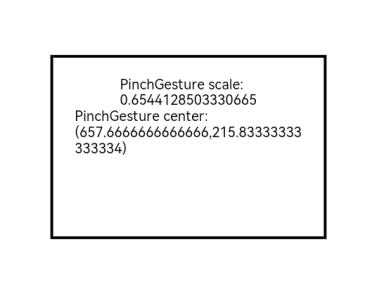

# PinchGesture

**PinchGesture** is used to trigger a pinch gesture, which requires two to five fingers with a minimum 5 vp distance between the fingers.

>  **NOTE**
>
>  This gesture is supported since API version 7. Updates will be marked with a superscript to indicate their earliest API version.


## APIs

PinchGesture(value?: { fingers?: number, distance?: number })

**Atomic service API**: This API can be used in atomic services since API version 11.

**Parameters**

| Name| Type| Mandatory| Description|
| -------- | -------- | -------- | -------- |
| fingers | number | No| Minimum number of fingers to trigger a pinch. The value ranges from 2 to 5.<br>Default value: **2**<br>While more fingers than the minimum number can be pressed to trigger the gesture, only the first fingers of the minimum number participate in gesture calculation.|
| distance | number | No| Minimum recognition distance, in vp.<br>Default value: **5**<br>**NOTE**<br>Value range: [0, +∞). If the value is less than or equal to 0, the default value is used.|
| isFingerCountLimited<sup>15+</sup> | boolean | No| Whether to enforce the exact number of fingers touching the screen. With the value **true**, the gesture recognition fails if the number of fingers touching the screen does not match the configured value of **fingers**. The gesture can only be successfully recognized if the number of fingers equals the configured minimum and the swipe distance meets the threshold. Note that only the first two fingers that touch the screen are considered for the gesture. If one of these fingers is lifted, the gesture recognition fails. For gestures that have already been successfully recognized, changing the number of fingers touching the screen will not trigger the [onActionUpdate](ts-basic-gestures-pinchgesture.md#events) event, but the [onActionEnd](ts-basic-gestures-pinchgesture.md#events) event can still be triggered.<br>Default value: **false**|


## Events

| Name| Description|
| -------- | -------- |
| onActionStart(event:(event: [GestureEvent](ts-gesture-settings.md#gestureevent)) =&gt; void) | Triggered when a pinch gesture is recognized.<br>**Atomic service API**: This API can be used in atomic services since API version 11.|
| onActionUpdate(event:(event: [GestureEvent](ts-gesture-settings.md#gestureevent)) =&gt; void) | Triggered when the user moves the finger in the pinch gesture on the screen.<br>**Atomic service API**: This API can be used in atomic services since API version 11.|
| onActionEnd(event:(event: [GestureEvent](ts-gesture-settings.md#gestureevent)) =&gt; void) | Triggered when the fingers used for the pinch gesture are lifted.<br>**Atomic service API**: This API can be used in atomic services since API version 11.|
| onActionCancel(event: () =&gt; void) | Triggered when a tap cancellation event is received after the pinch gesture is recognized. No gesture event information is returned.<br>**Atomic service API**: This API can be used in atomic services since API version 11.|
| onActionCancel(event:(event: [GestureEvent](ts-gesture-settings.md#gestureevent)) =&gt; void)<sup>18+</sup> | Triggered when a tap cancellation event is received after the pinch gesture is recognized. Gesture event information is returned.<br>**Atomic service API**: This API can be used in atomic services since API version 18.|

## Attributes

| Name| Type   |Description                                       |
| ----  | ------  | ---------------------------------------- |
| tag<sup>11+</sup>   | string  | Tag for the pinch gesture. It is used to distinguish the gesture during custom gesture recognition.<br>**Atomic service API**: This API can be used in atomic services since API version 11.|
| allowedTypes<sup>14+</sup> | Array\<[SourceTool](ts-gesture-settings.md#sourcetool9)> | Allowed event input types for the pinch gesture.<br>**Atomic service API**: This API can be used in atomic services since API version 14.|

## Example

This example demonstrates the recognition of a three-finger pinch gesture using **PinchGesture**.

```ts
// xxx.ets
@Entry
@Component
struct PinchGestureExample {
  @State scaleValue: number = 1
  @State pinchValue: number = 1
  @State pinchX: number = 0
  @State pinchY: number = 0

  build() {
    Column() {
      Column() {
        Text('PinchGesture scale:\n' + this.scaleValue)
        Text('PinchGesture center:\n(' + this.pinchX + ',' + this.pinchY + ')')
      }
      .height(200)
      .width(300)
      .padding(20)
      .border({ width: 3 })
      .margin({ top: 100 })
      .scale({ x: this.scaleValue, y: this.scaleValue, z: 1 })
      // The gesture event is triggered by pinching three fingers together.
      .gesture(
      PinchGesture({ fingers: 3 })
        .onActionStart((event: GestureEvent) => {
          console.info('Pinch start')
        })
        .onActionUpdate((event: GestureEvent) => {
          if (event) {
            this.scaleValue = this.pinchValue * event.scale
            this.pinchX = event.pinchCenterX
            this.pinchY = event.pinchCenterY
          }
        })
        .onActionEnd((event: GestureEvent) => {
          this.pinchValue = this.scaleValue
          console.info('Pinch end')
        })
      )
    }.width('100%')
  }
}
```

 
