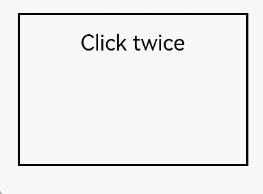

# TapGesture

**TapGesture** is used to trigger a tap gesture with one, two, or more taps.

>  **NOTE**
>
>  This gesture is supported since API version 7. Updates will be marked with a superscript to indicate their earliest API version.
>
>  When both double-tap and single-tap gestures are bound to a component with the double-tap gesture bound first, the single-tap gesture will have a 300 ms delay.


## APIs

TapGesture(value?: TapGestureParameters)

Triggers a tap gesture with one or more taps. When the gesture is triggered by a keyboard or gamepad, the value of **SourceTool** is **Unknown**.

**Atomic service API**: This API can be used in atomic services since API version 11.

**System capability**: SystemCapability.ArkUI.ArkUI.Full

**Parameters**

| Name| Type| Mandatory| Description|
| -------- | -------- | -------- | -------- |
| value | [TapGestureParameters](#tapgestureparameters12) | No| Parameters related to the tap gesture.|

## TapGestureParameters<sup>12+</sup>

**Atomic service API**: This API can be used in atomic services since API version 12.

**System capability**: SystemCapability.ArkUI.ArkUI.Full

| Name| Type| Mandatory| Description|
| -------- | -------- | -------- | -------- |
| count | number | No| Number of consecutive taps. If the value is less than 1 or is not set, the default value is used.<br>Default value: **1**<br>**NOTE**<br>1. If multi-tap is configured, the timeout interval between a lift and the next tap is 300 ms.<br>2. If the distance between the last tapped position and the current tapped position exceeds 60 vp, gesture recognition fails. In multi-finger scenarios, the tapped position is the average position of all fingers involved in the gesture response.|
| fingers | number | No| Number of fingers required to trigger a tap. The value ranges from 1 to 10. If the value is less than 1 or is not set, the default value is used.<br>Default value: **1**<br>**NOTE**<br>1. For a multi-finger gesture, recognition fails if the required number of fingers is not pressed within 300 ms after the first finger; when fingers are lifted, if the remaining number of fingers is below the threshold after lifting, all fingers must be lifted within 300 ms for the gesture to be successfully recognized.<br>2. When the number of fingers touching the screen exceeds the set value, the gesture can be recognized.|
| distanceThreshold | number | No| Movement threshold for the tap gesture. If the value is less than or equal to 0 or is not set, the default value is used.<br>Default value: 2^31-1<br>**NOTE**<br>If the finger movement exceeds the preset movement threshold, the tap gesture recognition fails. If the default threshold is used during initialization and the finger moves beyond the component's touch target, the tap gesture recognition fails.|
| isFingerCountLimited<sup>15+</sup> | boolean | No| Whether to enforce the exact number of fingers touching the screen. With the value **true**, the gesture recognition fails if the number of fingers touching the screen does not match the configured value of **fingers**.<br>In multi-tap events (where the **count** parameter is greater than 1), each tap must have the same number of fingers as the configured value; otherwise, the gesture recognition fails.<br>**true**: Enforce the exact number of fingers touching the screen.<br>**false**: Do not enforce the exact number of fingers touching the screen.<br>Default Value: **false**.|

## Events

>  **NOTE**
>
>  In **fingerList** of [GestureEvent](ts-gesture-settings.md#gestureevent), the index of a finger corresponds to its position, that is, the ID of a finger in **fingerList[index]** refers to its index. If a finger is pressed first and does not participate in triggering of the current gesture, its position in **fingerList** is left empty. You are advised to use **fingerInfos** when possible.

| Name| Description|
| -------- | -------- |
| onAction(event: (event: [GestureEvent](ts-gesture-settings.md#gestureevent)) =&gt; void) | Callback invoked when a tap gesture is recognized.<br>**Atomic service API**: This API can be used in atomic services since API version 11.|

## Attributes

| Name| Type   |Description                                       |
| ----  | ------  | ---------------------------------------- |
| tag<sup>11+</sup>   | string  | Tag for the tap gesture. It is used to distinguish the gesture during custom gesture judgment.<br>**Atomic service API**: This API can be used in atomic services since API version 11.|
| allowedTypes<sup>14+</sup> | Array\<[SourceTool](ts-gesture-settings.md#sourcetool9)> | Allowed event input types for the tap gesture.<br>**Atomic service API**: This API can be used in atomic services since API version 14.|

## EventLocationInfo<sup>20+</sup>

Provides coordinate information for tap gestures.

**Atomic service API**: This API can be used in atomic services since API version 20.

**System capability**: SystemCapability.ArkUI.ArkUI.Full

| Name| Type| Mandatory| Description|
| -------- | -------- | -------- | -------- |
| x | number | Yes| X coordinate relative to the upper left corner of the component.<br>Value range: [0, +∞).<br>Unit: vp.|
| y | number | Yes| Y coordinate relative to the upper left corner of the component.<br>Value range: [0, +∞).<br>Unit: vp.|
| windowX | number | Yes| X coordinate relative to the upper left corner of the window.<br>Value range: [0, +∞).<br>Unit: vp.|
| windowY | number | Yes| Y coordinate relative to the upper left corner of the window.<br>Value range: [0, +∞).<br>Unit: vp.|
| displayX | number | Yes| X coordinate relative to the upper left corner of the screen.<br>Value range: [0, +∞).<br>Unit: vp.|
| displayY | number | Yes| Y coordinate relative to the upper left corner of the screen.<br>Value range: [0, +∞).<br>Unit: vp.|

## Example

### Example 1: Implementing Double-Tap Gesture Recognition

This example demonstrates the recognition of a double-tap gesture using **TapGesture**.

```ts
// xxx.ets
@Entry
@Component
struct TapGestureExample {
  @State value: string = '';

  build() {
    Column() {
      // The gesture event is triggered by double-tapping.
      Text('Click twice').fontSize(28)
        .gesture(
        TapGesture({ count: 2 })
          .onAction((event: GestureEvent) => {
            if (event) {
              this.value = JSON.stringify(event.fingerList[0])
            }
          })
        )
      Text(this.value)
    }
    .height(200)
    .width(300)
    .padding(20)
    .border({ width: 3 })
    .margin(30)
  }
}
```



### Example 2: Obtaining Coordinates of a Single-Tap Gesture

This example demonstrates how to obtain the coordinates of a single-tap gesture using **TapGesture**.

```ts
// xxx.ets
@Entry
@Component
struct TapGestureExample {
  @State value: string = ''

  build() {
    Column() {
      Text('Click Once').fontSize(28)
        .gesture(
          TapGesture({ count: 1, fingers: 1 })
            .onAction((event: GestureEvent | undefined) => {
              if (event) {
                console.log("x = ", JSON.stringify(event.tapLocation?.x))
                console.log("y = ", event.tapLocation?.y)
                console.log("windowX = ", event.tapLocation?.windowX)
                console.log("windowY = ", event.tapLocation?.windowY)
                console.log("displayX = ", event.tapLocation?.displayX)
                console.log("displayY = ", event.tapLocation?.displayY)
              }
            })
        )
      Text(this.value)
    }
    .height(200)
    .width(300)
    .padding(20)
    .border({ width: 3 })
    .margin(30)
  }
}
```
