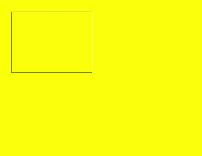
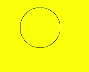
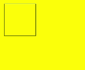
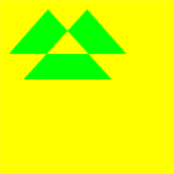
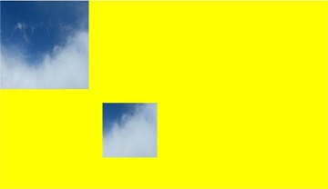

# CanvasRenderingContext2D

Use **RenderingContext** to draw rectangles, text, images, and other objects on a canvas.

> **NOTE**
>
> The APIs of this module are supported since API version 8. Updates will be marked with a superscript to indicate their earliest API version.


## APIs

CanvasRenderingContext2D(settings?: RenderingContextSettings, unit?: LengthMetricsUnit)

**Widget capability**: This API can be used in ArkTS widgets since API version 9.

**Atomic service API**: This API can be used in atomic services since API version 11.

**System capability**: SystemCapability.ArkUI.ArkUI.Full

**Parameters**

| Name     | Type | Mandatory  | Description   |
| -------- | ---------------------------------------- | ---- | ---------------------------------------- |
| settings | [RenderingContextSettings](#renderingcontextsettings) | No   | Settings of the **CanvasRenderingContext2D** object. For details, see [RenderingContextSettings](#renderingcontextsettings). |
| unit<sup>12+</sup>  | [LengthMetricsUnit](../js-apis-arkui-graphics.md#lengthmetricsunit12) | No   | Unit mode of the **CanvasRenderingContext2D** object. The value cannot be dynamically changed once set. For details, see [LengthMetricsUnit](#lengthmetricsunit12).<br>Default value: **DEFAULT** |


### RenderingContextSettings

RenderingContextSettings(antialias?: boolean)

Configures the settings of a **CanvasRenderingContext2D** object, including whether to enable antialiasing.

**Widget capability**: This API can be used in ArkTS widgets since API version 9.

**Atomic service API**: This API can be used in atomic services since API version 11.

**System capability**: SystemCapability.ArkUI.ArkUI.Full

**Parameters**

| Name      | Type   | Mandatory  | Description                         |
| --------- | ------- | ---- | ----------------------------- |
| antialias | boolean | No   | Whether to enable antialiasing.<br>Default value: **false** |

### LengthMetricsUnit<sup>12+</sup>

Unit mode of the **CanvasRenderingContext2D** object. The value cannot be dynamically changed once set. For details, see [LengthMetricsUnit](../js-apis-arkui-graphics.md#lengthmetricsunit12).

**Example**

```ts
// xxx.ets
import { LengthMetricsUnit } from '@kit.ArkUI'

@Entry
@Component
struct LengthMetricsUnitDemo {
  private settings: RenderingContextSettings = new RenderingContextSettings(true);
  private contextPX: CanvasRenderingContext2D = new CanvasRenderingContext2D(this.settings, LengthMetricsUnit.PX);
  private contextVP: CanvasRenderingContext2D = new CanvasRenderingContext2D(this.settings);

  build() {
    Flex({ direction: FlexDirection.Column, alignItems: ItemAlign.Center, justifyContent: FlexAlign.Center }) {
      Canvas(this.contextPX)
        .width('100%')
        .height(150)
        .backgroundColor('#ffff00')
        .onReady(() => {
          this.contextPX.fillRect(10,10,100,100)
          this.contextPX.clearRect(10,10,50,50)
        })

      Canvas(this.contextVP)
        .width('100%')
        .height(150)
        .backgroundColor('#ffff00')
        .onReady(() => {
          this.contextVP.fillRect(10,10,100,100)
          this.contextVP.clearRect(10,10,50,50)
        })
    }
    .width('100%')
    .height('100%')
  }
}
```


## Attributes

**Widget capability**: This API can be used in ArkTS widgets since API version 9.

**Atomic service API**: This API can be used in atomic services since API version 11.

**System capability**: SystemCapability.ArkUI.ArkUI.Full

| Name | Type | Read Only | Optional | Description |
| --------- | ------------------------------- | ------------------ | ---------------------- | ---------------------------------------- |
| [fillStyle](#fillstyle) | string \|number<sup>10+</sup> \|[CanvasGradient](ts-components-canvas-canvasgradient.md) \| [CanvasPattern](ts-components-canvas-canvaspattern.md#canvaspattern) | No | No | Style to fill an area.<br>- When the type is string, this attribute indicates the color of the fill area.<br>Default value: **'black'**<br>- When the type is number, this attribute indicates the color of the fill area.<br>Default value: **'#000000'**<br>- When the type is **CanvasGradient**, this attribute indicates a gradient object, which is created using the **[createLinearGradient](#createlineargradient)** API.<br>- When the type is **CanvasPattern**, this attribute indicates a pattern, which is created using the **[createPattern](#createpattern)** API. |
| [lineWidth](#linewidth) | number | No | No | Line width.<br>Default value: **1(px)**<br>Default unit: vp<br> The value cannot be **0** or a negative number. If it is set to **0** or a negative number, the default value is used instead.              |
| [strokeStyle](#strokestyle)              | string \|number<sup>10+</sup> \|[CanvasGradient](ts-components-canvas-canvasgradient.md) \| [CanvasPattern](ts-components-canvas-canvaspattern.md#canvaspattern)  | No | No | Stroke color.<br> <br>Default value: **'black'**<br> <br>Default value: **'#000000'**<br>- When the type is **CanvasGradient**, this attribute indicates a gradient object, which is created using the **[createLinearGradient](#createlineargradient)** API.<br>- When the type is **CanvasPattern**, this attribute indicates a pattern, which is created using the **[createPattern](#createpattern)** API. |
| [lineCap](#linecap)                      | [CanvasLineCap](#canvaslinecap) | No | No | Style of the line endpoints. The options are as follows:<br>- **'butt'**: The endpoints of the line are squared off.<br>- **'round'**: The endpoints of the line are rounded.<br>- **'square'**: The endpoints of the line are squared off by adding a box with an equal width and half the height of the line's thickness.<br>Default value: **'butt'** |
| [lineJoin](#linejoin)                    | [CanvasLineJoin](#canvaslinejoin) | No | No | Style of the shape used to join line segments. The options are as follows:<br>- **'round'**: The shape used to join line segments is a sector, whose radius at the rounded corner is equal to the line width.<br>- **'bevel'**: The shape used to join line segments is a triangle. The rectangular corner of each line is independent.<br>- **'miter'**: The shape used to join line segments has a mitered corner by extending the outside edges of the lines until they meet. You can view the effect of this attribute in **miterLimit**.<br>Default value: **'miter'** |
| [miterLimit](#miterlimit)                | number | No | No | Maximum miter length. The miter length is the distance between the inner corner and the outer corner where two lines meet.<br>Default value: **10**<br>Unit: px<br>The value cannot be **0** or a negative number. If it is set to **0** or a negative number, the default value is used instead. |
| [font](#font)                            | string | No | No | Font style.<br>Syntax: ctx.font='font-size font-family'<br>- (Optional) **font-size**: font size and line height. The unit can be px or vp.<br>- (Optional) **font-family**: font family.<br>Syntax: ctx.font='font-style font-weight font-size font-family'<br>- (Optional) **font-style**: font style. Available values are **'normal'** and **'italic'**.<br>- (Optional) **font-weight**: font weight. Available values are as follows: **'normal'**, **'bold'**, **'bolder'**, **'lighter'**, **'100'**, **'200'**, **'300'**, **'400'**, **'500'**, **'600'**, **'700'**, **'800'**, **'900'**.<br>- (Optional) **font-size**: font size and line height. The unit must be specified and can be px or vp.<br>- (Optional) **font-family**: font family. Available values are **'sans-serif'**, **'serif'**, and **'monospace'**.<br>Default value: **'normal normal 14px sans-serif'** |
| [textAlign](#textalign)                  | [CanvasTextAlign](#canvastextalign) | No | No | Text alignment mode. Available values are as follows:<br>- **'left'**: The text is left-aligned.<br>- **'right'**: The text is right-aligned.<br>- **'center'**: The text is center-aligned.<br>- **'start'**: The text is aligned with the start bound.<br>- **'end'**: The text is aligned with the end bound.<br>In the **ltr** layout mode, the value **'start'** equals **'left'**. In the **rtl** layout mode, the value **'start'** equals **'right'**.<br>Default value: **'left'** |
| [textBaseline](#textbaseline)            | [CanvasTextBaseline](#canvastextbaseline) | No | No | Horizontal alignment mode of text. Available values are as follows:<br>- **'alphabetic'**: The text baseline is the normal alphabetic baseline.<br>- **'top'**: The text baseline is on the top of the text bounding box.<br>- **'hanging'**: The text baseline is a hanging baseline over the text.<br>- **'middle'**: The text baseline is in the middle of the text bounding box.<br>**'ideographic'**: The text baseline is the ideographic baseline. If a character exceeds the alphabetic baseline, the ideographic baseline is located at the bottom of the excess character.<br>- **'bottom'**: The text baseline is at the bottom of the text bounding box. Its difference from the ideographic baseline is that the ideographic baseline does not consider letters in the next line.<br>Default value: **'alphabetic'** |
| [globalAlpha](#globalalpha)              | number | No | No | Opacity.<br>**0.0**: completely transparent.<br>**1.0**: completely opaque.<br>Default value: **1.0** |
| [lineDashOffset](#linedashoffset)        | number | No | No | Offset of the dashed line. The precision is float.<br>Default value: **0.0**<br>Unit: px |
| [globalCompositeOperation](#globalcompositeoperation) | string | No | No | Composition operation type. Available values are as follows: **'source-over'**, **'source-atop'**, **'source-in'**, **'source-out'**, **'destination-over'**, **'destination-atop'**, **'destination-in'**, **'destination-out'**, **'lighter'**, **'copy'**, and **'xor'**.<br>Default value: **'source-over'** |
| [shadowBlur](#shadowblur)                | number | No | No | Blur level during shadow drawing. A larger value indicates a more blurred effect. The precision is float.<br>Default value: **0.0**<br>The value cannot be a negative number. If it is set to a negative number, the default value is used instead. |
| [shadowColor](#shadowcolor)              | string | No | No | Shadow color.<br>Default value: transparent black |
| [shadowOffsetX](#shadowoffsetx)          | number | No | No | X-axis shadow offset relative to the original object.<br>Default value: **0**<br>Default unit: vp |
| [shadowOffsetY](#shadowoffsety)          | number | No | No | Y-axis shadow offset relative to the original object.<br>Default value: **0**<br>Default unit: vp |
| [imageSmoothingEnabled](#imagesmoothingenabled) | boolean | No | No | Whether to adjust the image smoothness during image drawing. The value **true** means to enable this feature, and **false** means the opposite.<br>Default value: **true** |
| [height](#height)                        | number | Yes | No | Component height.<br>Default unit: vp |
| [width](#width)                          | number | Yes | No | Component width.<br>Default unit: vp |
| [imageSmoothingQuality](#imagesmoothingquality) | [ImageSmoothingQuality](#imagesmoothingquality-1) | No | No | Quality of image smoothing. This attribute works only when **imageSmoothingEnabled** is set to **true**.<br>Default value: **ImageSmoothingQuality.low** |
| [direction](#direction)                  | [CanvasDirection](#canvasdirection) | No | No | Text direction used for drawing text.<br>Default value: **CanvasDirection.inherit** |
| [filter](#filter)                        | string | No | No | Filter effect. Available values are as follows:<br>- **'none'**: no filter effect.<br>- **'blur'**: applies the Gaussian blur for the image.<br>- **'brightness'**: applies a linear multiplication to the image to make it look brighter or darker.<br>- **'contrast'**: adjusts the image contrast.<br>- **'grayscale'**: converts the image to a grayscale image.<br>- **'hue-rotate'**: applies hue rotation to the image.<br>- **'invert'**: inverts the input image.<br>- **'opacity'**: sets the opacity of the image.<br>- **'saturate'**: sets the saturation of the image.<br>- **'sepia'**: converts the image to dark brown.<br>Default value: **'none'** |

> **NOTE**
>
> The string-type value of **fillStyle**, **shadowColor**, and **strokeStyle** can be in 'rgb(255, 255, 255)', 'rgba(255, 255, 255, 1.0)', or '\#FFFFFF' format.


### fillStyle

```ts
// xxx.ets
@Entry
@Component
struct FillStyleExample {
  private settings: RenderingContextSettings = new RenderingContextSettings(true)
  private context: CanvasRenderingContext2D = new CanvasRenderingContext2D(this.settings)

  build() {
    Flex({ direction: FlexDirection.Column, alignItems: ItemAlign.Center, justifyContent: FlexAlign.Center }) {
      Canvas(this.context)
        .width('100%')
        .height('100%')
        .backgroundColor('#ffff00')
        .onReady(() =>{
          this.context.fillStyle = '#0000ff'
          this.context.fillRect(20, 20, 150, 100)
        })
    }
    .width('100%')
    .height('100%')
  }
}
```


### lineWidth

```ts
// xxx.ets
@Entry
@Component
struct LineWidthExample {
  private settings: RenderingContextSettings = new RenderingContextSettings(true)
  private context: CanvasRenderingContext2D = new CanvasRenderingContext2D(this.settings)

  build() {
    Flex({ direction: FlexDirection.Column, alignItems: ItemAlign.Center, justifyContent: FlexAlign.Center }) {
      Canvas(this.context)
        .width('100%')
        .height('100%')
        .backgroundColor('#ffff00')
        .onReady(() =>{
        this.context.lineWidth = 5
        this.context.strokeRect(25, 25, 85, 105)
      })
    }
    .width('100%')
    .height('100%')
  }
}
```


### strokeStyle

```ts
// xxx.ets
@Entry
@Component
struct StrokeStyleExample {
  private settings: RenderingContextSettings = new RenderingContextSettings(true)
  private context: CanvasRenderingContext2D = new CanvasRenderingContext2D(this.settings)

  build() {
    Flex({ direction: FlexDirection.Column, alignItems: ItemAlign.Center, justifyContent: FlexAlign.Center }) {
      Canvas(this.context)
        .width('100%')
        .height('100%')
        .backgroundColor('#ffff00')
        .onReady(() =>{
          this.context.lineWidth = 10
          this.context.strokeStyle = '#0000ff'
          this.context.strokeRect(25, 25, 155, 105)
        })
    }
    .width('100%')
    .height('100%')
  }
}
```


### lineCap

```ts
// xxx.ets
@Entry
@Component
struct LineCapExample {
  private settings: RenderingContextSettings = new RenderingContextSettings(true)
  private context: CanvasRenderingContext2D = new CanvasRenderingContext2D(this.settings)

  build() {
    Flex({ direction: FlexDirection.Column, alignItems: ItemAlign.Center, justifyContent: FlexAlign.Center }) {
      Canvas(this.context)
        .width('100%')
        .height('100%')
        .backgroundColor('#ffff00')
        .onReady(() =>{
          this.context.lineWidth = 8
          this.context.beginPath()
          this.context.lineCap = 'round'
          this.context.moveTo(30, 50)
          this.context.lineTo(220, 50)
          this.context.stroke()
        })
    }
    .width('100%')
    .height('100%')
  }
}
```


### lineJoin

```ts
// xxx.ets
@Entry
@Component
struct LineJoinExample {
  private settings: RenderingContextSettings = new RenderingContextSettings(true)
  private context: CanvasRenderingContext2D = new CanvasRenderingContext2D(this.settings)

  build() {
    Flex({ direction: FlexDirection.Column, alignItems: ItemAlign.Center, justifyContent: FlexAlign.Center }) {
      Canvas(this.context)
        .width('100%')
        .height('100%')
        .backgroundColor('#ffff00')
        .onReady(() =>{
        this.context.beginPath()
        this.context.lineWidth = 8
        this.context.lineJoin = 'miter'
        this.context.moveTo(30, 30)
        this.context.lineTo(120, 60)
        this.context.lineTo(30, 110)
        this.context.stroke()
      })
    }
    .width('100%')
    .height('100%')
  }
}
```


### miterLimit

```ts
// xxx.ets
@Entry
@Component
struct MiterLimit {
  private settings: RenderingContextSettings = new RenderingContextSettings(true)
  private context: CanvasRenderingContext2D = new CanvasRenderingContext2D(this.settings)
  
  build() {
    Flex({ direction: FlexDirection.Column, alignItems: ItemAlign.Center, justifyContent: FlexAlign.Center }) {
      Canvas(this.context)
        .width('100%')
        .height('100%')
        .backgroundColor('#ffff00')
        .onReady(() =>{
          this.context.lineWidth = 8
          this.context.lineJoin = 'miter'
          this.context.miterLimit = 3
          this.context.moveTo(30, 30)
          this.context.lineTo(60, 35)
          this.context.lineTo(30, 37)
          this.context.stroke()
      })
    }
    .width('100%')
    .height('100%')
  }
}
```


### font

```ts
// xxx.ets
@Entry
@Component
struct Fonts {
  private settings: RenderingContextSettings = new RenderingContextSettings(true)
  private context: CanvasRenderingContext2D = new CanvasRenderingContext2D(this.settings)

  build() {
    Flex({ direction: FlexDirection.Column, alignItems: ItemAlign.Center, justifyContent: FlexAlign.Center }) {
      Canvas(this.context)
        .width('100%')
        .height('100%')
        .backgroundColor('#ffff00')
        .onReady(() =>{
          this.context.font = '30px sans-serif'
          this.context.fillText("Hello px", 20, 60)
          this.context.font = '30vp sans-serif'
          this.context.fillText("Hello vp", 20, 100)
        })
    }
    .width('100%')
    .height('100%')
  }
}
```


### textAlign

```ts
// xxx.ets
@Entry
@Component
struct CanvasExample {
  private settings: RenderingContextSettings = new RenderingContextSettings(true)
  private context: CanvasRenderingContext2D = new CanvasRenderingContext2D(this.settings)
  
  build() {
    Flex({ direction: FlexDirection.Column, alignItems: ItemAlign.Center, justifyContent: FlexAlign.Center }) {
      Canvas(this.context)
        .width('100%')
        .height('100%')
        .backgroundColor('#ffff00')
        .onReady(() =>{
        this.context.strokeStyle = '#0000ff'
        this.context.moveTo(140, 10)
        this.context.lineTo(140, 160)
        this.context.stroke()
        this.context.font = '18px sans-serif'
        this.context.textAlign = 'start'
        this.context.fillText('textAlign=start', 140, 60)
        this.context.textAlign = 'end'
        this.context.fillText('textAlign=end', 140, 80)
        this.context.textAlign = 'left'
        this.context.fillText('textAlign=left', 140, 100)
        this.context.textAlign = 'center'
        this.context.fillText('textAlign=center',140, 120)
        this.context.textAlign = 'right'
        this.context.fillText('textAlign=right',140, 140)
      })
    }
    .width('100%')
    .height('100%')
  }
}
```


### textBaseline

```ts
// xxx.ets
@Entry
@Component
struct TextBaseline {
  private settings: RenderingContextSettings = new RenderingContextSettings(true)
  private context: CanvasRenderingContext2D = new CanvasRenderingContext2D(this.settings)
  
  build() {
    Flex({ direction: FlexDirection.Column, alignItems: ItemAlign.Center, justifyContent: FlexAlign.Center }) {
      Canvas(this.context)
        .width('100%')
        .height('100%')
        .backgroundColor('#ffff00')
        .onReady(() =>{
          this.context.strokeStyle = '#0000ff'
          this.context.moveTo(0, 120)
          this.context.lineTo(400, 120)
          this.context.stroke()
          this.context.font = '20px sans-serif'
          this.context.textBaseline = 'top'
          this.context.fillText('Top', 10, 120)
          this.context.textBaseline = 'bottom'
          this.context.fillText('Bottom', 55, 120)
          this.context.textBaseline = 'middle'
          this.context.fillText('Middle', 125, 120)
          this.context.textBaseline = 'alphabetic'
          this.context.fillText('Alphabetic', 195, 120)
          this.context.textBaseline = 'hanging'
          this.context.fillText('Hanging', 295, 120)
      })
    }
    .width('100%')
    .height('100%')
  }
}
```


### globalAlpha

```ts
// xxx.ets
@Entry
@Component
struct GlobalAlpha {
  private settings: RenderingContextSettings = new RenderingContextSettings(true)
  private context: CanvasRenderingContext2D = new CanvasRenderingContext2D(this.settings)
  
  build() {
    Flex({ direction: FlexDirection.Column, alignItems: ItemAlign.Center, justifyContent: FlexAlign.Center }) {
      Canvas(this.context)
        .width('100%')
        .height('100%')
        .backgroundColor('#ffff00')
        .onReady(() =>{
          this.context.fillStyle = 'rgb(0,0,255)'
          this.context.fillRect(0, 0, 50, 50)
          this.context.globalAlpha = 0.4
          this.context.fillStyle = 'rgb(0,0,255)'
          this.context.fillRect(50, 50, 50, 50)
      })
    }
    .width('100%')
    .height('100%')
  }
}
```


### lineDashOffset

```ts
// xxx.ets
@Entry
@Component
struct LineDashOffset {
  private settings: RenderingContextSettings = new RenderingContextSettings(true)
  private context: CanvasRenderingContext2D = new CanvasRenderingContext2D(this.settings)
  
  build() {
    Flex({ direction: FlexDirection.Column, alignItems: ItemAlign.Center, justifyContent: FlexAlign.Center }) {
      Canvas(this.context)
        .width('100%')
        .height('100%')
        .backgroundColor('#ffff00')
        .onReady(() =>{
          this.context.arc(100, 75, 50, 0, 6.28)
          this.context.setLineDash([10,20])
          this.context.lineDashOffset = 10.0
          this.context.stroke()
      })
    }
    .width('100%')
    .height('100%')
  }
}
```


### globalCompositeOperation

| Name              | Description                      |
| ---------------- | ------------------------ |
| source-over      | Displays the new drawing above the existing drawing. This attribute is used by default.  |
| source-atop      | Displays the new drawing on the top of the existing drawing.       |
| source-in        | Displays the new drawing inside the existing drawing.        |
| source-out       | Displays part of the new drawing that is outside of the existing drawing.       |
| destination-over | Displays the existing drawing above the new drawing.       |
| destination-atop | Displays the existing drawing on the top of the new drawing.       |
| destination-in   | Displays the existing drawing inside the new drawing.        |
| destination-out  | Displays the existing drawing outside the new drawing.        |
| lighter          | Displays both the new and existing drawing.         |
| copy             | Displays the new drawing and neglects the existing drawing.       |
| xor              | Combines the new drawing and existing drawing using the XOR operation. |

```ts
// xxx.ets
@Entry
@Component
struct GlobalCompositeOperation {
  private settings: RenderingContextSettings = new RenderingContextSettings(true)
  private context: CanvasRenderingContext2D = new CanvasRenderingContext2D(this.settings)
  
  build() {
    Flex({ direction: FlexDirection.Column, alignItems: ItemAlign.Center, justifyContent: FlexAlign.Center }) {
      Canvas(this.context)
        .width('100%')
        .height('100%')
        .backgroundColor('#ffff00')
        .onReady(() =>{
          this.context.fillStyle = 'rgb(255,0,0)'
          this.context.fillRect(20, 20, 50, 50)
          this.context.globalCompositeOperation = 'source-over'
          this.context.fillStyle = 'rgb(0,0,255)'
          this.context.fillRect(50, 50, 50, 50)
          this.context.fillStyle = 'rgb(255,0,0)'
          this.context.fillRect(120, 20, 50, 50)
          this.context.globalCompositeOperation = 'destination-over'
          this.context.fillStyle = 'rgb(0,0,255)'
          this.context.fillRect(150, 50, 50, 50)
      })
    }
    .width('100%')
    .height('100%')
  }
}
```


### shadowBlur

```ts
// xxx.ets
@Entry
@Component
struct ShadowBlur {
  private settings: RenderingContextSettings = new RenderingContextSettings(true)
  private context: CanvasRenderingContext2D = new CanvasRenderingContext2D(this.settings)
  
  build() {
    Flex({ direction: FlexDirection.Column, alignItems: ItemAlign.Center, justifyContent: FlexAlign.Center }) {
      Canvas(this.context)
        .width('100%')
        .height('100%')
        .backgroundColor('#ffff00')
        .onReady(() =>{
          this.context.shadowBlur = 30
          this.context.shadowColor = 'rgb(0,0,0)'
          this.context.fillStyle = 'rgb(255,0,0)'
          this.context.fillRect(20, 20, 100, 80)
      })
    }
    .width('100%')
    .height('100%')
  }
}
```


### shadowColor

```ts
// xxx.ets
@Entry
@Component
struct ShadowColor {
  private settings: RenderingContextSettings = new RenderingContextSettings(true)
  private context: CanvasRenderingContext2D = new CanvasRenderingContext2D(this.settings)
  
  build() {
    Flex({ direction: FlexDirection.Column, alignItems: ItemAlign.Center, justifyContent: FlexAlign.Center }) {
      Canvas(this.context)
        .width('100%')
        .height('100%')
        .backgroundColor('#ffff00')
        .onReady(() =>{
          this.context.shadowBlur = 30
          this.context.shadowColor = 'rgb(0,0,255)'
          this.context.fillStyle = 'rgb(255,0,0)'
          this.context.fillRect(30, 30, 100, 100)
      })
    }
    .width('100%')
    .height('100%')
  }
}
```


### shadowOffsetX

```ts
// xxx.ets
@Entry
@Component
struct ShadowOffsetX {
  private settings: RenderingContextSettings = new RenderingContextSettings(true)
  private context: CanvasRenderingContext2D = new CanvasRenderingContext2D(this.settings)
  
  build() {
    Flex({ direction: FlexDirection.Column, alignItems: ItemAlign.Center, justifyContent: FlexAlign.Center }) {
      Canvas(this.context)
        .width('100%')
        .height('100%')
        .backgroundColor('#ffff00')
        .onReady(() =>{
          this.context.shadowBlur = 10
          this.context.shadowOffsetX = 20
          this.context.shadowColor = 'rgb(0,0,0)'
          this.context.fillStyle = 'rgb(255,0,0)'
          this.context.fillRect(20, 20, 100, 80)
      })
    }
    .width('100%')
    .height('100%')
  }
}
```


### shadowOffsetY

```ts
// xxx.ets
@Entry
@Component
struct ShadowOffsetY {
  private settings: RenderingContextSettings = new RenderingContextSettings(true)
  private context: CanvasRenderingContext2D = new CanvasRenderingContext2D(this.settings)
  build() {
    Flex({ direction: FlexDirection.Column, alignItems: ItemAlign.Center, justifyContent: FlexAlign.Center }) {
      Canvas(this.context)
        .width('100%')
        .height('100%')
        .backgroundColor('#ffff00')
        .onReady(() =>{
          this.context.shadowBlur = 10
          this.context.shadowOffsetY = 20
          this.context.shadowColor = 'rgb(0,0,0)'
          this.context.fillStyle = 'rgb(255,0,0)'
          this.context.fillRect(30, 30, 100, 100)
      })
    }
    .width('100%')
    .height('100%')
  }
}
```


### imageSmoothingEnabled

```ts
// xxx.ets
@Entry
@Component
struct ImageSmoothingEnabled {
  private settings: RenderingContextSettings = new RenderingContextSettings(true)
  private context: CanvasRenderingContext2D = new CanvasRenderingContext2D(this.settings)
  private img:ImageBitmap = new ImageBitmap("common/images/icon.jpg")
  
  build() {
    Flex({ direction: FlexDirection.Column, alignItems: ItemAlign.Center, justifyContent: FlexAlign.Center }) {
      Canvas(this.context)
        .width('100%')
        .height('100%')
        .backgroundColor('#ffff00')
        .onReady(() =>{
          this.context.imageSmoothingEnabled = false
          this.context.drawImage( this.img,0,0,400,200)
      })
    }
    .width('100%')
    .height('100%')
  }
}
```


### height

```ts
// xxx.ets
@Entry
@Component
struct HeightExample {
  private settings: RenderingContextSettings = new RenderingContextSettings(true)
  private context: CanvasRenderingContext2D = new CanvasRenderingContext2D(this.settings)

  build() {
    Flex({ direction: FlexDirection.Column, alignItems: ItemAlign.Center, justifyContent: FlexAlign.Center }) {
      Canvas(this.context)
        .width(300)
        .height(300)
        .backgroundColor('#ffff00')
        .onReady(() => {
          let h = this.context.height
          this.context.fillRect(0, 0, 300, h/2)
        })
    }
    .width('100%')
    .height('100%')
  }
}
```


### width

```ts
// xxx.ets
@Entry
@Component
struct WidthExample {
  private settings: RenderingContextSettings = new RenderingContextSettings(true)
  private context: CanvasRenderingContext2D = new CanvasRenderingContext2D(this.settings)

  build() {
    Flex({ direction: FlexDirection.Column, alignItems: ItemAlign.Center, justifyContent: FlexAlign.Center }) {
      Canvas(this.context)
        .width(300)
        .height(300)
        .backgroundColor('#ffff00')
        .onReady(() => {
          let w = this.context.width
          this.context.fillRect(0, 0, w/2, 300)
        })
    }
    .width('100%')
    .height('100%')
  }
}
```


### imageSmoothingQuality

```ts
  // xxx.ets
  @Entry
  @Component
  struct ImageSmoothingQualityDemo {
    private settings: RenderingContextSettings = new RenderingContextSettings(true);
    private context: CanvasRenderingContext2D = new CanvasRenderingContext2D(this.settings);
    private img:ImageBitmap = new ImageBitmap("common/images/example.jpg");

    build() {
      Flex({ direction: FlexDirection.Column, alignItems: ItemAlign.Center, justifyContent: FlexAlign.Center }) {
        Canvas(this.context)
          .width('100%')
          .height('100%')
          .backgroundColor('#ffff00')
          .onReady(() =>{
            let ctx = this.context
            ctx.imageSmoothingEnabled = true
            ctx.imageSmoothingQuality = 'high'
            ctx.drawImage(this.img, 0, 0, 400, 200)
          })
      }
      .width('100%')
      .height('100%')
    }
  }
```


### direction

```ts
  // xxx.ets
  @Entry
  @Component
  struct DirectionDemo {
    private settings: RenderingContextSettings = new RenderingContextSettings(true);
    private context: CanvasRenderingContext2D = new CanvasRenderingContext2D(this.settings);

    build() {
      Flex({ direction: FlexDirection.Column, alignItems: ItemAlign.Center, justifyContent: FlexAlign.Center }) {
        Canvas(this.context)
          .width('100%')
          .height('100%')
          .backgroundColor('#ffff00')
          .onReady(() =>{
            let ctx = this.context
            ctx.font = '48px serif';
            ctx.textAlign = 'start'
            ctx.fillText("Hi ltr!", 200, 50);

            ctx.direction = "rtl";
            ctx.fillText("Hi rtl!", 200, 100);
          })
      }
      .width('100%')
      .height('100%')
    }
  }
```


### filter

```ts
  // xxx.ets
  @Entry
  @Component
  struct FilterDemo {
    private settings: RenderingContextSettings = new RenderingContextSettings(true);
    private context: CanvasRenderingContext2D = new CanvasRenderingContext2D(this.settings);
    private img:ImageBitmap = new ImageBitmap("common/images/example.jpg");

    build() {
      Flex({ direction: FlexDirection.Column, alignItems: ItemAlign.Center, justifyContent: FlexAlign.Center }) {
        Canvas(this.context)
          .width('100%')
          .height('100%')
          .backgroundColor('#ffff00')
          .onReady(() =>{
            let ctx = this.context
            let img = this.img

            ctx.drawImage(img, 0, 0, 100, 100);

            ctx.filter = 'grayscale(50%)';
            ctx.drawImage(img, 100, 0, 100, 100);

            ctx.filter = 'sepia(60%)';
            ctx.drawImage(img, 200, 0, 100, 100);

            ctx.filter = 'saturate(30%)';
            ctx.drawImage(img, 0, 100, 100, 100);

            ctx.filter = 'hue-rotate(90deg)';
            ctx.drawImage(img, 100, 100, 100, 100);

            ctx.filter = 'invert(100%)';
            ctx.drawImage(img, 200, 100, 100, 100);

            ctx.filter = 'opacity(25%)';
            ctx.drawImage(img, 0, 200, 100, 100);

            ctx.filter = 'brightness(0.4)';
            ctx.drawImage(img, 100, 200, 100, 100);

            ctx.filter = 'contrast(200%)';
            ctx.drawImage(img, 200, 200, 100, 100);

            ctx.filter = 'blur(5px)';
            ctx.drawImage(img, 0, 300, 100, 100);

            let result = ctx.toDataURL()
            console.info(result)
          })
      }
      .width('100%')
      .height('100%')
    }
  }
```


## Methods

Calls to the following methods on hidden pages will result in cache data. Therefore, avoid frequently refreshing the canvas on hidden pages.

### fillRect

fillRect(x: number, y: number, w: number, h: number): void

Fills a rectangle on the canvas.

**Widget capability**: This API can be used in ArkTS widgets since API version 9.

**Atomic service API**: This API can be used in atomic services since API version 11.

**System capability**: SystemCapability.ArkUI.ArkUI.Full

**Parameters**

| Name    | Type    | Mandatory | Description           |
| ------ | ------ | ---- | ------------- |
| x      | number | Yes | X coordinate of the upper left corner of the rectangle.<br>Default unit: vp<br>Default value: **0** |
| y      | number | Yes | Y coordinate of the upper left corner of the rectangle.<br>Default unit: vp<br>Default value: **0** |
| w      | number | Yes | Width of the rectangle.<br>Default unit: vp<br>Default value: **0** |
| h      | number | Yes | Height of the rectangle.<br>Default unit: vp<br>Default value: **0** |

**Example**

  ```ts
  // xxx.ets
  @Entry
  @Component
  struct FillRect {
    private settings: RenderingContextSettings = new RenderingContextSettings(true)
    private context: CanvasRenderingContext2D = new CanvasRenderingContext2D(this.settings)
    
    build() {
      Flex({ direction: FlexDirection.Column, alignItems: ItemAlign.Center, justifyContent: FlexAlign.Center }) {
        Canvas(this.context)
          .width('100%')
          .height('100%')
          .backgroundColor('#ffff00')
          .onReady(() =>{
            this.context.fillRect(30,30,100,100)
         })
        }
      .width('100%')
      .height('100%')
    }
  }
  ```

  


### strokeRect

strokeRect(x: number, y: number, w: number, h: number): void

Draws an outlined rectangle on the canvas.

**Widget capability**: This API can be used in ArkTS widgets since API version 9.

**Atomic service API**: This API can be used in atomic services since API version 11.

**System capability**: SystemCapability.ArkUI.ArkUI.Full

**Parameters**

| Name  | Type    | Mandatory  | Description          |
| ---- | ------ | ----  | ------------ |
| x    | number | Yes    | X coordinate of the upper left corner of the rectangle.<br>Default unit: vp<br>Default value: **0** |
| y    | number | Yes    | Y coordinate of the upper left corner of the rectangle.<br>Default unit: vp<br>Default value: **0** |
| w    | number | Yes    | Width of the rectangle.<br>Default unit: vp<br>Default value: **0** |
| h    | number | Yes    | Height of the rectangle.<br>Default unit: vp<br>Default value: **0** |

**Example**

  ```ts
  // xxx.ets
  @Entry
  @Component
  struct StrokeRect {
    private settings: RenderingContextSettings = new RenderingContextSettings(true)
    private context: CanvasRenderingContext2D = new CanvasRenderingContext2D(this.settings)

    build() {
      Flex({ direction: FlexDirection.Column, alignItems: ItemAlign.Center, justifyContent: FlexAlign.Center }) {
        Canvas(this.context)
          .width('100%')
          .height('100%')
          .backgroundColor('#ffff00')
          .onReady(() =>{
            this.context.strokeRect(30, 30, 200, 150)
        })
      }
      .width('100%')
      .height('100%')
    }
  }
  ```

  


### clearRect

clearRect(x: number, y: number, w: number, h: number): void

Clears the content in a rectangle on the canvas.

**Widget capability**: This API can be used in ArkTS widgets since API version 9.

**Atomic service API**: This API can be used in atomic services since API version 11.

**System capability**: SystemCapability.ArkUI.ArkUI.Full

**Parameters**

| Name  | Type    | Mandatory | Description |
| ---- | ------ | ---- | ------------- |
| x    | number | Yes | X coordinate of the upper left corner of the rectangle.<br>Default unit: vp<br>Default value: **0** |
| y    | number | Yes | Y coordinate of the upper left corner of the rectangle.<br>Default unit: vp<br>Default value: **0** |
| w    | number | Yes | Width of the rectangle.<br>Default unit: vp<br>Default value: **0** |
| h    | number | Yes | Height of the rectangle.<br>Default unit: vp<br>Default value: **0** |

**Example**

  ```ts
  // xxx.ets
  @Entry
  @Component
  struct ClearRect {
    private settings: RenderingContextSettings = new RenderingContextSettings(true)
    private context: CanvasRenderingContext2D = new CanvasRenderingContext2D(this.settings)

    build() {
      Flex({ direction: FlexDirection.Column, alignItems: ItemAlign.Center, justifyContent: FlexAlign.Center }) {
        Canvas(this.context)
          .width('100%')
          .height('100%')
          .backgroundColor('#ffff00')
          .onReady(() =>{
            this.context.fillStyle = 'rgb(0,0,255)'
            this.context.fillRect(20,20,200,200)
            this.context.clearRect(30,30,150,100)
        })
      }
      .width('100%')
      .height('100%')
    }
  }
  ```

  


### fillText

fillText(text: string, x: number, y: number, maxWidth?: number): void

Draws filled text on the canvas.

**Widget capability**: This API can be used in ArkTS widgets since API version 9.

**Atomic service API**: This API can be used in atomic services since API version 11.

**System capability**: SystemCapability.ArkUI.ArkUI.Full

**Parameters**

| Name      | Type    | Mandatory  | Description |
| -------- | ------ | ---- | --------------- |
| text     | string | Yes   | Text to draw.<br>Default value: **''**     |
| x        | number | Yes   | X coordinate of the lower left corner of the text.<br>Default unit: vp<br>Default value: **0** |
| y        | number | Yes   | Y coordinate of the lower left corner of the text.<br>Default unit: vp<br>Default value: **0** |
| maxWidth | number | No   | Maximum width allowed for the text.<br>Default unit: vp |

**Example**

  ```ts
  // xxx.ets
  @Entry
  @Component
  struct FillText {
    private settings: RenderingContextSettings = new RenderingContextSettings(true)
    private context: CanvasRenderingContext2D = new CanvasRenderingContext2D(this.settings)

    build() {
      Flex({ direction: FlexDirection.Column, alignItems: ItemAlign.Center, justifyContent: FlexAlign.Center }) {
        Canvas(this.context)
          .width('100%')
          .height('100%')
          .backgroundColor('#ffff00')
          .onReady(() =>{
            this.context.font = '30px sans-serif'
            this.context.fillText("Hello World!", 20, 100)
        })
      }
      .width('100%')
      .height('100%')
    }
  }
  ```

  


### strokeText

strokeText(text: string, x: number, y: number, maxWidth?: number): void

Draws a text stroke on the canvas.

**Widget capability**: This API can be used in ArkTS widgets since API version 9.

**Atomic service API**: This API can be used in atomic services since API version 11.

**System capability**: SystemCapability.ArkUI.ArkUI.Full

**Parameters**

| Name      | Type    | Mandatory | Description    |
| -------- | ------ | ---- | --------------- |
| text     | string | Yes   | Text to draw.<br>Default value: **''**     |
| x        | number | Yes   | X coordinate of the lower left corner of the text.<br>Default unit: vp<br>Default value: **0** |
| y        | number | Yes   | Y coordinate of the lower left corner of the text.<br>Default unit: vp<br>Default value: **0** |
| maxWidth | number | No   | Maximum width of the text.<br>Default unit: vp |

**Example**

  ```ts
  // xxx.ets
  @Entry
  @Component
  struct StrokeText {
    private settings: RenderingContextSettings = new RenderingContextSettings(true)
    private context: CanvasRenderingContext2D = new CanvasRenderingContext2D(this.settings)

    build() {
      Flex({ direction: FlexDirection.Column, alignItems: ItemAlign.Center, justifyContent: FlexAlign.Center }) {
        Canvas(this.context)
          .width('100%')
          .height('100%')
          .backgroundColor('#ffff00')
          .onReady(() =>{
            this.context.font = '55px sans-serif'
            this.context.strokeText("Hello World!", 20, 60)
        })
      }
      .width('100%')
      .height('100%')
    }
  }
  ```

  


### measureText

measureText(text: string): TextMetrics

Measures the specified text to obtain its width. This API returns a **TextMetrics** object.

**Widget capability**: This API can be used in ArkTS widgets since API version 9.

**Atomic service API**: This API can be used in atomic services since API version 11.

**System capability**: SystemCapability.ArkUI.ArkUI.Full

**Parameters**

| Name  | Type    | Mandatory  | Description        |
| ---- | ------ | ---- |---------- |
| text | string | Yes | Text to be measured.<br>Default value: **''** |

**Return value**

| Type         | Description                                      |
| ----------- | ---------------------------------------- |
| [TextMetrics](#textmetrics) | **TextMetrics** object. |

**Example**

  ```ts
  // xxx.ets
  @Entry
  @Component
  struct MeasureText {
    private settings: RenderingContextSettings = new RenderingContextSettings(true)
    private context: CanvasRenderingContext2D = new CanvasRenderingContext2D(this.settings)

    build() {
      Flex({ direction: FlexDirection.Column, alignItems: ItemAlign.Center, justifyContent: FlexAlign.Center }) {
        Canvas(this.context)
          .width('100%')
          .height('100%')
          .backgroundColor('#ffff00')
          .onReady(() =>{
            this.context.font = '50px sans-serif'
            this.context.fillText("Hello World!", 20, 100)
            this.context.fillText("width:" + this.context.measureText("Hello World!").width, 20, 200)
        })
      }
      .width('100%')
      .height('100%')
    }
  }
  ```

  


### stroke

stroke(path?: Path2D): void

Strokes a path.

**Widget capability**: This API can be used in ArkTS widgets since API version 9.

**Atomic service API**: This API can be used in atomic services since API version 11.

**System capability**: SystemCapability.ArkUI.ArkUI.Full

**Parameters**

| Name  | Type     | Mandatory  | Description    |
| ---- | ---------------------------------------- | ---- | ------------ |
| path | [Path2D](ts-components-canvas-path2d.md) | No | A **Path2D** path to draw.<br>Default value: **null** |

**Example**

  ```ts
  // xxx.ets
  @Entry
  @Component
  struct Stroke {
    private settings: RenderingContextSettings = new RenderingContextSettings(true)
    private context: CanvasRenderingContext2D = new CanvasRenderingContext2D(this.settings)

    build() {
      Flex({ direction: FlexDirection.Column, alignItems: ItemAlign.Center, justifyContent: FlexAlign.Center }) {
        Canvas(this.context)
          .width('100%')
          .height('100%')
          .backgroundColor('#ffff00')
          .onReady(() =>{
            this.context.moveTo(25, 25)
            this.context.lineTo(25, 105)
            this.context.lineTo(75, 105)
            this.context.lineTo(75, 25)
            this.context.strokeStyle = 'rgb(0,0,255)'
            this.context.stroke()
          })
      }
      .width('100%')
      .height('100%')
    }
  }
  ```

  


### beginPath

beginPath(): void

Creates a drawing path.

**Widget capability**: This API can be used in ArkTS widgets since API version 9.

**Atomic service API**: This API can be used in atomic services since API version 11.

**System capability**: SystemCapability.ArkUI.ArkUI.Full

**Example**

  ```ts
  // xxx.ets
  @Entry
  @Component
  struct BeginPath {
    private settings: RenderingContextSettings = new RenderingContextSettings(true)
    private context: CanvasRenderingContext2D = new CanvasRenderingContext2D(this.settings)

    build() {
      Flex({ direction: FlexDirection.Column, alignItems: ItemAlign.Center, justifyContent: FlexAlign.Center }) {
        Canvas(this.context)
          .width('100%')
          .height('100%')
          .backgroundColor('#ffff00')
          .onReady(() =>{
            this.context.beginPath()
            this.context.lineWidth = 6
            this.context.strokeStyle = '#0000ff'
            this.context.moveTo(15, 80)
            this.context.lineTo(280, 160)
            this.context.stroke()
          })
      }
      .width('100%')
      .height('100%')
    }
  }
  ```

  


### moveTo

moveTo(x: number, y: number): void

Moves a drawing path to a target position on the canvas.

**Widget capability**: This API can be used in ArkTS widgets since API version 9.

**Atomic service API**: This API can be used in atomic services since API version 11.

**System capability**: SystemCapability.ArkUI.ArkUI.Full

**Parameters**

| Name  | Type    | Mandatory  | Description       |
| ---- | ------ | ---- | --------- |
| x    | number | Yes   | X coordinate of the target position.<br>Default unit: vp<br>Default value: **0** |
| y    | number | Yes   | Y coordinate of the target position.<br>Default unit: vp<br>Default value: **0** |

**Example**

  ```ts
  // xxx.ets
  @Entry
  @Component
  struct MoveTo {
    private settings: RenderingContextSettings = new RenderingContextSettings(true)
    private context: CanvasRenderingContext2D = new CanvasRenderingContext2D(this.settings)

    build() {
      Flex({ direction: FlexDirection.Column, alignItems: ItemAlign.Center, justifyContent: FlexAlign.Center }) {
        Canvas(this.context)
          .width('100%')
          .height('100%')
          .backgroundColor('#ffff00')
          .onReady(() =>{
            this.context.beginPath()
            this.context.moveTo(10, 10)
            this.context.lineTo(280, 160)
            this.context.stroke()
          })
      }
      .width('100%')
      .height('100%')
    }
  }
  ```

  


### lineTo

lineTo(x: number, y: number): void

Connects the current point to a target position using a straight line.

**Widget capability**: This API can be used in ArkTS widgets since API version 9.

**Atomic service API**: This API can be used in atomic services since API version 11.

**System capability**: SystemCapability.ArkUI.ArkUI.Full

**Parameters**

| Name  | Type    | Mandatory  | Description       |
| ---- | ------ | ---- | --------- |
| x    | number | Yes   | X coordinate of the target position.<br>Default unit: vp<br>Default value: **0** |
| y    | number | Yes   | Y coordinate of the target position.<br>Default unit: vp<br>Default value: **0** |

**Example**

  ```ts
  // xxx.ets
  @Entry
  @Component
  struct LineTo {
    private settings: RenderingContextSettings = new RenderingContextSettings(true)
    private context: CanvasRenderingContext2D = new CanvasRenderingContext2D(this.settings)

    build() {
      Flex({ direction: FlexDirection.Column, alignItems: ItemAlign.Center, justifyContent: FlexAlign.Center }) {
        Canvas(this.context)
          .width('100%')
          .height('100%')
          .backgroundColor('#ffff00')
          .onReady(() =>{
            this.context.beginPath()
            this.context.moveTo(10, 10)
            this.context.lineTo(280, 160)
            this.context.stroke()
          })
      }
      .width('100%')
      .height('100%')
    }
  }
  ```

  


### closePath

closePath(): void

Draws a closed path.

**Widget capability**: This API can be used in ArkTS widgets since API version 9.

**Atomic service API**: This API can be used in atomic services since API version 11.

**System capability**: SystemCapability.ArkUI.ArkUI.Full

**Example**

  ```ts
  // xxx.ets
  @Entry
  @Component
  struct ClosePath {
    private settings: RenderingContextSettings = new RenderingContextSettings(true)
    private context: CanvasRenderingContext2D = new CanvasRenderingContext2D(this.settings)

    build() {
      Flex({ direction: FlexDirection.Column, alignItems: ItemAlign.Center, justifyContent: FlexAlign.Center }) {
        Canvas(this.context)
          .width('100%')
          .height('100%')
          .backgroundColor('#ffff00')
          .onReady(() =>{
              this.context.beginPath()
              this.context.moveTo(30, 30)
              this.context.lineTo(110, 30)
              this.context.lineTo(70, 90)
              this.context.closePath()
              this.context.stroke()
          })
      }
      .width('100%')
      .height('100%')
    }
  }
  ```

  


### createPattern

createPattern(image: ImageBitmap, repetition: string | null): CanvasPattern | null

Creates a pattern for image filling based on a specified source image and repetition mode.

**Widget capability**: This API can be used in ArkTS widgets since API version 9.

**Atomic service API**: This API can be used in atomic services since API version 11.

**System capability**: SystemCapability.ArkUI.ArkUI.Full

**Parameters**

| Name | Type | Mandatory | Description |
| ---------- | ---------- | ---- | ---------------------------------------- |
| image  | [ImageBitmap](ts-components-canvas-imagebitmap.md) | Yes | Source image. For details, see **ImageBitmap**. |
| repetition | string \| null  | Yes | Repetition mode.<br>**'repeat'**: The image is repeated along both the x-axis and y-axis.<br>**'repeat-x'**: The image is repeated along the x-axis.<br>**'repeat-y'**: The image is repeated along the y-axis.<br>**'no-repeat'**: The image is not repeated.<br>**'clamp'**: Coordinates outside the original bounds are clamped to the edge of the image.<br>**'mirror'**: The image is mirrored with each repetition along the x-axis and y-axis.<br>Default value: **null**|

**Return value**

| Type                                      | Description                     |
| ---------------------------------------- | ----------------------- |
| [CanvasPattern](ts-components-canvas-canvaspattern.md#canvaspattern) \| null | Created pattern for image filling based on a specified source image and repetition mode. |

**Example**

  ```ts
  // xxx.ets
  @Entry
  @Component
  struct CreatePattern {
    private settings: RenderingContextSettings = new RenderingContextSettings(true)
    private context: CanvasRenderingContext2D = new CanvasRenderingContext2D(this.settings)
    private img:ImageBitmap = new ImageBitmap("common/images/icon.jpg")

    build() {
      Flex({ direction: FlexDirection.Column, alignItems: ItemAlign.Center, justifyContent: FlexAlign.Center }) {
        Canvas(this.context)
          .width('100%')
          .height('100%')
          .backgroundColor('#ffff00')
          .onReady(() =>{
            let pattern = this.context.createPattern(this.img, 'repeat')
            if (pattern) {
              this.context.fillStyle = pattern
            }
            this.context.fillRect(0, 0, 200, 200)
          })
      }
      .width('100%')
      .height('100%')
    }
  }
  ```

  


### bezierCurveTo

bezierCurveTo(cp1x: number, cp1y: number, cp2x: number, cp2y: number, x: number, y: number): void

Draws a cubic Bezier curve on the canvas.

**Widget capability**: This API can be used in ArkTS widgets since API version 9.

**Atomic service API**: This API can be used in atomic services since API version 11.

**System capability**: SystemCapability.ArkUI.ArkUI.Full

**Parameters**

| Name  | Type    | Mandatory  | Description |
| ---- | ------ | ---- | -------------- |
| cp1x | number | Yes | X coordinate of the first parameter of the bezier curve.<br>Default unit: vp<br>Default value: **0** |
| cp1y | number | Yes | Y coordinate of the first parameter of the bezier curve.<br>Default unit: vp<br>Default value: **0** |
| cp2x | number | Yes | X coordinate of the second parameter of the bezier curve.<br>Default unit: vp<br>Default value: **0** |
| cp2y | number | Yes | Y coordinate of the second parameter of the bezier curve.<br>Default unit: vp<br>Default value: **0** |
| x    | number | Yes | X coordinate of the end point on the bezier curve.<br>Default unit: vp<br>Default value: **0** |
| y    | number | Yes | Y coordinate of the end point on the bezier curve.<br>Default unit: vp<br>Default value: **0** |

**Example**

  ```ts
  // xxx.ets
  @Entry
  @Component
  struct BezierCurveTo {
    private settings: RenderingContextSettings = new RenderingContextSettings(true)
    private context: CanvasRenderingContext2D = new CanvasRenderingContext2D(this.settings)

    build() {
      Flex({ direction: FlexDirection.Column, alignItems: ItemAlign.Center, justifyContent: FlexAlign.Center }) {
        Canvas(this.context)
          .width('100%')
          .height('100%')
          .backgroundColor('#ffff00')
          .onReady(() =>{
            this.context.beginPath()
            this.context.moveTo(10, 10)
            this.context.bezierCurveTo(20, 100, 200, 100, 200, 20)
            this.context.stroke()
          })
      }
      .width('100%')
      .height('100%')
    }
  }
  ```

  


### quadraticCurveTo

quadraticCurveTo(cpx: number, cpy: number, x: number, y: number): void

Draws a quadratic curve on the canvas.

**Widget capability**: This API can be used in ArkTS widgets since API version 9.

**Atomic service API**: This API can be used in atomic services since API version 11.

**System capability**: SystemCapability.ArkUI.ArkUI.Full

**Parameters**

| Name  | Type    | Mandatory  | Description         |
| ---- | ------ | ---- | ----------- |
| cpx  | number | Yes   | X coordinate of the bezier curve parameter.<br>Default unit: vp<br>Default value: **0** |
| cpy  | number | Yes   | Y coordinate of the bezier curve parameter.<br>Default unit: vp<br>Default value: **0** |
| x    | number | Yes   | X coordinate of the end point on the bezier curve.<br>Default unit: vp<br>Default value: **0** |
| y    | number | Yes   | Y coordinate of the end point on the bezier curve.<br>Default unit: vp<br>Default value: **0** |

**Example**

  ```ts
  // xxx.ets
  @Entry
  @Component
  struct QuadraticCurveTo {
    private settings: RenderingContextSettings = new RenderingContextSettings(true)
    private context: CanvasRenderingContext2D = new CanvasRenderingContext2D(this.settings)

    build() {
      Flex({ direction: FlexDirection.Column, alignItems: ItemAlign.Center, justifyContent: FlexAlign.Center }) {
        Canvas(this.context)
          .width('100%')
          .height('100%')
          .backgroundColor('#ffff00')
          .onReady(() =>{
            this.context.beginPath()
            this.context.moveTo(20, 20)
            this.context.quadraticCurveTo(100, 100, 200, 20)
            this.context.stroke()
        })
      }
      .width('100%')
      .height('100%')
    }
  }
  ```

  


### arc

arc(x: number, y: number, radius: number, startAngle: number, endAngle: number, counterclockwise?: boolean): void

Draws an arc on the canvas.

**Widget capability**: This API can be used in ArkTS widgets since API version 9.

**Atomic service API**: This API can be used in atomic services since API version 11.

**System capability**: SystemCapability.ArkUI.ArkUI.Full

**Parameters**

| Name      | Type     | Mandatory  | Description        |
| ---------------- | ------- | ---- | ---------- |
| x                | number  | Yes | X coordinate of the center point of the arc.<br>Default unit: vp<br>Default value: **0** |
| y                | number  | Yes | Y coordinate of the center point of the arc.<br>Default unit: vp<br>Default value: **0** |
| radius           | number  | Yes | Radius of the arc.<br>Default unit: vp<br>Default value: **0** |
| startAngle       | number  | Yes | Start radian of the arc.<br>Default value: **0**  |
| endAngle         | number  | Yes | End radian of the arc.<br>Default value: **0**  |
| counterclockwise | boolean | No | Whether to draw the arc counterclockwise.<br>Default value: **false** |

**Example**

  ```ts
  // xxx.ets
  @Entry
  @Component
  struct Arc {
    private settings: RenderingContextSettings = new RenderingContextSettings(true)
    private context: CanvasRenderingContext2D = new CanvasRenderingContext2D(this.settings)

    build() {
      Flex({ direction: FlexDirection.Column, alignItems: ItemAlign.Center, justifyContent: FlexAlign.Center }) {
        Canvas(this.context)
          .width('100%')
          .height('100%')
          .backgroundColor('#ffff00')
          .onReady(() =>{
            this.context.beginPath()
            this.context.arc(100, 75, 50, 0, 6.28)
            this.context.stroke()
          })
      }
      .width('100%')
      .height('100%')
    }
  }
  ```

  


### arcTo

arcTo(x1: number, y1: number, x2: number, y2: number, radius: number): void

Draws an arc based on the radius and points on the arc.

**Widget capability**: This API can be used in ArkTS widgets since API version 9.

**Atomic service API**: This API can be used in atomic services since API version 11.

**System capability**: SystemCapability.ArkUI.ArkUI.Full

**Parameters**

| Name    | Type    | Mandatory  | Description         |
| ------ | ------ | ---- | --------------- |
| x1     | number | Yes   | X coordinate of the first point on the arc.<br>Default unit: vp<br>Default value: **0** |
| y1     | number | Yes   | Y coordinate of the first point on the arc.<br>Default unit: vp<br>Default value: **0** |
| x2     | number | Yes   | X coordinate of the second point on the arc.<br>Default unit: vp<br>Default value: **0** |
| y2     | number | Yes   | Y coordinate of the second point on the arc.<br>Default unit: vp<br>Default value: **0** |
| radius | number | Yes   | Radius of the arc.<br>Default unit: vp<br>Default value: **0** |

**Example**

  ```ts
  // xxx.ets
  @Entry
  @Component
  struct ArcTo {
    private settings: RenderingContextSettings = new RenderingContextSettings(true)
    private context: CanvasRenderingContext2D = new CanvasRenderingContext2D(this.settings)

    build() {
      Flex({ direction: FlexDirection.Column, alignItems: ItemAlign.Center, justifyContent: FlexAlign.Center }) {
        Canvas(this.context)
          .width('100%')
          .height('100%')
          .backgroundColor('#ffff00')
          .onReady(() =>{
            this.context.moveTo(100, 20)
            this.context.arcTo(150, 20, 150, 70, 50)
            this.context.stroke()
          })
      }
      .width('100%')
      .height('100%')
    }
  }
  ```

  


### ellipse

ellipse(x: number, y: number, radiusX: number, radiusY: number, rotation: number, startAngle: number, endAngle: number, counterclockwise?: boolean): void

Draws an ellipse in the specified rectangular region on the canvas.

**Widget capability**: This API can be used in ArkTS widgets since API version 9.

**Atomic service API**: This API can be used in atomic services since API version 11.

**System capability**: SystemCapability.ArkUI.ArkUI.Full

**Parameters**

| Name              | Type     | Mandatory  | Description                                      |
| ---------------- | ------- | ---- | ---------------------------------------- |
| x                | number  | Yes | X coordinate of the ellipse center.<br>Default unit: vp<br>Default value: **0** |
| y                | number  | Yes | Y coordinate of the ellipse center.<br>Default unit: vp<br>Default value: **0** |
| radiusX          | number  | Yes | Radius of the ellipse on the x-axis.<br>Default unit: vp<br>Default value: **0** |
| radiusY          | number  | Yes | Radius of the ellipse on the y-axis.<br>Default unit: vp<br>Default value: **0** |
| rotation         | number  | Yes | Rotation angle of the ellipse. The unit is radian.<br>Default value: **0** |
| startAngle       | number  | Yes | Angle of the start point for drawing the ellipse. The unit is radian.<br>Default value: **0** |
| endAngle         | number  | Yes | Angle of the end point for drawing the ellipse. The unit is radian.<br>Default value: **0** |
| counterclockwise | boolean | No | Whether to draw the ellipse in the counterclockwise direction.<br>**true**: Draw the arc counterclockwise.<br>**false**: Draw the arc clockwise.<br>Default value: **false** |

**Example**

  ```ts
  // xxx.ets
  @Entry
  @Component
  struct CanvasExample {
    private settings: RenderingContextSettings = new RenderingContextSettings(true)
    private context: CanvasRenderingContext2D = new CanvasRenderingContext2D(this.settings)

    build() {
      Flex({ direction: FlexDirection.Column, alignItems: ItemAlign.Center, justifyContent: FlexAlign.Center }) {
        Canvas(this.context)
          .width('100%')
          .height('100%')
          .backgroundColor('#ffff00')
          .onReady(() =>{
            this.context.beginPath()
            this.context.ellipse(200, 200, 50, 100, Math.PI * 0.25, Math.PI * 0.5, Math.PI * 2, false)
            this.context.stroke()
            this.context.beginPath()
            this.context.ellipse(200, 300, 50, 100, Math.PI * 0.25, Math.PI * 0.5, Math.PI * 2, true)
            this.context.stroke()
          })
      }
      .width('100%')
      .height('100%')
    }
  }
  ```

  


### rect

rect(x: number, y: number, w: number, h: number): void

Creates a rectangle on the canvas.

**Widget capability**: This API can be used in ArkTS widgets since API version 9.

**Atomic service API**: This API can be used in atomic services since API version 11.

**System capability**: SystemCapability.ArkUI.ArkUI.Full

**Parameters**

| Name  | Type    | Mandatory  | Description           |
| ---- | ------ | ---- | ------------- |
| x    | number | Yes   | X coordinate of the upper left corner of the rectangle.<br>Default unit: vp<br>Default value: **0** |
| y    | number | Yes   | Y coordinate of the upper left corner of the rectangle.<br>Default unit: vp<br>Default value: **0** |
| w    | number | Yes   | Width of the rectangle.<br>Default unit: vp<br>Default value: **0** |
| h    | number | Yes   | Height of the rectangle.<br>Default unit: vp<br>Default value: **0** |

**Example**

  ```ts
  // xxx.ets
  @Entry
  @Component
  struct CanvasExample {
    private settings: RenderingContextSettings = new RenderingContextSettings(true)
    private context: CanvasRenderingContext2D = new CanvasRenderingContext2D(this.settings)

    build() {
      Flex({ direction: FlexDirection.Column, alignItems: ItemAlign.Center, justifyContent: FlexAlign.Center }) {
        Canvas(this.context)
          .width('100%')
          .height('100%')
          .backgroundColor('#ffff00')
          .onReady(() =>{
            this.context.rect(20, 20, 100, 100) // Create a 100*100 rectangle at (20, 20)
            this.context.stroke()
          })
      }
      .width('100%')
      .height('100%')
    }
  }
  ```

  


### fill

fill(fillRule?: CanvasFillRule): void

Fills the area inside a closed path on the canvas.

**Widget capability**: This API can be used in ArkTS widgets since API version 9.

**Atomic service API**: This API can be used in atomic services since API version 11.

**System capability**: SystemCapability.ArkUI.ArkUI.Full

**Parameters** 

| Name | Type            | Mandatory  | Description   |
| -------- | -------------- | ---- | ---------------------------------------- |
| fillRule | [CanvasFillRule](ts-canvasrenderingcontext2d.md#canvasfillrule) | No   | Rule by which to determine whether a point is inside or outside the area to fill.<br>The options are **"nonzero"** and **"evenodd"**.<br>Default value: **"nonzero"** |


**Example**  

  ```ts
  // xxx.ets
  @Entry
  @Component
  struct Fill {
    private settings: RenderingContextSettings = new RenderingContextSettings(true)
    private context: CanvasRenderingContext2D = new CanvasRenderingContext2D(this.settings)

    build() {
      Flex({ direction: FlexDirection.Column, alignItems: ItemAlign.Center, justifyContent: FlexAlign.Center }) {
        Canvas(this.context)
          .width('100%')
          .height('100%')
          .backgroundColor('#ffff00')
          .onReady(() =>{
            this.context.rect(20, 20, 100, 100) // Create a 100*100 rectangle at (20, 20)
            this.context.fill()
          })
      }
      .width('100%')
      .height('100%')
    }
  }
  ```

  


fill(path: Path2D, fillRule?: CanvasFillRule): void

Fills the area inside a closed path on the canvas.

**Widget capability**: This API can be used in ArkTS widgets since API version 9.

**Atomic service API**: This API can be used in atomic services since API version 11.

**System capability**: SystemCapability.ArkUI.ArkUI.Full

**Parameters** 

| Name   | Type            | Mandatory  | Description |
| -------- | -------------- | ---- | ---------------------------------------- |
| path     | [Path2D](ts-components-canvas-path2d.md)         | Yes | A **Path2D** path to fill.                             |
| fillRule | [CanvasFillRule](ts-canvasrenderingcontext2d.md#canvasfillrule) | No   | Rule by which to determine whether a point is inside or outside the area to fill.<br>The options are **"nonzero"** and **"evenodd"**.<br>Default value: **"nonzero"** |


**Example**  

```ts
// xxx.ets
@Entry
@Component
struct Fill {
  private settings: RenderingContextSettings = new RenderingContextSettings(true)
  private context: CanvasRenderingContext2D = new CanvasRenderingContext2D(this.settings)

  build() {
    Flex({ direction: FlexDirection.Column, alignItems: ItemAlign.Center, justifyContent: FlexAlign.Center }) {
      Canvas(this.context)
        .width('100%')
        .height('100%')
        .backgroundColor('#ffff00')
        .onReady(() =>{
          let region = new Path2D()
          region.moveTo(30, 90)
          region.lineTo(110, 20)
          region.lineTo(240, 130)
          region.lineTo(60, 130)
          region.lineTo(190, 20)
          region.lineTo(270, 90)
          region.closePath()
          // Fill path
          this.context.fillStyle = '#00ff00'
          this.context.fill(region, "evenodd")
        })
    }
    .width('100%')
    .height('100%')
  }
}
```

 


### clip

clip(fillRule?: CanvasFillRule): void

Sets the current path to a clipping area.

**Widget capability**: This API can be used in ArkTS widgets since API version 9.

**Atomic service API**: This API can be used in atomic services since API version 11.

**System capability**: SystemCapability.ArkUI.ArkUI.Full

**Parameters** 

| Name      | Type            | Mandatory  | Description                           |
| -------- | -------------- | ---- | ---------------------------------------- |
| fillRule | [CanvasFillRule](#canvasfillrule) | No | Rule by which to determine whether a point is inside or outside the area to clip.<br>The options are **"nonzero"** and **"evenodd"**.<br>Default value: **"nonzero"** |

**Example** 

  ```ts
  // xxx.ets
  @Entry
  @Component
  struct Clip {
    private settings: RenderingContextSettings = new RenderingContextSettings(true)
    private context: CanvasRenderingContext2D = new CanvasRenderingContext2D(this.settings)

    build() {
      Flex({ direction: FlexDirection.Column, alignItems: ItemAlign.Center, justifyContent: FlexAlign.Center }) {
        Canvas(this.context)
          .width('100%')
          .height('100%')
          .backgroundColor('#ffff00')
          .onReady(() =>{
            this.context.rect(0, 0, 100, 200)
            this.context.stroke()
            this.context.clip()
            this.context.fillStyle = "rgb(255,0,0)"
            this.context.fillRect(0, 0, 200, 200)
          })
      }
      .width('100%')
      .height('100%')
    }
  }
  ```

  


clip(path: Path2D, fillRule?: CanvasFillRule): void

Sets the current path to a clipping path.

**Widget capability**: This API can be used in ArkTS widgets since API version 9.

**Atomic service API**: This API can be used in atomic services since API version 11.

**System capability**: SystemCapability.ArkUI.ArkUI.Full

**Parameters** 

| Name     | Type            | Mandatory  | Description         |
| -------- | -------------- | ---- | ---------------------------------------- |
| path     | [Path2D](ts-components-canvas-path2d.md)         | Yes   | A **Path2D** path to use as a clipping area.                             |
| fillRule | [CanvasFillRule](#canvasfillrule) | No | Rule by which to determine whether a point is inside or outside the area to clip.<br>The options are **"nonzero"** and **"evenodd"**.<br>Default value: **"nonzero"** |


**Example** 

  ```ts
  // xxx.ets
  @Entry
  @Component
  struct Clip {
    private settings: RenderingContextSettings = new RenderingContextSettings(true)
    private context: CanvasRenderingContext2D = new CanvasRenderingContext2D(this.settings)
    build() {
      Flex({ direction: FlexDirection.Column, alignItems: ItemAlign.Center, justifyContent: FlexAlign.Center }) {
        Canvas(this.context)
          .width('100%')
          .height('100%')
          .backgroundColor('#ffff00')
          .onReady(() =>{
            let region = new Path2D()
            region.moveTo(30, 90)
            region.lineTo(110, 20)
            region.lineTo(240, 130)
            region.lineTo(60, 130)
            region.lineTo(190, 20)
            region.lineTo(270, 90)
            region.closePath()
            this.context.clip(region,"evenodd")
            this.context.fillStyle = "rgb(0,255,0)"
            this.context.fillRect(0, 0, this.context.width, this.context.height)
          })
      }
      .width('100%')
      .height('100%')
    }
  }
  ```

  


### reset<sup>12+</sup>

reset(): void

Resets this **CanvasRenderingContext2D** object to its default state and clears the background buffer, drawing state stack, defined paths, and styles.

**Widget capability**: This API can be used in ArkTS widgets since API version 12.

**System capability**: SystemCapability.ArkUI.ArkUI.Full

**Example**

  ```ts
  // xxx.ets
  @Entry
  @Component
  struct Reset {
    private settings: RenderingContextSettings = new RenderingContextSettings(true)
    private context: CanvasRenderingContext2D = new CanvasRenderingContext2D(this.settings)

    build() {
      Flex({ direction: FlexDirection.Column, alignItems: ItemAlign.Center, justifyContent: FlexAlign.Center }) {
        Canvas(this.context)
          .width('100%')
          .height('100%')
          .backgroundColor('#ffff00')
          .onReady(() =>{
            this.context.fillStyle = '#0000ff'
            this.context.fillRect(20, 20, 150, 100)
            this.context.reset()
            this.context.fillRect(20, 150, 150, 100)
          })
      }
      .width('100%')
      .height('100%')
    }
  }
  ```

  


### saveLayer<sup>12+</sup>

saveLayer(): void

Saves this layer.

**Widget capability**: This API can be used in ArkTS widgets since API version 12.

**System capability**: SystemCapability.ArkUI.ArkUI.Full

**Example**

  ```ts
  // xxx.ets
  @Entry
  @Component
  struct saveLayer {
  private settings: RenderingContextSettings = new RenderingContextSettings(true)
  private context: CanvasRenderingContext2D = new CanvasRenderingContext2D(this.settings)

  build() {
    Flex({ direction: FlexDirection.Column, alignItems: ItemAlign.Center, justifyContent: FlexAlign.Center }) {
      Canvas(this.context)
        .width('100%')
        .height('100%')
        .backgroundColor('#ffff00')
        .onReady(() =>{
          this.context.fillStyle = "#0000ff"
          this.context.fillRect(50,100,300,100)
          this.context.fillStyle = "#00ffff"
          this.context.fillRect(50,150,300,100)
          this.context.globalCompositeOperation = 'destination-over'
          this.context.saveLayer()
          this.context.globalCompositeOperation = 'source-over'
          this.context.fillStyle = "#ff0000"
          this.context.fillRect(100,50,100,300)
          this.context.fillStyle = "#00ff00"
          this.context.fillRect(150,50,100,300)
          this.context.restoreLayer()
        })
    }
    .width('100%')
    .height('100%')
  }
  }

  ```
   

### restoreLayer<sup>12+</sup>

restoreLayer(): void

Restores the image transformation and cropping state to the state before **saveLayer**, and then draws the layer onto the canvas. For the sample code, see the code for **saveLayer**.

**Widget capability**: This API can be used in ArkTS widgets since API version 12.

**System capability**: SystemCapability.ArkUI.ArkUI.Full

### resetTransform

resetTransform(): void

Resets the current transform to the identity matrix.

**Widget capability**: This API can be used in ArkTS widgets since API version 9.

**Atomic service API**: This API can be used in atomic services since API version 11.

**System capability**: SystemCapability.ArkUI.ArkUI.Full

**Example**

  ```ts
  // xxx.ets
  @Entry
  @Component
  struct ResetTransform {
    private settings: RenderingContextSettings = new RenderingContextSettings(true)
    private context: CanvasRenderingContext2D = new CanvasRenderingContext2D(this.settings)

    build() {
      Flex({ direction: FlexDirection.Column, alignItems: ItemAlign.Center, justifyContent: FlexAlign.Center }) {
        Canvas(this.context)
          .width('100%')
          .height('100%')
          .backgroundColor('#ffff00')
          .onReady(() =>{
            this.context.setTransform(1,0.5, -0.5, 1, 10, 10)
            this.context.fillStyle = 'rgb(0,0,255)'
            this.context.fillRect(0, 0, 100, 100)
            this.context.resetTransform()
            this.context.fillStyle = 'rgb(255,0,0)'
            this.context.fillRect(0, 0, 100, 100)
          })
      }
      .width('100%')
      .height('100%')
    }
  }
  ```

  

### rotate

rotate(angle: number): void

Rotates a canvas clockwise around its coordinate axes.

**Widget capability**: This API can be used in ArkTS widgets since API version 9.

**Atomic service API**: This API can be used in atomic services since API version 11.

**System capability**: SystemCapability.ArkUI.ArkUI.Full

**Parameters**

| Name   | Type    | Mandatory  | Description                                      |
| ----- | ------ | ---- |  ---------------------------------------- |
| angle | number | Yes  | Clockwise rotation angle. You can use **Math.PI / 180** to convert the angle to a radian.<br>Default value: **0** |

**Example**

  ```ts
  // xxx.ets
  @Entry
  @Component
  struct Rotate {
    private settings: RenderingContextSettings = new RenderingContextSettings(true)
    private context: CanvasRenderingContext2D = new CanvasRenderingContext2D(this.settings)

    build() {
      Flex({ direction: FlexDirection.Column, alignItems: ItemAlign.Center, justifyContent: FlexAlign.Center }) {
        Canvas(this.context)
          .width('100%')
          .height('100%')
          .backgroundColor('#ffff00')
          .onReady(() =>{
            this.context.rotate(45 * Math.PI / 180)
            this.context.fillRect(70, 20, 50, 50)
          })
      }
      .width('100%')
      .height('100%')
    }
  }
  ```

  


### scale

scale(x: number, y: number): void

Scales the canvas based on the given scale factors.

**Widget capability**: This API can be used in ArkTS widgets since API version 9.

**Atomic service API**: This API can be used in atomic services since API version 11.

**System capability**: SystemCapability.ArkUI.ArkUI.Full

**Parameters**

| Name  | Type    | Mandatory | Description   |
| ---- | ------ | ---- | ----------- |
| x    | number | Yes | Horizontal scale factor.<br>Default value: **0** |
| y    | number | Yes | Vertical scale factor.<br>Default value: **0** |

**Example**

  ```ts
  // xxx.ets
  @Entry
  @Component
  struct Scale {
    private settings: RenderingContextSettings = new RenderingContextSettings(true)
    private context: CanvasRenderingContext2D = new CanvasRenderingContext2D(this.settings)

    build() {
      Flex({ direction: FlexDirection.Column, alignItems: ItemAlign.Center, justifyContent: FlexAlign.Center }) {
        Canvas(this.context)
          .width('100%')
          .height('100%')
          .backgroundColor('#ffff00')
          .onReady(() =>{
            this.context.lineWidth = 3
            this.context.strokeRect(30, 30, 50, 50)
            this.context.scale(2, 2) // Scale to 200%
            this.context.strokeRect(30, 30, 50, 50)
          })
      }
      .width('100%')
      .height('100%')
    }
  }
  ```

  


### transform

transform(a: number, b: number, c: number, d: number, e: number, f: number): void

Defines a transformation matrix. To transform a graph, you only need to set parameters of the matrix. The coordinates of the graph are multiplied by the matrix values to obtain new coordinates of the transformed graph. You can use the matrix to implement multiple transform effects.

**Widget capability**: This API can be used in ArkTS widgets since API version 9.

**Atomic service API**: This API can be used in atomic services since API version 11.

**System capability**: SystemCapability.ArkUI.ArkUI.Full

> **NOTE**
> The following formulas calculate coordinates of the transformed graph. **x** and **y** represent coordinates before transformation, and **x'** and **y'** represent coordinates after transformation.
>
> - x' = scaleX \* x + skewY \* y + translateX
>
> - y' = skewX \* x + scaleY \* y + translateY

**Parameters**

| Name  | Type    | Mandatory  | Description                  |
| ---- | ------ | ---- | -------------------- |
| a    | number | Yes | X-axis scale.<br>Default value: **0**   |
| b    | number | Yes | Y-axis skew.<br>Default value: **0**   |
| c    | number | Yes | X-axis skew.<br>Default value: **0**   |
| d    | number | Yes | Y-axis scale.<br>Default value: **0**   |
| e    | number | Yes | **translateX**: distance to translate on the x-axis.<br>Default unit: vp<br>Default value: **0** |
| f    | number | Yes | **translateY**: distance to translate on the y-axis.<br>Default unit: vp<br>Default value: **0** |

**Example**

  ```ts
  // xxx.ets
  @Entry
  @Component
  struct Transform {
    private settings: RenderingContextSettings = new RenderingContextSettings(true)
    private context: CanvasRenderingContext2D = new CanvasRenderingContext2D(this.settings)

    build() {
      Flex({ direction: FlexDirection.Column, alignItems: ItemAlign.Center, justifyContent: FlexAlign.Center }) {
        Canvas(this.context)
          .width('100%')
          .height('100%')
          .backgroundColor('#ffff00')
          .onReady(() =>{
            this.context.fillStyle = 'rgb(0,0,0)'
            this.context.fillRect(0, 0, 100, 100)
            this.context.transform(1, 0.5, -0.5, 1, 10, 10)
            this.context.fillStyle = 'rgb(255,0,0)'
            this.context.fillRect(0, 0, 100, 100)
            this.context.transform(1, 0.5, -0.5, 1, 10, 10)
            this.context.fillStyle = 'rgb(0,0,255)'
            this.context.fillRect(0, 0, 100, 100)
          })
      }
      .width('100%')
      .height('100%')
    }
  }
  ```

  


### setTransform

setTransform(a: number, b: number, c: number, d: number, e: number, f: number): void

Resets the existing transformation matrix and creates a new transformation matrix by using the same parameters as the **transform()** API.

**Widget capability**: This API can be used in ArkTS widgets since API version 9.

**Atomic service API**: This API can be used in atomic services since API version 11.

**System capability**: SystemCapability.ArkUI.ArkUI.Full

**Parameters**

| Name  | Type    | Mandatory  | Description   |
| ---- | ------ | ---- | -------------------- |
| a    | number | Yes | X-axis scale.<br>Default value: **0** |
| b    | number | Yes | Y-axis skew.<br>Default value: **0** |
| c    | number | Yes | X-axis skew.<br>Default value: **0** |
| d    | number | Yes | Y-axis scale.<br>Default value: **0** |
| e    | number | Yes | **translateX**: distance to translate on the x-axis.<br>Default unit: vp<br>Default value: **0** |
| f    | number | Yes | **translateY**: distance to translate on the y-axis.<br>Default unit: vp<br>Default value: **0** |

**Example**

  ```ts
  // xxx.ets
  @Entry
  @Component
  struct SetTransform {
    private settings: RenderingContextSettings = new RenderingContextSettings(true)
    private context: CanvasRenderingContext2D = new CanvasRenderingContext2D(this.settings)

    build() {
      Flex({ direction: FlexDirection.Column, alignItems: ItemAlign.Center, justifyContent: FlexAlign.Center }) {
        Canvas(this.context)
          .width('100%')
          .height('100%')
          .backgroundColor('#ffff00')
          .onReady(() =>{
            this.context.fillStyle = 'rgb(255,0,0)'
            this.context.fillRect(0, 0, 100, 100)
            this.context.setTransform(1,0.5, -0.5, 1, 10, 10)
            this.context.fillStyle = 'rgb(0,0,255)'
            this.context.fillRect(0, 0, 100, 100)
          })
      }
      .width('100%')
      .height('100%')
    }
  }
  ```

  

### setTransform

setTransform(transform?: Matrix2D): void

Resets the current transformation to the identity matrix, and then creates a new transformation matrix based on the specified **Matrix2D** object.

**Widget capability**: This API can be used in ArkTS widgets since API version 9.

**Atomic service API**: This API can be used in atomic services since API version 11.

**System capability**: SystemCapability.ArkUI.ArkUI.Full

**Parameters**

| Name | Type | Mandatory | Description |
| --------- | ---------------------------------------- | ---- | ----- |
| transform | [Matrix2D](ts-components-canvas-matrix2d.md#Matrix2D) | No | Transformation matrix.<br>Default value: **null** |

**Example**

  ```ts
  // xxx.ets
  @Entry
  @Component
  struct TransFormDemo {
    private settings: RenderingContextSettings = new RenderingContextSettings(true);
    private context1: CanvasRenderingContext2D = new CanvasRenderingContext2D(this.  settings);
    private context2: CanvasRenderingContext2D = new CanvasRenderingContext2D(this.settings);

    build() {
      Flex({ direction: FlexDirection.Column, alignItems: ItemAlign.Center, justifyContent: FlexAlign.Center }) {
        Text('context1');
        Canvas(this.context1)
          .width('230vp')
          .height('160vp')
          .backgroundColor('#ffff00')
          .onReady(() =>{
            this.context1.fillRect(100, 20, 50, 50);
            this.context1.setTransform(1, 0.5, -0.5, 1, 10, 10);
            this.context1.fillRect(100, 20, 50, 50);
          })
        Text('context2');
        Canvas(this.context2)
          .width('230vp')
          .height('160vp')
          .backgroundColor('#0ffff0')
          .onReady(() =>{
            this.context2.fillRect(100, 20, 50, 50);
            let storedTransform = this.context1.getTransform();
            this.context2.setTransform(storedTransform);
            this.context2.fillRect(100, 20, 50, 50);
          })
      }
      .width('100%')
      .height('100%')
    }
  }
  ```

  

### getTransform

getTransform(): Matrix2D

Obtains the current transformation matrix being applied to the context.

**Widget capability**: This API can be used in ArkTS widgets since API version 9.

**Atomic service API**: This API can be used in atomic services since API version 11.

**System capability**: SystemCapability.ArkUI.ArkUI.Full

**Return value**

| Type                                      | Description   |
| ---------------------------------------- | ----- |
| [Matrix2D](ts-components-canvas-matrix2d.md#Matrix2D) | **Matrix2D** object. |

**Example**

  ```ts
  // xxx.ets
  @Entry
  @Component
  struct TransFormDemo {
    private settings: RenderingContextSettings = new RenderingContextSettings(true);
    private context1: CanvasRenderingContext2D = new CanvasRenderingContext2D(this.settings);
    private context2: CanvasRenderingContext2D = new CanvasRenderingContext2D(this.settings);

    build() {
      Flex({ direction: FlexDirection.Column, alignItems: ItemAlign.Center, justifyContent: FlexAlign.Center }) {
        Text('context1');
        Canvas(this.context1)
          .width('230vp')
          .height('120vp')
          .backgroundColor('#ffff00')
          .onReady(() =>{
            this.context1.fillRect(50, 50, 50, 50);
            this.context1.setTransform(1.2, Math.PI/8, Math.PI/6, 0.5, 30, -25);
            this.context1.fillRect(50, 50, 50, 50);
          })
        Text('context2');
        Canvas(this.context2)
          .width('230vp')
          .height('120vp')
          .backgroundColor('#0ffff0')
          .onReady(() =>{
            this.context2.fillRect(50, 50, 50, 50);
            let storedTransform = this.context1.getTransform();
            console.log("Matrix [scaleX = " + storedTransform.scaleX + ", scaleY = " + storedTransform.scaleY +
            ", rotateX = " + storedTransform.rotateX + ", rotateY = " + storedTransform.rotateY +
            ", translateX = " + storedTransform.translateX + ", translateY = " + storedTransform.translateY + "]")
            this.context2.setTransform(storedTransform);
            this.context2.fillRect(50,50,50,50);
          })
      }
      .width('100%')
      .height('100%')
    }
  }
  ```

  

### translate

translate(x: number, y: number): void

Moves the origin of the coordinate system.

**Widget capability**: This API can be used in ArkTS widgets since API version 9.

**Atomic service API**: This API can be used in atomic services since API version 11.

**System capability**: SystemCapability.ArkUI.ArkUI.Full

**Parameters**

| Name  | Type    | Mandatory  | Description |
| ---- | ------ | ---- | -------- |
| x    | number | Yes  | Distance to translate on the x-axis.<br>Default unit: vp<br>Default value: **0** |
| y    | number | Yes  | Distance to translate on the y-axis.<br>Default unit: vp<br>Default value: **0** |

**Example**

  ```ts
  // xxx.ets
  @Entry
  @Component
  struct Translate {
    private settings: RenderingContextSettings = new RenderingContextSettings(true)
    private context: CanvasRenderingContext2D = new CanvasRenderingContext2D(this.settings)

    build() {
      Flex({ direction: FlexDirection.Column, alignItems: ItemAlign.Center, justifyContent: FlexAlign.Center }) {
        Canvas(this.context)
          .width('100%')
          .height('100%')
          .backgroundColor('#ffff00')
          .onReady(() =>{
            this.context.fillRect(10, 10, 50, 50)
            this.context.translate(70, 70)
            this.context.fillRect(10, 10, 50, 50)
          })
      }
      .width('100%')
      .height('100%')
    }
  }
  ```

  


### drawImage

drawImage(image: ImageBitmap | PixelMap, dx: number, dy: number): void

drawImage(image: ImageBitmap | PixelMap, dx: number, dy: number, dw: number, dh: number): void

drawImage(image: ImageBitmap | PixelMap, sx: number, sy: number, sw: number, sh: number, dx: number, dy: number, dw: number, dh: number): void

Draws an image on the canvas.

**Widget capability**: This API can be used in ArkTS widgets since API version 9, except that **PixelMap** objects are not supported.

**Atomic service API**: This API can be used in atomic services since API version 11.

**System capability**: SystemCapability.ArkUI.ArkUI.Full

**Parameters**

| Name | Type | Mandatory | Description |
| ----- | ---------------------------------------- | ---- | ---------------------------------------- |
| image | [ImageBitmap](ts-components-canvas-imagebitmap.md) or [PixelMap](../../apis-image-kit/js-apis-image.md#pixelmap7) | Yes   | Image resource. For details, see **ImageBitmap** or PixelMap.           |
| sx    | number                                   | No | X coordinate of the upper left corner of the rectangle used to crop the source image.<br>Default unit: vp<br>Default value: **0** |
| sy    | number                                   | No | Y coordinate of the upper left corner of the rectangle used to crop the source image.<br>Default unit: vp<br>Default value: **0** |
| sw    | number                                   | No | Target width to crop the source image.<br>Default unit: vp<br>Default value: **0** |
| sh    | number                                   | No | Target height to crop the source image.<br>Default unit: vp<br>Default value: **0** |
| dx    | number                                   | Yes | X coordinate of the upper left corner of the drawing area on the canvas.<br>Default unit: vp<br>Default value: **0** |
| dy    | number                                   | Yes | Y coordinate of the upper left corner of the drawing area on the canvas.<br>Default unit: vp<br>Default value: **0** |
| dw    | number                                   | No | Width of the drawing area. If the width of the drawing area is different from that of the cropped image, the latter will be stretched or compressed to the former.<br>Default unit: vp<br>Default value: **0** |
| dh    | number                                   | No | Height of the drawing area. If the height of the drawing area is different from that of the cropped image, the latter will be stretched or compressed to the former.<br>Default unit: vp<br>Default value: **0** |


**Example**

  ```ts
  // xxx.ets
  @Entry
  @Component
  struct ImageExample {
    private settings: RenderingContextSettings = new RenderingContextSettings(true)
    private context: CanvasRenderingContext2D = new CanvasRenderingContext2D(this.settings)
    private img:ImageBitmap = new ImageBitmap("common/images/example.jpg")

    build() {
      Flex({ direction: FlexDirection.Column, alignItems: ItemAlign.Center, justifyContent: FlexAlign.Center }) {
        Canvas(this.context)
          .width('100%')
          .height('100%')
          .backgroundColor('#ffff00')
          .onReady(() =>{
            this.context.drawImage( this.img,0,0,500,500,0,0,400,200)
        })
      }
      .width('100%')
      .height('100%')
    }
  }
  ```

  


### createImageData

createImageData(sw: number, sh: number): ImageData

Creates a blank **ImageData** object of a specified size. For details, see [ImageData](ts-components-canvas-imagedata.md). The example is the same as that of **putImageData**.

**Widget capability**: This API can be used in ArkTS widgets since API version 9.

**Atomic service API**: This API can be used in atomic services since API version 11.

**System capability**: SystemCapability.ArkUI.ArkUI.Full

**Parameters**

| Name  | Type    | Mandatory  | Description |
| ---- | ------ | ---- | ------------- |
| sw   | number | Yes | Width of the **ImageData** object.<br>Default unit: vp<br>Default value: **0** |
| sh   | number | Yes | Height of the **ImageData** object.<br>Default unit: vp<br>Default value: **0** |


createImageData(imageData: ImageData): ImageData

Creates an [ImageData](ts-components-canvas-imagedata.md) object with the same width and height of an existing **ImageData** object. The example is the same as that of **putImageData**.

**Widget capability**: This API can be used in ArkTS widgets since API version 9.

**Atomic service API**: This API can be used in atomic services since API version 11.

**System capability**: SystemCapability.ArkUI.ArkUI.Full

**Parameters**

| Name | Type | Mandatory | Description |
| --------- | ---------------------------------------- | ---- | ----------------- |
| imagedata | [ImageData](ts-components-canvas-imagedata.md) | Yes | Existing **ImageData** object. |

  **Return value**

| Type                                      | Description            |
| ---------------------------------------- | -------------- |
| [ImageData](ts-components-canvas-imagedata.md) | New **ImageData** object. |


### getPixelMap

getPixelMap(sx: number, sy: number, sw: number, sh: number): PixelMap

Obtains the [PixelMap](../../apis-image-kit/js-apis-image.md#pixelmap7) object created with the pixels within the specified area on the canvas. This API involves time-consuming memory copy. Therefore, avoid frequent calls to it.

**Atomic service API**: This API can be used in atomic services since API version 11.

**System capability**: SystemCapability.ArkUI.ArkUI.Full

**Parameters**

| Name  | Type    | Mandatory | Description |
| ---- | ------ | ---- | --------------- |
| sx   | number | Yes | X coordinate of the upper left corner of the output area.<br>Default unit: vp<br>Default value: **0** |
| sy   | number | Yes | Y coordinate of the upper left corner of the output area.<br>Default unit: vp<br>Default value: **0** |
| sw   | number | Yes | Width of the output area.<br>Default unit: vp<br>Default value: **0** |
| sh   | number | Yes | Height of the output area.<br>Default unit: vp<br>Default value: **0** |

**Return value**

| Type                                      | Description           |
| ---------------------------------------- | ------------- |
| [PixelMap](../../apis-image-kit/js-apis-image.md#pixelmap7) | **PixelMap** object. |

**Example**

  ```ts
  // xxx.ets
  @Entry
  @Component
  struct GetPixelMap {
    private settings: RenderingContextSettings = new RenderingContextSettings(true)
    private context: CanvasRenderingContext2D = new CanvasRenderingContext2D(this.settings)
    private img:ImageBitmap = new ImageBitmap("/images/star.png")

    build() {
      Flex({ direction: FlexDirection.Column, alignItems: ItemAlign.Center, justifyContent: FlexAlign.Center }) {
        Canvas(this.context)
          .width('100%')
          .height('100%')
          .backgroundColor('#ffff00')
          .onReady(() =>{
            this.context.drawImage(this.img,0,0,130,130)
            let pixelmap = this.context.getPixelMap(50,50,130,130)
            this.context.drawImage(pixelmap,150,150)
          })
      }
      .width('100%')
      .height('100%')
    }
  } 
  ```

  

### getImageData

getImageData(sx: number, sy: number, sw: number, sh: number): ImageData

Obtains the [ImageData](ts-components-canvas-imagedata.md) object created with the pixels within the specified area on the canvas. This API involves time-consuming memory copy. Therefore, avoid frequent calls to it.

**Widget capability**: This API can be used in ArkTS widgets since API version 9.

**Atomic service API**: This API can be used in atomic services since API version 11.

**System capability**: SystemCapability.ArkUI.ArkUI.Full

**Parameters**

| Name | Type | Mandatory  | Description |
| ---- | ------ | ---- | --------------- |
| sx   | number | Yes | X coordinate of the upper left corner of the output area.<br>Default unit: vp<br>Default value: **0** |
| sy   | number | Yes | Y coordinate of the upper left corner of the output area.<br>Default unit: vp<br>Default value: **0** |
| sw   | number | Yes | Width of the output area.<br>Default unit: vp<br>Default value: **0** |
| sh   | number | Yes | Height of the output area.<br>Default unit: vp<br>Default value: **0** |

  **Return value**

| Type                                      | Description            |
| ---------------------------------------- | -------------- |
| [ImageData](ts-components-canvas-imagedata.md) | New **ImageData** object. |


**Example**

  ```ts
  // xxx.ets
  @Entry
  @Component
  struct GetImageData {
    private settings: RenderingContextSettings = new RenderingContextSettings(true)
    private context: CanvasRenderingContext2D = new CanvasRenderingContext2D(this.settings)
    private img:ImageBitmap = new ImageBitmap("/common/images/1234.png")

    build() {
      Flex({ direction: FlexDirection.Column, alignItems: ItemAlign.Center, justifyContent: FlexAlign.Center }) {
        Canvas(this.context)
          .width('100%')
          .height('100%')
          .backgroundColor('#ffff00')
          .onReady(() =>{
            this.context.drawImage(this.img,0,0,130,130)
            let imagedata = this.context.getImageData(50,50,130,130)
            this.context.putImageData(imagedata,150,150)
          })
      }
      .width('100%')
      .height('100%')
    }
  }
  ```

  


### putImageData

putImageData(imageData: ImageData, dx: number | string, dy: number | string): void

putImageData(imageData: ImageData, dx: number | string, dy: number | string, dirtyX: number | string, dirtyY: number | string, dirtyWidth: number | string, dirtyHeight: number | string): void

Puts an **[ImageData](ts-components-canvas-imagedata.md)** object onto a rectangular area on the canvas.

**Widget capability**: This API can be used in ArkTS widgets since API version 9.

**Atomic service API**: This API can be used in atomic services since API version 11.

**System capability**: SystemCapability.ArkUI.ArkUI.Full

**Parameters**

| Name | Type | Mandatory | Description |
| ----------- | ---------------------------------------- | ---- | ----------------------------- |
| imagedata   | [ImageData](ts-components-canvas-imagedata.md) | Yes   | **ImageData** object with pixels to put onto the canvas. |
| dx          | number \| string<sup>10+</sup> | Yes   | X-axis offset of the rectangular area on the canvas.<br>Default unit: vp<br>Default value: **0** |
| dy          | number \| string<sup>10+</sup> | Yes   | Y-axis offset of the rectangular area on the canvas.<br>Default unit: vp<br>Default value: **0** |
| dirtyX      | number \| string<sup>10+</sup> | No   | X-axis offset of the upper left corner of the rectangular area relative to that of the source image.<br>Default unit: vp<br>Default value: **0** |
| dirtyY      | number \| string<sup>10+</sup> | No   | Y-axis offset of the upper left corner of the rectangular area relative to that of the source image.<br>Default unit: vp<br>Default value: **0** |
| dirtyWidth  | number \| string<sup>10+</sup> | No   | Width of the rectangular area to crop the source image.<br>Default unit: vp<br>Default value: width of the **ImageData** object |
| dirtyHeight | number \| string<sup>10+</sup> | No   | Height of the rectangular area to crop the source image.<br>Default unit: vp<br>Default value: height of the **ImageData** object |

**Example**

  ```ts
  // xxx.ets
  @Entry
  @Component
  struct PutImageData {
    private settings: RenderingContextSettings = new RenderingContextSettings(true)
    private context: CanvasRenderingContext2D = new CanvasRenderingContext2D(this.settings)

    build() {
      Flex({ direction: FlexDirection.Column, alignItems: ItemAlign.Center, justifyContent: FlexAlign.Center }) {
        Canvas(this.context)
          .width('100%')
          .height('100%')
          .backgroundColor('#ffff00')
          .onReady(() =>{
            let imageDataNum = this.context.createImageData(100, 100)
            for (let i = 0; i < imageDataNum.data.length; i += 4) {
              imageDataNum.data[i + 0] = 255
              imageDataNum.data[i + 1] = 0
              imageDataNum.data[i + 2] = 255
              imageDataNum.data[i + 3] = 255
            }
            let imageData = this.context.createImageData(imageDataNum)
            this.context.putImageData(imageData, 10, 10)
          })
      }
      .width('100%')
      .height('100%')
    }
  }
  ```

  


### setLineDash

setLineDash(segments: number[]): void

Sets the dash line style.

**Widget capability**: This API can be used in ArkTS widgets since API version 9.

**Atomic service API**: This API can be used in atomic services since API version 11.

**System capability**: SystemCapability.ArkUI.ArkUI.Full

**Parameters** 

| Name     | Type     | Mandatory | Description |
| -------- | -------- | ------- | ------------ |
| segments | number[] | Yes | An array of numbers that specify distances to alternately draw a line and a gap.<br>Default unit: vp |

**Example** 

  ```ts
  // xxx.ets
  @Entry
  @Component
  struct SetLineDash {
    private settings: RenderingContextSettings = new RenderingContextSettings(true)
    private context: CanvasRenderingContext2D = new CanvasRenderingContext2D(this.settings)
    
    build() {
      Flex({ direction: FlexDirection.Column, alignItems: ItemAlign.Center, justifyContent: FlexAlign.Center }) {
        Canvas(this.context)
          .width('100%')
          .height('100%')
          .backgroundColor('#ffff00')
          .onReady(() =>{
            this.context.arc(100, 75, 50, 0, 6.28)
            this.context.setLineDash([10,20])
            this.context.stroke()
          })
      }
      .width('100%')
      .height('100%')
    }
  }
  ```

  


### getLineDash

getLineDash(): number[]

Obtains the dash line style.

**Widget capability**: This API can be used in ArkTS widgets since API version 9.

**Atomic service API**: This API can be used in atomic services since API version 11.

**System capability**: SystemCapability.ArkUI.ArkUI.Full

**Return value** 

| Type      | Description                      |
| -------- | ------------------------ |
| number[] | Interval of alternate line segments and the length of spacing.<br>Default unit: vp |


**Example** 

  ```ts
  // xxx.ets
  @Entry
  @Component
  struct CanvasGetLineDash {
    @State message: string = 'Hello World'
    private settings: RenderingContextSettings = new RenderingContextSettings(true)
    private context: CanvasRenderingContext2D = new CanvasRenderingContext2D(this.settings)

    build() {
      Row() {
        Column() {
          Text(this.message)
            .fontSize(50)
            .fontWeight(FontWeight.Bold)
            .onClick(()=>{
              console.error('before getlinedash clicked')
              let res = this.context.getLineDash()
              console.error(JSON.stringify(res))
            })
          Canvas(this.context)
            .width('100%')
            .height('100%')
            .backgroundColor('#ffff00')
            .onReady(() => {
              this.context.arc(100, 75, 50, 0, 6.28)
              this.context.setLineDash([10,20])
              this.context.stroke()
            })
        }
        .width('100%')
      }
      .height('100%')
    }
  }
  ```
 


### transferFromImageBitmap

transferFromImageBitmap(bitmap: ImageBitmap): void

Displays the specified **ImageBitmap** object.

**Widget capability**: This API can be used in ArkTS widgets since API version 9.

**Atomic service API**: This API can be used in atomic services since API version 11.

**System capability**: SystemCapability.ArkUI.ArkUI.Full

**Parameters** 

| Name | Type | Mandatory | Description |
| ------ | ----------------------- | ----------------- | ------------------ |
| bitmap | [ImageBitmap](ts-components-canvas-imagebitmap.md)  | Yes | **ImageBitmap** object to display. |

**Example** 

  ```ts
  // xxx.ets
  @Entry
  @Component
  struct TransferFromImageBitmap {
    private settings: RenderingContextSettings = new RenderingContextSettings(true)
    private context: CanvasRenderingContext2D = new CanvasRenderingContext2D(this.settings)
    private offContext: OffscreenCanvasRenderingContext2D = new OffscreenCanvasRenderingContext2D(600, 600, this.settings)

    build() {
      Flex({ direction: FlexDirection.Column, alignItems: ItemAlign.Center, justifyContent: FlexAlign.Center }) {
        Canvas(this.context)
          .width('100%')
          .height('100%')
          .backgroundColor('#ffff00')
          .onReady(() =>{
            let imageData = this.offContext.createImageData(100, 100)
            for (let i = 0; i < imageData.data.length; i += 4) {
              imageData.data[i + 0] = 255
              imageData.data[i + 1] = 0
              imageData.data[i + 2] = 255
              imageData.data[i + 3] = 255
            }
            this.offContext.putImageData(imageData, 10, 10)
            let image = this.offContext.transferToImageBitmap()
            this.context.transferFromImageBitmap(image)
          })
      }
      .width('100%')
      .height('100%')
    }
  }
  ```
    


### toDataURL

toDataURL(type?: string, quality?: any): string

Generates a URL containing image display information.

**Widget capability**: This API can be used in ArkTS widgets since API version 9.

**Atomic service API**: This API can be used in atomic services since API version 11.

**System capability**: SystemCapability.ArkUI.ArkUI.Full

**Parameters** 

| Name    | Type  | Mandatory | Description |
| ------- | ------ | ---- | ---------------------------------------- |
| type    | string | No | Image format. The default value is **image/png**.           |
| quality | any | No | Image quality, which ranges from 0 to 1, when the image format is **image/jpeg** or **image/webp**. If the set value is beyond the value range, the default value **0.92** is used. |

**Return value** 

| Type    | Description       |
| ------ | --------- |
| string | Image URL. |

**Example**

  ```ts
  // xxx.ets
  @Entry
  @Component
  struct CanvasExample {
    private settings: RenderingContextSettings = new RenderingContextSettings(true)
    private context: CanvasRenderingContext2D = new CanvasRenderingContext2D(this.settings)
    @State toDataURL: string = ""

    build() {
      Flex({ direction: FlexDirection.Column, alignItems: ItemAlign.Center, justifyContent: FlexAlign.Center }) {
        Canvas(this.context)
          .width(100)
          .height(100)
          .onReady(() =>{
            this.context.fillStyle = "#00ff00"
            this.context.fillRect(0,0,100,100)
            this.toDataURL = this.context.toDataURL("image/png", 0.92)
          })
        Text(this.toDataURL)
      }
      .width('100%')
      .height('100%')
      .backgroundColor('#ffff00')
    }
  }
  ```
    


### restore

restore(): void

Restores the saved drawing context.

**Widget capability**: This API can be used in ArkTS widgets since API version 9.

**Atomic service API**: This API can be used in atomic services since API version 11.

**System capability**: SystemCapability.ArkUI.ArkUI.Full

**Example**

  ```ts
  // xxx.ets
  @Entry
  @Component
  struct CanvasExample {
    private settings: RenderingContextSettings = new RenderingContextSettings(true)
    private context: CanvasRenderingContext2D = new CanvasRenderingContext2D(this.settings)

    build() {
      Flex({ direction: FlexDirection.Column, alignItems: ItemAlign.Center, justifyContent: FlexAlign.Center }) {
        Canvas(this.context)
          .width('100%')
          .height('100%')
          .backgroundColor('#ffff00')
          .onReady(() =>{
            this.context.save() // save the default state
            this.context.fillStyle = "#00ff00"
            this.context.fillRect(20, 20, 100, 100)
            this.context.restore() // restore to the default state
            this.context.fillRect(150, 75, 100, 100)
          })
      }
      .width('100%')
      .height('100%')
    }
  }
  ```
  


### save

save(): void

Saves all states of the canvas in the stack. This API is usually called when the drawing state needs to be saved.

**Widget capability**: This API can be used in ArkTS widgets since API version 9.

**Atomic service API**: This API can be used in atomic services since API version 11.

**System capability**: SystemCapability.ArkUI.ArkUI.Full

**Example**

  ```ts
  // xxx.ets
  @Entry
  @Component
  struct CanvasExample {
    private settings: RenderingContextSettings = new RenderingContextSettings(true)
    private context: CanvasRenderingContext2D = new CanvasRenderingContext2D(this.settings)

    build() {
      Flex({ direction: FlexDirection.Column, alignItems: ItemAlign.Center, justifyContent: FlexAlign.Center }) {
        Canvas(this.context)
          .width('100%')
          .height('100%')
          .backgroundColor('#ffff00')
          .onReady(() =>{
            this.context.save() // save the default state
            this.context.fillStyle = "#00ff00"
            this.context.fillRect(20, 20, 100, 100)
            this.context.restore() // restore to the default state
            this.context.fillRect(150, 75, 100, 100)
          })
      }
      .width('100%')
      .height('100%')
    }
  }
  ```
  


### createLinearGradient

createLinearGradient(x0: number, y0: number, x1: number, y1: number): CanvasGradient

Creates a linear gradient.

**Widget capability**: This API can be used in ArkTS widgets since API version 9.

**Atomic service API**: This API can be used in atomic services since API version 11.

**System capability**: SystemCapability.ArkUI.ArkUI.Full

**Parameters**

| Name  | Type    | Mandatory | Description  |
| ---- | ------ | ---- | -------- |
| x0   | number | Yes | X coordinate of the start point.<br>Default unit: vp<br>Default value: **0** |
| y0   | number | Yes | Y coordinate of the start point.<br>Default unit: vp<br>Default value: **0** |
| x1   | number | Yes | X coordinate of the end point.<br>Default unit: vp<br>Default value: **0** |
| y1   | number | Yes | Y coordinate of the end point.<br>Default unit: vp<br>Default value: **0** |

**Return value** 

| Type    | Description       |
| ------ | --------- |
| [CanvasGradient](ts-components-canvas-canvasgradient.md) | New **CanvasGradient** object used to create a gradient on the canvas. |

**Example**

  ```ts
  // xxx.ets
  @Entry
  @Component
  struct CreateLinearGradient {
    private settings: RenderingContextSettings = new RenderingContextSettings(true)
    private context: CanvasRenderingContext2D = new CanvasRenderingContext2D(this.settings)
    
    build() {
      Flex({ direction: FlexDirection.Column, alignItems: ItemAlign.Center, justifyContent: FlexAlign.Center }) {
        Canvas(this.context)
          .width('100%')
          .height('100%')
          .backgroundColor('#ffff00')
          .onReady(() =>{
            let grad = this.context.createLinearGradient(50,0, 300,100)
            grad.addColorStop(0.0, '#ff0000')
            grad.addColorStop(0.5, '#ffffff')
            grad.addColorStop(1.0, '#00ff00')
            this.context.fillStyle = grad
            this.context.fillRect(0, 0, 400, 400)
          })
      }
      .width('100%')
      .height('100%')
    }
  }
  ```

  


### createRadialGradient

createRadialGradient(x0: number, y0: number, r0: number, x1: number, y1: number, r1: number): CanvasGradient

Creates a linear gradient.

**Widget capability**: This API can be used in ArkTS widgets since API version 9.

**Atomic service API**: This API can be used in atomic services since API version 11.

**System capability**: SystemCapability.ArkUI.ArkUI.Full

**Parameters**

| Name  | Type    | Mandatory  | Description   |
| ---- | ------ | ---- | ----------------- |
| x0   | number | Yes | X coordinate of the center of the start circle.<br>Default unit: vp<br>Default value: **0** |
| y0   | number | Yes | Y coordinate of the center of the start circle.<br>Default unit: vp<br>Default value: **0** |
| r0   | number | Yes | Radius of the start circle, which must be a non-negative finite number.<br>Default unit: vp<br>Default value: **0** |
| x1   | number | Yes | X coordinate of the center of the end circle.<br>Default unit: vp<br>Default value: **0** |
| y1   | number | Yes | Y coordinate of the center of the end circle.<br>Default unit: vp<br>Default value: **0** |
| r1   | number | Yes | Radius of the end circle, which must be a non-negative finite number.<br>Default unit: vp<br>Default value: **0** |

**Return value** 

| Type    | Description       |
| ------ | --------- |
| [CanvasGradient](ts-components-canvas-canvasgradient.md) | New **CanvasGradient** object used to create a gradient on the canvas. |

**Example**

  ```ts
  // xxx.ets
  @Entry
  @Component
  struct CreateRadialGradient {
    private settings: RenderingContextSettings = new RenderingContextSettings(true)
    private context: CanvasRenderingContext2D = new CanvasRenderingContext2D(this.settings)
    
    build() {
      Flex({ direction: FlexDirection.Column, alignItems: ItemAlign.Center, justifyContent: FlexAlign.Center }) {
        Canvas(this.context)
          .width('100%')
          .height('100%')
          .backgroundColor('#ffff00')
          .onReady(() =>{
            let grad = this.context.createRadialGradient(200,200,50, 200,200,200)
            grad.addColorStop(0.0, '#ff0000')
            grad.addColorStop(0.5, '#ffffff')
            grad.addColorStop(1.0, '#00ff00')
            this.context.fillStyle = grad
            this.context.fillRect(0, 0, 440, 440)
          })
      }
      .width('100%')
      .height('100%')
    }
  }
  ```

  

### createConicGradient<sup>10+</sup>

createConicGradient(startAngle: number, x: number, y: number): CanvasGradient

Creates a conic gradient.

**Atomic service API**: This API can be used in atomic services since API version 11.

**System capability**: SystemCapability.ArkUI.ArkUI.Full

**Parameters**

| Name  | Type    | Mandatory | Description |
| ---------- | ------ | ---- | ----------------------------------- |
| startAngle | number | Yes   | Angle at which the gradient starts, in radians. The angle measurement starts horizontally from the right side of the center and moves clockwise.<br>Default value: **0** |
| x          | number | Yes   | X coordinate of the center of the conic gradient,<br>Default unit: vp<br>Default value: **0** |
| y          | number | Yes   | Y coordinate of the center of the conic gradient,<br>Default unit: vp<br>Default value: **0** |

**Return value** 

| Type    | Description       |
| ------ | --------- |
| [CanvasGradient](ts-components-canvas-canvasgradient.md) | New **CanvasGradient** object used to create a gradient on the canvas. |

**Example**

```ts
// xxx.ets
@Entry
@Component
struct CanvasExample {
  private settings: RenderingContextSettings = new RenderingContextSettings(true)
  private context: CanvasRenderingContext2D = new CanvasRenderingContext2D(this.settings)

  build() {
    Flex({ direction: FlexDirection.Column, alignItems: ItemAlign.Center, justifyContent: FlexAlign.Center }) {
      Canvas(this.context)
        .width('100%')
        .height('100%')
        .backgroundColor('#ffffff')
        .onReady(() => {
          let grad = this.context.createConicGradient(0, 50, 80)
          grad.addColorStop(0.0, '#ff0000')
          grad.addColorStop(0.5, '#ffffff')
          grad.addColorStop(1.0, '#00ff00')
          this.context.fillStyle = grad
          this.context.fillRect(0, 30, 100, 100)
        })
    }
    .width('100%')
    .height('100%')
  }
}
```

  

### startImageAnalyzer<sup>12+</sup>

startImageAnalyzer(config: ImageAnalyzerConfig): Promise\<void>

Starts AI image analysis in the given settings. Before calling this API, make sure the AI analyzer is [enabled](ts-components-canvas-canvas.md#enableanalyzer12).<br>Because the image frame used for analysis is the one captured when this API is called, pay attention to the invoking time of this API.<br>If this method is repeatedly called before the execution is complete, an error callback is triggered. For the sample code, see the code for **stopImageAnalyzer**.

> **NOTE**
> 
> The type of the AI analyzer cannot be dynamically modified.
> When image changes are detected, the analysis result is automatically destroyed. You can call this API again to start analysis.
> This API depends on device capabilities. If it is called on an incompatible device, an error code is returned.

**Atomic service API**: This API can be used in atomic services since API version 12.

**System capability**: SystemCapability.ArkUI.ArkUI.Full

**Parameters**

| Name | Type     | Mandatory | Description                                                                  |
| ------ | --------- | ---- | ---------------------------------------------------------------------- |
| config   | [ImageAnalyzerConfig](ts-image-common.md#imageanalyzerconfig) | Yes  | Settings of the AI analyzer. |

**Return value**

| Type             | Description                                |
| ----------------- | ------------------------------------ |
| Promise\<void>  | Promise used to return the result. |

**Error codes**

For details about the error codes, see [AI Analysis Error Codes](../errorcode-image-analyzer.md).

| ID | Error Message                                     |
| -------- | -------------------------------------------- |
| 110001 | AI analysis is unsupported.               |
| 110002 | AI analysis is ongoing.  |

### stopImageAnalyzer<sup>12+</sup>

stopImageAnalyzer(): void

Stops AI image analysis. The content displayed by the AI analyzer will be destroyed.

> **NOTE**
> 
> If this API is called when the **startImageAnalyzer** API has not yet returned any result, an error is reported.
> This feature depends on device capabilities.

**Atomic service API**: This API can be used in atomic services since API version 12.

**System capability**: SystemCapability.ArkUI.ArkUI.Full

**Example**

```ts
// xxx.ets
import { BusinessError } from '@kit.BasicServicesKit';

@Entry
@Component
struct ImageAnalyzerExample {
  private settings: RenderingContextSettings = new RenderingContextSettings(true)
  private context: CanvasRenderingContext2D = new CanvasRenderingContext2D(this.settings)
  private config: ImageAnalyzerConfig = {
    types: [ImageAnalyzerType.SUBJECT, ImageAnalyzerType.TEXT]
  }
  private img = new ImageBitmap('page/common/test.jpg')
  private aiController: ImageAnalyzerController = new ImageAnalyzerController()
  private options: ImageAIOptions = {
    types: [ImageAnalyzerType.SUBJECT, ImageAnalyzerType.TEXT],
    aiController: this.aiController
  }

  build() {
    Flex({ direction: FlexDirection.Column, alignItems: ItemAlign.Center, justifyContent: FlexAlign.Center }) {
      Button('start')
        .width(80)
        .height(80)
        .onClick(() => {
          this.context.startImageAnalyzer(this.config)
            .then(() => {
              console.log("analysis complete")
            })
            .catch((error: BusinessError) => {
              console.log("error code: " + error.code)
            })
        })
      Button('stop')
        .width(80)
        .height(80)
        .onClick(() => {
          this.context.stopImageAnalyzer()
        })
      Button('getTypes')
        .width(80)
        .height(80)
        .onClick(() => {
          this.aiController.getImageAnalyzerSupportTypes()
        })
      Canvas(this.context, this.options)
        .width(200)
        .height(200)
        .enableAnalyzer(true)
        .onReady(() => {
          this.context.drawImage(this.img, 0, 0, 200, 200)
        })
    }
    .width('100%')
    .height('100%')
  }
}
```

## CanvasDirection

**Widget capability**: This API can be used in ArkTS widgets since API version 9.

**Atomic service API**: This API can be used in atomic services since API version 11.

**System capability**: SystemCapability.ArkUI.ArkUI.Full

| Type     | Description                 |
| ------- | ------------------- |
| inherit | The text direction is inherited from the **\<canvas>** component. |
| ltr     | The text direction is from left to right.              |
| rtl     | The text direction is from right to left.              |

## CanvasFillRule

**Widget capability**: This API can be used in ArkTS widgets since API version 9.

**Atomic service API**: This API can be used in atomic services since API version 11.

**System capability**: SystemCapability.ArkUI.ArkUI.Full

| Type     | Description   |
| ------- | ----- |
| evenodd | The inside part of a shape is determined based on whether the counting result is an odd number or not. |
| nonzero | The inside part of a shape is determined based on whether the counting result is zero or not. |

## CanvasLineCap

**Widget capability**: This API can be used in ArkTS widgets since API version 9.

**Atomic service API**: This API can be used in atomic services since API version 11.

**System capability**: SystemCapability.ArkUI.ArkUI.Full

| Type     | Description                          |
| ------ | ----------------------------- |
| butt   | The ends of the line are squared off, and the line does not extend beyond its two endpoints.              |
| round  | The line is extended at the endpoints by a half circle whose diameter is equal to the line width.           |
| square | The line is extended at the endpoints by a rectangle whose width is equal to half the line width and height equal to the line width. |

## CanvasLineJoin

**Widget capability**: This API can be used in ArkTS widgets since API version 9.

**Atomic service API**: This API can be used in atomic services since API version 11.

**System capability**: SystemCapability.ArkUI.ArkUI.Full

| Type     | Description                                      |
| ----- | ---------------------------------------- |
| bevel | The intersection is a triangle. The rectangular corner of each line is independent.            |
| miter | The intersection has a miter corner by extending the outside edges of the lines until they meet. You can view the effect of this attribute in **miterLimit**. |
| round | The intersection is a sector, whose radius at the rounded corner is equal to the line width.             |

## CanvasTextAlign

**Widget capability**: This API can be used in ArkTS widgets since API version 9.

**Atomic service API**: This API can be used in atomic services since API version 11.

**System capability**: SystemCapability.ArkUI.ArkUI.Full

| Type     | Description          |
| ------ | ------------ |
| center | The text is center-aligned.     |
| start  | The text is aligned with the start bound. |
| end    | The text is aligned with the end bound. |
| left   | The text is left-aligned.      |
| right  | The text is right-aligned.      |

## CanvasTextBaseline

**Widget capability**: This API can be used in ArkTS widgets since API version 9.

**Atomic service API**: This API can be used in atomic services since API version 11.

**System capability**: SystemCapability.ArkUI.ArkUI.Full

| Type     | Description                                      |
| ----------- | ---------------------------------------- |
| alphabetic  | The text baseline is the normal alphabetic baseline.                           |
| bottom      | The text baseline is at the bottom of the text bounding box. Its difference from the ideographic baseline is that the ideographic baseline does not consider letters in the next line. |
| hanging     | The text baseline is a hanging baseline over the text.                              |
| ideographic | The text baseline is the ideographic baseline. If a character exceeds the alphabetic baseline, the ideographic baseline is located at the bottom of the excessive character. |
| middle      | The text baseline is in the middle of the text bounding box.                            |
| top         | The text baseline is on the top of the text bounding box.                            |

## ImageSmoothingQuality

**Widget capability**: This API can be used in ArkTS widgets since API version 9.

**Atomic service API**: This API can be used in atomic services since API version 11.

**System capability**: SystemCapability.ArkUI.ArkUI.Full

| Type     | Description  |
| ------ | ---- |
| low    | Low quality. |
| medium | Medium quality. |
| high   | High quality. |

## TextMetrics

**Widget capability**: This API can be used in ArkTS widgets since API version 9.

**Atomic service API**: This API can be used in atomic services since API version 11.

**System capability**: SystemCapability.ArkUI.ArkUI.Full

| Name | Type | Read Only | Optional | Description |
| ---------- | -------------- | ------ | ---------------- | ------------------------ |
| width                    | number | Yes | No | Width of the text. Read-only. |
| height                   | number | Yes | No | Height of the text. Read-only. |
| actualBoundingBoxAscent  | number | Yes | No | Distance from the horizontal line specified by the [CanvasRenderingContext2D.textBaseline](#canvastextbaseline) attribute to the top of the bounding rectangle used to render the text. Read-only. |
| actualBoundingBoxDescent | number | Yes | No | Distance from the horizontal line specified by the [CanvasRenderingContext2D.textBaseline](#canvastextbaseline) attribute to the bottom of the bounding rectangle used to render the text. Read-only. |
| actualBoundingBoxLeft    | number | Yes | No | Distance parallel to the baseline from the alignment point determined by the [CanvasRenderingContext2D.textAlign](#canvastextalign) attribute to the left side of the bounding rectangle of the text. Read-only. |
| actualBoundingBoxRight   | number | Yes | No | Distance parallel to the baseline from the alignment point determined by the [CanvasRenderingContext2D.textAlign](#canvastextalign) attribute to the right side of the bounding rectangle of the text. Read-only. |
| alphabeticBaseline       | number | Yes | No | Distance from the horizontal line specified by the [CanvasRenderingContext2D.textBaseline](#canvastextbaseline) attribute to the alphabetic baseline of the line box. Read-only. |
| emHeightAscent           | number | Yes | No | Distance from the horizontal line specified by the [CanvasRenderingContext2D.textBaseline](#canvastextbaseline) attribute to the top of the em square in the line box. Read-only. |
| emHeightDescent          | number | Yes | No | Distance from the horizontal line specified by the [CanvasRenderingContext2D.textBaseline](#canvastextbaseline) attribute to the bottom of the em square in the line box. Read-only. |
| fontBoundingBoxAscent    | number | Yes | No | Distance from the horizontal line specified by the [CanvasRenderingContext2D.textBaseline](#canvastextbaseline) attribute to the top of the bounding rectangle of all the fonts used to render the text. Read-only. |
| fontBoundingBoxDescent   | number | Yes | No | Distance from the horizontal line specified by the [CanvasRenderingContext2D.textBaseline](#canvastextbaseline) attribute to the bottom of the bounding rectangle of all the fonts used to render the text. Read-only. |
| hangingBaseline          | number | Yes | No | Distance from the horizontal line specified by the [CanvasRenderingContext2D.textBaseline](#canvastextbaseline) attribute to the hanging baseline of the line box. Read-only. |
| ideographicBaseline      | number | Yes | No | Distance from the horizontal line specified by the [CanvasRenderingContext2D.textBaseline](#canvastextbaseline) attribute to the ideographic baseline of the line box. Read-only. |
