# Common Canvas Rendering Methods

<!--Kit: ArkUI-->
<!--Subsystem: ArkUI-->
<!--Owner: @camlostshi-->
<!--Designer: @fenglinbailu-->
<!--Tester: @l30014443-->
<!--Adviser: @Brilliantry_Rui-->
<!-- md-trans-meta sourceCommit=fb690f2b69bcde6340deb8af9c2b2101509f05ac translatedAt=2026-08-10T02:25:21.223Z pushedAt=2026-08-10T11:32:04.139Z -->

Provides common drawing methods for the canvas drawing components [CanvasRenderingContext2D](ts-canvasrenderingcontext2d.md) and [OffscreenCanvasRenderingContext2D](ts-offscreencanvasrenderingcontext2d.md).

> **NOTE**
>
> - The initial APIs of this module are supported since API version 7. Newly added APIs will be marked with a superscript to indicate their earliest API version.
>
> - The following methods, when called in hidden pages, will generate caches. Avoid frequently refreshing the canvas in hidden pages.

## fillRect

fillRect(x: number, y: number, w: number, h: number): void

Fills a rectangle.

**Widget capability:** This API can be used in ArkTS widgets since API version 9.

**Atomic service API:** This API can be used in atomic services since API version 11.

**System capability:** SystemCapability.ArkUI.ArkUI.Full

 **Parameters**

| Name | Type | Mandatory | Description |
| ---- | ---- | --------- | ----------- |
| x | number | Yes | X coordinate of the upper left corner of the rectangle.<br>Abnormal values **undefined**, **null**, **NaN**, or **Infinity** are treated as invalid values and no drawing is performed.<br>Default unit: vp |
| y | number | Yes | Y coordinate of the upper left corner of the rectangle.<br>Abnormal values **undefined**, **null**, **NaN**, or **Infinity** are treated as invalid values and no drawing is performed.<br>Default unit: vp |
| w | number | Yes | Width of the rectangle.<br>Abnormal values **undefined**, **null**, **NaN**, or **Infinity** are treated as invalid values and no drawing is performed.<br>Default unit: vp |
| h | number | Yes | Height of the rectangle.<br>Abnormal values **undefined**, **null**, **NaN**, or **Infinity** are treated as invalid values and no drawing is performed.<br>Default unit: vp |

 **Example**

  ```ts
  // xxx.ets
  @Entry
  @Component
  struct FillRect {
    private settings: RenderingContextSettings = new RenderingContextSettings(true);
    private context: CanvasRenderingContext2D = new CanvasRenderingContext2D(this.settings);
    private offCanvas: OffscreenCanvas = new OffscreenCanvas(600, 600);
    
    build() {
      Flex({ direction: FlexDirection.Column, alignItems: ItemAlign.Center, justifyContent: FlexAlign.Center }) {
        Canvas(this.context)
          .width('100%')
          .height('100%')
          .backgroundColor('rgb(213,213,213)')
          .onReady(() => {
            let offContext = this.offCanvas.getContext("2d", this.settings)
            offContext.fillRect(30, 30, 100, 100)
            let image = this.offCanvas.transferToImageBitmap()
            this.context.transferFromImageBitmap(image)
         })
        }
      .width('100%')
      .height('100%')
    }
  }
  ```

  

## strokeRect

strokeRect(x: number, y: number, w: number, h: number): void

Draws a rectangle with a border, without filling the interior.

**Widget capability:** This API can be used in ArkTS widgets since API version 9.

**Atomic service API:** This API can be used in atomic services since API version 11.

**System capability:** SystemCapability.ArkUI.ArkUI.Full

 **Parameters**

| Name | Type | Mandatory | Description |
| ------ | ------ | ---- | ------------ |
| x | number | Yes | X coordinate of the upper left corner of the rectangle.<br>Abnormal values such as **undefined**, **null**, **NaN**, or **Infinity** are treated as invalid values and will not be drawn.<br>Default unit: vp |
| y | number | Yes | Y coordinate of the upper left corner of the rectangle.<br>Abnormal values such as **undefined**, **null**, **NaN**, or **Infinity** are treated as invalid values and will not be drawn.<br>Default unit: vp |
| w | number | Yes | Width of the rectangle.<br>Abnormal values such as **undefined**, **null**, **NaN**, or **Infinity** are treated as invalid values and will not be drawn.<br>Default unit: vp |
| h | number | Yes | Height of the rectangle.<br>Abnormal values such as **undefined**, **null**, **NaN**, or **Infinity** are treated as invalid values and will not be drawn.<br>Default unit: vp |

 **Example**

  ```ts
  // xxx.ets
  @Entry
  @Component
  struct StrokeRect {
    private settings: RenderingContextSettings = new RenderingContextSettings(true);
    private context: CanvasRenderingContext2D = new CanvasRenderingContext2D(this.settings);
    private offCanvas: OffscreenCanvas = new OffscreenCanvas(600, 600);

    build() {
      Flex({ direction: FlexDirection.Column, alignItems: ItemAlign.Center, justifyContent: FlexAlign.Center }) {
        Canvas(this.context)
          .width('100%')
          .height('100%')
          .backgroundColor('#ffff00')
          .onReady(() => {
            let offContext = this.offCanvas.getContext("2d", this.settings)
            offContext.strokeRect(30, 30, 200, 150)
            let image = this.offCanvas.transferToImageBitmap()
            this.context.transferFromImageBitmap(image)
        })
      }
      .width('100%')
      .height('100%')
    }
  }
  ```

  

## clearRect

clearRect(x: number, y: number, w: number, h: number): void

Clears the drawn content in the specified area.

**Widget capability:** This API can be used in ArkTS widgets since API version 9.

**Atomic service API:** This API can be used in atomic services since API version 11.

**System capability:** SystemCapability.ArkUI.ArkUI.Full

 **Parameters**

| Name | Type | Mandatory | Description |
| ------ | ------ | ---- | ------------- |
| x | number | Yes | X coordinate of the upper left corner of the rectangle.<br>Abnormal values **undefined**, **null**, **NaN**, or **Infinity** are treated as invalid values and no drawing is performed.<br>Default unit: vp |
| y | number | Yes | Y coordinate of the upper left corner of the rectangle.<br>Abnormal values **undefined**, **null**, **NaN**, or **Infinity** are treated as invalid values and no drawing is performed.<br>Default unit: vp |
| w | number | Yes | Width of the rectangle.<br>Abnormal values **undefined**, **null**, **NaN**, or **Infinity** are treated as invalid values and no drawing is performed.<br>Default unit: vp |
| h | number | Yes | Height of the rectangle.<br>Abnormal values **undefined**, **null**, **NaN**, or **Infinity** are treated as invalid values and no drawing is performed.<br>Default unit: vp |

 **Example**

  ```ts
  // xxx.ets
  @Entry
  @Component
  struct ClearRect {
    private settings: RenderingContextSettings = new RenderingContextSettings(true);
    private context: CanvasRenderingContext2D = new CanvasRenderingContext2D(this.settings);
    private offCanvas: OffscreenCanvas = new OffscreenCanvas(600, 600);

    build() {
      Flex({ direction: FlexDirection.Column, alignItems: ItemAlign.Center, justifyContent: FlexAlign.Center }) {
        Canvas(this.context)
          .width('100%')
          .height('100%')
          .backgroundColor('#ffff00')
          .onReady(() => {
            let offContext = this.offCanvas.getContext("2d", this.settings)
            offContext.fillStyle = 'rgb(0,0,255)'
            offContext.fillRect(20, 20, 200, 200)
            offContext.clearRect(30, 30, 150, 100)
            let image = this.offCanvas.transferToImageBitmap()
            this.context.transferFromImageBitmap(image)
          })
      }
      .width('100%')
      .height('100%')
    }
  }
  ```

  

## fillText

fillText(text: string, x: number, y: number, maxWidth?: number): void

Draws filled text.

**Widget capability:** This API can be used in ArkTS widgets since API version 9.

**Atomic service API:** This API can be used in atomic services since API version 11.

**System capability:** SystemCapability.ArkUI.ArkUI.Full

**Parameters**

| Name     | Type   | Mandatory | Description              |
| -------- | ------ | --------- | ------------------------ |
| text     | string | Yes       | Text content to draw.<br>Anomalous values such as **undefined** or **null** are treated as invalid values, and no drawing is performed. |
| x        | number | Yes       | X-coordinate of the starting point for drawing the text.<br>Anomalous values such as **undefined**, **null**, **NaN**, or **Infinity** are treated as invalid values, and no drawing is performed.<br>Default unit: vp |
| y        | number | Yes       | Y-coordinate of the starting point for drawing the text.<br>Anomalous values such as **undefined**, **null**, **NaN**, or **Infinity** are treated as invalid values, and no drawing is performed.<br>Default unit: vp |
| maxWidth | number | No        | Maximum width allowed for the text.<br>Anomalous value **null** is treated as an invalid value, and no drawing is performed. **undefined**, **NaN**, or **Infinity** are processed as default values.<br>Default unit: vp<br>Default value: no width limit. |

 **Example**

  ```ts
  // xxx.ets
  @Entry
  @Component
  struct FillText {
    private settings: RenderingContextSettings = new RenderingContextSettings(true);
    private context: CanvasRenderingContext2D = new CanvasRenderingContext2D(this.settings);
    private offCanvas: OffscreenCanvas = new OffscreenCanvas(600, 600);

    build() {
      Flex({ direction: FlexDirection.Column, alignItems: ItemAlign.Center, justifyContent: FlexAlign.Center }) {
        Canvas(this.context)
          .width('100%')
          .height('100%')
          .backgroundColor('#ffff00')
          .onReady(() => {
            let offContext = this.offCanvas.getContext("2d", this.settings)
            offContext.font = '30px sans-serif'
            offContext.fillText("Hello World!", 20, 100)
            let image = this.offCanvas.transferToImageBitmap()
            this.context.transferFromImageBitmap(image)
        })
      }
      .width('100%')
      .height('100%')
    }
  }
  ```

  

## strokeText

strokeText(text: string, x: number, y: number, maxWidth?: number): void

Draws stroked text.

**Widget capability:** This API can be used in ArkTS widgets since API version 9.

**Atomic service API:** This API can be used in atomic services since API version 11.

**System capability:** SystemCapability.ArkUI.ArkUI.Full

**Parameters**

| Name     | Type   | Mandatory | Description                                      |
| -------- | ------ | --------- | ------------------------------------------------ |
| text     | string | Yes       | Text content to draw.<br>If the value is **undefined** or **null**, it is treated as an invalid value and no drawing is performed. |
| x        | number | Yes       | X-coordinate of the starting point for text rendering.<br>If the value is **undefined**, **null**, **NaN**, or **Infinity**, it is treated as an invalid value and no drawing is performed.<br>Default unit: vp |
| y        | number | Yes       | Y-coordinate of the starting point for text rendering.<br>If the value is **undefined**, **null**, **NaN**, or **Infinity**, it is treated as an invalid value and no drawing is performed.<br>Default unit: vp |
| maxWidth | number | No        | Maximum width of the text to draw.<br>If the value is null, it is treated as an invalid value and no drawing is performed. If the value is **undefined**, **NaN**, or **Infinity**, the default value is used.<br>Default unit: vp<br>Default value: no width limit |

 **Example**

  ```ts
  // xxx.ets
  @Entry
  @Component
  struct StrokeText {
    private settings: RenderingContextSettings = new RenderingContextSettings(true);
    private context: CanvasRenderingContext2D = new CanvasRenderingContext2D(this.settings);
    private offCanvas: OffscreenCanvas = new OffscreenCanvas(600, 600);

    build() {
      Flex({ direction: FlexDirection.Column, alignItems: ItemAlign.Center, justifyContent: FlexAlign.Center }) {
        Canvas(this.context)
          .width('100%')
          .height('100%')
          .backgroundColor('#ffff00')
          .onReady(() => {
            let offContext = this.offCanvas.getContext("2d", this.settings)
            offContext.font = '55px sans-serif'
            offContext.strokeText("Hello World!", 20, 60)
            let image = this.offCanvas.transferToImageBitmap()
            this.context.transferFromImageBitmap(image)
        })
      }
      .width('100%')
      .height('100%')
    }
  }
  ```

  

## measureText

measureText(text: string): TextMetrics

Returns a text measurement object, through which the width of the specified text can be obtained.

**Widget capability:** This API can be used in ArkTS widgets since API version 9.

**Atomic service API:** This API can be used in atomic services since API version 11.

**System capability:** SystemCapability.ArkUI.ArkUI.Full

 **Parameters**

| Name | Type | Mandatory | Description |
| ---- | ------ | ---- | ---------- |
| text | string | Yes | Text to be measured. |

 **Return value**

| Type | Description |
| ----------- | ---------------------------------------- |
| [TextMetrics](#textmetrics) | Text metrics.<br>If an invalid value (**undefined** or **null**) is passed in, the text is processed as "undefined" or "null". |

 **Example**

  ```ts
  // xxx.ets
  @Entry
  @Component
  struct MeasureText {
    private settings: RenderingContextSettings = new RenderingContextSettings(true);
    private context: CanvasRenderingContext2D = new CanvasRenderingContext2D(this.settings);
    private offCanvas: OffscreenCanvas = new OffscreenCanvas(600, 600);

    build() {
      Flex({ direction: FlexDirection.Column, alignItems: ItemAlign.Center, justifyContent: FlexAlign.Center }) {
        Canvas(this.context)
          .width('100%')
          .height('100%')
          .backgroundColor('rgb(213,213,213)')
          .onReady(() => {
            let offContext = this.offCanvas.getContext("2d", this.settings)
            offContext.font = '50px sans-serif'
            offContext.fillText("Hello World!", 20, 100)
            offContext.fillText("width:" + offContext.measureText("Hello World!").width, 20, 200)
            let image = this.offCanvas.transferToImageBitmap()
            this.context.transferFromImageBitmap(image)
        })
      }
      .width('100%')
      .height('100%')
    }
  }
  ```

  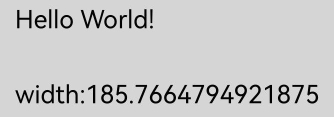

## stroke

stroke(): void

Performs a stroke operation based on the current path.

**Widget capability:** This API can be used in ArkTS widgets since API version 9.

**Atomic service API:** This API can be used in atomic services since API version 11.

**System capability:** SystemCapability.ArkUI.ArkUI.Full

**Example**

  ```ts
  // xxx.ets
  @Entry
  @Component
  struct Stroke {
    private settings: RenderingContextSettings = new RenderingContextSettings(true);
    private context: CanvasRenderingContext2D = new CanvasRenderingContext2D(this.settings);
    private offCanvas: OffscreenCanvas = new OffscreenCanvas(600, 600);

    build() {
      Flex({ direction: FlexDirection.Column, alignItems: ItemAlign.Center, justifyContent: FlexAlign.Center }) {
        Canvas(this.context)
          .width('100%')
          .height('100%')
          .backgroundColor('#ffff00')
          .onReady(() => {
            let offContext = this.offCanvas.getContext("2d", this.settings)
            offContext.moveTo(125, 25)
            offContext.lineTo(125, 105)
            offContext.lineTo(175, 105)
            offContext.lineTo(175, 25)
            offContext.strokeStyle = 'rgb(255,0,0)'
            offContext.stroke()
            let image = this.offCanvas.transferToImageBitmap()
            this.context.transferFromImageBitmap(image)
          })
      }
      .width('100%')
      .height('100%')
    }
  }
  ```


## stroke

stroke(path: Path2D): void

Performs stroke drawing based on the specified path.

**Widget capability:** This API can be used in ArkTS widgets since API version 9.

**Atomic service API:** This API can be used in atomic services since API version 11.

**System capability:** SystemCapability.ArkUI.ArkUI.Full

 **Parameters**

| Name | Type | Mandatory | Description |
| ---- | ---------------------------------------- | ---- | ------------ |
| path | [Path2D](ts-components-canvas-path2d.md) | Yes | Path2D to draw.<br>If an invalid value (**undefined** or **null**) is passed, no drawing will be performed. |

 **Example**

  ```ts
  // xxx.ets
  @Entry
  @Component
  struct Stroke {
    private settings: RenderingContextSettings = new RenderingContextSettings(true);
    private context: CanvasRenderingContext2D = new CanvasRenderingContext2D(this.settings);
    private offCanvas: OffscreenCanvas = new OffscreenCanvas(600, 600);
    private path2Da: Path2D = new Path2D();

    build() {
      Flex({ direction: FlexDirection.Column, alignItems: ItemAlign.Center, justifyContent: FlexAlign.Center }) {
        Canvas(this.context)
          .width('100%')
          .height('100%')
          .backgroundColor('#ffff00')
          .onReady(() => {
            let offContext = this.offCanvas.getContext("2d", this.settings)
            this.path2Da.moveTo(25, 25)
            this.path2Da.lineTo(25, 105)
            this.path2Da.lineTo(75, 105)
            this.path2Da.lineTo(75, 25)
            offContext.strokeStyle = 'rgb(0,0,255)'
            offContext.stroke(this.path2Da)
            let image = this.offCanvas.transferToImageBitmap()
            this.context.transferFromImageBitmap(image)
          })
      }
      .width('100%')
      .height('100%')
    }
  }
  ```

  

## beginPath

beginPath(): void

Creates a new drawing path.

**Widget capability:** This API can be used in ArkTS widgets since API version 9.

**Atomic service API:** This API can be used in atomic services since API version 11.

**System capability:** SystemCapability.ArkUI.ArkUI.Full

 **Example**

  ```ts
  // xxx.ets
  @Entry
  @Component
  struct BeginPath {
    private settings: RenderingContextSettings = new RenderingContextSettings(true);
    private context: CanvasRenderingContext2D = new CanvasRenderingContext2D(this.settings);
    private offCanvas: OffscreenCanvas = new OffscreenCanvas(600, 600);

    build() {
      Flex({ direction: FlexDirection.Column, alignItems: ItemAlign.Center, justifyContent: FlexAlign.Center }) {
        Canvas(this.context)
          .width('100%')
          .height('100%')
          .backgroundColor('rgb(213,213,213)')
          .onReady(() => {
            let offContext = this.offCanvas.getContext("2d", this.settings)
            offContext.beginPath()
            offContext.lineWidth = 6
            offContext.strokeStyle = '#0000ff'
            offContext.moveTo(15, 80)
            offContext.lineTo(280, 160)
            offContext.stroke()
            let image = this.offCanvas.transferToImageBitmap()
            this.context.transferFromImageBitmap(image)
          })
      }
      .width('100%')
      .height('100%')
    }
  }
  ```

  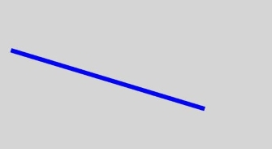

## moveTo

moveTo(x: number, y: number): void

Moves the path from the current point to a specified point.

**Widget capability:** This API can be used in ArkTS widgets since API version 9.

**Atomic service API:** This API can be used in atomic services since API version 11.

**System capability:** SystemCapability.ArkUI.ArkUI.Full

 **Parameters**

| Name | Type | Mandatory | Description |
| ---- | ------ | ---- | --------- |
| x | number | Yes | X coordinate of the target position.<br>In versions earlier than API version 18, when **NaN** or **Infinity** is set, the entire path is not displayed; when **null** or **undefined** is set, the current API does not take effect. In API version 18 and later, when **NaN**, **Infinity**, **null**, or **undefined** is set, the current API does not take effect, and other path methods with valid parameters are drawn normally.<br>Default unit: vp |
| y | number | Yes | Y coordinate of the target position.<br>In versions earlier than API version 18, when **NaN** or **Infinity** is set, the entire path is not displayed; when **null** or **undefined** is set, the current API does not take effect. In API version 18 and later, when **NaN**, **Infinity**, **null**, or **undefined** is set, the current API does not take effect, and other path methods with valid parameters are drawn normally.<br>Default unit: vp |

> **NOTE**
>
> In versions earlier than API version 18, if the **moveTo** API is not executed or the **moveTo** API passes invalid parameters, the path starts with (0,0).
>
> In API version 18 and later, if the **moveTo** API is not executed or the **moveTo** API passes invalid parameters, the path starts from the start point of the **lineTo**, **arcTo**, **bezierCurveTo**, or **quadraticCurveTo** API that is called for the first time.

 **Example**

  ```ts
  // xxx.ets
  @Entry
  @Component
  struct MoveTo {
    private settings: RenderingContextSettings = new RenderingContextSettings(true);
    private context: CanvasRenderingContext2D = new CanvasRenderingContext2D(this.settings);
    private offCanvas: OffscreenCanvas = new OffscreenCanvas(600, 600);

    build() {
      Flex({ direction: FlexDirection.Column, alignItems: ItemAlign.Center, justifyContent: FlexAlign.Center }) {
        Canvas(this.context)
          .width('100%')
          .height('100%')
          .backgroundColor('#ffff00')
          .onReady(() => {
            let offContext = this.offCanvas.getContext("2d", this.settings)
            offContext.beginPath()
            offContext.moveTo(10, 10)
            offContext.lineTo(280, 160)
            offContext.stroke()
            let image = this.offCanvas.transferToImageBitmap()
            this.context.transferFromImageBitmap(image)
          })
      }
      .width('100%')
      .height('100%')
    }
  }
  ```

  

## lineTo

lineTo(x: number, y: number): void

Connects the current point to a specified point by a path.

**Widget capability:** This API can be used in ArkTS widgets since API version 9.

**Atomic service API:** This API can be used in atomic services since API version 11.

**System capability:** SystemCapability.ArkUI.ArkUI.Full

 **Parameters**

| Name | Type | Mandatory | Description |
| ---- | ------ | ----  | --------- |
| x    | number | Yes   | X coordinate of the target position.<br>Before API version 18, when this parameter is set to **NaN** or **Infinity**, the entire path is not displayed; when it is set to **null** or **undefined**, the current API does not take effect. From API version 18 onward, when this parameter is set to **NaN**, **Infinity**, **null**, or **undefined**, the current API does not take effect, and other path methods with valid parameters are drawn normally.<br>Default unit: vp |
| y    | number | Yes   | Y coordinate of the target position.<br>Before API version 18, when this parameter is set to **NaN** or **Infinity**, the entire path is not displayed; when it is set to **null** or **undefined**, the current API does not take effect. From API version 18 onward, when this parameter is set to **NaN**, **Infinity**, **null**, or **undefined**, the current API does not take effect, and other path methods with valid parameters are drawn normally.<br>Default unit: vp |

 **Example**

  ```ts
  // xxx.ets
  @Entry
  @Component
  struct LineTo {
    private settings: RenderingContextSettings = new RenderingContextSettings(true);
    private context: CanvasRenderingContext2D = new CanvasRenderingContext2D(this.settings);
    private offCanvas: OffscreenCanvas = new OffscreenCanvas(600, 600);

    build() {
      Flex({ direction: FlexDirection.Column, alignItems: ItemAlign.Center, justifyContent: FlexAlign.Center }) {
        Canvas(this.context)
          .width('100%')
          .height('100%')
          .backgroundColor('#ffff00')
          .onReady(() => {
            let offContext = this.offCanvas.getContext("2d", this.settings)
            offContext.beginPath()
            offContext.moveTo(10, 10)
            offContext.lineTo(280, 160)
            offContext.stroke()
            let image = this.offCanvas.transferToImageBitmap()
            this.context.transferFromImageBitmap(image)
          })
      }
      .width('100%')
      .height('100%')
    }
  }
  ```

  

## closePath

closePath(): void

Closes the current path to form a closed path.

**Widget capability:** This API can be used in ArkTS widgets since API version 9.

**Atomic service API:** This API can be used in atomic services since API version 11.

**System capability:** SystemCapability.ArkUI.ArkUI.Full

 **Example**

  ```ts
  // xxx.ets
  @Entry
  @Component
  struct ClosePath {
    private settings: RenderingContextSettings = new RenderingContextSettings(true);
    private context: CanvasRenderingContext2D = new CanvasRenderingContext2D(this.settings);
    private offCanvas: OffscreenCanvas = new OffscreenCanvas(600, 600);

    build() {
      Flex({ direction: FlexDirection.Column, alignItems: ItemAlign.Center, justifyContent: FlexAlign.Center }) {
        Canvas(this.context)
          .width('100%')
          .height('100%')
          .backgroundColor('#ffff00')
          .onReady(() => {
              let offContext = this.offCanvas.getContext("2d", this.settings)
              offContext.beginPath()
              offContext.moveTo(30, 30)
              offContext.lineTo(110, 30)
              offContext.lineTo(70, 90)
              offContext.closePath()
              offContext.stroke()
              let image = this.offCanvas.transferToImageBitmap()
              this.context.transferFromImageBitmap(image)
          })
      }
      .width('100%')
      .height('100%')
    }
  }
  ```

  

## createPattern

createPattern(image: ImageBitmap, repetition: string | null): CanvasPattern | null

Creates a pattern for image filling based on a specified image and repetition mode.

**Widget capability:** This API can be used in ArkTS widgets since API version 9.

**Atomic service API:** This API can be used in atomic services since API version 11.

**System capability:** SystemCapability.ArkUI.ArkUI.Full

**Parameters**

| Name | Type | Mandatory | Description |
| ---------- | ---------------------------------------- | ---- | ---------------------------------------- |
| image      | [ImageBitmap](ts-components-canvas-imagebitmap.md) | Yes   | Image source object. For details, see **ImageBitmap**.<br>An invalid value, such as **undefined** or **null**, is processed as an invalid value. |
| repetition | string \| **null**  | Yes  | Image repetition mode:<br>'repeat': repeats the image along both the x-axis and y-axis;<br>'repeat-x': repeats the image along the x-axis;<br>'repeat-y': repeats the image along the y-axis;<br>'no-repeat': does not repeat the image;<br>'clamp': uses the edge color for the part that exceeds the original boundary when drawing outside it;<br>'mirror': repeats and flips the image along both the x-axis and y-axis.<br>An invalid value, such as **undefined** or **null**, is processed as an invalid value. |

**Return value**

| Type | Description |
| ---------------------------------------- | ---------------------------------------- |
| [CanvasPattern](ts-components-canvas-canvaspattern.md) \| **null** | Pattern object created by specifying an image and repetition mode. |

 **Example**

> **NOTE**
>
> The resources used in this example are not located in the **src** > **main** > **resource** directory. Starting from DevEco Studio 6.0.0 Beta2, the resources that are located outside the **resources** directory are not packaged by default when a project or module is created. To package these resources, go to **buildOption** > **resOptions** > **copyCodeResource** in the module's **build-profile.json5** file, and set **enable** to **true**. For details, see the description of [copyCodeResource](https://developer.huawei.com/consumer/en/doc/harmonyos-guides/ide-hvigor-build-profile#section754823013348) in **resOptions**.

  ```ts
  // xxx.ets
  @Entry
  @Component
  struct CreatePattern {
    private settings: RenderingContextSettings = new RenderingContextSettings(true);
    private context: CanvasRenderingContext2D = new CanvasRenderingContext2D(this.settings);
    // Replace "common/images/example.jpg" with the image resource file required by the developer.
    private img:ImageBitmap = new ImageBitmap("common/images/example.jpg");
    private offCanvas: OffscreenCanvas = new OffscreenCanvas(600, 600);

    build() {
      Flex({ direction: FlexDirection.Column, alignItems: ItemAlign.Center, justifyContent: FlexAlign.Center }) {
        Canvas(this.context)
          .width('100%')
          .height('100%')
          .backgroundColor('rgb(213,213,213)')
          .onReady(() => {
            let offContext = this.offCanvas.getContext("2d", this.settings)
            let pattern = offContext.createPattern(this.img, 'repeat')
            offContext.fillStyle = pattern as CanvasPattern
            offContext.fillRect(0, 0, 200, 200)
            let image = this.offCanvas.transferToImageBitmap()
            this.context.transferFromImageBitmap(image)
          })
      }
      .width('100%')
      .height('100%')
    }
  }
  ```

  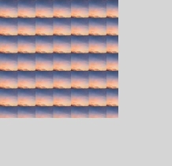

## bezierCurveTo

bezierCurveTo(cp1x: number, cp1y: number, cp2x: number, cp2y: number, x: number, y: number): void

Creates a cubic Bezier curve path.

**Widget capability:** This API can be used in ArkTS widgets since API version 9.

**Atomic service API:** This API can be used in atomic services since API version 11.

**System capability:** SystemCapability.ArkUI.ArkUI.Full

 **Parameters**

<!--Table: 10%; 10%; 10%; 70%-->

| Name | Type | Mandatory | Description |
| ---- | ------ | ---- | -------------- |
| cp1x | number | Yes | X-coordinate of the first Bezier parameter.<br>Before API version 18, if **NaN** or **Infinity** is set, the entire path is not displayed; if **null** or **undefined** is set, this API does not take effect. Since API version 18, if **NaN**, **Infinity**, **null**, or **undefined** is set, this API does not take effect, and other path methods with valid parameters are drawn normally.<br>Default unit: vp |
| cp1y | number | Yes | Y-coordinate of the first Bezier parameter.<br>Before API version 18, if **NaN** or **Infinity** is set, the entire path is not displayed; if **null** or **undefined** is set, this API does not take effect. Since API version 18, if **NaN**, **Infinity**, **null**, or **undefined** is set, this API does not take effect, and other path methods with valid parameters are drawn normally.<br>Default unit: vp |
| cp2x | number | Yes | X-coordinate of the second Bezier parameter.<br>Before API version 18, if **NaN** or **Infinity** is set, the entire path is not displayed; if **null** or **undefined** is set, this API does not take effect. Since API version 18, if **NaN**, **Infinity**, **null**, or **undefined** is set, this API does not take effect, and other path methods with valid parameters are drawn normally.<br>Default unit: vp |
| cp2y | number | Yes | Y-coordinate of the second Bezier parameter.<br>Before API version 18, if **NaN** or **Infinity** is set, the entire path is not displayed; if **null** or **undefined** is set, this API does not take effect. Since API version 18, if **NaN**, **Infinity**, **null**, or **undefined** is set, this API does not take effect, and other path methods with valid parameters are drawn normally.<br>Default unit: vp |
| x    | number | Yes | X-coordinate of the end point of the path.<br>Before API version 18, if **NaN** or **Infinity** is set, the entire path is not displayed; if **null** or **undefined** is set, this API does not take effect. Since API version 18, if **NaN**, **Infinity**, **null**, or **undefined** is set, this API does not take effect, and other path methods with valid parameters are drawn normally.<br>Default unit: vp |
| y    | number | Yes | Y-coordinate of the end point of the path.<br>Before API version 18, if **NaN** or **Infinity** is set, the entire path is not displayed; if **null** or **undefined** is set, this API does not take effect. Since API version 18, if **NaN**, **Infinity**, **null**, or **undefined** is set, this API does not take effect, and other path methods with valid parameters are drawn normally.<br>Default unit: vp |

**Example**

``` ts
// xxx.ets
import { Point } from '@kit.TestKit';

@Entry
@Component
struct BezierCurveTo {
  private settings: RenderingContextSettings = new RenderingContextSettings(true);
  private context: CanvasRenderingContext2D = new CanvasRenderingContext2D(this.settings);
  private offCanvas: OffscreenCanvas = new OffscreenCanvas(600, 600);
  private start: Point = { x: 50, y: 50 };
  private end: Point = { x: 250, y: 100 };
  private cp1: Point = { x: 200, y: 30 };
  private cp2: Point = { x: 130, y: 80 };

  build() {
    Flex({ direction: FlexDirection.Column, alignItems: ItemAlign.Center, justifyContent: FlexAlign.Center }) {
      Canvas(this.context)
        .width('100%')
        .height('100%')
        .backgroundColor('rgb(213,213,213)')
        .onReady(() => {
          let offContext = this.offCanvas.getContext("2d", this.settings)
          // Cubic Bezier curve
          offContext.beginPath();
          offContext.moveTo(this.start.x, this.start.y);
          offContext.bezierCurveTo(this.cp1.x, this.cp1.y, this.cp2.x, this.cp2.y, this.end.x, this.end.y);
          offContext.stroke();

          // Start point and end point
          offContext.fillStyle = 'rgb(39,135,217)';
          offContext.beginPath();
          offContext.arc(this.start.x, this.start.y, 5, 0, 2 * Math.PI); // Start point
          offContext.arc(this.end.x, this.end.y, 5, 0, 2 * Math.PI); // End point
          offContext.fill();

          // Control points
          offContext.fillStyle = 'rgb(23,169,141)';
          offContext.beginPath();
          offContext.arc(this.cp1.x, this.cp1.y, 5, 0, 2 * Math.PI); // Control point 1.
          offContext.arc(this.cp2.x, this.cp2.y, 5, 0, 2 * Math.PI); // Control point 2.
          offContext.fill();
          let image = this.offCanvas.transferToImageBitmap();
          this.context.transferFromImageBitmap(image);
        })
    }
    .width('100%')
    .height('100%')
  }
}
```


## quadraticCurveTo

quadraticCurveTo(cpx: number, cpy: number, x: number, y: number): void

Creates a quadratic Bezier curve path.

**Widget capability:** This API can be used in ArkTS widgets since API version 9.

**Atomic service API:** This API can be used in atomic services since API version 11.

**System capability:** SystemCapability.ArkUI.ArkUI.Full

 **Parameters**

| Name | Type | Mandatory | Description |
| ---- | ------ | ---- | -------------- |
| cpx  | number | Yes | X-coordinate of the Bezier parameter.<br>Before API version 18, if **NaN** or **Infinity** is set, the entire path is not displayed; if **null** or **undefined** is set, the current API does not take effect. Since API version 18, if **NaN**, **Infinity**, **null**, or **undefined** is set, the current API does not take effect, and other path methods with valid parameters are drawn normally.<br>Default unit: vp |
| cpy  | number | Yes | Y-coordinate of the Bezier parameter.<br>Before API version 18, if **NaN** or **Infinity** is set, the entire path is not displayed; if **null** or **undefined** is set, the current API does not take effect. Since API version 18, if **NaN**, **Infinity**, **null**, or **undefined** is set, the current API does not take effect, and other path methods with valid parameters are drawn normally.<br>Default unit: vp |
| x    | number | Yes | X-coordinate of the end point of the path.<br>Before API version 18, if **NaN** or **Infinity** is set, the entire path is not displayed; if **null** or **undefined** is set, the current API does not take effect. Since API version 18, if **NaN**, **Infinity**, **null**, or **undefined** is set, the current API does not take effect, and other path methods with valid parameters are drawn normally.<br>Default unit: vp |
| y    | number | Yes | Y-coordinate of the end point of the path.<br>Before API version 18, if **NaN** or **Infinity** is set, the entire path is not displayed; if **null** or **undefined** is set, the current API does not take effect. Since API version 18, if **NaN**, **Infinity**, **null**, or **undefined** is set, the current API does not take effect, and other path methods with valid parameters are drawn normally.<br>Default unit: vp |

**Example**

``` ts
// xxx.ets
import { Point } from '@kit.TestKit';

@Entry
@Component
struct QuadraticCurveTo {
  private settings: RenderingContextSettings = new RenderingContextSettings(true);
  private context: CanvasRenderingContext2D = new CanvasRenderingContext2D(this.settings);
  private offCanvas: OffscreenCanvas = new OffscreenCanvas(600, 600);
  private start: Point = { x: 50, y: 20 };
  private end: Point = { x: 50, y: 100 };
  private cp: Point = { x: 230, y: 30 };

  build() {
    Flex({ direction: FlexDirection.Column, alignItems: ItemAlign.Center, justifyContent: FlexAlign.Center }) {
      Canvas(this.context)
        .width('100%')
        .height('100%')
        .backgroundColor('rgb(213,213,213)')
        .onReady(() => {
          let offContext = this.offCanvas.getContext("2d", this.settings);
          // Quadratic Bezier curve
          offContext.beginPath();
          offContext.moveTo(this.start.x, this.start.y);
          offContext.quadraticCurveTo(this.cp.x, this.cp.y, this.end.x, this.end.y);
          offContext.stroke();

          // Start point and end point
          offContext.fillStyle = 'rgb(39,135,217)';
          offContext.beginPath();
          offContext.arc(this.start.x, this.start.y, 5, 0, 2 * Math.PI); // Start point
          offContext.arc(this.end.x, this.end.y, 5, 0, 2 * Math.PI); // End point
          offContext.fill();

          // Control point
          offContext.fillStyle = 'rgb(23,169,141)';
          offContext.beginPath();
          offContext.arc(this.cp.x, this.cp.y, 5, 0, 2 * Math.PI);
          offContext.fill();

          let image = this.offCanvas.transferToImageBitmap();
          this.context.transferFromImageBitmap(image);
        })
    }
    .width('100%')
    .height('100%')
  }
}
```


## arc

arc(x: number, y: number, radius: number, startAngle: number, endAngle: number, counterclockwise?: boolean): void

Draws an arc path.

**Widget capability:** This API can be used in ArkTS widgets since API version 9.

**Atomic service API:** This API can be used in atomic services since API version 11.

**System capability:** SystemCapability.ArkUI.ArkUI.Full

 **Parameters**

<!--Table: 10%; 10%; 10%; 70%-->

| Name | Type | Mandatory | Description |
| ---------------- | ------- | ---- | ---------- |
| x | number | Yes | X-coordinate of the arc center.<br>Before API version 18, if this parameter is set to **NaN** or **Infinity**, the entire path is not displayed; if it is set to **null** or **undefined**, the current API does not take effect. Since API version 18, if this parameter is set to **NaN**, **Infinity**, **null**, or **undefined**, the current API does not take effect, and other path methods with valid parameters are drawn normally.<br>Default unit: vp |
| y | number | Yes | Y-coordinate of the arc center.<br>Before API version 18, if this parameter is set to **NaN** or **Infinity**, the entire path is not displayed; if it is set to **null** or **undefined**, the current API does not take effect. Since API version 18, if this parameter is set to **NaN**, **Infinity**, **null**, or **undefined**, the current API does not take effect, and other path methods with valid parameters are drawn normally.<br>Default unit: vp |
| radius | number | Yes | Radius of the arc.<br>Before API version 18, if this parameter is set to **NaN** or **Infinity**, the entire path is not displayed; if it is set to **null** or **undefined**, the current API does not take effect. Since API version 18, if this parameter is set to **NaN**, **Infinity**, **null**, or **undefined**, the current API does not take effect, and other path methods with valid parameters are drawn normally.<br>Default unit: vp |
| startAngle | number | Yes | Start angle of the arc.<br>Before API version 18, if this parameter is set to **NaN** or **Infinity**, the entire path is not displayed; if it is set to **null** or **undefined**, the current API does not take effect. Since API version 18, if this parameter is set to **NaN**, **Infinity**, **null**, or **undefined**, the current API does not take effect, and other path methods with valid parameters are drawn normally.<br>Default unit: radian |
| endAngle | number | Yes | End angle of the arc.<br>Before API version 18, if this parameter is set to **NaN** or **Infinity**, the entire path is not displayed; if it is set to **null** or **undefined**, the current API does not take effect. Since API version 18, if this parameter is set to **NaN**, **Infinity**, **null**, or **undefined**, the current API does not take effect, and other path methods with valid parameters are drawn normally.<br>Default unit: radian |
| counterclockwise | boolean | No | Whether to draw the arc counterclockwise.<br/>The value **true** means to draw the arc counterclockwise, and **false** means to draw the arc clockwise.<br>Default value: **false**. If this parameter is set to **null** or **undefined**, the default value is used. |

 **Example**

  ```ts
  // xxx.ets
  @Entry
  @Component
  struct Arc {
    private settings: RenderingContextSettings = new RenderingContextSettings(true);
    private context: CanvasRenderingContext2D = new CanvasRenderingContext2D(this.settings);
    private offCanvas: OffscreenCanvas = new OffscreenCanvas(600, 600);

    build() {
      Flex({ direction: FlexDirection.Column, alignItems: ItemAlign.Center, justifyContent: FlexAlign.Center }) {
        Canvas(this.context)
          .width('100%')
          .height('100%')
          .backgroundColor('#ffff00')
          .onReady(() => {
            let offContext = this.offCanvas.getContext("2d", this.settings)
            offContext.beginPath()
            offContext.arc(100, 75, 50, 0, 6.28)
            offContext.stroke()
            let image = this.offCanvas.transferToImageBitmap()
            this.context.transferFromImageBitmap(image)
          })
      }
      .width('100%')
      .height('100%')
    }
  }
  ```

  

## arcTo

arcTo(x1: number, y1: number, x2: number, y2: number, radius: number): void

Creates an arc path based on the given control points and arc radius.

**Widget capability:** This API can be used in ArkTS widgets since API version 9.

**Atomic service API:** This API can be used in atomic services since API version 11.

**System capability:** SystemCapability.ArkUI.ArkUI.Full

 **Parameters**

<!--Table: 10%; 10%; 10%; 70%-->

| Name | Type | Mandatory | Description |
| ------ | ------ | ---- | --------------- |
| x1 | number | Yes | X coordinate of the first control point.<br>Before API version 18, when this parameter is set to **NaN** or **Infinity**, the entire path is not displayed; when set to **null** or **undefined**, the current API does not take effect. From API version 18 onward, when this parameter is set to **NaN**, **Infinity**, **null**, or **undefined**, the current API does not take effect, and other path methods with valid parameters are drawn normally.<br>Default unit: vp |
| y1 | number | Yes | Y coordinate of the first control point.<br>Before API version 18, when this parameter is set to **NaN** or **Infinity**, the entire path is not displayed; when set to **null** or **undefined**, the current API does not take effect. From API version 18 onward, when this parameter is set to **NaN**, **Infinity**, **null**, or **undefined**, the current API does not take effect, and other path methods with valid parameters are drawn normally.<br>Default unit: vp |
| x2 | number | Yes | X coordinate of the second control point.<br>Before API version 18, when this parameter is set to **NaN** or **Infinity**, the entire path is not displayed; when set to **null** or **undefined**, the current API does not take effect. From API version 18 onward, when this parameter is set to **NaN**, **Infinity**, **null**, or **undefined**, the current API does not take effect, and other path methods with valid parameters are drawn normally.<br>Default unit: vp |
| y2 | number | Yes | Y coordinate of the second control point.<br>Before API version 18, when this parameter is set to **NaN** or **Infinity**, the entire path is not displayed; when set to **null** or **undefined**, the current API does not take effect. From API version 18 onward, when this parameter is set to **NaN**, **Infinity**, **null**, or **undefined**, the current API does not take effect, and other path methods with valid parameters are drawn normally.<br>Default unit: vp |
| radius | number | Yes | Radius of the arc.<br>Before API version 18, when this parameter is set to **NaN** or **Infinity**, the entire path is not displayed; when set to **null** or **undefined**, the current API does not take effect. From API version 18 onward, when this parameter is set to **NaN**, **Infinity**, **null**, or **undefined**, the current API does not take effect, and other path methods with valid parameters are drawn normally.<br>Default unit: vp |

 **Example**

  ```ts
  // xxx.ets
  @Entry
  @Component
  struct ArcTo {
    private settings: RenderingContextSettings = new RenderingContextSettings(true);
    private context: CanvasRenderingContext2D = new CanvasRenderingContext2D(this.settings);
    private offCanvas: OffscreenCanvas = new OffscreenCanvas(600, 600);

    build() {
      Flex({ direction: FlexDirection.Column, alignItems: ItemAlign.Center, justifyContent: FlexAlign.Center }) {
        Canvas(this.context)
          .width('100%')
          .height('100%')
          .backgroundColor('#ffff00')
          .onReady(() => {
            let offContext = this.offCanvas.getContext("2d", this.settings)

            // Tangent line
            offContext.beginPath()
            offContext.strokeStyle = '#808080'
            offContext.lineWidth = 1.5;
            offContext.moveTo(360, 20);
            offContext.lineTo(360, 170);
            offContext.lineTo(110, 170);
            offContext.stroke();

            // Arc
            offContext.beginPath()
            offContext.strokeStyle = '#000000'
            offContext.lineWidth = 3;
            offContext.moveTo(360, 20)
            offContext.arcTo(360, 170, 110, 170, 150)
            offContext.stroke()

            // Start point
            offContext.beginPath();
            offContext.fillStyle = '#00ff00';
            offContext.arc(360, 20, 4, 0, 2 * Math.PI);
            offContext.fill();

            // Control point
            offContext.beginPath();
            offContext.fillStyle = '#ff0000';
            offContext.arc(360, 170, 4, 0, 2 * Math.PI);
            offContext.arc(110, 170, 4, 0, 2 * Math.PI);
            offContext.fill();

            let image = this.offCanvas.transferToImageBitmap()
            this.context.transferFromImageBitmap(image)
          })
      }
      .width('100%')
      .height('100%')
    }
  }
  ```

  

  > In this example, the arc created by **arcTo()** is black, and the two tangents of the arc are gray. The control point is red, and the start point is green.
  >
  > Imagine two tangents: one from the start point to the first control point, and the other from the first control point to the second control point. **arcTo()** creates an arc between these two tangents, and the arc is tangent to both.

## ellipse

ellipse(x: number, y: number, radiusX: number, radiusY: number, rotation: number, startAngle: number, endAngle: number, counterclockwise?: boolean): void

Draws an ellipse in the specified rectangular area.

**Widget capability:** This API can be used in ArkTS widgets since API version 9.

**Atomic service API:** This API can be used in atomic services since API version 11.

**System capability:** SystemCapability.ArkUI.ArkUI.Full

 **Parameters**

<!--Table: 10%; 10%; 10%; 70%-->

| Name              | Type    | Mandatory | Description |
| ---------------- | ------- | --------- | ---------------------------------------- |
| x                | number  | Yes       | X-coordinate of the ellipse center.<br>Before API version 18, when **NaN** or **Infinity** is set, the entire path is not displayed; when **null** or **undefined** is set, the current API does not take effect. From API version 18 onward, when **NaN**, **Infinity**, **null**, or **undefined** is set, the current API does not take effect, and other path methods with valid parameters are drawn normally.<br>Default unit: vp |
| y                | number  | Yes       | Y-coordinate of the ellipse center.<br>Before API version 18, when **NaN** or **Infinity** is set, the entire path is not displayed; when **null** or **undefined** is set, the current API does not take effect. From API version 18 onward, when **NaN**, **Infinity**, **null**, or **undefined** is set, the current API does not take effect, and other path methods with valid parameters are drawn normally.<br>Default unit: vp |
| radiusX          | number  | Yes       | Radius of the ellipse on the x-axis.<br>Before API version 18, when **NaN** or **Infinity** is set, the entire path is not displayed; when **null** or **undefined** is set, the current API does not take effect. From API version 18 onward, when **NaN**, **Infinity**, **null**, or **undefined** is set, the current API does not take effect, and other path methods with valid parameters are drawn normally.<br>Default unit: vp |
| radiusY          | number  | Yes       | Radius of the ellipse on the y-axis.<br>Before API version 18, when **NaN** or **Infinity** is set, the entire path is not displayed; when **null** or **undefined** is set, the current API does not take effect. From API version 18 onward, when **NaN**, **Infinity**, **null**, or **undefined** is set, the current API does not take effect, and other path methods with valid parameters are drawn normally.<br>Default unit: vp |
| rotation         | number  | Yes       | Rotation angle of the ellipse.<br>Before API version 18, when **NaN** or **Infinity** is set, the entire path is not displayed; when **null** or **undefined** is set, the current API does not take effect. From API version 18 onward, when **NaN**, **Infinity**, **null**, or **undefined** is set, the current API does not take effect, and other path methods with valid parameters are drawn normally.<br>Unit: radian. |
| startAngle       | number  | Yes       | Start angle of the ellipse.<br>Before API version 18, when **NaN** or **Infinity** is set, the entire path is not displayed; when **null** or **undefined** is set, the current API does not take effect. From API version 18 onward, when **NaN**, **Infinity**, **null**, or **undefined** is set, the current API does not take effect, and other path methods with valid parameters are drawn normally.<br>Unit: radian. |
| endAngle         | number  | Yes       | End angle of the ellipse.<br>Before API version 18, when **NaN** or **Infinity** is set, the entire path is not displayed; when **null** or **undefined** is set, the current API does not take effect. From API version 18 onward, when **NaN**, **Infinity**, **null**, or **undefined** is set, the current API does not take effect, and other path methods with valid parameters are drawn normally.<br>Unit: radian. |
| counterclockwise | boolean | No        | Whether to draw the ellipse in the counterclockwise direction.<br>**true**: draws the ellipse in the counterclockwise direction.<br>**false**: draws the ellipse in the clockwise direction.<br>Default value: **false**. If **null** or **undefined** is set, the default value is used. |

 **Example**

  ```ts
  // xxx.ets
  @Entry
  @Component
  struct CanvasExample {
    private settings: RenderingContextSettings = new RenderingContextSettings(true);
    private context: CanvasRenderingContext2D = new CanvasRenderingContext2D(this.settings);
    private offCanvas: OffscreenCanvas = new OffscreenCanvas(600, 600);
    build() {
      Flex({ direction: FlexDirection.Column, alignItems: ItemAlign.Center, justifyContent: FlexAlign.Center }) {
        Canvas(this.context)
          .width('100%')
          .height('100%')
          .backgroundColor('#ffff00')
          .onReady(() => {
            let offContext = this.offCanvas.getContext("2d", this.settings)
            offContext.beginPath()
            offContext.ellipse(200, 200, 50, 100, Math.PI * 0.25, Math.PI * 0.5, Math.PI * 2, false)
            offContext.stroke()
            offContext.beginPath()
            offContext.ellipse(200, 300, 50, 100, Math.PI * 0.25, Math.PI * 0.5, Math.PI * 2, true)
            offContext.stroke()
            let image = this.offCanvas.transferToImageBitmap()
            this.context.transferFromImageBitmap(image)
          })
      }
      .width('100%')
      .height('100%')
    }
  }
  ```

  

## rect

rect(x: number, y: number, w: number, h: number): void

Creates a rectangle path.

**Widget capability:** This API can be used in ArkTS widgets since API version 9.

**Atomic service API:** This API can be used in atomic services since API version 11.

**System capability:** SystemCapability.ArkUI.ArkUI.Full

 **Parameters**

<!--Table: 10%; 10%; 10%; 70%-->

| Name | Type | Mandatory | Description |
| ---- | ------ | ---- | ------------- |
| x | number | Yes | X coordinate of the upper left corner of the rectangle.<br>Before API version 18, when this parameter is set to **NaN** or **Infinity**, the entire path is not displayed; when it is set to **null** or **undefined**, the current API does not take effect. Since API version 18, when this parameter is set to **NaN**, **Infinity**, **null**, or **undefined**, the current API does not take effect, and other path methods with valid parameters are drawn normally.<br>Default unit: vp |
| y | number | Yes | Y coordinate of the upper left corner of the rectangle.<br>Before API version 18, when this parameter is set to **NaN** or **Infinity**, the entire path is not displayed; when it is set to **null** or **undefined**, the current API does not take effect. Since API version 18, when this parameter is set to **NaN**, **Infinity**, **null**, or **undefined**, the current API does not take effect, and other path methods with valid parameters are drawn normally.<br>Default unit: vp |
| w | number | Yes | Width of the rectangle.<br>Before API version 18, when this parameter is set to **NaN** or **Infinity**, the entire path is not displayed; when it is set to **null** or **undefined**, the current API does not take effect. Since API version 18, when this parameter is set to **NaN**, **Infinity**, **null**, or **undefined**, the current API does not take effect, and other path methods with valid parameters are drawn normally.<br>Default unit: vp |
| h | number | Yes | Height of the rectangle.<br>Before API version 18, when this parameter is set to **NaN** or **Infinity**, the entire path is not displayed; when it is set to **null** or **undefined**, the current API does not take effect. Since API version 18, when this parameter is set to **NaN**, **Infinity**, **null**, or **undefined**, the current API does not take effect, and other path methods with valid parameters are drawn normally.<br>Default unit: vp |

 **Example**

  ```ts
  // xxx.ets
  @Entry
  @Component
  struct CanvasExample {
    private settings: RenderingContextSettings = new RenderingContextSettings(true);
    private context: CanvasRenderingContext2D = new CanvasRenderingContext2D(this.settings);
    private offCanvas: OffscreenCanvas = new OffscreenCanvas(600, 600);

    build() {
      Flex({ direction: FlexDirection.Column, alignItems: ItemAlign.Center, justifyContent: FlexAlign.Center }) {
        Canvas(this.context)
          .width('100%')
          .height('100%')
          .backgroundColor('#ffff00')
          .onReady(() => {
            let offContext = this.offCanvas.getContext("2d", this.settings)
            offContext.rect(20, 20, 100, 100) // Create a 100*100 rectangle at (20, 20)
            offContext.stroke()
            let image = this.offCanvas.transferToImageBitmap()
            this.context.transferFromImageBitmap(image)
          })
      }
      .width('100%')
      .height('100%')
    }
  }
  ```

  

## roundRect<sup>20+</sup>

roundRect(x: number, y: number, w: number, h: number, radii?: number | Array\<number>): void

Creates a rounded rectangle path. This method does not directly draw the content. To draw a rounded rectangle on the canvas, use the **fill** or **stroke** method.

**Widget capability:** This API can be used in ArkTS widgets since API version 20.

**Atomic service API:** This API can be used in atomic services since API version 20.

**Model restriction:** This API can be used only in the stage model.

**System capability:** SystemCapability.ArkUI.ArkUI.Full

**Parameters**

<!--Table: 10%; 10%; 10%; 70%-->

| Name   | Type     | Mandatory   | Description            |
| ---- | ------ | ---- | ------------- |
| x    | number | Yes    | X-coordinate of the upper left corner of the rectangle.<br>**null** is processed as **0**, and **undefined** is processed as an invalid value, in which case nothing is drawn.<br>To draw a complete rectangle, the value range is [0, Canvas width).<br>Default unit: vp |
| y    | number | Yes    | Y-coordinate of the upper left corner of the rectangle.<br>**null** is processed as **0**, and **undefined** is processed as an invalid value, in which case nothing is drawn.<br>To draw a complete rectangle, the value range is [0, Canvas height).<br>Default unit: vp |
| w    | number | Yes    | Width of the rectangle. A negative value means drawing to the left.<br>**null** is processed as **0**, and **undefined** is processed as an invalid value, in which case nothing is drawn.<br>To draw a complete rectangle, the value range is [-x, Canvas width - x].<br>Default unit: vp |
| h    | number | Yes    | Height of the rectangle. A negative value means drawing upward.<br>**null** is processed as **0**, and **undefined** is processed as an invalid value, in which case nothing is drawn.<br>To draw a complete rectangle, the value range is [-y, Canvas height - y].<br>Default unit: vp |
| radii | number \| Array\<number> | No | Number or a list of numbers for the arc radii of the rectangle corners.<br>When the parameter type is number, the arc radius of all rectangle corners follows this number.<br>When the parameter type is **Array\<number>**, the number of elements ranges from 1 to 4, processed as follows:<br>1. [arc radius of all rectangle corners]<br>2. [arc radius of the upper left and lower right corners, arc radius of the upper right and lower left corners]<br>3. [arc radius of the upper left corner, arc radius of the upper right and lower left corners, arc radius of the lower right corner]<br>4. [arc radius of the upper left corner, arc radius of the upper right corner, arc radius of the lower right corner, arc radius of the lower left corner]<br>An exception is thrown if **radii** contains a negative value or the number of elements in the list is not within [1, 4]. Error code: 103701.<br>Default value: **0**. **null** and **undefined** are processed as the default value.<br>If the arc radius exceeds the width or height of the rectangle, it is scaled down proportionally to the length of the width or height.<br>Default unit: vp |

**Error codes**

For details about the error codes, see [Canvas Component Error Codes](../errorcode-canvas.md).

| ID | Error Message | Possible Cause |
| -------- | -------- | -------- |
| 103701   | Parameter error.| 1. The param radii is a list that has zero or more than four elements; 2. The param radii contains negative value. |

**Example**

This example shows how to draw the following rounded rectangles.

1. Create a rounded rectangle with the start point (10 vp, 10 vp), width and height of 100 vp, and arc radius of 10 vp for the four rectangle corners, and fill the rounded rectangle.

2. Create a rounded rectangle with the start point (120 vp, 10 vp), width and height of 100 vp, and arc radius of 10 vp for the four rectangle corners, and fill the rounded rectangle.

3. Create a rounded rectangle with the start point (10 vp, 120 vp), width and height of 100 vp, and the radius of the upper-left and lower-right rounded corners of 10 vp, and the radius of the upper-right and lower-left rounded corners of 20 vp. The rounded rectangle is outlined.

4. Create a rounded rectangle with the start point (120 vp, 120 vp), width and height of 100 vp, and the radius of the upper-left rounded corner of 10 vp, the radius of the upper-right and lower-left rounded corners of 20 vp, and the radius of the lower-right rounded corner of 30 vp. The rounded rectangle is outlined.

5. Create a rounded rectangle with the start point (10 vp, 230 vp), width and height of 100 vp, and the radius of the upper-left rounded corner of 10 vp, the radius of the upper-right rounded corner of 20 vp, the radius of the lower-right rounded corner of 30 vp, and the radius of the lower-left rounded corner of 40 vp. The rounded rectangle is outlined.

6. Create a rounded rectangle with the start point (220 vp, 330 vp), width and height of -100 vp, and the radius of the upper-left rounded corner of 10 vp, the radius of the upper-right rounded corner of 20 vp, the radius of the lower-right rounded corner of 30 vp, and the radius of the lower-left rounded corner of 40 vp. The rounded rectangle is outlined.

  ```ts
  // xxx.ets
  import { BusinessError } from '@kit.BasicServicesKit';

  @Entry
  @Component
  struct CanvasExample {
    private settings: RenderingContextSettings = new RenderingContextSettings(true);
    private context: CanvasRenderingContext2D = new CanvasRenderingContext2D(this.settings);
    private offCanvas: OffscreenCanvas = new OffscreenCanvas(600, 600);

    build() {
      Flex({ direction: FlexDirection.Column, alignItems: ItemAlign.Center, justifyContent: FlexAlign.Center }) {
        Canvas(this.context)
          .width('100%')
          .height('100%')
          .backgroundColor('#D5D5D5')
          .onReady(() => {
            let offContext = this.offCanvas.getContext("2d", this.settings)
            try {
              offContext.fillStyle = '#707070'
              offContext.beginPath()
              // Create a rounded rectangle with (10 vp, 10 vp) as the starting point, a width and height of 100 vp, and a corner radius of 10 vp for all four corners.
              offContext.roundRect(10, 10, 100, 100, 10)
              // Create a rounded rectangle with (120 vp, 10 vp) as the starting point, a width and height of 100 vp, and a corner radius of 10 vp for all four corners.
              offContext.roundRect(120, 10, 100, 100, [10])
              offContext.fill()
              offContext.beginPath()
              // Create a rounded rectangle with (10 vp, 120 vp) as the starting point, a width and height of 100 vp, a top-left and bottom-right corner radius of 10 vp, and a top-right and bottom-left corner radius of 20 vp.
              offContext.roundRect(10, 120, 100, 100, [10, 20])
              // Create a rounded rectangle with (120 vp, 120 vp) as the starting point, a width and height of 100 vp, a top-left corner radius of 10 vp, a top-right and bottom-left corner radius of 20 vp, and a bottom-right corner radius of 30 vp.
              offContext.roundRect(120, 120, 100, 100, [10, 20, 30])
              // Create a rounded rectangle with (10 vp, 230 vp) as the starting point, width and height of 100 vp, top-left corner radius of 10 vp, top-right corner radius of 20 vp, bottom-right corner radius of 30 vp, and bottom-left corner radius of 40vp.
              offContext.roundRect(10, 230, 100, 100, [10, 20, 30, 40])
              // Create a rounded rectangle with (220 vp, 330 vp) as the starting point, width and height of -100 vp, top-left corner radius of 10 vp, top-right corner radius of 20 vp, bottom-right corner radius of 30 vp, and bottom-left corner radius of 40vp.
              offContext.roundRect(220, 330, -100, -100, [10, 20, 30, 40])
              offContext.stroke()
            } catch (error) {
              let e: BusinessError = error as BusinessError;
              console.error(`Failed to create roundRect. Code: ${e.code}, message: ${e.message}`);
            }
            // Create an ImageBitmap object from the most recently drawn image on the offscreen canvas.
            let image = this.offCanvas.transferToImageBitmap()
            // Display the created ImageBitmap object on the Canvas.
            this.context.transferFromImageBitmap(image)
          })
      }
      .width('100%')
      .height('100%')
    }
  }
  ```

  

## fill

fill(fillRule?: CanvasFillRule): void

Fills the current path.

**Widget capability:** This API can be used in ArkTS widgets since API version 9.

**Atomic service API:** This API can be used in atomic services since API version 11.

**System capability:** SystemCapability.ArkUI.ArkUI.Full

**Parameters**

| Name | Type | Mandatory | Description |
| -------- | -------------- | ---- | ---------------------------------------- |
| fillRule | [CanvasFillRule](#canvasfillrule) | No | Rule for filling the object.<br/>The options are "nonzero" and "evenodd".<br>Abnormal values **undefined** or **null** are processed as the default value.<br/>Default value: "nonzero" |

  ```ts
  // xxx.ets
  @Entry
  @Component
  struct Fill {
    private settings: RenderingContextSettings = new RenderingContextSettings(true);
    private context: CanvasRenderingContext2D = new CanvasRenderingContext2D(this.settings);
    private offCanvas: OffscreenCanvas = new OffscreenCanvas(600, 600);

    build() {
      Flex({ direction: FlexDirection.Column, alignItems: ItemAlign.Center, justifyContent: FlexAlign.Center }) {
        Canvas(this.context)
          .width('100%')
          .height('100%')
          .backgroundColor('#ffff00')
          .onReady(() => {
            let offContext = this.offCanvas.getContext("2d", this.settings)
            offContext.fillStyle = '#000000'
            offContext.rect(20, 20, 100, 100) // Create a 100*100 rectangle at (20, 20)
            offContext.fill()
            let image = this.offCanvas.transferToImageBitmap()
            this.context.transferFromImageBitmap(image)
          })
      }
      .width('100%')
      .height('100%')
    }
  }
  ```

  

## fill

fill(path: Path2D, fillRule?: CanvasFillRule): void

Fills the specified path.

**Widget capability:** This API can be used in ArkTS widgets since API version 9.

**Atomic service API:** This API can be used in atomic services since API version 11.

**System capability:** SystemCapability.ArkUI.ArkUI.Full

**Parameters**

| Name | Type | Mandatory | Description |
| -------- | -------------- | ---- | ----------------- |
| path | [Path2D](ts-components-canvas-path2d.md) | Yes | Path2D fill path.<br>Anomalous values **undefined** or **null** are treated as invalid. |
| fillRule | [CanvasFillRule](#canvasfillrule) | No | Rule for filling the object.<br/>Optional values: "nonzero" and "evenodd".<br>Anomalous values **undefined** or **null** are treated as the default.<br>Default value: "nonzero" |

**Example**

```ts
// xxx.ets
@Entry
@Component
struct Fill {
  private settings: RenderingContextSettings = new RenderingContextSettings(true);
  private context: CanvasRenderingContext2D = new CanvasRenderingContext2D(this.settings);
  private offCanvas: OffscreenCanvas = new OffscreenCanvas(600, 600);

  build() {
    Flex({ direction: FlexDirection.Column, alignItems: ItemAlign.Center, justifyContent: FlexAlign.Center }) {
      Canvas(this.context)
        .width('100%')
        .height('100%')
        .backgroundColor('#ffff00')
        .onReady(() => {
          let offContext = this.offCanvas.getContext("2d", this.settings)
          let region = new Path2D()
          region.moveTo(30, 90)
          region.lineTo(110, 20)
          region.lineTo(240, 130)
          region.lineTo(60, 130)
          region.lineTo(190, 20)
          region.lineTo(270, 90)
          region.closePath()
          // Fill path
          offContext.fillStyle = '#00ff00'
          offContext.fill(region, "evenodd")
          let image = this.offCanvas.transferToImageBitmap()
          this.context.transferFromImageBitmap(image)
        })
    }
    .width('100%')
    .height('100%')
  }
}
```


## clip

clip(fillRule?: CanvasFillRule): void

Sets the current path as the clipping path.

**Widget capability:** This API can be used in ArkTS widgets since API version 9.

**Atomic service API:** This API can be used in atomic services since API version 11.

**System capability:** SystemCapability.ArkUI.ArkUI.Full

**Parameters**

| Name | Type | Mandatory | Description |
| -------- | -------------- | ---- | ---------------------------------------- |
| fillRule | [CanvasFillRule](#canvasfillrule) | No | Rule for the object to be clipped.<br/>Optional values: "nonzero", "evenodd".<br>Abnormal values **undefined** or **null** are processed as the default value.<br>Default value: "nonzero" |

 **Example**

  ```ts
  // xxx.ets
  @Entry
  @Component
  struct Clip {
    private settings: RenderingContextSettings = new RenderingContextSettings(true);
    private context: CanvasRenderingContext2D = new CanvasRenderingContext2D(this.settings);
    private offCanvas: OffscreenCanvas = new OffscreenCanvas(600, 600);

    build() {
      Flex({ direction: FlexDirection.Column, alignItems: ItemAlign.Center, justifyContent: FlexAlign.Center }) {
        Canvas(this.context)
          .width('100%')
          .height('100%')
          .backgroundColor('#ffff00')
          .onReady(() => {
            let offContext = this.offCanvas.getContext("2d", this.settings)
            offContext.rect(0, 0, 100, 200)
            offContext.stroke()
            offContext.clip()
            offContext.fillStyle = "rgb(255,0,0)"
            offContext.fillRect(0, 0, 200, 200)
            let image = this.offCanvas.transferToImageBitmap()
            this.context.transferFromImageBitmap(image)
          })
      }
      .width('100%')
      .height('100%')
    }
  }
  ```


## clip

clip(path: Path2D, fillRule?: CanvasFillRule): void

Sets the specified path as the clipping path.

**Widget capability:** This API can be used in ArkTS widgets since API version 9.

**Atomic service API:** This API can be used in atomic services since API version 11.

**System capability:** SystemCapability.ArkUI.ArkUI.Full

**Parameters**

| Name       | Type | Mandatory   | Description                                       |
| -------- | -------------- | ---- | ---------------------------------------- |
| path | [Path2D](ts-components-canvas-path2d.md) | Yes | Path2D clipping path.<br>Abnormal values such as **undefined** or **null** are treated as invalid values. |
| fillRule | [CanvasFillRule](#canvasfillrule) | No | Rule for clipping objects.<br/>Optional values: "nonzero" and "evenodd".<br>Abnormal values such as **undefined** or **null** are processed based on the default value.<br>Default value: "nonzero" |

 **Example**

  ```ts
  // xxx.ets
  @Entry
  @Component
  struct Clip {
    private settings: RenderingContextSettings = new RenderingContextSettings(true);
    private context: CanvasRenderingContext2D = new CanvasRenderingContext2D(this.settings);
    private offCanvas: OffscreenCanvas = new OffscreenCanvas(600, 600);

    build() {
      Flex({ direction: FlexDirection.Column, alignItems: ItemAlign.Center, justifyContent: FlexAlign.Center }) {
        Canvas(this.context)
          .width('100%')
          .height('100%')
          .backgroundColor('#ffff00')
          .onReady(() => {
            let offContext = this.offCanvas.getContext("2d", this.settings)
            let region = new Path2D()
            region.moveTo(30, 90)
            region.lineTo(110, 20)
            region.lineTo(240, 130)
            region.lineTo(60, 130)
            region.lineTo(190, 20)
            region.lineTo(270, 90)
            region.closePath()
            offContext.clip(region,"evenodd")
            offContext.fillStyle = "rgb(0,255,0)"
            offContext.fillRect(0, 0, 600, 600)
            let image = this.offCanvas.transferToImageBitmap()
            this.context.transferFromImageBitmap(image)
          })
      }
      .width('100%')
      .height('100%')
    }
  }
  ```

  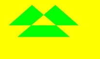

## reset<sup>12+</sup>

reset(): void

Resets the **OffscreenCanvasRenderingContext2D** to its default state, clearing the back buffer, drawing state stack, drawing path, and styles.

**Atomic service API:** This API can be used in atomic services since API version 12.

**Model restriction:** This API can be used only in the stage model.

**System capability:** SystemCapability.ArkUI.ArkUI.Full

**Example**

  ```ts
  // xxx.ets
  @Entry
  @Component
  struct Reset {
    private settings: RenderingContextSettings = new RenderingContextSettings(true);
    private context: CanvasRenderingContext2D = new CanvasRenderingContext2D(this.settings);
    private offCanvas: OffscreenCanvas = new OffscreenCanvas(600, 600);

    build() {
      Flex({ direction: FlexDirection.Column, alignItems: ItemAlign.Center, justifyContent: FlexAlign.Center }) {
        Canvas(this.context)
          .width('100%')
          .height('100%')
          .backgroundColor('#ffff00')
          .onReady(() => {
            let offContext = this.offCanvas.getContext("2d", this.settings)
            offContext.fillStyle = '#0000ff'
            offContext.fillRect(20, 20, 150, 100)
            offContext.reset()
            offContext.fillRect(20, 150, 150, 100)
            let image = this.offCanvas.transferToImageBitmap()
            this.context.transferFromImageBitmap(image)
          })
      }
      .width('100%')
      .height('100%')
    }
  }
  ```

  

## saveLayer<sup>12+</sup>

saveLayer(): void

Creates a layer.

**Atomic service API:** This API can be used in atomic services since API version 12.

**Model restriction:** This API can be used only in the stage model.

**System capability:** SystemCapability.ArkUI.ArkUI.Full

**Example**

  ```ts
  // xxx.ets
  @Entry
  @Component
  struct saveLayer {
    private settings: RenderingContextSettings = new RenderingContextSettings(true);
    private context: CanvasRenderingContext2D = new CanvasRenderingContext2D(this.settings);
    private offCanvas: OffscreenCanvas = new OffscreenCanvas(600, 600);

    build() {
      Flex({ direction: FlexDirection.Column, alignItems: ItemAlign.Center, justifyContent: FlexAlign.Center }) {
        Canvas(this.context)
          .width('100%')
          .height('100%')
          .backgroundColor('#ffff00')
          .onReady(() => {
            let offContext = this.offCanvas.getContext("2d", this.settings)
            offContext.fillStyle = "#0000ff"
            offContext.fillRect(50, 100, 300, 100)
            offContext.fillStyle = "#00ffff"
            offContext.fillRect(50, 150, 300, 100)
            offContext.globalCompositeOperation = 'destination-over'
            offContext.saveLayer()
            offContext.globalCompositeOperation = 'source-over'
            offContext.fillStyle = "#ff0000"
            offContext.fillRect(100, 50, 100, 300)
            offContext.fillStyle = "#00ff00"
            offContext.fillRect(150, 50, 100, 300)
            offContext.restoreLayer()
            let image = this.offCanvas.transferToImageBitmap()
            this.context.transferFromImageBitmap(image)
          })
      }
      .width('100%')
      .height('100%')
    }
  }
  ```

  

## restoreLayer<sup>12+</sup>

restoreLayer(): void

Restores the image transform and clipping state to the state before **saveLayer**, and draws the layer on the canvas. The example for **restoreLayer** is the same as that for **saveLayer**.

**Atomic service API:** This API can be used in atomic services since API version 12.

**Model restriction:** This API can be used only in the stage model.

**System capability:** SystemCapability.ArkUI.ArkUI.Full

## resetTransform

resetTransform(): void

Resets the current matrix to the identity matrix.

**Widget capability:** This API can be used in ArkTS widgets since API version 9.

**Atomic service API:** This API can be used in atomic services since API version 11.

**System capability:** SystemCapability.ArkUI.ArkUI.Full

**Example**

  ```ts
  // xxx.ets
  @Entry
  @Component
  struct ResetTransform {
    private settings: RenderingContextSettings = new RenderingContextSettings(true);
    private context: CanvasRenderingContext2D = new CanvasRenderingContext2D(this.settings);
    private offCanvas: OffscreenCanvas = new OffscreenCanvas(600, 600);

    build() {
      Flex({ direction: FlexDirection.Column, alignItems: ItemAlign.Center, justifyContent: FlexAlign.Center }) {
        Canvas(this.context)
          .width('100%')
          .height('100%')
          .backgroundColor('#ffff00')
          .onReady(() => {
            let offContext = this.offCanvas.getContext("2d", this.settings)
            offContext.setTransform(1,0.5, -0.5, 1, 10, 10)
            offContext.fillStyle = 'rgb(0,0,255)'
            offContext.fillRect(0, 0, 100, 100)
            offContext.resetTransform()
            offContext.fillStyle = 'rgb(255,0,0)'
            offContext.fillRect(0, 0, 100, 100)
            let image = this.offCanvas.transferToImageBitmap()
            this.context.transferFromImageBitmap(image)
          })
      }
      .width('100%')
      .height('100%')
    }
  }
  ```


## rotate

rotate(angle: number): void

Rotates the current coordinate axes clockwise.

**Widget capability:** This API can be used in ArkTS widgets since API version 9.

**Atomic service API:** This API can be used in atomic services since API version 11.

**System capability:** SystemCapability.ArkUI.ArkUI.Full

 **Parameters**

| Name | Type | Mandatory | Description |
| ----- | ------ | ---- | ---------------------------------------- |
| angle | number | Yes | Radian value for clockwise rotation. You can convert an angle to a radian value using degree × Math.PI/180.<br>Before API version 18, when **NaN** or **Infinity** is set, drawing methods executed after this method cannot draw; when **null** or **undefined** is set, the current API does not take effect. From API version 18 onward, when **NaN**, **Infinity**, **null**, or **undefined** is set, the current API does not take effect, and other drawing methods with valid parameters draw normally.<br>Unit: radian |

 **Example**

  ```ts
  // xxx.ets
  @Entry
  @Component
  struct Rotate {
    private settings: RenderingContextSettings = new RenderingContextSettings(true);
    private context: CanvasRenderingContext2D = new CanvasRenderingContext2D(this.settings);
    private offCanvas: OffscreenCanvas = new OffscreenCanvas(600, 600);

    build() {
      Flex({ direction: FlexDirection.Column, alignItems: ItemAlign.Center, justifyContent: FlexAlign.Center }) {
        Canvas(this.context)
          .width('100%')
          .height('100%')
          .backgroundColor('#ffff00')
          .onReady(() => {
            let offContext = this.offCanvas.getContext("2d", this.settings)
            offContext.rotate(45 * Math.PI / 180)
            offContext.fillRect(70, 20, 50, 50)
            let image = this.offCanvas.transferToImageBitmap()
            this.context.transferFromImageBitmap(image)
          })
      }
      .width('100%')
      .height('100%')
    }
  }
  ```

  

## scale

scale(x: number, y: number): void

Sets the scaling transformation property of the canvas. Subsequent drawing operations are scaled according to the scaling ratio.

**Widget capability:** This API can be used in ArkTS widgets since API version 9.

**Atomic service API:** This API can be used in atomic services since API version 11.

**System capability:** SystemCapability.ArkUI.ArkUI.Full

 **Parameters**

| Name | Type | Mandatory | Description |
| ---- | ------ | ---- | ----------- |
| x    | number | Yes  | Horizontal scale factor.<br>Before API version 18, if **NaN** or **Infinity** is set, drawing methods executed after this method cannot draw; if **null** or **undefined** is set, the current API does not take effect. From API version 18 onward, if **NaN**, **Infinity**, **null**, or **undefined** is set, the current API does not take effect, and other drawing methods with valid parameters draw normally. |
| y    | number | Yes  | Vertical scale factor.<br>Before API version 18, if **NaN** or **Infinity** is set, drawing methods executed after this method cannot draw; if **null** or **undefined** is set, the current API does not take effect. From API version 18 onward, if **NaN**, **Infinity**, **null**, or **undefined** is set, the current API does not take effect, and other drawing methods with valid parameters draw normally. |

 **Example**

  ```ts
  // xxx.ets
  @Entry
  @Component
  struct Scale {
    private settings: RenderingContextSettings = new RenderingContextSettings(true);
    private context: CanvasRenderingContext2D = new CanvasRenderingContext2D(this.settings);
    private offCanvas: OffscreenCanvas = new OffscreenCanvas(600, 600);

    build() {
      Flex({ direction: FlexDirection.Column, alignItems: ItemAlign.Center, justifyContent: FlexAlign.Center }) {
        Canvas(this.context)
          .width('100%')
          .height('100%')
          .backgroundColor('#ffff00')
          .onReady(() => {
            let offContext = this.offCanvas.getContext("2d", this.settings)
            offContext.lineWidth = 3
            offContext.strokeRect(30, 30, 50, 50)
            offContext.scale(2, 2) // Scale to 200%
            offContext.strokeRect(30, 30, 50, 50)
            let image = this.offCanvas.transferToImageBitmap()
            this.context.transferFromImageBitmap(image)
          })
      }
      .width('100%')
      .height('100%')
    }
  }
  ```

  

## transform

transform(a: number, b: number, c: number, d: number, e: number, f: number): void

Corresponds to a transformation matrix. When you want to transform a shape, simply set the corresponding parameters of this transformation matrix, multiply the coordinates of each vertex of the shape by this matrix, and you can obtain the new vertex coordinates. Matrix transformation effects can be superimposed.

**Widget capability:** This API can be used in ArkTS widgets since API version 9.

**Atomic service API:** This API can be used in atomic services since API version 11.

**System capability:** SystemCapability.ArkUI.ArkUI.Full

> **NOTE**
>
> The transformed coordinates of each point in the figure can be calculated using the following coordinate calculation formulas.
>
> The transformed coordinates are calculated as follows (where x and y are the coordinates before transformation, and x' and y' are the coordinates after transformation):
>
> - x' = a × x + c × y + e
>
> - y' = b × x + d × y + f

**Parameters**

| Name | Type | Mandatory | Description |
| ---- | ------ | ---- | -------------------- |
| a | number | Yes | **scaleX**: specifies the horizontal scaling value. Negative numbers are supported.<br>Before API version 18, if this parameter is set to **NaN** or **Infinity**, drawing methods executed after this method cannot draw. If it is set to **null** or **undefined**, this API does not take effect. From API version 18 onward, if this parameter is set to **NaN**, **Infinity**, **null**, or **undefined**, this API does not take effect, and other drawing methods with valid parameters can draw normally. |
| b | number | Yes | **skewY**: specifies the vertical skew value. Negative numbers are supported.<br>Before API version 18, if this parameter is set to **NaN** or **Infinity**, drawing methods executed after this method cannot draw. If it is set to **null** or **undefined**, this API does not take effect. From API version 18 onward, if this parameter is set to **NaN**, **Infinity**, **null**, or **undefined**, this API does not take effect, and other drawing methods with valid parameters can draw normally. |
| c | number | Yes | **skewX**: specifies the horizontal skew value. Negative numbers are supported.<br>Before API version 18, if this parameter is set to **NaN** or **Infinity**, drawing methods executed after this method cannot draw. If it is set to **null** or **undefined**, this API does not take effect. From API version 18 onward, if this parameter is set to **NaN**, **Infinity**, **null**, or **undefined**, this API does not take effect, and other drawing methods with valid parameters can draw normally. |
| d | number | Yes | **scaleY**: specifies the vertical scaling value. Negative numbers are supported.<br>Before API version 18, if this parameter is set to **NaN** or **Infinity**, drawing methods executed after this method cannot draw. If it is set to **null** or **undefined**, this API does not take effect. From API version 18 onward, if this parameter is set to **NaN**, **Infinity**, **null**, or **undefined**, this API does not take effect, and other drawing methods with valid parameters can draw normally. |
| e | number | Yes | **translateX**: specifies the horizontal translation value. Negative numbers are supported.<br>Before API version 18, if this parameter is set to **NaN** or **Infinity**, drawing methods executed after this method cannot draw. If it is set to **null** or **undefined**, this API does not take effect. From API version 18 onward, if this parameter is set to **NaN**, **Infinity**, **null**, or **undefined**, this API does not take effect, and other drawing methods with valid parameters can draw normally.<br>Default unit: vp |
| f | number | Yes | **translateY**: specifies the vertical translation value. Negative numbers are supported.<br>Before API version 18, if this parameter is set to **NaN** or **Infinity**, drawing methods executed after this method cannot draw. If it is set to **null** or **undefined**, this API does not take effect. From API version 18 onward, if this parameter is set to **NaN**, **Infinity**, **null**, or **undefined**, this API does not take effect, and other drawing methods with valid parameters can draw normally.<br>Default unit: vp |

 **Example**

  ```ts
  // xxx.ets
  @Entry
  @Component
  struct Transform {
    private settings: RenderingContextSettings = new RenderingContextSettings(true);
    private context: CanvasRenderingContext2D = new CanvasRenderingContext2D(this.settings);
    private offCanvas: OffscreenCanvas = new OffscreenCanvas(600, 600);

    build() {
      Flex({ direction: FlexDirection.Column, alignItems: ItemAlign.Center, justifyContent: FlexAlign.Center }) {
        Canvas(this.context)
          .width('100%')
          .height('100%')
          .backgroundColor('rgb(213,213,213)')
          .onReady(() => {
            let offContext = this.offCanvas.getContext("2d", this.settings)
            offContext.fillStyle = 'rgb(112,112,112)'
            offContext.fillRect(0, 0, 100, 100)
            offContext.transform(1, 0.5, -0.5, 1, 10, 10)
            offContext.fillStyle = 'rgb(0,74,175)'
            offContext.fillRect(0, 0, 100, 100)
            offContext.transform(1, 0.5, -0.5, 1, 10, 10)
            offContext.fillStyle = 'rgb(39,135,217)'
            offContext.fillRect(0, 0, 100, 100)
            let image = this.offCanvas.transferToImageBitmap()
            this.context.transferFromImageBitmap(image)
          })
      }
      .width('100%')
      .height('100%')
    }
  }
  ```

  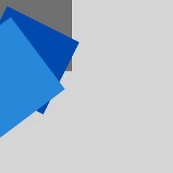

## setTransform

setTransform(a: number, b: number, c: number, d: number, e: number, f: number): void

The **setTransform** method uses the same parameters as the **transform()** method, but the **setTransform()** method resets the existing transformation matrix and creates a new one.

**Widget capability:** This API can be used in ArkTS widgets since API version 9.

**Atomic service API:** This API can be used in atomic services since API version 11.

**System capability:** SystemCapability.ArkUI.ArkUI.Full

> **NOTE**
>
> The transformed coordinates of each point in the graphic can be calculated using the following formulas.
>
> The transformed coordinates are calculated as follows (where x and y are the original coordinates, and x' and y' are the transformed coordinates):
>
> - x' = a × x + c × y + e
>
> - y' = b × x + d × y + f

**Parameters**

<!--Table: 10%; 10%; 10%; 70%-->

| Name | Type | Mandatory | Description |
| ---- | ------ | ---- | -------------------- |
| a    | number | Yes    | **scaleX**: specifies the horizontal scale. Negative values are supported.<br>Before API version 18, if this parameter is set to **NaN** or **Infinity**, drawing methods executed after this method cannot draw. If it is set to **null** or **undefined**, this API does not take effect. From API version 18 onward, if this parameter is set to **NaN**, **Infinity**, **null**, or **undefined**, this API does not take effect, and other drawing methods with valid parameters can draw normally. |
| b    | number | Yes    | **skewY**: specifies the vertical skew. Negative values are supported.<br>Before API version 18, if this parameter is set to **NaN** or **Infinity**, drawing methods executed after this method cannot draw. If it is set to **null** or **undefined**, this API does not take effect. From API version 18 onward, if this parameter is set to **NaN**, **Infinity**, **null**, or **undefined**, this API does not take effect, and other drawing methods with valid parameters can draw normally.  |
| c    | number | Yes    | **skewX**: specifies the horizontal skew. Negative values are supported.<br>Before API version 18, if this parameter is set to **NaN** or **Infinity**, drawing methods executed after this method cannot draw. If it is set to **null** or **undefined**, this API does not take effect. From API version 18 onward, if this parameter is set to **NaN**, **Infinity**, **null**, or **undefined**, this API does not take effect, and other drawing methods with valid parameters can draw normally.  |
| d    | number | Yes    | **scaleY**: specifies the vertical scale. Negative values are supported.<br>Before API version 18, if this parameter is set to **NaN** or **Infinity**, drawing methods executed after this method cannot draw. If it is set to **null** or **undefined**, this API does not take effect. From API version 18 onward, if this parameter is set to **NaN**, **Infinity**, **null**, or **undefined**, this API does not take effect, and other drawing methods with valid parameters can draw normally. |
| e    | number | Yes    | **translateX**: specifies the horizontal translation. Negative values are supported.<br>Before API version 18, if this parameter is set to **NaN** or **Infinity**, drawing methods executed after this method cannot draw. If it is set to **null** or **undefined**, this API does not take effect. From API version 18 onward, if this parameter is set to **NaN**, **Infinity**, **null**, or **undefined**, this API does not take effect, and other drawing methods with valid parameters can draw normally.<br>Default unit: vp |
| f    | number | Yes    | **translateY**: specifies the vertical translation. Negative values are supported.<br>Before API version 18, if this parameter is set to **NaN** or **Infinity**, drawing methods executed after this method cannot draw. If it is set to **null** or **undefined**, this API does not take effect. From API version 18 onward, if this parameter is set to **NaN**, **Infinity**, **null**, or **undefined**, this API does not take effect, and other drawing methods with valid parameters can draw normally.<br>Default unit: vp |

 **Example**

  ```ts
  // xxx.ets
  @Entry
  @Component
  struct SetTransform {
    private settings: RenderingContextSettings = new RenderingContextSettings(true);
    private context: CanvasRenderingContext2D = new CanvasRenderingContext2D(this.settings);
    private offCanvas: OffscreenCanvas = new OffscreenCanvas(600, 600);

    build() {
      Flex({ direction: FlexDirection.Column, alignItems: ItemAlign.Center, justifyContent: FlexAlign.Center }) {
        Canvas(this.context)
          .width('100%')
          .height('100%')
          .backgroundColor('#ffff00')
          .onReady(() => {
            let offContext = this.offCanvas.getContext("2d", this.settings)
            offContext.fillStyle = 'rgb(255,0,0)'
            offContext.fillRect(0, 0, 100, 100)
            offContext.setTransform(1,0.5, -0.5, 1, 10, 10)
            offContext.fillStyle = 'rgb(0,0,255)'
            offContext.fillRect(0, 0, 100, 100)
            let image = this.offCanvas.transferToImageBitmap()
            this.context.transferFromImageBitmap(image)
          })
      }
      .width('100%')
      .height('100%')
    }
  }
  ```

  

## setTransform

setTransform(transform?: Matrix2D): void

Resets the existing transform matrix and creates a new one with the **Matrix2D** object as a template.

**Widget capability:** This API can be used in ArkTS widgets since API version 9.

**Atomic service API:** This API can be used in atomic services since API version 11.

**System capability:** SystemCapability.ArkUI.ArkUI.Full

**Parameters**

| Name    | Type                                     | Mandatory | Description                                                        |
| ------- | ---------------------------------------- | --------- | ------------------------------------------------------------------ |
| transform | [Matrix2D](ts-components-canvas-matrix2d.md) | No        | Transformation matrix.<br>Exception values **undefined** and **null** are treated as invalid values.<br>Default value: **null** |

**Example**

 ```ts
 // xxx.ets
  @Entry
  @Component
  struct TransFormDemo {
    private settings: RenderingContextSettings = new RenderingContextSettings(true);
    private context1: CanvasRenderingContext2D = new CanvasRenderingContext2D(this.settings);
    private offcontext1: OffscreenCanvasRenderingContext2D = new OffscreenCanvasRenderingContext2D(600, 200, this.settings);
    private context2: CanvasRenderingContext2D = new CanvasRenderingContext2D(this.settings);
    private offcontext2: OffscreenCanvasRenderingContext2D = new OffscreenCanvasRenderingContext2D(600, 200, this.settings);

    build() {
      Flex({ direction: FlexDirection.Column, alignItems: ItemAlign.Center, justifyContent: FlexAlign.Center }) {
        Text('context1');
        Canvas(this.context1)
          .width('230vp')
          .height('160vp')
          .backgroundColor('#ffff00')
          .onReady(() => {
            this.offcontext1.fillRect(100, 20, 50, 50);
            this.offcontext1.setTransform(1, 0.5, -0.5, 1, 10, 10);
            this.offcontext1.fillRect(100, 20, 50, 50);
            let image = this.offcontext1.transferToImageBitmap();
            this.context1.transferFromImageBitmap(image);
          })
        Text('context2');
        Canvas(this.context2)
          .width('230vp')
          .height('160vp')
          .backgroundColor('#0ffff0')
          .onReady(() => {
            this.offcontext2.fillRect(100, 20, 50, 50);
            let storedTransform = this.offcontext1.getTransform();
            this.offcontext2.setTransform(storedTransform);
            this.offcontext2.fillRect(100, 20, 50, 50);
            let image = this.offcontext2.transferToImageBitmap();
            this.context2.transferFromImageBitmap(image);
          })
      }
      .width('100%')
      .height('100%')
    }
  }
 ```

 

## getTransform

getTransform(): Matrix2D

Obtains the transform matrix currently applied to the context.

**Widget capability:** This API can be used in ArkTS widgets since API version 9.

**Atomic service API:** This API can be used in atomic services since API version 11.

**System capability:** SystemCapability.ArkUI.ArkUI.Full

**Return value**

| Type                                      | Description    |
| ---------------------------------------- | ----- |
| [Matrix2D](ts-components-canvas-matrix2d.md) | The transformation matrix currently applied to the context. |

**Example**

  ```ts
  // xxx.ets
  @Entry
  @Component
  struct TransFormDemo {
    private settings: RenderingContextSettings = new RenderingContextSettings(true);
    private context1: CanvasRenderingContext2D = new CanvasRenderingContext2D(this.settings);
    private offcontext1: OffscreenCanvasRenderingContext2D =
      new OffscreenCanvasRenderingContext2D(600, 100, this.settings);
    private context2: CanvasRenderingContext2D = new CanvasRenderingContext2D(this.settings);
    private offcontext2: OffscreenCanvasRenderingContext2D =
      new OffscreenCanvasRenderingContext2D(600, 100, this.settings);

    build() {
      Flex({ direction: FlexDirection.Column, alignItems: ItemAlign.Center, justifyContent: FlexAlign.Center }) {
        Text('context1');
        Canvas(this.context1)
          .width('230vp')
          .height('120vp')
          .backgroundColor('#ffff00')
          .onReady(() => {
            this.offcontext1.fillRect(50, 50, 50, 50);
            this.offcontext1.setTransform(1.2, Math.PI / 8, Math.PI / 6, 0.5, 30, -25);
            this.offcontext1.fillRect(50, 50, 50, 50);
            let image = this.offcontext1.transferToImageBitmap();
            this.context1.transferFromImageBitmap(image);
          })
        Text('context2');
        Canvas(this.context2)
          .width('230vp')
          .height('120vp')
          .backgroundColor('#0ffff0')
          .onReady(() => {
            this.offcontext2.fillRect(50, 50, 50, 50);
            let storedTransform = this.offcontext1.getTransform();
            console.info(`Matrix [scaleX = ${storedTransform.scaleX}, scaleY = ${storedTransform.scaleY}, rotateX = ${storedTransform.rotateX}, rotateY = ${storedTransform.rotateY}, translateX = ${storedTransform.translateX}, translateY = ${storedTransform.translateY}]`)
            this.offcontext2.setTransform(storedTransform);
            this.offcontext2.fillRect(50, 50, 50, 50);
            let image = this.offcontext2.transferToImageBitmap();
            this.context2.transferFromImageBitmap(image);
          })
      }
      .width('100%')
      .height('100%')
    }
  }
  ```

  

## translate

translate(x: number, y: number): void

Moves the origin of the current coordinate system.

**Widget capability:** This API can be used in ArkTS widgets since API version 9.

**Atomic service API:** This API can be used in atomic services since API version 11.

**System capability:** SystemCapability.ArkUI.ArkUI.Full

 **Parameters**

<!--Table: 10%; 10%; 10%; 70%-->

| Name | Type | Mandatory | Description |
| ---- | ------ | ---- | -------- |
| x    | number | Yes  | Horizontal translation amount.<br>Before API version 18, if **NaN** or **Infinity** is set, drawing methods executed after this method cannot draw; if **null** or **undefined** is set, this API does not take effect. From API version 18 onward, if **NaN**, **Infinity**, **null**, or **undefined** is set, this API does not take effect, and other drawing methods with valid parameters draw normally.<br>Default unit: vp |
| y    | number | Yes  | Vertical translation amount.<br>Before API version 18, if **NaN** or **Infinity** is set, drawing methods executed after this method cannot draw; if **null** or **undefined** is set, this API does not take effect. From API version 18 onward, if **NaN**, **Infinity**, **null**, or **undefined** is set, this API does not take effect, and other drawing methods with valid parameters draw normally.<br>Default unit: vp |

 **Example**

  ```ts
  // xxx.ets
  @Entry
  @Component
  struct Translate {
    private settings: RenderingContextSettings = new RenderingContextSettings(true);
    private context: CanvasRenderingContext2D = new CanvasRenderingContext2D(this.settings);
    private offCanvas: OffscreenCanvas = new OffscreenCanvas(600, 600);

    build() {
      Flex({ direction: FlexDirection.Column, alignItems: ItemAlign.Center, justifyContent: FlexAlign.Center }) {
        Canvas(this.context)
          .width('100%')
          .height('100%')
          .backgroundColor('#ffff00')
          .onReady(() => {
            let offContext = this.offCanvas.getContext("2d", this.settings)
            offContext.fillRect(10, 10, 50, 50)
            offContext.translate(70, 70)
            offContext.fillRect(10, 10, 50, 50)
            let image = this.offCanvas.transferToImageBitmap()
            this.context.transferFromImageBitmap(image)
          })
      }
      .width('100%')
      .height('100%')
    }
  }
  ```

  

## drawImage

drawImage(image: ImageBitmap | PixelMap, dx: number, dy: number): void

Draws an image.

**Widget capability:** This API can be used in ArkTS widgets since API version 9. PixelMap objects are not supported in widgets.

**Atomic service API:** This API can be used in atomic services since API version 11.

**System capability:** SystemCapability.ArkUI.ArkUI.Full

 **Parameters**

<!--Table: 10%; 10%; 10%; 70%-->

| Name | Type | Mandatory | Description |
| ----- | ---------------------------------------- | ---- | ----------------------------- |
| image | [ImageBitmap](ts-components-canvas-imagebitmap.md) \| [PixelMap](../../apis-image-kit/arkts-apis-image-PixelMap.md) | Yes | Image resource. For details, see **ImageBitmap** or **PixelMap**.<br>Anomalous values such as **undefined** or **null** are treated as invalid and no drawing is performed. |
| dx | number | Yes | X-coordinate of the upper left corner of the drawing area.<br>Anomalous values such as **undefined** or **null** are treated as 0, and **NaN** and **Infinity** are treated as invalid, in which case no drawing is performed.<br>Default unit: vp |
| dy | number | Yes | Y-coordinate of the upper left corner of the drawing area.<br>Anomalous values such as **undefined** or **null** are treated as 0, and **NaN** and **Infinity** are treated as invalid, in which case no drawing is performed.<br>Default unit: vp |

 **Example**

> **NOTE**
>
> The resources used in this example are not located in the **src** > **main** > **resource** directory. Starting from DevEco Studio 6.0.0 Beta2, the resources that are located outside the **resources** directory are not packaged by default when a project or module is created. To package these resources, go to **buildOption** > **resOptions** > **copyCodeResource** in the module's **build-profile.json5** file, and set **enable** to **true**. For details, see the description of [copyCodeResource](https://developer.huawei.com/consumer/en/doc/harmonyos-guides/ide-hvigor-build-profile#section754823013348) in **resOptions**.

  ```ts
  // xxx.ets
  @Entry
  @Component
  struct DrawImage {
    private settings: RenderingContextSettings = new RenderingContextSettings(true);
    private context: CanvasRenderingContext2D = new CanvasRenderingContext2D(this.settings);
    // Replace "common/images/example.jpg" with the image resource file required by the developer.
    private img: ImageBitmap = new ImageBitmap("common/images/example.jpg");
    private offCanvas: OffscreenCanvas = new OffscreenCanvas(600, 600);

    build() {
      Flex({ direction: FlexDirection.Column, alignItems: ItemAlign.Center, justifyContent: FlexAlign.Center }) {
        Canvas(this.context)
          .width('100%')
          .height('100%')
          .backgroundColor('#D5D5D5')
          .onReady(() => {
            let offContext = this.offCanvas.getContext("2d", this.settings)
            offContext.drawImage(this.img, 0, 0)
            let image = this.offCanvas.transferToImageBitmap()
            this.context.transferFromImageBitmap(image)
          })
      }
      .width('100%')
      .height('100%')
    }
  }
  ```

  

## drawImage

drawImage(image: ImageBitmap | PixelMap, dx: number, dy: number, dw: number, dh: number): void

Draws the image by stretching or compressing it.

**Widget capability:** This API can be used in ArkTS widgets since API version 9. PixelMap objects are not supported in widgets.

**Atomic service API:** This API can be used in atomic services since API version 11.

**System capability:** SystemCapability.ArkUI.ArkUI.Full

 **Parameters**

| Name    | Type | Mandatory   | Description |
| ----- | ---------------------------------------- | ---- | ----------------------------- |
| image | [ImageBitmap](ts-components-canvas-imagebitmap.md) \| [PixelMap](../../apis-image-kit/arkts-apis-image-PixelMap.md) | Yes | Image resource. For details, see **ImageBitmap** or **PixelMap**.<br>Abnormal values **undefined** or **null** are treated as invalid and not drawn. |
| dx    | number | Yes  | X-axis position of the upper left corner of the drawing area.<br>Abnormal values **undefined** or **null** are treated as **0**. **NaN** and **Infinity** are treated as invalid and not drawn.<br>Default unit: vp |
| dy    | number | Yes  | Y-axis position of the upper left corner of the drawing area.<br>Abnormal values **undefined** or **null** are treated as **0**. **NaN** and **Infinity** are treated as invalid and not drawn.<br>Default unit: vp |
| dw    | number | Yes  | Width of the drawing area.<br>Negative values and abnormal values **undefined** or **null** are treated as **0**. **NaN** and **Infinity** are treated as invalid and not drawn.<br>Default unit: vp |
| dh    | number | Yes  | Height of the drawing area.<br>Negative values and abnormal values **undefined** or **null** are treated as **0**. **NaN** and **Infinity** are treated as invalid and not drawn.<br>Default unit: vp |

 **Example**

> **NOTE**
>
> The resources used in this example are not located in the **src** > **main** > **resource** directory. Starting from DevEco Studio 6.0.0 Beta2, the resources that are located outside the **resources** directory are not packaged by default when a project or module is created. To package these resources, go to **buildOption** > **resOptions** > **copyCodeResource** in the module's **build-profile.json5** file, and set **enable** to **true**. For details, see the description of [copyCodeResource](https://developer.huawei.com/consumer/en/doc/harmonyos-guides/ide-hvigor-build-profile#section754823013348) in **resOptions**.

  ```ts
  // xxx.ets
  @Entry
  @Component
  struct DrawImage {
    private settings: RenderingContextSettings = new RenderingContextSettings(true);
    private context: CanvasRenderingContext2D = new CanvasRenderingContext2D(this.settings);
    // Replace "common/images/example.jpg" with the image resource file required by the developer.
    private img: ImageBitmap = new ImageBitmap("common/images/example.jpg");
    private offCanvas: OffscreenCanvas = new OffscreenCanvas(600, 600);

    build() {
      Flex({ direction: FlexDirection.Column, alignItems: ItemAlign.Center, justifyContent: FlexAlign.Center }) {
        Canvas(this.context)
          .width('100%')
          .height('100%')
          .backgroundColor('#D5D5D5')
          .onReady(() => {
            let offContext = this.offCanvas.getContext("2d", this.settings)
            offContext.drawImage(this.img, 0, 0, 300, 300)
            let image = this.offCanvas.transferToImageBitmap()
            this.context.transferFromImageBitmap(image)
          })
      }
      .width('100%')
      .height('100%')
    }
  }
  ```

  

## drawImage

drawImage(image: ImageBitmap | PixelMap, sx: number, sy: number, sw: number, sh: number, dx: number, dy: number, dw: number, dh: number): void

Draws the image after cropping, stretching, or compressing it.

**Widget capability:** This API can be used in ArkTS widgets since API version 9. **PixelMap** objects are not supported in widgets.

**Atomic service API:** This API can be used in atomic services since API version 11.

**System capability:** SystemCapability.ArkUI.ArkUI.Full

 **Parameters**

| Name | Type | Mandatory | Description |
| ----- | ---------------------------------------- | ---- | ----------------------------- |
| image | [ImageBitmap](ts-components-canvas-imagebitmap.md) \| [PixelMap](../../apis-image-kit/arkts-apis-image-PixelMap.md) | Yes | Image resource. For details, see **ImageBitmap** or **PixelMap**.<br>Abnormal values **undefined** or **null** are treated as invalid and no drawing is performed. |
| sx | number | Yes | X-coordinate relative to the upper-left corner of the source image when cropping.<br>Abnormal values **undefined** or **null** are treated as 0; **NaN** and **Infinity** are treated as invalid and no drawing is performed.<br>When image is of the ImageBitmap type, default unit: vp.<br>When image is of the PixelMap type, before API version 18, default unit: px; from API version 18 onward, default unit: vp. |
| sy | number | Yes | Y-coordinate relative to the upper-left corner of the source image when cropping.<br>Abnormal values **undefined** or **null** are treated as 0; **NaN** and **Infinity** are treated as invalid and no drawing is performed.<br>When image is of the ImageBitmap type, default unit: vp.<br>When image is of the PixelMap type, before API version 18, default unit: px; from API version 18 onward, default unit: vp. |
| sw | number | Yes | Width to crop from the source image.<br>Negative values and abnormal values **undefined** or **null** are treated as 0; **NaN** and **Infinity** are treated as invalid and no drawing is performed.<br>When image is of the ImageBitmap type, default unit: vp.<br>When image is of the PixelMap type, before API version 18, default unit: px; from API version 18 onward, default unit: vp. |
| sh | number | Yes | Height to crop from the source image.<br>Negative values and abnormal values **undefined** or **null** are treated as 0; **NaN** and **Infinity** are treated as invalid and no drawing is performed.<br>When image is of the ImageBitmap type, default unit: vp.<br>When image is of the PixelMap type, before API version 18, default unit: px; from API version 18 onward, default unit: vp. |
| dx | number | Yes | X-coordinate of the upper-left corner of the drawing area.<br>Abnormal values **undefined** or **null** are treated as 0; **NaN** and **Infinity** are treated as invalid and no drawing is performed.<br>Default unit: vp. |
| dy | number | Yes | Y-coordinate of the upper-left corner of the drawing area.<br>Abnormal values **undefined** or **null** are treated as 0; **NaN** and **Infinity** are treated as invalid and no drawing is performed.<br>Default unit: vp. |
| dw | number | Yes | Width of the drawing area.<br>Negative values and abnormal values **undefined** or **null** are treated as 0; **NaN** and **Infinity** are treated as invalid and no drawing is performed.<br>Default unit: vp. |
| dh | number | Yes | Height of the drawing area.<br>Negative values and abnormal values **undefined** or **null** are treated as 0; **NaN** and **Infinity** are treated as invalid and no drawing is performed.<br>Default unit: vp. |

 **Example**

> **NOTE**
>
> The resources used in this example are not located in the **src** > **main** > **resource** directory. Starting from DevEco Studio 6.0.0 Beta2, the resources that are located outside the **resources** directory are not packaged by default when a project or module is created. To package these resources, go to **buildOption** > **resOptions** > **copyCodeResource** in the module's **build-profile.json5** file, and set **enable** to **true**. For details, see the description of [copyCodeResource](https://developer.huawei.com/consumer/en/doc/harmonyos-guides/ide-hvigor-build-profile#section754823013348) in **resOptions**.

  ```ts
  // xxx.ets
  @Entry
  @Component
  struct DrawImage {
    private settings: RenderingContextSettings = new RenderingContextSettings(true);
    private context: CanvasRenderingContext2D = new CanvasRenderingContext2D(this.settings);
    // Replace "common/images/example.jpg" with the image resource file required by the developer.
    private img: ImageBitmap = new ImageBitmap("common/images/example.jpg");
    private offCanvas: OffscreenCanvas = new OffscreenCanvas(600, 600);

    build() {
      Flex({ direction: FlexDirection.Column, alignItems: ItemAlign.Center, justifyContent: FlexAlign.Center }) {
        Canvas(this.context)
          .width('100%')
          .height('100%')
          .backgroundColor('#D5D5D5')
          .onReady(() => {
            let offContext = this.offCanvas.getContext("2d", this.settings)
            offContext.drawImage(this.img, 0, 0, 500, 500, 0, 0, 400, 300)
            let image = this.offCanvas.transferToImageBitmap()
            this.context.transferFromImageBitmap(image)
          })
      }
      .width('100%')
      .height('100%')
    }
  }
  ```

  

## createImageData

createImageData(sw: number, sh: number): ImageData

Creates a new **ImageData** object with the specified width and height based on the current **ImageData** object. For details, see [ImageData](ts-components-canvas-imagedata.md). This API involves memory copy and is time-consuming. Avoid frequent use. The example for **createImageData** is the same as that for **putImageData**.

**Widget capability:** This API can be used in ArkTS widgets since API version 9.

**Atomic service API:** This API can be used in atomic services since API version 11.

**System capability:** SystemCapability.ArkUI.ArkUI.Full

 **Parameters**

| Name | Type | Mandatory | Description |
| ---- | ------ | ---- | ------------- |
| sw | number | Yes | Width of the **ImageData**.<br>The abnormal values **undefined**, **null**, **NaN**, and **Infinity** are treated as 0.<br>Default unit: vp |
| sh | number | Yes | Height of the **ImageData**.<br>The abnormal values **undefined**, **null**, **NaN**, and **Infinity** are treated as 0.<br>Default unit: vp |

 **Return value**

| Type | Description |
| ---------------------------------------- | ------------- |
| [ImageData](ts-components-canvas-imagedata.md) | New **ImageData** object. |

## createImageData

createImageData(imageData: ImageData): ImageData

Creates a new **ImageData** object based on an existing **ImageData** object (without copying the image data). See [ImageData](ts-components-canvas-imagedata.md). This API involves memory copy and is time-consuming. Avoid frequent use. For the **createImageData** example, see **putImageData**.

**Widget capability:** This API can be used in ArkTS widgets since API version 9.

**Atomic service API:** This API can be used in atomic services since API version 11.

**System capability:** SystemCapability.ArkUI.ArkUI.Full

 **Parameters**

| Name | Type | Mandatory | Description |
| --------- | ---------------------------------------- | ---- | ---------------- |
| imageData | [ImageData](ts-components-canvas-imagedata.md) | Yes | **ImageData** object to be copied.<br>The abnormal values **undefined** and **null** are processed as an **ImageData** object with width and height being 0. |

 **Return value**

| Type | Description |
| ---------------------------------------- | ------------- |
| [ImageData](ts-components-canvas-imagedata.md) | New ImageData object. |

## getPixelMap

getPixelMap(sx: number, sy: number, sw: number, sh: number): PixelMap

Creates a [PixelMap](../../apis-image-kit/arkts-apis-image-PixelMap.md) object from the pixels in the specified area of the current canvas. This API involves memory copy and is time-consuming. Avoid frequent use.

**Atomic service API:** This API can be used in atomic services since API version 11.

**System capability:** SystemCapability.ArkUI.ArkUI.Full

 **Parameters**

| Name | Type | Mandatory | Description |
| ---- | ------ | ---- | --------------- |
| sx   | number | Yes  | X coordinate of the upper left corner of the area to output.<br>The abnormal values **undefined**, **null**, **NaN**, and **Infinity** are treated as 0.<br>Default unit: vp |
| sy   | number | Yes  | Y coordinate of the upper left corner of the area to output.<br>The abnormal values **undefined**, **null**, **NaN**, and **Infinity** are treated as 0.<br>Default unit: vp |
| sw   | number | Yes  | Width of the area to output.<br>The abnormal values **undefined**, **null**, **NaN**, and **Infinity** are treated as 0.<br>Default unit: vp |
| sh   | number | Yes  | Height of the area to output.<br>The abnormal values **undefined**, **null**, **NaN**, and **Infinity** are treated as 0.<br>Default unit: vp |

**Return value**

| Type                                      | Description          |
| ---------------------------------------- | -------------------- |
| [PixelMap](../../apis-image-kit/arkts-apis-image-PixelMap.md) | New **PixelMap** object. |

**Example**

> **NOTE**
>
> - The DevEco Studio previewer does not support displaying content drawn using **setPixelMap**.
>
> - The resources in this example are not located in the **src > main > resource** directory. Starting from DevEco Studio 6.0.0 Beta2, when creating a new project or module, the default module does not package resources outside the resources directory. You need to enable the related switch: set **buildOption > resOptions > copyCodeResource > enable** to **true** in the module's **build-profile.json5**. For details, see [copyCodeResource](https://developer.huawei.com/consumer/en/doc/harmonyos-guides/ide-hvigor-build-profile#section754823013348) in **resOptions**.

  ```ts
  // xxx.ets
  @Entry
  @Component
  struct GetPixelMap {
    private settings: RenderingContextSettings = new RenderingContextSettings(true);
    private context: CanvasRenderingContext2D = new CanvasRenderingContext2D(this.settings);
    // "common/images/example.jpg" needs to be replaced with the image resource file required by the developer.
    private img: ImageBitmap = new ImageBitmap("common/images/example.jpg");
    private offCanvas: OffscreenCanvas = new OffscreenCanvas(600, 600);

    build() {
      Flex({ direction: FlexDirection.Column, alignItems: ItemAlign.Center, justifyContent: FlexAlign.Center }) {
        Canvas(this.context)
          .width('100%')
          .height('100%')
          .backgroundColor('#ffff00')
          .onReady(() => {
            let offContext = this.offCanvas.getContext("2d", this.settings)
            offContext.drawImage(this.img, 100, 100, 130, 130)
            let pixelmap = offContext.getPixelMap(150, 150, 130, 130)
            offContext.setPixelMap(pixelmap)
            let image = this.offCanvas.transferToImageBitmap()
            this.context.transferFromImageBitmap(image)
          })
      }
      .width('100%')
      .height('100%')
    }
  }
  ```

  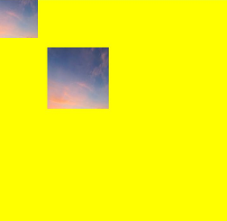

## setPixelMap

setPixelMap(value?: PixelMap): void

Draws the currently passed-in [PixelMap](../../apis-image-kit/arkts-apis-image-PixelMap.md) object on the canvas. For the **setPixelMap** example, see **getPixelMap**.

**Atomic service API:** This API can be used in atomic services since API version 11.

**System capability:** SystemCapability.ArkUI.ArkUI.Full

 **Parameters**

| Name | Type | Mandatory | Description |
| ---- | ------ | ---- | --------------- |
|  value  | [PixelMap](../../apis-image-kit/arkts-apis-image-PixelMap.md) | No | **PixelMap** object that contains pixel values.<br>Abnormal values **undefined** and **null** are treated as invalid values and will not be drawn.<br>Default value: **null** |

## getImageData

getImageData(sx: number, sy: number, sw: number, sh: number): ImageData

Creates an [ImageData](ts-components-canvas-imagedata.md) object from the pixels in the specified area of the current canvas. This API involves memory copy and is time-consuming. Avoid frequent use.

**Widget capability:** This API can be used in ArkTS widgets since API version 9.

**Atomic service API:** This API can be used in atomic services since API version 11.

**System capability:** SystemCapability.ArkUI.ArkUI.Full

 **Parameters**

| Name | Type | Mandatory | Description |
| ---- | ------ | ---- | --------------- |
| sx   | number | Yes | X coordinate of the upper left corner of the output area.<br>Abnormal values **undefined**, **null**, **NaN**, and **Infinity** are processed as 0.<br>Default unit: vp |
| sy   | number | Yes | Y coordinate of the upper left corner of the output area.<br>Abnormal values **undefined**, **null**, **NaN**, and **Infinity** are processed as 0.<br>Default unit: vp |
| sw   | number | Yes | Width of the output area.<br>Abnormal values **undefined**, **null**, **NaN**, and **Infinity** are processed as 0.<br>Default unit: vp |
| sh   | number | Yes | Height of the output area.<br>Abnormal values **undefined**, **null**, **NaN**, and **Infinity** are processed as 0.<br>Default unit: vp |

   **Return value**

| Type | Description |
| ---------------------------------------- | ------------- |
| [ImageData](ts-components-canvas-imagedata.md) | New **ImageData** object. |

**Example**

> **NOTE**
>
> The resources used in this example are not located in the **src** > **main** > **resource** directory. Starting from DevEco Studio 6.0.0 Beta2, the resources that are located outside the **resources** directory are not packaged by default when a project or module is created. To package these resources, go to **buildOption** > **resOptions** > **copyCodeResource** in the module's **build-profile.json5** file, and set **enable** to **true**. For details, see the description of [copyCodeResource](https://developer.huawei.com/consumer/en/doc/harmonyos-guides/ide-hvigor-build-profile#section754823013348) in **resOptions**.

  ```ts
  // xxx.ets
  @Entry
  @Component
  struct GetImageData {
    private settings: RenderingContextSettings = new RenderingContextSettings(true);
    private context: CanvasRenderingContext2D = new CanvasRenderingContext2D(this.settings);
    private offCanvas: OffscreenCanvas = new OffscreenCanvas(600, 600);
    // Replace "/common/images/1234.png" with the image resource file required by the developer.
    private img:ImageBitmap = new ImageBitmap("/common/images/1234.png");

    build() {
      Flex({ direction: FlexDirection.Column, alignItems: ItemAlign.Center, justifyContent: FlexAlign.Center }) {
        Canvas(this.context)
          .width('100%')
          .height('100%')
          .backgroundColor('#ffff00')
          .onReady(() => {
            let offContext = this.offCanvas.getContext("2d", this.settings)
            offContext.drawImage(this.img, 0, 0, 130, 130)
            let imageData = offContext.getImageData(50,50,130,130)
            offContext.putImageData(imageData, 150, 150)
            let image = this.offCanvas.transferToImageBitmap()
            this.context.transferFromImageBitmap(image)
          })
      }
      .width('100%')
      .height('100%')
    }
  }
  ```

  

## putImageData

putImageData(imageData: ImageData, dx: number | string, dy: number | string): void

Fills a new rectangular area with [ImageData](ts-components-canvas-imagedata.md) data.

**Widget capability:** This API can be used in ArkTS widgets since API version 9.

**Atomic service API:** This API can be used in atomic services since API version 11.

**System capability:** SystemCapability.ArkUI.ArkUI.Full

 **Parameters**

| Name | Type | Mandatory | Description |
| ----------- | ---------------------------------------- | ---- | ----------------------------- |
| imageData | [ImageData](ts-components-canvas-imagedata.md) | Yes | **ImageData** object that contains pixel values.<br>Abnormal values **undefined** or **null** are treated as invalid values, and no drawing is performed. |
| dx | number&nbsp;\|&nbsp;string<sup>10+</sup> | Yes | Offset of the fill area on the x-axis.<br>Abnormal values **undefined**, **null**, **NaN**, and **Infinity** are treated as 0.<br>Default unit: vp |
| dy | number&nbsp;\|&nbsp;string<sup>10+</sup> | Yes | Offset of the fill area on the y-axis.<br>Abnormal values **undefined**, **null**, **NaN**, and **Infinity** are treated as 0.<br>Default unit: vp |

 **Example**

  ```ts
  // xxx.ets
  @Entry
  @Component
  struct PutImageData {
    private settings: RenderingContextSettings = new RenderingContextSettings(true);
    private context: CanvasRenderingContext2D = new CanvasRenderingContext2D(this.settings);
    private offCanvas: OffscreenCanvas = new OffscreenCanvas(600, 600);

    build() {
      Flex({ direction: FlexDirection.Column, alignItems: ItemAlign.Center, justifyContent: FlexAlign.Center }) {
        Canvas(this.context)
          .width('100%')
          .height('100%')
          .backgroundColor('rgb(213,213,213)')
          .onReady(() => {
            let offContext = this.offCanvas.getContext("2d", this.settings)
            let imageDataNum = offContext.createImageData(100, 100)
            let imageData = offContext.createImageData(imageDataNum)
            for (let i = 0; i < imageData.data.length; i += 4) {
              imageData.data[i + 0] = 112
              imageData.data[i + 1] = 112
              imageData.data[i + 2] = 112
              imageData.data[i + 3] = 255
            }
            offContext.putImageData(imageData, 10, 10)
            let image = this.offCanvas.transferToImageBitmap()
            this.context.transferFromImageBitmap(image)
          })
      }
      .width('100%')
      .height('100%')
    }
  }
  ```

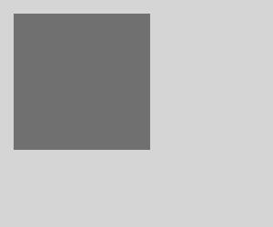

## putImageData

putImageData(imageData: ImageData, dx: number | string, dy: number | string, dirtyX: number | string, dirtyY: number | string, dirtyWidth: number | string, dirtyHeight: number | string): void

Uses [ImageData](ts-components-canvas-imagedata.md) data to clip and fill a new rectangular area.

**Widget capability:** This API can be used in ArkTS widgets since API version 9.

**Atomic service API:** This API can be used in atomic services since API version 11.

**System capability:** SystemCapability.ArkUI.ArkUI.Full

 **Parameters**

| Name | Type | Mandatory | Description |
| ----------- | ---------------------------------------- | ---- | ----------------------------- |
| imageData | [ImageData](ts-components-canvas-imagedata.md) | Yes | **ImageData** object containing pixel values.<br>Invalid values **undefined** and **null** are treated as invalid and no drawing is performed. |
| dx | number&nbsp;\|&nbsp;string<sup>10+</sup> | Yes | X-axis offset of the fill area.<br>Invalid values **undefined**, **null**, **NaN**, and **Infinity** are treated as 0.<br>Default unit: vp |
| dy | number&nbsp;\|&nbsp;string<sup>10+</sup> | Yes | Y-axis offset of the fill area.<br>Invalid values **undefined**, **null**, **NaN**, and **Infinity** are treated as 0.<br>Default unit: vp |
| dirtyX | number&nbsp;\|&nbsp;string<sup>10+</sup> | Yes | X-axis offset from the upper-left corner of the source image to the upper-left corner of the rectangular clipping region of the source image data.<br>Invalid values **undefined**, **null**, **NaN**, and **Infinity** are treated as 0.<br>Default unit: vp |
| dirtyY | number&nbsp;\|&nbsp;string<sup>10+</sup> | Yes | Y-axis offset from the upper-left corner of the source image to the upper-left corner of the rectangular clipping region of the source image data.<br>Invalid values **undefined**, **null**, **NaN**, and **Infinity** are treated as 0.<br>Default unit: vp |
| dirtyWidth | number&nbsp;\|&nbsp;string<sup>10+</sup> | Yes | Width of the rectangular clipping region of the source image data.<br>Invalid values **undefined**, **null**, **NaN**, and **Infinity** are treated as 0.<br>Default unit: vp |
| dirtyHeight | number&nbsp;\|&nbsp;string<sup>10+</sup> | Yes | Height of the rectangular clipping region of the source image data.<br>Invalid values **undefined**, **null**, **NaN**, and **Infinity** are treated as 0.<br>Default unit: vp |

 **Example**

  ```ts
  // xxx.ets
  @Entry
  @Component
  struct PutImageData {
    private settings: RenderingContextSettings = new RenderingContextSettings(true);
    private context: CanvasRenderingContext2D = new CanvasRenderingContext2D(this.settings);
    private offCanvas: OffscreenCanvas = new OffscreenCanvas(600, 600);

    build() {
      Flex({ direction: FlexDirection.Column, alignItems: ItemAlign.Center, justifyContent: FlexAlign.Center }) {
        Canvas(this.context)
          .width('100%')
          .height('100%')
          .backgroundColor('rgb(213,213,213)')
          .onReady(() => {
            let offContext = this.offCanvas.getContext("2d", this.settings)
            let imageDataNum = offContext.createImageData(100, 100)
            let imageData = offContext.createImageData(imageDataNum)
            for (let i = 0; i < imageData.data.length; i += 4) {
              imageData.data[i + 0] = 112
              imageData.data[i + 1] = 112
              imageData.data[i + 2] = 112
              imageData.data[i + 3] = 255
            }
            offContext.putImageData(imageData, 10, 10, 0, 0, 100, 50)
            let image = this.offCanvas.transferToImageBitmap()
            this.context.transferFromImageBitmap(image)
          })
      }
      .width('100%')
      .height('100%')
    }
  }
  ```


## setLineDash

setLineDash(segments: number[]): void

Sets the dash line style of the canvas.

**Widget capability:** This API can be used in ArkTS widgets since API version 9.

**Atomic service API:** This API can be used in atomic services since API version 11.

**System capability:** SystemCapability.ArkUI.ArkUI.Full

**Parameters** 

| Name      | Type   | Mandatory  | Description             |
| -------- | -------- | -------- | ------------------- |
| segments | number[] | Yes | Array describing how line segments alternate and the length of the spacing between segments.<br>Anomalous values **undefined** or **null** are treated as invalid values.<br>Default unit: vp |

**Example** 

  ```ts
  // xxx.ets
  @Entry
  @Component
  struct SetLineDash {
    private settings: RenderingContextSettings = new RenderingContextSettings(true);
    private context: CanvasRenderingContext2D = new CanvasRenderingContext2D(this.settings);
    private offCanvas: OffscreenCanvas = new OffscreenCanvas(600, 600);

    build() {
      Flex({ direction: FlexDirection.Column, alignItems: ItemAlign.Center, justifyContent: FlexAlign.Center }) {
        Canvas(this.context)
          .width('100%')
          .height('100%')
          .backgroundColor('#D5D5D5')
          .onReady(() => {
            let offContext = this.offCanvas.getContext("2d", this.settings)
            offContext.arc(100, 75, 50, 0, 6.28)
            offContext.setLineDash([10, 20])
            offContext.stroke()
            let image = this.offCanvas.transferToImageBitmap()
            this.context.transferFromImageBitmap(image)
          })
      }
      .width('100%')
      .height('100%')
    }
  }
  ```

  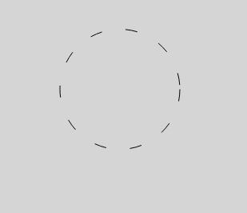

### transferFromImageBitmap

transferFromImageBitmap(bitmap: ImageBitmap): void

Displays the given **ImageBitmap** object.

**Widget capability:** This API can be used in ArkTS widgets since API version 9.

**Atomic service API:** This API can be used in atomic services since API version 11.

**System capability:** SystemCapability.ArkUI.ArkUI.Full

**Parameters** 

| Name | Type | Mandatory | Description |
| ------ | ----------------------- | ----------------- | ------------------ |
| bitmap | [ImageBitmap](ts-components-canvas-imagebitmap.md) | Yes | **ImageBitmap** object to be displayed. |

**Example** 

  ```ts
  // xxx.ets
  @Entry
  @Component
  struct TransferFromImageBitmap {
    private settings: RenderingContextSettings = new RenderingContextSettings(true)
    private context: CanvasRenderingContext2D = new CanvasRenderingContext2D(this.settings)
    private offContext: OffscreenCanvasRenderingContext2D = new OffscreenCanvasRenderingContext2D(600, 600, this.settings)

    build() {
      Flex({ direction: FlexDirection.Column, alignItems: ItemAlign.Center, justifyContent: FlexAlign.Center }) {
        Canvas(this.context)
          .width('100%')
          .height('100%')
          .backgroundColor('rgb(213,213,213)')
          .onReady(() =>{
            let imageData = this.offContext.createImageData(100, 100)
            for (let i = 0; i < imageData.data.length; i += 4) {
              imageData.data[i + 0] = 255
              imageData.data[i + 1] = 0
              imageData.data[i + 2] = 60
              imageData.data[i + 3] = 80
            }
            this.offContext.putImageData(imageData, 10, 10)
            let image = this.offContext.transferToImageBitmap()
            this.context.transferFromImageBitmap(image)
          })
      }
      .width('100%')
      .height('100%')
    }
  }
  ```

  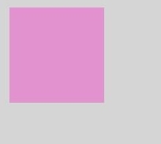  

## getLineDash

getLineDash(): number[]

Obtains the dash line style of the current canvas.

**Widget capability:** This API can be used in ArkTS widgets since API version 9.

**Atomic service API:** This API can be used in atomic services since API version 11.

**System capability:** SystemCapability.ArkUI.ArkUI.Full

**Return value** 

| Type     | Description                                                        |
| -------- | ------------------------------------------------------------------ |
| number[] | Array that describes how line segments alternate and the spacing length.<br>The abnormal values **undefined** and **null** are treated as invalid values.<br>Default unit: vp |

**Example** 

  ```ts
  // xxx.ets
  @Entry
  @Component
  struct OffscreenCanvasGetLineDash {
    @State message: string = 'Hello World';
    private settings: RenderingContextSettings = new RenderingContextSettings(true);
    private context: CanvasRenderingContext2D = new CanvasRenderingContext2D(this.settings);
    private offCanvas: OffscreenCanvas = new OffscreenCanvas(600, 600);

    build() {
      Row() {
        Column() {
          Text(this.message)
            .fontSize(50)
            .fontWeight(FontWeight.Bold)
          Canvas(this.context)
            .width('100%')
            .height('100%')
            .backgroundColor('#D5D5D5')
            .onReady(() => {
              let offContext = this.offCanvas.getContext("2d", this.settings)
              offContext.arc(100, 75, 50, 0, 6.28)
              offContext.setLineDash([10, 20])
              offContext.stroke()
              let res = offContext.getLineDash()
              this.message = JSON.stringify(res)
              let image = this.offCanvas.transferToImageBitmap()
              this.context.transferFromImageBitmap(image)
            })
        }
        .width('100%')
      }
      .height('100%')
    }
  }
  ```

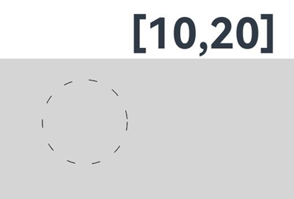 

## restore

restore(): void

Restores the saved drawing context.

> **NOTE**
>
> When the number of **restore()** calls does not exceed the number of **save()** calls, the stored drawing state is popped from the stack and the attributes, clipping path, and transformation matrix values of the **CanvasRenderingContext2D** object are restored.</br>
> When the number of **restore()** calls exceeds the number of **save()** calls, this method does nothing.</br>
> When no state is saved, this method does nothing.

**Widget capability:** This API can be used in ArkTS widgets since API version 9.

**Atomic service API:** This API can be used in atomic services since API version 11.

**System capability:** SystemCapability.ArkUI.ArkUI.Full

 **Example**

  ```ts
  // xxx.ets
  @Entry
  @Component
  struct CanvasExample {
    private settings: RenderingContextSettings = new RenderingContextSettings(true);
    private context: CanvasRenderingContext2D = new CanvasRenderingContext2D(this.settings);
    private offCanvas: OffscreenCanvas = new OffscreenCanvas(600, 600);
    
    build() {
      Flex({ direction: FlexDirection.Column, alignItems: ItemAlign.Center, justifyContent: FlexAlign.Center }) {
        Canvas(this.context)
          .width('100%')
          .height('100%')
          .backgroundColor('#ffff00')
          .onReady(() => {
            let offContext = this.offCanvas.getContext("2d", this.settings)
            offContext.save() // save the default state
            offContext.fillStyle = "#00ff00"
            offContext.fillRect(20, 20, 100, 100)
            offContext.restore() // restore to the default state
            offContext.fillRect(150, 75, 100, 100)
            let image = this.offCanvas.transferToImageBitmap()
            this.context.transferFromImageBitmap(image)
          })
      }
      .width('100%')
      .height('100%')
    }
  }
  ```

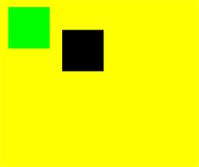 

## save

save(): void

Saves the current drawing context.

**Widget capability:** This API can be used in ArkTS widgets since API version 9.

**Atomic service API:** This API can be used in atomic services since API version 11.

**System capability:** SystemCapability.ArkUI.ArkUI.Full

 **Example** 

  ```ts
  // xxx.ets
  @Entry
  @Component
  struct CanvasExample {
    private settings: RenderingContextSettings = new RenderingContextSettings(true);
    private context: CanvasRenderingContext2D = new CanvasRenderingContext2D(this.settings);
    private offCanvas: OffscreenCanvas = new OffscreenCanvas(600, 600);
    
    build() {
      Flex({ direction: FlexDirection.Column, alignItems: ItemAlign.Center, justifyContent: FlexAlign.Center }) {
        Canvas(this.context)
          .width('100%')
          .height('100%')
          .backgroundColor('#ffff00')
          .onReady(() => {
            let offContext = this.offCanvas.getContext("2d", this.settings)
            offContext.save() // save the default state
            offContext.fillStyle = "#00ff00"
            offContext.fillRect(20, 20, 100, 100)
            offContext.restore() // restore to the default state
            offContext.fillRect(150, 75, 100, 100)
            let image = this.offCanvas.transferToImageBitmap()
            this.context.transferFromImageBitmap(image)
          })
      }
      .width('100%')
      .height('100%')
    }
  }
  ```

 

## createLinearGradient

createLinearGradient(x0: number, y0: number, x1: number, y1: number): CanvasGradient

Creates a linear gradient.

**Widget capability:** This API can be used in ArkTS widgets since API version 9.

**Atomic service API:** This API can be used in atomic services since API version 11.

**System capability:** SystemCapability.ArkUI.ArkUI.Full

 **Parameters**

| Name | Type | Mandatory | Description |
| ---- | ------ | ---- | -------- |
| x0   | number | Yes  | X coordinate of the start point.<br>If the value is **undefined** or **null**, this API returns **undefined**. **NaN** and **Infinity** are treated as invalid values.<br>Default unit: vp |
| y0   | number | Yes  | Y coordinate of the start point.<br>If the value is **undefined** or **null**, this API returns **undefined**. **NaN** and **Infinity** are treated as invalid values.<br>Default unit: vp |
| x1   | number | Yes  | X coordinate of the end point.<br>If the value is **undefined** or **null**, this API returns **undefined**. **NaN** and **Infinity** are treated as invalid values.<br>Default unit: vp |
| y1   | number | Yes  | Y coordinate of the end point.<br>If the value is **undefined** or **null**, this API returns **undefined**. **NaN** and **Infinity** are treated as invalid values.<br>Default unit: vp |

**Return value** 

| Type | Description |
| ------ | --------- |
| [CanvasGradient](ts-components-canvas-canvasgradient.md) | New **CanvasGradient** object used to create a gradient effect on the offscreen canvas. |

 **Example** 

  ```ts
  // xxx.ets
  @Entry
  @Component
  struct CreateLinearGradient {
    private settings: RenderingContextSettings = new RenderingContextSettings(true);
    private context: CanvasRenderingContext2D = new CanvasRenderingContext2D(this.settings);
    private offCanvas: OffscreenCanvas = new OffscreenCanvas(600, 600);
    
    build() {
      Flex({ direction: FlexDirection.Column, alignItems: ItemAlign.Center, justifyContent: FlexAlign.Center }) {
        Canvas(this.context)
          .width('100%')
          .height('100%')
          .backgroundColor('rgb(213,213,213)')
          .onReady(() => {
            let offContext = this.offCanvas.getContext("2d", this.settings)
            let grad = offContext.createLinearGradient(50,0, 300,100)
            grad.addColorStop(0.0, 'rgb(39,135,217)')
            grad.addColorStop(0.5, 'rgb(255,238,240)')
            grad.addColorStop(1.0, 'rgb(23,169,141)')
            offContext.fillStyle = grad
            offContext.fillRect(0, 0, 400, 400)
            let image = this.offCanvas.transferToImageBitmap()
            this.context.transferFromImageBitmap(image)
          })
      }
      .width('100%')
      .height('100%')
    }
  }
  ```


## createRadialGradient

createRadialGradient(x0: number, y0: number, r0: number, x1: number, y1: number, r1: number): CanvasGradient

Creates a radial gradient color.

**Widget capability:** This API can be used in ArkTS widgets since API version 9.

**Atomic service API:** This API can be used in atomic services since API version 11.

**System capability:** SystemCapability.ArkUI.ArkUI.Full

  **Parameters**

| Name | Type | Mandatory | Description |
| ---- | ------ | ---- | ----------------- |
| x0   | number | Yes  | X-coordinate of the start circle.<br>If an invalid value (**undefined** or **null**) is passed, this API returns **undefined**. **NaN** and **Infinity** are treated as invalid values.<br>Default unit: vp |
| y0   | number | Yes  | Y-coordinate of the start circle.<br>If an invalid value (**undefined** or **null**) is passed, this API returns **undefined**. **NaN** and **Infinity** are treated as invalid values.<br>Default unit: vp |
| r0   | number | Yes  | Radius of the start circle. Must be non-negative and finite.<br>If an invalid value (**undefined** or **null**) is passed, this API returns **undefined**. **NaN** and **Infinity** are treated as invalid values.<br>Default unit: vp |
| x1   | number | Yes  | X-coordinate of the end circle.<br>If an invalid value (**undefined** or **null**) is passed, this API returns **undefined**. **NaN** and **Infinity** are treated as invalid values.<br>Default unit: vp |
| y1   | number | Yes  | Y-coordinate of the end circle.<br>If an invalid value (**undefined** or **null**) is passed, this API returns **undefined**. **NaN** and **Infinity** are treated as invalid values.<br>Default unit: vp |
| r1   | number | Yes  | Radius of the end circle. Must be non-negative and finite.<br>If an invalid value (**undefined** or **null**) is passed, this API returns **undefined**. **NaN** and **Infinity** are treated as invalid values.<br>Default unit: vp |

**Return value** 

| Type | Description |
| ------ | --------- |
| [CanvasGradient](ts-components-canvas-canvasgradient.md) | New **CanvasGradient** object used to create a gradient effect on the offscreen canvas. |

  **Example**  

  ```ts
  // xxx.ets
  @Entry
  @Component
  struct CreateRadialGradient {
    private settings: RenderingContextSettings = new RenderingContextSettings(true);
    private context: CanvasRenderingContext2D = new CanvasRenderingContext2D(this.settings);
    private offCanvas: OffscreenCanvas = new OffscreenCanvas(600, 600);
    
    build() {
      Flex({ direction: FlexDirection.Column, alignItems: ItemAlign.Center, justifyContent: FlexAlign.Center }) {
        Canvas(this.context)
          .width('100%')
          .height('100%')
          .backgroundColor('rgb(213,213,213)')
          .onReady(() => {
            let offContext = this.offCanvas.getContext("2d", this.settings)
            let grad = offContext.createRadialGradient(200,200,50, 200,200,200)
            grad.addColorStop(0.0, 'rgb(39,135,217)')
            grad.addColorStop(0.5, 'rgb(255,238,240)')
            grad.addColorStop(1.0, 'rgb(112,112,112)')
            offContext.fillStyle = grad
            offContext.fillRect(0, 0, 440, 440)
            let image = this.offCanvas.transferToImageBitmap()
            this.context.transferFromImageBitmap(image)
          })
      }
      .width('100%')
      .height('100%')
    }
  }
  ```

  

## createConicGradient<sup>10+</sup>

createConicGradient(startAngle: number, x: number, y: number): CanvasGradient

Creates a conic gradient.

**Atomic service API:** This API can be used in atomic services since API version 11.

**Model restriction:** This API can be used only in the stage model.

**System capability:** SystemCapability.ArkUI.ArkUI.Full

**Parameters**

| Name | Type | Mandatory | Description |
| ---------- | ------ | ----  | ----------------------------------- |
| startAngle | number | Yes    | Start angle of the gradient. The angle measurement starts from the right side of the center horizontally and moves clockwise.<br>Abnormal values **undefined** and **null** are processed as 0, and **NaN** and **Infinity** are processed as invalid values.<br>Unit: radian |
| x          | number | Yes    | X-coordinate of the center of the conic gradient.<br>Abnormal values **undefined** and **null** are processed as 0, and **NaN** and **Infinity** are processed as invalid values.<br>Default unit: vp |
| y          | number | Yes    | Y-coordinate of the center of the conic gradient.<br>Abnormal values **undefined** and **null** are processed as 0, and **NaN** and **Infinity** are processed as invalid values.<br>Default unit: vp |

**Return value** 

| Type     | Description        |
| ------ | --------- |
| [CanvasGradient](ts-components-canvas-canvasgradient.md) | New **CanvasGradient** object used to create a gradient effect on the offscreen canvas. |

**Example**

```ts
// xxx.ets
@Entry
@Component
struct OffscreenCanvasConicGradientPage {
  private settings: RenderingContextSettings = new RenderingContextSettings(true);
  private context: CanvasRenderingContext2D = new CanvasRenderingContext2D(this.settings);
  private offCanvas: OffscreenCanvas = new OffscreenCanvas(600, 600);

  build() {
    Flex({ direction: FlexDirection.Column, alignItems: ItemAlign.Center, justifyContent: FlexAlign.Center }) {
      Canvas(this.context)
        .width('100%')
        .height('100%')
        .backgroundColor('#ffffff')
        .onReady(() => {
          let offContext = this.offCanvas.getContext("2d", this.settings)
          let grad = offContext.createConicGradient(0, 50, 80)
          grad.addColorStop(0.0, '#ff0000')
          grad.addColorStop(0.5, '#ffffff')
          grad.addColorStop(1.0, '#00ff00')
          offContext.fillStyle = grad
          offContext.fillRect(0, 30, 100, 100)
          let image = this.offCanvas.transferToImageBitmap()
          this.context.transferFromImageBitmap(image)
        })
    }
    .width('100%')
    .height('100%')
  }
}
```

  

## CanvasFillRule

type CanvasFillRule = "evenodd" | "nonzero"

Defines the type of the fill rule algorithm used to determine whether a point is inside or outside a path. The value is a union of the types in the following table.

**Widget capability:** This API can be used in ArkTS widgets since API version 9.

**Atomic service API:** This API can be used in atomic services since API version 11.

**System capability:** SystemCapability.ArkUI.ArkUI.Full

| Type      | Description    |
| ------- | ----- |
| "evenodd" | Even-odd rule.<br/>This rule determines whether a point on the canvas is inside a shape by casting a ray from the point in any direction and counting the number of intersections between the ray and the shape path. If the number of intersections is odd, the point is inside the shape; otherwise, it is outside. |
| "nonzero" | Nonzero rule.<br/>This rule determines whether a point on the canvas is inside a shape by casting a ray from the point in any direction and checking the intersections between the ray and the shape path. The initial count is 0. Each segment of the path is assigned a direction value. The count increases by 1 when the path crosses the ray from left to right, and decreases by 1 when it crosses from right to left. If the final result is 0, the point is outside the shape; otherwise, it is inside. |

**Example**

```ts
// xxx.ets
@Entry
@Component
struct Index {
  private settings: RenderingContextSettings = new RenderingContextSettings(true);
  private context: CanvasRenderingContext2D = new CanvasRenderingContext2D(this.settings);
  private offCanvas: OffscreenCanvas = new OffscreenCanvas(600, 600);

  build() {
    Flex({ direction: FlexDirection.Column, alignItems: ItemAlign.Center, justifyContent: FlexAlign.Center }) {
      Canvas(this.context)
        .width('100%')
        .height('100%')
        .backgroundColor('rgb(213, 213, 213)')
        .onReady(() => {
          let offContext = this.offCanvas.getContext("2d", this.settings)
          offContext.font = '60px sans-serif'
          offContext.fillStyle = 'rgb(39, 135, 217)';
          // Nonzero winding rule (nonzero)
          offContext.beginPath();
          offContext.arc(100, 100, 60, 0, Math.PI * 2);
          offContext.arc(100, 100, 20, 0, Math.PI * 2);
          offContext.fill('nonzero'); // Use the nonzero winding rule.
          offContext.fillText('nonzero', 65, 200)
          // Even-odd winding rule (evenodd)
          offContext.beginPath();
          offContext.arc(250, 100, 60, 0, Math.PI * 2);
          offContext.arc(250, 100, 20, 0, Math.PI * 2);
          offContext.fill('evenodd'); // Use the even-odd winding rule.
          offContext.fillText('evenodd', 215, 200)
          let image = this.offCanvas.transferToImageBitmap()
          this.context.transferFromImageBitmap(image)
        })
    }
    .width('100%')
    .height('100%')
  }
}
```


## TextMetrics

**Widget capability:** This API can be used in ArkTS widgets since API version 9.

**Atomic service API:** This API can be used in atomic services since API version 11.

**System capability:** SystemCapability.ArkUI.ArkUI.Full

<!--Table: 25%; 10%; 10%; 10%; 45%-->

| Name | Type | Read-Only | Optional | Description |
| ---------- | -------------- | ------ | ---------------- | ------------------------ |
| width                    | number | Yes | No | Read-only property. Width of the text block. |
| height                   | number | Yes | No | Read-only property. Height of the text block. |
| actualBoundingBoxAscent  | number | Yes | No | Read-only property. Distance from the horizontal line indicated by the [textBaseline](./ts-components-canvas-common-property.md#canvastextbaseline) attribute to the top of the bounding rectangle of the drawn text. |
| actualBoundingBoxDescent | number | Yes | No | Read-only property. Distance from the horizontal line indicated by the [textBaseline](./ts-components-canvas-common-property.md#canvastextbaseline) attribute to the bottom of the bounding rectangle of the drawn text. |
| actualBoundingBoxLeft    | number | Yes | No | Read-only property. Distance from the alignment point determined by the [textAlign](./ts-components-canvas-common-property.md#canvastextalign) attribute to the left side of the text bounding rectangle, parallel to the baseline. |
| actualBoundingBoxRight   | number | Yes | No | Read-only property. Distance from the alignment point determined by the [textAlign](./ts-components-canvas-common-property.md#canvastextalign) attribute to the right side of the text bounding rectangle, parallel to the baseline. |
| alphabeticBaseline       | number | Yes | No | Read-only property. Distance from the horizontal line indicated by the [textBaseline](./ts-components-canvas-common-property.md#canvastextbaseline) attribute to the alphabetic baseline of the line box. |
| emHeightAscent           | number | Yes | No | Read-only property. Distance from the horizontal line indicated by the [textBaseline](./ts-components-canvas-common-property.md#canvastextbaseline) attribute to the top of the em square in the line box. |
| emHeightDescent          | number | Yes | No | Read-only property. Distance from the horizontal line indicated by the [textBaseline](./ts-components-canvas-common-property.md#canvastextbaseline) attribute to the bottom of the em square in the line box. |
| fontBoundingBoxAscent    | number | Yes | No | Read-only property. Distance from the horizontal line indicated by the [textBaseline](./ts-components-canvas-common-property.md#canvastextbaseline) attribute to the top of the highest bounding rectangle of all fonts used to draw the text. |
| fontBoundingBoxDescent   | number | Yes | No | Read-only property. Distance from the horizontal line indicated by the [textBaseline](./ts-components-canvas-common-property.md#canvastextbaseline) attribute to the bottom of the bounding rectangle of all fonts used to draw the text. |
| hangingBaseline          | number | Yes | No | Read-only property. Distance from the horizontal line indicated by the [textBaseline](./ts-components-canvas-common-property.md#canvastextbaseline) attribute to the hanging baseline of the line box. |
| ideographicBaseline      | number | Yes | No | Read-only property. Distance from the horizontal line indicated by the [textBaseline](./ts-components-canvas-common-property.md#canvastextbaseline) attribute to the ideographic baseline of the line box. |