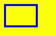
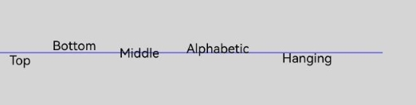
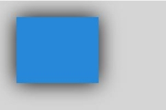
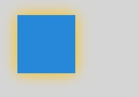
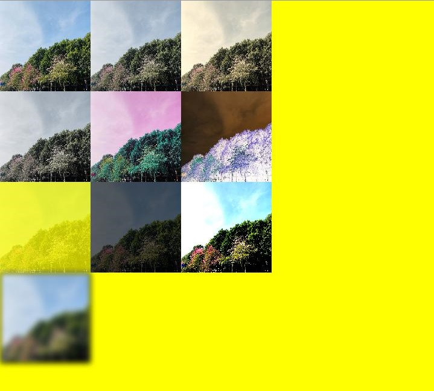
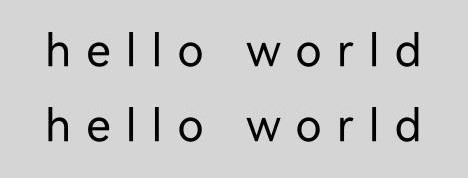

# Common Canvas Drawing Properties

<!--Kit: ArkUI-->
<!--Subsystem: ArkUI-->
<!--Owner: @camlostshi-->
<!--Designer: @fenglinbailu-->
<!--Tester: @l30014443-->
<!--Adviser: @Brilliantry_Rui-->
<!-- md-trans-meta sourceCommit=fb690f2b69bcde6340deb8af9c2b2101509f05ac translatedAt=2026-08-10T02:23:10.958Z pushedAt=2026-08-11T01:06:50.878Z -->

Common properties of the canvas drawing components [CanvasRenderingContext2D](ts-canvasrenderingcontext2d.md) and [OffscreenCanvasRenderingContext2D](ts-offscreencanvasrenderingcontext2d.md).

> **NOTE**
>
> - The initial APIs of this module are supported since API version 8. Newly added APIs in later versions are marked with a superscript to indicate their starting version.
>
> - The string format for **fillStyle**, **shadowColor**, and **strokeStyle** is 'rgb(255, 255, 255)', 'rgba(255, 255, 255, 1.0)', or '\#FFFFFF'.

## fillStyle

Specifies the fill color for drawing. This is a write-only property. You can set its value through an assignment statement, but you cannot obtain its current value through a read operation. If you attempt to read it, **undefined** is returned.

**Widget capability:** This API can be used in ArkTS widgets since API version 9.

**Atomic service API:** This API can be used in atomic services since API version 11.

**System capability:** SystemCapability.ArkUI.ArkUI.Full

| Name | Type | Read-Only | Optional | Description |
| ------ | ------ | ---------- | -------------- | ---------------------------------------- |
| fillStyle | string&nbsp;\|&nbsp;number<sup>10+</sup>&nbsp;\|&nbsp;[CanvasGradient](ts-components-canvas-canvasgradient.md)&nbsp;\|&nbsp;[CanvasPattern](ts-components-canvas-canvaspattern.md) | No | No | <br/>-&nbsp;When the type is string, this property sets the color of the fill area. For details about the color format, see the string type description in [ResourceColor](ts-types.md#resourcecolor).<br/>- When the type is number, this property sets the color of the fill area. Fully transparent colors are not supported. For details about the color format, see the number type description in [ResourceColor](ts-types.md#resourcecolor).<br/>-&nbsp;When the type is CanvasGradient, this property specifies a gradient object created using the [createLinearGradient](ts-components-canvas-common-method.md#createlineargradient) method.<br/>-&nbsp;When the type is CanvasPattern, this property specifies a pattern object created using the [createPattern](ts-components-canvas-common-method.md#createpattern) method.<br/>Default value: '#000000' (black)<br/>Invalid values are ignored.<br/> |

**Example**

```ts
// xxx.ets
@Entry
@Component
struct FillStyleExample {
  private settings: RenderingContextSettings = new RenderingContextSettings(true);
  private context: CanvasRenderingContext2D = new CanvasRenderingContext2D(this.settings);
  private offCanvas: OffscreenCanvas = new OffscreenCanvas(600, 600);

  build() {
    Flex({ direction: FlexDirection.Column, alignItems: ItemAlign.Center, justifyContent: FlexAlign.Center }) {
      Canvas(this.context)
        .width('100%')
        .height('100%')
        .backgroundColor('#ffff00')
        .onReady(() => {
          let offContext = this.offCanvas.getContext("2d", this.settings)
          // Set the fillStyle property using a string.
          offContext.fillStyle = '#0000ff'
          offContext.fillRect(20, 20, 150, 100)
          let image = this.offCanvas.transferToImageBitmap()
          this.context.transferFromImageBitmap(image)
        })
    }
    .width('100%')
    .height('100%')
  }
}
```

```ts
// xxx.ets
@Entry
@Component
struct FillStyleExample {
  private settings: RenderingContextSettings = new RenderingContextSettings(true);
  private context: CanvasRenderingContext2D = new CanvasRenderingContext2D(this.settings);
  private offCanvas: OffscreenCanvas = new OffscreenCanvas(600, 600);

  build() {
    Flex({ direction: FlexDirection.Column, alignItems: ItemAlign.Center, justifyContent: FlexAlign.Center }) {
      Canvas(this.context)
        .width('100%')
        .height('100%')
        .backgroundColor('#ffff00')
        .onReady(() => {
          let offContext = this.offCanvas.getContext("2d", this.settings)
          // Set the fillStyle property using a number.
          offContext.fillStyle = 0x0000FF
          offContext.fillRect(20, 20, 150, 100)
          let image = this.offCanvas.transferToImageBitmap()
          this.context.transferFromImageBitmap(image)
        })
    }
    .width('100%')
    .height('100%')
  }
}
```


## lineWidth

Sets the width of drawn lines. This is a write-only property. You can set its value through an assignment statement, but cannot obtain its current value through a read operation. Attempting to read it will return **undefined**.

**Widget capability:** This API can be used in ArkTS widgets since API version 9.

**Atomic service API:** This API can be used in atomic services since API version 11.

**System capability:** SystemCapability.ArkUI.ArkUI.Full

| Name | Type | Read-Only | Optional | Description |
| ------ | ------ | ---------- | -------------- | ---------------------------------------- |
| **lineWidth** | number | No | No | Width of drawn lines.<br/>Default value: 1 (px)<br/>Default unit: vp<br/>The value of **lineWidth** does not support 0 or negative numbers. **0**, negative numbers, and **NaN** are processed as the default value. Infinity causes APIs related to the **lineWidth** property to be unable to draw. |

**Example**

```ts
// xxx.ets
@Entry
@Component
struct LineWidthExample {
  private settings: RenderingContextSettings = new RenderingContextSettings(true);
  private context: CanvasRenderingContext2D = new CanvasRenderingContext2D(this.settings);
  private offCanvas: OffscreenCanvas = new OffscreenCanvas(600, 600);

  build() {
    Flex({ direction: FlexDirection.Column, alignItems: ItemAlign.Center, justifyContent: FlexAlign.Center }) {
      Canvas(this.context)
        .width('100%')
        .height('100%')
        .backgroundColor('#ffff00')
        .onReady(() => {
          let offContext = this.offCanvas.getContext("2d", this.settings)
          // Set the lineWidth property.
          offContext.lineWidth = 5
          offContext.strokeRect(25, 25, 85, 105)
          let image = this.offCanvas.transferToImageBitmap()
          this.context.transferFromImageBitmap(image)
        })
    }
    .width('100%')
    .height('100%')
  }
}
```


## strokeStyle

Sets the color of the stroke. This is a write-only property. Its value can be set through an assignment statement, but the current value cannot be obtained through a read operation. If a read is attempted, **undefined** is returned.

**Widget capability:** This API can be used in ArkTS widgets since API version 9.

**Atomic service API:** This API can be used in atomic services since API version 11.

**System capability:** SystemCapability.ArkUI.ArkUI.Full

| Name | Type | Read-Only | Optional | Description |
| ------ | ------ | ---------- | -------------- | ---------------------------------------- |
| strokeStyle | string&nbsp;\|&nbsp;number<sup>10+</sup>&nbsp;\|&nbsp;[CanvasGradient](ts-components-canvas-canvasgradient.md)&nbsp;\|&nbsp;[CanvasPattern](ts-components-canvas-canvaspattern.md) | No | No | <br/>-&nbsp;When the type is string, it indicates the color used for the stroke. For details about the color format, see the string type description in [ResourceColor](ts-types.md#resourcecolor).<br/>- When the type is number, it indicates the color used for the stroke. Fully transparent colors are not supported. For details about the color format, see the number type description in [ResourceColor](ts-types.md#resourcecolor).<br/>-&nbsp;When the type is CanvasGradient, it indicates a gradient object created using the [createLinearGradient](./ts-components-canvas-common-method.md#createlineargradient) method.<br/>-&nbsp;When the type is CanvasPattern, it indicates a pattern object created using the [createPattern](./ts-components-canvas-common-method.md#createpattern) method.<br/>Default value: '#000000' (black)<br/>Invalid values are ignored.<br/> |

**Example**

```ts
// xxx.ets
@Entry
@Component
struct StrokeStyleExample {
  private settings: RenderingContextSettings = new RenderingContextSettings(true);
  private context: CanvasRenderingContext2D = new CanvasRenderingContext2D(this.settings);
  private offCanvas: OffscreenCanvas = new OffscreenCanvas(600, 600);

  build() {
    Flex({ direction: FlexDirection.Column, alignItems: ItemAlign.Center, justifyContent: FlexAlign.Center }) {
      Canvas(this.context)
        .width('100%')
        .height('100%')
        .backgroundColor('#ffff00')
        .onReady(() => {
          let offContext = this.offCanvas.getContext("2d", this.settings)
          offContext.lineWidth = 10
          // Set the strokeStyle property using a string.
          offContext.strokeStyle = '#0000ff'
          offContext.strokeRect(25, 25, 155, 105)
          let image = this.offCanvas.transferToImageBitmap()
          this.context.transferFromImageBitmap(image)
        })
    }
    .width('100%')
    .height('100%')
  }
}
```

```ts
// xxx.ets
@Entry
@Component
struct StrokeStyleExample {
  private settings: RenderingContextSettings = new RenderingContextSettings(true);
  private context: CanvasRenderingContext2D = new CanvasRenderingContext2D(this.settings);
  private offCanvas: OffscreenCanvas = new OffscreenCanvas(600, 600);

  build() {
    Flex({ direction: FlexDirection.Column, alignItems: ItemAlign.Center, justifyContent: FlexAlign.Center }) {
      Canvas(this.context)
        .width('100%')
        .height('100%')
        .backgroundColor('#ffff00')
        .onReady(() => {
          let offContext = this.offCanvas.getContext("2d", this.settings)
          offContext.lineWidth = 10
          // Set the strokeStyle property using a number.
          offContext.strokeStyle = 0x0000ff
          offContext.strokeRect(25, 25, 155, 105)
          let image = this.offCanvas.transferToImageBitmap()
          this.context.transferFromImageBitmap(image)
        })
    }
    .width('100%')
    .height('100%')
  }
}
```



## lineCap

Specifies the style of the line endpoint. This is a write-only property. You can set its value through an assignment statement, but you cannot obtain its current value through a read operation. If you attempt to read it, **undefined** is returned.

**Widget capability:** This API can be used in ArkTS widgets since API version 9.

**Atomic service API:** This API can be used in atomic services since API version 11.

**System capability:** SystemCapability.ArkUI.ArkUI.Full

| Name | Type | Read-Only | Optional | Description |
| ------ | ------ | ---------- | -------------- | ---------------------------------------- |
| lineCap | [CanvasLineCap](#canvaslinecap) | No | No | Style of the line endpoint.<br/>Default value: 'butt' |

**Example**

```ts
// xxx.ets
@Entry
@Component
struct LineCapExample {
  private settings: RenderingContextSettings = new RenderingContextSettings(true);
  private context: CanvasRenderingContext2D = new CanvasRenderingContext2D(this.settings);
  private offCanvas: OffscreenCanvas = new OffscreenCanvas(600, 600);

  build() {
    Flex({ direction: FlexDirection.Column, alignItems: ItemAlign.Center, justifyContent: FlexAlign.Center }) {
      Canvas(this.context)
        .width('100%')
        .height('100%')
        .backgroundColor('#ffff00')
        .onReady(() => {
          let offContext = this.offCanvas.getContext("2d", this.settings)
          offContext.lineWidth = 8
          offContext.beginPath()
          // Set the lineCap property.
          offContext.lineCap = 'round'
          offContext.moveTo(30, 50)
          offContext.lineTo(220, 50)
          offContext.stroke()
          let image = this.offCanvas.transferToImageBitmap()
          this.context.transferFromImageBitmap(image)
        })
    }
    .width('100%')
    .height('100%')
  }
}
```


## lineJoin

Specifies the style of the intersection point where line segments meet. This attribute is a write-only property, which can be set through an assignment statement but cannot be read. Attempting to read it returns **undefined**.

**Widget capability:** This API can be used in ArkTS widgets since API version 9.

**Atomic service API:** This API can be used in atomic services since API version 11.

**System capability:** SystemCapability.ArkUI.ArkUI.Full

| Name | Type | Read-Only | Optional | Description |
| ------ | ------ | ---------- | -------------- | ---------------------------------------- |
| lineJoin | [CanvasLineJoin](#canvaslinejoin) | No | No | Style of the intersection point where line segments meet.<br/>Default value: 'miter' |

**Example**

```ts
// xxx.ets
@Entry
@Component
struct LineJoinExample {
  private settings: RenderingContextSettings = new RenderingContextSettings(true);
  private context: CanvasRenderingContext2D = new CanvasRenderingContext2D(this.settings);
  private offCanvas: OffscreenCanvas = new OffscreenCanvas(600, 600);

  build() {
    Flex({ direction: FlexDirection.Column, alignItems: ItemAlign.Center, justifyContent: FlexAlign.Center }) {
      Canvas(this.context)
        .width('100%')
        .height('100%')
        .backgroundColor('#ffff00')
        .onReady(() => {
          let offContext = this.offCanvas.getContext("2d", this.settings)
          offContext.beginPath()
          offContext.lineWidth = 8
          // Set the lineJoin property.
          offContext.lineJoin = 'miter'
          offContext.moveTo(30, 30)
          offContext.lineTo(120, 60)
          offContext.lineTo(30, 110)
          offContext.stroke()
          let image = this.offCanvas.transferToImageBitmap()
          this.context.transferFromImageBitmap(image)
      })
    }
    .width('100%')
    .height('100%')
  }
}
```


## miterLimit

Sets the miter limit, which specifies the distance between the inner corner and outer corner at the intersection of lines. This property takes effect only when **lineJoin** is set to **miter**. It is a write-only property. You can set its value through an assignment statement, but you cannot obtain its current value through a read operation. If you attempt to read it, **undefined** is returned.

**Widget capability:** This API can be used in ArkTS widgets since API version 9.

**Atomic service API:** This API can be used in atomic services since API version 11.

**System capability:** SystemCapability.ArkUI.ArkUI.Full

| Name | Type | Read-Only | Optional | Description |
| ------ | ------ | ---------- | -------------- | ---------------------------------------- |
| miterLimit | number | No | No | Miter limit.<br/>Default value: 10px<br/>Unit: px<br/>The value of **miterLimit** does not support 0 or negative numbers. **0**, negative numbers, and **NaN** are processed as the default value. **Infinity** causes APIs related to the **miterLimit** property to fail to draw. |

**Example**

```ts
// xxx.ets
@Entry
@Component
struct MiterLimit {
  private settings: RenderingContextSettings = new RenderingContextSettings(true);
  private context: CanvasRenderingContext2D = new CanvasRenderingContext2D(this.settings);
  private offCanvas: OffscreenCanvas = new OffscreenCanvas(600, 600);
  
  build() {
    Flex({ direction: FlexDirection.Column, alignItems: ItemAlign.Center, justifyContent: FlexAlign.Center }) {
      Canvas(this.context)
        .width('100%')
        .height('100%')
        .backgroundColor('#ffff00')
        .onReady(() => {
          let offContext = this.offCanvas.getContext("2d", this.settings)
          offContext.lineWidth = 8
          offContext.lineJoin = 'miter'
          // Set the miterLimit property.
          offContext.miterLimit = 3
          offContext.moveTo(30, 30)
          offContext.lineTo(60, 35)
          offContext.lineTo(30, 37)
          offContext.stroke()
          let image = this.offCanvas.transferToImageBitmap()
          this.context.transferFromImageBitmap(image)
      })
    }
    .width('100%')
    .height('100%')
  }
}
```


## font

Sets the font style for text drawing. This property is a write-only property. Its value can be set through an assignment statement, but its current value cannot be obtained through a read operation. Attempting to read it will return **undefined**.

Syntax: ctx.font&nbsp;=&nbsp;'font-style&nbsp;font-weight&nbsp;font-size&nbsp;font-family'<br/>-&nbsp;**font-style** (optional): specifies the font style. The following styles are supported: 'normal' and 'italic'.<br/>-&nbsp;**font-weight** (optional): specifies the font weight. The following types are supported: 'normal',&nbsp;'bold',&nbsp;'bolder',&nbsp;'lighter',&nbsp;100,&nbsp;200,&nbsp;300,&nbsp;400,&nbsp;500,&nbsp;600,&nbsp;700,&nbsp;800,&nbsp;900.<br/>-&nbsp;**font-size** (optional): specifies the font size and line height. The unit can be px or vp. A unit must be appended when used.<br/>-&nbsp;**font-family** (optional): specifies the font family. The following types are supported: 'sans-serif',&nbsp;'serif',&nbsp;'monospace'.

Since API version 20, this API can be used to set a registered custom font (only available in the main thread, not supported in worker threads; the DevEco Studio previewer does not support displaying custom fonts). There are two ways to register a custom font. One is through the ArkUI asynchronous API this.uiContext.getFont().[registerFont](../arkts-apis-uicontext-font.md#registerfont). Drawing immediately after calling this API may cause the custom font to not take effect. The other is to directly call the font engine's fontCollection.[loadFontSync](../../apis-arkgraphics2d/js-apis-graphics-text.md#loadfontsync) API to register the custom font with the font engine. When directly calling the font engine API to register a custom font, the **fontCollection** instance must be **text.FontCollection.getGlobalInstance()**, because the component loads fonts from this instance by default. Using other instances may cause the custom font to not take effect.

**Widget capability:** This API can be used in ArkTS widgets since API version 9.

**Atomic service API:** This API can be used in atomic services since API version 11.

**System capability:** SystemCapability.ArkUI.ArkUI.Full

| Name | Type | Read-Only | Optional | Description |
| ------ | ------ | ---------- | -------------- | ---------------------------------------- |
| font | string | No | No | Font style in text drawing.<br/>Default value: 'normal normal 14px sans-serif' |

**Example**

```ts
import { text } from '@kit.ArkGraphics2D';

@Entry
@Component
struct FontDemo {
  private settings: RenderingContextSettings = new RenderingContextSettings(true);
  private context: CanvasRenderingContext2D = new CanvasRenderingContext2D(this.settings);
  private offCanvas: OffscreenCanvas = new OffscreenCanvas(600, 600);

  build() {
    Flex({ direction: FlexDirection.Column, alignItems: ItemAlign.Center, justifyContent: FlexAlign.Center }) {
      Canvas(this.context)
        .width('100%')
        .height('100%')
        .backgroundColor('rgb(213,213,213)')
        .onReady(() => {
          let offContext = this.offCanvas.getContext("2d", this.settings);
          // Normal font style, normal weight, font size 30px, and font family sans-serif.
          offContext.font = 'normal normal 30px sans-serif'
          offContext.fillText("Hello px", 20, 60)
          // Italic style, bold, font size 30vp, and font family monospace.
          offContext.font = 'italic bold 30vp monospace'
          offContext.fillText("Hello vp", 20, 100)
          // Load the custom font file HarmonyOS_Sans_Thin_Italic.ttf from the rawfile directory.
          let fontCollection = text.FontCollection.getGlobalInstance();
          fontCollection.loadFontSync('HarmonyOS_Sans_Thin_Italic', $rawfile("HarmonyOS_Sans_Thin_Italic.ttf"))
          // Bold, font size 30vp, and font family HarmonyOS_Sans_Thin_Italic.
          offContext.font = "bold 30vp HarmonyOS_Sans_Thin_Italic"
          offContext.fillText("Hello customFont", 20, 140)
          let image = this.offCanvas.transferToImageBitmap();
          this.context.transferFromImageBitmap(image)
        })
    }
    .width('100%')
    .height('100%')
  }
}
```


## textAlign

Sets the text alignment mode in text drawing. This is a write-only property. Its value can be set through an assignment statement, but cannot be obtained through a read operation. If a read is attempted, **undefined** is returned.

**Widget capability:** This API can be used in ArkTS widgets since API version 9.

**Atomic service API:** This API can be used in atomic services since API version 11.

**System capability:** SystemCapability.ArkUI.ArkUI.Full

| Name | Type | Read-Only | Optional | Description |
| ------ | ------ | ---------- | -------------- | ---------------------------------------- |
| textAlign | [CanvasTextAlign](#canvastextalign) | No | No | Text alignment mode in text drawing.<br/>In LTR layout mode, 'start' is the same as 'left'; in RTL layout mode, 'start' is the same as 'right'.<br/>Default value: 'left' |

**Example**

```ts
// xxx.ets
@Entry
@Component
struct CanvasExample {
  private settings: RenderingContextSettings = new RenderingContextSettings(true);
  private context: CanvasRenderingContext2D = new CanvasRenderingContext2D(this.settings);
  private offCanvas: OffscreenCanvas = new OffscreenCanvas(600, 600);

  build() {
    Flex({ direction: FlexDirection.Column, alignItems: ItemAlign.Center, justifyContent: FlexAlign.Center }) {
      Canvas(this.context)
        .width('100%')
        .height('100%')
        .backgroundColor('rgb(213,213,213)')
        .onReady(() => {
          let offContext = this.offCanvas.getContext("2d", this.settings)
          offContext.strokeStyle = 'rgb(39,135,217)'
          offContext.moveTo(140, 10)
          offContext.lineTo(140, 160)
          offContext.stroke()

          offContext.font = '50px sans-serif'

          // Set textAlign to start.
          offContext.textAlign = 'start'
          offContext.fillText('textAlign=start', 140, 60)
          // Set textAlign to end.
          offContext.textAlign = 'end'
          offContext.fillText('textAlign=end', 140, 80)
          // Set textAlign to left.
          offContext.textAlign = 'left'
          offContext.fillText('textAlign=left', 140, 100)
          // Set textAlign to center.
          offContext.textAlign = 'center'
          offContext.fillText('textAlign=center', 140, 120)
          // Set textAlign to right.
          offContext.textAlign = 'right'
          offContext.fillText('textAlign=right', 140, 140)
          let image = this.offCanvas.transferToImageBitmap()
          this.context.transferFromImageBitmap(image)
        })
    }
    .width('100%')
    .height('100%')
  }
}
```


## textBaseline

Sets the baseline alignment mode in text drawing. This is a write-only property. You can set its value through an assignment statement, but you cannot obtain its current value through a read operation. If you attempt to read it, **undefined** will be returned.

**Widget capability:** This API can be used in ArkTS widgets since API version 9.

**Atomic service API:** This API can be used in atomic services since API version 11.

**System capability:** SystemCapability.ArkUI.ArkUI.Full

| Name | Type | Read-Only | Optional | Description |
| ------ | ------ | ---------- | -------------- | ---------------------------------------- |
| textBaseline | [CanvasTextBaseline](#canvastextbaseline) | No | No | Baseline alignment mode in text drawing.<br/>Default value: 'alphabetic' |

**Example**

```ts
// xxx.ets
@Entry
@Component
struct TextBaseline {
  private settings: RenderingContextSettings = new RenderingContextSettings(true);
  private context: CanvasRenderingContext2D = new CanvasRenderingContext2D(this.settings);
  private offCanvas: OffscreenCanvas = new OffscreenCanvas(600, 600);
  
  build() {
    Flex({ direction: FlexDirection.Column, alignItems: ItemAlign.Center, justifyContent: FlexAlign.Center }) {
      Canvas(this.context)
        .width('100%')
        .height('100%')
        .backgroundColor('rgb(213,213,213)')
        .onReady(() => {
          let offContext = this.offCanvas.getContext("2d", this.settings)
          offContext.strokeStyle = '#0000ff'
          offContext.moveTo(0, 120)
          offContext.lineTo(400, 120)
          offContext.stroke()

          offContext.font = '20px sans-serif'

          // Set the textBaseline property to top.
          offContext.textBaseline = 'top'
          offContext.fillText('Top', 10, 120)
          // Set the textBaseline property to bottom.
          offContext.textBaseline = 'bottom'
          offContext.fillText('Bottom', 55, 120)
          // Set the textBaseline property to middle.
          offContext.textBaseline = 'middle'
          offContext.fillText('Middle', 125, 120)
          // Set the textBaseline property to alphabetic.
          offContext.textBaseline = 'alphabetic'
          offContext.fillText('Alphabetic', 195, 120)
          // Set the textBaseline property to hanging.
          offContext.textBaseline = 'hanging'
          offContext.fillText('Hanging', 295, 120)
          let image = this.offCanvas.transferToImageBitmap()
          this.context.transferFromImageBitmap(image)
      })
    }
    .width('100%')
    .height('100%')
  }
}
```



## globalAlpha

Sets the transparency. This is a write-only property. You can set its value through an assignment statement, but you cannot obtain its current value through a read operation. If you attempt to read it, **undefined** is returned.

**Widget capability:** This API can be used in ArkTS widgets since API version 9.

**Atomic service API:** This API can be used in atomic services since API version 11.

**System capability:** SystemCapability.ArkUI.ArkUI.Full

| Name | Type | Read-Only | Optional | Description |
| ------ | ------ | ---------- | -------------- | ---------------------------------------- |
| globalAlpha | number | No | No | Transparency.<br/>The value range is [0.0, 1.0], where 0.0 means fully transparent and 1.0 means fully opaque. If the given value is less than 0.0, the value 0.0 is used; if the given value is greater than 1.0, the value 1.0 is used.<br>Before API version 18, when **NaN** or **Infinity** is set, drawing methods executed after this method cannot draw. Since API version 18, when **NaN** or **Infinity** is set, the current API does not take effect, and other drawing methods with valid parameters draw normally.<br/>Default value: 1.0 |

**Example**

```ts
// xxx.ets
@Entry
@Component
struct GlobalAlpha {
  private settings: RenderingContextSettings = new RenderingContextSettings(true);
  private context: CanvasRenderingContext2D = new CanvasRenderingContext2D(this.settings);
  private offCanvas: OffscreenCanvas = new OffscreenCanvas(600, 600);
  
  build() {
    Flex({ direction: FlexDirection.Column, alignItems: ItemAlign.Center, justifyContent: FlexAlign.Center }) {
      Canvas(this.context)
        .width('100%')
        .height('100%')
        .backgroundColor('#ffff00')
        .onReady(() => {
          let offContext = this.offCanvas.getContext("2d", this.settings)
          offContext.fillStyle = 'rgb(0,0,255)'
          offContext.fillRect(0, 0, 50, 50)
          // Set the globalAlpha property.
          offContext.globalAlpha = 0.4
          offContext.fillStyle = 'rgb(0,0,255)'
          offContext.fillRect(50, 50, 50, 50)
          let image = this.offCanvas.transferToImageBitmap()
          this.context.transferFromImageBitmap(image)
      })
    }
    .width('100%')
    .height('100%')
  }
}
```


## lineDashOffset

Sets the dash offset of the canvas, with float precision. This property takes effect only when **setLineDash** is set. This is a write-only property. You can set its value through an assignment statement, but you cannot obtain its current value through a read operation. If you attempt to read it, **undefined** is returned.

**Widget capability:** This API can be used in ArkTS widgets since API version 9.

**Atomic service API:** This API can be used in atomic services since API version 11.

**System capability:** SystemCapability.ArkUI.ArkUI.Full

| Name | Type | Read-Only | Optional | Description |
| ------ | ------ | ---------- | -------------- | ---------------------------------------- |
| lineDashOffset | number | No | No | Dash offset of the canvas.<br/>Default value: 0.0<br/>Unit: vp<br/>Abnormal values **NaN** and **Infinity** are handled as the default value. |

**Example**

```ts
// xxx.ets
@Entry
@Component
struct LineDashOffset {
  private settings: RenderingContextSettings = new RenderingContextSettings(true);
  private context: CanvasRenderingContext2D = new CanvasRenderingContext2D(this.settings);
  private offCanvas: OffscreenCanvas = new OffscreenCanvas(600, 600);
  
  build() {
    Flex({ direction: FlexDirection.Column, alignItems: ItemAlign.Center, justifyContent: FlexAlign.Center }) {
      Canvas(this.context)
        .width('100%')
        .height('100%')
        .backgroundColor('#ffff00')
        .onReady(() => {
          let offContext = this.offCanvas.getContext("2d", this.settings)
          offContext.arc(100, 75, 50, 0, 6.28)
          offContext.setLineDash([10, 20])
          // Set the lineDashOffset property.
          offContext.lineDashOffset = 10.0
          offContext.stroke()
          let image = this.offCanvas.transferToImageBitmap()
          this.context.transferFromImageBitmap(image)
      })
    }
    .width('100%')
    .height('100%')
  }
}

```


## globalCompositeOperation

Sets the composite operation mode. This is a write-only property, which can be set through an assignment statement but cannot be read; attempting to read it returns **undefined**.

**Widget capability:** This API can be used in ArkTS widgets since API version 9.

**Atomic service API:** This API can be used in atomic services since API version 11.

**System capability:** SystemCapability.ArkUI.ArkUI.Full

| Name | Type | Read-Only | Optional | Description |
| ------ | ------ | ---------- | -------------- | ---------------------------------------- |
| globalCompositeOperation | string | No | No | Composite operation mode.<br/>The available values for the type field are 'source-over', 'source-atop', 'source-in', 'source-out', 'destination-over', 'destination-atop', 'destination-in', 'destination-out', 'lighter', 'copy', and 'xor'.<br/>Default value: 'source-over' |

| Name               | Description                       |
| ---------------- | ------------------------ |
| source-over      | Displays the new drawing content over the existing drawing content. This is the default value.   |
| source-atop      | Displays the new drawing content on top of the existing drawing content.        |
| source-in        | Displays the new drawing content inside the existing drawing content.         |
| source-out       | Displays the new drawing content outside the existing drawing content.        |
| destination-over | Displays the existing drawing content over the new drawing content.        |
| destination-atop | Displays the existing drawing content on top of the new drawing content.        |
| destination-in   | Displays the existing drawing content inside the new drawing content.         |
| destination-out  | Displays the existing drawing content outside the new drawing content.         |
| lighter          | Displays both the new and existing drawing content.          |
| copy             | Displays the new drawing content and ignores the existing drawing content.        |
| xor              | Blends the new drawing content with the existing drawing content using an XOR operation. |

**Example**

``` ts
// xxx.ets
@Entry
@Component
struct GlobalCompositeOperation {
  private settings: RenderingContextSettings = new RenderingContextSettings(true);
  private context1: CanvasRenderingContext2D = new CanvasRenderingContext2D(this.settings);
  private context2: CanvasRenderingContext2D = new CanvasRenderingContext2D(this.settings);
  private context3: CanvasRenderingContext2D = new CanvasRenderingContext2D(this.settings);
  private context4: CanvasRenderingContext2D = new CanvasRenderingContext2D(this.settings);
  private context5: CanvasRenderingContext2D = new CanvasRenderingContext2D(this.settings);
  private context6: CanvasRenderingContext2D = new CanvasRenderingContext2D(this.settings);

  build() {
    Column() {
      Row() {
        // 1. source-over: The new graphic is drawn over the existing graphic (default behavior).
        Canvas(this.context1)
          .width('45%')
          .borderWidth(1)
          .margin(5)
          .onReady(() => {
            let ctx1 = this.context1;
            let offContext = new OffscreenCanvasRenderingContext2D(ctx1.width, ctx1.height, this.settings);
            offContext.fillStyle = 'rgb(39,135,217)';
            offContext.fillRect(25, 25, 75, 75); // Existing graphic.
            offContext.globalCompositeOperation = 'source-over'; // Default value, can be omitted.
            offContext.fillStyle = 'rgb(23,169,141)';
            offContext.fillRect(75, 75, 75, 75); // The new graphic is drawn over.
            let image = offContext.transferToImageBitmap();
            this.context1.transferFromImageBitmap(image);
          })
        // 2. destination-out: The new graphic erases the existing graphic (core eraser logic).
        Canvas(this.context2)
          .width('45%')
          .borderWidth(1)
          .margin(5)
          .onReady(() => {
            let ctx2 = this.context2;
            let offContext = new OffscreenCanvasRenderingContext2D(ctx2.width, ctx2.height, this.settings);
            // Draw the background first.
            offContext.fillStyle = 'rgb(39,135,217)';
            offContext.fillRect(0, 0, ctx2.width, ctx2.height);
            // Set the composite mode to erase.
            offContext.globalCompositeOperation = 'destination-out';
            // Draw a circle as the eraser.
            offContext.beginPath();
            offContext.arc(ctx2.width / 2, ctx2.height / 2, 60, 0, Math.PI * 2);
            offContext.fill(); // Erase the background in the circular area.
            let image = offContext.transferToImageBitmap();
            this.context2.transferFromImageBitmap(image);
          })
      }
      .height('30%')

      Row() {
        // 3. source-in: Only the overlapping part of the new and original graphics is retained (clipping or masking).
        Canvas(this.context3)
          .width('45%')
          .borderWidth(1)
          .margin(5)
          .onReady(() => {
            let ctx3 = this.context3;
            let offContext = new OffscreenCanvasRenderingContext2D(ctx3.width, ctx3.height, this.settings);
            // Draw the original graphic (circular mask) first.
            offContext.beginPath();
            offContext.arc(ctx3.width / 2, ctx3.height / 2, 80, 0, Math.PI * 2);
            offContext.fillStyle = '#fff';
            offContext.fill();
            // Set the compositing mode.
            offContext.globalCompositeOperation = 'source-in';
            // Draw the new graphic (gradient rectangle).
            const gradient = offContext.createLinearGradient(0, 0, ctx3.width, ctx3.height);
            gradient.addColorStop(0, 'rgb(23,169,141)');
            gradient.addColorStop(1, 'rgb(39,135,217)');
            offContext.fillStyle = gradient;
            offContext.fillRect(0, 0, 200, 200); // Only the circular area displays the gradient.
            let image = offContext.transferToImageBitmap();
            this.context3.transferFromImageBitmap(image);
          })
        // 4. lighter: The new graphic is superimposed on the original graphic (brightness addition, screen effect).
        Canvas(this.context4)
          .width('45%')
          .borderWidth(1)
          .margin(5)
          .onReady(() => {
            let ctx4 = this.context4;
            let offContext = new OffscreenCanvasRenderingContext2D(ctx4.width, ctx4.height, this.settings);
            // Original graphic (semi-transparent red circle).
            offContext.beginPath();
            offContext.arc(70, 100, 50, 0, Math.PI * 2);
            offContext.fillStyle = 'rgba(234, 67, 53, 0.7)';
            offContext.fill();
            // Set the composite mode.
            offContext.globalCompositeOperation = 'lighter';
            // New graphic (semi-transparent blue circle).
            offContext.beginPath();
            offContext.arc(110, 100, 50, 0, Math.PI * 2);
            offContext.fillStyle = 'rgba(66, 133, 244, 0.7)';
            offContext.fill(); // The overlapping area turns purple (brightness addition).
            let image = offContext.transferToImageBitmap();
            this.context4.transferFromImageBitmap(image);
          })
      }
      .height('30%')

      Row() {
        // 5. destination-atop: Retains the overlapping portion of the original graphic and the new graphic, and removes other areas.
        Canvas(this.context5)
          .width('45%')
          .borderWidth(1)
          .margin(5)
          .onReady(() => {
            let ctx5 = this.context5;
            let offContext = new OffscreenCanvasRenderingContext2D(ctx5.width, ctx5.height, this.settings);
            // Original graphic (green rectangle)
            offContext.fillStyle = 'rgb(23,169,141)';
            offContext.fillRect(0, 0, ctx5.width, ctx5.height);
            // Set the composite mode.
            offContext.globalCompositeOperation = 'destination-atop';
            // New graphic (small circle)
            offContext.beginPath();
            offContext.arc(ctx5.width / 2, ctx5.height / 2, 60, 0, Math.PI * 2);
            offContext.fillStyle = '#000';
            offContext.fill(); // Only the overlapping portion of the rectangle and circle is retained.
            let image = offContext.transferToImageBitmap();
            this.context5.transferFromImageBitmap(image);
          })
        // 6. Text mask (advanced usage of "source-in").
        Canvas(this.context6)
          .width('45%')
          .borderWidth(1)
          .margin(5)
          .onReady(() => {
            let ctx6 = this.context6;
            let offContext = new OffscreenCanvasRenderingContext2D(ctx6.width, ctx6.height, this.settings);
            // First draw the text (as a mask).
            offContext.font = 'bold 40vp';
            offContext.textAlign = 'center';
            offContext.textBaseline = 'middle';
            offContext.fillText('CANVAS', ctx6.width / 2, ctx6.height / 2);
            // Set the composite mode.
            offContext.globalCompositeOperation = 'source-in';
            // Draw the gradient background (only the text area is displayed).
            let textGradient = offContext.createLinearGradient(50, 0, 300, 100);
            textGradient.addColorStop(0.0, 'rgb(39,135,217)');
            textGradient.addColorStop(0.5, 'rgb(255,238,240)');
            textGradient.addColorStop(1.0, 'rgb(23,169,141)');
            offContext.fillStyle = textGradient;
            offContext.fillRect(0, 0, 200, 200); // The gradient only fills the text area.
            let image = offContext.transferToImageBitmap();
            this.context6.transferFromImageBitmap(image);
          })
      }
      .height('30%')
    }
    .width('100%')
    .height('100%')
  }
}
```


## shadowBlur

Sets the blur level for drawing shadows. This property is a write-only property. Its value can be set through an assignment statement, but its current value cannot be obtained through a read operation. If a read is attempted, **undefined** is returned.

**Widget capability:** This API can be used in ArkTS widgets since API version 9.

**Atomic service API:** This API can be used in atomic services since API version 11.

**System capability:** SystemCapability.ArkUI.ArkUI.Full

| Name | Type | Read-Only | Optional | Description |
| ------ | ------ | ---------- | -------------- | ---------------------------------------- |
| shadowBlur | number | No | No | Blur level for drawing shadows. A larger value indicates a higher blur level. The precision is float, and the value range is ≥ 0.<br/>Default value: 0.0<br/>Unit: px<br/>Negative values are not supported for **shadowBlur**. Negative values, **NaN**, and **Infinity** are treated as the default value. |

**Example**

```ts
// xxx.ets
@Entry
@Component
struct ShadowBlur {
  private settings: RenderingContextSettings = new RenderingContextSettings(true);
  private context: CanvasRenderingContext2D = new CanvasRenderingContext2D(this.settings);
  private offCanvas: OffscreenCanvas = new OffscreenCanvas(600, 600);
  
  build() {
    Flex({ direction: FlexDirection.Column, alignItems: ItemAlign.Center, justifyContent: FlexAlign.Center }) {
      Canvas(this.context)
        .width('100%')
        .height('100%')
        .backgroundColor('rgb(213,213,213)')
        .onReady(() => {
          let offContext = this.offCanvas.getContext("2d", this.settings)
          // Set the shadowBlur property.
          offContext.shadowBlur = 30
          offContext.shadowColor = 'rgb(0,0,0)'
          offContext.fillStyle = 'rgb(39,135,217)'
          offContext.fillRect(20, 20, 100, 80)
          let image = this.offCanvas.transferToImageBitmap()
          this.context.transferFromImageBitmap(image)
      })
    }
    .width('100%')
    .height('100%')
  }
}
```



## shadowColor

Sets the shadow color for drawing shadows. This is a write-only property. You can set its value through an assignment statement, but you cannot obtain its current value through a read operation. If you attempt to read it, **undefined** is returned.

**Widget capability:** This API can be used in ArkTS widgets since API version 9.

**Atomic service API:** This API can be used in atomic services since API version 11.

**System capability:** SystemCapability.ArkUI.ArkUI.Full

| Name | Type | Read-Only | Optional | Description |
| ------ | ------ | ---------- | -------------- | ---------------------------------------- |
| shadowColor | string | No | No | Shadow color for drawing shadows. For details about the color format, see the description of the string type in [ResourceColor](ts-types.md#resourcecolor).<br/>Default value: transparent black |

**Example**

```ts
// xxx.ets
@Entry
@Component
struct ShadowColor {
  private settings: RenderingContextSettings = new RenderingContextSettings(true);
  private context: CanvasRenderingContext2D = new CanvasRenderingContext2D(this.settings);
  private offCanvas: OffscreenCanvas = new OffscreenCanvas(600, 600);
  
  build() {
    Flex({ direction: FlexDirection.Column, alignItems: ItemAlign.Center, justifyContent: FlexAlign.Center }) {
      Canvas(this.context)
        .width('100%')
        .height('100%')
        .backgroundColor('rgb(213,213,213)')
        .onReady(() => {
          let offContext = this.offCanvas.getContext("2d", this.settings)
          offContext.shadowBlur = 30
          // Set the shadowColor property.
          offContext.shadowColor = 'rgb(255,192,0)'
          offContext.fillStyle = 'rgb(39,135,217)'
          offContext.fillRect(30, 30, 100, 100)
          let image = this.offCanvas.transferToImageBitmap()
          this.context.transferFromImageBitmap(image)
      })
    }
    .width('100%')
    .height('100%')
  }
}
```



## shadowOffsetX

Sets the horizontal offset between the shadow and the original object when drawing a shadow. This is a write-only property. You can set its value through an assignment statement, but you cannot obtain its current value through a read operation. If you attempt to read it, **undefined** is returned.

**Widget capability:** This API can be used in ArkTS widgets since API version 9.

**Atomic service API:** This API can be used in atomic services since API version 11.

**System capability:** SystemCapability.ArkUI.ArkUI.Full

| Name | Type | Read-Only | Optional | Description |
| ------ | ------ | ---------- | -------------- | ---------------------------------------- |
| shadowOffsetX | number | No | No | Horizontal offset between the shadow and the original object when drawing a shadow.<br/>Default value: 0.0<br/>Default unit: vp<br/>Abnormal values **NaN** and **Infinity** are processed as the default value. |

**Example**

```ts
// xxx.ets
@Entry
@Component
struct ShadowOffsetX {
  private settings: RenderingContextSettings = new RenderingContextSettings(true);
  private context: CanvasRenderingContext2D = new CanvasRenderingContext2D(this.settings);
  private offCanvas: OffscreenCanvas = new OffscreenCanvas(600, 600);
  
  build() {
    Flex({ direction: FlexDirection.Column, alignItems: ItemAlign.Center, justifyContent: FlexAlign.Center }) {
      Canvas(this.context)
        .width('100%')
        .height('100%')
        .backgroundColor('#ffff00')
        .onReady(() => {
          let offContext = this.offCanvas.getContext("2d", this.settings)
          offContext.shadowBlur = 10
          // Set the shadowOffsetX property.
          offContext.shadowOffsetX = 20
          offContext.shadowColor = 'rgb(0,0,0)'
          offContext.fillStyle = 'rgb(255,0,0)'
          offContext.fillRect(20, 20, 100, 80)
          let image = this.offCanvas.transferToImageBitmap()
          this.context.transferFromImageBitmap(image)
      })
    }
    .width('100%')
    .height('100%')
  }
}
```


## shadowOffsetY

Sets the vertical offset of the shadow from the original object during shadow drawing. This is a write-only property. Its value can be set through an assignment statement, but cannot be obtained through a read operation. If a read is attempted, **undefined** is returned.

**Widget capability:** This API can be used in ArkTS widgets since API version 9.

**Atomic service API:** This API can be used in atomic services since API version 11.

**System capability:** SystemCapability.ArkUI.ArkUI.Full

| Name | Type | Read-Only | Optional | Description |
| ------ | ------ | ---------- | -------------- | ---------------------------------------- |
| shadowOffsetY | number | No | No | Vertical offset of the shadow from the original object during shadow drawing.<br/>Default value: 0.0<br/>Default unit: vp<br/>The abnormal values **NaN** and **Infinity** are handled as the default value. |

**Example**

```ts
// xxx.ets
@Entry
@Component
struct ShadowOffsetY {
  private settings: RenderingContextSettings = new RenderingContextSettings(true);
  private context: CanvasRenderingContext2D = new CanvasRenderingContext2D(this.settings);
  private offCanvas: OffscreenCanvas = new OffscreenCanvas(600, 600);

  build() {
    Flex({ direction: FlexDirection.Column, alignItems: ItemAlign.Center, justifyContent: FlexAlign.Center }) {
      Canvas(this.context)
        .width('100%')
        .height('100%')
        .backgroundColor('#ffff00')
        .onReady(() => {
          let offContext = this.offCanvas.getContext("2d", this.settings)
          offContext.shadowBlur = 10
          // Set the shadowOffsetY property.
          offContext.shadowOffsetY = 20
          offContext.shadowColor = 'rgb(0,0,0)'
          offContext.fillStyle = 'rgb(255,0,0)'
          offContext.fillRect(30, 30, 100, 100)
          let image = this.offCanvas.transferToImageBitmap()
          this.context.transferFromImageBitmap(image)
      })
    }
    .width('100%')
    .height('100%')
  }
}
```


## imageSmoothingEnabled

Sets whether to perform image smoothing adjustment when drawing images. The value **true** enables it, and **false** disables it. This is a write-only property. Its value can be set through an assignment statement, but cannot be obtained through a read operation. If a read is attempted, **undefined** is returned.

**Widget capability:** This API can be used in ArkTS widgets since API version 9.

**Atomic service API:** This API can be used in atomic services since API version 11.

**System capability:** SystemCapability.ArkUI.ArkUI.Full

| Name | Type | Read-Only | Optional | Description |
| ------ | ------ | ---------- | -------------- | ---------------------------------------- |
| imageSmoothingEnabled | boolean | No | No | Whether to perform image smoothing adjustment when drawing images.<br/>Default value: **true** |

**Example**

> **NOTE**
>
> The resources used in this example are not located in the **src** > **main** > **resource** directory. Starting from DevEco Studio 6.0.0 Beta2, the resources that are located outside the **resources** directory are not packaged by default when a project or module is created. To package these resources, go to **buildOption** > **resOptions** > **copyCodeResource** in the module's **build-profile.json5** file, and set **enable** to **true**. For details, see the description of [copyCodeResource](https://developer.huawei.com/consumer/en/doc/harmonyos-guides/ide-hvigor-build-profile#section754823013348) in **resOptions**.

```ts
// xxx.ets
@Entry
@Component
struct ImageSmoothingEnabled {
  private settings: RenderingContextSettings = new RenderingContextSettings(true);
  private context: CanvasRenderingContext2D = new CanvasRenderingContext2D(this.settings);
  // Replace "common/images/icon.jpg" with the image resource file required by the developer.
  private img:ImageBitmap = new ImageBitmap("common/images/icon.jpg");
  private offCanvas: OffscreenCanvas = new OffscreenCanvas(600, 600);
  
  build() {
    Flex({ direction: FlexDirection.Column, alignItems: ItemAlign.Center, justifyContent: FlexAlign.Center }) {
      Canvas(this.context)
        .width('100%')
        .height('100%')
        .backgroundColor('#ffff00')
        .onReady(() => {
          let offContext = this.offCanvas.getContext("2d", this.settings)
          // Set the imageSmoothingEnabled property.
          offContext.imageSmoothingEnabled = false
          offContext.drawImage(this.img, 0, 0, 400, 200)
          let image = this.offCanvas.transferToImageBitmap()
          this.context.transferFromImageBitmap(image)
      })
    }
    .width('100%')
    .height('100%')
  }
}
```


## imageSmoothingQuality

When **imageSmoothingEnabled** is set to true, this property is used to set the image smoothness. This is a write-only property. You can set its value through an assignment statement, but you cannot obtain its current value through a read operation. If you attempt to read it, **undefined** will be returned.

**Widget capability:** This API can be used in ArkTS widgets since API version 9.

**Atomic service API:** This API can be used in atomic services since API version 11.

**System capability:** SystemCapability.ArkUI.ArkUI.Full

| Name | Type | Read-Only | Optional | Description |
| ------ | ------ | ---------- | -------------- | ---------------------------------------- |
| imageSmoothingQuality | [ImageSmoothingQuality](#imagesmoothingquality) | No | No | Image smoothness.<br/>Default value: "low" |

**Example**

> **NOTE**
>
> The resources used in this example are not located in the **src** > **main** > **resource** directory. Starting from DevEco Studio 6.0.0 Beta2, the resources that are located outside the **resources** directory are not packaged by default when a project or module is created. To package these resources, go to **buildOption** > **resOptions** > **copyCodeResource** in the module's **build-profile.json5** file, and set **enable** to **true**. For details, see the description of [copyCodeResource](https://developer.huawei.com/consumer/en/doc/harmonyos-guides/ide-hvigor-build-profile#section754823013348) in **resOptions**.

```ts
  // xxx.ets
  @Entry
  @Component
  struct ImageSmoothingQualityDemoOff {
    private settings: RenderingContextSettings = new RenderingContextSettings(true);
    private context: CanvasRenderingContext2D = new CanvasRenderingContext2D(this.
settings);
    private offCanvas: OffscreenCanvas = new OffscreenCanvas(600, 600);
    // "common/images/example.jpg" needs to be replaced with the image resource file required by the developer.
    private img:ImageBitmap = new ImageBitmap("common/images/example.jpg");

    build() {
      Flex({ direction: FlexDirection.Column, alignItems: ItemAlign.Center, 
justifyContent: FlexAlign.Center }) {
        Canvas(this.context)
          .width('100%')
          .height('100%')
          .backgroundColor('#ffff00')
          .onReady(() => {
            let offContext = this.offCanvas.getContext("2d", this.settings)
            let offctx = offContext
            offctx.imageSmoothingEnabled = true
            // Set the imageSmoothingQuality property.
            offctx.imageSmoothingQuality = 'high'
            offctx.drawImage(this.img, 0, 0, 400, 200)

            let image = this.offCanvas.transferToImageBitmap()
            this.context.transferFromImageBitmap(image)
          })
      }
      .width('100%')
      .height('100%')
    }
  }
```


## direction

Sets the text direction used for text drawing. This is a write-only property. You can set its value through an assignment statement, but you cannot obtain its current value through a read operation. If you attempt to read it, **undefined** is returned.

**Widget capability:** This API can be used in ArkTS widgets since API version 9.

**Atomic service API:** This API can be used in atomic services since API version 11.

**System capability:** SystemCapability.ArkUI.ArkUI.Full

| Name | Type | Read-Only | Optional | Description |
| ------ | ------ | ---------- | -------------- | ---------------------------------------- |
| direction | [CanvasDirection](#canvasdirection) | No | No | Text direction used for text drawing.<br/>Default value: "inherit" |

**Example**

```ts
  // xxx.ets
  @Entry
  @Component
  struct DirectionDemoOff {
    private settings: RenderingContextSettings = new RenderingContextSettings(true);
    private context: CanvasRenderingContext2D = new CanvasRenderingContext2D(this.
settings);
    private offCanvas: OffscreenCanvas = new OffscreenCanvas(600, 600);

    build() {
      Flex({ direction: FlexDirection.Column, alignItems: ItemAlign.Center, 
justifyContent: FlexAlign.Center }) {
        Canvas(this.context)
          .width('100%')
          .height('100%')
          .backgroundColor('#ffff00')
          .onReady(() => {
            let offContext = this.offCanvas.getContext("2d", this.settings)
            let offctx = offContext
            offctx.font = '48px serif';
            offctx.textAlign = 'start'
            offctx.fillText("Hi ltr!", 200, 50);

            // Set the direction property.
            offctx.direction = "rtl";
            offctx.fillText("Hi rtl!", 200, 100);

            let image = offctx.transferToImageBitmap()
            this.context.transferFromImageBitmap(image)
          })
      }
      .width('100%')
      .height('100%')
    }
  }
```


## filter

Sets image filters. Any number of filters can be combined. This is a write-only property. You can set its value through an assignment statement, but you cannot obtain its current value through a read operation. If you attempt to read it, **undefined** will be returned.

**Widget capability:** This API can be used in ArkTS widgets since API version 9.

**Atomic service API:** This API can be used in atomic services since API version 11.

**System capability:** SystemCapability.ArkUI.ArkUI.Full

<!--Table: 10%; 10%; 10%; 70%-->

| Name | Type | Read-Only | Optional | Description |
| ------ | ------ | ---------- | -------------- | ---------------------------------------- |
| filter | string | No | No | Image filter.<br/>The following filter effects are supported:<br/>- **'none'**: No filter effect.<br/>- **'blur(\<length>)'**: Applies Gaussian blur to the image. The value range is ≥ 0. Supported units: px, vp, rem. Default value: **blur(0px)**.<br/>- 'brightness([\<number>\|\<percentage>])': Applies a linear multiplier to the image, making it appear brighter or darker. Supports numeric and percentage parameters. The value range is ≥ 0. Default value: **brightness(1)**.<br/>- **'contrast([\<number>\|\<percentage>])'**: Adjusts the contrast of the image. Supports numeric and percentage parameters. The value range is ≥ 0. Default value: **contrast(1)**.<br/>- **'grayscale([\<number>\|\<percentage>])'**: Converts the image to grayscale. Supports numeric and percentage parameters. The value range is [0, 1]. Default value: **grayscale(0)**.<br/>- **'hue-rotate(\<angle>)'**: Applies hue rotation to the image. The value range is 0deg-360deg. Default value: **hue-rotate(0deg)**.<br/>- **'invert([\<number>\|\<percentage>])'**: Inverts the input image. Supports numeric and percentage parameters. The value range is [0, 1]. Default value: **invert(0)**.<br/>- **'opacity([\<number>\|\<percentage>])'**: Adjusts the transparency of the image. Supports numeric and percentage parameters. The value range is [0, 1]. Default value: **opacity(1)**.<br/>- **'saturate([\<number>\|\<percentage>])'**: Adjusts the saturation of the image. Supports numeric and percentage parameters. The value range is ≥ 0. Default value: **saturate(1)**.<br/>- **'sepia([\<number>\|\<percentage>])'**: Converts the image to sepia. Supports numeric and percentage parameters. The value range is [0, 1]. Default value: **sepia(0)**.|

**Example**

> **NOTE**
>
> The resources used in this example are not located in the **src** > **main** > **resource** directory. Starting from DevEco Studio 6.0.0 Beta2, the resources that are located outside the **resources** directory are not packaged by default when a project or module is created. To package these resources, go to **buildOption** > **resOptions** > **copyCodeResource** in the module's **build-profile.json5** file, and set **enable** to **true**. For details, see the description of [copyCodeResource](https://developer.huawei.com/consumer/en/doc/harmonyos-guides/ide-hvigor-build-profile#section754823013348) in **resOptions**.

```ts
  // xxx.ets
  @Entry
  @Component
  struct FilterDemoOff {
    private settings: RenderingContextSettings = new RenderingContextSettings(true);
    private context: CanvasRenderingContext2D = new CanvasRenderingContext2D(this.settings);
    private offCanvas: OffscreenCanvas = new OffscreenCanvas(600, 600);
    // Replace "common/images/example.jpg" with the image resource file required by the developer.
    private img: ImageBitmap = new ImageBitmap("common/images/example.jpg");

    build() {
      Flex({ direction: FlexDirection.Column, alignItems: ItemAlign.Center, justifyContent: FlexAlign.Center }) {
        Canvas(this.context)
          .width('100%')
          .height('100%')
          .onReady(() => {
            let offContext = this.offCanvas.getContext("2d", this.settings)
            let img = this.img

            offContext.drawImage(img, 0, 0, 100, 100);

            offContext.filter = 'grayscale(50%)';
            offContext.drawImage(img, 100, 0, 100, 100);

            offContext.filter = 'sepia(60%)';
            offContext.drawImage(img, 200, 0, 100, 100);

            offContext.filter = 'saturate(30%)';
            offContext.drawImage(img, 0, 100, 100, 100);

            offContext.filter = 'hue-rotate(90deg)';
            offContext.drawImage(img, 100, 100, 100, 100);

            offContext.filter = 'invert(100%)';
            offContext.drawImage(img, 200, 100, 100, 100);

            offContext.filter = 'opacity(25%)';
            offContext.drawImage(img, 0, 200, 100, 100);

            offContext.filter = 'brightness(0.4)';
            offContext.drawImage(img, 100, 200, 100, 100);

            offContext.filter = 'contrast(200%)';
            offContext.drawImage(img, 200, 200, 100, 100);

            offContext.filter = 'blur(5px)';
            offContext.drawImage(img, 0, 300, 100, 100);

            // Applying multiple filters
            offContext.filter = 'opacity(50%) contrast(200%) grayscale(50%)';
            offContext.drawImage(img, 100, 300, 100, 100);

            let image = this.offCanvas.transferToImageBitmap()
            this.context.transferFromImageBitmap(image)
          })
      }
      .width('100%')
      .height('100%')
    }
  }
```



## letterSpacing<sup>18+</sup>

Specifies the spacing between letters when drawing text. This is a write-only property. You can set its value through an assignment statement, but you cannot obtain its current value through a read operation. If you attempt to read it, **undefined** is returned.

**Atomic service API:** This API can be used in atomic services since API version 18.

**System capability:** SystemCapability.ArkUI.ArkUI.Full

<!--Table: 25%; 10%; 10%; 55%-->

| Name | Type | Read-Only | Optional | Description |
| ------ | ------ | ---------- | -------------- | ---------------------------------------- |
| letterSpacing | string&nbsp;\| [LengthMetrics](../js-apis-arkui-graphics.md#lengthmetrics12) | No | No | Spacing between letters when drawing text.<br/>When **LengthMetrics** is used:<br/>The letter spacing is set in the specified unit.<br/>**FP**, **PERCENT**, and **LPX** are not supported (treated as invalid values).<br/>Negative numbers and decimals are supported. When set to a decimal, the letter spacing is not rounded.<br/>When string is used:<br/>Percentage values are not supported (treated as invalid values).<br/>Negative numbers and decimals are supported. When set to a decimal, the letter spacing is not rounded.<br/>If the value assigned to **letterSpacing** does not specify a unit (for example, letterSpacing='10') and **LengthMetricsUnit** is not specified, the default unit is vp.<br/>If **LengthMetricsUnit** is specified as px, the default unit is px.<br/>When the value assigned to **letterSpacing** specifies a unit (for example, letterSpacing='10vp'), the letter spacing is set in the specified unit.<br/>Default value: **0** (when an invalid value is input, the letter spacing is set to the default value)<br/>Note: **LengthMetrics** is recommended for better performance. |

**Example**

```ts
  // xxx.ets
  import { LengthMetrics, LengthUnit } from '@kit.ArkUI';

  @Entry
  @Component
  struct letterSpacingDemo {
    private settings: RenderingContextSettings = new RenderingContextSettings(true);
    private context: CanvasRenderingContext2D = new CanvasRenderingContext2D(this.settings);
    private offCanvas: OffscreenCanvas = new OffscreenCanvas(600, 600);

    build() {
      Flex({ direction: FlexDirection.Column, alignItems: ItemAlign.Center, justifyContent: FlexAlign.Center }) {
        Canvas(this.context)
          .width('100%')
          .height('100%')
          .backgroundColor('rgb(213,213,213)')
          .onReady(() => {
            let offContext = this.offCanvas.getContext("2d", this.settings)
            offContext.font = '30vp'
            // Set the letterSpacing property using string.
            offContext.letterSpacing = '10vp'
            offContext.fillText('hello world', 30, 50)
            // Use a LengthMetrics object to set the letterSpacing property.
            offContext.letterSpacing = new LengthMetrics(10, LengthUnit.VP)
            offContext.fillText('hello world', 30, 100)
            let image = this.offCanvas.transferToImageBitmap()
            this.context.transferFromImageBitmap(image)
          })
      }
      .width('100%')
      .height('100%')
    }
  }
```



## antialias<sup>24+</sup>

Sets whether to enable anti-aliasing when drawing graphics and text. Setting this API overrides the anti-aliasing effect in [RenderingContextSettings](ts-canvasrenderingcontext2d.md#renderingcontextsettings). When not set through this API, the default value is **undefined**, and the anti-aliasing effect is consistent with that in [RenderingContextSettings](ts-canvasrenderingcontext2d.md#renderingcontextsettings).

**Model restriction:** This API can be used only in the stage model.

**Atomic service API:** This API can be used in atomic services since API version 24.

**System capability:** SystemCapability.ArkUI.ArkUI.Full

| Name | Type | Read-Only | Optional | Description |
| ------ | ------ | ------ | ------ | ------ |
| antialias | boolean | No | No | Whether to enable anti-aliasing when drawing graphics and text.<br/>**true** indicates that anti-aliasing is enabled; **false** indicates that anti-aliasing is not enabled.<br/>When the value is **undefined**, the anti-aliasing effect is consistent with that in [RenderingContextSettings](ts-canvasrenderingcontext2d.md#renderingcontextsettings). |

**Example** 

```ts
// xxx.ets
@Entry
@Component
struct AntialiasDemoOff {
  private settings: RenderingContextSettings = new RenderingContextSettings(true);
  private context: CanvasRenderingContext2D = new CanvasRenderingContext2D(this.settings);
  private offCanvas: OffscreenCanvas = new OffscreenCanvas(600, 600);

  build() {
    Flex({ direction: FlexDirection.Column, alignItems: ItemAlign.Center, justifyContent: FlexAlign.Center }) {
      Canvas(this.context)
        .width('100%')
        .height('100%')
        .backgroundColor('rgb(213,213,213)')
        .onReady(() => {
          let offContext = this.offCanvas.getContext("2d", this.settings);
          let anti = offContext.antialias;
          console.info(`current antialias is ${anti}`);
          // Set antialias to disable anti-aliasing.
          offContext.antialias = false;
          offContext.strokeStyle = 'rgb(0,0,0)';
          offContext.lineWidth = 2;
          offContext.beginPath();
          offContext.arc(150, 150, 100, 0, Math.PI);
          offContext.stroke();
          offContext.font = 'normal bold 30vp monospace';
          offContext.fillText("Hello World", 20, 100);
          anti = offContext.antialias;
          console.info(`current antialias is ${anti}`);

          // Set the antialias property to enable anti-aliasing.
          offContext.antialias = true;
          offContext.beginPath();
          offContext.arc(150, 350, 100, 0, Math.PI);
          offContext.stroke();
          offContext.font = 'normal bold 30vp monospace';
          offContext.fillText("Hello World", 20, 300);
          anti = offContext.antialias;
          console.info(`current antialias is ${anti}`);
          let image = this.offCanvas.transferToImageBitmap();
          this.context.transferFromImageBitmap(image);
        })
    }
    .width('100%')
    .height('100%')
  }
}
```


## CanvasDirection

type CanvasDirection = "inherit" | "ltr" | "rtl"

Defines the type of the current text direction. The value type is the union of the types in the table below.

**Widget capability:** This API can be used in ArkTS widgets since API version 9.

**Atomic service API:** This API can be used in atomic services since API version 11.

**System capability:** SystemCapability.ArkUI.ArkUI.Full

| Type      | Description                  |
| ------- | ------------------- |
| "inherit" | Inherits the text direction set by the canvas component's common attributes. If the canvas component does not have the **direction** attribute set, the system text direction is used. |
| "ltr"     | From left to right.               |
| "rtl"     | From right to left.               |

## CanvasLineCap

type CanvasLineCap = "butt" | "round" | "square"

Defines the type of the endpoint of each drawn line segment. The value is a union of the types listed in the table below.

**Widget capability:** This API can be used in ArkTS widgets since API version 9.

**Atomic service API:** This API can be used in atomic services since API version 11.

**System capability:** SystemCapability.ArkUI.ArkUI.Full

| Type      | Description                           |
| ------ | ----------------------------- |
| "butt"   | The line ends are parallel and not extended.               |
| "round"  | A semicircle with a diameter equal to the line width is extended at each end of the line.            |
| "square" | A rectangle with a width equal to half the line width and a height equal to the line width is extended at each end of the line. |

## CanvasLineJoin

type CanvasLineJoin = "bevel" | "miter" | "round"

Defines the join type for two connected segments (lines, arcs, and curves) with non-zero length. The value type is a union of the types listed in the table below.

**Widget capability:** This API can be used in ArkTS widgets since API version 9.

**Atomic service API:** This API can be used in atomic services since API version 11.

**System capability:** SystemCapability.ArkUI.ArkUI.Full

| Type      | Description                                      |
| ----- | ---------------------------------------- |
| "bevel" | Fills the connections between segments with a triangle base, with each rectangular corner independent.            |
| "miter" | Extends the outer edges of the connected parts to intersect at a point, forming a diamond-shaped area. The effect can be displayed by setting the **miterLimit** property. |
| "round" | Draws a sector at the connections between segments, with the sector radius equal to the line width.             |

## CanvasTextAlign

type CanvasTextAlign = "center" | "end" | "left" | "right" | "start"

Defines the type of text alignment. The value type is the union of the types in the following table.

**Widget capability:** This API can be used in ArkTS widgets since API version 9.

**Atomic service API:** This API can be used in atomic services since API version 11.

**System capability:** SystemCapability.ArkUI.ArkUI.Full

| Type      | Description           |
| ------ | ------------ |
| "center" | Text is center-aligned.      |
| "start"  | Text is aligned at the start of the boundary. |
| "end"    | Text is aligned at the end of the boundary. |
| "left"   | Text is left-aligned.       |
| "right"  | Text is right-aligned.       |

## CanvasTextBaseline

type CanvasTextBaseline = "alphabetic" | "bottom" | "hanging" | "ideographic" | "middle" | "top"

Defines the text baseline type. The value type is the union of the types in the table below.

**Widget capability:** This API can be used in ArkTS widgets since API version 9.

**Atomic service API:** This API can be used in atomic services since API version 11.

**System capability:** SystemCapability.ArkUI.ArkUI.Full

| Type      | Description                                       |
| ----------- | ---------------------------------------- |
| "alphabetic"  | The text baseline is the standard alphabetic baseline.                            |
| "bottom"      | The text baseline is at the bottom of the text block. The difference from the ideographic baseline is that the ideographic baseline does not need to consider descenders. |
| "hanging"     | The text baseline is the hanging baseline.                               |
| "ideographic" | The text baseline is the ideographic baseline. If a character itself exceeds the alphabetic baseline, the ideographic baseline is positioned at the bottom of the character itself. |
| "middle"      | The text baseline is at the middle of the text block.                             |
| "top"         | The text baseline is at the top of the text block.                             |

## ImageSmoothingQuality

type ImageSmoothingQuality = "high" | "low" | "medium"

Defines the image smoothing quality type. The value type is a union of the types in the table below.

**Widget capability:** This API can be used in ArkTS widgets since API version 9.

**Atomic service API:** This API can be used in atomic services since API version 11.

**System capability:** SystemCapability.ArkUI.ArkUI.Full

| Type | Description |
| ---- | ---- |
| "low" | Low quality. |
| "medium" | Medium quality. |
| "high" | High quality. |