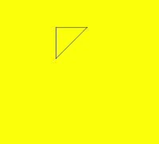
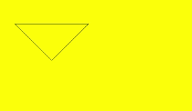
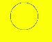
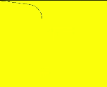
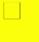

# Path2D

**Path2D** allows you to describe a path through an existing path. This path can be drawn through the **stroke** or **fill** API of **Canvas**.

>  **NOTE**
>
>  The APIs of this module are supported since API version 8. Updates will be marked with a superscript to indicate their earliest API version.

## APIs

Path2D(unit?: LengthMetricsUnit)

Constructs an empty **Path2D** object.

**Widget capability**: This API can be used in ArkTS widgets since API version 9.

**Atomic service API**: This API can be used in atomic services since API version 11.

**System capability**: SystemCapability.ArkUI.ArkUI.Full

**Parameters**

| Name | Type | Mandatory | Default Value | Description |
| ------ | -------- | ---- | ------ | ----- |
| unit<sup>12+</sup>  | [LengthMetricsUnit](../js-apis-arkui-graphics.md#lengthmetricsunit12) | No | DEFAULT | Unit mode of the **Path2D** object. The value cannot be dynamically changed once set. The configuration method is the same as that of [CanvasRenderingContext2D](ts-canvasrenderingcontext2d.md#lengthmetricsunit12).|

Path2D(description: string, unit?: LengthMetricsUnit)

Constructs a **Path2D** object using a path that complies with the SVG path specifications.

**Widget capability**: This API can be used in ArkTS widgets since API version 9.

**Atomic service API**: This API can be used in atomic services since API version 11.

**System capability**: SystemCapability.ArkUI.ArkUI.Full

**Parameters**

| Name | Type | Mandatory | Description |
| ------ | -------- | ---- | ----- |
| description | string | Yes | Path that complies with the SVG path specifications. |
| unit<sup>12+</sup>  | [LengthMetricsUnit](../js-apis-arkui-graphics.md#lengthmetricsunit12) | No | Unit mode of the **Path2D** object. The value cannot be dynamically changed once set. The configuration method is the same as that of [CanvasRenderingContext2D](ts-canvasrenderingcontext2d.md#lengthmetricsunit12).<br>Default value: **DEFAULT**|

## addPath

addPath(path: Path2D, transform?: Matrix2D): void

Adds a path to this path.

**Widget capability**: This API can be used in ArkTS widgets since API version 9.

**Atomic service API**: This API can be used in atomic services since API version 11.

**System capability**: SystemCapability.ArkUI.ArkUI.Full

**Parameters**

| Name       | Type      | Mandatory  | Default Value | Description             |
| --------- | -------- | ---- | ---- | --------------- |
| path      | [Path2D](ts-components-canvas-path2d.md)   | Yes   | -    | Path to be added to this path. Unit: px. |
| transform | [Matrix2D](ts-components-canvas-matrix2d.md) | No   | null | Transformation matrix of the new path.   |


**Example**

  ```ts
  // xxx.ets
  @Entry
  @Component
  struct AddPath {
    private settings: RenderingContextSettings = new RenderingContextSettings(true)
    private context: CanvasRenderingContext2D = new CanvasRenderingContext2D(this.settings)
  
    private path2Da: Path2D = new Path2D("M250 150 L150 350 L350 350 Z")
    private path2Db: Path2D = new Path2D()
  
    build() {
      Flex({ direction: FlexDirection.Column, alignItems: ItemAlign.Center, justifyContent: FlexAlign.Center }) {
        Canvas(this.context)
          .width('100%')
          .height('100%')
          .backgroundColor('#ffff00')
          .onReady(() =>{
            this.path2Db.addPath(this.path2Da)
            this.context.stroke(this.path2Db)
          })
      }
      .width('100%')
      .height('100%')
    }
  }
  ```

  


## closePath

closePath(): void

Moves the current point of the path back to the start point of the path, and draws a straight line between the current point and the start point. If the shape has already been closed or has only one point, this method does nothing.

**Widget capability**: This API can be used in ArkTS widgets since API version 9.

**Atomic service API**: This API can be used in atomic services since API version 11.

**System capability**: SystemCapability.ArkUI.ArkUI.Full

**Example**

  ```ts
  // xxx.ets
  @Entry
  @Component
  struct ClosePath {
    private settings: RenderingContextSettings = new RenderingContextSettings(true)
    private context: CanvasRenderingContext2D = new CanvasRenderingContext2D(this.settings)
    private path2Db: Path2D = new Path2D()
  
    build() {
      Flex({ direction: FlexDirection.Column, alignItems: ItemAlign.Center, justifyContent: FlexAlign.Center }) {
        Canvas(this.context)
          .width('100%')
          .height('100%')
          .backgroundColor('#ffff00')
          .onReady(() =>{
            this.path2Db.moveTo(200, 100)
            this.path2Db.lineTo(300, 100)
            this.path2Db.lineTo(200, 200)
            this.path2Db.closePath()
            this.context.stroke(this.path2Db)
          })
      }
      .width('100%')
      .height('100%')
    }
  }
  ```

  


## moveTo

moveTo(x: number, y: number): void

Moves the current coordinate point of the path to the target point, without drawing a line during the movement.

**Widget capability**: This API can be used in ArkTS widgets since API version 9.

**Atomic service API**: This API can be used in atomic services since API version 11.

**System capability**: SystemCapability.ArkUI.ArkUI.Full

**Parameters**

| Name  | Type    | Mandatory  | Default Value | Description      |
| ---- | ------ | ---- | ---- | -------- |
| x    | number | Yes   | 0    | X coordinate of the target point.<br>Default unit: vp |
| y    | number | Yes   | 0    | Y coordinate of the target point.<br>Default unit: vp |

**Example**

  ```ts
  // xxx.ets
  @Entry
  @Component
  struct MoveTo {
    private settings: RenderingContextSettings = new RenderingContextSettings(true)
    private context: CanvasRenderingContext2D = new CanvasRenderingContext2D(this.settings)
    private path2Db: Path2D = new Path2D()
  
    build() {
      Flex({ direction: FlexDirection.Column, alignItems: ItemAlign.Center, justifyContent: FlexAlign.Center }) {
        Canvas(this.context)
          .width('100%')
          .height('100%')
          .backgroundColor('#ffff00')
          .onReady(() =>{
            this.path2Db.moveTo(50, 100)
            this.path2Db.lineTo(250, 100)
            this.path2Db.lineTo(150, 200)
            this.path2Db.closePath()
            this.context.stroke(this.path2Db)
          })
      }
      .width('100%')
      .height('100%')
    }
  }
  ```

  


## lineTo

lineTo(x: number, y: number): void

Draws a straight line from the current point to the target point.

**Widget capability**: This API can be used in ArkTS widgets since API version 9.

**Atomic service API**: This API can be used in atomic services since API version 11.

**System capability**: SystemCapability.ArkUI.ArkUI.Full

**Parameters**

| Name  | Type    | Mandatory  | Default Value | Description      |
| ---- | ------ | ---- | ---- | -------- |
| x    | number | Yes   | 0    | X coordinate of the target point.<br>Default unit: vp |
| y    | number | Yes   | 0    | Y coordinate of the target point.<br>Default unit: vp |

**Example**

  ```ts
  // xxx.ets
  @Entry
  @Component
  struct LineTo {
    private settings: RenderingContextSettings = new RenderingContextSettings(true)
    private context: CanvasRenderingContext2D = new CanvasRenderingContext2D(this.settings)
    private path2Db: Path2D = new Path2D()
  
    build() {
      Flex({ direction: FlexDirection.Column, alignItems: ItemAlign.Center, justifyContent: FlexAlign.Center }) {
        Canvas(this.context)
          .width('100%')
          .height('100%')
          .backgroundColor('#ffff00')
          .onReady(() =>{
            this.path2Db.moveTo(100, 100)
            this.path2Db.lineTo(100, 200)
            this.path2Db.lineTo(200, 200)
            this.path2Db.lineTo(200, 100)
            this.path2Db.closePath()
            this.context.stroke(this.path2Db)
          })
      }
      .width('100%')
      .height('100%')
    }
  }
  ```

  


## bezierCurveTo

bezierCurveTo(cp1x: number, cp1y: number, cp2x: number, cp2y: number, x: number, y: number): void

Draws a cubic Bezier curve on the canvas.

**Widget capability**: This API can be used in ArkTS widgets since API version 9.

**Atomic service API**: This API can be used in atomic services since API version 11.

**System capability**: SystemCapability.ArkUI.ArkUI.Full

**Parameters**

| Name  | Type    | Mandatory  | Default Value | Description            |
| ---- | ------ | ---- | ---- | -------------- |
| cp1x | number | Yes   | 0    | X coordinate of the first parameter of the bezier curve.<br>Default unit: vp |
| cp1y | number | Yes   | 0    | Y coordinate of the first parameter of the bezier curve.<br>Default unit: vp |
| cp2x | number | Yes   | 0    | X coordinate of the second parameter of the bezier curve.<br>Default unit: vp |
| cp2y | number | Yes   | 0    | Y coordinate of the second parameter of the bezier curve.<br>Default unit: vp |
| x    | number | Yes   | 0    | X coordinate of the end point on the bezier curve.<br>Default unit: vp   |
| y    | number | Yes   | 0    | Y coordinate of the end point on the bezier curve.<br>Default unit: vp   |

**Example**

  ```ts
  // xxx.ets
  @Entry
  @Component
  struct BezierCurveTo {
    private settings: RenderingContextSettings = new RenderingContextSettings(true)
    private context: CanvasRenderingContext2D = new CanvasRenderingContext2D(this.settings)
    private path2Db: Path2D = new Path2D()
  
    build() {
      Flex({ direction: FlexDirection.Column, alignItems: ItemAlign.Center, justifyContent: FlexAlign.Center }) {
        Canvas(this.context)
          .width('100%')
          .height('100%')
          .backgroundColor('#ffff00')
          .onReady(() =>{
            this.path2Db.moveTo(10, 10)
            this.path2Db.bezierCurveTo(20, 100, 200, 100, 200, 20)
            this.context.stroke(this.path2Db)
          })
      }
      .width('100%')
      .height('100%')
    }
  }
  ```

  


## quadraticCurveTo

quadraticCurveTo(cpx: number, cpy: number, x: number, y: number): void

Draws a quadratic curve on the canvas.

**Widget capability**: This API can be used in ArkTS widgets since API version 9.

**Atomic service API**: This API can be used in atomic services since API version 11.

**System capability**: SystemCapability.ArkUI.ArkUI.Full

**Parameters**

| Name  | Type    | Mandatory  | Default Value | Description         |
| ---- | ------ | ---- | ---- | ----------- |
| cpx  | number | Yes   | 0    | X coordinate of the bezier curve parameter.<br>Default unit: vp |
| cpy  | number | Yes   | 0    | Y coordinate of the bezier curve parameter.<br>Default unit: vp |
| x    | number | Yes   | 0    | X coordinate of the end point on the bezier curve.<br>Default unit: vp |
| y    | number | Yes   | 0    | Y coordinate of the end point on the bezier curve.<br>Default unit: vp |

**Example**

  ```ts
  // xxx.ets
  @Entry
  @Component
  struct QuadraticCurveTo {
    private settings: RenderingContextSettings = new RenderingContextSettings(true)
    private context: CanvasRenderingContext2D = new CanvasRenderingContext2D(this.settings)
    private path2Db: Path2D = new Path2D()
  
    build() {
      Flex({ direction: FlexDirection.Column, alignItems: ItemAlign.Center, justifyContent: FlexAlign.Center }) {
        Canvas(this.context)
          .width('100%')
          .height('100%')
          .backgroundColor('#ffff00')
          .onReady(() =>{
            this.path2Db.moveTo(10, 10)
            this.path2Db.quadraticCurveTo(100, 100, 200, 20)
            this.context.stroke(this.path2Db)
        })
      }
      .width('100%')
      .height('100%')
    }
  }
  ```

  


## arc

arc(x: number, y: number, radius: number, startAngle: number, endAngle: number, counterclockwise?: boolean): void

Draws an arc on the canvas.

**Widget capability**: This API can be used in ArkTS widgets since API version 9.

**Atomic service API**: This API can be used in atomic services since API version 11.

**System capability**: SystemCapability.ArkUI.ArkUI.Full

**Parameters**

| Name              | Type     | Mandatory  | Default Value  | Description        |
| ---------------- | ------- | ---- | ----- | ---------- |
| x                | number  | Yes   | 0     | X coordinate of the center point of the arc.<br>Default unit: vp |
| y                | number  | Yes   | 0     | Y coordinate of the center point of the arc.<br>Default unit: vp |
| radius           | number  | Yes   | 0     | Radius of the arc.<br>Default unit: vp   |
| startAngle       | number  | Yes   | 0     | Start radian of the arc.  |
| endAngle         | number  | Yes   | 0     | End radian of the arc.  |
| counterclockwise | boolean | No   | false | Whether to draw the arc counterclockwise. |

**Example**

  ```ts
  // xxx.ets
  @Entry
  @Component
  struct Arc {
    private settings: RenderingContextSettings = new RenderingContextSettings(true)
    private context: CanvasRenderingContext2D = new CanvasRenderingContext2D(this.settings)
    private path2Db: Path2D = new Path2D()
  
    build() {
      Flex({ direction: FlexDirection.Column, alignItems: ItemAlign.Center, justifyContent: FlexAlign.Center }) {
        Canvas(this.context)
          .width('100%')
          .height('100%')
          .backgroundColor('#ffff00')
          .onReady(() =>{
            this.path2Db.arc(100, 75, 50, 0, 6.28)
            this.context.stroke(this.path2Db)
          })
      }
      .width('100%')
      .height('100%')
    }
  }
  ```

  


## arcTo

arcTo(x1: number, y1: number, x2: number, y2: number, radius: number): void

Draws an arc based on the radius and points on the arc.

**Widget capability**: This API can be used in ArkTS widgets since API version 9.

**Atomic service API**: This API can be used in atomic services since API version 11.

**System capability**: SystemCapability.ArkUI.ArkUI.Full

**Parameters**

| Name    | Type    | Mandatory  | Default Value | Description             |
| ------ | ------ | ---- | ---- | --------------- |
| x1     | number | Yes   | 0    | X coordinate of the first point on the arc.<br>Default unit: vp |
| y1     | number | Yes   | 0    | Y coordinate of the first point on the arc.<br>Default unit: vp |
| x2     | number | Yes   | 0    | X coordinate of the second point on the arc.<br>Default unit: vp |
| y2     | number | Yes   | 0    | Y coordinate of the second point on the arc.<br>Default unit: vp |
| radius | number | Yes   | 0    | Radius of the arc.<br>Default unit: vp |

**Example**

  ```ts
  // xxx.ets
  @Entry
  @Component
  struct ArcTo {
    private settings: RenderingContextSettings = new RenderingContextSettings(true)
    private context: CanvasRenderingContext2D = new CanvasRenderingContext2D(this.settings)
    private path2Db: Path2D = new Path2D()
  
    build() {
      Flex({ direction: FlexDirection.Column, alignItems: ItemAlign.Center, justifyContent: FlexAlign.Center }) {
        Canvas(this.context)
          .width('100%')
          .height('100%')
          .backgroundColor('#ffff00')
          .onReady(() =>{
            this.path2Db.arcTo(150, 20, 150, 70, 50)
            this.context.stroke(this.path2Db)
          })
      }
      .width('100%')
      .height('100%')
    }
  }
  ```

  


## ellipse

ellipse(x: number, y: number, radiusX: number, radiusY: number, rotation: number, startAngle: number, endAngle: number, counterclockwise?: boolean): void

Draws an ellipse in the specified rectangular region on the canvas.

**Widget capability**: This API can be used in ArkTS widgets since API version 9.

**Atomic service API**: This API can be used in atomic services since API version 11.

**System capability**: SystemCapability.ArkUI.ArkUI.Full

**Parameters**

| Name              | Type     | Mandatory  | Default Value  | Description                                      |
| ---------------- | ------- | ---- | ----- | ---------------------------------------- |
| x                | number  | Yes   | 0     | X coordinate of the ellipse center.<br>Default unit: vp|
| y                | number  | Yes   | 0     | Y coordinate of the ellipse center.<br>Default unit: vp|
| radiusX          | number  | Yes   | 0     | Radius of the ellipse on the x-axis.<br>Default unit: vp|
| radiusY          | number  | Yes   | 0     | Radius of the ellipse on the y-axis.<br>Default unit: vp|
| rotation         | number  | Yes   | 0     | Rotation angle of the ellipse.<br>Unit: radian                          |
| startAngle       | number  | Yes   | 0     | Angle of the start point for drawing the ellipse, in radians.                       |
| endAngle         | number  | Yes   | 0     | Angle of the end point for drawing the ellipse, in radians.                       |
| counterclockwise | boolean | No   | false | Whether to draw the ellipse counterclockwise.<br>**true**: Draw the ellipse counterclockwise.<br>**false**: Draw the ellipse clockwise. |

**Example**

  ```ts
  // xxx.ets
  @Entry
  @Component
  struct CanvasExample {
    private settings: RenderingContextSettings = new RenderingContextSettings(true)
    private context: CanvasRenderingContext2D = new CanvasRenderingContext2D(this.settings)
    private path2Db: Path2D = new Path2D()

    build() {
      Flex({ direction: FlexDirection.Column, alignItems: ItemAlign.Center, justifyContent: FlexAlign.Center }) {
        Canvas(this.context)
          .width('100%')
          .height('100%')
          .backgroundColor('#ffff00')
          .onReady(() =>{
            this.path2Db.ellipse(200, 200, 50, 100, 0, Math.PI * 1, Math.PI*2)
            this.context.stroke(this.path2Db)
          })
      }
      .width('100%')
      .height('100%')
    }
  }
  ```

  


## rect

rect(x: number, y: number, w: number, h: number): void

Creates a rectangle on the canvas.

**Widget capability**: This API can be used in ArkTS widgets since API version 9.

**Atomic service API**: This API can be used in atomic services since API version 11.

**System capability**: SystemCapability.ArkUI.ArkUI.Full

**Parameters**

| Name  | Type    | Mandatory  | Default Value | Description           |
| ---- | ------ | ---- | ---- | ------------- |
| x    | number | Yes   | 0    | X coordinate of the upper left corner of the rectangle.<br>Default unit: vp |
| y    | number | Yes   | 0    | Y coordinate of the upper left corner of the rectangle.<br>Default unit: vp |
| w    | number | Yes   | 0    | Width of the rectangle.<br>Default unit: vp |
| h    | number | Yes   | 0    | Height of the rectangle.<br>Default unit: vp |

**Example**

  ```ts
  // xxx.ets
  @Entry
  @Component
  struct CanvasExample {
    private settings: RenderingContextSettings = new RenderingContextSettings(true)
    private context: CanvasRenderingContext2D = new CanvasRenderingContext2D(this.settings)
    private path2Db: Path2D = new Path2D()
  
    build() {
      Flex({ direction: FlexDirection.Column, alignItems: ItemAlign.Center, justifyContent: FlexAlign.Center }) {
        Canvas(this.context)
          .width('100%')
          .height('100%')
          .backgroundColor('#ffff00')
          .onReady(() =>{
            this.path2Db.rect(20, 20, 100, 100);
            this.context.stroke(this.path2Db)
          })
      }
      .width('100%')
      .height('100%')
    }
  }
  ```

  
