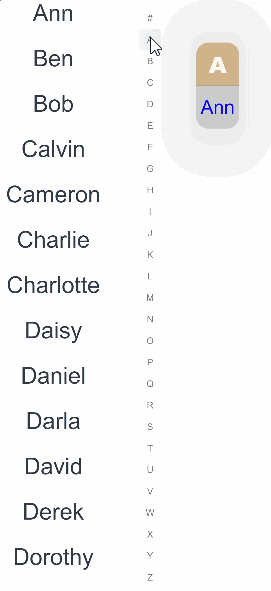
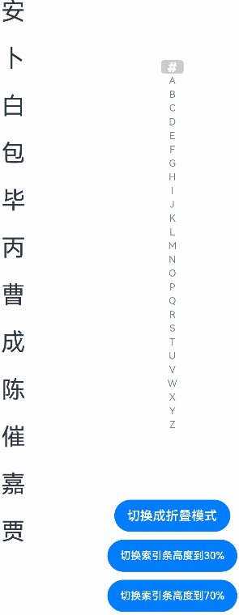

# AlphabetIndexer

The **AlphabetIndexer** component can create a logically indexed array of items in a container for instant location.

>  **NOTE**
>
>  This component is supported since API version 7. Updates will be marked with a superscript to indicate their earliest API version.


## Child Components

Not supported


## APIs

AlphabetIndexer(options: AlphabetIndexerOptions)

**Atomic service API**: This API can be used in atomic services since API version 11.

**System capability**: SystemCapability.ArkUI.ArkUI.Full

**Parameters**

| Name| Type| Mandatory| Description|
| -------- | -------- | -------- | -------- |
| options | [AlphabetIndexerOptions](#alphabetindexeroptions16) | Yes| Options of the **AlphabetIndexer** component.|

## AlphabetIndexerOptions<sup>16+</sup>

Defines the options of the **AlphabetIndexer** component.

| Name| Type| Mandatory| Description|
| -------- | -------- | -------- | -------- |
| arrayValue | Array&lt;string&gt; | Yes| Array of index items.|
| selected   | number              | Yes   | Index of the initially selected item. If the value exceeds the value range, the default value 0 is used.<br>This parameter supports two-way binding through [$$](../../../quick-start/arkts-two-way-sync.md).|

## Attributes

When the [width](ts-universal-attributes-size.md#width) attribute is set to **"auto"**, the width is adaptive. This means that the width will adjust according to the maximum width of the index items.

The default value of the [padding](ts-universal-attributes-size.md#padding) attribute is 4 vp.

The [maxFontScale](ts-basic-components-text.md#maxfontscale12) and [minFontScale](ts-basic-components-text.md#minfontscale12) attributes are both set to a constant value of 1, which means that they do not change with the system font size.

In addition to the [universal attributes](ts-universal-attributes-size.md), the following attributes are supported.

### color

color(value: ResourceColor)

Sets the text color for unselected items.

**Atomic service API**: This API can be used in atomic services since API version 11.

**System capability**: SystemCapability.ArkUI.ArkUI.Full

**Parameters**

| Name| Type                                      | Mandatory| Description                               |
| ------ | ------------------------------------------ | ---- | ----------------------------------- |
| value  | [ResourceColor](ts-types.md#resourcecolor) | Yes  | Text color of unselected items.<br>Default value: **0x99182431**|

### selectedColor

selectedColor(value: ResourceColor)

Sets the text color for the selected item.

**Atomic service API**: This API can be used in atomic services since API version 11.

**System capability**: SystemCapability.ArkUI.ArkUI.Full

**Parameters**

| Name| Type                                      | Mandatory| Description                                     |
| ------ | ------------------------------------------ | ---- | ----------------------------------------- |
| value  | [ResourceColor](ts-types.md#resourcecolor) | Yes  | Text color of the selected item.<br>Default value: **0xFF007DFF**|

### popupColor

popupColor(value: ResourceColor)

Sets the text color for the primary index item in the pop-up window.

**Atomic service API**: This API can be used in atomic services since API version 11.

**System capability**: SystemCapability.ArkUI.ArkUI.Full

**Parameters**

| Name| Type                                      | Mandatory| Description                                       |
| ------ | ------------------------------------------ | ---- | ------------------------------------------- |
| value  | [ResourceColor](ts-types.md#resourcecolor) | Yes  | Text color of the primary index item in the pop-up window.<br>Default value: **0xFF007DFF**|

### selectedBackgroundColor

selectedBackgroundColor(value: ResourceColor)

Sets the background color of the selected item.

**Atomic service API**: This API can be used in atomic services since API version 11.

**System capability**: SystemCapability.ArkUI.ArkUI.Full

**Parameters**

| Name| Type                                      | Mandatory| Description                                     |
| ------ | ------------------------------------------ | ---- | ----------------------------------------- |
| value  | [ResourceColor](ts-types.md#resourcecolor) | Yes  | Background color of the selected item.<br>Default value: **0x1A007DFF**|

### popupBackground

popupBackground(value: ResourceColor)

Sets the background color for the pop-up window.

**Atomic service API**: This API can be used in atomic services since API version 11.

**System capability**: SystemCapability.ArkUI.ArkUI.Full

**Parameters**

| Name| Type                                      | Mandatory| Description                                                        |
| ------ | ------------------------------------------ | ---- | ------------------------------------------------------------ |
| value  | [ResourceColor](ts-types.md#resourcecolor) | Yes  | Background color of the pop-up window.<br>The background blur effect of the pop-up text can affect the background color. You can disable the effect by setting [popupBackgroundBlurStyle](#popupbackgroundblurstyle12) to **NONE**.<br>Default value:<br>API version 11 and earlier: **0xFFFFFFFF**<br>API version 12 and later: **#66808080**|

### usingPopup

usingPopup(value: boolean)

Sets whether to display the pop-up window.

**Atomic service API**: This API can be used in atomic services since API version 11.

**System capability**: SystemCapability.ArkUI.ArkUI.Full

**Parameters**

| Name| Type   | Mandatory| Description                                  |
| ------ | ------- | ---- | -------------------------------------- |
| value  | boolean | Yes  | Whether to display the pop-up window.<br>Default value: **false**|

### selectedFont

selectedFont(value: Font)

Sets the text style for the selected item.

**Atomic service API**: This API can be used in atomic services since API version 11.

**System capability**: SystemCapability.ArkUI.ArkUI.Full

**Parameters**

| Name| Type                    | Mandatory| Description                                                        |
| ------ | ------------------------ | ---- | ------------------------------------------------------------ |
| value  | [Font](ts-types.md#font) | Yes  | Text style of the selected item.<br>Default value:<br>API version 11 and earlier:<br>{<br>size:'12.0fp',<br> style:FontStyle.Normal,<br> weight:FontWeight.Normal,<br> family:'HarmonyOS Sans'<br>}<br>API version 12 and later:<br>{<br>size:'10.0vp',<br> style:FontStyle.Normal,<br> weight:FontWeight.Medium,<br> family:'HarmonyOS Sans'<br>} |

### popupFont

popupFont(value: Font)

Sets the text style for the primary index item in the pop-up window.

**Atomic service API**: This API can be used in atomic services since API version 11.

**System capability**: SystemCapability.ArkUI.ArkUI.Full

**Parameters**

| Name| Type                    | Mandatory| Description                                                        |
| ------ | ------------------------ | ---- | ------------------------------------------------------------ |
| value  | [Font](ts-types.md#font) | Yes  | Text style of the primary index item in the pop-up window.<br>Default value:<br>{<br>size:'24.0vp',<br> style:FontStyle.Normal,<br> weight:FontWeight.Normal,<br> family:'HarmonyOS Sans'<br>} |

### font

font(value: Font)

Sets the text style for unselected items.

**Atomic service API**: This API can be used in atomic services since API version 11.

**System capability**: SystemCapability.ArkUI.ArkUI.Full

**Parameters**

| Name| Type                    | Mandatory| Description                                                        |
| ------ | ------------------------ | ---- | ------------------------------------------------------------ |
| value  | [Font](ts-types.md#font) | Yes  | Text style of unselected items.<br>Default value:<br>API version 11 and earlier:<br>{<br>size:'12.0fp',<br> style:FontStyle.Normal,<br> weight:FontWeight.Normal,<br> family:'HarmonyOS Sans'<br>}<br>API version 12 and later:<br>{<br>size:'10.0vp',<br> style:FontStyle.Normal,<br> weight:FontWeight.Medium,<br> family:'HarmonyOS Sans'<br>} |

### itemSize

itemSize(value: string | number)

Sets the size of the index item area.

**Atomic service API**: This API can be used in atomic services since API version 11.

**System capability**: SystemCapability.ArkUI.ArkUI.Full

**Parameters**

| Name| Type                      | Mandatory| Description                                                        |
| ------ | -------------------------- | ---- | ------------------------------------------------------------ |
| value  | string \| number | Yes  | Size of the index item area, which is a square, meaning the side length of the square. This attribute cannot be set in percentage.<br>Default value: **16.0**<br>Unit: vp|

### alignStyle

alignStyle(value: IndexerAlign, offset?: Length)

Sets the alignment style of the indexer pop-up window.

**Atomic service API**: This API can be used in atomic services since API version 11.

**System capability**: SystemCapability.ArkUI.ArkUI.Full

**Parameters**

| Name              | Type                                 | Mandatory| Description                                                        |
| -------------------- | ------------------------------------- | ---- | ------------------------------------------------------------ |
| value                | [IndexerAlign](#indexeralign) | Yes  | Alignment style of the indexer pop-up window. The pop-up window can be displayed on the right or left of the indexer.<br>Default value: **IndexerAlign.END**|
| offset<sup>10+</sup> | [Length](ts-types.md#length)          | No  | Spacing between the pop-up window and the alphabetic index bar. A value greater than or equal to **0** is valid. If this parameter is set to a value less than **0** or is not set, the spacing is the same as **popupPosition**. If this parameter and **popupPosition** are set at the same time, **offset** takes effect in the horizontal direction and **popupPosition.y** takes effect in the vertical direction.|

### selected<sup>8+</sup>

selected(index: number)

Sets the index of the selected item.

Since API version 10, this attribute supports two-way binding through [$$](../../../quick-start/arkts-two-way-sync.md).

**Atomic service API**: This API can be used in atomic services since API version 11.

**System capability**: SystemCapability.ArkUI.ArkUI.Full

**Parameters**

| Name| Type  | Mandatory| Description                        |
| ------ | ------ | ---- | ---------------------------- |
| index  | number | Yes  | Index of the selected item.<br>Default value: **0**|

### popupPosition<sup>8+</sup>

popupPosition(value: Position)

Sets the position of the pop-up window relative to the center of the indexer's top border.

**Atomic service API**: This API can be used in atomic services since API version 11.

**System capability**: SystemCapability.ArkUI.ArkUI.Full

**Parameters**

| Name| Type                             | Mandatory| Description                                                        |
| ------ | --------------------------------- | ---- | ------------------------------------------------------------ |
| value  | [Position](ts-types.md#position) | Yes  | Position of the pop-up window relative to the center of the indexer's top border.<br>Default value: **{x:60.0, y:48.0}**|

### popupSelectedColor<sup>10+</sup>

popupSelectedColor(value: ResourceColor)

Sets the text color for the selected secondary index item in the pop-up window.

**Atomic service API**: This API can be used in atomic services since API version 11.

**System capability**: SystemCapability.ArkUI.ArkUI.Full

**Parameters**

| Name| Type                                      | Mandatory| Description                                                 |
| ------ | ------------------------------------------ | ---- | ----------------------------------------------------- |
| value  | [ResourceColor](ts-types.md#resourcecolor) | Yes  | Text color of the selected secondary index item in the pop-up window.<br>Default value: **#FF182431**|

### popupUnselectedColor<sup>10+</sup>

popupUnselectedColor(value: ResourceColor)

Sets the text color for the unselected secondary index items in the pop-up window.

**Atomic service API**: This API can be used in atomic services since API version 11.

**System capability**: SystemCapability.ArkUI.ArkUI.Full

**Parameters**

| Name| Type                                      | Mandatory| Description                                                   |
| ------ | ------------------------------------------ | ---- | ------------------------------------------------------- |
| value  | [ResourceColor](ts-types.md#resourcecolor) | Yes  | Text color of the unselected secondary index items in the pop-up window.<br>Default value: **#FF182431**|

### popupItemFont<sup>10+</sup>

popupItemFont(value: Font)

Sets the text style for the secondary index item in the pop-up window.

**Atomic service API**: This API can be used in atomic services since API version 11.

**System capability**: SystemCapability.ArkUI.ArkUI.Full

**Parameters**

| Name| Type                    | Mandatory| Description                                                        |
| ------ | ------------------------ | ---- | ------------------------------------------------------------ |
| value  | [Font](ts-types.md#font) | Yes  | Text style of the secondary index item in the pop-up window.<br>Default value:<br>{<br>size:24,<br>weight:FontWeight.Medium<br>} |

### popupItemBackgroundColor<sup>10+</sup>

popupItemBackgroundColor(value: ResourceColor)

Sets the background color for the secondary index item in the pop-up window.

**Atomic service API**: This API can be used in atomic services since API version 11.

**System capability**: SystemCapability.ArkUI.ArkUI.Full

**Parameters**

| Name| Type                    | Mandatory| Description                                           |
| ------ | ------------------------ | ---- | ----------------------------------------------- |
| value  | [ResourceColor](ts-types.md#resourcecolor) | Yes  | Background color of the secondary index item in the pop-up window.<br>Default value:<br>API version 11 and earlier: **#FFFFFFFF**<br>API version 12 and later: **#00000000**|

### autoCollapse<sup>11+</sup>   

autoCollapse(value: boolean)

Sets whether to auto-collapse or expand the indexer bar.

When the first index item is **#**:

- If the number of remaining index items after excluding the first item is less than or equal to 9, the full display mode is used.
- If the number of remaining index items is between 9 and 13 (inclusive), the mode will adaptively switch between full display and short collapse modes based on the indexer height.
- If the number of remaining index items is greater than 13, the mode will adaptively switch between short and long collapse modes based on the indexer height.

When the first index item is not **#**:

- If the total number of index items is less than or equal to 9, the full display mode is used.
- If the number of remaining index items is between 9 and 13 (inclusive), the mode will adaptively switch between full display and short collapse modes based on the indexer height.
- If the total number of index items is greater than 13, the mode will adaptively switch between short and long collapse modes based on the indexer height.

**Atomic service API**: This API can be used in atomic services since API version 12.

**System capability**: SystemCapability.ArkUI.ArkUI.Full

**Parameters**

| Name| Type   | Mandatory| Description                                      |
| ------ | ------- | ---- | ------------------------------------------ |
| value  | boolean | Yes  | Whether to auto-collapse or expand the indexer bar.<br>Default value:<br>In versions earlier than API version 12: **false**<br>API version 12 and later: **true**|

### popupItemBorderRadius<sup>12+</sup>   

popupItemBorderRadius(value: number)

Sets the radius of the index border corners in the pop-up window.

**Atomic service API**: This API can be used in atomic services since API version 12.

**System capability**: SystemCapability.ArkUI.ArkUI.Full

**Parameters**

| Name| Type  | Mandatory| Description                                                        |
| ------ | ------ | ---- | ------------------------------------------------------------ |
| value  | number | Yes  | Radius of the index background border corners in the pop-up window.<br>Default value: **24vp**<br>This parameter cannot be set in percentage. If the value specified is less than **0**, **0** is used.<br>The radius of the index background border corners in the pop-up window is automatically adaptive (radius of the index rounded corners + 4 vp).|

### itemBorderRadius<sup>12+</sup>   

itemBorderRadius(value: number)

Sets the radius of the index background border corners in the alphabetic index bar.

**Atomic service API**: This API can be used in atomic services since API version 12.

**System capability**: SystemCapability.ArkUI.ArkUI.Full

**Parameters**

| Name| Type  | Mandatory| Description                                                        |
| ------ | ------ | ---- | ------------------------------------------------------------ |
| value  | number | Yes  | Radius of the index background border corners in the alphabetic index bar.<br>Default value: **8vp**<br>This parameter cannot be set in percentage. If the value specified is less than **0**, **0** is used.<br>The radius of the index background border corners in the alphabetic index bar is automatically adaptive (radius of the index rounded corners + 4 vp).|

### popupBackgroundBlurStyle<sup>12+</sup>   

popupBackgroundBlurStyle(value: BlurStyle)

Sets the background blur style of the pop-up window.

**Atomic service API**: This API can be used in atomic services since API version 12.

**System capability**: SystemCapability.ArkUI.ArkUI.Full

**Parameters**

| Name| Type                                        | Mandatory| Description                                                        |
| ------ | -------------------------------------------- | ---- | ------------------------------------------------------------ |
| value  | [BlurStyle](ts-universal-attributes-background.md#blurstyle9) | Yes  | Background blur style of the pop-up window.<br>The background blur effect can affect [popupBackground](#popupbackground). You can disable the effect by setting it to **NONE**.<br>Default value: **COMPONENT_REGULAR**|

### popupTitleBackground<sup>12+</sup>   

popupTitleBackground(value: ResourceColor)

Sets the background color for the primary index item in the pop-up window.

**Atomic service API**: This API can be used in atomic services since API version 12.

**System capability**: SystemCapability.ArkUI.ArkUI.Full

**Parameters**

| Name| Type                                      | Mandatory| Description                                                        |
| ------ | ------------------------------------------ | ---- | ------------------------------------------------------------ |
| value  | [ResourceColor](ts-types.md#resourcecolor) | Yes  | Background color for the primary index item in the pop-up window.<br>Default value:<br>If the pop-up window has only one index: **#00FFFFFF**.<br>If the pop-up window has multiple indexes: **#0c182431**.|

### enableHapticFeedback<sup>12+</sup>

enableHapticFeedback(value: boolean)

**Atomic service API**: This API can be used in atomic services since API version 12.

**System capability**: SystemCapability.ArkUI.ArkUI.Full

| Name        | Type                                                 | Mandatory| Description                        |
|-------------|-----------------------------------------------------|----|----------------------------|
| value | boolean | Yes | Whether haptic feedback is enabled.<br>Default value: **true**<br>|

## IndexerAlign

**System capability**: SystemCapability.ArkUI.ArkUI.Full

| Name| Description|
| -------- | -------- |
| Left | The pop-up window is displayed on the right of the indexer.<br>**Atomic service API**: This API can be used in atomic services since API version 11.|
| Right | The pop-up window is displayed on the left of the indexer.<br>**Atomic service API**: This API can be used in atomic services since API version 11.|
| START<sup>12+</sup> | The pop-up window is displayed on the right of the indexer for left-to-right scripts, and on the left of the indexer for right-to-left scripts.<br>**Atomic service API**: This API can be used in atomic services since API version 12.|
| END<sup>12+</sup> | The pop-up window is displayed on the left of the indexer for left-to-right scripts, and on the right of the indexer for right-to-left scripts.<br>**Atomic service API**: This API can be used in atomic services since API version 12.|

## Events

In addition to the [universal events](ts-universal-events-click.md), the following events are supported.

### onSelected<sup>(deprecated)</sup>

onSelected(callback: (index: number) =&gt; void)

Triggered when an index item is selected, with the callback parameter being the index of the currently selected item.

This API is deprecated since API version 8. You are advised to use [onSelect](#onselect8) instead.

**System capability**: SystemCapability.ArkUI.ArkUI.Full

**Parameters**

| Name| Type  | Mandatory| Description            |
| ------ | ------ | ---- | ---------------- |
| index  | number | Yes  | Index of the selected item.|

### onSelect<sup>8+</sup>

onSelect(callback: OnAlphabetIndexerSelectCallback)

Triggered when an index item is selected, with the callback parameter being the index of the currently selected item.

**Atomic service API**: This API can be used in atomic services since API version 11.

**System capability**: SystemCapability.ArkUI.ArkUI.Full

**Parameters**

| Name| Type  | Mandatory| Description            |
| ------ | ------ | ---- | ---------------- |
| callback  | [OnAlphabetIndexerSelectCallback](#onalphabetindexerselectcallback16) | Yes  | Event triggered when an index item is selected.|

### onRequestPopupData<sup>8+</sup>

onRequestPopupData(callback: OnAlphabetIndexerRequestPopupDataCallback)

Triggered to set the content of the secondary index items in the pop-up window. The callback parameter is the index of the currently selected item, and the return value is the content to be displayed in the pop-up window.

**Atomic service API**: This API can be used in atomic services since API version 11.

**System capability**: SystemCapability.ArkUI.ArkUI.Full

**Parameters**

| Name| Type  | Mandatory| Description                                                        |
| ------ | ------ | ---- | ------------------------------------------------------------ |
| callback  | [OnAlphabetIndexerRequestPopupDataCallback](#onalphabetindexerrequestpopupdatacallback16) | Yes  | Event triggered to set the content of the secondary index items in the pop-up window.|

### onPopupSelect<sup>8+</sup>

onPopupSelect(callback: OnAlphabetIndexerPopupSelectCallback)

Triggered when a secondary index item in the pop-up window is selected. The callback parameter is the index of the selected secondary index item.

**Atomic service API**: This API can be used in atomic services since API version 11.

**System capability**: SystemCapability.ArkUI.ArkUI.Full

**Parameters**

| Name| Type  | Mandatory| Description            |
| ------ | ------ | ---- | ---------------- |
| callback  | [OnAlphabetIndexerPopupSelectCallback](#onalphabetindexerpopupselectcallback16) | Yes  | Event triggered when a secondary index item in the pop-up window is selected.|

## OnAlphabetIndexerSelectCallback<sup>16+</sup>
type OnAlphabetIndexerSelectCallback = (index: number) => void

Represents the callback invoked when an index item is selected.

**Atomic service API**: This API can be used in atomic services since API version 16.

**System capability**: SystemCapability.ArkUI.ArkUI.Full

**Parameters**
| Name | Type  | Mandatory| Description   |
| ------- | ----- | ---- | ------ |
| index    | number  | Yes  | Index of the currently selected index item.|

## OnAlphabetIndexerPopupSelectCallback<sup>16+</sup>
type OnAlphabetIndexerPopupSelectCallback = (index: number) => void

Represents the callback invoked when a secondary index item in the pop-up window is selected.

**Atomic service API**: This API can be used in atomic services since API version 16.

**System capability**: SystemCapability.ArkUI.ArkUI.Full

**Parameters**
| Name | Type  | Mandatory| Description   |
| ------- | ----- | ---- | ------ |
| index   | number  | Yes  | Index of the currently selected secondary index item in the pop-up window.|

## OnAlphabetIndexerRequestPopupDataCallback<sup>16+</sup>
type OnAlphabetIndexerRequestPopupDataCallback = (index: number) => Array\<string\>

Represents the callback invoked when an index item is selected and [usingPopup](#usingpopup) is set to **true**.

**Atomic service API**: This API can be used in atomic services since API version 16.

**System capability**: SystemCapability.ArkUI.ArkUI.Full

**Parameters**
| Name | Type  | Mandatory| Description   |
| ------- | ----- | ---- | ------ |
| index   | number  | Yes  | Index of the currently selected index item.|

**Return value**
| Type         | Description                |
| ------------- | -------------------- |
| Array\<string\> | Array of secondary index items to be displayed in the pop-up window. Up to 5 items can be displayed vertically, with scrollable support for more items.|

## Example
 
### Example 1: Setting the Display Text for the Index Pop-up Window

This example demonstrates how to customize the display text for the index pop-up window using the [onRequestPopupData](#onrequestpopupdata8) event.

```ts
// xxx.ets
@Entry
@Component
struct AlphabetIndexerSample {
  private arrayA: string[] = ['Ann']
  private arrayB: string[] = ['Ben', 'Bob']
  private arrayC: string[] = ['Calvin', 'Cameron', 'Charlie', 'Charlotte']
  private arrayL: string[] = ['Daisy', 'Daniel', 'Darla', 'David', 'Derek', 'Dorothy', 'Duke']
  private value: string[] = ['#', 'A', 'B', 'C', 'D', 'E', 'F', 'G',
    'H', 'I', 'J', 'K', 'L', 'M', 'N',
    'O', 'P', 'Q', 'R', 'S', 'T', 'U',
    'V', 'W', 'X', 'Y', 'Z']

  build() {
    Stack({ alignContent: Alignment.Start }) {
      Row() {
        List({ space: 20, initialIndex: 0 }) {
          ForEach(this.arrayA, (item: string) => {
            ListItem() {
              Text(item)
                .width('80%')
                .height('5%')
                .fontSize(30)
                .textAlign(TextAlign.Center)
            }
          }, (item: string) => item)

          ForEach(this.arrayB, (item: string) => {
            ListItem() {
              Text(item)
                .width('80%')
                .height('5%')
                .fontSize(30)
                .textAlign(TextAlign.Center)
            }
          }, (item: string) => item)

          ForEach(this.arrayC, (item: string) => {
            ListItem() {
              Text(item)
                .width('80%')
                .height('5%')
                .fontSize(30)
                .textAlign(TextAlign.Center)
            }
          }, (item: string) => item)

          ForEach(this.arrayL, (item: string) => {
            ListItem() {
              Text(item)
                .width('80%')
                .height('5%')
                .fontSize(30)
                .textAlign(TextAlign.Center)
            }
          }, (item: string) => item)
        }
        .width('50%')
        .height('100%')

        AlphabetIndexer({ arrayValue: this.value, selected: 0 })
          .autoCollapse (false) // Disable the auto-collapse mode.
          .enableHapticFeedback(false) // Disable haptic feedback.
          .selectedColor(0xFFFFFF) // Font color of the selected text.
          .popupColor(0xFFFAF0) // Text color of the primary index item in the pop-up window.
          .selectedBackgroundColor(0xCCCCCC) // Background color of the selected item.
          .popupBackground (0xD2B48C) // Background color of the pop-up window.
          .usingPopup(true) // Display a pop-up window when an index item is selected.
          .selectedFont({ size: 16, weight: FontWeight.Bolder }) // Text style of the selected item.
          .popupFont({ size: 30, weight: FontWeight.Bolder }) // Text style of the primary index item in the pop-up window.
          .itemSize(28) // Size of each index item.
          .alignStyle (IndexerAlign.Left) // The pop-up window is displayed on the right of the indexer.
          .popupItemBorderRadius(24) // Set the radius of the index background rounded corners in the pop-up window.
          .itemBorderRadius(14) // Set the radius of the index background rounded corners in the alphabetic indexer bar.
          .popupBackgroundBlurStyle(BlurStyle.NONE) // Set the background blur style of the pop-up window.
          .popupTitleBackground(0xCCCCCC) // Background color of the primary index item in the pop-up window.
          .popupSelectedColor(0x00FF00) // Text color of the unselected secondary index items in the pop-up window.
          .popupUnselectedColor(0x0000FF) // Text color of the selected secondary index item in the pop-up window.
          .popupItemFont({ size: 30, style: FontStyle.Normal }) // Text style of the secondary index item in the pop-up window.
          .popupItemBackgroundColor(0xCCCCCC) // Background color of the secondary index item in the pop-up window.
          .onSelect((index: number) => {
            console.info(this.value[index] + ' Selected!')
          })
          .onRequestPopupData((index: number) => {
            // When A is selected, the secondary index item list in the pop-up window displays arrayA. Similarly, selecting B, C, or L will display their respective arrays.
            // For other index items, the pop-up window will only show the primary index item.
            if (this.value[index] == 'A') {
              return this.arrayA
            } else if (this.value[index] == 'B') {
              return this.arrayB
            } else if (this.value[index] == 'C') {
              return this.arrayC
            } else if (this.value[index] == 'L') {
              return this.arrayL
            } else {
              return []
            }
          })
          .onPopupSelect((index: number) => {
            console.info('onPopupSelected:' + index)
          })
      }
      .width('100%')
      .height('100%')
    }
  }
}
```



### Example 2: Enabling Adaptive Collapse Mode

This example demonstrates how to enable adaptive collapse mode using the [autoCollapse](#autocollapse11) attribute.

```ts
// xxx.ets
@Entry
@Component
struct AlphabetIndexerSample {
  private arrayA:string[] = ['Ann']
  private arrayB: string[] = ['Ben', 'Bob']
  private arrayC: string[] = ['Calvin', 'Cameron', 'Charlie', 'Charlotte']
  private arrayJ: string[] = ['Jack', 'James']
  private value: string[] = ['#', 'A', 'B', 'C', 'D', 'E', 'F', 'G',
    'H', 'I', 'J', 'K', 'L', 'M', 'N',
    'O', 'P', 'Q', 'R', 'S', 'T', 'U',
    'V', 'W', 'X', 'Y', 'Z']
  @State isNeedAutoCollapse: boolean = false;
  @State indexerHeight: string = '75%';

  build() {
    Stack({ alignContent: Alignment.Start }) {
      Row() {
        List({ space: 20, initialIndex: 0 }) {
          ForEach(this.arrayA, (item: string) => {
            ListItem() {
              Text(item)
                .width('80%')
                .height('5%')
                .fontSize(30)
                .textAlign(TextAlign.Center)
            }
          }, (item: string) => item)

          ForEach(this.arrayB, (item: string) => {
            ListItem() {
              Text(item)
                .width('80%')
                .height('5%')
                .fontSize(30)
                .textAlign(TextAlign.Center)
            }
          }, (item: string) => item)

          ForEach(this.arrayC, (item: string) => {
            ListItem() {
              Text(item)
                .width('80%')
                .height('5%')
                .fontSize(30)
                .textAlign(TextAlign.Center)
            }
          }, (item: string) => item)

          ForEach(this.arrayJ, (item: string) => {
            ListItem() {
              Text(item)
                .width('80%')
                .height('5%')
                .fontSize(30)
                .textAlign(TextAlign.Center)
            }
          }, (item: string) => item)
        }
        .width('50%')
        .height('100%')

        Column() {
          Column() {
            AlphabetIndexer({ arrayValue: this.value, selected: 0 })
              .autoCollapse (this.isNeedAutoCollapse) // Enable or disable adaptive collapse mode.
              .height (this.indexerHeight) // Indexer height.
              .enableHapticFeedback(false) // Disable haptic feedback.
              .selectedColor(0xFFFFFF) // Font color of the selected text.
              .popupColor(0xFFFAF0) // Text color of the primary index item in the pop-up window.
              .selectedBackgroundColor(0xCCCCCC) // Background color of the selected item.
              .popupBackground (0xD2B48C) // Background color of the pop-up window.
              .usingPopup(true) // Display a pop-up window when an index item is selected.
              .selectedFont({ size: 16, weight: FontWeight.Bolder }) // Text style of the selected item.
              .popupFont({ size: 30, weight: FontWeight.Bolder }) // Text style of the pop-up window.
              .itemSize(28) // Size of an item in the alphabetic index bar.
              .alignStyle(IndexerAlign.Right) // The pop-up window is displayed on the left of the indexer.
              .popupTitleBackground("#D2B48C") // Background color of the primary index item in the pop-up window.
              .popupSelectedColor(0x00FF00) // Text color of the unselected secondary index items in the pop-up window.
              .popupUnselectedColor(0x0000FF) // Text color of the selected secondary index item in the pop-up window.
              .popupItemFont({ size: 30, style: FontStyle.Normal }) // Text style of the secondary index item in the pop-up window.
              .popupItemBackgroundColor(0xCCCCCC) // Background color of the secondary index item in the pop-up window.
              .onSelect((index: number) => {
                console.info(this.value[index] + ' Selected!');
              })
              .onRequestPopupData((index: number) => {
                // When A is selected, the secondary index item list in the pop-up window displays arrayA. Similarly, selecting B, C, or L will display their respective arrays.
                // For other index items, the pop-up window will only show the primary index item.
                if (this.value[index] == 'A') {
                  return this.arrayA;
                } else if (this.value[index] == 'B') {
                  return this.arrayB;
                } else if (this.value[index] == 'C') {
                  return this.arrayC;
                } else if (this.value[index] == 'J') {
                  return this.arrayJ;
                } else {
                  return [];
                }
              })
              .onPopupSelect((index: number) => {
                console.info('onPopupSelected:' + index);
              })
          }
          .height('80%')
          .justifyContent(FlexAlign.Center)

          Column() {
            Button('Collapse')
              .margin('5vp')
              .onClick(() => {
                this.isNeedAutoCollapse = true;
              })
            Button('30% of Index Bar Height')
              .margin('5vp')
              .onClick(() => {
                this.indexerHeight = '30%';
              })
            Button('70% of Index Bar Height')
              .margin('5vp')
              .onClick(() => {
                this.indexerHeight = '70%';
              })
          }.height('20%')
        }
        .width('50%')
        .justifyContent(FlexAlign.Center)
      }
      .width('100%')
      .height(720)
    }
  }
}
```



### Example 3: Setting the Background Blur Style of the Pop-up Window

This example demonstrates how to apply a background blur effect to the pop-up window using the [popupBackgroundBlurStyle](#popupbackgroundblurstyle12) attribute.

```ts
// xxx.ets
@Entry
@Component
struct AlphabetIndexerSample {
  private arrayA:string[] = ['Ann']
  private arrayB: string[] = ['Ben', 'Bob']
  private arrayC: string[] = ['Calvin', 'Cameron', 'Charlie', 'Charlotte']
  private arrayL: string[] = ['Daisy', 'Daniel', 'Darla', 'David', 'Derek', 'Dorothy', 'Duke']
  private value: string[] = ['#', 'A', 'B', 'C', 'D', 'E', 'F', 'G',
    'H', 'I', 'J', 'K', 'L', 'M', 'N',
    'O', 'P', 'Q', 'R', 'S', 'T', 'U',
    'V', 'W', 'X', 'Y', 'Z']
  @State customBlurStyle: BlurStyle = BlurStyle.NONE;

  build() {
    Stack({ alignContent: Alignment.Start }) {
      Row() {
        List({ space: 20, initialIndex: 0 }) {
          ForEach(this.arrayA, (item: string) => {
            ListItem() {
              Text(item)
                .width('80%')
                .height('5%')
                .fontSize(30)
                .textAlign(TextAlign.Center)
            }
          }, (item: string) => item)

          ForEach(this.arrayB, (item: string) => {
            ListItem() {
              Text(item)
                .width('80%')
                .height('5%')
                .fontSize(30)
                .textAlign(TextAlign.Center)
            }
          }, (item: string) => item)

          ForEach(this.arrayC, (item: string) => {
            ListItem() {
              Text(item)
                .width('80%')
                .height('5%')
                .fontSize(30)
                .textAlign(TextAlign.Center)
            }
          }, (item: string) => item)

          ForEach(this.arrayL, (item: string) => {
            ListItem() {
              Text(item)
                .width('80%')
                .height('5%')
                .fontSize(30)
                .textAlign(TextAlign.Center)
            }
          }, (item: string) => item)
        }
        .width('30%')
        .height('100%')

        Column() {
          Column() {
            Text('Switch Blue Style:')
              .fontSize(24)
              .fontColor(0xcccccc)
              .width('100%')
            Button('COMPONENT_REGULAR')
              .margin('5vp')
              .width(200)
              .onClick(() => {
                this.customBlurStyle = BlurStyle.COMPONENT_REGULAR;
              })
            Button('BACKGROUND_THIN')
              .margin('5vp')
              .width(200)
              .onClick(() => {
                this.customBlurStyle = BlurStyle.BACKGROUND_THIN;
              })
          }.height('20%')

          Column() {
            AlphabetIndexer({ arrayValue: this.value, selected: 0 })
              .usingPopup(true) // Display a pop-up window when an index item is selected.
              .alignStyle (IndexerAlign.Left) // The pop-up window is displayed on the right of the indexer.
              .popupItemBorderRadius(24) // Set the radius of the index background rounded corners in the pop-up window.
              .itemBorderRadius(14) // Set the radius of the index background rounded corners in the alphabetic indexer bar.
              .popupBackgroundBlurStyle(this.customBlurStyle) // Set the background blur style of the pop-up window.
              .popupTitleBackground(0xCCCCCC) // Background color of the primary index item in the pop-up window.
              .onSelect((index: number) => {
                console.info(this.value[index] + ' Selected!')
              })
              .onRequestPopupData((index: number) => {
                // When A is selected, the secondary index item list in the pop-up window displays arrayA. Similarly, selecting B, C, or L will display their respective arrays.
                // For other index items, the pop-up window will only show the primary index item.
                if (this.value[index] == 'A') {
                  return this.arrayA
                } else if (this.value[index] == 'B') {
                  return this.arrayB
                } else if (this.value[index] == 'C') {
                  return this.arrayC
                } else if (this.value[index] == 'L') {
                  return this.arrayL
                } else {
                  return []
                }
              })
              .onPopupSelect((index: number) => {
                console.info('onPopupSelected:' + index)
              })
          }
          .height('80%')
        }
        .width('70%')
      }
      .width('100%')
      .height('100%')
      .backgroundImage($r("app.media.image"))
    }
  }
}
```


