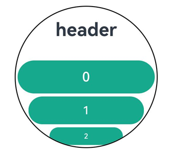

# ArcList

The **ArcList** component is a circular layout container that displays a series of list items in an arc shape. It is suitable for presenting homogeneous data, such as images and text, in a continuous, multi-row format.

> **NOTE**
>
> This component is supported since API version 16. Updates will be marked with a superscript to indicate their earliest API version.


## Modules to Import

```ts
import { ArcList, ArcListAttribute } from '@kit.ArkUI';
```

## Child Components

Only the [ArcListItem](ts-container-arclistitem.md) component is supported.

> **NOTE**
>
> Below are the rules for calculating the indexes of the child components of **ArcList**:
>
> - The index increases in ascending order of child components. 
>
> - In the [if/else](../../../quick-start/arkts-rendering-control-ifelse.md) statement, only the child components for which the condition evaluates to true participate in the index calculation. 
>
> - In the [ForEach](../../../quick-start/arkts-rendering-control-foreach.md) or [LazyForEach](../../../quick-start/arkts-rendering-control-lazyforeach.md) statement, the indexes of all expanded subnodes are calculated. 
>
> - If the values of [if/else](../../../quick-start/arkts-rendering-control-ifelse.md), [ForEach](../../../quick-start/arkts-rendering-control-foreach.md), and [LazyForEach](../../../quick-start/arkts-rendering-control-lazyforeach.md) change, the indexes of subnodes are updated. 
>
> - Child components of **ArcList** whose [visibility](ts-universal-attributes-visibility.md#visibility) attribute is set to **Hidden** or **None** are still included in the index calculation. 
>
> - Child components of **ArcList** whose [visibility](ts-universal-attributes-visibility.md#visibility) attribute is set to **None** are not displayed, but the spacing above and below them still takes effect. 


## APIs

ArcList(options?: ArkListOptions)

Creates an instance of the **ArcList** component with optional configuration parameters.

**Atomic service API**: This API can be used in atomic services since API version 16.

**System capability**: SystemCapability.ArkUI.ArkUI.Circle

**Parameters**

| Name | Type                                 | Mandatory| Description               |
| ------- | ----------------------------------------- | ---- | ----------------------- |
| options | [ArkListOptions](#arklistoptions) | No  | Parameters for configuring the **ArcList**.|

## Attributes

In addition to the [universal attributes](ts-universal-attributes-size.md), the following attributes are supported.

### digitalCrownSensitivity

digitalCrownSensitivity(sensitivity: Optional\<CrownSensitivity>)

Sets the sensitivity of the digital crown's response to events.

**Atomic service API**: This API can be used in atomic services since API version 16.

**System capability**: SystemCapability.ArkUI.ArkUI.Circle

**Parameters**

| Name     | Type                                                        | Mandatory| Description                                                        |
| ----------- | ------------------------------------------------------------ | ---- | ------------------------------------------------------------ |
| sensitivity | [Optional&lt;CrownSensitivity&gt;](ts-appendix-enums.md#crownsensitivity16) | Yes  | Sensitivity of the digital crown's response.<br>Default value: **CrownSensitivity.MEDIUM**, indicating moderate response speed|

### space

space(space: Optional\<LengthMetrics>)

Sets the spacing between list items.

**Atomic service API**: This API can be used in atomic services since API version 16.

**System capability**: SystemCapability.ArkUI.ArkUI.Circle

**Parameters**

| Name| Type                                                        | Mandatory| Description                              |
| ------ | ------------------------------------------------------------ | ---- | ---------------------------------- |
| space  | [Optional&lt;LengthMetrics&gt;](../js-apis-arkui-graphics.md#lengthmetrics12) | No  | Spacing between list items.<br>Default value: **0**|

### scrollBar

scrollBar(status: Optional\<BarState>)

Sets the state of the scrollbar.

**Atomic service API**: This API can be used in atomic services since API version 16.

**System capability**: SystemCapability.ArkUI.ArkUI.Circle

**Parameters**

| Name| Type                                                | Mandatory| Description                                    |
| ------ | ---------------------------------------------------- | ---- | ---------------------------------------- |
| status | [Optional\<BarState>](ts-appendix-enums.md#barstate) | No  | State of the scrollbar.<br>Default value: **BarState.Auto**|

### cachedCount

cachedCount(count: Optional\<number>)

Sets the number of list items to preload (cache) in the [LazyForEach](../../../quick-start/arkts-rendering-control-lazyforeach.md) component.

This attribute specifies the number of items to cache before and after the visible items in the **ArcList** component.

**Atomic service API**: This API can be used in atomic services since API version 16.

**System capability**: SystemCapability.ArkUI.ArkUI.Circle

**Parameters**

| Name| Type             | Mandatory| Description                                      |
| ------ | ----------------- | ---- | ------------------------------------------ |
| value  | Optional\<number> | Yes  | Number of list items to preload.<br>Default value: **1**|

### chainAnimation

chainAnimation(enable: Optional\<boolean>)

Sets whether to enable chained animations, which provide a visually connected, or "chained," effect when the **ArcList** component is scrolled or its top or bottom edge is dragged.

The list items are separated with even space, and one item animation starts after the previous animation during basic sliding interactions. The chained animation effect is similar with spring physics.

For chained animations to work properly, the edge scrolling effect of the **ArcList** component must be set to [EdgeEffect.Spring](ts-appendix-enums.md#edgeeffect).

**Atomic service API**: This API can be used in atomic services since API version 16.

**System capability**: SystemCapability.ArkUI.ArkUI.Circle

**Parameters**

| Name| Type              | Mandatory| Description                                                        |
| ------ | ------------------ | ---- | ------------------------------------------------------------ |
| enable | Optional\<boolean> | Yes  | Whether to enable chained animations.<br>**false** (default): Chained animations are disabled. **true**: Chained animations are enabled.|

### enableScrollInteraction

enableScrollInteraction(enable: Optional\<boolean>)

Sets whether to support scroll gestures. When this attribute is set to **false**, scrolling by finger or mouse is not supported, but the [Scroller](ts-container-scroll.md#scroller) controller API is not affected.

**Atomic service API**: This API can be used in atomic services since API version 16.

**System capability**: SystemCapability.ArkUI.ArkUI.Circle

**Parameters**

| Name| Type              | Mandatory| Description                               |
| ------ | ------------------ | ---- | ----------------------------------- |
| enable | Optional\<boolean> | Yes  | Whether to support scroll gestures.<br>Default value: **true**|

### friction

friction(friction: Optional\<number>)

Sets the friction coefficient. It applies only to gestures in the scrolling area, and it affects only indirectly the scroll chaining during the inertial scrolling process. If this attribute is set to a value less than or equal to 0, the default value is used.

**Atomic service API**: This API can be used in atomic services since API version 16.

**System capability**: SystemCapability.ArkUI.ArkUI.Circle

**Parameters**

| Name  | Type             | Mandatory| Description                        |
| -------- | ----------------- | ---- | ---------------------------- |
| friction | Optional\<number> | No  | Friction coefficient.<br>Default value: **0.8**|

### scrollBarWidth

scrollBarWidth(width: Optional\<LengthMetrics>)

Sets the width of the scrollbar. Once the width is set, the scrollbar will use this width in its pressed state.

**Atomic service API**: This API can be used in atomic services since API version 16.

**System capability**: SystemCapability.ArkUI.ArkUI.Circle

**Parameters**

| Name| Type                                                        | Mandatory| Description                                                       |
| ------ | ------------------------------------------------------------ | ---- | ----------------------------------------------------------- |
| width  | [Optional&lt;LengthMetrics&gt;](../js-apis-arkui-graphics.md#lengthmetrics12) | Yes  | Width of the scrollbar.<br>Default value: **24**<br>Minimum value: 4<br>Unit: vp|

### scrollBarColor

scrollBarColor(color: Optional\<ColorMetrics>)

Sets the color of the scrollbar.

**Atomic service API**: This API can be used in atomic services since API version 16.

**System capability**: SystemCapability.ArkUI.ArkUI.Circle

**Parameters**

| Name| Type                                                        | Mandatory| Description                                    |
| ------ | ------------------------------------------------------------ | ---- | ---------------------------------------- |
| color  | [Optional\<ColorMetrics>](../js-apis-arkui-graphics.md#colormetrics12) | Yes  | Color of the scrollbar.<br>Default value: **0xA9FFFFFF**|

### flingSpeedLimit

flingSpeedLimit(speed: Optional\<number>)

Sets the maximum initial speed for inertial scrolling after a fling gesture. The unit is vp/s.

**Atomic service API**: This API can be used in atomic services since API version 16.

**System capability**: SystemCapability.ArkUI.ArkUI.Circle

**Parameters**

| Name| Type             | Mandatory| Description                           |
| ------ | ----------------- | ---- | ------------------------------- |
| speed  | Optional\<number> | Yes  | Maximum initial speed for inertial scrolling.|

### childrenMainSize

childrenMainSize(size: Optional\<ChildrenMainSize>)

Sets the size information of the child components of the **ArcList** component along the main axis.

**Atomic service API**: This API can be used in atomic services since API version 16.

**System capability**: SystemCapability.ArkUI.ArkUI.Circle

**Parameters**

| Name| Type                                                        | Mandatory| Description                                                        |
| ------ | ------------------------------------------------------------ | ---- | ------------------------------------------------------------ |
| size   | [Optional\<ChildrenMainSize>](ts-container-scrollable-common.md#childrenmainsize12) | Yes  | Precise size information for all child components along the main axis. This ensures accurate scrolling positions in scenarios where child components have varying sizes, are added or removed, or when APIs like [scrollToIndex](ts-container-scroll.md#scrolltoindex) are used. It guarantees that [scrollTo](ts-container-scroll.md#scrollto) can accurately navigate to the specified position, [currentOffset](ts-container-scroll.md#currentoffset) accurately reflects the current scrolling position, and the built-in scrollbar moves smoothly without any jumps abrupt changes.<br> **NOTE**<br>The provided sizes must match the actual sizes of the child components. Any changes to the sizes, or any additions or removals of child components, must be notified to the **ArcList** component through the **ChildrenMainSize** object.|

## Events

### onScrollIndex

onScrollIndex(handler: Optional\<ArcScrollIndexHandler>)

Triggered when a child component enters or leaves the visible area of the **ArcList** component. This event is triggered during initialization of the **ArcList** component and when the index of the first or last child component in the visible area changes, or when the center child component changes.

If the edge scrolling effect of the **ArcList** component is set to spring, this event is not triggered during continued scrolling at the edge or during the bounce-back process

**Atomic service API**: This API can be used in atomic services since API version 16.

**System capability**: SystemCapability.ArkUI.ArkUI.Circle

**Parameters**

| Name | Type                                                        | Mandatory| Description                                           |
| ------- | ------------------------------------------------------------ | ---- | ----------------------------------------------- |
| handler | [Optional\<ArcScrollIndexHandler>](#arcscrollindexhandler) | Yes  | Callback triggered when a child component enters or leaves the visible area of the **ArcList** component.|

### onReachStart

onReachStart(handler: Optional\<VoidCallback>)

Triggered when the list reaches the start position.

This event is triggered during initialization of the **ArcList** component if [initialIndex](#arklistoptions) is set to **0**, and whenever the list scrolls to the start position. If the edge scrolling effect is set to spring, this event is triggered when scrolling past the start position and again when bouncing back to it.

**Atomic service API**: This API can be used in atomic services since API version 16.

**System capability**: SystemCapability.ArkUI.ArkUI.Circle

| Name | Type                                            | Mandatory| Description                    |
| ------- | ------------------------------------------------ | ---- | ------------------------ |
| handler | [Optional\<VoidCallback>](#voidcallback) | Yes  | Callback triggered when the list reaches the start position.|

### onReachEnd

onReachEnd(handler: Optional\<VoidCallback>)

Triggered when the list reaches the end position.

If the edge scrolling effect is set to spring, this event is triggered when scrolling past the end position and again when bouncing back to it.

**Atomic service API**: This API can be used in atomic services since API version 16.

**System capability**: SystemCapability.ArkUI.ArkUI.Circle

| Name | Type                                            | Mandatory| Description                    |
| ------- | ------------------------------------------------ | ---- | ------------------------ |
| handler | [Optional\<VoidCallback>](#voidcallback) | Yes  | Callback triggered when the list reaches the end position.|

### onScrollStart

onScrollStart(handler: Optional\<VoidCallback>)

Triggered when the list starts scrolling initiated by the user's finger dragging the list or its scrollbar. This event is also triggered when the animation contained in the scrolling triggered by [Scroller](ts-container-scroll.md#scroller) starts.

**Atomic service API**: This API can be used in atomic services since API version 16.

**System capability**: SystemCapability.ArkUI.ArkUI.Circle

| Name | Type                                            | Mandatory| Description                |
| ------- | ------------------------------------------------ | ---- | -------------------- |
| handler | [Optional\<VoidCallback>](#voidcallback) | Yes  | Callback triggered when the list starts scrolling.|

### onScrollStop

onScrollStop(handler: Optional\<VoidCallback>)

Triggered when the list stops scrolling after the user's finger leaves the screen. This event is also triggered when the animation contained in the scrolling triggered by [Scroller](ts-container-scroll.md#scroller) stops.

**Atomic service API**: This API can be used in atomic services since API version 16.

**System capability**: SystemCapability.ArkUI.ArkUI.Circle

| Name | Type                                            | Mandatory| Description                |
| ------- | ------------------------------------------------ | ---- | -------------------- |
| handler | [Optional\<VoidCallback>](#voidcallback) | Yes  | Callback triggered when the list stops scrolling.|

### onWillScroll

onWillScroll(handler: Optional\<OnWillScrollCallback>)

Triggered when the list is about to scroll. The return value is the offset amount by which the list will scroll and the current scroll state. The returned offset is obtained by calculation, not the actual offset.

**Atomic service API**: This API can be used in atomic services since API version 16.

**System capability**: SystemCapability.ArkUI.ArkUI.Circle

**Parameters**

| Name| Type| Mandatory| Description|
| ------ | ------ | ------ | ------|
| handler | [Optional\<OnWillScrollCallback>](#onwillscrollcallback) | Yes| Callback triggered when the list is about to scroll.|

> **NOTE**
> 
> When **ScrollEdge** or **ScrollToIndex** that does not involve animation is called, **onWillScroll** is not triggered.

### onDidScroll
onDidScroll(handler: Optional\<OnScrollCallback>)

Triggered when the list scrolls. The return value is the offset amount by which the list has scrolled and the current scroll state.

**Atomic service API**: This API can be used in atomic services since API version 16.

**System capability**: SystemCapability.ArkUI.ArkUI.Circle

**Parameters**

| Name| Type| Mandatory| Description|
| ------ | ------ | ------ | ------|
| handler | [Optional\<OnScrollCallback>](ts-container-scrollable-common.md#onscrollcallback12) | Yes| Callback triggered when the list scrolls.|

## ArkListOptions

Provides basic parameters for creating an **ArcList** component.

**Atomic service API**: This API can be used in atomic services since API version 16.

**System capability**: SystemCapability.ArkUI.ArkUI.Circle

| Name      | Type                                   | Mandatory| Description                                                    |
| ------------ | ------------------------------------------- | ---- | ------------------------------------------------------------ |
| initialIndex | number                                      | No  | Item displayed at the beginning of the viewport when the **ArcList** component is loaded for the first time, that is, the first item to be displayed.<br>Default value: **0**<br>**NOTE**<br>If the set value is a negative number or is greater than the index of the last item, the value is invalid. In this case, the default value will be used.|
| scroller     | [Scroller](ts-container-scroll.md#scroller) | No  | Scroller, which can be bound to scrollable components for scrolling control.<br>**NOTE**<br>The same scroller cannot be bound to multiple scrollable components.|
| header       | [ComponentContent](../js-apis-arkui-ComponentContent.md)                            | No  | Header component.                                              |

## VoidCallback

The **VoidCallback** object has no parameters and returns no value.

## ArcScrollIndexHandler

Represents the callback triggered when a child component enters or leaves the visible area of the **ArcList** component.

**Atomic service API**: This API can be used in atomic services since API version 16.

**System capability**: SystemCapability.ArkUI.ArkUI.Circle

| Name| Type  | Mandatory| Description                                     |
| ------ | ------ | ---- | ----------------------------------------- |
| start  | number | Yes  | Index of the first child component in the visible area of the **ArcList** component.  |
| end    | number | Yes  | Index of the last child component in the visible area of the **ArcList** component.|
| center | number | Yes  | Index of the center child component in the visible area of the **ArcList** component.|

## OnWillScrollCallback

Represents the callback invoked when the list is about to scroll.

**Atomic service API**: This API can be used in atomic services since API version 16.

**System capability**: SystemCapability.ArkUI.ArkUI.Circle

| Name      | Type                                                   | Mandatory| Description                                                        |
| ------------ | ------------------------------------------------------- | ---- | ------------------------------------------------------------ |
| scrollOffset | number                                                  | Yes  | Scroll offset of each frame. Positive values indicate upward scrolling, while negative values indicate downward scrolling.<br>Unit: vp|
| scrollState  | [ScrollState](ts-container-list.md#scrollstate) | Yes  | Current scroll state.                                              |
| scrollSource | ScrollSource                                            | Yes  | Source of the current scrolling operation.                                              |

## Example

This example demonstrates an **ArcList** component with a header component and auto-scaling child items.

```ts
// xxx.ets
import { ComponentContent, LengthMetrics } from "@kit.ArkUI";
import { UIContext } from '@kit.ArkUI';
import { ArcList, ArcListItem, ArcListAttribute, ArcListItemAttribute } from '@kit.ArkUI';

@Builder
function buildText() {
  Column() {
    Text("header")
      .fontSize('60px')
      .fontWeight(FontWeight.Bold)
  }.margin(0)
}

@Entry
@Component
struct Index {
  @State  private numItems: number[] = [0, 1, 2, 3, 4, 5, 6, 7, 8, 9];

  private watchSize: string = '466px' // Default watch size: 466*466
  private listSize: string = '414px' // Item width

  context: UIContext = this.getUIContext()
  tabBar1: ComponentContent<Object> = new ComponentContent(this.context, wrapBuilder(buildText));

  @Builder
  buildList2() {
    Stack() {
      Column() {
      }
      .justifyContent(FlexAlign.Center)
      .width(this.watchSize)
      .height(this.watchSize)
      .clip(new Circle({ width: '100%', height: '100%' }))
      .backgroundColor(Color.White)

      ArcList({ initialIndex: 0, header: this.tabBar1 }) {
        ForEach(this.numItems, (item: number, index: number) => {
          ArcListItem() {
            Button('' + item, { type: ButtonType.Capsule })
              .width(this.listSize)
              .height('100px')
              .fontSize('40px')
              .focusable(true)
              .focusOnTouch(true)
              .backgroundColor(0x17A98D)
          }.align(Alignment.Center)
        }, (item: string, index: number) => item + index)
      }
      .space(LengthMetrics.px(10))
      .borderRadius(this.watchSize)
      .focusable(true)
      .focusOnTouch(true)
      .defaultFocus(true)
    }
    .align(Alignment.Center)
    .width(this.watchSize)
    .height(this.watchSize)
    .border({color: Color.Black, width: 1})
    .borderRadius(this.watchSize)
  }

  build() {
    Column() {
      this.buildList2()
    }
    .width('100%')
    .height('100%')
    .alignItems(HorizontalAlign.Center)
    .justifyContent(FlexAlign.Center)
  }
}
```


