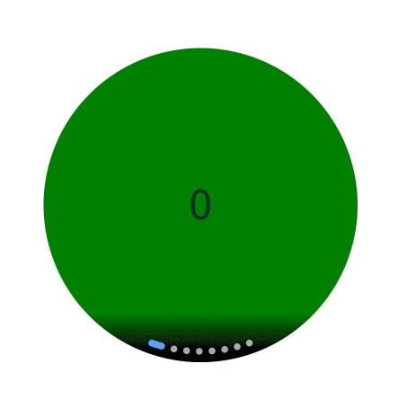

# ArcSwiper

The **ArcSwiper** component is designed for circular screens to display child components in a carousel-like manner.

> **NOTE**
>
> This component is supported since API version 18. Updates will be marked with a superscript to indicate their earliest API version.

## Modules to Import

```ts
import {
  ArcSwiper,
  ArcSwiperAttribute,
  ArcDotIndicator,
  ArcDirection,
  ArcSwiperController
} from '@kit.ArkUI';
```

## Child Components

This component can contain child components.

>  **NOTE**
>
>  - Built-in components and custom components are allowed, with support for ([if/else](../../../quick-start/arkts-rendering-control-ifelse.md), [ForEach](../../../quick-start/arkts-rendering-control-foreach.md), and [LazyForEach](../../../quick-start/arkts-rendering-control-lazyforeach.md)) rendering control.
>- Do not add or delete child components during a page turning animation. Doing so may result in child components not yet animated entering the viewport in advance and causing display exceptions.

## APIs

ArcSwiper(controller?: ArcSwiperController)

Creates an **ArcSwiper** component.

**Atomic service API**: This API can be used in atomic services since API version 18.

**System capability**: SystemCapability.ArkUI.ArkUI.Circle

**Parameters**

| Name    | Type                                       | Mandatory| Description                                    |
| ---------- | ------------------------------------------- | ---- | ---------------------------------------- |
| controller | [ArcSwiperController](#arcswipercontroller) | No  | Controller bound to the component to control the page turning.|


## Attributes

In addition to the [universal attributes](ts-component-general-attributes.md), the following attributes are supported. [Menu control](ts-universal-attributes-menu.md) is not supported.

### index

index(index: Optional\<number>)

Sets the index of the child component currently displayed in the container. If the value is less than 0 or greater than or equal to the number of child components, the default value **0** is used.

**Atomic service API**: This API can be used in atomic services since API version 18.

**System capability**: SystemCapability.ArkUI.ArkUI.Circle

**Parameters**

| Name| Type  | Mandatory| Description                                            |
| ------ | ------ | ---- | ------------------------------------------------ |
| index  | Optional\<number> | Yes  | Index of the child component currently displayed in the container.<br>Default value: **0**|

### indicator

indicator(style: Optional\<ArcDotIndicator | boolean>)

Sets the style of the arc-shaped dot-style navigation indicator.

**Atomic service API**: This API can be used in atomic services since API version 18.

**System capability**: SystemCapability.ArkUI.ArkUI.Circle

**Parameters**

| Name| Type                                                        | Mandatory| Description                                                        |
| ------ | ------------------------------------------------------------ | ---- | ------------------------------------------------------------ |
| style  | Optional\<[ArcDotIndicator](#arcdotindicator)  \| boolean> | Yes  | Style of the arc-shaped dot-style navigation indicator.<br> \- **ArcDotIndicator**: properties and functionality of the arc-shaped dot-style navigation indicator.<br> \- **boolean**: whether to enable the arc-shaped dot-style navigation indicator. The value **true** means to enable the arc-shaped dot-style navigation indicator, and **false** means the opposite.<br> Default value: **true**<br> Default type: **ArcDotIndicator**|

### duration

duration(duration: Optional\<number>)

Sets the duration of the animation for child component switching.

**Atomic service API**: This API can be used in atomic services since API version 18.

**System capability**: SystemCapability.ArkUI.ArkUI.Circle

**Parameters**

| Name| Type  | Mandatory| Description                                                 |
| ------ | ------ | ---- | ----------------------------------------------------- |
| duration  | Optional\<number> | Yes  | Duration of the autoplay for child component switching.<br>Default value: **400**<br>Unit: ms|

### vertical

vertical(isVertical: Optional\<boolean>)

Sets whether vertical swiping is used.

**Atomic service API**: This API can be used in atomic services since API version 18.

**System capability**: SystemCapability.ArkUI.ArkUI.Circle

**Parameters**

| Name| Type   | Mandatory| Description                              |
| ------ | ------- | ---- | ---------------------------------- |
| isVertical  | Optional\<boolean> | Yes  | Whether vertical swiping is used. The value **true** means vertical swiping, and **false** means horizontal swiping.<br>Default value: **false**|

### disableSwipe

disableSwipe(disabled: Optional\<boolean>)

Sets whether to disable the swipe feature.

**Atomic service API**: This API can be used in atomic services since API version 18.

**System capability**: SystemCapability.ArkUI.ArkUI.Circle

**Parameters**

| Name| Type   | Mandatory| Description                                    |
| ------ | ------- | ---- | ---------------------------------------- |
| disabled  | Optional\<boolean> | Yes  | Whether to disable the swipe feature. The value **true** means to disable the feature, and **false** means the opposite.<br>Default value: **false**|

### digitalCrownSensitivity

digitalCrownSensitivity(sensitivity: Optional\<CrownSensitivity>)

Sets the sensitivity to the digital crown rotation.

**Atomic service API**: This API can be used in atomic services since API version 18.

**System capability**: SystemCapability.ArkUI.ArkUI.Circle

**Parameters**

| Name| Type                                                       | Mandatory| Description                                               |
| ------ | ----------------------------------------------------------- | ---- | --------------------------------------------------- |
| sensitivity  | Optional\<[CrownSensitivity](ts-appendix-enums.md#crownsensitivity18)> | Yes  | Sensitivity to the digital crown rotation.<br>Default value: **CrownSensitivity.LOW**|

### effectMode

effectMode(edgeEffect: Optional\<EdgeEffect>)

Sets the effect used when the scroll boundary is reached. For details about the supported effects, see [EdgeEffect](ts-appendix-enums.md#edgeeffect). The edge effect does not take effect when set using the controller API.

**Atomic service API**: This API can be used in atomic services since API version 18.

**System capability**: SystemCapability.ArkUI.ArkUI.Circle

**Parameters**

| Name| Type                                         | Mandatory| Description                                        |
| ------ | --------------------------------------------- | ---- | -------------------------------------------- |
| edgeEffect  | Optional\<[EdgeEffect](ts-appendix-enums.md#edgeeffect)> | Yes  | Effect used when the component is at one of the edges.<br>Default value: **EdgeEffect.Spring**|

### disableTransitionAnimation

disableTransitionAnimation(disabled: Optional\<boolean>)

Sets whether to disable the transition animation.

**Atomic service API**: This API can be used in atomic services since API version 18.

**System capability**: SystemCapability.ArkUI.ArkUI.Circle

**Parameters**

| Name  | Type              | Mandatory| Description                                   |
| -------- | ------------------ | ---- | --------------------------------------- |
| disabled | Optional\<boolean> | Yes  | Whether to disable the transition animation.<br>Default value: **false**, which means not to disable the transition animation.|

## ArcSwiperController

Implements the controller of the **ArcSwiper** component. You can bind this object to the **ArcSwiper** component and use it to control page switching.

**Atomic service API**: This API can be used in atomic services since API version 18.

**System capability**: SystemCapability.ArkUI.ArkUI.Circle

### constructor

constructor()

A constructor used to create an **ArcSwiperController** instance.

**Atomic service API**: This API can be used in atomic services since API version 18.

**System capability**: SystemCapability.ArkUI.ArkUI.Circle

### showNext

showNext()

Turns to the next page. Page turning occurs with the animation, whose duration is specified by [duration](#duration).

**Atomic service API**: This API can be used in atomic services since API version 18.

**System capability**: SystemCapability.ArkUI.ArkUI.Circle

### showPrevious

showPrevious()

Turns to the previous page. Page turning occurs with the animation, whose duration is specified by [duration](#duration).

**Atomic service API**: This API can be used in atomic services since API version 18.

**System capability**: SystemCapability.ArkUI.ArkUI.Circle

### finishAnimation

finishAnimation(handler?: FinishAnimationHandler)

Stops an animation.

**Atomic service API**: This API can be used in atomic services since API version 18.

**System capability**: SystemCapability.ArkUI.ArkUI.Circle

**Parameters**

| Name | Type                                             | Mandatory| Description                                            |
| ------- | ------------------------------------------------- | ---- | ------------------------------------------------ |
| handler | [FinishAnimationHandler](#finishanimationhandler) | No  | Callback invoked when the animation stops.<br>If no value is provided, no callback is performed.|

## ArcDotIndicator

Provides the properties and functionality of the arc-shaped dot-style navigation indicator.

**Atomic service API**: This API can be used in atomic services since API version 18.

**System capability**: SystemCapability.ArkUI.ArkUI.Circle

### constructor

constructor()

A constructor used to create an **ArcDotIndicator** instance.

**Atomic service API**: This API can be used in atomic services since API version 18.

**System capability**: SystemCapability.ArkUI.ArkUI.Circle

### arcDirection

arcDirection(direction: Optional\<ArcDirection>): ArcDotIndicator

Sets the direction of the arc navigation indicator.

**Atomic service API**: This API can be used in atomic services since API version 18.

**System capability**: SystemCapability.ArkUI.ArkUI.Circle

**Parameters**

| Name   | Type                                    | Mandatory| Description                                                        |
| --------- | ---------------------------------------- | ---- | ------------------------------------------------------------ |
| direction | [Optional\<ArcDirection>](#arcdirection) | Yes  | Direction of the arc navigation indicator.<br>Default value: **ArcDirection.SIX_CLOCK_DIRECTION** (6 o'clock direction)|

**Return value**

| Type                               | Description                          |
| ----------------------------------- | ------------------------------ |
| [ArcDotIndicator](#arcdotindicator) | Properties and functionality of the arc navigation indicator.|

### itemColor

itemColor(color: Optional\<ResourceColor>): ArcDotIndicator

Sets the color of the unselected navigation points in the arc navigation indicator.

**Atomic service API**: This API can be used in atomic services since API version 18.

**System capability**: SystemCapability.ArkUI.ArkUI.Circle

**Parameters**

| Name| Type                                                 | Mandatory| Description                                                        |
| ------ | ----------------------------------------------------- | ---- | ------------------------------------------------------------ |
| color  | [Optional\<ResourceColor>](ts-types.md#resourcecolor) | Yes  | Color of the unselected navigation points in the arc navigation indicator.<br>Default value: **'#A9FFFFFF'**|

**Return value**

| Type                               | Description                          |
| ----------------------------------- | ------------------------------ |
| [ArcDotIndicator](#arcdotindicator) | Properties and functionality of the arc navigation indicator.|

### selectedItemColor

selectedItemColor(color: Optional\<ResourceColor>): ArcDotIndicator

Sets the color of the selected navigation point in the arc navigation indicator.

**Atomic service API**: This API can be used in atomic services since API version 18.

**System capability**: SystemCapability.ArkUI.ArkUI.Circle

**Parameters**

| Name| Type                                                 | Mandatory| Description                                                        |
| ------ | ----------------------------------------------------- | ---- | ------------------------------------------------------------ |
| color  | [Optional\<ResourceColor>](ts-types.md#resourcecolor) | Yes  | Color of the selected navigation point in the arc navigation indicator.<br>Default value: **#FF5EA1FF**|

**Return value**

| Type                               | Description                          |
| ----------------------------------- | ------------------------------ |
| [ArcDotIndicator](#arcdotindicator) | Properties and functionality of the arc navigation indicator.|

### backgroundColor

backgroundColor(color: Optional\<ResourceColor>): ArcDotIndicator

Sets the color of the arc navigation indicator when it is long-pressed.

**Atomic service API**: This API can be used in atomic services since API version 18.

**System capability**: SystemCapability.ArkUI.ArkUI.Circle

**Parameters**

| Name| Type                                                 | Mandatory| Description                                                        |
| ------ | ----------------------------------------------------- | ---- | ------------------------------------------------------------ |
| color  | [Optional\<ResourceColor>](ts-types.md#resourcecolor) | Yes  | Color of the arc navigation indicator when it is long-pressed.<br>Default value: **'#FF404040'**|

**Return value**

| Type                               | Description                          |
| ----------------------------------- | ------------------------------ |
| [ArcDotIndicator](#arcdotindicator) | Properties and functionality of the arc navigation indicator.|

### maskColor

maskColor(color: Optional\<LinearGradient>): ArcDotIndicator

Sets the mask gradient color of the arc navigation indicator.

**Atomic service API**: This API can be used in atomic services since API version 18.

**System capability**: SystemCapability.ArkUI.ArkUI.Circle

**Parameters**

| Name| Type                                                        | Mandatory| Description                                                        |
| ------ | ------------------------------------------------------------ | ---- | ------------------------------------------------------------ |
| color  | [Optional\<LinearGradient>](ts-basic-components-datapanel.md#lineargradient10) | Yes  | Mask gradient color of the arc indicator.<br>Default start color: **'#00000000'**<br>Default end color: **'#FF000000'**|

**Return value**

| Type                               | Description                          |
| ----------------------------------- | ------------------------------ |
| [ArcDotIndicator](#arcdotindicator) | Properties and functionality of the arc navigation indicator.|

### ArcDirection

Enumerates the direction of the arc navigation indicator.

**Atomic service API**: This API can be used in atomic services since API version 18.

**System capability**: SystemCapability.ArkUI.ArkUI.Circle

| Name                 | Value  | Description       |
| --------------------- | ---- | ----------- |
| THREE_CLOCK_DIRECTION | 0    | 3 o'clock direction.|
| SIX_CLOCK_DIRECTION   | 1    | 6 o'clock direction.|
| NINE_CLOCK_DIRECTION  | 2    | 9 o'clock direction.|

## FinishAnimationHandler

type FinishAnimationHandler = () => void

Defines the callback to notify the application when the animation stops playing.

**Atomic service API**: This API can be used in atomic services since API version 18.

**System capability**: SystemCapability.ArkUI.ArkUI.Circle

## IndexChangedHandler

type IndexChangedHandler = (index: number) => void

Defines the callback to notify the application when the index of the currently displayed element changes.

**Atomic service API**: This API can be used in atomic services since API version 18.

**System capability**: SystemCapability.ArkUI.ArkUI.Circle

**Parameters**

| Name| Type  | Mandatory| Description                                  |
| ------ | ------ | ---- | -------------------------------------- |
| index  | number | Yes  | Index of the currently displayed element. The index is zero-based.|

## AnimationStartHandler

type AnimationStartHandler = (index: number, targetIndex: number, event: SwiperAnimationEvent) => void

Defines the callback triggered when the switching animation starts.

**Atomic service API**: This API can be used in atomic services since API version 18.

**System capability**: SystemCapability.ArkUI.ArkUI.Circle

**Parameters**

| Name     | Type                                                        | Mandatory| Description                                                        |
| ----------- | ------------------------------------------------------------ | ---- | ------------------------------------------------------------ |
| index       | number                                                       | Yes  | Index of the currently displayed element before the animation starts (not the final index after the animation ends).|
| targetIndex | number                                                       | Yes  | Index of the target element to switch to.                                    |
| event       | [SwiperAnimationEvent](ts-container-swiper.md#swiperanimationevent10) | Yes  | Extra information of the animation, including the offset of the currently displayed element and target element relative to the start position of the **ArcSwiper** along the main axis, and the hands-off velocity.|

## AnimationEndHandler

type AnimationEndHandler = (index: number, event: SwiperAnimationEvent) => void

Defines the callback triggered when the switching animation ends.

**Atomic service API**: This API can be used in atomic services since API version 18.

**System capability**: SystemCapability.ArkUI.ArkUI.Circle

**Parameters**

| Name| Type                                                        | Mandatory| Description                                                        |
| ------ | ------------------------------------------------------------ | ---- | ------------------------------------------------------------ |
| index  | number                                                       | Yes  | Index of the currently displayed element.                                        |
| event  | [SwiperAnimationEvent](ts-container-swiper.md#swiperanimationevent10) | Yes  | Extra information of the animation, which is the offset of the currently displayed element relative to the start position of the **ArcSwiper** along the main axis.|

## GestureSwipeHandler

type GestureSwipeHandler = (index: number, event: SwiperAnimationEvent) => void

Callback triggered on a frame-by-frame basis when the page is turned by a swipe.

**Atomic service API**: This API can be used in atomic services since API version 18.

**System capability**: SystemCapability.ArkUI.ArkUI.Circle

**Parameters**

| Name| Type                                                        | Mandatory| Description                                                        |
| ------ | ------------------------------------------------------------ | ---- | ------------------------------------------------------------ |
| index  | number                                                       | Yes  | Index of the currently displayed element.                                        |
| event  | [SwiperAnimationEvent](ts-container-swiper.md#swiperanimationevent10) | Yes  | Extra information of the animation, which is the offset of the currently displayed element relative to the start position of the **ArcSwiper** along the main axis.|

## Events

In addition to the [universal events](ts-component-general-events.md), the following events are supported.

### onChange

onChange(handler: Optional\<IndexChangedHandler>)

Triggered when the index of the currently displayed child component changes. The return value is the index of the currently displayed child component.

When the **ArcSwiper** component is used together with **LazyForEach**, the subpage UI update cannot be triggered in the **onChange** event.

**Atomic service API**: This API can be used in atomic services since API version 18.

**System capability**: SystemCapability.ArkUI.ArkUI.Circle

**Parameters**

| Name | Type                                                  | Mandatory| Description                    |
| ------- | ------------------------------------------------------ | ---- | ------------------------ |
| handler | [Optional\<IndexChangedHandler>](#indexchangedhandler) | Yes  | Callback for the index of the currently displayed element.|

### onAnimationStart

onAnimationStart(handler: Optional\<AnimationStartHandler>)

Triggered when the switching animation starts.

**Atomic service API**: This API can be used in atomic services since API version 18.

**System capability**: SystemCapability.ArkUI.ArkUI.Circle

**Parameters**

| Name | Type                                                      | Mandatory| Description                  |
| ------- | ---------------------------------------------------------- | ---- | ---------------------- |
| handler | [Optional\<AnimationStartHandler>](#animationstarthandler) | Yes  | Triggered when the switching animation starts.|

### onAnimationEnd

onAnimationEnd(handler: Optional\<AnimationEndHandler>)

Triggered when the switching animation ends.

This event is triggered when the switching animation of the **ArcSwiper** component ends, whether it is caused by gesture interruption or by calling **finishAnimation** through SwiperController. The **index** parameter indicates the index after the animation ends. When the **ArcSwiper** component contains multiple columns, the index is of the leftmost element.

**Atomic service API**: This API can be used in atomic services since API version 18.

**System capability**: SystemCapability.ArkUI.ArkUI.Circle

**Parameters**

| Name | Type                                                  | Mandatory| Description                      |
| ------- | ------------------------------------------------------ | ---- | -------------------------- |
| handler | [Optional\<AnimationEndHandler>](#animationendhandler) | Yes  | Triggered when the switching animation ends.|

### onGestureSwipe

onGestureSwipe(handler: Optional\<GestureSwipeHandler>)

Triggered on a frame-by-frame basis when the page is turned by a swipe.

**Atomic service API**: This API can be used in atomic services since API version 18.

**System capability**: SystemCapability.ArkUI.ArkUI.Circle

**Parameters**

| Name | Type                                                  | Mandatory| Description                                  |
| ------- | ------------------------------------------------------ | ---- | -------------------------------------- |
| handler | [Optional\<GestureSwipeHandler>](#gestureswipehandler) | Yes  | Triggered on a frame-by-frame basis when the page is turned by a swipe.|

### customContentTransition

customContentTransition(transition: Optional\<SwiperContentAnimatedTransition>)

Defines a custom switching animation. You can define custom animation attributes, such as **opacity**, **scale**, and **translate**, in the callback invoked on a frame-by-frame basis during the swiping-initiated page switching animation.

During the swiping-initiated page switching animation, the [SwiperContentTransitionProxy](#swipercontenttransitionproxy) callback is invoked for all pages in the viewport on a frame-by-frame basis. For example, when there are two pages whose subscripts are 0 and 1 in the viewport, two callbacks whose indexes are 0 and 1 are invoked in each frame.

**Atomic service API**: This API can be used in atomic services since API version 18.

**System capability**: SystemCapability.ArkUI.ArkUI.Circle

**Parameters**

| Name    | Type                                                        | Mandatory| Description                             |
| ---------- | ------------------------------------------------------------ | ---- | --------------------------------- |
| transition | Optional\<[SwiperContentAnimatedTransition](#swipercontentanimatedtransition)> | Yes  | Information about the custom switching animation.|

## SwiperContentAnimatedTransition

Provides the information about the custom switching animation.

**Atomic service API**: This API can be used in atomic services since API version 18.

**System capability**: SystemCapability.ArkUI.ArkUI.Circle

| Name| Type| Read Only| Optional| Description|
| ------ | ---- | ---- | ---- | ---- |
| timeout | number | No| Yes| Timeout for the custom switching animation. The timeout timer starts when the default animation (page scrolling) reaches the point where the first frame is moved out of the viewport. If you do not call the **finishTransition** API of [SwiperContentTransitionProxy](#swipercontenttransitionproxy) before the timer expires, the component considers that the custom animation of the page ends and immediately removes the page node from the render tree. The unit is ms. The default value is **0**.|
| transition | Callback\<[SwiperContentTransitionProxy](#swipercontenttransitionproxy)> | No| No| Content of the custom switching animation.|

## SwiperContentTransitionProxy

Implements the proxy object returned during the execution of the custom switching animation of the **ArcSwiper** component. You can use this object to obtain the page information in the custom animation viewport. You can also call the **finishTransition** API of this object to notify the **ArcSwiper** component that the custom animation has finished playing.

**Atomic service API**: This API can be used in atomic services since API version 18.

**System capability**: SystemCapability.ArkUI.ArkUI.Circle

### **Properties**

| Name| Type| Read Only| Optional| Description|
| ------ | ---- | ---- | ---- | ---- |
| selectedIndex | number | No| No| Index of the currently selected page.|
| index | number | No| No| Index of a page in the viewport.|
| position | number | No| No| Position of the page specified by **index** relative to the start position of the **ArcSwiper** main axis (start position of the page corresponding to **selectedIndex**).|
| mainAxisLength | number | No| No| Length of the page specified by **index** along the main axis.|

>**NOTE**
>
>For example, when the currently selected child component's index is **0**, in the animation process of switching from page 0 to page 1, a callback will be triggered for all pages within the viewport on each frame.
>When there are two pages, page 0 and page 1, in the viewport, two callbacks will be triggered per frame. The first callback will have **selectedIndex** as **0**, **index** as **0**, **position** representing the movement ratio of page 0 relative to its position before the animation started at the current frame,
>and **mainAxisLength** representing the length of page 0 along the main axis. The second callback will still have **selectedIndex** as **0**, **index** as **1**, **position** representing the movement ratio of page 1 relative to page 0 before the animation started at the current frame,
>and **mainAxisLength** representing the length of page 1 along the main axis.
>
>If the animation curve is a spring interpolation curve, during the transition animation from page 0 to page 1, due to the position and velocity when the user lifts their finger off the screen, animation may overshoot and slide past to page 2, then bounce back to page 1. Throughout this process, a callback is triggered for pages 1 and 2 within the viewport on every frame.
> 


### finishTransition

finishTransition(): void

Notifies the **ArcSwiper** component that the custom animation has finished playing.

**Atomic service API**: This API can be used in atomic services since API version 18.

**System capability**: SystemCapability.ArkUI.ArkUI.Circle

## Example

This example demonstrates the basic functionality of the **ArcSwiper** component.

```ts
// xxx.ets
import {
  ArcSwiper,
  ArcSwiperAttribute,
  ArcDotIndicator,
  ArcDirection,
  ArcSwiperController
} from '@kit.ArkUI'

class MyDataSource implements IDataSource {
  private list: Color[] = []

  constructor(list: Color[]) {
    this.list = list
  }

  totalCount(): number {
    return this.list.length
  }

  getData(index: number): Color {
    return this.list[index]
  }

  registerDataChangeListener(listener: DataChangeListener): void {
  }

  unregisterDataChangeListener() {
  }
}

@Entry
@Component
struct TestNewInterface {
  @State itemSimpleColor: Color | number | string = ''
  @State selectedItemSimpleColor: Color | number | string = ''
  private wearableSwiperController: ArcSwiperController = new ArcSwiperController()
  private arcDotIndicator: ArcDotIndicator = new ArcDotIndicator()
  private data: MyDataSource = new MyDataSource([])
  @State backgroundColors: Color[] = [Color.Green, Color.Blue, Color.Yellow, Color.Pink, Color.White, Color.Gray, Color.Orange, Color.Transparent]

  aboutToAppear(): void {
    let list: Color[] = []
    for (let i = 1; i <= 6; i++) {
      list.push(i);
    }
    this.data = new MyDataSource(this.backgroundColors)
  }

  build() {
    Column() {
      Row() {
        ArcSwiper(this.wearableSwiperController) {
          LazyForEach(this.data, (backgroundColor: Color, index: number) => {
            Text(index.toString())
              .width(233)
              .height(233)
              .backgroundColor(backgroundColor)
              .textAlign(TextAlign.Center)
              .fontSize(30)
          })
        }
        .clip(new Circle({ width: 233, height: 233 }))
        .effectMode(EdgeEffect.None)
        .backgroundColor(Color.Transparent)
        .index(0)
        .duration(400)
        .vertical(false)
        .indicator(this.arcDotIndicator
          .arcDirection(ArcDirection.SIX_CLOCK_DIRECTION)
          .itemColor(this.itemSimpleColor)
          .selectedItemColor(this.selectedItemSimpleColor)
        )
        .disableSwipe(false)
        .digitalCrownSensitivity(CrownSensitivity.MEDIUM)
        .onChange((index: number) => {
          console.info("onChange:" + index.toString())
        })
        .onAnimationStart((index: number, targetIndex: number, extraInfo: SwiperAnimationEvent) => {
          console.info("index: " + index)
          console.info("targetIndex: " + targetIndex)
          console.info("current offset: " + extraInfo.currentOffset)
          console.info("target offset: " + extraInfo.targetOffset)
          console.info("velocity: " + extraInfo.velocity)
        })
        .onAnimationEnd((index: number, extraInfo: SwiperAnimationEvent) => {
          console.info("index: " + index)
          console.info("current offset: " + extraInfo.currentOffset)
        })
        .disableTransitionAnimation(false)
      }.height('100%')
    }.width('100%')
  }
}
```


