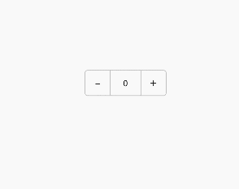

# Counter

The **Counter** component provides an operation to increase or decrease the number.

>  **NOTE**
>
> This component is supported since API version 7. Updates will be marked with a superscript to indicate their earliest API version.


## Child Components

Supported


## APIs

Counter()

**Widget capability**: This API can be used in ArkTS widgets since API version 9.

**Atomic service API**: This API can be used in atomic services since API version 11.

## Attributes

In addition to the [universal attributes](ts-universal-attributes-size.md), the following attributes are supported.

### enableInc<sup>10+</sup>

enableInc(value: boolean)

Sets whether to enable the increment button.

**Atomic service API**: This API can be used in atomic services since API version 11.

**System capability**: SystemCapability.ArkUI.ArkUI.Full

**Parameters**

| Name| Type   | Mandatory| Description                                 |
| ------ | ------- | ---- | ------------------------------------- |
| value  | boolean | Yes  | Whether to enable the increment button.<br>Default value: **true**|

### enableDec<sup>10+</sup>

enableDec(value: boolean)

Sets whether to enable the decrement button.

**Atomic service API**: This API can be used in atomic services since API version 11.

**System capability**: SystemCapability.ArkUI.ArkUI.Full

**Parameters**

| Name| Type   | Mandatory| Description                                 |
| ------ | ------- | ---- | ------------------------------------- |
| value  | boolean | Yes  | Whether to enable the decrement button.<br>Default value: **true**|

## Events

In addition to the [universal events](ts-universal-events-click.md), the following events are supported.

### onInc

onInc(event: () =&gt; void)

Invoked when the value increases.

**Widget capability**: This API can be used in ArkTS widgets since API version 9.

**Atomic service API**: This API can be used in atomic services since API version 11.

**System capability**: SystemCapability.ArkUI.ArkUI.Full

### onDec

onDec(event: () =&gt; void)

Invoked when the value decreases.

**Widget capability**: This API can be used in ArkTS widgets since API version 9.

**Atomic service API**: This API can be used in atomic services since API version 11.

**System capability**: SystemCapability.ArkUI.ArkUI.Full


## Example

```ts
// xxx.ets
@Entry
@Component
struct CounterExample {
  @State value: number = 0

  build() {
    Column() {
      Counter() {
        Text(this.value.toString())
      }.margin(100)
      .onInc(() => {
        this.value++
      })
      .onDec(() => {
        this.value--
      })
    }.width("100%")
  }
}
```


