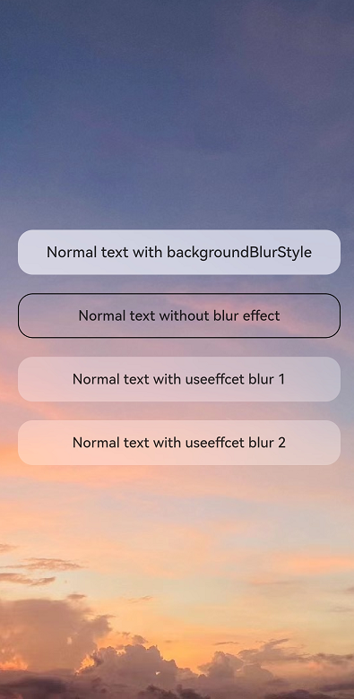

# EffectComponent (System API)

The **EffectComponent** component defines combined special effects for child components to optimize the special effect drawing performance.

>  **NOTE**
>
> - This component is supported since API version 10. Updates will be marked with a superscript to indicate their earliest API version.
>
> - The APIs provided by this component are system APIs.
>
> - Currently, this component provides only combined background blur effects for child components.
>
> - To use this component for combined background blur effects, first replace the **backgroundBlurStyle(BlurStyle)** attribute of the target child components with **useEffect(true)**.


## Child Components

Supported


## APIs

EffectComponent()

Creates an **EffectComponent** component.

## Events

The universal events are not supported.

## Attributes

The universal attributes are supported. Currently, this component only works with the **backgroundBlurStyle** attribute.

## Example

This example demonstrates how to use the **EffectComponent** component.

```ts
//Index.ets
@Entry
@Component
struct Index {
  build() {
    Stack() {
      Image($r("app.media.example"))
        .autoResize(true)
      EffectComponent() {
        Column({ space: 20 }) {
          // Use backgroundBlurStyle to apply a background blur effect.
          Text("Normal text with backgroundBlurStyle")
            .textAlign(TextAlign.Center)
            .fontSize(16)
            .fontWeight(FontWeight.Medium)
            .backgroundBlurStyle(BlurStyle.Thick)
            .borderRadius(16)
            .width('90%')
            .height('48')

          // Do not apply a background blur effect.
          Text("Normal text without blur effect")
            .textAlign(TextAlign.Center)
            .fontSize(16)
            .fontWeight(FontWeight.Medium)
            .border({ width: 1 })
            .borderRadius(16)
            .width('90%')
            .height('48')

          // Use useEffect to combine drawing of the background blur effect, with blur settings inherited from <EffectComponent>.
          Text("Normal text with useEffect blur 1")
            .textAlign(TextAlign.Center)
            .useEffect(true)
            .fontSize(16)
            .fontWeight(FontWeight.Medium)
            .borderRadius(16)
            .width('90%')
            .height('48')

          // Use useEffect to combine drawing of the background blur effect, with blur settings inherited from <EffectComponent>.
          Text("Normal text with useEffect blur 2")
            .textAlign(TextAlign.Center)
            .useEffect(true)
            .fontSize(16)
            .fontWeight(FontWeight.Medium)
            .borderRadius(16)
            .width('90%')
            .height('48')
        }
        .width('100%')
      }
      .backgroundBlurStyle(BlurStyle.Thin)
    }
    .backgroundColor(Color.Black)
    .width('100%')
    .height('100%')
  }
}
```


