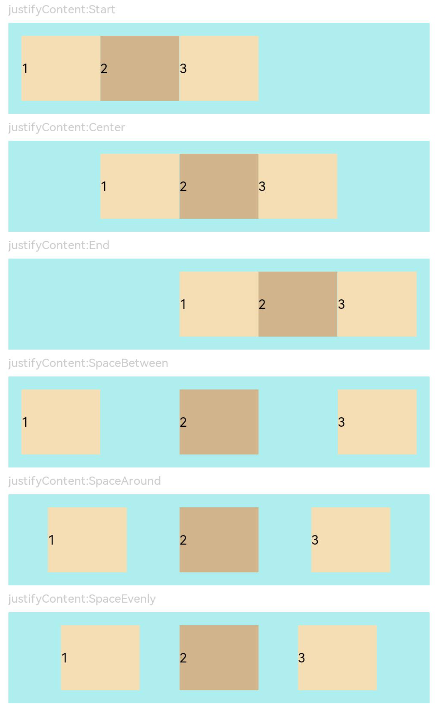
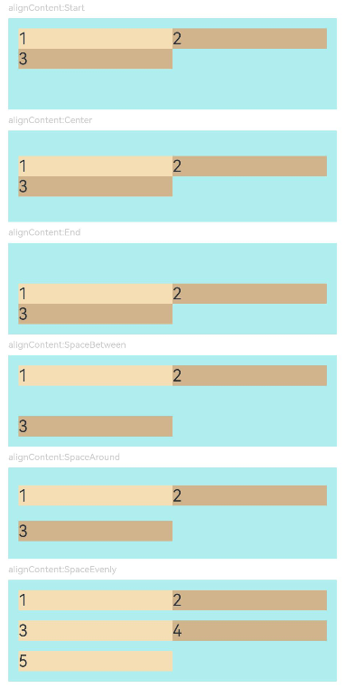

# Flex

The **Flex** component allows for flexible layout of child components.

> **NOTE**
>
> - This component is supported since API version 7. Updates will be marked with a superscript to indicate their earliest API version.
> - The **Flex** component adapts the layout of flex items during rendering. This may affect the performance. Therefore, you are advised to use [Column](ts-container-column.md) or [Row](ts-container-row.md) instead under scenarios where consistently high performance is required.
> - If the main axis of the **Flex** component is not set, it follows the size of the parent container. On the contrary, if the main axis of the [Column](ts-container-column.md) or [Row](ts-container-row.md) component is not set, it follows the size of their child component.


## Child Components

Supported


## APIs

Flex(value?: FlexOptions)

Creates a standard **Flex** component. For details, see [Flex Layout](../../../ui/arkts-layout-development-flex-layout.md).

**Widget capability**: This API can be used in ArkTS widgets since API version 9.

**Atomic service API**: This API can be used in atomic services since API version 11.

**System capability**: SystemCapability.ArkUI.ArkUI.Full

**Parameters**

| Name           | Type       | Mandatory  | Description                                    |
| -------------- | ---------------------------------------- | ---- |  ---------------------------------------- |
| value      | [FlexOptions](#flexoptions) | No   |  Parameters of the child components in the **Flex** component.              |

## FlexOptions

**Atomic service API**: This API can be used in atomic services since API version 11.

**System capability**: SystemCapability.ArkUI.ArkUI.Full

| Name           | Type       | Mandatory  | Description                                    |
| -------------- | ---------------------------------------- | ---- |  ---------------------------------------- |
| direction      | [FlexDirection](ts-appendix-enums.md#flexdirection) | No    | Direction in which child components are arranged in the **Flex** component, that is, the direction of the main axis.<br>Default value: **FlexDirection.Row**<br>**Widget capability**: This API can be used in ArkTS widgets since API version 9.              |
| wrap           | [FlexWrap](ts-appendix-enums.md#flexwrap) | No    | Whether the **Flex** component has a single line or multiple lines.<br>Default value: **FlexWrap.NoWrap**<br>**NOTE**<br>When wrapped onto multiple lines, the child elements on the new line are stacked in the direction based on the cross axis direction.<br>**Widget capability**: This API can be used in ArkTS widgets since API version 9.|
| justifyContent | [FlexAlign](ts-appendix-enums.md#flexalign) | No    | Alignment mode of the child components in the **Flex** component along the main axis.<br>Default value: **FlexAlign.Start**<br>**Widget capability**: This API can be used in ArkTS widgets since API version 9.                   |
| alignItems     | [ItemAlign](ts-appendix-enums.md#itemalign) | No    | Alignment mode of the child components in the **Flex** component along the cross axis.<br>Default value: **ItemAlign.Start**<br>**Widget capability**: This API can be used in ArkTS widgets since API version 9.                |
| alignContent   | [FlexAlign](ts-appendix-enums.md#flexalign) | No    | Alignment mode of the child components in a multi-row **Flex** component along the cross axis. This parameter is valid only when **wrap** is set to **Wrap** or **WrapReverse**.<br>Default value: **FlexAlign.Start**<br>**Widget capability**: This API can be used in ArkTS widgets since API version 9. |
| space<sup>12+</sup>          | [FlexSpaceOptions<sup>12+</sup>](ts-container-flex.md#flexspaceoptions12) | No  | Space of all child components on the main axis or cross axis of the **Flex** component.<br>Default value: **{main:LengthMetrics.px(0), cross:LengthMetrics.px(0)}**<br>This parameter does not take effect if the value specified is a negative number or percentage, or if **justifyContent** is set to **FlexAlign.SpaceBetween**, **FlexAlign.SpaceAround**, or **FlexAlign.SpaceEvenly**.<br>**Atomic service API**: This API can be used in atomic services since API version 12.|

## FlexSpaceOptions<sup>12+</sup>

**Atomic service API**: This API can be used in atomic services since API version 12.

**System capability**: SystemCapability.ArkUI.ArkUI.Full

| Name         | Type       |  Read-Only    | Optional     | Description     |
| ----------- | --------- | ----------- | --------- |----------- |
| main   | [LengthMetrics](../js-apis-arkui-graphics.md#lengthmetrics12)  | No| Yes| Space on the main axis of the flex container.<br> space: {main: LengthMetrics.unit(value)} |
| cross  | [LengthMetrics](../js-apis-arkui-graphics.md#lengthmetrics12) | No| Yes| Space on the cross axis of the flex container.<br> space: {cross: LengthMetrics.unit(value)} |

## Example

### Example 1

```ts
// xxx.ets
@Entry
@Component
struct FlexExample1 {
  build() {
    Column() {
      Column({ space: 5 }) {
        Text('direction:Row').fontSize(9).fontColor(0xCCCCCC).width('90%')
        Flex({ direction: FlexDirection.Row }) { // The child components are arranged in the same direction as the main axis runs along the rows.
          Text('1').width('20%').height(50).backgroundColor(0xF5DEB3)
          Text('2').width('20%').height(50).backgroundColor(0xD2B48C)
          Text('3').width('20%').height(50).backgroundColor(0xF5DEB3)
          Text('4').width('20%').height(50).backgroundColor(0xD2B48C)
        }
        .height(70)
        .width('90%')
        .padding(10)
        .backgroundColor(0xAFEEEE)

        Text('direction:RowReverse').fontSize(9).fontColor(0xCCCCCC).width('90%')
        Flex({ direction: FlexDirection.RowReverse }) { // The child components are arranged opposite to the Row direction.
          Text('1').width('20%').height(50).backgroundColor(0xF5DEB3)
          Text('2').width('20%').height(50).backgroundColor(0xD2B48C)
          Text('3').width('20%').height(50).backgroundColor(0xF5DEB3)
          Text('4').width('20%').height(50).backgroundColor(0xD2B48C)
        }
        .height(70)
        .width('90%')
        .padding(10)
        .backgroundColor(0xAFEEEE)

        Text('direction:Column').fontSize(9).fontColor(0xCCCCCC).width('90%')
        Flex({ direction: FlexDirection.Column }) { // The child components are arranged in the same direction as the main axis runs down the columns.
          Text('1').width('100%').height(40).backgroundColor(0xF5DEB3)
          Text('2').width('100%').height(40).backgroundColor(0xD2B48C)
          Text('3').width('100%').height(40).backgroundColor(0xF5DEB3)
          Text('4').width('100%').height(40).backgroundColor(0xD2B48C)
        }
        .height(160)
        .width('90%')
        .padding(10)
        .backgroundColor(0xAFEEEE)

        Text('direction:ColumnReverse').fontSize(9).fontColor(0xCCCCCC).width('90%')
        Flex({ direction: FlexDirection.ColumnReverse }) { // The child components are arranged opposite to the Column direction.
          Text('1').width('100%').height(40).backgroundColor(0xF5DEB3)
          Text('2').width('100%').height(40).backgroundColor(0xD2B48C)
          Text('3').width('100%').height(40).backgroundColor(0xF5DEB3)
          Text('4').width('100%').height(40).backgroundColor(0xD2B48C)
        }
        .height(160)
        .width('90%')
        .padding(10)
        .backgroundColor(0xAFEEEE)
      }.width('100%').margin({ top: 5 })
    }.width('100%')
  }
}
```


### Example 2

```ts
// xxx.ets
@Entry
@Component
struct FlexExample2 {
  build() {
    Column() {
      Column({ space: 5 }) {
        Text('Wrap').fontSize(9).fontColor(0xCCCCCC).width('90%')
        Flex({ wrap: FlexWrap.Wrap }) { // The child components are arranged in multiple lines.
          Text('1').width('50%').height(50).backgroundColor(0xF5DEB3)
          Text('2').width('50%').height(50).backgroundColor(0xD2B48C)
          Text('3').width('50%').height(50).backgroundColor(0xD2B48C)
        }
        .width('90%')
        .padding(10)
        .backgroundColor(0xAFEEEE)

        Text('NoWrap').fontSize(9).fontColor(0xCCCCCC).width('90%')
        Flex({ wrap: FlexWrap.NoWrap }) { // The child components are arranged in a single line.
          Text('1').width('50%').height(50).backgroundColor(0xF5DEB3)
          Text('2').width('50%').height(50).backgroundColor(0xD2B48C)
          Text('3').width('50%').height(50).backgroundColor(0xF5DEB3)
        }
        .width('90%')
        .padding(10)
        .backgroundColor(0xAFEEEE)

        Text('WrapReverse').fontSize(9).fontColor(0xCCCCCC).width('90%')
        Flex({ wrap: FlexWrap.WrapReverse , direction:FlexDirection.Row }) { // The child components are reversely arranged in multiple lines, and they may overflow.
          Text('1').width('50%').height(50).backgroundColor(0xF5DEB3)
          Text('2').width('50%').height(50).backgroundColor(0xD2B48C)
          Text('3').width('50%').height(50).backgroundColor(0xD2B48C)
        }
        .width('90%')
        .height(120)
        .padding(10)
        .backgroundColor(0xAFEEEE)
      }.width('100%').margin({ top: 5 })
    }.width('100%')
  }
}
```


### Example 3

```ts
// xxx.ets
@Component
struct JustifyContentFlex {
  justifyContent : number = 0;

  build() {
    Flex({ justifyContent: this.justifyContent }) {
      Text('1').width('20%').height(50).backgroundColor(0xF5DEB3)
      Text('2').width('20%').height(50).backgroundColor(0xD2B48C)
      Text('3').width('20%').height(50).backgroundColor(0xF5DEB3)
    }
    .width('90%')
    .padding(10)
    .backgroundColor(0xAFEEEE)
  }
}

@Entry
@Component
struct FlexExample3 {
  build() {
    Column() {
      Column({ space: 5 }) {
        Text('justifyContent:Start').fontSize(9).fontColor(0xCCCCCC).width('90%')
        JustifyContentFlex({ justifyContent: FlexAlign.Start }) // The child components are aligned with the start edge of the main axis.

        Text('justifyContent:Center').fontSize(9).fontColor(0xCCCCCC).width('90%')
        JustifyContentFlex({ justifyContent: FlexAlign.Center }) // The child components are aligned in the center of the main axis.

        Text('justifyContent:End').fontSize(9).fontColor(0xCCCCCC).width('90%')
        JustifyContentFlex({ justifyContent: FlexAlign.End }) // The child components are aligned with the end edge of the main axis.

        Text('justifyContent:SpaceBetween').fontSize(9).fontColor(0xCCCCCC).width('90%')
        JustifyContentFlex({ justifyContent: FlexAlign.SpaceBetween }) // The child components are evenly distributed along the main axis. The first component is aligned with the main-start, the last component is aligned with the main-end.

        Text('justifyContent:SpaceAround').fontSize(9).fontColor(0xCCCCCC).width('90%')
        JustifyContentFlex({ justifyContent: FlexAlign.SpaceAround }) // The child components are evenly distributed along the main axis. The space between the first component and main-start, and that between the last component and cross-main are both half the size of the space between two adjacent components.

        Text('justifyContent:SpaceEvenly').fontSize(9).fontColor(0xCCCCCC).width('90%')
        JustifyContentFlex({ justifyContent: FlexAlign.SpaceEvenly }) // The child components are evenly distributed along the main axis. The space between the first component and main-start, the space between the last component and main-end, and the space between any two adjacent components are the same.
      }.width('100%').margin({ top: 5 })
    }.width('100%')
  }
}
```



### Example 4

```ts
// xxx.ets
@Component
struct AlignItemsFlex {
  alignItems : number = 0;

  build() {
    Flex({ alignItems: this.alignItems }) {
      Text('1').width('33%').height(30).backgroundColor(0xF5DEB3)
      Text('2').width('33%').height(40).backgroundColor(0xD2B48C)
      Text('3').width('33%').height(50).backgroundColor(0xF5DEB3)
    }
    .size({width: '90%', height: 80})
    .padding(10)
    .backgroundColor(0xAFEEEE)
  }
}

@Entry
@Component
struct FlexExample4 {
  build() {
    Column() {
      Column({ space: 5 }) {
        Text('alignItems:Auto').fontSize(9).fontColor(0xCCCCCC).width('90%')
        AlignItemsFlex({ alignItems: ItemAlign.Auto }) // The items in the container are aligned with the cross-start edge.

        Text('alignItems:Start').fontSize(9).fontColor(0xCCCCCC).width('90%')
        AlignItemsFlex({ alignItems: ItemAlign.Start }) // The items in the container are aligned with the cross-start edge.

        Text('alignItems:Center').fontSize(9).fontColor(0xCCCCCC).width('90%')
        AlignItemsFlex({alignItems: ItemAlign.Center}) // The items in the container are centered along the cross axis.

        Text('alignItems:End').fontSize(9).fontColor(0xCCCCCC).width('90%')
        AlignItemsFlex({ alignItems: ItemAlign.End }) // The items in the container are aligned with the cross-end edge.

        Text('alignItems:Stretch').fontSize(9).fontColor(0xCCCCCC).width('90%')
        AlignItemsFlex({ alignItems: ItemAlign.Stretch }) // The items in the container are stretched and padded along the cross axis.

        Text('alignItems:Baseline').fontSize(9).fontColor(0xCCCCCC).width('90%')
        AlignItemsFlex({ alignItems: ItemAlign.Baseline }) // The items in the container are aligned in such a manner that their text baselines are aligned along the cross axis.
      }.width('100%').margin({ top: 5 })
    }.width('100%')
  }
}
```


### Example 5

```ts
// xxx.ets
@Component
struct AlignContentFlex {
  alignContent: number = 0;

  build() {
    Flex({ wrap: FlexWrap.Wrap, alignContent: this.alignContent }) {
      Text('1').width('50%').height(20).backgroundColor(0xF5DEB3)
      Text('2').width('50%').height(20).backgroundColor(0xD2B48C)
      Text('3').width('50%').height(20).backgroundColor(0xD2B48C)
    }
    .size({ width: '90%', height: 90 })
    .padding(10)
    .backgroundColor(0xAFEEEE)
  }
}

@Entry
@Component
struct FlexExample5 {
  build() {
    Column() {
      Column({ space: 5 }) {
        Text('alignContent:Start').fontSize(9).fontColor(0xCCCCCC).width('90%')
        AlignContentFlex({ alignContent: FlexAlign.Start }) // The child components are aligned with the start edge in the multi-row layout.

        Text('alignContent:Center').fontSize(9).fontColor(0xCCCCCC).width('90%')
        AlignContentFlex({ alignContent: FlexAlign.Center }) // The child components are aligned in the center in the multi-row layout.

        Text('alignContent:End').fontSize(9).fontColor(0xCCCCCC).width('90%')
        AlignContentFlex({ alignContent: FlexAlign.End }) // The child components are aligned with the end edge in the multi-row layout.

        Text('alignContent:SpaceBetween').fontSize(9).fontColor(0xCCCCCC).width('90%')
        AlignContentFlex({ alignContent: FlexAlign.SpaceBetween }) // In the multi-row layout, the child component in the first row is aligned with the start edge of the column, and the child component in the last row is aligned with the end edge of the column.

        Text('alignContent:SpaceAround').fontSize(9).fontColor(0xCCCCCC).width('90%')
        AlignContentFlex({ alignContent: FlexAlign.SpaceAround }) // In the multi-row layout, the space between the child component in the first row and the start edge of the column, and that between the child component in the last row and the end edge of the column are both half the size of the space between two adjacent rows.

        Text('alignContent:SpaceEvenly').fontSize(9).fontColor(0xCCCCCC).width('90%')
        Flex({
          wrap: FlexWrap.Wrap,
          alignContent: FlexAlign.SpaceEvenly
        }) {// In the multi-row layout, the space between the child component in the first row and the start edge of the column, the space between the child component in the last row and the end edge of the column, and the space between any two adjacent rows are the same.
          Text('1').width('50%').height(20).backgroundColor(0xF5DEB3)
          Text('2').width('50%').height(20).backgroundColor(0xD2B48C)
          Text('3').width('50%').height(20).backgroundColor(0xF5DEB3)
          Text('4').width('50%').height(20).backgroundColor(0xD2B48C)
          Text('5').width('50%').height(20).backgroundColor(0xF5DEB3)
        }
        .size({ width: '90%', height: 100 })
        .padding({ left: 10, right: 10 })
        .backgroundColor(0xAFEEEE)
      }.width('100%').margin({ top: 5 })
    }.width('100%')
  }
}
```



### Example 6

```ts
import {LengthMetrics} from '@kit.ArkUI';

@Entry
@Component
struct FlexExample2 {
  build() {
    Column() {
      Column({ space: 5 }) {
        Text('Wrap').fontSize(9).fontColor(0xCCCCCC).width('90%')
        Flex({ wrap: FlexWrap.Wrap, space: {main: LengthMetrics.px(50), cross: LengthMetrics.px(50)} }) { // The child components are arranged in multiple lines.
          Text('1').width('40%').height(50).backgroundColor(0xF5DEB3)
          Text('2').width('40%').height(50).backgroundColor(0xD2B48C)
          Text('3').width('40%').height(50).backgroundColor(0xD2B48C)
        }
        .width('90%')
        .padding(10)
        .backgroundColor(0xAFEEEE)

        Text('NoWrap').fontSize(9).fontColor(0xCCCCCC).width('90%')
        Flex({ wrap: FlexWrap.Wrap, space: {main: LengthMetrics.px(50), cross: LengthMetrics.px(50)} }) { // The child components are arranged in a single line.
          Text('1').width('50%').height(50).backgroundColor(0xF5DEB3)
          Text('2').width('50%').height(50).backgroundColor(0xD2B48C)
          Text('3').width('50%').height(50).backgroundColor(0xF5DEB3)
        }
        .width('90%')
        .padding(10)
        .backgroundColor(0xAFEEEE)

        Text('WrapReverse').fontSize(9).fontColor(0xCCCCCC).width('90%')
        Flex({ wrap: FlexWrap.WrapReverse, direction:FlexDirection.Row, space: {main: LengthMetrics.px(50), cross: LengthMetrics.px(50)} }) { // The child components are reversely arranged in multiple lines.
          Text('1').width('40%').height(50).backgroundColor(0xF5DEB3)
          Text('2').width('40%').height(50).backgroundColor(0xD2B48C)
          Text('3').width('40%').height(50).backgroundColor(0xD2B48C)
        }
        .width('90%')
        .height(120)
        .padding(10)
        .backgroundColor(0xAFEEEE)
      }.width('100%').margin({ top: 5 })
    }.width('100%')
  }
}
```


