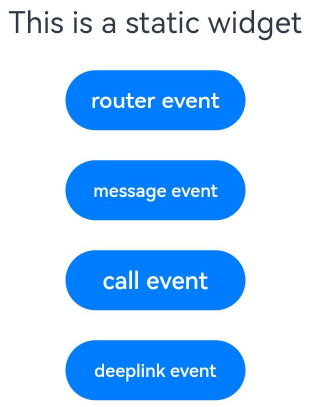

# FormLink

The **FormLink** component is provided for interactions between static widgets and widget providers. It supports three types of events: router, message, and call.

> **NOTE**
>
> - This component is supported since API version 10. Updates will be marked with a superscript to indicate their earliest API version.
>
> - This component can be used only in static widgets.
>

## Required Permissions

None

## Child Components

This component supports only one child component.

## APIs

FormLink(options: FormLinkOptions)

**Widget capability**: This API can be used in ArkTS widgets since API version 10.

**Atomic service API**: This API can be used in atomic services since API version 11.

**System capability**: SystemCapability.ArkUI.ArkUI.Full

**Parameters**

| Name      | Type                           | Mandatory  | Description  |
| --------- | ------------------------------- | ---- | ------ |
| options | [FormLinkOptions](#formlinkoptions) | Yes   | Widget information.|

## FormLinkOptions

**Atomic service API**: This API can be used in atomic services since API version 11.

**System capability**: SystemCapability.ArkUI.ArkUI.Full

| Name     | Type| Mandatory| Description                                                    |
| ----------- | -------- | ---- | ------------------------------------------------------------ |
| action      | string   | Yes  | Action type.<br>- **"router"**: redirection to the specified UIAbility of the widget provider.<br>- **"message"**: custom message. If this type of action is triggered, the [onFormEvent()](../../apis-form-kit/js-apis-app-form-formExtensionAbility.md#onformevent) lifecycle callback of the provider FormExtensionAbility is called.<br>- **"call"**: launch of the widget provider in the background. If this type of action is triggered, the specified UIAbility (whose launch type must be [singleton](../../../application-models/uiability-launch-type.md#singleton)) of the widget provider is started in the background, but not displayed in the foreground. This action type requires that the widget provider should have the [ohos.permission.KEEP_BACKGROUND_RUNNING](../../../security/AccessToken/permissions-for-all.md#ohospermissionkeep_background_running) permission.<br>**NOTE**<br>Whenever possible, avoid using the router event to refresh the widget UI.<br>**Widget capability**: This API can be used in ArkTS widgets since API version 10.|
| moduleName  | string   | No  | Name of the target module when action is **"router"** or **"call"**.<br>**Widget capability**: This API can be used in ArkTS widgets since API version 10.|
| bundleName  | string   | No  | Name of the target bundle when action is **"router"** or **"call"**.<br>**Widget capability**: This API can be used in ArkTS widgets since API version 10.|
| abilityName | string   | No  | Name of the target UIAbility when action is **"router"** or **"call"**.<br>**Widget capability**: This API can be used in ArkTS widgets since API version 10.|
| uri<sup>11+</sup> | string   | No  | URI of the target UIAbility when action is **"router"**. If both **uri** and **abilityName** are set, **abilityName** takes precedence.<br>**Widget capability**: This API can be used in ArkTS widgets since API version 11.|
| params      | Object   | No  | Additional parameters carried in the current action. The value is a key-value pair in JSON format. For the **"call"** action type, the **method** parameter must be set and its value type must be string.<br>**NOTE**<br>Whenever possible, avoid using **params** to transfer internal state variables of widgets.<br>**Widget capability**: This API can be used in ArkTS widgets since API version 10.|

## Attributes

The [universal attributes](ts-universal-attributes-size.md) are supported.

## Events

The [universal events](ts-universal-events-click.md) are not supported.

## Example

```ts
@Entry
@Component
struct FormLinkDemo {
  build() {
    Column() {
      Text("This is a static widget").fontSize(20).margin(10)

      // The router event is used to redirect to the specified UIAbility from the static widget.
      FormLink({
        action: "router",
        abilityName: "EntryAbility",
        params: {
          'message': 'testForRouter' // Customize the message to send.
        }
      }) {
        Button("router event").width(120)
      }.margin(10)


      // The message event triggers the onFormEvent callback of FormExtensionAbility.
      FormLink({
        action: "message",
        abilityName: "EntryAbility",
        params: {
          'message': 'messageEvent' // Customize the message to send.
        }
      }) {
        Button("message event").width(120)
      }.margin(10)


      // The call event is used to call the specified method in the UIAbility.
      FormLink({
        action: "call",
        abilityName: "EntryAbility",
        params: {
          'method': 'funA', // Set the name of the method to call in the EntryAbility.
          'num': 1 // Set other parameters to be passed in.
        }
      }) {
        Button("call event").width(120)
      }.margin(10)

      // The router event is used to redirect to the specified UIAbility from the static widget through deep linking.
      FormLink({
        action: "router",
        uri: 'example://uri.ohos.com/link_page',
        params: {
          message:'router msg for static uri deeplink' // Customize the message to send.
        }
      }) {
        Button("deeplink event").width(120)
      }.margin(10)
    }
    .justifyContent(FlexAlign.Center)
    .width('100%').height('100%')
  }
}
```



The following is an example of **uris** configuration in the [module.json5](../../../quick-start/module-configuration-file.md#skills) file of the target application:

```json
"abilities": [
  {
    "skills": [
      {
        "uris": [
          {
            "scheme": "example",
            "host": "uri.ohos.com",
            "path": "link_page"
          },
        ]
      }
    ],
  }
]
```
