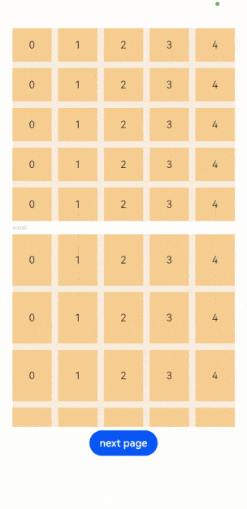
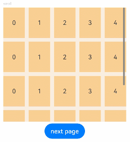
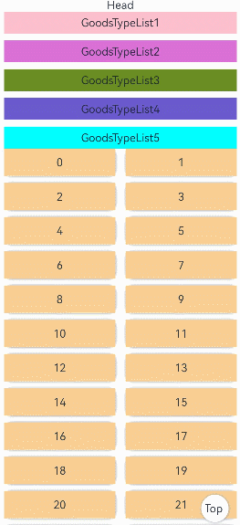
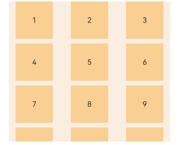
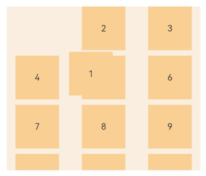

# Grid

The **\<Grid>** component consists of cells formed by rows and columns. You can specify the cells where items are located to form various layouts.

>  **NOTE**
>
>  This component is supported since API version 7. Updates will be marked with a superscript to indicate their earliest API version.


## Child Components

The **\<Grid>** component accepts only **\<[GridItem](ts-container-griditem.md)>** as its child components.

>  **NOTE**
>
>  Below are the rules for calculating the indexes of the child components of **\<Grid>**:
>
>  The index increases in ascending order of child components.
>
>  In the **if/else** statement, only the child components in the branch where the condition is met participate in the index calculation.
>
>  In the **ForEach** or **LazyForEach** statement, the indexes of all expanded subnodes are calculated.
>
>  If the values of [if/else](../../../quick-start/arkts-rendering-control-ifelse.md), [ForEach](../../../quick-start/arkts-rendering-control-foreach.md), and [LazyForEach](../../../quick-start/arkts-rendering-control-lazyforeach.md) change, the indexes of subnodes are updated.
>
>  The child component that has the **visibility** attribute set to **Hidden** or **None** is included in the index calculation.
>
>  The child component that has the **visibility** attribute set to **None** is not displayed, but still takes up the corresponding cell.
>
>  The child component that has the **position** attribute set is displayed in the corresponding cell, offset by the distance specified by **position** relative to the upper left corner of the grid. This child component does not scroll with the corresponding cell and is not displayed after the corresponding cell extends beyond the display range of the grid.
>
>  When there is a gap between child components, it is filled as much as possible based on the current display area. Therefore, the relative position of grid items may change as the grid scrolls.

## APIs

Grid(scroller?: Scroller, layoutOptions?: GridLayoutOptions)

**Parameters**

| Name  | Type                                   | Mandatory| Description                                                    |
| -------- | ------------------------------------------- | ---- | ------------------------------------------------------------ |
| scroller | [Scroller](ts-container-scroll.md#scroller) | No  | Controller, which can be bound to scrollable components.<br>**NOTE**<br>The scroller cannot be bound to other scrollable components, such as [\<List>](ts-container-list.md), [\<Grid>](ts-container-grid.md), or [\<Scroll>](ts-container-scroll.md).|
| layoutOptions<sup>10+</sup> | [GridLayoutOptions](#gridlayoutoptions10) | No| Layout options of a scrolling grid.|

## GridLayoutOptions<sup>10+</sup>

Defines the layout options. In this API, **irregularIndexes** and **onGetIrregularSizeByIndex** can be used for grids where either **rowsTemplate** or **columnsTemplate** is set. You can specify an index array and set the number of rows and columns to be occupied by a grid item with the specified index. For details, see Example 3. **onGetRectByIndex** can be used for grids where both **rowsTemplate** and **columnsTemplate** are set. It specifies the position and size for the grid item with the specified index. For details, see Example 1.

**Parameters**

| Name   | Type     | Mandatory  | Description                   |
| ----- | ------- | ---- | --------------------- |
| regularSize  | [number, number]  | Yes   | Number of rows and columns occupied by a grid item with regular size. The only supported value is **[1, 1]**, meaning that the grid item occupies one row and one column.  |
| irregularIndexes | number[] | No   | Indexes of the grid item with an irregular size in the grid. When **onGetIrregularSizeByIndex** is not set, the grid item specified in this parameter occupies an entire row of the grid that scrolls vertically or an entire column of the grid that scrolls horizontally.|
| onGetIrregularSizeByIndex | (index: number) => [number, number] | No   | Number of rows and columns occupied by the grid item with an irregular size. This parameter is used together with **irregularIndexes**. A grid item cannot occupy multiple rows in vertical scrolling mode, or multiple columns in horizontal scrolling mode.|
| onGetRectByIndex<sup>11+</sup> | (index: number) => [number, number,number,number] | No | Position and size of the grid item with the specified index, in the format of [rowStart,columnStart,rowSpan,columnSpan], where **rowStart** indicates the row start position, **columnStart** indicates the column start position,<br>**rowSpan** indicates the number of rows occupied by the grid item, and **columnSpan** indicates the number of columns occupied by the grid item. Their values are unitless.<br>The values of **rowStart** and **columnStart** are natural numbers greater than or equal to 0. If a negative value is set, the default value **0** is used.<br>The values of **rowSpan** and **columnSpan** are natural numbers greater than or equal to 1. If a decimal is set, it is rounded down. If the decimal set is less than 1, the value **1** is used.<br>**NOTE**<br>Case 1: If a grid item finds that the start position specified for it is already occupied, it searches for an available start position from left to right and from top to bottom, starting from position [0,0].<br>Case 2: If any space other than the start position specified for a grid item is occupied, the grid item is displayed within the available space left.|

## Attributes

In addition to the [universal attributes](ts-universal-attributes-size.md), the following attributes are supported.

### columnsTemplate

columnsTemplate(value: string)

Sets the number of columns or minimum column width of the grid. If this attribute is not set, one column will be used.

For example, **'1fr 1fr 2fr'** indicates three columns, with the first column taking up 1/4 of the parent component's full width, the second column 1/4, and the third column 2/4.

**columnsTemplate('repeat(auto-fit, track-size)')** sets the minimum column width to **track-size**, based on which the number of columns and the actual column width are automatically obtained.

**columnsTemplate('repeat(auto-fill, track-size)')** sets the fixed column width to **track-size**, based on which the number of columns is automatically obtained. **repeat**, **auto-fit**, and **auto-fill** are keywords. **track-size** indicates the column width, in the unit of px, vp (default), %, or any valid digit. The value must be greater than or equal to one valid column width.

If this attribute is set to **'0fr'**, the column width is 0, and grid item in the column is not displayed. If this attribute is set to any other invalid value, the grid item is displayed as one column.

**System capability**: SystemCapability.ArkUI.ArkUI.Full

**Parameters**

| Name| Type  | Mandatory| Description                              |
| ------ | ------ | ---- | ---------------------------------- |
| value  | string | Yes  | Number of columns or minimum column width of the grid.|

### rowsTemplate

rowsTemplate(value: string)

Sets the number of rows or minimum row height of the grid. If this attribute is not set, one row will be used.

For example, **'1fr 1fr 2fr'** indicates three rows, with the first row taking up 1/4 of the parent component's full height, the second row 1/4, and the third row 2/4.

**rowsTemplate('repeat(auto-fit, track-size)')** sets the minimum row height to **track-size**, based on which the number of rows and the actual row height are automatically obtained.

**rowsTemplate('repeat(auto-fill, track-size)')** sets the fixed row height to **track-size**, based on which the number of rows is automatically obtained. **repeat**, **auto-fit**, and **auto-fill** are keywords. **track-size** indicates the row height, in the unit of px, vp (default), %, or any valid digit. The value must be greater than or equal to one valid row height.

If this attribute is set to **'0fr'**, the row width is 0, and grid item in the row is not displayed. If this attribute is set to any other invalid value, the grid item is displayed as one row.

**System capability**: SystemCapability.ArkUI.ArkUI.Full

**Parameters**

| Name| Type  | Mandatory| Description                              |
| ------ | ------ | ---- | ---------------------------------- |
| value  | string | Yes  | Number of rows or minimum row height of the grid.|

>  **NOTE**
>
>  Depending on the settings of the **rowsTemplate** and **columnsTemplate** attributes, the **\<Grid>** component supports the following layout modes:
>
>  1. **rowsTemplate** and **columnsTemplate** are both set
>
>  - The **\<Grid>** component displays only elements in a fixed number of rows and columns and cannot be scrolled.
>  - In this mode, the following attributes do not take effect: **layoutDirection**, **maxCount**, **minCount**, and **cellLength**.
>  - If the width and height of a grid are not set, the grid adapts to the size of its parent component by default.
>  - The size of the grid rows and columns is the size of the grid content area minus the gap between rows and columns. It is allocated based on the proportion of each row and column.
>  - By default, the grid items fill the entire grid.
>
>  2. Either **rowsTemplate** or **columnsTemplate** is set
>
>  - The **\<Grid>** component arranges elements in the specified direction and allows for scrolling to display excess elements.
>  - If **columnsTemplate** is set, the component scrolls vertically, the main axis runs vertically, and the cross axis runs horizontally.
>  - If **rowsTemplate** is set, the component scrolls horizontally, the main axis runs horizontally, and the cross axis runs vertically.
>  - In this mode, the following attributes do not take effect: **layoutDirection**, **maxCount**, **minCount**, and **cellLength**.
>  - The cross axis size of the grid is the cross axis size of the grid content area minus the gaps along the cross axis. It is allocated based on the proportion of each row and column.
>  - The main axis size of the grid is the maximum height of all grid items in the cross axis direction of the current grid.
>
>  3. Neither **rowsTemplate** nor **columnsTemplate** is set
>
>  - The **\<Grid>** component arranges elements in the direction specified by **layoutDirection**. The number of columns is jointly determined by the grid width, width of the first element, **minCount**, **maxCount**, and **columnsGap**.
>  - The number of rows is jointly determined by the grid height, height of the first element, **cellLength**, and **rowsGap**. Elements outside the determined range of rows and columns are not displayed and cannot be viewed through scrolling.
>  - In this mode, only the following attributes take effect: **layoutDirection**, **maxCount**, **minCount**, **cellLength**, **editMode**, **columnsGap**, and **rowsGap**.
>  - When **layoutDirection** is set to **Row**, child components are arranged from left to right. When a row is full, a new row will be added. If the remaining height is insufficient, no more elements will be laid out, and the whole content is centered at the top.
>  - When **layoutDirection** is set to **Column**, elements are arranged column by column from top to bottom. If the remaining height is insufficient, no more elements will be laid out, and the whole content is centered at the top.
>

### columnsGap

columnsGap(value: Length)

Sets the gap between columns. A value less than 0 evaluates to the default value.

**System capability**: SystemCapability.ArkUI.ArkUI.Full

**Parameters**

| Name| Type                        | Mandatory| Description                        |
| ------ | ---------------------------- | ---- | ---------------------------- |
| value  | [Length](ts-types.md#length) | Yes  | Gap between columns.<br>Default value: **0**|

### rowsGap

rowsGap(value: Length)

Sets the gap between rows. A value less than 0 evaluates to the default value.

**System capability**: SystemCapability.ArkUI.ArkUI.Full

**Parameters**

| Name| Type                        | Mandatory| Description                        |
| ------ | ---------------------------- | ---- | ---------------------------- |
| value  | [Length](ts-types.md#length) | Yes  | Gap between rows.<br>Default value: **0**|

### scrollBar

scrollBar(value: BarState)

Sets the scrollbar state.

**System capability**: SystemCapability.ArkUI.ArkUI.Full

**Parameters**

| Name| Type                                     | Mandatory| Description                                                        |
| ------ | ----------------------------------------- | ---- | ------------------------------------------------------------ |
| value  | [BarState](ts-appendix-enums.md#barstate) | Yes  | Scrollbar state.<br>Default value: **BarState.Off**<br>**NOTE**<br>In API version 9 and earlier versions, the default value is **BarState.Off**. In API version 10, the default value is **BarState.Auto**.|

### scrollBarColor

scrollBarColor(value: Color | number | string)

Sets the scrollbar color.

**System capability**: SystemCapability.ArkUI.ArkUI.Full

**Parameters**

| Name| Type                                                        | Mandatory| Description          |
| ------ | ------------------------------------------------------------ | ---- | -------------- |
| value  | [Color](ts-appendix-enums.md#color) \| number \| string | Yes  | Scrollbar color.|

### scrollBarWidth

scrollBarWidth(value: number | string)

Sets the scrollbar width. After the width is set, the scrollbar is displayed with the set width in normal state and pressed state.

**System capability**: SystemCapability.ArkUI.ArkUI.Full

**Parameters**

| Name| Type                      | Mandatory| Description                                     |
| ------ | -------------------------- | ---- | ----------------------------------------- |
| value  | number \| string | Yes  | Scrollbar width.<br>Default value: **4**<br>Unit: vp|

### cachedCount

cachedCount(value: number)

Sets the number of grid items to be preloaded (cached). It works only in [LazyForEach](../../../quick-start/arkts-rendering-control-lazyforeach.md). A value less than 0 evaluates to the default value. For details, see [Minimizing White Blocks During Swiping](../../../performance/arkts-performance-improvement-recommendation.md#minimizing-white-blocks-during-swiping).

The number of the grid items to be cached before and after the currently displayed one equals the value of **cachedCount** multiplied by the number of columns.

Grid items that exceed the display and cache range are released.

**System capability**: SystemCapability.ArkUI.ArkUI.Full

**Parameters**

| Name| Type  | Mandatory| Description                                  |
| ------ | ------ | ---- | -------------------------------------- |
| value  | number | Yes  | Number of grid items to be preloaded (cached).<br>Default value: **1**|

### editMode<sup>8+</sup>

editMode(value: boolean)

Sets whether to enable edit mode. In edit mode, the user can drag the [grid items](ts-container-griditem.md) in the **\<Grid>** component.

**System capability**: SystemCapability.ArkUI.ArkUI.Full

**Parameters**

| Name| Type  | Mandatory| Description                                    |
| ------ | ------ | ---- | ---------------------------------------- |
| value  | boolean | Yes  | Whether to enable edit mode.<br>Default value: **false**|

### layoutDirection<sup>8+</sup>

layoutDirection(value: GridDirection)

Sets the main axis direction of the grid.

**System capability**: SystemCapability.ArkUI.ArkUI.Full

**Parameters**

| Name| Type                                    | Mandatory| Description                                          |
| ------ | ---------------------------------------- | ---- | ---------------------------------------------- |
| value  | [GridDirection](#griddirection8) | Yes  | Main axis direction of the grid.<br>Default value: **GridDirection.Row**|

### maxCount<sup>8+</sup>

maxCount(value: number)

Sets the maximum number of rows or columns that can be displayed. A value less than 1 evaluates to the default value.

When **layoutDirection** is **Row** or **RowReverse**, the value indicates the maximum number of columns that can be displayed.

When **layoutDirection** is **Column** or **ColumnReverse**, the value indicates the maximum number of rows that can be displayed.

If the value of **maxCount** is smaller than that of **minCount**, the default values of **maxCount** and **minCount** are used.

**System capability**: SystemCapability.ArkUI.ArkUI.Full

**Parameters**

| Name| Type  | Mandatory| Description                                         |
| ------ | ------ | ---- | --------------------------------------------- |
| value  | number | Yes  | Maximum number of rows or columns that can be displayed.<br>Default value: **Infinity**|

### minCount<sup>8+</sup>

minCount(value: number)

Sets the minimum number of rows or columns that can be displayed. A value less than 1 evaluates to the default value.

When **layoutDirection** is **Row** or **RowReverse**, the value indicates the minimum number of columns that can be displayed.

When **layoutDirection** is **Column** or **ColumnReverse**, the value indicates the minimum number of rows that can be displayed.

**System capability**: SystemCapability.ArkUI.ArkUI.Full

**Parameters**

| Name| Type  | Mandatory| Description                                  |
| ------ | ------ | ---- | -------------------------------------- |
| value  | number | Yes  | Minimum number of rows or columns that can be displayed.<br>Default value: **1**|

### cellLength<sup>8+</sup>

cellLength(value: number)

Sets the height per row or width per column.

When **layoutDirection** is **Row** or **RowReverse**, the value indicates the height per row.

When **layoutDirection** is **Column** or **ColumnReverse**, the value indicates the width per column.

**System capability**: SystemCapability.ArkUI.ArkUI.Full

**Parameters**

| Name| Type  | Mandatory| Description                                                   |
| ------ | ------ | ---- | ------------------------------------------------------- |
| value  | number | Yes  | Height per row or width per column.<br>Default value: size of the first element|

### multiSelectable<sup>8+</sup>

multiSelectable(value: boolean)

Whether to enable multiselect. When multiselect is enabled, you can use the **selected** attribute and **onSelect** event to obtain the selected status of grid items; you can also set the [style](./ts-universal-attributes-polymorphic-style.md) for the selected state (by default, no style is set for the selected state).

**System capability**: SystemCapability.ArkUI.ArkUI.Full

**Parameters**

| Name| Type   | Mandatory| Description                                                        |
| ------ | ------- | ---- | ------------------------------------------------------------ |
| value  | boolean | Yes  | Whether to enable multiselect.<br>Default value: **false**<br>**false**: Multiselect is disabled. **true**: Multiselect is disabled.|

### supportAnimation<sup>8+</sup>

supportAnimation(value: boolean)

Sets whether to enable animation. Currently, the grid item drag animation is supported. Animation is supported only in scrolling mode (only **rowsTemplate** or **columnsTemplate** is set).

**System capability**: SystemCapability.ArkUI.ArkUI.Full

**Parameters**

| Name| Type   | Mandatory| Description                            |
| ------ | ------- | ---- | -------------------------------- |
| value  | boolean | Yes  | Whether to enable animation.<br>Default value: **false**|

### edgeEffect<sup>10+</sup>

edgeEffect(value: EdgeEffect, options?: EdgeEffectOptions)

Sets the effect used when the scroll boundary is reached.

**System capability**: SystemCapability.ArkUI.ArkUI.Full

**Parameters**

| Name               | Type                                                        | Mandatory| Description                                                        |
| --------------------- | ------------------------------------------------------------ | ---- | ------------------------------------------------------------ |
| value                 | [EdgeEffect](ts-appendix-enums.md#edgeeffect)                | Yes  | Effect used when the scroll boundary is reached. The spring and shadow effects are supported.<br>Default value: **EdgeEffect.None**|
| options<sup>11+</sup> | [EdgeEffectOptions](ts-container-scroll.md#edgeeffectoptions11) | No  | Whether to enable the scroll effect when the component content is smaller than the component itself.<br>Default value: **false**|

### enableScrollInteraction<sup>10+</sup>

enableScrollInteraction(value: boolean)

Sets whether to support scroll gestures. When this attribute is set to **false**, scrolling by finger or mouse is not supported, but the scrolling controller API is not affected.

**System capability**: SystemCapability.ArkUI.ArkUI.Full

**Parameters**

| Name| Type   | Mandatory| Description                               |
| ------ | ------- | ---- | ----------------------------------- |
| value  | boolean | Yes  | Whether to support scroll gestures.<br>Default value: **true**|

### nestedScroll<sup>10+</sup>

nestedScroll(value: NestedScrollOptions)

Sets the nested scrolling options. You can set the nested scrolling mode in the forward and backward directions to implement scrolling linkage with the parent component.

**System capability**: SystemCapability.ArkUI.ArkUI.Full

**Parameters**

| Name| Type                                                        | Mandatory| Description          |
| ------ | ------------------------------------------------------------ | ---- | -------------- |
| value  | [NestedScrollOptions](ts-container-scroll.md#nestedscrolloptions10) | Yes  | Nested scrolling options.|

### friction<sup>10+</sup>

friction(value: number | Resource)

Sets the friction coefficient. It applies only to gestures in the scrolling area, and it affects only indirectly the scroll chaining during the inertial scrolling process. A value less than or equal to 0 evaluates to the default value.

**System capability**: SystemCapability.ArkUI.ArkUI.Full

**Parameters**

| Name| Type                                                | Mandatory| Description                                                       |
| ------ | ---------------------------------------------------- | ---- | ----------------------------------------------------------- |
| value  | number \| [Resource](ts-types.md#resource) | Yes  | Friction coefficient.<br>Default value: **0.9** for wearable devices and **0.6** for non-wearable devices|

Depending on the settings of the **rowsTemplate** and **columnsTemplate** attributes, the **\<Grid>** component supports the following layout modes:

1. **rowsTemplate** and **columnsTemplate** are both set

- The **\<Grid>** component displays only elements in a fixed number of rows and columns and cannot be scrolled.
- In this mode, the following attributes do not take effect: **layoutDirection**, **maxCount**, **minCount**, and **cellLength**.
- If the width and height of a grid are not set, the grid adapts to the size of its parent component by default.
- The size of the grid rows and columns is the size of the grid content area minus the gap between rows and columns. It is allocated based on the proportion of each row and column.
- By default, the grid items fill the entire grid.

2. Either **rowsTemplate** or **columnsTemplate** is set

- The **\<Grid>** component arranges elements in the specified direction and allows for scrolling to display excess elements.
- If **columnsTemplate** is set, the component scrolls vertically, the main axis runs vertically, and the cross axis runs horizontally.
- If **rowsTemplate** is set, the component scrolls horizontally, the main axis runs horizontally, and the cross axis runs vertically.
- In this mode, the following attributes do not take effect: **layoutDirection**, **maxCount**, **minCount**, and **cellLength**.
- The cross axis size of the grid is the cross axis size of the grid content area minus the gaps along the cross axis. It is allocated based on the proportion of each row and column.
- The main axis size of the grid is the maximum height of all grid items in the cross axis direction of the current grid.

3. Neither **rowsTemplate** nor **columnsTemplate** is set

- The **\<Grid>** component arranges elements in the direction specified by **layoutDirection**. The number of columns is jointly determined by the grid width, width of the first element, **minCount**, **maxCount**, and **columnsGap**.
- The number of rows is jointly determined by the grid height, height of the first element, **cellLength**, and **rowsGap**. Elements outside the determined range of rows and columns are not displayed and cannot be viewed through scrolling.
- In this mode, only the following attributes take effect: **layoutDirection**, **maxCount**, **minCount**, **cellLength**, **editMode**, **columnsGap**, and **rowsGap**.
- When **layoutDirection** is set to **Row**, child components are arranged from left to right. When a row is full, a new row will be added. If the remaining height is insufficient, no more elements will be laid out, and the whole content is centered at the top.
- When **layoutDirection** is set to **Column**, elements are arranged column by column from top to bottom. If the remaining height is insufficient, no more elements will be laid out, and the whole content is centered at the top.

### flingSpeedLimit<sup>11+</sup>

flingSpeedLimit(speedLimit: number)

Sets the maximum starting fling speed when the fling animation starts. The unit is vp/s.

**System capability**: SystemCapability.ArkUI.ArkUI.Full

**Parameters**

| Name    | Type  | Mandatory| Description                           |
| ---------- | ------ | ---- | ------------------------------- |
| speedLimit | number | Yes  | Maximum starting fling speed when the fling animation starts.|

## GridDirection<sup>8+</sup>

| Name  |Value| Description                                  |
| ------ |------| -------------------------------------- |
| Row  |  0  | Horizontal layout, where the child components are arranged from left to right as the main axis runs along the rows.|
| Column |  1  | Vertical layout, where the child components are arranged from top to bottom as the main axis runs down the columns.|
| RowReverse    |  2  | Reverse horizontal layout, where the child components are arranged from right to left as the main axis runs along the rows.|
| ColumnReverse   |  3  | Reverse vertical layout, where the child components are arranged from bottom up as the main axis runs down the columns.|

> **NOTE**
>
> The default value of the universal attribute [clip](ts-universal-attributes-sharp-clipping.md) is **true** for the **\<Grid>** component.

## Events

In addition to the [universal events](ts-universal-events-click.md), the following events are supported.

### onScrollIndex

onScrollIndex(event: (first: number, last: number) => void)

Triggered when the first or last item displayed in the grid changes, that is, when the index of either the first or last item changes. It is triggered once when the grid is initialized.  

**System capability**: SystemCapability.ArkUI.ArkUI.Full

**Parameters**

| Name            | Type  | Mandatory| Description                            |
| ------------------ | ------ | ---- | -------------------------------- |
| first              | number | Yes  | Index of the first item of the grid.|
| last<sup>10+</sup> | number | Yes  | Index of the last item of the grid.|

### onItemDragStart<sup>8+</sup>

onItemDragStart(event: (event: ItemDragInfo, itemIndex: number) => (() => any) \| void)

Triggered when a grid item starts to be dragged. If **void** is returned, the drag operation cannot be performed.

This event is triggered when the user long presses a grid item.

Drag gesture recognition is also initiated by a long press, and the event processing mechanism prioritizes child component events. Therefore, when the grid item is bound to the long press gesture, it cannot be dragged. In light of this, if both long press and drag operations are required on the grid item, you can use the universal drag event.

**System capability**: SystemCapability.ArkUI.ArkUI.Full

**Parameters**

| Name   | Type                                 | Mandatory| Description                  |
| --------- | ------------------------------------- | ---- | ---------------------- |
| event     | [ItemDragInfo](#itemdraginfo) | Yes  | Information about the drag point.        |
| itemIndex | number                                | Yes  | Index of the dragged item.|

### onItemDragEnter<sup>8+</sup>

onItemDragEnter(event: (event: ItemDragInfo) => void)

Triggered when the dragged item enters the drop target of the grid.

**System capability**: SystemCapability.ArkUI.ArkUI.Full

**Parameters**

| Name| Type                                 | Mandatory| Description          |
| ------ | ------------------------------------- | ---- | -------------- |
| event  | [ItemDragInfo](#itemdraginfo) | Yes  | Information about the drag point.|

### onItemDragMove<sup>8+</sup>

onItemDragMove(event: (event: ItemDragInfo, itemIndex: number, insertIndex: number) => void)

Triggered when the dragged item moves over the drop target of the grid.

**System capability**: SystemCapability.ArkUI.ArkUI.Full

**Parameters**

| Name     | Type                                 | Mandatory| Description          |
| ----------- | ------------------------------------- | ---- | -------------- |
| event       | [ItemDragInfo](#itemdraginfo) | Yes  | Information about the drag point.|
| itemIndex   | number                                | Yes  | Initial position of the dragged item.|
| insertIndex | number                                | Yes  | Index of the position to which the dragged item is dropped.|

### onItemDragLeave<sup>8+</sup>

onItemDragLeave(event: (event: ItemDragInfo, itemIndex: number) => void)

Triggered when the dragged item leaves the drop target of the grid.

**System capability**: SystemCapability.ArkUI.ArkUI.Full

**Parameters**

| Name   | Type                                 | Mandatory| Description                      |
| --------- | ------------------------------------- | ---- | -------------------------- |
| event     | [ItemDragInfo](#itemdraginfo) | Yes  | Information about the drag point.            |
| itemIndex | number                                | Yes  | Index of the dragged item. |

### onItemDrop<sup>8+</sup>

onItemDrop(event: (event: ItemDragInfo, itemIndex: number, insertIndex: number, isSuccess: boolean) => void)

Triggered when the dragged item is dropped on the drop target of the grid.

**System capability**: SystemCapability.ArkUI.ArkUI.Full

**Parameters**

| Name     | Type                                 | Mandatory| Description          |
| ----------- | ------------------------------------- | ---- | -------------- |
| event       | [ItemDragInfo](#itemdraginfo) | Yes  | Information about the drag point.|
| itemIndex   | number                                | Yes  | Initial position of the dragged item.|
| insertIndex | number                                | Yes  | Index of the position to which the dragged item is dropped.|
| isSuccess   | boolean                               | Yes  | Whether the dragged item is successfully dropped.  |

### onScrollBarUpdate<sup>10+</sup>

onScrollBarUpdate(event: (index: number, offset: number) => ComputedBarAttribute)

Triggered when the first item displayed in the grid changes. You can use the callback to set the position and length of the scrollbar.

**System capability**: SystemCapability.ArkUI.ArkUI.Full

**Parameters**

| Name| Type  | Mandatory| Description                                                        |
| ------ | ------ | ---- | ------------------------------------------------------------ |
| index  | number | Yes  | Index of the first item of the grid.                            |
| offset | number | Yes  | Offset of the displayed first item relative to the start position of the grid, in vp.|

**Return value**

| Type                                                 | Description                |
| ----------------------------------------------------- | -------------------- |
| [ComputedBarAttribute](#computedbarattribute) | Position and length of the scrollbar.|

### onScroll<sup>10+</sup>

onScroll(event: (scrollOffset: number, scrollState: ScrollState) => void)

Triggered when the grid scrolls.

**System capability**: SystemCapability.ArkUI.ArkUI.Full

**Parameters**

| Name      | Type                                                   | Mandatory| Description                                                        |
| ------------ | ------------------------------------------------------- | ---- | ------------------------------------------------------------ |
| scrollOffset | number                                                  | Yes  | Scroll offset of each frame, in vp. The offset is positive when the grid is scrolled up and negative when the grid is scrolled down.|
| scrollState  | [ScrollState](ts-container-list.md#scrollstate) | Yes  | Current scroll state.                                              |

### onReachStart<sup>10+</sup>

onReachStart(event: () => void)

Triggered when the grid reaches the start position.

This event is triggered once when the grid is initialized and once when the grid scrolls to the start position. When the spring effect is used when the scroll boundary of the grid is reached, this event is triggered when the grid passes the start position and is triggered again when the grid returns to the start position.

**System capability**: SystemCapability.ArkUI.ArkUI.Full

### onReachEnd<sup>10+</sup>

onReachEnd(event: () => void)

Triggered when the grid reaches the end position.

When the spring effect is used when the scroll boundary of the grid is reached, this event is triggered once when the grid passes the end position and is triggered again when the grid returns to the end position.

**System capability**: SystemCapability.ArkUI.ArkUI.Full

### onScrollFrameBegin<sup>10+</sup>

onScrollFrameBegin(event: (offset: number, state:  ScrollState) => { offsetRemain: number })

Triggered when the grid starts to scroll. After the amount by which the grid will scroll is passed in, the event handler works out the amount by which the grid needs to scroll based on the real-world situation and returns the result.

If **gridDirection** is set to **Axis.Vertical**, the return value is the amount by which the grid needs to scroll in the vertical direction. If **gridDirection** is set to **Axis.Horizontal**, the return value is the amount by which the grid needs to scroll in the horizontal direction.

**System capability**: SystemCapability.ArkUI.ArkUI.Full

**Parameters**

| Name| Type                                                   | Mandatory| Description                      |
| ------ | ------------------------------------------------------- | ---- | -------------------------- |
| offset | number                                                  | Yes  | Amount to scroll by, in vp.|
| state  | [ScrollState](ts-container-list.md#scrollstate) | Yes  | Current scroll state.            |

**Return value**

| Type                    | Description                |
| ------------------------ | -------------------- |
| { offsetRemain: number } | Actual amount by which the grid scrolls, in vp.|

### onScrollStart<sup>10+</sup>

onScrollStart(event: () => void)

Triggered when the grid starts scrolling initiated by the user's finger dragging the grid or its scrollbar. This event is also triggered when the animation contained in the scrolling triggered by [Scroller](ts-container-scroll.md#scroller) starts.

**System capability**: SystemCapability.ArkUI.ArkUI.Full

### onScrollStop<sup>10+</sup>

onScrollStop(event: () => void)

Triggered when the grid stops scrolling after the user's finger leaves the screen. This event is also triggered when the animation contained in the scrolling triggered by [Scroller](ts-container-scroll.md#scroller) stops.

**System capability**: SystemCapability.ArkUI.ArkUI.Full

### onScroll<sup>(deprecated)</sup>
onScroll(event: (scrollOffset: number, scrollState: [ScrollState](ts-container-list.md#scrollstate)) => void) 

Triggered when the grid scrolls.

This API is available since API version 10.

This API is deprecated since API version 12. You are advised to use [onDidScroll](#ondidscroll12) instead.

**System capability**: SystemCapability.ArkUI.ArkUI.Full

**Parameters**

| Name| Type| Mandatory| Description|
| ------ | ------ | ------ | ------|
| scrollOffset | number | Yes| Scroll offset of each frame. The offset is positive when the grid is scrolled up and negative when the grid is scrolled down.<br>Unit: vp |
| scrollState | [ScrollState](ts-container-list.md#scrollstate) | Yes| Current scroll state.|

### onWillScroll<sup>12+</sup> 
onWillScroll(handler: OnScrollCallback)

Triggered when the grid is about to scroll. The return value is the offset amount by which the grid will scroll and the current scroll state. The returned offset is obtained by calculation, not the actual offset.

**System capability**: SystemCapability.ArkUI.ArkUI.Full

**Parameters**

| Name| Type| Mandatory| Description|
| ------ | ------ | ------ | ------|
| handler | [OnScrollCallback](ts-container-list.md#onscrollcallback) | Yes| Callback invoked when the grid is about to scroll.|

> **NOTE**
> 
> When **ScrollEdge** and **ScrollToIndex** that does not involve animation is called, **onWillScroll** is not triggered.


### onDidScroll<sup>12+</sup> 
onDidScroll(handler: OnScrollCallback)

Triggered when the grid scrolls. The return value is the offset amount by which the grid has scrolled and the current scroll state.

**System capability**: SystemCapability.ArkUI.ArkUI.Full

**Parameters**

| Name| Type| Mandatory| Description|
| ------ | ------ | ------ | ------|
| handler | [OnScrollCallback](ts-container-list.md#onscrollcallback) | Yes| Callback triggered when the grid scrolls.|

## ItemDragInfo

| Name        | Type        |   Description        |
| ---------- | ---------- | ---------- |
| x | number |  X coordinate of the dragged item, in vp.   |
| y   | number |  Y coordinate of the dragged item, in vp.   |

## ComputedBarAttribute

| Name        | Type        |   Description        |
| ---------- | ---------- | ---------- |
| totalOffset | number |  Total offset of the grid content relative to the display area, in px.   |
| totalLength   | number |  Total length of the grid content, in px.   |

## Example

### Example 1

This example shows a grid with fixed number of rows and columns, for which you can use **onGetRectByIndex** in **GridLayoutOptions** to specify the position and size of grid items.

```ts
// xxx.ets
@Entry
@Component
struct GridExample {
  @State numbers1: String[] = ['0', '1', '2', '3', '4']
  @State numbers2: String[] = ['0', '1','2','3','4','5']

  layoutOptions3: GridLayoutOptions = {
    regularSize: [1, 1],
    onGetRectByIndex: (index: number) => {
      if (index == 0)
        return [0, 0, 1, 1]
      else if(index==1)
        return [0, 1, 2, 2]
      else if(index==2)
        return [0 ,3 ,3 ,3]
      else if(index==3)
        return [3, 0, 3, 3]
      else if(index==4)
        return [4, 3, 2, 2]
      else
        return [5, 5, 1, 1]
    }
  }

  build() {
    Column({ space: 5 }) {
      Grid() {
        ForEach(this.numbers1, (day: string) => {
          ForEach(this.numbers1, (day: string) => {
            GridItem() {
              Text(day)
                .fontSize(16)
                .backgroundColor(0xF9CF93)
                .width('100%')
                .height('100%')
                .textAlign(TextAlign.Center)
            }
          }, (day: string) => day)
        }, (day: string) => day)
      }
      .columnsTemplate('1fr 1fr 1fr 1fr 1fr')
      .rowsTemplate('1fr 1fr 1fr 1fr 1fr')
      .columnsGap(10)
      .rowsGap(10)
      .width('90%')
      .backgroundColor(0xFAEEE0)
      .height(300)

      Text('Use of GridLayoutOptions: onGetRectByIndex').fontColor(0xCCCCCC).fontSize(9).width('90%')

      Grid(undefined, this.layoutOptions3) {
        ForEach(this.numbers2, (day: string) => {
          GridItem() {
            Text(day)
              .fontSize(16)
              .backgroundColor(0xF9CF93)
              .width('100%')
              .height("100%")
              .textAlign(TextAlign.Center)
          }
          .height("100%")
          .width('100%')
        }, (day: string) => day)
      }
      .columnsTemplate('1fr 1fr 1fr 1fr 1fr 1fr')
      .rowsTemplate('1fr 1fr 1fr 1fr 1fr 1fr')
      .columnsGap(10)
      .rowsGap(10)
      .width('90%')
      .backgroundColor(0xFAEEE0)
      .height(300)
    }.width('100%').margin({ top: 5 })
  }
}
```



### Example 2

This example shows a scrollable grid with all its scrolling attributes and events specified.

```ts
// xxx.ets
@Entry
@Component
struct GridExample {
  @State numbers: String[] = ['0', '1', '2', '3', '4']
  scroller: Scroller = new Scroller()
  @State Position: number = 0 // 0 indicates scrolling to the top of the grid, 1 indicates scrolling to the center, and 2 indicates scrolling to the bottom.

  build() {
    Column({ space: 5 }) {
      Text('scroll').fontColor(0xCCCCCC).fontSize(9).width('90%')
      Grid(this.scroller) {
        ForEach(this.numbers, (day: string) => {
          ForEach(this.numbers, (day: string) => {
            GridItem() {
              Text(day)
                .fontSize(16)
                .backgroundColor(0xF9CF93)
                .width('100%')
                .height(80)
                .textAlign(TextAlign.Center)
            }
          }, (day: string) => day)
        }, (day: string) => day)
      }
      .columnsTemplate('1fr 1fr 1fr 1fr 1fr')
      .columnsGap(10)
      .rowsGap(10)
      .friction(0.6)
      .enableScrollInteraction(true)
      .supportAnimation(false)
      .multiSelectable(false)
      .edgeEffect(EdgeEffect.Spring)
      .scrollBar(BarState.On)
      .scrollBarColor(Color.Grey)
      .scrollBarWidth(4)
      .width('90%')
      .backgroundColor(0xFAEEE0)
      .height(300)
      .onScrollIndex((first: number, last: number) => {
        console.info(first.toString())
        console.info(last.toString())
      })
      .onScrollBarUpdate((index: number, offset: number) => {
        console.info("XXX" + 'Grid onScrollBarUpdate,index : ' + index.toString() + ",offset" + offset.toString())
        return { totalOffset: (index / 5) * (80 + 10) - offset, totalLength: 80 * 5 + 10 * 4 }
      }) // The sample code applies only to the current data source. If the data source changes, modify the code or delete this attribute.
      .onScroll((scrollOffset: number, scrollState: ScrollState) => {
        console.info(scrollOffset.toString())
        console.info(scrollState.toString())
      })
      .onScrollStart(() => {
        console.info("XXX" + "Grid onScrollStart")
      })
      .onScrollStop(() => {
        console.info("XXX" + "Grid onScrollStop")
      })
      .onReachStart(() => {
        this.Position = 0
        console.info("XXX" + "Grid onReachStart")
      })
      .onReachEnd(() => {
        this.Position = 2
        console.info("XXX" + "Grid onReachEnd")
      })

      Button('next page')
        .onClick(() => {// Click to go to the next page.
          this.scroller.scrollPage({ next: true })
        })
    }.width('100%').margin({ top: 5 })
  }
}
```



### Example 3

This example uses **irregularIndexes** and **onGetIrregularSizeByIndex** in **GridLayoutOptions**.

```ts
// xxx.ets
@Entry
@Component
struct GridExample {
  @State numbers: String[] = ['0', '1', '2', '3', '4']
  scroller: Scroller = new Scroller()
  layoutOptions1: GridLayoutOptions = {
    regularSize: [1, 1],        // Only [1, 1] is supported.
    irregularIndexes: [0, 6], // The grid item whose indexes are 0 and 6 occupies one row.
  }

  layoutOptions2: GridLayoutOptions = {
    regularSize: [1, 1],
    irregularIndexes: [0, 7], // The number of columns occupied by the grid item whose indexes are 0 and 7 is specified by onGetIrregularSizeByIndex.
    onGetIrregularSizeByIndex: (index: number) => {
      if (index === 0) {
        return [1, 5]
      }
      return [1, index % 6 + 1]
    }
  }

  build() {
    Column({ space: 5 }) {
      Grid(this.scroller, this.layoutOptions1) {
        ForEach(this.numbers, (day: string) => {
          ForEach(this.numbers, (day: string) => {
            GridItem() {
              Text(day)
                .fontSize(16)
                .backgroundColor(0xF9CF93)
                .width('100%')
                .height(80)
                .textAlign(TextAlign.Center)
            }.selectable(false)
          }, (day: string) => day)
        }, (day: string) => day)
      }
      .columnsTemplate('1fr 1fr 1fr 1fr 1fr')
      .columnsGap(10)
      .rowsGap(10)
      .multiSelectable(true)
      .scrollBar(BarState.Off)
      .width('90%')
      .backgroundColor(0xFAEEE0)
      .height(300)

      Text('scroll').fontColor(0xCCCCCC).fontSize(9).width('90%')
      // The grid does not scroll, and undefined is used to reserve space.
      Grid(undefined, this.layoutOptions2) {
        ForEach(this.numbers, (day: string) => {
          ForEach(this.numbers, (day: string) => {
            GridItem() {
              Text(day)
                .fontSize(16)
                .backgroundColor(0xF9CF93)
                .width('100%')
                .height(80)
                .textAlign(TextAlign.Center)
            }
          }, (day: string) => day)
        }, (day: string) => day)
      }
      .columnsTemplate('1fr 1fr 1fr 1fr 1fr')
      .columnsGap(10)
      .rowsGap(10)
      .scrollBar(BarState.Off)
      .width('90%')
      .backgroundColor(0xFAEEE0)
      .height(300)
    }.width('100%').margin({ top: 5 })
  }
}
```


### Example 4

Example of using **nestedScroll** and **onScrollFrameBegin**:

```ts
@Entry
@Component
struct GridExample {
  @State colors: number[] = [0xFFC0CB, 0xDA70D6, 0x6B8E23, 0x6A5ACD, 0x00FFFF, 0x00FF7F]
  @State numbers: number[] = []
  @State translateY: number = 0
  private scroller: Scroller = new Scroller()
  private gridScroller: Scroller = new Scroller()
  private touchDown: boolean = false
  private listTouchDown: boolean = false
  private scrolling: boolean = false

  aboutToAppear() {
    for (let i = 0; i < 100; i++) {
      this.numbers.push(i)
    }
  }

  build() {
    Stack() {
      Column() {
        Row() {
          Text('Head')
        }

        Column() {
          List({ scroller: this.scroller }) {
            ListItem() {
              Grid() {
                GridItem() {
                  Text('GoodsTypeList1')
                }
                .backgroundColor(this.colors[0])
                .columnStart(0)
                .columnEnd(1)

                GridItem() {
                  Text('GoodsTypeList2')
                }
                .backgroundColor(this.colors[1])
                .columnStart(0)
                .columnEnd(1)

                GridItem() {
                  Text('GoodsTypeList3')
                }
                .backgroundColor(this.colors[2])
                .columnStart(0)
                .columnEnd(1)

                GridItem() {
                  Text('GoodsTypeList4')
                }
                .backgroundColor(this.colors[3])
                .columnStart(0)
                .columnEnd(1)

                GridItem() {
                  Text('GoodsTypeList5')
                }
                .backgroundColor(this.colors[4])
                .columnStart(0)
                .columnEnd(1)
              }
              .scrollBar(BarState.Off)
              .columnsGap(15)
              .rowsGap(10)
              .rowsTemplate('1fr 1fr 1fr 1fr 1fr')
              .columnsTemplate('1fr')
              .width('100%')
              .height(200)
            }

            ListItem() {
              Grid(this.gridScroller) {
                ForEach(this.numbers, (item: number) => {
                  GridItem() {
                    Text(item + '')
                      .fontSize(16)
                      .backgroundColor(0xF9CF93)
                      .width('100%')
                      .height('100%')
                      .textAlign(TextAlign.Center)
                  }
                  .width('100%')
                  .height(40)
                  .shadow({ radius: 10, color: '#909399', offsetX: 1, offsetY: 1 })
                  .borderRadius(10)
                  .translate({ x: 0, y: this.translateY })
                }, (item: string) => item)
              }
              .columnsTemplate('1fr 1fr')
              .friction(0.3)
              .columnsGap(15)
              .rowsGap(10)
              .scrollBar(BarState.Off)
              .width('100%')
              .height('100%')
              .layoutDirection(GridDirection.Column)
              .nestedScroll({
                scrollForward: NestedScrollMode.PARENT_FIRST,
                scrollBackward: NestedScrollMode.SELF_FIRST
              })
              .onTouch((event: TouchEvent) => {
                if (event.type == TouchType.Down) {
                  this.listTouchDown = true
                } else if (event.type == TouchType.Up) {
                  this.listTouchDown = false
                }
              })
            }
          }
          .scrollBar(BarState.Off)
          .edgeEffect(EdgeEffect.None)
          .onTouch((event: TouchEvent) => {
            if (event.type == TouchType.Down) {
              this.touchDown = true
            } else if (event.type == TouchType.Up) {
              this.touchDown = false
            }
          })
          .onScrollFrameBegin((offset: number, state: ScrollState) => {
            if (this.scrolling && offset > 0) {
              let newOffset = this.scroller.currentOffset().yOffset
              if (newOffset >= 590) {
                this.gridScroller.scrollBy(0, offset)
                return { offsetRemain: 0 }
              } else if (newOffset + offset > 590) {
                this.gridScroller.scrollBy(0, newOffset + offset - 590)
                return { offsetRemain: 590 - newOffset }
              }
            }
            return { offsetRemain: offset }
          })
          .onScrollStart(() => {
            if (this.touchDown && !this.listTouchDown) {
              this.scrolling = true
            }
          })
          .onScrollStop(() => {
            this.scrolling = false
          })
        }
        .width('100%')
        .height('100%')
        .padding({ left: 10, right: 10 })
      }

      Row() {
        Text('Top')
          .width(30)
          .height(30)
          .borderRadius(50)
      }
      .padding(5)
      .borderRadius(50)
      .backgroundColor('#ffffff')
      .shadow({ radius: 10, color: '#909399', offsetX: 1, offsetY: 1 })
      .margin({ right: 22, bottom: 15 })
      .onClick(() => {
        this.scroller.scrollTo({ xOffset: 0, yOffset: 0 })
        this.gridScroller.scrollTo({ xOffset: 0, yOffset: 0 })
      })
    }
    .align(Alignment.BottomEnd)
  }
}
```



### Example 5

1.  Set **editMode\(true\)** to enable edit mode, where the user can drag the grid items.
2.  Through [onItemDragStart](#events), set the image to be displayed during dragging.
3.  Through [onItemDrop](#events), obtain the initial position of the dragged item and the position to which the dragged item will be dropped. Through [onItemDrop](#events), complete the array position exchange logic.

> **NOTE**
>
> The drag and drop action is not displayed in the preview.

```ts
@Entry
@Component
struct GridExample {
  @State numbers: string[] = []
  scroller: Scroller = new Scroller()
  @State text: string = 'drag'

  @Builder pixelMapBuilder () { // Style for the drag event.
    Column() {
      Text(this.text)
        .fontSize(16)
        .backgroundColor(0xF9CF93)
        .width(80)
        .height(80)
        .textAlign(TextAlign.Center)
    }
  }

  aboutToAppear() {
    for (let i = 1;i <= 15; i++) {
      this.numbers.push(i + '')
    }
  }

  changeIndex(index1: number, index2: number) { // Exchange the array position.
    let temp: string;
    temp = this.numbers[index1];
    this.numbers[index1] = this.numbers[index2];
    this.numbers[index2] = temp;
  }

  build() {
    Column({ space: 5 }) {
      Grid(this.scroller) {
        ForEach(this.numbers, (day: string) => {
          GridItem() {
            Text(day)
              .fontSize(16)
              .backgroundColor(0xF9CF93)
              .width(80)
              .height(80)
              .textAlign(TextAlign.Center)
          }
        })
      }
      .columnsTemplate('1fr 1fr 1fr')
      .columnsGap(10)
      .rowsGap(10)
      .width('90%')
      .backgroundColor(0xFAEEE0)
      .height(300)
      .editMode(true) // Enable edit mode, where the user can drag the grid items.
      .onItemDragStart((event: ItemDragInfo, itemIndex: number) => { // Triggered when a grid item starts to be dragged.
        this.text = this.numbers[itemIndex]
        return this.pixelMapBuilder() // Set the image to be displayed during dragging.
      })
      .onItemDrop((event: ItemDragInfo, itemIndex: number, insertIndex: number, isSuccess: boolean) => { // Triggered when the dragged item is dropped on the drop target of the grid.
        // If isSuccess is set to false, the item is dropped outside of the grid. If the value of insertIndex is greater than that of length, an item adding event occurs.
        if (!isSuccess || insertIndex >= this.numbers.length) {
          return
        }
        console.info('beixiang' + itemIndex + '', insertIndex + '') // itemIndex indicates the initial position of the dragged item. insertIndex indicates the position to which the dragged item will be dropped.
        this.changeIndex(itemIndex, insertIndex)
      })
    }.width('100%').margin({ top: 5 })
  }
}
```

Below are some examples.

Below shows how the grid looks when dragging of grid items starts.



Below shows how the grid looks when dragging of grid items is in progress.



Below shows how the grid looks after grid item 1 and grid item 6 swap their positions.


### Example 6

Example of using **layoutDirection**, **maxcount**, **minCount**, and **cellLength**:

```ts
@Entry
@Component
struct GridExample {
  @State numbers: string[] = []

  aboutToAppear() {
    for (let i = 1; i <= 30; i++) {
      this.numbers.push(i + '')
    }
  }

  build() {
    Scroll() {
      Column({ space: 5 }) {
        Blank()
        Text ('The layoutDirection, maxcount, minCount, and cellLength parameters take effect only when neither rowsTemplate nor columnsTemplate is set.')
          .fontSize(15).fontColor(0xCCCCCC).width('90%')
        Grid() {
          ForEach(this.numbers, (day: string) => {
            GridItem() {
              Text(day).fontSize(16).backgroundColor(0xF9CF93)
            }.width(40).height(80).borderWidth(2).borderColor(Color.Red)
          }, (day: string) => day)
        }
        .height(300)
        .columnsGap(10)
        .rowsGap(10)
        .backgroundColor(0xFAEEE0)
        .maxCount(6)
        .minCount(2)
        .cellLength(0)
        .layoutDirection(GridDirection.Row)
      }
      .width('90%').margin({ top: 5, left: 5, right: 5 })
      .align(Alignment.Center)
    }
  }
}
```


