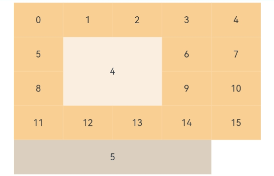

# GridItem

The **GridItem** component provides a single item in a grid.

>  **NOTE**
>
>  * This component is supported since API version 7. Updates will be marked with a superscript to indicate their earliest API version.
>  * This component can be used only as a child of [Grid](ts-container-grid.md).
>  * When this component is used with **LazyForEach**, its child components are created when it is created. When this component is used with **if/else** or **ForEach**, or when the parent component is **Grid**, its child components are created when it is laid out.


## Child Components

This component can contain a single child component.

## APIs

GridItem(value?: GridItemOptions)

**Atomic service API**: This API can be used in atomic services since API version 11.

**System capability**: SystemCapability.ArkUI.ArkUI.Full

**Parameters**

| Name| Type                                     | Mandatory| Description                                                    |
| ------ | --------------------------------------------- | ---- | ------------------------------------------------------------ |
| value<sup>11+</sup>  | [GridItemOptions](#griditemoptions11) | No  | Parameters of the grid item, containing the **style** parameter of the [GridItemStyle](#griditemstyle11) enum type.|

## Attributes

### rowStart

rowStart(value: number)

Sets the start row number of the component.

**Atomic service API**: This API can be used in atomic services since API version 11.

**System capability**: SystemCapability.ArkUI.ArkUI.Full

**Parameters**

| Name| Type  | Mandatory| Description              |
| ------ | ------ | ---- | ------------------ |
| value  | number | Yes  | Start row number of the component.<br>In situations where you need to designate the start row and column numbers as well as the number of rows and columns a grid item spans, you are advised to use the [layoutOptions parameter](ts-container-grid.md#gridlayoutoptions10) of the **Grid** component. For reference, see [Grid Example 1](ts-container-grid.md#example-1) and [Grid Example 3](ts-container-grid.md#example-3).|

### rowEnd

rowEnd(value: number)

Sets the end row number of the component.

**Atomic service API**: This API can be used in atomic services since API version 11.

**System capability**: SystemCapability.ArkUI.ArkUI.Full

**Parameters**

| Name| Type  | Mandatory| Description              |
| ------ | ------ | ---- | ------------------ |
| value  | number | Yes  | End row number of the component.<br>In situations where you need to designate the start row and column numbers as well as the number of rows and columns a grid item spans, you are advised to use the [layoutOptions parameter](ts-container-grid.md#gridlayoutoptions10) of the **Grid** component. For reference, see [Grid Example 1](ts-container-grid.md#example-1) and [Grid Example 3](ts-container-grid.md#example-3).|

### columnStart

columnStart(value: number)

Sets the start column number of the component.

**Atomic service API**: This API can be used in atomic services since API version 11.

**System capability**: SystemCapability.ArkUI.ArkUI.Full

**Parameters**

| Name| Type  | Mandatory| Description              |
| ------ | ------ | ---- | ------------------ |
| value  | number | Yes  | Start column number of the component.<br>In situations where you need to designate the start row and column numbers as well as the number of rows and columns a grid item spans, you are advised to use the [layoutOptions parameter](ts-container-grid.md#gridlayoutoptions10) of the **Grid** component. For reference, see [Grid Example 1](ts-container-grid.md#example-1) and [Grid Example 3](ts-container-grid.md#example-3).|

### columnEnd

columnEnd(value: number)

Sets the end column number of the component.

**Atomic service API**: This API can be used in atomic services since API version 11.

**System capability**: SystemCapability.ArkUI.ArkUI.Full

**Parameters**

| Name| Type  | Mandatory| Description              |
| ------ | ------ | ---- | ------------------ |
| value  | number | Yes  | End column number of the component.<br>In situations where you need to designate the start row and column numbers as well as the number of rows and columns a grid item spans, you are advised to use the [layoutOptions parameter](ts-container-grid.md#gridlayoutoptions10) of the **Grid** component. For reference, see [Grid Example 1](ts-container-grid.md#example-1) and [Grid Example 3](ts-container-grid.md#example-3).|

>  **NOTE**
>
>  In situations where you need to designate the start row and column numbers as well as the number of rows and columns a grid item spans, you are advised to use the [layoutOptions parameter](ts-container-grid.md#gridlayoutoptions10) of the **Grid** component. For reference, see [Grid Example 1](ts-container-grid.md#example-1) and [Grid Example 3](ts-container-grid.md#example-3).
>
>  Rules for setting **rowStart**, **rowEnd**, **columnStart**, and **columnEnd**:
>
>  The valid value range of **rowStart** and **rowEnd** is 0 to the total number of rows minus 1. The valid value range of **columnStart** and **columnEnd** is 0 to the total number of columns minus 1.
>
>  If **rowStart**, **rowEnd**, **columnStart**, or **columnEnd** is set, the grid item occupies the specified number of rows (**rowEnd** - **rowStart** + 1) or columns (**columnEnd** - **columnStart** + 1).
>
>  Settings outside of the valid ranges do not take effect.
>
>  In the grid that has both **columnTemplate** and **rowTemplate** set, grid items that have **rowStart**/**rowEnd** or **columnStart**/**columnEnd** set are laid out in a row-by-row then column-by-column manner.
>
>  In the grid that has only **columnTemplate** set, grid items that have **columnStart**/**columnEnd** set are laid out in the specific columns. If there are already grid items in those columns, the grid items will be laid out in another row.
>
>  In the grid that has only **rowTemplate** set, grid items that have **rowStart**/**rowEnd** set are laid out in the specific rows. If there are already grid items in those rows, the grid items will be laid out in another column.
>
>  In the grid that has only **columnTemplate** set, grid items whose row or column number settings are invalid are laid out in a row-by-row then column-by-column manner.
>
>  In the grid that has neither **columnTemplate** nor **rowTemplate** set, the row and column number attributes do not work.

### forceRebuild<sup>(deprecated)</sup>

forceRebuild(value: boolean)

Whether to re-create the component when it is being built. Whether to re-create the component is automatically determined based on the component attributes and child component changes. No manual configuration is required.

This API is deprecated since API version 9.

**System capability**: SystemCapability.ArkUI.ArkUI.Full

**Parameters**

| Name| Type   | Mandatory| Description                                                   |
| ------ | ------- | ---- | ------------------------------------------------------- |
| value  | boolean | Yes  | Sets whether to re-create the component when it is being built.<br>Default value: **false**|

### selectable<sup>8+</sup>

selectable(value: boolean)

Sets whether the grid item is selectable in the mouse selection box area. This attribute takes effect only when mouse box selection is enabled for the parent **Grid** container.

This attribute must be used before the [style for the selected state](./ts-universal-attributes-polymorphic-style.md#statestyles) is set.

**Atomic service API**: This API can be used in atomic services since API version 11.

**System capability**: SystemCapability.ArkUI.ArkUI.Full

**Parameters**

| Name| Type   | Mandatory| Description                                                 |
| ------ | ------- | ---- | ----------------------------------------------------- |
| value  | boolean | Yes  | Whether the grid item is selectable in the mouse selection box area.<br>Default value: **true**|

### selected<sup>10+</sup>

selected(value: boolean)

Sets whether the grid item is selected. This attribute supports two-way binding through [$$](../../../quick-start/arkts-two-way-sync.md).

This attribute must be used before the [style for the selected state](./ts-universal-attributes-polymorphic-style.md#statestyles) is set.

**Atomic service API**: This API can be used in atomic services since API version 11.

**System capability**: SystemCapability.ArkUI.ArkUI.Full

**Parameters**

| Name| Type   | Mandatory| Description                                    |
| ------ | ------- | ---- | ---------------------------------------- |
| value  | boolean | Yes  | Whether the grid item is selected.<br>Default value: **false**|

## GridItemOptions<sup>11+</sup>

**Atomic service API**: This API can be used in atomic services since API version 12.

**System capability**: SystemCapability.ArkUI.ArkUI.Full

| Name | Type                 | Mandatory| Description                        |
| ----- | -------------------- | ---- | ---------------------------- |
| style | [GridItemStyle](#griditemstyle11) | No  | Style of the grid item.<br>Default value: **GridItemStyle.NONE**<br>If this parameter is set to **GridItemStyle.NONE**, no style is applied.<br>If this parameter is set to **GridItemStyle.PLAIN**, the grid item is in hover or press style depending on the state.|

## GridItemStyle<sup>11+</sup>

**Atomic service API**: This API can be used in atomic services since API version 12.

**System capability**: SystemCapability.ArkUI.ArkUI.Full

| Name |Value| Description                  |
| ----- |----| ------------------------ |
| NONE  |  0 | No style.                |
| PLAIN |  1 | Hover or press style.|

> **NOTE**
>
> To set the focused style for the grid item, the grid container must have paddings of greater than 4 vp for accommodating the focus frame of the grid item.

## Events

### onSelect<sup>8+</sup>

onSelect(event: (isSelected: boolean) =&gt; void)

Triggered when the selected state of the grid item changes.

**Atomic service API**: This API can be used in atomic services since API version 11.

**System capability**: SystemCapability.ArkUI.ArkUI.Full

**Parameters**

| Name    | Type   | Mandatory| Description                                                        |
| ---------- | ------- | ---- | ------------------------------------------------------------ |
| isSelected | boolean | Yes  | Returns **true** if the grid item is selected in the mouse selection box area; returns **false** otherwise.|

## Example

### Example 1

```ts
// xxx.ets
@Entry
@Component
struct GridItemExample {
  @State numbers: string[] = ["0", "1", "2", "3", "4", "5", "6", "7", "8", "9", "10", "11", "12", "13", "14", "15"]

  build() {
    Column() {
      Grid() {
        GridItem() {
          Text('4')
            .fontSize(16)
            .backgroundColor(0xFAEEE0)
            .width('100%')
            .height('100%')
            .textAlign(TextAlign.Center)
        }.rowStart(1).rowEnd(2).columnStart(1).columnEnd(2) // Set valid row and column numbers.

        ForEach(this.numbers, (item: string) => {
          GridItem() {
            Text(item)
              .fontSize(16)
              .backgroundColor(0xF9CF93)
              .width('100%')
              .height('100%')
              .textAlign(TextAlign.Center)
          }
        }, (item: string) => item)

        GridItem() {
          Text('5')
            .fontSize(16)
            .backgroundColor(0xDBD0C0)
            .width('100%')
            .height('100%')
            .textAlign(TextAlign.Center)
        }.columnStart(1).columnEnd(4) // Set only the column numbers. The layout does not start from the first column.
      }
      .columnsTemplate('1fr 1fr 1fr 1fr 1fr')
      .rowsTemplate('1fr 1fr 1fr 1fr 1fr')
      .width('90%').height(300)
    }.width('100%').margin({ top: 5 })
  }
}
```



### Example 2

This example shows how to use **GridItemOptions**.

```ts
// xxx.ets
@Entry
@Component
struct GridItemExample {
  @State numbers: String[] = ['0', '1', '2']

  build() {
    Column({ space: 5 }) {
      Grid() {
        ForEach(this.numbers, (day: string) => {
          ForEach(this.numbers, (day: string) => {
            GridItem({style:GridItemStyle.NONE}) {
              Text(day)
                .fontSize(16)
                .width('100%')
                .height('100%')
                .textAlign(TextAlign.Center)
                .focusable(true)
            }
            .backgroundColor(0xF9CF93)
          }, (day: string) => day)
        }, (day: string) => day)
      }
      .columnsTemplate('1fr 1fr 1fr')
      .rowsTemplate('1fr 1fr')
      .columnsGap(4)
      .rowsGap(4)
      .width('60%')
      .backgroundColor(0xFAEEE0)
      .height(150)
      .padding('4vp')

      Grid() {
        ForEach(this.numbers, (day: string) => {
          ForEach(this.numbers, (day: string) => {
            GridItem({style:GridItemStyle.PLAIN}) {
              Text(day)
                .fontSize(16)
                .width('100%')
                .height('100%')
                .textAlign(TextAlign.Center)
                .focusable(true)
            }
            .backgroundColor(0xF9CF93)
          }, (day: string) => day)
        }, (day: string) => day)
      }
      .columnsTemplate('1fr 1fr 1fr')
      .rowsTemplate('1fr 1fr')
      .columnsGap(4)
      .rowsGap(4)
      .width('60%')
      .backgroundColor(0xFAEEE0)
      .height(150)
      .padding('4vp')
    }.width('100%').margin({ top: 5 })
  }
}
```


