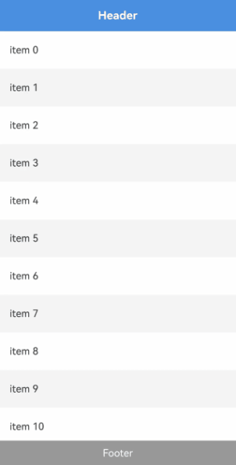

# LazyColumnLayout

<!--Kit: ArkUI-->
<!--Subsystem: ArkUI-->
<!--Owner: @rongShao-Z; @yangcan18-->
<!--Designer: @yangcan18-->
<!--Tester: @leiyuqian-->
<!--Adviser: @Brilliantry_Rui-->
<!-- md-trans-meta sourceCommit=8d874d0ed3e2b14fedac21e9dc0520168c6abc51 translatedAt=2026-08-19T01:40:15.214Z pushedAt=2026-08-19T01:47:33.099Z -->

This component is used to implement a vertical linear layout that supports lazy loading. Its parent component can only be [List](ts-container-list.md), [Scroll](ts-container-scroll.md), [WaterFlow](ts-container-waterflow.md), or [FlowItem](ts-container-flowitem.md). It can also be encapsulated using custom components or [NodeContainer](ts-basic-components-nodecontainer.md) components and then applied to the preceding components.

This component supports the nested lazy-loading containers, including [LazyVGridLayout](ts-container-lazyvgridlayout.md), [LazyVWaterFlowLayout](ts-container-lazyvwaterflowlayout.md), and **LazyColumnLayout** itself.

For more usage scenarios and complete examples of lazy loading layout, see [Creating Lazy Layouts](../../../ui/arkts-layout-development-create-lazy-layout.md).

> **NOTE**
>
> - The **LazyColumnLayout** component's height adapts to content by default. You are advised not to set attributes that fix or constrain the component's vertical dimension. Setting such attributes will cause display exceptions or prevent normal scrolling. The attributes involved include [height](ts-universal-attributes-size.md#height), the **height** in [size](ts-universal-attributes-size.md#size), **minHeight**/**maxHeight** in [constraintSize](ts-universal-attributes-size.md#constraintsize), [aspectRatio](ts-universal-attributes-layout-constraints.md#aspectratio), [layoutWeight](ts-universal-attributes-size.md#layoutweight), and the scenario where [height](ts-universal-attributes-size.md#height15) takes a [LayoutPolicy](ts-universal-attributes-size.md#layoutpolicy15) value.
> - When the parent component sets the main axis dimension, **LazyColumnLayout** performs lazy loading based on the parent component's viewport. When the parent component does not set the main axis dimension, **LazyColumnLayout** is stretched by its content, causing all child components to be loaded and laid out.
> - The conditions for lazy loading support of this component under different parent components are as follows: 1. In the **List** component, the layout direction of **List** must be vertical (that is, the [listDirection](ts-container-list.md#listdirection) attribute is set to **Axis.Vertical**). Using this component in a non-vertical **List** will cause an app crash. When **List** has any one or more of the [lanes](ts-container-list.md#lanes9), [chainAnimation](ts-container-list.md#chainanimation), or [scrollSnapAlign](ts-container-list.md#scrollsnapalign10) attributes set, the lazy loading feature of this component becomes invalid. 2. In the **Scroll** component, the layout direction of **Scroll** must be vertical (that is, the [scrollable](ts-container-scroll.md#scrollable) attribute is set to **ScrollDirection.Vertical**). Using this component in a non-vertical **Scroll** will cause an app crash. 3. In the **WaterFlow** component, the layout direction of **WaterFlow** must be vertical (that is, the [layoutDirection](ts-container-waterflow.md#layoutdirection) attribute is set to **FlexDirection.Column**). Using this component in a non-vertical **WaterFlow** will cause an app crash. When **WaterFlow** is in multi-column mode or the layout direction is **FlexDirection.Row** or **FlexDirection.RowReverse**, the lazy loading feature of this component becomes invalid. In addition, using this component in a **WaterFlow** with the layout direction set to **FlexDirection.ColumnReverse** will cause display exceptions.
> - When lazy loading takes effect, this component loads only the child components within the parent component's viewport, and preloads content of half a screen above and below the viewport during idle time between frames.
> - The parent component here refers to the nearest upper-level scrollable component of the current component. For the specific meaning in other documents, refer to the corresponding content.

**Since:** 26.0.0

## Modules to Import

```ts
import { LazyColumnLayout } from '@kit.ArkUI';
```

## APIs

LazyColumnLayout()

Creates a vertical lazy-loading linear layout container.

**Since:** 26.0.0

**Atomic service API:** This API can be used in atomic services since API version 26.0.0.

**Model restriction:** This API can be used only in the stage model.

**System capability**: SystemCapability.ArkUI.ArkUI.Full

## Attributes

In addition to the [universal attributes](ts-component-general-attributes.md), the following attributes are supported.

### space

space(space: LengthMetrics | undefined)

Sets the vertical spacing between child components. If this attribute is not set, the default spacing is **0vp**.

**Since:** 26.0.0

**Atomic service API:** This API can be used in atomic services since API version 26.0.0.

**Model restriction:** This API can be used only in the stage model.

**System capability**: SystemCapability.ArkUI.ArkUI.Full

**Parameters**

| Name| Type                        | Mandatory| Description                        |
| ------ | ---------------------------- | ---- | ---------------------------- |
| space  |  [LengthMetrics](../js-apis-arkui-graphics.md#lengthmetrics12) \| undefined | Yes   | Spacing between child components in the vertical direction.<br/>Value range: [0, +∞)<br/>If set to a value less than 0, **0vp** is used.<br/>If the method parameter is **undefined**, the value is restored to **0vp**. |

### alignItems

alignItems(value: HorizontalAlign | undefined)

Sets the alignment mode of the child components in the horizontal direction. If this API is not called, the default alignment mode is **HorizontalAlign.Center**.

**Since:** 26.0.0

**Atomic service API:** This API can be used in atomic services since API version 26.0.0.

**Model restriction:** This API can be used only in the stage model.

**System capability**: SystemCapability.ArkUI.ArkUI.Full

**Parameters**

| Name| Type                                                   | Mandatory| Description                                                        |
| ------ | ------------------------------------------------------- | ---- | ------------------------------------------------------------ |
| value  | [HorizontalAlign](ts-appendix-enums.md#horizontalalign) \| undefined | Yes  | Alignment mode of child components in the horizontal direction.<br>If the input parameter is **undefined**, **HorizontalAlign.Center** is used.|

### header

header(builder: CustomBuilder | undefined)

Sets the header component of the current **LazyColumnLayout**. If not set through this API, no header component is set by default.

> **NOTE**
>
> The header component is located at the top area of the container and is typically used to display titles, group descriptions, or other elements fixed before the content.
>
> When this component scrolls with the scrollable container into the viewport and the header stick-to-top mode is set through [sticky](#sticky), the header sticks to the top of the scrollable container's viewport.

**Since:** 26.0.0

**Atomic service API:** This API can be used in atomic services since API version 26.0.0.

**Model restriction:** This API can be used only in the stage model.

**System capability**: SystemCapability.ArkUI.ArkUI.Full

**Parameters**

| Name | Type | Mandatory | Description |
| ------ | -------------------------------------------------------- | ---- | ------------------------------------------------------------ |
| builder | [CustomBuilder](ts-types.md#custombuilder8) \| undefined | Yes | Constructor of the header component.<br/>When the method parameter is **undefined**, the current **LazyColumnLayout** does not set a header component. If a header component already exists, it is removed. |

### footer

footer(builder: CustomBuilder | undefined)

Sets the footer component of the current **LazyColumnLayout**. If not set through this API, no footer component is set by default.

> **NOTE**
>
> The footer component is located at the bottom area of the container and is typically used to display supplementary information, loading status, or other elements fixed after the content.
>
> When this component scrolls with the scrollable container into the viewport and the footer stick-to-bottom mode is set through [sticky](#sticky), the footer sticks to the bottom of the scrollable container's viewport.

**Since:** 26.0.0

**Atomic service API:** This API can be used in atomic services since API version 26.0.0.

**Model restriction:** This API can be used only in the stage model.

**System capability**: SystemCapability.ArkUI.ArkUI.Full

**Parameters**

| Name | Type | Mandatory | Description |
| ------ | -------------------------------------------------------- | ---- | ------------------------------------------------------------ |
| builder | [CustomBuilder](ts-types.md#custombuilder8) \| undefined | Yes | Constructor of the footer component.<br/>When the method parameter is **undefined**, the current **LazyColumnLayout** does not set a footer component. If a footer component already exists, it is removed. |

### sticky

sticky(sticky: StickyStyle | undefined)

Sets the sticky style for [header](#header) and [footer](#footer).

When this component scrolls with the scrollable container into the viewport and the header stick-to-top or footer stick-to-bottom mode is set through **sticky**, the header sticks to the top of the scrollable container's viewport, and the footer sticks to the bottom of the scrollable container's viewport.

> **NOTE**
>
> Due to floating-point calculation precision, after setting **sticky**, a small gap may occasionally appear during scrolling. This issue can be resolved by using [pixelRound](ts-universal-attributes-pixelRoundForComponent.md#pixelround) to round the current component's pixels downward.

**Since:** 26.0.0

**Atomic service API:** This API can be used in atomic services since API version 26.0.0.

**Model restriction:** This API can be used only in the stage model.

**System capability**: SystemCapability.ArkUI.ArkUI.Full

**Parameters**

| Name | Type | Mandatory | Description |
| ------ | ----------------------------------------------------------------- | ---- | ------------------------------------------------------------ |
| sticky | [StickyStyle](ts-container-list.md#stickystyle9) \| undefined | Yes | Sticky mode of the header component and footer component. The **sticky** attribute can be set to **StickyStyle.Header** or **StickyStyle.Footer**, or to **StickyStyle.BOTH** to support both header stick-to-top and footer stick-to-bottom.<br/>When the method parameter is **undefined**, the default value **StickyStyle.None** is restored.<br/>When not set through this API, the header component does not stick to the top and the footer component does not stick to the bottom by default. |

## Events

In addition to the [universal events](ts-component-general-events.md), the following events are supported.

### onVisibleIndexesChange

onVisibleIndexesChange(callback: OnVisibleIndexesChangeCallback | undefined)

Triggered when the index of a child component in the viewport of **LazyColumnLayout** changes. It returns the start index and end index of the child components in the viewport. If not set through this API, the viewport index change is not monitored by default.

> **NOTE**
>
> When the parent component sets the main axis dimension and lazy loading takes effect, **LazyColumnLayout** performs lazy loading based on the parent component's viewport. In this case, in the **onVisibleIndexesChange** callback, **start** returns the index of the child component at the start position of the current viewport, and **end** returns the index of the child component at the end position of the current viewport.
>
> When the parent component does not set the main axis dimension, **LazyColumnLayout** is stretched by its content, causing all child components to be loaded and laid out. In this case, in the **onVisibleIndexesChange** callback, **start** returns **0**, and **end** returns the index of the last child component in the data source.
>
> The parent component here refers to the nearest upper-level scrollable component of the current component. For the specific meaning in other documents, refer to the corresponding content.

**Since:** 26.0.0

**Atomic service API:** This API can be used in atomic services since API version 26.0.0.

**Model restriction:** This API can be used only in the stage model.

**System capability**: SystemCapability.ArkUI.ArkUI.Full

**Parameters**

| Name| Type  | Mandatory| Description                                 |
| ------ | ------ | ---- | ------------------------------------- |
| callback  | [OnVisibleIndexesChangeCallback](ts-container-scrollable-common.md#onvisibleindexeschangecallback) \| undefined | Yes   | Callback invoked when the start and end index values of child components in the viewport change.<br/>If the method parameter is **undefined**, the listening is canceled. |

## Examples

### Example 1: Implementing Lazy-Loading Linear Layout

This example demonstrates how to use the [Scroll](ts-container-scroll.md) and **LazyColumnLayout** components to implement lazy-loading linear layout, and how to use [onVisibleIndexesChange](#onvisibleindexeschange) to return the start and end indexes when the viewport changes.

Since API version 26.0.0, the **LazyColumnLayout** component and the **onVisibleIndexesChange** event are supported.

```ts
import { LengthMetrics, LazyColumnLayout, LazyColumnLayoutAttribute } from '@kit.ArkUI';

// Following list data structure.
class Follow {
  name: string;
  image: Resource;
  description: string;

  constructor(name: string, image: Resource, description: string) {
    this.name = name;
    this.image = image;
    this.description = description;
  }
}

// Recommended list data structure.
class Recommend {
  name: string;
  icon: Resource;
  description: string;

  constructor(name: string, icon: Resource, description: string) {
    this.name = name;
    this.icon = icon;
    this.description = description;
  }
}

@Entry
@Component
struct LazyColumnLayoutSample1 {
  private followList: Follow[] = [
    new Follow('Alice', $r('app.media.icon'), 'Sharing is happiness!'), // $r('app.media.icon') needs to be replaced with the required image resource file.
    new Follow('Bob', $r('app.media.icon'), 'Photography enthusiast'),
    new Follow('Carol', $r('app.media.icon'), 'Sports make me happy'),
    new Follow('Dave', $r('app.media.icon'), 'Exploring unknown tech...'),
    // ...
  ]
  // Convert followList into an array of two elements each.
  private followPairs: Follow[][] = []
  private recommend: Recommend[] = [
    new Recommend('Emma', $r('sys.symbol.person_crop_circle_fill'), 'Feeling pretty good today...'),
    new Recommend('Frank', $r('sys.symbol.person_crop_circle_fill'), 'Reading at a cafe...'),
    new Recommend('Grace', $r('sys.symbol.person_crop_circle_fill'), 'Let's go hiking this weekend!'),
    new Recommend('Henry', $r('sys.symbol.person_crop_circle_fill'), 'Just finish a 5K run'),
    new Recommend('Ivy', $r('sys.symbol.person_crop_circle_fill'), 'Learned a new recipe'),
    new Recommend('John', $r('sys.symbol.person_crop_circle_fill'), 'Finally launched the project'),
    new Recommend('Kate', $r('sys.symbol.person_crop_circle_fill'), 'Listening to an old song...'),
    new Recommend('Leo', $r('sys.symbol.person_crop_circle_fill'), 'Ready to go on a trip'),
    new Recommend('Mike', $r('sys.symbol.person_crop_circle_fill'), 'What a beautiful day!'),
    new Recommend('Nina', $r('sys.symbol.person_crop_circle_fill'), 'Working overtime. Please do not disturb.'),
    new Recommend('Oscar', $r('sys.symbol.person_crop_circle_fill'), 'Got a little kitten'),
    new Recommend('Paul', $r('sys.symbol.person_crop_circle_fill'), 'Playing basketball.'),
    // ...
  ]

  private itemColor(index: number): string {
    const colors: string[] = ['#FFE0B2', '#C8E6C9', '#BBDEFB', '#F8BBD0']
    return colors[index % colors.length]
  }

  aboutToAppear() {
    for (let i = 0; i < this.followList.length; i += 2) {
      this.followPairs.push(this.followList.slice(i, i + 2))
    }
  }

  build() {
    Column() {
      Scroll() {
        LazyColumnLayout() {
          Text('Following:')

          // Nest LazyColumnLayout to display a two-column following list.
          LazyColumnLayout() {
            ForEach(this.followPairs, (pair: Follow[], rowIndex: number) => {
              Row({ space: 12 }) {
                ForEach(pair, (item: Follow, colIndex: number) => {
                  Column() {
                    Image(item.image).height(96).width('100%').backgroundColor(this.itemColor(rowIndex * 2 + colIndex))
                    Text(item.name).fontSize(20).margin({ top: 8 })
                    Text(item.description).fontSize(16).fontColor(Color.Gray).margin({ top: 2 })
                  }
                  .alignItems(HorizontalAlign.Start)
                  .layoutWeight(1)
                }, (item: Follow) => JSON.stringify(item))
              }
              .width('100%')
            })
          }
          .space(LengthMetrics.vp(12))

          Divider().height(2)

          Text ('Recommended:')

          // Use an independent LazyColumnLayout to display the recommended list.
          LazyColumnLayout() {
            ForEach(this.recommend, (item: Recommend, index: number) => {
              Row() {
                SymbolGlyph(item.icon).fontSize(36).fontColor([Color.Gray])
                Column() {
                  Text(item.name).fontSize(20)
                  Text(item.description).fontSize(16).fontColor(Color.Gray).margin({ top: 2 })
                }
                .margin({ left: 12 })
                .alignItems(HorizontalAlign.Start)

                Blank()
                SymbolGlyph($r('sys.symbol.chevron_forward')).fontSize(20).fontColor([Color.Gray])
              }
              .width('100%')
            }, (item: Recommend) => JSON.stringify(item))
          }
          .space(LengthMetrics.vp(12))
          .onVisibleIndexesChange((start: number, end: number) => {
            console.info('LazyColumnLayout visible indexes: start: ' + start + ', end: ' + end);
          })
        }
        .padding({ left: 24, right: 24 })
        .space(LengthMetrics.vp(12))
        .alignItems(HorizontalAlign.Start)
      }
      .layoutWeight(1)
    }
    .width('100%')
    .height('100%')
  }
}
```


### Example 2: Setting Header or Footer Components and Sticky Styles

This example nests **LazyColumnLayout** in [Scroll](ts-container-scroll.md) and implements top and bottom sticky styles through [header](#header), [footer](#footer), and [sticky](#sticky). During scrolling, the header sticks to the top of the viewport and the footer sticks to the bottom of the viewport.

Since API version 26.0.0, the **header**, **footer**, and **sticky** attributes are supported.

<!--code_no_check-->

```ts
import { LazyColumnLayout, LazyColumnLayoutAttribute } from '@kit.ArkUI';
// MyDataSource is a custom data source class that implements the IDataSource API required by LazyForEach.
import { MyDataSource } from './MyDataSource';

@Entry
@Component
struct LazyColumnLayoutStickyDemo {
  private items: MyDataSource<number> = new MyDataSource<number>();

  aboutToAppear(): void {
    for (let i = 0; i < 30; i++) {
      this.items.pushData(i);
    }
  }

  // Build the header component.
  @Builder
  HeaderBuilder() {
    Row() {
      Text('Header')
        .fontSize(18)
        .fontColor(Color.White)
        .fontWeight(FontWeight.Bold)
    }
    .width('100%')
    .height(50)
    .justifyContent(FlexAlign.Center)
    .alignItems(VerticalAlign.Center)
    .backgroundColor('#4A90E2')
  }

  @Builder
  FooterBuilder() {
    Row() {
      Text('Footer')
        .fontSize(16)
        .fontColor(Color.White)
    }
    .width('100%')
    .height(40)
    .justifyContent(FlexAlign.Center)
    .alignItems(VerticalAlign.Center)
    .backgroundColor('#999999')
  }

  build() {
    Scroll() {
      LazyColumnLayout() {
        LazyForEach(this.items, (item: number) => {
          Text('item ' + item)
            .fontSize(16)
            .height(60)
            .width('100%')
            .padding({ left: 16 })
            .backgroundColor(item % 2 === 0 ? '#FFFFFF' : '#F5F5F5')
            .textAlign(TextAlign.Start)
        })
      }
      .header(this.HeaderBuilder)
      .footer(this.FooterBuilder)
      // Set the header and footer to stick simultaneously.
      .sticky(StickyStyle.BOTH)
    }
    .width('100%')
    .height('100%')
    .edgeEffect(EdgeEffect.Spring)
  }
}
```

<!--code_no_check-->

```ts
// MyDataSource.ets
export class BasicDataSource<T> implements IDataSource {
  private listeners: DataChangeListener[] = [];
  protected dataArray: T[] = [];

  public totalCount(): number {
    return this.dataArray.length;
  }

  public getData(index: number): T {
    return this.dataArray[index];
  }

  registerDataChangeListener(listener: DataChangeListener): void {
    if (this.listeners.indexOf(listener) < 0) {
      console.info('add listener');
      this.listeners.push(listener);
    }
  }

  unregisterDataChangeListener(listener: DataChangeListener): void {
    const pos = this.listeners.indexOf(listener);
    if (pos >= 0) {
      console.info('remove listener');
      this.listeners.splice(pos, 1);
    }
  }

  notifyDataReload(): void {
    this.listeners.forEach(listener => {
      listener.onDataReloaded();
    })
  }

  notifyDataAdd(index: number): void {
    this.listeners.forEach(listener => {
      listener.onDataAdd(index);
    })
  }

  notifyDataChange(index: number): void {
    this.listeners.forEach(listener => {
      listener.onDataChange(index);
    })
  }

  notifyDataDelete(index: number): void {
    this.listeners.forEach(listener => {
      listener.onDataDelete(index);
    })
  }

  notifyDataMove(from: number, to: number): void {
    this.listeners.forEach(listener => {
      listener.onDataMove(from, to);
    })
  }

  notifyDatasetChange(operations: DataOperation[]): void {
    this.listeners.forEach(listener => {
      listener.onDatasetChange(operations);
    })
  }
}

export class MyDataSource<T> extends BasicDataSource<T> {
  public shiftData(): void {
    this.dataArray.shift();
    this.notifyDataDelete(0);
  }
  public unshiftData(data: T): void {
    this.dataArray.unshift(data);
    this.notifyDataAdd(0);
  }
  public pushData(data: T): void {
    this.dataArray.push(data);
    this.notifyDataAdd(this.dataArray.length - 1);
  }

  public popData(): void {
    this.dataArray.pop();
    this.notifyDataDelete(this.dataArray.length);
  }

  public clearData(): void {
    this.dataArray = [];
    this.notifyDataReload();
  }
}
```

