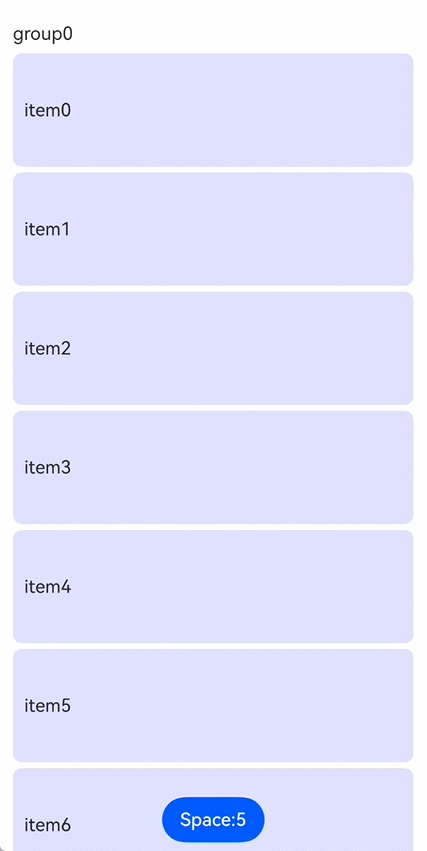

# LazyDynamicLayout

<!--Kit: ArkUI-->
<!--Subsystem: ArkUI-->
<!--Owner: @rongShao-Z; @guozejun-->
<!--Designer: @yangcan18-->
<!--Tester: @leiyuqian-->
<!--Adviser: @Brilliantry_Rui-->
<!-- md-trans-meta sourceCommit=b6f38d021a31abc28b1dd271b68098ebc074e7ab translatedAt=2026-08-04T12:10:18.804Z pushedAt=2026-08-07T06:50:09.239Z -->

This component implements a dynamic layout container that supports lazy loading and allows developers to customize the layout algorithm. It is suitable for scenarios where a large number of child components need to be displayed in a scrollable component. By loading and laying out only the child components within the visible area on demand, it reduces the first frame rendering time and memory overhead.

The parent components supported by this component include [List](ts-container-list.md), [WaterFlow](ts-container-waterflow.md), [FlowItem](ts-container-flowitem.md), [Scroll](ts-container-scroll.md), and [LazyColumnLayout](ts-container-lazycolumnlayout.md). It also supports being wrapped in a custom component or [NodeContainer](ts-basic-components-nodecontainer.md) and then used in the above components.

> **NOTE**
>
> - This module's APIs can only be used in the stage model.
>
> - The lazy loading support conditions for this component under different parent components are as follows:
>   1. Under the **WaterFlow** component, lazy loading is supported only when **WaterFlow** is in single-column mode or in a single-column segment within a segmented layout.
>   2. Under the **List** component, when [lanes](ts-container-list.md#lanes9) is greater than **1**, [chainAnimation](ts-container-list.md#chainanimation) is set to **true**, or [scrollSnapAlign](ts-container-list.md#scrollsnapalign10) is set to a value other than **ScrollSnapAlign.NONE**, **List** does not use the nested lazy loading measurement process. In this case, this component is measured as a regular child item, and the lazy loading feature becomes ineffective.
>   3. When used under the **Scroll**, **List**, or **WaterFlow** component, the scroll direction (horizontal or vertical) of **Scroll**, **List**, or **WaterFlow** must be the same as the layout direction of this component. If the layout directions differ, the app will crash.
> - When wrapped in **FlowItem**, **LazyColumnLayout**, a custom component, or **NodeContainer**, the framework searches upward along the parent component chain for a **Scroll**, **List**, or **WaterFlow** component that matches the layout direction of this component. The lazy loading support conditions are determined based on the upper-level scrollable component found.

**Since:** 26.0.0

## Child Components

Child components are supported.

## APIs

LazyDynamicLayout(algorithm: LazyLayoutAlgorithm)  

Defines a lazy-loading dynamic layout container.

**Since:** 26.0.0

**Model restriction:** This API can be used only in the stage model.

**Atomic service API:** This API can be used in atomic services since API version 26.0.0.

**System capability**: SystemCapability.ArkUI.ArkUI.Full

**Parameters**

| Name | Type | Mandatory | Description |
| ---- | ---- | ---- | ---- |
| algorithm | [LazyLayoutAlgorithm](../js-apis-arkui-lazyLayoutAlgorithm.md#lazylayoutalgorithm-1) | Yes | Layout algorithm for the lazy-loading dynamic layout component. An instance of the **LazyLayoutAlgorithm** type must be passed in. You can customize the measurement and layout logic by inheriting [LazyCustomLayoutAlgorithm](../js-apis-arkui-lazyLayoutAlgorithm.md#lazycustomlayoutalgorithm). When obtaining child components or the total number of child components in a custom algorithm, use [ExpandMode.LAZY_NOT_EXPAND](../js-apis-arkui-frameNode.md#expandmode15) and [ChildrenCountMode.ALL_NOT_EXPAND](../js-apis-arkui-frameNode.md#childrencountmode) respectively to prevent full loading from disabling lazy loading. |

## Attributes

The [universal attributes](ts-component-general-attributes.md) are supported.

> **NOTE**
>
> When the layout algorithm is [LazyCustomLayoutAlgorithm](../js-apis-arkui-lazyLayoutAlgorithm.md#lazycustomlayoutalgorithm), the [setMeasuredSize](../js-apis-arkui-frameNode.md#setmeasuredsize12) method of the **LazyDynamicLayout** component's [FrameNode](../js-apis-arkui-frameNode.md#framenode-1) takes precedence over the [size](ts-universal-attributes-size.md) and [border](ts-universal-attributes-border.md) attributes, and the [measure](../js-apis-arkui-frameNode.md#measure12) and [layout](../js-apis-arkui-frameNode.md#layout12) methods of the child component's [FrameNode](../js-apis-arkui-frameNode.md#framenode-1) take precedence over the [ignoreLayoutSafeArea](ts-universal-attributes-expand-safe-area.md#ignorelayoutsafearea20) attribute. After the custom algorithm completes measurement or layout, the framework no longer executes the default measurement or layout process, but instead adopts the size and position set by the custom algorithm.

## Events

The [universal events](ts-component-general-events.md) are supported.

### onVisibleIndexesChange

onVisibleIndexesChange(callback: [Callback](ts-types.md#callback12)&lt;number[]&gt; | undefined)

Sets the **onVisibleIndexesChange** callback. This callback is triggered when the list of child component indexes in the visible area of **LazyDynamicLayout** changes, and returns the list of child component indexes in the visible area.

**Since:** 26.0.0

**Model restriction:** This API can be used only in the stage model.

**Atomic service API:** This API can be used in atomic services since API version 26.0.0.

**System capability**: SystemCapability.ArkUI.ArkUI.Full

**Parameters**

| Name | Type | Mandatory | Description |
| ------ | ------ | ---- | -------------------------- |
| callback | [Callback](ts-types.md#callback12)&lt;number[]&gt;&nbsp;\|&nbsp;undefined | Yes | Callback triggered when the list of child component indexes in the visible area of **LazyDynamicLayout** changes. Returns the list of child component indexes in the visible area. When the input parameter is **undefined**, the listener is canceled. |

## Example

### Example 1: Implementing Lazy-Loading Custom Layout

A custom lazy-loading list layout is implemented through the [List](ts-container-list.md) and **LazyDynamicLayout** components, and the index is called back through [onVisibleIndexesChange](#onvisibleindexeschange) when the visible area changes.

**LazyListLayout** implements a custom lazy loading list layout algorithm. In the layout algorithm, the [setAdjustedOffset](../js-apis-arkui-lazyLayoutAlgorithm.md#setadjustedoffset) API is used to ensure that the position of the first child component in the visible area remains unchanged when the spacing between child components changes.

**MyDataSource** implements the [LazyForEach](ts-rendering-control-lazyforeach.md) data source API [IDataSource](ts-rendering-control-lazyforeach.md#idatasource), which is used to provide child components to **LazyDynamicLayout** through **LazyForEach**.

The **LazyDynamicLayout** component is added since API version 26.0.0.

```ts
import { LazyDynamicLayout, LazyDynamicLayoutAttribute } from '@kit.ArkUI';
import { MyDataSource } from './MyDataSource';
import { LazyListLayout } from './LazyListLayout';

// Custom lazy-loading list layout component.
@Component
struct MyLazyListLayout {
  // Spacing size. Use @Watch to monitor changes, triggering the onSpaceChange method when changed.
  @Prop @Watch('onSpaceChange') space: number;
  arr: MyDataSource<string> = new MyDataSource<string>();
  private itemHeight: number = 100;
  // Lazy layout algorithm instance. Convert the height to pixel units.
  private lazyAlgorithm: LazyListLayout = new LazyListLayout(this.getUIContext().vp2px(this.itemHeight));

  // Update the spacing value in the layout algorithm when the spacing changes.
  onSpaceChange(): void {
    this.lazyAlgorithm.setSpace(this.getUIContext().vp2px(this.space));
  }

  aboutToAppear(): void {
    this.lazyAlgorithm.setSpace(this.getUIContext().vp2px(this.space));
  }

  build() {
    // Use the LazyDynamicLayout component and pass in the lazy layout algorithm.
    LazyDynamicLayout(this.lazyAlgorithm) {
      LazyForEach(this.arr, (item: string) => {
        Text(item)
          .height(this.itemHeight)
          .width('100%')
          .borderRadius(8)
          .backgroundColor('#E0E0FF')
          .padding(10)
      })
    }
    // Listen for changes in the indexes of child components in the visible area.
    .onVisibleIndexesChange((child: number[]) => {
      console.info(`onVisibleIndexesChange:start:${child}`);
    })
  }
}

// Define the group data interface.
interface GroupData {
  title: string;
  data: MyDataSource<string>;
}

// Main page component.
@Entry
@Component
struct CustomListLayoutTest {
  @State groupArr: GroupData[] = []; // Group data array.
  @State space: number = 5; // List item spacing.

  aboutToAppear(): void {
    for (let i = 0; i < 3; i++) {
      let data = new MyDataSource<string>();
      for (let j = 0; j < 10; j++) {
        data.pushData('item' + j.toString());
      }
      this.groupArr.push({ title: 'group' + i.toString(), data: data });
    }
  }

  build() {
    Stack({ alignContent: Alignment.Bottom }) {
      List() {
        ForEach(this.groupArr, (item: GroupData) => {
          ListItem() {
            Text(item.title).margin({ top: 20, bottom: 8 })
          }
          // Use the custom lazy-loading layout component.
          MyLazyListLayout({ arr: item.data, space: this.space })
        })
      }
      .layoutWeight(1)
      .padding({ left: 12, right: 12 })
      .height('100%')
      .width('100%')

      Button('Space:' + this.space.toString())
        .onClick(() => {
          // Switch the spacing between 5 and 10, and keep the position of the first child component in the visible area unchanged before and after the switch.
          this.space = this.space === 5 ? 10 : 5;
        })
    }
    .height('100%')
    .width('100%')
  }
}
```

```ts
// LazyListLayout.ets
// Import layout-related interfaces and classes.
import { LayoutConstraint, LazyLayoutHelper, LazyCustomLayoutAlgorithm, ExpandMode, ChildrenCountMode,
  LazyLayoutDirection } from '@kit.ArkUI';

// Custom lazy-loading list layout algorithm, inherited from LazyCustomLayoutAlgorithm.
export class LazyListLayout extends LazyCustomLayoutAlgorithm {
  private itemHeight: number = 320; // Height of each list item (in pixels).
  private totalHeight: number = 0; // Total height of the list.
  private childCnt: number = 0; // Total number of child components.
  private startIndex: number = -1; // Start index of the current visible area.
  private endIndex: number = -1; // End index of the current visible area.
  private space: number = 0; // Current spacing size.
  private prevSpace: number = 0; // Previous spacing value.
  selfNode?: FrameNode; // Reference to the own FrameNode.

  // Constructor that receives the list item height parameter.
  constructor(itemHeight: number) {
    super();
    this.itemHeight = itemHeight;
  }

  // Set the list item spacing.
  setSpace(value: number): void {
    if (this.space == value) {
      return;
    }
    this.prevSpace = this.space;
    this.space = value;
    // Trigger layout recalculation.
    this.selfNode?.setNeedsLayout();
  }

  // Measure child components and calculate the component size.
  onMeasure(self: FrameNode, constraint: LayoutConstraint, helper?: LazyLayoutHelper): void {
    // Obtain the total number of child components. The getChildrenCount API uses ChildrenCountMode.ALL_NOT_EXPAND to avoid full loading of child components when obtaining the total count, which would cause lazy loading to fail.
    this.childCnt = self.getChildrenCount(ChildrenCountMode.ALL_NOT_EXPAND);
    this.selfNode = self;
    // If no lazy loading helper is available, measure all child components.
    if (!helper) {
      this.measureAllChildren(self, constraint);
      self.setMeasuredSize({ width: constraint.maxSize.width, height: this.totalHeight });
      this.prevSpace = this.space;
      return;
    }

    // Obtain the start and end positions of the visible area.
    let viewStart = helper.getViewStart();
    let viewEnd = helper.getViewEnd();
    let prevTotalHeight = this.totalHeight;
    // Calculate the total list height: child component count * (child component height + spacing) - last spacing.
    this.totalHeight = Math.max(this.childCnt * (this.itemHeight + this.space) - this.space, 0);
    // Forward layout (top to bottom).
    if (helper.getLazyLayoutDirection() == LazyLayoutDirection.FORWARD) {
      // If the spacing changes, adjust the offset to keep the position of the first child component in the visible area unchanged.
      if (this.startIndex > 0 && this.startIndex < this.childCnt && this.prevSpace != this.space) {
        let adjustStartOffset = this.startIndex * (this.prevSpace - this.space);
        console.info(`Top setAdjustedOffset:${adjustStartOffset}`);
        helper.setAdjustedOffset(adjustStartOffset);
        viewStart -= adjustStartOffset;
        viewEnd -= adjustStartOffset;
      }
    } else {
      // Reverse layout (bottom to top).
      if (this.endIndex >= 0 && this.endIndex < this.childCnt - 1 && this.prevSpace != this.space) {
        let adjustEndOffset = (this.childCnt - 1 - this.endIndex) * (this.space - this.prevSpace);
        let adjustStartOffset = this.totalHeight - prevTotalHeight - adjustEndOffset;
        console.info(`Bottom setAdjustedOffset:${adjustEndOffset}`);
        helper.setAdjustedOffset(adjustEndOffset);
        viewStart += adjustStartOffset;
        viewEnd += adjustStartOffset;
      } else if (this.totalHeight != prevTotalHeight) {
        let adjustOffset = this.totalHeight - prevTotalHeight;
        viewStart += adjustOffset;
        viewEnd += adjustOffset;
      }
    }
    this.prevSpace = this.space;

    // If the visible area is not within the content range, clear the indexes.
    if (viewStart > this.totalHeight || viewEnd < 0 || this.childCnt == 0) {
      this.startIndex = -1;
      this.endIndex = -1;
      this.totalHeight = Math.max(this.childCnt * (this.itemHeight + this.space) - this.space, 0);
      self.setMeasuredSize({ width: constraint.maxSize.width, height: this.totalHeight });
      return;
    }

    // Calculate the start and end indexes of the visible area.
    let prevStartIndex = this.startIndex;
    let prevEndIndex = this.endIndex;
    this.startIndex = Math.floor(viewStart / (this.itemHeight + this.space));
    this.startIndex = Math.max(this.startIndex, 0);
    this.endIndex = Math.floor(viewEnd / (this.itemHeight + this.space));
    this.endIndex = Math.min(this.endIndex, this.childCnt - 1);

    // Measure child components in the visible area.
    for (let i = this.startIndex; i <= this.endIndex; i++) {
      // Use the ExpandMode.LAZY_NOT_EXPAND parameter when calling getChild to avoid full loading of child components, which would cause lazy loading to fail.
      let child = self.getChild(i, ExpandMode.LAZY_NOT_EXPAND);
      if (child) {
        child.measure(constraint);
      } else {
        console.error(`Get child[${i}] error`);
      }
    }

    // Collect the indexes of child components to be recycled.
    let recycleList: number[] = [];
    // If the start index moves backward, recycle the previous child components.
    if (prevStartIndex < this.startIndex) {
      for (let i = prevStartIndex; i < this.startIndex; i++) {
        recycleList.push(i);
      }
    }
    // If the end index moves forward, recycle the subsequent child components.
    if (prevEndIndex > this.endIndex) {
      for (let i = this.endIndex + 1; i <= prevEndIndex; i++) {
        recycleList.push(i);
      }
    }
    // Set the child components that are no longer visible to the inactive state.
    helper.setChildrenInactive(recycleList);
    // Set the measured size.
    self.setMeasuredSize({ width: constraint.maxSize.width, height: this.totalHeight });
  }

  // Measure all child components (non-lazy loading mode).
  private measureAllChildren(self: FrameNode, constraint: LayoutConstraint): void {
    for (let i = 0; i < this.childCnt; i++) {
      let child = self.getChild(i, ExpandMode.LAZY_NOT_EXPAND);
      if (child) {
        child.measure(constraint);
      } else {
        console.error(`Get child[${i}] error`);
      }
    }

    this.startIndex = 0;
    this.endIndex = this.childCnt - 1;
    this.totalHeight = Math.max(this.childCnt * (this.itemHeight + this.space) - this.space, 0);
  }

  // Layout method that determines the position of each child component.
  onLayout(self: FrameNode): void {
    if (this.childCnt == 0) {
      return;
    }
    // Layout the child components within the visible area.
    for (let i = this.startIndex; i <= this.endIndex; i++) {
      let child = self.getChild(i, ExpandMode.LAZY_NOT_EXPAND);

      child?.layout({ x: 0, y: i * (this.itemHeight + this.space) });
    }
  }
}
```

<!--code_no_check-->

```ts
// MyDataSource.ets
// Basic data source class that implements the IDataSource interface.
export class BasicDataSource<T> implements IDataSource {
  private listeners: DataChangeListener[] = [];
  protected dataArray: T[] = [];

  public totalCount(): number {
    return this.dataArray.length;
  }

  public getData(index: number): T {
    return this.dataArray[index];
  }

  registerDataChangeListener(listener: DataChangeListener): void {
    if (this.listeners.indexOf(listener) < 0) {
      console.info('add listener');
      this.listeners.push(listener);
    }
  }

  unregisterDataChangeListener(listener: DataChangeListener): void {
    const pos = this.listeners.indexOf(listener);
    if (pos >= 0) {
      console.info('remove listener');
      this.listeners.splice(pos, 1);
    }
  }

  notifyDataReload(): void {
    this.listeners.forEach(listener => {
      listener.onDataReloaded();
    });
  }

  notifyDataAdd(index: number): void {
    this.listeners.forEach(listener => {
      listener.onDataAdd(index);
    });
  }

  notifyDataChange(index: number): void {
    this.listeners.forEach(listener => {
      listener.onDataChange(index);
    });
  }

  notifyDataDelete(index: number): void {
    this.listeners.forEach(listener => {
      listener.onDataDelete(index);
    });
  }

  notifyDataMove(from: number, to: number): void {
    this.listeners.forEach(listener => {
      listener.onDataMove(from, to);
    });
  }

  notifyDatasetChange(operations: DataOperation[]): void {
    this.listeners.forEach(listener => {
      listener.onDatasetChange(operations);
    });
  }
}

export class MyDataSource<T> extends BasicDataSource<T> {
  public shiftData(): void {
    this.dataArray.shift();
    this.notifyDataDelete(0);
  }

  public unshiftData(data: T): void {
    this.dataArray.unshift(data);
    this.notifyDataAdd(0);
  }

  public pushData(data: T): void {
    this.dataArray.push(data);
    this.notifyDataAdd(this.dataArray.length - 1);
  }

  public popData(): void {
    if (this.dataArray.length > 0) {
      this.dataArray.pop();
      this.notifyDataDelete(this.dataArray.length);
    }
  }

  public clearData(): void {
    this.dataArray = [];
    this.notifyDataReload();
  }
}
```


<!--no_check-->