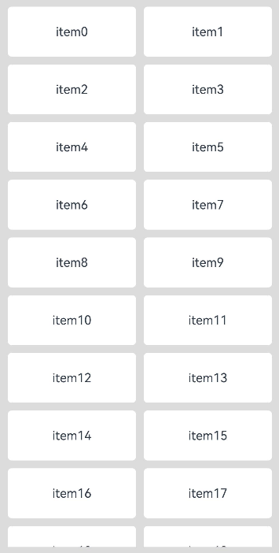

# LazyVGridLayout

The **LazyVGridLayout** component implements a lazy-loading grid layout, with its parent component restricted to [WaterFlow](ts-container-waterflow.md) or [FlowItem](ts-container-flowitem.md). It can also be used within the **WaterFlow** or **FlowItem** component after being wrapped by custom components or [NodeContainer](ts-basic-components-nodecontainer.md).

Lazy loading is supported only when the **WaterFlow** component uses single-column mode or single-column segments in segmented layout and the layout direction is **FlexDirection.Column**. Lazy loading is not supported if the **WaterFlow** component is in multi-column mode or the layout direction is **FlexDirection.Row** or **FlexDirection.RowReverse**. Using this component with **FlexDirection.ColumnReverse** in the **WaterFlow** component causes display anomalies. When lazy loading is enabled, the component only loads child components within the **WaterFlow** visible area, with pre-loading of half-screen content above and below the viewport during frame idle periods.

> **NOTE**
>
> - This component is supported since API version 19. Updates will be marked with a superscript to indicate their earliest API version.
> - This component's height adapts to content by default. Setting the height, height constraints, or aspect ratio causes display anomalies.

## APIs

LazyVGridLayout()

Creates a vertical lazy-loading grid layout container.

**Atomic service API**: This API can be used in atomic services since API version 19.

**System capability**: SystemCapability.ArkUI.ArkUI.Full

## Attributes

In addition to the [universal attributes](ts-component-general-attributes.md), the following attributes are supported.

### columnsTemplate

columnsTemplate(value: string)

Sets the number of columns, fixed column width, or minimum column width of the grid. If this attribute is not set, one column will be used.

For example, **'1fr 1fr 2fr'** indicates three columns, with the first column taking up 1/4 of the parent component's full width, the second column 1/4, and the third column 2/4.

**columnsTemplate('repeat(auto-fit, track-size)')**: The layout automatically calculates the number of columns and the actual column width, while adhering to the minimum column width specified with **track-size**.

**columnsTemplate('repeat(auto-fill, track-size)')**: The layout automatically calculates the number of columns based on the fixed column width specified with **track-size**.

**columnsTemplate('repeat(auto-stretch, track-size)')**: The layout uses **columnsGap** to define the minimum gap between columns and automatically calculates the number of columns and the actual gap size based on the fixed column width specified with **track-size**.

**repeat**, **auto-fit**, **auto-fill**, and **auto-stretch** are keywords. **track-size** indicates the column width, in the unit of px, vp (default), %, or any valid digit. The value must be greater than or equal to one valid column width.<br>
In **auto-stretch** mode, **track-size** must be a valid column width value, in the unit of px, vp, or any valid digit; percentage values (%) are not supported.

If this attribute is set to **'0fr'**, the column width is 0, and child components are not displayed. If this attribute is set to an invalid value, the child components are displayed in a fixed column.

**Atomic service API**: This API can be used in atomic services since API version 19.

**System capability**: SystemCapability.ArkUI.ArkUI.Full

**Parameters**

| Name| Type  | Mandatory| Description                              |
| ------ | ------ | ---- | ---------------------------------- |
| value  | string | Yes  | Number of columns or minimum column width of the grid.|

### columnsGap

columnsGap(value: LengthMetrics): T

Sets the gap between columns. A value less than 0 evaluates to the default value.

**Atomic service API**: This API can be used in atomic services since API version 19.

**System capability**: SystemCapability.ArkUI.ArkUI.Full

**Parameters**

| Name| Type                        | Mandatory| Description                        |
| ------ | ---------------------------- | ---- | ---------------------------- |
| value  |  [LengthMetrics](../js-apis-arkui-graphics.md#lengthmetrics12) | Yes  | Gap between columns.<br>Default value: **0vp**|

**Return value**

| Type| Description          |
| --- | -------------- |
| T | Current component.|

### rowsGap

rowsGap(value: LengthMetrics): T

Sets the gap between rows. A value less than 0 evaluates to the default value.

**Atomic service API**: This API can be used in atomic services since API version 19.

**System capability**: SystemCapability.ArkUI.ArkUI.Full

**Parameters**

| Name| Type                        | Mandatory| Description                        |
| ------ | ---------------------------- | ---- | ---------------------------- |
| value  | [LengthMetrics](../js-apis-arkui-graphics.md#lengthmetrics12) | Yes  | Gap between rows.<br>Default value: **0vp**|

**Return value**

| Type| Description          |
| --- | -------------- |
| T | Current component.|

## Events

Only the [universal events](ts-component-general-events.md) are supported.

## Example

This example demonstrates how to implement a lazy-loading grid layout using the **WaterFlow** and **LazyVGridLayout** components.

<!--code_no_check-->
```ts
import { LengthMetrics } from '@kit.ArkUI'
import { MyDataSource } from './MyDataSource'

@Entry
@Component
struct LazyVGridLayoutSample1 {
  private arr:MyDataSource<number> = new MyDataSource<number>();
  build() {
    Column() {
      WaterFlow() {
        LazyVGridLayout() {
          LazyForEach(this.arr, (item:number)=>{
            Text("item" + item.toString())
              .height(64)
              .width("100%")
              .borderRadius(5)
              .backgroundColor(Color.White)
              .textAlign(TextAlign.Center)
          })
        }
        .columnsTemplate("1fr 1fr")
        .rowsGap(LengthMetrics.vp(10))
        .columnsGap(LengthMetrics.vp(10))
      }.padding(10)
    }
    .width('100%').height('100%')
    .backgroundColor("#DCDCDC")
  }

  aboutToAppear(): void {
    for (let i = 0; i < 100; i++) {
      this.arr.pushData(i);
    }
  }
}
```

<!--code_no_check-->
```ts
// MyDataSource.ets
export class BasicDataSource<T> implements IDataSource {
  private listeners: DataChangeListener[] = [];
  protected dataArray: T[] = [];

  public totalCount(): number {
    return this.dataArray.length;
  }

  public getData(index: number): T {
    return this.dataArray[index];
  }

  registerDataChangeListener(listener: DataChangeListener): void {
    if (this.listeners.indexOf(listener) < 0) {
      console.info('add listener');
      this.listeners.push(listener);
    }
  }

  unregisterDataChangeListener(listener: DataChangeListener): void {
    const pos = this.listeners.indexOf(listener);
    if (pos >= 0) {
      console.info('remove listener');
      this.listeners.splice(pos, 1);
    }
  }

  notifyDataReload(): void {
    this.listeners.forEach(listener => {
      listener.onDataReloaded();
    })
  }

  notifyDataAdd(index: number): void {
    this.listeners.forEach(listener => {
      listener.onDataAdd(index);
    })
  }

  notifyDataChange(index: number): void {
    this.listeners.forEach(listener => {
      listener.onDataChange(index);
    })
  }

  notifyDataDelete(index: number): void {
    this.listeners.forEach(listener => {
      listener.onDataDelete(index);
    })
  }

  notifyDataMove(from: number, to: number): void {
    this.listeners.forEach(listener => {
      listener.onDataMove(from, to);
    })
  }

  notifyDatasetChange(operations: DataOperation[]): void {
    this.listeners.forEach(listener => {
      listener.onDatasetChange(operations);
    })
  }
}

export class MyDataSource<T> extends BasicDataSource<T> {
  public shiftData(): void {
    this.dataArray.shift();
    this.notifyDataDelete(0);
  }
  public unshiftData(data: T): void {
    this.dataArray.unshift(data);
    this.notifyDataAdd(0);
  }
  public pushData(data: T): void {
    this.dataArray.push(data);
    this.notifyDataAdd(this.dataArray.length - 1);
  }
  public popData(): void {
    this.dataArray.pop();
    this.notifyDataDelete(this.dataArray.length);
  }
  public clearData(): void {
    this.dataArray = [];
    this.notifyDataReload();
  }
}
```


