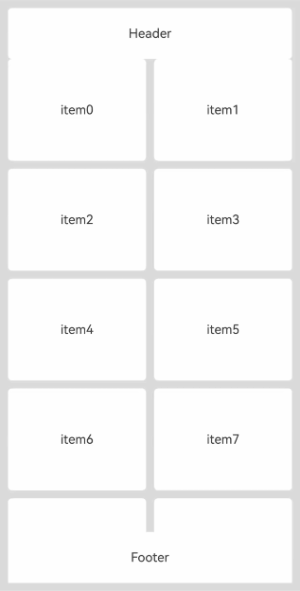

# LazyVGridLayout

<!--Kit: ArkUI-->
<!--Subsystem: ArkUI-->
<!--Owner: @rongShao-Z; @guozejun-->
<!--Designer: @guozejun-->
<!--Tester: @leiyuqian-->
<!--Adviser: @Brilliantry_Rui-->
<!-- md-trans-meta sourceCommit=8d874d0ed3e2b14fedac21e9dc0520168c6abc51 translatedAt=2026-08-18T03:08:03.513Z pushedAt=2026-08-18T07:36:53.658Z -->

This component is used to implement a grid layout that supports lazy loading. It is suitable for scenarios where a large number of grid items need to be rendered on demand in a scroll container, reducing the initial frame rendering time and memory overhead.

In versions earlier than API version 26.0.0, the parent component of the **LazyVGridLayout** component supports the [WaterFlow](ts-container-waterflow.md) and [FlowItem](ts-container-flowitem.md) components. You can also encapsulate the parent component using a custom component or [NodeContainer](ts-basic-components-nodecontainer.md) component and use it in **WaterFlow** or **FlowItem**.

Since API version 26.0.0, the parent component of this component also supports [List](ts-container-list.md), [Scroll](ts-container-scroll.md), or [LazyColumnLayout](ts-container-lazycolumnlayout.md). Additionally, custom components or [NodeContainer](ts-basic-components-nodecontainer.md) components can be encapsulated and then used in **List**, **Scroll**, or **LazyColumnLayout**.

For more usage scenarios and complete examples of lazy loading layout, see [Creating Lazy Layouts](../../../ui/arkts-layout-development-create-lazy-layout.md).

> **NOTE**
>
> - This component is supported since API version 19. Updates will be marked with a superscript to indicate their earliest API version.
>
> - The APIs of this module can be used only in the stage model.
>
> - The height of the **LazyVGridLayout** component adapts to content by default. It is not recommended to set attributes that fix or constrain the vertical dimension of the component, as doing so may cause display exceptions or prevent normal scrolling. The attributes involved include [height](ts-universal-attributes-size.md#height), **height** in [size](ts-universal-attributes-size.md#size), **minHeight**/**maxHeight** in [constraintSize](ts-universal-attributes-size.md#constraintsize), [aspectRatio](ts-universal-attributes-layout-constraints.md#aspectratio), [layoutWeight](ts-universal-attributes-size.md#layoutweight), and scenarios where [height](ts-universal-attributes-size.md#height15) takes a [LayoutPolicy](ts-universal-attributes-size.md#layoutpolicy15) value.
> - When the parent component sets the main axis dimension, **LazyVGridLayout** performs lazy loading based on the visible area of the parent component. When the parent component does not set the main axis dimension, **LazyVGridLayout** is stretched by its content, causing all child components to be loaded and laid out.
> - The conditions for lazy loading support of this component under different parent components are as follows:
>   1. Under the **WaterFlow** component, lazy loading is supported only when **WaterFlow** is in single-column mode or a single-column segment in a segmented layout, and the layout direction [FlexDirection](ts-appendix-enums.md#flexdirection) is set to **FlexDirection.Column**. If this component is used in **WaterFlow**'s multi-column mode or horizontal layout (**FlexDirection.Row** or **FlexDirection.RowReverse**), lazy loading is not supported. In addition, using this component under a **WaterFlow** component with the layout direction set to **FlexDirection.ColumnReverse** will cause display exceptions.
>   2. Under the **List** component, the layout direction of **List** must be vertical (that is, the [listDirection](ts-container-list.md#listdirection) attribute is set to **Axis.Vertical**). Using this component in a non-vertical **List** will cause the app to crash. When **List** has any one or more of the [lanes](ts-container-list.md#lanes9), [chainAnimation](ts-container-list.md#chainanimation), or [scrollSnapAlign](ts-container-list.md#scrollsnapalign10) attributes set, the lazy loading feature of this component becomes ineffective.
>   3. Under the **Scroll** component, the layout direction of **Scroll** must be vertical (that is, the [scrollable](ts-container-scroll.md#scrollable) attribute is set to **ScrollDirection.Vertical**). Using this component in a non-vertical **Scroll** will cause the app to crash.
> - When the lazy loading feature is in effect, this component loads only the child components within the visible area of the parent component, and preloads content half a screen above and below the visible area during idle time between frames.
> - The parent component here refers to the nearest upper-level scroll component of the current component. For specific meanings in other documents, refer to the corresponding content.

## APIs

LazyVGridLayout()

Creates a vertical lazy-loading grid layout container.

**Atomic service API**: This API can be used in atomic services since API version 19.

**Model restriction:** This API can be used only in the stage model.

**System capability**: SystemCapability.ArkUI.ArkUI.Full

## Attributes

In addition to the [universal attributes](ts-component-general-attributes.md), the following attributes are supported.

### columnsTemplate

columnsTemplate(value: string)

Sets the number of columns, fixed column width, or minimum column width of the grid. If this attribute is not set, one column will be used.

For example, **'1fr&nbsp;1fr&nbsp;2fr'** means that the parent component is divided into 3 columns, and the available width of the parent component is divided into 4 equal parts, with the first column occupying 1 part, the second column occupying 1 part, and the third column occupying 2 parts.

**columnsTemplate('repeat(auto-fit, track-size)')**: The layout automatically calculates the number of columns and their actual widths while respecting the minimum column width specified by **track-size**.

**columnsTemplate('repeat(auto-fill, track-size)')**: The layout automatically calculates the number of columns based on the fixed column width specified by **track-size**.

**columnsTemplate('repeat(auto-stretch, track-size)')** sets the fixed column width to **track-size**, uses [columnsGap](#columnsgap) as the minimum column spacing, and automatically calculates the number of columns and the actual column spacing.

**repeat**, **auto-fit**, **auto-fill**, and **auto-stretch** are keywords. **track-size** indicates the column width, in units of px, vp, %, or any valid numeric value. The default unit is vp. **track-size** must include at least one valid column width.<br/>
The **auto-fit** and **auto-stretch** modes support only one valid column width value for **track-size**, and **track-size** in **auto-stretch** mode supports only px, vp, and valid numeric values, not %. The **auto-fill** mode supports one or more valid column widths, for example, **columnsTemplate('repeat(auto-fill, 20)')** and **columnsTemplate('repeat(auto-fill, 20 80px)')**.

For usage effects, see [Example 3](#example-3-setting-adaptive-column-count).

If this attribute is set to **'0fr'**, the column width is 0, and child components are not displayed. If this attribute is set to an invalid value, the child components are displayed in a fixed column.

**Atomic service API**: This API can be used in atomic services since API version 19.

**Model restriction:** This API can be used only in the stage model.

**System capability**: SystemCapability.ArkUI.ArkUI.Full

**Parameters**

| Name| Type  | Mandatory| Description                              |
| ------ | ------ | ---- | ---------------------------------- |
| value  | string | Yes   | Number of columns, fixed column width, or minimum column width value of the current grid layout. |

### columnsGap

columnsGap(value: LengthMetrics): T

Sets the gap between columns. The default value is **0vp**. If a value less than 0 is set, the default value is used. When [columnsTemplate](#columnstemplate) is set to **auto-stretch** mode, **columnsGap** serves as the minimum column gap, and the actual column gap is automatically calculated by the system.

**Atomic service API**: This API can be used in atomic services since API version 19.

**Model restriction:** This API can be used only in the stage model.

**System capability**: SystemCapability.ArkUI.ArkUI.Full

**Parameters**

| Name| Type                        | Mandatory| Description                        |
| ------ | ---------------------------- | ---- | ---------------------------- |
| value  |  [LengthMetrics](../js-apis-arkui-graphics.md#lengthmetrics12) | Yes   | Spacing between columns.<br/>Value range: [0, +∞) |

**Return value**

| Type| Description          |
| --- | -------------- |
| T | Current **LazyVGridLayout** component itself, which supports chained calls. |

### rowsGap

rowsGap(value: LengthMetrics): T

Sets the gap between rows. The default value is **0vp**. If a value less than 0 is set, the default value is used.

**Atomic service API**: This API can be used in atomic services since API version 19.

**Model restriction:** This API can be used only in the stage model.

**System capability**: SystemCapability.ArkUI.ArkUI.Full

**Parameters**

| Name| Type                        | Mandatory| Description                        |
| ------ | ---------------------------- | ---- | ---------------------------- |
| value  | [LengthMetrics](../js-apis-arkui-graphics.md#lengthmetrics12) | Yes   | Gap between rows.<br/>Value range: [0, +∞) |

**Return value**

| Type| Description          |
| --- | -------------- |
| T | Current **LazyVGridLayout** component itself, which supports chained calls. |

### header

header(builder: CustomBuilder | undefined): T

Sets the header component of the current **LazyVGridLayout**.

> **NOTE**
>
> The header component is located at the top area of the container and is typically used to display titles, group descriptions, or other elements fixed before the content.
>
> When this component scrolls with the scrollable container into the viewport and the header stick-to-top mode is set through [sticky](#sticky), the header sticks to the top of the scrollable container's viewport.

**Since:** 26.0.0

**Atomic service API:** This API can be used in atomic services since API version 26.0.0.

**Model restriction:** This API can be used only in the stage model.

**System capability**: SystemCapability.ArkUI.ArkUI.Full

**Parameters**

| Name | Type | Mandatory | Description |
| ------ | -------------------------------------------------------- | ---- | ------------------------------------------------------------ |
| builder | [CustomBuilder](ts-types.md#custombuilder8) \| undefined | Yes | Constructor of the header component.<br/>When the method input parameter is **undefined**, the current **LazyVGridLayout** does not set a header component. If a header component already exists, it is removed. |

**Return value**

| Type | Description |
| --- | -------------- |
| T | Returns the current **LazyVGridLayout** component itself to support chained calls. |

### footer

footer(builder: CustomBuilder | undefined): T

Sets the footer component of the current **LazyVGridLayout**.

> **NOTE**
>
> The footer component is located at the bottom area of the container and is typically used to display supplementary information, loading status, or other elements fixed after the content.
>
> When this component scrolls with the scrollable container into the viewport and the footer stick-to-bottom mode is set through [sticky](#sticky), the footer sticks to the bottom of the scrollable container's viewport.

**Since**: 26.0.0

**Atomic service API**: This API can be used in atomic services since API version 26.0.0.

**Model restriction**: This API can be used only in the stage model.

**System capability**: SystemCapability.ArkUI.ArkUI.Full

**Parameters**

| Name| Type  | Mandatory| Description                      |
| ------ | ------ | ---- | -------------------------- |
| builder | [CustomBuilder](ts-types.md#custombuilder8) \| undefined | Yes | Footer component constructor.<br/>When the method input parameter is **undefined**, the current **LazyVGridLayout** does not set a footer component. If a footer component already exists, it will also be removed. |

**Return value**

| Type | Description |
| --- | -------------- |
| T | Returns the current **LazyVGridLayout** component itself to support chained calls. |

### sticky

sticky(sticky: StickyStyle | undefined): T

Sets the sticky style for [header](#header) and [footer](#footer).

When this component scrolls with the scrollable container into the viewport and the header stick-to-top or footer stick-to-bottom mode is set through **sticky**, the header sticks to the top of the scrollable container's viewport, and the footer sticks to the bottom of the scrollable container's viewport.

> **NOTE**
>
> Due to floating-point calculation precision issues, gaps may appear during scrolling after **sticky** is set. This can be resolved by using [pixelRound](ts-universal-attributes-pixelRoundForComponent.md#pixelround) to round the current component's pixels downward.

**Since:** 26.0.0

**Atomic service API:** This API can be used in atomic services since API version 26.0.0.

**Model restriction:** This API can be used only in the stage model.

**System capability**: SystemCapability.ArkUI.ArkUI.Full

**Parameters**

| Name | Type | Mandatory | Description |
| ------ | ----------------------------------------------------------------- | ---- | ------------------------------------------------------------ |
| sticky | [StickyStyle](ts-container-list.md#stickystyle9) \| undefined | Yes | Sticky mode of the header component and footer component. The **sticky** attribute can be set to **StickyStyle.Header** or **StickyStyle.Footer**, or to **StickyStyle.BOTH** to support both the header component sticking to the top and the footer component sticking to the bottom.<br/>When the method input parameter is **undefined**, the default value **StickyStyle.None** is restored.<br/>When this API is not used to set the value, the header component does not stick to the top and the footer component does not stick to the bottom by default. |

**Return value**

| Type | Description |
| --- | -------------- |
| T | Returns the current **LazyVGridLayout** component itself to support chained calls. |

## Events

In addition to the [universal events](ts-component-general-events.md), the following events are supported.

### onVisibleIndexesChange

onVisibleIndexesChange(callback: OnVisibleIndexesChangeCallback | undefined): T

Sets the **onVisibleIndexesChange** callback. When the index values of child components of **LazyVGridLayout** within the visible area change, the callback is triggered, returning the start index and end index of the child components in the visible area.

> **NOTE**
>
> When the parent component sets the main axis dimension, **LazyVGridLayout** performs lazy loading based on the visible area of the parent component. In this case, in the **onVisibleIndexesChange** callback, **start** returns the index of the child component at the start position of the current visible area, and **end** returns the index of the child component at the end position of the current visible area.
>
> When the parent component does not set the main axis dimension, **LazyVGridLayout** is stretched by its content, causing all child components to be loaded and laid out. In this case, in the **onVisibleIndexesChange** callback, **start** returns **0**, and **end** returns the index of the last child component in the data source.
>
> When the lazy loading feature of this component becomes ineffective due to the parent component configuration conditions mentioned above, all child components are loaded and laid out. In this case, in the **onVisibleIndexesChange** callback, **start** returns **0**, and **end** returns the index of the last child component in the data source.
>
> The parent component here refers to the nearest upper-level scroll component of the current component. For specific meanings in other documents, refer to the corresponding content.

**Since**: 26.0.0

**Atomic service API**: This API can be used in atomic services since API version 26.0.0.

**Model restriction**: This API can be used only in the stage model.

**System capability**: SystemCapability.ArkUI.ArkUI.Full

**Parameters**

| Name| Type  | Mandatory| Description                                 |
| ------ | ------ | ---- | ------------------------------------- |
| callback  | [OnVisibleIndexesChangeCallback](./ts-container-scrollable-common.md#onvisibleindexeschangecallback)&nbsp;\|&nbsp;undefined | Yes  | Callback for the **onVisibleIndexesChange** event. When the method input parameter is **undefined**, the listening is canceled. |

**Return value**

| Type | Description |
| --- | -------------- |
| T | Returns the current **LazyVGridLayout** component itself to support chained calls. |

## Example

### Example 1: Implementing a Lazy-Loading Grid Layout

This example uses [WaterFlow](ts-container-waterflow.md) and **LazyVGridLayout** to implement a lazy loading grid layout, and triggers a callback through [onVisibleIndexesChange](#onvisibleindexeschange) when the visible area changes, returning the start index and end index of the child components in the current visible area.

**MyDataSource** implements the [IDataSource](ts-rendering-control-lazyforeach.md#idatasource) API for [LazyForEach](ts-rendering-control-lazyforeach.md), which provides child components for **LazyVGridLayout** through **LazyForEach**.

The **onVisibleIndexesChange** event is added since API version 26.0.0.

<!--code_no_check-->

```ts
import { LengthMetrics } from '@kit.ArkUI';
// MyDataSource is a custom data source class that implements the IDataSource interface required by LazyForEach.
import { MyDataSource } from './MyDataSource';

@Entry
@Component
struct LazyVGridLayoutSample1 {
  private arr1:MyDataSource<number> = new MyDataSource<number>();
  private arr2:MyDataSource<number> = new MyDataSource<number>();
  build() {
    Column() {
      WaterFlow() {
        // First LazyVGridLayout: single-column layout
        LazyVGridLayout() {
          LazyForEach(this.arr1, (item:number)=>{
            Text('item' + item.toString())
              .height(64)
              .width('100%')
              .borderRadius(5)
              .backgroundColor(Color.White)
              .textAlign(TextAlign.Center)
          })
        }
        .columnsTemplate('1fr') // Single-column layout
        .rowsGap(LengthMetrics.vp(10)) // Row spacing of 10 vp
        // The onVisibleIndexesChange event is added since API version 26.0.0.
        .onVisibleIndexesChange((start: number, end: number) => {
          console.info('visible indexes: start: ' + start + ', end: ' + end);
        })

        // Second LazyVGridLayout: two-column layout
        LazyVGridLayout() {
          LazyForEach(this.arr2, (item:number)=>{
            Text('item' + item.toString())
              .height(128)
              .width('100%')
              .borderRadius(5)
              .backgroundColor(Color.White)
              .textAlign(TextAlign.Center)
          })
        }
        .columnsTemplate('1fr 1fr') // Two-column layout with equal column widths
        .rowsGap(LengthMetrics.vp(10)) // Row spacing of 10 vp
        .columnsGap(LengthMetrics.vp(10)) // Column spacing of 10 vp
      }.padding(10)
      .rowsGap(10)
    }
    .width('100%').height('100%')
    .backgroundColor('#DCDCDC')
  }

  // Initialize the data source.
  aboutToAppear(): void {
    for (let i = 0; i < 6; i++) {
      this.arr1.pushData(i);
    }
    for (let i = 0; i < 100; i++) {
      this.arr2.pushData(i);
    }
  }
}
```

<!--code_no_check-->

```ts
// MyDataSource.ets
export class BasicDataSource<T> implements IDataSource {
  private listeners: DataChangeListener[] = [];
  protected dataArray: T[] = [];

  public totalCount(): number {
    return this.dataArray.length;
  }

  public getData(index: number): T {
    return this.dataArray[index];
  }

  registerDataChangeListener(listener: DataChangeListener): void {
    if (this.listeners.indexOf(listener) < 0) {
      console.info('add listener');
      this.listeners.push(listener);
    }
  }

  unregisterDataChangeListener(listener: DataChangeListener): void {
    const pos = this.listeners.indexOf(listener);
    if (pos >= 0) {
      console.info('remove listener');
      this.listeners.splice(pos, 1);
    }
  }

  notifyDataReload(): void {
    this.listeners.forEach(listener => {
      listener.onDataReloaded();
    })
  }

  notifyDataAdd(index: number): void {
    this.listeners.forEach(listener => {
      listener.onDataAdd(index);
    })
  }

  notifyDataChange(index: number): void {
    this.listeners.forEach(listener => {
      listener.onDataChange(index);
    })
  }

  notifyDataDelete(index: number): void {
    this.listeners.forEach(listener => {
      listener.onDataDelete(index);
    })
  }

  notifyDataMove(from: number, to: number): void {
    this.listeners.forEach(listener => {
      listener.onDataMove(from, to);
    })
  }

  notifyDatasetChange(operations: DataOperation[]): void {
    this.listeners.forEach(listener => {
      listener.onDatasetChange(operations);
    })
  }
}

export class MyDataSource<T> extends BasicDataSource<T> {
  public shiftData(): void {
    this.dataArray.shift();
    this.notifyDataDelete(0);
  }
  public unshiftData(data: T): void {
    this.dataArray.unshift(data);
    this.notifyDataAdd(0);
  }
  public pushData(data: T): void {
    this.dataArray.push(data);
    this.notifyDataAdd(this.dataArray.length - 1);
  }
  public popData(): void {
    this.dataArray.pop();
    this.notifyDataDelete(this.dataArray.length);
  }
  public clearData(): void {
    this.dataArray = [];
    this.notifyDataReload();
  }
}
```


### Example 2: Setting Header or Footer Components and Sticky Styles

This example nests **LazyVGridLayout** inside [WaterFlow](ts-container-waterflow.md), and implements sticky styles at the top and bottom of the grid through [header](#header), [footer](#footer), and [sticky](#sticky). During scrolling, the header sticks to the top of the visible area, and the footer sticks to the bottom of the visible area.

Since API version 26.0.0, the **header**, **footer**, and **sticky** attributes are supported.

<!--code_no_check-->

```ts
import { LengthMetrics } from '@kit.ArkUI';
// MyDataSource is a custom data source class that implements the IDataSource interface required by LazyForEach.
import { MyDataSource } from './MyDataSource';

@Entry
@Component
struct LazyVGridLayoutStickyDemo {
  private arr:MyDataSource<number> = new MyDataSource<number>();

  // Build the header component.
  @Builder
  HeaderBuilder() {
    Column() {
      Text('Header')
        .fontSize(16)
    }
    .width('100%')
    .height(64)
    .borderRadius(5)
    .backgroundColor(Color.White)
    .justifyContent(FlexAlign.Center)
  }

  @Builder
  FooterBuilder() {
    Column() {
      Text('Footer')
        .fontSize(16)
    }
    .width('100%')
    .height(64)
    .borderRadius(5)
    .backgroundColor(Color.White)
    .justifyContent(FlexAlign.Center)
  }

  build() {
    Column() {
      WaterFlow() {
        LazyVGridLayout() {
          LazyForEach(this.arr, (item:number)=>{
            Text('item' + item.toString())
              .height(128)
              .width('100%')
              .borderRadius(5)
              .backgroundColor(Color.White)
              .textAlign(TextAlign.Center)
          })
        }
        .columnsTemplate('1fr 1fr')
        .rowsGap(LengthMetrics.vp(10))
        .columnsGap(LengthMetrics.vp(10))
        .header(this.HeaderBuilder)
        .footer(this.FooterBuilder)
        // Set the header and footer to stick simultaneously.
        .sticky(StickyStyle.BOTH)
      }.padding(10)
      .rowsGap(10)
    }
    .width('100%').height('100%')
    .backgroundColor('#DCDCDC')
  }

  aboutToAppear(): void {
    for (let i = 0; i < 100; i++) {
      this.arr.pushData(i);
    }
  }
}
```



### Example 3: Setting Adaptive Column Count

This example implements adaptive column count for the **LazyVGridLayout** component by setting the [columnsTemplate](#columnstemplate) attribute, and uses **auto-fill**, **auto-fit**, and **auto-stretch** in the [columnsTemplate](#columnstemplate) attribute.

Since API version 19, the [columnsTemplate](#columnstemplate) API is newly supported.

<!--code_no_check-->

```ts
import { LazyColumnLayout, LazyColumnLayoutAttribute, LengthMetrics } from '@kit.ArkUI';
// MyDataSource is a custom data source class that implements the IDataSource interface required by LazyForEach.
import { MyDataSource } from './MyDataSource';

@Entry
@Component
struct LazyVGridLayoutColumnsTemplateDemo {
  private autoFillData: MyDataSource<number> = new MyDataSource<number>();
  private autoFitData: MyDataSource<number> = new MyDataSource<number>();
  private autoStretchData: MyDataSource<number> = new MyDataSource<number>();

  aboutToAppear(): void {
    // Initialize a fixed number of data items without loading on scroll to bottom.
    for (let i = 0; i < 12; i++) {
      this.autoFillData.pushData(i);
      this.autoFitData.pushData(i);
      this.autoStretchData.pushData(i);
    }
  }

  @Builder
  ModeTitle(title: string, description: string) {
    Column() {
      Text(title)
        .fontSize(16)
        .fontWeight(FontWeight.Medium)
        .fontColor('#182230')
      Text(description)
        .fontSize(12)
        .fontColor('#667085')
    }
    .alignItems(HorizontalAlign.Start)
    .width('100%')
    .padding({ bottom: 8 })
  }

  @Builder
  AutoFillHeader() {
    this.ModeTitle('auto-fill', 'Fixed column width of 96vp, auto-calculate the number of columns, and keep the remaining space at the end of the row.')
  }

  @Builder
  AutoFitHeader() {
    this.ModeTitle('auto-fit', 'Use 96vp as the minimum column width, evenly distribute the remaining space to each column, and stretch the column width.')
  }

  @Builder
  AutoStretchHeader() {
    this.ModeTitle('auto-stretch', 'Fixed column width of 96vp, evenly distribute the remaining space to the column gaps, and stretch the column gaps.')
  }

  @Builder
  GridItemBuilder(item: number, backgroundColor: string) {
    Text(item.toString())
      .height(56)
      .width('100%')
      .borderRadius(6)
      .backgroundColor(backgroundColor)
      .fontColor('#182230')
      .textAlign(TextAlign.Center)
  }

  build() {
    Column() {
      Scroll() {
        LazyColumnLayout() {
          // auto-fill: Fixed column width of 96vp, auto-calculate the number of columns based on the available width.
          LazyVGridLayout() {
            LazyForEach(this.autoFillData, (item: number) => {
              this.GridItemBuilder(item, '#CDE7FF')
            })
          }
          .columnsTemplate('repeat(auto-fill, 96)')
          .rowsGap(LengthMetrics.vp(8))
          .columnsGap(LengthMetrics.vp(8))
          .header(this.AutoFillHeader)
          .padding(8)
          .backgroundColor('#F7F9FC')
          .border({ width: 1, color: '#D0D5DD' })
          .borderRadius(8)

          // auto-fit: Use 96vp as the minimum column width, evenly distribute the remaining space to each column.
          LazyVGridLayout() {
            LazyForEach(this.autoFitData, (item: number) => {
              this.GridItemBuilder(item, '#D8F5D0')
            })
          }
          .columnsTemplate('repeat(auto-fit, 96)')
          .rowsGap(LengthMetrics.vp(8))
          .columnsGap(LengthMetrics.vp(8))
          .header(this.AutoFitHeader)
          .padding(8)
          .backgroundColor('#F7F9FC')
          .border({ width: 1, color: '#D0D5DD' })
          .borderRadius(8)

          // auto-stretch: Fixed column width of 96vp, evenly distribute the remaining space to the column gaps.
          LazyVGridLayout() {
            LazyForEach(this.autoStretchData, (item: number) => {
              this.GridItemBuilder(item, '#FFE6A8')
            })
          }
          .columnsTemplate('repeat(auto-stretch, 96)')
          .rowsGap(LengthMetrics.vp(8))
          .columnsGap(LengthMetrics.vp(8))
          .header(this.AutoStretchHeader)
          .padding(8)
          .backgroundColor('#F7F9FC')
          .border({ width: 1, color: '#D0D5DD' })
          .borderRadius(8)
        }
        .space(LengthMetrics.vp(16))
        .width('100%')
      }
      .width('100%')
      .scrollable(ScrollDirection.Vertical)
      .layoutWeight(1)
    }
    .width('100%')
    .height('100%')
    .padding({ top: 48, left: 12, right: 12, bottom: 12 })
  }
}
```

<!--Del--> <!--DelEnd-->