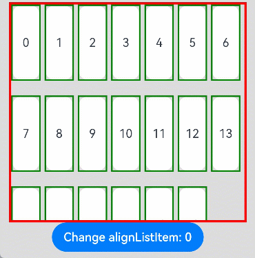
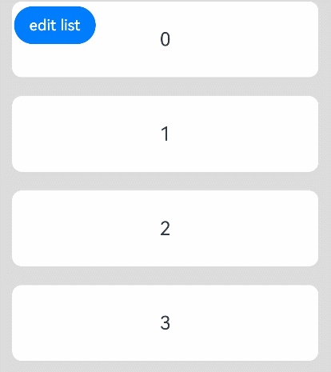

# List

The **\<List>** component provides a list container that presents a series of list items arranged in a column with the same width. It supports presentations of the same type of data in a multiple and coherent row style, for example, images or text.

> **NOTE**
>
> - This component is supported since API version 7. Updates will be marked with a superscript to indicate their earliest API version.
>
> - By default, this component can produce a bounce effect only when there is more than one screen of content. To produce a bounce effect when there is less than one screen of content, use the **options** parameter of the **edgeEffect** attribute.


## Child Components

This component supports the [\<ListItem>](ts-container-listitem.md) and [\<ListItemGroup>](ts-container-listitemgroup.md) child components.

> **NOTE**
>
> Below are the rules for calculating the indexes of the child components of **\<List>**:
>
> The index increases in ascending order of child components.
>
> In the **if/else** statement, only the child components for which the condition evaluates to true participate in the index calculation.
>
> In the **ForEach** or **LazyForEach** statement, the indexes of all expanded subnodes are calculated.
>
> If the values of [if/else](../../../quick-start/arkts-rendering-control-ifelse.md), [ForEach](../../../quick-start/arkts-rendering-control-foreach.md), and [LazyForEach](../../../quick-start/arkts-rendering-control-lazyforeach.md) change, the indexes of subnodes are updated.
>
> Each **\<ListItemGroup>** component is taken as a whole and assigned an index, and the indexes of the list items within are not included in the index calculation.
>
> Child components of **\<List>** whose **visibility** attribute is set to **Hidden** or **None** are included in the index calculation.
>
> Child components of **\<List>** whose **visibility** attribute is set to **None** are not displayed, but the spacing above and below them still takes effect.


## APIs

List(value?:{space?: number | string, initialIndex?: number, scroller?: Scroller})

Since API version 9, this API is supported in ArkTS widgets.

**Parameters**

| Name      | Type                                   | Mandatory| Description                                                    |
| ------------ | ------------------------------------------- | ---- | ------------------------------------------------------------ |
| space        | number \| string                  | No  | Spacing between list items along the main axis.<br>Default value: **0**<br>If the parameter type is number, the unit is vp.<br>**NOTE**<br>If this parameter is set to a negative number or a value greater than or equal to the length of the list content area, the default value is used.<br>If this parameter is set to a value less than the width of the list divider, the width of the list divider is used as the spacing.|
| initialIndex | number                                      | No  | Item displayed at the beginning of the viewport when the current list is loaded for the first time, that is, the first item to be displayed.<br>Default value: **0**<br>**NOTE**<br>If the set value is a negative number or is greater than the index of the last item in the list, the value is invalid. In this case, the default value will be used.|
| scroller     | [Scroller](ts-container-scroll.md#scroller) | No  | Scroller, which can be bound to scrollable components.<br>**NOTE**<br>The scroller cannot be bound to other scrollable components.|

## Attributes

In addition to the [universal attributes](ts-universal-attributes-size.md), the following attributes are supported.

### listDirection

listDirection(value: Axis)

Sets the direction in which the list items are arranged.

**Widget capability**: Since API version 9, this API is supported in ArkTS widgets.

**System capability**: SystemCapability.ArkUI.ArkUI.Full

**Parameters**

| Name| Type                             | Mandatory| Description                                      |
| ------ | --------------------------------- | ---- | ------------------------------------------ |
| value  | [Axis](ts-appendix-enums.md#axis) | Yes  | Direction in which the list items are arranged.<br>Default value: **Axis.Vertical**|

### divider

divider(<br>
    value: {<br>
      strokeWidth: Length;<br>
      color?: ResourceColor;<br>
      startMargin?: Length;<br>
      endMargin?: Length;<br>
    } | null,<br>
  )

Sets the style of the divider for the list items. By default, there is no divider.

If **endMargin** and **startMargin** add up to a value that exceeds the column width, they will be set to **0**.

**strokeWidth**, **startMargin**, and **endMargin** cannot be set in percentage.

The divider is drawn between list items along the main axis, and not above the first list item and below the last list item.

In multi-column mode, the value of **startMargin** is calculated from the start edge of the cross axis of each column. In other cases, it is calculated from the start edge of the cross axis of the list.

**System capability**: SystemCapability.ArkUI.ArkUI.Full

**Parameters**

| Name| Type                                                        | Mandatory| Description                                                        |
| ------ | ------------------------------------------------------------ | ---- | ------------------------------------------------------------ |
| value  | {<br>strokeWidth: [Length](ts-types.md#length),<br>color?:[ResourceColor](ts-types.md#resourcecolor),<br>startMargin?: [Length](ts-types.md#length),<br>endMargin?: [Length](ts-types.md#length)<br>} \| null | Yes  | Style of the divider for the list items.<br>- **strokeWidth**: stroke width of the divider.<br>- **color**: color of the divider.<br>- **startMargin**: distance between the divider and the start edge of the list.<br>- **endMargin**: distance between the divider and the end edge of the list.|

### scrollBar

scrollBar(value: BarState)

Sets the scrollbar state.

**Widget capability**: Since API version 9, this API is supported in ArkTS widgets.

**System capability**: SystemCapability.ArkUI.ArkUI.Full

**Parameters**

| Name| Type                                     | Mandatory| Description                                                        |
| ------ | ----------------------------------------- | ---- | ------------------------------------------------------------ |
| value  | [BarState](ts-appendix-enums.md#barstate) | Yes  | Scrollbar state.<br>Default value: **BarState.Off**<br>**NOTE**<br>In API version 9 and earlier versions, the default value is **BarState.Off**. In API version 10, the default value is **BarState.Auto**.|

### cachedCount

cachedCount(value: number)

Sets the number of list items or list item groups to be preloaded (cached). It works only in [LazyForEach](../../../quick-start/arkts-rendering-control-lazyforeach.md). A list item group is calculated as a whole, and all list items of the group are preloaded at the same time. For details, see [Minimizing White Blocks During Swiping](../../../performance/arkts-performance-improvement-recommendation.md#minimizing-white-blocks-during-swiping).

In single-column mode, the number of the list items to be cached before and after the currently displayed one equals the value of **cachedCount**.

In multi-column mode, the number of the list items to be cached is the value of **cachedCount** multiplied by the number of columns.

**Widget capability**: Since API version 9, this API is supported in ArkTS widgets.

**System capability**: SystemCapability.ArkUI.ArkUI.Full

**Parameters**

| Name| Type  | Mandatory| Description                                              |
| ------ | ------ | ---- | -------------------------------------------------- |
| value  | number | Yes  | Number of list items or list item groups to be preloaded (cached).<br>Default value: **1**|

### editMode<sup>(deprecated)</sup>

editMode(value: boolean)

Sets whether to enable edit mode. For details about how to implement deletion of a selected list item, see [Example 3](#example-3).

This API is deprecated since API version 9. There is no substitute API.

**Widget capability**: Since API version 9, this API is supported in ArkTS widgets.

**System capability**: SystemCapability.ArkUI.ArkUI.Full

**Parameters**

| Name| Type  | Mandatory| Description                                              |
| ------ | ------ | ---- | -------------------------------------------------- |
| value  | boolean | Yes  | Whether to enable edit mode.<br>Default value: **false**|

### edgeEffect

edgeEffect(value: EdgeEffect, options?: EdgeEffectOptions)

Sets the effect used when the scroll boundary is reached.

**Widget capability**: Since API version 9, this API is supported in ArkTS widgets.

**System capability**: SystemCapability.ArkUI.ArkUI.Full

**Parameters**

| Name               | Type                                                        | Mandatory| Description                                                        |
| --------------------- | ------------------------------------------------------------ | ---- | ------------------------------------------------------------ |
| value                 | [EdgeEffect](ts-appendix-enums.md#edgeeffect)                | Yes  | Effect used when the scroll boundary is reached. The spring and shadow effects are supported.<br>Default value: **EdgeEffect.Spring**|
| options<sup>11+</sup> | [EdgeEffectOptions](ts-container-scroll.md#edgeeffectoptions11) | No  | Whether to enable the scroll effect when the component content is smaller than the component itself.<br>Default value: **false**|

### chainAnimation

chainAnimation(value: boolean)

Sets whether to enable chained animations, which are displayed when the list slides or its top or bottom is dragged.

The list items are separated with even space, and one item animation starts after the previous animation during basic sliding interactions. The chained animation effect is similar with spring physics.

When chained animations are in motion, the list divider is not displayed.

The following prerequisites must be met for the chained animations to take effect:

 1. The spring effect is used when the scroll boundary of the list is reached.

 2. The multi-column mode is not enabled for the list.

**Widget capability**: Since API version 9, this API is supported in ArkTS widgets.

**System capability**: SystemCapability.ArkUI.ArkUI.Full

**Parameters**

| Name| Type   | Mandatory| Description                                                        |
| ------ | ------- | ---- | ------------------------------------------------------------ |
| value  | boolean | Yes  | Whether to enable chained animations.<br>**false** (default): Chained animations are disabled. **true**: Chained animations are enabled.|

### multiSelectable<sup>8+</sup>

multiSelectable(value: boolean)

Sets whether to enable multiselect.

**Widget capability**: Since API version 9, this API is supported in ArkTS widgets.

**System capability**: SystemCapability.ArkUI.ArkUI.Full

**Parameters**

| Name| Type   | Mandatory| Description                                                        |
| ------ | ------- | ---- | ------------------------------------------------------------ |
| value  | boolean | Yes  | Whether to enable multiselect.<br>**false** (default): Multiselect is disabled. **true**: Multiselect is enabled.|

### lanes<sup>9+</sup>

lanes(value: number | LengthConstrain, gutter?: Dimension)

Sets the number of columns or rows in the list. If the value is set to the **gutter** type, it indicates the gap between columns. It takes effect when the number of columns is greater than 1.

The rules are as follows:

- If the value is set to a number, the column width is calculated by dividing the cross-axis width of the **\<List>** component by the specified number.
- If the value is set to {minLength, maxLength}, the number of columns is adjusted adaptively based on the width of the **\<List>** component, ensuring that the width respects the {minLength, maxLength} constraints during adaptation. The **minLength** constraint is prioritized.
- If the value is set to {minLength, maxLength}, and the cross-axis width constraint of the parent component is infinite, the parent component is arranged by column, and the column width is calculated based on the largest list item in the display area.
- Each list item group occupies one row in multi-column mode. Its child list items are arranged based on the **lanes** attribute of the list.
- If the value is set to {minLength, maxLength}, the number of columns is calculated based on the cross-axis width of the list item group. If the cross-axis width of the list item group is different from that of the list, the number of columns in the list item group may be different from that in the list.

**Widget capability**: Since API version 9, this API is supported in ArkTS widgets.

**System capability**: SystemCapability.ArkUI.ArkUI.Full

**Parameters**

| Name              | Type                                                        | Mandatory| Description                                    |
| -------------------- | ------------------------------------------------------------ | ---- | ---------------------------------------- |
| value                | number \| [LengthConstrain](ts-types.md#lengthconstrain) | Yes  | Number of columns or rows in the list.<br>Default value: **1**|
| gutter<sup>10+</sup> | [Dimension](ts-types.md#dimension10)                         | No  | Gap between columns.<br>Default value: **0**                 |

### alignListItem<sup>9+</sup>

alignListItem(value: ListItemAlign)

Sets the alignment mode of list items along the cross axis when the cross-axis width of the list is greater than the cross-axis width of list items multiplied by the value of **lanes**.

**Widget capability**: Since API version 9, this API is supported in ArkTS widgets.

**System capability**: SystemCapability.ArkUI.ArkUI.Full

**Parameters**

| Name| Type                                    | Mandatory| Description                                                  |
| ------ | ---------------------------------------- | ---- | ------------------------------------------------------ |
| value  | [ListItemAlign](#listitemalign9) | Yes  | Alignment mode of list items along the cross axis.<br>Default value: **ListItemAlign.Start**|

### sticky<sup>9+</sup>

sticky(value: StickyStyle)

Sets whether to pin the header to the top or the footer to the bottom in the [list item group](ts-container-listitemgroup.md), if set. To support both the pin-to-top and pin-to-bottom features, set **sticky** to **StickyStyle.Header \| StickyStyle.Footer**.

**Widget capability**: Since API version 9, this API is supported in ArkTS widgets.

**System capability**: SystemCapability.ArkUI.ArkUI.Full

**Parameters**

| Name| Type                                | Mandatory| Description                                                      |
| ------ | ------------------------------------ | ---- | ---------------------------------------------------------- |
| value  | [StickyStyle](#stickystyle9) | Yes  | Whether to pin the header to the top or the footer to the bottom in the list item group.<br>Default value: **StickyStyle.None**|

### scrollSnapAlign<sup>10+</sup>

scrollSnapAlign(value: ScrollSnapAlign)

Sets the alignment mode of list items when scrolling ends.

This attribute is effective only when the heights of list items are the same.

It does not take effect after scrolling by a touchpad or mouse device ends.

**System capability**: SystemCapability.ArkUI.ArkUI.Full

**Parameters**

| Name| Type                                         | Mandatory| Description                                                     |
| ------ | --------------------------------------------- | ---- | --------------------------------------------------------- |
| value  | [ScrollSnapAlign](#scrollsnapalign10) | Yes  | Alignment mode of list items when scrolling ends.<br>Default value: **ScrollSnapAlign.NONE**|

### enableScrollInteraction<sup>10+</sup>

enableScrollInteraction(value: boolean)

Sets whether to support scroll gestures. When this attribute is set to **false**, scrolling by finger or mouse is not supported, but the scroll controller API is not affected.

**System capability**: SystemCapability.ArkUI.ArkUI.Full

**Parameters**

| Name| Type   | Mandatory| Description                               |
| ------ | ------- | ---- | ----------------------------------- |
| value  | boolean | Yes  | Whether to support scroll gestures.<br>Default value: **true**|

### nestedScroll<sup>10+</sup>

nestedScroll(value: NestedScrollOptions)

Sets the nested scrolling options. You can set the nested scrolling mode in the forward and backward directions to implement scrolling linkage with the parent component.

**System capability**: SystemCapability.ArkUI.ArkUI.Full

**Parameters**

| Name| Type                                                        | Mandatory| Description          |
| ------ | ------------------------------------------------------------ | ---- | -------------- |
| value  | [NestedScrollOptions](ts-container-scroll.md#nestedscrolloptions10) | Yes  | Nested scrolling options.|

### friction<sup>10+</sup>

friction(value: number | Resource)

Sets the friction coefficient. It applies only to gestures in the scrolling area, and it affects only indirectly the scroll chaining during the inertial scrolling process. A value less than or equal to 0 evaluates to the default value.

**System capability**: SystemCapability.ArkUI.ArkUI.Full

**Parameters**

| Name| Type                                                | Mandatory| Description                                                        |
| ------ | ---------------------------------------------------- | ---- | ------------------------------------------------------------ |
| value  | number \| [Resource](ts-types.md#resource) | Yes  | Friction coefficient.<br>Default value: **0.9** for wearable devices and **0.6** for non-wearable devices<br>Since API version 11, the default value for non-wearable devices is **0.7**.|

### scrollBarWidth<sup>11+</sup>

scrollBarWidth(value: number | string)

Sets the scrollbar width. This attribute cannot be set in percentage. If the width of the scrollbar exceeds its height, the default value is used.

**System capability**: SystemCapability.ArkUI.ArkUI.Full

**Parameters**

| Name| Type                      | Mandatory| Description                                     |
| ------ | -------------------------- | ---- | ----------------------------------------- |
| value  | number \| string | Yes  | Scrollbar width.<br>Default value: **4**<br>Unit: vp|

### scrollBarColor<sup>11+</sup>

scrollBarColor(color: Color | number | string)

Sets the scrollbar color.

**System capability**: SystemCapability.ArkUI.ArkUI.Full

**Parameters**

| Name| Type                                                        | Mandatory| Description          |
| ------ | ------------------------------------------------------------ | ---- | -------------- |
| value  | number \| string \| [Color](ts-appendix-enums.md#color) | Yes  | Scrollbar color.|

### contentStartOffset<sup>11+</sup>

contentStartOffset(value: number)

Sets the offset from the start of the list content to the boundary of the list display area.

**System capability**: SystemCapability.ArkUI.ArkUI.Full

**Parameters**

| Name| Type  | Mandatory| Description                                           |
| ------ | ------ | ---- | ----------------------------------------------- |
| value  | number | Yes  | Offset from the start of the list content to the boundary of the list display area.<br>Default value: **0**<br>Unit: vp|

### contentEndOffset<sup>11+</sup>

contentEndOffset(value: number)

Sets the offset from the end of the list content to the boundary of the list display area.

**System capability**: SystemCapability.ArkUI.ArkUI.Full

**Parameters**

| Name| Type  | Mandatory| Description                                         |
| ------ | ------ | ---- | --------------------------------------------- |
| value  | number | Yes  | Offset from the end of the list content to the boundary of the list display area.<br>Default value: **0**<br>Unit: vp|

### flingSpeedLimit<sup>11+</sup>

flingSpeedLimit(speedLimit: number)

Sets the maximum starting fling speed when the fling animation starts. The unit is vp/s.

**System capability**: SystemCapability.ArkUI.ArkUI.Full

**Parameters**

| Name    | Type  | Mandatory| Description                           |
| ---------- | ------ | ---- | ------------------------------- |
| speedLimit | number | Yes  | Maximum starting fling speed when the fling animation starts.|

## ListItemAlign<sup>9+</sup>

This API is supported in ArkTS widgets.

| Name    |  Value | Description                       |
| ------ | ------ | ------------------------- |
| Start  | 0 | The list items are packed toward the start edge of the **\<List>** component along the cross axis.|
| Center | 1 | The list items are centered in the **\<List>** component along the cross axis.|
| End    | 2 | The list items are packed toward the end edge of the **\<List>** component along the cross axis.|

## StickyStyle<sup>9+</sup>

This API is supported in ArkTS widgets.

| Name    |  Value | Description                                |
| ------ | ------ | ---------------------------------- |
| None   | 0 | In the **\<ListItemGroup>** component, the header is not pinned to the top, and the footer is not pinned to the bottom.|
| Header | 1 | In the **\<ListItemGroup>** component, the header is pinned to the top, and the footer is not pinned to the bottom. |
| Footer | 2 | In the **\<ListItemGroup>** component, the footer is pinned to the bottom, and the header is not pinned to the top. |

## ScrollSnapAlign<sup>10+</sup>

Enumerates the alignment modes of list items when scrolling ends.

Since API version 10, this API is supported in ArkTS widgets.

When list items are left-, right-, top-, or bottom-aligned, the items at the end must be completely displayed, without exposure of any blank area of the boundary; the items at the other end can be out of alignment.

This API is available only when the heights of list items are the same.

| Name    |  Value | Description                                      |
| ------ | ------ | ---------------------------------------- |
| NONE   | 0 | No alignment. This is the default value.           |
| START  | 1 | The first item in the view is aligned at the start of the list.<br>**NOTE**<br>When the list hits the end, the items at the end must be completely displayed. In this case, the items at the start may not be aligned.|
| CENTER | 2 | The middle items in the view are aligned in the center of the list.<br>**NOTE**<br>The top and end items can be aligned in the center of the list. In this case, a blank area may result,<br>and the first or last item is aligned to the center of the list.|
| END    | 3 | The last item in the view is aligned at the end of the list.<br>**NOTE**<br>When the list hits the start, the items at the start must be completely displayed. In this case, the items at the end may not be aligned.|
## CloseAllSwipeActions<sup>11+</sup>

Implements the callbacks and events for the [\<ListItem>](ts-container-listitem.md) in the [expanded](ts-container-listitem.md#swipeactionstate11) state.

| Name    | Type    | Mandatory| Description                  |
| :------- | -------- | ---- | ---------------------- |
| onFinish | ()=>void | No  | Triggered after the collapse animation is complete.|

## Events

### onItemDelete<sup>(deprecated)</sup>

onItemDelete(event: (index: number) => boolean)

Triggered when a list item is deleted.

This API is deprecated since API version 9. There is no substitute API.

**System capability**: SystemCapability.ArkUI.ArkUI.Full

**Parameters**

| Name| Type  | Mandatory| Description                    |
| ------ | ------ | ---- | ------------------------ |
| index  | number | Yes  | Index of the deleted list item.|

**Return value**

| Type   | Description          |
| ------- | -------------- |
| boolean | Whether the list item is deleted.|

### onScrollIndex

onScrollIndex(event: (start: number, end: number, center: number) => void)

Triggered when a child component enters or leaves the list display area. During index calculation, each **\<ListItemGroup>** component is taken as a whole and assigned an index, and the indexes of the list items within are not included in the calculation.

When the list edge scrolling effect is the spring effect, the **onScrollIndex** event is not triggered when the user scrolls the list to the edge or releases the list to rebound.

This event is triggered once when the list is initialized and when the index of the first list item or the next list item in the list display area changes.

Since API version 10, this event is also triggered when the child component in the center of the list display area changes.

**Widget capability**: Since API version 9, this API is supported in ArkTS widgets.

**System capability**: SystemCapability.ArkUI.ArkUI.Full

**Parameters**

| Name              | Type  | Mandatory| Description                                  |
| -------------------- | ------ | ---- | -------------------------------------- |
| start                | number | Yes  | Index of the first child component in the list display area.    |
| end                  | number | Yes  | Index of the last child component in the list display area.|
| center<sup>10+</sup> | number | Yes  | Index of the center child component in the list display area.|

### onReachStart

onReachStart(event: () => void)

Triggered when the list reaches the start position.

This event is triggered once when **initialIndex** is **0** during list initialization and once when the list scrolls to the start position. When the list edge scrolling effect is the spring effect, this event is triggered once when the list passes the start position and is triggered again when the list returns to the start position.

**Widget capability**: Since API version 9, this API is supported in ArkTS widgets.

**System capability**: SystemCapability.ArkUI.ArkUI.Full

### onReachEnd

onReachEnd(event: () => void)

Triggered when the list reaches the end position.

When the list edge scrolling effect is the spring effect, this event is triggered once when the list passes the end position and is triggered again when the list returns to the end position.

**Widget capability**: Since API version 9, this API is supported in ArkTS widgets.

**System capability**: SystemCapability.ArkUI.ArkUI.Full

### onScrollFrameBegin<sup>9+</sup>

onScrollFrameBegin(event: (offset: number, state: ScrollState) => { offsetRemain: number })

Triggered when the list starts to scroll. The input parameters indicate the amount by which the list will scroll. The event handler then works out the amount by which the list needs to scroll based on the real-world situation and returns the result.

If **listDirection** is set to **Axis.Vertical**, the return value is the amount by which the list needs to scroll in the vertical direction. If **listDirection** is set to **Axis.Horizontal**, the return value is the amount by which the list needs to scroll in the horizontal direction.

This event is triggered when the user starts dragging the list or the list starts inertial scrolling. It is not triggered when the component rebounds, the scrolling controller is used, or the scrollbar is dragged.

**Widget capability**: Since API version 9, this API is supported in ArkTS widgets.

**System capability**: SystemCapability.ArkUI.ArkUI.Full

**Parameters**

| Name| Type                               | Mandatory| Description                      |
| ------ | ----------------------------------- | ---- | -------------------------- |
| offset | number                              | Yes  | Amount to scroll by, in vp.|
| state  | [ScrollState](#scrollstate) | Yes  | Current scroll state.            |

**Return value**

| Type                    | Description                |
| ------------------------ | -------------------- |
| { offsetRemain: number } | Actual amount by which the grid scrolls, in vp.|

### onScrollStart<sup>9+</sup>

onScrollStart(event: () => void)

Triggered when the list starts scrolling initiated by the user's finger dragging the list or its scrollbar. This event is also triggered when the animation contained in the scrolling triggered by [Scroller](ts-container-scroll.md#scroller) starts.

**Widget capability**: Since API version 9, this API is supported in ArkTS widgets.

**System capability**: SystemCapability.ArkUI.ArkUI.Full

### onScrollStop

onScrollStop(event: () => void)

Triggered when the list stops scrolling after the user's finger leaves the screen. This event is also triggered when the animation contained in the scrolling triggered by [Scroller](ts-container-scroll.md#scroller) stops.

**Widget capability**: Since API version 9, this API is supported in ArkTS widgets.

**System capability**: SystemCapability.ArkUI.ArkUI.Full

### onItemMove

onItemMove(event: (from: number, to: number) => boolean)

Triggered when a list item moves.

**System capability**: SystemCapability.ArkUI.ArkUI.Full

**Parameters**

| Name| Type  | Mandatory| Description          |
| ------ | ------ | ---- | -------------- |
| from   | number | Yes  | Index of the item before moving.|
| to     | number | Yes  | Index of the item after moving.|

**Return value**

| Type   | Description          |
| ------- | -------------- |
| boolean | Whether the item is moved.|

### onItemDragStart<sup>8+</sup>

onItemDragStart(event: (event: ItemDragInfo, itemIndex: number) => ((() => any) \| void))

Triggered when a list item starts to be dragged.

**System capability**: SystemCapability.ArkUI.ArkUI.Full

**Parameters**

| Name   | Type                                                     | Mandatory| Description                  |
| --------- | --------------------------------------------------------- | ---- | ---------------------- |
| event     | [ItemDragInfo](ts-container-grid.md#itemdraginfo) | Yes  | Information about the drag point.        |
| itemIndex | number                                                    | Yes  | Index of the dragged item.|

### onItemDragEnter<sup>8+</sup>

onItemDragEnter(event: (event: ItemDragInfo) => void)

Triggered when the dragged item enters the drop target of the list.

**System capability**: SystemCapability.ArkUI.ArkUI.Full

**Parameters**

| Name| Type                                                     | Mandatory| Description          |
| ------ | --------------------------------------------------------- | ---- | -------------- |
| event  | [ItemDragInfo](ts-container-grid.md#itemdraginfo) | Yes  | Information about the drag point.|

### onItemDragMove<sup>8+</sup>

onItemDragMove(event: (event: ItemDragInfo, itemIndex: number, insertIndex: number) => void)

Triggered when the dragged item moves over the drop target of the list.

**System capability**: SystemCapability.ArkUI.ArkUI.Full

**Parameters**

| Name     | Type                                                     | Mandatory| Description          |
| ----------- | --------------------------------------------------------- | ---- | -------------- |
| event       | [ItemDragInfo](ts-container-grid.md#itemdraginfo) | Yes  | Information about the drag point.|
| itemIndex   | number                                                    | Yes  | Initial position of the dragged item.|
| insertIndex | number                                                    | Yes  | Index of the position to which the dragged item is dropped.|

### onItemDragLeave<sup>8+</sup>

onItemDragLeave(event: (event: ItemDragInfo, itemIndex: number) => void)

Triggered when the dragged item leaves the drop target of the list.

**System capability**: SystemCapability.ArkUI.ArkUI.Full

**Parameters**

| Name   | Type                                                     | Mandatory| Description                      |
| --------- | --------------------------------------------------------- | ---- | -------------------------- |
| event     | [ItemDragInfo](ts-container-grid.md#itemdraginfo) | Yes  | Information about the drag point.            |
| itemIndex | number                                                    | Yes  | Index of the dragged item.|

### onItemDrop<sup>8+</sup>

onItemDrop(event: (event: ItemDragInfo, itemIndex: number, insertIndex: number, isSuccess: boolean) => void)

Triggered when the dragged item is dropped on the drop target of the list.

During dragging across lists, **true** is returned if the drop target is bound to **onItemDrop**. Otherwise, **false** is returned. During dragging within a list, **isSuccess** is the return value of the **onItemMove** event.

**System capability**: SystemCapability.ArkUI.ArkUI.Full

**Parameters**

| Name     | Type                                                     | Mandatory| Description          |
| ----------- | --------------------------------------------------------- | ---- | -------------- |
| event       | [ItemDragInfo](ts-container-grid.md#itemdraginfo) | Yes  | Information about the drag point.|
| itemIndex   | number                                                    | Yes  | Initial position of the dragged item.|
| insertIndex | number                                                    | Yes  | Index of the position to which the dragged item is dropped.|
| isSuccess   | boolean                                                   | Yes  | Whether the dragged item is successfully dropped.  |


### onScroll<sup>(deprecated)</sup>
onScroll(event: (scrollOffset: number, scrollState: [ScrollState](#scrollstate)) => void) 

Triggered when the list scrolls.

This API is deprecated since API version 12. You are advised to use [onDidScroll](#ondidscroll12) instead.

**Widget capability**: Since API version 9, this API is supported in ArkTS widgets.

**System capability**: SystemCapability.ArkUI.ArkUI.Full

**Parameters**
| Name| Type| Mandatory| Description|
| ------ | ------ | ------ | ------|
| scrollOffset | number | Yes| Scroll offset of each frame. The offset is positive when the list is scrolled up and negative when the list is scrolled down.<br>Unit: vp|
| scrollState | [ScrollState](ts-container-list.md#scrollstate) | Yes| Current scroll state.|

### onWillScroll<sup>12+</sup>
onWillScroll(handler: OnScrollCallback)

Triggered when the list is about to scroll. The return value is the offset amount by which the list will scroll and the current scroll state. The returned offset is obtained by calculation, not the actual offset.

**Widget capability**: Since API version 12, this API is supported in ArkTS widgets.

**System capability**: SystemCapability.ArkUI.ArkUI.Full

**Parameters**

| Name| Type| Mandatory| Description|
| ------ | ------ | ------ | ------|
| handler | [OnScrollCallback](#onscrollcallback) | Yes| Callback invoked when the list is about to scroll.|

> **NOTE**
> 
> When **ScrollEdge** and **ScrollToIndex** that does not involve animation is called, **onWillScroll** is not triggered.

### onDidScroll<sup>12+</sup>
onDidScroll(handler: OnScrollCallback)

Triggered when the list scrolls. The return value is the offset amount by which the list has scrolled and the current scroll state.

**Widget capability**: Since API version 12, this API is supported in ArkTS widgets.

**System capability**: SystemCapability.ArkUI.ArkUI.Full

**Parameters**

| Name| Type| Mandatory| Description|
| ------ | ------ | ------ | ------|
| handler | [OnScrollCallback](#onscrollcallback) | Yes| Callback invoked when the list scrolls.|

### onScrollVisibleContentChange<sup>12+</sup>
onScrollVisibleContentChange(handler: OnScrollVisibleContentChangeCallback)

Triggered when a child component enters or leaves the list display area. During index calculation, list item, header of the list item group, and footer of the list item group each are counted as a child component.

This event is triggered once when the list is initialized and when the index of the first child component or the next child component in the list display area changes.

**System capability**: SystemCapability.ArkUI.ArkUI.Full

**Parameters**

| Name| Type| Mandatory| Description|
| ------ | ------ | ------ | ------|
| handler | [OnScrollVisibleContentChangeCallback](#onscrollvisiblecontentchangecallback12) | Yes| Callback invoked when the displayed content changes.|

## OnScrollCallback
Called when the list scrolls. 

| Name| Type| Mandatory| Description|
| ------ | ------ | ------ | ------|
| scrollOffset | number | Yes| Scroll offset of each frame. The offset is positive when the list is scrolled up and negative when the list is scrolled down.<br>Unit: vp|
| scrollState | [ScrollState](ts-container-list.md#scrollstate) | Yes| Current scroll state.|

## ScrollState

Since API version 9, this API is supported in ArkTS widgets.

| Name    |  Value | Description                                      |
| ------ | ------ | ---------------------------------------- |
| Idle   |  0  | Idle. The list enters this state when an API in the controller is used to scroll the list or when the scrollbar is dragged.<br>**NOTE**<br> Since API version 10, the list enters this state when it is not scrolling,<br>but not when an API in the controller that does not apply an animation is called.|
| Scroll |  1  | Scrolling. The list enters this state when the user drags the list to scroll.<br>**NOTE**<br> Since API version 10, the list also enters this state when the user drags the scrollbar or the mouse wheel to scroll the list.|
| Fling  |  2  | Inertial scrolling. The list enters this state when inertial scrolling occurs or when the list bounces back after being released from a fling.<br>**NOTE**<br> Since API version 10, the list enters this state when: Inertial scrolling occurs after a fling.<br>The list bounces back after being released from a fling.<br>Inertial scrolling occurs after quick dragging of the built-in scrollbar.<br>Scrolling occurs after an API in the controller that applies an animation is called.|

The table below lists the changes in the **ScrollState** enums.

| Scenario           | API Version 9 and Earlier| API Version 10 and Later|
| ------------- | ---------------- | ---------------- |
| Finger dragging       | Scroll           | Scroll           |
| Inertial scrolling         | Fling            | Fling            |
| Cross-boundary bouncing         | Fling            | Fling            |
| Scrolling by mouse wheel       | Idle             | Scroll           |
| Scrollbar dragging        | Idle             | Scroll           |
| Scrolling by the scroll controller (with animation) | Idle             | Fling            |
| Scrolling by the scroll controller (without animation)| Idle             | Idle             |

>  **NOTE**
>
>  To enable the editable mode for a list, the following conditions must be met: (This feature is deprecated since API version 9.)
>
>  - **editMode** is set to **true**.
>
>  - The list is bound to the **onItemDelete** event and the event returns **true** in the event callback.
>
>  - The **editable** attribute of **ListItem** is set to **true**.
>
>  To enable dragging for a list item, the following conditions must be met:
>
>  - **editMode** is set to **true**. (This is not required since API version 9.)
>
>  - The list item is bound to the **onDragStart** event and the event returns a floating UI during event callback.

## ListScroller<sup>11+</sup>

Implements the scroll controller of the **\<List>** component. A **\<List>** component is bound to a **ListScroller** on a one-to-one basis.


>  **NOTE**
>
>  **ListScroller** inherits from [Scroller](ts-container-scroll.md#scroller) and has all methods of [Scroller](ts-container-scroll.md#scroller).

### Objects to Import

```
listScroller: ListScroller = new ListScroller()
```


### getItemRectInGroup<sup>11+</sup>

getItemRectInGroup(index: number, indexInGroup: number): RectResult

Obtains the size of a [list item](ts-container-listitem.md) in a [list item group](ts-container-listitemgroup.md) and its position relative to the list.

**Parameters**

| Name  | Type  | Mandatory  | Description             |
| ----- | ------ | ---- | ----------------- |
| index | number | Yes   | Index of the list item group in the list.|
| indexInGroup | number | Yes   | Index of the list item in the list item group.|

> **NOTE**
>
> - The value of **index** must be the index of a child component visible in the display area. Otherwise, the value is considered invalid.
> - The child component for which **index** is set must be a list item group. Otherwise, the **index **value is considered invalid.
> - The value of **indexInGroup** must be the index of a list item in the list item group visible in the display area. Otherwise, the value is considered invalid.
> - When **index** or **indexInGroup** is set to an invalid value, the returned size and position are both **0**.

**Return value**

| Type      | Description      |
| -------------------  | -------- |
| [RectResult](ts-types.md#rectresult10) | Size of the list item in the list item group and its position relative to the list.<br>Unit: vp|

### scrollToItemInGroup<sup>11+</sup>

scrollToItemInGroup(index: number, indexInGroup:number, smooth?: boolean, align?: ScrollAlign): void

Scrolls to the specified list item in the specified list item group.

When **smooth** is set to **true**, all passed items are loaded and counted in layout calculation. This may result in performance issues if a large number of items are involved.

**Parameters**

| Name               | Type| Mandatory| Description                                                    |
| --------------------- | -------- | ---- | ------------------------------------------------------------ |
| index                 | number   | Yes  | Index of the target list item group in the current container.<br>**NOTE**<br>If the value set is a negative value or greater than the maximum index of the items in the container, the value is deemed abnormal, and no scrolling will be performed.                    |
| indexInGroup          | number   | Yes  | Index of the target list item in the list item group specified by **index**.<br>**NOTE**<br>If the value set is a negative value or greater than the maximum index of the items in the list item group, the value is deemed abnormal, and no scrolling will be performed.|
| smooth                | boolean  | No  | Whether to enable the smooth animation for scrolling to the item with the specified index. The value **true** means to enable that the smooth animation, and **false** means the opposite.<br>Default value: **false**|
| align                 | [ScrollAlign](ts-container-scroll.md#scrollalign10)  | No  | How the list item to scroll to is aligned with the container.<br>Default value: **ScrollAlign.START**|

### closeAllSwipeActions<sup>11+</sup>

closeAllSwipeActions(options?: [CloseSwipeActionOptions](#closeallswipeactions11)): void

Collapses the [list items](ts-container-listitem.md) in the [EXPANDED](ts-container-listitem.md#swipeactionstate11) state and sets callback events.

**Parameters**

| Name | Type                                                  | Mandatory| Description                                                    |
| ------- | ---------------------------------------------------------- | ---- | ------------------------------------------------------------ |
| options | [CloseSwipeActionOptions](#closeallswipeactions11) | No  | Callback events for collapsing [list items](ts-container-listitem.md) in the [EXPANDED](ts-container-listitem.md#swipeactionstate11) state.|

> **NOTE**
>
> - A **ListScroller** must be bound to the **\<List>** component.

## OnScrollVisibleContentChangeCallback<sup>12+</sup>
Called when a child component enters or leaves the list display area.

| Name| Type| Mandatory| Description|
| ------ | ------ | ------ | ------|
| start | [VisibleListContentInfo](#visiblelistcontentinfo12) | Yes| Information about the currently displayed first list item or list item group.|
| end | [VisibleListContentInfo](#visiblelistcontentinfo12) | Yes| Information about the currently displayed last list item or list item group.|

## VisibleListContentInfo<sup>12+</sup>

| Name| Type| Mandatory| Description|
| ------ | ------ | ------ | ------|
| index | number | Yes| Index of the list item or list item group in the list display area.|
| itemGroupArea | [ListItemGroupArea](#listitemgrouparea12) | No| Position of the top or bottom edge of the viewport in the list item group to which the edge is located, if applicable.|
| itemIndexInGroup | number | No| Index of the starting or ending list item in the list item group to which the top or bottom edge of the viewport is located.|

## ListItemGroupArea<sup>12+</sup>

| Name    |  Value | Description                                      |
| ------ | ------ | ---------------------------------------- |
| NONE |  0  | The edge of the viewport is in the position of **none**. Applicable when the list item group does not contain any header, footer, or list item.|
| IN_LIST_ITEM_AREA |  1  | The edge of the viewport is in the position of a list item.|
| IN_HEADER_AREA |  2  | The edge of the viewport is in the position of a header.|
| IN_FOOTER_AREA |  3  | The edge of the viewport is in the position of a footer.|

## Example

### Example 1
In this example, a vertical list is implemented, and a callback is invoked when the first or last item displayed in the list changes.
```ts
// xxx.ets
@Entry
@Component
struct ListExample {
  private arr: number[] = [0, 1, 2, 3, 4, 5, 6, 7, 8, 9]

  build() {
    Column() {
      List({ space: 20, initialIndex: 0 }) {
        ForEach(this.arr, (item: number) => {
          ListItem() {
            Text('' + item)
              .width('100%').height(100).fontSize(16)
              .textAlign(TextAlign.Center).borderRadius(10).backgroundColor(0xFFFFFF)
          }
        }, (item: string) => item)
      }
      .listDirection(Axis.Vertical) // Arrangement direction
      .scrollBar(BarState.Off)
      .friction(0.6)
      .divider({ strokeWidth: 2, color: 0xFFFFFF, startMargin: 20, endMargin: 20 }) // Divider
      .edgeEffect(EdgeEffect.Spring) // Set the edge scrolling effect to Spring.
      .onScrollIndex((firstIndex: number, lastIndex: number, centerIndex: number) => {
        console.info('first' + firstIndex)
        console.info('last' + lastIndex)
        console.info('center' + centerIndex)
      })
      .onScrollVisibleContentChange((start: VisibleListContentInfo, end: VisibleListContentInfo) => {
        console.log(' start index: ' + start.index +
                    ' start item group area: ' + start.itemGroupArea +
                    ' start index in group: ' + start.itemIndexInGroup)
        console.log(' end index: ' + end.index +
                    ' end item group area: ' + end.itemGroupArea +
                    ' end index in group: ' + end.itemIndexInGroup)
      })
      .onScroll((scrollOffset: number, scrollState: ScrollState) => {
        console.info(`onScroll scrollState = ScrollState` + scrollState + `, scrollOffset = ` + scrollOffset)
      })
      .width('90%')
    }
    .width('100%')
    .height('100%')
    .backgroundColor(0xDCDCDC)
    .padding({ top: 5 })
  }
}
```


### Example 2

```ts
// xxx.ets
@Entry
@Component
struct ListLanesExample {
  @State arr: string[] = ["0", "1", "2", "3", "4", "5", "6", "7", "8", "9", "10", "11", "12", "13", "14", "15", "16", "17", "18", "19"]
  @State alignListItem: ListItemAlign = ListItemAlign.Start

  build() {
    Column() {
      List({ space: 20, initialIndex: 0 }) {
        ForEach(this.arr, (item: string) => {
          ListItem() {
            Text('' + item)
              .width('100%')
              .height(100)
              .fontSize(16)
              .textAlign(TextAlign.Center)
              .borderRadius(10)
              .backgroundColor(0xFFFFFF)
          }
          .border({ width: 2, color: Color.Green })
        }, (item: string) => item)
      }
      .height(300)
      .width("90%")
      .friction(0.6)
      .border({ width: 3, color: Color.Red })
      .lanes({ minLength: 40, maxLength: 40 })
      .alignListItem(this.alignListItem)
      .scrollBar(BarState.Off)

      Button("Change alignListItem: "+ this.alignListItem).onClick(() => {
        if (this.alignListItem == ListItemAlign.Start) {
          this.alignListItem = ListItemAlign.Center
        } else if (this.alignListItem == ListItemAlign.Center) {
          this.alignListItem = ListItemAlign.End
        } else {
          this.alignListItem = ListItemAlign.Start
        }
      })
    }.width('100%').height('100%').backgroundColor(0xDCDCDC).padding({ top: 5 })
  }
}
```




### Example 3

```ts
// xxx.ets
@Entry
@Component
struct ListExample {
  @State arr: number[] = [0, 1, 2, 3, 4, 5, 6, 7, 8, 9]
  @State editFlag: boolean = false

  build() {
    Stack({ alignContent: Alignment.TopStart }) {
      Column() {
        List({ space: 20, initialIndex: 0 }) {
          ForEach(this.arr, (item: number, index?: number) => {
            ListItem() {
              Flex({ direction: FlexDirection.Row, alignItems: ItemAlign.Center }) {
                Text('' + item)
                  .width('100%')
                  .height(80)
                  .fontSize(20)
                  .textAlign(TextAlign.Center)
                  .borderRadius(10)
                  .backgroundColor(0xFFFFFF)
                  .flexShrink(1)
                if (this.editFlag) {
                  Button() {
                    Text("delete").fontSize(16)
                  }.width('30%').height(40)
                  .onClick(() => {
                    if (index != undefined) {
                      console.info(this.arr[index] + 'Delete')
                      this.arr.splice(index, 1)
                      console.info(JSON.stringify(this.arr))
                      this.editFlag = false
                    }
                  }).stateEffect(true)
                }
              }
            }
          }, (item: string) => item)
        }.width('90%')
        .scrollBar(BarState.Off)
        .friction(0.6)
      }.width('100%')

      Button('edit list')
        .onClick(() => {
          this.editFlag = !this.editFlag
        }).margin({ top: 5, left: 20 })
    }.width('100%').height('100%').backgroundColor(0xDCDCDC).padding({ top: 5 })
  }
}
```



### Example 4

```ts
// xxx.ets
@Entry
@Component
struct ListExample {
  private arr: number[] = []
  private scrollerForList: Scroller = new Scroller()

  aboutToAppear() {
    for (let i = 0; i < 20; i++) {
      this.arr.push(i)
    }
  }
  build() {
    Column() {
      Row() {
        List({ space: 20, initialIndex: 3, scroller: this.scrollerForList }) {
          ForEach(this.arr, (item: number) => {
            ListItem() {
              Text('' + item)
                .width('100%').height(100).fontSize(16)
                .textAlign(TextAlign.Center)
            }
            .borderRadius(10).backgroundColor(0xFFFFFF)
            .width('60%')
            .height('80%')
          }, (item: number) => JSON.stringify(item))
        }
        .chainAnimation(true)
        .edgeEffect(EdgeEffect.Spring)
        .listDirection(Axis.Horizontal)
        .height('100%')
        .width('100%')
        .scrollSnapAlign(ScrollSnapAlign.CENTER)
        .borderRadius(10)
        .backgroundColor(0xDCDCDC)
      }
      .width('100%')
      .height('100%')
      .backgroundColor(0xDCDCDC)
      .padding({ top: 10 })
    }
  }
}

```


