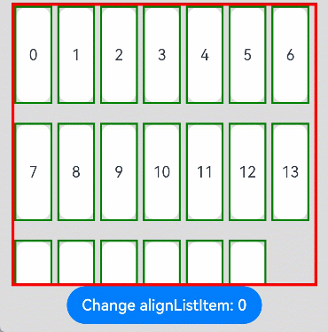
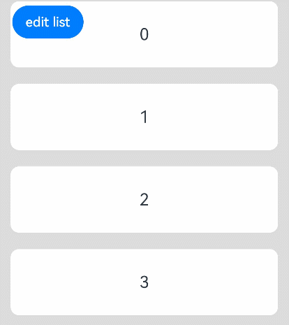
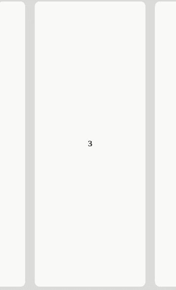
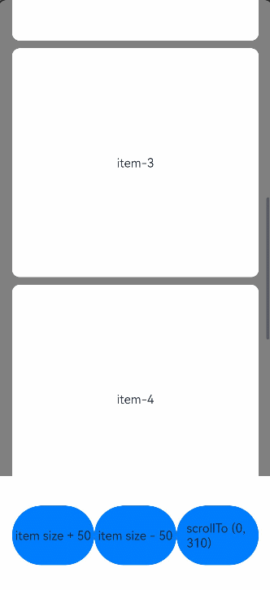
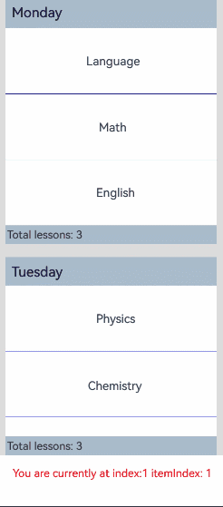
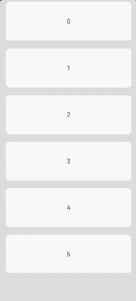

# List

<!--Kit: ArkUI-->
<!--Subsystem: ArkUI-->
<!--Owner: @rongShao-Z; @wind_-->
<!--Designer: @yangcan18-->
<!--Tester: @leiyuqian-->
<!--Adviser: @Brilliantry_Rui-->
<!-- md-trans-meta sourceCommit=8d874d0ed3e2b14fedac21e9dc0520168c6abc51 translatedAt=2026-08-18T03:12:01.788Z pushedAt=2026-08-18T09:34:12.575Z -->

**List** is a list container component in ArkUI that presents continuous, multi-row or multi-column data of the same type, such as images and text, and supports vertical or horizontal scrolling. When used together with **LazyForEach** or **Repeat**, it supports lazy loading to improve the startup speed and reduce the memory usage in long-list scenarios. It also supports preloading to reduce frame loss during scrolling and improve smoothness, as well as single-column/multi-column layout, grouped lists, and sticky header/footer, making it suitable for scenarios such as message lists, product lists, and settings pages.

Lazy loading of **List** loads the child components in the visible area as required. Compared with full loading, lazy loading can improve the app startup speed and reduce the memory usage. When **List** is used together with [ForEach](../../../ui/rendering-control/arkts-rendering-control-foreach.md), [LazyForEach](../../../ui/rendering-control/arkts-rendering-control-lazyforeach.md), and [Repeat](../../../ui/rendering-control/arkts-new-rendering-control-repeat.md), the lazy loading capabilities differ as follows:

- When **List** is used together with **ForEach**, all child nodes are created at a time. The nodes within the screen range are laid out and rendered when needed. When a user swipes, the nodes that are out of the screen range are not removed from the tree, and the nodes that enter the screen range are laid out and rendered.

- When **List** is used together with **LazyForEach**, all nodes within the screen range are created, laid out, and rendered at a time. When a user swipes, the nodes that are out of the screen range are removed from the tree, and the nodes that enter the screen range are created, laid out, and rendered.

- When the **List** component is used together with **Repeat** with [virtualScroll](./ts-rendering-control-repeat.md#virtualscroll), the lazy loading behavior is the same as that of **LazyForEach**. When the **List** component is used together with **Repeat** without **virtualScroll**, the lazy loading behavior is the same as that of **ForEach**.

If a scrollable component is nested in a **List** component, their scrolling directions are the same, and the main axis size is not set for the **List** component, the **List** component loads all child components, causing lazy loading to fail. In this scenario, you are advised to nest the [ListItemGroup](ts-container-listitemgroup.md) component in **List** to optimize performance.

Preloading in **List** refers to loading not only the visible child components within the display area but also some invisible child components outside the display area during idle time. Preloading can reduce frame drops during scrolling and improve smoothness. Preloading takes effect only when combined with lazy loading. **List** supports setting the number of preloaded items through [cachedCount](#cachedcount). By default, one screen of child components is preloaded both above and below the display area (up to 16 rows of child components). When **List** is used together with [ForEach](../../../ui/rendering-control/arkts-rendering-control-foreach.md), [LazyForEach](../../../ui/rendering-control/arkts-rendering-control-lazyforeach.md), and [Repeat](../../../ui/rendering-control/arkts-new-rendering-control-repeat.md), the preloading capabilities differ as follows:

- When the **List** component is used together with **ForEach** and **cachedCount** is set, in addition to laying out child components within the visible area, child components within the range of **cachedCount** outside the visible area are pre-laid out during idle time.

- When the **List** component is used together with **LazyForEach** and **cachedCount** is set, in addition to creating and laying out child components within the display area, child components within the range of **cachedCount** outside the display area are pre-created and pre-laid out during idle time.

- When the **List** component is used together with **Repeat** with [virtualScroll](./ts-rendering-control-repeat.md#virtualscroll), the preloading behavior is the same as that of **LazyForEach**. When the **List** component is used together with **Repeat** without **virtualScroll**, the preloading behavior is the same as that of **ForEach**.

> **NOTE**
>
> This component is supported since API version 7. Updates will be marked with a superscript to indicate their earliest API version.
>
> The component has been bound with gestures to implement functions such as follow-up scrolling. If you need to add custom gestures, refer to [Gesture Blocking Enhancement](ts-gesture-blocking-enhancement.md).

## Child Components

Only [ListItem](ts-container-listitem.md), [ListItemGroup](ts-container-listitemgroup.md), and custom components are supported as child components. When a custom component is used under **List**, use **ListItem** or **ListItemGroup** as the top-level component of the custom component. Do not directly set attributes and event methods for the custom component, because **List** manages the layout and event handling of child components through **ListItem** or **ListItemGroup**. Directly setting them may cause some functions to fail to take effect.

Child components can be dynamically generated using rendering control types [if/else](../../../ui/rendering-control/arkts-rendering-control-ifelse.md), [ForEach](../../../ui/rendering-control/arkts-rendering-control-foreach.md), [LazyForEach](../../../ui/rendering-control/arkts-rendering-control-lazyforeach.md), and [Repeat](../../../ui/rendering-control/arkts-new-rendering-control-repeat.md). **LazyForEach** or **Repeat** is recommended to optimize performance.

> **NOTE**
>
> If you encounter lag when processing a large number of child components, use methods such as lazy loading, caching list items, dynamic preloading, component reuse, and layout optimization. For best practices, see [Optimizing Frame Loss for Long List Loading](https://developer.huawei.com/consumer/en/doc/best-practices/bpta-best-practices-long-list).
>
> Since API version 21, the maximum width and height of a single child component of **List** is 16777216 px. In API version 20 and earlier, the maximum width and height of a single child component of **List** is 1000000 px. A child component exceeding this size may cause scrolling or display exceptions.
>
> The index value calculation rules for child components of **List** are as follows:
>
> - The index values increase sequentially in the order of the child components.
>
> - In an **if**/**else** statement, only the child components in the branch whose condition is true participate in index value calculation. The child components in the branch whose condition is false are not counted.
>
> - In a **ForEach**/**LazyForEach**/**Repeat** statement, the index values of all expanded child components are calculated.
>
> - After [if/else](../../../ui/rendering-control/arkts-rendering-control-ifelse.md), [ForEach](../../../ui/rendering-control/arkts-rendering-control-foreach.md), [LazyForEach](../../../ui/rendering-control/arkts-rendering-control-lazyforeach.md), and [Repeat](../../../ui/rendering-control/arkts-new-rendering-control-repeat.md) change, the index values of the child components are updated.
>
> - A **ListItemGroup** is counted as one index value as a whole, and the **ListItem** components inside the **ListItemGroup** are not counted.
>
> - The index value is still calculated when the **visibility** attribute of a child component of **List** is set to **Hidden** or **None**.

## APIs

List(options?: [ListOptions](#listoptions18))

Creates a list container.

**Widget capability**: This API can be used in ArkTS widgets since API version 9.

**Atomic service API**: This API can be used in atomic services since API version 11.

**System capability**: SystemCapability.ArkUI.ArkUI.Full

**Parameters**

| Name | Type| Mandatory| Description|
| ------ | ---- | ---- | ---- |
| options    | [ListOptions](#listoptions18)  | No   | List component parameters. If not passed, the default configuration is used. |

## ListOptions<sup>18+</sup>

Defines the options of the **List** component.

> **NOTE**
>
> To standardize anonymous object definitions, the element definitions here have been revised in API version 18. While historical version information is preserved for anonymous objects, there may be cases where the outer element's @since version number is higher than inner elements'. This does not affect interface usability.

**Widget capability**: This API can be used in ArkTS widgets since API version 18.

**Atomic service API**: This API can be used in atomic services since API version 18.

**Model restriction:** This API can be used only in the stage model.

**System capability**: SystemCapability.ArkUI.ArkUI.Full

<!--Table: 15%; 15%; 10%; 10%; 50%-->

| Name      | Type                                   | Read-Only| Optional| Description                                                    |
| ------------ | ------------------------------------------- | ---- | -- | ------------------------------------------------------------ |
| initialIndex<sup>7+</sup> | number | No | Yes | Index of the item at the start position of the display area when the List is initially loaded.<br/>Default value: **0**. When **stackFromEnd** is set to **true**, the default value is the total number of items minus 1.<br/>**NOTE**<br/>A negative value or a value greater than the index of the last item in the current List is invalid, and the default value is used in this case.<br/>Since API version 14, if the **scrollToIndex** or **scrollEdge** method without animation in the Scroller is called before the first layout after the List component is created (for example, in the [onAttach](ts-universal-events-show-hide.md#onattach12) event of the List), the value set by **initialIndex** is overwritten.<br/>After **initialIndex** is set, the List starts layout from the child component corresponding to **initialIndex**. The child components before it do not participate in the layout and their exact sizes cannot be calculated. Therefore, the total scroll offset of the List obtained through [currentOffset](ts-container-scroll.md#currentoffset) is estimated and may be inaccurate. You can set [childrenMainSize](#childrenmainsize12) to ensure the accuracy of the total scroll offset of the List.<br/>**Widget capability:** This API can be used in ArkTS widgets since API version 9.<br/>**Atomic service API:** This API can be used in atomic services since API version 11. |
| space<sup>7+</sup>        | number&nbsp;\|&nbsp;string                  | No   | Yes | Spacing between child components along the main axis.<br/>Default value: **0**<br/>When the parameter type is number, the unit is vp.<br/>**NOTE**<br/>A negative value or a value greater than or equal to the length of the List content area is invalid, and the default value is used in this case.<br/>When the value of **space** is less than the width of the List divider, the spacing between child components along the main axis is the divider width.<br/>When the **visibility** attribute of a List child component is set to **None**, the child component is not displayed, but the **space** above and below it still takes effect.<br/>If both **spaceWidth** and **space** are set, **spaceWidth** takes effect first. When **spaceWidth** is **undefined** or **null**, **space** takes effect.<br/>**Widget capability:** This API can be used in ArkTS widgets since API version 9.<br/>**Atomic service API:** This API can be used in atomic services since API version 11.|
| spaceWidth        | [Dimension](ts-types.md#dimension10)                  | No   | Yes | Spacing between child components along the main axis.<br/>Default value: **0**<br/>When the parameter type is number, the unit is vp.<br/><br/>**NOTE**<br/>A negative value or a value greater than or equal to the length of the List content area is invalid, and the default value is used in this case.<br/>When the value of **spaceWidth** is less than the width of the List divider, the spacing between child components along the main axis is the divider width.<br/>When the **visibility** attribute of a List child component is set to **None**, the child component is not displayed, but the **spaceWidth** spacing above and below it still takes effect. If both **spaceWidth** and **space** are set, **spaceWidth** takes effect first. When **spaceWidth** is **undefined** or **null**, **space** takes effect.<br/>**Since:** 26.0.0 <br/>**Model restriction:** This API can be used only in the stage model.<br/>**Widget capability:** This API can be used in ArkTS widgets since API version 26.0.0.<br/>**Atomic service API:** This API can be used in atomic services since API version 26.0.0.|
| scroller<sup>7+</sup>      | [Scroller](ts-container-scroll.md#scroller) | No   | Yes | Controller of the scrollable component. After being bound to the List, it can be used to control the scrolling of the List. By default, no scroll controller is bound.<br/>**NOTE**<br/>It is not allowed to bind the same scroll controller object to other scrollable components, such as [ArcList](ts-container-arclist.md), [List](ts-container-list.md), [Grid](ts-container-grid.md), [Scroll](ts-container-scroll.md), and [WaterFlow](ts-container-waterflow.md).<br/>**Widget capability:** This API can be used in ArkTS widgets since API version 9.<br/>**Atomic service API:** This API can be used in atomic services since API version 11. |

## Attributes

In addition to [universal attributes](ts-component-general-attributes.md) and [scrollable component common attributes](ts-container-scrollable-common.md#attributes), the following attributes are also supported.

> **NOTE**
>
> The default value of the universal attribute [clip](ts-universal-attributes-sharp-clipping.md#clip12) is **true** for the **List** component.

### listDirection

listDirection(value: Axis)

Sets the direction in which the list items are arranged.

**Widget capability**: This API can be used in ArkTS widgets since API version 9.

**Atomic service API**: This API can be used in atomic services since API version 11.

**System capability**: SystemCapability.ArkUI.ArkUI.Full

**Parameters**

| Name| Type                             | Mandatory| Description                                      |
| ------ | --------------------------------- | ---- | ------------------------------------------ |
| value  | [Axis](ts-appendix-enums.md#axis) | Yes  | Direction in which the list items are arranged.<br>Default value: **Axis.Vertical**|

### divider

divider(value: [ListDividerOptions](#listdivideroptions18) | null)

Sets the style of the divider for the list items. By default, there is no divider.

The divider of **List** is drawn between two child components along the main axis, and no divider is drawn above the first child component or below the last child component. The width of the divider affects the spacing between child components. When the value of **space** or **spaceWidth** is smaller than the divider width, the spacing between child components along the main axis takes the divider width.

In multi-column mode, the value of **startMargin** is calculated from the start edge of the cross axis of each column. In single-column mode, it is calculated from the start edge of the cross axis of the list.

When a list item has [polymorphic styles](ts-universal-attributes-polymorphic-style.md) applied, the dividers above and below the pressed child component are not rendered.

**Widget capability**: This API can be used in ArkTS widgets since API version 9.

**Atomic service API**: This API can be used in atomic services since API version 11.

**System capability**: SystemCapability.ArkUI.ArkUI.Full

**Parameters**

| Name| Type                                                        | Mandatory| Description                                                        |
| ------ | ------------------------------------------------------------ | ---- | ------------------------------------------------------------ |
| value  | [ListDividerOptions](#listdivideroptions18) \|&nbsp;null| Yes  | Style of the divider for the list items.<br>Default value: **null**|

### scrollBar

scrollBar(value: BarState)

Sets the scrollbar state.

**Widget capability**: This API can be used in ArkTS widgets since API version 9.

**Atomic service API**: This API can be used in atomic services since API version 11.

**System capability**: SystemCapability.ArkUI.ArkUI.Full

**Parameters**

| Name| Type                                     | Mandatory| Description                                                        |
| ------ | ----------------------------------------- | ---- | ------------------------------------------------------------ |
| value  | [BarState](ts-appendix-enums.md#barstate) | Yes  | Scrollbar state.<br>In API version 9 and earlier versions, the default value is **BarState.Off**. Since API version 10, the default value is **BarState.Auto**.|

### cachedCount

cachedCount(value: number)

Sets the number of **ListItem** or **ListItemGroup** components to be preloaded (cached). In a lazy loading scenario, only the **cachedCount** rows of **ListItem** components above and below the visible area of the **List** component are preloaded. In a non-lazy loading scenario, all items are loaded at once. For both lazy and non-lazy loading, only the content within the list display area plus the content equivalent to **cachedCount** outside the display area is laid out. <!--Del-->For details, see [Minimizing White Blocks During Swiping](../../../performance/arkts-performance-improvement-recommendation.md#minimizing-white-blocks-during-swiping).<!--DelEnd-->

When **cachedCount** is set for the list, the system preloads and lays out the **cachedCount**-specified number of rows of list items both above and below the currently visible area of the list. When calculating the number of rows for list items, the system takes into account the number of rows from the list items within a list item group. If a list item group does not contain any list items, then the entire list item group is counted as one row.

When **LazyForEach** is nested under **List**, and **ListItemGroup** is nested under **LazyForEach**, **LazyForEach** creates **cachedCount**-specified number of **ListItemGroup** components both above and below the display area of **List**.

**Widget capability**: This API can be used in ArkTS widgets since API version 9.

**Atomic service API**: This API can be used in atomic services since API version 11.

**System capability**: SystemCapability.ArkUI.ArkUI.Full

**Parameters**

| Name| Type  | Mandatory| Description                                                        |
| ------ | ------ | ---- | ------------------------------------------------------------ |
| value  | number | Yes  | Number of list items or list item groups to be preloaded (cached).<br>Default value: number of nodes visible on the screen, with the maximum value of 16<br>Value range: [0, +∞).<br>Values less than 0 are treated as **1**.|

### cachedCount<sup>14+</sup>

cachedCount(count: number, show: boolean)

Sets the number of rows to be preloaded for the list and specifies whether to display the preloaded nodes. In the lazy loading scenario, **cachedCount** rows are preloaded both above and below the display area of **List**. In the non-lazy loading scenario, all child components are loaded.

After **cachedCount** is set for the list, **cachedCount** rows are preloaded and laid out both above and below the display area. When calculating the number of preloaded rows, the number of **ListItem** rows inside a **ListItemGroup** is counted. If a **ListItemGroup** contains no **ListItem**, the entire **ListItemGroup** is counted as one row. The preloaded nodes can be displayed together with the [clip](ts-universal-attributes-sharp-clipping.md#clip12) or [clipContent](ts-container-scrollable-common.md#clipcontent14) attribute.

> **NOTE**
>
> You are advised to set cachedCount to n/2 (n indicates the number of list items displayed on one screen). You also need to consider other factors to balance the experience and memory usage. For best practices, see [Cache List Items](https://developer.huawei.com/consumer/en/doc/best-practices/bpta-best-practices-long-list#section11667144010222).

**Widget capability**: This API can be used in ArkTS widgets since API version 14.

**Atomic service API**: This API can be used in atomic services since API version 14.

**Model restriction:** This API can be used only in the stage model.

**System capability**: SystemCapability.ArkUI.ArkUI.Full

**Parameters**

| Name| Type  | Mandatory| Description                                  |
| ------ | ------ | ---- | -------------------------------------- |
| count  | number | Yes   | Number of preloaded rows in the list.<br/>Default value: determined by the number of nodes displayed on the screen, with a maximum of 16. <br/>Value range: [0, +∞). If the value is less than 0, it is processed as 1. |
| show  | boolean | Yes   | Whether the preloaded **ListItem**/**ListItemGroup** needs to be displayed. The value **true** means to display the preloaded **ListItem**/**ListItemGroup**, and **false** means not to display the preloaded **ListItem**/**ListItemGroup**. <br/> Default value: **false** |

### cachedCount<sup>22+</sup>

cachedCount(count: number | CacheCountInfo, show: boolean)

Sets the number of rows to be preloaded for the list and specifies whether to display the preloaded nodes. In the lazy loading scenario, preloading is performed outside the display area of **List** based on **count** or **CacheCountInfo**. In the non-lazy loading scenario, all child components are loaded.

If the first parameter of the **cachedCount** attribute is of the **number** type, **count** rows are preloaded and laid out both above and below the display area during idle frames.

If the first parameter of the **cachedCount** attribute is of the **CacheCountInfo** type, preloading and layout occur during idle frames when the number of cached rows is less than **CacheCountInfo.minCount**. When the number of cached rows is greater than **CacheCountInfo.maxCount**, the nodes beyond the range are destroyed or recycled for reuse. When the UI is idle (no animation or user operation), **CacheCountInfo.maxCount** rows are preloaded both above and below the display area.

When calculating the number of preloaded rows, the number of **ListItem** rows inside a **ListItemGroup** is counted. If a **ListItemGroup** contains no **ListItem**, the entire **ListItemGroup** is counted as one row. The preloaded nodes can be displayed together with the [clip](ts-universal-attributes-sharp-clipping.md#clip12) or [clipContent](ts-container-scrollable-common.md#clipcontent14) attribute.

Default behavior: The **count** parameter is of the **number** type by default, with its value set based on the number of nodes displayed on the screen, up to a maximum of 16. Preloaded **ListItem** components are not involved in drawing by default.

> **NOTE**
>
> You are advised to set cachedCount to n/2 (n indicates the number of list items displayed on one screen). You also need to consider other factors to balance the experience and memory usage. Starting from API version 22, setting both minimum and maximum cache counts is supported. The maximum cache count can be set to a moderately higher value, such as twice the minimum cache count, to utilize the UI thread's idle time for node creation. This reduces the need to create nodes during scrolling for preloading and enhances scrolling smoothness. For best practices, see [Cache List Items](https://developer.huawei.com/consumer/en/doc/best-practices/bpta-best-practices-long-list#section11667144010222).

**Widget capability**: This API can be used in ArkTS widgets since API version 22.

**Atomic service API**: This API can be used in atomic services since API version 22.

**Model restriction:** This API can be used only in the stage model.

**System capability**: SystemCapability.ArkUI.ArkUI.Full

**Parameters**

| Name| Type  | Mandatory| Description                                  |
| ------ | ------ | ---- | -------------------------------------- |
| count  | number \| [CacheCountInfo](ts-types.md#cachecountinfo22) | Yes   | When the parameter type is number, this parameter indicates the number of preloaded rows in the list. <br/>Value range: [0, +∞). If a value less than 0 is set, 1 is used. <br>When the parameter type is **CacheCountInfo**, this parameter indicates the maximum and minimum preloading range.|
| show  | boolean | Yes   | Whether the preloaded **ListItem**/**ListItemGroup** needs to be displayed.<br/>**true**: The preloaded **ListItem**/**ListItemGroup** is displayed.<br/>**false**: The preloaded **ListItem**/**ListItemGroup** is not displayed. |

### edgeEffect

edgeEffect(value: EdgeEffect, options?: EdgeEffectOptions)

Sets the effect used when the scroll boundary is reached.

> **NOTE**
>
> When the content area of the **List** component is smaller than one screen, there is no rebound effect by default. To enable the rebound effect, set the **options** parameter of the **edgeEffect** attribute to **{ alwaysEnabled: true }**.

**Widget capability**: This API can be used in ArkTS widgets since API version 9.

**Atomic service API**: This API can be used in atomic services since API version 11.

**System capability**: SystemCapability.ArkUI.ArkUI.Full

**Parameters**

| Name               | Type                                                        | Mandatory| Description                                                        |
| --------------------- | ------------------------------------------------------------ | ---- | ------------------------------------------------------------ |
| value                 | [EdgeEffect](ts-appendix-enums.md#edgeeffect)                | Yes  | Effect used when the scroll boundary is reached. The spring and shadow effects are supported.<br>Default value: **EdgeEffect.Spring**|
| options<sup>11+</sup> | [EdgeEffectOptions](ts-container-scrollable-common.md#edgeeffectoptions11) | No | Whether to enable the sliding effect when the component content is smaller than the component itself. The value **{ alwaysEnabled: true }** enables the sliding effect, and **{ alwaysEnabled: false }** disables it.<br/>Default value: **{ alwaysEnabled: false }**<br/>**Model restriction:** This API can be used only in the stage model.|

### chainAnimation

chainAnimation(value: boolean)

Sets whether to enable the chain linkage effect for the current **List** component.

> **NOTE**
>
> - The chain linkage effect refers to the interaction where, during finger swiping, the dragged **ListItem** acts as the driving object, while adjacent items are driven objects. The driving object drives the linkage of the driven objects, following a physics-based spring animation.
> - The driving effect of the chain linkage effect is reflected in the spacing between **ListItem**s. The spacing in the static state can be set by using the **space** parameter of the **List** component. If the **space** parameter is not set and the chain linkage effect is enabled, the spacing is 20 vp by default.
> - After the chain linkage effect is enabled, the divider of the **List** component is not displayed.
> - The chain linkage effect takes effect only when the **List** component is in single-column mode and the edge effect is of the **EdgeEffect.Spring** type.

**Widget capability**: This API can be used in ArkTS widgets since API version 9.

**Atomic service API**: This API can be used in atomic services since API version 11.

**System capability**: SystemCapability.ArkUI.ArkUI.Full

**Parameters**

| Name| Type   | Mandatory| Description                                                        |
| ------ | ------- | ---- | ------------------------------------------------------------ |
| value  | boolean | Yes  | Whether to enable chained animations.<br>**false** (default): Chained animations are disabled. **true**: Chained animations are enabled.|

### multiSelectable<sup>8+</sup>

multiSelectable(value: boolean)

Sets whether to enable multiselect.

**Widget capability**: This API can be used in ArkTS widgets since API version 9.

**Atomic service API**: This API can be used in atomic services since API version 11.

**System capability**: SystemCapability.ArkUI.ArkUI.Full

**Parameters**

| Name| Type   | Mandatory| Description                                                        |
| ------ | ------- | ---- | ------------------------------------------------------------ |
| value  | boolean | Yes  | Whether to enable multiselect.<br>**false** (default): Multiselect is disabled. **true**: Multiselect is enabled.|

### lanes<sup>9+</sup>

lanes(value: number | LengthConstrain, gutter?: Dimension)

Sets the number of columns or rows in the **List** component. (When the **List** is scrolled vertically, the number of columns is displayed. When the **List** is scrolled horizontally, the number of rows is displayed.)

The following example describes how to set the number of columns:

- If **value** is a number, the number of columns is specified based on the number.

- If **value** is of the **LengthConstrain** type, **minLength** in **LengthConstrain** indicates the minimum column width. The **List** component calculates the maximum number of columns based on its width while satisfying the minimum column width. In addition, **LengthConstrain** is passed to the child components of the **List** component as the maximum and minimum layout width constraints. These constraints take effect when the child components do not have a specified width.

- Each list item group occupies one row in multi-column mode. Its child list items are arranged based on the **lanes** attribute of the list.

- If **value** is of the **LengthConstrain** type, the number of columns in **ListItemGroup** is calculated based on the width of **ListItemGroup**. Therefore, when the width of **ListItemGroup** is different from that of the **List** component, the number of columns in **ListItemGroup** may be different from that in the **List** component.

**Widget capability**: This API can be used in ArkTS widgets since API version 9.

**Atomic service API**: This API can be used in atomic services since API version 11.

**System capability**: SystemCapability.ArkUI.ArkUI.Full

**Parameters**

| Name              | Type                                                        | Mandatory| Description                                    |
| -------------------- | ------------------------------------------------------------ | ---- | ---------------------------------------- |
| value                | number&nbsp;\|&nbsp;[LengthConstrain](ts-types.md#lengthconstrain) | Yes   | Number of columns or rows in the layout of the **List** component.<br/>Default value: **1**<br/>Value range: [1, +∞). If a value less than 1 is passed, the default value is used.|
| gutter<sup>10+</sup> | [Dimension](ts-types.md#dimension10)                         | No   | Column spacing or row spacing.<br />Default value: **0**<br/>When the parameter type is number, the unit is vp.<br/>Value range: [0, +∞). If a negative value is passed, the default value is used.<br/>**NOTE**<br/>**gutter** specifies the column spacing or row spacing, which takes effect only when the number of columns or rows is greater than 1.<br/>**Model restriction:** This API can be used only in the stage model.|

### lanes<sup>22+</sup>

lanes(value: number | LengthConstrain | ItemFillPolicy, gutter?: Dimension)

Sets the number of layouts and the spacing along the cross axis of the **List** component. When **List** scrolls vertically, this attribute sets the number of columns and the column spacing. When **List** scrolls horizontally, this attribute sets the number of rows and the row spacing. By default, the list is displayed in one column or one row. In multi-column or multi-row mode, a **ListItemGroup** occupies one row exclusively when scrolling vertically and one column exclusively when scrolling horizontally. The **ListItem** components in a **ListItemGroup** are laid out according to the value set by the **lanes** attribute of the **List** component.

**Widget capability**: This API can be used in ArkTS widgets since API version 22.

**Atomic service API**: This API can be used in atomic services since API version 22.

**Model restriction:** This API can be used only in the stage model.

**System capability**: SystemCapability.ArkUI.ArkUI.Full

**Parameters**

| Name              | Type                                                        | Mandatory| Description                                                        |
| -------------------- | ------------------------------------------------------------ | ---- | ------------------------------------------------------------ |
| value                | number&nbsp;\|&nbsp;[LengthConstrain](ts-types.md#lengthconstrain) \| [ItemFillPolicy](./ts-types.md#itemfillpolicy22) | Yes   | Number of layouts in the cross axis direction of the current List component. When the List scrolls vertically, it indicates the number of columns; when it scrolls horizontally, it indicates the number of rows.<br/>When set to the number type, the number of columns or rows is determined by the numeric value. The value range of the number type is [1, +∞). If a value less than 1 is passed, the default value is used.<br/>When set to the LengthConstrain type, the number of columns is determined by the maximum and minimum column widths when the List scrolls vertically, and the number of rows is determined by the maximum and minimum row heights when it scrolls horizontally.<br/>When set to the ItemFillPolicy type, the number of columns is determined by the [breakpoint type](../../../ui/arkts-layout-development-grid-layout.md#breakpoints) corresponding to the List component width. This type takes effect only when the List scroll direction is vertical. |
| gutter | [Dimension](ts-types.md#dimension10)                         | No   | When the List scrolls vertically, it indicates the column spacing; when it scrolls horizontally, it indicates the row spacing.<br />Default value: 0<br/>When the parameter type is number, the unit is vp.<br/>Value range: [0, +∞). If a negative value is passed, the default value is used.<br/>**NOTE**<br/>This takes effect only when the number of columns or rows is greater than 1. |

### alignListItem<sup>9+</sup>

alignListItem(value: ListItemAlign)

Sets the layout mode of list items along the cross axis when the cross-axis width of the list is greater than the value calculated by the following formula: cross-axis width of list items × lanes + (lanes – 1) × gutter.

**Widget capability**: This API can be used in ArkTS widgets since API version 9.

**Atomic service API**: This API can be used in atomic services since API version 11.

**System capability**: SystemCapability.ArkUI.ArkUI.Full

**Parameters**

| Name| Type                                    | Mandatory| Description                                                  |
| ------ | ---------------------------------------- | ---- | ------------------------------------------------------ |
| value  | [ListItemAlign](#listitemalign9) | Yes  | Alignment mode of list items along the cross axis.<br>Default value: **ListItemAlign.Start**|

### sticky<sup>9+</sup>

sticky(value: StickyStyle)

Used together with the [ListItemGroup](ts-container-listitemgroup.md) component to set whether the header of a **ListItemGroup** is sticky at the top or the footer is sticky at the bottom. Since API version 20, the **sticky** attribute supports the **StickyStyle.BOTH** enum value, which can be directly set to **StickyStyle.BOTH** to support both sticky header and sticky footer, with the same effect as **StickyStyle.Header | StickyStyle.Footer**. Before API version 20, the same effect can be achieved through **StickyStyle.Header | StickyStyle.Footer**.

> **NOTE**
>
> Occasionally, after **sticky** is set, floating-point calculation precision may result in small gaps appearing during scrolling. To address this issue, you can apply the [pixelRound](ts-universal-attributes-pixelRoundForComponent.md#pixelround) attribute to the current component, which rounds down the pixel values and helps eliminate the gaps.

**Widget capability**: This API can be used in ArkTS widgets since API version 9.

**Atomic service API**: This API can be used in atomic services since API version 11.

**System capability**: SystemCapability.ArkUI.ArkUI.Full

**Parameters**

| Name| Type                                | Mandatory| Description                                                      |
| ------ | ------------------------------------ | ---- | ---------------------------------------------------------- |
| value  | [StickyStyle](#stickystyle9) | Yes  | Whether to pin the header to the top or the footer to the bottom in the list item group.<br>Default value: **StickyStyle.None**|

### scrollSnapAlign<sup>10+</sup>

scrollSnapAlign(value: ScrollSnapAlign)

Sets the scroll snap alignment effect for list items when scrolling ends.

This API is available only when the heights of list items are the same. During the alignment animation, the scroll operation source type reported by the [onWillScroll](ts-container-scrollable-common.md#onwillscroll12) event is **ScrollSource.FLING**.

**Atomic service API**: This API can be used in atomic services since API version 11.

**Model restriction:** This API can be used only in the stage model.

**System capability**: SystemCapability.ArkUI.ArkUI.Full

**Parameters**

| Name| Type                                         | Mandatory| Description                                                     |
| ------ | --------------------------------------------- | ---- | --------------------------------------------------------- |
| value  | [ScrollSnapAlign](#scrollsnapalign10) | Yes  | Alignment mode of the scroll snap position.<br>Default value: **ScrollSnapAlign.NONE**|

### scrollSnapAnimationSpeed<sup>22+</sup>

scrollSnapAnimationSpeed(speed: ScrollSnapAnimationSpeed)

Sets the speed of the snap animation for list item scrolling. This parameter takes effect only when the scroll alignment effect is set.

**Atomic service API**: This API can be used in atomic services since API version 22.

**Model restriction:** This API can be used only in the stage model.

**System capability**: SystemCapability.ArkUI.ArkUI.Full

**Parameters**

| Name| Type                                         | Mandatory| Description                                                     |
| ------ | --------------------------------------------- | ---- | --------------------------------------------------------- |
| speed  | [ScrollSnapAnimationSpeed](#scrollsnapanimationspeed22) | Yes  | Speed of the snap animation for listing scrolling.<br>Default value: **ScrollSnapAnimationSpeed.NORMAL**|

### enableScrollInteraction<sup>10+</sup>

enableScrollInteraction(value: boolean)

Sets whether to support the scroll gesture.

**Atomic service API**: This API can be used in atomic services since API version 11.

**Model restriction:** This API can be used only in the stage model.

**System capability**: SystemCapability.ArkUI.ArkUI.Full

**Parameters**

| Name| Type   | Mandatory| Description                               |
| ------ | ------- | ---- | ----------------------------------- |
| value  | boolean | Yes  | Whether to support the scroll gesture. With the value **true**, scrolling via finger or mouse is enabled. With the value **false**, scrolling via finger or mouse is disabled, but this does not affect the scrolling APIs of the [Scroller](ts-container-scroll.md#scroller).<br>Default value: **true**|

> **NOTE**
>
> The component cannot be scrolled through mouse press-and-drag operations.

### nestedScroll<sup>10+</sup>

nestedScroll(value: NestedScrollOptions)

Sets the nested scrolling mode in the forward and backward directions to implement scrolling linkage with the parent component.

**Atomic service API**: This API can be used in atomic services since API version 11.

**Model restriction:** This API can be used only in the stage model.

**System capability**: SystemCapability.ArkUI.ArkUI.Full

**Parameters**

| Name| Type                                                        | Mandatory| Description          |
| ------ | ------------------------------------------------------------ | ---- | -------------- |
| value  | [NestedScrollOptions](ts-container-scrollable-common.md#nestedscrolloptions10) | Yes  | Nested scrolling options.<br>Default value: **{ scrollForward: NestedScrollMode.SELF_ONLY, scrollBackward: NestedScrollMode.SELF_ONLY }**|

### friction<sup>10+</sup>

friction(value: number | Resource)

Sets the friction coefficient. It applies only to gestures in the scrolling area, and it affects only the inertial scrolling process. A value less than or equal to 0 evaluates to the default value.

**Atomic service API**: This API can be used in atomic services since API version 11.

**Model restriction:** This API can be used only in the stage model.

**System capability**: SystemCapability.ArkUI.ArkUI.Full

**Parameters**

| Name| Type                                                | Mandatory| Description                                                        |
| ------ | ---------------------------------------------------- | ---- | ------------------------------------------------------------ |
| value  | number&nbsp;\|&nbsp;[Resource](ts-types.md#resource) | Yes   | Friction coefficient.<br/>Default value: **0.6** for non-wearable devices and **0.9** for wearable devices.<br/>Since API version 11, the default value is **0.7** for non-wearable devices.<br/>Since API version 12, the default value is **0.75** for non-wearable devices.<br/>Value range: (0, +∞) |

### contentStartOffset<sup>11+</sup>

contentStartOffset(value: number)

Sets the offset from the start of the list content to the boundary of the list display area.

If the sum of **contentStartOffset** and **contentEndOffset** exceeds the length of the list content area, both offsets are reset to **0**.

**Atomic service API**: This API can be used in atomic services since API version 12.

**Model restriction:** This API can be used only in the stage model.

**System capability**: SystemCapability.ArkUI.ArkUI.Full

**Parameters**

| Name| Type  | Mandatory| Description                                           |
| ------ | ------ | ---- | ----------------------------------------------- |
| value  | number | Yes  | Start offset of the content area.<br/>Default value: 0<br/>Unit: vp<br/>**Note:**<br/>If this parameter is set to a negative value, the default value is used.<br/>Value range: [0, +∞)|

### contentStartOffset<sup>22+</sup>

contentStartOffset(offset: number | Resource)

Sets the offset from the start of the list content to the boundary of the list display area. Compared with [contentStartOffset<sup>11+</sup>](#contentstartoffset11), the parameter name is changed to **offset** and the Resource type is supported.

If the sum of **contentStartOffset** and **contentEndOffset** exceeds the length of the list content area, both offsets are reset to **0**.

**Atomic service API**: This API can be used in atomic services since API version 22.

**Model restriction:** This API can be used only in the stage model.

**System capability**: SystemCapability.ArkUI.ArkUI.Full

**Parameters**

| Name| Type  | Mandatory| Description                                           |
| ------ | ------ | ---- | ----------------------------------------------- |
| offset  | number \| [Resource](ts-types.md#resource) | Yes   | Start offset of the content area.<br/>Default value: 0<br/>The unit is vp when the parameter type is number. <br/>If an invalid value such as a negative number or a non-numeric Resource is set, the default value is used.<br/>Value range when the parameter type is number: [0, +∞)|

### contentEndOffset<sup>11+</sup>

contentEndOffset(value: number)

Sets the offset from the end of the list content to the boundary of the list display area.

If the sum of **contentStartOffset** and **contentEndOffset** exceeds the length of the list content area, both offsets are reset to **0**.

**Atomic service API**: This API can be used in atomic services since API version 12.

**Model restriction:** This API can be used only in the stage model.

**System capability**: SystemCapability.ArkUI.ArkUI.Full

**Parameters**

| Name| Type  | Mandatory| Description                                         |
| ------ | ------ | ---- | --------------------------------------------- |
| value  | number | Yes   | Offset of the end of the content area.<br/>Default value: 0<br/>Unit: vp<br/>**NOTE**<br/>If this parameter is set to a negative value, the default value is used.<br/>Value range: [0, +∞)|

### contentEndOffset<sup>22+</sup>

contentEndOffset(offset: number | Resource)

Sets the offset from the end of the list content to the boundary of the list display area. Compared with [contentEndOffset<sup>11+</sup>](#contentendoffset11), the parameter name is changed to **offset** and the Resource type is supported.

If the sum of **contentStartOffset** and **contentEndOffset** exceeds the length of the list content area, both offsets are reset to **0**.

**Atomic service API**: This API can be used in atomic services since API version 22.

**Model restriction:** This API can be used only in the stage model.

**System capability**: SystemCapability.ArkUI.ArkUI.Full

**Parameters**

| Name| Type  | Mandatory| Description                                         |
| ------ | ------ | ---- | --------------------------------------------- |
| offset  | number \| [Resource](ts-types.md#resource) | Yes   | Offset from the end of the content area.<br/>Default value: 0<br/>When the parameter type is number, the unit is vp. <br/>If an invalid value such as a negative number or a non-numeric Resource is set, the default value is used.<br/>When the parameter type is number, the value range is [0, +∞).|

### childrenMainSize<sup>12+</sup>

childrenMainSize(value: ChildrenMainSize)

Sets the size information of the child components of a **List** component along the main axis.

> **NOTE**
> - This attribute provides the **List** component with the size information of all child components along the main axis, ensuring that the **List** component can maintain the accuracy of its scrolling position in scenarios such as inconsistent main axis sizes of child components, adding or deleting child components, and using [scrollToIndex](ts-container-scroll.md#scrolltoindex). In this way, [scrollTo](ts-container-scroll.md#scrollto) can accurately jump to the specified position, [currentOffset](ts-container-scroll.md#currentoffset) can obtain the current accurate scrolling position, and the built-in scrollbar can move smoothly without jumps.
> - When a child component is a **ListItemGroup**, the overall size of the **ListItemGroup** along the main axis must be accurately calculated based on the number of columns of the **ListItemGroup**, the spacing between **ListItem** components along the main axis in the **ListItemGroup**, and the sizes of the header, footer, and **ListItem** components in the **ListItemGroup**, and then passed to the **List** component.
> - If there are **ListItemGroup** child components, the [childrenMainSize](./ts-container-listitemgroup.md#childrenmainsize12) attribute must be set for each **ListItemGroup**. Both the **List** component and each **ListItemGroup** component must bind a **ChildrenMainSize** object one-to-one through the **childrenMainSize** attribute interface.
> - In the multi-column scenario, when **LazyForEach** is used to generate child components, ensure that **LazyForEach** generates either all **ListItemGroup** components or all **ListItem** components.

**Atomic service API**: This API can be used in atomic services since API version 12.

**Model restriction:** This API can be used only in the stage model.

**System capability**: SystemCapability.ArkUI.ArkUI.Full

**Parameters**

| Name    | Type  | Mandatory| Description                           |
| ---------- | ------ | ---- | ------------------------------- |
| value | [ChildrenMainSize](ts-container-scrollable-common.md#childrenmainsize12) | Yes  | Size information of child components in the main axis direction.|

### maintainVisibleContentPosition<sup>12+</sup>

maintainVisibleContentPosition(enabled: boolean)

Sets whether to maintain the visible content's position when data is inserted or deleted outside the display area of the component.

**Atomic service API**: This API can be used in atomic services since API version 12.

**Model restriction:** This API can be used only in the stage model.

**System capability**: SystemCapability.ArkUI.ArkUI.Full

**Parameters**

| Name| Type   | Mandatory| Description                                                        |
| ------ | ------- | ---- | ------------------------------------------------------------ |
| enabled  | boolean | Yes  | Whether to maintain the visible content's position when data is inserted or deleted outside the visible area of the component.<br>Default value: **false**<br>**false**: The visible content position will change when data is inserted or deleted. **true**: The visible content position remains unchanged when data is inserted or deleted.|

> **NOTE**
> - The visible content position will remain unchanged if this attribute is set to **true** only when **LazyForEach** is used to insert or delete data outside the visible area. If **ForEach** is used to insert or delete data, or if **LazyForEach** is used for data reloading, the visible content position will change even if **maintainVisibleContentPosition** is set to **true**.
> - Since API version 20, if [Repeat](../../../ui/rendering-control/arkts-new-rendering-control-repeat.md) is used for lazy loading, the position of the visible content remains unchanged when data is inserted or deleted outside the visible area even if the **maintainVisibleContentPosition** attribute is set to **true**.
> - When **maintainVisibleContentPosition** is set to **true**, inserting or deleting data above the visible area will trigger [onDidScroll](ts-container-scrollable-common.md#ondidscroll12) and **onScrollIndex** events.
> - In a multi-column scenario, setting **maintainVisibleContentPosition** to **true** allows you to insert or delete entire rows of data while keeping the visible content position unchanged. If the insertion or deletion does not involve entire rows, however, the visible content position will still change.

### stackFromEnd<sup>19+</sup>

stackFromEnd(enabled: boolean)

Whether the list's layout starts from the bottom (end) rather than the top (beginning).

**Atomic service API**: This API can be used in atomic services since API version 19.

**Model restriction:** This API can be used only in the stage model.

**System capability**: SystemCapability.ArkUI.ArkUI.Full

**Parameters**

| Name| Type   | Mandatory| Description                                                        |
| ------ | ------- | ---- | ------------------------------------------------------------ |
| enabled  | boolean | Yes  | Whether the list's layout starts from the bottom (end) rather than the top (beginning).<br>**false** (default): The layout starts from the top. **true**: The layout starts from the bottom.|

> **NOTE**
> - When **stackFromEnd** is set to **true**, the following rules apply:<br>If the content of the **List** component is shorter than the component height, the content will be aligned to the bottom of the component.
> - If the height of a list item in the visible area changes, or if a new list item is inserted, the list items above the changed or inserted item will move upwards to accommodate the new layout.
> - When **stackFromEnd** is set to **true**, the default value of **initialIndex** in [ListOptions](#listoptions18) is the total number of items minus 1.

### focusWrapMode<sup>20+</sup>

focusWrapMode(mode: Optional\<FocusWrapMode\>)

Sets the focus wrap mode for arrow keys.

**Atomic service API**: This API can be used in atomic services since API version 20.

**Model restriction:** This API can be used only in the stage model.

**System capability**: SystemCapability.ArkUI.ArkUI.Full

**Parameters**

| Name| Type                                                        | Mandatory| Description                                                        |
| ------ | ------------------------------------------------------------ | ---- | ------------------------------------------------------------ |
| mode   | [Optional](ts-universal-attributes-custom-property.md#optionalt)\<[FocusWrapMode](ts-appendix-enums.md#focuswrapmode20)\> | Yes  | Focus wrap mode for cross-axis arrow keys.<br>Default value: **FocusWrapMode.DEFAULT**<br>**NOTE**<br>Abnormal values are treated as the default value, meaning that cross-axis arrow keys cannot wrap.|

### syncLoad<sup>20+</sup>

syncLoad(enable: boolean)

Sets whether to synchronously load all child components in the list.

**Atomic service API**: This API can be used in atomic services since API version 20.

**Model restriction:** This API can be used only in the stage model.

**System capability**: SystemCapability.ArkUI.ArkUI.Full

**Parameters**

| Name| Type                                                        | Mandatory| Description                                                        |
| ------ | ------------------------------------------------------------ | ---- | ------------------------------------------------------------ |
| enable   | boolean | Yes  | Whether to synchronously load all child components in the list.<br>**true**: yes; **false**: no Default value: **true**<br>**NOTE**<br>When this parameter is set to **false**, in the first display or **scrollToIndex** jumps without animation, if the time consumed by the frame layout exceeds 50 ms, the child components that have not been laid out in the list are delayed to the next frame for layout.|

### editModeOptions<sup>23+</sup>

editModeOptions(options?: EditModeOptions)

Configures the behavior options of the edit mode of the **List** component, including the multi-select aggregation animation switch, preview badge acquisition, and default multi-select style.

**Atomic service API**: This API can be used in atomic services since API version 23.

**Model restriction:** This API can be used only in the stage model.

**System capability**: SystemCapability.ArkUI.ArkUI.Full

**Parameters**

| Name| Type                                                        | Mandatory| Description                                                        |
| ------ | ------------------------------------------------------------ | ---- | ------------------------------------------------------------ |
| options| [EditModeOptions](ts-container-scrollable-common.md#editmodeoptions23)  | No   | Edit mode options, used to customize the feature behavior of the List edit mode. This parameter is passed when custom edit mode behavior is required; otherwise, the default configuration is used.|

### editMode<sup>(deprecated)</sup>

editMode(value: boolean)

Sets whether the current **List** component is in editable mode.

> **NOTE**
>
> This API is supported since API version 7 and deprecated since API version 9. This API has been completely removed, and no substitute is provided. To switch the edit state and delete list items, you can control the display and hiding of the delete button through a custom state variable and update the data source in the click event of the delete button. For details, see [Example 3: Customizing Edit and Delete Mode](#example-3-customizing-edit-and-delete-mode).

**System capability**: SystemCapability.ArkUI.ArkUI.Full

**Parameters**

| Name| Type  | Mandatory| Description                                              |
| ------ | ------ | ---- | -------------------------------------------------- |
| value  | boolean | Yes   | Whether the current List component is in editable mode. The value **true** indicates that the current List component is in editable mode, and **false** indicates that it is not.<br/>Default value: **false** |

### supportEmptyBranchInLazyLoading<sup>23+</sup>

supportEmptyBranchInLazyLoading(supported: boolean | undefined)

Defines whether the **List** component supports the generation of empty branch nodes that do not contain any child components using the **if/else** rendering control syntax in **LazyForEach** or **Repeat**. If this attribute is not set, empty branch nodes are not supported. This attribute cannot be updated after being set. Therefore, you cannot switch between the behavior of supporting empty branches and the behavior of not supporting empty branches after setting this attribute.

**Model restriction**: This API can be used only in the stage model.

**Atomic service API**: This API can be used in atomic services since API version 23.

**System capability**: SystemCapability.ArkUI.ArkUI.Full

**Parameters**

| Name| Type  | Mandatory| Description                                              |
| ------ | ------ | ---- | -------------------------------------------------- |
| supported  | boolean \| undefined | Yes   | Whether the current **List** component supports using the [if/else](../../../ui/rendering-control/arkts-rendering-control-ifelse.md) rendering control syntax in [LazyForEach](../../../ui/rendering-control/arkts-rendering-control-lazyforeach.md) or [Repeat](../../../ui/rendering-control/arkts-new-rendering-control-repeat.md) to generate an empty branch node that contains no child components.<br/>The value **true** indicates that the empty branch node is supported, and **false** indicates that it is not supported.<br/>If the value is undefined, it is processed as **false**. |

### backPressBehavior

backPressBehavior(behavior: ListBackPressBehavior | undefined)

Sets the system back button behavior of the **List** component.

**Since**: 26.0.0

**Model restriction**: This API can be used only in the stage model.

**Atomic service API**: This API can be used in atomic services since API version 26.0.0.

**System capability**: SystemCapability.ArkUI.ArkUI.Full

**Parameters**

| Name| Type  | Mandatory| Description                                              |
| ------ | ------ | ---- | -------------------------------------------------- |
| behavior  | [ListBackPressBehavior](#listbackpressbehavior) \| undefined | Yes  | System back button behavior of the **List** component. Currently, you can use the [ListBackPressBehavior](#listbackpressbehavior) parameter to configure whether to collapse the expanded swipe-out component of a **ListItem** when the system back button takes effect.<br>If this parameter is set to **undefined**, the default behavior is restored. That is, when the system back button takes effect, the expanded swipe-out component of the **ListItem** is collapsed.|

### enableEditMode

enableEditMode(enabled: boolean | undefined)

Sets whether to enable the edit mode for the **List** component. After the edit mode is enabled, you can swipe to select multiple [ListItem](ts-container-listitem.md) components in the **List** component. If this API is not called, the edit mode is not enabled.

**Since**: 26.0.0

**Model restriction**: This API can be used only in the stage model.

**Atomic service API**: This API can be used in atomic services since API version 26.0.0.

**System capability**: SystemCapability.ArkUI.ArkUI.Full

**Parameters**

| Name| Type  | Mandatory| Description                                    |
| ------ | ------ | ---- | ---------------------------------------- |
| enabled  | boolean \| undefined | Yes   | Whether to enable edit mode. This parameter supports [!!](../../../ui/state-management/arkts-new-binding.md) two-way binding variables.<br/>When set to **true**, edit mode is enabled and multiple items can be selected by swiping; when set to **false** or **undefined**, edit mode is disabled and multiple items cannot be selected by swiping. |

## ListItemAlign<sup>9+</sup>

Sets the alignment mode of child components in the cross-axis direction of the list.

**Widget capability**: This API can be used in ArkTS widgets since API version 9.

**Atomic service API**: This API can be used in atomic services since API version 11.

**System capability**: SystemCapability.ArkUI.ArkUI.Full

| Name    |  Value | Description                     |
| ------ | ------ | ------------------------- |
| Start  | 0 | The list items are packed toward the start edge of the **List** component along the cross axis.|
| Center | 1 | The list items are centered in the **List** component along the cross axis.|
| End    | 2 | The list items are packed toward the end edge of the **List** component along the cross axis.|

## StickyStyle<sup>9+</sup>

Enumerates the sticky styles.

**System capability**: SystemCapability.ArkUI.ArkUI.Full

| Name    |  Value | Description                              |
| ------ | ------ | ---------------------------------- |
| None   | 0 | In the **ListItemGroup** component, the header is not pinned to the top, and the footer is not pinned to the bottom.<br>**Widget capability**: This API can be used in ArkTS widgets since API version 9.<br>**Atomic service API**: This API can be used in atomic services since API version 11.|
| Header | 1 | In the **ListItemGroup** component, the header is pinned to the top, and the footer is not pinned to the bottom.<br>**Widget capability**: This API can be used in ArkTS widgets since API version 9.<br>**Atomic service API**: This API can be used in atomic services since API version 11. |
| Footer | 2 | In the **ListItemGroup** component, the footer is pinned to the bottom, and the header is not pinned to the top.<br>**Widget capability**: This API can be used in ArkTS widgets since API version 9.<br>**Atomic service API**: This API can be used in atomic services since API version 11. |
| BOTH<sup>20+</sup> | 3 | The header of the ListItemGroup is sticky at the top, and the footer is sticky at the bottom.<br/>**Widget capability:** This API can be used in ArkTS widgets since API version 20.<br/>**Atomic service API:** This API can be used in atomic services since API version 20.<br/>**Model restriction:** This API can be used only in the stage model. |

## ScrollSnapAlign<sup>10+</sup>

Enumerates the alignment modes of list items when scrolling ends.

**Atomic service API**: This API can be used in atomic services since API version 11.

**Model restriction:** This API can be used only in the stage model.

**System capability**: SystemCapability.ArkUI.ArkUI.Full

| Name    |  Value | Description                                    |
| ------ | ------ | ---------------------------------------- |
| NONE   | 0 | No list item scroll-end alignment effect by default. |
| START  | 1 | The first item in the view is aligned at the start of the list.<br>**NOTE**<br>When the list hits the end, the items at the end must be completely displayed. In this case, the items at the start may not be aligned.|
| CENTER | 2 | The middle items in the view are aligned in the center of the list.<br>**NOTE**<br>The top and end items can be aligned to the center of the list. In this case, which may cause empty space to be visible in the list display.|
| END    | 3 | The last item in the view is aligned at the end of the list.<br>**NOTE**<br>When the list hits the start, the items at the start must be completely displayed. In this case, the items at the end may not be aligned.|

## ScrollSnapAnimationSpeed<sup>22+</sup>

Enumerates the speeds of the snap animation for list scrolling.

**Atomic service API**: This API can be used in atomic services since API version 22.

**Model restriction:** This API can be used only in the stage model.

**System capability**: SystemCapability.ArkUI.ArkUI.Full

| Name    |  Value | Description                                    |
| ------ | ------ | ---------------------------------------- |
| NORMAL   | 0 | Default list snap animation speed, applicable to scenarios where the list item size in the main axis direction is large (for example, close to the main axis size of the list viewport) and only one list item is scrolled per swipe.            |
| SLOW  | 1 | List snap animation speed lower than NORMAL, applicable to scenarios where the list item size in the main axis direction is small (for example, far smaller than the main axis size of the list viewport) and multiple list items need to be scrolled per swipe. |

## ListBackPressBehavior

Defines the system back button behavior of the **List** component.

**Since**: 26.0.0

**Model restriction**: This API can be used only in the stage model.

**Atomic service API**: This API can be used in atomic services since API version 26.0.0.

**System capability**: SystemCapability.ArkUI.ArkUI.Full

| Name            | Type   | Read-Only| Optional| Description |
| ---------------- | ------- | -- | -- | ------------------------------------------------------------------------------------------- |
| closeSwipeAction | boolean | No| Yes| Whether to collapse the swipe-out component of the **ListItem** when the system back button takes effect.<br>**true**: yes; **false**: no.<br>Default value: **true**|

## CloseSwipeActionOptions<sup>11+</sup>

Implements the callbacks and events for the [ListItem](ts-container-listitem.md) in the [expanded](ts-container-listitem.md#swipeactionstate11) state.

**Atomic service API**: This API can be used in atomic services since API version 12.

**Model restriction:** This API can be used only in the stage model.

**System capability**: SystemCapability.ArkUI.ArkUI.Full

| Name    | Type    | Read-Only| Optional| Description                  |
| ------- | -------- | ---- | -- | ---------------------- |
| onFinish | ()=>void | No | Yes | Triggered when the collapse animation is complete. If this attribute is not set, the callback is not triggered. |

## ListDividerOptions<sup>18+</sup>

Defines the divider style of the list or list item group.

> **NOTE**
>
> To standardize anonymous object definitions, the element definitions here have been revised in API version 18. While historical version information is preserved for anonymous objects, there may be cases where the outer element's @since version number is higher than inner elements'. This does not affect interface usability.

**Widget capability**: This API can be used in ArkTS widgets since API version 18.

**Atomic service API**: This API can be used in atomic services since API version 18.

**Model restriction:** This API can be used only in the stage model.

**System capability**: SystemCapability.ArkUI.ArkUI.Full

<!--Table: 15%; 15%; 10%; 10%; 50%-->

| Name    | Type    | Read-Only| Optional| Description                  |
| ------- | -------- | ---- | -- | ---------------------- |
| strokeWidth<sup>7+</sup> | [Length](ts-types.md#length) | No  | No| Width of the divider.<br>Unit: vp<br>**NOTE**<br>If this parameter is set to a negative number, a percentage, or a value greater than or equal to the length of the list content area, the value **0** will be used.<br>**Widget capability**: This API can be used in ArkTS widgets since API version 9.<br>**Atomic service API**: This API can be used in atomic services since API version 11.|
| color<sup>7+</sup> | [ResourceColor](ts-types.md#resourcecolor) | No  | Yes| Color of the divider.<br>Default value: **0x08000000**<br>**Widget capability**: This API can be used in ArkTS widgets since API version 9.<br>**Atomic service API**: This API can be used in atomic services since API version 11.|
| startMargin<sup>7+</sup> | [Length](ts-types.md#length) | No  | Yes| Distance between the divider and the start edge of the list.<br>Default value: **0**<br>Unit: vp<br>**NOTE**<br>If this parameter is set to a negative number or a percentage, the default value will be used.<br>If **endMargin** and **startMargin** add up to a value that exceeds the column width, they will be set to **0**.<br>**Widget capability**: This API can be used in ArkTS widgets since API version 9.<br>**Atomic service API**: This API can be used in atomic services since API version 11.|
| endMargin<sup>7+</sup> | [Length](ts-types.md#length) | No  | Yes| Distance between the divider and the end edge of the list.<br>Default value: **0**<br>Unit: vp<br> **NOTE**<br>If this parameter is set to a negative number or a percentage, the default value will be used.<br>If **endMargin** and **startMargin** add up to a value that exceeds the column width, they will be set to **0**.<br>**Widget capability**: This API can be used in ArkTS widgets since API version 9.<br>**Atomic service API**: This API can be used in atomic services since API version 11.|

## Events

In addition to [universal events](ts-component-general-events.md) and [scrollable component common events](ts-container-scrollable-common.md#events), the following events are also supported.

### onScrollIndex

onScrollIndex(event: (start: number, end: number, center: number) => void)

Triggered when a child component enters or leaves the list display area. During index calculation, each **ListItemGroup** component is taken as a whole and assigned an index, and the indexes of the list items within are not included in the calculation.

> **NOTE**
>
> Compared with [onScrollVisibleContentChange](#onscrollvisiblecontentchange12), **onScrollIndex** counts a **ListItemGroup** as one index value as a whole, and the callback returns only the first, last, and middle index values. To obtain the detailed index information of the header, footer, or **ListItem** inside a **ListItemGroup**, use **onScrollVisibleContentChange**.

When the list edge scrolling effect is the spring effect, the **onScrollIndex** event is not triggered when the user scrolls the list to the edge or releases the list to rebound.

This event is triggered once when the list is initialized and when the index of the first child component or the last child component in the list display area changes.

Since API version 10, this event is also triggered when the child component in the center of the list display area changes.

**Widget capability**: This API can be used in ArkTS widgets since API version 9.

**Atomic service API**: This API can be used in atomic services since API version 11.

**System capability**: SystemCapability.ArkUI.ArkUI.Full

**Parameters**

| Name              | Type  | Mandatory| Description                                  |
| -------------------- | ------ | ---- | -------------------------------------- |
| start                | number | Yes  | Index of the first child component in the list display area.    |
| end                  | number | Yes  | Index of the last child component in the list display area.|
| center<sup>10+</sup> | number | Yes | Index of the child component at the middle position in the display area of the list.<br/>**Model restriction:** This API can be used only in the stage model. |

### onReachStart

onReachStart(event: () => void)

Triggered when the list reaches the start position.

This event is triggered once when **initialIndex** is **0** during list initialization and once when the list scrolls to the start position. When the list edge scrolling effect is the spring effect, this event is triggered once when the list passes the start position and is triggered again when the list returns to the start position.

**Widget capability**: This API can be used in ArkTS widgets since API version 9.

**Atomic service API**: This API can be used in atomic services since API version 11.

**System capability**: SystemCapability.ArkUI.ArkUI.Full

**Parameters**

| Name| Type| Mandatory| Description|
| ------ | ------ | ------ | ------|
| event | () => void | Yes| Callback triggered when the list reaches the start position.|

### onReachEnd

onReachEnd(event: () => void)

Called when the list reaches the end position. This callback is triggered when the last child component appears in the list view due to scrolling or content/layout changes.

If the child component does not fill the list and can be completely displayed in the list without scrolling, this event is triggered during the first loading.

When the list edge scrolling effect is the spring effect, this event is triggered once when the list passes the end position and is triggered again when the list returns to the end position.

**Widget capability**: This API can be used in ArkTS widgets since API version 9.

**Atomic service API**: This API can be used in atomic services since API version 11.

**System capability**: SystemCapability.ArkUI.ArkUI.Full

**Parameters**

| Name| Type| Mandatory| Description|
| ------ | ------ | ------ | ------|
| event | () => void | Yes| Callback triggered when the list reaches the end position.|

### onScrollFrameBegin<sup>9+</sup>

onScrollFrameBegin(event: OnScrollFrameBeginCallback)

When this API is called back, the event parameter passes the scroll offset that is about to occur. The event processing function can calculate the actually required scroll offset based on the application scenario and return it as the return value. The list will then scroll according to this returned actual scroll offset.

If **listDirection** is set to **Axis.Vertical**, the return value is the amount by which the list needs to scroll in the vertical direction. If **listDirection** is set to **Axis.Horizontal**, the return value is the amount by which the list needs to scroll in the horizontal direction.

This event is triggered when either of the following conditions is met:

1. Scrolling is initiated by user interaction (for example, finger swipe, keyboard, or mouse operation).

2. The **List** component scrolls by inertia.

3. Call the [fling](ts-container-scroll.md#fling12) API to trigger scrolling.

This event is not triggered in the following scenarios:

1. A scroll control API other than [fling](ts-container-scroll.md#fling12) is called.

2. The out-of-bounds bounce effect is active.

3. The scrollbar is dragged.

**Widget capability**: This API can be used in ArkTS widgets since API version 9.

**Atomic service API**: This API can be used in atomic services since API version 11.

**System capability**: SystemCapability.ArkUI.ArkUI.Full

**Parameters**

| Name| Type                               | Mandatory| Description                      |
| ------ | ----------------------------------- | ---- | -------------------------- |
| event | [OnScrollFrameBeginCallback](ts-container-scroll.md#onscrollframebegincallback18)   | Yes  | Callback triggered when each frame scrolling starts.|

### onScrollStart<sup>9+</sup>

onScrollStart(event: () => void)

Triggered when the list starts scrolling initiated by the user's finger dragging the list or its scrollbar. This event is also triggered when the animation contained in the scrolling triggered by [Scroller](ts-container-scroll.md#scroller) starts.

**Widget capability**: This API can be used in ArkTS widgets since API version 9.

**Atomic service API**: This API can be used in atomic services since API version 11.

**System capability**: SystemCapability.ArkUI.ArkUI.Full

**Parameters**

| Name| Type| Mandatory| Description|
| ------ | ------ | ------ | ------|
| event | () => void | Yes| Callback invoked when the list starts scrolling.|

### onScrollStop

onScrollStop(event: () => void)

Triggered when the list stops scrolling after the user's finger leaves the screen. This event is also triggered when the animation contained in the scrolling triggered by [Scroller](ts-container-scroll.md#scroller) stops.

**Widget capability**: This API can be used in ArkTS widgets since API version 9.

**Atomic service API**: This API can be used in atomic services since API version 11.

**System capability**: SystemCapability.ArkUI.ArkUI.Full

**Parameters**

| Name| Type| Mandatory| Description|
| ------ | ------ | ------ | ------|
| event | () => void | Yes| Callback triggered when the list stops sliding.|

### onItemMove

onItemMove(event: (from: number, to: number) => boolean)

Triggered when a child component [ListItem](ts-container-listitem.md) of **List** moves.

**Atomic service API**: This API can be used in atomic services since API version 11.

**System capability**: SystemCapability.ArkUI.ArkUI.Full

**Parameters**

| Name| Type  | Mandatory| Description          |
| ------ | ------ | ---- | -------------- |
| from   | number | Yes  | Index of the item before moving.|
| to     | number | Yes  | Index of the item after moving.|

**Return value**

| Type   | Description          |
| ------- | -------------- |
| boolean | Whether the list has moved. The value **true** indicates that the list child component has moved, and **false** indicates that it has not moved. |

### onItemDragStart<sup>8+</sup>

onItemDragStart(event: OnItemDragStartCallback)

Triggered when dragging of a child component [ListItem](ts-container-listitem.md) of **List** starts.

Automatic scrolling of **List** is not supported when dragging to the edge of **List**. You can use the [onMove](./ts-universal-attributes-drag-sorting.md#onmove) API of **ForEach**, **LazyForEach**, and **Repeat** to implement this effect. For details, see [Example 12: Implementing Dragging with OnMove](#example-12-implementing-dragging-with-onmove). Note that the [onMove](./ts-universal-attributes-drag-sorting.md#onmove) API does not support dragging across **ListItemGroup** components.

>**NOTE**
>
> This API can be called within [attributeModifier](ts-universal-attributes-attribute-modifier.md#attributemodifier) since API version 14.

**Atomic service API**: This API can be used in atomic services since API version 11.

**System capability**: SystemCapability.ArkUI.ArkUI.Full

**Parameters**

| Name   | Type                                                     | Mandatory| Description                  |
| --------- | --------------------------------------------------------- | ---- | ---------------------- |
| event     | [OnItemDragStartCallback](ts-container-scrollable-common.md#onitemdragstartcallback23) | Yes   | Callback invoked when the [ListItem](ts-container-listitem.md) child component of the List starts to be dragged.<br> In API version 22 and earlier versions, the type of this parameter is (event: ItemDragInfo, itemIndex: number) => (() => any) \| void, where the meanings of the event and itemIndex parameters are described in [OnItemDragStartCallback](ts-container-scrollable-common.md#onitemdragstartcallback23).|

### onItemDragEnter<sup>8+</sup>

onItemDragEnter(event: (event: ItemDragInfo) => void)

Triggered when a dragged child component [ListItem](ts-container-listitem.md) of **List** enters the list range.

**Atomic service API**: This API can be used in atomic services since API version 11.

**System capability**: SystemCapability.ArkUI.ArkUI.Full

**Parameters**

| Name| Type                                                     | Mandatory| Description          |
| ------ | --------------------------------------------------------- | ---- | -------------- |
| event  | [ItemDragInfo](ts-container-scrollable-common.md#itemdraginfo) | Yes  | Information about the drag point.|

### onItemDragMove<sup>8+</sup>

onItemDragMove(event: (event: ItemDragInfo, itemIndex: number, insertIndex: number) => void)

Triggered when a dragged child component [ListItem](ts-container-listitem.md) of **List** moves within the list range.

**Atomic service API**: This API can be used in atomic services since API version 11.

**System capability**: SystemCapability.ArkUI.ArkUI.Full

**Parameters**

| Name     | Type                                                     | Mandatory| Description          |
| ----------- | --------------------------------------------------------- | ---- | -------------- |
| event       | [ItemDragInfo](ts-container-scrollable-common.md#itemdraginfo) | Yes  | Information about the drag point.|
| itemIndex   | number                                                    | Yes  | Initial position of the dragged item.|
| insertIndex | number                                                    | Yes  | Index of the position to which the dragged item is dropped.|

### onItemDragLeave<sup>8+</sup>

onItemDragLeave(event: (event: ItemDragInfo, itemIndex: number) => void)

Triggered when a dragged child component [ListItem](ts-container-listitem.md) of **List** leaves the list range.

**Atomic service API**: This API can be used in atomic services since API version 11.

**System capability**: SystemCapability.ArkUI.ArkUI.Full

**Parameters**

| Name   | Type                                                     | Mandatory| Description                      |
| --------- | --------------------------------------------------------- | ---- | -------------------------- |
| event     | [ItemDragInfo](ts-container-scrollable-common.md#itemdraginfo) | Yes  | Information about the drag point.            |
| itemIndex | number | Yes | Index of the [ListItem](ts-container-listitem.md) child component of the **List** that the drag leaves. |

### onItemDrop<sup>8+</sup>

onItemDrop(event: (event: ItemDragInfo, itemIndex: number, insertIndex: number, isSuccess: boolean) => void)

Triggered when the dragged item is dropped on the drop target of the list.

During dragging across lists, **isSuccess** is set to **true** if the drop target is bound to **onItemDrop**. Otherwise, **isSuccess** is set to **false**. During dragging within a list, **isSuccess** is the return value of the **onItemMove** event.

**Atomic service API**: This API can be used in atomic services since API version 11.

**System capability**: SystemCapability.ArkUI.ArkUI.Full

**Parameters**

| Name     | Type                                                     | Mandatory| Description          |
| ----------- | --------------------------------------------------------- | ---- | -------------- |
| event       | [ItemDragInfo](ts-container-scrollable-common.md#itemdraginfo) | Yes  | Information about the drag point.|
| itemIndex   | number                                                    | Yes  | Initial position of the dragged item.|
| insertIndex | number                                                    | Yes  | Position to which the dragged item is dropped.|
| isSuccess   | boolean                                                   | Yes   | Whether the release is successful. The value **true** indicates that the child component [ListItem](ts-container-listitem.md) of the List is successfully released, and the value **false** indicates that the child component [ListItem](ts-container-listitem.md) of the List is not successfully released.  |

### onScrollVisibleContentChange<sup>12+</sup>

onScrollVisibleContentChange(handler: OnScrollVisibleContentChangeCallback)

Triggered when a child component enters or leaves the list display area. During index calculation, the list item, header of the list item group, and footer of the list item group each are counted as a child component.

When the list edge scrolling effect is the spring effect, the **onScrollVisibleContentChange** event is not triggered when the user scrolls the list to the edge or releases the list to rebound.

This event is triggered once when the list is initialized and when the index of the first child component or the last child component in the list display area changes.

**Atomic service API**: This API can be used in atomic services since API version 12.

**Model restriction:** This API can be used only in the stage model.

**System capability**: SystemCapability.ArkUI.ArkUI.Full

**Parameters**

| Name| Type| Mandatory| Description|
| ------ | ------ | ------ | ------|
| handler | [OnScrollVisibleContentChangeCallback](#onscrollvisiblecontentchangecallback12) | Yes| Callback invoked when the displayed content changes.|

### onItemDelete<sup>(deprecated)</sup>

onItemDelete(event: (index: number) => boolean)

Triggered when a list item is deleted.

> **NOTE**
>
> This API is supported since API version 7 and deprecated since API version 9. This API has been completely removed, and no substitute is provided. To delete list items, you can update the data source in the click event of the custom delete button. For details, see [Example 3: Customizing Edit and Delete Mode](#example-3-customizing-edit-and-delete-mode).

**System capability**: SystemCapability.ArkUI.ArkUI.Full

**Parameters**

| Name| Type  | Mandatory| Description                    |
| ------ | ------ | ---- | ------------------------ |
| index  | number | Yes  | Index of the deleted list item.|

**Return value**

| Type   | Description          |
| ------- | -------------- |
| boolean | Whether to confirm the deletion of the current list item. The value **true** continues the deletion process, and **false** cancels the deletion process. |

### onScroll<sup>(deprecated)</sup>

onScroll(event: (scrollOffset: number, scrollState: [ScrollState](#scrollstate)) => void)

Triggered when the list scrolls.

> **NOTE**
>
> This API is supported since API version 7 and deprecated since API version 12. You are advised to use [onDidScroll](ts-container-scrollable-common.md#ondidscroll12) instead.

**Widget capability**: This API can be used in ArkTS widgets since API version 9.

**Atomic service API**: This API can be used in atomic services since API version 11.

**System capability**: SystemCapability.ArkUI.ArkUI.Full

**Parameters**

| Name| Type| Mandatory| Description|
| ------ | ------ | ------ | ------|
| scrollOffset | number | Yes| Offset relative to the previous frame. The offset is positive when the list content scrolls up and negative when the list content scrolls down.<br>Unit: vp|
| scrollState | [ScrollState](#scrollstate) | Yes | Current scroll state. |

### onEditModeChange

onEditModeChange(callback: Callback\<boolean\> | undefined)

Triggered when the edit mode state changes.

**Since:** 26.0.0

**Model restriction:** This API can be used only in the stage model.

**Atomic service API:** This API can be used in atomic services since API version 26.0.0.

**System capability**: SystemCapability.ArkUI.ArkUI.Full

**Parameters**

| Name | Type   | Mandatory | Description                                     |
| ------ | ------ | ---- | ---------------------------------------- |
| callback  | [Callback](ts-types.md#callback12)\<boolean\> \| undefined | Yes   | Callback triggered when the edit mode state changes.<br>The value **true** indicates entering the edit mode, and **false** indicates exiting the edit mode.<br>When **undefined** is passed in, the callback is canceled. |

## ScrollState

Enumerates the scrolling states.

**Widget capability**: This API can be used in ArkTS widgets since API version 9.

**Atomic service API**: This API can be used in atomic services since API version 11.

**System capability**: SystemCapability.ArkUI.ArkUI.Full

| Name    |  Value | Description                                    |
| ------ | ------ | ---------------------------------------- |
| Idle   |  0  | Idle state. Triggered when the scroll state returns to idle, and when the controller's non-animated methods are used to control the scroll.|
| Scroll |  1  | Scrolling state. Triggered when the list is dragged with the finger, when the scrollbar is dragged, or when the mouse scroll wheel is used.|
| Fling  |  2  | Inertial scrolling state. Triggered by all animated scroll actions. This includes: Inertial scrolling that occurs after a fling;<br>Bounce-back scrolling when the swipe reaches the edge; Inertial scrolling after quickly dragging the built-in scrollbar and releasing;<br>Scrolling controlled by the animated methods provided by the scroller.|

## ListScroller<sup>11+</sup>

Implements the scroll controller of the **List** component. A **List** component is bound to a **ListScroller** on a one-to-one basis.

**Atomic service API**: This API can be used in atomic services since API version 12.

**Model restriction:** This API can be used only in the stage model.

**System capability**: SystemCapability.ArkUI.ArkUI.Full

>  **NOTE**
>
>  **ListScroller** inherits from [Scroller](ts-container-scroll.md#scroller) and has all methods of [Scroller](ts-container-scroll.md#scroller).

### Objects to Import

```ts
listScroller: ListScroller = new ListScroller();
```

### getItemRectInGroup<sup>11+</sup>

getItemRectInGroup(index: number, indexInGroup: number): RectResult

Obtains the size of a [list item](ts-container-listitem.md) in a [list item group](ts-container-listitemgroup.md) and its position relative to the list.

**Atomic service API**: This API can be used in atomic services since API version 12.

**Model restriction:** This API can be used only in the stage model.

**System capability**: SystemCapability.ArkUI.ArkUI.Full

**Parameters**

| Name  | Type  | Mandatory  | Description             |
| ----- | ------ | ---- | ----------------- |
| index | number | Yes   | Index of the list item group in the list.|
| indexInGroup | number | Yes   | Index of the list item in the list item group.|

> **NOTE**
>
> - The value of **index** must be the index of a child component visible in the display area. Otherwise, the value is considered invalid.
> - The child component for which **index** is set must be a list item group. Otherwise, the **index** value is considered invalid.
> - The value of **indexInGroup** must be the index of a list item in the list item group visible in the display area. Otherwise, the value is considered invalid.
> - When **index** or **indexInGroup** is set to an invalid value, the returned size and position are both **0**.

**Return value**

| Type      | Description      |
| -------------------  | -------- |
| [RectResult](ts-universal-attributes-on-child-touch-test.md#rectresult) | Size of the list item in the list item group and its position relative to the list.<br>Unit: vp|

**Error codes**

For details about the error codes, see [Universal Error Codes](../../errorcode-universal.md) and [Scrollable Component Error Codes](../errorcode-scroll.md).

| ID| Error Message|
| ------- | -------- |
| 401      | Parameter error. Possible causes: 1. Mandatory parameters are left unspecified; 2.Incorrect parameters types; 3. Parameter verification failed.   |
| 100004   | Controller not bound to a component.                               |

### getVisibleListContentInfo<sup>14+</sup>

getVisibleListContentInfo(x: number, y: number): VisibleListContentInfo

Obtains the index information of the child component at the specified coordinates.

**Atomic service API**: This API can be used in atomic services since API version 14.

**Model restriction:** This API can be used only in the stage model.

**System capability**: SystemCapability.ArkUI.ArkUI.Full

**Parameters**

| Name  | Type  | Mandatory  | Description             |
| ----- | ------ | ---- | ----------------- |
| x | number | Yes   | X-coordinate, in vp.|
| y | number | Yes   | Y-coordinate, in vp.|

**Return value**

| Type      | Description      |
| -------------------  | -------- |
|  [VisibleListContentInfo](#visiblelistcontentinfo12) | Index information of a child component at the specified coordinates.|

> **NOTE**
>
> - The reference point of the input coordinates (x, y) is the position of the **List** component.
> - If the coordinate position falls within the area of the **ListItem** component whose parent component is **List**, the index of a return value object member will be the index of the **ListItem** component in **List**, **itemGroupArea** will return **undefined**, and **itemIndexInGroup** will return **undefined**.
> - If the coordinate position falls within the area of the **ListItem** component whose parent component is **ListItemGroup**, the index of a return value object member will be the index of the **ListItemGroup** component in **List**, **itemGroupArea** will return **ListItemGroupArea.IN_LIST_ITEM_AREA**, and **itemIndexInGroup** will return the index of **ListItem** in **ListItemGroup**.
> - If the coordinates are not within the range of **ListItem** but within the range of header or footer of **ListItemGroup**, the index of the returned object member is the index of **ListItemGroup** in **List**, and **itemIndexInGroup** will return **undefined**. If the coordinates are within the range of header, **itemGroupArea** will return **ListItemGroupArea.IN_HEADER_AREA**. If the coordinates are within the range of footer, **itemGroupArea** will return **ListItemGroupArea.IN_FOOTER_AREA**.
> - If the coordinates are not within the area of a **ListItem** component, nor within the header or footer area of a **ListItemGroup** component, but is within the area of a **ListItemGroup** component, the index of the returned object member will be the index of that **ListItemGroup** within the **List**, **itemIndexInGroup** will return **undefined**, and **itemGroupArea** will return **ListItemGroupArea.NONE**.
> - If the coordinates are not within a **ListItem** or **ListItemGroup** component, the index of the returned object member is **-1** and both **itemIndexInGroup** and **itemGroupArea** will return **undefined**.

**Error codes**

For details about the error codes, see [Universal Error Codes](../../errorcode-universal.md) and [Scrollable Component Error Codes](../errorcode-scroll.md).

| ID| Error Message|
| ------- | -------- |
| 401      | Parameter error. Possible causes: 1. Mandatory parameters are left unspecified; 2.Incorrect parameters types; 3. Parameter verification failed.   |
| 100004   |Controller not bound to a component.|

### scrollToItemInGroup<sup>11+</sup>

scrollToItemInGroup(index: number, indexInGroup: number, smooth?: boolean, align?: ScrollAlign): void

Scrolls to the specified list item in the specified list item group.

**Atomic service API**: This API can be used in atomic services since API version 12.

**Model restriction:** This API can be used only in the stage model.

**System capability**: SystemCapability.ArkUI.ArkUI.Full

**Parameters**

| Name               | Type| Mandatory| Description                                                    |
| --------------------- | -------- | ---- | ------------------------------------------------------------ |
| index                 | number   | Yes  | Index of the target list item group in the current container.<br>**NOTE**<br>If the value set is a negative value or greater than the maximum index of the items in the container, the value is deemed abnormal, and no scrolling will be performed.                    |
| indexInGroup          | number   | Yes  | Index of the target list item in the list item group specified by **index**.<br>**NOTE**<br>If the value set is a negative value or greater than the maximum index of the items in the list item group, the value is deemed abnormal, and no scrolling will be performed.|
| smooth                | boolean  | No  | Whether the scroll animation is enabled. The options are **true** (enabled) and **false** (disabled).<br>Default value: **false**<br>**NOTE**<br>When **smooth** is set to **true**, all passed items are loaded and counted in layout calculation. This may result in performance issues if a large number of items are involved.|
| align                 | [ScrollAlign](ts-container-scroll.md#scrollalign10)  | No  | How the list item to scroll to is aligned with the container.<br>Default value: **ScrollAlign.START**|

**Error codes**

For details about the error codes, see [Universal Error Codes](../../errorcode-universal.md) and [Scrollable Component Error Codes](../errorcode-scroll.md).

| ID| Error Message|
| ------- | -------- |
| 401      | Parameter error. Possible causes: 1. Mandatory parameters are left unspecified; 2.Incorrect parameters types; 3. Parameter verification failed.   |
| 100004   | Controller not bound to a component.                               |

### closeAllSwipeActions<sup>11+</sup>

closeAllSwipeActions(options?: CloseSwipeActionOptions): void

Collapses the [list items](ts-container-listitem.md) in the [EXPANDED](ts-container-listitem.md#swipeactionstate11) state and sets callback events.

**Atomic service API**: This API can be used in atomic services since API version 12.

**Model restriction:** This API can be used only in the stage model.

**System capability**: SystemCapability.ArkUI.ArkUI.Full

**Parameters**

| Name | Type                                 | Mandatory| Description                                           |
| ------- | ------------------------------------ | ---- | ----------------------------------------------- |
| options | [CloseSwipeActionOptions](#closeswipeactionoptions11) | No | Set of callback events for collapsing the [ListItem](ts-container-listitem.md) in the [EXPANDED](ts-container-listitem.md#swipeactionstate11) state. If this parameter is not passed, no callback events are set. |

**Error codes**

For details about the error codes, see [Universal Error Codes](../../errorcode-universal.md) and [Scrollable Component Error Codes](../errorcode-scroll.md).

| ID| Error Message|
| ------- | -------- |
| 401      | Parameter error. Possible causes: 1. Mandatory parameters are left unspecified; 2.Incorrect parameters types; 3. Parameter verification failed.   |
| 100004   | Controller not bound to a component.                               |

> **NOTE**
>
> - A **ListScroller** must be bound to the **List** component.

## OnScrollVisibleContentChangeCallback<sup>12+</sup>

type OnScrollVisibleContentChangeCallback = (start: VisibleListContentInfo, end: VisibleListContentInfo) => void

Triggered when a child component enters or leaves the list display area.

Since API version 26.0.0, when **List** changes from having child components to being empty, the **index** member of the reported **start** and **end** parameters is -1, and the **itemGroupArea** and **itemIndexInGroup** members are **undefined**. Before API version 26.0.0, when **List** changes from having child components to being empty, the reported **start** and **end** parameters retain the values from the last time when there were child components.

If the values of **start** and **end** are both **0**, the **List** component contains only one child component.

>**NOTE**
>
> This API can be called within [attributeModifier](ts-universal-attributes-attribute-modifier.md#attributemodifier) since API version 14.

**Atomic service API**: This API can be used in atomic services since API version 12.

**Model restriction:** This API can be used only in the stage model.

**System capability**: SystemCapability.ArkUI.ArkUI.Full

**Parameters**

| Name| Type| Mandatory| Description|
| ------ | ------ | ------ | ------|
| start | [VisibleListContentInfo](#visiblelistcontentinfo12) | Yes| 1. Index of the first child component in the list display area.<br>2. If the first child component in the list display area is **ListItemGroup**, you can obtain the area where the first child component belongs.<br>3. If the first child component in the list display area is **ListItem** in **ListItemGroup**, you can obtain the index of **ListItem** in **ListItemGroup**.|
| end | [VisibleListContentInfo](#visiblelistcontentinfo12) | Yes| 1. Index of the last child component in the list display area.<br>2. If the last child component in the list display area is **ListItemGroup**, you can obtain the area where the last child component belongs.<br>3. If the last child component in the list display area is **ListItem** in **ListItemGroup**, you can obtain the index of **ListItem** in **ListItemGroup**.|

## VisibleListContentInfo<sup>12+</sup>

Describes the details of the child components in the visible area of a list.

**Atomic service API**: This API can be used in atomic services since API version 12.

**Model restriction:** This API can be used only in the stage model.

**System capability**: SystemCapability.ArkUI.ArkUI.Full

| Name| Type| Read-Only| Optional| Description|
| ------ | ------ | -- | ------ | ------|
| index | number | No| No| Index of **ListItem** or **ListItemGroup** in the **List** component.|
| itemGroupArea | [ListItemGroupArea](#listitemgrouparea12) | No| Yes| Area where **ListItemGroup** is located.|
| itemIndexInGroup | number | No| Yes| Index of **ListItem** in **ListItemGroup**.|

## ListItemGroupArea<sup>12+</sup>

Enumerates the areas of **ListItemGroup**.

**Atomic service API**: This API can be used in atomic services since API version 12.

**Model restriction:** This API can be used only in the stage model.

**System capability**: SystemCapability.ArkUI.ArkUI.Full

| Name    |  Value | Description                                    |
| ------ | ------ | ---------------------------------------- |
| NONE |  0  | Area other than the **ListItem**, header, and footer areas in **ListItemGroup**.|
| IN_LIST_ITEM_AREA |  1  | **ListItem** area in **ListItemGroup**.|
| IN_HEADER_AREA |  2  | Header area in **ListItemGroup**.|
| IN_FOOTER_AREA |  3  | Footer area in **ListItemGroup**.|

## UIListEvent<sup>19+</sup>

Represents the return value of the [getEvent('List')](../js-apis-arkui-frameNode.md#geteventlist19) method in **frameNode**, which can be used to set scroll events for a **List** node.

**UIListEvent** inherits from [UIScrollableCommonEvent](./ts-container-scrollable-common.md#uiscrollablecommonevent19).

### setOnWillScroll<sup>19+</sup>

setOnWillScroll(callback:  OnWillScrollCallback | undefined): void

Sets the callback for the [onWillScroll](./ts-container-scrollable-common.md#onwillscroll12) event.

If the input parameter is **undefined**, the event callback is reset.

**Atomic service API**: This API can be used in atomic services since API version 19.

**Model restriction:** This API can be used only in the stage model.

**System capability**: SystemCapability.ArkUI.ArkUI.Full

**Parameters**

| Name| Type  | Mandatory| Description                      |
| ------ | ------ | ---- | -------------------------- |
| callback  | [OnWillScrollCallback](./ts-container-scrollable-common.md#onwillscrollcallback12)&nbsp;\|&nbsp;undefined | Yes  | Callback for the **onWillScroll** event.|

### setOnDidScroll<sup>19+</sup>

setOnDidScroll(callback: OnScrollCallback | undefined): void

Sets the callback for the [onDidScroll](./ts-container-scrollable-common.md#ondidscroll12) event.

If the input parameter is **undefined**, the event callback is reset.

**Atomic service API**: This API can be used in atomic services since API version 19.

**Model restriction:** This API can be used only in the stage model.

**System capability**: SystemCapability.ArkUI.ArkUI.Full

**Parameters**

| Name| Type  | Mandatory| Description                      |
| ------ | ------ | ---- | -------------------------- |
| callback  | [OnScrollCallback](./ts-container-scrollable-common.md#onscrollcallback12)&nbsp;\|&nbsp;undefined | Yes  | Callback for the **onDidScroll** event.|

### setOnScrollIndex<sup>19+</sup>

setOnScrollIndex(callback: OnListScrollIndexCallback | undefined): void

Sets the callback of the [onScrollIndex](#onscrollindex) event.

If the input parameter is **undefined**, the event callback is reset.

**Atomic service API**: This API can be used in atomic services since API version 19.

**Model restriction:** This API can be used only in the stage model.

**System capability**: SystemCapability.ArkUI.ArkUI.Full

**Parameters**

| Name| Type  | Mandatory| Description                      |
| ------ | ------ | ---- | -------------------------- |
| callback  | [OnListScrollIndexCallback](#onlistscrollindexcallback19)&nbsp;\|&nbsp;undefined | Yes  | Callback for the **onScrollIndex** event.|

### setOnScrollVisibleContentChange<sup>19+</sup>

setOnScrollVisibleContentChange(callback: OnScrollVisibleContentChangeCallback | undefined): void

Sets the callback of the [onScrollVisibleContentChange](#onscrollvisiblecontentchange12) event.

If the input parameter is **undefined**, the event callback is reset.

**Atomic service API**: This API can be used in atomic services since API version 19.

**Model restriction:** This API can be used only in the stage model.

**System capability**: SystemCapability.ArkUI.ArkUI.Full

**Parameters**

| Name| Type  | Mandatory| Description                      |
| ------ | ------ | ---- | -------------------------- |
| callback  |  [OnScrollVisibleContentChangeCallback](#onscrollvisiblecontentchangecallback12)&nbsp;\|&nbsp;undefined | Yes   | Callback for the **onScrollVisibleContentChange** event. |

## OnListScrollIndexCallback<sup>19+</sup>

type OnListScrollIndexCallback = (start: number, end: number, center: number) => void

Represents a callback for item changes in the visible area of the **List** component.

**Widget capability**: This API can be used in ArkTS widgets since API version 19.

**Atomic service API**: This API can be used in atomic services since API version 19.

**Model restriction:** This API can be used only in the stage model.

**System capability**: SystemCapability.ArkUI.ArkUI.Full

**Parameters**

| Name              | Type  | Mandatory| Description                                  |
| -------------------- | ------ | ---- | -------------------------------------- |
| start   | number | Yes  | Index of the first child component in the list display area.    |
| end     | number | Yes  | Index of the last child component in the list display area.|
| center  | number | Yes  | Index of the center child component in the list display area.|

## Example

### Example 1: Adding a Scroll Event

In this example, a vertical list is implemented, and a callback is invoked when the first or last item displayed in the list changes.

**ListDataSource** implements the **LazyForEach** data source API [IDataSource](ts-rendering-control-lazyforeach.md#idatasource), which is used to provide child components for **List** through **LazyForEach**.

<!--code_no_check-->

```ts
// ListDataSource.ets
export class ListDataSource implements IDataSource {
  private list: number[] = [];
  private listeners: DataChangeListener[] = [];

  constructor(list: number[]) {
    this.list = list;
  }

  totalCount(): number {
    return this.list.length;
  }

  getData(index: number): number {
    return this.list[index];
  }

  registerDataChangeListener(listener: DataChangeListener): void {
    if (this.listeners.indexOf(listener) < 0) {
      this.listeners.push(listener);
    }
  }

  unregisterDataChangeListener(listener: DataChangeListener): void {
    const pos = this.listeners.indexOf(listener);
    if (pos >= 0) {
      this.listeners.splice(pos, 1);
    }
  }

  // Notify LazyForEach that all child components need to be reloaded.
  notifyDataReload(): void {
    this.listeners.forEach(listener => {
      listener.onDataReloaded();
    });
  }

  // Notify the controller of data deletion.
  notifyDataDelete(index: number): void {
    this.listeners.forEach(listener => {
      listener.onDataDelete(index);
    });
  }

  // Notify the controller of data insertion.
  notifyDataAdd(index: number): void {
    this.listeners.forEach(listener => {
      listener.onDataAdd(index);
    });
  }

  // Delete an element at the specified index.
  public deleteItem(index: number): void {
    this.list.splice(index, 1);
    this.notifyDataDelete(index);
  }

  // Insert an element at the specified index.
  public insertItem(index: number, data: number): void {
    this.list.splice(index, 0, data);
    this.notifyDataAdd(index);
  }

  public reloadData(): void {
    this.notifyDataReload();
  }
}
```

<!--code_no_check-->

```ts
// xxx.ets
import { ListDataSource } from './ListDataSource';

@Entry
@Component
struct ListExample {
  private arr: ListDataSource = new ListDataSource([0, 1, 2, 3, 4, 5, 6, 7, 8, 9]);

  build() {
    Column() {
      List({ space: 20, initialIndex: 0 }) {
        LazyForEach(this.arr, (item: number) => {
          ListItem() {
            Text('' + item)
              .width('100%').height(100).fontSize(16)
              .textAlign(TextAlign.Center).borderRadius(10).backgroundColor(0xFFFFFF)
          }
        }, (item: number) => item.toString())
      }
      .listDirection(Axis.Vertical) // Arrangement direction
      .scrollBar(BarState.Off)
      .friction(0.6)
      .divider({ strokeWidth: 2, color: 0xFFFFFF, startMargin: 20, endMargin: 20 }) // Divider
      .edgeEffect(EdgeEffect.Spring) // Set the edge scrolling effect to Spring.
      .onScrollIndex((firstIndex: number, lastIndex: number, centerIndex: number) => {
        console.info('first' + firstIndex);
        console.info('last' + lastIndex);
        console.info('center' + centerIndex);
      })
      .onScrollVisibleContentChange((start: VisibleListContentInfo, end: VisibleListContentInfo) => {
        console.info(' start index: ' + start.index +
                    ' start item group area: ' + start.itemGroupArea +
                    ' start index in group: ' + start.itemIndexInGroup);
        console.info(' end index: ' + end.index +
                    ' end item group area: ' + end.itemGroupArea +
                    ' end index in group: ' + end.itemIndexInGroup);
      })
      .onDidScroll((scrollOffset: number, scrollState: ScrollState) => {
        console.info(`onScroll scrollState = ScrollState` + scrollState + `, scrollOffset = ` + scrollOffset);
      })
      .width('90%')
    }
    .width('100%')
    .height('100%')
    .backgroundColor(0xDCDCDC)
    .padding({ top: 5 })
  }
}
```


### Example 2: Setting Child Element Alignment

This example showcases the alignment effects of child elements in the cross-axis direction of the **List** component using different **ListItemAlign** enumeration values.

For details about **ListDataSource** and the complete code, see [Example 1: Adding a Scroll Event](#example-1-adding-a-scroll-event).

<!--code_no_check-->

```ts
// xxx.ets
import { ListDataSource } from './ListDataSource';

@Entry
@Component
struct ListLanesExample {
  arr: ListDataSource = new ListDataSource([0, 1, 2, 3, 4, 5, 6, 7, 8, 9, 10, 11, 12, 13, 14, 15, 16, 17, 18, 19]);
  @State alignListItem: ListItemAlign = ListItemAlign.Start;

  build() {
    Column() {
      List({ space: 20, initialIndex: 0 }) {
        LazyForEach(this.arr, (item: number) => {
          ListItem() {
            Text('' + item)
              .width('100%')
              .height(100)
              .fontSize(16)
              .textAlign(TextAlign.Center)
              .borderRadius(10)
              .backgroundColor(0xFFFFFF)
          }
          .border({ width: 2, color: Color.Green })
        }, (item: number) => item.toString())
      }
      .height(300)
      .width('90%')
      .friction(0.6)
      .border({ width: 3, color: Color.Red })
      .lanes({ minLength: 40, maxLength: 40 })
      .alignListItem(this.alignListItem)
      .scrollBar(BarState.Off)

      Button('Change alignListItem:' + this.alignListItem).onClick(() => {
        if (this.alignListItem == ListItemAlign.Start) {
          this.alignListItem = ListItemAlign.Center;
        } else if (this.alignListItem == ListItemAlign.Center) {
          this.alignListItem = ListItemAlign.End;
        } else {
          this.alignListItem = ListItemAlign.Start;
        }
      })
    }.width('100%').height('100%').backgroundColor(0xDCDCDC).padding({ top: 5 })
  }
}
```



### Example 3: Customizing Edit and Delete Mode

This example shows how to control the display and hiding of the delete button through a custom state variable and update the data source in the click event of the delete button to implement the list item deletion effect.

For details about **ListDataSource** and the complete code, see [Example 1: Adding a Scroll Event](#example-1-adding-a-scroll-event).

<!--code_no_check-->

```ts
// xxx.ets
import { ListDataSource } from './ListDataSource';

@Entry
@Component
struct ListExample {
  arr: ListDataSource = new ListDataSource([0, 1, 2, 3, 4, 5, 6, 7, 8, 9]);
  @State editFlag: boolean = false;

  build() {
    Stack({ alignContent: Alignment.TopStart }) {
      Column() {
        List({ space: 20, initialIndex: 0 }) {
          LazyForEach(this.arr, (item: number, index: number) => {
            ListItem() {
              Flex({ direction: FlexDirection.Row, alignItems: ItemAlign.Center }) {
                Text('' + item)
                  .width('100%')
                  .height(80)
                  .fontSize(20)
                  .textAlign(TextAlign.Center)
                  .borderRadius(10)
                  .backgroundColor(0xFFFFFF)
                  .flexShrink(1)
                if (this.editFlag) {
                  Button() {
                    Text('delete').fontSize(16)
                  }.width('30%').height(40)
                  .onClick(() => {
                    if (index != undefined) {
                      console.info(this.arr.getData(index) + 'Delete');
                      this.arr.deleteItem(index);
                      this.arr.reloadData();
                      console.info(JSON.stringify(this.arr));
                      this.editFlag = false;
                    }
                  }).stateEffect(true)
                }
              }
            }
          }, (item: number, index: number) => item.toString() + index.toString())
        }.width('90%')
        .scrollBar(BarState.Off)
        .friction(0.6)
      }.width('100%')

      Button('edit list')
        .onClick(() => {
          this.editFlag = !this.editFlag;
        }).margin({ top: 5, left: 20 })
    }.width('100%').height('100%').backgroundColor(0xDCDCDC).padding({ top: 5 })
  }
}
```



### Example 4: Setting the Alignment Mode for the Scroll Snap Position

This example shows how to configure the **List** component to align the scroll snap position to the center.

For details about **ListDataSource** and the complete code, see [Example 1: Adding a Scroll Event](#example-1-adding-a-scroll-event).

<!--code_no_check-->

```ts
// xxx.ets
import { ListDataSource } from './ListDataSource';

@Entry
@Component
struct ListExample {
  private arr: ListDataSource=new ListDataSource([]);
  private scrollerForList: Scroller = new Scroller();

  aboutToAppear() {
    let list: number[] = [];
    for (let i = 0; i < 20; i++) {
      list.push(i);
    }
    this.arr = new ListDataSource(list);
  }

  build() {
    Column() {
      Row() {
        List({ space: 20, initialIndex: 3, scroller: this.scrollerForList }) {
          LazyForEach(this.arr, (item: number) => {
            ListItem() {
              Text('' + item)
                .width('100%').height(100).fontSize(16)
                .textAlign(TextAlign.Center)
            }
            .borderRadius(10).backgroundColor(0xFFFFFF)
            .width('60%')
            .height('80%')
          }, (item: number) => JSON.stringify(item))
        }
        .chainAnimation(true)
        .edgeEffect(EdgeEffect.Spring)
        .listDirection(Axis.Horizontal)
        .height('100%')
        .width('100%')
        .scrollSnapAlign(ScrollSnapAlign.CENTER)
        .borderRadius(10)
        .backgroundColor(0xDCDCDC)
      }
      .width('100%')
      .height('100%')
      .backgroundColor(0xDCDCDC)
      .padding({ top: 10 })
    }
  }
}

```



### Example 5: Implementing Accurate Scrolling

This example shows that, by setting the [childrenMainSize](#childrenmainsize12) attribute, the list can jump to an exact specific location when the **scrollTo** API is called, even when the heights of the child components are inconsistent.

For usage with state management V2, see [List and makeObserved](../../../ui/state-management/arkts-v1-v2-migration-inner-object.md#scrollable-component).

For details about **ListDataSource** and the complete code, see [Example 1: Adding a Scroll Event](#example-1-adding-a-scroll-event).

<!--code_no_check-->

```ts
// xxx.ets
import { BusinessError } from '@kit.BasicServicesKit';
import { ListDataSource } from './ListDataSource';

@Entry
@Component
struct ListExample {
  private arr: ListDataSource = new ListDataSource([]);
  private scroller: ListScroller = new ListScroller();
  @State listSpace: number = 10;
  @State listChildrenSize: ChildrenMainSize = new ChildrenMainSize(100);
  aboutToAppear(){
    // Initialize the data source.
    let list: number[] = [];
    for (let i = 0; i < 10; i++) {
      list.push(i);
    }
    this.arr = new ListDataSource(list);
    // The first five items do not have a default main axis size of 100; therefore, it is necessary to inform the list through the ChildrenMainSize.
    try {
      this.listChildrenSize.splice(0, 5, [300, 300, 300, 300, 300]);
    } catch (error) {
      let err: BusinessError = error as BusinessError;
      console.error(`Failed to splice childrenMainSize for first 5 items. Code: ${err.code}, message: ${err.message}`);
    }
  }

  build() {
    Column() {
      List({ space: this.listSpace, initialIndex: 4, scroller: this.scroller }) {
        LazyForEach(this.arr, (item: number) => {
          ListItem() {
            Text('item-' + item)
              .height( item < 5 ? 300 : this.listChildrenSize.childDefaultSize)
              .width('90%')
              .fontSize(16)
              .textAlign(TextAlign.Center)
              .borderRadius(10)
              .backgroundColor(0xFFFFFF)
          }
        }, (item: number) => item.toString())
      }
      .backgroundColor(Color.Gray)
      .layoutWeight(1)
      .scrollBar(BarState.On)
      .childrenMainSize(this.listChildrenSize)
      .alignListItem(ListItemAlign.Center)
      Row({ space: 18 }) {
        Button() { Text('item size + 50') }.onClick(()=>{
          this.listChildrenSize.childDefaultSize += 50;
        }).height('50%').width('30%').backgroundColor(0xADD8E6)
        Button() { Text('item size - 50') }.onClick(()=>{
          if (this.listChildrenSize.childDefaultSize === 0) {
            return;
          }
          this.listChildrenSize.childDefaultSize -= 50;
        }).height('50%').width('30%').backgroundColor(0xADD8E6)
        Button() { Text('scrollTo (0, 310)') }.onClick(()=>{
          // 310: Jump to the position where the top of item 1 is aligned with the top of the list.
          // If childrenMainSize is not set, the scrollTo API may not work correctly when the heights of the list items are inconsistent.
          this.scroller.scrollTo({ xOffset: 0, yOffset: 310 })
        }).height('50%').width('30%').backgroundColor(0xADD8E6)
      }.height('20%')
    }
  }
}

```



### Example 6: Obtaining Child Component Index Information

This example demonstrates how to obtain index information of list items in a **List** component when groups are involved.

```ts
// xxx.ets
import { BusinessError } from '@kit.BasicServicesKit';

class TimeTableDataSource implements IDataSource {
  private list: TimeTable[] = [];

  constructor(list: TimeTable[]) {
    this.list = list;
  }

  totalCount(): number {
    return this.list.length;
  }

  getData(index: number): TimeTable {
    return this.list[index];
  }

  registerDataChangeListener(listener: DataChangeListener): void {
  }

  unregisterDataChangeListener(listener: DataChangeListener): void {
  }
}

class ProjectsDataSource implements IDataSource {
  private list: string[] = [];

  constructor(list: string[]) {
    this.list = list;
  }

  totalCount(): number {
    return this.list.length;
  }

  getData(index: number): string {
    return this.list[index];
  }

  registerDataChangeListener(listener: DataChangeListener): void {
  }

  unregisterDataChangeListener(listener: DataChangeListener): void {
  }
}

@Entry
@Component
struct ListItemGroupExample {
  private timeTable: TimeTable[] = [
  {
    title: 'Monday',
    projects: ['Language', 'Math', 'English']
  },
  {
    title: 'Tuesday',
    projects: ['Physics', 'Chemistry', 'Biology']
  },
  {
    title: 'Wednesday',
    projects: ['History', 'Geography', 'Politics']
  },
  {
    title: 'Thursday',
    projects: ['Art', 'Music', 'Sports']
  }
];
  private scroller: ListScroller = new ListScroller();
  @State listIndexInfo: VisibleListContentInfo = { index: -1 };
  @State mess:string = 'null';
  @State itemBackgroundColorArr: boolean[] = [false];
  @Builder
  itemHead(text: string) {
    Text(text)
      .fontSize(20)
      .backgroundColor(0xAABBCC)
      .width('100%')
      .padding(10)
  }

  @Builder
  itemFoot(num: number) {
    Text('Total lessons: ' + num)
      .fontSize(16)
      .backgroundColor(0xAABBCC)
      .width('100%')
      .padding(5)
  }

  build() {
    Column() {
      List({ space: 20, scroller: this.scroller}) {
        LazyForEach(new TimeTableDataSource(this.timeTable), (item: TimeTable, index: number) => {
          ListItemGroup({ header: this.itemHead(item.title), footer: this.itemFoot(item.projects.length) }) {
            LazyForEach(new ProjectsDataSource(item.projects), (project: string, subIndex: number) => {
              ListItem() {
                Text(project)
                  .width('100%')
                  .height(100)
                  .fontSize(20)
                  .textAlign(TextAlign.Center)
                  .backgroundColor(this.itemBackgroundColorArr[index * 3 +subIndex] ? 0x68B4FF: 0xFFFFFF)
              }
            }, (item: string) => item)
          }
          .divider({ strokeWidth: 1, color: Color.Blue }) // Divider between lines
        }, (item: TimeTable) => item.title)
      }
      .width('90%')
      .sticky(StickyStyle.Header | StickyStyle.Footer)
      .scrollBar(BarState.Off)
      .gesture(
        PanGesture()
          .onActionUpdate((event: GestureEvent) => {
            if (event.fingerList[0] != undefined && event.fingerList[0].localX != undefined && event.fingerList[0].localY != undefined) {
              try {
                this.listIndexInfo =
                  this.scroller.getVisibleListContentInfo(event.fingerList[0].localX, event.fingerList[0].localY);
              } catch (error) {
                let err: BusinessError = error as BusinessError;
                console.error(`Failed to get visible list content info. Code: ${err.code}, message: ${err.message}`);
              }
              let itemIndex:string = 'undefined';
              if (this.listIndexInfo.itemIndexInGroup != undefined ) {
                itemIndex = this.listIndexInfo.itemIndexInGroup.toString();
                if (this.listIndexInfo.index != undefined && this.listIndexInfo.index >= 0 &&
                  this.listIndexInfo.itemIndexInGroup >= 0 ) {
                  this.itemBackgroundColorArr[this.listIndexInfo.index * 3 + this.listIndexInfo.itemIndexInGroup] = true;
                }
              }
              this.mess = 'index:' + this.listIndexInfo.index.toString() + ' itemIndex:' + itemIndex;
            }
          }))
      .gesture(
        TapGesture({ count: 1 })
          .onAction((event: GestureEvent) => {
            if (event) {
              this.itemBackgroundColorArr.splice(0,this.itemBackgroundColorArr.length);
            }
          })
      )
      Text('You are currently at index '+ this.mess)
        .fontColor(Color.Red)
        .height(50)
    }.width('100%').height('90%').backgroundColor(0xDCDCDC).padding({ top: 5 })
  }
}

interface TimeTable {
  title: string;
  projects: string[];
}

```



### Example 7: Setting Edge Fading

This example demonstrates how to implement a **List** component with an edge fading effect and set the length of the fading edge.

For details about **ListDataSource** and the complete code, see [Example 1: Adding a Scroll Event](#example-1-adding-a-scroll-event).

<!--code_no_check-->

```ts
import { LengthMetrics } from '@kit.ArkUI'
import { ListDataSource } from './ListDataSource';
@Entry
@Component
struct ListExample {
  private arr: ListDataSource=new ListDataSource([0, 1, 2, 3, 4, 5, 6, 7, 8, 9, 10, 11]);
  scrollerForList: Scroller = new Scroller();

  build() {
    Column() {

      List({ space: 20, initialIndex: 0, scroller: this.scrollerForList }) {
        LazyForEach(this.arr, (item: number) => {
          ListItem() {
            Text('' + item)
              .width('100%').height(100).fontSize(16)
              .textAlign(TextAlign.Center).borderRadius(10).backgroundColor(0xFFFFFF)
          }
        }, (item: number) => item.toString())
      }
      .fadingEdge(true, { fadingEdgeLength: LengthMetrics.vp(80) })
    }
    .width('100%')
    .height('100%')
    .backgroundColor(0xDCDCDC)
    .padding({ top: 5 })
  }
}
```


### Example 8: Setting the Single-Side Edge Effect

This example demonstrates how to set a single-side edge effect for the **List** component using the **edgeEffect** API.

For details about **ListDataSource** and the complete code, see [Example 1: Adding a Scroll Event](#example-1-adding-a-scroll-event).

<!--code_no_check-->

```ts
// xxx.ets
import { ListDataSource } from './ListDataSource';

@Entry
@Component
struct ListExample {
  private arr: ListDataSource = new ListDataSource([0, 1, 2, 3, 4, 5, 6, 7, 8, 9, 10, 11]);
  scrollerForList: Scroller = new Scroller();
  build() {
    Column() {
      List({ space: 20, initialIndex: 0, scroller: this.scrollerForList }) {
        LazyForEach(this.arr, (item: number) => {
          ListItem() {
            Text('' + item)
              .width('100%').height(100).fontSize(16)
              .textAlign(TextAlign.Center).borderRadius(10).backgroundColor(0xFFFFFF)
          }
        }, (item: number) => item.toString())
      }
      .edgeEffect(EdgeEffect.Spring, {alwaysEnabled: true, effectEdge: EffectEdge.START})
      .width('90%').height('90%')
    }
    .width('100%')
    .height('100%')
    .backgroundColor(0xDCDCDC)
    .padding({ top: 5 })
  }
}
```



### Example 9: Setting Focus Wrap on a List

In API version 20 and later versions, this example uses the [focusWrapMode](#focuswrapmode20) API to implement the effect of line-wrapping focus navigation with arrow keys in the **List** component.

```ts
@Entry
@Component
struct ListExample {
  @State arr: number[] = [0, 1, 2, 3, 4, 5, 6, 7, 8, 9]
  build() {
    Stack({ alignContent: Alignment.TopStart }) {
      Column() {
        List({ space: 40, initialIndex: 0 }) {
          ForEach(this.arr, (item: number, index: number) => {
            ListItem() {
              Flex({ direction: FlexDirection.Row, alignItems: ItemAlign.Center }) {
                Text('' + item)
                  .width(150)
                  .height(93)
                  .fontSize(30)
                  .textAlign(TextAlign.Center)
                  .borderRadius(10)
                  .backgroundColor(0xFFFFFF)
                  .flexShrink(1)
                  .focusable(true)
                  .offset({ left: 5 })
              }
            }
          }, (item: number, index: number) => item.toString() + index.toString())
        }
        .lanes(2)
        .contentStartOffset(20)
        .contentEndOffset(20)
        .width('100%')
        .scrollBar(BarState.Off)
        .friction(0.6)
        .focusWrapMode(FocusWrapMode.WRAP_WITH_ARROW)
        .alignListItem(ListItemAlign.Center)
        .offset({ left: 20 })
      }.width('90%')
    }.width('100%').height('100%').backgroundColor(0xDCDCDC).padding({ top: 5 })
  }
}
```


### Example 10: Keeping the Display Content Unchanged When Data Is Inserted Outside the Display Area

This example uses the **maintainVisibleContentPosition** API to implement infinite loading of historical messages when the screen is swiped up.

For details about **ListDataSource** and the complete code, see [Example 1: Adding a Scroll Event](#example-1-adding-a-scroll-event).

<!--code_no_check-->

```ts
import { ListDataSource } from './ListDataSource';

@Entry
@Component
struct ListExample {
  private arr: ListDataSource = new ListDataSource([990, 991, 992, 993, 994, 995, 996, 997, 998, 999]);
  build() {
    Column() {
      List({ space: 20, initialIndex: 9 }) {
        LazyForEach(this.arr, (item: number) => {
          ListItem() {
            Text('message:' + item)
              .width('100%').height(100)
              .fontSize(16)
              .textAlign(TextAlign.Center)
              .borderRadius(10)
              .backgroundColor(0xFFFFFF)
          }
        }, (item: number) => item.toString())
      }
      .maintainVisibleContentPosition(true)
      .onScrollIndex((start:number)=>{
        if (start < 5) {
          for (let i = 0; i < 10; i++) {
            this.arr.insertItem(0, this.arr.getData(0) - 1);
          }
        }
      })
    }
    .width('100%')
    .height('100%')
    .backgroundColor(0xDCDCDC)
    .padding(12)
  }
}
```


### Example 11: Setting the Margin of the Scrollbar

Starting from API version 20, this example shows how to use the [scrollBarMargin](./ts-container-scrollable-common.md#scrollbarmargin20) attribute to set the scrollbar margin and avoid the [contentStartOffset](#contentstartoffset11) and [contentEndOffset](#contentendoffset11) areas.

```ts
// xxx.ets
import { LengthMetrics } from '@kit.ArkUI';

@Entry
@Component
struct ListScrollBarMarginExample {
  @State arr: number[] = [0, 1, 2, 3, 4, 5, 6, 7, 8, 9];

  build() {
    Column() {
      List({ space: 40, initialIndex: 0 }) {
        ForEach(this.arr, (item: number, index: number) => {
          ListItem() {
            Text('' + item)
              .width('100%')
              .height(100)
              .fontSize(16)
              .textAlign(TextAlign.Center)
              .borderRadius(10)
              .backgroundColor(0xFFFFFF)
          }
        }, (item: number, index: number) => item.toString() + index.toString())
      }
      .contentStartOffset(20)
      .contentEndOffset(20)
      .scrollBar(BarState.On)
      .scrollBarMargin({ start: LengthMetrics.vp(20), end: LengthMetrics.vp(20) })
      .width('90%')
    }
    .width('100%')
    .height('100%')
    .backgroundColor(0xDCDCDC)
    .padding({ top: 5 })
  }
}
```


### Example 12: Implementing Dragging with OnMove

Starting from API version 12, this example demonstrates how to use the [onMove](./ts-universal-attributes-drag-sorting.md#onmove) API of **ForEach** to sort items by dragging them. The list can automatically scroll when an item is dragged to the edge of the list.

```ts
@Entry
@Component
struct ForEachSort {
  @State arr: Array<string> = [];

  build() {
    Row() {
      List() {
        ForEach(this.arr, (item: string) => {
          ListItem() {
            Text(item.toString())
              .fontSize(16)
              .textAlign(TextAlign.Center)
              .size({ height: 100, width: '100%' })
          }.margin(10)
          .borderRadius(10)
          .backgroundColor('#FFFFFFFF')
        }, (item: string) => item)
          .onMove((from: number, to: number) => {
            let tmp = this.arr.splice(from, 1);
            this.arr.splice(to, 0, tmp[0]);
          })
      }
      .width('100%')
      .height('100%')
      .backgroundColor('#FFDCDCDC')
    }
  }

  aboutToAppear(): void {
    for (let i = 0; i < 100; i++) {
      this.arr.push(i.toString());
    }
  }
}
```


### Example 13: Configuring Lanes Based on Breakpoints

In API version 22 and later versions, this example shows how to configure lanes in the **List** component based on breakpoints.

For details about **ListDataSource** and the complete code, see [Example 1: Adding a Scroll Event](#example-1-adding-a-scroll-event).

<!--code_no_check-->

```ts
// xxx.ets
import { ListDataSource } from './ListDataSource';

@Entry
@Component
struct ListExample {
  private arr: ListDataSource = new ListDataSource([0, 1, 2, 3, 4, 5, 6, 7, 8, 9, 10, 11]);
  scrollerForList: Scroller = new Scroller();

  build() {
    Column() {
      List({ space: 20, initialIndex: 0, scroller: this.scrollerForList }) {
        LazyForEach(this.arr, (item: number) => {
          ListItem() {
            Text('' + item)
              .width('100%').height(100).fontSize(16)
              .textAlign(TextAlign.Center).borderRadius(10).backgroundColor(0xFFFFFF)
          }
        }, (item: number) => item.toString())
      }
      .lanes({ fillType: PresetFillType.BREAKPOINT_SM2MD3LG5}, 10)
      .width('90%').height(600)
    }
    .width('100%')
    .height('100%')
    .backgroundColor(0xDCDCDC)
    .padding({ top: 5 })
  }
}
```

When the list width is within the breakpoint range of sm or smaller, two columns are displayed.


When the list width is within the breakpoint range of md, three columns are displayed.


When the list width is within the breakpoint range of lg or larger, five columns are displayed.


### Example 14: Obtaining the Total Content Size

This example demonstrates how to obtain the total content size of the **List** component. This functionality is supported since API version 22.

```ts
// xxx.ets
import { BusinessError } from '@kit.BasicServicesKit';

@Entry
@Component
struct ListExample {
  private arr: number[] = [0, 1, 2, 3, 4, 5, 6, 7, 8, 9, 10, 11]
  scrollerForList: Scroller = new Scroller()
  @State contentWidth: number = -1;
  @State contentHeight: number = -1;

  build() {
    Column() {
      List({ space: 20, initialIndex: 0, scroller: this.scrollerForList }) {
        ForEach(this.arr, (item: number) => {
          ListItem() {
            Text('' + item)
              .width('100%')
              .height(100)
              .fontSize(16)
              .textAlign(TextAlign.Center)
              .borderRadius(10)
              .backgroundColor(0xFFFFFF)
          }
        }, (item: number) => item.toString())
      }
      .width('90%').height('90%')

      // Button to obtain the content size.
      Button('GetContentSize')
        .onClick(() => {
          // Scroller throws an exception when not bound to a component; wrap with try-catch for safety.
          try {
            // Obtain the content width using contentSize.
            this.contentWidth = this.scrollerForList.contentSize().width;
            // Obtain the content height using contentSize.
            this.contentHeight = this.scrollerForList.contentSize().height;
          } catch (error) {
            let err: BusinessError = error as BusinessError;
            console.error(`Failed to get contentSize of the List. Code: ${err.code}, message: ${err.message}`);
          }
        })
      // Display the obtained content size.
      Text('Width: ' + this.contentWidth + ', Height: ' + this.contentHeight)
        .fontColor(Color.Red)
        .height(50)
    }
    .width('100%')
    .height('100%')
    .backgroundColor(0xDCDCDC)
    .padding({ top: 5 })
  }
}
```


### Example 15: Dragging Between Two Lists

This example implements the dragging effect of **ListItem** between two **List** components through events such as **onItemDragStart**.

```ts
// xxx.ets
@ObservedV2
class ListData {
  @Trace public title: string = '';
  @Trace public data: string[] = [];

  constructor(title: string, data: string[]) {
    this.title = title;
    this.data = data;
  }
}

class DraggingData {
  public data?: string;
}

@ComponentV2
struct DraggableList {
  @Require @Param data: string[];
  @Require @Param draggingData: DraggingData;

  @Builder
  ItemBuilder(data: string, size: SizeOptions, event: ItemDragInfo): void {
    Stack() {
      Text(data)
    }
    .backgroundColor(Color.White)
    .borderRadius(4)
    .size(size)
  }

  viewWidth: number = 0;
  lastInsertIndex: number = 0;
  scroller: Scroller = new Scroller();

  build() {
    List({ scroller: this.scroller }) {
      ForEach(this.data, (item: string) => {
        ListItem() {
          Text(item)
        }
        .width('100%')
        .height('10%')
        .margin(10)
        .backgroundColor(Color.White)
        .borderRadius(4)
        .aspectRatio(1)
      }, (item: string) => item)
    }
    .width('50%')
    .layoutWeight(1)
    .padding(10)
    .onItemDragStart((event: ItemDragInfo, itemIndex: number) => {
      let rect = this.scroller.getItemRect(itemIndex);
      let size: SizeOptions = {
        width: rect.width,
        height: rect.height
      };
      this.lastInsertIndex = itemIndex;
      this.draggingData.data = this.data[itemIndex];
      this.data.splice(itemIndex, 1);

      return this.ItemBuilder(this.draggingData.data, size, event);
    })
    .onItemDragEnter((event: ItemDragInfo) => {
      console.info('Item drag enter at position:', event.x, event.y);
    })
    .onItemDragMove((event: ItemDragInfo, itemIndex: number, insertIndex: number) => {
      if (this.lastInsertIndex != insertIndex){
        console.info('insertIndex change from ', this.lastInsertIndex, 'to', insertIndex);
        this.lastInsertIndex = insertIndex;
      }
    })
    .onItemDragLeave((event: ItemDragInfo, itemIndex: number) => {
      console.info('Item ' + itemIndex + ' drag leave at position:', event.x, event.y);
    })
    .onItemDrop((event: ItemDragInfo, itemIndex: number, insertIndex: number, isSuccess: boolean) => {
      if (!isSuccess) {
        this.draggingData.data = undefined;
        return;
      }
      if (insertIndex >= 0) {
        this.data.splice(insertIndex, 0, this.draggingData.data!);
      }
      this.draggingData.data = undefined;
    })
    .onSizeChange((oldValue: SizeOptions, newValue: SizeOptions) => {
      this.viewWidth = newValue.width as number;
    })
  }
}

@Entry
@ComponentV2
struct Index {
  @Local data: ListData[] = [
    new ListData('A', ['A1', 'A2', 'A3', 'A4', 'A5', 'A6', 'A7', 'A8']),
    new ListData('B', ['B1', 'B2', 'B3', 'B4', 'B5', 'B6', 'B7', 'B8']),
  ]
  @Local draggingData: DraggingData = new DraggingData();

  build() {
    Stack() {
      Row() {
        DraggableList({ data: this.data[0].data, draggingData: this.draggingData })
        DraggableList({ data: this.data[1].data, draggingData: this.draggingData })
      }
    }
    .backgroundColor('#FFDCDCDC')
  }
}
```


### Example 16: Centering the Clicked Item in ListItemGroup

This example uses the [scrollToItemInGroup](#scrolltoitemingroup11) API to implement the effect of centering the [ListItem](./ts-container-listitem.md) component in the [ListItemGroup](./ts-container-listitemgroup.md) when the **ListItem** is clicked.

``` ts
import { util } from '@kit.ArkTS';

class Contact {
  key: string = util.generateRandomUUID(true);
  name: string;
  icon: Resource;

  constructor(name: string, icon: Resource) {
    this.name = name;
    this.icon = icon;
  }
}

class ContactsGroup {
  title: string = '';
  contacts: Array<object> | null = null;
  key: string = '';
}

@Entry
@Component
struct ContactsList {
  private scroller: ListScroller = new ListScroller();
  private contactsGroups: ContactsGroup[] = [
    {
      title: 'A',
      contacts: [
        new Contact('Alice', $r('app.media.icon')),  // Replace $r('app.media.icon') with the image resource file you use.
        new Contact('Ann', $r('app.media.icon')),
        new Contact('Angela', $r('app.media.icon'))
        // ...
      ],
      key: util.generateRandomUUID(true)
    } as ContactsGroup,
    {
      title: 'B',
      contacts: [
        new Contact('Ben', $r('app.media.icon')),
        new Contact('Bryan', $r('app.media.icon'))
        // ...
      ],
      key: util.generateRandomUUID(true)
    } as ContactsGroup,
    // ...
  ]

  @Builder
  itemHead(text: string) {
    Text(text)
      .fontSize(20)
      .backgroundColor('#fff1f3f5')
      .width('100%')
      .padding(5)
  }

  build() {
    List({ scroller: this.scroller }) {
      ForEach(this.contactsGroups, (item: ContactsGroup, index: number) => {
        ListItemGroup({ header: this.itemHead(item.title) }) {
          ForEach(item.contacts, (contact: Contact, subIndex: number) => {
            ListItem() {
              Row() {
                Image(contact.icon)
                  .width(40)
                  .height(40)
                  .margin(10)
                Text(contact.name).fontSize(20)
              }
              .width('100%')
              .justifyContent(FlexAlign.Start)
              .margin(10)
            }
            .gesture(
              TapGesture({ count: 1 })
                .onAction((event: GestureEvent) => {
                  if (event) {
                    const itemRect = this.scroller.getItemRectInGroup(index, subIndex);
                    console.info('The', index + 1, 'ListItemGroup of the', subIndex + 1, 'ListItem', x:', itemRect.x,
                      ' y:', itemRect.y, ' width:', itemRect.width, ' height:', itemRect.height)
                    this.scroller.scrollToItemInGroup(index, subIndex, true, ScrollAlign.CENTER);
                  }
                })
            )
          }, (contact: Contact) => JSON.stringify(contact))
        }
        .divider({ strokeWidth: 4 })
        .width('100%')
      }, (item: ContactsGroup) => JSON.stringify(item))
    }
    .onScrollFrameBegin((offset: number, state: ScrollState) => {
      console.info('List scrollFrameBegin offset: ' + offset + ' state: ' + state.toString());
      return { offsetRemain: offset };
    })
  }
}
```


### Example 17: Setting the Multi-Selection Gather Animation

This example demonstrates how to gather selected list items in the visible area when a long press is performed on list items using [bindContextMenu](ts-universal-attributes-menu.md#bindcontextmenu8), with the multi-selection gather animation switch enabled for **List**.

Since API version 23, the [editModeOptions](#editmodeoptions23) API is added to the **List** component  to set the multi-selection gather animation switch.

For details about **ListDataSource** and the complete code, see [Example 1: Adding a Scroll Event](#example-1-adding-a-scroll-event).

<!--code_no_check-->

```ts
// xxx.ets
import { ListDataSource } from './ListDataSource';

@Entry
@Component
struct ListExample {
  private arr: ListDataSource = new ListDataSource([0, 1, 2, 3, 4, 5, 6, 7, 8, 9]);
  @State isSelected: boolean[] = [];
  selectedCount: number = 0;

  @Styles
  normalStyles(): void {
    .opacity(1.0)
  }

  @Styles
  selectStyles(): void {
    .opacity(0.4)
  }

  onPageShow(): void {
    let i: number = 0;
    for (i = 0; i < 10; i++) {
      this.isSelected.push(false);
    }
  }

  @Builder
  MenuBuilder() {
    Flex({ direction: FlexDirection.Column, justifyContent: FlexAlign.Center, alignItems: ItemAlign.Center }) {
      Text('menu item 1')
        .fontSize(18)
        .width(120)
        .height(50)
        .textAlign(TextAlign.Center)
      Divider().height(10)
      Text('menu item 2')
        .fontSize(18)
        .width(120)
        .height(50)
        .textAlign(TextAlign.Center)
    }.width(100)
  }

  build() {
    Column({ space: 5 }) {
      List({ space: 10 }) {
        LazyForEach(this.arr, (item: number) => {
            ListItem() {
              Text(item.toString())
                .fontSize(16)
                .backgroundColor(Color.White)
                .width('100%')
                .height(50)
                .textAlign(TextAlign.Center)
            }
            .selected(this.isSelected[item])
            // Set the multi-selection display effects.
            .stateStyles({
              normal: this.normalStyles,
              selected: this.selectStyles
            })
            .bindContextMenu(this.MenuBuilder, ResponseType.LongPress,
              { preview: MenuPreviewMode.IMAGE, hapticFeedbackMode: HapticFeedbackMode.ENABLED })
            .onClick(() => {
              this.isSelected[item] = !this.isSelected[item];
              console.info(`item:${item}, this.isSelected[item]:${this.isSelected[item]}`)
              if (this.isSelected[item]) {
                ++this.selectedCount;
              } else {
                --this.selectedCount;
              }
            })
        }, (item: number) => item.toString())
      }
      .editModeOptions({
        enableGatherSelectedItemsAnimation: true, onGetPreviewBadge: () => {
          return this.selectedCount;
        }
      })
      .width('90%')
      .height(300)
      .scrollBar(BarState.Off)
    }.width('100%').margin({ top: 5 }).backgroundColor('#FFDCDCDC')
  }
}
```


### Example 18: Implementing Swipe-based Multi-Selection

This example implements the finger-swipe multi-select effect on **List** by using the [enableEditMode](#enableeditmode) API and the [onEditModeChange](#oneditmodechange) event.

Since API version 26.0.0, the **List** component adds the **enableEditMode** API and the **onEditModeChange** event.

For details about **ListDataSource** and the complete code, see [Example 1: Adding a Scroll Event](#example-1-adding-a-scroll-event).

<!--code_no_check-->

```ts
// xxx.ets
import { ListDataSource } from './ListDataSource';

@Entry
@Component
struct ListExample {
  private arr: ListDataSource = new ListDataSource([]);
  @State @Watch('onEditModeChanged') enableEditMode: boolean = false;
  @State selectedIndexes: number[] = [];

  onEditModeChanged() {
    console.info(`enableEditMode changed to: ${this.enableEditMode}`);
    if (!this.enableEditMode) {
      console.info('enableEditMode changed to false, clearing selectedIndexes');
      this.selectedIndexes = [];
    }
  }

  aboutToAppear() {
    let list: number[] = [];
    for (let i = 0; i < 10; i++) {
        list.push(i);
    }
    this.arr = new ListDataSource(list);
  }

  build() {
    Column({ space: 5 }) {
      List({ space: 10 }) {
        LazyForEach(this.arr, (item: number, index: number) => {
          ListItem() {
            Text(item.toString())
              .fontSize(16)
              .width('100%')
              .height(50)
              .textAlign(TextAlign.Center)
          }
          .backgroundColor(Color.White)
          .selected(this.selectedIndexes.includes(index))
          .onSelect((isSelected: boolean) => {
            if (isSelected) {
              this.selectedIndexes.push(index);
            } else {
              let deleted = this.selectedIndexes.findIndex((value) => value === index);
              if (deleted !== -1) {
                this.selectedIndexes.splice(deleted, 1);
              }
            }
          })
        }, (item: number) => item.toString())
      }
      .width('90%')
      .height(300)
      .scrollBar(BarState.Off)
      .enableEditMode(this.enableEditMode!!)
      .onEditModeChange((data: boolean) => {
        // You can also implement the business logic in onEditModeChanged here.
        console.info(`onEditModeChange:${data}`)
      })
      .editModeOptions({ useDefaultMultiSelectStyle: true, enableTwoFingerMultiSelect: true })
    }.width('100%').padding({ top: 10 }).backgroundColor('#FFDCDCDC')
  }
}
```

