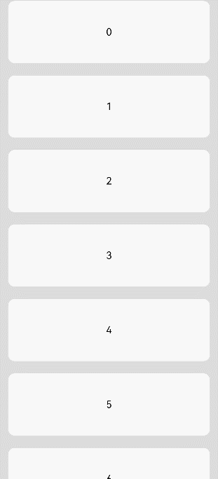

# ListItem

The **ListItem** component displays specific items in the list. It must be used together with **List**.

> **NOTE**
>
> - This component is supported since API version 7. Updates will be marked with a superscript to indicate their earliest API version.
> - The parent of this component can only be [List](ts-container-list.md) or [ListItemGroup](ts-container-listitemgroup.md).
> - When this component is used with **LazyForEach**, its child components are created when it is created. When this component is used with **if/else** or **ForEach**, or when the parent component is **List** or **ListItemGroup**, its child components are created when it is laid out.

## Child Components

This component can contain a single child component.

## APIs

### ListItem<sup>10+</sup>

ListItem(value?: ListItemOptions)

**Widget capability**: This API can be used in ArkTS widgets since API version 10.

**Atomic service API**: This API can be used in atomic services since API version 11.

**System capability**: SystemCapability.ArkUI.ArkUI.Full

**Parameters**

| Name| Type                                     | Mandatory| Description                                                    |
| ------ | --------------------------------------------- | ---- | ------------------------------------------------------------ |
| value  | [ListItemOptions](#listitemoptions10) | No  | Value of the list item, containing the **style** parameter of the **ListItemStyle** enum type.|

### ListItem<sup>(deprecated)</sup>

ListItem(value?: string)

This API is deprecated since API version 10. You are advised to use [ListItem<sup>10+</sup>](#listitem10) instead.

**Widget capability**: Since API version 9, this API is supported in ArkTS widgets.

**System capability**: SystemCapability.ArkUI.ArkUI.Full

**Parameters**

| Name| Type                     | Mandatory| Description|
| ------ | ----------------------------- | ---- | -------- |
| value  | string | No  | N/A      |

## Attributes

In addition to the [universal attributes](ts-component-general-attributes.md), the following attributes are supported.

### sticky<sup>(deprecated)</sup>

sticky(value: Sticky)

Sets the sticky effect of the list item.

This attribute is deprecated since API version 9. You are advised to use [the sticky attribute of the List component](ts-container-list.md#sticky9) instead.

**System capability**: SystemCapability.ArkUI.ArkUI.Full

**Parameters**

| Name| Type                               | Mandatory| Description                                      |
| ------ | ----------------------------------- | ---- | ------------------------------------------ |
| value  | [Sticky](#stickydeprecated) | Yes  | Sticky effect of the list item.<br>Default value: **Sticky.None**|

### editable<sup>(deprecated)</sup>

editable(value: boolean | EditMode)

Sets whether to enable edit mode, where the list item can be deleted or moved.

This API is deprecated since API version 9. There is no substitute API.

**System capability**: SystemCapability.ArkUI.ArkUI.Full

**Parameters**

| Name| Type                                                        | Mandatory| Description                                      |
| ------ | ------------------------------------------------------------ | ---- | ------------------------------------------ |
| value  | boolean \| [EditMode](#editmodedeprecated) | Yes  | Whether to enable edit mode.<br>Default value: **false**|

### selectable<sup>8+</sup>

selectable(value: boolean)

Sets whether the list item is selectable for multiselect. This attribute takes effect only when mouse frame selection is enabled for the parent **List** container.

**Widget capability**: Since API version 9, this API is supported in ArkTS widgets.

**Atomic service API**: This API can be used in atomic services since API version 11.

**System capability**: SystemCapability.ArkUI.ArkUI.Full

**Parameters**

| Name| Type   | Mandatory| Description                                             |
| ------ | ------- | ---- | ------------------------------------------------- |
| value  | boolean | Yes  | Whether the list item is selectable for multiselect.<br>Default value: **true**|

### selected<sup>10+</sup>

selected(value: boolean)

Sets whether the list item is selected. This attribute supports two-way binding through [$$](../../../ui/state-management/arkts-two-way-sync.md). This attribute must be used before the [style for the selected state](./ts-universal-attributes-polymorphic-style.md) is set. Otherwise, the style settings will not take effect.

**Widget capability**: This API can be used in ArkTS widgets since API version 10.

**Atomic service API**: This API can be used in atomic services since API version 11.

**System capability**: SystemCapability.ArkUI.ArkUI.Full

**Parameters**

| Name| Type   | Mandatory| Description                                    |
| ------ | ------- | ---- | ---------------------------------------- |
| value  | boolean | Yes  | Whether the list item is selected.<br>Default value: **false**|

### swipeAction<sup>9+</sup>

swipeAction(value: SwipeActionOptions)

Sets the swipe action item displayed when the list item is swiped out from the screen edge.

**Atomic service API**: This API can be used in atomic services since API version 11.

**System capability**: SystemCapability.ArkUI.ArkUI.Full

**Parameters**

| Name| Type                                             | Mandatory| Description                |
| ------ | ------------------------------------------------- | ---- | -------------------- |
| value  | [SwipeActionOptions](#swipeactionoptions9) | Yes  | Swipe action item displayed when the list item is swiped out from the screen edge.|

## Sticky<sup>(deprecated)</sup>
This API is deprecated since API version 9. You are advised to use [the stickyStyle enum of the List component](ts-container-list.md#stickystyle9) instead.

**System capability**: SystemCapability.ArkUI.ArkUI.Full

| Name| Value| Description|
| -------- | -------- | -------- |
| None |  0  | The list item is not sticky.|
| Normal |  1  | The list item is sticky with no special effects.|
| Opacity |  2  | The list item is sticky with opacity changes.|

## EditMode<sup>(deprecated)</sup>
This API is deprecated since API version 9. There is no substitute API.

**System capability**: SystemCapability.ArkUI.ArkUI.Full

| Name    | Value| Description     |
| ------ | ------ | --------- |
| None   |  0  | The editing operation is not restricted.   |
| Deletable |  1  | The list item can be deleted.|
| Movable |  2  | The list item can be moved.|

## SwipeEdgeEffect<sup>9+</sup>

**Atomic service API**: This API can be used in atomic services since API version 11.

**System capability**: SystemCapability.ArkUI.ArkUI.Full

| Name    | Value| Description     |
| ------ | ------ | --------- |
|   Spring   |    0    | When the list item scrolls to the edge of the list, it can continue to scroll for a distance.<br>If the delete area is set, the list item can continue to scroll after the scroll distance exceeds the delete threshold and,<br>after being released, rebound following the spring curve.|
|   None   |    1    | The list item cannot scroll beyond the edge of the list.<br>If the delete area is set, the list item cannot continue to scroll after the scroll distance exceeds the delete threshold.<br>If the delete callback is set, it is triggered when the delete threshold is reached and the list item is released.|

## SwipeActionOptions<sup>9+</sup>

The top level of the @builder function corresponding to **start** and **end** must be a single component and cannot be an **if/else**, **ForEach**, or **LazyForEach** statement.

The swipe gesture works only in the list item area. If a swipe causes a child component to extend beyond the list item area, the portion outside the area does not respond to the swipe. In light of this, avoid setting **swipeAction** to a component too wide in a multi-column list.

**System capability**: SystemCapability.ArkUI.ArkUI.Full

| Name                        | Type                                                        | Mandatory| Description                                                        |
| ---------------------------- | ------------------------------------------------------------ | ---- | ------------------------------------------------------------ |
| start                        | [CustomBuilder](ts-types.md#custombuilder8) \| [SwipeActionItem](#swipeactionitem10) | No  | Swipe action item displayed on the left of the list item when the item is swiped right (in vertical list layout) or above the list item when the item is swiped down (in horizontal list layout).<br>**Atomic service API**: This API can be used in atomic services since API version 11.|
| end                          | [CustomBuilder](ts-types.md#custombuilder8) \| [SwipeActionItem](#swipeactionitem10) | No  | Swipe action item displayed on the right of the list item when the item is swiped left (in vertical list layout) or below the list item when the item is swiped up (in horizontal list layout).<br>**Atomic service API**: This API can be used in atomic services since API version 11.|
| edgeEffect                   | [SwipeEdgeEffect](#swipeedgeeffect9)                 | No  | Scroll effect.<br>**Atomic service API**: This API can be used in atomic services since API version 11.                                               |
| onOffsetChange<sup>11+</sup> | (offset: number) => void                                     | No  | Callback invoked when the scroll offset changes.<br>**NOTE**<br> Specifically, this callback is invoked when the location of the list item changes, in vp, when it is swiped left or right (in vertical list layout) or up or down (in horizontal list layout).<br>**Atomic service API**: This API can be used in atomic services since API version 12.|

## SwipeActionItem<sup>10+</sup>

Describes the swipe action item.<br>For a list in vertical layout, it refers to the delete option displayed on the left (or right) of the list item when the list item is swiped right (or left).
<br>For a list in horizontal layout, it refers to the delete option displayed below (or above) the list item when the list item is swiped up (or down).

**System capability**: SystemCapability.ArkUI.ArkUI.Full

| Name                | Type                                                    | Mandatory| Description                                                        |
| -------------------- | ------------------------------------------------------------ | ---- | ------------------------------------------------------------ |
| actionAreaDistance | [Length](ts-types.md#length) | No| Swipe distance threshold for deleting the list item.<br>Default value: **56vp**<br>**NOTE**<br>This parameter cannot be set in percentage.<br>If the value is greater than the list item width minus the width of **swipeAction**, or is less than or equal to 0, the delete area will not be set.<br>**Atomic service API**: This API can be used in atomic services since API version 11.|
| onAction | () => void | No| Callback invoked when the list item is released while in the delete area.<br>**NOTE**<br> This callback is invoked only when the list item is released in a position that meets or goes beyond the specified swipe distance threshold (which must be valid) for deleting the list item.<br>**Atomic service API**: This API can be used in atomic services since API version 11.|
| onEnterActionArea | () => void | No| Callback invoked each time the list item enters the delete area.<br>**Atomic service API**: This API can be used in atomic services since API version 11.|
| onExitActionArea | () => void | No|Callback invoked each time the list item exits the delete area.<br>**Atomic service API**: This API can be used in atomic services since API version 11.|
| builder |  [CustomBuilder](ts-types.md#custombuilder8) | No|Swipe action item displayed when the list item is swiped left or right (in vertical list layout) or up or down (in horizontal list layout).<br>**Atomic service API**: This API can be used in atomic services since API version 11.|
| builderComponent<sup>18+</sup> |  [ComponentContent](../js-apis-arkui-ComponentContent.md) | No|Swipe action item displayed when the list item is swiped left or right (in vertical list layout) or up or down (in horizontal list layout).<br>**NOTE**<br>This parameter takes precedence over the **builder** parameter. This means that, if both **builder** and **builderComponent** are set, the value of **builderComponent** is used.<br> To avoid display issues, do not assign the same **builderComponent** to different swipe action items specified by **start** and **end**.<br>**Atomic service API**: This API can be used in atomic services since API version 18.|
| onStateChange<sup>11+</sup> | (state:[SwipeActionState](#swipeactionstate11)) => void | No|Callback invoked when the swipe state of the list item changes.<br>**Atomic service API**: This API can be used in atomic services since API version 12.|
## ListItemOptions<sup>10+</sup>

**Atomic service API**: This API can be used in atomic services since API version 11.

**System capability**: SystemCapability.ArkUI.ArkUI.Full

| Name | Type                                 | Mandatory| Description                                                        |
| ----- | ----------------------------------------- | ---- | ------------------------------------------------------------ |
| style | [ListItemStyle](#listitemstyle10) | No  | Style of the list item.<br>Default value: **ListItemStyle.NONE**<br>If this parameter is set to **ListItemStyle.NONE**, no style is applied.<br>When **ListItemStyle.CARD** is used, you are advised to pair it with **ListItemGroupStyle.CARD** from [ListItemGroup](ts-container-listitemgroup.md) to apply the default card style.<br>In the card style, the default specifications for a list item are as follows: a height of 48 vp, a width of 100%, and horizontal padding of 8 vp on both the left and right sides. If you want to implement an adaptive height for the list item, you can set the **height** attribute to **undefined**.<br>It can be in focus, hover, press, selected, or disable style depending on the state.<br>**NOTE**<br>In the card style, by default, the list runs along the vertical axis, that is, **listDirection** is at **Axis.Vertical**. If **listDirection** is set to **Axis.Horizontal**, a disordered display may result. The **alignListItem** attribute of the list is set to **ListItemAlign.Center** by default, which aligns the list items in the center.|

## ListItemStyle<sup>10+</sup>

**Atomic service API**: This API can be used in atomic services since API version 11.

**System capability**: SystemCapability.ArkUI.ArkUI.Full

| Name| Value | Description            |
| ---- | ---- | ------------------ |
| NONE | 0 | No style.          |
| CARD | 1 | Default card style.|

## SwipeActionState<sup>11+</sup>

**Atomic service API**: This API can be used in atomic services since API version 12.

**System capability**: SystemCapability.ArkUI.ArkUI.Full

| Name     | Value    | Description                                                      |
| --------- | --------- | ------------------------------------------------------------ |
| COLLAPSED | 0 | Collapsed state.<br>When the list item is swiped left or right (in vertical list layout) or up or down (in horizontal list layout), the swipe action item is hidden.|
| EXPANDED  | 1 | Expanded state.<br>When the list item is swiped left or right (in vertical list layout) or up or down (in horizontal list layout), the swipe action item is shown.<br>**NOTE**<br>When the list item is swiped left or right (in vertical list layout)<br>or up or down (in horizontal list layout), the swipe action item is shown.|
| ACTIONING | 2 | In-action state. The list item is in this state when it enters the delete area.<br>**NOTE**<br>A list item can enter this state only when it is released in a position that meets or goes beyond the specified swipe distance threshold (which must be valid) for deleting the list item.|

## Events

### onSelect<sup>8+</sup>

onSelect(event: (isSelected: boolean) =&gt; void)

Triggered when the selected state of the list item for multiselect changes.

**Widget capability**: This API can be used in ArkTS widgets since API version 9.

**Atomic service API**: This API can be used in atomic services since API version 11.

**System capability**: SystemCapability.ArkUI.ArkUI.Full

**Parameters**

| Name    | Type   | Mandatory| Description                                                        |
| ---------- | ------- | ---- | ------------------------------------------------------------ |
| isSelected | boolean | Yes  | Returns **true** if the list item is selected for multselect; returns **false** otherwise.|

## Example

### Example 1: Creating a List Item
This example demonstrates the basic usage of creating a list item.

```ts
// xxx.ets
@Entry
@Component
struct ListItemExample {
  private arr: number[] = [0, 1, 2, 3, 4, 5, 6, 7, 8, 9]

  build() {
    Column() {
      List({ space: 20, initialIndex: 0 }) {
        ForEach(this.arr, (item: number) => {
          ListItem() {
            Text('' + item)
              .width('100%')
              .height(100)
              .fontSize(16)
              .textAlign(TextAlign.Center)
              .borderRadius(10)
              .backgroundColor(0xFFFFFF)
          }
        }, (item: string) => item)
      }.width('90%')
      .scrollBar(BarState.Off)
    }.width('100%').height('100%').backgroundColor(0xDCDCDC).padding({ top: 5 })
  }
}
```



### Example 2: Setting the Swipe Action Item
This example shows how to set the swipe action item for a list item using **swipeAction**.

```ts
// xxx.ets
@Entry
@Component
struct ListItemExample2 {
  @State arr: number[] = [0, 1, 2, 3, 4]
  @State enterEndDeleteAreaString: string = "not enterEndDeleteArea"
  @State exitEndDeleteAreaString: string = "not exitEndDeleteArea"
  private scroller: ListScroller = new ListScroller()

  @Builder itemEnd() {
    Row() {
      Button("Delete").margin("4vp")
      Button("Set").margin("4vp").onClick(() => {
        this.scroller.closeAllSwipeActions()
      })
    }.padding("4vp").justifyContent(FlexAlign.SpaceEvenly)
  }

  build() {
    Column() {
      List({ space: 10, scroller: this.scroller }) {
        ForEach(this.arr, (item: number) => {
          ListItem() {
            Text("item" + item)
              .width('100%')
              .height(100)
              .fontSize(16)
              .textAlign(TextAlign.Center)
              .borderRadius(10)
              .backgroundColor(0xFFFFFF)
          }
          .transition({ type: TransitionType.Delete, opacity: 0 })
          .swipeAction({
            end: {
              builder: () => { this.itemEnd() },
              onAction: () => {
                animateTo({ duration: 1000 }, () => {
                  let index = this.arr.indexOf(item)
                  this.arr.splice(index, 1)
                })
              },
              actionAreaDistance: 56,
              onEnterActionArea: () => {
                this.enterEndDeleteAreaString = "enterEndDeleteArea"
                this.exitEndDeleteAreaString = "not exitEndDeleteArea"
              },
              onExitActionArea: () => {
                this.enterEndDeleteAreaString = "not enterEndDeleteArea"
                this.exitEndDeleteAreaString = "exitEndDeleteArea"
              }
            }
          })
        }, (item: string) => item)
      }
      Text(this.enterEndDeleteAreaString).fontSize(20)
      Text(this.exitEndDeleteAreaString).fontSize(20)
    }
    .padding(10)
    .backgroundColor(0xDCDCDC)
    .width('100%')
    .height('100%')
  }
}
```


### Example 3: Applying a Card-style Effect
This example illustrates the card-style effect of the **ListItem** component.

```ts
// xxx.ets
@Entry
@Component
struct ListItemExample3 {
  build() {
    Column() {
      List({ space: "4vp", initialIndex: 0 }) {
        ListItemGroup({ style: ListItemGroupStyle.CARD }) {
          ForEach([ListItemStyle.CARD, ListItemStyle.CARD, ListItemStyle.NONE], (itemStyle: number, index?: number) => {
            ListItem({ style: itemStyle }) {
              Text("" + index)
                .width("100%")
                .textAlign(TextAlign.Center)
            }
          })
        }
        ForEach([ListItemStyle.CARD, ListItemStyle.CARD, ListItemStyle.NONE], (itemStyle: number, index?: number) => {
          ListItem({ style: itemStyle }) {
            Text("" + index)
              .width("100%")
              .textAlign(TextAlign.Center)
          }
        })
      }
      .width('100%')
      .multiSelectable(true)
      .backgroundColor(0xDCDCDC)
    }
    .width('100%')
    .padding({ top: 5 })
  }
}
```


### Example 4: Setting the Swipe Action Item Using ComponentContent

This example demonstrates how to set swipe action items for list items using **ComponentContent**.

```ts
// xxx.ets
import { ComponentContent } from '@kit.ArkUI';

class BuilderParams {
  text: string | Resource;
  scroller: ListScroller
  constructor(text: string | Resource, scroller: ListScroller) {
    this.text = text;
    this.scroller = scroller;
  }
}

@Builder
function itemBuilder(params: BuilderParams) {
  Row() {
    Button(params.text).margin("4vp")
    Button("Set").margin("4vp").onClick(() => {
      params.scroller.closeAllSwipeActions()
    })
  }.padding("4vp").justifyContent(FlexAlign.SpaceEvenly)
}
@Component
struct MyListItem {
  scroller: ListScroller = new ListScroller()
  @State arr: number[] = [0, 1, 2, 3, 4]
  @State project ?: number = 0
  startBuilder ?: ComponentContent<BuilderParams> = undefined
  endBuilder ?: ComponentContent<BuilderParams> = undefined

  builderParam = new BuilderParams("delete", this.scroller)

  aboutToAppear(): void {
    this.startBuilder = new ComponentContent(this.getUIContext(), wrapBuilder(itemBuilder), this.builderParam)
    this.endBuilder = new ComponentContent(this.getUIContext(), wrapBuilder(itemBuilder), this.builderParam)
  }
  GetStartBuilder() {
    this.startBuilder?.update(new BuilderParams("StartDelete", this.scroller));
    return this.startBuilder;
  }
  GetEndBuilder() {
    this.endBuilder?.update(new BuilderParams("EndDelete", this.scroller));
    return this.endBuilder;
  }
  build() {
    ListItem() {
      Text("item" + this.project)
        .width('100%')
        .height(100)
        .fontSize(16)
        .textAlign(TextAlign.Center)
        .borderRadius(10)
        .backgroundColor(0xFFFFFF)
    }
    .transition({ type: TransitionType.Delete, opacity: 0 })
    .swipeAction({
      end: {
        builderComponent: this.GetEndBuilder(),
        onAction: () => {
          animateTo({ duration: 1000 }, () => {
            let index = this.arr.indexOf(this.project)
            this.arr.splice(index, 1)
          })
        },
        actionAreaDistance: 56
      },
      start: {
        builderComponent: this.GetStartBuilder(),
        onAction: () => {
          animateTo({ duration: 1000 }, () => {
            let index = this.arr.indexOf(this.project)
            this.arr.splice(index, 1)
          })
        },
        actionAreaDistance: 56
      }
    })
    .padding(5)
  }
}

@Entry
@Component
struct ListItemExample {
  @State arr: number[] = [0, 1, 2, 3, 4]
  private scroller: ListScroller = new ListScroller()

  build() {
    Column() {
      List({ space: 10, scroller: this.scroller }) {
        ListItemGroup() {
          ForEach(this.arr, (project: number) => {
            MyListItem({ scroller: this.scroller, project: project, arr:this.arr })
          }, (item: string) => item)
        }
      }
    }
    .padding(10)
    .backgroundColor(0xDCDCDC)
    .width('100%')
    .height('100%')
  }
}
```

