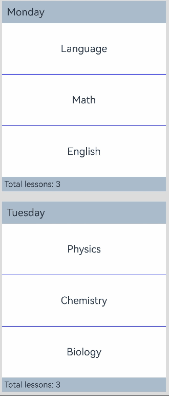
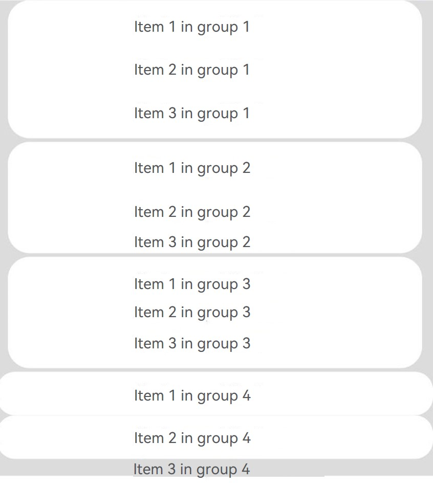

# ListItemGroup

The **ListItemGroup** component is used to display list item groups. It must be used with the [List](ts-container-list.md) component. Unless specified otherwise, it spans the entire width of the **List** component.

> **NOTE**
>
> - This component is supported since API version 9. Updates will be marked with a superscript to indicate their earliest API version.
> - This component can be used only as a child of [List](ts-container-list.md).
> - The **ListItemGroup** component does not support the universal attribute [aspectRatio](ts-universal-attributes-layout-constraints.md).
> - If the parent **List** component of **ListItemGroup** has its **listDirection** attribute set to **Axis.Vertical**, setting the [universal attribute height](ts-universal-attributes-size.md) has no effect. In this case, the height of the **ListItemGroup** component is fixed at the sum of the component's header height, footer height, and total height of the list items.
> - If the parent **List** component of **ListItemGroup** has its **listDirection** attribute set to **Axis.Horizontal**, setting the [universal attribute width](ts-universal-attributes-size.md) has no effect. In this case, the width of the **ListItemGroup** component is fixed at the sum of the component's header width, footer width, and total width of the list items.
> - The list items in the **ListItemGroup** component cannot be edited or dragged. This means that their **editable** attribute does not take effect.
> - The **ListItemGroup** ignores the **direction** attribute for setting the layout direction; instead, it adopts the layout direction of its parent **List** component.

## Child Components

This component supports the [ListItem](ts-container-listitem.md) child component.


## APIs

ListItemGroup(options?: ListItemGroupOptions)

**Atomic service API**: This API can be used in atomic services since API version 11.

**System capability**: SystemCapability.ArkUI.ArkUI.Full

**Parameters**

| Name| Type| Mandatory| Description|
| -------- | -------- | -------- | -------- |
| options |  [ListItemGroupOptions](#listitemgroupoptions)| No| Parameters of the list item group.|

## ListItemGroupOptions

**System capability**: SystemCapability.ArkUI.ArkUI.Full

| Name             | Type                                           | Mandatory| Description                                                    |
| ------------------- | --------------------------------------------------- | ---- | ------------------------------------------------------------ |
| header              | [CustomBuilder](ts-types.md#custombuilder8)     | No  | Header of the list item group.<br>**NOTE**<br>One child component, or no child component at all, can be placed inside.<br>**Atomic service API**: This API can be used in atomic services since API version 11.              |
| headerComponent<sup>13+</sup>              | [ComponentContent](../js-apis-arkui-ComponentContent.md)       | No  | Header of the list item group, in the type of ComponentContent.<br>**NOTE**<br>One child component, or no child component at all, can be placed inside. This parameter takes precedence over the **header** parameter. This means that, if both **header** and **headerComponent** are set, the value of **headerComponent** is used.<br>To avoid display issues, do not assign the same **headerComponent** to different **ListItemGroup** components.<br>**Atomic service API**: This API can be used in atomic services since API version 13.             |
| footer              | [CustomBuilder](ts-types.md#custombuilder8)       | No  | Footer of the list item group.<br>**NOTE**<br>One child component, or no child component at all, can be placed inside.<br>**Atomic service API**: This API can be used in atomic services since API version 11.              |
| footerComponent<sup>13+</sup>              | [ComponentContent](../js-apis-arkui-ComponentContent.md)       | No  | Footer of the list item group, in the type of ComponentContent.<br>**NOTE**<br>One child component, or no child component at all, can be placed inside. This parameter takes precedence over the **footer** parameter. This means that, if both **footer** and **footerComponent** are set, the value of **footerComponent** is used.<br>To avoid display issues, do not assign the same **footerComponent** to different **ListItemGroup** components.<br>**Atomic service API**: This API can be used in atomic services since API version 13.                          |
| space               | number \| string                          | No  | Spacing between list items. This parameter only affects the spacing between list items, but not spacing between the header and list items or between the footer and list items.<br>Default value: **0**<br>Unit: vp<br>**Atomic service API**: This API can be used in atomic services since API version 11. |
| style<sup>10+</sup> | [ListItemGroupStyle](#listitemgroupstyle10) | No  | Style of the list item group.<br>Default value: **ListItemGroupStyle.NONE**<br>If this parameter is set to **ListItemGroupStyle.NONE**, no style is applied.<br>When **ListItemGroupStyle.CARD** is used, you are advised to pair it with **ListItemStyle.CARD** from [ListItem](ts-container-listitem.md) to apply the default card style.<br>In the card style, the default specifications for the **ListItemGroup** are as follows: horizontal margin of 12 vp on both left and right sides, and vertical as well as horizontal padding of 4 vp.<br>In the default card style, list items can be in focus, hover, press, selected, or disable style depending on their state.<br>**NOTE**<br>In the card style, by default, the list runs along the vertical axis, that is, **listDirection** is at **Axis.Vertical**. If **listDirection** is set to **Axis.Horizontal**, a disordered display may result. The **alignListItem** attribute of the list is set to **ListItemAlign.Center** by default, which aligns the list items in the center.<br>**Atomic service API**: This API can be used in atomic services since API version 11.|

## Attributes

### divider

divider(value: [ListDividerOptions](ts-container-list.md#listdivideroptions18) | null)

Sets the style of the divider for the list items. By default, there is no divider.

**strokeWidth**, **startMargin**, and **endMargin** cannot be set in percentage.

When a list item has [polymorphic styles](ts-universal-attributes-polymorphic-style.md) applied, the dividers above and below the pressed child component are not rendered.

**Atomic service API**: This API can be used in atomic services since API version 11.

**System capability**: SystemCapability.ArkUI.ArkUI.Full

**Parameters**

| Name| Type                                                        | Mandatory| Description                                                        |
| ------ | ------------------------------------------------------------ | ---- | ------------------------------------------------------------ |
| value  | [ListDividerOptions](ts-container-list.md#listdivideroptions18) \| null | Yes  | Style of the divider for the list items.<br> Default value: **null**|

### childrenMainSize<sup>12+</sup>

childrenMainSize(value: ChildrenMainSize)

Sets the size information of the child components of a **ListItemGroup** component along the main axis.

**Atomic service API**: This API can be used in atomic services since API version 12.

**System capability**: SystemCapability.ArkUI.ArkUI.Full

**Parameters**

| Name    | Type  | Mandatory| Description                           |
| ---------- | ------ | ---- | ------------------------------- |
| value | [ChildrenMainSize](ts-container-scrollable-common.md#childrenmainsize12) | Yes  | Size information of all list items along the main axis, provided through a **ChildrenMainSize** object to the **ListItemGroup** component.<br>The provided size along the main axis must be consistent with the actual size of the child components on the main axis.<br>For the setting to take effect, this attribute must be used together with the **childrenMainSize** attribute of the **List** component.<br>Any changes in size or additions/removals of child components must be communicated to the **ListItemGroup** component through the **ChildrenMainSize** object method.|

## ListItemGroupStyle<sup>10+</sup>

**Atomic service API**: This API can be used in atomic services since API version 11.

**System capability**: SystemCapability.ArkUI.ArkUI.Full

| Name| Value | Description            |
| ---- | ---- | ------------------ |
| NONE | 0 | No style.          |
| CARD | 1 | Default card style.|


## Example

### Example 1: Setting a Sticky Header and Footer

This example demonstrates how to set a sticky header and footer using the **stick** attribute.

```ts
// xxx.ets
@Entry
@Component
struct ListItemGroupExample {
  private timeTable: TimeTable[] = [
    {
      title: 'Monday',
      projects: ['Language', 'Math', 'English']
    },
    {
      title: 'Tuesday',
      projects: ['Physics', 'Chemistry', 'Biology']
    },
    {
      title: 'Wednesday',
      projects: ['History', 'Geography', 'Politics']
    },
    {
      title: 'Thursday',
      projects: ['Art', 'Music', 'Sports']
    }
  ]

  @Builder
  itemHead(text: string) {
    Text(text)
      .fontSize(20)
      .backgroundColor(0xAABBCC)
      .width("100%")
      .padding(10)
  }

  @Builder
  itemFoot(num: number) {
    Text('Total lessons: ' + num)
      .fontSize(16)
      .backgroundColor(0xAABBCC)
      .width("100%")
      .padding(5)
  }

  build() {
    Column() {
      List({ space: 20 }) {
        ForEach(this.timeTable, (item: TimeTable) => {
          ListItemGroup({ header: this.itemHead(item.title), footer: this.itemFoot(item.projects.length) }) {
            ForEach(item.projects, (project: string) => {
              ListItem() {
                Text(project)
                  .width("100%")
                  .height(100)
                  .fontSize(20)
                  .textAlign(TextAlign.Center)
                  .backgroundColor(0xFFFFFF)
              }
            }, (item: string) => item)
          }
          .divider({ strokeWidth: 1, color: Color.Blue }) // Divider between lines
        })
      }
      .width('90%')
      .sticky(StickyStyle.Header | StickyStyle.Footer)
      .scrollBar(BarState.Off)
    }.width('100%').height('100%').backgroundColor(0xDCDCDC).padding({ top: 5 })
  }
}

interface TimeTable {
  title: string;
  projects: string[];
}
```



### Example 2: Setting the Card Style

This example illustrates the card-style effect of the **ListItemGroup** component.

```ts
// xxx.ets
@Entry
@Component
struct ListItemGroupExample2 {
  private arr: ArrObject[] = [
    {
      style: ListItemGroupStyle.CARD,
      itemStyles: [ListItemStyle.CARD, ListItemStyle.CARD, ListItemStyle.CARD]
    },
    {
      style: ListItemGroupStyle.CARD,
      itemStyles: [ListItemStyle.CARD, ListItemStyle.CARD, ListItemStyle.NONE]
    },
    {
      style: ListItemGroupStyle.CARD,
      itemStyles: [ListItemStyle.CARD, ListItemStyle.NONE, ListItemStyle.CARD]
    },
    {
      style: ListItemGroupStyle.NONE,
      itemStyles: [ListItemStyle.CARD, ListItemStyle.CARD, ListItemStyle.NONE]
    }
  ]

  build() {
    Column() {
      List({ space: "4vp", initialIndex: 0 }) {
        ForEach(this.arr, (item: ArrObject, index?: number) => {
          ListItemGroup({ style: item.style }) {
            ForEach(item.itemStyles, (itemStyle: number, itemIndex?: number) => {
              ListItem({ style: itemStyle }) {
                if (index != undefined && itemIndex != undefined) {
                  Text("Item " + (itemIndex + 1) +" in group " + (index + 1))
                    .width("100%")
                    .textAlign(TextAlign.Center)
                }
              }
            }, (item: string) => item)
          }
        })
      }
      .width('100%')
      .multiSelectable(true)
      .backgroundColor(0xDCDCDC)
    }
    .width('100%')
    .padding({ top: 5 })
  }
}

interface ArrObject {
  style: number;
  itemStyles: number[];
}
```


### Example 3: Setting Header and Footer

This example demonstrates how to set the header and footer using **ComponentContent**.

```ts
// xxx.ets
import { ComponentContent } from '@kit.ArkUI';

interface TimeTable {
  title: string;
  projects: string[];
}

class HeadBuilderParams {
  text: string | Resource;
  constructor(text: string | Resource) {
    this.text = text;
  }
}

class FootBuilderParams {
  num: number | Resource;
  constructor(num: number | Resource) {
    this.num = num;
  }
}

@Builder
function itemHead(params: HeadBuilderParams) {
  Text(params.text)
    .fontSize(20)
    .height('48vp')
    .width("100%")
    .padding(10)
    .backgroundColor($r('sys.color.background_tertiary'))
}

@Builder
function itemFoot(params: FootBuilderParams) {
  Text('Total lessons: ' + params.num)
    .fontSize(20)
    .height('48vp')
    .width("100%")
    .padding(10)
    .backgroundColor($r('sys.color.background_tertiary'))
}

@Component
struct MyItemGroup {
  item: TimeTable = { title: "", projects: [] }
  header?: ComponentContent<HeadBuilderParams> = undefined
  footer?: ComponentContent<FootBuilderParams> = undefined
  headerParam = new HeadBuilderParams(this.item.title)
  footerParam = new FootBuilderParams(this.item.projects.length)

  aboutToAppear(): void {
    this.header = new ComponentContent(this.getUIContext(), wrapBuilder(itemHead), this.headerParam)
    this.footer = new ComponentContent(this.getUIContext(), wrapBuilder(itemFoot), this.footerParam)
  }
  GetHeader() {
    this.header?.update(new HeadBuilderParams(this.item.title));
    return this.header;
  }

  GetFooter() {
    this.footer?.update(new FootBuilderParams(this.item.projects.length));
    return this.footer;
  }

  build() {
    ListItemGroup({
      headerComponent: this.GetHeader(),
      footerComponent: this.GetFooter()
    }) {
      ForEach(this.item.projects, (project: string) => {
        ListItem() {
          Text(project)
            .width("100%")
            .height(100)
            .fontSize(20)
            .textAlign(TextAlign.Center)
        }
      }, (item: string) => item)
    }
    .divider({ strokeWidth: 1, color: Color.Blue }) // Divider between lines
  }
}

@Entry
@Component
struct ListItemGroupExample {
  @State timeTable: TimeTable[] = [
    {
      title: 'Monday',
      projects: ['Language', 'Math', 'English']
    },
    {
      title: 'Tuesday',
      projects: ['Physics', 'Chemistry', 'Biology']
    },
    {
      title: 'Wednesday',
      projects: ['History', 'Geography', 'Politics', 'Sports']
    },
    {
      title: 'Thursday',
      projects: ['Art', 'Music']
    }
  ]

  build() {
    Column() {
      Button("Update").width(100).height(50).onClick(() => {
        this.timeTable[0] = {
          title: 'Monday after update',
          projects: ['Language', 'Physics', 'History', 'Art']
        }
      })
      List({ space: 20 }) {
        ForEach(this.timeTable, (item: TimeTable) => {
          MyItemGroup({ item: item })
        })
      }
      .layoutWeight(1)
      .sticky(StickyStyle.Header | StickyStyle.Footer)
      .scrollBar(BarState.Off)
    }
    .backgroundColor($r('sys.color.background_primary'))
  }
}
```


