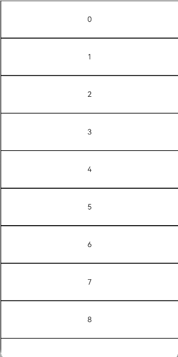
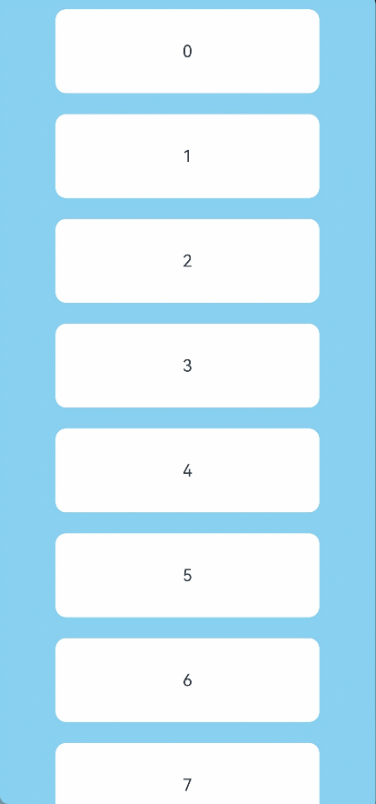

# Refresh

The **Refresh** component is a container that provides the pull-to-refresh feature.

>  **NOTE**
>
>  - This component is supported since API version 8. Updates will be marked with a superscript to indicate their earliest API version.
>
>  - This component provides linkage with a vertical scrolling **Swiper** and **Web** component since API version 12. The linkage does not work if the **loop** attribute of **Swiper** is set to **true**.

## Child Components

This component supports only one child component.

Since API version 11, this component's child component moves down with the pull-down gesture.

## APIs

Refresh(value: RefreshOptions)

**Atomic service API**: This API can be used in atomic services since API version 11.

**System capability**: SystemCapability.ArkUI.ArkUI.Full

**Parameters**

| Name| Type| Mandatory| Description|
| -------- | -------- | -------- | -------- |
| value |  [RefreshOptions](#refreshoptions)| Yes| Parameters of the **Refresh** component.|

## RefreshOptions

**System capability**: SystemCapability.ArkUI.ArkUI.Full

| Name        | Type                                     | Mandatory  | Description                                    |
| ---------- | ---------------------------------------- | ---- | ---------------------------------------- |
| refreshing | boolean                                  | Yes   | Whether the component is being refreshed. The value **true** means that the component is being refreshed, and **false** means the opposite.<br>Default value: **false**<br>This parameter supports [$$](../../../quick-start/arkts-two-way-sync.md) for two-way binding of variables.<br>**Atomic service API**: This API can be used in atomic services since API version 11.|
| offset<sup>(deprecated)</sup>    | string \| number               | No   | Distance from the pull-down starting point to the top of the component.<br>Default value: **16**, in vp<br>This API is deprecated since API version 11. No substitute API is provided.<br>**NOTE**<br>The value range of **offset** is [0vp, 64vp]. If the value is greater than 64 vp, the value 64 vp will be used. The value cannot be a percentage or a negative number.|
| friction<sup>(deprecated)</sup>   | number \| string               | No   | Coefficient of friction, which indicates the **<Refresh\>** component's sensitivity to the pull-down gesture. The value ranges from 0 to 100.<br>Default value: **62**<br>- **0** indicates that the **Refresh** component is not responsive to the pull-down gesture.<br>- **100** indicates that the **Refresh** component is highly responsive to the pull-down gesture.<br>- A larger value indicates higher responsiveness of the **Refresh** component to the pull-down gesture.<br>This API is deprecated since API version 11. You can use [pullDownRatio](#pulldownratio12) instead since API version 12.|
| builder<sup>10+</sup>    | [CustomBuilder](ts-types.md#custombuilder8) | No   | Custom content in the refreshing area.<br>**NOTE**<br>In API version 10 and earlier versions, there is a height limit of 64 vp on custom components. This restriction is removed since API version 11.<br>When a custom component is set with a fixed height, it will be displayed below the refreshing area at that fixed height; when the custom component does not have a height set, its height will adapt to the height of the refreshing area, which may result in the height of the custom component changing to 0 along with the refreshing area. To prevent its height from being less than expected, you are advised to set a minimum height constraint for the custom component. For reference, see [Example 2](#example-2).<br>Since API version 12, use **refreshingContent** instead of **builder** for customizing the content of the refreshing area, to avoid animation interruptions caused by the destruction and re-creation of the custom component during the refreshing process.<br>**Atomic service API**: This API can be used in atomic services since API version 11.|
| promptText<sup>12+</sup> | [ResourceStr](ts-types.md#resourcestr) | No| Custom text displayed at the bottom of the refreshing area.<br>**NOTE**<br>When setting the text, follow the constraints on the **Text** components. If you are using **builder** or **refreshingContent** to customize the content displayed in the refreshing area, the text set with **promptText** will not be displayed.<br>When **promptText** is set and effective, the [refreshOffset](#refreshoffset12) attribute defaults to 96 vp.<br>**Atomic service API**: This API can be used in atomic services since API version 12.|
| refreshingContent<sup>12+</sup>    | [ComponentContent](../js-apis-arkui-ComponentContent.md) | No   | Custom content in the refreshing area.<br>**NOTE**<br>If this parameter and the **builder** parameter are set at the same time, the **builder** parameter does not take effect.<br>When a custom component is set with a fixed height, it will be displayed below the refreshing area at that fixed height; when the custom component does not have a height set, its height will adapt to the height of the refreshing area, which may result in the height of the custom component changing to 0 along with the refreshing area. To prevent its height from being less than expected, you are advised to set a minimum height constraint for the custom component. For reference, see [Example 5](#example-5).<br>**Atomic service API**: This API can be used in atomic services since API version 12.|

## Attributes

In addition to the [universal attributes](ts-universal-attributes-size.md), the following attributes are supported.

### refreshOffset<sup>12+</sup>

refreshOffset(value: number)

Sets the pull-down offset that initiates a refresh.

**Atomic service API**: This API can be used in atomic services since API version 12.

**System capability**: SystemCapability.ArkUI.ArkUI.Full

**Parameters**

| Name| Type                                       | Mandatory| Description                                                      |
| ------ | ------------------------------------------- | ---- | ---------------------------------------------------------- |
| value  | number |  Yes| Pull-down offset, in vp.<br>Default value: 96 vp when [promptText](#refreshoptions) is set and 64 vp when [promptText](#refreshoptions) is not<br>If the value specified is 0 or less than 0, the default value is used.|

### pullToRefresh<sup>12+</sup>

pullToRefresh(value: boolean)

Sets whether to initiate a refresh when the pull-down distance exceeds the value of [refreshOffset](#refreshoffset12).

**Atomic service API**: This API can be used in atomic services since API version 12.

**System capability**: SystemCapability.ArkUI.ArkUI.Full

**Parameters**

| Name| Type                                       | Mandatory| Description                                                      |
| ------ | ------------------------------------------- | ---- | ---------------------------------------------------------- |
| value  | boolean |  Yes| Whether to initiate a refresh when the pull-down distance exceeds the value of [refreshOffset](#refreshoffset12). The value **true** means to initiate a refresh, and **false** means the opposite.<br>Default value: **true**|

### pullDownRatio<sup>12+</sup>

pullDownRatio(ratio: [Optional](ts-universal-attributes-custom-property.md#optional12)\<number>)

Sets the pull-down ratio.

**Atomic service API**: This API can be used in atomic services since API version 12.

**System capability**: SystemCapability.ArkUI.ArkUI.Full

**Parameters**

| Name| Type                                       | Mandatory| Description                                                      |
| ------ | ------------------------------------------- | ---- | ---------------------------------------------------------- |
| ratio  | [Optional](ts-universal-attributes-custom-property.md#optional12)\<number> |  Yes| Pull-down ratio. A larger value indicates higher responsiveness to the pull-down gesture. The value **0** indicates that the pull-down does not follow the gesture, and **1** indicates that the pull-down follows the gesture proportionally.<br>If this parameter is not set or is set to **undefined**, a dynamic pull-down ratio is used. That is, the larger the pull-down distance, the smaller the ratio.<br>The value ranges from 0 to 1. A value less than 0 is handled as **0**, and a value greater than 1 is handled as **1**.

## Events

In addition to the [universal events](ts-universal-events-click.md), the following events are supported.

### onStateChange

onStateChange(callback: (state: RefreshStatus) => void)

Called when the refresh status changes.

**Atomic service API**: This API can be used in atomic services since API version 11.

**System capability**: SystemCapability.ArkUI.ArkUI.Full

**Parameters**

| Name| Type                                   | Mandatory| Description      |
| ------ | --------------------------------------- | ---- | ---------- |
| state  | [RefreshStatus](#refreshstatus) | Yes  | Refresh status.|

### onRefreshing

onRefreshing(callback: () => void)

Called when the component starts refreshing.

**Atomic service API**: This API can be used in atomic services since API version 11.

**System capability**: SystemCapability.ArkUI.ArkUI.Full

### onOffsetChange<sup>12+</sup>

onOffsetChange(callback: Callback\<number>)

Called when the pull-down distance changes.

**Atomic service API**: This API can be used in atomic services since API version 12.

**System capability**: SystemCapability.ArkUI.ArkUI.Full

**Parameters**

| Name| Type                                   | Mandatory| Description      |
| ------ | --------------------------------------- | ---- | ---------- |
| value  | number | Yes  | Pull-down distance.<br>Unit: vp|


## RefreshStatus

**Atomic service API**: This API can be used in atomic services since API version 11.

**System capability**: SystemCapability.ArkUI.ArkUI.Full

| Name      | Value      | Description                  |
| -------- | -------- | -------------------- |
| Inactive | 0 | The component is not pulled down. This is the default value.            |
| Drag     | 1 | The component is being pulled down, but the pull-down distance is shorter than the minimum length required to trigger the refresh.     |
| OverDrag | 2 | The component is being pulled down, and the pull-down distance exceeds the minimum length required to trigger the refresh.     |
| Refresh  | 3 | The pull-down ends, and the component rebounds to the minimum length required to trigger the refresh and enters the refreshing state.|
| Done     | 4 | The refresh is complete, and the component returns to the initial state (at the top).    |


## Example

### Example 1

This example implements a **Refresh** with its refreshing area in the default style.

```ts
// xxx.ets
@Entry
@Component
struct RefreshExample {
  @State isRefreshing: boolean = false
  @State arr: String[] = ['0', '1', '2', '3', '4','5','6','7','8','9','10']

  build() {
    Column() {
      Refresh({ refreshing: $$this.isRefreshing}) {
        List() {
          ForEach(this.arr, (item: string) => {
            ListItem() {
              Text('' + item)
                .width('70%').height(80).fontSize(16).margin(10)
                .textAlign(TextAlign.Center).borderRadius(10).backgroundColor(0xFFFFFF)
            }
          }, (item: string) => item)
        }
        .onScrollIndex((first: number) => {
          console.info(first.toString())
        })
        .width('100%')
        .height('100%')
        .alignListItem(ListItemAlign.Center)
        .scrollBar(BarState.Off)
      }
      .onStateChange((refreshStatus: RefreshStatus) => {
        console.info('Refresh onStatueChange state is ' + refreshStatus)
      })
      .onOffsetChange((value: number) => {
        console.info('Refresh onOffsetChange offset:' + value)
      })
      .onRefreshing(() => {
        setTimeout(() => {
          this.isRefreshing = false
        }, 2000)
        console.log('onRefreshing test')
      })
      .backgroundColor(0x89CFF0)
      .refreshOffset(64)
      .pullToRefresh(true)
    }
  }
}
```


### Example 2

This example implements a **Refresh** with its refreshing area displaying the custom content defined with **builder**.

```ts
// xxx.ets
@Entry
@Component
struct RefreshExample {
  @State isRefreshing: boolean = false
  @State arr: String[] = ['0', '1', '2', '3', '4','5','6','7','8','9','10']
  @Builder
  customRefreshComponent()
  {
    Stack()
    {
      Row()
      {
        LoadingProgress().height(32)
        Text("Refreshing...").fontSize(16).margin({left:20})
      }
      .alignItems(VerticalAlign.Center)
    }
    .align(Alignment.Center)
    .clip(true)
    .constraintSize({minHeight:32}) // Setting a minimum height constraint ensures that the height of the custom component does not fall below the specified minHeight when the height of the refreshing area changes.
    .width("100%")
  }

  build() {
    Column() {
      Refresh({ refreshing: $$this.isRefreshing,builder:this.customRefreshComponent()}) {
        List() {
          ForEach(this.arr, (item: string) => {
            ListItem() {
              Text('' + item)
                .width('70%').height(80).fontSize(16).margin(10)
                .textAlign(TextAlign.Center).borderRadius(10).backgroundColor(0xFFFFFF)
            }
          }, (item: string) => item)
        }
        .onScrollIndex((first: number) => {
          console.info(first.toString())
        })
        .width('100%')
        .height('100%')
        .alignListItem(ListItemAlign.Center)
        .scrollBar(BarState.Off)
      }
      .backgroundColor(0x89CFF0)
      .pullToRefresh(true)
      .refreshOffset(64)
      .onStateChange((refreshStatus: RefreshStatus) => {
        console.info('Refresh onStatueChange state is ' + refreshStatus)
      })
      .onRefreshing(() => {
        setTimeout(() => {
          this.isRefreshing = false
        }, 2000)
        console.log('onRefreshing test')
      })
    }
  }
}
```


### Example 3

This example implements a **Refresh** component that produces a bounce effect when the boundary is reached.

```ts
// Index.ets
@Entry
@Component
struct ListRefreshLoad {
  @State arr: Array<number> = [0, 1, 2, 3, 4, 5, 6, 7, 8, 9, 10];
  @State refreshing: boolean = false;
  @State refreshOffset: number = 0;
  @State refreshState: RefreshStatus = RefreshStatus.Inactive;
  @State canLoad: boolean = false;
  @State isLoading: boolean = false;

  @Builder
  refreshBuilder() {
    Stack({ alignContent: Alignment.Bottom }) {
      // can use the refresh state to decide whether the progress component is exist or not.
      // in this case, the component is not exist otherwise in the pull down or refresh state
      if (this.refreshState != RefreshStatus.Inactive && this.refreshState != RefreshStatus.Done) {
        Progress({ value: this.refreshOffset, total: 64, type: ProgressType.Ring })
          .width(32).height(32)
          .style({ status: this.refreshing ? ProgressStatus.LOADING : ProgressStatus.PROGRESSING })
          .margin(10)
      }
    }
    .clip(true)
    .height("100%")
    .width("100%")
  }

  @Builder
  footer() {
    Row() {
      LoadingProgress().height(32).width(48)
      Text("Loading")
    }.width("100%")
    .height(64)
    .justifyContent(FlexAlign.Center)
    // hidden this component when don't need to load
    .visibility(this.isLoading ? Visibility.Visible : Visibility.Hidden)
  }

  build() {
    Refresh({ refreshing: $$this.refreshing, builder: this.refreshBuilder() }) {
      List() {
        ForEach(this.arr, (item: number) => {
          ListItem() {
            Text('' + item)
              .width('100%')
              .height(80)
              .fontSize(16)
              .textAlign(TextAlign.Center)
              .backgroundColor(0xFFFFFF)
          }.borderWidth(1)
        }, (item: string) => item)

        ListItem() {
          this.footer();
        }
      }
      .onScrollIndex((start: number, end: number) => {
        // when reach the end of list, trigger data load
        if (this.canLoad && end >= this.arr.length - 1) {
          this.canLoad = false;
          this.isLoading = true;
          // simulate trigger data load
          setTimeout(() => {
            for (let i = 0; i < 10; i++) {
              this.arr.push(this.arr.length);
              this.isLoading = false;
            }
          }, 700)
        }
      })
      .onScrollFrameBegin((offset: number, state: ScrollState) => {
        // loading can be triggered only when swipe up
        if (offset > 5 && !this.isLoading) {
          this.canLoad = true;
        }
        return { offsetRemain: offset };
      })
      .scrollBar(BarState.Off)
      // open the spring back of edge
      .edgeEffect(EdgeEffect.Spring, { alwaysEnabled: true })
    }
    .width('100%')
    .height('100%')
    .backgroundColor(0xDCDCDC)
    .onOffsetChange((offset: number) => {
      this.refreshOffset = offset;
    })
    .onStateChange((state: RefreshStatus) => {
      this.refreshState = state;
    })
    .onRefreshing(() => {
      // simulate refresh the data
      setTimeout(() => {
        this.refreshing = false;
      }, 2000)
    })
  }
}
```



### Example 4

This example demonstrates how to use **promptText** to set the text displayed in the refreshing area.

```ts
// xxx.ets
@Entry
@Component
struct RefreshExample {
  @State isRefreshing: boolean = false
  @State promptText: string = "Refreshing..."
  @State arr: String[] = ['0', '1', '2', '3', '4','5','6','7','8','9','10']

  build() {
    Column() {
      Refresh({ refreshing: $$this.isRefreshing, promptText: this.promptText}) {
        List() {
          ForEach(this.arr, (item: string) => {
            ListItem() {
              Text('' + item)
                .width('70%').height(80).fontSize(16).margin(10)
                .textAlign(TextAlign.Center).borderRadius(10).backgroundColor(0xFFFFFF)
            }
          }, (item: string) => item)
        }
        .onScrollIndex((first: number) => {
          console.info(first.toString())
        })
        .width('100%')
        .height('100%')
        .alignListItem(ListItemAlign.Center)
        .scrollBar(BarState.Off)
      }
      .backgroundColor(0x89CFF0)
      .pullToRefresh(true)
      .refreshOffset(96)
      .onStateChange((refreshStatus: RefreshStatus) => {
        console.info('Refresh onStatueChange state is ' + refreshStatus)
      })
      .onOffsetChange((value: number) => {
        console.info('Refresh onOffsetChange offset:' + value)
      })
      .onRefreshing(() => {
        setTimeout(() => {
          this.isRefreshing = false
        }, 2000)
        console.log('onRefreshing test')
      })
    }
  }
}
```



### Example 5

This example implements a **Refresh** with its refreshing area displaying the custom content defined with **refreshingContent**.

```ts
import { ComponentContent } from '@ohos.arkui.node';

class Params {
  refreshStatus: RefreshStatus = RefreshStatus.Inactive

  constructor(refreshStatus: RefreshStatus) {
    this.refreshStatus = refreshStatus;
  }
}

@Builder
function customRefreshingContent(params:Params) {
  Stack() {
    Row() {
      LoadingProgress().height(32)
      Text("refreshStatus: "+params.refreshStatus).fontSize(16).margin({left:20})
    }
    .alignItems(VerticalAlign.Center)
  }
  .align(Alignment.Center)
  .clip(true)
  .constraintSize({minHeight:32}) // Setting a minimum height constraint ensures that the height of the custom component does not fall below the specified minHeight when the height of the refreshing area changes.
  .width("100%")
}

@Entry
@Component
struct RefreshExample {
  @State isRefreshing: boolean = false
  @State arr: String[] = ['0', '1', '2', '3', '4','5','6','7','8','9','10']
  @State refreshStatus: RefreshStatus = RefreshStatus.Inactive
  private contentNode?: ComponentContent<Object> = undefined

  aboutToAppear():void {
    let uiContext = this.getUIContext();
    this.contentNode = new ComponentContent(uiContext, wrapBuilder(customRefreshingContent), new Params(this.refreshStatus))
  }

  build() {
    Column() {
      Refresh({ refreshing: $$this.isRefreshing, refreshingContent:this.contentNode}) {
        List() {
          ForEach(this.arr, (item: string) => {
            ListItem() {
              Text('' + item)
                .width('70%').height(80).fontSize(16).margin(10)
                .textAlign(TextAlign.Center).borderRadius(10).backgroundColor(0xFFFFFF)
            }
          }, (item: string) => item)
        }
        .onScrollIndex((first: number) => {
          console.info(first.toString())
        })
        .width('100%')
        .height('100%')
        .alignListItem(ListItemAlign.Center)
        .scrollBar(BarState.Off)
      }
      .backgroundColor(0x89CFF0)
      .pullToRefresh(true)
      .refreshOffset(96)
      .onStateChange((refreshStatus: RefreshStatus) => {
        this.refreshStatus = refreshStatus
        this.contentNode?.update(new Params(this.refreshStatus)) // Update the content of the custom component.
        console.info('Refresh onStatueChange state is ' + refreshStatus)
      })
      .onRefreshing(() => {
        setTimeout(() => {
          this.isRefreshing = false
        }, 2000)
        console.log('onRefreshing test')
      })
    }
  }
}
```


### Example 6

This example shows how to use the [pullDownRatio](#pulldownratio12) attribute and the [onOffsetChange](#onoffsetchange12) event to implement the maximum pull-down distance.

```ts
import { ComponentContent } from '@ohos.arkui.node';

@Builder
function customRefreshingContent() {
  Stack() {
    Row() {
      LoadingProgress().height(32)
    }
    .alignItems(VerticalAlign.Center)
  }
  .align(Alignment.Center)
  .clip(true)
  .constraintSize({minHeight:32}) // Setting a minimum height constraint ensures that the height of the custom component does not fall below the specified minHeight when the height of the refreshing area changes.
  .width("100%")
}

@Entry
@Component
struct RefreshExample {
  @State isRefreshing: boolean = false
  @State arr: String[] = ['0', '1', '2', '3', '4','5','6','7','8','9','10']
  @State maxRefreshingHeight: number = 100.0
  @State ratio: number = 1
  private contentNode?: ComponentContent<Object> = undefined

  aboutToAppear():void {
    let uiContext = this.getUIContext();
    this.contentNode = new ComponentContent(uiContext, wrapBuilder(customRefreshingContent))
  }

  build() {
    Column() {
      Refresh({ refreshing: $$this.isRefreshing, refreshingContent:this.contentNode}) {
        List() {
          ForEach(this.arr, (item: string) => {
            ListItem() {
              Text('' + item)
                .width('70%').height(80).fontSize(16).margin(10)
                .textAlign(TextAlign.Center).borderRadius(10).backgroundColor(0xFFFFFF)
            }
          }, (item: string) => item)
        }
        .onScrollIndex((first: number) => {
          console.info(first.toString())
        })
        .width('100%')
        .height('100%')
        .alignListItem(ListItemAlign.Center)
        .scrollBar(BarState.Off)
      }
      .backgroundColor(0x89CFF0)
      .pullDownRatio(this.ratio)
      .pullToRefresh(true)
      .refreshOffset(64)
      .onOffsetChange((offset: number)=>{
          this.ratio = 1 - Math.pow((offset / this.maxRefreshingHeight), 3) // The closer to the maximum pull-down distance, the smaller the pull-down ratio.
      })
      .onStateChange((refreshStatus: RefreshStatus) => {
        console.info('Refresh onStatueChange state is ' + refreshStatus)
      })
      .onRefreshing(() => {
        setTimeout(() => {
          this.isRefreshing = false
        }, 2000)
        console.log('onRefreshing test')
      })
    }
  }
}
```


