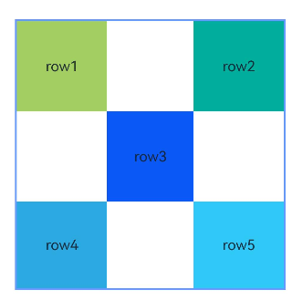
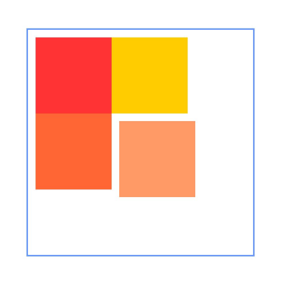
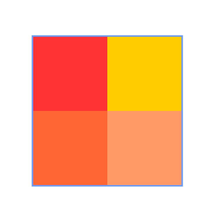
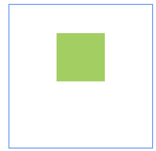
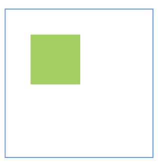
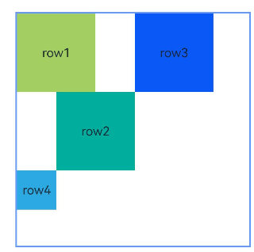
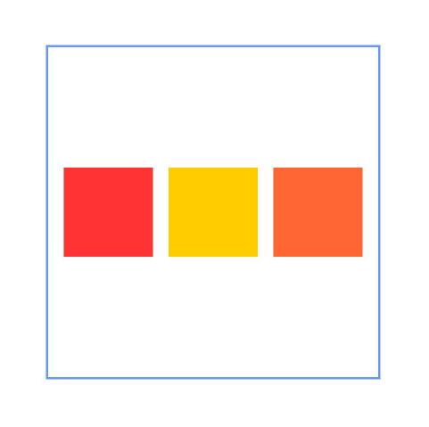
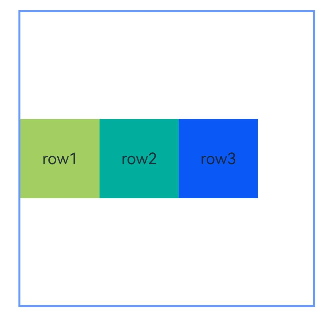

# RelativeContainer

The **RelativeContainer** component is a container component used for relative layout of elements in complex scenarios.

>  **NOTE**
>
> This component is supported since API version 9. Updates will be marked with a superscript to indicate their earliest API version.

## Rules

 * Components in the container are aligned horizontally or vertically.
   * Alignment modes in the horizontal direction can be left, middle, or right, achieved by the **HorizontalAlign.Start**, **HorizontalAlign.Center**, and **HorizontalAlign.End** attributes of the container, respectively.
   * Alignment modes in the vertical direction can be top, center, or bottom, achieved by the **VerticalAlign.Top**, **VerticalAlign.Center**, and **VerticalAlign.Bottom** attributes of the container, respectively.
 * A child component can have the container, a guideline, a barrier, or another child component as the anchor.
   * If a child component laid out in the container does not have an ID set, it is still visible, but cannot be used as an anchor by other child components. The container automatically sets an ID for such a component, using rules that cannot be detected by applications. The container ID is fixed at **__container__**. The ID of a guideline and barrier cannot be the same as any of the components. If they are the same, the IDs take effect as follows (in descending order of priority): component, guideline, barrier.
   * A child component can have anchors for three positions in one direction (left, middle, and right in the horizontal direction and top, center, and bottom in the vertical direction). These anchors can be positions in the container or other child components in the same direction: **horizontalAlign.Start**, **HorizontalAlign.Center**, and **HorizontalAlign.End** in the horizontal direction and **verticalAlign.Top**, **VerticalAlign.Center**, and **VerticalAlign.Bottom** in the vertical direction. If more than two anchors are set in the same direction, **Start** and **Center** in the horizontal direction are preferred, and **Top** and **Center** in the vertical direction are preferred. For example, when the left, middle, and right positions of a component in the horizontal direction use **HorizontalAlign.Start**, **HorizontalAlign.Center**, and **HorizontalAlign.End** of the container as the anchors, respectively, then: if the widths of the component and its container cannot meet these rules at the same time, the rules for Start and Center are followed.
   * If both the child component size and relative layout rules are set:<br>In API versions earlier than 11, the child component size is bound by the relative layout rules.<br> Since API version 11, the child component size set from frontend pages is used.
   * If offset is required after the alignment, it can be set through [bias](ts-universal-attributes-location.md#bias) (available since API version 11) or **offset** (not recommended).
   * Since API version 11, if **RelativeContainer** has its **width** and **height** attributes set to **auto**, it adapts its width and height to its child components.
   * If the container's child component uses the container as an anchor in the horizontal direction, the **auto** value of **width** has no effect. The same rule applies to the vertical direction.
   * For a child component of the container, **margin** has a different meaning from the universal attribute **margin**. It indicates the distance to the anchor in the respective direction. If there is no anchor in the respective direction, **margin** in that direction does not take effect.
   * If the position of the guideline is not declared or the declared value (for example, **undefined**) is invalid, the position of **start: 0** is used. Either **start** or **end** can be declared for the position. If both of them are declared, only **start** takes effect.
   * If the size of the container in a direction is declared as **auto**, the position of guidelines in the direction must be declared in **start** mode (the value cannot be in percentage).
   * A guideline or barrier in the vertical direction can only be used as the anchor of the component in the horizontal direction, and the value is **0** when it is used as the anchor in the vertical direction. A guideline or barrier in the horizontal direction can only be used as the anchor of the component in the vertical direction, and the value is **0** when it is used as the anchor in the horizontal direction.
   * The formation of a chain depends on the dependency between components. For example, the minimum horizontal chain formed by component A and component B requires the following dependency: Anchor 1 <- Component A <--> Component B -> Anchor 2. That is, A has a left anchor, B has a right anchor, the right anchor of A is **HorizontalAlign.Start** of B, and the left anchor of B is **HorizontalAlign.End** of A.
   * The direction and format of the chain are declared in the [chainMode](ts-universal-attributes-location.md#chainmode12) API of the chain head component. The **bias** attributes of all elements in the chain are ineffective, and the bias of the chain head element takes effect as the bias of the entire chain.
   * If the size of all elements in a chain exceeds the anchor constraint of the chain, the excess part is evenly distributed on both sides of the chain. In the [Packed](ts-universal-attributes-location.md#chainstyle12) chain, the distribution of the excess part can be set through [bias](ts-universal-attributes-location.md#bias).
 * Exceptions
   * If the size of a child component cannot be determined based on the rules and its own **size** attribute, the child component is not drawn.
   * When a mutual or circular dependency occurs, none of the child components in the container are drawn. 
   * If anchors are set for two or more positions in a single direction but the anchor positions are reversed, the size of the child component is 0, which means that the child component is not drawn. 

## Child Components

Multiple child components are supported.


## APIs

RelativeContainer()

**Widget capability**: This API can be used in ArkTS widgets since API version 9.

**Atomic service API**: This API can be used in atomic services since API version 11.

**System capability**: SystemCapability.ArkUI.ArkUI.Full

## Attributes

In addition to the [universal attributes](ts-universal-attributes-size.md), the following attributes are supported.

### guideLine<sup>12+</sup>

guideLine(value: Array&lt;GuideLineStyle&gt;)

Sets the guidelines in the **RelativeContainer** component. The value is an array, each element of which is a guideline.

**Atomic service API**: This API can be used in atomic services since API version 12.

**System capability**: SystemCapability.ArkUI.ArkUI.Full

**Parameters**

| Name| Type                                      | Mandatory| Description                             |
| ------ | ------------------------------------------ | ---- | --------------------------------- |
| value  | Array<[GuideLineStyle](#guidelinestyle12)> | Yes  | Guidelines in the **RelativeContainer** component.|

### barrier<sup>12+</sup>

barrier(value: Array&lt;BarrierStyle&gt;)

Sets the barriers in the **RelativeContainer** component. The value is an array, each element of which is a barrier.

**Atomic service API**: This API can be used in atomic services since API version 12.

**System capability**: SystemCapability.ArkUI.ArkUI.Full

**Parameters**

| Name| Type                                  | Mandatory| Description                           |
| ------ | -------------------------------------- | ---- | ------------------------------- |
| value  | Array<[BarrierStyle](#barrierstyle12)> | Yes  | Barriers in the **RelativeContainer** component.|

### barrier<sup>12+</sup>

barrier(barrierStyle: Array&lt;LocalizedBarrierStyle&gt;)

Sets the barriers in the **RelativeContainer** component. The value is an array, each element of which is a barrier.

**Atomic service API**: This API can be used in atomic services since API version 12.

**System capability**: SystemCapability.ArkUI.ArkUI.Full

**Parameters**

| Name| Type                                  | Mandatory| Description                          |
| ------ | -------------------------------------- | ---- | ------------------------------ |
| barrierStyle  | Array\<[LocalizedBarrierStyle](#localizedbarrierstyle12)\> | Yes  | Barriers in the **RelativeContainer** component.|

## GuideLineStyle<sup>12+</sup>

Defines the ID, direction, and position of a guideline.

**Atomic service API**: This API can be used in atomic services since API version 12.

**System capability**: SystemCapability.ArkUI.ArkUI.Full

| Name   | Type     | Mandatory  | Description                   |
| ----- | ------- | ---- | --------------------- |
| id  | string  | Yes   | ID of the guideline, which must be unique and cannot be the same as the name of any component in the container.  |
| direction | [Axis](ts-appendix-enums.md#axis) | Yes   | Direction of the guideline.<br>Default value: **Axis.Vertical**|
| position | [GuideLinePosition](#guidelineposition12) | Yes   | Position of the guideline.<br>Default value:<br>{<br>start: 0<br>} |

## GuideLinePosition<sup>12+</sup>

Defines the position of a guideline.

**Atomic service API**: This API can be used in atomic services since API version 12.

**System capability**: SystemCapability.ArkUI.ArkUI.Full

| Name   | Type     | Mandatory  | Description                   |
| ----- | ------- | ---- | --------------------- |
| start  | [Dimension](ts-types.md#dimension10)  | No   | Distance between the guideline and the left or top of the container.  |
| end | [Dimension](ts-types.md#dimension10) | No   | Distance between the guideline and the right or bottom of the container.|

## BarrierStyle<sup>12+</sup>

Defines the ID, direction, and referenced components of a barrier.

**Atomic service API**: This API can be used in atomic services since API version 12.

**System capability**: SystemCapability.ArkUI.ArkUI.Full

| Name   | Type     | Mandatory  | Description                   |
| ----- | ------- | ---- | --------------------- |
| id  | string  | Yes   | ID of the barrier, which must be unique and cannot be the same as the name of any component in the container.  |
| direction | [BarrierDirection](ts-container-relativecontainer.md#barrierdirection12) | Yes   | Direction of the barrier.<br>Default value: **BarrierDirection.LEFT**|
| referencedId | Array\<string> | Yes   | Referenced components of the barrier.|

## BarrierDirection<sup>12+</sup>

Defines the direction of a barrier.

**Atomic service API**: This API can be used in atomic services since API version 12.

**System capability**: SystemCapability.ArkUI.ArkUI.Full

| Name    | Description                         |
| ------ | ----------------------------- |
| LEFT | The barrier is on the left side of all the referenced components specified by [referencedId](ts-container-relativecontainer.md#barrierstyle12).   |
| RIGHT | The barrier is on the right side of all the referenced components specified by [referencedId](ts-container-relativecontainer.md#barrierstyle12).  |
| TOP  | The barrier is at the top of all the referenced components specified by [referencedId](ts-container-relativecontainer.md#barrierstyle12).   |
| BOTTOM  | The barrier is at the bottom of all the referenced components specified by [referencedId](ts-container-relativecontainer.md#barrierstyle12).|

## LocalizedBarrierStyle<sup>12+</sup>

Defines the ID, direction, and referenced components of a barrier.

**Atomic service API**: This API can be used in atomic services since API version 12.

**System capability**: SystemCapability.ArkUI.ArkUI.Full

| Name   | Type     | Mandatory  | Description             |
| ----- | ------- | ---- | --------------------- |
| id  | string  | Yes   | ID of the barrier, which must be unique and cannot be the same as the name of any component in the container.  |
| localizedDirection | [LocalizedBarrierDirection](#localizedbarrierdirection12) | Yes   | Direction of the barrier.|
| referencedId | Array\<string\> | Yes   | Referenced components of the barrier.|

## LocalizedBarrierDirection<sup>12+</sup>

Defines the direction of a barrier.

**Atomic service API**: This API can be used in atomic services since API version 12.

**System capability**: SystemCapability.ArkUI.ArkUI.Full

| Name|  Value | Description                      |
| ------ | -- | ----------------------------- |
| START  | 0  |The barrier is on the left (for left-to-right scripts) or right (for right-to-left scripts) side of all the referenced components specified by [referencedId](#localizedbarrierstyle12).|
| END    | 1  | The barrier is on the right (for left-to-right scripts) or left (for right-to-left scripts) side of all the referenced components specified by [referencedId](#localizedbarrierstyle12).  |
| TOP    | 2  | The barrier is at the top of all the referenced components specified by [referencedId](#localizedbarrierstyle12).   |
| BOTTOM | 3  | The barrier is at the bottom of all the referenced components specified by [referencedId](#localizedbarrierstyle12).|

## Example

### Example 1: Implementing a Layout with Containers and Components as Anchors

This example demonstrates how to use the **alignRules** API to implement a layout with containers and their internal components as anchors.

```ts
@Entry
@Component
struct Index {
  build() {
    Row() {
      RelativeContainer() {
        Row() {
          Text('row1')
        }
        .justifyContent(FlexAlign.Center)
        .width(100)
        .height(100)
        .backgroundColor('#a3cf62')
        .alignRules({
          top: { anchor: "__container__", align: VerticalAlign.Top },
          left: { anchor: "__container__", align: HorizontalAlign.Start }
        })
        .id("row1")

        Row() {
          Text('row2')
        }
        .justifyContent(FlexAlign.Center)
        .width(100)
        .height(100)
        .backgroundColor('#00ae9d')
        .alignRules({
          top: { anchor: "__container__", align: VerticalAlign.Top },
          right: { anchor: "__container__", align: HorizontalAlign.End }
        })
        .id("row2")

        Row() {
          Text('row3')
        }
        .justifyContent(FlexAlign.Center)
        .height(100)
        .backgroundColor('#0a59f7')
        .alignRules({
          top: { anchor: "row1", align: VerticalAlign.Bottom },
          left: { anchor: "row1", align: HorizontalAlign.End },
          right: { anchor: "row2", align: HorizontalAlign.Start }
        })
        .id("row3")

        Row() {
          Text('row4')
        }.justifyContent(FlexAlign.Center)
        .backgroundColor('#2ca9e0')
        .alignRules({
          top: { anchor: "row3", align: VerticalAlign.Bottom },
          bottom: { anchor: "__container__", align: VerticalAlign.Bottom },
          left: { anchor: "__container__", align: HorizontalAlign.Start },
          right: { anchor: "row1", align: HorizontalAlign.End }
        })
        .id("row4")

        Row() {
          Text('row5')
        }.justifyContent(FlexAlign.Center)
        .backgroundColor('#30c9f7')
        .alignRules({
          top: { anchor: "row3", align: VerticalAlign.Bottom },
          bottom: { anchor: "__container__", align: VerticalAlign.Bottom },
          left: { anchor: "row2", align: HorizontalAlign.Start },
          right: { anchor: "__container__", align: HorizontalAlign.End }
        })
        .id("row5")
      }
      .width(300).height(300)
      .margin({ left: 50 })
      .border({ width: 2, color: "#6699FF" })
    }
    .height('100%')
  }
}
```


### Example 2: Setting Margins for Child Components

This example shows how to set margins for child components in the container.

```ts
@Entry
@Component
struct Index {
  build() {
    Row() {
      RelativeContainer() {
        Row() {
          Text('row1')
        }
        .justifyContent(FlexAlign.Center)
        .width(100)
        .height(100)
        .backgroundColor('#a3cf62')
        .alignRules({
          top: { anchor: "__container__", align: VerticalAlign.Top },
          left: { anchor: "__container__", align: HorizontalAlign.Start }
        })
        .id("row1")
        .margin(10)

        Row() {
          Text('row2')
        }
        .justifyContent(FlexAlign.Center)
        .width(100)
        .height(100)
        .backgroundColor('#00ae9d')
        .alignRules({
          left: { anchor: "row1", align: HorizontalAlign.End },
          top: { anchor: "row1", align: VerticalAlign.Top }
        })
        .id("row2")

        Row() {
          Text('row3')
        }
        .justifyContent(FlexAlign.Center)
        .width(100)
        .height(100)
        .backgroundColor('#0a59f7')
        .alignRules({
          left: { anchor: "row1", align: HorizontalAlign.Start },
          top: { anchor: "row1", align: VerticalAlign.Bottom }
        })
        .id("row3")

        Row() {
          Text('row4')
        }
        .justifyContent(FlexAlign.Center)
        .width(100)
        .height(100)
        .backgroundColor('#2ca9e0')
        .alignRules({
          left: { anchor: "row3", align: HorizontalAlign.End },
          top: { anchor: "row2", align: VerticalAlign.Bottom }
        })
        .id("row4")
        .margin(10)
      }
      .width(300).height(300)
      .margin({ left: 50 })
      .border({ width: 2, color: "#6699FF" })
    }
    .height('100%')
  }
}
```


### Example 3: Configuring the Container to Adapt Its Size to Content

This example shows how to configure the container to adapt its size to content by setting **width** or **height** to **"auto"**.

```ts
@Entry
@Component
struct Index {
  build() {
    Row() {
      RelativeContainer() {
        Row() {
          Text('row1')
        }
        .justifyContent(FlexAlign.Center)
        .width(100)
        .height(100)
        .backgroundColor('#a3cf62')
        .id("row1")

        Row() {
          Text('row2')
        }
        .justifyContent(FlexAlign.Center)
        .width(100)
        .height(100)
        .backgroundColor('#00ae9d')
        .alignRules({
          left: { anchor: "row1", align: HorizontalAlign.End },
          top: { anchor: "row1", align: VerticalAlign.Top }
        })
        .id("row2")

        Row() {
          Text('row3')
        }
        .justifyContent(FlexAlign.Center)
        .width(100)
        .height(100)
        .backgroundColor('#0a59f7')
        .alignRules({
          left: { anchor: "row1", align: HorizontalAlign.Start },
          top: { anchor: "row1", align: VerticalAlign.Bottom }
        })
        .id("row3")

        Row() {
          Text('row4')
        }
        .justifyContent(FlexAlign.Center)
        .width(100)
        .height(100)
        .backgroundColor('#2ca9e0')
        .alignRules({
          left: { anchor: "row3", align: HorizontalAlign.End },
          top: { anchor: "row2", align: VerticalAlign.Bottom }
        })
        .id("row4")
      }
      .width("auto").height("auto")
      .margin({ left: 50 })
      .border({ width: 2, color: "#6699FF" })
    }
    .height('100%')
  }
}
```


### Example 4: Applying Vertical Offsets

This example uses the [bias](ts-universal-attributes-location.md#bias) API to create a vertical offset for a child component between two anchors.

```ts
@Entry
@Component
struct Index {
  build() {
    Row() {
      RelativeContainer() {
        Row()
          .width(100)
          .height(100)
          .backgroundColor('#a3cf62')
          .alignRules({
            top: { anchor: "__container__", align: VerticalAlign.Top },
            bottom: { anchor: "__container__", align: VerticalAlign.Bottom },
            left: { anchor: "__container__", align: HorizontalAlign.Start },
            right: { anchor: "__container__", align: HorizontalAlign.End },
            bias: { vertical: 0.3 }
          })
          .id("row1")
      }
      .width(300).height(300)
      .margin({ left: 50 })
      .border({ width: 2, color: "#6699FF" })
    }
    .height('100%')
  }
}
```


### Example 5: Setting Guide Lines

This example demonstrates how to set guide lines in a relative layout using the [guideLine](#guideline12) API, with child components using these lines as anchors.

```ts
@Entry
@Component
struct Index {
  build() {
    Row() {
      RelativeContainer() {
        Row()
          .width(100)
          .height(100)
          .backgroundColor('#a3cf62')
          .alignRules({
            left: { anchor: "guideline1", align: HorizontalAlign.End },
            top: { anchor: "guideline2", align: VerticalAlign.Top }
          })
          .id("row1")
      }
      .width(300)
      .height(300)
      .margin({ left: 50 })
      .border({ width: 2, color: "#6699FF" })
      .guideLine([{ id: "guideline1", direction: Axis.Vertical, position: { start: 50 } },
        { id: "guideline2", direction: Axis.Horizontal, position: { start: 50 } }])
    }
    .height('100%')
  }
}
```


### Example 6: Implementing Barriers

This example shows how to set barriers in a relative layout using the [barrier](#barrier12) API, with child components using these barriers as anchors.

```ts
@Entry
@Component
struct Index {
  build() {
    Row() {
      RelativeContainer() {
        Row() {
          Text('row1')
        }
        .justifyContent(FlexAlign.Center)
        .width(100)
        .height(100)
        .backgroundColor('#a3cf62')
        .id("row1")

        Row() {
          Text('row2')
        }
        .justifyContent(FlexAlign.Center)
        .width(100)
        .height(100)
        .backgroundColor('#00ae9d')
        .alignRules({
          middle: { anchor: "row1", align: HorizontalAlign.End },
          top: { anchor: "row1", align: VerticalAlign.Bottom }
        })
        .id("row2")

        Row() {
          Text('row3')
        }
        .justifyContent(FlexAlign.Center)
        .width(100)
        .height(100)
        .backgroundColor('#0a59f7')
        .alignRules({
          left: { anchor: "barrier1", align: HorizontalAlign.End },
          top: { anchor: "row1", align: VerticalAlign.Top }
        })
        .id("row3")

        Row() {
          Text('row4')
        }
        .justifyContent(FlexAlign.Center)
        .width(50)
        .height(50)
        .backgroundColor('#2ca9e0')
        .alignRules({
          left: { anchor: "row1", align: HorizontalAlign.Start },
          top: { anchor: "barrier2", align: VerticalAlign.Bottom }
        })
        .id("row4")
      }
      .width(300)
      .height(300)
      .margin({ left: 50 })
      .border({ width: 2, color: "#6699FF" })
      .barrier([{ id: "barrier1", direction: BarrierDirection.RIGHT, referencedId: ["row1", "row2"] },
        { id: "barrier2", direction: BarrierDirection.BOTTOM, referencedId: ["row1", "row2"] }])
    }
    .height('100%')
  }
}
```


### Example 7: Creating Chains

This example uses the [chainMode](ts-universal-attributes-location.md#chainmode12) API to create horizontal chains, including [SPREAD, SPREAD_INSIDE, and PACKED chains](ts-universal-attributes-location.md#chainstyle12), from top to bottom.

```ts
@Entry
@Component
struct Index {
  build() {
    Row() {
      RelativeContainer() {
        Row() {
          Text('row1')
        }
        .justifyContent(FlexAlign.Center)
        .width(80)
        .height(80)
        .backgroundColor('#a3cf62')
        .alignRules({
          left: { anchor: "__container__", align: HorizontalAlign.Start },
          right: { anchor: "row2", align: HorizontalAlign.Start },
          top: { anchor: "__container__", align: VerticalAlign.Top }
        })
        .id("row1")
        .chainMode(Axis.Horizontal, ChainStyle.SPREAD)

        Row() {
          Text('row2')
        }
        .justifyContent(FlexAlign.Center)
        .width(80)
        .height(80)
        .backgroundColor('#00ae9d')
        .alignRules({
          left: { anchor: "row1", align: HorizontalAlign.End },
          right: { anchor: "row3", align: HorizontalAlign.Start },
          top: { anchor: "row1", align: VerticalAlign.Top }
        })
        .id("row2")

        Row() {
          Text('row3')
        }
        .justifyContent(FlexAlign.Center)
        .width(80)
        .height(80)
        .backgroundColor('#0a59f7')
        .alignRules({
          left: { anchor: "row2", align: HorizontalAlign.End },
          right: { anchor: "__container__", align: HorizontalAlign.End },
          top: { anchor: "row1", align: VerticalAlign.Top }
        })
        .id("row3")

        Row() {
          Text('row4')
        }
        .justifyContent(FlexAlign.Center)
        .width(80)
        .height(80)
        .backgroundColor('#a3cf62')
        .alignRules({
          left: { anchor: "__container__", align: HorizontalAlign.Start },
          right: { anchor: "row5", align: HorizontalAlign.Start },
          center: { anchor: "__container__", align: VerticalAlign.Center }
        })
        .id("row4")
        .chainMode(Axis.Horizontal, ChainStyle.SPREAD_INSIDE)

        Row() {
          Text('row5')
        }
        .justifyContent(FlexAlign.Center)
        .width(80)
        .height(80)
        .backgroundColor('#00ae9d')
        .alignRules({
          left: { anchor: "row4", align: HorizontalAlign.End },
          right: { anchor: "row6", align: HorizontalAlign.Start },
          top: { anchor: "row4", align: VerticalAlign.Top }
        })
        .id("row5")

        Row() {
          Text('row6')
        }
        .justifyContent(FlexAlign.Center)
        .width(80)
        .height(80)
        .backgroundColor('#0a59f7')
        .alignRules({
          left: { anchor: "row5", align: HorizontalAlign.End },
          right: { anchor: "__container__", align: HorizontalAlign.End },
          top: { anchor: "row4", align: VerticalAlign.Top }
        })
        .id("row6")

        Row() {
          Text('row7')
        }
        .justifyContent(FlexAlign.Center)
        .width(80)
        .height(80)
        .backgroundColor('#a3cf62')
        .alignRules({
          left: { anchor: "__container__", align: HorizontalAlign.Start },
          right: { anchor: "row8", align: HorizontalAlign.Start },
          bottom: { anchor: "__container__", align: VerticalAlign.Bottom }
        })
        .id("row7")
        .chainMode(Axis.Horizontal, ChainStyle.PACKED)

        Row() {
          Text('row8')
        }
        .justifyContent(FlexAlign.Center)
        .width(80)
        .height(80)
        .backgroundColor('#00ae9d')
        .alignRules({
          left: { anchor: "row7", align: HorizontalAlign.End },
          right: { anchor: "row9", align: HorizontalAlign.Start },
          top: { anchor: "row7", align: VerticalAlign.Top }
        })
        .id("row8")

        Row() {
          Text('row9')
        }
        .justifyContent(FlexAlign.Center)
        .width(80)
        .height(80)
        .backgroundColor('#0a59f7')
        .alignRules({
          left: { anchor: "row8", align: HorizontalAlign.End },
          right: { anchor: "__container__", align: HorizontalAlign.End },
          top: { anchor: "row7", align: VerticalAlign.Top }
        })
        .id("row9")
      }
      .width(300).height(300)
      .margin({ left: 50 })
      .border({ width: 2, color: "#6699FF" })
    }
    .height('100%')
  }
}
```


### Example 8: Creating a Chain with Offsets

This example combines the [chainMode](ts-universal-attributes-location.md#chainmode12) and [bias](ts-universal-attributes-location.md#bias) APIs to create a horizontal [PACKED chain](ts-universal-attributes-location.md#chainstyle12) with offsets.

```ts
@Entry
@Component
struct Index {
  build() {
    Row() {
      RelativeContainer() {
        Row() {
          Text('row1')
        }
        .justifyContent(FlexAlign.Center)
        .width(80)
        .height(80)
        .backgroundColor('#a3cf62')
        .alignRules({
          left: { anchor: "__container__", align: HorizontalAlign.Start },
          right: { anchor: "row2", align: HorizontalAlign.Start },
          center: { anchor: "__container__", align: VerticalAlign.Center },
          bias: { horizontal: 0 }
        })
        .id("row1")
        .chainMode(Axis.Horizontal, ChainStyle.PACKED)

        Row() {
          Text('row2')
        }
        .justifyContent(FlexAlign.Center)
        .width(80)
        .height(80)
        .backgroundColor('#00ae9d')
        .alignRules({
          left: { anchor: "row1", align: HorizontalAlign.End },
          right: { anchor: "row3", align: HorizontalAlign.Start },
          top: { anchor: "row1", align: VerticalAlign.Top }
        })
        .id("row2")

        Row() {
          Text('row3')
        }
        .justifyContent(FlexAlign.Center)
        .width(80)
        .height(80)
        .backgroundColor('#0a59f7')
        .alignRules({
          left: { anchor: "row2", align: HorizontalAlign.End },
          right: { anchor: "__container__", align: HorizontalAlign.End },
          top: { anchor: "row1", align: VerticalAlign.Top }
        })
        .id("row3")
      }
      .width(300).height(300)
      .margin({ left: 50 })
      .border({ width: 2, color: "#6699FF" })
    }
    .height('100%')
  }
}
```


### Example 9: Implementing a Mirroring Effect

This example demonstrates how to use [LocalizedAlignRuleOptions](ts-universal-attributes-location.md#localizedalignruleoptions12) and [LocalizedBarrierDirection](#localizedbarrierdirection12) for alignment when using barriers as anchors in mirror mode (**direction** set to **Direction.Rtl**).

```ts
@Entry
@Component
struct Index {
  build() {
    Row() {
      RelativeContainer() {
        Row() {
          Text('row1')
        }
        .justifyContent(FlexAlign.Center)
        .width(100)
        .height(100)
        .backgroundColor('#a3cf62')
        .id("row1")

        Row() {
          Text('row2')
        }
        .justifyContent(FlexAlign.Center)
        .width(100)
        .height(100)
        .backgroundColor('#00ae9d')
        .alignRules({
          middle: { anchor: "row1", align: HorizontalAlign.End },
          top: { anchor: "row1", align: VerticalAlign.Bottom }
        })
        .id("row2")

        Row() {
          Text('row3')
        }
        .justifyContent(FlexAlign.Center)
        .width(100)
        .height(100)
        .backgroundColor('#0a59f7')
        .alignRules({
          start: { anchor: "barrier1", align: HorizontalAlign.End },
          top: { anchor: "row1", align: VerticalAlign.Top }
        })
        .id("row3")

        Row() {
          Text('row4')
        }
        .justifyContent(FlexAlign.Center)
        .width(50)
        .height(50)
        .backgroundColor('#2ca9e0')
        .alignRules({
          start: { anchor: "row1", align: HorizontalAlign.Start },
          top: { anchor: "barrier2", align: VerticalAlign.Bottom }
        })
        .id("row4")
      }
      .direction(Direction.Rtl)
      .width(300)
      .height(300)
      .margin({ left: 50 })
      .border({ width: 2, color: "#6699FF" })
      .barrier([{ id: "barrier1", localizedDirection: LocalizedBarrierDirection.END, referencedId: ["row1", "row2"] },
        { id: "barrier2", localizedDirection: LocalizedBarrierDirection.BOTTOM, referencedId: ["row1", "row2"] }])
    }
    .height('100%')
  }
}
```

