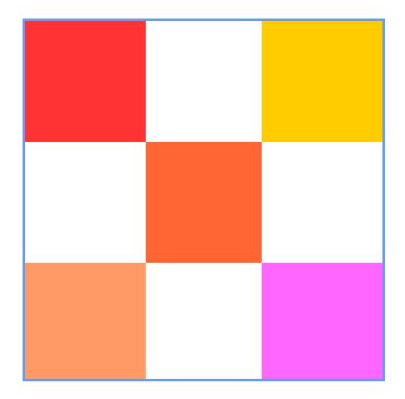
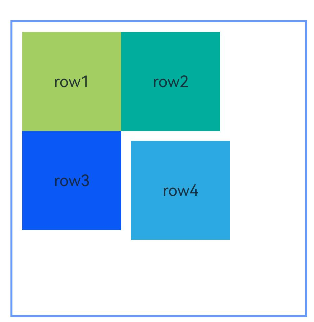
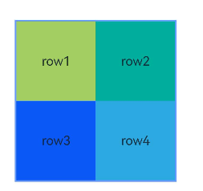
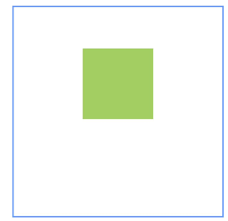
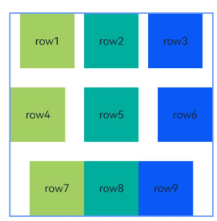
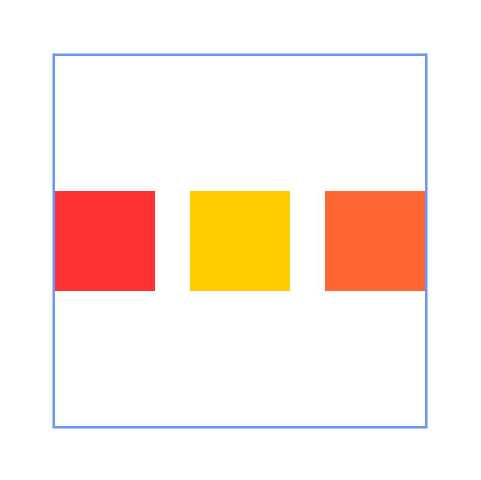
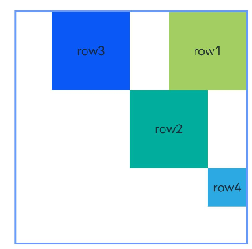
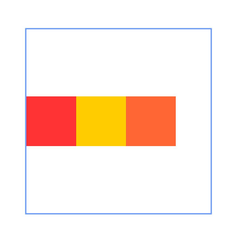

# RelativeContainer
<!--Kit: ArkUI-->
<!--Subsystem: ArkUI-->
<!--Owner: @fenglinbailu-->
<!--Designer: @lanshouren-->
<!--Tester: @liuli0427-->
<!--Adviser: @Brilliantry_Rui-->

The **RelativeContainer** component is a container component used for relative layout of elements in complex scenarios.

Child components can define their alignment rules within the container using [alignRules](./ts-universal-attributes-location.md#alignrules9).

>  **NOTE**
>
> * This component is supported since API version 9. Updates will be marked with a superscript to indicate their earliest API version.
> * When [width](ts-universal-attributes-size.md#width) and [height](ts-universal-attributes-size.md#height) are not set, **RelativeContainer** defaults to 100% in both dimensions.
> * Since API version 11, setting [width](ts-universal-attributes-size.md#width) or [height](ts-universal-attributes-size.md#height) to **"auto"** enables child-adaptive sizing. However, if the child components use the container as an anchor in the horizontal direction, the **auto** value of **width** has no effect (equivalent to **width** not being set). The same rule applies to the vertical direction.
> * Since API version 20, the size adaptation behavior of child components in the **RelativeContainer** component follows the following rules, depending on the **LayoutPolicy** setting for [width](ts-universal-attributes-size.md#width15) and [height](ts-universal-attributes-size.md#height15): **LayoutPolicy.wrapContent**: The child component adapts to its content size and is constrained by the size of the ancestor node. **LayoutPolicy.fixAtIdealSize**: The child component adapts to its ideal content size and is not constrained by the size of the ancestor node. If **width** is set to **wrapContent** or **fixAtIdealSize**, and the child component (in the horizontal direction) directly or indirectly uses the **RelativeContainer** as its anchor, the container's horizontal size will not adapt to the child component. The same rule applies to the vertical direction.
> * For a child component of the container, [margin](ts-universal-attributes-size.md#margin) has a different meaning from the universal attribute **margin**. It indicates the distance to the anchor in the respective direction. If there is no anchor in the respective direction, **margin** in that direction does not take effect.

## Child Components

Multiple child components are supported.


## APIs

RelativeContainer()

The **RelativeContainer** component is a container component used for relative layout of elements in complex scenarios.

**Widget capability**: This API can be used in ArkTS widgets since API version 9.

**Atomic service API**: This API can be used in atomic services since API version 11.

**System capability**: SystemCapability.ArkUI.ArkUI.Full

## Attributes

In addition to the [universal attributes](ts-component-general-attributes.md), the following attributes are supported.

### guideLine<sup>12+</sup>

guideLine(value: Array&lt;GuideLineStyle&gt;)

Sets the [guidelines](../../../ui/arkts-layout-development-relative-layout.md#positioning-child-components-using-guidelines) in the **RelativeContainer** component. The value is an array, each element of which is a guideline.

**Atomic service API**: This API can be used in atomic services since API version 12.

**System capability**: SystemCapability.ArkUI.ArkUI.Full

**Parameters**

| Name| Type                                      | Mandatory| Description                             |
| ------ | ------------------------------------------ | ---- | --------------------------------- |
| value  | Array<[GuideLineStyle](#guidelinestyle12)> | Yes  | Guidelines in the **RelativeContainer** component.|

### barrier<sup>12+</sup>

barrier(value: Array&lt;BarrierStyle&gt;)

Sets the [barriers](../../../ui/arkts-layout-development-relative-layout.md#setting-barriers-for-multiple-components) in the **RelativeContainer** component. The value is an array, each element of which is a barrier.

**Atomic service API**: This API can be used in atomic services since API version 12.

**System capability**: SystemCapability.ArkUI.ArkUI.Full

**Parameters**

| Name| Type                                  | Mandatory| Description                           |
| ------ | -------------------------------------- | ---- | ------------------------------- |
| value  | Array<[BarrierStyle](#barrierstyle12)> | Yes  | Barriers in the **RelativeContainer** component.|

### barrier<sup>12+</sup>

barrier(barrierStyle: Array&lt;LocalizedBarrierStyle&gt;)

Sets barriers in the **RelativeContainer** component. Each array element defines a barrier. Barriers can be defined in mirrored layout mode.

**Atomic service API**: This API can be used in atomic services since API version 12.

**System capability**: SystemCapability.ArkUI.ArkUI.Full

**Parameters**

| Name| Type                                  | Mandatory| Description                          |
| ------ | -------------------------------------- | ---- | ------------------------------ |
| barrierStyle  | Array\<[LocalizedBarrierStyle](#localizedbarrierstyle12)\> | Yes  | Barriers in the **RelativeContainer** component.|

## GuideLineStyle<sup>12+</sup>

Defines the ID, direction, and position of a guideline.

**Atomic service API**: This API can be used in atomic services since API version 12.

**System capability**: SystemCapability.ArkUI.ArkUI.Full

| Name| Type| Read-Only| Optional| Description|
| -------- | -------- | -------- | -------- | -------- |
| id  | string  | No| No   | ID of the guideline, which must be unique and cannot be the same as the name of any component in the container.|
| direction | [Axis](ts-appendix-enums.md#axis) | No| No   | Direction of the guideline.<br> A guideline in the vertical direction can only be used as the anchor of the component in the horizontal direction, and the value is **0** when it is used as the anchor in the vertical direction. A guideline in the horizontal direction can only be used as the anchor of the component in the vertical direction, and the value is **0** when it is used as the anchor in the horizontal direction.<br>Default value: **Axis.Vertical**<br>Invalid values are treated as the default value.|
| position | [GuideLinePosition](#guidelineposition12) |  No| No   | Position of the guideline.<br>If no value is specified or an invalid value (for example, **undefined**) is provided, the guideline position defaults to **start: 0**. Only **start** or **end** can be selected for the guideline position. If both are declared, only **start** takes effect. If the container size in a certain direction is set to **"auto"**, the guideline position in that direction must be declared in **start** mode, and the value cannot be a percentage.<br>Default value:<br>{<br>start: 0<br>} <br>Invalid values are treated as the default value.|

## GuideLinePosition<sup>12+</sup>

Defines the position of a guideline.

**Atomic service API**: This API can be used in atomic services since API version 12.

**System capability**: SystemCapability.ArkUI.ArkUI.Full

| Name| Type| Read-Only| Optional| Description|
| -------- | -------- | -------- | -------- | -------- |
| start  | [Dimension](ts-types.md#dimension10)  | No| Yes   | Distance between the guideline and the left or top of the container.|
| end | [Dimension](ts-types.md#dimension10) | No| Yes  | Distance between the guideline and the right or bottom of the container.|

## BarrierStyle<sup>12+</sup>

Defines the ID, direction, and referenced components of a barrier.

**Atomic service API**: This API can be used in atomic services since API version 12.

**System capability**: SystemCapability.ArkUI.ArkUI.Full

| Name| Type| Read-Only| Optional| Description|
| -------- | -------- | -------- | -------- | -------- |
| id  | string  | No| No   | ID of the barrier, which must be unique and cannot be the same as the name of any component in the container.|
| direction | [BarrierDirection](ts-container-relativecontainer.md#barrierdirection12) | No| No   | Direction of the barrier.<br>Vertical-direction barriers (including **TOP** and **BOTTOM**) can only serve as the horizontal anchor of a component. If they are used as a vertical anchor, the anchor value will be **0**. Horizontal-direction barriers (including **LEFT** and **RIGHT**) can only serve as the vertical anchor of a component. If they are used as a horizontal anchor, the anchor value will be **0**.<br>Default value: **BarrierDirection.LEFT**<br>Invalid values are treated as the default value.|
| referencedId | Array\<string> | No| No   | Referenced components of the barrier.|

## BarrierDirection<sup>12+</sup>

Defines the direction of a barrier.

**Atomic service API**: This API can be used in atomic services since API version 12.

**System capability**: SystemCapability.ArkUI.ArkUI.Full

| Name    | Value  | Description                         |
| ------ | ---- | ----------------------------- |
| LEFT | 0 | The barrier is on the left side of all the referenced components specified by [referencedId](ts-container-relativecontainer.md#barrierstyle12).|
| RIGHT | 1 | The barrier is on the right side of all the referenced components specified by [referencedId](ts-container-relativecontainer.md#barrierstyle12).|
| TOP  | 2 | The barrier is at the top of all the referenced components specified by [referencedId](ts-container-relativecontainer.md#barrierstyle12).|
| BOTTOM  | 3 | The barrier is at the bottom of all the referenced components specified by [referencedId](ts-container-relativecontainer.md#barrierstyle12).|

## LocalizedBarrierStyle<sup>12+</sup>

Defines the ID, direction, and referenced components of a barrier.

**Atomic service API**: This API can be used in atomic services since API version 12.

**System capability**: SystemCapability.ArkUI.ArkUI.Full

| Name| Type| Read-Only| Optional| Description|
| -------- | -------- | -------- | -------- | -------- |
| id  | string  | No| No  | ID of the barrier, which must be unique and cannot be the same as the name of any component in the container.|
| localizedDirection | [LocalizedBarrierDirection](#localizedbarrierdirection12) | No| No   | Direction of the barrier.<br> Vertical-direction barriers (including **TOP** and **BOTTOM**) can only serve as the horizontal anchor of a component. If they are used as a vertical anchor, the anchor value will be **0**. Horizontal-direction barriers (including **START** and **END**) can only serve as the vertical anchor of a component. If they are used as a horizontal anchor, the anchor value will be **0**.|
| referencedId | Array\<string\> | No| No  | Referenced components of the barrier.|

## LocalizedBarrierDirection<sup>12+</sup>

Enumerates the directions of barriers with mirror mode support.

**Atomic service API**: This API can be used in atomic services since API version 12.

**System capability**: SystemCapability.ArkUI.ArkUI.Full

| Name|  Value | Description                      |
| ------ | -- | ----------------------------- |
| START  | 0  |The barrier is on the left (for left-to-right scripts) or right (for right-to-left scripts) side of all the referenced components specified by [referencedId](#localizedbarrierstyle12).|
| END    | 1  | The barrier is on the right (for left-to-right scripts) or left (for right-to-left scripts) side of all the referenced components specified by [referencedId](#localizedbarrierstyle12).|
| TOP    | 2  | The barrier is at the top of all the referenced components specified by [referencedId](#localizedbarrierstyle12).|
| BOTTOM | 3  | The barrier is at the bottom of all the referenced components specified by [referencedId](#localizedbarrierstyle12).|

## Events

The [universal events](ts-component-general-events.md) are supported.

## Example

### Example 1: Implementing a Layout Using Containers and Components as Anchors

This example demonstrates how to use the **alignRules** API to implement a layout with containers and their internal components as anchors.

```ts
@Entry
@Component
struct Index {
  build() {
    Row() {
      RelativeContainer() {
        Row() {
          Text('row1')
        }
        .justifyContent(FlexAlign.Center)
        .width(100)
        .height(100)
        .backgroundColor('#a3cf62')
        .alignRules({
          top: { anchor: "__container__", align: VerticalAlign.Top },
          left: { anchor: "__container__", align: HorizontalAlign.Start }
        })
        .id("row1")

        Row() {
          Text('row2')
        }
        .justifyContent(FlexAlign.Center)
        .width(100)
        .height(100)
        .backgroundColor('#00ae9d')
        .alignRules({
          top: { anchor: "__container__", align: VerticalAlign.Top },
          right: { anchor: "__container__", align: HorizontalAlign.End }
        })
        .id("row2")

        Row() {
          Text('row3')
        }
        .justifyContent(FlexAlign.Center)
        .height(100)
        .backgroundColor('#0a59f7')
        .alignRules({
          top: { anchor: "row1", align: VerticalAlign.Bottom },
          left: { anchor: "row1", align: HorizontalAlign.End },
          right: { anchor: "row2", align: HorizontalAlign.Start }
        })
        .id("row3")

        Row() {
          Text('row4')
        }.justifyContent(FlexAlign.Center)
        .backgroundColor('#2ca9e0')
        .alignRules({
          top: { anchor: "row3", align: VerticalAlign.Bottom },
          bottom: { anchor: "__container__", align: VerticalAlign.Bottom },
          left: { anchor: "__container__", align: HorizontalAlign.Start },
          right: { anchor: "row1", align: HorizontalAlign.End }
        })
        .id("row4")

        Row() {
          Text('row5')
        }.justifyContent(FlexAlign.Center)
        .backgroundColor('#30c9f7')
        .alignRules({
          top: { anchor: "row3", align: VerticalAlign.Bottom },
          bottom: { anchor: "__container__", align: VerticalAlign.Bottom },
          left: { anchor: "row2", align: HorizontalAlign.Start },
          right: { anchor: "__container__", align: HorizontalAlign.End }
        })
        .id("row5")
      }
      .width(300).height(300)
      .margin({ left: 50 })
      .border({ width: 2, color: "#6699FF" })
    }
    .height('100%')
  }
}
```


### Example 2: Setting Margins for Child Components

This example shows how to set margins for child components in the container.

```ts
@Entry
@Component
struct Index {
  build() {
    Row() {
      RelativeContainer() {
        Row() {
          Text('row1')
        }
        .justifyContent(FlexAlign.Center)
        .width(100)
        .height(100)
        .backgroundColor('#a3cf62')
        .alignRules({
          top: { anchor: "__container__", align: VerticalAlign.Top },
          left: { anchor: "__container__", align: HorizontalAlign.Start }
        })
        .id("row1")
        .margin(10)

        Row() {
          Text('row2')
        }
        .justifyContent(FlexAlign.Center)
        .width(100)
        .height(100)
        .backgroundColor('#00ae9d')
        .alignRules({
          left: { anchor: "row1", align: HorizontalAlign.End },
          top: { anchor: "row1", align: VerticalAlign.Top }
        })
        .id("row2")

        Row() {
          Text('row3')
        }
        .justifyContent(FlexAlign.Center)
        .width(100)
        .height(100)
        .backgroundColor('#0a59f7')
        .alignRules({
          left: { anchor: "row1", align: HorizontalAlign.Start },
          top: { anchor: "row1", align: VerticalAlign.Bottom }
        })
        .id("row3")

        Row() {
          Text('row4')
        }
        .justifyContent(FlexAlign.Center)
        .width(100)
        .height(100)
        .backgroundColor('#2ca9e0')
        .alignRules({
          left: { anchor: "row3", align: HorizontalAlign.End },
          top: { anchor: "row2", align: VerticalAlign.Bottom }
        })
        .id("row4")
        .margin(10)
      }
      .width(300).height(300)
      .margin({ left: 50 })
      .border({ width: 2, color: "#6699FF" })
    }
    .height('100%')
  }
}
```


### Example 3: Configuring the Container to Adapt Its Size to Content

This example shows how to configure the container to adapt its size to content by setting **width** or **height** to **"auto"**.

```ts
@Entry
@Component
struct Index {
  build() {
    Row() {
      RelativeContainer() {
        Row() {
          Text('row1')
        }
        .justifyContent(FlexAlign.Center)
        .width(100)
        .height(100)
        .backgroundColor('#a3cf62')
        .id("row1")

        Row() {
          Text('row2')
        }
        .justifyContent(FlexAlign.Center)
        .width(100)
        .height(100)
        .backgroundColor('#00ae9d')
        .alignRules({
          left: { anchor: "row1", align: HorizontalAlign.End },
          top: { anchor: "row1", align: VerticalAlign.Top }
        })
        .id("row2")

        Row() {
          Text('row3')
        }
        .justifyContent(FlexAlign.Center)
        .width(100)
        .height(100)
        .backgroundColor('#0a59f7')
        .alignRules({
          left: { anchor: "row1", align: HorizontalAlign.Start },
          top: { anchor: "row1", align: VerticalAlign.Bottom }
        })
        .id("row3")

        Row() {
          Text('row4')
        }
        .justifyContent(FlexAlign.Center)
        .width(100)
        .height(100)
        .backgroundColor('#2ca9e0')
        .alignRules({
          left: { anchor: "row3", align: HorizontalAlign.End },
          top: { anchor: "row2", align: VerticalAlign.Bottom }
        })
        .id("row4")
      }
      .width("auto").height("auto")
      .margin({ left: 50 })
      .border({ width: 2, color: "#6699FF" })
    }
    .height('100%')
  }
}
```


### Example 4: Applying Vertical Offsets

This example uses the [bias](ts-types.md#bias11) API to create a vertical offset for a child component between two anchors.

```ts
@Entry
@Component
struct Index {
  build() {
    Row() {
      RelativeContainer() {
        Row()
          .width(100)
          .height(100)
          .backgroundColor('#a3cf62')
          .alignRules({
            top: { anchor: "__container__", align: VerticalAlign.Top },
            bottom: { anchor: "__container__", align: VerticalAlign.Bottom },
            left: { anchor: "__container__", align: HorizontalAlign.Start },
            right: { anchor: "__container__", align: HorizontalAlign.End },
            bias: { vertical: 0.3 }
          })
          .id("row1")
      }
      .width(300).height(300)
      .margin({ left: 50 })
      .border({ width: 2, color: "#6699FF" })
    }
    .height('100%')
  }
}
```


### Example 5: Setting Guidelines

This example demonstrates how to set guidelines in a relative layout using the [guideLine](#guideline12) API, with child components using these guidelines as anchors.

```ts
@Entry
@Component
struct Index {
  build() {
    Row() {
      RelativeContainer() {
        Row()
          .width(100)
          .height(100)
          .backgroundColor('#a3cf62')
          .alignRules({
            left: { anchor: "guideline1", align: HorizontalAlign.End },
            top: { anchor: "guideline2", align: VerticalAlign.Top }
          })
          .id("row1")
      }
      .width(300)
      .height(300)
      .margin({ left: 50 })
      .border({ width: 2, color: "#6699FF" })
      .guideLine([{ id: "guideline1", direction: Axis.Vertical, position: { start: 50 } },
        { id: "guideline2", direction: Axis.Horizontal, position: { start: 50 } }])
    }
    .height('100%')
  }
}
```


### Example 6: Implementing Barriers

This example shows how to set barriers in a relative layout using the [barrier](#barrier12) API, with child components using these barriers as anchors.

```ts
@Entry
@Component
struct Index {
  build() {
    Row() {
      RelativeContainer() {
        Row() {
          Text('row1')
        }
        .justifyContent(FlexAlign.Center)
        .width(100)
        .height(100)
        .backgroundColor('#a3cf62')
        .id("row1")

        Row() {
          Text('row2')
        }
        .justifyContent(FlexAlign.Center)
        .width(100)
        .height(100)
        .backgroundColor('#00ae9d')
        .alignRules({
          middle: { anchor: "row1", align: HorizontalAlign.End },
          top: { anchor: "row1", align: VerticalAlign.Bottom }
        })
        .id("row2")

        Row() {
          Text('row3')
        }
        .justifyContent(FlexAlign.Center)
        .width(100)
        .height(100)
        .backgroundColor('#0a59f7')
        .alignRules({
          left: { anchor: "barrier1", align: HorizontalAlign.End },
          top: { anchor: "row1", align: VerticalAlign.Top }
        })
        .id("row3")

        Row() {
          Text('row4')
        }
        .justifyContent(FlexAlign.Center)
        .width(50)
        .height(50)
        .backgroundColor('#2ca9e0')
        .alignRules({
          left: { anchor: "row1", align: HorizontalAlign.Start },
          top: { anchor: "barrier2", align: VerticalAlign.Bottom }
        })
        .id("row4")
      }
      .width(300)
      .height(300)
      .margin({ left: 50 })
      .border({ width: 2, color: "#6699FF" })
      .barrier([{ id: "barrier1", direction: BarrierDirection.RIGHT, referencedId: ["row1", "row2"] },
        { id: "barrier2", direction: BarrierDirection.BOTTOM, referencedId: ["row1", "row2"] }])
    }
    .height('100%')
  }
}
```


### Example 7: Creating Chains

This example uses the [chainMode](ts-universal-attributes-location.md#chainmode12) API to create horizontal chains, including [SPREAD, SPREAD_INSIDE, and PACKED chains](ts-universal-attributes-location.md#chainstyle12), from top to bottom.

```ts
@Entry
@Component
struct Index {
  build() {
    Row() {
      RelativeContainer() {
        Row() {
          Text('row1')
        }
        .justifyContent(FlexAlign.Center)
        .width(80)
        .height(80)
        .backgroundColor('#a3cf62')
        .alignRules({
          left: { anchor: "__container__", align: HorizontalAlign.Start },
          right: { anchor: "row2", align: HorizontalAlign.Start },
          top: { anchor: "__container__", align: VerticalAlign.Top }
        })
        .id("row1")
        .chainMode(Axis.Horizontal, ChainStyle.SPREAD)

        Row() {
          Text('row2')
        }
        .justifyContent(FlexAlign.Center)
        .width(80)
        .height(80)
        .backgroundColor('#00ae9d')
        .alignRules({
          left: { anchor: "row1", align: HorizontalAlign.End },
          right: { anchor: "row3", align: HorizontalAlign.Start },
          top: { anchor: "row1", align: VerticalAlign.Top }
        })
        .id("row2")

        Row() {
          Text('row3')
        }
        .justifyContent(FlexAlign.Center)
        .width(80)
        .height(80)
        .backgroundColor('#0a59f7')
        .alignRules({
          left: { anchor: "row2", align: HorizontalAlign.End },
          right: { anchor: "__container__", align: HorizontalAlign.End },
          top: { anchor: "row1", align: VerticalAlign.Top }
        })
        .id("row3")

        Row() {
          Text('row4')
        }
        .justifyContent(FlexAlign.Center)
        .width(80)
        .height(80)
        .backgroundColor('#a3cf62')
        .alignRules({
          left: { anchor: "__container__", align: HorizontalAlign.Start },
          right: { anchor: "row5", align: HorizontalAlign.Start },
          center: { anchor: "__container__", align: VerticalAlign.Center }
        })
        .id("row4")
        .chainMode(Axis.Horizontal, ChainStyle.SPREAD_INSIDE)

        Row() {
          Text('row5')
        }
        .justifyContent(FlexAlign.Center)
        .width(80)
        .height(80)
        .backgroundColor('#00ae9d')
        .alignRules({
          left: { anchor: "row4", align: HorizontalAlign.End },
          right: { anchor: "row6", align: HorizontalAlign.Start },
          top: { anchor: "row4", align: VerticalAlign.Top }
        })
        .id("row5")

        Row() {
          Text('row6')
        }
        .justifyContent(FlexAlign.Center)
        .width(80)
        .height(80)
        .backgroundColor('#0a59f7')
        .alignRules({
          left: { anchor: "row5", align: HorizontalAlign.End },
          right: { anchor: "__container__", align: HorizontalAlign.End },
          top: { anchor: "row4", align: VerticalAlign.Top }
        })
        .id("row6")

        Row() {
          Text('row7')
        }
        .justifyContent(FlexAlign.Center)
        .width(80)
        .height(80)
        .backgroundColor('#a3cf62')
        .alignRules({
          left: { anchor: "__container__", align: HorizontalAlign.Start },
          right: { anchor: "row8", align: HorizontalAlign.Start },
          bottom: { anchor: "__container__", align: VerticalAlign.Bottom }
        })
        .id("row7")
        .chainMode(Axis.Horizontal, ChainStyle.PACKED)

        Row() {
          Text('row8')
        }
        .justifyContent(FlexAlign.Center)
        .width(80)
        .height(80)
        .backgroundColor('#00ae9d')
        .alignRules({
          left: { anchor: "row7", align: HorizontalAlign.End },
          right: { anchor: "row9", align: HorizontalAlign.Start },
          top: { anchor: "row7", align: VerticalAlign.Top }
        })
        .id("row8")

        Row() {
          Text('row9')
        }
        .justifyContent(FlexAlign.Center)
        .width(80)
        .height(80)
        .backgroundColor('#0a59f7')
        .alignRules({
          left: { anchor: "row8", align: HorizontalAlign.End },
          right: { anchor: "__container__", align: HorizontalAlign.End },
          top: { anchor: "row7", align: VerticalAlign.Top }
        })
        .id("row9")
      }
      .width(300).height(300)
      .margin({ left: 50 })
      .border({ width: 2, color: "#6699FF" })
    }
    .height('100%')
  }
}
```


### Example 8: Creating a Chain with Offsets

This example combines the [chainMode](ts-universal-attributes-location.md#chainmode12) and [bias](ts-types.md#bias11) APIs to create a horizontal [PACKED chain](ts-universal-attributes-location.md#chainstyle12) with offsets.

```ts
@Entry
@Component
struct Index {
  build() {
    Row() {
      RelativeContainer() {
        Row() {
          Text('row1')
        }
        .justifyContent(FlexAlign.Center)
        .width(80)
        .height(80)
        .backgroundColor('#a3cf62')
        .alignRules({
          left: { anchor: "__container__", align: HorizontalAlign.Start },
          right: { anchor: "row2", align: HorizontalAlign.Start },
          center: { anchor: "__container__", align: VerticalAlign.Center },
          bias: { horizontal: 0 }
        })
        .id("row1")
        .chainMode(Axis.Horizontal, ChainStyle.PACKED)

        Row() {
          Text('row2')
        }
        .justifyContent(FlexAlign.Center)
        .width(80)
        .height(80)
        .backgroundColor('#00ae9d')
        .alignRules({
          left: { anchor: "row1", align: HorizontalAlign.End },
          right: { anchor: "row3", align: HorizontalAlign.Start },
          top: { anchor: "row1", align: VerticalAlign.Top }
        })
        .id("row2")

        Row() {
          Text('row3')
        }
        .justifyContent(FlexAlign.Center)
        .width(80)
        .height(80)
        .backgroundColor('#0a59f7')
        .alignRules({
          left: { anchor: "row2", align: HorizontalAlign.End },
          right: { anchor: "__container__", align: HorizontalAlign.End },
          top: { anchor: "row1", align: VerticalAlign.Top }
        })
        .id("row3")
      }
      .width(300).height(300)
      .margin({ left: 50 })
      .border({ width: 2, color: "#6699FF" })
    }
    .height('100%')
  }
}
```


### Example 9: Implementing a Mirror Effect

This example demonstrates how to use [LocalizedAlignRuleOptions](ts-universal-attributes-location.md#localizedalignruleoptions12) and [LocalizedBarrierDirection](#localizedbarrierdirection12) for alignment when using barriers as anchors in mirror mode (**direction** set to **Direction.Rtl**).

```ts
@Entry
@Component
struct Index {
  build() {
    Row() {
      RelativeContainer() {
        Row() {
          Text('row1')
        }
        .justifyContent(FlexAlign.Center)
        .width(100)
        .height(100)
        .backgroundColor('#a3cf62')
        .id("row1")

        Row() {
          Text('row2')
        }
        .justifyContent(FlexAlign.Center)
        .width(100)
        .height(100)
        .backgroundColor('#00ae9d')
        .alignRules({
          middle: { anchor: "row1", align: HorizontalAlign.End },
          top: { anchor: "row1", align: VerticalAlign.Bottom }
        })
        .id("row2")

        Row() {
          Text('row3')
        }
        .justifyContent(FlexAlign.Center)
        .width(100)
        .height(100)
        .backgroundColor('#0a59f7')
        .alignRules({
          start: { anchor: "barrier1", align: HorizontalAlign.End },
          top: { anchor: "row1", align: VerticalAlign.Top }
        })
        .id("row3")

        Row() {
          Text('row4')
        }
        .justifyContent(FlexAlign.Center)
        .width(50)
        .height(50)
        .backgroundColor('#2ca9e0')
        .alignRules({
          start: { anchor: "row1", align: HorizontalAlign.Start },
          top: { anchor: "barrier2", align: VerticalAlign.Bottom }
        })
        .id("row4")
      }
      .direction(Direction.Rtl)
      .width(300)
      .height(300)
      .margin({ left: 50 })
      .border({ width: 2, color: "#6699FF" })
      .barrier([{ id: "barrier1", localizedDirection: LocalizedBarrierDirection.END, referencedId: ["row1", "row2"] },
        { id: "barrier2", localizedDirection: LocalizedBarrierDirection.BOTTOM, referencedId: ["row1", "row2"] }])
    }
    .height('100%')
  }
}
```


### Example 10: Setting Component Weights in a Chain

This example demonstrates how to use [chainWeight](ts-universal-attributes-location.md#chainweight14) to set the size weights of components in a chain.

```ts
@Entry
@Component
struct Index {
  build() {
    Row() {
      RelativeContainer() {
        Row() {
          Text('row1')
        }
        .justifyContent(FlexAlign.Center)
        .width(80)
        .height(80)
        .backgroundColor('#a3cf62')
        .alignRules({
          left: { anchor: "__container__", align: HorizontalAlign.Start },
          right: { anchor: "row2", align: HorizontalAlign.Start },
          center: { anchor: "__container__", align: VerticalAlign.Center },
        })
        .id("row1")
        .chainMode(Axis.Horizontal, ChainStyle.PACKED)

        Row() {
          Text('row2')
        }
        .justifyContent(FlexAlign.Center)
        .width(80)
        .height(80)
        .backgroundColor('#00ae9d')
        .alignRules({
          left: { anchor: "row1", align: HorizontalAlign.End },
          right: { anchor: "row3", align: HorizontalAlign.Start },
          top: { anchor: "row1", align: VerticalAlign.Top }
        })
        .id("row2")
        .chainWeight({ horizontal: 1 })

        Row() {
          Text('row3')
        }
        .justifyContent(FlexAlign.Center)
        .width(80)
        .height(80)
        .backgroundColor('#0a59f7')
        .alignRules({
          left: { anchor: "row2", align: HorizontalAlign.End },
          right: { anchor: "__container__", align: HorizontalAlign.End },
          top: { anchor: "row1", align: VerticalAlign.Top }
        })
        .id("row3")
        .chainWeight({ horizontal: 2 })
      }
      .width(300).height(300)
      .margin({ left: 50 })
      .border({ width: 2, color: "#6699FF" })
    }
    .height('100%')
  }
}
```

