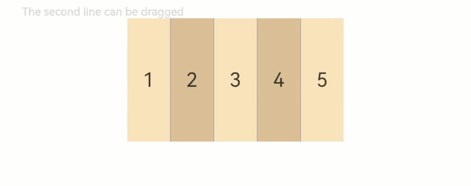

# RowSplit

The **RowSplit** lays out child components horizontally and inserts a vertical divider between every two child components.

>  **NOTE**
>
> This component is supported since API version 7. Updates will be marked with a superscript to indicate their earliest API version.

## Child Components

Supported

This component limits the width of its child components through dividers. During initialization, the divider positions are calculated based on the width of its child components. After initialization, changes to the width of the child components do not take effect. Still, the space occupied by the child components can be changed by dragging the dividers between them.

After initialization, dynamic changes to the [margin](ts-universal-attributes-size.md#margin), [border](ts-universal-attributes-border.md#border), or [padding](ts-universal-attributes-size.md#padding) attributes may cause the width of the child components to exceed the allowable distance between adjacent dividers. In such cases, dividers cannot be dragged to adjust the width of the child components.
## APIs

RowSplit()

**Atomic service API**: This API can be used in atomic services since API version 11.

**System capability**: SystemCapability.ArkUI.ArkUI.Full

## Attributes

### resizeable

resizeable(value: boolean)

Sets whether the divider can be dragged.

**Atomic service API**: This API can be used in atomic services since API version 11.

**System capability**: SystemCapability.ArkUI.ArkUI.Full

**Parameters**

| Name| Type| Mandatory| Description|
| -------- | -------- | -------- | -------- |
| value | boolean | Yes| Whether the divider can be dragged.<br>Default value: **false**|

>  **NOTE**
>
> The divider of **RowSplit** can change the width of the left and right child components, but only to the extent that the resultant width falls within the maximum and minimum widths of the child components.
>
> Universal attributes such as [clip](ts-universal-attributes-sharp-clipping.md#clip12) and [margin](ts-universal-attributes-size.md#margin) are supported. If **clip** is not set, the default value **true** is used.


## Example

This example demonstrates the basic usage of **RowSplit**, which allows you to create draggable, horizontally laid-out child components.

```ts
// xxx.ets
@Entry
@Component
struct RowSplitExample {
  build() {
    Column() {
      Text('The second line can be dragged').fontSize(9).fontColor(0xCCCCCC).width('90%')
      RowSplit() {
        Text('1').width('10%').height(100).backgroundColor(0xF5DEB3).textAlign(TextAlign.Center)
        Text('2').width('10%').height(100).backgroundColor(0xD2B48C).textAlign(TextAlign.Center)
        Text('3').width('10%').height(100).backgroundColor(0xF5DEB3).textAlign(TextAlign.Center)
        Text('4').width('10%').height(100).backgroundColor(0xD2B48C).textAlign(TextAlign.Center)
        Text('5').width('10%').height(100).backgroundColor(0xF5DEB3).textAlign(TextAlign.Center)
      }
      .resizeable(true) // The divider can be dragged.
      .width('90%').height(100)
    }.width('100%').margin({ top: 5 })
  }
}
```


