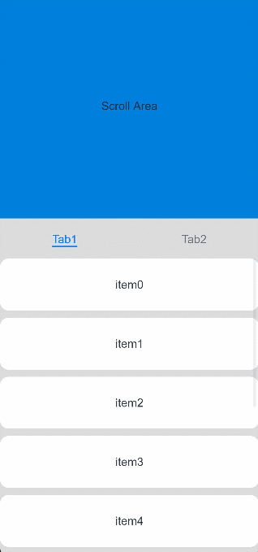
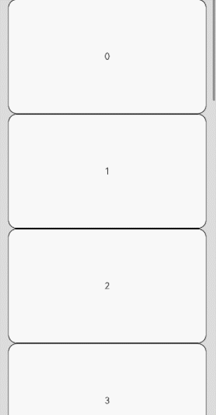

# Scroll

The **Scroll** component scrolls the content when the layout size of a component exceeds the size of its parent component.

>  **NOTE**
>  - This component is supported since API version 7. Updates will be marked with a superscript to indicate their earliest API version.
>  - When nesting a **List** within this component, specify the width and height for the **List** under scenarios where consistently high performance is required. If the width and height are not specified, this component will load all content of the **List**.
>  - This component can scroll only when the size on the main axis is less than the content size.
>  - This component can produce a bounce effect only when there is more than one screen of content.


## Child Components

This component supports only one child component.


## APIs

Scroll(scroller?: Scroller)

**Atomic service API**: This API can be used in atomic services since API version 11.

**System capability**: SystemCapability.ArkUI.ArkUI.Full

**Parameters**

| Name| Type| Mandatory| Description|
| -------- | -------- | -------- | -------- |
| scroller | [Scroller](#scroller) | No| Scroller, which can be bound to scrollable components.|

## Attributes

In addition to [universal attributes](ts-universal-attributes-size.md) and [scrollable component common attributes](ts-container-scrollable-common.md#attributes), the following attributes are also supported.

### scrollable

scrollable(value: ScrollDirection)

Sets the scrolling direction.

**Atomic service API**: This API can be used in atomic services since API version 11.

**System capability**: SystemCapability.ArkUI.ArkUI.Full

**Parameters**

| Name| Type                                       | Mandatory| Description                                           |
| ------ | ------------------------------------------- | ---- | ----------------------------------------------- |
| value  | [ScrollDirection](#scrolldirection) | Yes  | Scrolling direction.<br>Default value: **ScrollDirection.Vertical**|

### scrollBar

scrollBar(barState: BarState)

Sets the scrollbar state. If the container component cannot be scrolled, the scrollbar is not displayed. If the size of a child component of a container component is infinite, the scrollbar cannot be dragged or scrolled with the child component.

Since API version 10, when the scrollable component has rounded corners, to prevent the scrollbar from being cut off by the corners, the scrollbar will automatically calculate the clearance distance from the top and bottom.

**Atomic service API**: This API can be used in atomic services since API version 11.

**System capability**: SystemCapability.ArkUI.ArkUI.Full

**Parameters**

| Name  | Type                                     | Mandatory| Description                                  |
| -------- | ----------------------------------------- | ---- | -------------------------------------- |
| barState | [BarState](ts-appendix-enums.md#barstate) | Yes  | Scrollbar state.<br>Default value: **BarState.Auto**|

### scrollBarColor

scrollBarColor(color: Color | number | string)

Sets the scrollbar color.

**Atomic service API**: This API can be used in atomic services since API version 11.

**System capability**: SystemCapability.ArkUI.ArkUI.Full

**Parameters**

| Name| Type                                                        | Mandatory| Description          |
| ------ | ------------------------------------------------------------ | ---- | -------------- |
| color  | [Color](ts-appendix-enums.md#color) \| number \| string | Yes  | Scrollbar color.<br>Default value: **'\#182431'** (40% opacity)  |

### scrollBarWidth

scrollBarWidth(value: number | string)

Sets the scrollbar width. This attribute cannot be set in percentage. After the width is set, the scrollbar is displayed with the set width in normal state and pressed state. If the set width exceeds the height of the **Scroll** component on the main axis, the scrollbar reverts to the default width.

**Atomic service API**: This API can be used in atomic services since API version 11.

**System capability**: SystemCapability.ArkUI.ArkUI.Full

**Parameters**

| Name| Type                      | Mandatory| Description                                     |
| ------ | -------------------------- | ---- | ----------------------------------------- |
| value  | number \| string | Yes  | Scrollbar width.<br>Default value: **4**<br>Unit: vp|

### scrollSnap<sup>10+</sup>

scrollSnap(value: ScrollSnapOptions)

Sets the scroll snapping mode.

**Atomic service API**: This API can be used in atomic services since API version 11.

**System capability**: SystemCapability.ArkUI.ArkUI.Full

**Parameters**

| Name| Type                                     | Mandatory| Description                      |
| ------ | ----------------------------------------- | ---- | -------------------------- |
| value  | [ScrollSnapOptions](#scrollsnapoptions10) | Yes  | Scroll snapping mode.|

### edgeEffect

edgeEffect(edgeEffect: EdgeEffect, options?: EdgeEffectOptions)

Sets the effect used when the scroll boundary is reached.

**Atomic service API**: This API can be used in atomic services since API version 11.

**System capability**: SystemCapability.ArkUI.ArkUI.Full

**Parameters**

| Name               | Type                                             | Mandatory| Description                                                        |
| --------------------- | ------------------------------------------------- | ---- | ------------------------------------------------------------ |
| edgeEffect            | [EdgeEffect](ts-appendix-enums.md#edgeeffect)     | Yes  | Effect used when the scroll boundary is reached. The spring and shadow effects are supported.<br>Default value: **EdgeEffect.None**|
| options<sup>11+</sup> | [EdgeEffectOptions](ts-container-scrollable-common.md#edgeeffectoptions11) | No  | Whether to enable the scroll effect when the component content is smaller than the component itself. The value **{ alwaysEnabled: true }** means to enable the scroll effect, and **{ alwaysEnabled: false }** means the opposite.<br>Default value: **{ alwaysEnabled: true }**|

### enableScrollInteraction<sup>10+</sup>

enableScrollInteraction(value: boolean)

Sets whether to support scroll gestures. When this attribute is set to **false**, scrolling by finger or mouse is not supported, but the scroll controller API is not affected.

**Atomic service API**: This API can be used in atomic services since API version 11.

**System capability**: SystemCapability.ArkUI.ArkUI.Full

**Parameters**

| Name| Type   | Mandatory| Description                               |
| ------ | ------- | ---- | ----------------------------------- |
| value  | boolean | Yes  | Whether to support scroll gestures.<br>Default value: **true**|

### nestedScroll<sup>10+</sup>

nestedScroll(value: NestedScrollOptions)

Sets the nested scrolling options. You can set the nested scrolling mode in the forward and backward directions to implement scrolling linkage with the parent component.

**Atomic service API**: This API can be used in atomic services since API version 11.

**System capability**: SystemCapability.ArkUI.ArkUI.Full

**Parameters**

| Name| Type                                                 | Mandatory| Description          |
| ------ | ----------------------------------------------------- | ---- | -------------- |
| value  | [NestedScrollOptions](ts-container-scrollable-common.md#nestedscrolloptions10) | Yes  | Nested scrolling options.<br>Default value: **{ scrollForward: NestedScrollMode.SELF_ONLY, scrollBackward: NestedScrollMode.SELF_ONLY }**|

### friction<sup>10+</sup>

friction(value: number | Resource)

Sets the friction coefficient. It applies only to gestures in the scrolling area, and it affects only indirectly the scroll chaining during the inertial scrolling process. A value less than or equal to 0 evaluates to the default value.

**Atomic service API**: This API can be used in atomic services since API version 11.

**System capability**: SystemCapability.ArkUI.ArkUI.Full

**Parameters**

| Name| Type                                                | Mandatory| Description                                                     |
| ------ | ---------------------------------------------------- | ---- | --------------------------------------------------------- |
| value  | number \| [Resource](ts-types.md#resource) | Yes  | Friction coefficient.<br>Default value: **0.9** for wearable devices and **0.6** for non-wearable devices<br>Since API version 11, the default value for non-wearable devices is **0.7**.<br>Since API version 12, the default value for non-wearable devices is **0.75**.|

### enablePaging<sup>11+</sup>

enablePaging(value: boolean)

Sets whether to enable the swipe-to-turn-pages feature. If both **enablePaging** and **scrollSnap** are set, **scrollSnap** takes effect, but **enablePaging** does not.

**Atomic service API**: This API can be used in atomic services since API version 12.

**System capability**: SystemCapability.ArkUI.ArkUI.Full

**Parameters**

| Name| Type   | Mandatory| Description                                 |
| ------ | ------- | ---- | ------------------------------------- |
| value  | boolean | Yes  | Whether to enable the swipe-to-turn-pages feature. The value **true** means to enable the swipe-to-turn-pages feature, and **false** means the opposite.<br>Default value: **false**|

### initialOffset<sup>12+</sup>

initialOffset(value: OffsetOptions)

Sets the initial scrolling offset. This attribute takes effect only during the initial layout of the component. After the initial layout, dynamically changing the value of this attribute does not have any effect.

**Atomic service API**: This API can be used in atomic services since API version 12.

**System capability**: SystemCapability.ArkUI.ArkUI.Full

**Parameters**

| Name| Type   | Mandatory| Description                                 |
| ------ | ------- | ---- | ------------------------------------- |
| value  | [OffsetOptions](#offsetoptions12)  | Yes  |Initial scrolling offset. When the value specified is a percentage, the initial scrolling offset is calculated as the product of the **Scroll** component's size in the main axis direction and the percentage value.|

## ScrollDirection

**System capability**: SystemCapability.ArkUI.ArkUI.Full

| Name      | Description                    |
| ---------- | ------------------------ |
| Horizontal | Only horizontal scrolling is supported.<br>**Atomic service API**: This API can be used in atomic services since API version 11.|
| Vertical   | Only vertical scrolling is supported.<br>**Atomic service API**: This API can be used in atomic services since API version 11.|
| None       | Scrolling is disabled.<br>**Atomic service API**: This API can be used in atomic services since API version 11.|
| Free<sup>(deprecated) </sup> | Vertical or horizontal scrolling is supported.<br> This API is deprecated since API version 9.|

## ScrollSnapOptions<sup>10+</sup>

**Atomic service API**: This API can be used in atomic services since API version 11.

**System capability**: SystemCapability.ArkUI.ArkUI.Full

| Name      | Type   | Mandatory  | Description      |
| ---------- | --------------------|-------------------- | -------- |
| snapAlign  | [ScrollSnapAlign](ts-container-list.md#scrollsnapalign10)   | Yes| Alignment mode for the scroll snap position.<br>**NOTE**<br>1. Default value: **ScrollSnapAlign.NONE**|
| snapPagination | [Dimension](ts-types.md#dimension10) \| Array\<Dimension\> | No| Snap points for the **Scroll** component. Each snap point defines the offset from an edge to which the **Scroll** component can scroll.<br>**NOTE**<br>1. A value of the **Dimension** type indicates the size per page. The system automatically works out the position of each snap point based on the value. For example, if the value is **500**, the position of the snap point is [0,500,1000,1500, ...].<br>2. A value of the **Array\<Dimension\>** type indicates an array of snap point positions defined by **Dimension**. The range of each dimension is [0, scrollable distance]. Point 0 and the bottom of the scrollable distance automatically become the snap points.<br>3. If this attribute is not set or **Dimension** is set to a value less than or equal to 0, the value is regarded as an abnormal value. In this case, there is no scroll snapping. When the value is of the **Array\<Dimension\>** type, the items in the array must be monotonically increasing.<br>4. When the value is a percentage, the actual size is the product of the viewport of the **Scroll** component and the percentage value.|
| enableSnapToStart | boolean   | No| Whether to enable the snap to start feature. When scroll snapping is defined for the **Scroll** component, setting this attribute to **false** enables the component to scroll between the start edge and the first snap point.<br>**NOTE**<br>1. Default value: **true**<br>2. This attribute takes effect only when **snapPagination** is set to a value of the **Array\<Dimension\>** type; it does not work with values of the **Dimension** type.|
| enableSnapToEnd | boolean   | No| Whether to enable the snap to end feature. When scroll snapping is defined for the **Scroll** component, setting this attribute to **false** enables the component to scroll between the end edge and the last snap point.<br>**NOTE**<br>1. Default value: **true**<br>2. This attribute takes effect only when **snapPagination** is set to a value of the **Array\<Dimension\>** type; it does not work with values of the **Dimension** type.|

## Events

In addition to [universal events](ts-universal-events-click.md) and [scrollable component common events](ts-container-scrollable-common.md#events), the following events are also supported.

### onScrollFrameBegin<sup>9+</sup>

onScrollFrameBegin(event: (offset: number, state: ScrollState) => { offsetRemain: number; })

Triggered when each frame scrolling starts. The input parameters indicate the amount by which the **Scroll** component will scroll. The event handler then works out the amount by which the component needs to scroll based on the real-world situation and returns the result.

The value of **offsetRemain** can be a negative value.

If the **onScrollFrameBegin** event and **scrollBy** method are used to implement nested scrolling, set the **edgeEffect** attribute of the scrollable child component to **None**. For example, if a **List** is nested in the **Scroll** component, **edgeEffect** of the **List** must be set to **EdgeEffect.None**.

Notes:

1. This event is triggered when scrolling is started by the **Scroll** component or other input settings, such as keyboard and mouse operations.<br>2. This event is not triggered when the controller API is called.<br>3. This event does not support the out-of-bounds bounce effect.<br>4. This event is not triggered when the scroll bar is dragged.

**Atomic service API**: This API can be used in atomic services since API version 11.

**System capability**: SystemCapability.ArkUI.ArkUI.Full

**Parameters**

| Name| Type                                                   | Mandatory| Description                      |
| ------ | ------------------------------------------------------- | ---- | -------------------------- |
| offset | number                                                  | Yes  | Amount to scroll by, in vp.|
| state  | [ScrollState](ts-container-list.md#scrollstate)| Yes  | Current scroll state.            |

**Return value**

| Type                    | Description                |
| ------------------------ | -------------------- |
| { offsetRemain: number } | Actual amount by which the grid scrolls, in vp.|

### onScroll<sup>(deprecated)</sup>

onScroll(event: (xOffset: number, yOffset: number) => void)

Triggered to return the horizontal and vertical offsets, in vp, during scrolling when the specified scroll event occurs.

**NOTE**

1. This event is triggered when scrolling is started by the **Scroll** component or other input settings, such as keyboard and mouse operations.

2. This event is triggered when the controller API is called.

3. This event supports the out-of-bounds bounce effect.

This API is deprecated since API version 12. You are advised to use [onWillScroll](#onwillscroll12) instead.

**Atomic service API**: This API can be used in atomic services since API version 11.

**System capability**: SystemCapability.ArkUI.ArkUI.Full

**Parameters**

| Name | Type                                                     | Mandatory| Description                  |
| ------- | --------------------------------------------------------- | ---- | ---------------------- |
| xOffset     | number                                                  | Yes  | Horizontal offset per frame during scrolling. A positive offset indicates scrolling to the left, and a negative offset indicates scrolling to the right.<br>Unit: vp|
| yOffset     | number                                                  | Yes  | Vertical offset per frame during scrolling. A positive offset indicates scrolling upward, and a negative offset indicates scrolling downward.<br>Unit: vp|

### onWillScroll<sup>12+</sup>

onWillScroll(handler: ScrollOnWillScrollCallback)

Triggered before scrolling.

The callback provides the amount of offset that is about to be scrolled in the current frame, along with the current scroll status and the source of the scrolling operation. The offset provided in the callback is the calculated intended scrolling offset, not the final actual scrolling offset. You can specify the intended scrolling offset for the **Scroll** through the return value of this callback.

**NOTE**

1. This event is triggered when scrolling is started by the **Scroll** component or other input settings, such as keyboard and mouse operations.

2. This event is triggered when the controller API is called.

3. This event supports the out-of-bounds bounce effect.

**Atomic service API**: This API can be used in atomic services since API version 12.

**System capability**: SystemCapability.ArkUI.ArkUI.Full

**Parameters**

| Name | Type                                                     | Mandatory| Description                  |
| ------- | --------------------------------------------------------- | ---- | ---------------------- |
| handler | [ScrollOnWillScrollCallback](#scrollonwillscrollcallback12) | Yes  | Callback triggered before scrolling.|

### onDidScroll<sup>12+</sup>

onDidScroll(handler: ScrollOnScrollCallback)

Triggered when the **Scroll** component scrolls.

The return value is the scrolling offset amount in the current frame, along with the current scroll state.

**NOTE**

1. This event is triggered when scrolling is started by the **Scroll** component or other input settings, such as keyboard and mouse operations.

2. This event is triggered when the controller API is called.

3. This event supports the out-of-bounds bounce effect.

**Atomic service API**: This API can be used in atomic services since API version 12.

**System capability**: SystemCapability.ArkUI.ArkUI.Full

**Parameters**

| Name | Type                                                     | Mandatory| Description                  |
| ------- | --------------------------------------------------------- | ---- | ---------------------- |
| handler | [ScrollOnScrollCallback](#scrollonscrollcallback12) | Yes  | Callback triggered when the **Scroll** component scrolls.|

### onScrollEdge

onScrollEdge(event: (side: Edge) => void)

Triggered when scrolling reaches the edge.

**NOTE**

1. This event is triggered when scrolling reaches the edge after being started by the **Scroll** component or other input settings, such as keyboard and mouse operations.<br>2. This event is triggered when the controller API is called.<br>3. This event supports the out-of-bounds bounce effect.

**Atomic service API**: This API can be used in atomic services since API version 11.

**System capability**: SystemCapability.ArkUI.ArkUI.Full

**Parameters**

| Name| Type                             | Mandatory| Description              |
| ------ | --------------------------------- | ---- | ------------------ |
| side   | [Edge](ts-appendix-enums.md#edge) | Yes  | Edge position to scroll to.|

### onScrollEnd<sup>(deprecated) </sup>

onScrollEnd(event: () => void)

Triggered when scrolling stops.

**NOTE**

1. This event is triggered when scrolling is stopped by the **Scroll** component or other input settings, such as keyboard and mouse operations.<br>2. This event is triggered when the controller API is called, accompanied by a transition animation.

This event is deprecated since API version 9. Use the **onScrollStop** event instead.

**System capability**: SystemCapability.ArkUI.ArkUI.Full

### onScrollStart<sup>9+</sup>

onScrollStart(event: () => void)

Triggered when scrolling starts and is initiated by the user's finger dragging the **Scroll** component or its scrollbar. This event is also triggered when the animation contained in the scrolling triggered by [Scroller](#scroller) starts.

**NOTE**

1. This event is triggered when scrolling is started by the **Scroll** component or other input settings, such as keyboard and mouse operations.<br>2. This event is triggered when the controller API is called, accompanied by a transition animation.

**Atomic service API**: This API can be used in atomic services since API version 11.

**System capability**: SystemCapability.ArkUI.ArkUI.Full

### onScrollStop<sup>9+</sup>

onScrollStop(event: () => void)

Triggered when scrolling stops after the user's finger leaves the screen. This event is also triggered when the animation contained in the scrolling triggered by [Scroller](#scroller) stops.

**NOTE**

1. This event is triggered when scrolling is stopped by the **Scroll** component or other input settings, such as keyboard and mouse operations.<br>2. This event is triggered when the controller API is called, accompanied by a transition animation.

**Atomic service API**: This API can be used in atomic services since API version 11.

**System capability**: SystemCapability.ArkUI.ArkUI.Full

## ScrollOnScrollCallback<sup>12+</sup>

type ScrollOnScrollCallback = (xOffset: number, yOffset: number, scrollState: ScrollState) => void

Represents the callback triggered when the **Scroll** component scrolls.

**Atomic service API**: This API can be used in atomic services since API version 12.

**System capability**: SystemCapability.ArkUI.ArkUI.Full

| Name     | Type                                                   | Mandatory| Description                                                        |
| ----------- | ------------------------------------------------------- | ---- | ------------------------------------------------------------ |
| xOffset     | number                                                  | Yes  | Horizontal offset per frame during scrolling. A positive offset indicates scrolling to the left, and a negative offset indicates scrolling to the right.<br>Unit: vp|
| yOffset     | number                                                  | Yes  | Vertical offset per frame during scrolling. A positive offset indicates scrolling upward, and a negative offset indicates scrolling downward.<br>Unit: vp|
| scrollState | [ScrollState](ts-container-list.md#scrollstate)| Yes | Current scrolling state.                                              |

>  **NOTE**
>
>  If the **onScrollFrameBegin** event and **scrollBy** method are used to implement nested scrolling, set the **edgeEffect** attribute of the scrollable child component to **None**. For example, if a **List** is nested in the **Scroll** component, **edgeEffect** of the **List** must be set to **EdgeEffect.None**.

## ScrollOnWillScrollCallback<sup>12+</sup>

type ScrollOnWillScrollCallback = (xOffset: number, yOffset: number, scrollState: ScrollState, scrollSource: ScrollSource) => void | OffsetResult

Callback triggered before scrolling.

**Atomic service API**: This API can be used in atomic services since API version 12.

**System capability**: SystemCapability.ArkUI.ArkUI.Full

| Name     | Type                                                   | Mandatory| Description                                                        |
| ----------- | ------------------------------------------------------- | ---- | ------------------------------------------------------------ |
| xOffset     | number                                                  | Yes  | Horizontal offset per frame during scrolling. A positive offset indicates scrolling to the left, and a negative offset indicates scrolling to the right.<br>Unit: vp|
| yOffset     | number                                                  | Yes  | Vertical offset per frame during scrolling. A positive offset indicates scrolling upward, and a negative offset indicates scrolling downward.<br>Unit: vp|
| scrollState | [ScrollState](ts-container-list.md#scrollstate)| Yes | Current scrolling state.                                              | 
| scrollSource | [ScrollSource](ts-appendix-enums.md#scrollsource12) | Yes| Source of the current scrolling operation.|

**Return value**

| Type                                                        | Description                                                        |
| ------------------------------------------------------------ | ------------------------------------------------------------ |
| void \| [OffsetResult](#offsetresult11) |  If **OffsetResult** is returned, the scrolling will be performed with the offsets specified. Otherwise, the scrolling will be performed with the offsets determined by **(xOffset, yOffset)**.|

## Scroller

Implements a controller for a scrollable container component. You can bind this component to a container component and use it to control the scrolling of that component. One controller can control only one container component. The supported container components are **List**, **Scroll**, **ScrollBar**, **Grid**, and **WaterFlow**.


### Objects to Import

```
scroller: Scroller = new Scroller()
```

### constructor

constructor()

A constructor used to create a **Scroller** object.

**Atomic service API**: This API can be used in atomic services since API version 11.

**System capability**: SystemCapability.ArkUI.ArkUI.Full

### scrollTo

scrollTo(value: { xOffset: number | string, yOffset: number | string, animation?: { duration?: number, curve?: Curve | ICurve, canOverScroll?: boolean } | boolean })


Scrolls to the specified position.

**Atomic service API**: This API can be used in atomic services since API version 11.

**System capability**: SystemCapability.ArkUI.ArkUI.Full

**Parameters**

| Name   | Type                                                    | Mandatory| Description                                                    |
| --------- | ------------------------------------------------------------ | ---- | ------------------------------------------------------------ |
| xOffset   | number \| string                                   | Yes  | Horizontal scrolling offset.<br>**NOTE**<br>This parameter cannot be set in percentage.<br>If the value is less than 0, the offset will be 0 for non-animated scrolling. Animated scrolling stops at the starting position by default. By setting the **animation** parameter, you can enable a bounce effect when the scrolling goes beyond the boundary.<br>This parameter takes effect only when the scroll axis is the x-axis.|
| yOffset   | number \| string                                   | Yes  | Vertical scrolling offset.<br>**NOTE**<br>This parameter cannot be set in percentage.<br>If the value is less than 0, the offset will be 0 for non-animated scrolling. Animated scrolling stops at the starting position by default. By setting the **animation** parameter, you can enable a bounce effect when the scrolling goes beyond the boundary.<br>This parameter takes effect only when the scroll axis is the y-axis.|
| animation | [ScrollAnimationOptions](#scrollanimationoptions12)<sup>12+</sup> \| boolean<sup>10+ </sup> | No  | Animation configuration, which includes the following:<br>- **ScrollAnimationOptions**: custom animation settings.<br>- **boolean**: whether to enable the default spring animation.<br>Default value:<br>ScrollAnimationOptions: { duration: 1000, curve: Curve.Ease, canOverScroll: false } <br>boolean: false<br>**NOTE**<br>Currently, the **List**, **Scroll**, **Grid**, and **WaterFlow** support the **Boolean** type and **ICurve**.<br>Since API version 12, {duration?: number, curve?: [Curve](ts-appendix-enums.md#curve) \| [ICurve](../js-apis-curve.md#icurve9)<sup>10+ </sup>}  is abstracted as the **ScrollAnimationOptions** API, and the **canOverScroll** parameter is added to the API.|


### scrollEdge

scrollEdge(value: Edge, options?: ScrollEdgeOptions)


Scrolls to the edge of the container, regardless of the scroll axis direction. **Edge.Top** and **Edge.Start** produce the same effect, and **Edge.Bottom** and **Edge.End** produce the same effect.
By default, the **Scroll** component comes with an animation, while the **Grid**, **List**, and **WaterFlow** components do not.

**Atomic service API**: This API can be used in atomic services since API version 11.

**System capability**: SystemCapability.ArkUI.ArkUI.Full

**Parameters**

| Name  | Type| Mandatory  | Description     |
| ----- | ---- | ---- | --------- |
| value | [Edge](ts-appendix-enums.md#edge) | Yes   | Edge position to scroll to.<br>**Atomic service API**: This API can be used in atomic services since API version 11.|
| options<sup>12+</sup>  | [ScrollEdgeOptions](#scrolledgeoptions12)| No   | Mode of scrolling to the edge position.<br>**Atomic service API**: This API can be used in atomic services since API version 12.|

### fling<sup>12+</sup>

fling(velocity: number): void


Performs inertial scrolling based on the initial velocity passed in.

**Atomic service API**: This API can be used in atomic services since API version 12.

**System capability**: SystemCapability.ArkUI.ArkUI.Full

**Parameters**

| Name  | Type| Mandatory| Description                                                    |
| -------- | -------- | ---- | ------------------------------------------------------------ |
| velocity | number   | Yes  | Initial velocity of inertial scrolling. Unit: vp/s<br>**NOTE**<br>If the value specified is 0, it is considered as invalid, and the scrolling for this instance will not take effect. If the value is positive, the scroll will move downward; if the value is negative, the scroll will move upward.|

**Error codes**

For details about the error codes, see [Universal Error Codes](../../errorcode-universal.md).

| ID| Error Message|
| ------- | -------- |
| 401      | Parameter error. Possible causes: 1. Mandatory parameters are left unspecified; 2.Incorrect parameters types; 3. Parameter verification failed.   |
| 100004   | Controller not bound to component.                               |

### scrollPage<sup>9+</sup>

scrollPage(value:   ScrollPageOptions)

Scrolls to the next or previous page.

**Atomic service API**: This API can be used in atomic services since API version 11.

**System capability**: SystemCapability.ArkUI.ArkUI.Full

**Parameters**

| Name| Type                                          | Mandatory| Description      |
| ------ | -------------------------------------------------- | ---- | -------------- |
| value  | [ScrollPageOptions](#scrollpageoptions12)| Yes  | Set the Home screen mode|

### scrollPage<sup>(deprecated)</sup>

scrollPage(value: { next: boolean, direction?: Axis })

Scrolls to the next or previous page. This API is deprecated since API version 9. You are advised to use [scrollPage<sup>9+</sup>](#scrollpage9) instead.

**System capability**: SystemCapability.ArkUI.ArkUI.Full

**Parameters**

| Name      | Type   | Mandatory  | Description                          |
| --------- | ------- | ---- | ------------------------------ |
| next      | boolean | Yes   | Whether to turn to the next page. The value **true** means to scroll to the next page, and **false** means to scroll to the previous page.|
| direction | [Axis](ts-appendix-enums.md#axis)    | No   | Scrolling direction: horizontal or vertical.              |

### currentOffset

currentOffset(): OffsetResult

**Atomic service API**: This API can be used in atomic services since API version 11.

**System capability**: SystemCapability.ArkUI.ArkUI.Full

| Type | Description|
| -------- | -------- |
|  [OffsetResult<sup>11+</sup>](#offsetresult11) | Obtains the scrolling offset.<br>**NOTE**<br>If **Scroller** is not bound to a container component or the container component is released abnormally, the return value for **currentOffset** is null.|

### scrollToIndex

scrollToIndex(value: number, smooth?: boolean, align?: ScrollAlign, options?: ScrollToIndexOptions)

Scrolls to a specified index, with support for setting an extra offset for the scroll.

When **smooth** is set to **true**, all passed items are loaded and counted in layout calculation. This may result in performance issues if a large number of items are involved.


>  **NOTE**
>
>  This API only works for the **Grid**, **List**, and **WaterFlow** components.

**Atomic service API**: This API can be used in atomic services since API version 11.

**System capability**: SystemCapability.ArkUI.ArkUI.Full

**Parameters**

| Name               | Type| Mandatory| Description                                                    |
| --------------------- | -------- | ---- | ------------------------------------------------------------ |
| value | number   | Yes  | Index of the item to be scrolled to in the container.<br>**NOTE**<br>If the value set is a negative value or greater than the maximum index of the items in the container, the value is deemed abnormal, and no scrolling will be performed.                    |
| smooth | boolean  | No  | Whether to enable the smooth animation for scrolling to the item with the specified index. The value **true** means to enable that the smooth animation, and **false** means the opposite.<br>Default value: **false**|
| align | [ScrollAlign](#scrollalign10)  | No  | How the list item to scroll to is aligned with the container.<br>Default value when the container is **List**: **ScrollAlign.START**<br> Default value when the container is **Grid**: **ScrollAlign.AUTO**<br> Default value when the container is **WaterFlow**: **ScrollAlign.START**<br>**NOTE**<br>This parameter is only available for the **List**, **Grid**, and **WaterFlow** components.|
| options<sup>12+</sup> | [ScrollToIndexOptions](#scrolltoindexoptions12)  | No  | Options for scrolling to a specified index, for example, an extra offset for the scroll.<br>Default value: **0**, in vp|

### scrollBy<sup>9+</sup>

scrollBy(dx: Length, dy: Length)


Scrolls by the specified amount.


>  **NOTE**
>
>  This API is available for the **Scroll**, **List**, **Grid**, and **WaterFlow** components.

**Atomic service API**: This API can be used in atomic services since API version 11.

**System capability**: SystemCapability.ArkUI.ArkUI.Full

**Parameters**

| Name  | Type  | Mandatory  | Description             |
| ----- | ------ | ---- | ----------------- |
| dx |  [Length](ts-types.md#length) | Yes   | Amount to scroll by in the horizontal direction. The percentage format is not supported.|
| dy |  [Length](ts-types.md#length) | Yes   | Amount to scroll by in the vertical direction. The percentage format is not supported.|

### isAtEnd<sup>10+</sup>

isAtEnd(): boolean

Checks whether the component has scrolled to the bottom.

>  **NOTE**
>
>  This API is available for the **Scroll**, **List**, **Grid**, and **WaterFlow** components.

**Atomic service API**: This API can be used in atomic services since API version 11.

**System capability**: SystemCapability.ArkUI.ArkUI.Full

**Return value**

| Type        | Description         |
| ------- | -------- |
| boolean | The value **true** means that the component has scrolled to the bottom, and **false** means the opposite.|

### getItemRect<sup>11+</sup>

getItemRect(index: number): RectResult

Obtains the size and position of a child component.

>  **NOTE**
>
>  This API is available for the **Scroll**, **List**, **Grid**, and **WaterFlow** components.

**Atomic service API**: This API can be used in atomic services since API version 12.

**System capability**: SystemCapability.ArkUI.ArkUI.Full

**Parameters**

| Name  | Type  | Mandatory  | Description             |
| ----- | ------ | ---- | ----------------- |
| index | number | Yes   | Index of the target child component.|

> **NOTE**
>
> - The value of **index** must be the index of a child component visible in the display area. Otherwise, the value is considered invalid.
> - The size and position returned for an invalid value are both **0**.

**Return value**

| Type      | Description      |
| -------------------  | -------- |
| [RectResult](ts-types.md#rectresult10) | Size and position of the child component relative to the component.<br>Unit: vp|

**Error codes**

For details about the error codes, see [Universal Error Codes](../../errorcode-universal.md).

| ID| Error Message|
| ------- | -------- |
| 401      | Parameter error. Possible causes: 1. Mandatory parameters are left unspecified; 2.Incorrect parameters types; 3. Parameter verification failed.   |
| 100004   | Controller not bound to component.                               |

## OffsetResult<sup>11+</sup>

**Atomic service API**: This API can be used in atomic services since API version 11.

**System capability**: SystemCapability.ArkUI.ArkUI.Full

| Name    | Type  | Read Only| Optional| Description                            |
| ------- |------- | ---- | ---- | -------------------------------- |
| xOffset | number |  No |  No | Horizontal scrolling offset.<br>The unit of the return value is vp.|
| yOffset | number |  No |  No | Vertical scrolling offset.<br>The unit of the return value is vp.|

## ScrollAnimationOptions<sup>12+</sup>

**Atomic service API**: This API can be used in atomic services since API version 12.

**System capability**: SystemCapability.ArkUI.ArkUI.Full

| Name  | Type  | Mandatory  | Description             |
| ----- | ------ | ------ | ----------------- |
| duration | number | No| Scrolling duration.<br>Default value: **1000**<br>**NOTE**<br>A value less than 0 evaluates to the default value.|
| curve | [Curve](ts-appendix-enums.md#curve) \| [ICurve](../js-apis-curve.md#icurve9)<sup>9+ </sup> | No| Scrolling curve.<br>Default value: **Curve.Ease**|
| canOverScroll | boolean | No| Whether to enable overscroll.<br>Default value: **false**<br>**NOTE**<br> Scrolling can exceed the boundary and initiate a bounce animation when this parameter is set to **true**, and the component's **edgeEffect** attribute is set to [EdgeEffect.Spring](ts-appendix-enums.md#edgeeffect).|

## ScrollAlign<sup>10+</sup>

**Atomic service API**: This API can be used in atomic services since API version 11.

**System capability**: SystemCapability.ArkUI.ArkUI.Full

| Name    | Description                            |
| ------ | ------------------------------ |
| START   | The start edge of the list item is flush with the start edge of the list. |
| CENTER | The list item is centered along the main axis of the list.       |
| END  | The end edge of the list item is flush with the end edge of the list.|
| AUTO  | The list item is automatically aligned.<br>If the list item is fully contained within the display area, no adjustment is performed. Otherwise, the list item is aligned so that its start or end edge is flush with the start or end edge of the list, whichever requires a shorter scrolling distance.|

## ScrollToIndexOptions<sup>12+</sup>

**Atomic service API**: This API can be used in atomic services since API version 12.

**System capability**: SystemCapability.ArkUI.ArkUI.Full

| Name  | Type | Mandatory| Description             |
| ----- | ------ | ------ | ----------------- |
| extraOffset | [LengthMetrics](../js-apis-arkui-graphics.md#lengthmetrics12) | No| Extra offset for scrolling to a specified index.|

## ScrollPageOptions<sup>12+</sup>

**Atomic service API**: This API can be used in atomic services since API version 12.

**System capability**: SystemCapability.ArkUI.ArkUI.Full

| Name   | Type| Mandatory| Description                                                    |
| --------- | -------- | ---- | ------------------------------------------------------------ |
| next      | boolean  | Yes  | Whether to turn to the next page. The value **true** means to scroll to the next page, and **false** means to scroll to the previous page.         |
| animation | boolean  | No  | Whether to enable the page-turning animation. The value **true** means to enable the page-turning animation, and **false** means the opposite.<br>Default value: **false**|

## OffsetOptions<sup>12+</sup>

**Atomic service API**: This API can be used in atomic services since API version 12.

**System capability**: SystemCapability.ArkUI.ArkUI.Full

| Name  | Type | Mandatory| Description             |
| ----- | ------| ------- | ----------------- |
| xOffset | [Dimension](ts-types.md#dimension10) | No|Horizontal scrolling offset.<br>Default value: **0**|
| yOffset | [Dimension](ts-types.md#dimension10) | No|Vertical scrolling offset.<br>Default value: **0**|

## ScrollEdgeOptions<sup>12+</sup>

**Atomic service API**: This API can be used in atomic services since API version 12.

**System capability**: SystemCapability.ArkUI.ArkUI.Full

| Name   | Type| Mandatory| Description                                                  |
| --------- | -------- | ---- | ------------------------------------------------------------ |
| velocity      | number  | No  | Fixed velocity for scrolling to the edge of the container. If the value specified is less than or equal to 0, the parameter will not take effect.<br>Default value: **0**<br>  Unit: vp/s         |

## Example
### Example 1

```ts
// xxx.ets
import { curves } from '@kit.ArkUI'

@Entry
@Component
struct ScrollExample {
  scroller: Scroller = new Scroller()
  private arr: number[] = [0, 1, 2, 3, 4, 5, 6, 7, 8, 9]

  build() {
    Stack({ alignContent: Alignment.TopStart }) {
      Scroll(this.scroller) {
        Column() {
          ForEach(this.arr, (item: number) => {
            Text(item.toString())
              .width('90%')
              .height(150)
              .backgroundColor(0xFFFFFF)
              .borderRadius(15)
              .fontSize(16)
              .textAlign(TextAlign.Center)
              .margin({ top: 10 })
          }, (item: string) => item)
        }.width('100%')
      }
      .scrollable(ScrollDirection.Vertical) // The scrollbar scrolls in the vertical direction.
      .scrollBar(BarState.On) // The scrollbar is always displayed.
      .scrollBarColor(Color.Gray) // The scrollbar color is gray.
      .scrollBarWidth(10) // The scrollbar width is 10.
      .friction(0.6)
      .edgeEffect(EdgeEffect.None)
      .onWillScroll((xOffset: number, yOffset: number, scrollState: ScrollState) => {
        console.info(xOffset + ' ' + yOffset)
      })
      .onScrollEdge((side: Edge) => {
        console.info('To the edge')
      })
      .onScrollStop(() => {
        console.info('Scroll Stop')
      })

      Button('scroll 150')
        .height('5%')
        .onClick(() => { // Click to scroll down by 150.0 vp.
          this.scroller.scrollBy(0, 150)
        })
        .margin({ top: 10, left: 20 })
      Button('scroll 100')
        .height('5%')
        .onClick(() => { // Click to scroll down by 100.0 vp.
          const yOffset: number = this.scroller.currentOffset().yOffset;
          this.scroller.scrollTo({ xOffset: 0, yOffset: yOffset + 100 })
        })
        .margin({ top: 60, left: 20 })
      Button('scroll 100')
        .height('5%')
        .onClick(() => {// Click to scroll down by 100.0 vp. An animation is applied to the scrolling.
          let curve = curves.interpolatingSpring(10, 1, 228, 30) // Create a step curve.
          const yOffset: number = this.scroller.currentOffset().yOffset;
          this.scroller.scrollTo({ xOffset: 0, yOffset: yOffset + 100, animation: { duration: 1000, curve: curve } })
        })
        .margin({ top: 110, left: 20 })
      Button('back top')
        .height('5%')
        .onClick(() => { // Click to go back to the top.
          this.scroller.scrollEdge(Edge.Top)
        })
        .margin({ top: 160, left: 20 })
      Button('next page')
        .height('5%')
        .onClick(() => { // Click to go to the next page.
          this.scroller.scrollPage({ next: true ,animation: true })
        })
        .margin({ top: 210, left: 20 })
    }.width('100%').height('100%').backgroundColor(0xDCDCDC)
  }
}
```


### Example 2
```ts
@Entry
@Component
struct NestedScroll {
  @State listPosition: number = 0; // 0 indicates scrolling to the top of the list, 1 indicates scrolling to the middle of the list, and 2 indicates scrolling to the bottom of the list.
  private arr: number[] = [1, 2, 3, 4, 5, 6, 7, 8, 9, 10]
  private scrollerForScroll: Scroller = new Scroller()
  private scrollerForList: Scroller = new Scroller()

  build() {
    Flex() {
      Scroll(this.scrollerForScroll) {
        Column() {
          Text("Scroll Area")
            .width("100%")
            .height("40%")
            .backgroundColor(0X330000FF)
            .fontSize(16)
            .textAlign(TextAlign.Center)
            .onClick(() => {
              this.scrollerForList.scrollToIndex(5)
            })

          List({ space: 20, scroller: this.scrollerForList }) {
            ForEach(this.arr, (item: number) => {
              ListItem() {
                Text("ListItem" + item)
                  .width("100%")
                  .height("100%")
                  .borderRadius(15)
                  .fontSize(16)
                  .textAlign(TextAlign.Center)
                  .backgroundColor(Color.White)
              }.width("100%").height(100)
            }, (item: string) => item)
          }
          .width("100%")
          .height("50%")
          .edgeEffect(EdgeEffect.None)
          .friction(0.6)
          .onReachStart(() => {
            this.listPosition = 0
          })
          .onReachEnd(() => {
            this.listPosition = 2
          })
          .onScrollFrameBegin((offset: number) => {
            if ((this.listPosition == 0 && offset <= 0) || (this.listPosition == 2 && offset >= 0)) {
              this.scrollerForScroll.scrollBy(0, offset)
              return { offsetRemain: 0 }
            }
            this.listPosition = 1
            return { offsetRemain: offset };
          })

          Text("Scroll Area")
            .width("100%")
            .height("40%")
            .backgroundColor(0X330000FF)
            .fontSize(16)
            .textAlign(TextAlign.Center)
        }
      }
      .width("100%").height("100%")
    }.width('100%').height('100%').backgroundColor(0xDCDCDC).padding(20)
  }
}
```


### Example 3
```ts
@Entry
@Component
struct StickyNestedScroll {
  @State arr: number[] = []

  @Styles
  listCard() {
    .backgroundColor(Color.White)
    .height(72)
    .width("100%")
    .borderRadius(12)
  }

  build() {
    Scroll() {
      Column() {
        Text("Scroll Area")
          .width("100%")
          .height("40%")
          .backgroundColor('#0080DC')
          .textAlign(TextAlign.Center)
        Tabs({ barPosition: BarPosition.Start }) {
          TabContent() {
            List({ space: 10 }) {
              ForEach(this.arr, (item: number) => {
                ListItem() {
                  Text("item" + item)
                    .fontSize(16)
                }.listCard()
              }, (item: string) => item)
            }.width("100%")
            .edgeEffect(EdgeEffect.Spring)
            .nestedScroll({
              scrollForward: NestedScrollMode.PARENT_FIRST,
              scrollBackward: NestedScrollMode.SELF_FIRST
            })
          }.tabBar("Tab1")

          TabContent() {
          }.tabBar("Tab2")
        }
        .vertical(false)
        .height("100%")
      }.width("100%")
    }
    .edgeEffect(EdgeEffect.Spring)
    .friction(0.6)
    .backgroundColor('#DCDCDC')
    .scrollBar(BarState.Off)
    .width('100%')
    .height('100%')
  }

  aboutToAppear() {
    for (let i = 0; i < 30; i++) {
      this.arr.push(i)
    }
  }
}
```

### Example 4
```ts
@Entry
@Component
struct Index {
  scroller: Scroller = new Scroller;
  private arr: number[] = [0, 1, 2, 3, 4, 5, 6, 7, 8, 9, 10, 11, 12, 13, 14, 15]
  build() {
    Scroll(this.scroller) {
      Column() {
        ForEach(this.arr, (item: number) => {
          Text(item.toString())
            .width('90%')
            .height(200)
            .backgroundColor(0xFFFFFF)
            .borderWidth(1)
            .borderColor(Color.Black)
            .borderRadius(15)
            .fontSize(16)
            .textAlign(TextAlign.Center)
        }, (item: string) => item)
      }.width('100%').backgroundColor(0xDCDCDC)
    }
    .backgroundColor(Color.Yellow)
    .height('100%')
    .edgeEffect(EdgeEffect.Spring)
    .scrollSnap({snapAlign:ScrollSnapAlign.START, snapPagination:400, enableSnapToStart:true, enableSnapToEnd:true})
  }
}
```


### Example 5
```ts
@Entry
@Component
// The fling function performs inertial scrolling based on the initial velocity passed in.
struct ListExample {
  private arr: number[] = [0, 1, 2, 3, 4, 5, 6, 7, 8, 9, 10, 11]
  scrollerForList: Scroller = new Scroller()
  build() {
    Column() {
      Button('Fling-1000')
        .height('5%')
        .onClick(() => {
          this.scrollerForList.fling(-1000)
        })
      Button('Fling3000')
        .height('5%')
        .onClick(() => {
          this.scrollerForList.fling(3000)
        })
      List({ space: 20, initialIndex: 0, scroller: this.scrollerForList }) {
        ForEach(this.arr, (item: number) => {
          ListItem() {
            Text('' + item)
              .width('100%').height(100).fontSize(16)
              .textAlign(TextAlign.Center).borderRadius(10).backgroundColor(0xFFFFFF)
          }
        }, (item: string) => item)
      }
      .listDirection(Axis.Vertical) // Arrangement direction
      .scrollBar(BarState.Off)
      .friction(0.9)
      .divider({ strokeWidth: 2, color: 0xFFFFFF, startMargin: 20, endMargin: 20 }) // Divider
      .edgeEffect(EdgeEffect.Spring) // Set the edge scrolling effect to Spring.
      .width('90%')
    }
    .width('100%')
    .height('100%')
    .backgroundColor(0xDCDCDC)
    .padding({ top: 5 })
  }
}
```


### Example 6
This example implements scrolling to the bottom edge of the **Scroll** component at a velocity of 700 vp/s.

```ts
// xxx.ets
@Entry
@Component
struct ScrollExample {
  scroller: Scroller = new Scroller()
  private arr: number[] = [0, 1, 2, 3, 4, 5, 6, 7, 8, 9]

  build() {
    Stack({ alignContent: Alignment.TopStart }) {
      Scroll(this.scroller) {
        Column() {
          ForEach(this.arr, (item: number) => {
            Text(item.toString())
              .width('90%')
              .height(150)
              .backgroundColor(0xFFFFFF)
              .borderRadius(15)
              .fontSize(16)
              .textAlign(TextAlign.Center)
              .margin({ top: 10 })
          }, (item: string) => item)
        }.width('100%')
      }
      .scrollable(ScrollDirection.Vertical) // The scrollbar scrolls in the vertical direction.
      .scrollBar(BarState.On) // The scrollbar is always displayed.
      .scrollBarColor(Color.Gray) // The scrollbar color is gray.
      .scrollBarWidth(10) // The scrollbar width is 10.
      .friction(0.6)
      .edgeEffect(EdgeEffect.None)
      .onWillScroll((xOffset: number, yOffset: number, scrollState: ScrollState) => {
        console.info(xOffset + ' ' + yOffset)
      })
      .onScrollEdge((side: Edge) => {
        console.info('To the edge')
      })
      .onScrollStop(() => {
        console.info('Scroll Stop')
      })

      Button('scroll to bottom 700')
        .height('5%')
        .onClick(() => {// After the button is clicked, the component scrolls to the bottom edge at a velocity of 700 vp/s.
          this.scroller.scrollEdge(Edge.Bottom, { velocity: 700 })
        })
        .margin({ top: 100, left: 20 })
    }.width('100%').height('100%').backgroundColor(0xDCDCDC)
  }
}
```


