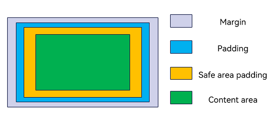

# Scrollable Component Common APIs

The common attributes and events for scrollable components currently only support the [List](ts-container-list.md), [Grid](ts-container-grid.md), [Scroll](ts-container-scroll.md), and [WaterFlow](ts-container-waterflow.md) components.

>  **NOTE**
>
>  The initial APIs of this module are supported since API version 8. Updates will be marked with a superscript to indicate their earliest API version.

## Attributes

### scrollBar11+

scrollBar(barState: BarState): T

Sets the scrollbar state.

**Atomic service API**: This API can be used in atomic services since API version 11.

**System capability**: SystemCapability.ArkUI.ArkUI.Full

**Parameters**

| Name  | Type                                     | Mandatory| Description                                  |
| -------- | ----------------------------------------- | ---- | -------------------------------------- |
| barState | [BarState](ts-appendix-enums.md#barstate) | Yes  | Scrollbar state. Default value: **BarState.Auto** for the **List**, **Grid**, and **Scroll** components and **BarState.Off** for the **WaterFlow** component|

### scrollBarColor11+

scrollBarColor(color: Color | number | string): T

Sets the scrollbar color.

**Atomic service API**: This API can be used in atomic services since API version 11.

**System capability**: SystemCapability.ArkUI.ArkUI.Full

**Parameters**

| Name| Type                                                        | Mandatory| Description          |
| ------ | ------------------------------------------------------------ | ---- | -------------- |
| color  | string \| number \| [Color](ts-appendix-enums.md#color) | Yes  | Scrollbar color. Default value: **'\#182431'** (40% opacity) A number value indicates a HEX color in RGB or ARGB format, for example, **0xffffff**. A string value indicates a color in RGB or ARGB format, for example, **'#ffffff'**.|

### scrollBarWidth11+

scrollBarWidth(value: number | string): T

Sets the scrollbar width. This attribute cannot be set in percentage. After the width is set, the scrollbar is displayed with the set width in normal state and pressed state. If the set width exceeds the height of the scrollable component on the main axis, the scrollbar reverts to the default width.

**Atomic service API**: This API can be used in atomic services since API version 11.

**System capability**: SystemCapability.ArkUI.ArkUI.Full

**Parameters**

| Name| Type                      | Mandatory| Description                                     |
| ------ | -------------------------- | ---- | ----------------------------------------- |
| value  | string \| number | Yes  | Scrollbar width. Default value: **4** Unit: vp If this parameter is set to a value less than or equal to 0, the default value is used. The value **0** means not to show the scrollbar.|

### edgeEffect11+

edgeEffect(edgeEffect: EdgeEffect, options?: EdgeEffectOptions): T

Sets the effect used when the scroll boundary is reached.

**Atomic service API**: This API can be used in atomic services since API version 11.

**System capability**: SystemCapability.ArkUI.ArkUI.Full

**Parameters**

| Name               | Type                                             | Mandatory| Description                                                        |
| --------------------- | ------------------------------------------------- | ---- | ------------------------------------------------------------ |
| edgeEffect            | [EdgeEffect](ts-appendix-enums.md#edgeeffect)     | Yes  | Effect used when the scroll boundary is reached. The spring and shadow effects are supported. Default value: **EdgeEffect.None** for the **Grid**, **Scroll**, and **WaterFlow** components and **EdgeEffect.Spring** for the **List** component|
| options | [EdgeEffectOptions](#edgeeffectoptions11) | No  | Whether to enable the scroll effect when the component content is smaller than the component itself. The value **{ alwaysEnabled: true }** means to enable the scroll effect, and **{ alwaysEnabled: false }** means the opposite. Default value: **{ alwaysEnabled: false }** for the **List**, **Grid**, and **WaterFlow** components, and **{ alwaysEnabled: true }** for the **Scroll** component|

### nestedScroll11+

nestedScroll(value: NestedScrollOptions): T

Sets the nested scrolling options. You can set the nested scrolling mode in the forward and backward directions to implement scrolling linkage with the parent component.

**Atomic service API**: This API can be used in atomic services since API version 11.

**System capability**: SystemCapability.ArkUI.ArkUI.Full

**Parameters**

| Name| Type                                                 | Mandatory| Description          |
| ------ | ----------------------------------------------------- | ---- | -------------- |
| value  | [NestedScrollOptions](#nestedscrolloptions10) | Yes  | Nested scrolling options.|

### enableScrollInteraction11+

enableScrollInteraction(value: boolean): T

Sets whether to support scroll gestures. When this attribute is set to **false**, scrolling by finger or mouse is not supported, but the scroll controller API is not affected.

**Atomic service API**: This API can be used in atomic services since API version 11.

**System capability**: SystemCapability.ArkUI.ArkUI.Full

**Parameters**

| Name| Type   | Mandatory| Description                               |
| ------ | ------- | ---- | ----------------------------------- |
| value  | boolean | Yes  | Whether to support scroll gestures. Default value: **true**|

### friction11+

friction(value: number | Resource): T

Sets the friction coefficient. It applies only to gestures in the scrolling area, and it affects only indirectly the scroll chaining during the inertial scrolling process. If this attribute is set to a value less than or equal to 0, the default value is used.

**Atomic service API**: This API can be used in atomic services since API version 11.

**System capability**: SystemCapability.ArkUI.ArkUI.Full

**Parameters**

| Name| Type                                                | Mandatory| Description                                                     |
| ------ | ---------------------------------------------------- | ---- | --------------------------------------------------------- |
| value  | number \| [Resource](ts-types.md#resource) | Yes  | Friction coefficient. Default value: **0.9** for wearable devices and **0.6** for non-wearable devices Since API version 11, the default value for non-wearable devices is **0.7**. Since API version 12, the default value for non-wearable devices is **0.75**. Value range: (0, +∞). If this parameter is set to a value less than or equal to 0, the default value is used.|

### flingSpeedLimit11+

flingSpeedLimit(speedLimit: number): T

Sets the maximum initial velocity at the start of the fling animation that occurs after gesture-driven scrolling ends.

**Atomic service API**: This API can be used in atomic services since API version 11.

**System capability**: SystemCapability.ArkUI.ArkUI.Full

**Parameters**

| Name    | Type  | Mandatory| Description                           |
| ---------- | ------ | ---- | ------------------------------- |
| speedLimit | number | Yes  | Maximum initial velocity at the start of the fling animation. Default value: **9000** Unit: vp/s Value range: (0, +∞). If this parameter is set to a value less than or equal to 0, the default value is used.|

### fadingEdge14+

fadingEdge(enabled: Optional&lt;boolean&gt;, options?: FadingEdgeOptions): T

Sets whether to enable the edge fading effect and the length of the fading edge.

**Atomic service API**: This API can be used in atomic services since API version 14.

**System capability**: SystemCapability.ArkUI.ArkUI.Full

**Parameters**

| Name | Type                                             | Mandatory| Description                                                        |
| ------- | ------------------------------------------------- | ---- | ------------------------------------------------------------ |
| enabled | Optional&lt;boolean&gt;                           | Yes  | Whether to enable the edge fading effect. When **fadingEdge** is set to **true**, it overrides the **.overlay()** attribute of the component. With **fadingEdge** set to **true**, avoid setting background-related attributes on the component, as this may affect the display of the fading effect. With **fadingEdge** set to **true**, the component is clipped to the boundary, and setting the component's **clip** attribute to **false** will not take effect. Default value: **false**, which means not to enable the edge fading effect|
| options | [FadingEdgeOptions](#fadingedgeoptions14) | No  | Object defining edge fading effect properties, such as the fading edge length.|

### clipContent14+

clipContent(clip: ContentClipMode | RectShape): T

Sets the content clipping area for this scrollable component.

**Atomic service API**: This API can be used in atomic services since API version 14.

**System capability**: SystemCapability.ArkUI.ArkUI.Full

**Parameters**

| Name | Type                                             | Mandatory| Description                                                        |
| ------- | ------------------------------------------------- | ---- | ------------------------------------------------------------ |
| clip | [ContentClipMode](#contentclipmode14) \| [RectShape](../js-apis-arkui-shape.md#rectshape)   | Yes  | Clipping to apply, which is effective only for the content (that is, child components) of the scrollable component, not the background. When a custom rectangular area is passed through **RectShape**, only width, height, and [offset](../js-apis-arkui-shape.md#offset) relative to the component's upper left corner are supported, and rounded corners are not supported. 
Default value: The default value for **Grid** and **Scroll** is **ContentClipMode.BOUNDARY**, and the default value for **List** and **WaterFlow** is **ContentClipMode.CONTENT_ONLY**.|

### backToTop15+

backToTop(backToTop: boolean)

Sets whether to enable the back-to-top feature for a scrollable component when the status bar is touched.

If this feature is enabled, the scrollable component on the current page scrolls to the top when the user touches the status bar. This behavior does not affect scrollable components in background applications, which will not scroll to the top. This attribute is independent of the [enableScrollInteraction](#enablescrollinteraction11) setting.

**Atomic service API**: This API can be used in atomic services since API version 15.

**System capability**: SystemCapability.ArkUI.ArkUI.Full

**Parameters**

| Name| Type   | Mandatory| Description                                          |
| ------ | ------- | ---- | ---------------------------------------------- |
| backToTop  | boolean | Yes  | Whether to enable the back-to-top feature for a scrollable component when the status bar is touched. Default value: **false**|

## Events

### onReachStart11+

onReachStart(event: () => void): T

Triggered when the scrollable component reaches the start position.

This event is triggered once when the component is initialized and once when the component scrolls to the start position. If the edge effect is set to a spring effect, this event is triggered once when the swipe passes the start position, and triggered again when the swipe rebounds back to the start position.

**Atomic service API**: This API can be used in atomic services since API version 11.

**System capability**: SystemCapability.ArkUI.ArkUI.Full

### onReachEnd11+

onReachEnd(event: () => void): T

Triggered when the scrollable component reaches the end position.

If the edge effect is set to a spring effect, this event is triggered once when the swipe passes the end position, and triggered again when the swipe rebounds back to the end position.

**Atomic service API**: This API can be used in atomic services since API version 11.

**System capability**: SystemCapability.ArkUI.ArkUI.Full

### onScrollStart11+

onScrollStart(event: () => void): T

Triggered when the scrollable component starts scrolling initiated by the user's finger dragging the component or its scrollbar. This event is also triggered when the animation contained in the scrolling triggered by [Scroller](ts-container-scroll.md#scroller) starts.

**NOTE**

1. This event is triggered when the scrollable component starts to scroll, and it supports various input methods that can initiate the scroll, including keyboard and mouse operations.

2. This event is triggered when the controller API is called, accompanied by a transition animation.

**Atomic service API**: This API can be used in atomic services since API version 11.

**System capability**: SystemCapability.ArkUI.ArkUI.Full

### onScrollStop11+

onScrollStop(event: () => void): T

Triggered when scrolling stops after the user's finger leaves the screen. This event is also triggered when the animation contained in the scrolling triggered by [Scroller](ts-container-scroll.md#scroller) stops.

**NOTE**

1. The event is triggered when the scrollable component stops scrolling, and it supports various input methods that can initiate the scroll, including keyboard and mouse operations.

2. This event is triggered when the controller API is called, accompanied by a transition animation.

**Atomic service API**: This API can be used in atomic services since API version 11.

**System capability**: SystemCapability.ArkUI.ArkUI.Full

### onWillScroll12+ 

onWillScroll(handler: Optional&lt;OnWillScrollCallback&gt;): T

Triggered when the scrollable component is about to scroll.

The callback provides the amount of offset that is about to be scrolled in the current frame, along with the current scroll status and the source of the scrolling operation. The offset provided in the callback is the calculated intended scrolling offset, not the final actual scrolling offset. You can specify the intended scrolling offset for the scrollable component through the return value of this callback.

**Atomic service API**: This API can be used in atomic services since API version 12.

**System capability**: SystemCapability.ArkUI.ArkUI.Full

**Parameters**

| Name| Type| Mandatory| Description|
| ------ | ------ | ------ | ------|
| handler | Optional&lt;[OnWillScrollCallback](#onwillscrollcallback12)&gt; | Yes| Callback triggered when the scrollable component is about to scroll.|

> **NOTE**
> 
> When **ScrollEdge** and **ScrollToIndex** that does not involve animation is called, **onWillScroll** is not invoked.

### onDidScroll12+ 

onDidScroll(handler: OnScrollCallback): T

Triggered when the scrollable component scrolls. The return value is the offset amount by which the list has scrolled and the current scroll state.

**Widget capability**: This API can be used in ArkTS widgets since API version 12.

**Atomic service API**: This API can be used in atomic services since API version 12.

**System capability**: SystemCapability.ArkUI.ArkUI.Full

**Parameters**

| Name| Type| Mandatory| Description|
| ------ | ------ | ------ | ------|
| handler | [OnScrollCallback](#onscrollcallback12) | Yes| Callback triggered when the scrollable component scrolls.|

### onScroll(deprecated)

onScroll(event: (scrollOffset: number, scrollState: ScrollState) => void): T

Triggered when the scrollable component scrolls.

This API is supported since API version 11.

This API is deprecated since API version 12. For the **Scroll** component, the **onScroll** event is triggered before layout calculations, and you are advised to use [onWillScroll](#onwillscroll12) instead. For the **List**, Grid, and **WaterFlow** components, the **onScroll** event is triggered after layout calculations, and you are advised to use [onDidScroll](#ondidscroll12) instead.

**Atomic service API**: This API can be used in atomic services since API version 11.

**System capability**: SystemCapability.ArkUI.ArkUI.Full

**Parameters**

| Name| Type| Mandatory| Description|
| ------ | ------ | ------ | ------|
| scrollOffset | number | Yes| Scroll offset of each frame. The offset is positive when the scrollable component is scrolled up and negative when it is scrolled down. Unit: vp|
| scrollState | [ScrollState](ts-container-list.md#scrollstate)| Yes| Current scroll state.|

## ItemDragInfo

Provides information about the drag point.

**Atomic service API**: This API can be used in atomic services since API version 11.

**System capability**: SystemCapability.ArkUI.ArkUI.Full

| Name        | Type        |   Description        |
| ---------- | ---------- | ---------- |
| x | number |  X coordinate of the dragged item, in vp.   |
| y | number |  Y coordinate of the dragged item, in vp.   |

## NestedScrollOptions10+

Implements an object used to configure the [nestedScroll](#nestedscroll11) attribute.

**Atomic service API**: This API can be used in atomic services since API version 11.

**System capability**: SystemCapability.ArkUI.ArkUI.Full

| Name  | Type | Mandatory| Description             |
| ----- | ------ | ------ | ----------------- |
| scrollForward | [NestedScrollMode](ts-appendix-enums.md#nestedscrollmode10) | Yes| Nested scrolling options when the scrollable component scrolls forward.|
| scrollBackward | [NestedScrollMode](ts-appendix-enums.md#nestedscrollmode10) | Yes| Nested scrolling options when the scrollable component scrolls backward.|

## EdgeEffectOptions11+

Implements an object used to configure the [edgeEffect](#edgeeffect11) attribute.

**Atomic service API**: This API can be used in atomic services since API version 12.

**System capability**: SystemCapability.ArkUI.ArkUI.Full

| Name  | Type | Mandatory| Description             |
| ----- | ------| ------- | ----------------- |
| alwaysEnabled | boolean | Yes| Whether to enable the scroll effect when the component content is smaller than the component itself.|
| effectEdge18+ | number | No| Edge where the edge effect is applied. With **[EffectEdge](#effectedge18).START**, the edge effect is applied to the start edge only. With **[EffectEdge](#effectedge18).END**, the edge effect is applied to the end edge only. The default value is [EffectEdge](#effectedge18).START \| [EffectEdge](#effectedge18).END, which means that the edge effect is applied to both the start and end edges. If an invalid value is set, the edge effect is applied to both the start and end edges. To disable the effect on both edges, set **edgeEffect** to **EdgeEffect.None**.|

## FadingEdgeOptions14+

Implements an object used to configure the [fadingEdge](#fadingedge14) attribute.

**Atomic service API**: This API can be used in atomic services since API version 14.

**System capability**: SystemCapability.ArkUI.ArkUI.Full

| Name          | Type                                                        | Mandatory| Description                                                        |
| ---------------- | ------------------------------------------------------------ | ---- | ------------------------------------------------------------ |
| fadingEdgeLength | [LengthMetrics](../js-apis-arkui-graphics.md#lengthmetrics12) | No  | Length of the fading edge. If the value is smaller than 0, the default length, 32 vp, is used. If the value exceeds half the height of the container, it is adjusted to exactly half the height of the container.|

## EffectEdge18+

Enumerates the edges where the edge effect is applied.

**Atomic service API**: This API can be used in atomic services since API version 18.

**System capability**: SystemCapability.ArkUI.ArkUI.Full

| Name | Value  | Description        |
| ----- | ---- | ------------ |
| START | 1    | Start edge.|
| END   | 2    | End edge.|

## ContentClipMode14+

Enumerates the content clipping modes for the scrollable container.

**Atomic service API**: This API can be used in atomic services since API version 14.

**System capability**: SystemCapability.ArkUI.ArkUI.Full

The figure below illustrates the clipping areas corresponding to each enumeration value after the component has been configured with margin and padding attributes.

| Name    |  Value | Description                                      |
| ------ | ------ | ---------------------------------------- |
| CONTENT_ONLY   |  0  | Clip to the content area, corresponding to the green area in the figure.|
| BOUNDARY |  1  | Clip to the component area, corresponding to the entire blue area in the figure.|
| SAFE_AREA  |  2  | Clip to the safe area configured for the component, corresponding to the entire yellow area in the figure.|

## OnWillScrollCallback12+

type OnWillScrollCallback = (scrollOffset: number, scrollState: ScrollState, scrollSource: ScrollSource) => void | ScrollResult

Callback triggered when the scrollable component is about to scroll.

**Atomic service API**: This API can be used in atomic services since API version 12.

**System capability**: SystemCapability.ArkUI.ArkUI.Full

**Parameters**

| Name| Type| Mandatory| Description|
| ------ | ------ | ------ | ------|
| scrollOffset | number | Yes| Scroll offset of each frame. The offset is positive when the scrollable component is scrolled up and negative when it is scrolled down. Unit: vp|
| scrollState | [ScrollState](ts-container-list.md#scrollstate)| Yes| Current scroll state.|
| scrollSource | [ScrollSource](ts-appendix-enums.md#scrollsource12) | Yes| Source of the current scrolling operation.|

**Return value**

| Type                         | Description                                 |
| ----------------------------- | ------------------------------------ |
| void \| [ScrollResult](#scrollresult12) |  Returns a **ScrollResult** object if the scrollable component scrolls by the offset specified by you; returns no **ScrollResult** object if the component scrolls by the offset specified by **scrollOffset** in the callback. Value range: (-∞, +∞)|

## OnScrollCallback12+

type OnScrollCallback = (scrollOffset: number, scrollState: ScrollState) => void

Callback triggered when the scrollable component scrolls.

**Widget capability**: This API can be used in ArkTS widgets since API version 12.

**Atomic service API**: This API can be used in atomic services since API version 12.

**System capability**: SystemCapability.ArkUI.ArkUI.Full

| Name| Type| Mandatory| Description|
| ------ | ------ | ------ | ------|
| scrollOffset | number | Yes| Scroll offset of each frame. The offset is positive when the scrollable component is scrolled up and negative when it is scrolled down. Unit: vp|
| scrollState | [ScrollState](ts-container-list.md#scrollstate)| Yes| Current scroll state.|

## ScrollResult12+

Implements a return value object of the [OnWillScrollCallback](#onwillscrollcallback12) callback.

**Atomic service API**: This API can be used in atomic services since API version 12.

**System capability**: SystemCapability.ArkUI.ArkUI.Full

| Name| Type| Mandatory| Description|
| ------ | ------ | ------ | ------|
| offsetRemain | number | Yes| Amount by which the component is about to be scrolled, in vp.|

## ChildrenMainSize12+

Provides the size information of the child components of the **List** or **ListItemGroup** component along the main axis. This object only supports one-to-one binding to the **List** or **ListItemGroup** component.

**Atomic service API**: This API can be used in atomic services since API version 12.

**System capability**: SystemCapability.ArkUI.ArkUI.Full

### constructor12+

constructor(childDefaultSize: number): void

A constructor used to create a **ChildrenMainSize** object.

**Atomic service API**: This API can be used in atomic services since API version 12.

**System capability**: SystemCapability.ArkUI.ArkUI.Full

**Parameters**

| Name  | Type                           | Mandatory  | Description                  |
| ---- | ----------------------------- | ---- | -------------------- |
| childDefaultSize | number | Yes   | Default size of the child component along the main axis. Unit: vp **NOTE** The value must be a finite non-negative number; otherwise, an exception will be thrown.|

### childDefaultSize12+

set childDefaultSize(value: number): void

Sets the default size of the child component along the main axis.

**Atomic service API**: This API can be used in atomic services since API version 12.

**System capability**: SystemCapability.ArkUI.ArkUI.Full

**Parameters**

| Name  | Type                           | Mandatory  | Description                  |
| ---- | ----------------------------- | ---- | -------------------- |
| value | number | Yes   | Default size of the child component along the main axis. Unit: vp **NOTE** The value must be a finite non-negative number; otherwise, an exception will be thrown.|

**Error codes**

For details about the error codes, see [Universal Error Codes](../../errorcode-universal.md).

| ID| Error Message|
| ------- | -------- |
| 401      | Parameter error. Possible causes: 1. Mandatory parameters are left unspecified; 2.Incorrect parameter types; 3. Parameter verification failed.   |

get childDefaultSize(): number

Obtains the default size of the child component along the main axis.

**Atomic service API**: This API can be used in atomic services since API version 12.

**System capability**: SystemCapability.ArkUI.ArkUI.Full

**Return value**

| Type                                                        | Description                                                        |
| ------------------------------------------------------------ | ------------------------------------------------------------ |
| number | Default size of the child component along the main axis. Unit: vp Value range: [0, +∞)|

### splice12+

splice(start: number, deleteCount?: number, childrenSize?: Array\<number>): void

Performs batch operations to add, delete, or modify the size information of child components along the main axis.

**Atomic service API**: This API can be used in atomic services since API version 12.

**System capability**: SystemCapability.ArkUI.ArkUI.Full

**Parameters**

| Name  | Type                           | Mandatory  | Description                  |
| ---- | ----------------------------- | ---- | -------------------- |
| start | number | Yes   | Index starting from 0, which indicates the position at which to begin modifying the size information of child components along the main axis. **NOTE** 1. The value must be a finite non-negative number; otherwise, an exception will be thrown. 2. Non-integer values are truncated to the nearest integer. 3. Values exceeding the maximum index do not take effect. Value range: [0, +∞)|
| deleteCount | number | No   | Number of size information entries to be deleted starting from the **start** position. **NOTE** 1.  The value must be a finite non-negative number; otherwise, it will be treated as **0**. 2. Non-integer values are truncated to the nearest integer. 3. The result of (start + deleteCount - 1) can exceed the maximum index, which will delete all size information of child components starting from the **start** position. Default value: **+∞** Value range: [0, +∞)|
| childrenSize | Array\<number > | No   | Size information of all child components to be inserted, starting from the **start** position. Unit for each value in the array: vp **NOTE** 1. If the values in the array are finite non-negative number, they are considered specified sizes and will not change with the default size. 2. 2. If the values in the array are not finite non-negative number, they will be treated as the default size and will change with the default size. The default value is an empty array. Value range: [0, +∞)|

**Error codes**

For details about the error codes, see [Universal Error Codes](../../errorcode-universal.md).

| ID| Error Message|
| ------- | -------- |
| 401      | Parameter error. Possible causes: 1. Mandatory parameters are left unspecified; 2.Incorrect parameter types; 3. Parameter verification failed.   |

> **NOTE**
>
> - If only the **start** parameter is used, it means to delete the size information of the child components starting from the **start** position and beyond.
> - If only the **start** and **deleteCount** parameters are used, it means to delete the **deleteCount**-specified number of size information entries starting from the **start** position. This is generally used when you remove child components.
> - If all three parameters are used, it means to delete the **deleteCount**-specified number of size information entries starting from the **start** position, and then insert all the size information from **childrenSize** at the **start** position. This is generally used when you add child components or batch update the main axis size of child components. If it's only about adding child components, **deleteCount** should be **0**, and the number of elements in **childrenSize** should be equal to the number of child components being added. If it's only about batch updating the main axis size of child components, the number of elements in **childrenSize** should be equal to **deleteCount**, which is the number of updates being made.
> - If you want to notify that the size of a child component should be the default size, the corresponding value in **childrenSize** should not be given as a finite non-negative value, but rather as **NaN**, any negative value, or any other value that can be processed as the default size.

### update12+

update(index: number, childSize: number): void

Updates the main axis size information of the child component corresponding to the specified index.

**Atomic service API**: This API can be used in atomic services since API version 12.

**System capability**: SystemCapability.ArkUI.ArkUI.Full

**Parameters**

| Name  | Type                           | Mandatory  | Description                  |
| ---- | ----------------------------- | ---- | -------------------- |
| index | number | Yes   | Index starting from 0, which indicates the position at which to begin modifying the size information of child components along the main axis. **NOTE** 1. The value must be a finite non-negative number; otherwise, an exception will be thrown. 2. Non-integer values are truncated to the nearest integer. 3. Values exceeding the maximum index do not take effect. Value range: [0, +∞)|
| childSize | number | Yes   | Size to be updated to. Unit: vp **NOTE** 1. If the value is a finite non-negative number, it is considered a specified size and will not change with the default size. 2. 2. If the value is not a finite non-negative number, it will be processed as the default size and will change with the default size. Value range: [0, +∞)|

**Error codes**

For details about the error codes, see [Universal Error Codes](../../errorcode-universal.md).

| ID| Error Message|
| ------- | -------- |
| 401      | Parameter error. Possible causes: 1. Mandatory parameters are left unspecified; 2.Incorrect parameter types; 3. Parameter verification failed.   |
