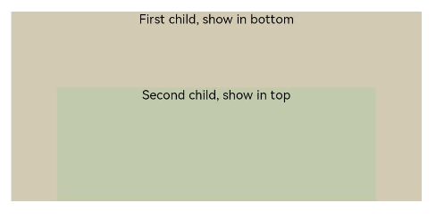

# Stack

The **Stack** component provides a stack container where child components are successively stacked and the latter one overwrites the previous one.

>  **NOTE**
>
>  This component is supported since API version 7. Updates will be marked with a superscript to indicate their earliest API version.


## Child Components

This component can contain child components.


## APIs

Stack(options?: StackOptions)

**Widget capability**: This API can be used in ArkTS widgets since API version 9.

**Atomic service API**: This API can be used in atomic services since API version 11.

**System capability**: SystemCapability.ArkUI.ArkUI.Full

**Parameters**

| Name      | Type                                   | Mandatory| Description                                                   |
| ------------ | ------------------------------------------- | ---- | ----------------------------------------------------------- |
| options | [StackOptions](#stackoptions14) | No  | Alignment of child components in the container.|

## StackOptions<sup>14+</sup>

**Widget capability**: This API can be used in ArkTS widgets since API version 14.

**Atomic service API**: This API can be used in atomic services since API version 14.

**System capability**: SystemCapability.ArkUI.ArkUI.Full

| Name         | Type           | Mandatory| Description                       |
| ------------ | --------------- | ---- | --------------------------- |
| alignContent | [Alignment](ts-appendix-enums.md#alignment) | No  | Alignment of child components in the container.<br>Default value: **Alignment.Center**|

## Attributes

In addition to the [universal attributes](ts-component-general-attributes.md), the following attributes are supported.

### alignContent

alignContent(value: Alignment)

Sets the alignment of all child components in the container. When both this attribute and the universal attribute [align](ts-universal-attributes-location.md#align) are set, whichever is set last takes effect.

**Atomic service API**: This API can be used in atomic services since API version 11.

**Widget capability**: This API can be used in ArkTS widgets since API version 9.

**System capability**: SystemCapability.ArkUI.ArkUI.Full

**Parameters**

| Name| Type                                       | Mandatory| Description                                                       |
| ------ | ------------------------------------------- | ---- | ----------------------------------------------------------- |
| value  | [Alignment](ts-appendix-enums.md#alignment) | Yes  | Alignment of child components in the container.<br>Default value: **Alignment.Center**|


## Example

This example demonstrates the display effect of child components when the **alignContent** attribute of the **Stack** component is set to **Alignment.Bottom**.

```ts
// xxx.ets
@Entry
@Component
struct StackExample {
  build() {
    Stack({ alignContent: Alignment.Bottom }) {
      Text('First child, show in bottom').width('90%').height('100%').backgroundColor(0xd2cab3).align(Alignment.Top)
      Text('Second child, show in top').width('70%').height('60%').backgroundColor(0xc1cbac).align(Alignment.Top)
    }.width('100%').height(150).margin({ top: 5 })
  }
}
```


