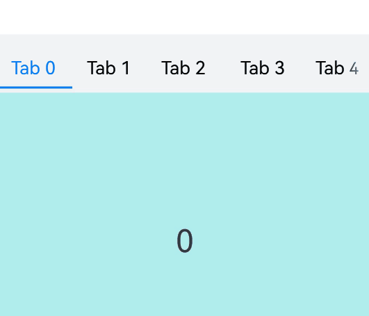

# Swiper

 The **Swiper** component is able to display child components in a carousel-like manner.

> **NOTE**
>
> - This component is supported since API version 7. Updates will be marked with a superscript to indicate their earliest API version.
>
> - The **Swiper** component incorporates a [PanGesture](ts-basic-gestures-pangesture.md) event that facilitates the swiping action to cycle through its child components. Setting [disableSwipe](#disableswipe8) to **true** will cancel the internal listening for the **PanGesture** event, disabling the swiping interaction.

## Child Components

This component can contain child components.

>  **NOTE**
>
>  - Child components can consist of both built-in components and custom components, and their rendering can be controlled with [if/else](../../../quick-start/arkts-rendering-control-ifelse.md), [ForEach](../../../quick-start/arkts-rendering-control-foreach.md), [LazyForEach](../../../quick-start/arkts-rendering-control-lazyforeach.md), and [Repeat](../../../quick-start/arkts-new-rendering-control-repeat.md). To maximize the benefits of lazy loading, avoid mixing lazy loading components (including **LazyForEach** and **Repeat**) and non-lazy loading components, and exercise caution when using multiple lazy loading components. Avoid modifying the data source while an animation is in progress, as doing so can lead to layout issues.
>
>  - If a child component has its [visibility](ts-universal-attributes-visibility.md#visibility) attribute set to **Visibility.None** and the **Swiper** component has its **displayCount** attribute set to **'auto'**, the child component does not take up space in the viewport, but does not affect the number of navigation points. If a child component has its **visibility** attribute set to **Visibility.None** or **Visibility.Hidden**, it takes up space in the viewport, but is not displayed.
>
>  - Child components of the **Swiper** component are drawn based on their level if they have the [offset](ts-universal-attributes-location.md#offset) attribute set. A child component with a higher level overwrites one with a lower level. For example, if the **Swiper** contains three child components and **offset({ x: 100 })** is set for the third child component, the third child component overwrites the first child component during horizontal loop playback. To prevent the first child component from being overwritten, set its [zIndex](ts-universal-attributes-z-order.md) attribute to a value greater than that of the third child component.
>
>  - When focus is moved to a custom child node, navigation points and arrows may be obscured by changes to the z-index due to [focus styles](../../../ui/arkts-common-events-focus-event.md#focus-style).

## APIs

Swiper(controller?: SwiperController)

Creates a **Swiper** component.

**Widget capability**: This API can be used in ArkTS widgets since API version 10.

**Atomic service API**: This API can be used in atomic services since API version 11.

**System capability**: SystemCapability.ArkUI.ArkUI.Full

**Parameters**

| Name       | Type                                 | Mandatory  | Description                |
| ---------- | ------------------------------------- | ---- | -------------------- |
| controller | [SwiperController](#swipercontroller) | No   | Controller bound to the component to control the swiping.|


## Attributes

In addition to the [universal attributes](ts-component-general-attributes.md), the following attributes are supported.

> **NOTE**
>
> The default value of the universal attribute [clip](ts-universal-attributes-sharp-clipping.md) is **true** for the **Swiper** component.

### index

index(value: number)

Sets the index of the child component currently displayed in the container. If the value is less than 0 or greater than or equal to the number of child components, the default value **0** is used.

Since API version 10, this attribute supports two-way binding through [$$](../../../quick-start/arkts-two-way-sync.md).

**Widget capability**: This API can be used in ArkTS widgets since API version 10.

**Atomic service API**: This API can be used in atomic services since API version 11.

**System capability**: SystemCapability.ArkUI.ArkUI.Full

**Parameters**

| Name| Type  | Mandatory| Description                                            |
| ------ | ------ | ---- | ------------------------------------------------ |
| value  | number | Yes  | Index of the child component currently displayed in the container.<br>Default value: **0**<br>**NOTE**<br>If the value specified is less than 0 or greater than the maximum page index, the value **0** is used.|

### autoPlay

autoPlay(value: boolean)

Sets whether to enable automatic playback for child component switching.

If **loop** is set to **false**, the playback stops when the last page is reached. The playback continues when the page is not the last page after a swipe gesture. If the **Swiper** component becomes invisible, the playback stops.

**Widget capability**: This API can be used in ArkTS widgets since API version 10.

**Atomic service API**: This API can be used in atomic services since API version 11.

**System capability**: SystemCapability.ArkUI.ArkUI.Full

**Parameters**

| Name| Type   | Mandatory| Description                                  |
| ------ | ------- | ---- | -------------------------------------- |
| value  | boolean | Yes  | Whether to enable automatic playback for child component switching.<br>Default value: **false** (automatic playback is disabled for child component switching.)|

### autoPlay<sup>18+</sup>

autoPlay(autoPlay: boolean, options: AutoPlayOptions)

Sets whether child components automatically play when the screen is pressed by fingers, a mouse device, or other input devices.

If [loop](#loop) is set to **false**, autoplay stops when the last page is reached. If a gesture is used to switch pages and the last page is not reached, playback will continue. Autoplay also stops when the **Swiper** component is not visible.

**Widget capability**: This API can be used in ArkTS widgets since API version 18.

**Atomic service API**: This API can be used in atomic services since API version 18.

**System capability**: SystemCapability.ArkUI.ArkUI.Full

**Parameters**

| Name| Type   | Mandatory| Description                                  |
| ------ | ------- | ---- | -------------------------------------- |
| autoPlay  | boolean | Yes  | Whether to enable automatic playback for child component switching.<br>Default value: **false** (automatic playback is disabled for child component switching)|
| options  | [AutoPlayOptions](#autoplayoptions18)  | Yes  | Whether child components stop autoplay when the screen is pressed by fingers, a mouse device, or other input devices. If **stopWhenTouched** is set to **true**, autoplay stops when the screen is pressed.<br>Default value: **{ stopWhenTouched: true }** (stop autoplay)|

### interval

interval(value: number)

Sets the interval for automatic playback.

**Widget capability**: This API can be used in ArkTS widgets since API version 10.

**Atomic service API**: This API can be used in atomic services since API version 11.

**System capability**: SystemCapability.ArkUI.ArkUI.Full

**Parameters**

| Name| Type  | Mandatory| Description                                                      |
| ------ | ------ | ---- | ---------------------------------------------------------- |
| value  | number | Yes  | Interval for automatic playback.<br>Default value: **3000**<br>Unit: ms<br>Value range: [0, +∞). If a value less than 0 is set, the default value is used.|

### indicator

indicator(value: DotIndicator | DigitIndicator | boolean)

Sets the style of the navigation indicator.

**Widget capability**: This API can be used in ArkTS widgets since API version 10.

**Atomic service API**: This API can be used in atomic services since API version 11.

**System capability**: SystemCapability.ArkUI.ArkUI.Full

**Parameters**

| Name| Type                                                        | Mandatory| Description                                                        |
| ------ | ------------------------------------------------------------ | ---- | ------------------------------------------------------------ |
| value  | [DotIndicator](#dotindicator10)<sup>10+</sup> \| [DigitIndicator](#digitindicator10)<sup>10+</sup> \| boolean | Yes  | Style of the navigation indicator.<br> \- **DotIndicator**: dot style.<br> \- **DigitIndicator**: digit style.<br> \- **boolean**: whether to enable the navigation indicator. The value **true** means to enable the feature, and **false** means the opposite.<br>  Default value: **true**<br>  Default style: **DotIndicator**|

### indicator<sup>15+</sup>

indicator(indicator: IndicatorComponentController | DotIndicator | DigitIndicator | boolean)

Sets the navigation indicator for the component.

**Widget capability**: This API can be used in ArkTS widgets since API version 15.

**Atomic service API**: This API can be used in atomic services since API version 15.

**System capability**: SystemCapability.ArkUI.ArkUI.Full

**Parameters**

| Name| Type                                                        | Mandatory| Description                                                        |
| ------ | ------------------------------------------------------------ | ---- | ------------------------------------------------------------ |
| indicator  | [IndicatorComponentController](ts-swiper-components-indicator.md#indicatorcomponentcontroller)<sup>15+</sup> \| [DotIndicator](#dotindicator10) \| [DigitIndicator](#digitindicator10) \| boolean| Yes  | Style of the navigation indicator.<br>\- **IndicatorComponentController**: separate navigation indicator controller. This controller can be bound to an external navigation indicator, but the external and internal indicators cannot coexist.<br> \- **DotIndicator**: dot-style indicator.<br> \- **DigitIndicator**: digit-style indicator.<br> \- **boolean**: whether to enable the navigation indicator. The value **true** means to enable the feature, and **false** means the opposite.<br>  Default value: **true**<br>  Default style: **DotIndicator**|


### loop

loop(value: boolean)

Sets whether to enable loop playback. The value **true** means to enable loop playback. When LazyForEach is used, it is recommended that the number of the components to load exceed 5.

**Widget capability**: This API can be used in ArkTS widgets since API version 10.

**Atomic service API**: This API can be used in atomic services since API version 11.

**System capability**: SystemCapability.ArkUI.ArkUI.Full

**Parameters**

| Name| Type   | Mandatory| Description                           |
| ------ | ------- | ---- | ------------------------------- |
| value  | boolean | Yes  | Whether to enable loop playback.<br>Default value: **true**|

### duration

duration(value: number)

Sets the duration of the animation for child component switching.

**duration** must be used in conjunction with [curve](#curve8).

The default curve for the animation is [interpolatingSpring](../js-apis-curve.md#curvesinterpolatingspring10).When this curve is applied, the duration of the animation is determined solely by the parameters of the curve itself and is no longer governed by the **duration** setting. For curves that are not governed by the **duration** setting, see [Interpolation Calculation](../js-apis-curve.md). Among others, [springMotion](../js-apis-curve.md#curvesspringmotion9) and [responsiveSpringMotion](../js-apis-curve.md#curvesresponsivespringmotion9) do not respect the **duration** setting. To have the animation duration managed by **duration**, you should select a different curve for the **curve** attribute.

**Atomic service API**: This API can be used in atomic services since API version 11.

**System capability**: SystemCapability.ArkUI.ArkUI.Full

**Parameters**

| Name| Type  | Mandatory| Description                                                 |
| ------ | ------ | ---- | ----------------------------------------------------- |
| value  | number | Yes  | Duration of the autoplay for child component switching.<br>Default value: **400**<br>Unit: ms<br>Value range: [0, +∞). If a value less than 0 is set, the default value is used.|

### vertical

vertical(value: boolean)

Sets whether vertical swiping is used.

**Widget capability**: This API can be used in ArkTS widgets since API version 10.

**Atomic service API**: This API can be used in atomic services since API version 11.

**System capability**: SystemCapability.ArkUI.ArkUI.Full

**Parameters**

| Name| Type   | Mandatory| Description                              |
| ------ | ------- | ---- | ---------------------------------- |
| value  | boolean | Yes  | Whether vertical swiping is used. The value **true** means vertical swiping, and **false** means horizontal swiping.<br>Default value: **false**|

### itemSpace

itemSpace(value: number | string)

Sets the space between child components. This attribute cannot be set in percentage.

If the type is number, the default unit is vp. If the type is string, the pixel unit must be explicitly specified, for example, **'10px'**; if the unit is not specified, for example, **'10'**, the default unit vp is used.

**Widget capability**: This API can be used in ArkTS widgets since API version 10.

**Atomic service API**: This API can be used in atomic services since API version 11.

**System capability**: SystemCapability.ArkUI.ArkUI.Full

**Parameters**

| Name| Type                      | Mandatory| Description                                  |
| ------ | -------------------------- | ---- | -------------------------------------- |
| value  | number \| string | Yes  | Space between child components.<br>Default value: **0**<br>Value range: [0, +∞). If a value less than 0 is set, the default value is used.|

### displayMode

displayMode(value: SwiperDisplayMode)

Sets the mode in which elements are displayed along the main axis. This API takes effect only when **displayCount** is not set.

**Widget capability**: This API can be used in ArkTS widgets since API version 10.

**Atomic service API**: This API can be used in atomic services since API version 11.

**System capability**: SystemCapability.ArkUI.ArkUI.Full

**Parameters**

| Name| Type                                           | Mandatory| Description                                                        |
| ------ | ----------------------------------------------- | ---- | ------------------------------------------------------------ |
| value  | [SwiperDisplayMode](#swiperdisplaymode) | Yes  | Mode in which elements are displayed along the main axis.<br>Default value: **SwiperDisplayMode.STRETCH**|

### cachedCount<sup>8+</sup>

cachedCount(value: number)

Sets the number of child components to be preloaded (cached), which are needed for the specific number of pages immediately before and after the current page. For example, if **cachedCount** is set to **1**, the child components on the previous page and the next page are cached. If **swipeByGroup** in **displayCount** is set to **true**, child components are cached by group. For example, if **cachedCount** is set to **1** and **swipeByGroup** is set to **true**, the child components in the previous and next groups are cached.

**Widget capability**: This API can be used in ArkTS widgets since API version 10.

**Atomic service API**: This API can be used in atomic services since API version 11.

**System capability**: SystemCapability.ArkUI.ArkUI.Full

**Parameters**

| Name| Type  | Mandatory| Description                            |
| ------ | ------ | ---- | -------------------------------- |
| value  | number | Yes  | Number of child components to be preloaded (cached).<br>Default value: **1**<br>Value range: [0, +∞). If a value less than 0 is set, the default value is used.|

### cachedCount<sup>15+</sup>

cachedCount(count: number, isShown: boolean)

Sets the number of child components to be cached.

**Widget capability**: This API can be used in ArkTS widgets since API version 15.

**Atomic service API**: This API can be used in atomic services since API version 15.

**System capability**: SystemCapability.ArkUI.ArkUI.Full

**Parameters**

| Name| Type  | Mandatory| Description                            |
| ------ | ------ | ---- | -------------------------------- |
| count  | number | Yes  | Number of child components to be preloaded (cached).<br>Default value: **1**<br>Value range: [0, +∞). If a value less than 0 is set, the default value is used.|
| isShown  | boolean | Yes  | Whether the cached nodes within the range rendered without being added to the render tree.<br>Default value: **false**, indicating that cached nodes within the range are rendered|

### disableSwipe<sup>8+</sup>

disableSwipe(value: boolean)

Sets whether to disable the swipe feature.

**Widget capability**: This API can be used in ArkTS widgets since API version 10.

**Atomic service API**: This API can be used in atomic services since API version 11.

**System capability**: SystemCapability.ArkUI.ArkUI.Full

**Parameters**

| Name| Type   | Mandatory| Description                                    |
| ------ | ------- | ---- | ---------------------------------------- |
| value  | boolean | Yes  | Whether to disable the swipe feature. The value **true** means to disable the feature, and **false** means the opposite.<br>Default value: **false**|

### curve<sup>8+</sup>

curve(value: Curve | string | ICurve)

Sets the animation curve. The interpolating spring curve is used by default. For details about common curves, see [Curve](ts-appendix-enums.md#curve). You can also create custom curves (interpolation curve objects) by using the API provided by the [interpolation calculation](../js-apis-curve.md) module.

**Widget capability**: This API can be used in ArkTS widgets since API version 10.

**Atomic service API**: This API can be used in atomic services since API version 11.

**System capability**: SystemCapability.ArkUI.ArkUI.Full

**Parameters**

| Name| Type                                                        | Mandatory| Description                                       |
| ------ | ------------------------------------------------------------ | ---- | ------------------------------------------- |
| value  | [Curve](ts-appendix-enums.md#curve) \| string \| [ICurve](../js-apis-curve.md#icurve9)<sup>10+</sup> | Yes  | Animation curve.<br>Default value: **interpolatingSpring(-1, 1, 328, 34)**|

### indicatorStyle<sup>(deprecated)</sup>

indicatorStyle(value?: IndicatorStyle)

Sets the style of the navigation indicator.

This API is supported since API version 8 and is deprecated since API version 10. You are advised to use [indicator](#indicator10) instead.

**System capability**: SystemCapability.ArkUI.ArkUI.Full

**Parameters**

| Name| Type                                               | Mandatory| Description        |
| ------ | --------------------------------------------------- | ---- | ------------ |
| value  | [IndicatorStyle](#indicatorstyledeprecated) | No  | Style of the navigation indicator.|

### displayCount<sup>8+</sup>

displayCount(value: number | string | SwiperAutoFill, swipeByGroup?: boolean)

Sets the number of elements to display per page.

If the value is of the string type, it can only be **'auto'**. In this case, setting [customContentTransition](#customcontenttransition12) or [onContentDidScroll](#oncontentdidscroll12) has no effect. If the value is of the number type, child components stretch (shrink) on the main axis after the swiper width [deducting the result of itemSpace x (**displayCount** - 1)] is evenly distributed among them on the main axis; a value less than or equal to 0 is handled as the default value **1**. If the value is of the SwiperAutoFill type, the system automatically works out the value based on the width and **minSize** settings of the **Swiper** component. If **minSize** is left empty or set to a value less than or equal to 0, the **Swiper** component displays one column.

When turning pages by group is used, the drag distance threshold for turning pages is half of the width of the **Swiper** component (50% of the child elements width if turning pages by child element is used). If the number of child elements in the last group is less than the value of **displayCount**, placeholders are used, but they show the **Swiper** background style directly and do not display any content. Since API version 16, when turning pages by group is used and the navigation points are set to circular, the number of circular navigation points matches the number of groups. The number of groups is calculated by dividing the total number of child elements by the number of elements displayed in the viewport. If the division does not result in an integer, the number is rounded up.

**Widget capability**: This API can be used in ArkTS widgets since API version 10.

**Atomic service API**: This API can be used in atomic services since API version 11.

**System capability**: SystemCapability.ArkUI.ArkUI.Full

**Parameters**

| Name                    | Type                                                        | Mandatory| Description                                                        |
| -------------------------- | ------------------------------------------------------------ | ---- | ------------------------------------------------------------ |
| value                      | number \| string \| [SwiperAutoFill](#swiperautofill10)<sup>10+</sup> | Yes  | Number of elements to display per page.<br> Default value: **1**<br>Value range: (0, +∞). If this parameter is set to a value less than or equal to 0, the default value is used.|
| swipeByGroup<sup>11+</sup> | boolean                                                      | No  | Whether to turn pages by group. The value **true** means to turn pages by group, and **false** means to turn pages by child element. When turning pages by group is used, the number of child elements per group is the value of **displayCount**.<br> Default value: **false**|

> **NOTE**
>
>  When the number of child components is less than or equal to the total number of allowed nodes in the content area (totalDisplayCount = displayCount + prevMargin? (1 : 0 ) + nextMargin? (1 : 0 )), the **Swiper** component generally uses the non-looping mode for layout. In this case, the child components specified by **nextMargin** and **prevMargin** take up space in the viewport, but are not displayed. The specifications of the **Swiper** component are calculated based on the value of **totalDisplayCount**. The exceptions are as follows:
>    
>  - When the number of child components is equal to the total number of allowed nodes in the content area and both **prevMargin** and **nextMargin** take effect, set **loop** to **true** to enable loop playback.
>
>  - When the number of child components is equal to the value of **displayCount** plus 1 and at least one of **prevMargin** and **nextMargin** takes effect, set **loop** to **true** to enable loop playback. When loop playback is enabled, a snapshot is generated as the placeholder image. (The snapshot may not be correctly generated for those components that take a long time to display, such as those that use asynchronous image loading. Avoid enabling loop playback under this scenario.)
>

### effectMode<sup>8+</sup>

effectMode(value: EdgeEffect)

Sets the effect used when the component is at one of the edges. This attribute takes effect when **loop** is set to **false**. For details about the supported effects, see the **EdgeEffect** enums. The spring effect does not take effect when the controller API is called.

**Widget capability**: This API can be used in ArkTS widgets since API version 10.

**Atomic service API**: This API can be used in atomic services since API version 11.

**System capability**: SystemCapability.ArkUI.ArkUI.Full

**Parameters**

| Name| Type                                         | Mandatory| Description                                        |
| ------ | --------------------------------------------- | ---- | -------------------------------------------- |
| value  | [EdgeEffect](ts-appendix-enums.md#edgeeffect) | Yes  | Effect used when the component is at one of the edges.<br>Default value: **EdgeEffect.Spring**|

### displayArrow<sup>10+</sup>

displayArrow(value: ArrowStyle | boolean, isHoverShow?: boolean)

Sets the arrow style of the navigation indicator.

**Atomic service API**: This API can be used in atomic services since API version 11.

**System capability**: SystemCapability.ArkUI.ArkUI.Full

**Parameters**

| Name                    | Type                                            | Mandatory| Description                                                        |
| -------------------------- | ------------------------------------------------ | ---- | ------------------------------------------------------------ |
| value                      | [ArrowStyle](#arrowstyle10) \| boolean | Yes  | Arrow and background to set. In cases of exceptions, the default values in the **ArrowStyle** object are used. The value **true** means to show the arrow and background in the default styles, and **false** means to hide the arrow and background.<br>Default value: **false**|
| isHoverShow                | boolean                                          | No  | Whether to show the arrow only when the mouse pointer hovers over the navigation indicator.<br>Default value: **false**<br>**NOTE**<br>When **isHoverShow** is set to **false**, the arrow is always displayed and can be clicked to turn pages.<br>When **isHoverShow** is set to **true**, the arrow is displayed only when the mouse pointer hovers over the navigation indicator, and it can be clicked to turn pages.|

> **NOTE**
>
> When all child nodes fit within the viewport, resulting in only one screen's worth of content being visible, the **Swiper** component displays only that screen without any left or right page-turning arrows.

### nextMargin<sup>10+</sup>

nextMargin(value: Length, ignoreBlank?:boolean)

Sets the next margin, used to reveal a small part of the next item. This attribute is effective only when the layout mode of the child components in **Swiper** is set to stretch, which mainly includes two scenarios: 1. **displayMode** is set to **SwiperDisplayMode.STRETCH**; 2. **displayCount** is assigned a numeric value.

When the main axis runs horizontally and either the next margin or previous margin is greater than the measured width of the child component, neither the next margin nor previous margin is displayed.

When the main axis runs vertically and either the next margin or previous margin is greater than the measured height of the child component, neither the next margin nor previous margin is displayed.

**Atomic service API**: This API can be used in atomic services since API version 11.

**System capability**: SystemCapability.ArkUI.ArkUI.Full

**Parameters**

| Name| Type                        | Mandatory| Description                  |
| ------ | ---------------------------- | ---- | ---------------------- |
| value  | [Length](ts-types.md#length) | Yes  | Next margin. This attribute cannot be set in percentage.<br>Default value: **0**|
| ignoreBlank<sup>12+</sup>  | boolean | No  | Whether to hide (ignore) the next margin on the last page in non-loop scenarios.<br> **true**: The last page does not show the next margin, and the right edge of the last page is aligned with that of the **Swiper**'s viewable area.<br>**false**: The last page displays the next margin, and the distance between the right edge of the last page and that of the **Swiper**'s viewable area is equal to the next margin.<br>Default value: **false**<br>**NOTE**<br>On the last page, the values of **prevMargin** and **nextMargin** are added to create a left margin that allows the previous page to be displayed partially.|

### prevMargin<sup>10+</sup>

prevMargin(value: Length, ignoreBlank?:boolean)

Sets the previous margin, used to reveal a small part of the previous item. This attribute is effective only when the layout mode of the child components in **Swiper** is set to stretch, which mainly includes two scenarios: 1. **displayMode** is set to **SwiperDisplayMode.STRETCH**; 2. **displayCount** is assigned a numeric value.

When the main axis runs horizontally and either the next margin or previous margin is greater than the measured width of the child component, neither the next margin nor previous margin is displayed.

When the main axis runs vertically and either the next margin or previous margin is greater than the measured height of the child component, neither the next margin nor previous margin is displayed.

**Atomic service API**: This API can be used in atomic services since API version 11.

**System capability**: SystemCapability.ArkUI.ArkUI.Full

**Parameters**

| Name| Type                        | Mandatory| Description                  |
| ------ | ---------------------------- | ---- | ---------------------- |
| value  | [Length](ts-types.md#length) | Yes  | Previous margin. This attribute cannot be set in percentage.<br>Default value: **0**|
| ignoreBlank<sup>12+</sup>  | boolean | No  | Whether to hide (ignore) the previous margin on the first page in non-loop scenarios.<br> **true**: The first page does not show the previous margin, and the left edge of the first page is align with that of the **Swiper**'s viewable area.<br>**false**: The first page displays the previous margin, and the distance between the left edge of the first page and that of the **Swiper**'s viewable area is equal to the previous margin.<br>Default value: **false**<br>**NOTE**<br>On the first page, the values of **prevMargin** and **nextMargin** are added to create a right margin that allows the next page to be displayed partially.|

### nestedScroll<sup>11+</sup>

nestedScroll(value: SwiperNestedScrollMode)

Sets the nested scrolling mode of the **Swiper** component and its parent container. When **loop** is set to **true**, the **Swiper** component has no edge effect and does not trigger nested scrolling of its parent container.

**Atomic service API**: This API can be used in atomic services since API version 11.

**System capability**: SystemCapability.ArkUI.ArkUI.Full

**Parameters**

| Name| Type                                                       | Mandatory| Description                                                        |
| ------ | ----------------------------------------------------------- | ---- | ------------------------------------------------------------ |
| value  | [SwiperNestedScrollMode](#swipernestedscrollmode11) | Yes  | Nested scrolling mode of the **Swiper** component and its parent container.<br>Default value: **SwiperNestedScrollMode.SELF_ONLY**|

> **NOTE**
>
> The **Swiper** component's flick animation logic differs from other scrollable components, as **Swiper** can only slide one page at a time and performs a page-flip animation during a flick. When a **Swiper** component is nested with other scrollable components, it will not accept the scroll offset values transmitted by its child nodes after its page-turning animation has already started. At this point, the page-turning animation of the **Swiper** and the edge effect animation of the child node will be executed simultaneously.

### indicatorInteractive<sup>12+</sup>

indicatorInteractive(value: boolean)

Sets whether the navigation indicator is interactive. The value **true** means that the navigation indicator is interactive.

**Atomic service API**: This API can be used in atomic services since API version 12.

**System capability**: SystemCapability.ArkUI.ArkUI.Full

**Parameters**

| Name| Type                                                       | Mandatory| Description                                                        |
| ------ | ----------------------------------------------------------- | ---- | ------------------------------------------------------------ |
| value  | boolean | Yes  | Whether the navigation indicator is interactive.<br>Default value: **true**|

### pageFlipMode<sup>15+</sup>

pageFlipMode(mode: Optional\<PageFlipMode>)

Sets the mode for flipping pages using the mouse wheel.

**Widget capability**: This API can be used in ArkTS widgets since API version 15.

**Atomic service API**: This API can be used in atomic services since API version 15.

**System capability**: SystemCapability.ArkUI.ArkUI.Full

**Parameters**

| Name| Type                                                       | Mandatory| Description                                                        |
| ------ | ----------------------------------------------------------- | ---- | ------------------------------------------------------------ |
| mode  | Optional\<[PageFlipMode](ts-appendix-enums.md#pageflipmode15)> | Yes  | Mode for flipping pages using the mouse wheel.<br>Default value: **PageFlipMode.CONTINUOUS**|

## IndicatorStyle<sup>(deprecated)</sup>

This API is supported since API version 8 and is deprecated since API version 10. You are advised to use [indicator](#indicator10) instead.

**System capability**: SystemCapability.ArkUI.ArkUI.Full

| Name         | Type                                      | Mandatory| Description                                                |
| ------------- | ------------------------------------------ | ---- | ---------------------------------------------------- |
| left          | [Length](ts-types.md#length)               | No  | Position of the navigation indicator relative to the left edge of the **Swiper** component.<br>If neither **left** nor **right** is set, the navigation indicator is centered along the main axis based on its own size and the size of the **Swiper** component.<br>If the value specified is **0**, the navigation indicator is placed at the position 0.<br>Priority: higher than the **right** property<br>Value range: [0, Swiper width - Navigation indicator area width]. Values outside this range are adjusted to the nearest boundary.                |
| top           | [Length](ts-types.md#length)               | No  | Position of the navigation indicator relative to the top edge of the **Swiper** component.<br>If neither **top** nor **bottom** is set, the navigation indicator is aligned at the bottom along the cross axis based on its own size and the size of the **Swiper** component, which is the same effect as setting **bottom=0**.<br>If the value specified is **0**, the navigation indicator is placed at the position 0.<br>Priority: higher than the **bottom** property<br>Value range: [0, Swiper height - Navigation indicator area height]. Values outside this range are adjusted to the nearest boundary.                |
| right         | [Length](ts-types.md#length)               | No  | Position of the navigation indicator relative to the right edge of the **Swiper** component.<br>If neither **left** nor **right** is set, the navigation indicator is centered along the main axis based on its own size and the size of the **Swiper** component.<br>If the value specified is **0**, the navigation indicator is placed at the position 0.<br>Priority: lower than the **left** property<br>Value range: [0, Swiper width - Navigation indicator area width]. Values outside this range are adjusted to the nearest boundary.                |
| bottom        | [Length](ts-types.md#length)               | No  | Position of the navigation indicator relative to the bottom edge of the **Swiper** component.<br>If neither **top** nor **bottom** is set, the navigation indicator is aligned at the bottom along the cross axis based on its own size and the size of the **Swiper** component, which is the same effect as setting **bottom=0**.<br>If the value specified is **0**, the navigation indicator is placed at the position 0.<br>Priority: lower than the **top** property<br>Value range: [0, Swiper height - Navigation indicator area height]. Values outside this range are adjusted to the nearest boundary.                |
| size          | [Length](ts-types.md#length)               | No  | Diameter of the navigation indicator. It cannot be set in percentage.<br>Default value: **6vp**|
| mask          | boolean                                    | No  | Whether to enable the mask for the navigation indicator.                        |
| color         | [ResourceColor](ts-types.md#resourcecolor) | No  | Color of the navigation indicator.                                  |
| selectedColor | [ResourceColor](ts-types.md#resourcecolor) | No  | Color of the selected navigation indicator.                            |

## SwiperDisplayMode

Enumerates the modes in which elements are displayed along the main axis.

**System capability**: SystemCapability.ArkUI.ArkUI.Full

| Name                              | Description                                                        |
| ---------------------------------- | ------------------------------------------------------------ |
| Stretch<sup>(deprecated)</sup>     | The slide width of the **Swiper** component is equal to the width of the component.<br>This API is deprecated since API version 10. You are advised to use **STRETCH** instead.<br>**Widget capability**: This API can be used in ArkTS widgets since API version 7.|
| AutoLinear<sup>(deprecated)</sup>  | The slide width of the **Swiper** component is equal to that of the child component with the maximum width.<br>This API is deprecated since API version 10. You are advised to use [Scroller.scrollTo](ts-container-scroll.md#scrollto) instead.<br>**Widget capability**: This API can be used in ArkTS widgets since API version 7.|
| STRETCH<sup>10+</sup>              | The slide width of the **Swiper** component is equal to the width of the component.<br>**Widget capability**: This API can be used in ArkTS widgets since API version 10.<br>**Atomic service API**: This API can be used in atomic services since API version 11.|
| AUTO_LINEAR<sup>(deprecated)</sup> | The slide width of the **Swiper** component is equal to the width of the leftmost child component in the viewport.<br>This API is supported since API version 10 and is deprecated since API version 12. You are advised to use [Scroller.scrollTo](ts-container-scroll.md#scrollto) instead.<br>**Widget capability**: This API can be used in ArkTS widgets since API version 10.<br>**Atomic service API**: This API can be used in atomic services since API version 11.|

## SwiperNestedScrollMode<sup>11+</sup>

Enumerates the nested scrolling modes of the **Swiper** component and its parent container.

**Atomic service API**: This API can be used in atomic services since API version 11.

**System capability**: SystemCapability.ArkUI.ArkUI.Full

| Name         | Value| Description                                    |
| ------------ | -- | ---------------------------------------- |
| SELF_ONLY    | 0  | The scrolling is contained within the **Swiper** component, and no scroll chaining occurs, that is, the parent container does not scroll when the component scrolling reaches the boundary.|
| SELF_FIRST   | 1  | The **Swiper** component scrolls first, and when it hits the boundary, the parent container scrolls. When the parent container hits the boundary, its edge effect is displayed. If no edge effect is specified for the parent container, the edge effect of the **Swiper** component is displayed instead.|

## SwiperController

Controller of the **Swiper** component. You can bind this object to the **Swiper** component and use it to control page switching.

**Widget capability**: This API can be used in ArkTS widgets since API version 10.

**Atomic service API**: This API can be used in atomic services since API version 11.

**System capability**: SystemCapability.ArkUI.ArkUI.Full

### Objects to Import

```ts
let controller: SwiperController = new SwiperController()
```

### constructor

constructor()

A constructor used to create a **SwiperController** object.

**Widget capability**: This API can be used in ArkTS widgets since API version 10.

**Atomic service API**: This API can be used in atomic services since API version 11.

**System capability**: SystemCapability.ArkUI.ArkUI.Full

### showNext

showNext()

Turns to the next page. Swiping occurs with the animation, whose duration is specified by **duration**.

**Widget capability**: This API can be used in ArkTS widgets since API version 10.

**Atomic service API**: This API can be used in atomic services since API version 11.

**System capability**: SystemCapability.ArkUI.ArkUI.Full

### showPrevious

showPrevious()

Turns to the previous page. Swiping occurs with the animation, whose duration is specified by **duration**.

**Widget capability**: This API can be used in ArkTS widgets since API version 10.

**Atomic service API**: This API can be used in atomic services since API version 11.

**System capability**: SystemCapability.ArkUI.ArkUI.Full

### changeIndex<sup>12+</sup>

changeIndex(index: number, useAnimation?: boolean)

Goes to a specified page.

**Widget capability**: This API can be used in ArkTS widgets since API version 12.

**Atomic service API**: This API can be used in atomic services since API version 12.

**System capability**: SystemCapability.ArkUI.ArkUI.Full

**Parameters**

| Name     | Type      | Mandatory | Description    |
| -------- | ---------- | ---- | -------- |
| index| number | Yes   | Index of the target page in the **Swiper** component.<br>**NOTE**<br>If the value specified is less than 0 or greater than the maximum page index, the value **0** is used.|
| useAnimation| boolean | No   | Whether to use an animation for when the target page is reached. The value **true** means to use an animation, and **false** means the opposite.<br>Default value: **false**|

### changeIndex<sup>15+</sup>

changeIndex(index: number, animationMode?: SwiperAnimationMode | boolean)

Moves to a specific page.

**Widget capability**: This API can be used in ArkTS widgets since API version 15.

**Atomic service API**: This API can be used in atomic services since API version 15.

**System capability**: SystemCapability.ArkUI.ArkUI.Full

**Parameters**

| Name     | Type      | Mandatory | Description    |
| -------- | ---------- | ---- | -------- |
| index| number | Yes   | Index of the target page in the **Swiper** component.<br>**NOTE**<br>If the value specified is less than 0 or greater than the maximum page index, the value **0** is used.|
| animationMode| [SwiperAnimationMode](#swiperanimationmode15) \| boolean | No   | Animation mode for moving to the specified page.<br>Default value: **SwiperAnimationMode.NO_ANIMATION**<br> **NOTE**<br>The value **true** is equivalent to **SwiperAnimationMode.DEFAULT_ANIMATION**, which means to use the default animation. The value **false** is equivalent to **SwiperAnimationMode.NO_ANIMATION**, which means to use no animation.|

### finishAnimation

finishAnimation(callback?: VoidCallback)

Stops an animation.

**Widget capability**: This API can be used in ArkTS widgets since API version 10.

**Atomic service API**: This API can be used in atomic services since API version 11.

**System capability**: SystemCapability.ArkUI.ArkUI.Full

**Parameters**

| Name     | Type      | Mandatory | Description    |
| -------- | ---------- | ---- | -------- |
| callback | [VoidCallback](./ts-types.md#voidcallback12) | No   | Callback invoked when the animation stops.|

### preloadItems<sup>18+</sup>

preloadItems(indices: Optional\<Array\<number>>): Promise\<void>

Preloads child nodes. After this API is called, all specified child nodes will be loaded at once. Therefore, for performance considerations, it is recommended that you load child nodes in batches.

If the **SwiperController** object is not bound to any **Swiper** component, any attempt to call APIs on it will result in a JavaScript exception, together with the error code 100004. Therefore, you are advised to use **try-catch** to handle potential exceptions when calling APIs on **SwiperController**.

When combining **SwiperController** with [LazyForEach](../../../quick-start/arkts-rendering-control-lazyforeach.md) and custom components, be aware that **LazyForEach** only retains custom components within the cache range. Components outside this range are removed. Therefore, make sure the nodes to preload are within the cache range of **LazyForEach** to avoid issues.

**Widget capability**: This API can be used in ArkTS widgets since API version 18.

**Atomic service API**: This API can be used in atomic services since API version 18.

**System capability**: SystemCapability.ArkUI.ArkUI.Full

**Parameters**

| Name  | Type  | Mandatory  | Description                                    |
| ----- | ------ | ---- | ---------------------------------------- |
| indices | Optional\<Array\<number>> | Yes| Array of indexes of the child nodes to preload.<br>The default value is an empty array.|

**Return value**

| Type                                                        | Description                    |
| ------------------------------------------------------------ | ------------------------ |
| Promise\<void> | Promise used to return the value.|

**Error codes**

For details about the error codes, see [Universal Error Codes](../../errorcode-universal.md) and [Scrollable Component Error Codes](../../apis-arkui/errorcode-scroll.md).

| ID  | Error Message                                     |
| --------   | -------------------------------------------- |
| 401 | Parameter invalid. Possible causes: 1. The parameter type is not Array\<number>; 2. The parameter is an empty array; 3. The parameter contains an invalid index. |
| 100004 | Controller not bound to component. |

## SwiperAnimationMode<sup>15+</sup>

Enumerates the animation mode for moving to a specific page in the **Swiper** component.

**Widget capability**: This API can be used in ArkTS widgets since API version 15.

**Atomic service API**: This API can be used in atomic services since API version 15.

**System capability**: SystemCapability.ArkUI.ArkUI.Full

| Name         | Value  | Description                                                        |
| ------------- | ---- | ------------------------------------------------------------ |
| NO_ANIMATION  | 0    | Move to the specified page without any animation.                                                |
| DEFAULT_ANIMATION | 1    | Move to the specified page with the default animation.                            |
| FAST_ANIMATION  | 2    | Move to a page near the specified page without animation, and then navigate to the specified page with the default animation.|

## Indicator<sup>10+</sup>

Sets the distance between the navigation indicator and the **Swiper** component. Note that due to its default interaction area height of 32 vp, the navigation indicator cannot be placed flush against the bottom edge.

**Widget capability**: This API can be used in ArkTS widgets since API version 10.

**Atomic service API**: This API can be used in atomic services since API version 11.

**System capability**: SystemCapability.ArkUI.ArkUI.Full

### left

left(value: Length): T

Sets the position of the navigation indicator relative to the left edge of the **Swiper** component.

**Widget capability**: This API can be used in ArkTS widgets since API version 10.

**Atomic service API**: This API can be used in atomic services since API version 11.

**System capability**: SystemCapability.ArkUI.ArkUI.Full

**Parameters**

| Name| Type                        | Mandatory| Description                                                        |
| ------ | ---------------------------- | ---- | ------------------------------------------------------------ |
| value  | [Length](ts-types.md#length) | Yes  | Position of the navigation indicator relative to the left edge of the **Swiper** component.<br>If neither **left** nor **right** is set, the navigation indicator is centered along the main axis based on its own size and the size of the **Swiper** component.<br>If the value specified is **0**, the navigation indicator is placed at the position 0.<br>Priority: higher than the **right** property<br>Value range: [0, Swiper width - Navigation indicator area width]. Values outside this range are adjusted to the nearest boundary.|

### top

top(value: Length): T

Sets the position of the navigation indicator relative to the top edge of the **Swiper** component.

**Widget capability**: This API can be used in ArkTS widgets since API version 10.

**Atomic service API**: This API can be used in atomic services since API version 11.

**System capability**: SystemCapability.ArkUI.ArkUI.Full

**Parameters**

| Name| Type                        | Mandatory| Description                                                        |
| ------ | ---------------------------- | ---- | ------------------------------------------------------------ |
| value  | [Length](ts-types.md#length) | Yes  | Position of the navigation indicator relative to the top edge of the **Swiper** component.<br>If neither **top** nor **bottom** is set, the navigation indicator is aligned at the bottom along the cross axis based on its own size and the size of the **Swiper** component, which is the same effect as setting **bottom=0**.<br>If the value specified is **0**, the navigation indicator is placed at the position 0.<br>Priority: higher than the **bottom** property<br>Value range: [0, Swiper height - Navigation indicator area height]. Values outside this range are adjusted to the nearest boundary.|

### right

right(value: Length): T

Sets the position of the navigation indicator relative to the right edge of the **Swiper** component.

**Widget capability**: This API can be used in ArkTS widgets since API version 10.

**Atomic service API**: This API can be used in atomic services since API version 11.

**System capability**: SystemCapability.ArkUI.ArkUI.Full

**Parameters**

| Name| Type                        | Mandatory| Description                                                        |
| ------ | ---------------------------- | ---- | ------------------------------------------------------------ |
| value  | [Length](ts-types.md#length) | Yes  | Sets the position of the navigation indicator relative to the right edge of the **Swiper** component.<br>If neither **left** nor **right** is set, the navigation indicator is centered along the main axis based on its own size and the size of the **Swiper** component.<br>If the value specified is **0**, the navigation indicator is placed at the position 0.<br>Priority: lower than the **left** property<br>Value range: [0, Swiper width - Navigation indicator area width]. Values outside this range are adjusted to the nearest boundary.|

### bottom

bottom(value: Length): T

Sets the position of the navigation indicator relative to the bottom edge of the **Swiper** component.

**Widget capability**: This API can be used in ArkTS widgets since API version 10.

**Atomic service API**: This API can be used in atomic services since API version 11.

**System capability**: SystemCapability.ArkUI.ArkUI.Full

**Parameters**

| Name| Type                        | Mandatory| Description                                                        |
| ------ | ---------------------------- | ---- | ------------------------------------------------------------ |
| value  | [Length](ts-types.md#length) | Yes  | Position of the navigation indicator relative to the bottom edge of the **Swiper** component.<br>If neither **top** nor **bottom** is set, the navigation indicator is aligned at the bottom along the cross axis based on its own size and the size of the **Swiper** component, which is the same effect as setting **bottom=0**.<br>If the value specified is **0**, the navigation indicator is placed at the position 0.<br>Priority: lower than the **top** property<br>Value range: [0, Swiper height - Navigation indicator area height]. Values outside this range are adjusted to the nearest boundary.|


### bottom<sup>18+</sup>

bottom(bottom: LengthMetrics | Length, ignoreSize: boolean): T

Sets the position of the navigation indicator relative to the bottom edge of the **Swiper** component. You can also choose to ignore the size of the navigation indicator using the **ignoreSize** property.

**Widget capability**: This API can be used in ArkTS widgets since API version 18.

**Atomic service API**: This API can be used in atomic services since API version 18.

**System capability**: SystemCapability.ArkUI.ArkUI.Full

**Parameters**


| Name| Type                        | Mandatory| Description                                                        |
| ------ | ---------------------------- | ---- | ------------------------------------------------------------ |
| bottom  | [LengthMetrics](../js-apis-arkui-graphics.md#lengthmetrics12) \| [Length](ts-types.md#length)| Yes  | Position of the navigation indicator relative to the bottom edge of the **Swiper** component.<br>If neither **top** nor **bottom** is set, the navigation indicator is aligned at the bottom along the cross axis based on its own size and the size of the **Swiper** component, which is the same effect as setting **bottom=0**.<br>If the value specified is **0**, the navigation indicator is placed at the position 0.<br>Priority: lower than the **top** property<br>Value range: [0, Swiper height - Navigation indicator area height]. Values outside this range are adjusted to the nearest boundary.|
| ignoreSize  | boolean | Yes  | Whether to ignore the size of the navigation indicator.<br>Ddefault value: **false**<br>The value **true** allows the navigation indicator to be positioned closer to the bottom edge of the **Swiper** component.<br> **NOTE**<br>The **ignoreSize** property for the number-style navigation indicator is ineffective in the following scenarios:<br> &bull;  [vertical](#vertical) is set to **false** and the value of **bottom** is greater than 0.<br>  &bull;  When [vertical](#vertical) is set to **true**:<br>1. The value of **bottom** is greater than 0.<br> 2. The value of **bottom** is **undefined**.<br> 3. **isSidebarMiddle** is set to **false**.|

### start<sup>12+</sup>

start(value: LengthMetrics): T

Sets the distance between the navigation indicator and the right edge (in right-to-left scripts) or the left edge (in left-to-right scripts) of the **Swiper** component.

**Widget capability**: This API can be used in ArkTS widgets since API version 12.

**Atomic service API**: This API can be used in atomic services since API version 12.

**System capability**: SystemCapability.ArkUI.ArkUI.Full

**Parameters**

| Name| Type                                                        | Mandatory| Description                                                        |
| ------ | ------------------------------------------------------------ | ---- | ------------------------------------------------------------ |
| value  | [LengthMetrics](../js-apis-arkui-graphics.md#lengthmetrics12) | Yes  | Distance between the navigation indicator and the right edge (in right-to-left scripts) or the left edge (in left-to-right scripts) of the **Swiper** component.<br>Default value: **0**<br>Unit: vp|

### end<sup>12+</sup>

end(value: LengthMetrics): T

Sets the distance between the navigation indicator and the left edge (in right-to-left scripts) or the right edge (in left-to-right scripts) of the **Swiper** component.

**Widget capability**: This API can be used in ArkTS widgets since API version 12.

**Atomic service API**: This API can be used in atomic services since API version 12.

**System capability**: SystemCapability.ArkUI.ArkUI.Full

**Parameters**

| Name| Type                        | Mandatory | Description                                    |
| ------ | ---------------------------- | ---- | ---------------------------------------- |
| value | [LengthMetrics](../js-apis-arkui-graphics.md#lengthmetrics12) | Yes   | Distance between the navigation indicator and the left edge (in right-to-left scripts) or the right edge (in left-to-right scripts) of the **Swiper** component.<br>Default value: **0**<br>Unit: vp |

### dot

static dot(): DotIndicator

Returns a **DotIndicator** object.

**Widget capability**: This API can be used in ArkTS widgets since API version 10.

**Atomic service API**: This API can be used in atomic services since API version 11.

**System capability**: SystemCapability.ArkUI.ArkUI.Full

### digit

static digit(): DigitIndicator

Returns **DigitIndicator** object.

**Widget capability**: This API can be used in ArkTS widgets since API version 10.

**Atomic service API**: This API can be used in atomic services since API version 11.

**System capability**: SystemCapability.ArkUI.ArkUI.Full

## DotIndicator<sup>10+</sup>

Constructs a dot indicator style. It extends from [Indicator] (#indicator10).

**Atomic service API**: This API can be used in atomic services since API version 11.

**System capability**: SystemCapability.ArkUI.ArkUI.Full

### itemWidth

itemWidth(value: Length): DotIndicator

Sets the width of the dot-style navigation indicator. This parameter cannot be set in percentage.

**Widget capability**: This API can be used in ArkTS widgets since API version 10.

**Atomic service API**: This API can be used in atomic services since API version 11.

**System capability**: SystemCapability.ArkUI.ArkUI.Full

**Parameters**

| Name| Type                        | Mandatory| Description                                                        |
| ------ | ---------------------------- | ---- | ------------------------------------------------------------ |
| value  | [Length](ts-types.md#length) | Yes  | Width of the dot-style navigation indicator. This parameter cannot be set in percentage.<br>Default value: **6**<br>Unit: vp|

**Return value**

| Type                           | Description        |
| ------------------------------- | ------------ |
| [DotIndicator](#dotindicator10) | Dot-style navigation indicator.|

### itemHeight

itemHeight(value: Length): DotIndicator

Sets the height of the dot-style navigation indicator. This parameter cannot be set in percentage.

**Widget capability**: This API can be used in ArkTS widgets since API version 10.

**Atomic service API**: This API can be used in atomic services since API version 11.

**System capability**: SystemCapability.ArkUI.ArkUI.Full

**Parameters**

| Name| Type                        | Mandatory| Description                                                        |
| ------ | ---------------------------- | ---- | ------------------------------------------------------------ |
| value  | [Length](ts-types.md#length) | Yes  | Height of the dot-style navigation indicator. This parameter cannot be set in percentage.<br>Default value: **6**<br>Unit: vp|

**Return value**

| Type                           | Description        |
| ------------------------------- | ------------ |
| [DotIndicator](#dotindicator10) | Dot-style navigation indicator.|

### selectedItemWidth

selectedItemWidth(value: Length): DotIndicator

Sets the width of the selected dot in the dot-style navigation indicator. This parameter cannot be set in percentage.

**Widget capability**: This API can be used in ArkTS widgets since API version 10.

**Atomic service API**: This API can be used in atomic services since API version 11.

**System capability**: SystemCapability.ArkUI.ArkUI.Full

**Parameters**

| Name| Type                        | Mandatory| Description                                                        |
| ------ | ---------------------------- | ---- | ------------------------------------------------------------ |
| value  | [Length](ts-types.md#length) | Yes  | Width of the selected dot in the dot-style navigation indicator. This parameter cannot be set in percentage.<br>Default value: **12**<br>Unit: vp|

**Return value**

| Type                           | Description        |
| ------------------------------- | ------------ |
| [DotIndicator](#dotindicator10) | Dot-style navigation indicator.|

### selectedItemHeight

selectedItemHeight(value: Length): DotIndicator

Sets the height of the selected dot in the dot-style navigation indicator. This parameter cannot be set in percentage.

**Widget capability**: This API can be used in ArkTS widgets since API version 10.

**Atomic service API**: This API can be used in atomic services since API version 11.

**System capability**: SystemCapability.ArkUI.ArkUI.Full

**Parameters**

| Name| Type                        | Mandatory| Description                                                        |
| ------ | ---------------------------- | ---- | ------------------------------------------------------------ |
| value  | [Length](ts-types.md#length) | Yes  | Height of the selected dot in the dot-style navigation indicator. This parameter cannot be set in percentage.<br>Default value: **6**<br>Unit: vp|

**Return value**

| Type                           | Description        |
| ------------------------------- | ------------ |
| [DotIndicator](#dotindicator10) | Dot-style navigation indicator.|

### mask

mask(value: boolean): DotIndicator

Sets whether to enable the mask for the dot-style navigation indicator.

**Widget capability**: This API can be used in ArkTS widgets since API version 10.

**Atomic service API**: This API can be used in atomic services since API version 11.

**System capability**: SystemCapability.ArkUI.ArkUI.Full

**Parameters**

| Name| Type   | Mandatory| Description                                                        |
| ------ | ------- | ---- | ------------------------------------------------------------ |
| value  | boolean | Yes  | Whether to enable the mask for the dot-style navigation indicator.<br>Default value: **false**|

**Return value**

| Type                           | Description        |
| ------------------------------- | ------------ |
| [DotIndicator](#dotindicator10) | Dot-style navigation indicator.|

### color

color(value: ResourceColor): DotIndicator

Sets the color of the dot-style navigation indicator.

**Widget capability**: This API can be used in ArkTS widgets since API version 10.

**Atomic service API**: This API can be used in atomic services since API version 11.

**System capability**: SystemCapability.ArkUI.ArkUI.Full

**Parameters**

| Name| Type                                      | Mandatory| Description                                                        |
| ------ | ------------------------------------------ | ---- | ------------------------------------------------------------ |
| value  | [ResourceColor](ts-types.md#resourcecolor) | Yes  | Color of the dot-style navigation indicator.<br>Default value: **'\#182431'** (10% opacity)|

**Return value**

| Type                           | Description        |
| ------------------------------- | ------------ |
| [DotIndicator](#dotindicator10) | Dot-style navigation indicator.|

### selectedColor

selectedColor(value: ResourceColor): DotIndicator

Sets the color of the selected dot in the dot-style navigation indicator.

**Widget capability**: This API can be used in ArkTS widgets since API version 10.

**Atomic service API**: This API can be used in atomic services since API version 11.

**System capability**: SystemCapability.ArkUI.ArkUI.Full

**Parameters**

| Name| Type                                      | Mandatory| Description                                                        |
| ------ | ------------------------------------------ | ---- | ------------------------------------------------------------ |
| value  | [ResourceColor](ts-types.md#resourcecolor) | Yes  | Color of the selected dot in the dot-style navigation indicator.<br>Default value: **'\#007DFF'**|

**Return value**

| Type                           | Description        |
| ------------------------------- | ------------ |
| [DotIndicator](#dotindicator10) | Dot-style navigation indicator.|

### maxDisplayCount<sup>12+</sup>

maxDisplayCount(maxDisplayCount: number): DotIndicator

Sets the maximum number of navigation dots in the dot-style navigation indicator.

In a separate navigation indicator controller, this attribute has effect only when the controller is bound to a **Swiper** component.

**Atomic service API**: This API can be used in atomic services since API version 12.

**System capability**: SystemCapability.ArkUI.ArkUI.Full

**Parameters**

| Name         | Type  | Mandatory| Description                                                        |
| --------------- | ------ | ---- | ------------------------------------------------------------ |
| maxDisplayCount | number | Yes  | Maximum number of navigation dots in the dot-style navigation indicator. If the actual number of navigation dots exceeds this limit, the overflow effect is activated, as shown in Example 5.<br>This parameter has no default value. If an invalid value is set, no overflow effect is applied.<br>Value range: 6–9<br>**NOTE**<br>In scenarios involving overflow display:<br>1. Interactive features, such as gestures and mouse operations, are not supported.<br>2. The position of the selected navigation dot corresponding to the middle page is not strictly fixed; it depends on the sequence of previous page-turning operations.<br>3. Currently, only scenarios with **displayCount** set to **1** are supported.|

**Return value**

| Type                           | Description        |
| ------------------------------- | ------------ |
| [DotIndicator](#dotindicator10) | Dot-style navigation indicator.|

### space<sup>18+</sup>

space(space: LengthMetrics): DotIndicator

Sets the spacing between the dots in a dot-style navigation indicator for the **Swiper** component. Note that percentage values are not supported.

**Widget capability**: This API can be used in ArkTS widgets since API version 18.

**Atomic service API**: This API can be used in atomic services since API version 18.

**System capability**: SystemCapability.ArkUI.ArkUI.Full

**Parameters**

| Name| Type                        | Mandatory| Description                                                        |
| ------ | ---------------------------- | ---- | ------------------------------------------------------------ |
| space  | [LengthMetrics](../js-apis-arkui-graphics.md#lengthmetrics12)  | Yes  | Spacing between the dots in the dot-style navigation indicator. Percentage values are not supported.<br>Default value: **8**<br>Unit: vp|

**Return value**

| Type                           | Description        |
| ------------------------------- | ------------ |
| [DotIndicator](#dotindicator10) | Dot-style navigation indicator.|

### constructor

constructor()

A constructor used to create a **DotIndicator** object.

**Widget capability**: This API can be used in ArkTS widgets since API version 10.

**Atomic service API**: This API can be used in atomic services since API version 11.

**System capability**: SystemCapability.ArkUI.ArkUI.Full

>**NOTE**
>
>When pressed, the navigation indicator is zoomed in to 1.33 times. To account for this, there is a certain distance between the navigation indicator's visible boundary and its actual boundary in the non-pressed state. The distance increases with the value of **itemWidth**, **itemHeight**, **selectedItemWidth**, and **selectedItemHeight**.

## DigitIndicator<sup>10+</sup>

A constructor used to create a **DigitIndicator** object. It inherits from [Indicator](#indicator10).

**Widget capability**: This API can be used in ArkTS widgets since API version 10.

**Atomic service API**: This API can be used in atomic services since API version 11.

**System capability**: SystemCapability.ArkUI.ArkUI.Full

>**NOTE**
>
>When pages are turned by group, the child nodes displayed in the digit-style navigation indicator do not count placeholder nodes.<br>
>The maximum value of [maxFontScale](ts-basic-components-text.md#maxfontscale12) for the digit-style navigation indicator is 2.

### fontColor

fontColor(value: ResourceColor): DigitIndicator

Sets the font color of the digit-style navigation indicator.

**Widget capability**: This API can be used in ArkTS widgets since API version 10.

**Atomic service API**: This API can be used in atomic services since API version 11.

**System capability**: SystemCapability.ArkUI.ArkUI.Full

**Parameters**

| Name| Type                                      | Mandatory| Description                                                        |
| ------ | ------------------------------------------ | ---- | ------------------------------------------------------------ |
| value  | [ResourceColor](ts-types.md#resourcecolor) | Yes  | Font color of the digit-style navigation indicator.<br>Default value: **'\#ff182431'**|

**Return value**

| Type                               | Description        |
| ----------------------------------- | ------------ |
| [DigitIndicator](#digitindicator10) | Digit-style navigation indicator.|

### selectedFontColor

selectedFontColor(value: ResourceColor): DigitIndicator

Sets the font color of the selected digit in the digit-style navigation indicator.

**Widget capability**: This API can be used in ArkTS widgets since API version 10.

**Atomic service API**: This API can be used in atomic services since API version 11.

**System capability**: SystemCapability.ArkUI.ArkUI.Full

**Parameters**

| Name| Type                                      | Mandatory| Description                                                        |
| ------ | ------------------------------------------ | ---- | ------------------------------------------------------------ |
| value  | [ResourceColor](ts-types.md#resourcecolor) | Yes  | Font color of the selected digit in the digit-style navigation indicator.<br>Default value: **'\#ff182431'**|

**Return value**

| Type                               | Description        |
| ----------------------------------- | ------------ |
| [DigitIndicator](#digitindicator10) | Digit-style navigation indicator.|

### digitFont

digitFont(value: Font): DigitIndicator

Sets the font style of the digit-style navigation indicator.

**Widget capability**: This API can be used in ArkTS widgets since API version 10.

**Atomic service API**: This API can be used in atomic services since API version 11.

**System capability**: SystemCapability.ArkUI.ArkUI.Full

**Parameters**

| Name| Type                    | Mandatory| Description                                                        |
| ------ | ------------------------ | ---- | ------------------------------------------------------------ |
| value  | [Font](ts-types.md#font) | Yes  | Font style of the digit-style navigation indicator.<br>Only the **size** and **weight** parameters in **Font** are adjustable. Setting **family** and **style** has no effect.<br>Default value:<br>{ size: 14, weight: FontWeight.Normal } |

**Return value**

| Type                               | Description        |
| ----------------------------------- | ------------ |
| [DigitIndicator](#digitindicator10) | Digit-style navigation indicator.|

### selectedDigitFont

selectedDigitFont(value: Font): DigitIndicator

Sets the font style of the selected digit in the digit-style navigation indicator.

**Widget capability**: This API can be used in ArkTS widgets since API version 10.

**Atomic service API**: This API can be used in atomic services since API version 11.

**System capability**: SystemCapability.ArkUI.ArkUI.Full

**Parameters**

| Name| Type                    | Mandatory| Description                                                        |
| ------ | ------------------------ | ---- | ------------------------------------------------------------ |
| value  | [Font](ts-types.md#font) | Yes  | Font style of the selected digit in the digit-style navigation indicator.<br>Default value:<br>{ size: 14, weight: FontWeight.Normal } |

>**NOTE**
>
> When pages are turned by group, the child nodes displayed in the digit-style navigation indicator do not count placeholder nodes.

**Return value**

| Type                               | Description        |
| ----------------------------------- | ------------ |
| [DigitIndicator](#digitindicator10) | Digit-style navigation indicator.|

### constructor

constructor()

A constructor used to create a **DigitIndicator** object.

**Widget capability**: This API can be used in ArkTS widgets since API version 10.

**Atomic service API**: This API can be used in atomic services since API version 11.

**System capability**: SystemCapability.ArkUI.ArkUI.Full

## ArrowStyle<sup>10+</sup>
Describes the left and right arrow attributes.

**Atomic service API**: This API can be used in atomic services since API version 11.

**System capability**: SystemCapability.ArkUI.ArkUI.Full

| Name             | Type                                    | Mandatory | Description                                    |
| ---------------- | ---------------------------------------- | ---- | ---------------------------------------- |
| showBackground   | boolean                                  | No   | Whether to show the background for the arrow.<br>Default value: **false**               |
| isSidebarMiddle  | boolean                                  | No   | Whether the arrow is shown on either side of the navigation indicator.<br>Default value: **false**<br>(the arrow is shown on either side of the navigation indicator)|
| backgroundSize   | [Length](ts-types.md#length)             | No   | Size of the background.<br>On both sides of the navigation indicator:<br>Default value: **24vp**<br>On both sides of the component:<br>Default value: **32vp**<br>This parameter cannot be set in percentage.|
| backgroundColor  | [ResourceColor](ts-types.md#resourcecolor) | No   | Color of the background.<br>On both sides of the navigation indicator:<br>Default value: **'\#00000000'**<br>On both sides of the component:<br>Default value: **'\#19182431'**|
| arrowSize        | [Length](ts-types.md#length)             | No   | Size of the arrow.<br>On both sides of the navigation indicator:<br>Default value: **18vp**<br>On both sides of the component:<br>Default value: **24vp**<br>**NOTE**<br>If **showBackground** is set to **true**, the value of **arrowSize** is 3/4 of the value of **backgroundSize**.<br>This parameter cannot be set in percentage.|
| arrowColor       | [ResourceColor](ts-types.md#resourcecolor) | No   | Color of the arrow.<br>Default value: **'\#182431'**                |

## SwiperAutoFill<sup>10+</sup>

Describes the auto-fill attribute.

**Widget capability**: This API can be used in ArkTS widgets since API version 10.

**Atomic service API**: This API can be used in atomic services since API version 11.

**System capability**: SystemCapability.ArkUI.ArkUI.Full

| Name | Type            | Mandatory| Description                            |
| ------- | -------------------- | ------ | ------------------------------------ |
| minSize | [VP](ts-types.md#vp10) | Yes    | Minimum width of the element.<br>Default value: **0**|

## AutoPlayOptions<sup>18+</sup>

Defines the properties for controlling the autoplay behavior.

**Widget capability**: This API can be used in ArkTS widgets since API version 18.

**Atomic service API**: This API can be used in atomic services since API version 18.

**System capability**: SystemCapability.ArkUI.ArkUI.Full

| Name             | Type                                    | Mandatory | Description                                    |
| ---------------- | ---------------------------------------- | ---- | ---------------------------------------- |
| stopWhenTouched   | boolean                                  | Yes   | Whether the autoplay stops immediately when the component is touched.<br>Default value: **true**|

## Events

In addition to the [universal events](ts-component-general-events.md), the following events are supported.

### onChange

onChange(event: Callback\<number>)

Triggered when the index of the currently displayed child component changes. The return value is the index of the currently displayed child component.

When the **Swiper** component is used together with **LazyForEach**, the subpage UI update cannot be triggered in the **onChange** event.

**Widget capability**: This API can be used in ArkTS widgets since API version 10.

**Atomic service API**: This API can be used in atomic services since API version 11.

**System capability**: SystemCapability.ArkUI.ArkUI.Full

**Parameters**

| Name| Type  | Mandatory| Description                |
| ------ | ------ | ---- | -------------------- |
| event  | [Callback](./ts-types.md#callback12)\<number> | Yes  | Index of the currently displayed element.|

### onAnimationStart<sup>9+</sup>

onAnimationStart(event: OnSwiperAnimationStartCallback)

Triggered when the switching animation starts.

**Widget capability**: This API can be used in ArkTS widgets since API version 10.

**Atomic service API**: This API can be used in atomic services since API version 11.

**System capability**: SystemCapability.ArkUI.ArkUI.Full

**Parameters**

| Name| Type  | Mandatory| Description                |
| ------ | ------ | ---- | -------------------- |
| event  | [OnSwiperAnimationStartCallback](#onswiperanimationstartcallback18) | Yes  | Callback triggered when the switching animation starts.|

>**NOTE**
>
>- When the duration of the switching animation is set to 0, this callback is triggered only in the following scenarios: swiping to turn pages, automatic playback, calling **SwiperController.showNext()** or **SwiperController.showPrevious()**, and touching navigation points to navigate.

### onAnimationEnd<sup>9+</sup>

onAnimationEnd(event: OnSwiperAnimationEndCallback)

Triggered when the switching animation ends.

This event is triggered when the switching animation of the **Swiper** component ends, whether it is caused by gesture interruption or by calling **finishAnimation** through SwiperController.

**Widget capability**: This API can be used in ArkTS widgets since API version 10.

**Atomic service API**: This API can be used in atomic services since API version 11.

**System capability**: SystemCapability.ArkUI.ArkUI.Full

**Parameters**

| Name| Type  | Mandatory| Description                |
| ------ | ------ | ---- | -------------------- |
| event  | [OnSwiperAnimationEndCallback](#onswiperanimationendcallback18) | Yes  | Callback triggered when the switching animation ends.|

>**NOTE**
>
>- When the duration of the switching animation is set to 0, this callback is triggered only in the following scenarios: swiping to turn pages, automatic playback, calling **SwiperController.showNext()** or **SwiperController.showPrevious()**, and touching navigation points to navigate.

### onGestureSwipe<sup>10+</sup>

onGestureSwipe(event: OnSwiperGestureSwipeCallback)

Triggered on a frame-by-frame basis when the page is turned by a swipe.

**Atomic service API**: This API can be used in atomic services since API version 11.

**System capability**: SystemCapability.ArkUI.ArkUI.Full

**Parameters**

| Name| Type  | Mandatory| Description                |
| ------ | ------ | ---- | -------------------- |
| event  | [OnSwiperGestureSwipeCallback](#onswipergestureswipecallback18) | Yes  | Callback triggered on a frame-by-frame basis when the page is turned by a swipe.|

### customContentTransition<sup>12+</sup>

customContentTransition(transition: SwiperContentAnimatedTransition)

Defines a custom switching animation. You can define custom animation attributes, such as **opacity**, **scale**, and **translate**, in the callback invoked on a frame-by-frame basis during the swiping-initiated page switching animation.

Instructions:

1. This API does not work when **prevMargin** and **nextMargin** are set in such a way that the **Swiper** frontend and backend display the same page during loop playback.<br>2. During the swiping-initiated page switching animation, the [SwiperContentTransitionProxy][SwiperContentTransitionProxy](#swipercontenttransitionproxy12) callback is invoked for all pages in the viewport on a frame-by-frame basis. For example, when there are two pages whose subscripts are 0 and 1 in the viewport, two callbacks whose indexes are 0 and 1 are invoked in each frame.<br>3. When the **swipeByGroup** parameter of the **displayCount** attribute is set to **true**, the callback is invoked for all pages in a group if any page in the group is within the viewport; and all pages in a group are removed from the render tree if none of them are within the viewport.<br>4. During the swiping-initiated page switching animation, the default animation (page scrolling) is still effective. If you do not want the page to scroll, you can set the **translate** attribute on the main axis to offset the page scrolling. For example, if the value of **displayCount** is **2** and there are two pages whose subscripts are 0 and 1 within the viewport, you can set the **translate** attribute on the main axis to the following on a frame-by-frame basis: **translate** for page 0 = **-position** x **mainAxisLength**; **translate** for page 1 = **-(position - 1)** x **mainAxisLength**

**Atomic service API**: This API can be used in atomic services since API version 12.

**System capability**: SystemCapability.ArkUI.ArkUI.Full

**Parameters**

| Name| Type| Mandatory| Description|
| ------ | ---- | ---- | ---- |
| transition | [SwiperContentAnimatedTransition](#swipercontentanimatedtransition12) | Yes| Information about the custom switching animation.|

### onContentDidScroll<sup>12+</sup>

onContentDidScroll(handler: ContentDidScrollCallback)

Triggered when content in the **Swiper** component scrolls.

Instructions:

1. This API does not work when **prevMargin** and **nextMargin** are set in such a way that the **Swiper** frontend and backend display the same page during loop playback.<br>2. During page scrolling, the [ContentDidScrollCallback](#contentdidscrollcallback12) callback is invoked for all pages in the viewport on a frame-by-frame basis. For example, when there are two pages whose subscripts are 0 and 1 in the viewport, two callbacks whose indexes are 0 and 1 are invoked in each frame.<br>3. When the **swipeByGroup** parameter of the **displayCount** attribute is set to **true**, the callback is invoked for all pages in a group if any page in the group is within the viewport.

**Atomic service API**: This API can be used in atomic services since API version 12.

**System capability**: SystemCapability.ArkUI.ArkUI.Full

**Parameters**

| Name| Type| Mandatory| Description|
| ------ | ---- | ---- | ---- |
| handler | [ContentDidScrollCallback](#contentdidscrollcallback12) | Yes| Callback triggered when content in the **Swiper** component scrolls.|

### onSelected<sup>18+</sup>

onSelected(event: Callback\<number>)

Triggered when the selected element changes. The index of the currently selected element is returned.

**Widget capability**: This API can be used in ArkTS widgets since API version 18.

**Atomic service API**: This API can be used in atomic services since API version 18.

**System capability**: SystemCapability.ArkUI.ArkUI.Full

**Parameters**

| Name| Type  | Mandatory| Description                |
| ------ | ------ | ---- | -------------------- |
| event  | [Callback](./ts-types.md#callback12)\<number> | Yes  | Index of the currently selected element.|

> **NOTE**
>
> In the **onSelected** callback, do not modify the **index** attribute of the **Swiper** component, or call the **SwiperController.changeIndex()**, **SwiperController.showNext()**, or **SwiperController.showPrevious()** APIs.

### onUnselected<sup>18+</sup>

onUnselected(event: Callback\<number>)

Triggered when the selected element changes. The index of the element that is about to be hidden is returned.

**Widget capability**: This API can be used in ArkTS widgets since API version 18.

**Atomic service API**: This API can be used in atomic services since API version 18.

**System capability**: SystemCapability.ArkUI.ArkUI.Full

**Parameters**

| Name| Type  | Mandatory| Description                |
| ------ | ------ | ---- | -------------------- |
| event  | [Callback](./ts-types.md#callback12)\<number> | Yes  | Index of the element that is about to be hidden.|

> **NOTE**
>
> In the **onUnselected** callback, do not modify the **index** attribute of the **Swiper** component, nor call the **SwiperController.changeIndex()**, **SwiperController.showNext()**, or **SwiperController.showPrevious()** APIs.

### onContentWillScroll<sup>15+</sup>

onContentWillScroll(handler: ContentWillScrollCallback)

Triggered when the **Swiper** component is about to scroll. This event allows you to intercept and control the scrolling behavior of the component. The component determines whether to allow the scroll action based on the return value. If **true** is returned, the scroll action is allowed, and the pages in the **Swiper** component will follow the scrolling. If **false** is returned, the scroll action is disallowed, and the pages will remain stationary.

1. This event is only triggered by gesture operations, including finger swipes, scrolling the mouse wheel, and moving focus using keyboard arrow keys.

2. During finger swipes, the event is triggered for each frame. The system uses the return value of the event to determine whether to respond to the swipe for each frame.

3. For scrolling the mouse wheel and moving focus using keyboard arrow keys, the event is triggered once per page turning. The system uses the return value to decide whether to allow the page turning.

**Widget capability**: This API can be used in ArkTS widgets since API version 15.

**Atomic service API**: This API can be used in atomic services since API version 15.

**System capability**: SystemCapability.ArkUI.ArkUI.Full

**Parameters**

| Name| Type| Mandatory| Description|
| ------ | ---- | ---- | ---- |
| handler | [ContentWillScrollCallback](#contentwillscrollcallback15) | Yes| Callback triggered when content in the **Swiper** component scrolls.|

## OnSwiperAnimationStartCallback<sup>18+</sup>

type OnSwiperAnimationStartCallback = (index: number, targetIndex: number, extraInfo: SwiperAnimationEvent) => void

Defines the callback triggered when the switching animation starts.

**Widget capability**: This API can be used in ArkTS widgets since API version 18.

**Atomic service API**: This API can be used in atomic services since API version 18.

**System capability**: SystemCapability.ArkUI.ArkUI.Full

**Parameters**

| Name                   | Type                                                      | Mandatory| Description                                                        |
| ------------------------- | ---------------------------------------------------------- | ---- | ------------------------------------------------------------ |
| index                     | number                                                     | Yes  | Index of the currently displayed element. If there are multiple columns, **index** indicates the index of the leftmost component.                                        |
| targetIndex<sup>10+</sup> | number                                                     | Yes  | Index of the target element to switch to.                                    |
| extraInfo<sup>10+</sup>   | [SwiperAnimationEvent](#swiperanimationevent10) | Yes  | Extra information of the animation, including the offset of the currently displayed element and target element relative to the start position of the **Swiper** along the main axis, and the hands-off velocity.|

## OnSwiperAnimationEndCallback<sup>18+</sup>

type OnSwiperAnimationEndCallback = (index: number, extraInfo: SwiperAnimationEvent) => void

Defines the callback triggered when the switching animation ends.

**Widget capability**: This API can be used in ArkTS widgets since API version 18.

**Atomic service API**: This API can be used in atomic services since API version 18.

**System capability**: SystemCapability.ArkUI.ArkUI.Full

**Parameters**

| Name                 | Type                                                      | Mandatory| Description                                                        |
| ----------------------- | ---------------------------------------------------------- | ---- | ------------------------------------------------------------ |
| index                   | number                                                     | Yes  | Index of the currently displayed element. If there are multiple columns, **index** indicates the index of the leftmost component.                                        |
| extraInfo<sup>10+</sup> | [SwiperAnimationEvent](#swiperanimationevent10) | Yes  | Extra information of the animation, which is the offset of the currently displayed element relative to the start position of the **Swiper** along the main axis.|

## OnSwiperGestureSwipeCallback<sup>18+</sup>

type OnSwiperGestureSwipeCallback = (index: number, extraInfo: SwiperAnimationEvent) => void

Defines the callback triggered on a frame-by-frame basis when the page is turned by a swipe.

**Atomic service API**: This API can be used in atomic services since API version 18.

**System capability**: SystemCapability.ArkUI.ArkUI.Full

**Parameters**

| Name   | Type                                                      | Mandatory| Description                                                        |
| --------- | ---------------------------------------------------------- | ---- | ------------------------------------------------------------ |
| index     | number                                                     | Yes  | Index of the currently displayed element. If there are multiple columns, **index** indicates the index of the leftmost component.                                        |
| extraInfo | [SwiperAnimationEvent](#swiperanimationevent10) | Yes  | Extra information of the animation, which is the offset of the currently displayed element relative to the start position of the **Swiper** along the main axis.|

## ContentDidScrollCallback<sup>12+</sup>

type ContentDidScrollCallback = (selectedIndex: number, index: number, position: number, mainAxisLength: number) => void

Triggered during the swipe action of the **Swiper** component. For details about the parameters, see [SwiperContentTransitionProxy](#swipercontenttransitionproxy12).

**Atomic service API**: This API can be used in atomic services since API version 12.

**System capability**: SystemCapability.ArkUI.ArkUI.Full

| Name| Type| Mandatory| Description|
| ------ | ---- | ---- | ---- |
| selectedIndex | number | Yes| Index of the currently selected page.|
| index | number | Yes| Index of a page in the viewport.|
| position | number | Yes| Position of the page specified by **index** relative to the start position of the **Swiper** main axis (start position of the page corresponding to **selectedIndex**).|
| mainAxisLength | number | Yes| Length of the page specified by **index** along the main axis.|

## ContentWillScrollCallback<sup>15+</sup>

type ContentWillScrollCallback = (result: SwiperContentWillScrollResult) => boolean

Defines the callback triggered when the **Swiper** component is about to scroll. The return value indicates whether the scroll action is allowed.

**Widget capability**: This API can be used in ArkTS widgets since API version 15.

**Atomic service API**: This API can be used in atomic services since API version 15.

**System capability**: SystemCapability.ArkUI.ArkUI.Full

**Parameters**

| Name| Type| Mandatory| Description|
| ------ | ---- | ---- | ---- |
| result | [SwiperContentWillScrollResult](#swipercontentwillscrollresult15) | Yes| Information related to the upcoming scroll action, including the index of the current page, the index of the page that will be displayed in the scroll direction, and the displacement of the scroll action.|

**Return value**

| Type| Description|
| ------ | ---- |
| boolean | Whether the scroll action is allowed. The value **true** means the scroll action is allowed, and **false** means the opposite.|

## SwiperContentWillScrollResult<sup>15+</sup>

Provides information related to the upcoming scroll action, including the index of the current page, the index of the page that will be displayed in the scroll direction, and the displacement of the scroll action.

**Widget capability**: This API can be used in ArkTS widgets since API version 15.

**Atomic service API**: This API can be used in atomic services since API version 15.

**System capability**: SystemCapability.ArkUI.ArkUI.Full

| Name| Type| Mandatory| Description|
| ------ | ---- | ---- | ---- |
| currentIndex | number | Yes| Index of the current page. During a finger swipe, this value remains constant as long as the finger is on the screen, even if the page has completely moved out of view.|
| comingIndex | number | Yes| Index of the page that will be displayed in the scroll direction.|
| offset | number | Yes| Displacement of the scroll action, which is signed to indicate different swipe directions. A positive value indicates a swipe from index=1 to index=0, while a negative value indicates a swipe from index=0 to index=1.<br>This value represents the offset for each frame during a finger swipe and the distance for page turning when the mouse wheel or keyboard navigation is used.|

## SwiperAnimationEvent<sup>10+</sup>

Describes the animation information of the **Swiper** component.

**Atomic service API**: This API can be used in atomic services since API version 11.

**System capability**: SystemCapability.ArkUI.ArkUI.Full

| Name           | Type      | Read Only| Optional| Description                                      |
| ------------- | ----------- | ---- | ---- |------------------------------- |
| currentOffset | number | No| No| Offset of the currently displayed element relative to the start position of the **Swiper** along the main axis. Unit: vp<br>Default value: **0**|
| targetOffset | number | No| No| Offset of the target element relative to the start position of the **Swiper** along the main axis. Unit: vp<br>Default value: **0**|
| velocity | number | No| No| Hands-off velocity at the beginning of the animation. Unit: VP/S<br>Default value: **0**|

## SwiperContentAnimatedTransition<sup>12+</sup>

Information about the custom page switching animation.

**Atomic service API**: This API can be used in atomic services since API version 12.

**System capability**: SystemCapability.ArkUI.ArkUI.Full

| Name| Type| Mandatory| Description|
| ------ | ---- | ---- | ---- |
| timeout | number | No| Timeout for the switching animation. The timeout timer starts when the default animation (page scrolling) reaches the point where the first frame is moved out of the viewport. If you do not call the **finishTransition** API of [SwiperContentTransitionProxy](#swipercontenttransitionproxy12) before the timer expires, the component considers that the custom animation of the page ends and immediately removes the page node from the render tree. The unit is ms. The default value is **0**.|
| transition | Callback<[SwiperContentTransitionProxy](#swipercontenttransitionproxy12)> | Yes| Content of the custom switching animation.|

## SwiperContentTransitionProxy<sup>12+</sup>

Implements the proxy object returned during the execution of the custom switching animation of the **Swiper** component. You can use this object to obtain the page information in the custom animation viewport. You can also call the **finishTransition** API of this object to notify the **Swiper** component that the custom animation has finished playing.

**Atomic service API**: This API can be used in atomic services since API version 12.

**System capability**: SystemCapability.ArkUI.ArkUI.Full

### Attributes

| Name| Type| Read Only| Optional| Description|
| ---- | ---- | --- | ---- | --- |
| selectedIndex | number | No| No| Index of the currently selected page.|
| index | number | No| No| Index of a page in the viewport.|
| position | number | No| No| Position of the page specified by **index** relative to the start position of the **Swiper** main axis (start position of the page corresponding to **selectedIndex**).|
| mainAxisLength | number | No| No| Length of the page specified by **index** along the main axis.|

>**NOTE**
>
>- For example, when the index of the currently selected child component is 0, during a transition animation from page 0 to page 1, the callback is triggered for all pages within the viewport on every frame. When pages 0 and 1 are both in the viewport, the callback is triggered twice per frame. The first callback has **selectedIndex** as **0**, **index** as **0**, **position** as the ratio of how much page 0 has moved relative to its position before the animation started on the current frame, and **mainAxisLength** as the length of page 0 on the main axis. The second callback has **selectedIndex** as **0**, **index** as **1**, **position** as the ratio of how much page 1 has moved relative to page 0 before the animation started on the current frame, and **mainAxisLength** as the length of page 1 on the main axis.
>
>- If the animation curve is a spring interpolation curve, during the transition animation from page 0 to page 1, due to the position and velocity when the user lifts their finger off the screen, animation may overshoot and slide past to page 2, then bounce back to page 1. Throughout this process, a callback is triggered for pages 1 and 2 within the viewport on every frame.


### finishTransition<sup>12+</sup>

finishTransition(): void

Notifies the **Swiper** component that the custom animation has finished playing.

**Atomic service API**: This API can be used in atomic services since API version 12.

**System capability**: SystemCapability.ArkUI.ArkUI.Full

## Example

### Example 1: Setting the Navigation Indicator Interaction and Page Turning Effect

This example demonstrates how to use the **changeIndex** API with **SwiperAnimationMode** to move to a specific page in the **Swiper** component.

```ts
// xxx.ets
class MyDataSource implements IDataSource {
  private list: number[] = []

  constructor(list: number[]) {
    this.list = list
  }

  totalCount(): number {
    return this.list.length
  }

  getData(index: number): number {
    return this.list[index]
  }

  registerDataChangeListener(listener: DataChangeListener): void {
  }

  unregisterDataChangeListener() {
  }
}

@Entry
@Component
struct SwiperExample {
  private swiperController: SwiperController = new SwiperController()
  private data: MyDataSource = new MyDataSource([])

  aboutToAppear(): void {
    let list: number[] = []
    for (let i = 1; i <= 10; i++) {
      list.push(i);
    }
    this.data = new MyDataSource(list)
  }

  build() {
    Column({ space: 5 }) {
      Swiper(this.swiperController) {
        LazyForEach(this.data, (item: string) => {
          Text(item.toString())
            .width('90%')
            .height(160)
            .backgroundColor(0xAFEEEE)
            .textAlign(TextAlign.Center)
            .fontSize(30)
        }, (item: string) => item)
      }
      .cachedCount(2)
      .index(1)
      .autoPlay(true)
      .interval(4000)
      .loop(true)
      .indicatorInteractive(true)
      .duration(1000)
      .itemSpace(0)
      .indicator( // Set the style of the navigation indicator.
        new DotIndicator()
          .itemWidth(15)
          .itemHeight(15)
          .selectedItemWidth(15)
          .selectedItemHeight(15)
          .color(Color.Gray)
          .selectedColor(Color.Blue))
      .displayArrow({ // Set the arrow style of the navigation indicator.
        showBackground: true,
        isSidebarMiddle: true,
        backgroundSize: 24,
        backgroundColor: Color.White,
        arrowSize: 18,
        arrowColor: Color.Blue
      }, false)
      .curve(Curve.Linear)
      .onChange((index: number) => {
        console.info(index.toString())
      })
      .onGestureSwipe((index: number, extraInfo: SwiperAnimationEvent) => {
        console.info("index: " + index)
        console.info("current offset: " + extraInfo.currentOffset)
      })
      .onAnimationStart((index: number, targetIndex: number, extraInfo: SwiperAnimationEvent) => {
        console.info("index: " + index)
        console.info("targetIndex: " + targetIndex)
        console.info("current offset: " + extraInfo.currentOffset)
        console.info("target offset: " + extraInfo.targetOffset)
        console.info("velocity: " + extraInfo.velocity)
      })
      .onAnimationEnd((index: number, extraInfo: SwiperAnimationEvent) => {
        console.info("index: " + index)
        console.info("current offset: " + extraInfo.currentOffset)
      })

      Row({ space: 12 }) {
        Button('showNext')
          .onClick(() => {
            this.swiperController.showNext()
          })
        Button('showPrevious')
          .onClick(() => {
            this.swiperController.showPrevious()
          })
      }.margin(5)
      Row({ space: 5 }) {
        Button('FAST 0')
          .onClick(() => {
            this.swiperController.changeIndex(0, SwiperAnimationMode.FAST_ANIMATION)
          })
        Button('FAST 3')
          .onClick(() => {
            this.swiperController.changeIndex(3, SwiperAnimationMode.FAST_ANIMATION)
          })
        Button('FAST ' + 9)
          .onClick(() => {
            this.swiperController.changeIndex(9, SwiperAnimationMode.FAST_ANIMATION)
          })
      }.margin(5)
    }.width('100%')
    .margin({ top: 5 })
  }
}
```


### Example 2: Implementing a Digit Indicator

This example showcases how to implement a digit indicator using the **DigitIndicator** API.

```ts
// xxx.ets
class MyDataSource implements IDataSource {
  private list: number[] = []

  constructor(list: number[]) {
    this.list = list
  }

  totalCount(): number {
    return this.list.length
  }

  getData(index: number): number {
    return this.list[index]
  }

  registerDataChangeListener(listener: DataChangeListener): void {
  }

  unregisterDataChangeListener() {
  }
}

@Entry
@Component
struct SwiperExample {
  private swiperController: SwiperController = new SwiperController()
  private data: MyDataSource = new MyDataSource([])

  aboutToAppear(): void {
    let list: number[] = []
    for (let i = 1; i <= 10; i++) {
      list.push(i);
    }
    this.data = new MyDataSource(list)
  }

  build() {
    Column({ space: 5 }) {
      Swiper(this.swiperController) {
        LazyForEach(this.data, (item: string) => {
          Text(item.toString())
            .width('90%')
            .height(160)
            .backgroundColor(0xAFEEEE)
            .textAlign(TextAlign.Center)
            .fontSize(30)
        }, (item: string) => item)
      }
      .cachedCount(2)
      .index(1)
      .autoPlay(true)
      .interval(4000)
      .indicator(Indicator.digit() // Set the digit-style navigation indicator.
        .top(200)
        .fontColor(Color.Gray)
        .selectedFontColor(Color.Gray)
        .digitFont({ size: 20, weight: FontWeight.Bold })
        .selectedDigitFont({ size: 20, weight: FontWeight.Normal }))
      .loop(true)
      .duration(1000)
      .itemSpace(0)
      .displayArrow(true, false)

      Row({ space: 12 }) {
        Button('showNext')
          .onClick(() => {
            this.swiperController.showNext()
          })
        Button('showPrevious')
          .onClick(() => {
            this.swiperController.showPrevious()
          })
      }.margin(5)
    }.width('100%')
    .margin({ top: 5 })
  }
}
```


### Example 3: Configuring Group Page-Turning

This example illustrates the group page-turning effect using the **displayCount** property.

```ts
// xxx.ets
class MyDataSource implements IDataSource {
  private list: number[] = []

  constructor(list: number[]) {
    this.list = list
  }

  totalCount(): number {
    return this.list.length
  }

  getData(index: number): number {
    return this.list[index]
  }

  registerDataChangeListener(listener: DataChangeListener): void {
  }

  unregisterDataChangeListener() {
  }
}

@Entry
@Component
struct SwiperExample {
  private swiperController: SwiperController = new SwiperController()
  private data: MyDataSource = new MyDataSource([])

  aboutToAppear(): void {
    let list: number[] = []
    for (let i = 1; i <= 10; i++) {
      list.push(i);
    }
    this.data = new MyDataSource(list)
  }

  build() {
    Column({ space: 5 }) {
      Swiper(this.swiperController) {
        LazyForEach(this.data, (item: string) => {
          Text(item.toString())
            .width('90%')
            .height(160)
            .backgroundColor(0xAFEEEE)
            .textAlign(TextAlign.Center)
            .fontSize(30)
        }, (item: string) => item)
      }
      .displayCount(3, true)
      .autoPlay(true)
      .interval(4000)
      .loop(true)
      .duration(1000)
      .itemSpace(10)
      .indicator( // Set the style of the navigation indicator.
        new DotIndicator()
          .itemWidth(15)
          .itemHeight(15)
          .selectedItemWidth(15)
          .selectedItemHeight(15)
          .color(Color.Gray)
          .selectedColor(Color.Blue))

      Row({ space: 12 }) {
        Button('showNext')
          .onClick(() => {
            this.swiperController.showNext()
          })
        Button('showPrevious')
          .onClick(() => {
            this.swiperController.showPrevious()
          })
      }.margin(5)
    }.width('100%')
    .margin({ top: 5 })
  }
}
```


### Example 4: Customizing the Page Switching Animation

This example presents how to implement a custom page turning animation for the **Swiper** component through the **customContentTransition** API.

```ts
// xxx.ets
@Entry
@Component
struct SwiperCustomAnimationExample {
  private DISPLAY_COUNT: number = 2
  private MIN_SCALE: number = 0.75

  @State backgroundColors: Color[] = [Color.Green, Color.Blue, Color.Yellow, Color.Pink, Color.Gray, Color.Orange]
  @State opacityList: number[] = []
  @State scaleList: number[] = []
  @State translateList: number[] = []
  @State zIndexList: number[] = []

  aboutToAppear(): void {
    for (let i = 0; i < this.backgroundColors.length; i++) {
      this.opacityList.push(1.0)
      this.scaleList.push(1.0)
      this.translateList.push(0.0)
      this.zIndexList.push(0)
    }
  }

  build() {
    Column() {
      Swiper() {
        ForEach(this.backgroundColors, (backgroundColor: Color, index: number) => {
          Text(index.toString()).width('100%').height('100%').fontSize(50).textAlign(TextAlign.Center)
            .backgroundColor(backgroundColor)
            // Customize how the opacity, scale, translate, and other attributes change during the custom switching animation.
            .opacity(this.opacityList[index])
            .scale({ x: this.scaleList[index], y: this.scaleList[index] })
            .translate({ x: this.translateList[index] })
            .zIndex(this.zIndexList[index])
        })
      }
      .height(300)
      .indicator(false)
      .displayCount(this.DISPLAY_COUNT, true)
      .customContentTransition({
        // The page is removed from the render tree when 1000 ms (timeout time) has elapsed.
        timeout: 1000,
        // Called on a frame-by-frame basis for all pages in the viewport. You can change the values of attributes such as opacity, scale, translate, and zIndex in the callback to implement a custom animation.
        transition: (proxy: SwiperContentTransitionProxy) => {
          if (proxy.position <= proxy.index % this.DISPLAY_COUNT || proxy.position >= this.DISPLAY_COUNT + proxy.index % this.DISPLAY_COUNT) {
            // Reset the attribute values when a page in the same group is swiped left or is swiped right to be completely out of the viewport.
            this.opacityList[proxy.index] = 1.0
            this.scaleList[proxy.index] = 1.0
            this.translateList[proxy.index] = 0.0
            this.zIndexList[proxy.index] = 0
          } else {
            // When a page in the same group is swiped right but is still within the viewport, the attribute values of the left and right pages in the same group are changed frame by frame based on the position. The changes implement the custom switching animation in which the two pages move close to the middle of the <Swiper> and are transparently scaled in or out.
            if (proxy.index % this.DISPLAY_COUNT === 0) {
              this.opacityList[proxy.index] = 1 - proxy.position / this.DISPLAY_COUNT
              this.scaleList[proxy.index] = this.MIN_SCALE + (1 - this.MIN_SCALE) * (1 - proxy.position / this.DISPLAY_COUNT)
              this.translateList[proxy.index] = - proxy.position * proxy.mainAxisLength + (1 - this.scaleList[proxy.index]) * proxy.mainAxisLength / 2.0
            } else {
              this.opacityList[proxy.index] = 1 - (proxy.position - 1) / this.DISPLAY_COUNT
              this.scaleList[proxy.index] = this.MIN_SCALE + (1 - this.MIN_SCALE) * (1 - (proxy.position - 1) / this.DISPLAY_COUNT)
              this.translateList[proxy.index] = - (proxy.position - 1) * proxy.mainAxisLength - (1 - this.scaleList[proxy.index]) * proxy.mainAxisLength / 2.0
            }
            this.zIndexList[proxy.index] = -1
          }
        }
      })
      .onContentDidScroll((selectedIndex: number, index: number, position: number, mainAxisLength: number) => {
        // Called when content in the <Swiper> component scrolls. In this callback, you can customize the navigation indicator switching animation.
        console.info("onContentDidScroll selectedIndex: " + selectedIndex + ", index: " + index + ", position: " + position + ", mainAxisLength: " + mainAxisLength)
      })
    }.width('100%')
  }
}
```


### Example 5: Configuring Overflow for the Dot Indicator

This example illustrates the activation of the overflow effect when the number of navigation dots exceeds the limit set through the **maxDisplayCount** property of the **DotIndicator** API.

```ts
class MyDataSource implements IDataSource {
  private list: number[] = []

  constructor(list: number[]) {
    this.list = list
  }

  totalCount(): number {
    return this.list.length
  }

  getData(index: number): number {
    return this.list[index]
  }

  registerDataChangeListener(listener: DataChangeListener): void {
  }

  unregisterDataChangeListener() {
  }
}

@Entry
@Component
struct Index {
  private swiperController: SwiperController = new SwiperController()
  private data: MyDataSource = new MyDataSource([])

  aboutToAppear(): void {
    let list: number[] = []
    for (let i = 1; i <= 15; i++) {
      list.push(i);
    }
    this.data = new MyDataSource(list)
  }

  build() {
    Column({ space: 5 }) {
      Swiper(this.swiperController) {
        LazyForEach(this.data, (item: string) => {
          Text(item.toString())
            .width('90%')
            .height(160)
            .backgroundColor(0xAFEEEE)
            .textAlign(TextAlign.Center)
            .fontSize(30)
        }, (item: string) => item)
      }
      .cachedCount(2)
      .index(5)
      .autoPlay(true)
      .interval(4000)
      .loop(true)
      .duration(1000)
      .itemSpace(0)
      .indicator( // Set the style of the navigation indicator.
        new DotIndicator()
          .itemWidth(8)
          .itemHeight(8)
          .selectedItemWidth(16)
          .selectedItemHeight(8)
          .color(Color.Gray)
          .selectedColor(Color.Blue)
          .maxDisplayCount(9))
      .displayArrow({ // Set the arrow style of the navigation indicator.
        showBackground: true,
        isSidebarMiddle: true,
        backgroundSize: 24,
        backgroundColor: Color.White,
        arrowSize: 18,
        arrowColor: Color.Blue
      }, false)
      .curve(Curve.Linear)
      Row({ space: 12 }) {
        Button('showNext')
          .onClick(() => {
            this.swiperController.showNext()
          })
        Button('showPrevious')
          .onClick(() => {
            this.swiperController.showPrevious()
          })
      }.margin(5)
    }.width('100%')
    .margin({ top: 5 })
  }
}
```


### Example 6: Preloading Child Nodes

This example shows how to use the **preloadItems** API to preload specified child nodes.

```ts
// xxx.ets
import { BusinessError } from '@kit.BasicServicesKit'

@Entry
@Component
struct SwiperPreloadItems {
  @State currentIndex: number = 1
  private swiperController: SwiperController = new SwiperController()
  @State arr: string[] = ["0", "1", "2", "3", "4", "5"]

  build() {
    Column() {
      Swiper(this.swiperController) {
        ForEach(this.arr, (item: string) => {
          MyComponent({ txt: item })
        })
      }
      .cachedCount(1, true)
      .width("70%")
      .height("50%")


      Button('preload items: [2, 3]')
        .margin(5)
        .onClick(() => {
          // Preload child nodes with index=2 and index=3.
          try {
            this.swiperController.preloadItems([2, 3])
              .then(() => {
                console.info('preloadItems [2, 3] success.')
              })
              .catch((error: BusinessError) => {
                console.error('preloadItems [2, 3] failed, error code: ' + error.code + ', error message: ' + error.message)
              })
          } catch (error) {
            console.error('preloadItems [2, 3] failed, error code: ' + error.code + ', error message: ' + error.message)
          }

        })
    }
    .width("100%")
    .margin(5)
  }
}

@Component
struct MyComponent {
  private txt: string = ""

  aboutToAppear(): void {
    console.info('aboutToAppear txt:' + this.txt)
  }

  aboutToDisappear(): void {
    console.info('aboutToDisappear txt:' + this.txt)
  }

  build() {
    Text(this.txt)
      .textAlign(TextAlign.Center)
      .width('100%')
      .height('100%')
      .backgroundColor(0xAFEEEE)
  }
}
```

### Example 7: Implementing Synchronized Switching Between the Tabs and Swiper Components

This example shows how to implement synchronized switching between the **Tabs** and **Swiper** components using the **onSelected** callback.

```ts
// xxx.ets
class MyDataSource implements IDataSource {
  private list: number[] = []

  constructor(list: number[]) {
    this.list = list
  }

  totalCount(): number {
    return this.list.length
  }

  getData(index: number): number {
    return this.list[index]
  }

  registerDataChangeListener(listener: DataChangeListener): void {
  }

  unregisterDataChangeListener() {
  }
}

@Entry
@Component
struct TabsSwiperExample {
  @State fontColor: string = '#182431'
  @State selectedFontColor: string = '#007DFF'
  @State currentIndex: number = 0
  private list: number[] = []
  private tabsController: TabsController = new TabsController()
  private swiperController: SwiperController = new SwiperController()
  private swiperData: MyDataSource = new MyDataSource([])

  aboutToAppear(): void {
    for (let i = 0; i <= 9; i++) {
      this.list.push(i);
    }
    this.swiperData = new MyDataSource(this.list)
  }

  @Builder tabBuilder(index: number, name: string) {
    Column() {
      Text(name)
        .fontColor(this.currentIndex === index ? this.selectedFontColor : this.fontColor)
        .fontSize(16)
        .fontWeight(this.currentIndex === index ? 500 : 400)
        .lineHeight(22)
        .margin({ top: 17, bottom: 7 })
      Divider()
        .strokeWidth(2)
        .color('#007DFF')
        .opacity(this.currentIndex === index ? 1 : 0)
    }.width('20%')
  }

  build() {
    Column() {
      Tabs({ barPosition: BarPosition.Start, controller: this.tabsController }) {
        ForEach(this.list, (index: number) =>{
          TabContent().tabBar(this.tabBuilder(index, 'Tab ' + this.list[index]))
        })
      }
      .onTabBarClick((index: number) => {
        this.currentIndex = index
        this.swiperController.changeIndex(index, true)
      })
      .barMode(BarMode.Scrollable)
      .backgroundColor('#F1F3F5')
      .height(56)
      .width('100%')

      Swiper(this.swiperController) {
        LazyForEach(this.swiperData, (item: string) => {
          Text(item.toString())
            .onAppear(()=>{
              console.info('onAppear ' + item.toString())
            })
            .onDisAppear(()=>{
              console.info('onDisAppear ' + item.toString())
            })
            .width('100%')
            .height('40%')
            .backgroundColor(0xAFEEEE)
            .textAlign(TextAlign.Center)
            .fontSize(30)
        }, (item: string) => item)
      }
      .loop(false)
      .onSelected((index: number) => {
        console.info("onSelected:" + index)
        this.currentIndex = index;
        this.tabsController.changeIndex(index)
      })
    }
  }
}
```


### Example 8: Intercepting the Scrolling Behavior

This example demonstrates how to use the **onContentWillScroll** event to allow only forward scrolling and intercept backward scrolling.

```ts
// xxx.ets
class MyDataSource implements IDataSource {
  private list: number[] = []

  constructor(list: number[]) {
    this.list = list
  }

  totalCount(): number {
    return this.list.length
  }

  getData(index: number): number {
    return this.list[index]
  }

  registerDataChangeListener(listener: DataChangeListener): void {
  }

  unregisterDataChangeListener() {
  }
}

@Entry
@Component
struct SwiperExample {
  private swiperController: SwiperController = new SwiperController()
  private data: MyDataSource = new MyDataSource([])
  private currentIndex: number = 4

  aboutToAppear(): void {
    let list: number[] = []
    for (let i = 1; i <= 10; i++) {
      list.push(i);
    }
    this.data = new MyDataSource(list)
  }

  build() {
    Column({ space: 5 }) {
      Swiper(this.swiperController) {
        LazyForEach(this.data, (item: string) => {
          Text(item.toString())
            .width('90%')
            .height(160)
            .backgroundColor(0xAFEEEE)
            .textAlign(TextAlign.Center)
            .fontSize(30)
        }, (item: string) => item)
      }
      .index(this.currentIndex)
      .loop(false)
      .onChange((index: number) => {
        this.currentIndex = index
      })
      .onContentWillScroll((result: SwiperContentWillScrollResult) => {
        if (result.comingIndex > this.currentIndex) {
          return false;
        }
        return true;
      })

      Row({ space: 12 }) {
        Button('showNext')
          .onClick(() => {
            this.swiperController.showNext()
          })
        Button('showPrevious')
          .onClick(() => {
            this.swiperController.showPrevious()
          })
      }.margin(5)
    }.width('100%')
    .margin({ top: 5 })
  }
}
```

### Example 9: Using the space and bottom APIs on the Navigation Indicator

This example demonstrates how to use the **bottom** and **space** APIs to set the spacing between the dots in a dot-style navigation indicator and the bottom margin of the **Swiper** component.

```ts
import { LengthMetrics } from '@kit.ArkUI'

// MyDataSource.ets
class MyDataSource implements IDataSource {
  private list: number[] = []

  constructor(list: number[]) {
    this.list = list
  }

  totalCount(): number {
    return this.list.length
  }

  getData(index: number): number {
    return this.list[index]
  }

  registerDataChangeListener(listener: DataChangeListener): void {
  }

  unregisterDataChangeListener() {
  }
}

// SwiperExample.ets
@Entry
@Component
struct SwiperExample {

  @State space: LengthMetrics = LengthMetrics.vp(0)
  @State spacePool: LengthMetrics[] = [LengthMetrics.vp(0), LengthMetrics.px(3), LengthMetrics.vp(10)]
  @State spaceIndex: number = 0

  @State ignoreSize: boolean = false
  @State ignoreSizePool: boolean[] = [false, true]
  @State ignoreSizeIndex: number = 0

  private swiperController1: SwiperController = new SwiperController()
  private data1: MyDataSource = new MyDataSource([])

  aboutToAppear(): void {
    let list1: number[] = []
    for (let i = 1; i <= 10; i++) {
      list1.push(i);
    }
    this.data1 = new MyDataSource(list1)
  }

  build() {
    Scroll() {
      Column({ space: 20 }) {
        Swiper(this.swiperController1) {
          LazyForEach(this.data1, (item: string) => {
            Text(item.toString())
              .width('90%')
              .height(120)
              .backgroundColor(0xAFEEEE)
              .textAlign(TextAlign.Center)
              .fontSize(30)
          }, (item: string) => item)
        }
        .indicator(new DotIndicator()
          .space(this.space)
          .bottom(LengthMetrics.vp(0), this.ignoreSize)
          .itemWidth(15)
          .itemHeight(15)
          .selectedItemWidth(15)
          .selectedItemHeight(15)
          .color(Color.Gray)
          .selectedColor(Color.Blue))
        .displayArrow({
          showBackground: true,
          isSidebarMiddle: true,
          backgroundSize: 24,
          backgroundColor: Color.White,
          arrowSize: 18,
          arrowColor: Color.Blue
        }, false)
        
        Column({ space: 4 }) {
          Button('spaceIndex:' + this.spaceIndex).onClick(() => {
            this.spaceIndex = (this.spaceIndex + 1) % this.spacePool.length;
            this.space = this.spacePool[this.spaceIndex];
          }).margin(10)

          Button('ignoreSizeIndex:' + this.ignoreSizeIndex).onClick(() => {
            this.ignoreSizeIndex = (this.ignoreSizeIndex + 1) % this.ignoreSizePool.length;
            this.ignoreSize = this.ignoreSizePool[this.ignoreSizeIndex];
          }).margin(10)
        }.margin(2)
      }.width('100%')
    }
  }
}
```

