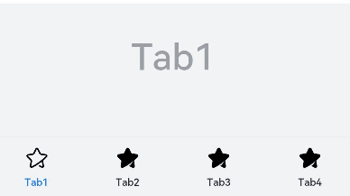
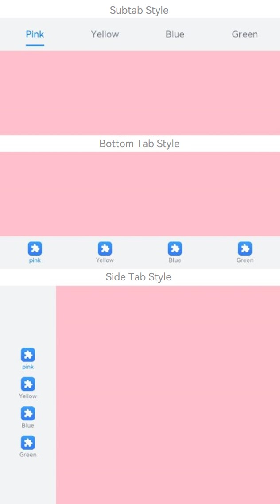
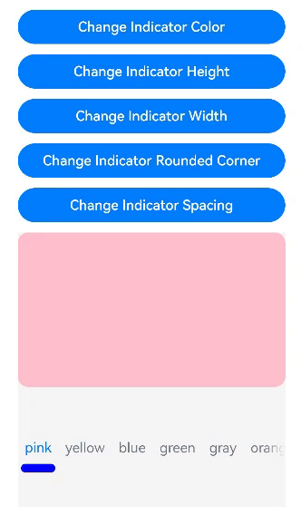
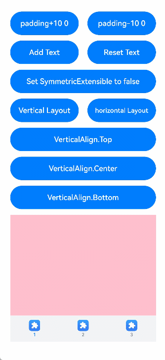
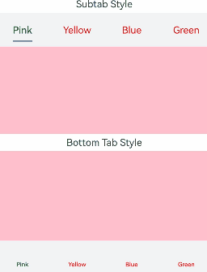
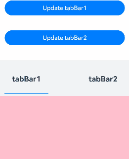
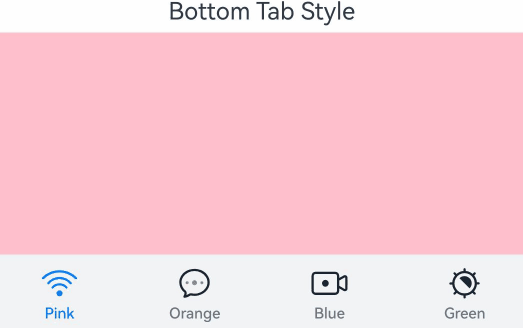
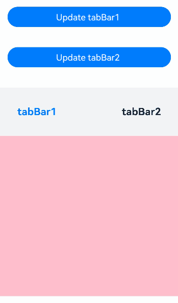
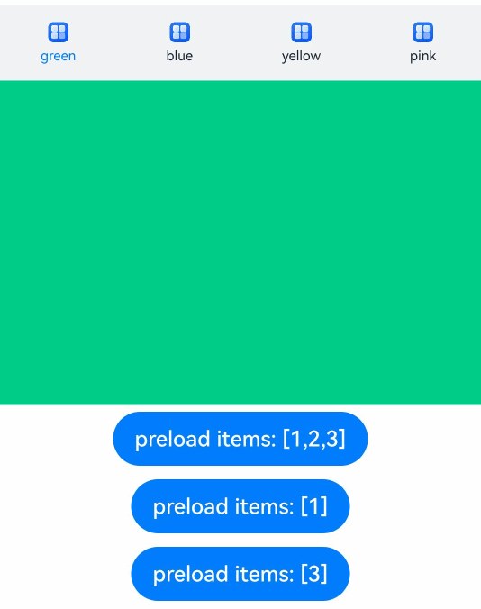

# TabContent

The **TabContent** component is used only in the **Tabs** component. It corresponds to the content view of a switched tab page.

>  **NOTE**
>
>  This component is supported since API version 7. Updates will be marked with a superscript to indicate their earliest API version.


## Child Components

This component supports only one child component.

>  **NOTE**
>
>  Built-in components and custom components are allowed, with support for ([if/else](../../../ui/state-management/arkts-rendering-control-ifelse.md), [ForEach](../../../ui/state-management/arkts-rendering-control-foreach.md), and [LazyForEach](../../../ui/state-management/arkts-rendering-control-lazyforeach.md)) rendering control.


## APIs

TabContent()

Creates the **TabContent** component, which represents the content associated with a specific tab.

**Atomic service API**: This API can be used in atomic services since API version 11.

**System capability**: SystemCapability.ArkUI.ArkUI.Full

## Attributes

In addition to the [universal attributes](ts-component-general-attributes.md), the following attributes are supported.

### tabBar

tabBar(options: string | Resource | CustomBuilder | TabBarOptions)

Sets the content displayed on the tab bar.

If an icon uses an SVG image, the width and height attributes of the SVG image must be deleted. Otherwise, the icon size will be determined by the width and height attributes of the SVG image.

If the content set exceeds the space provided by the tab bar, it will be clipped.

**Atomic service API**: This API can be used in atomic services since API version 11.

**System capability**: SystemCapability.ArkUI.ArkUI.Full

**Parameters**

| Name| Type| Mandatory| Description|
| -------- | -------- | -------- | -------- |
| options | string \| [Resource](ts-types.md#resource) \|<br>[CustomBuilder](ts-types.md#custombuilder8)<sup>8+</sup>\| <br>[TabBarOptions](#tabbaroptions18)<sup>18+</sup> | Yes| Content displayed on the tab bar.<br>**CustomBuilder**: builder, to which components can be passed (applicable to API version 8 and later versions).|

### tabBar<sup>9+</sup>

tabBar(value: SubTabBarStyle | BottomTabBarStyle)

Sets the content displayed on the tab bar. The bottom tab style does not include an indicator. When an icon display error occurs, a gray blank block is displayed.

**Atomic service API**: This API can be used in atomic services since API version 11.

**System capability**: SystemCapability.ArkUI.ArkUI.Full

**Parameters**

| Name| Type                                                        | Mandatory| Description                                                        |
| ------ | ------------------------------------------------------------ | ---- | ------------------------------------------------------------ |
| value  | [SubTabBarStyle](#subtabbarstyle9) \| [BottomTabBarStyle](#bottomtabbarstyle9) | Yes  | Content displayed on the tab bar.<br>**SubTabBarStyle**: subtab style<br>**BottomTabBarStyle**: bottom and side tab style|

### tabBar<sup>18+</sup>

tabBar(content: ComponentContent | SubTabBarStyle | BottomTabBarStyle | string | Resource | CustomBuilder | TabBarOptions)

Content displayed on the tab bar.

If **BottomTabBarStyle** or **TabBarOptions** is used and an icon is set, a gray block will be displayed if the icon is invalid. If an icon is an SVG image, make sure the SVG image does not have its own width and height attributes. If the SVG image has embedded width and height attributes, the icon size will be determined by these attributes.

If the content exceeds the space provided by the tab bar, it will be clipped.

**Atomic service API**: This API can be used in atomic services since API version 18.

**System capability**: SystemCapability.ArkUI.ArkUI.Full

**Parameters**

| Name | Type                                                        | Mandatory| Description                                                        |
| ------- | ------------------------------------------------------------ | ---- | ------------------------------------------------------------ |
| content | [ComponentContent](../js-apis-arkui-ComponentContent.md) \|<br>[SubTabBarStyle](#subtabbarstyle9) \|[BottomTabBarStyle](#bottomtabbarstyle9) \|<br>string \| [Resource](ts-types.md#resource) \|<br>[CustomBuilder](ts-types.md#custombuilder8)\| <br>[TabBarOptions](#tabbaroptions18) | Yes  | Content displayed on the tab bar.<br>**ComponentContent**: encapsulation of the component content, which can be customized.<br>**SubTabBarStyle**: subtab style.<br>**BottomTabBarStyle**: style of the bottom and side tabs. The bottom style does not have the underline effect.<br>**string**: string type.<br>**Resource**: resource reference for importing strings from system or application resources.<br>**CustomBuilder**: builder that can take components as arguments.<br>**TabBarOptions**: options for configuring images and text content on the tabs.|

>  **NOTE**
>
>  - The **TabContent** component does not support setting of the common width attribute. By default, its width is the same as that of the parent **Tabs** component.
>  - The **TabContent** component does not support setting of the universal height attribute. Its height is determined by the height of the parent **Tabs** component and the **TabBar** component.
>  - If the **vertical** attribute is **false**, the width and height descriptions are swapped in the preceding two restrictions.
>  - **TabContent** does not support page scrolling. If page scrolling is required, consider nesting a list.
>  - Whenever possible, use a unified parameter type for the **tabBar** property of all child **TabContent** components within the **Tabs** component.
>  - If there are focusable components inside any **TabContent**, focus navigation between **TabContent** and **TabBar** components within the **Tabs** component is only supported using the keyboard arrow keys.

## TabBarOptions<sup>18+</sup>

Defines the options for configuring images and text content on the tabs.

**Atomic service API**: This API can be used in atomic services since API version 18.

**System capability**: SystemCapability.ArkUI.ArkUI.Full

**Parameters**

| Name| Type        | Mandatory| Description|
| -------- | -------- | -------- | -------- |
| icon<sup>7+</sup> | string \| [ResourceStr](ts-types.md#resourcestr) | No| Image for the tab.<br>**Atomic service API**: This API can be used in atomic services since API version 11.|
| text<sup>7+</sup> | string \| [ResourceStr](ts-types.md#resourcestr) | No| Text for the tab.<br>**Atomic service API**: This API can be used in atomic services since API version 11.|

## SubTabBarStyle<sup>9+</sup>

Implements the subtab style. A transition animation is played when the user switches between tabs.

### constructor

constructor(content: ResourceStr)

Constructor used to create a **SubTabBarStyle** instance.

**Atomic service API**: This API can be used in atomic services since API version 11.

**System capability**: SystemCapability.ArkUI.ArkUI.Full

**Parameters**

| Name| Type        | Mandatory| Description|
| -------- | -------- | -------- | -------- |
| content | [ResourceStr](ts-types.md#resourcestr) | Yes| Text for the tab.|

### constructor<sup>12+</sup>

constructor(content: ResourceStr | ComponentContent)

Constructor used to create a **SubTabBarStyle** instance. You can set custom content with **ComponentContent**.

**Atomic service API**: This API can be used in atomic services since API version 12.

**System capability**: SystemCapability.ArkUI.ArkUI.Full

**Parameters**

| Name| Type        | Mandatory| Description|
| -------- | -------- | -------- | -------- |
| content | [ResourceStr](ts-types.md#resourcestr) \| [ComponentContent](../js-apis-arkui-ComponentContent.md) | Yes| Content on the tab.<br>**NOTE**<br>1. Custom content does not support the **labelStyle** attribute.<br>2. If the custom content exceeds the content box of the tab page, the excess part is not displayed.<br>3. If the custom content is within the content box of the tab page, it is aligned in the center.<br>4. If the custom content is abnormal or no display component is available, a blank area is displayed.|

### of<sup>10+</sup>

static of(content: ResourceStr): SubTabBarStyle

Static constructor used to create a **SubTabBarStyle** instance.

**Atomic service API**: This API can be used in atomic services since API version 11.

**System capability**: SystemCapability.ArkUI.ArkUI.Full

**Parameters**

| Name | Type                                  | Mandatory| Description          |
| ------- | ------------------------------------------ | ---- | ------------------ |
| content | [ResourceStr](ts-types.md#resourcestr) | Yes  | Text for the tab.|

**Return value**

| Type   | Description                                                        |
| ------- | ------------------------------------------------------------ |
| [SubTabBarStyle](#subtabbarstyle9) | **SubTabBarStyle** object created.|

### of<sup>12+</sup>

static of(content: ResourceStr | ComponentContent): SubTabBarStyle

Static constructor used to create a **SubTabBarStyle** instance. You can set custom content with **ComponentContent**.

**Atomic service API**: This API can be used in atomic services since API version 12.

**System capability**: SystemCapability.ArkUI.ArkUI.Full

**Parameters**

| Name | Type                                  | Mandatory| Description          |
| ------- | ------------------------------------------ | ---- | ------------------ |
| content | [ResourceStr](ts-types.md#resourcestr) \| [ComponentContent](../js-apis-arkui-ComponentContent.md) | Yes  | Content on the tab. You can set custom content with **ComponentContent**.<br>**NOTE**<br>1. Custom content does not support the **labelStyle** attribute.<br>2. If the custom content exceeds the content box of the tab page, the excess part is not displayed.<br>3. If the custom content is within the content box of the tab page, it is aligned in the center.<br>4. If the custom content is abnormal or no display component is available, a blank area is displayed.|

**Return value**

| Type   | Description                                                        |
| ------- | ------------------------------------------------------------ |
| [SubTabBarStyle](#subtabbarstyle9) | **SubTabBarStyle** object created.|

### indicator<sup>10+</sup>

indicator(value: IndicatorStyle): SubTabBarStyle

Sets the indicator style of the selected subtab. It takes effect only in the horizontal layout.

**Atomic service API**: This API can be used in atomic services since API version 11.

**System capability**: SystemCapability.ArkUI.ArkUI.Full

**Parameters**

| Name | Type                                  | Mandatory| Description          |
| ------- | ------------------------------------- | ---- | ------------- |
| value | [IndicatorStyle](#indicatorstyle10)| Yes  | Indicator style object for the selected subtab.|

**Return value**

| Type   | Description                                                        |
| ------- | ------------------------------------------------------------ |
| [SubTabBarStyle](#subtabbarstyle9) | **SubTabBarStyle** object.|

### selectedMode<sup>10+</sup>

selectedMode(value: SelectedMode): SubTabBarStyle

Sets the display mode of the selected subtab. It takes effect only in the horizontal layout.

**Atomic service API**: This API can be used in atomic services since API version 11.

**System capability**: SystemCapability.ArkUI.ArkUI.Full

**Parameters**

| Name | Type                                  | Mandatory| Description          |
| ------- | ------------------------------------- | ---- | ------------- |
| value | [SelectedMode](#selectedmode10) | Yes  | Display mode of the selected subtab.<br>Default value: **SelectedMode.INDICATOR**|

**Return value**

| Type   | Description                                                        |
| ------- | ------------------------------------------------------------ |
| [SubTabBarStyle](#subtabbarstyle9) | **SubTabBarStyle** object.|

### board<sup>10+</sup>

board(value: BoardStyle): SubTabBarStyle

Sets the background style (board style) of the selected subtab. It takes effect only in the horizontal layout.

**Atomic service API**: This API can be used in atomic services since API version 11.

**System capability**: SystemCapability.ArkUI.ArkUI.Full

**Parameters**

| Name | Type                                  | Mandatory| Description          |
| ------- | ------------------------------------- | ---- | ------------- |
| value | [BoardStyle](#boardstyle10) | Yes  | Background style object for the selected subtab.|

**Return value**

| Type   | Description                                                        |
| ------- | ------------------------------------------------------------ |
| [SubTabBarStyle](#subtabbarstyle9) | **SubTabBarStyle** object.|

### labelStyle<sup>10+</sup>

labelStyle(value: LabelStyle): SubTabBarStyle

Sets the style of the label text and font for the subtab.

**Atomic service API**: This API can be used in atomic services since API version 11.

**System capability**: SystemCapability.ArkUI.ArkUI.Full

**Parameters**

| Name | Type                                  | Mandatory| Description          |
| ------- | ------------------------------------- | ---- | ------------- |
| value | [LabelStyle](#labelstyle10) | Yes  | Style object for the label text and font of the subtab.|

**Return value**

| Type   | Description                                                        |
| ------- | ------------------------------------------------------------ |
| [SubTabBarStyle](#subtabbarstyle9) | **SubTabBarStyle** object.|

### padding<sup>10+</sup>

padding(value: Padding | Dimension): SubTabBarStyle

Sets the padding of the subtab. It cannot be set in percentage. When the parameter is of the Dimension type, the value applies to all sides.

**Atomic service API**: This API can be used in atomic services since API version 11.

**System capability**: SystemCapability.ArkUI.ArkUI.Full

**Parameters**

| Name | Type                                  | Mandatory| Description          |
| ------- | ------------------------------------- | ---- | ------------- |
| value | [Padding](ts-types.md#padding) \| [Dimension](ts-types.md#dimension10) | Yes  | Padding of the subtab.<br>Default value: **{left:8.0vp,right:8.0vp,top:17.0vp,bottom:18.0vp}**|

**Return value**

| Type   | Description                                                        |
| ------- | ------------------------------------------------------------ |
| [SubTabBarStyle](#subtabbarstyle9) | **SubTabBarStyle** object.|

### padding<sup>12+</sup>

padding(padding: LocalizedPadding): SubTabBarStyle

Sets the padding of the subtab. This API supports mirroring but does not support percentage-based settings.

**Atomic service API**: This API can be used in atomic services since API version 12.

**System capability**: SystemCapability.ArkUI.ArkUI.Full

**Parameters**

| Name | Type                                  | Mandatory| Description          |
| ------- | ------------------------------------- | ---- | ------------- |
| padding | [LocalizedPadding](ts-types.md#localizedpadding12) | Yes  | Padding of the subtab.<br>Default value: {start:LengthMetircs.vp(8),end:LengthMetircs.vp(8),<br>top:LengthMetircs.vp(17),bottom:LengthMetircs.vp(18)} |

**Return value**

| Type   | Description                                                        |
| ------- | ------------------------------------------------------------ |
| [SubTabBarStyle](#subtabbarstyle9) | **SubTabBarStyle** object.|

### id<sup>11+</sup>

id(value: string): SubTabBarStyle

Sets the [ID](ts-universal-attributes-component-id.md#id) of the subtab.

**Atomic service API**: This API can be used in atomic services since API version 12.

**System capability**: SystemCapability.ArkUI.ArkUI.Full

**Parameters**

| Name | Type                                  | Mandatory| Description          |
| ------- | ------------------------------------- | ---- | ------------- |
| value | string | Yes  | [ID](ts-universal-attributes-component-id.md#id) of the subtab.|

**Return value**

| Type   | Description                                                        |
| ------- | ------------------------------------------------------------ |
| [SubTabBarStyle](#subtabbarstyle9) | **SubTabBarStyle** object.|

## IndicatorStyle<sup>10+</sup>

Represents an indicator style object.

**Atomic service API**: This API can be used in atomic services since API version 11.

**System capability**: SystemCapability.ArkUI.ArkUI.Full

| Name| Type| Mandatory| Description|
| -------- | -------- | -------- | -------------------------------- |
| color | [ResourceColor](ts-types.md#resourcecolor) | No| Color of the indicator and board.<br>Default value: **#FF007DFF**|
| height | [Length](ts-types.md#length) | No| Height of the indicator. It cannot be set in percentage.<br>Default value: **2.0**<br>Unit: vp<br>Value range: (0, +∞)|
| width | [Length](ts-types.md#length) | No| Width of the indicator. It cannot be set in percentage.<br>Default value: **0.0**<br>Unit: vp<br>Value range: (0, +∞)<br>**NOTE**<br>If this parameter is set to **0**, the tab text width will be used instead.|
| borderRadius | [Length](ts-types.md#length) | No| Rounded corner radius of the indicator. It cannot be set in percentage.<br>Default value: **0.0**<br>Unit: vp<br>Value range: [0, +∞)|
| marginTop | [Length](ts-types.md#length) | No| Spacing between the indicator and text. It cannot be set in percentage.<br>Default value: **8.0**<br>Unit: vp<br>Value range: [0, +∞)|

## SelectedMode<sup>10+</sup>

Enumerates the display modes of selected subtabs.

**Atomic service API**: This API can be used in atomic services since API version 11.

**System capability**: SystemCapability.ArkUI.ArkUI.Full

| Name      | Description              |
| ---------- | ------------------------ |
| INDICATOR | Indicator mode.    |
| BOARD   | Board mode.    |

## BoardStyle<sup>10+</sup>

Represents a board style object.

**Atomic service API**: This API can be used in atomic services since API version 11.

**System capability**: SystemCapability.ArkUI.ArkUI.Full

| Name| Type| Mandatory| Description|
| -------- | -------- | -------- | ------------------------------------ |
| borderRadius | [Length](ts-types.md#length) | No| Rounded corner radius of the board. It cannot be set in percentage.<br>Default value: **8.0**<br>Unit: vp<br>Value range: [0, +∞)|

## LabelStyle<sup>10+</sup>

Represents a style object for the label text and font.

**System capability**: SystemCapability.ArkUI.ArkUI.Full

| Name                | Type                                                    | Mandatory| Description                                                        |
| -------------------- | ------------------------------------------------------------ | ---- | ------------------------------------------------------------ |
| overflow             | [TextOverflow](ts-appendix-enums.md#textoverflow)            | No  | Display mode when the label text is too long. By default, an ellipsis (...) is used to represent text overflow.<br>**Atomic service API**: This API can be used in atomic services since API version 11.|
| maxLines             | number                                                       | No  | Maximum number of lines in the label text. If this attribute is specified, the text will not exceed the specified number of lines. You can use **textOverflow** to specify how to represent text overflow. Default value: **1**<br>Value range: [1, +∞)<br>**Atomic service API**: This API can be used in atomic services since API version 11.|
| minFontSize          | number \| [ResourceStr](ts-types.md#resourcestr)             | No  | Minimum font size of the label text. It cannot be set in percentage. For the setting to take effect, this attribute must be used together with **maxFontSize**, **maxLines**, or layout constraint settings. When the adaptive text size is set, **font.size** does not take effect. The default value is **0.0fp**, indicating that the adaptive text size has no effect.<br>Value range: (0, +∞)<br>**Atomic service API**: This API can be used in atomic services since API version 11.|
| maxFontSize          | number \| [ResourceStr](ts-types.md#resourcestr)             | No  | Maximum font size of the label text. It cannot be set in percentage. For the setting to take effect, this attribute must be used together with **minFontSize**, **maxLines**, or layout constraint settings. When the adaptive text size is set, **font.size** does not take effect. The default value is **0.0fp**, indicating that the adaptive text size has no effect.<br>Value range: [minFontSize, +∞)<br>**Atomic service API**: This API can be used in atomic services since API version 11.|
| heightAdaptivePolicy | [TextHeightAdaptivePolicy](ts-appendix-enums.md#textheightadaptivepolicy10) | No  | How the adaptive height is determined for the label text. By default, the **maxLines** settings are prioritized.<br>**Atomic service API**: This API can be used in atomic services since API version 11.|
| font                 | [Font](ts-types.md#font)                                     | No  | Font of the label text.<br>When the tab is a subtab, the default font is in 16.0 fp size, 'HarmonyOS Sans' family, normal font style, medium weight when selected, and normal weight when not selected.<br>When the tab is a bottom tab, the default font is in 10.0 fp size, 'HarmonyOS Sans' family, normal font style, and medium weight.<br>The default font size of the bottom tab page is 12.0 fp since API version 12.<br>**Atomic service API**: This API can be used in atomic services since API version 11.|
| unselectedColor<sup>12+</sup> | [ResourceColor](ts-types.md#resourcecolor) | No| Font color of the label text when it is not selected.<br>Default value: **#99182431**<br>**Atomic service API**: This API can be used in atomic services since API version 12.|
| selectedColor<sup>12+</sup> | [ResourceColor](ts-types.md#resourcecolor) | No| Font color of the label text when it is selected.<br>Default value: **#FF007DFF**<br>**Atomic service API**: This API can be used in atomic services since API version 12.|

## BottomTabBarStyle<sup>9+</sup>

Implements the bottom and side tab style.

### constructor

constructor(icon: ResourceStr | TabBarSymbol, text: ResourceStr)

Constructor used to create a **BottomTabBarStyle** instance.

**Atomic service API**: This API can be used in atomic services since API version 11.

**System capability**: SystemCapability.ArkUI.ArkUI.Full

**Parameters**

| Name| Type        | Mandatory| Description|
| -------- | -------- | -------- | -------- |
| icon | [ResourceStr](ts-types.md#resourcestr) \| [TabBarSymbol<sup>12+</sup>](#tabbarsymbol12)| Yes| Image for the tab.|
| text | [ResourceStr](ts-types.md#resourcestr) | Yes| Text for the tab.|

### of<sup>10+</sup>

static of(icon: ResourceStr | TabBarSymbol, text: ResourceStr): BottomTabBarStyle

Static constructor used to create a **BottomTabBarStyle** instance.

**Atomic service API**: This API can be used in atomic services since API version 11.

**System capability**: SystemCapability.ArkUI.ArkUI.Full

**Parameters**

| Name| Type        | Mandatory| Description|
| -------- | -------- | -------- | -------- |
| icon | [ResourceStr](ts-types.md#resourcestr) \| [TabBarSymbol<sup>12+</sup>](#tabbarsymbol12)| Yes| Image for the tab.|
| text | [ResourceStr](ts-types.md#resourcestr) | Yes| Text for the tab.|

**Return value**

| Type   | Description                                                        |
| ------- | ------------------------------------------------------------ |
| [BottomTabBarStyle](#bottomtabbarstyle9) | **BottomTabBarStyle** object created.|

### padding<sup>10+</sup>

padding(value: Padding | Dimension | LocalizedPadding): BottomTabBarStyle

Sets the padding of the bottom tab. It cannot be set in percentage. When the parameter is of the Dimension type, the value applies to all sides.

**Atomic service API**: This API can be used in atomic services since API version 11.

**System capability**: SystemCapability.ArkUI.ArkUI.Full

**Parameters**

| Name | Type                                  | Mandatory| Description          |
| ------- | ------------------------------------- | ---- | ------------- |
| value | [Padding](ts-types.md#padding) \| [Dimension](ts-types.md#dimension10) \| [LocalizedPadding<sup>12+</sup>](ts-types.md#localizedpadding12) | Yes  | Padding of the bottom tab.<br>Default value: **{left:4.0vp,right:4.0vp,top:0.0vp,bottom:0.0vp}**<br>If of the LocalizedPadding type, this attribute supports the mirroring capability.<br>Default value: {start:LengthMetircs.vp(4),end:LengthMetircs.vp(4),<br>top:LengthMetircs.vp(0),bottom:LengthMetircs.vp(0)} |

**Return value**

| Type   | Description                                                        |
| ------- | ------------------------------------------------------------ |
| [BottomTabBarStyle](#bottomtabbarstyle9) | **BottomTabBarStyle** object.|

### verticalAlign<sup>10+</sup>

verticalAlign(value: VerticalAlign): BottomTabBarStyle

Sets the vertical alignment mode of the images and text on the bottom tab.

**Atomic service API**: This API can be used in atomic services since API version 11.

**System capability**: SystemCapability.ArkUI.ArkUI.Full

**Parameters**

| Name | Type                                  | Mandatory| Description          |
| ------- | ------------------------------------- | ---- | ------------- |
| value | [VerticalAlign](ts-appendix-enums.md#verticalalign) | Yes  | Vertical alignment mode of the images and text on the bottom tab.<br>Default value: **VerticalAlign.Center**|

**Return value**

| Type   | Description                                                        |
| ------- | ------------------------------------------------------------ |
| [BottomTabBarStyle](#bottomtabbarstyle9) | **BottomTabBarStyle** object.|

### layoutMode<sup>10+</sup>

layoutMode(value: LayoutMode): BottomTabBarStyle

Sets the layout mode of the images and texts on the bottom tab.

**Atomic service API**: This API can be used in atomic services since API version 11.

**System capability**: SystemCapability.ArkUI.ArkUI.Full

**Parameters**

| Name | Type                                  | Mandatory| Description          |
| ------- | ------------------------------------- | ---- | ------------- |
| value | [LayoutMode](#layoutmode10) | Yes  | Layout mode of the images and text on the bottom tab.<br>Default value: **LayoutMode.VERTICAL**|

**Return value**

| Type   | Description                                                        |
| ------- | ------------------------------------------------------------ |
| [BottomTabBarStyle](#bottomtabbarstyle9) | **BottomTabBarStyle** object.|

### symmetricExtensible<sup>10+</sup>

symmetricExtensible(value: boolean): BottomTabBarStyle

Sets whether the images and text on the bottom tab can be symmetrically extended by the minimum value of the available space on the left and right bottom tabs. This parameter is valid only between bottom tabs in fixed horizontal mode.

**Atomic service API**: This API can be used in atomic services since API version 11.

**System capability**: SystemCapability.ArkUI.ArkUI.Full

**Parameters**

| Name | Type                                  | Mandatory| Description          |
| ------- | ------------------------------------- | ---- | ------------- |
| value | boolean | Yes  | Whether the images and text on the bottom tab can be symmetrically extended by the minimum value of the available space on the left and right bottom tabs.<br>Default value: **false**, indicating that the images and text on the bottom tab cannot be symmetrically extended by the minimum value of the available space on the left and right bottom tabs|

**Return value**

| Type   | Description                                                        |
| ------- | ------------------------------------------------------------ |
| [BottomTabBarStyle](#bottomtabbarstyle9) | **BottomTabBarStyle** object.|

### labelStyle<sup>10+</sup>

labelStyle(value: LabelStyle): BottomTabBarStyle

Sets the style of the label text and font for the bottom tab.

**Atomic service API**: This API can be used in atomic services since API version 11.

**System capability**: SystemCapability.ArkUI.ArkUI.Full

**Parameters**

| Name | Type                                  | Mandatory| Description          |
| ------- | ------------------------------------- | ---- | ------------- |
| value | [LabelStyle](#labelstyle10) | Yes  | Style of the label text and font for the bottom tab.|

**Return value**

| Type   | Description                                                        |
| ------- | ------------------------------------------------------------ |
| [BottomTabBarStyle](#bottomtabbarstyle9) | **BottomTabBarStyle** object.|

### id<sup>11+</sup>

id(value: string): BottomTabBarStyle

Sets the ID of the bottom tab.

**Atomic service API**: This API can be used in atomic services since API version 12.

**System capability**: SystemCapability.ArkUI.ArkUI.Full

**Parameters**

| Name | Type                                  | Mandatory| Description          |
| ------- | ------------------------------------- | ---- | ------------- |
| value | string | Yes  | [ID](ts-universal-attributes-component-id.md#id) of the bottom tab.|

**Return value**

| Type   | Description                                                        |
| ------- | ------------------------------------------------------------ |
| [BottomTabBarStyle](#bottomtabbarstyle9) | **BottomTabBarStyle** object.|

### iconStyle<sup>12+</sup>

iconStyle(style: TabBarIconStyle): BottomTabBarStyle

Sets the style of the label icon on the bottom tab.

**Atomic service API**: This API can be used in atomic services since API version 12.

**System capability**: SystemCapability.ArkUI.ArkUI.Full

**Parameters**

| Name | Type                                  | Mandatory| Description          |
| ------- | ------------------------------------- | ---- | ------------- |
| style | [TabBarIconStyle](#tabbariconstyle12) | Yes  | Style of the label icon on the bottom tab.|

**Return value**

| Type   | Description                                                        |
| ------- | ------------------------------------------------------------ |
| [BottomTabBarStyle](#bottomtabbarstyle9) | **BottomTabBarStyle** object.|

## TabBarSymbol<sup>12+</sup>

Represents a tab bar symbol style object.

**Atomic service API**: This API can be used in atomic services since API version 12.

**System capability**: SystemCapability.ArkUI.ArkUI.Full

| Name| Type        | Mandatory| Description|
| -------- | -------- | -------- | -------- |
| normal | [SymbolGlyphModifier](ts-universal-attributes-attribute-modifier.md) | Yes| Symbol icon in the normal style.<br>Default value:<br>**fontColor**: **#66182431**<br>**renderingStrategy**: **SymbolRenderingStrategy.MULTIPLE_OPACITY**<br>**fontSize**: **24vp**|
| selected | [SymbolGlyphModifier](ts-universal-attributes-attribute-modifier.md) | No| Symbol icon in the selected style.<br>Default value:<br>**fontColor**: **#ff007dff**<br>**renderingStrategy**: **SymbolRenderingStrategy.MULTIPLE_OPACITY**<br>**fontSize**: **24vp**|

## LayoutMode<sup>10+</sup>

Enumerates the layout modes of the images and texts on the bottom tabs.

**Atomic service API**: This API can be used in atomic services since API version 11.

**System capability**: SystemCapability.ArkUI.ArkUI.Full

| Name        | Value| Description                                    |
| ----------  | - | ---------------------------------------- |
| AUTO        | 0 | When the tab width is greater than 104 vp, the tab content is arranged from left to right. Otherwise,the tab content is arranged from top to bottom. This parameter is valid only when the tab bar is in vertical mode or fixed horizontal mode.|
| VERTICAL    | 1 | The tab content is arranged from top to bottom.|
| HORIZONTAL  | 2 | The tab content is arranged from left to right.|

## TabBarIconStyle<sup>12+</sup>

Represents a label icon style object.

**Atomic service API**: This API can be used in atomic services since API version 12.

**System capability**: SystemCapability.ArkUI.ArkUI.Full

| Name                | Type                                                    | Mandatory| Description                                                        |
| -------------------- | ------------------------------------------------------------ | ---- | ------------------------------------------------------------ |
| unselectedColor | [ResourceColor](ts-types.md#resourcecolor) | No| Color of the label icon when it is not selected.<br>Default value: **#33182431**<br>**NOTE**<br>This attribute only applies to an SVG image. Once set, the fill color will replace that of the SVG image.|
| selectedColor | [ResourceColor](ts-types.md#resourcecolor) | No| Color of the label icon when it is selected.<br>Default value: **#FF007DFF**<br>**NOTE**<br>This attribute only applies to an SVG image. Once set, the fill color will replace that of the SVG image.|

## Events

In addition to the [universal events](ts-component-general-events.md), the following events are supported.

### onWillShow<sup>12+</sup>

onWillShow(event: VoidCallback)

Called when the tab content is about to be displayed. The scenarios include the first-time display, tab switching, page switching, and window switching between the foreground and background.

**Atomic service API**: This API can be used in atomic services since API version 12.

**System capability**: SystemCapability.ArkUI.ArkUI.Full

**Parameters**

| Name| Type                                          | Mandatory| Description                                |
| ------ | --------------------------------------------- | ---- | ----------------------------------- |
| event  | [VoidCallback](ts-types.md#voidcallback12)    | Yes  | Callback for when the tab content is about to be displayed.       |

### onWillHide<sup>12+</sup>

onWillHide(event: VoidCallback)

Called when the tab content is about to be hidden. The scenarios include the tab switching, page switching, and window switching between the foreground and background.

**Atomic service API**: This API can be used in atomic services since API version 12.

**System capability**: SystemCapability.ArkUI.ArkUI.Full

**Parameters**

| Name| Type                                          | Mandatory| Description                                |
| ------ | --------------------------------------------- | ---- | ----------------------------------- |
| event  | [VoidCallback](ts-types.md#voidcallback12)    | Yes  | Callback for when the tab content is about to be hidden.       |

## Example

### Example 1: Implementing Custom Tab Switching Synchronization

This example demonstrates how to use **onAnimationStart** and **onChange** to implement synchronized switching between the tab bar and tab content.

```ts
// xxx.ets
@Entry
@Component
struct TabContentExample {
  @State fontColor: string = '#182431'
  @State selectedFontColor: string = '#007DFF'
  @State currentIndex: number = 0
  @State selectedIndex: number = 0
  private controller: TabsController = new TabsController()

  @Builder tabBuilder(index: number) {
    Column() {
      Image(this.selectedIndex === index ? '/common/public_icon_on.svg' : '/common/public_icon_off.svg')
        .width(24)
        .height(24)
        .margin({ bottom: 4 })
        .objectFit(ImageFit.Contain)
      Text(`Tab${index + 1}`)
        .fontColor(this.selectedIndex === index ? this.selectedFontColor : this.fontColor)
        .fontSize(10)
        .fontWeight(500)
        .lineHeight(14)
    }.width('100%')
  }

  build() {
    Column() {
      Tabs({ barPosition: BarPosition.End, controller: this.controller }) {
        TabContent() {
          Column() {
            Text('Tab1')
              .fontSize(36)
              .fontColor('#182431')
              .fontWeight(500)
              .opacity(0.4)
              .margin({ top: 30, bottom: 56.5 })
            Divider()
              .strokeWidth(0.5)
              .color('#182431')
              .opacity(0.05)
          }.width('100%')
        }.tabBar(this.tabBuilder(0))

        TabContent() {
          Column() {
            Text('Tab2')
              .fontSize(36)
              .fontColor('#182431')
              .fontWeight(500)
              .opacity(0.4)
              .margin({ top: 30, bottom: 56.5 })
            Divider()
              .strokeWidth(0.5)
              .color('#182431')
              .opacity(0.05)
          }.width('100%')
        }.tabBar(this.tabBuilder(1))

        TabContent() {
          Column() {
            Text('Tab3')
              .fontSize(36)
              .fontColor('#182431')
              .fontWeight(500)
              .opacity(0.4)
              .margin({ top: 30, bottom: 56.5 })
            Divider()
              .strokeWidth(0.5)
              .color('#182431')
              .opacity(0.05)
          }.width('100%')
        }.tabBar(this.tabBuilder(2))

        TabContent() {
          Column() {
            Text('Tab4')
              .fontSize(36)
              .fontColor('#182431')
              .fontWeight(500)
              .opacity(0.4)
              .margin({ top: 30, bottom: 56.5 })
            Divider()
              .strokeWidth(0.5)
              .color('#182431')
              .opacity(0.05)
          }.width('100%')
        }.tabBar(this.tabBuilder(3))
      }
      .vertical(false)
      .barHeight(56)
      .onChange((index: number) => {
        // currentIndex controls the displayed tab in TabContent.
        this.currentIndex = index
        this.selectedIndex = index
      })
      .onAnimationStart((index: number, targetIndex: number, event: TabsAnimationEvent) => {
        if (index === targetIndex) {
          return
        }
        // selectedIndex controls the color switching for the image and text in the custom tab bar.
        this.selectedIndex = targetIndex
      })
      .width(360)
      .height(190)
      .backgroundColor('#F1F3F5')
      .margin({ top: 38 })
    }.width('100%')
  }
}
```



### Example 2: Implementing a Custom Side Tabs

This example demonstrates how to create side tabs using **vertical** and **barPosition**.

```ts
// xxx.ets
@Entry
@Component
struct TabContentExample {
  @State fontColor: string = '#182431'
  @State selectedFontColor: string = '#007DFF'
  @State currentIndex: number = 0
  @State selectedIndex: number = 0
  private controller: TabsController = new TabsController()

  @Builder tabBuilder(index: number) {
    Column() {
      Image(this.selectedIndex === index ? '/common/public_icon_on.svg' : '/common/public_icon_off.svg')
        .width(24)
        .height(24)
        .margin({ bottom: 4 })
        .objectFit(ImageFit.Contain)
      Text('Tab')
        .fontColor(this.selectedIndex === index ? this.selectedFontColor : this.fontColor)
        .fontSize(10)
        .fontWeight(500)
        .lineHeight(14)
    }.width('100%').height('100%').justifyContent(FlexAlign.Center)
  }

  build() {
    Column() {
      Tabs({ barPosition: BarPosition.Start, controller: this.controller }) {
        TabContent()
          .tabBar(this.tabBuilder(0))
        TabContent()
          .tabBar(this.tabBuilder(1))
        TabContent()
          .tabBar(this.tabBuilder(2))
        TabContent()
          .tabBar(this.tabBuilder(3))
      }
      .vertical(true)
      .barWidth(96)
      .barHeight(414)
      .onChange((index: number) => {
        // currentIndex controls the displayed tab in TabContent.
        this.currentIndex = index
        this.selectedIndex = index
      })
      .onAnimationStart((index: number, targetIndex: number, event: TabsAnimationEvent) => {
        if (index === targetIndex) {
          return
        }
        // selectedIndex controls the color switching for the image and text in the custom tab bar.
        this.selectedIndex = targetIndex
      })
      .width(96)
      .height(414)
      .backgroundColor('#F1F3F5')
      .margin({ top: 52 })
    }.width('100%')
  }
}
```


### Example 3: Implementing Different Styles of Tabs

This example demonstrates the implementation of subtabs, bottom tabs, and side tabs using **SubTabBarStyle** and **BottomTabBarStyle**.

```ts
// xxx.ets
@Entry
@Component
struct TabBarStyleExample {
  build() {
    Column({ space: 5 }) {
      Text("Subtab style")
      Column() {
        Tabs({ barPosition: BarPosition.Start }) {
          TabContent() {
            Column().width('100%').height('100%').backgroundColor(Color.Pink)
          }.tabBar(new SubTabBarStyle('Pink'))
          .onWillShow(() => {
            console.info("Pink will show")
          })
          .onWillHide(() => {
            console.info("Pink will hide")
          })

          TabContent() {
            Column().width('100%').height('100%').backgroundColor(Color.Yellow)
          }.tabBar(new SubTabBarStyle('Yellow'))
          .onWillShow(() => {
            console.info("Yellow will show")
          })
          .onWillHide(() => {
            console.info("Yellow will hide")
          })

          TabContent() {
            Column().width('100%').height('100%').backgroundColor(Color.Blue)
          }.tabBar(new SubTabBarStyle('Blue'))
          .onWillShow(() => {
            console.info("Blue will show")
          })
          .onWillHide(() => {
            console.info("Blue will hide")
          })

          TabContent() {
            Column().width('100%').height('100%').backgroundColor(Color.Green)
          }.tabBar(new SubTabBarStyle('Green'))
          .onWillShow(() => {
            console.info("Green will show")
          })
          .onWillHide(() => {
            console.info("Green will hide")
          })
        }
        .vertical(false)
        .scrollable(true)
        .barMode(BarMode.Fixed)
        .onChange((index: number) => {
          console.info(index.toString())
        })
        .width('100%')
        .backgroundColor(0xF1F3F5)
      }.width('100%').height(200)
      Text("Bottom tab style")
      Column() {
        Tabs({ barPosition: BarPosition.End }) {
          TabContent() {
            Column().width('100%').height('100%').backgroundColor(Color.Pink)
          }.tabBar(new BottomTabBarStyle($r('sys.media.ohos_app_icon'), 'Pink'))
          .onWillShow(() => {
            console.info("Pink will show")
          })
          .onWillHide(() => {
            console.info("Pink will hide")
          })

          TabContent() {
            Column().width('100%').height('100%').backgroundColor(Color.Yellow)
          }.tabBar(new BottomTabBarStyle($r('sys.media.ohos_app_icon'), 'Yellow'))
          .onWillShow(() => {
            console.info("Yellow will show")
          })
          .onWillHide(() => {
            console.info("Yellow will hide")
          })

          TabContent() {
            Column().width('100%').height('100%').backgroundColor(Color.Blue)
          }.tabBar(new BottomTabBarStyle($r('sys.media.ohos_app_icon'), 'Blue'))
          .onWillShow(() => {
            console.info("Blue will show")
          })
          .onWillHide(() => {
            console.info("Blue will hide")
          })

          TabContent() {
            Column().width('100%').height('100%').backgroundColor(Color.Green)
          }.tabBar(new BottomTabBarStyle($r('sys.media.ohos_app_icon'), 'Green'))
          .onWillShow(() => {
            console.info("Green will show")
          })
          .onWillHide(() => {
            console.info("Green will hide")
          })
        }
        .vertical(false)
        .scrollable(true)
        .barMode(BarMode.Fixed)
        .onChange((index: number) => {
          console.info(index.toString())
        })
        .width('100%')
        .backgroundColor(0xF1F3F5)
      }.width('100%').height(200)
      Text("Side tab style")
      Column() {
        Tabs({ barPosition: BarPosition.Start }) {
          TabContent() {
            Column().width('100%').height('100%').backgroundColor(Color.Pink)
          }.tabBar(new BottomTabBarStyle($r('sys.media.ohos_app_icon'), 'Pink'))
          .onWillShow(() => {
            console.info("Pink will show")
          })
          .onWillHide(() => {
            console.info("Pink will hide")
          })

          TabContent() {
            Column().width('100%').height('100%').backgroundColor(Color.Yellow)
          }.tabBar(new BottomTabBarStyle($r('sys.media.ohos_app_icon'), 'Yellow'))
          .onWillShow(() => {
            console.info("Yellow will show")
          })
          .onWillHide(() => {
            console.info("Yellow will hide")
          })

          TabContent() {
            Column().width('100%').height('100%').backgroundColor(Color.Blue)
          }.tabBar(new BottomTabBarStyle($r('sys.media.ohos_app_icon'), 'Blue'))
          .onWillShow(() => {
            console.info("Blue will show")
          })
          .onWillHide(() => {
            console.info("Blue will hide")
          })

          TabContent() {
            Column().width('100%').height('100%').backgroundColor(Color.Green)
          }.tabBar(new BottomTabBarStyle($r('sys.media.ohos_app_icon'), 'Green'))
          .onWillShow(() => {
            console.info("Green will show")
          })
          .onWillHide(() => {
            console.info("Green will hide")
          })
        }
        .vertical(true).scrollable(true).barMode(BarMode.Fixed)
        .onChange((index: number) => {
          console.info(index.toString())
        })
        .width('100%')
        .backgroundColor(0xF1F3F5)
      }.width('100%').height(400)
    }
  }
}
```



### Example 4: Setting the Indicator for Subtabs

This example demonstrates how to set the indicator for subtabs using the **indicator** property in **SubTabBarStyle**.

```ts
// xxx.ets
@Entry
@Component
struct TabsAttr {
  private controller: TabsController = new TabsController()
  @State indicatorColor: Color = Color.Blue;
  @State indicatorWidth: number = 40;
  @State indicatorHeight: number = 10;
  @State indicatorBorderRadius: number = 5;
  @State indicatorSpace: number = 10;
  @State subTabBorderRadius: number = 20;
  @State selectedMode: SelectedMode = SelectedMode.INDICATOR;
  private colorFlag: boolean = true;
  private widthFlag: boolean = true;
  private heightFlag: boolean = true;
  private borderFlag: boolean = true;
  private spaceFlag: boolean = true;

  build() {
    Column() {
      Button("Change Indicator Color").width('100%').margin({ bottom: '12vp' })
        .onClick((event?: ClickEvent) => {
          // Animation configuration for the width and height attributes of the <Button> component
          if (this.colorFlag) {
            animateTo({
              duration: 1000, // Animation duration.
              curve: Curve.Linear, // Animation curve.
              delay: 200, // Animation delay.
              iterations: 1, // Number of playback times.
              playMode: PlayMode.Normal, // Animation playback mode.
              onFinish: () => {
                console.info('play end')
              }
            }, () => {
              this.indicatorColor = Color.Red
            })
          } else {
            animateTo({
              duration: 1000, // Animation duration.
              curve: Curve.Linear, // Animation curve.
              delay: 200, // Animation delay.
              iterations: 1, // Number of playback times.
              playMode: PlayMode.Normal, // Animation playback mode.
              onFinish: () => {
                console.info('play end')
              }
            }, () => {
              this.indicatorColor = Color.Yellow
            })
          }
          this.colorFlag = !this.colorFlag
        })
      Button("Change Indicator Height").width('100%').margin({ bottom: '12vp' })
        .onClick((event?: ClickEvent) => {
          // Animation configuration for the width and height attributes of the <Button> component
          if (this.heightFlag) {
            animateTo({
              duration: 1000, // Animation duration.
              curve: Curve.Linear, // Animation curve.
              delay: 200, // Animation delay.
              iterations: 1, // Number of playback times.
              playMode: PlayMode.Normal, // Animation playback mode.
              onFinish: () => {
                console.info('play end')
              }
            }, () => {
              this.indicatorHeight = 20
            })
          } else {
            animateTo({
              duration: 1000, // Animation duration.
              curve: Curve.Linear, // Animation curve.
              delay: 200, // Animation delay.
              iterations: 1, // Number of playback times.
              playMode: PlayMode.Normal, // Animation playback mode.
              onFinish: () => {
                console.info('play end')
              }
            }, () => {
              this.indicatorHeight = 10
            })
          }
          this.heightFlag = !this.heightFlag
        })
      Button("Change Indicator Width").width('100%').margin({ bottom: '12vp' })
        .onClick((event?: ClickEvent) => {
          // Animation configuration for the width and height attributes of the <Button> component
          if (this.widthFlag) {
            animateTo({
              duration: 1000, // Animation duration.
              curve: Curve.Linear, // Animation curve.
              delay: 200, // Animation delay.
              iterations: 1, // Number of playback times.
              playMode: PlayMode.Normal, // Animation playback mode.
              onFinish: () => {
                console.info('play end')
              }
            }, () => {
              this.indicatorWidth = 30
            })
          } else {
            animateTo({
              duration: 1000, // Animation duration.
              curve: Curve.Linear, // Animation curve.
              delay: 200, // Animation delay.
              iterations: 1, // Number of playback times.
              playMode: PlayMode.Normal, // Animation playback mode.
              onFinish: () => {
                console.info('play end')
              }
            }, () => {
              this.indicatorWidth = 50
            })
          }
          this.widthFlag = !this.widthFlag
        })
      Button("Change Indicator Corner Radius").width('100%').margin({ bottom: '12vp' })
        .onClick((event?: ClickEvent) => {
          // Animation configuration for the width and height attributes of the <Button> component
          if (this.borderFlag) {
            animateTo({
              duration: 1000, // Animation duration.
              curve: Curve.Linear, // Animation curve.
              delay: 200, // Animation delay.
              iterations: 1, // Number of playback times.
              playMode: PlayMode.Normal, // Animation playback mode.
              onFinish: () => {
                console.info('play end')
              }
            }, () => {
              this.indicatorBorderRadius = 0
            })
          } else {
            animateTo({
              duration: 1000, // Animation duration.
              curve: Curve.Linear, // Animation curve.
              delay: 200, // Animation delay.
              iterations: 1, // Number of playback times.
              playMode: PlayMode.Normal, // Animation playback mode.
              onFinish: () => {
                console.info('play end')
              }
            }, () => {
              this.indicatorBorderRadius = 5
            })
          }
          this.borderFlag = !this.borderFlag
        })
      Button("Change Indicator Spacing").width('100%').margin({ bottom: '12vp' })
        .onClick((event?: ClickEvent) => {
          // Animation configuration for the width and height attributes of the <Button> component
          if (this.spaceFlag) {
            animateTo({
              duration: 1000, // Animation duration.
              curve: Curve.Linear, // Animation curve.
              delay: 200, // Animation delay.
              iterations: 1, // Number of playback times.
              playMode: PlayMode.Normal, // Animation playback mode.
              onFinish: () => {
                console.info('play end')
              }
            }, () => {
              this.indicatorSpace = 20
            })
          } else {
            animateTo({
              duration: 1000, // Animation duration.
              curve: Curve.Linear, // Animation curve.
              delay: 200, // Animation delay.
              iterations: 1, // Number of playback times.
              playMode: PlayMode.Normal, // Animation playback mode.
              onFinish: () => {
                console.info('play end')
              }
            }, () => {
              this.indicatorSpace = 10
            })
          }
          this.spaceFlag = !this.spaceFlag
        })
      Tabs({ barPosition: BarPosition.End, controller: this.controller }) {
        TabContent() {
          Column().width('100%').height('100%').backgroundColor(Color.Pink).borderRadius('12vp')
        }.tabBar(SubTabBarStyle.of('pink')
          .indicator({
            color: this.indicatorColor, // Indicator color.
            height: this.indicatorHeight, // Indicator height.
            width: this.indicatorWidth, // Indicator width.
            borderRadius: this.indicatorBorderRadius, // Rounded corner radius of the indicator.
            marginTop: this.indicatorSpace // Spacing between the indicator and text.
          })
          .selectedMode(this.selectedMode)
          .board({ borderRadius: this.subTabBorderRadius })
          .labelStyle({})
        )

        TabContent() {
          Column().width('100%').height('100%').backgroundColor(Color.Yellow).borderRadius('12vp')
        }.tabBar('yellow')

        TabContent() {
          Column().width('100%').height('100%').backgroundColor(Color.Blue).borderRadius('12vp')
        }.tabBar('blue')

        TabContent() {
          Column().width('100%').height('100%').backgroundColor(Color.Green).borderRadius('12vp')
        }.tabBar('green')

        TabContent() {
          Column().width('100%').height('100%').backgroundColor(Color.Gray).borderRadius('12vp')
        }.tabBar('gray')

        TabContent() {
          Column().width('100%').height('100%').backgroundColor(Color.Orange).borderRadius('12vp')
        }.tabBar('orange')
      }
      .vertical(false)
      .scrollable(true)
      .barMode(BarMode.Scrollable)
      .barHeight(140)
      .animationDuration(400)
      .onChange((index: number) => {
        console.info(index.toString())
      })
      .backgroundColor(0xF5F5F5)
      .height(320)
    }.width('100%').height(250).padding({ top: '24vp', left: '24vp', right: '24vp' })
  }
}
```



### Example 5: Setting Adaptive Height for Subtab Text

This example demonstrates how to achieve adaptive height for subtab text using **heightAdaptivePolicy**.

```ts
// xxx.ets
@Entry
@Component
struct TabsTextOverflow {
  @State message: string = 'Hello World'
  private controller: TabsController = new TabsController()
  @State subTabOverflowOpaque: boolean = true;

  build() {
    Column() {
      Tabs({ barPosition: BarPosition.Start, controller: this.controller }) {
        TabContent() {
          Column() {
            Text('Use an ellipsis').fontSize(30).fontColor(0xFF000000)
          }.width('100%').height('100%').backgroundColor(Color.Pink)
        }
        .tabBar(SubTabBarStyle.of('Start [Use an ellipsis; Use an ellipsis] End')
          .labelStyle({
            overflow: TextOverflow.Ellipsis,
            maxLines: 1,
            minFontSize: 10,
            heightAdaptivePolicy: TextHeightAdaptivePolicy.MAX_LINES_FIRST,
            font: { size: 20 }
          }))

        TabContent() {
          Column() {
            Text('Scale down and then clip').fontSize(30).fontColor(0xFF000000)
          }.width('100%').height('100%').backgroundColor(Color.Pink)
        }
        .tabBar(SubTabBarStyle.of('Start [Scale down and then clip; Scale down and then clip] End')
          .labelStyle({
            overflow: TextOverflow.Clip,
            maxLines: 1,
            minFontSize: 15,
            maxFontSize: 15,
            heightAdaptivePolicy: TextHeightAdaptivePolicy.MIN_FONT_SIZE_FIRST,
            font: { size: 20 }
          }))

        TabContent() {
          Column() {
            Text('Scale down, start a new line, and then clip').fontSize(30).fontColor(0xFF000000)
          }.width('100%').height('100%').backgroundColor(Color.Pink)
        }
        .tabBar(SubTabBarStyle.of('Start [Scale down, start a new line, and then clip; Scale down, start a new line, and then clip] End')
          .labelStyle({
            overflow: TextOverflow.Clip,
            maxLines: 2,
            minFontSize: 15,
            maxFontSize: 15,
            heightAdaptivePolicy: TextHeightAdaptivePolicy.MIN_FONT_SIZE_FIRST,
            font: { size: 20 }
          }))

        TabContent() {
          Column() {
            Text('Start a new line').fontSize(30).fontColor(0xFF000000)
          }
          .width('100%').height('100%').backgroundColor(Color.Pink)
        }.tabBar(SubTabBarStyle.of('Start [Start a new line; Start a new line; Start a new line; Start a new line; Start a new line] End')
          .labelStyle({
            overflow: TextOverflow.Clip,
            maxLines: 10,
            minFontSize: 10,
            heightAdaptivePolicy: TextHeightAdaptivePolicy.MAX_LINES_FIRST,
            font: { size: 20 }
          }))
      }
      .vertical(true).scrollable(true)
      .barMode(BarMode.Fixed)
      .barHeight(720)
      .barWidth(200).animationDuration(400)
      .onChange((index: number) => {
        console.info(index.toString())
      })
      .height('100%').width('100%')
    }
    .height('100%')
  }
}
```


### Example 6: Setting Basic Attributes for Bottom Tabs

This example demonstrates how to set basic attributes for bottom tabs using **padding**, **verticalAlign**, **layoutMode**, and **symmetricExtensible**.

```ts
// xxx.ets
@Entry
@Component
struct TabContentExample6 {
  private controller: TabsController = new TabsController()
  @State text: string = "2"
  @State tabPadding: number = 0;
  @State symmetricExtensible: boolean = false;
  @State layoutMode: LayoutMode = LayoutMode.VERTICAL;
  @State verticalAlign: VerticalAlign = VerticalAlign.Center;

  build() {
    Column() {
      Row() {
        Button("padding+10 " + this.tabPadding)
          .width('47%')
          .height(50)
          .margin({ top: 5 })
          .onClick((event?: ClickEvent) => {
            this.tabPadding += 10
          })
          .margin({ right: '6%', bottom: '12vp' })
        Button("padding-10 " + this.tabPadding)
          .width('47%')
          .height(50)
          .margin({ top: 5 })
          .onClick((event?: ClickEvent) => {
            this.tabPadding -= 10
          })
          .margin({ bottom: '12vp' })
      }

      Row() {
        Button("Add Text")
          .width('47%')
          .height(50)
          .margin({ top: 5 })
          .onClick((event?: ClickEvent) => {
            this.text += 'Add Text'
          })
          .margin({ right: '6%', bottom: '12vp' })
        Button("Reset Text")
          .width('47%')
          .height(50)
          .margin({ top: 5 })
          .onClick((event?: ClickEvent) => {
            this.text = "2"
          })
          .margin({ bottom: '12vp' })
      }

      Row() {
        Button("Set SymmetricExtensible to " + this.symmetricExtensible)
          .width('100%')
          .height(50)
          .margin({ top: 5 })
          .onClick((event?: ClickEvent) => {
            this.symmetricExtensible = !this.symmetricExtensible
          })
          .margin({ bottom: '12vp' })
      }

      Row() {
        Button("Vertical Layout")
          .width('47%')
          .height(50)
          .margin({ top: 5 })
          .onClick((event?: ClickEvent) => {
            this.layoutMode = LayoutMode.VERTICAL;
          })
          .margin({ right: '6%', bottom: '12vp' })
        Button("Horizontal Layout")
          .width('47%')
          .height(50)
          .margin({ top: 5 })
          .onClick((event?: ClickEvent) => {
            this.layoutMode = LayoutMode.HORIZONTAL;
          })
          .margin({ bottom: '12vp' })
      }

      Row() {
        Button("VerticalAlign.Top")
          .width('100%')
          .height(50)
          .margin({ top: 5 })
          .onClick((event?: ClickEvent) => {
            this.verticalAlign = VerticalAlign.Top;
          })
          .margin({ bottom: '12vp' })
      }

      Row() {
        Button("VerticalAlign.Center")
          .width('100%')
          .height(50)
          .margin({ top: 5 })
          .onClick((event?: ClickEvent) => {
            this.verticalAlign = VerticalAlign.Center;
          })
          .margin({ bottom: '12vp' })
      }

      Row() {
        Button("VerticalAlign.Bottom")
          .width('100%')
          .height(50)
          .margin({ top: 5 })
          .onClick((event?: ClickEvent) => {
            this.verticalAlign = VerticalAlign.Bottom;
          })
          .margin({ bottom: '12vp' })
      }


      Tabs({ barPosition: BarPosition.End, controller: this.controller }) {
        TabContent() {
          Column().width('100%').height('100%').backgroundColor(Color.Pink)
        }.tabBar(BottomTabBarStyle.of($r("sys.media.ohos_app_icon"), "1"))

        TabContent() {
          Column().width('100%').height('100%').backgroundColor(Color.Green)
        }.tabBar(BottomTabBarStyle.of($r("sys.media.ohos_app_icon"), this.text)
          .padding(this.tabPadding)
          .verticalAlign(this.verticalAlign)
          .layoutMode(this.layoutMode)
          .symmetricExtensible(this.symmetricExtensible))

        TabContent() {
          Column().width('100%').height('100%').backgroundColor(Color.Blue)
        }.tabBar(BottomTabBarStyle.of($r("sys.media.ohos_app_icon"), "3"))
      }
      .animationDuration(300)
      .height('60%')
      .backgroundColor(0xf1f3f5)
      .barMode(BarMode.Fixed)
    }
    .width('100%')
    .height(500)
    .margin({ top: 5 })
    .padding('24vp')
  }
}
```



### Example 7: Setting Text and Icon Colors for Subtabs and Bottom Tabs

This example demonstrates how to change the text color of subtabs and bottom tabs using **unselectedColor** and **selectedColor** in **labelStyle** and how to change the icon color of bottom tabs using **unselectedColor** and **selectedColor** in **iconStyle**.

```ts
// xxx.ets
@Entry
@Component
struct TabBarStyleExample {
  build() {
    Column({ space: 5 }) {
      Text("Subtab style")
      Column() {
        Tabs({ barPosition: BarPosition.Start }) {
          TabContent() {
            Column().width('100%').height('100%').backgroundColor(Color.Pink)
          }.tabBar(new SubTabBarStyle('Pink')
            .labelStyle({ unselectedColor: Color.Red, selectedColor: Color.Green }))

          TabContent() {
            Column().width('100%').height('100%').backgroundColor(Color.Yellow)
          }.tabBar(new SubTabBarStyle('Yellow')
            .labelStyle({ unselectedColor: Color.Red, selectedColor: Color.Green }))

          TabContent() {
            Column().width('100%').height('100%').backgroundColor(Color.Blue)
          }.tabBar(new SubTabBarStyle('Blue')
            .labelStyle({ unselectedColor: Color.Red, selectedColor: Color.Green }))

          TabContent() {
            Column().width('100%').height('100%').backgroundColor(Color.Green)
          }.tabBar(new SubTabBarStyle('Green')
            .labelStyle({ unselectedColor: Color.Red, selectedColor: Color.Green })
          )
        }
        .vertical(false)
        .scrollable(true)
        .barMode(BarMode.Fixed)
        .onChange((index: number) => {
          console.info(index.toString())
        })
        .width('100%')
        .backgroundColor(0xF1F3F5)
      }.width('100%').height(200)

      Text("Bottom tab style")
      Column() {
        Tabs({ barPosition: BarPosition.End }) {
          TabContent() {
            Column().width('100%').height('100%').backgroundColor(Color.Pink)
          }
          .tabBar(new BottomTabBarStyle('/common/public_icon_off.svg', 'pink')
            .labelStyle({ unselectedColor: Color.Red, selectedColor: Color.Green })
            .iconStyle({ unselectedColor: Color.Red, selectedColor: Color.Green })
          )

          TabContent() {
            Column().width('100%').height('100%').backgroundColor(Color.Yellow)
          }.tabBar(new BottomTabBarStyle('/common/public_icon_off.svg', 'Yellow')
            .labelStyle({ unselectedColor: Color.Red, selectedColor: Color.Green })
            .iconStyle({ unselectedColor: Color.Red, selectedColor: Color.Green })
          )

          TabContent() {
            Column().width('100%').height('100%').backgroundColor(Color.Blue)
          }.tabBar(new BottomTabBarStyle('/common/public_icon_off.svg', 'Blue')
            .labelStyle({ unselectedColor: Color.Red, selectedColor: Color.Green })
            .iconStyle({ unselectedColor: Color.Red, selectedColor: Color.Green })
          )

          TabContent() {
            Column().width('100%').height('100%').backgroundColor(Color.Green)
          }.tabBar(new BottomTabBarStyle('/common/public_icon_off.svg', 'Green')
            .labelStyle({ unselectedColor: Color.Red, selectedColor: Color.Green })
            .iconStyle({ unselectedColor: Color.Red, selectedColor: Color.Green })
          )
        }
        .vertical(false)
        .scrollable(true)
        .barMode(BarMode.Fixed)
        .onChange((index: number) => {
          console.info(index.toString())
        })
        .width('100%')
        .backgroundColor(0xF1F3F5)
      }.width('100%').height(200)
    }
  }
}
```



### Example 8 (customized subtabs)

This example sets **SubTabBarStyle** through **ComponentContent**.

```ts
// xxx.ets
import { ComponentContent, UIContext } from "@kit.ArkUI";

class Params {
  text: string = ""

  constructor(text: string) {
    this.text = text;
  }
}

@Builder
function buildText(params: Params) {
  Column() {
    Text(params.text)
      .fontSize(20)
      .fontWeight(FontWeight.Bold)
      .margin(20)
  }
}

@Entry
@Component
struct Index {
  @State message1: string = "tabBar1"
  @State message2: string = "tabBar2"
  context: UIContext = this.getUIContext()
  private count1 = 0;
  private count2 = 0;
  private controller: TabsController = new TabsController();
  tabBar1: ComponentContent<Params> = new ComponentContent<Params>(this.context, wrapBuilder<[Params]>(buildText), new Params(this.message1));
  tabBar2: ComponentContent<Params> = new ComponentContent<Params>(this.context, wrapBuilder<[Params]>(buildText), new Params(this.message2));

  build() {
    Row() {
      Column() {
        Button("Update tabBar1").width('90%').margin(20)
          .onClick((event?: ClickEvent) => {
            this.count1 += 1;
            const message1 = "Update 1_" + this.count1.toString();
            this.tabBar1.update(new Params(message1));
          })
        Button("Update tabBar2").width('90%').margin(20)
          .onClick((event?: ClickEvent) => {
            this.count2 += 1;
            const message2 = "Update 2_" + this.count2.toString();
            this.tabBar2.update(new Params(message2));
          })
        Tabs({ barPosition: BarPosition.Start, controller: this.controller }) {
          TabContent() {
            Column().width('100%').height('100%').backgroundColor(Color.Pink).borderRadius('12vp')
          }.tabBar(new SubTabBarStyle(this.tabBar1))
          TabContent() {
            Column().width('100%').height('100%').backgroundColor(Color.Blue).borderRadius('12vp')
          }.tabBar(SubTabBarStyle.of(this.tabBar2))
        }
        .vertical(false)
        .barWidth(414)
        .barHeight(96)
        .width(414)
        .height(414)
        .backgroundColor('#F1F3F5')
        .margin({ top: 20 })
      }
      .width('100%')
      .height('100%')
    }
    .height('100%')
  }
}
```



### Example 9: Using Symbol Icons for Bottom Tabs

This example shows how to use symbols as icons in **BottomTabBarStyle**.

```ts
// xxx.ets
import { SymbolGlyphModifier } from '@kit.ArkUI';

@Entry
@Component
struct Index {
  @State symbolModifier1: SymbolGlyphModifier = new SymbolGlyphModifier($r('sys.symbol.ohos_wifi'));
  @State symbolModifier2: SymbolGlyphModifier = new SymbolGlyphModifier($r('sys.symbol.ellipsis_bubble'));
  @State symbolModifier3: SymbolGlyphModifier = new SymbolGlyphModifier($r('sys.symbol.dot_video'));
  @State symbolModifier4: SymbolGlyphModifier = new SymbolGlyphModifier($r('sys.symbol.exposure'));
  build() {
    Column({space: 5}) {
      Text("Bottom tab style")
      Column(){
        Tabs({barPosition: BarPosition.End}) {
          TabContent() {
            Column().width('100%').height('100%').backgroundColor(Color.Pink)
          }.tabBar(new BottomTabBarStyle({
            normal: this.symbolModifier1,
          }, 'Pink'))
          .onWillShow(() => {
            console.info("Pink will show")
          })
          .onWillHide(() => {
            console.info("Pink will hide")
          })

          TabContent() {
            Column().width('100%').height('100%').backgroundColor(Color.Orange)
          }.tabBar(new BottomTabBarStyle({
            normal: this.symbolModifier2,
          }, 'Orange'))
          .onWillShow(() => {
            console.info("Orange will show")
          })
          .onWillHide(() => {
            console.info("Orange will hide")
          })

          TabContent() {
            Column().width('100%').height('100%').backgroundColor(Color.Blue)
          }.tabBar(new BottomTabBarStyle({
            normal: this.symbolModifier3,
          }, 'Blue'))
          .onWillShow(() => {
            console.info("Blue will show")
          })
          .onWillHide(() => {
            console.info("Blue will hide")
          })

          TabContent() {
            Column().width('100%').height('100%').backgroundColor(Color.Green)
          }.tabBar(new BottomTabBarStyle({
            normal: this.symbolModifier4,
          }, 'Green'))
          .onWillShow(() => {
            console.info("Green will show")
          })
          .onWillHide(() => {
            console.info("Green will hide")
          })
        }
        .vertical(false)
        .scrollable(true)
        .barMode(BarMode.Fixed)
        .onChange((index:number)=>{
          console.info(index.toString())
        })
        .width('100%')
        .backgroundColor(0xF1F3F5)
      }.width('100%').height(200)
    }
  }
}
```



### Example 10: Setting TabBar Using ComponentContent

This example demonstrates how to use **ComponentContent** to encapsulate component content and set the **TabBar**. The **update** API of **ComponentContent** is used to update the **TabBar**.

```ts
// xxx.ets
import { ComponentContent, UIContext } from "@kit.ArkUI";

class Params {
  text: string = ""
  fontColor: string = ""

  constructor(text: string, fontColor: string) {
    this.text = text;
    this.fontColor = fontColor;
  }
}

@Builder
function buildText(params: Params) {
  Column() {
    Text(params.text)
      .fontColor(params.fontColor)
      .fontSize(20)
      .fontWeight(FontWeight.Bold)
      .margin(20)
  }
}

@Entry
@Component
struct Index {
  @State currentIndex: number = 0
  @State message1: string = "tabBar1"
  @State message2: string = "tabBar2"
  unselectedFontColor: string = '#182431'
  selectedFontColor: string = '#007DFF'
  context: UIContext = this.getUIContext()
  private count1 = 0;
  private count2 = 0;
  private controller: TabsController = new TabsController();

  getTabBar1() {
    this.tabBar1.update(new Params(this.message1,
      this.currentIndex === 0 ? this.selectedFontColor : this.unselectedFontColor));
    return this.tabBar1;
  }

  getTabBar2() {
    this.tabBar2.update(new Params(this.message2,
      this.currentIndex === 1 ? this.selectedFontColor : this.unselectedFontColor));
    return this.tabBar2;
  }

  tabBar1: ComponentContent<Params> =
    new ComponentContent<Params>(this.context, wrapBuilder<[Params]>(buildText),
      new Params(this.message1, this.selectedFontColor));
  tabBar2: ComponentContent<Params> =
    new ComponentContent<Params>(this.context, wrapBuilder<[Params]>(buildText),
      new Params(this.message2, this.unselectedFontColor));

  build() {
    Row() {
      Column() {
        Button("Update tabBar1").width('90%').margin(20)
          .onClick((event?: ClickEvent) => {
            this.count1 += 1;
            this.message1 = "Update 1_" + this.count1.toString();
            this.tabBar1.update(new Params(this.message1, this.unselectedFontColor));
          })
        Button("Update tabBar2").width('90%').margin(20)
          .onClick((event?: ClickEvent) => {
            this.count2 += 1;
            this.message2 = "Update 2_" + this.count2.toString();
            this.tabBar2.update(new Params(this.message2, this.unselectedFontColor));
          })
        Tabs({ barPosition: BarPosition.Start, controller: this.controller }) {
          TabContent() {
            Column().width('100%').height('100%').backgroundColor(Color.Pink).borderRadius('12vp')
          }.tabBar(this.getTabBar1())

          TabContent() {
            Column().width('100%').height('100%').backgroundColor(Color.Blue).borderRadius('12vp')
          }.tabBar(this.getTabBar2())
        }
        .vertical(false)
        .barWidth(414)
        .barHeight(96)
        .width(414)
        .height(414)
        .backgroundColor('#F1F3F5')
        .margin({ top: 20 })
        .onChange((index: number) => {
          this.currentIndex = index
        })
      }
      .width('100%')
      .height('100%')
    }
    .height('100%')
  }
}
```



### Example 11: Preloading Child Nodes Using ComponentContent

This example demonstrates how to use **ComponentContent** to set the **TabBar** and preload child nodes using the **preloadItems** API of **TabsController**.

```ts
// xxx.ets
import { BusinessError } from '@kit.BasicServicesKit';
import { ComponentContent } from '@kit.ArkUI';

class Params {
  text: string = ""
  fontColor: string = ""

  constructor(text: string, fontColor: string) {
    this.text = text;
    this.fontColor = fontColor;
  }
}

@Component
struct imageCom {
  build() {
    Image($r("app.media.startIcon"))
      .alt($r('app.media.background'))
      .width(15)
      .height(15)
  }
}

@Builder
function TabBuilder(params: Params) {
  Column({ space: 4 }) {
    imageCom()

    Text(params.text)
      .fontSize(10)
      .fontColor(params.fontColor)
  }
}

@Entry
@Component
struct TabsPreloadItems {
  @State currentIndex: number = 0
  private tabsController: TabsController = new TabsController()
  context: UIContext = this.getUIContext()
  unselectedFontColor: string = '#182431'
  selectedFontColor: string = '#007DFF'

  getTabBar1() {
    this.tabBar1.update(new Params('green',
      this.currentIndex === 0 ? this.selectedFontColor : this.unselectedFontColor));
    return this.tabBar1;
  }

  getTabBar2() {
    this.tabBar2.update(new Params('blue',
      this.currentIndex === 1 ? this.selectedFontColor : this.unselectedFontColor));
    return this.tabBar2;
  }

  getTabBar3() {
    this.tabBar3.update(new Params('yellow',
      this.currentIndex === 2 ? this.selectedFontColor : this.unselectedFontColor));
    return this.tabBar3;
  }

  getTabBar4() {
    this.tabBar4.update(new Params('pink',
      this.currentIndex === 3 ? this.selectedFontColor : this.unselectedFontColor));
    return this.tabBar4;
  }

  tabBar1: ComponentContent<Params> =
    new ComponentContent<Params>(this.context, wrapBuilder<[Params]>(TabBuilder),
      new Params('green', this.selectedFontColor));
  tabBar2: ComponentContent<Params> =
    new ComponentContent<Params>(this.context, wrapBuilder<[Params]>(TabBuilder),
      new Params('blue', this.unselectedFontColor));
  tabBar3: ComponentContent<Params> =
    new ComponentContent<Params>(this.context, wrapBuilder<[Params]>(TabBuilder),
      new Params('yellow', this.unselectedFontColor));
  tabBar4: ComponentContent<Params> =
    new ComponentContent<Params>(this.context, wrapBuilder<[Params]>(TabBuilder),
      new Params('pink', this.unselectedFontColor));

  build() {
    Column() {
      Tabs({ index: this.currentIndex, controller: this.tabsController }) {
        TabContent() {
          MyComponent({ color: '#00CB87' })
        }.tabBar(this.getTabBar1())

        TabContent() {
          MyComponent({ color: '#007DFF' })
        }.tabBar(this.getTabBar2())

        TabContent() {
          MyComponent({ color: '#FFBF00' })
        }.tabBar(this.getTabBar3())

        TabContent() {
          MyComponent({ color: '#E67C92' })
        }.tabBar(this.getTabBar4())
      }
      .width(360)
      .height(296)
      .backgroundColor('#F1F3F5')
      .onChange((index: number) => {
        this.currentIndex = index
      })

      Button('preload items: [1,2,3]')
        .margin(5)
        .onClick(() => {
          // Preload the 0th child node.
          this.tabsController.preloadItems([1, 2, 3])
            .then(() => {
              console.info('preloadItems success.')
            })
            .catch((error: BusinessError) => {
              console.error('preloadItems failed, error code: ' + error.code + ', error message: ' + error.message)
            })
        })

      Button('preload items: [1]')
        .margin(5)
        .onClick(() => {
          // Preload the 0th child node.
          this.tabsController.preloadItems([1])
            .then(() => {
              console.info('preloadItems success.')
            })
            .catch((error: BusinessError) => {
              console.error('preloadItems failed, error code: ' + error.code + ', error message: ' + error.message)
            })
        })
      Button('preload items: [3]')
        .margin(5)
        .onClick(() => {
          // Preload the 0th child node.
          this.tabsController.preloadItems([3])
            .then(() => {
              console.info('preloadItems success.')
            })
            .catch((error: BusinessError) => {
              console.error('preloadItems failed, error code: ' + error.code + ', error message: ' + error.message)
            })
        })
    }
  }
}

@Component
struct MyComponent {
  private color: string = ""

  aboutToAppear(): void {
    console.info('aboutToAppear backgroundColor:' + this.color)
  }

  aboutToDisappear(): void {
    console.info('aboutToDisappear backgroundColor:' + this.color)
  }

  build() {
    Column()
      .width('100%')
      .height('100%')
      .backgroundColor(this.color)
  }
}
```


